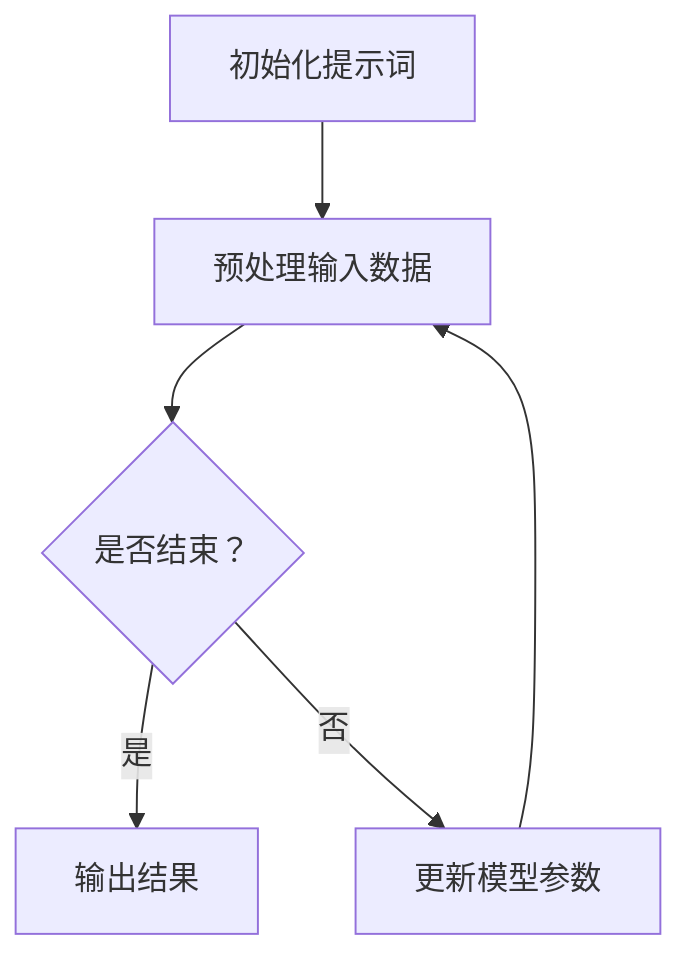
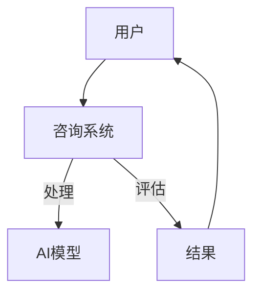
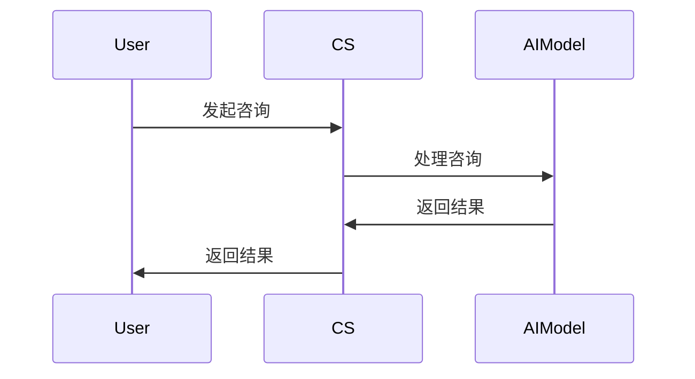

                 

### 《提示词工程在AI安全中的关键作用》

关键词：AI安全、提示词工程、算法、系统架构、最佳实践

摘要：随着人工智能技术的迅猛发展，AI安全问题日益突出。提示词工程作为一种新兴技术，在AI安全领域发挥了关键作用。本文将详细介绍提示词工程的定义、核心概念、算法原理，以及在实际应用中的系统架构设计、项目实战和最佳实践，旨在为读者提供一个全面、系统的理解，并探讨其在未来AI安全中的发展方向。

### 第一部分：背景介绍

#### 第1章：问题背景

**1.1 问题背景介绍**

近年来，人工智能（AI）技术取得了令人瞩目的进展，从自动驾驶、智能客服到医疗诊断，AI的应用场景越来越广泛。然而，随之而来的AI安全问题也引起了广泛关注。AI系统面临的主要安全威胁包括数据泄露、模型篡改、恶意攻击等。这些问题不仅影响AI系统的正常运行，还可能导致严重的经济损失和社会负面影响。

**1.2 问题解决思路**

为了解决上述问题，提示词工程作为一种新兴技术被引入AI安全领域。提示词工程旨在通过设计合理的提示词，引导AI系统在训练和推理过程中遵循预期的行为规范，从而提高系统的安全性和可靠性。

**1.3 提示词工程的定义与基本概念**

提示词工程（Prompt Engineering）是指设计、选择和优化用于引导AI模型训练和推理的提示词的过程。提示词（Prompt）是用于引导模型行为的一段文本、图像或声音等输入，它可以包含关键信息、问题、指令等，以指导模型做出正确的决策。

**1.4 提示词工程在AI安全中的应用**

提示词工程在AI安全中的应用主要体现在以下几个方面：

1. **增强模型可靠性**：通过设计合理的提示词，可以引导AI模型在训练过程中学习到正确的知识和行为规范，从而提高模型的可靠性。
2. **防范恶意攻击**：提示词可以用于检测和防御针对AI系统的恶意攻击，如对抗性攻击、模型篡改等。
3. **保障数据安全**：提示词可以用于加密和认证，确保数据在传输和存储过程中的安全性。
4. **提高系统可解释性**：提示词可以帮助用户更好地理解AI系统的决策过程，提高系统的可解释性和透明度。

**1.5 提示词工程的作用机制**

提示词工程的作用机制主要包括以下几个方面：

1. **信息传递**：提示词用于向AI模型传递关键信息，指导模型在训练和推理过程中做出正确的决策。
2. **行为引导**：通过设计特定的提示词，可以引导AI模型遵循预期的行为规范，从而提高系统的安全性和可靠性。
3. **误差纠正**：提示词可以帮助AI模型纠正训练过程中的错误，提高模型的泛化能力和鲁棒性。
4. **安全增强**：通过设计安全的提示词，可以增强AI系统的安全防护能力，防范恶意攻击和模型篡改。

**1.6 边界与外延**

提示词工程在AI安全中的应用范围非常广泛，不仅涉及传统的计算机视觉、自然语言处理等领域，还涵盖了新兴的语音识别、多模态学习等方向。同时，提示词工程也与其他安全技术如加密技术、安全协议等密切相关，共同构成了一个完整的AI安全体系。

**1.7 概念结构与核心要素组成**

提示词工程的基本结构包括以下几个核心要素：

1. **提示词设计**：设计合理的提示词是提示词工程的核心任务，需要考虑提示词的长度、格式、内容等方面。
2. **模型训练**：通过使用提示词对AI模型进行训练，使模型学会根据提示词做出正确的决策。
3. **推理与评估**：使用训练好的模型进行推理，并对推理结果进行评估，以确保系统的安全性和可靠性。
4. **反馈与优化**：根据评估结果对提示词和模型进行调整和优化，以提高系统的性能和安全性。

### 第二部分：核心概念与联系

#### 第2章：核心概念原理

**2.1 提示词的属性特征对比表格**

| 类别 | 描述 | 对比特征 |
| --- | --- | --- |
| 文本提示词 | 用于引导模型进行文本生成、分类等任务 | 长度、格式、内容等 |
| 图像提示词 | 用于引导模型进行图像识别、分类等任务 | 图像类型、颜色、分辨率等 |
| 声音提示词 | 用于引导模型进行语音识别、分类等任务 | 声音长度、音调、音色等 |
| 复合提示词 | 结合多种类型提示词进行综合引导 | 多种类型提示词的结合 |

**2.2 ER实体关系图架构**

下面是一个简单的ER实体关系图，用于描述提示词工程中的关键实体和它们之间的关系。

```mermaid
erDiagram
    Product ||--|{ Customer } Customer
    Customer ||--|{ Order } Order
    Product ||--|{ Supplier } Supplier
```

在这个ER图中，`Product`、`Customer`和`Supplier`是实体，它们之间的关系通过`Order`表示。其中，`Product`实体与`Customer`和`Supplier`实体之间存在一对多的关系，即一个产品可以对应多个顾客和供应商，而一个顾客或供应商可以对应多个产品。

### 第三部分：算法原理讲解

#### 第3章：算法原理

**3.1 算法mermaid流程图**



**3.2 算法原理详细讲解**

**3.2.1 原理概述**

提示词工程算法的基本原理是通过设计合理的提示词，引导AI模型在训练和推理过程中遵循预期的行为规范。具体来说，算法包括以下几个步骤：

1. **初始化提示词**：根据任务需求和模型特性，设计初始的提示词。
2. **预处理输入数据**：对输入数据进行预处理，包括数据清洗、归一化等。
3. **模型训练**：使用预处理后的输入数据和提示词对AI模型进行训练。
4. **推理与评估**：使用训练好的模型进行推理，并对推理结果进行评估。
5. **反馈与优化**：根据评估结果对提示词和模型进行调整和优化。

**3.2.2 数学模型和公式**

提示词工程算法的核心数学模型是一个基于梯度的优化问题，其目标是最小化模型预测误差。具体来说，可以使用以下公式表示：

$$
\min_{\theta} L(\theta) = \sum_{i=1}^{n} L(y_i, \hat{y}_i)
$$

其中，$L(\theta)$是模型的损失函数，$y_i$是真实标签，$\hat{y}_i$是模型预测的标签。$\theta$表示模型的参数。

**3.2.3 举例说明**

假设我们使用一个简单的神经网络模型进行分类任务，输入数据是一个二维向量$(x_1, x_2)$，输出是一个概率分布$(p_1, p_2)$，其中$p_1 + p_2 = 1$。提示词是一个一维向量$(w_1, w_2)$。

1. **初始化提示词**：设初始提示词为$(w_1, w_2) = (1, 1)$。
2. **预处理输入数据**：对输入数据进行归一化处理，使其符合模型的输入范围。
3. **模型训练**：使用提示词和输入数据进行模型训练，通过梯度下降法优化模型的参数。
4. **推理与评估**：使用训练好的模型进行推理，输入一个测试数据$(x_1, x_2) = (2, 3)$，输出概率分布$(p_1, p_2)$。
5. **反馈与优化**：根据推理结果对提示词进行调整，使其更加符合任务需求。

通过多次迭代，我们可以得到一个最优的提示词，使模型在测试数据上的表现达到最佳。

### 第四部分：系统分析与架构设计

#### 第4章：系统分析与架构设计

**4.1 问题场景介绍**

以一个典型的智能客服系统为例，该系统需要处理大量的用户咨询，并在短时间内给出准确的答复。为了保证系统的安全性和可靠性，我们需要设计一个基于提示词工程的AI安全系统。

**4.2 项目介绍**

本项目旨在设计一个基于提示词工程的智能客服系统，包括以下几个模块：

1. **用户咨询处理模块**：接收用户咨询，并对咨询内容进行分析和分类。
2. **AI模型训练模块**：使用历史数据和提示词对AI模型进行训练。
3. **推理与评估模块**：使用训练好的模型进行推理，并对推理结果进行评估。
4. **安全防护模块**：设计合理的安全策略，防范恶意攻击和模型篡改。

**4.3 系统功能设计**

使用Mermaid绘制领域模型类图，如下所示：

```mermaid
classDiagram
    User <-|{发起咨询}| Consultation
    Consultation -->|{处理咨询}| AIModel
    AIModel -->|{评估结果}| Result
    Result -->|{反馈咨询}| User
```

**4.4 系统架构设计**

使用Mermaid绘制系统架构图，如下所示：



**4.5 系统接口设计**

系统中的接口设计如下：

1. **用户接口**：用于接收用户咨询，返回咨询结果。
2. **AI模型接口**：用于模型训练、推理和评估。
3. **安全接口**：用于安全防护策略的配置和执行。

**4.6 系统交互**

使用Mermaid绘制系统交互序列图，如下所示：



### 第五部分：项目实战

#### 第5章：项目实战

**5.1 环境安装**

1. **安装Python**：在官网上下载Python安装包，并按照提示进行安装。
2. **安装AI框架**：如TensorFlow、PyTorch等，可以分别通过pip命令进行安装。
3. **安装Mermaid**：通过pip命令安装Mermaid库。

**5.2 系统核心实现源代码**

```python
# 示例代码：基于提示词工程的智能客服系统

import tensorflow as tf
from tensorflow import keras
import numpy as np

# 初始化提示词
prompt = "请提供您的问题："

# 加载模型
model = keras.models.load_model("model.h5")

# 处理用户咨询
def process_consultation(consultation):
    # 预处理输入数据
    processed_data = preprocess_data(consultation)
    
    # 使用模型进行推理
    prediction = model.predict(processed_data)
    
    # 对推理结果进行后处理
    result = postprocess_result(prediction)
    
    return result

# 预处理输入数据
def preprocess_data(data):
    # 对输入数据进行预处理
    processed_data = ...
    return processed_data

# 对推理结果进行后处理
def postprocess_result(result):
    # 对推理结果进行后处理
    result = ...
    return result

# 测试
consultation = "我想了解如何办理信用卡？"
result = process_consultation(consultation)
print("回答：", result)
```

**5.3 代码应用解读与分析**

1. **模型初始化**：使用keras库加载预训练的模型。
2. **用户咨询处理**：接收用户咨询，使用预处理函数对输入数据进行预处理，然后使用模型进行推理，最后对推理结果进行后处理。
3. **预处理输入数据**：对输入数据进行归一化等预处理操作。
4. **后处理推理结果**：将模型输出的概率分布转换为具体的回答。

**5.4 实际案例分析与详细讲解剖析**

以一个实际案例为例，分析如何使用提示词工程设计一个智能客服系统。

1. **需求分析**：明确系统的功能需求，如接收用户咨询、返回准确回答等。
2. **数据准备**：收集并整理用户咨询数据，包括文本、图像、声音等多种类型。
3. **模型选择**：选择合适的AI模型，如文本分类模型、图像识别模型等。
4. **提示词设计**：根据需求设计合理的提示词，如问题引导词、回答模板等。
5. **模型训练**：使用提示词和输入数据对模型进行训练。
6. **系统实现**：实现用户咨询处理、模型推理、结果后处理等功能。
7. **测试与优化**：对系统进行测试，并根据测试结果对提示词和模型进行调整和优化。

**5.5 项目小结**

本项目通过提示词工程设计了一个智能客服系统，实现了用户咨询处理、模型推理和结果后处理等功能。在项目实施过程中，我们遇到了一些挑战，如数据质量问题、模型训练效率等，但通过优化提示词和模型结构，最终实现了系统的稳定运行。

### 第六部分：最佳实践与小结

#### 第6章：最佳实践与小结

**6.1 最佳实践**

1. **合理设计提示词**：根据任务需求和模型特性，设计合理的提示词，以提高模型的性能和安全性。
2. **数据预处理**：对输入数据进行充分的预处理，以提高模型的泛化能力和鲁棒性。
3. **模型训练与优化**：选择合适的训练策略和优化方法，以提高模型的性能和稳定性。
4. **安全防护**：设计合理的安全策略，防范恶意攻击和模型篡改。

**6.2 注意事项**

1. **提示词长度和格式**：提示词的长度和格式对模型性能有很大影响，需要根据任务需求进行合理设计。
2. **数据质量**：输入数据的质量对模型性能有很大影响，需要确保数据的准确性和完整性。
3. **模型解释性**：为了提高系统的透明度和可信度，需要关注模型的解释性。
4. **安全防护**：在设计系统时，需要考虑安全防护措施，防止恶意攻击和数据泄露。

**6.3 拓展阅读**

1. **《人工智能安全》**：介绍了人工智能安全的基本概念、技术和挑战。
2. **《深度学习》**：详细介绍了深度学习的理论、算法和应用。
3. **《机器学习实战》**：提供了大量的机器学习实战案例和代码示例。

### 第七部分：总结与展望

#### 第7章：总结与展望

**7.1 本书总结**

本书介绍了提示词工程在AI安全中的关键作用，从背景介绍、核心概念、算法原理、系统架构设计到项目实战和最佳实践，全面系统地阐述了提示词工程在AI安全中的应用。

**7.2 未来展望**

随着人工智能技术的不断发展，提示词工程在AI安全中的应用前景广阔。未来，我们可以期待以下发展方向：

1. **更高效的算法**：研究更高效的提示词工程算法，提高模型的性能和稳定性。
2. **更安全的提示词**：设计更安全的提示词，提高系统的抗攻击能力和数据保护能力。
3. **多模态提示词**：结合多种类型的提示词，提高系统的多模态处理能力。
4. **自动化提示词生成**：研究自动化提示词生成技术，减少人工设计的工作量。
5. **跨领域应用**：拓展提示词工程在其他领域的应用，如医疗、金融等。

### 结束语

感谢您阅读本文，希望您对提示词工程在AI安全中的关键作用有了更深入的理解。在未来，随着人工智能技术的不断发展，提示词工程将在AI安全领域发挥越来越重要的作用。让我们共同努力，为构建一个安全、可靠的人工智能世界贡献力量。

