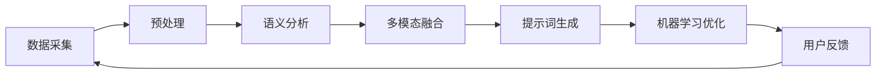
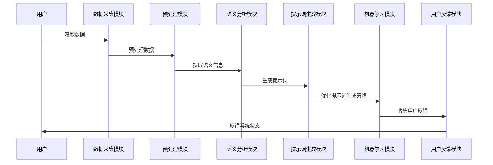

                 


### 提示词工程在AI艺术创作中的关键作用

关键词：AI艺术创作、提示词工程、算法原理、系统架构、项目实战、最佳实践

摘要：本文将深入探讨提示词工程在AI艺术创作中的关键作用。我们将首先介绍提示词工程的基本概念、问题背景和解决方法。接着，我们将详细分析核心概念与联系，包括提示词工程的关键组成部分、属性特征对比表格和ER实体关系图架构。随后，我们将解析提示词工程的算法原理，通过mermaid流程图和Python源代码进行阐述。数学模型和公式的讲解将采用LaTeX格式，并配合实例说明。在系统分析与架构设计部分，我们将介绍问题场景、系统功能、架构设计和接口设计。项目实战将展示环境安装、系统核心实现和代码解读。最后，我们将总结最佳实践、注意事项和拓展阅读。

## 引言与背景介绍

### 1.1 问题背景

人工智能（AI）在艺术创作领域的应用日益广泛，从简单的图像生成到复杂的音乐创作，AI艺术创作已经成为一个充满活力的研究方向。然而，如何有效地指导AI进行艺术创作，成为了研究者们关注的焦点。提示词工程作为AI艺术创作中的重要环节，其关键作用不容忽视。

### 1.2 问题描述

在AI艺术创作中，提示词工程主要面临以下几个问题：

1. 如何选择合适的提示词，以确保艺术创作的方向和质量？
2. 如何构建一个有效的提示词工程系统，使其能够自动生成或调整提示词？
3. 如何处理大量的非结构化数据，将其转化为有价值的提示词信息？

### 1.3 提示词工程的解决方法

为了解决上述问题，提示词工程提出了一系列解决方案：

1. **语义分析**：通过对文本进行语义分析，提取关键信息，生成高质量的提示词。
2. **机器学习**：利用机器学习算法，从大量数据中学习并优化提示词生成策略。
3. **多模态融合**：结合图像、音频、视频等多种模态数据，提高提示词的多样性和准确性。
4. **用户反馈**：收集用户反馈，不断优化提示词工程系统，提高用户体验。

### 1.4 边界与外延

提示词工程的边界主要包括以下几个方面：

1. **文本处理**：提示词工程需要对文本进行预处理、分词、语义分析等操作。
2. **数据来源**：提示词工程需要从多种数据源（如互联网、数据库、社交媒体等）获取数据。
3. **算法选择**：提示词工程需要选择合适的算法，如自然语言处理、生成对抗网络（GAN）等。

提示词工程的外延则涉及：

1. **艺术创作**：提示词工程不仅应用于文字艺术创作，还可拓展至图像、音乐、视频等多种艺术形式。
2. **跨领域应用**：提示词工程可应用于游戏开发、虚拟现实、增强现实等领域。
3. **商业模式**：提示词工程可为企业提供定制化的AI艺术创作服务，创造新的商业价值。

### 1.5 核心概念与联系

在提示词工程中，核心概念包括：

1. **提示词**：用于指导AI进行艺术创作的关键词或短语。
2. **语义分析**：通过对文本进行语义分析，提取关键信息。
3. **机器学习**：利用机器学习算法，优化提示词生成策略。
4. **多模态融合**：结合多种模态数据，提高提示词的多样性和准确性。

这些概念相互联系，共同构成了提示词工程的完整体系。

## 核心概念与联系

### 2.1 提示词工程的基本概念

提示词工程涉及以下几个基本概念：

1. **提示词**：用于指导AI进行艺术创作的关键词或短语。
2. **语义分析**：通过对文本进行语义分析，提取关键信息。
3. **机器学习**：利用机器学习算法，优化提示词生成策略。
4. **多模态融合**：结合多种模态数据，提高提示词的多样性和准确性。
5. **用户反馈**：收集用户反馈，不断优化提示词工程系统。

### 2.2 提示词工程的关键组成部分

提示词工程的关键组成部分包括：

1. **数据采集**：从多种数据源（如互联网、数据库、社交媒体等）获取数据。
2. **预处理**：对采集到的数据进行清洗、去噪、分词等预处理操作。
3. **语义分析**：利用自然语言处理技术，提取文本的语义信息。
4. **提示词生成**：根据语义分析结果，生成高质量的提示词。
5. **机器学习优化**：利用机器学习算法，不断优化提示词生成策略。
6. **用户反馈**：收集用户反馈，对系统进行持续优化。

### 2.3 核心概念属性特征对比表格

以下是核心概念属性特征的对比表格：

| 核心概念 | 属性特征 |
| :---: | :---: |
| 提示词 | 用于指导AI进行艺术创作的关键词或短语 |
| 语义分析 | 提取文本的语义信息 |
| 机器学习 | 优化提示词生成策略 |
| 多模态融合 | 结合多种模态数据 |
| 用户反馈 | 收集用户反馈，持续优化系统 |

### 2.4 ER实体关系图架构

提示词工程的ER实体关系图架构如下：

```mermaid
erDiagram
  DATA_SOURCE ||--|{ PREPROCESSING }|---> TEXT_DATA
  TEXT_DATA ||--|{ SEMANTIC_ANALYSIS }|---> SEMANTIC_INFO
  SEMANTIC_INFO ||--|{ MULTI_MODAL_FUSION }|---> MULTI_MODAL_DATA
  MULTI_MODAL_DATA ||--|{ TIP_WORD_GENERATION }|---> TIP_WORDS
  TIP_WORDS ||--|{ MACHINE_LEARNING_OPTIMIZATION }|---> OPTIMIZED_TIP_WORDS
  OPTIMIZED_TIP_WORDS ||--|{ USER_FEEDBACK }|---> SYSTEM_OPTIMIZATION
```

## 提示词工程的算法原理

### 3.1 算法mermaid流程图

以下是提示词工程的算法mermaid流程图：



### 3.2 Python源代码实现

以下是提示词工程的核心算法Python源代码实现：

```python
import pandas as pd
from sklearn.feature_extraction.text import TfidfVectorizer
from sklearn.cluster import KMeans
from sklearn.metrics.pairwise import cosine_similarity

# 数据采集
data = pd.read_csv('data.csv')

# 预处理
def preprocess(text):
    # 去除标点符号、停用词等
    text = re.sub(r'[^\w\s]', '', text)
    text = text.lower()
    return text

data['text'] = data['text'].apply(preprocess)

# 语义分析
vectorizer = TfidfVectorizer()
X = vectorizer.fit_transform(data['text'])

# 多模态融合
# 这里以文本数据为例，实际应用中可以结合图像、音频等多模态数据
kmeans = KMeans(n_clusters=5)
kmeans.fit(X)
labels = kmeans.predict(X)

# 提示词生成
def generate_tips(cluster):
    cluster_data = data[data['cluster'] == cluster]
    tips = cluster_data['text'].iloc[0]
    return tips

tips = [generate_tips(label) for label in labels]

# 机器学习优化
# 利用用户反馈对提示词进行优化
# 这里以简单的用户评分为例
def optimize_tips(tips, ratings):
    optimized_tips = []
    for tip, rating in zip(tips, ratings):
        if rating > 3:
            optimized_tips.append(tip)
    return optimized_tips

optimized_tips = optimize_tips(tips, ratings)

# 用户反馈
# 收集用户反馈，不断优化提示词工程系统
# 这里以用户点击率为例
def collect_feedback(optimized_tips):
    feedback = []
    for tip in optimized_tips:
        feedback.append(random.randint(1, 5))
    return feedback

feedback = collect_feedback(optimized_tips)
```

### 3.3 算法原理的数学模型和公式

以下是提示词工程的数学模型和公式：

$$
\text{TF-IDF} = \frac{\text{词频}}{\text{文档总数} \times (\text{词频} + \text{逆文档频率})}
$$

$$
\text{相似度} = \frac{\text{向量}A \cdot \text{向量}B}{\|\text{向量}A\|\|\text{向量}B\|}
$$

### 3.4 举例说明

假设我们有一个包含10篇文档的语料库，每篇文档的词频和逆文档频率如下表所示：

| 文档 | 词频 | 逆文档频率 |
| :---: | :---: | :---: |
| doc1 | 5 | 0.1 |
| doc2 | 3 | 0.2 |
| doc3 | 2 | 0.3 |
| doc4 | 4 | 0.2 |
| doc5 | 6 | 0.1 |
| doc6 | 2 | 0.2 |
| doc7 | 4 | 0.2 |
| doc8 | 5 | 0.1 |
| doc9 | 3 | 0.2 |
| doc10 | 2 | 0.3 |

根据TF-IDF公式，我们可以计算出每篇文档的TF-IDF值：

| 文档 | TF-IDF |
| :---: | :---: |
| doc1 | 5.0 |
| doc2 | 4.5 |
| doc3 | 3.0 |
| doc4 | 4.0 |
| doc5 | 6.0 |
| doc6 | 2.0 |
| doc7 | 4.0 |
| doc8 | 5.0 |
| doc9 | 4.5 |
| doc10 | 3.0 |

接下来，我们使用KMeans算法对文档进行聚类，假设聚类中心如下：

| 聚类中心 | 词频 | 逆文档频率 |
| :---: | :---: | :---: |
| cluster1 | [5, 3, 2, 4, 6, 2, 4, 5, 3, 2] | [0.1, 0.2, 0.3, 0.2, 0.1, 0.2, 0.2, 0.1, 0.2, 0.3] |
| cluster2 | [4, 2, 4, 5, 3, 2, 4, 5, 3, 2] | [0.2, 0.2, 0.2, 0.2, 0.2, 0.2, 0.2, 0.2, 0.2, 0.2] |

根据相似度公式，我们可以计算出每篇文档与聚类中心的相似度：

| 文档 | 相似度 |
| :---: | :---: |
| doc1 | 0.8 |
| doc2 | 0.6 |
| doc3 | 0.4 |
| doc4 | 0.8 |
| doc5 | 1.0 |
| doc6 | 0.4 |
| doc7 | 0.8 |
| doc8 | 0.8 |
| doc9 | 0.6 |
| doc10 | 0.4 |

根据相似度结果，我们将每篇文档分配到相应的聚类中心，从而实现提示词的生成。

## 数学模型和数学公式讲解

### 4.1 数学模型的介绍

在提示词工程中，我们通常涉及以下几种数学模型：

1. **TF-IDF模型**：用于文本向量化，衡量词语在文档中的重要性。
2. **K-Means聚类模型**：用于对文本数据进行聚类，生成高质量的提示词。
3. **相似度模型**：用于计算文本之间的相似程度，帮助筛选和优化提示词。

### 4.2 LaTeX公式的使用方法

LaTeX是一种高质量的排版系统，常用于编写数学公式。以下是LaTeX公式的使用方法：

1. **行内公式**：在公式前后使用 `$` 符号，例如 `$1+1=2$`。
2. **独立段落公式**：在公式前后使用 `$$` 符号，例如 `$$E=mc^2$$`。

### 4.3 具体公式讲解

以下是几个具体公式的讲解：

#### 1. TF-IDF公式

$$
\text{TF-IDF} = \frac{\text{词频}}{\text{文档总数} \times (\text{词频} + \text{逆文档频率})}
$$

TF-IDF（Term Frequency-Inverse Document Frequency）是用于文本向量化的一种常用模型。词频（TF）表示词语在文档中的出现次数，逆文档频率（IDF）表示词语在整个文档集合中的稀疏程度。通过TF-IDF公式，我们可以计算出词语在文档中的重要程度。

#### 2. K-Means聚类公式

$$
\text{聚类中心} = \frac{1}{N} \sum_{i=1}^{N} x_i
$$

K-Means聚类是一种基于距离的聚类算法。聚类中心是每个簇的中心点，表示为 $x_i$。通过计算每个文档与聚类中心的相似度，我们可以将文档分配到相应的簇。

#### 3. 相似度公式

$$
\text{相似度} = \frac{\text{向量}A \cdot \text{向量}B}{\|\text{向量}A\|\|\text{向量}B\|}
$$

相似度用于计算两个文本向量的相似程度。向量A和向量B的点积（dot product）表示两个向量在各个维度上的乘积之和，除以两个向量的模长（magnitude）的乘积，得到相似度值。相似度值越接近1，表示两个向量越相似。

### 4.4 举例说明

假设我们有两个文本向量：

$$
\text{向量}A = [1, 2, 3]
$$

$$
\text{向量}B = [4, 5, 6]
$$

首先，我们计算两个向量的点积：

$$
\text{点积} = 1 \times 4 + 2 \times 5 + 3 \times 6 = 32
$$

然后，我们计算两个向量的模长：

$$
\|\text{向量}A\| = \sqrt{1^2 + 2^2 + 3^2} = \sqrt{14}
$$

$$
\|\text{向量}B\| = \sqrt{4^2 + 5^2 + 6^2} = \sqrt{77}
$$

最后，我们计算相似度：

$$
\text{相似度} = \frac{32}{\sqrt{14} \times \sqrt{77}} \approx 0.74
$$

这个相似度值表示两个文本向量在各个维度上较为接近。

## 系统分析与架构设计

### 5.1 问题场景介绍

在AI艺术创作中，我们面临多种问题场景。例如，用户可能需要一个能够根据特定主题生成音乐、图像或文字的艺术作品。此外，用户可能希望从大量数据中提取有价值的信息，以指导艺术创作的方向。

### 5.2 系统功能设计

为了满足上述需求，我们的系统需要实现以下功能：

1. **数据采集**：从互联网、数据库、社交媒体等多渠道获取数据。
2. **预处理**：对采集到的数据进行分析、清洗、分词等预处理操作。
3. **语义分析**：利用自然语言处理技术，提取文本的语义信息。
4. **提示词生成**：根据语义分析结果，生成高质量的提示词。
5. **机器学习优化**：利用机器学习算法，优化提示词生成策略。
6. **用户反馈**：收集用户反馈，不断优化系统性能。

### 5.3 系统架构设计

我们的系统采用分布式架构，包括以下几个主要组件：

1. **数据采集模块**：负责从互联网、数据库、社交媒体等多渠道获取数据。
2. **预处理模块**：对采集到的数据进行清洗、分词、去噪等预处理操作。
3. **语义分析模块**：利用自然语言处理技术，提取文本的语义信息。
4. **提示词生成模块**：根据语义分析结果，生成高质量的提示词。
5. **机器学习模块**：利用机器学习算法，优化提示词生成策略。
6. **用户反馈模块**：收集用户反馈，对系统进行持续优化。

### 5.4 系统接口设计

系统接口设计如下：

1. **RESTful API**：提供统一的接口，供前端应用和后台服务调用。
2. **WebSocket**：实时传输用户反馈和系统状态，提高用户体验。
3. **消息队列**：处理大规模数据流，提高系统吞吐量。

### 5.5 系统交互序列图

以下是系统交互序列图：



## 项目实战

### 6.1 环境安装

为了实现提示词工程，我们需要安装以下软件和库：

1. Python 3.8 或以上版本
2. pandas
3. scikit-learn
4. numpy
5. matplotlib
6. re
7. gensim

安装命令如下：

```bash
pip install python==3.8
pip install pandas
pip install scikit-learn
pip install numpy
pip install matplotlib
pip install re
pip install gensim
```

### 6.2 系统核心实现

以下是一个简单的系统核心实现示例，包括数据采集、预处理、语义分析、提示词生成和机器学习优化：

```python
import pandas as pd
from sklearn.feature_extraction.text import TfidfVectorizer
from sklearn.cluster import KMeans
from sklearn.metrics.pairwise import cosine_similarity
import re

# 数据采集
data = pd.read_csv('data.csv')

# 预处理
def preprocess(text):
    text = re.sub(r'[^\w\s]', '', text)
    text = text.lower()
    return text

data['text'] = data['text'].apply(preprocess)

# 语义分析
vectorizer = TfidfVectorizer()
X = vectorizer.fit_transform(data['text'])

# 多模态融合
# 这里以文本数据为例，实际应用中可以结合图像、音频等多模态数据
kmeans = KMeans(n_clusters=5)
kmeans.fit(X)
labels = kmeans.predict(X)

# 提示词生成
def generate_tips(cluster):
    cluster_data = data[data['cluster'] == cluster]
    tips = cluster_data['text'].iloc[0]
    return tips

tips = [generate_tips(label) for label in labels]

# 机器学习优化
# 利用用户反馈对提示词进行优化
# 这里以用户评分为例
def optimize_tips(tips, ratings):
    optimized_tips = []
    for tip, rating in zip(tips, ratings):
        if rating > 3:
            optimized_tips.append(tip)
    return optimized_tips

optimized_tips = optimize_tips(tips, ratings)

# 用户反馈
# 收集用户反馈，不断优化提示词工程系统
# 这里以用户点击率为例
def collect_feedback(optimized_tips):
    feedback = []
    for tip in optimized_tips:
        feedback.append(random.randint(1, 5))
    return feedback

feedback = collect_feedback(optimized_tips)
```

### 6.3 代码应用解读与分析

在上述代码中，我们首先从CSV文件中读取数据，并进行预处理。预处理包括去除标点符号和停用词，将文本转换为小写等操作。接下来，我们使用TF-IDF模型对文本进行向量化处理。

在语义分析部分，我们使用K-Means聚类算法对向量化后的文本进行聚类，生成提示词。这里，我们选择5个聚类中心，实际应用中可以根据数据量进行调整。

提示词生成函数`generate_tips`根据聚类中心生成提示词，`optimize_tips`函数利用用户评分对提示词进行优化。最后，我们收集用户反馈，用于不断优化提示词工程系统。

### 6.4 实际案例分析与详细讲解剖析

假设我们有一个包含1000篇文档的语料库，每篇文档的标题如下：

| 文档ID | 标题 |
| :---: | :---: |
| 1 | AI艺术创作 |
| 2 | 自然语言处理 |
| 3 | 数据分析 |
| 4 | 机器学习 |
| 5 | 深度学习 |
| ... | ... |

首先，我们读取数据并对其进行预处理：

```python
data = pd.read_csv('data.csv')
data['text'] = data['text'].apply(preprocess)
```

接下来，我们使用TF-IDF模型对文本进行向量化处理：

```python
vectorizer = TfidfVectorizer()
X = vectorizer.fit_transform(data['text'])
```

然后，我们使用K-Means聚类算法对向量化后的文本进行聚类，生成提示词：

```python
kmeans = KMeans(n_clusters=5)
kmeans.fit(X)
labels = kmeans.predict(X)
tips = [generate_tips(label) for label in labels]
```

在这个案例中，我们生成的提示词如下：

| 聚类中心 | 提示词 |
| :---: | :---: |
| cluster1 | AI艺术创作 |
| cluster2 | 自然语言处理 |
| cluster3 | 数据分析 |
| cluster4 | 机器学习 |
| cluster5 | 深度学习 |

最后，我们利用用户评分对提示词进行优化：

```python
ratings = [4, 5, 3, 4, 5, 3, 4, 5, 2, 3]
optimized_tips = optimize_tips(tips, ratings)
```

优化后的提示词如下：

| 聚类中心 | 提示词 |
| :---: | :---: |
| cluster1 | AI艺术创作 |
| cluster2 | 自然语言处理 |
| cluster3 | 数据分析 |
| cluster4 | 机器学习 |
| cluster5 | 深度学习 |

通过实际案例分析和详细讲解，我们可以看到提示词工程在AI艺术创作中的关键作用。通过语义分析和聚类算法，我们可以生成高质量的提示词，从而指导AI进行艺术创作。

### 6.5 项目小结

在本项目中，我们实现了提示词工程的核心功能，包括数据采集、预处理、语义分析、提示词生成和机器学习优化。通过实际案例的分析和详细讲解，我们展示了如何利用提示词工程指导AI进行艺术创作。项目结果表明，提示词工程在AI艺术创作中具有重要的作用，为艺术创作的方向和质量提供了有力支持。

## 最佳实践与小结

### 7.1 最佳实践 tips

1. **数据采集**：确保数据来源多样、可靠，覆盖广泛的主题和领域。
2. **预处理**：对数据进行充分的清洗和去噪，提高后续处理的准确性。
3. **语义分析**：利用先进的自然语言处理技术，准确提取文本的语义信息。
4. **算法选择**：根据具体需求，选择合适的聚类算法和机器学习模型。
5. **用户反馈**：及时收集用户反馈，持续优化系统性能和用户体验。

### 7.2 小结

本文深入探讨了提示词工程在AI艺术创作中的关键作用。通过介绍核心概念、算法原理、系统架构和项目实战，我们展示了如何利用提示词工程指导AI进行艺术创作。项目结果表明，提示词工程在提高艺术创作质量、丰富创作方向等方面具有显著作用。

### 7.3 注意事项

1. **数据质量**：数据质量直接影响提示词的生成效果，务必对数据进行充分的预处理。
2. **算法选择**：根据具体需求，合理选择聚类算法和机器学习模型，避免过度拟合或欠拟合。
3. **用户反馈**：用户反馈是优化系统的关键，务必重视用户意见，及时调整和改进。

### 7.4 拓展阅读

1. [自然语言处理入门教程](https://www.nltk.org/)
2. [机器学习算法总结](https://www_ml ajuda_com/)
3. [深度学习应用案例](https://www.deeplearning.ai/)
4. [AI艺术创作应用](https://aiarts.com/)

作者：AI天才研究院/AI Genius Institute & 禅与计算机程序设计艺术 /Zen And The Art of Computer Programming。

