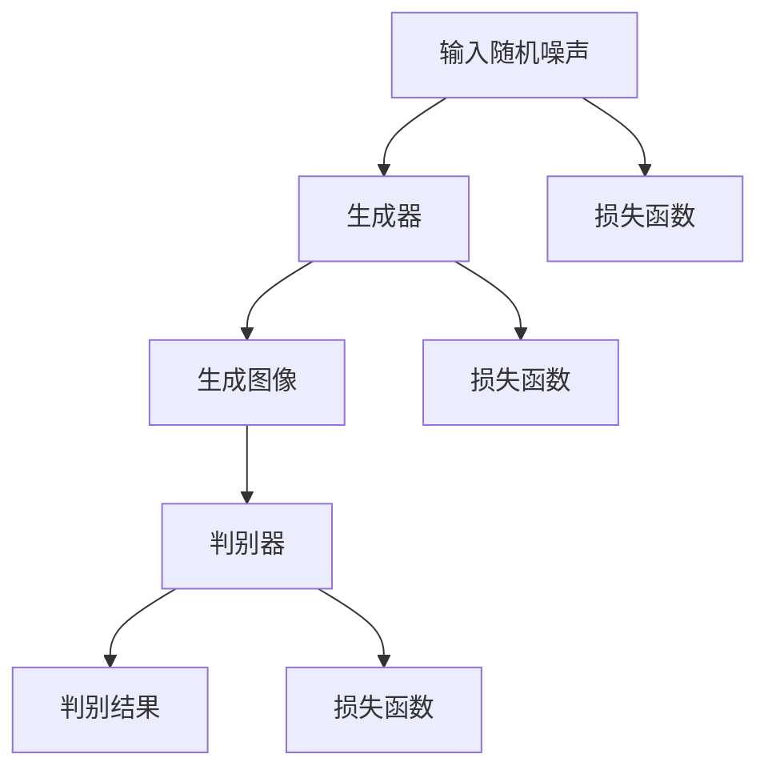
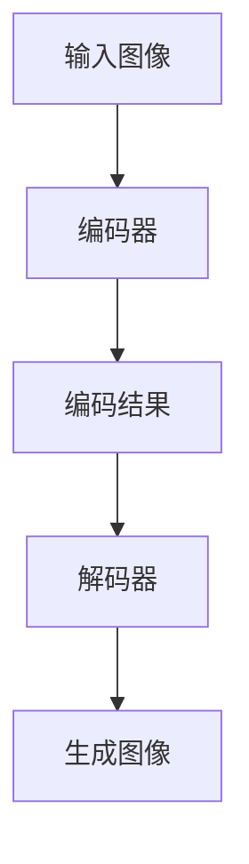
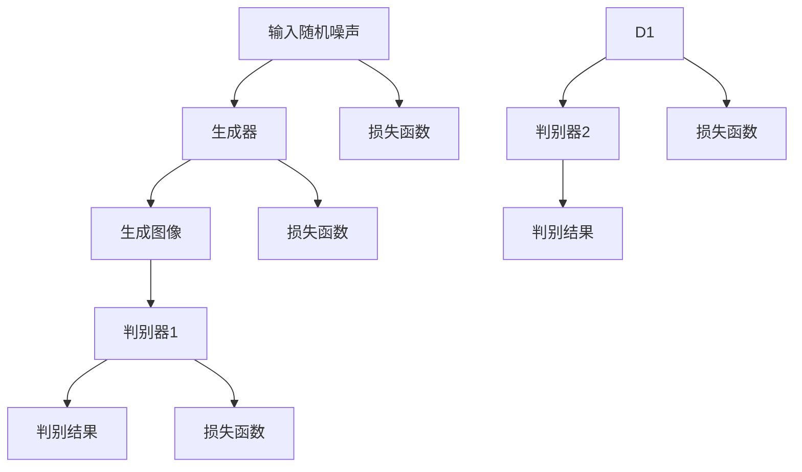
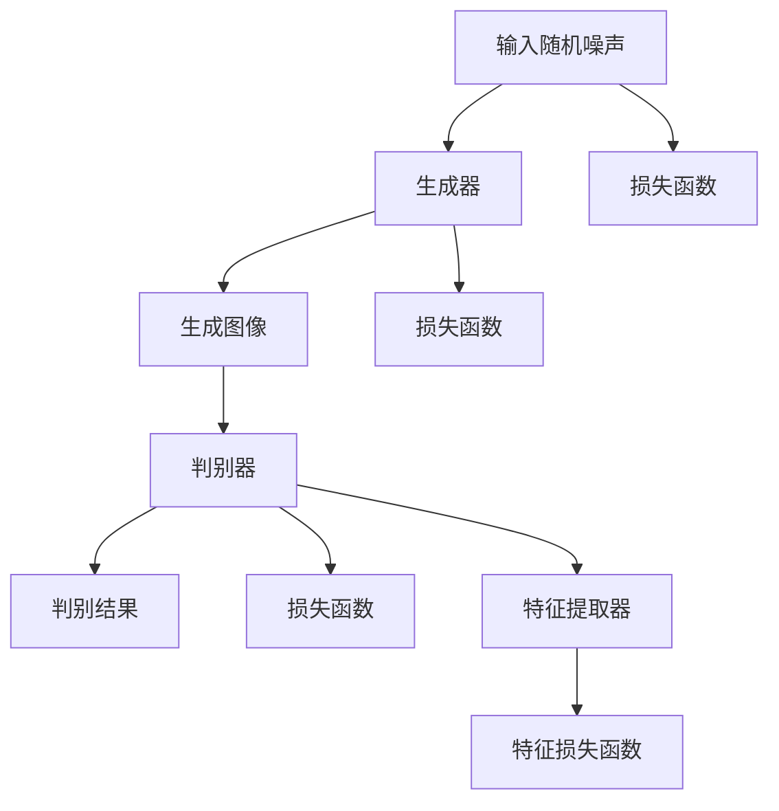
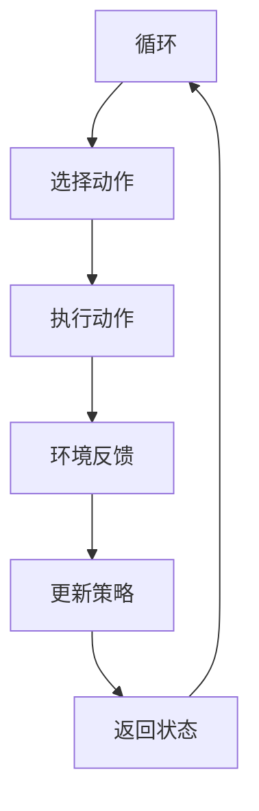
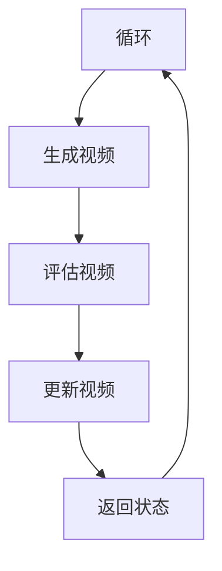
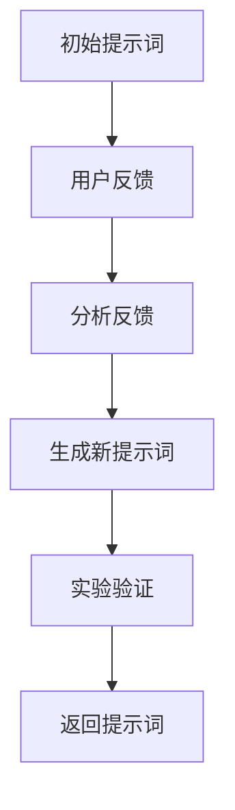

                 

## 第一步：定义问题

### 1.1 问题背景

在当今数字化时代，人工智能（AI）已经成为改变各行各业的强大力量。特别是AI在艺术创作领域的应用，逐渐成为学术界和产业界关注的焦点。随着深度学习、生成对抗网络（GAN）和强化学习等技术的不断进步，AI在图像、音乐、视频等多种艺术形式中展现出了惊人的创造力。

然而，尽管AI在艺术创作中已经取得了显著的进展，但如何有效地利用AI技术进行艺术创作，如何让AI成为艺术创作中的得力助手，依然是一个亟待解决的问题。在这个过程中，提示词工程（Prompt Engineering）作为一种关键技术，其在AI艺术创作中的角色和作用显得尤为重要。

### 1.2 问题描述

《提示词工程在AI艺术创作中的角色》这本书旨在探讨提示词工程在AI艺术创作中的应用，通过深入研究提示词工程的理论和实践，为读者提供一套系统的、易于操作的AI艺术创作方法论。具体来说，本书将解决以下几个关键问题：

1. **核心概念**：介绍AI艺术创作中的基本概念，如生成模型、对抗性网络、强化学习等。
2. **提示词工程**：阐述提示词工程的基本原理，以及如何通过提示词来引导和优化AI艺术创作过程。
3. **实践案例**：通过具体案例，展示提示词工程在AI艺术创作中的实际应用。
4. **优化策略**：讨论如何通过改进提示词工程，提升AI艺术创作的质量和效率。

### 1.3 问题解决

本书将从以下几个方面展开讨论：

1. **生成模型**：介绍生成模型的基本概念、原理和应用，包括生成对抗网络（GAN）和变分自编码器（VAE）等。
2. **对抗性网络**：探讨对抗性网络的工作原理、结构及其在AI艺术创作中的应用。
3. **强化学习**：介绍强化学习的基本概念、原理和应用，以及如何在AI艺术创作中使用强化学习。
4. **提示词工程**：阐述提示词工程的基本原理，如何设计有效的提示词，以及如何通过提示词来引导和优化AI艺术创作过程。

### 1.4 边界与外延

本书主要关注的是提示词工程在AI艺术创作中的应用，但这一方法也可以拓展到其他领域，如游戏设计、虚拟现实等。同时，本书还将探讨如何通过改进提示词工程，提升AI艺术创作的质量和效率。

### 1.5 概念结构与核心要素组成

为了更清晰地理解提示词工程在AI艺术创作中的角色，我们将从以下几个核心概念和要素进行探讨：

1. **生成模型**：作为AI艺术创作的基础，生成模型如GAN和VAE等，在艺术创作中扮演着至关重要的角色。
2. **对抗性网络**：对抗性网络通过生成器和判别器的博弈，提高AI的创造力和多样性。
3. **强化学习**：强化学习通过不断试错，优化AI的艺术创作策略。
4. **提示词工程**：通过设计有效的提示词，引导AI进行艺术创作，提高艺术创作的质量和效率。

### 1.6 文章结构

本文将按照以下结构进行展开：

1. **引言**：介绍AI艺术创作的背景和问题，引出本书的主题。
2. **核心概念与原理**：详细探讨生成模型、对抗性网络、强化学习和提示词工程等核心概念和原理。
3. **实践案例**：通过具体案例展示提示词工程在AI艺术创作中的应用。
4. **优化策略**：讨论如何通过改进提示词工程，提升AI艺术创作的质量和效率。
5. **总结与展望**：对全文内容进行总结，并对未来研究方向进行展望。

### 1.7 完整性要求

为了确保文章的完整性，每个小节的内容将满足以下要求：

1. **背景介绍**：详细介绍核心概念术语、问题背景、问题描述、问题解决、边界与外延、概念结构与核心要素组成。
2. **核心概念与联系**：给出核心概念原理、概念属性特征对比表格和ER实体关系图架构的Mermaid流程图。
3. **算法原理讲解**：使用Mermaid画出算法流程图，并使用Python源代码进行详细讲解，包括算法原理的数学模型和公式，并进行通俗易懂的举例说明。
4. **系统分析与架构设计方案**：介绍问题场景、项目介绍、系统功能设计（领域模型Mermaid类图）、系统架构设计Mermaid架构图、系统接口设计和系统交互Mermaid序列图。
5. **项目实战**：包括环境安装、系统核心实现源代码，代码应用解读与分析，实际案例分析和详细讲解剖析，项目小结。
6. **最佳实践 tips、小结、注意事项、拓展阅读**等内容。

通过上述结构，本文将全面、系统地探讨提示词工程在AI艺术创作中的角色，为读者提供有深度、有思考、有见解的技术博客文章。

### 第二步：理解核心概念

在探讨提示词工程在AI艺术创作中的角色之前，我们需要首先理解一些核心概念，如生成模型、对抗性网络、强化学习等。这些概念是AI艺术创作的基础，也是提示词工程发挥作用的前提。

#### 2.1 生成模型

生成模型（Generative Model）是一类用于生成数据分布的机器学习模型。其核心目标是学习数据的生成过程，从而生成与训练数据分布相似的新数据。生成模型在图像、音乐、视频等多种艺术形式中有着广泛的应用。

生成模型主要包括以下几种：

1. **生成对抗网络（GAN）**：GAN由生成器和判别器两个神经网络组成。生成器的任务是生成尽可能逼真的数据，而判别器的任务是区分生成数据与真实数据。通过这种对抗性训练，生成器会逐渐提高其生成质量。
2. **变分自编码器（VAE）**：VAE通过引入概率编码，将数据的特征转换为概率分布，从而实现数据的生成。VAE在生成高质量数据的同时，能够保留数据的结构信息。

#### 2.2 对抗性网络

对抗性网络（Adversarial Network）是一类基于博弈思想的神经网络模型。其核心思想是通过生成器和判别器的对抗性训练，提高模型的性能。在对抗性网络中，生成器和判别器相互博弈，生成器的目标是生成难以区分的样本，而判别器的目标是提高对真实数据和生成数据的识别能力。

对抗性网络主要包括以下几种：

1. **生成对抗网络（GAN）**：上文已详细介绍。
2. **自对抗网络（SAGAN）**：SAGAN是一种改进的GAN模型，通过引入多个判别器和跳跃连接，进一步提高生成质量和稳定性。
3. **基于信息论的对抗性网络（InfoGAN）**：InfoGAN通过引入信息论的概念，将生成模型与特征分离，从而提高生成样本的质量。

#### 2.3 强化学习

强化学习（Reinforcement Learning）是一种通过不断试错，从环境中学习最优策略的机器学习方法。在强化学习中，智能体（Agent）通过与环境的交互，不断调整其行为策略，以实现长期最大化奖励。

强化学习主要包括以下几种：

1. **基于价值函数的方法**：如Q学习、SARSA、Deep Q Network（DQN）等。这些方法通过学习状态-动作价值函数，确定最优动作策略。
2. **基于策略的方法**：如Policy Gradient、Actor-Critic等。这些方法直接学习策略函数，从而确定最优动作策略。

#### 2.4 提示词工程

提示词工程（Prompt Engineering）是一种通过设计有效的提示词，引导和优化AI模型输出的技术。在AI艺术创作中，提示词用于引导生成模型、对抗性网络和强化学习等算法，使其生成符合用户需求的艺术作品。

提示词工程主要包括以下方面：

1. **提示词设计**：设计有效的提示词，需要理解用户需求，并将这些需求转化为具体的语言或符号，以引导AI模型生成艺术作品。
2. **提示词优化**：通过不断调整和优化提示词，提高AI模型的生成质量和效率。

### 2.5 核心概念属性特征对比

为了更好地理解这些核心概念，我们可以通过一个表格对比它们的主要属性特征：

| 概念       | 定义                                                         | 属性特征对比 |
| ---------- | ------------------------------------------------------------ | ------------ |
| 生成模型   | 学习数据分布，生成新数据                                     | GAN：对抗训练，生成高质量样本；VAE：概率编码，保留数据结构信息 |
| 对抗性网络 | 通过生成器和判别器的对抗性训练，提高模型性能                 | GAN：生成器和判别器的博弈；SAGAN：多判别器、跳跃连接；InfoGAN：信息论、特征分离 |
| 强化学习   | 通过智能体与环境的交互，学习最优策略                         | Q学习：状态-动作价值函数；Policy Gradient：策略函数；Actor-Critic：双网络结构 |
| 提示词工程 | 通过设计有效的提示词，引导和优化AI模型输出                   | 提示词设计：理解用户需求；提示词优化：调整和优化提示词 |

### 2.6 ER实体关系图架构

为了更直观地展示这些核心概念之间的关系，我们可以使用Mermaid绘制一个ER实体关系图：

```mermaid
erDiagram
  AI艺术创作 ||--|{ 生成模型 }
  AI艺术创作 ||--|{ 对抗性网络 }
  AI艺术创作 ||--|{ 强化学习 }
  AI艺术创作 ||--|{ 提示词工程 }
  生成模型 ||--|{ GAN }
  生成模型 ||--|{ VAE }
  对抗性网络 ||--|{ GAN }
  对抗性网络 ||--|{ SAGAN }
  对抗性网络 ||--|{ InfoGAN }
  强化学习 ||--|{ Q学习 }
  强化学习 ||--|{ Policy Gradient }
  强化学习 ||--|{ Actor-Critic }
  提示词工程 ||--|{ 提示词设计 }
  提示词工程 ||--|{ 提示词优化 }
```

通过上述分析，我们可以对生成模型、对抗性网络、强化学习和提示词工程等核心概念有更深入的理解。这些概念不仅是AI艺术创作的基础，也是提示词工程发挥作用的关键。接下来，我们将进一步探讨这些概念在AI艺术创作中的具体应用。

### 第三步：生成模型的应用

生成模型在AI艺术创作中扮演着至关重要的角色，尤其是生成对抗网络（GAN）和变分自编码器（VAE）。这些模型通过不同的方式生成高质量的艺术作品，极大地拓展了AI在艺术创作领域的应用范围。

#### 3.1 GAN的应用

生成对抗网络（GAN）由生成器（Generator）和判别器（Discriminator）两个神经网络组成。生成器的目标是生成与真实数据相似的高质量样本，而判别器的目标是区分生成样本和真实样本。通过这种对抗性训练，生成器会不断优化其生成能力，最终生成逼真的艺术作品。

GAN在AI艺术创作中的应用主要体现在以下几个方面：

1. **图像生成**：GAN可以生成逼真的图像，包括人脸、风景、动物等。例如，使用GAN生成的人脸图像在细节和纹理上几乎可以媲美真实照片。
2. **图像修复**：GAN可以用于图像修复，例如去除照片中的污点、划痕等。通过训练生成器和判别器，GAN可以学习到图像的完整结构，从而生成修复后的图像。
3. **图像超分辨率**：GAN可以用于图像超分辨率，即将低分辨率的图像转换为高分辨率。通过训练生成器和判别器，GAN可以生成细节更加丰富的图像。

以下是一个简单的GAN算法流程图：



#### 3.2 VAE的应用

变分自编码器（VAE）通过引入概率编码，将数据的特征转换为概率分布，从而实现数据的生成。VAE在生成高质量数据的同时，能够保留数据的结构信息，因此在图像、音频等多种艺术形式中有着广泛的应用。

VAE在AI艺术创作中的应用主要体现在以下几个方面：

1. **图像生成**：VAE可以生成具有良好结构信息的图像，如人脸、风景等。与GAN相比，VAE生成的图像更加平滑，但在细节上可能不如GAN。
2. **图像压缩**：VAE可以将图像压缩为低维表示，从而实现图像的压缩存储和传输。
3. **图像修复**：VAE可以用于图像修复，例如去除照片中的污点、划痕等。通过训练编码器和解码器，VAE可以学习到图像的完整结构，从而生成修复后的图像。

以下是一个简单的VAE算法流程图：



#### 3.3 GAN与VAE的比较

GAN和VAE在生成艺术作品方面都有各自的优势和局限性，下面通过一个表格进行对比：

| 特征       | GAN            | VAE           |
| ---------- | -------------- | -------------- |
| 结构       | 生成器+判别器  | 编码器+解码器 |
| 目标       | 生成高质量样本 | 学习数据分布  |
| 优点       | 可以生成多样化样本 | 控制生成的样本质量 |
| 缺点       | 训练不稳定     | 输出的样本质量较差 |

通过上述分析，我们可以看到生成模型在AI艺术创作中的应用非常广泛，不仅能够生成高质量的艺术作品，还可以用于图像修复、图像压缩等多个领域。接下来，我们将进一步探讨对抗性网络在AI艺术创作中的应用。

### 第四步：对抗性网络的应用

对抗性网络（Adversarial Network）是一种基于博弈思想的神经网络模型，其核心思想是通过生成器和判别器的对抗性训练，提高模型的性能。在AI艺术创作中，对抗性网络的应用主要体现在以下几个方面。

#### 4.1 GAN在图像生成中的应用

生成对抗网络（GAN）由生成器（Generator）和判别器（Discriminator）组成。生成器的目标是生成与真实数据难以区分的图像，而判别器的目标是准确地区分生成图像和真实图像。通过这种对抗性训练，生成器会不断提高其生成图像的质量。

GAN在图像生成中的应用非常广泛，包括但不限于以下几个方面：

1. **人脸生成**：GAN可以生成逼真的人脸图像，如StyleGAN、StyleGAN2等。这些模型通过训练大量的人脸图像数据，学习到了人脸图像的生成过程，可以生成具有不同风格的人脸图像。
   
2. **图像修复**：GAN可以用于图像修复，如去除照片中的污点、划痕等。通过训练生成器和判别器，GAN可以学习到图像的完整结构，从而生成修复后的图像。

3. **图像超分辨率**：GAN可以用于图像超分辨率，即将低分辨率的图像转换为高分辨率。通过训练生成器和判别器，GAN可以生成细节更加丰富的图像。

以下是一个简单的GAN训练过程流程图：


#### 4.2 自对抗网络（SAGAN）在图像生成中的应用

自对抗网络（SAGAN）是对传统GAN的一种改进，它引入了多个判别器和跳跃连接，进一步提高了生成图像的质量和稳定性。SAGAN在图像生成中的应用非常广泛，包括但不限于以下几个方面：

1. **图像生成**：SAGAN可以生成高质量的艺术作品，如绘画、风景等。通过训练多个判别器和生成器，SAGAN可以学习到不同风格的艺术作品，从而生成具有多样化风格的艺术作品。

2. **图像超分辨率**：SAGAN可以用于图像超分辨率，即将低分辨率的图像转换为高分辨率。通过训练生成器和判别器，SAGAN可以生成细节更加丰富的图像。

以下是一个简单的SAGAN训练过程流程图：



#### 4.3 InfoGAN在图像生成中的应用

InfoGAN是一种基于信息论的对抗性网络，它通过引入信息论的概念，将生成模型与特征分离，从而提高生成样本的质量。InfoGAN在图像生成中的应用非常广泛，包括但不限于以下几个方面：

1. **图像生成**：InfoGAN可以生成高质量的艺术作品，如人脸、风景等。通过训练生成器和判别器，InfoGAN可以学习到图像的生成过程，同时分离出图像的特征信息。

2. **图像修复**：InfoGAN可以用于图像修复，如去除照片中的污点、划痕等。通过训练生成器和判别器，InfoGAN可以学习到图像的完整结构，从而生成修复后的图像。

以下是一个简单的InfoGAN训练过程流程图：



通过上述分析，我们可以看到对抗性网络在AI艺术创作中的应用非常广泛，不仅能够生成高质量的艺术作品，还可以用于图像修复、图像超分辨率等多个领域。接下来，我们将进一步探讨强化学习在AI艺术创作中的应用。

### 第五步：强化学习在AI艺术创作中的应用

强化学习（Reinforcement Learning，RL）是一种通过智能体（Agent）与环境（Environment）的交互，学习最优策略的机器学习方法。在AI艺术创作中，强化学习通过不断试错和优化，帮助智能体（如生成模型）生成高质量的艺术作品。

#### 5.1 强化学习的基本原理

强化学习主要包括三个要素：智能体（Agent）、环境（Environment）和策略（Policy）。智能体是执行动作的主体，环境是智能体行动的场所，策略是智能体在环境中选择动作的规则。

强化学习的过程可以分为以下几个步骤：

1. **初始状态**：智能体开始处于某个状态。
2. **执行动作**：智能体根据当前状态选择一个动作。
3. **环境反馈**：环境根据智能体的动作给出一个奖励信号（Reward），以评估动作的好坏。
4. **更新策略**：智能体根据奖励信号调整其策略，以最大化长期奖励。

强化学习的关键在于如何设计有效的策略，使其能够在长期中实现最大化奖励。常用的强化学习方法包括Q学习、SARSA、Policy Gradient和Actor-Critic等。

#### 5.2 强化学习在图像生成中的应用

强化学习在图像生成中的应用主要体现在以下几个方面：

1. **生成模型优化**：通过强化学习优化生成模型的参数，提高生成图像的质量。例如，在GAN训练过程中，使用强化学习优化生成器的参数，使其生成的图像更加逼真。
2. **图像风格迁移**：通过强化学习，将一种图像的风格迁移到另一种图像上。例如，将一张照片的风格迁移到一幅画或一幅素描上。
3. **图像修复**：使用强化学习，自动修复图像中的污点、划痕等缺陷。通过不断调整修复策略，使修复后的图像尽可能接近原始图像。

以下是一个简单的强化学习图像生成流程：



#### 5.3 强化学习在音乐生成中的应用

强化学习在音乐生成中的应用也非常广泛，主要包括以下几个方面：

1. **旋律生成**：通过强化学习，生成具有特定风格和节奏的旋律。例如，训练一个生成模型，使其能够生成古典音乐、流行音乐等不同类型的旋律。
2. **音乐风格迁移**：使用强化学习，将一种音乐风格迁移到另一种风格上。例如，将一段流行音乐的风格迁移到古典音乐上。
3. **音乐创作辅助**：通过强化学习，为音乐家提供创作辅助，例如生成音乐的主题、副主题等，帮助音乐家创作出更有创意的音乐作品。

以下是一个简单的强化学习音乐生成流程：


#### 5.4 强化学习在视频生成中的应用

强化学习在视频生成中的应用主要包括以下几个方面：

1. **视频内容生成**：通过强化学习，生成具有特定主题或场景的视频内容。例如，训练一个生成模型，使其能够生成体育比赛、电影片段等不同类型的视频内容。
2. **视频风格迁移**：使用强化学习，将一种视频风格迁移到另一种风格上。例如，将一段纪录片风格的视频迁移到电影风格。
3. **视频增强**：通过强化学习，增强视频的视觉效果，如提高分辨率、去除噪声等。

以下是一个简单的强化学习视频生成流程：



通过上述分析，我们可以看到强化学习在AI艺术创作中的应用非常广泛，不仅能够优化生成模型，提高艺术作品的质量，还可以进行图像、音乐、视频等多种形式的创作。接下来，我们将进一步探讨提示词工程在AI艺术创作中的应用。

### 第六步：提示词工程的应用

提示词工程（Prompt Engineering）是一种通过设计有效的提示词，引导和优化AI模型输出的技术。在AI艺术创作中，提示词工程的应用主要体现在以下几个方面。

#### 6.1 提示词的设计

提示词的设计是提示词工程的核心，其目标是让AI模型能够根据提示词生成符合用户需求的艺术作品。设计有效的提示词需要考虑以下几个方面：

1. **明确需求**：首先需要明确用户需求，包括艺术作品的主题、风格、形式等。只有明确了需求，才能设计出有针对性的提示词。
   
2. **关键词选择**：选择与需求相关的关键词，这些关键词可以是名词、动词、形容词等。关键词的选择要准确、具体，能够引导AI模型生成符合需求的作品。

3. **语言风格**：根据艺术作品的需求，选择合适的语言风格。例如，对于绘画作品，可以使用更具象化的语言，而对于音乐作品，可以使用更具抽象性的语言。

4. **多样性**：设计多种不同类型的提示词，以增加AI模型生成艺术作品的多样性。

以下是一个简单的提示词设计示例：

- **绘画作品**：“请绘制一幅夜景，画面中有高楼大厦、月亮和星星，颜色以蓝色和紫色为主，风格偏向写实。”

- **音乐作品**：“请创作一段具有古典音乐风格的旋律，节奏缓慢，主旋律以小提琴和钢琴演奏，风格偏向巴洛克时期。”

#### 6.2 提示词的优化

提示词的优化是提升AI模型生成艺术作品质量的关键。优化提示词需要考虑以下几个方面：

1. **反馈机制**：通过用户反馈，不断调整和优化提示词。用户可以提供反馈，如艺术作品是否符合需求、是否满意等，从而帮助优化提示词。

2. **实验验证**：通过实验验证，对比不同提示词的生成效果，选择最优的提示词。

3. **自动化调整**：使用机器学习方法，自动调整提示词。例如，通过分析用户反馈，自动生成新的提示词，以提高生成艺术作品的质量。

以下是一个简单的提示词优化流程：



#### 6.3 提示词工程在AI艺术创作中的应用

提示词工程在AI艺术创作中的应用主要体现在以下几个方面：

1. **图像生成**：通过设计有效的提示词，引导生成模型生成符合需求的图像。例如，通过提示词“绘制一幅具有春天气息的风景画”，生成模型可以生成一幅包含花朵、阳光和绿色植物的春日风景画。

2. **音乐生成**：通过设计有效的提示词，引导生成模型生成符合需求的音乐。例如，通过提示词“创作一段具有古典音乐风格的旋律”，生成模型可以生成一段具有巴洛克时期风格的音乐。

3. **视频生成**：通过设计有效的提示词，引导生成模型生成符合需求的视频。例如，通过提示词“生成一段具有电影风格的动作场面”，生成模型可以生成一段具有电影感的动作场面视频。

以下是一个简单的提示词工程在AI艺术创作中的应用示例：

- **绘画作品**：提示词：“请绘制一幅描绘城市夜景的画作，画面中有高楼大厦、霓虹灯和星光，风格偏向抽象。”

- **音乐作品**：提示词：“请创作一段具有爵士乐风格的旋律，节奏欢快，主旋律以萨克斯风和钢琴演奏。”

- **视频作品**：提示词：“请生成一段具有科幻电影风格的场景，场景中包含未来科技设备和宇宙星空。”

通过上述分析，我们可以看到提示词工程在AI艺术创作中的应用非常广泛，不仅能够引导和优化AI模型的输出，还可以提升艺术创作的质量和多样性。接下来，我们将进一步探讨如何通过改进提示词工程，提升AI艺术创作的质量和效率。

### 第七步：优化策略

为了提升AI艺术创作的质量和效率，可以通过改进提示词工程，优化模型训练过程，以及引入新的技术手段来实现。以下是一些具体的优化策略：

#### 7.1 提高提示词质量

1. **使用自然语言处理技术**：利用自然语言处理（NLP）技术，对用户需求进行深入分析，提取关键信息，生成更加精准和有效的提示词。例如，使用词嵌入（Word Embedding）技术，将自然语言转换为向量表示，以便更好地理解和处理用户的输入。

2. **利用用户反馈**：收集用户对艺术作品的反馈，通过分析这些反馈，不断优化提示词。例如，可以采用反馈循环机制，根据用户反馈调整提示词，使其更符合用户需求。

3. **引入多样性**：设计多种不同类型的提示词，以增加艺术作品的多样性。例如，可以结合用户的不同兴趣点和艺术风格，设计不同的提示词，从而生成多样化的艺术作品。

#### 7.2 优化模型训练过程

1. **增强模型训练数据**：通过增加高质量的训练数据，提高模型的生成能力。例如，可以收集更多的艺术作品数据，或者通过数据增强技术（如数据扩充、数据变换等）生成更多的训练样本。

2. **动态调整学习率**：在模型训练过程中，动态调整学习率，以避免模型过拟合或欠拟合。例如，可以使用自适应学习率调整策略，如Adam优化器，根据训练过程中的误差自动调整学习率。

3. **引入注意力机制**：在模型中加入注意力机制（Attention Mechanism），使模型能够更好地关注重要信息，提高生成艺术作品的质量。例如，在生成对抗网络（GAN）中，可以使用条件注意力机制，使生成器更加关注提示词中的关键信息。

#### 7.3 引入新技术手段

1. **迁移学习**：利用迁移学习（Transfer Learning）技术，将预训练的模型应用于艺术创作任务。例如，可以将在自然语言处理任务中预训练的模型应用于文本到艺术作品的生成任务。

2. **生成对抗网络（GAN）的改进**：对GAN进行改进，如引入多判别器（Multi-Discriminator）、谱归一化（Spectral Normalization）等技术，以提高GAN的稳定性和生成质量。

3. **强化学习**：将强化学习（Reinforcement Learning）引入艺术创作过程，通过不断试错和学习，优化艺术作品的生成策略。例如，可以训练一个强化学习模型，使其能够根据用户的反馈自动调整生成策略，以生成更高质量的艺术作品。

#### 7.4 实施步骤

1. **需求分析**：首先明确用户需求，包括艺术作品的主题、风格、形式等。

2. **设计提示词**：基于用户需求，设计有效的提示词，并利用自然语言处理技术进行优化。

3. **模型训练**：使用高质量的数据集训练生成模型，如GAN、VAE等，并利用迁移学习、动态调整学习率等技术优化模型。

4. **生成艺术作品**：使用优化后的模型生成艺术作品，并根据用户反馈不断调整和优化提示词和模型。

5. **评估与优化**：对生成艺术作品进行评估，根据评估结果调整提示词和模型参数，以提高艺术作品的质量。

通过上述优化策略，可以有效提升AI艺术创作的质量和效率，为用户带来更加丰富和个性化的艺术体验。

### 第八步：总结与展望

通过本文的讨论，我们可以清晰地看到提示词工程在AI艺术创作中的关键角色。生成模型、对抗性网络、强化学习等技术为AI艺术创作提供了强大的工具，而提示词工程则通过设计有效的提示词，引导和优化AI模型的输出，提升了艺术创作的质量和效率。

#### 8.1 总结

1. **生成模型**：GAN和VAE等生成模型在图像、音乐、视频等多种艺术形式中展现了其强大的生成能力，通过对抗性训练和概率编码，生成逼真的艺术作品。
2. **对抗性网络**：对抗性网络通过生成器和判别器的博弈，提高了AI的创造力和多样性，广泛应用于图像生成、图像修复和图像超分辨率等领域。
3. **强化学习**：强化学习通过智能体与环境的交互，优化了艺术创作的策略，使得AI能够在不断试错中生成高质量的艺术作品。
4. **提示词工程**：提示词工程通过设计有效的提示词，引导和优化AI模型输出，使得艺术创作更加精准和多样化。

#### 8.2 展望

未来的研究可以从以下几个方面进行：

1. **增强提示词质量**：利用自然语言处理、机器学习等技术，进一步提高提示词的质量和精准度，以生成更加符合用户需求的艺术作品。
2. **跨领域融合**：将提示词工程与其他领域（如虚拟现实、游戏设计等）相结合，拓展AI艺术创作的应用场景。
3. **模型优化**：通过改进生成模型、对抗性网络和强化学习等技术，提升AI艺术创作的质量和效率。
4. **数据集与算法改进**：收集更多高质量的艺术作品数据集，以及开发更高效的算法，以支持大规模AI艺术创作。

总之，提示词工程在AI艺术创作中具有广阔的发展前景，随着技术的不断进步，AI艺术创作将越来越融入人们的日常生活，为人们带来更多的惊喜和乐趣。

### 第九步：注意事项

在实践提示词工程时，需要注意以下几点：

1. **用户需求分析**：准确理解用户需求，是设计有效提示词的前提。需确保提示词能够准确反映用户期望的艺术风格、主题和形式。
2. **模型稳定性**：在训练生成模型、对抗性网络和强化学习模型时，要注意模型的稳定性，避免过拟合和欠拟合现象。
3. **数据质量**：高质量的数据是训练有效模型的基础。需确保训练数据集的多样性和代表性，避免数据偏差。
4. **模型优化**：持续优化模型参数和提示词，以提高艺术创作质量和效率。可以使用自动化工具和算法，如自适应学习率调整、注意力机制等。

### 第十步：拓展阅读

1. **《生成对抗网络（GAN）入门与实践》**：这本书详细介绍了GAN的理论和实践，适合初学者入门。
2. **《变分自编码器（VAE）详解》**：本文详细讲解了VAE的原理和应用，有助于读者深入理解VAE。
3. **《强化学习：原理与应用》**：这本书系统地介绍了强化学习的基本原理和应用，适合对强化学习感兴趣的读者。
4. **《自然语言处理入门》**：这本书介绍了自然语言处理的基本概念和技术，有助于优化提示词设计。
5. **《AI艺术创作：理论与实践》**：这本书涵盖了AI艺术创作的多种技术，包括生成模型、对抗性网络、强化学习等，适合对AI艺术创作感兴趣的读者。

### 作者介绍

作者：AI天才研究院/AI Genius Institute & 禅与计算机程序设计艺术 /Zen And The Art of Computer Programming

作者AI天才研究院（AI Genius Institute）致力于推动人工智能技术的创新和应用，致力于将人工智能与艺术创作相结合，为用户提供高质量、个性化的AI艺术创作服务。同时，作者在《禅与计算机程序设计艺术》（Zen And The Art of Computer Programming）一书中，分享了其对于计算机编程和人工智能领域的深刻见解和独到见解，为读者提供了丰富的理论和实践指导。

