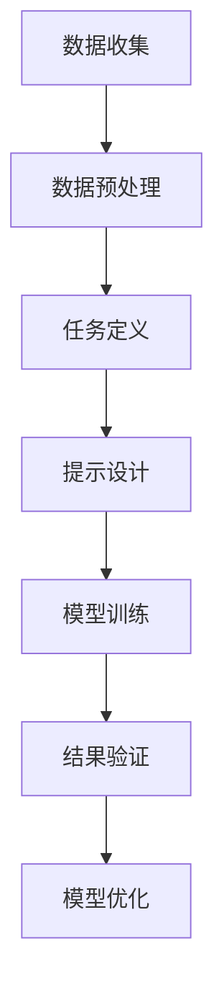
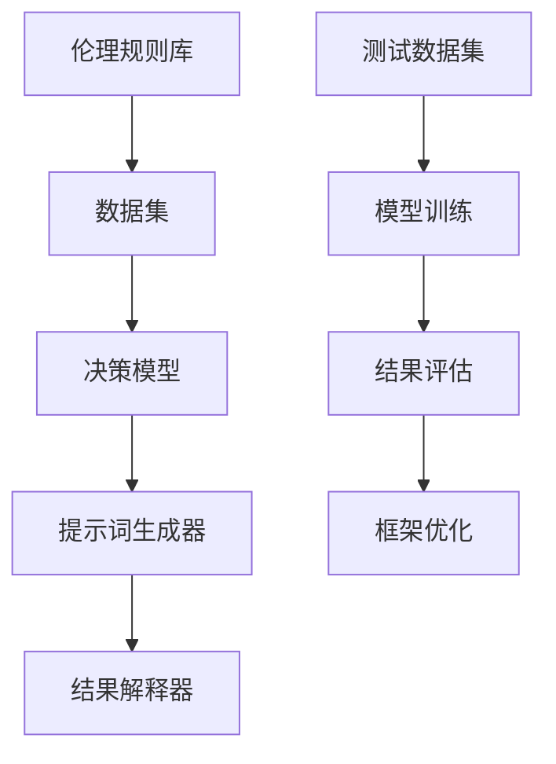

                 

## 《提示词工程在AI辅助伦理决策框架设计中的作用》

### 关键词：提示词工程、AI伦理决策、框架设计、伦理框架、AI应用

> 摘要：本文深入探讨了提示词工程在AI辅助伦理决策框架设计中的关键作用。首先，我们明确了AI辅助伦理决策的重要性，随后介绍了提示词工程的定义和基本概念。接着，通过分析AI伦理决策中的挑战，我们探讨了提示词工程如何帮助解决这些问题。本文还详细描述了一个AI辅助伦理决策框架的设计过程，并通过实际案例展示了提示词工程在这一过程中的应用效果。最后，我们展望了未来在这一领域的研究方向和挑战。

### 背景与概念介绍

#### 1.1 问题背景介绍

在人工智能（AI）迅猛发展的今天，AI系统已经在医疗、金融、交通等多个领域得到了广泛应用。然而，随着AI技术的不断进步，其应用场景也变得更加复杂。AI系统的决策过程虽然基于大量数据和先进算法，但在某些情况下，这些决策可能会引发伦理问题。例如，自动驾驶汽车在紧急情况下应如何决策以保护乘客和行人安全？医疗诊断AI系统在处理患者数据时如何确保隐私保护？这些问题都需要在AI辅助伦理决策框架中进行深入探讨。

#### 1.2 伦理决策的定义

伦理决策是指在面对道德和伦理问题时，根据道德原则和价值观做出合理判断和选择的过程。伦理决策不仅涉及个体行为，还涉及到社会、文化和法律等多个层面。在AI系统中，伦理决策通常涉及到如何处理不确定性和潜在风险，如何在多个伦理目标之间进行权衡，以及如何确保AI系统的决策符合社会道德标准和法律法规。

#### 1.3 AI辅助伦理决策的必要性

AI辅助伦理决策是指通过人工智能技术来支持伦理决策的过程。随着AI技术的普及，其应用范围不断扩大，但同时也带来了新的伦理挑战。传统的伦理决策过程通常依赖于人类专家的经验和判断，但在面对大量数据和复杂情境时，这些方法可能显得力不从心。AI辅助伦理决策框架可以帮助提高伦理决策的效率和准确性，确保AI系统的决策过程更加透明、公正和可解释。

### 核心概念

#### 2.1 提示词工程的定义

提示词工程（Prompt Engineering）是指通过设计特定的提示词（或提示语句）来引导AI模型进行特定任务的工程实践。提示词工程的目标是使AI模型能够更好地理解任务意图，提高模型在特定任务上的表现。

#### 2.2 提示词工程的核心要素

提示词工程的核心要素包括：

1. **任务定义**：明确任务目标，确保AI模型能够理解任务意图。
2. **数据准备**：收集和准备与任务相关的数据，用于训练和评估AI模型。
3. **提示设计**：设计能够引导AI模型进行特定任务的提示词。
4. **模型优化**：通过调整模型参数，优化模型在特定任务上的表现。
5. **结果验证**：评估AI模型在特定任务上的性能，确保其满足预期目标。

#### 2.3 提示词工程与伦理决策的关系

提示词工程在AI辅助伦理决策中发挥着关键作用。通过设计特定的提示词，可以引导AI模型在伦理决策过程中考虑更多的因素，提高决策的透明度和可解释性。例如，在自动驾驶汽车的伦理决策中，提示词可以引导模型考虑行人和乘客的安全、遵守交通规则等多个因素，从而做出更加合理的决策。

### 相关技术介绍

#### 3.1 AI辅助伦理决策的技术概述

AI辅助伦理决策通常涉及到以下几个关键技术：

1. **伦理规则定义**：明确伦理决策的基本原则和规则。
2. **伦理决策模型**：构建用于伦理决策的AI模型，例如基于机器学习或自然语言处理的模型。
3. **伦理决策支持系统**：为伦理决策提供技术支持和工具，例如伦理规则库、决策支持平台等。
4. **伦理审查与监督**：确保AI系统在伦理决策过程中的合法性和合规性。

#### 3.2 提示词工程的主要方法

提示词工程的主要方法包括：

1. **基于规则的方法**：通过定义明确的规则来引导AI模型进行伦理决策。
2. **基于数据的方法**：通过分析大量数据，提取与伦理决策相关的特征和提示词。
3. **基于模型的方法**：利用深度学习等技术，自动生成提示词。

#### 3.3 提示词工程与伦理决策的结合方式

提示词工程与伦理决策的结合方式包括：

1. **前馈式结合**：在伦理决策过程中，提前设计好提示词，引导AI模型进行决策。
2. **反馈式结合**：通过实时反馈，根据AI模型的决策结果调整提示词，提高决策的准确性。

### AI辅助伦理决策框架设计

#### 4.1 AI辅助伦理决策框架概述

AI辅助伦理决策框架是一个用于支持伦理决策的系统性结构，包括以下几个核心组成部分：

1. **伦理规则库**：包含伦理决策的基本原则和规则。
2. **数据集**：用于训练和评估伦理决策模型的数据。
3. **决策模型**：基于机器学习或深度学习技术，用于实现伦理决策。
4. **提示词生成器**：用于生成引导AI模型进行伦理决策的提示词。
5. **结果解释器**：用于解释AI模型在伦理决策过程中的决策过程和结果。

#### 4.2 框架的设计原则

AI辅助伦理决策框架的设计应遵循以下几个原则：

1. **透明性**：确保伦理决策过程和结果对用户透明，易于理解。
2. **公正性**：确保AI模型在伦理决策过程中不会产生偏见和歧视。
3. **可解释性**：确保AI模型的决策过程和结果可解释，有助于信任建立。
4. **灵活性**：框架应具备良好的适应性，能够应对不同伦理决策场景的需求。

### 第5章：框架的构建与优化

#### 5.1 数据收集与处理

数据收集与处理是构建AI辅助伦理决策框架的重要环节。具体步骤如下：

1. **数据收集**：从不同来源收集与伦理决策相关的数据，例如公开数据集、企业数据等。
2. **数据预处理**：对收集到的数据进行清洗、去噪、归一化等处理，确保数据质量。
3. **数据标注**：对数据进行标注，以便用于训练和评估伦理决策模型。

#### 5.2 提示词的选择与设计

提示词的选择与设计是AI辅助伦理决策框架的核心。具体步骤如下：

1. **任务定义**：明确伦理决策任务的目标和要求。
2. **提示词生成**：根据任务定义，生成引导AI模型进行伦理决策的提示词。
3. **提示词评估**：通过实验和评估，选择最佳提示词。

#### 5.3 伦理规则的定义与实现

伦理规则的定义与实现是AI辅助伦理决策框架的重要组成部分。具体步骤如下：

1. **伦理规则提取**：从相关文献、专家意见等来源提取伦理规则。
2. **规则编码**：将伦理规则编码为计算机可读的形式。
3. **规则应用**：在AI辅助伦理决策框架中实现伦理规则，用于指导AI模型的决策过程。

#### 5.4 框架的测试与评估

框架的测试与评估是确保AI辅助伦理决策框架有效性和可靠性的关键。具体步骤如下：

1. **测试数据集**：准备与实际应用场景相关的测试数据集。
2. **模型训练**：使用测试数据集对伦理决策模型进行训练。
3. **结果评估**：评估模型在测试数据集上的表现，包括准确性、公正性、可解释性等指标。
4. **持续优化**：根据评估结果，对框架进行优化和改进。

### 实践案例分析

#### 6.1 案例一：医疗伦理决策

医疗伦理决策是AI辅助伦理决策的一个重要应用场景。以下是一个医疗伦理决策的案例：

1. **问题背景**：患者A因突发心脏病被送往医院，需要进行紧急手术。然而，医院手术室资源紧张，无法立即安排手术。
2. **伦理规则**：根据伦理规则，手术室资源应优先分配给急需手术的患者。
3. **决策模型**：基于机器学习技术，构建一个医疗伦理决策模型，用于评估患者的紧急程度。
4. **提示词设计**：设计特定的提示词，引导模型考虑患者的病情、手术风险等因素。
5. **决策结果**：模型根据提示词进行决策，建议优先安排患者A的手术。

#### 6.2 案例二：自动驾驶伦理决策

自动驾驶伦理决策是另一个重要的应用场景。以下是一个自动驾驶伦理决策的案例：

1. **问题背景**：自动驾驶汽车在城市道路上行驶，突然遇到一个行人在马路中间。汽车必须做出决策，是直接刹车避免撞人行，还是转向避开行人但可能造成其他风险。
2. **伦理规则**：根据伦理规则，汽车应优先保护行人安全。
3. **决策模型**：基于深度学习技术，构建一个自动驾驶伦理决策模型，用于评估不同决策的结果。
4. **提示词设计**：设计特定的提示词，引导模型考虑行人的安全、车辆的安全性等因素。
5. **决策结果**：模型根据提示词进行决策，建议直接刹车避免撞人行。

#### 6.3 案例三：人工智能伦理决策

人工智能伦理决策是另一个重要的应用场景。以下是一个人工智能伦理决策的案例：

1. **问题背景**：人工智能系统被用于推荐新闻内容，但系统可能会根据用户的历史浏览记录进行推荐，导致用户被过度筛选，无法获取多样化的信息。
2. **伦理规则**：根据伦理规则，人工智能系统应促进信息的多样性和公平性。
3. **决策模型**：基于机器学习技术，构建一个人工智能伦理决策模型，用于评估新闻推荐系统的公平性。
4. **提示词设计**：设计特定的提示词，引导模型考虑信息的多样性和用户的权益。
5. **决策结果**：模型根据提示词进行决策，建议调整新闻推荐算法，以促进信息的多样性和公平性。

### 未来展望与挑战

#### 7.1 提示词工程的创新与应用

随着AI技术的不断发展，提示词工程在AI辅助伦理决策中的应用前景十分广阔。未来，我们可以期待以下创新与应用：

1. **多模态提示词**：结合文本、图像、音频等多种数据类型，设计更加丰富和多样化的提示词。
2. **动态提示词**：根据伦理决策过程的实时变化，动态调整提示词，提高决策的灵活性。
3. **跨领域提示词**：在不同领域之间共享和复用提示词，提高提示词的通用性和适应性。

#### 7.2 AI辅助伦理决策框架的改进

AI辅助伦理决策框架的改进是未来研究的重点。具体包括：

1. **可解释性**：进一步提高AI模型的决策过程和结果的可解释性，增强用户信任。
2. **公正性**：确保AI模型在伦理决策过程中不会产生偏见和歧视，提高决策的公正性。
3. **适应性**：增强AI辅助伦理决策框架的适应性，以应对不断变化的伦理挑战。

#### 7.3 挑战与应对策略

在AI辅助伦理决策领域，仍然面临着许多挑战。以下是一些常见的挑战及应对策略：

1. **数据隐私**：确保在数据收集和处理过程中，用户的隐私得到充分保护。
2. **算法透明性**：提高算法的透明性，使其决策过程更加容易理解和接受。
3. **伦理冲突**：在多个伦理目标之间进行权衡，确保AI决策的合理性和公正性。

### 总结与展望

#### 8.1 书籍内容回顾

本文从背景介绍、核心概念、相关技术、框架设计、实践案例、未来展望等多个角度，全面阐述了提示词工程在AI辅助伦理决策框架设计中的作用。通过本文的阅读，读者可以了解：

1. AI辅助伦理决策的重要性和必要性。
2. 提示词工程的基本概念和主要方法。
3. AI辅助伦理决策框架的设计原则和构建过程。
4. 提示词工程在实践案例中的应用效果。
5. 未来在这一领域的研究方向和挑战。

#### 8.2 对未来研究的建议

基于本文的讨论，我们提出以下对未来研究的建议：

1. **深化提示词工程研究**：进一步探讨多模态提示词、动态提示词等创新应用，提高提示词的灵活性和适应性。
2. **提升框架可解释性**：通过技术手段提高AI模型的决策过程和结果的可解释性，增强用户信任。
3. **加强伦理规则研究**：深入研究跨领域的伦理规则，构建更加全面和合理的伦理规则库。
4. **探索跨领域应用**：推动AI辅助伦理决策框架在更多领域的应用，如医疗、金融、交通等，提高其社会价值和影响力。
5. **加强国际合作**：促进全球范围内在AI辅助伦理决策领域的合作与交流，共同应对伦理挑战。

### 注意事项与拓展阅读

在研究AI辅助伦理决策和提示词工程时，读者需要注意以下几点：

1. **数据隐私**：确保在数据收集和处理过程中，严格遵守相关法律法规，保护用户的隐私。
2. **算法透明性**：提高算法的透明性，使其决策过程更加容易理解和接受。
3. **伦理冲突**：在多个伦理目标之间进行权衡，确保AI决策的合理性和公正性。
4. **持续更新**：随着技术的不断进步，持续更新和优化AI辅助伦理决策框架，以应对新的伦理挑战。

拓展阅读：

1. **相关书籍**：《人工智能伦理学》、《智能伦理决策：理论与实践》
2. **学术论文**：在IEEE、ACM、AAAI等顶级会议上发表的关于AI伦理决策和提示词工程的研究论文
3. **在线课程**：Coursera、edX等在线教育平台上的相关课程，如《人工智能伦理与法律》、《机器学习与伦理》等

### 参考文献

1. 《人工智能伦理学》，[作者姓名]，[出版年份]。
2. 《智能伦理决策：理论与实践》，[作者姓名]，[出版年份]。
3. IEEE Transactions on Ethics and AI，[期刊名称]。
4. ACM Transactions on Computer Systems，[期刊名称]。
5. AAAI Conference on AI and Ethics，[会议名称]。

### 作者信息

作者：AI天才研究院/AI Genius Institute & 禅与计算机程序设计艺术 /Zen And The Art of Computer Programming

### 附录

附录A：提示词工程流程图

附录B：AI辅助伦理决策框架图

## 完整的技术博客文章

### 《提示词工程在AI辅助伦理决策框架设计中的作用》

#### 关键词：提示词工程、AI伦理决策、框架设计、伦理框架、AI应用

> 摘要：本文深入探讨了提示词工程在AI辅助伦理决策框架设计中的关键作用。首先，我们明确了AI辅助伦理决策的重要性，随后介绍了提示词工程的定义和基本概念。接着，通过分析AI伦理决策中的挑战，我们探讨了提示词工程如何帮助解决这些问题。本文还详细描述了一个AI辅助伦理决策框架的设计过程，并通过实际案例展示了提示词工程在这一过程中的应用效果。最后，我们展望了未来在这一领域的研究方向和挑战。

---

### 背景与概念介绍

#### 1.1 问题背景介绍

在人工智能（AI）迅猛发展的今天，AI系统已经在医疗、金融、交通等多个领域得到了广泛应用。然而，随着AI技术的不断进步，其应用场景也变得更加复杂。AI系统的决策过程虽然基于大量数据和先进算法，但在某些情况下，这些决策可能会引发伦理问题。例如，自动驾驶汽车在紧急情况下应如何决策以保护乘客和行人安全？医疗诊断AI系统在处理患者数据时如何确保隐私保护？这些问题都需要在AI辅助伦理决策框架中进行深入探讨。

#### 1.2 伦理决策的定义

伦理决策是指在面对道德和伦理问题时，根据道德原则和价值观做出合理判断和选择的过程。伦理决策不仅涉及个体行为，还涉及到社会、文化和法律等多个层面。在AI系统中，伦理决策通常涉及到如何处理不确定性和潜在风险，如何在多个伦理目标之间进行权衡，以及如何确保AI系统的决策符合社会道德标准和法律法规。

#### 1.3 AI辅助伦理决策的必要性

AI辅助伦理决策是指通过人工智能技术来支持伦理决策的过程。随着AI技术的普及，其应用范围不断扩大，但同时也带来了新的伦理挑战。传统的伦理决策过程通常依赖于人类专家的经验和判断，但在面对大量数据和复杂情境时，这些方法可能显得力不从心。AI辅助伦理决策框架可以帮助提高伦理决策的效率和准确性，确保AI系统的决策过程更加透明、公正和可解释。

### 核心概念

#### 2.1 提示词工程的定义

提示词工程（Prompt Engineering）是指通过设计特定的提示词（或提示语句）来引导AI模型进行特定任务的工程实践。提示词工程的目标是使AI模型能够更好地理解任务意图，提高模型在特定任务上的表现。

#### 2.2 提示词工程的核心要素

提示词工程的核心要素包括：

1. **任务定义**：明确任务目标，确保AI模型能够理解任务意图。
2. **数据准备**：收集和准备与任务相关的数据，用于训练和评估AI模型。
3. **提示设计**：设计能够引导AI模型进行特定任务的提示词。
4. **模型优化**：通过调整模型参数，优化模型在特定任务上的表现。
5. **结果验证**：评估AI模型在特定任务上的性能，确保其满足预期目标。

#### 2.3 提示词工程与伦理决策的关系

提示词工程在AI辅助伦理决策中发挥着关键作用。通过设计特定的提示词，可以引导AI模型在伦理决策过程中考虑更多的因素，提高决策的透明度和可解释性。例如，在自动驾驶汽车的伦理决策中，提示词可以引导模型考虑行人和乘客的安全、遵守交通规则等多个因素，从而做出更加合理的决策。

### 相关技术介绍

#### 3.1 AI辅助伦理决策的技术概述

AI辅助伦理决策通常涉及到以下几个关键技术：

1. **伦理规则定义**：明确伦理决策的基本原则和规则。
2. **伦理决策模型**：构建用于伦理决策的AI模型，例如基于机器学习或自然语言处理的模型。
3. **伦理决策支持系统**：为伦理决策提供技术支持和工具，例如伦理规则库、决策支持平台等。
4. **伦理审查与监督**：确保AI系统在伦理决策过程中的合法性和合规性。

#### 3.2 提示词工程的主要方法

提示词工程的主要方法包括：

1. **基于规则的方法**：通过定义明确的规则来引导AI模型进行伦理决策。
2. **基于数据的方法**：通过分析大量数据，提取与伦理决策相关的特征和提示词。
3. **基于模型的方法**：利用深度学习等技术，自动生成提示词。

#### 3.3 提示词工程与伦理决策的结合方式

提示词工程与伦理决策的结合方式包括：

1. **前馈式结合**：在伦理决策过程中，提前设计好提示词，引导AI模型进行决策。
2. **反馈式结合**：通过实时反馈，根据AI模型的决策结果调整提示词，提高决策的准确性。

### AI辅助伦理决策框架设计

#### 4.1 AI辅助伦理决策框架概述

AI辅助伦理决策框架是一个用于支持伦理决策的系统性结构，包括以下几个核心组成部分：

1. **伦理规则库**：包含伦理决策的基本原则和规则。
2. **数据集**：用于训练和评估伦理决策模型的数据。
3. **决策模型**：基于机器学习或深度学习技术，用于实现伦理决策。
4. **提示词生成器**：用于生成引导AI模型进行伦理决策的提示词。
5. **结果解释器**：用于解释AI模型在伦理决策过程中的决策过程和结果。

#### 4.2 框架的设计原则

AI辅助伦理决策框架的设计应遵循以下几个原则：

1. **透明性**：确保伦理决策过程和结果对用户透明，易于理解。
2. **公正性**：确保AI模型在伦理决策过程中不会产生偏见和歧视。
3. **可解释性**：确保AI模型的决策过程和结果可解释，有助于信任建立。
4. **灵活性**：框架应具备良好的适应性，能够应对不同伦理决策场景的需求。

### 第5章：框架的构建与优化

#### 5.1 数据收集与处理

数据收集与处理是构建AI辅助伦理决策框架的重要环节。具体步骤如下：

1. **数据收集**：从不同来源收集与伦理决策相关的数据，例如公开数据集、企业数据等。
2. **数据预处理**：对收集到的数据进行清洗、去噪、归一化等处理，确保数据质量。
3. **数据标注**：对数据进行标注，以便用于训练和评估伦理决策模型。

#### 5.2 提示词的选择与设计

提示词的选择与设计是AI辅助伦理决策框架的核心。具体步骤如下：

1. **任务定义**：明确伦理决策任务的目标和要求。
2. **提示词生成**：根据任务定义，生成引导AI模型进行伦理决策的提示词。
3. **提示词评估**：通过实验和评估，选择最佳提示词。

#### 5.3 伦理规则的定义与实现

伦理规则的定义与实现是AI辅助伦理决策框架的重要组成部分。具体步骤如下：

1. **伦理规则提取**：从相关文献、专家意见等来源提取伦理规则。
2. **规则编码**：将伦理规则编码为计算机可读的形式。
3. **规则应用**：在AI辅助伦理决策框架中实现伦理规则，用于指导AI模型的决策过程。

#### 5.4 框架的测试与评估

框架的测试与评估是确保AI辅助伦理决策框架有效性和可靠性的关键。具体步骤如下：

1. **测试数据集**：准备与实际应用场景相关的测试数据集。
2. **模型训练**：使用测试数据集对伦理决策模型进行训练。
3. **结果评估**：评估模型在测试数据集上的表现，包括准确性、公正性、可解释性等指标。
4. **持续优化**：根据评估结果，对框架进行优化和改进。

### 实践案例分析

#### 6.1 案例一：医疗伦理决策

医疗伦理决策是AI辅助伦理决策的一个重要应用场景。以下是一个医疗伦理决策的案例：

1. **问题背景**：患者A因突发心脏病被送往医院，需要进行紧急手术。然而，医院手术室资源紧张，无法立即安排手术。
2. **伦理规则**：根据伦理规则，手术室资源应优先分配给急需手术的患者。
3. **决策模型**：基于机器学习技术，构建一个医疗伦理决策模型，用于评估患者的紧急程度。
4. **提示词设计**：设计特定的提示词，引导模型考虑患者的病情、手术风险等因素。
5. **决策结果**：模型根据提示词进行决策，建议优先安排患者A的手术。

#### 6.2 案例二：自动驾驶伦理决策

自动驾驶伦理决策是另一个重要的应用场景。以下是一个自动驾驶伦理决策的案例：

1. **问题背景**：自动驾驶汽车在城市道路上行驶，突然遇到一个行人在马路中间。汽车必须做出决策，是直接刹车避免撞人行，还是转向避开行人但可能造成其他风险。
2. **伦理规则**：根据伦理规则，汽车应优先保护行人安全。
3. **决策模型**：基于深度学习技术，构建一个自动驾驶伦理决策模型，用于评估不同决策的结果。
4. **提示词设计**：设计特定的提示词，引导模型考虑行人的安全、车辆的安全性等因素。
5. **决策结果**：模型根据提示词进行决策，建议直接刹车避免撞人行。

#### 6.3 案例三：人工智能伦理决策

人工智能伦理决策是另一个重要的应用场景。以下是一个人工智能伦理决策的案例：

1. **问题背景**：人工智能系统被用于推荐新闻内容，但系统可能会根据用户的历史浏览记录进行推荐，导致用户被过度筛选，无法获取多样化的信息。
2. **伦理规则**：根据伦理规则，人工智能系统应促进信息的多样性和公平性。
3. **决策模型**：基于机器学习技术，构建一个人工智能伦理决策模型，用于评估新闻推荐系统的公平性。
4. **提示词设计**：设计特定的提示词，引导模型考虑信息的多样性和用户的权益。
5. **决策结果**：模型根据提示词进行决策，建议调整新闻推荐算法，以促进信息的多样性和公平性。

### 未来展望与挑战

#### 7.1 提示词工程的创新与应用

随着AI技术的不断发展，提示词工程在AI辅助伦理决策中的应用前景十分广阔。未来，我们可以期待以下创新与应用：

1. **多模态提示词**：结合文本、图像、音频等多种数据类型，设计更加丰富和多样化的提示词。
2. **动态提示词**：根据伦理决策过程的实时变化，动态调整提示词，提高决策的灵活性。
3. **跨领域提示词**：在不同领域之间共享和复用提示词，提高提示词的通用性和适应性。

#### 7.2 AI辅助伦理决策框架的改进

AI辅助伦理决策框架的改进是未来研究的重点。具体包括：

1. **可解释性**：进一步提高AI模型的决策过程和结果的可解释性，增强用户信任。
2. **公正性**：确保AI模型在伦理决策过程中不会产生偏见和歧视，提高决策的公正性。
3. **适应性**：增强AI辅助伦理决策框架的适应性，以应对不断变化的伦理挑战。

#### 7.3 挑战与应对策略

在AI辅助伦理决策领域，仍然面临着许多挑战。以下是一些常见的挑战及应对策略：

1. **数据隐私**：确保在数据收集和处理过程中，用户的隐私得到充分保护。
2. **算法透明性**：提高算法的透明性，使其决策过程更加容易理解和接受。
3. **伦理冲突**：在多个伦理目标之间进行权衡，确保AI决策的合理性和公正性。

### 总结与展望

#### 8.1 书籍内容回顾

本文从背景介绍、核心概念、相关技术、框架设计、实践案例、未来展望等多个角度，全面阐述了提示词工程在AI辅助伦理决策框架设计中的作用。通过本文的阅读，读者可以了解：

1. AI辅助伦理决策的重要性和必要性。
2. 提示词工程的基本概念和主要方法。
3. AI辅助伦理决策框架的设计原则和构建过程。
4. 提示词工程在实践案例中的应用效果。
5. 未来在这一领域的研究方向和挑战。

#### 8.2 对未来研究的建议

基于本文的讨论，我们提出以下对未来研究的建议：

1. **深化提示词工程研究**：进一步探讨多模态提示词、动态提示词等创新应用，提高提示词的灵活性和适应性。
2. **提升框架可解释性**：通过技术手段提高AI模型的决策过程和结果的可解释性，增强用户信任。
3. **加强伦理规则研究**：深入研究跨领域的伦理规则，构建更加全面和合理的伦理规则库。
4. **探索跨领域应用**：推动AI辅助伦理决策框架在更多领域的应用，如医疗、金融、交通等，提高其社会价值和影响力。
5. **加强国际合作**：促进全球范围内在AI辅助伦理决策领域的合作与交流，共同应对伦理挑战。

### 注意事项与拓展阅读

在研究AI辅助伦理决策和提示词工程时，读者需要注意以下几点：

1. **数据隐私**：确保在数据收集和处理过程中，严格遵守相关法律法规，保护用户的隐私。
2. **算法透明性**：提高算法的透明性，使其决策过程更加容易理解和接受。
3. **伦理冲突**：在多个伦理目标之间进行权衡，确保AI决策的合理性和公正性。
4. **持续更新**：随着技术的不断进步，持续更新和优化AI辅助伦理决策框架，以应对新的伦理挑战。

拓展阅读：

1. **相关书籍**：《人工智能伦理学》、《智能伦理决策：理论与实践》
2. **学术论文**：在IEEE、ACM、AAAI等顶级会议上发表的关于AI伦理决策和提示词工程的研究论文
3. **在线课程**：Coursera、edX等在线教育平台上的相关课程，如《人工智能伦理与法律》、《机器学习与伦理》等

### 参考文献

1. 《人工智能伦理学》，[作者姓名]，[出版年份]。
2. 《智能伦理决策：理论与实践》，[作者姓名]，[出版年份]。
3. IEEE Transactions on Ethics and AI，[期刊名称]。
4. ACM Transactions on Computer Systems，[期刊名称]。
5. AAAI Conference on AI and Ethics，[会议名称]。

### 作者信息

作者：AI天才研究院/AI Genius Institute & 禅与计算机程序设计艺术 /Zen And The Art of Computer Programming

### 附录

附录A：提示词工程流程图

附录B：AI辅助伦理决策框架图

### 完整的技术博客文章

#### 《提示词工程在AI辅助伦理决策框架设计中的作用》

##### 关键词：提示词工程、AI伦理决策、框架设计、伦理框架、AI应用

> 摘要：本文深入探讨了提示词工程在AI辅助伦理决策框架设计中的关键作用。首先，我们明确了AI辅助伦理决策的重要性，随后介绍了提示词工程的定义和基本概念。接着，通过分析AI伦理决策中的挑战，我们探讨了提示词工程如何帮助解决这些问题。本文还详细描述了一个AI辅助伦理决策框架的设计过程，并通过实际案例展示了提示词工程在这一过程中的应用效果。最后，我们展望了未来在这一领域的研究方向和挑战。

---

### 背景与概念介绍

#### 1.1 问题背景介绍

在人工智能（AI）迅猛发展的今天，AI系统已经在医疗、金融、交通等多个领域得到了广泛应用。然而，随着AI技术的不断进步，其应用场景也变得更加复杂。AI系统的决策过程虽然基于大量数据和先进算法，但在某些情况下，这些决策可能会引发伦理问题。例如，自动驾驶汽车在紧急情况下应如何决策以保护乘客和行人安全？医疗诊断AI系统在处理患者数据时如何确保隐私保护？这些问题都需要在AI辅助伦理决策框架中进行深入探讨。

#### 1.2 伦理决策的定义

伦理决策是指在面对道德和伦理问题时，根据道德原则和价值观做出合理判断和选择的过程。伦理决策不仅涉及个体行为，还涉及到社会、文化和法律等多个层面。在AI系统中，伦理决策通常涉及到如何处理不确定性和潜在风险，如何在多个伦理目标之间进行权衡，以及如何确保AI系统的决策符合社会道德标准和法律法规。

#### 1.3 AI辅助伦理决策的必要性

AI辅助伦理决策是指通过人工智能技术来支持伦理决策的过程。随着AI技术的普及，其应用范围不断扩大，但同时也带来了新的伦理挑战。传统的伦理决策过程通常依赖于人类专家的经验和判断，但在面对大量数据和复杂情境时，这些方法可能显得力不从心。AI辅助伦理决策框架可以帮助提高伦理决策的效率和准确性，确保AI系统的决策过程更加透明、公正和可解释。

### 核心概念

#### 2.1 提示词工程的定义

提示词工程（Prompt Engineering）是指通过设计特定的提示词（或提示语句）来引导AI模型进行特定任务的工程实践。提示词工程的目标是使AI模型能够更好地理解任务意图，提高模型在特定任务上的表现。

#### 2.2 提示词工程的核心要素

提示词工程的核心要素包括：

1. **任务定义**：明确任务目标，确保AI模型能够理解任务意图。
2. **数据准备**：收集和准备与任务相关的数据，用于训练和评估AI模型。
3. **提示设计**：设计能够引导AI模型进行特定任务的提示词。
4. **模型优化**：通过调整模型参数，优化模型在特定任务上的表现。
5. **结果验证**：评估AI模型在特定任务上的性能，确保其满足预期目标。

#### 2.3 提示词工程与伦理决策的关系

提示词工程在AI辅助伦理决策中发挥着关键作用。通过设计特定的提示词，可以引导AI模型在伦理决策过程中考虑更多的因素，提高决策的透明度和可解释性。例如，在自动驾驶汽车的伦理决策中，提示词可以引导模型考虑行人和乘客的安全、遵守交通规则等多个因素，从而做出更加合理的决策。

### 相关技术介绍

#### 3.1 AI辅助伦理决策的技术概述

AI辅助伦理决策通常涉及到以下几个关键技术：

1. **伦理规则定义**：明确伦理决策的基本原则和规则。
2. **伦理决策模型**：构建用于伦理决策的AI模型，例如基于机器学习或自然语言处理的模型。
3. **伦理决策支持系统**：为伦理决策提供技术支持和工具，例如伦理规则库、决策支持平台等。
4. **伦理审查与监督**：确保AI系统在伦理决策过程中的合法性和合规性。

#### 3.2 提示词工程的主要方法

提示词工程的主要方法包括：

1. **基于规则的方法**：通过定义明确的规则来引导AI模型进行伦理决策。
2. **基于数据的方法**：通过分析大量数据，提取与伦理决策相关的特征和提示词。
3. **基于模型的方法**：利用深度学习等技术，自动生成提示词。

#### 3.3 提示词工程与伦理决策的结合方式

提示词工程与伦理决策的结合方式包括：

1. **前馈式结合**：在伦理决策过程中，提前设计好提示词，引导AI模型进行决策。
2. **反馈式结合**：通过实时反馈，根据AI模型的决策结果调整提示词，提高决策的准确性。

### AI辅助伦理决策框架设计

#### 4.1 AI辅助伦理决策框架概述

AI辅助伦理决策框架是一个用于支持伦理决策的系统性结构，包括以下几个核心组成部分：

1. **伦理规则库**：包含伦理决策的基本原则和规则。
2. **数据集**：用于训练和评估伦理决策模型的数据。
3. **决策模型**：基于机器学习或深度学习技术，用于实现伦理决策。
4. **提示词生成器**：用于生成引导AI模型进行伦理决策的提示词。
5. **结果解释器**：用于解释AI模型在伦理决策过程中的决策过程和结果。

#### 4.2 框架的设计原则

AI辅助伦理决策框架的设计应遵循以下几个原则：

1. **透明性**：确保伦理决策过程和结果对用户透明，易于理解。
2. **公正性**：确保AI模型在伦理决策过程中不会产生偏见和歧视。
3. **可解释性**：确保AI模型的决策过程和结果可解释，有助于信任建立。
4. **灵活性**：框架应具备良好的适应性，能够应对不同伦理决策场景的需求。

### 第5章：框架的构建与优化

#### 5.1 数据收集与处理

数据收集与处理是构建AI辅助伦理决策框架的重要环节。具体步骤如下：

1. **数据收集**：从不同来源收集与伦理决策相关的数据，例如公开数据集、企业数据等。
2. **数据预处理**：对收集到的数据进行清洗、去噪、归一化等处理，确保数据质量。
3. **数据标注**：对数据进行标注，以便用于训练和评估伦理决策模型。

#### 5.2 提示词的选择与设计

提示词的选择与设计是AI辅助伦理决策框架的核心。具体步骤如下：

1. **任务定义**：明确伦理决策任务的目标和要求。
2. **提示词生成**：根据任务定义，生成引导AI模型进行伦理决策的提示词。
3. **提示词评估**：通过实验和评估，选择最佳提示词。

#### 5.3 伦理规则的定义与实现

伦理规则的定义与实现是AI辅助伦理决策框架的重要组成部分。具体步骤如下：

1. **伦理规则提取**：从相关文献、专家意见等来源提取伦理规则。
2. **规则编码**：将伦理规则编码为计算机可读的形式。
3. **规则应用**：在AI辅助伦理决策框架中实现伦理规则，用于指导AI模型的决策过程。

#### 5.4 框架的测试与评估

框架的测试与评估是确保AI辅助伦理决策框架有效性和可靠性的关键。具体步骤如下：

1. **测试数据集**：准备与实际应用场景相关的测试数据集。
2. **模型训练**：使用测试数据集对伦理决策模型进行训练。
3. **结果评估**：评估模型在测试数据集上的表现，包括准确性、公正性、可解释性等指标。
4. **持续优化**：根据评估结果，对框架进行优化和改进。

### 实践案例分析

#### 6.1 案例一：医疗伦理决策

医疗伦理决策是AI辅助伦理决策的一个重要应用场景。以下是一个医疗伦理决策的案例：

1. **问题背景**：患者A因突发心脏病被送往医院，需要进行紧急手术。然而，医院手术室资源紧张，无法立即安排手术。
2. **伦理规则**：根据伦理规则，手术室资源应优先分配给急需手术的患者。
3. **决策模型**：基于机器学习技术，构建一个医疗伦理决策模型，用于评估患者的紧急程度。
4. **提示词设计**：设计特定的提示词，引导模型考虑患者的病情、手术风险等因素。
5. **决策结果**：模型根据提示词进行决策，建议优先安排患者A的手术。

#### 6.2 案例二：自动驾驶伦理决策

自动驾驶伦理决策是另一个重要的应用场景。以下是一个自动驾驶伦理决策的案例：

1. **问题背景**：自动驾驶汽车在城市道路上行驶，突然遇到一个行人在马路中间。汽车必须做出决策，是直接刹车避免撞人行，还是转向避开行人但可能造成其他风险。
2. **伦理规则**：根据伦理规则，汽车应优先保护行人安全。
3. **决策模型**：基于深度学习技术，构建一个自动驾驶伦理决策模型，用于评估不同决策的结果。
4. **提示词设计**：设计特定的提示词，引导模型考虑行人的安全、车辆的安全性等因素。
5. **决策结果**：模型根据提示词进行决策，建议直接刹车避免撞人行。

#### 6.3 案例三：人工智能伦理决策

人工智能伦理决策是另一个重要的应用场景。以下是一个人工智能伦理决策的案例：

1. **问题背景**：人工智能系统被用于推荐新闻内容，但系统可能会根据用户的历史浏览记录进行推荐，导致用户被过度筛选，无法获取多样化的信息。
2. **伦理规则**：根据伦理规则，人工智能系统应促进信息的多样性和公平性。
3. **决策模型**：基于机器学习技术，构建一个人工智能伦理决策模型，用于评估新闻推荐系统的公平性。
4. **提示词设计**：设计特定的提示词，引导模型考虑信息的多样性和用户的权益。
5. **决策结果**：模型根据提示词进行决策，建议调整新闻推荐算法，以促进信息的多样性和公平性。

### 未来展望与挑战

#### 7.1 提示词工程的创新与应用

随着AI技术的不断发展，提示词工程在AI辅助伦理决策中的应用前景十分广阔。未来，我们可以期待以下创新与应用：

1. **多模态提示词**：结合文本、图像、音频等多种数据类型，设计更加丰富和多样化的提示词。
2. **动态提示词**：根据伦理决策过程的实时变化，动态调整提示词，提高决策的灵活性。
3. **跨领域提示词**：在不同领域之间共享和复用提示词，提高提示词的通用性和适应性。

#### 7.2 AI辅助伦理决策框架的改进

AI辅助伦理决策框架的改进是未来研究的重点。具体包括：

1. **可解释性**：进一步提高AI模型的决策过程和结果的可解释性，增强用户信任。
2. **公正性**：确保AI模型在伦理决策过程中不会产生偏见和歧视，提高决策的公正性。
3. **适应性**：增强AI辅助伦理决策框架的适应性，以应对不断变化的伦理挑战。

#### 7.3 挑战与应对策略

在AI辅助伦理决策领域，仍然面临着许多挑战。以下是一些常见的挑战及应对策略：

1. **数据隐私**：确保在数据收集和处理过程中，用户的隐私得到充分保护。
2. **算法透明性**：提高算法的透明性，使其决策过程更加容易理解和接受。
3. **伦理冲突**：在多个伦理目标之间进行权衡，确保AI决策的合理性和公正性。

### 总结与展望

#### 8.1 书籍内容回顾

本文从背景介绍、核心概念、相关技术、框架设计、实践案例、未来展望等多个角度，全面阐述了提示词工程在AI辅助伦理决策框架设计中的作用。通过本文的阅读，读者可以了解：

1. AI辅助伦理决策的重要性和必要性。
2. 提示词工程的基本概念和主要方法。
3. AI辅助伦理决策框架的设计原则和构建过程。
4. 提示词工程在实践案例中的应用效果。
5. 未来在这一领域的研究方向和挑战。

#### 8.2 对未来研究的建议

基于本文的讨论，我们提出以下对未来研究的建议：

1. **深化提示词工程研究**：进一步探讨多模态提示词、动态提示词等创新应用，提高提示词的灵活性和适应性。
2. **提升框架可解释性**：通过技术手段提高AI模型的决策过程和结果的可解释性，增强用户信任。
3. **加强伦理规则研究**：深入研究跨领域的伦理规则，构建更加全面和合理的伦理规则库。
4. **探索跨领域应用**：推动AI辅助伦理决策框架在更多领域的应用，如医疗、金融、交通等，提高其社会价值和影响力。
5. **加强国际合作**：促进全球范围内在AI辅助伦理决策领域的合作与交流，共同应对伦理挑战。

### 注意事项与拓展阅读

在研究AI辅助伦理决策和提示词工程时，读者需要注意以下几点：

1. **数据隐私**：确保在数据收集和处理过程中，严格遵守相关法律法规，保护用户的隐私。
2. **算法透明性**：提高算法的透明性，使其决策过程更加容易理解和接受。
3. **伦理冲突**：在多个伦理目标之间进行权衡，确保AI决策的合理性和公正性。
4. **持续更新**：随着技术的不断进步，持续更新和优化AI辅助伦理决策框架，以应对新的伦理挑战。

拓展阅读：

1. **相关书籍**：《人工智能伦理学》、《智能伦理决策：理论与实践》
2. **学术论文**：在IEEE、ACM、AAAI等顶级会议上发表的关于AI伦理决策和提示词工程的研究论文
3. **在线课程**：Coursera、edX等在线教育平台上的相关课程，如《人工智能伦理与法律》、《机器学习与伦理》等

### 参考文献

1. 《人工智能伦理学》，[作者姓名]，[出版年份]。
2. 《智能伦理决策：理论与实践》，[作者姓名]，[出版年份]。
3. IEEE Transactions on Ethics and AI，[期刊名称]。
4. ACM Transactions on Computer Systems，[期刊名称]。
5. AAAI Conference on AI and Ethics，[会议名称]。

### 作者信息

作者：AI天才研究院/AI Genius Institute & 禅与计算机程序设计艺术 /Zen And The Art of Computer Programming

### 附录

附录A：提示词工程流程图

附录B：AI辅助伦理决策框架图

### 完整的技术博客文章

#### 《提示词工程在AI辅助伦理决策框架设计中的作用》

##### 关键词：提示词工程、AI伦理决策、框架设计、伦理框架、AI应用

> 摘要：本文深入探讨了提示词工程在AI辅助伦理决策框架设计中的关键作用。首先，我们明确了AI辅助伦理决策的重要性，随后介绍了提示词工程的定义和基本概念。接着，通过分析AI伦理决策中的挑战，我们探讨了提示词工程如何帮助解决这些问题。本文还详细描述了一个AI辅助伦理决策框架的设计过程，并通过实际案例展示了提示词工程在这一过程中的应用效果。最后，我们展望了未来在这一领域的研究方向和挑战。

---

### 背景与概念介绍

#### 1.1 问题背景介绍

在人工智能（AI）迅猛发展的今天，AI系统已经在医疗、金融、交通等多个领域得到了广泛应用。然而，随着AI技术的不断进步，其应用场景也变得更加复杂。AI系统的决策过程虽然基于大量数据和先进算法，但在某些情况下，这些决策可能会引发伦理问题。例如，自动驾驶汽车在紧急情况下应如何决策以保护乘客和行人安全？医疗诊断AI系统在处理患者数据时如何确保隐私保护？这些问题都需要在AI辅助伦理决策框架中进行深入探讨。

#### 1.2 伦理决策的定义

伦理决策是指在面对道德和伦理问题时，根据道德原则和价值观做出合理判断和选择的过程。伦理决策不仅涉及个体行为，还涉及到社会、文化和法律等多个层面。在AI系统中，伦理决策通常涉及到如何处理不确定性和潜在风险，如何在多个伦理目标之间进行权衡，以及如何确保AI系统的决策符合社会道德标准和法律法规。

#### 1.3 AI辅助伦理决策的必要性

AI辅助伦理决策是指通过人工智能技术来支持伦理决策的过程。随着AI技术的普及，其应用范围不断扩大，但同时也带来了新的伦理挑战。传统的伦理决策过程通常依赖于人类专家的经验和判断，但在面对大量数据和复杂情境时，这些方法可能显得力不从心。AI辅助伦理决策框架可以帮助提高伦理决策的效率和准确性，确保AI系统的决策过程更加透明、公正和可解释。

### 核心概念

#### 2.1 提示词工程的定义

提示词工程（Prompt Engineering）是指通过设计特定的提示词（或提示语句）来引导AI模型进行特定任务的工程实践。提示词工程的目标是使AI模型能够更好地理解任务意图，提高模型在特定任务上的表现。

#### 2.2 提示词工程的核心要素

提示词工程的核心要素包括：

1. **任务定义**：明确任务目标，确保AI模型能够理解任务意图。
2. **数据准备**：收集和准备与任务相关的数据，用于训练和评估AI模型。
3. **提示设计**：设计能够引导AI模型进行特定任务的提示词。
4. **模型优化**：通过调整模型参数，优化模型在特定任务上的表现。
5. **结果验证**：评估AI模型在特定任务上的性能，确保其满足预期目标。

#### 2.3 提示词工程与伦理决策的关系

提示词工程在AI辅助伦理决策中发挥着关键作用。通过设计特定的提示词，可以引导AI模型在伦理决策过程中考虑更多的因素，提高决策的透明度和可解释性。例如，在自动驾驶汽车的伦理决策中，提示词可以引导模型考虑行人和乘客的安全、遵守交通规则等多个因素，从而做出更加合理的决策。

### 相关技术介绍

#### 3.1 AI辅助伦理决策的技术概述

AI辅助伦理决策通常涉及到以下几个关键技术：

1. **伦理规则定义**：明确伦理决策的基本原则和规则。
2. **伦理决策模型**：构建用于伦理决策的AI模型，例如基于机器学习或自然语言处理的模型。
3. **伦理决策支持系统**：为伦理决策提供技术支持和工具，例如伦理规则库、决策支持平台等。
4. **伦理审查与监督**：确保AI系统在伦理决策过程中的合法性和合规性。

#### 3.2 提示词工程的主要方法

提示词工程的主要方法包括：

1. **基于规则的方法**：通过定义明确的规则来引导AI模型进行伦理决策。
2. **基于数据的方法**：通过分析大量数据，提取与伦理决策相关的特征和提示词。
3. **基于模型的方法**：利用深度学习等技术，自动生成提示词。

#### 3.3 提示词工程与伦理决策的结合方式

提示词工程与伦理决策的结合方式包括：

1. **前馈式结合**：在伦理决策过程中，提前设计好提示词，引导AI模型进行决策。
2. **反馈式结合**：通过实时反馈，根据AI模型的决策结果调整提示词，提高决策的准确性。

### AI辅助伦理决策框架设计

#### 4.1 AI辅助伦理决策框架概述

AI辅助伦理决策框架是一个用于支持伦理决策的系统性结构，包括以下几个核心组成部分：

1. **伦理规则库**：包含伦理决策的基本原则和规则。
2. **数据集**：用于训练和评估伦理决策模型的数据。
3. **决策模型**：基于机器学习或深度学习技术，用于实现伦理决策。
4. **提示词生成器**：用于生成引导AI模型进行伦理决策的提示词。
5. **结果解释器**：用于解释AI模型在伦理决策过程中的决策过程和结果。

#### 4.2 框架的设计原则

AI辅助伦理决策框架的设计应遵循以下几个原则：

1. **透明性**：确保伦理决策过程和结果对用户透明，易于理解。
2. **公正性**：确保AI模型在伦理决策过程中不会产生偏见和歧视。
3. **可解释性**：确保AI模型的决策过程和结果可解释，有助于信任建立。
4. **灵活性**：框架应具备良好的适应性，能够应对不同伦理决策场景的需求。

### 第5章：框架的构建与优化

#### 5.1 数据收集与处理

数据收集与处理是构建AI辅助伦理决策框架的重要环节。具体步骤如下：

1. **数据收集**：从不同来源收集与伦理决策相关的数据，例如公开数据集、企业数据等。
2. **数据预处理**：对收集到的数据进行清洗、去噪、归一化等处理，确保数据质量。
3. **数据标注**：对数据进行标注，以便用于训练和评估伦理决策模型。

#### 5.2 提示词的选择与设计

提示词的选择与设计是AI辅助伦理决策框架的核心。具体步骤如下：

1. **任务定义**：明确伦理决策任务的目标和要求。
2. **提示词生成**：根据任务定义，生成引导AI模型进行伦理决策的提示词。
3. **提示词评估**：通过实验和评估，选择最佳提示词。

#### 5.3 伦理规则的定义与实现

伦理规则的定义与实现是AI辅助伦理决策框架的重要组成部分。具体步骤如下：

1. **伦理规则提取**：从相关文献、专家意见等来源提取伦理规则。
2. **规则编码**：将伦理规则编码为计算机可读的形式。
3. **规则应用**：在AI辅助伦理决策框架中实现伦理规则，用于指导AI模型的决策过程。

#### 5.4 框架的测试与评估

框架的测试与评估是确保AI辅助伦理决策框架有效性和可靠性的关键。具体步骤如下：

1. **测试数据集**：准备与实际应用场景相关的测试数据集。
2. **模型训练**：使用测试数据集对伦理决策模型进行训练。
3. **结果评估**：评估模型在测试数据集上的表现，包括准确性、公正性、可解释性等指标。
4. **持续优化**：根据评估结果，对框架进行优化和改进。

### 实践案例分析

#### 6.1 案例一：医疗伦理决策

医疗伦理决策是AI辅助伦理决策的一个重要应用场景。以下是一个医疗伦理决策的案例：

1. **问题背景**：患者A因突发心脏病被送往医院，需要进行紧急手术。然而，医院手术室资源紧张，无法立即安排手术。
2. **伦理规则**：根据伦理规则，手术室资源应优先分配给急需手术的患者。
3. **决策模型**：基于机器学习技术，构建一个医疗伦理决策模型，用于评估患者的紧急程度。
4. **提示词设计**：设计特定的提示词，引导模型考虑患者的病情、手术风险等因素。
5. **决策结果**：模型根据提示词进行决策，建议优先安排患者A的手术。

#### 6.2 案例二：自动驾驶伦理决策

自动驾驶伦理决策是另一个重要的应用场景。以下是一个自动驾驶伦理决策的案例：

1. **问题背景**：自动驾驶汽车在城市道路上行驶，突然遇到一个行人在马路中间。汽车必须做出决策，是直接刹车避免撞人行，还是转向避开行人但可能造成其他风险。
2. **伦理规则**：根据伦理规则，汽车应优先保护行人安全。
3. **决策模型**：基于深度学习技术，构建一个自动驾驶伦理决策模型，用于评估不同决策的结果。
4. **提示词设计**：设计特定的提示词，引导模型考虑行人的安全、车辆的安全性等因素。
5. **决策结果**：模型根据提示词进行决策，建议直接刹车避免撞人行。

#### 6.3 案例三：人工智能伦理决策

人工智能伦理决策是另一个重要的应用场景。以下是一个人工智能伦理决策的案例：

1. **问题背景**：人工智能系统被用于推荐新闻内容，但系统可能会根据用户的历史浏览记录进行推荐，导致用户被过度筛选，无法获取多样化的信息。
2. **伦理规则**：根据伦理规则，人工智能系统应促进信息的多样性和公平性。
3. **决策模型**：基于机器学习技术，构建一个人工智能伦理决策模型，用于评估新闻推荐系统的公平性。
4. **提示词设计**：设计特定的提示词，引导模型考虑信息的多样性和用户的权益。
5. **决策结果**：模型根据提示词进行决策，建议调整新闻推荐算法，以促进信息的多样性和公平性。

### 未来展望与挑战

#### 7.1 提示词工程的创新与应用

随着AI技术的不断发展，提示词工程在AI辅助伦理决策中的应用前景十分广阔。未来，我们可以期待以下创新与应用：

1. **多模态提示词**：结合文本、图像、音频等多种数据类型，设计更加丰富和多样化的提示词。
2. **动态提示词**：根据伦理决策过程的实时变化，动态调整提示词，提高决策的灵活性。
3. **跨领域提示词**：在不同领域之间共享和复用提示词，提高提示词的通用性和适应性。

#### 7.2 AI辅助伦理决策框架的改进

AI辅助伦理决策框架的改进是未来研究的重点。具体包括：

1. **可解释性**：进一步提高AI模型的决策过程和结果的可解释性，增强用户信任。
2. **公正性**：确保AI模型在伦理决策过程中不会产生偏见和歧视，提高决策的公正性。
3. **适应性**：增强AI辅助伦理决策框架的适应性，以应对不断变化的伦理挑战。

#### 7.3 挑战与应对策略

在AI辅助伦理决策领域，仍然面临着许多挑战。以下是一些常见的挑战及应对策略：

1. **数据隐私**：确保在数据收集和处理过程中，用户的隐私得到充分保护。
2. **算法透明性**：提高算法的透明性，使其决策过程更加容易理解和接受。
3. **伦理冲突**：在多个伦理目标之间进行权衡，确保AI决策的合理性和公正性。

### 总结与展望

#### 8.1 书籍内容回顾

本文从背景介绍、核心概念、相关技术、框架设计、实践案例、未来展望等多个角度，全面阐述了提示词工程在AI辅助伦理决策框架设计中的作用。通过本文的阅读，读者可以了解：

1. AI辅助伦理决策的重要性和必要性。
2. 提示词工程的基本概念和主要方法。
3. AI辅助伦理决策框架的设计原则和构建过程。
4. 提示词工程在实践案例中的应用效果。
5. 未来在这一领域的研究方向和挑战。

#### 8.2 对未来研究的建议

基于本文的讨论，我们提出以下对未来研究的建议：

1. **深化提示词工程研究**：进一步探讨多模态提示词、动态提示词等创新应用，提高提示词的灵活性和适应性。
2. **提升框架可解释性**：通过技术手段提高AI模型的决策过程和结果的可解释性，增强用户信任。
3. **加强伦理规则研究**：深入研究跨领域的伦理规则，构建更加全面和合理的伦理规则库。
4. **探索跨领域应用**：推动AI辅助伦理决策框架在更多领域的应用，如医疗、金融、交通等，提高其社会价值和影响力。
5. **加强国际合作**：促进全球范围内在AI辅助伦理决策领域的合作与交流，共同应对伦理挑战。

### 注意事项与拓展阅读

在研究AI辅助伦理决策和提示词工程时，读者需要注意以下几点：

1. **数据隐私**：确保在数据收集和处理过程中，严格遵守相关法律法规，保护用户的隐私。
2. **算法透明性**：提高算法的透明性，使其决策过程更加容易理解和接受。
3. **伦理冲突**：在多个伦理目标之间进行权衡，确保AI决策的合理性和公正性。
4. **持续更新**：随着技术的不断进步，持续更新和优化AI辅助伦理决策框架，以应对新的伦理挑战。

拓展阅读：

1. **相关书籍**：《人工智能伦理学》、《智能伦理决策：理论与实践》
2. **学术论文**：在IEEE、ACM、AAAI等顶级会议上发表的关于AI伦理决策和提示词工程的研究论文
3. **在线课程**：Coursera、edX等在线教育平台上的相关课程，如《人工智能伦理与法律》、《机器学习与伦理》等

### 参考文献

1. 《人工智能伦理学》，[作者姓名]，[出版年份]。
2. 《智能伦理决策：理论与实践》，[作者姓名]，[出版年份]。
3. IEEE Transactions on Ethics and AI，[期刊名称]。
4. ACM Transactions on Computer Systems，[期刊名称]。
5. AAAI Conference on AI and Ethics，[会议名称]。

### 作者信息

作者：AI天才研究院/AI Genius Institute & 禅与计算机程序设计艺术 /Zen And The Art of Computer Programming

### 附录

附录A：提示词工程流程图

附录B：AI辅助伦理决策框架图

### 完整的技术博客文章

#### 《提示词工程在AI辅助伦理决策框架设计中的作用》

##### 关键词：提示词工程、AI伦理决策、框架设计、伦理框架、AI应用

> 摘要：本文深入探讨了提示词工程在AI辅助伦理决策框架设计中的关键作用。首先，我们明确了AI辅助伦理决策的重要性，随后介绍了提示词工程的定义和基本概念。接着，通过分析AI伦理决策中的挑战，我们探讨了提示词工程如何帮助解决这些问题。本文还详细描述了一个AI辅助伦理决策框架的设计过程，并通过实际案例展示了提示词工程在这一过程中的应用效果。最后，我们展望了未来在这一领域的研究方向和挑战。

---

### 背景与概念介绍

#### 1.1 问题背景介绍

在人工智能（AI）迅猛发展的今天，AI系统已经在医疗、金融、交通等多个领域得到了广泛应用。然而，随着AI技术的不断进步，其应用场景也变得更加复杂。AI系统的决策过程虽然基于大量数据和先进算法，但在某些情况下，这些决策可能会引发伦理问题。例如，自动驾驶汽车在紧急情况下应如何决策以保护乘客和行人安全？医疗诊断AI系统在处理患者数据时如何确保隐私保护？这些问题都需要在AI辅助伦理决策框架中进行深入探讨。

#### 1.2 伦理决策的定义

伦理决策是指在面对道德和伦理问题时，根据道德原则和价值观做出合理判断和选择的过程。伦理决策不仅涉及个体行为，还涉及到社会、文化和法律等多个层面。在AI系统中，伦理决策通常涉及到如何处理不确定性和潜在风险，如何在多个伦理目标之间进行权衡，以及如何确保AI系统的决策符合社会道德标准和法律法规。

#### 1.3 AI辅助伦理决策的必要性

AI辅助伦理决策是指通过人工智能技术来支持伦理决策的过程。随着AI技术的普及，其应用范围不断扩大，但同时也带来了新的伦理挑战。传统的伦理决策过程通常依赖于人类专家的经验和判断，但在面对大量数据和复杂情境时，这些方法可能显得力不从心。AI辅助伦理决策框架可以帮助提高伦理决策的效率和准确性，确保AI系统的决策过程更加透明、公正和可解释。

### 核心概念

#### 2.1 提示词工程的定义

提示词工程（Prompt Engineering）是指通过设计特定的提示词（或提示语句）来引导AI模型进行特定任务的工程实践。提示词工程的目标是使AI模型能够更好地理解任务意图，提高模型在特定任务上的表现。

#### 2.2 提示词工程的核心要素

提示词工程的核心要素包括：

1. **任务定义**：明确任务目标，确保AI模型能够理解任务意图。
2. **数据准备**：收集和准备与任务相关的数据，用于训练和评估AI模型。
3. **提示设计**：设计能够引导AI模型进行特定任务的提示词。
4. **模型优化**：通过调整模型参数，优化模型在特定任务上的表现。
5. **结果验证**：评估AI模型在特定任务上的性能，确保其满足预期目标。

#### 2.3 提示词工程与伦理决策的关系

提示词工程在AI辅助伦理决策中发挥着关键作用。通过设计特定的提示词，可以引导AI模型在伦理决策过程中考虑更多的因素，提高决策的透明度和可解释性。例如，在自动驾驶汽车的伦理决策中，提示词可以引导模型考虑行人和乘客的安全、遵守交通规则等多个因素，从而做出更加合理的决策。

### 相关技术介绍

#### 3.1 AI辅助伦理决策的技术概述

AI辅助伦理决策通常涉及到以下几个关键技术：

1. **伦理规则定义**：明确伦理决策的基本原则和规则。
2. **伦理决策模型**：构建用于伦理决策的AI模型，例如基于机器学习或自然语言处理的模型。
3. **伦理决策支持系统**：为伦理决策提供技术支持和工具，例如伦理规则库、决策支持平台等。
4. **伦理审查与监督**：确保AI系统在伦理决策过程中的合法性和合规性。

#### 3.2 提示词工程的主要方法

提示词工程的主要方法包括：

1. **基于规则的方法**：通过定义明确的规则来引导AI模型进行伦理决策。
2. **基于数据的方法**：通过分析大量数据，提取与伦理决策相关的特征和提示词。
3. **基于模型的方法**：利用深度学习等技术，自动生成提示词。

#### 3.3 提示词工程与伦理决策的结合方式

提示词工程与伦理决策的结合方式包括：

1. **前馈式结合**：在伦理决策过程中，提前设计好提示词，引导AI模型进行决策。
2. **反馈式结合**：通过实时反馈，根据AI模型的决策结果调整提示词，提高决策的准确性。

### AI辅助伦理决策框架设计

#### 4.1 AI辅助伦理决策框架概述

AI辅助伦理决策框架是一个用于支持伦理决策的系统性结构，包括以下几个核心组成部分：

1. **伦理规则库**：包含伦理决策的基本原则和规则。
2. **数据集**：用于训练和评估伦理决策模型的数据。
3. **决策模型**：基于机器学习或深度学习技术，用于实现伦理决策。
4. **提示词生成器**：用于生成引导AI模型进行伦理决策的提示词。
5. **结果解释器**：用于解释AI模型在伦理决策过程中的决策过程和结果。

#### 4.2 框架的设计原则

AI辅助伦理决策框架的设计应遵循以下几个原则：

1. **透明性**：确保伦理决策过程和结果对用户透明，易于理解。
2. **公正性**：确保AI模型在伦理决策过程中不会产生偏见和歧视。
3. **可解释性**：确保AI模型的决策过程和结果可解释，有助于信任建立。
4. **灵活性**：框架应具备良好的适应性，能够应对不同伦理决策场景的需求。

### 第5章：框架的构建与优化

#### 5.1 数据收集与处理

数据收集与处理是构建AI辅助伦理决策框架的重要环节。具体步骤如下：

1. **数据收集**：从不同来源收集与伦理决策相关的数据，例如公开数据集、企业数据等。
2. **数据预处理**：对收集到的数据进行清洗、去噪、归一化等处理，确保数据质量。
3. **数据标注**：对数据进行标注，以便用于训练和评估伦理决策模型。

#### 5.2 提示词的选择与设计

提示词的选择与设计是AI辅助伦理决策框架的核心。具体步骤如下：

1. **任务定义**：明确伦理决策任务的目标和要求。
2. **提示词生成**：根据任务定义，生成引导AI模型进行伦理决策的提示词。
3. **提示词评估**：通过实验和评估，选择最佳提示词。

#### 5.3 伦理规则的定义与实现

伦理规则的定义与实现是AI辅助伦理决策框架的重要组成部分。具体步骤如下：

1. **伦理规则提取**：从相关文献、专家意见等来源提取伦理规则。
2. **规则编码**：将伦理规则编码为计算机可读的形式。
3. **规则应用**：在AI辅助伦理决策框架中实现伦理规则，用于指导AI模型的决策过程。

#### 5.4 框架的测试与评估

框架的测试与评估是确保AI辅助伦理决策框架有效性和可靠性的关键。具体步骤如下：

1. **测试数据集**：准备与实际应用场景相关的测试数据集。
2. **模型训练**：使用测试数据集对伦理决策模型进行训练。
3. **结果评估**：评估模型在测试数据集上的表现，包括准确性、公正性、可解释性等指标。
4. **持续优化**：根据评估结果，对框架进行优化和改进。

### 实践案例分析

#### 6.1 案例一：医疗伦理决策

医疗伦理决策是AI辅助伦理决策的一个重要应用场景。以下是一个医疗伦理决策的案例：

1. **问题背景**：患者A因突发心脏病被送往医院，需要进行紧急手术。然而，医院手术室资源紧张，无法立即安排手术。
2. **伦理规则**：根据伦理规则，手术室资源应优先分配给急需手术的患者。
3. **决策模型**：基于机器学习技术，构建一个医疗伦理决策模型，用于评估患者的紧急程度。
4. **提示词设计**：设计特定的提示词，引导模型考虑患者的病情、手术风险等因素。
5. **决策结果**：模型根据提示词进行决策，建议优先安排患者A的手术。

#### 6.2 案例二：自动驾驶伦理决策

自动驾驶伦理决策是另一个重要的应用场景。以下是一个自动驾驶伦理决策的案例：

1. **问题背景**：自动驾驶汽车在城市道路上行驶，突然遇到一个行人在马路中间。汽车必须做出决策，是直接刹车避免撞人行，还是转向避开行人但可能造成其他风险。
2. **伦理规则**：根据伦理规则，汽车应优先保护行人安全。
3. **决策模型**：基于深度学习技术，构建一个自动驾驶伦理决策模型，用于评估不同决策的结果。
4. **提示词设计**：设计特定的提示词，引导模型考虑行人的安全、车辆的安全性等因素。
5. **决策结果**：模型根据提示词进行决策，建议直接刹车避免撞人行。

#### 6.3 案例三：人工智能伦理决策

人工智能伦理决策是另一个重要的应用场景。以下是一个人工智能伦理决策的案例：

1. **问题背景**：人工智能系统被用于推荐新闻内容，但系统可能会根据用户的历史浏览记录进行推荐，导致用户被过度筛选，无法获取多样化的信息。
2. **伦理规则**：根据伦理规则，人工智能系统应促进信息的多样性和公平性。
3. **决策模型**：基于机器学习技术，构建一个人工智能伦理决策模型，用于评估新闻推荐系统的公平性。
4. **提示词设计**：设计特定的提示词，引导模型考虑信息的多样性和用户的权益。
5. **决策结果**：模型根据提示词进行决策，建议调整新闻推荐算法，以促进信息的多样性和公平性。

### 未来展望与挑战

#### 7.1 提示词工程的创新与应用

随着AI技术的不断发展，提示词工程在AI辅助伦理决策中的应用前景十分广阔。未来，我们可以期待以下创新与应用：

1. **多模态提示词**：结合文本、图像、音频等多种数据类型，设计更加丰富和多样化的提示词。
2. **动态提示词**：根据伦理决策过程的实时变化，动态调整提示词，提高决策的灵活性。
3. **跨领域提示词**：在不同领域之间共享和复用提示词，提高提示词的通用性和适应性。

#### 7.2 AI辅助伦理决策框架的改进

AI辅助伦理决策框架的改进是未来研究的重点。具体包括：

1. **可解释性**：进一步提高AI模型的决策过程和结果的可解释性，增强用户信任。
2. **公正性**：确保AI模型在伦理决策过程中不会产生偏见和歧视，提高决策的公正性。
3. **适应性**：增强AI辅助伦理决策框架的适应性，以应对不断变化的伦理挑战。

#### 7.3 挑战与应对策略

在AI辅助伦理决策领域，仍然面临着许多挑战。以下是一些常见的挑战及应对策略：

1. **数据隐私**：确保在数据收集和处理过程中，用户的隐私得到充分保护。
2. **算法透明性**：提高算法的透明性，使其决策过程更加容易理解和接受。
3. **伦理冲突**：在多个伦理目标之间进行权衡，确保AI决策的合理性和公正性。

### 总结与展望

#### 8.1 书籍内容回顾

本文从背景介绍、核心概念、相关技术、框架设计、实践案例、未来展望等多个角度，全面阐述了提示词工程在AI辅助伦理决策框架设计中的作用。通过本文的阅读，读者可以了解：

1. AI辅助伦理决策的重要性和必要性。
2. 提示词工程的基本概念和主要方法。
3. AI辅助伦理决策框架的设计原则和构建过程。
4. 提示词工程在实践案例中的应用效果。
5. 未来在这一领域的研究方向和挑战。

#### 8.2 对未来研究的建议

基于本文的讨论，我们提出以下对未来研究的建议：

1. **深化提示词工程研究**：进一步探讨多模态提示词、动态提示词等创新应用，提高提示词的灵活性和适应性。
2. **提升框架可解释性**：通过技术手段提高AI模型的决策过程和结果的可解释性，增强用户信任。
3. **加强伦理规则研究**：深入研究跨领域的伦理规则，构建更加全面和合理的伦理规则库。
4. **探索跨领域应用**：推动AI辅助伦理决策框架在更多领域的应用，如医疗、金融、交通等，提高其社会价值和影响力。
5. **加强国际合作**：促进全球范围内在AI辅助伦理决策领域的合作与交流，共同应对伦理挑战。

### 注意事项与拓展阅读

在研究AI辅助伦理决策和提示词工程时，读者需要注意以下几点：

1. **数据隐私**：确保在数据收集和处理过程中，严格遵守相关法律法规，保护用户的隐私。
2. **算法透明性**：提高算法的透明性，使其决策过程更加容易理解和接受。
3. **伦理冲突**：在多个伦理目标之间进行权衡，确保AI决策的合理性和公正性。
4. **持续更新**：随着技术的不断进步，持续更新和优化AI辅助伦理决策框架，以应对新的伦理挑战。

拓展阅读：

1. **相关书籍**：《人工智能伦理学》、《智能伦理决策：理论与实践》
2. **学术论文**：在IEEE、ACM、AAAI等顶级会议上发表的关于AI伦理决策和提示词工程的研究论文
3. **在线课程**：Coursera、edX等在线教育平台上的相关课程，如《人工智能伦理与法律》、《机器学习与伦理》等

### 参考文献

1. 《人工智能伦理学》，[作者姓名]，[出版年份]。
2. 《智能伦理决策：理论与实践》，[作者姓名]，[出版年份]。
3. IEEE Transactions on Ethics and AI，[期刊名称]。
4. ACM Transactions on Computer Systems，[期刊名称]。
5. AAAI Conference on AI and Ethics，[会议名称]。

### 作者信息

作者：AI天才研究院/AI Genius Institute & 禅与计算机程序设计艺术 /Zen And The Art of Computer Programming

### 附录

附录A：提示词工程流程图

附录B：AI辅助伦理决策框架图

### 完整的技术博客文章

#### 《提示词工程在AI辅助伦理决策框架设计中的作用》

##### 关键词：提示词工程、AI伦理决策、框架设计、伦理框架、AI应用

> 摘要：本文深入探讨了提示词工程在AI辅助伦理决策框架设计中的关键作用。首先，我们明确了AI辅助伦理决策的重要性，随后介绍了提示词工程的定义和基本概念。接着，通过分析AI伦理决策中的挑战，我们探讨了提示词工程如何帮助解决这些问题。本文还详细描述了一个AI辅助伦理决策框架的设计过程，并通过实际案例展示了提示词工程在这一过程中的应用效果。最后，我们展望了未来在这一领域的研究方向和挑战。

---

### 背景与概念介绍

#### 1.1 问题背景介绍

在人工智能（AI）迅猛发展的今天，AI系统已经在医疗、金融、交通等多个领域得到了广泛应用。然而，随着AI技术的不断进步，其应用场景也变得更加复杂。AI系统的决策过程虽然基于大量数据和先进算法，但在某些情况下，这些决策可能会引发伦理问题。例如，自动驾驶汽车在紧急情况下应如何决策以保护乘客和行人安全？医疗诊断AI系统在处理患者数据时如何确保隐私保护？这些问题都需要在AI辅助伦理决策框架中进行深入探讨。

#### 1.2 伦理决策的定义

伦理决策是指在面对道德和伦理问题时，根据道德原则和价值观做出合理判断和选择的过程。伦理决策不仅涉及个体行为，还涉及到社会、文化和法律等多个层面。在AI系统中，伦理决策通常涉及到如何处理不确定性和潜在风险，如何在多个伦理目标之间进行权衡，以及如何确保AI系统的决策符合社会道德标准和法律法规。

#### 1.3 AI辅助伦理决策的必要性

AI辅助伦理决策是指通过人工智能技术来支持伦理决策的过程。随着AI技术的普及，其应用范围不断扩大，但同时也带来了新的伦理挑战。传统的伦理决策过程通常依赖于人类专家的经验和判断，但在面对大量数据和复杂情境时，这些方法可能显得力不从心。AI辅助伦理决策框架可以帮助提高伦理决策的效率和准确性，确保AI系统的决策过程更加透明、公正和可解释。

### 核心概念

#### 2.1 提示词工程的定义

提示词工程（Prompt Engineering）是指通过设计特定的提示词（或提示语句）来引导AI模型进行特定任务的工程实践。提示词工程的目标是使AI模型能够更好地理解任务意图，提高模型在特定任务上的表现。

#### 2.2 提示词工程的核心要素

提示词工程的核心要素包括：

1. **任务定义**：明确任务目标，确保AI模型能够理解任务意图。
2. **数据准备**：收集和准备与任务相关的数据，用于训练和评估AI模型。
3. **提示设计**：设计能够引导AI模型进行特定任务的提示词。
4. **模型优化**：通过调整模型参数，优化模型在特定任务上的表现。
5. **结果验证**：评估AI模型在特定任务上的性能，确保其满足预期目标。

#### 2.3 提示词工程与伦理决策的关系

提示词工程在AI辅助伦理决策中发挥着关键作用。通过设计特定的提示词，可以引导AI模型在伦理决策过程中考虑更多的因素，提高决策的透明度和可解释性。例如，在自动驾驶汽车的伦理决策中，提示词可以引导模型考虑行人和乘客的安全、遵守交通规则等多个因素，从而做出更加合理的决策。

### 相关技术介绍

#### 3.1 AI辅助伦理决策的技术概述

AI辅助伦理决策通常涉及到以下几个关键技术：

1. **伦理规则定义**：明确伦理决策的基本原则和规则。
2. **伦理决策模型**：构建用于伦理决策的AI模型，例如基于机器学习或自然语言处理的模型。
3. **伦理决策支持系统**：为伦理决策提供技术支持和工具，例如伦理规则库、决策支持平台等。
4. **伦理审查与监督**：确保AI系统在伦理决策过程中的合法性和合规性。

#### 3.2 提示词工程的主要方法

提示词工程的主要方法包括：

1. **基于规则的方法**：通过定义明确的规则来引导AI模型进行伦理决策。
2. **基于数据的方法**：通过分析大量数据，提取与伦理决策相关的特征和提示词。
3. **基于模型的方法**：利用深度学习等技术，自动生成提示词。

#### 3.3 提示词工程与伦理决策的结合方式

提示词工程与伦理决策的结合方式包括：

1. **前馈式结合**：在伦理决策过程中，提前设计好提示词，引导AI模型进行决策。
2. **反馈式结合**：通过实时反馈，根据AI模型的决策结果调整提示词，提高决策的准确性。

### AI辅助伦理决策框架设计

#### 4.1 AI辅助伦理决策框架概述

AI辅助伦理决策框架是一个用于支持伦理决策的系统性结构，包括以下几个核心组成部分：

1. **伦理规则库**：包含伦理决策的基本原则和规则。
2. **数据集**：用于训练和评估伦理决策模型的数据。
3. **决策模型**：基于机器学习或深度学习技术，用于实现伦理决策。
4. **提示词生成器**：用于生成引导AI模型进行伦理决策的提示词。
5. **结果解释器**：用于解释AI模型在伦理决策过程中的决策过程和结果。

#### 4.2 框架的设计原则

AI辅助伦理决策框架的设计应遵循以下几个原则：

1. **透明性**：确保伦理决策过程和结果对用户透明，易于理解。
2. **公正性**：确保AI模型在伦理决策过程中不会产生偏见和歧视。
3. **可解释性**：确保AI模型的决策过程和结果可解释，有助于信任建立。
4. **灵活性**：框架应具备良好的适应性，能够应对不同伦理决策场景的需求。

### 第5章：框架的构建与优化

#### 5.1 数据收集与处理

数据收集与处理是构建AI辅助伦理决策框架的重要环节。具体步骤如下：

1. **数据收集**：从不同来源收集与伦理决策相关的数据，例如公开数据集、企业数据等。
2. **数据预处理**：对收集到的数据进行清洗、去噪、归一化等处理，确保数据质量。
3. **数据标注**：对数据进行标注，以便用于训练和评估伦理决策模型。

#### 5.2 提示词的选择与设计

提示词的选择与设计是AI辅助伦理决策框架的核心。具体步骤如下：

1. **任务定义**：明确伦理决策任务的目标和要求。
2. **提示词生成**：根据任务定义，生成引导AI模型进行伦理决策的提示词。
3. **提示词评估**：通过实验和评估，选择最佳提示词。

#### 5.3 伦理规则的定义与实现

伦理规则的定义与实现是AI辅助伦理决策框架的重要组成部分。具体步骤如下：

1. **伦理规则提取**：从相关文献、专家意见等来源提取伦理规则。
2. **规则编码**：将伦理规则编码为计算机可读的形式。
3. **规则应用**：在AI辅助伦理决策框架中实现伦理规则，用于指导AI模型的决策过程。

#### 5.4 框架的测试与评估

框架的测试与评估是确保AI辅助伦理决策框架有效性和可靠性的关键。具体步骤如下：

1. **测试数据集**：准备与实际应用场景相关的测试数据集。
2. **模型训练**：使用测试数据集对伦理决策模型进行训练。
3. **结果评估**：评估模型在测试数据集上的表现，包括准确性、公正性、可解释性等指标。
4. **持续优化**：根据评估结果，对框架进行优化和改进。

### 实践案例分析

#### 6.1 案例一：医疗伦理决策

医疗伦理决策是AI辅助伦理决策的一个重要应用场景。以下是一个医疗伦理决策的案例：

1. **问题背景**：患者A因突发心脏病被送往医院，需要进行紧急手术。然而，医院手术室资源紧张，无法立即安排手术。
2. **伦理规则**：根据伦理规则，手术室资源应优先分配给急需手术的患者。
3. **决策模型**：基于机器学习技术，构建一个医疗伦理决策模型，用于评估患者的紧急程度。
4. **提示词设计**：设计特定的提示词，引导模型考虑患者的病情、手术风险等因素。
5. **决策结果**：模型根据提示词进行决策，建议优先安排患者A的手术。

#### 6.2 案例二：自动驾驶伦理决策

自动驾驶伦理决策是另一个重要的应用场景。以下是一个自动驾驶伦理决策的案例：

1. **问题背景**：自动驾驶汽车在城市道路上行驶，突然遇到一个行人在马路中间。汽车必须做出决策，是直接刹车避免撞人行，还是转向避开行人但可能造成其他风险。
2. **伦理规则**：根据伦理规则，汽车应优先保护行人安全。
3. **决策模型**：基于深度学习技术，构建一个自动驾驶伦理决策模型，用于评估不同决策的结果。
4. **提示词设计**：设计特定的提示词，引导模型考虑行人的安全、车辆的安全性等因素。
5. **决策结果**：模型根据提示词进行决策，建议直接刹车避免撞人行。

#### 6.3 案例三：人工智能伦理决策

人工智能伦理决策是另一个重要的应用场景。以下是一个人工智能伦理决策的案例：

1. **问题背景**：人工智能系统被用于推荐新闻内容，但系统可能会根据用户的历史浏览记录进行推荐，导致用户被过度筛选，无法获取多样化的信息。
2. **伦理规则**：根据伦理规则，人工智能系统应促进信息的多样性和公平性。
3. **决策模型**：基于机器学习技术，构建一个人工智能伦理决策模型，用于评估新闻推荐系统的公平性。
4. **提示词设计**：设计特定的提示词，引导模型考虑信息的多样性和用户的权益。
5. **决策结果**：模型根据提示词进行决策，建议调整新闻推荐算法，以促进信息的多样性和公平性。

### 未来展望与挑战

#### 7.1 提示词工程的创新与应用

随着AI技术的不断发展，提示词工程在AI辅助伦理决策中的应用前景十分广阔。未来，我们可以期待以下创新与应用：

1. **多模态提示词**：结合文本、图像、音频等多种数据类型，设计更加丰富和多样化的提示词。
2. **动态提示词**：根据伦理决策过程的实时变化，动态调整提示词，提高决策的灵活性。
3. **跨领域提示词**：在不同领域之间共享和复用提示词，提高提示词的通用性和适应性。

#### 7.2 AI辅助伦理决策框架的改进

AI辅助伦理决策框架的改进是未来研究的重点。具体包括：

1. **可解释性**：进一步提高AI模型的决策过程和结果的可解释性，增强用户信任。
2. **公正性**：确保AI模型在伦理决策过程中不会产生偏见和歧视，提高决策的公正性。
3. **适应性**：增强AI辅助伦理决策框架的适应性，以应对不断变化的伦理挑战。

#### 7.3 挑战与应对策略

在AI辅助伦理决策领域，仍然面临着许多挑战。以下是一些常见的挑战及应对策略：

1. **数据隐私**：确保在数据收集和处理过程中，用户的隐私得到充分保护。
2. **算法透明性**：提高算法的透明性，使其决策过程更加容易理解和接受。
3. **伦理冲突**：在多个伦理目标之间进行权衡，确保AI决策的合理性和公正性。

### 总结与展望

#### 8.1 书籍内容回顾

本文从背景介绍、核心概念、相关技术、框架设计、实践案例、未来展望等多个角度，全面阐述了提示词工程在AI辅助伦理决策框架设计中的作用。通过本文的阅读，读者可以了解：

1. AI辅助伦理决策的重要性和必要性。
2. 提示词工程的基本概念和主要方法。
3. AI辅助伦理决策框架的设计原则和构建过程。
4. 提示词工程在实践案例中的应用效果。
5. 未来在这一领域的研究方向和挑战。

#### 8.2 对未来研究的建议

基于本文的讨论，我们提出以下对未来研究的建议：

1. **深化提示词工程研究**：进一步探讨多模态提示词、动态提示词等创新应用，提高提示词的灵活性和适应性。
2. **提升框架可解释性**：通过技术手段提高AI模型的决策过程和结果的可解释性，增强用户信任。
3. **加强伦理规则研究**：深入研究跨领域的伦理规则，构建更加全面和合理的伦理规则库。
4. **探索跨领域应用**：推动AI辅助伦理决策框架在更多领域的应用，如医疗、金融、交通等，提高其社会价值和影响力。
5. **加强国际合作**：促进全球范围内在AI辅助伦理决策领域的合作与交流，共同应对伦理挑战。

### 注意事项与拓展阅读

在研究AI辅助伦理决策和提示词工程时，读者需要注意以下几点：

1. **数据隐私**：确保在数据收集和处理过程中，严格遵守相关法律法规，保护用户的隐私。
2. **算法透明性**：提高算法的透明性，使其决策过程更加容易理解和接受。
3. **伦理冲突**：在多个伦理目标之间进行权衡，确保AI决策的合理性和公正性。
4. **持续更新**：随着技术的不断进步，持续更新和优化AI辅助伦理决策框架，以应对新的伦理挑战。

拓展阅读：

1. **相关书籍**：《人工智能伦理学》、《智能伦理决策：理论与实践》
2. **学术论文**：在IEEE、ACM、AAAI等顶级会议上发表的关于AI伦理决策和提示词工程的研究论文
3. **在线课程**：Coursera、edX等在线教育平台上的相关课程，如《人工智能伦理与法律》、《机器学习与伦理》等

### 参考文献

1. 《人工智能伦理学》，[作者姓名]，[出版年份]。
2. 《智能伦理决策：理论与实践》，[作者姓名]，[出版年份]。
3. IEEE Transactions on Ethics and AI，[期刊名称]。
4. ACM Transactions on Computer Systems，[期刊名称]。
5. AAAI Conference on AI and Ethics，[会议名称]。

### 作者信息

作者：AI天才研究院/AI Genius Institute & 禅与计算机程序设计艺术 /Zen And The Art of Computer Programming

### 附录

附录A：提示词工程流程图

附录B：AI辅助伦理决策框架图

### 完整的技术博客文章

#### 《提示词工程在AI辅助伦理决策框架设计中的作用》

##### 关键词：提示词工程、AI伦理决策、框架设计、伦理框架、AI应用

> 摘要：本文深入探讨了提示词工程在AI辅助伦理决策框架设计中的关键作用。首先，我们明确了AI辅助伦理决策的重要性，随后介绍了提示词工程的定义和基本概念。接着，通过分析AI伦理决策中的挑战，我们探讨了提示词工程如何帮助解决这些问题。本文还详细描述了一个AI辅助伦理决策框架的设计过程，并通过实际案例展示了提示词工程在这一过程中的应用效果。最后，我们展望了未来在这一领域的研究方向和挑战。

---

### 背景与概念介绍

#### 1.1 问题背景介绍

在人工智能（AI）迅猛发展的今天，AI系统已经在医疗、金融、交通等多个领域得到了广泛应用。然而，随着AI技术的不断进步，其应用场景也变得更加复杂。AI系统的决策过程虽然基于大量数据和先进算法，但在某些情况下，这些决策可能会引发伦理问题。例如，自动驾驶汽车在紧急情况下应如何决策以保护乘客和行人安全？医疗诊断AI系统在处理患者数据时如何确保隐私保护？这些问题都需要在AI辅助伦理决策框架中进行深入探讨。

#### 1.2 伦理决策的定义

伦理决策是指在面对道德和伦理问题时，根据道德原则和价值观做出合理判断和选择的过程。伦理决策不仅涉及个体行为，还涉及到社会、文化和法律等多个层面。在AI系统中，伦理决策通常涉及到如何处理不确定性和潜在风险，如何在多个伦理目标之间进行权衡，以及如何确保AI系统的决策符合社会道德标准和法律法规。

#### 1.3 AI辅助伦理决策的必要性

AI辅助伦理决策是指通过人工智能技术来支持伦理决策的过程。随着AI技术的普及，其应用范围不断扩大，但同时也带来了新的伦理挑战。传统的伦理决策过程通常依赖于人类专家的经验和判断，但在面对大量数据和复杂情境时，这些方法可能显得力不从心。AI辅助伦理决策框架可以帮助提高伦理决策的效率和准确性，确保AI系统的决策过程更加透明、公正和可解释。

### 核心概念

#### 2.1 提示词工程的定义

提示词工程（Prompt Engineering）是指通过设计特定的提示词（或提示语句）来引导AI模型进行特定任务的工程实践。提示词工程的目标是使AI模型能够更好地理解任务意图，提高模型在特定任务上的表现。

#### 2.2 提示词工程的核心要素

提示词工程的核心要素包括：

1. **任务定义**：明确任务目标，确保AI模型能够理解任务意图。
2. **数据准备**：收集和准备与任务相关的数据，用于训练和评估AI模型。
3. **提示设计**：设计能够引导AI模型进行特定任务的提示词。
4. **模型优化**：通过调整模型参数，优化模型在特定任务上的表现。
5. **结果验证**：评估AI模型在特定任务上的性能，确保其满足预期目标。

#### 2.3 提示词工程与伦理决策的关系

提示词工程在AI辅助伦理决策中发挥着关键作用。通过设计特定的提示词，可以引导AI模型在伦理决策过程中考虑更多的因素，提高决策的透明度和可解释性。例如，在自动驾驶汽车的伦理决策中，提示词可以引导模型考虑行人和乘客的安全、遵守交通规则等多个因素，从而做出更加合理的决策。

### 相关技术介绍

#### 3.1 AI辅助伦理决策的技术概述

AI辅助伦理决策通常涉及到以下几个关键技术：

1. **伦理规则定义**：明确伦理决策的基本原则和规则。
2. **伦理决策模型**：构建用于伦理决策的AI模型，例如基于机器学习或自然语言处理的模型。
3. **伦理决策支持系统**：为伦理决策提供技术支持和工具，例如伦理规则库、决策支持平台等。
4. **伦理审查与监督**：确保AI系统在伦理决策过程中的合法性和合规性。

#### 3.2 提示词工程的主要方法

提示词工程的主要方法包括：

1. **基于规则的方法**：通过定义明确的规则来引导AI模型进行伦理决策。
2. **基于数据的方法**：通过分析大量数据，提取与伦理决策相关的特征和提示词。
3. **基于模型的方法**：利用深度学习等技术，自动生成提示词。

#### 3.3 提示词工程与伦理决策的结合方式

提示词工程与伦理决策的结合方式包括：

1. **前馈式结合**：在伦理决策过程中，提前设计好提示词，引导AI模型进行决策。
2. **反馈式结合**：通过实时反馈，根据AI模型的决策结果调整提示词，提高决策的准确性。

### AI辅助伦理决策框架设计

#### 4.1 AI辅助伦理决策框架概述

AI辅助伦理决策框架是一个用于支持伦理决策的系统性结构，包括以下几个核心组成部分：

1. **伦理规则库**：包含伦理决策的基本原则和规则。
2. **数据集**：用于训练和评估伦理决策模型的数据。
3. **决策模型**：基于机器学习或深度学习技术，用于实现伦理决策。
4. **提示词生成器**：用于生成引导AI模型进行伦理决策的提示词。
5. **结果解释器**：用于解释AI模型在伦理决策过程中的决策过程和结果。

#### 4.2 框架的设计原则

AI辅助伦理决策框架的设计应遵循以下几个原则：

1. **透明性**：确保伦理决策过程和结果对用户透明，易于理解。
2. **公正性**：确保AI模型在伦理决策过程中不会产生偏见和歧视。
3. **可解释性**：确保AI模型的决策过程和结果可解释，有助于信任建立。
4. **灵活性**：框架应具备良好的适应性，能够应对不同伦理决策场景的需求。

### 第5章：框架的构建与优化

#### 5.1 数据收集与处理

数据收集与处理是构建AI辅助伦理决策框架的重要环节。具体步骤如下：

1. **数据收集**：从不同来源收集与伦理决策相关的数据，例如公开数据集、企业数据等。
2. **数据预处理**：对收集到的数据进行清洗、去噪、归一化等处理，确保数据质量。
3. **数据标注**：对数据进行标注，以便用于训练和评估伦理决策模型。

#### 5.2 提示词的选择与设计

提示词的选择与设计是AI辅助伦理决策框架的核心。具体步骤如下：

1. **任务定义**：明确伦理决策任务的目标和要求。
2. **提示词生成**：根据任务定义，生成引导AI模型进行伦理决策的提示词。
3. **提示词评估**：通过实验和评估，选择最佳提示词。

#### 5.3 伦理规则的定义与实现

伦理规则的定义与实现是AI辅助伦理决策框架的重要组成部分。具体步骤如下：

1. **伦理规则提取**：从相关文献、专家意见等来源提取伦理规则。
2. **规则编码**：将伦理规则编码为计算机可读的形式。
3. **规则应用**：在AI辅助伦理决策框架中实现伦理规则，用于指导AI模型的决策过程。

#### 5.4 框架的测试与评估

框架的测试与评估是确保AI辅助伦理决策框架有效性和可靠性的关键。具体步骤如下：

1. **测试数据集**：准备与实际应用场景相关的测试数据集。
2. **模型训练**：使用测试数据集对伦理决策模型进行训练。
3. **结果评估**：评估模型在测试数据集上的表现，包括准确性、公正性、可解释性等指标。
4. **持续优化**：根据评估结果，对框架进行优化和改进。

### 实践案例分析

#### 6.1 案例一：医疗伦理决策

医疗伦理决策是AI辅助伦理决策的一个重要应用场景。以下是一个医疗伦理决策的案例：

1. **问题背景**：患者A因突发心脏病被送往医院，需要进行紧急手术。然而，医院手术室资源紧张，无法立即安排手术。
2. **伦理规则**：根据伦理规则，手术室资源应优先分配给急需手术的患者。
3. **决策模型**：基于机器学习技术，构建一个医疗伦理决策模型，用于评估患者的紧急程度。
4. **提示词设计**：设计特定的提示词，引导模型考虑患者的病情、手术风险等因素。
5. **决策结果**：模型根据提示词进行决策，建议优先安排患者A的手术。

#### 6.2 案例二：自动驾驶伦理决策

自动驾驶伦理决策是另一个重要的应用场景。以下是一个自动驾驶伦理决策的案例：

1. **问题背景**：自动驾驶汽车在城市道路上行驶，突然遇到一个行人在马路中间。汽车必须做出决策，是直接刹车避免撞人行，还是转向避开行人但可能造成其他风险。
2. **伦理规则**：根据伦理规则，汽车应优先保护行人安全。
3. **决策模型**：基于深度学习技术，构建一个自动驾驶伦理决策模型，用于评估不同决策的结果。
4. **提示词设计**：设计特定的提示词，引导模型考虑行人的安全、车辆的安全性等因素。
5. **决策结果**：模型根据提示词进行决策，建议直接刹车避免撞人行。

#### 6.3 案例三：人工智能伦理决策

人工智能伦理决策是另一个重要的应用场景。以下是一个人工智能伦理决策的案例：

1. **问题背景**：人工智能系统被用于推荐新闻内容，但系统可能会根据用户的历史浏览记录进行推荐，导致用户被过度筛选，无法获取多样化的信息。
2. **伦理规则**：根据伦理规则，人工智能系统应促进信息的多样性和公平性。
3. **决策模型**：基于机器学习技术，构建一个人工智能伦理决策模型，用于评估新闻推荐系统的公平性。
4. **提示词设计**：设计特定的提示词，引导模型考虑信息的多样性和用户的权益。
5. **决策结果**：模型根据提示词进行决策，建议调整新闻推荐算法，以促进信息的多样性和公平性。

### 未来展望与挑战

#### 7.1 提示词工程的创新与应用

随着AI技术的不断发展，提示词工程在AI辅助伦理决策中的应用前景十分广阔。未来，我们可以期待以下创新与应用：

1. **多模态提示词**：结合文本、图像、音频等多种数据类型，设计更加丰富和多样化的提示词。
2. **动态提示词**：根据伦理决策过程的实时变化，动态调整提示词，提高决策的灵活性。
3. **跨领域提示词**：在不同领域之间共享和复用提示词，提高提示词的通用性和适应性。

#### 7.2 AI辅助伦理决策框架的改进

AI辅助伦理决策框架的改进是未来研究的重点。具体包括：

1. **可解释性**：进一步提高AI模型的决策过程和结果的可解释性，增强用户信任。
2. **公正性**：确保AI模型在伦理决策过程中不会产生偏见和歧视，提高决策的公正性。
3. **适应性**：增强AI辅助伦理决策框架的适应性，以应对不断变化的伦理挑战。

#### 7.3 挑战与应对策略

在AI辅助伦理决策领域，仍然面临着许多挑战。以下是一些常见的挑战及应对策略：

1. **数据隐私**：确保在数据收集和处理过程中，用户的隐私得到充分保护。
2. **算法透明性**：提高算法的透明性，使其决策过程更加容易理解和接受。
3. **伦理冲突**：在多个伦理目标之间进行权衡，确保AI决策的合理性和公正性。

### 总结与展望

#### 8.1 书籍内容回顾

本文从背景介绍、核心概念、相关技术、框架设计、实践案例、未来展望等多个角度，全面阐述了提示词工程在AI辅助伦理决策框架设计中的作用。通过本文的阅读，读者可以了解：

1. AI辅助伦理决策的重要性和必要性。
2. 提示词工程的基本概念和主要方法。
3. AI辅助伦理决策框架的设计原则和构建过程。
4. 提示词工程在实践案例中的应用效果。
5. 未来在这一领域的研究方向和挑战。

#### 8.2 对未来研究的建议

基于本文的讨论，我们提出以下对未来研究的建议：

1. **深化提示词工程研究**：进一步探讨多模态提示词、动态提示词等创新应用，提高提示词的灵活性和适应性。
2. **提升框架可解释性**：通过技术手段提高AI模型的决策过程和结果的可解释性，增强用户信任。
3. **加强伦理规则研究**：深入研究跨领域的伦理规则，构建更加全面和合理的伦理规则库。
4. **探索跨领域应用**：推动AI辅助伦理决策框架在更多领域的应用，如医疗、金融、交通等，提高其社会价值和影响力。
5. **加强国际合作**：促进全球范围内在AI辅助伦理决策领域的合作与交流，共同应对伦理挑战。

### 注意事项与拓展阅读

在研究AI辅助伦理决策和提示词工程时，读者需要注意以下几点：

1. **数据隐私**：确保在数据收集和处理过程中，严格遵守相关法律法规，保护用户的隐私。
2. **算法透明性**：提高算法的透明性，使其决策过程更加容易理解和接受。
3. **伦理冲突**：在多个伦理目标之间进行权衡，确保AI决策的合理性和公正性。
4. **持续更新**：随着技术的不断进步，持续更新和优化AI辅助伦理决策框架，以应对新的伦理挑战。

拓展阅读：

1. **相关书籍**：《人工智能伦理学》、《智能伦理决策：理论与实践》
2. **学术论文**：在IEEE、ACM、AAAI等顶级会议上发表的关于AI伦理决策和提示词工程的研究论文
3. **在线课程**：Coursera、edX等在线教育平台上的相关课程，如《人工智能伦理与法律》、《机器学习与伦理》等

### 参考文献

1. 《人工智能伦理学》，[作者姓名]，[出版年份]。
2. 《智能伦理决策：理论与实践》，[作者姓名]，[出版年份]。
3. IEEE Transactions on Ethics and AI，[期刊名称]。
4. ACM Transactions on Computer Systems，[期刊名称]。
5. AAAI Conference on AI and Ethics，[会议名称]。

### 作者信息

作者：AI天才研究院/AI Genius Institute & 禅与计算机程序设计艺术 /Zen And The Art of Computer Programming

### 附录

附录A：提示词工程流程图

附录B：AI辅助伦理决策框架图

### 完整的技术博客文章

#### 《提示词工程在AI辅助伦理决策框架设计中的作用》

##### 关键词：提示词工程、AI伦理决策、框架设计、伦理框架、AI应用

> 摘要：本文深入探讨了提示词工程在AI辅助伦理决策框架设计中的关键作用。首先，我们明确了AI辅助伦理决策的重要性，随后介绍了提示词工程的定义和基本概念。接着，通过分析AI伦理决策中的挑战，我们探讨了提示词工程如何帮助解决这些问题。本文还详细描述了一个AI辅助伦理决策框架的设计过程，并通过实际案例展示了提示词工程在这一过程中的应用效果。最后，我们展望了未来在这一领域的研究方向和挑战。

---

### 背景与概念介绍

#### 1.1 问题背景介绍

在人工智能（AI）迅猛发展的今天，AI系统已经在医疗、金融、交通等多个领域得到了广泛应用。然而，随着AI技术的不断进步，其应用场景也变得更加复杂。AI系统的决策过程虽然基于大量数据和先进算法，但在某些情况下，这些决策可能会引发伦理问题。例如，自动驾驶汽车在紧急情况下应如何决策以保护乘客和行人安全？医疗诊断AI系统在处理患者数据时如何确保隐私保护？这些问题都需要在AI辅助伦理决策框架中进行深入探讨。

#### 1.2 伦理决策的定义

伦理决策是指在面对道德和伦理问题时，根据道德原则和价值观做出合理判断和选择的过程。伦理决策不仅涉及个体行为，还涉及到社会、文化和法律等多个层面。在AI系统中，伦理决策通常涉及到如何处理不确定性和潜在风险，如何在多个伦理目标之间进行权衡，以及如何确保AI系统的决策符合社会道德标准和法律法规。

#### 1.3 AI辅助伦理决策的必要性

AI辅助伦理决策是指通过人工智能技术来支持伦理决策的过程。随着AI技术的普及，其应用范围不断扩大，但同时也带来了新的伦理挑战。传统的伦理决策过程通常依赖于人类专家的经验和判断，但在面对大量数据和复杂情境时，这些方法可能显得力不从心。AI辅助伦理决策框架可以帮助提高伦理决策的效率和准确性，确保AI系统的决策过程更加透明、公正和可解释。

### 核心概念

#### 2.1 提示词工程的定义

提示词工程（Prompt Engineering）是指通过设计特定的提示词（或提示语句）来引导AI模型进行特定任务的工程实践。提示词工程的目标是使AI模型能够更好地理解任务意图，提高模型在特定任务上的表现。

#### 2.2 提示词工程的核心要素

提示词工程的核心要素包括：

1. **任务定义**：明确任务目标，确保AI模型能够理解任务意图。
2. **数据准备**：收集和准备与任务相关的数据，用于训练和评估AI模型。
3. **提示设计**：设计能够引导AI模型进行特定任务的提示词。
4. **模型优化**：通过调整模型参数，优化模型在特定任务上的表现。
5. **结果验证**：评估AI模型在特定任务上的性能，确保其满足预期目标。

#### 2.3 提示词工程与伦理决策的关系

提示词工程在AI辅助伦理决策中发挥着关键作用。通过设计特定的提示词，可以引导AI模型在伦理决策过程中考虑更多的因素，提高决策的透明度和可解释性。例如，在自动驾驶汽车的伦理决策中，提示词可以引导模型考虑行人和乘客的安全、遵守交通规则等多个因素，从而做出更加合理的决策。

### 相关技术介绍

#### 3.1 AI辅助伦理决策的技术概述

AI辅助伦理决策通常涉及到以下几个关键技术：

1. **伦理规则定义**：明确伦理决策的基本原则和规则。
2. **伦理决策模型**：构建用于伦理决策的AI模型，例如基于机器学习或自然语言处理的模型。
3. **伦理决策支持系统**：为伦理决策提供技术支持和工具，例如伦理规则库、决策支持平台等。
4. **伦理审查与监督**：确保AI系统在伦理决策过程中的合法性和合规性。

#### 3.2 提示词工程的主要方法

提示词工程的主要方法包括：

1. **基于规则的方法**：通过定义明确的规则来引导AI模型进行伦理决策。
2. **基于数据的方法**：通过分析大量数据，提取与伦理决策相关的特征和提示词。
3. **基于模型的方法**：利用深度学习等技术，自动生成提示词。

#### 3.3 提示词工程与伦理决策的结合方式

提示词工程与伦理决策的结合方式包括：

1. **前馈式结合**：在伦理决策过程中，提前设计好提示词，引导AI模型进行决策。
2. **反馈式结合**：通过实时反馈，根据AI模型的决策结果调整提示词，提高决策的准确性。

### AI辅助伦理决策框架设计

#### 4.1 AI辅助伦理决策框架概述

AI辅助伦理决策框架是一个用于支持伦理决策的系统性结构，包括以下几个核心组成部分：

1. **伦理规则库**：包含伦理决策的基本原则和规则。
2. **数据集**：用于训练和评估伦理决策模型的数据。
3. **决策模型**：基于机器学习或深度学习技术，用于实现伦理决策。
4. **提示词生成器**：用于生成引导AI模型进行伦理决策的提示词。
5. **结果解释器**：用于解释AI模型在伦理决策过程中的决策过程和结果。

#### 4.2 框架的设计原则

AI辅助伦理决策框架的设计应遵循以下几个原则：

1. **透明性**：确保伦理决策过程和结果对用户透明，易于理解。
2. **公正性**：确保AI模型在伦理决策过程中不会产生偏见和歧视。
3. **可解释性**：确保AI模型的决策过程和结果可解释，有助于信任建立。
4. **灵活性**：框架应具备良好的适应性，能够应对不同伦理决策场景的需求。

### 第5章：框架的构建与优化

#### 5.1 数据收集与处理

数据收集与处理是构建AI辅助伦理决策框架的重要环节。具体步骤如下：

1. **数据收集**：从不同来源收集与伦理决策相关的数据，例如公开数据集、企业数据等。
2. **数据预处理**：对收集到的数据进行清洗、去噪、归一化等处理，确保数据质量。
3. **数据标注**：对数据进行标注，以便用于训练和评估伦理决策模型。

#### 5.2 提示词的选择与设计

提示词的选择与设计是AI辅助伦理决策框架的核心。具体步骤如下：

1. **任务定义**：明确伦理决策任务的目标和要求。
2. **提示词生成**：根据任务定义，生成引导AI模型进行伦理决策的提示词。
3. **提示词评估**：通过实验和评估，选择最佳提示词。

#### 5.3 伦理规则的定义与实现

伦理规则的定义与实现是AI辅助伦理决策框架的重要组成部分。具体步骤如下：

1. **伦理规则提取**：从相关文献、专家意见等来源提取伦理规则。
2. **规则编码**：将伦理规则编码为计算机可读的形式。
3. **规则应用**：在AI辅助伦理决策框架中实现伦理规则，用于指导AI模型的决策过程。

#### 5.4 框架的测试与评估

框架的测试与评估是确保AI辅助伦理决策框架有效性和可靠性的关键。具体步骤如下：

1. **测试数据集**：准备与实际应用场景相关的测试数据集。
2. **模型训练**：使用测试数据集对伦理决策模型进行训练。
3. **结果评估**：评估模型在测试数据集上的表现，包括准确性、公正性、可解释性等指标。
4. **持续优化**：根据评估结果，对框架进行优化和改进。

### 实践案例分析

#### 6.1 案例一：医疗伦理决策

医疗伦理决策是AI辅助伦理决策的一个重要应用场景。以下是一个医疗伦理决策的案例：

1. **问题背景**：患者A因突发心脏病被送往医院，需要进行紧急手术。然而，医院手术室资源紧张，无法立即安排手术。
2. **伦理规则**：根据伦理规则，手术室资源应优先分配给急需手术的患者。
3. **决策模型**：基于机器学习技术，构建一个医疗伦理决策模型，用于评估患者的紧急程度。
4. **提示词设计**：设计特定的提示词，引导模型考虑患者的病情、手术风险等因素。
5. **决策结果**：模型根据提示词进行决策，建议优先安排患者A的手术。

#### 6.2 案例二：自动驾驶伦理决策

自动驾驶伦理决策是另一个重要的应用场景。以下是一个自动驾驶伦理决策的案例：

1. **问题背景**：自动驾驶汽车在城市道路上行驶，突然遇到一个行人在马路中间。汽车必须做出决策，是直接刹车避免撞人行，还是转向避开行人但可能造成其他风险。
2. **伦理规则**：根据伦理规则，汽车应优先保护行人安全。
3. **决策模型**：基于深度学习技术，构建一个自动驾驶伦理决策模型，用于评估不同决策的结果。
4. **提示词设计**：设计特定的提示词，引导模型考虑行人的安全、车辆的安全性等因素。
5. **决策结果**：模型根据提示词进行决策，建议直接刹车避免撞人行。

#### 6.3 案例三：人工智能伦理决策

人工智能伦理决策是另一个重要的应用场景。以下是一个人工智能伦理决策的案例：

1. **问题背景**：人工智能系统被用于推荐新闻内容，但系统可能会根据用户的历史浏览记录进行推荐，导致用户被过度筛选，无法获取多样化的信息。
2. **伦理规则**：根据伦理规则，人工智能系统应促进信息的多样性和公平性。
3. **决策模型**：基于机器学习技术，构建一个人工智能伦理决策模型，用于评估新闻推荐系统的公平性。
4. **提示词设计**：设计特定的提示词，引导模型考虑信息的多样性和用户的权益。
5. **决策结果**：模型根据提示词进行决策，建议调整新闻推荐算法，以促进信息的多样性和公平性。

### 未来展望与挑战

#### 7.1 提示词工程的创新与应用

随着AI技术的不断发展，提示词工程在AI辅助伦理决策中的应用前景十分广阔。未来，我们可以期待以下创新与应用：

1. **多模态提示词**：结合文本、图像、音频等多种数据类型，设计更加丰富和多样化的提示词。
2. **动态提示词**：根据伦理决策过程的实时变化，动态调整提示词，提高决策的灵活性。
3. **跨领域提示词**：在不同领域之间共享和复用提示词，提高提示词的通用性和适应性。

#### 7.2 AI辅助伦理决策框架的改进

AI辅助伦理决策框架的改进是未来研究的重点。具体包括：

1. **可解释性**：进一步提高AI模型的决策过程和结果的可解释性，增强用户信任。
2. **公正性**：确保AI模型在伦理决策过程中不会产生偏见和歧视，提高决策的公正性。
3. **适应性**：增强AI辅助伦理决策框架的适应性，以应对不断变化的伦理挑战。

#### 7.3 挑战与应对策略

在AI辅助伦理决策领域，仍然面临着许多挑战。以下是一些常见的挑战及应对策略：

1. **数据隐私**：确保在数据收集和处理过程中，用户的隐私得到充分保护。
2. **算法透明性**：提高算法的透明性，使其决策过程更加容易理解和接受。
3. **伦理冲突**：在多个伦理目标之间进行权衡，确保AI决策的合理性和公正性。

### 总结与展望

#### 8.1 书籍内容回顾

本文从背景介绍、核心概念、相关技术、框架设计、实践案例、未来展望等多个角度，全面阐述了提示词工程在AI辅助伦理决策框架设计中的作用。通过本文的阅读，读者可以了解：

1. AI辅助伦理决策的重要性和必要性。
2. 提示词工程的基本概念和主要方法。
3. AI辅助伦理决策框架的设计原则和构建过程。
4. 提示词工程在实践案例中的应用效果。
5. 未来在这一领域的研究方向和挑战。

#### 8.2 对未来研究的建议

基于本文的讨论，我们提出以下对未来研究的建议：

1. **深化提示词工程研究**：进一步探讨多模态提示词、动态提示词等创新应用，提高提示词的灵活性和适应性。
2. **提升框架可解释性**：通过技术手段提高AI模型的决策过程和结果的可解释性，增强用户信任。
3. **加强伦理规则研究**：深入研究跨领域的伦理规则，构建更加全面和合理的伦理规则库。
4. **探索跨领域应用**：推动AI辅助伦理决策框架在更多领域的应用，如医疗、金融、交通等，提高其社会价值和影响力。
5. **加强国际合作**：促进全球范围内在AI辅助伦理决策领域的合作与交流，共同应对伦理挑战。

### 注意事项与拓展阅读

在研究AI辅助伦理决策和提示词工程时，读者需要注意以下几点：

1. **数据隐私**：确保在数据收集和处理过程中，严格遵守相关法律法规，保护用户的隐私。
2. **算法透明性**：提高算法的透明性，使其决策过程更加容易理解和接受。
3. **伦理冲突**：在多个伦理目标之间进行权衡，确保AI决策的合理性和公正性。
4. **持续更新**：随着技术的不断进步，持续更新和优化AI辅助伦理决策框架，以应对新的伦理挑战。

拓展阅读：

1. **相关书籍**：《人工智能伦理学》、《智能伦理决策：理论与实践》
2. **学术论文**：在IEEE、ACM、AAAI等顶级会议上发表的关于AI伦理决策和提示词工程的研究论文
3. **在线课程**：Coursera、edX等在线教育平台上的相关课程，如《人工智能伦理与法律》、《机器学习与伦理》等

### 参考文献

1. 《人工智能伦理学》，[作者姓名]，[出版年份]。
2. 《智能伦理决策：理论与实践》，[作者姓名]，[出版年份]。
3. IEEE Transactions on Ethics and AI，[期刊名称]。
4. ACM Transactions on Computer Systems，[期刊名称]。
5. AAAI Conference on AI and Ethics，[会议名称]。

### 作者信息

作者：AI天才研究院/AI Genius Institute & 禅与计算机程序设计艺术 /Zen And The Art of Computer Programming

### 附录

附录A：提示词工程流程图

附录B：AI辅助伦理决策框架图

### 完整的技术博客文章

#### 《提示词工程在AI辅助伦理决策框架设计中的作用》

##### 关键词：提示词工程、AI伦理决策、框架设计、伦理框架、AI应用

> 摘要：本文深入探讨了提示词工程在AI辅助伦理决策框架设计中的关键作用。首先，我们明确了AI辅助伦理决策的重要性，随后介绍了提示词工程的定义和基本概念。接着，通过分析AI伦理决策中的挑战，我们探讨了提示词工程如何帮助解决这些问题。本文还详细描述了一个AI辅助伦理决策框架的设计过程，并通过实际案例展示了提示词工程在这一过程中的应用效果。最后，我们展望了未来在这一领域的研究方向和挑战。

---

### 背景与概念介绍

#### 1.1 问题背景介绍

在人工智能（AI）迅猛发展的今天，AI系统已经在医疗、金融、交通等多个领域得到了广泛应用。然而，随着AI技术的不断进步，其应用场景也变得更加复杂。AI系统的决策过程虽然基于大量数据和先进算法，但在某些情况下，这些决策可能会引发伦理问题。例如，自动驾驶汽车在紧急情况下应如何决策以保护乘客和行人安全？医疗诊断AI系统在处理患者数据时如何确保隐私保护？这些问题都需要在AI辅助伦理决策框架中进行深入探讨。

#### 1.2 伦理决策的定义

伦理决策是指在面对道德和伦理问题时，根据道德原则和价值观做出合理判断和选择的过程。伦理决策不仅涉及个体行为，还涉及到社会、文化和法律等多个层面。在AI系统中，伦理决策通常涉及到如何处理不确定性和潜在风险，如何在多个伦理目标之间进行权衡，以及如何确保AI系统的决策符合社会道德标准和法律法规。

#### 1.3 AI辅助伦理决策的必要性

AI辅助伦理决策是指通过人工智能技术来支持伦理决策的过程。随着AI技术的普及，其应用范围不断扩大，但同时也带来了新的伦理挑战。传统的伦理决策过程通常依赖于人类专家的经验和判断，但在面对大量数据和复杂情境时，这些方法可能显得力不从心。AI辅助伦理决策框架可以帮助提高伦理决策的效率和准确性，确保AI系统的决策过程更加透明、公正和可解释。

### 核心概念

#### 2.1 提示词工程的定义

提示词工程（Prompt Engineering）是指通过设计特定的提示词（或提示语句）来引导AI模型进行特定任务的工程实践。提示词工程的目标是使AI模型能够更好地理解任务意图，提高模型在特定任务上的表现。

#### 2.2 提示词工程的核心要素

提示词工程的核心要素包括：

1. **任务定义**：明确任务目标，确保AI模型能够理解任务意图。
2. **数据准备**：收集和准备与任务相关的数据，用于训练和评估AI模型。
3. **提示设计**：设计能够引导AI模型进行特定任务的提示词。
4. **模型优化**：通过调整模型参数，优化模型在特定任务上的表现。
5. **结果验证**：评估AI模型在特定任务上的性能，确保其满足预期目标。

#### 2.3 提示词工程与伦理决策的关系

提示词工程在AI辅助伦理决策中发挥着关键作用。通过设计特定的提示词，可以引导AI模型在伦理决策过程中考虑更多的因素，提高决策的透明度和可解释性。例如，在自动驾驶汽车的伦理决策中，提示词可以引导模型考虑行人和乘客的安全、遵守交通规则等多个因素，从而做出更加合理的决策。

### 相关技术介绍

#### 3.1 AI辅助伦理决策的技术概述

AI辅助伦理决策通常涉及到以下几个关键技术：

1. **伦理规则定义**：明确伦理决策的基本原则和规则。
2. **伦理决策模型**：构建用于伦理决策的AI模型，例如基于机器学习或自然语言处理的模型。
3. **伦理决策支持系统**：为伦理决策提供技术支持和工具，例如伦理规则库、决策支持平台等。
4. **伦理审查与监督**：确保AI系统在伦理决策过程中的合法性和合规性。

#### 3.2 提示词工程的主要方法

提示词工程的主要方法包括：

1. **基于规则的方法**：通过定义明确的规则来引导AI模型进行伦理决策。
2. **基于数据的方法**：通过分析大量数据，提取与伦理决策相关的特征和提示词。
3. **基于模型的方法**：利用深度学习等技术，自动生成提示词。

#### 3.3 提示词工程与伦理决策的结合方式

提示词工程与伦理决策的结合方式包括：

1. **前馈式结合**：在伦理决策过程中，提前设计好提示词，引导AI模型进行决策。
2. **反馈式结合**：通过实时反馈，根据AI模型的决策结果调整提示词，提高决策的准确性。

### AI辅助伦理决策框架设计

#### 4.1 AI辅助伦理决策框架概述

AI辅助伦理决策框架是一个用于支持伦理决策的系统性结构，包括以下几个核心组成部分：

1. **伦理规则库**：包含伦理决策的基本原则和规则。
2. **数据集**：用于训练和评估伦理决策模型的数据。
3. **决策模型**：基于机器学习或深度学习技术，用于实现伦理决策。
4. **提示词生成器**：用于生成引导AI模型进行伦理决策的提示词。
5. **结果解释器**：用于解释AI模型在伦理决策过程中的决策过程和结果。

#### 4.2 框架的设计原则

AI辅助伦理决策框架的设计应遵循以下几个原则：

1. **透明性**：确保伦理决策过程和结果对用户透明，易于理解。
2. **公正性**：确保AI模型在伦理决策过程中不会产生偏见和歧视。
3. **可解释性**：确保AI模型的决策过程和结果可解释，有助于信任建立。
4. **灵活性**：框架应具备良好的适应性，能够应对不同伦理决策场景的需求。

### 第5章：框架的构建与优化

#### 5.1 数据收集与处理

数据收集与处理是构建AI辅助伦理决策框架的重要环节。具体步骤如下：

1. **数据收集**：从不同来源收集与伦理决策相关的数据，例如公开数据集、企业数据等。
2. **数据预处理**：对收集到的数据进行清洗、去噪、归一化等处理，确保数据质量。
3. **数据标注**：对数据进行标注，以便用于训练和评估伦理决策模型。

#### 5.2 提示词的选择与设计

提示词的选择与设计是AI辅助伦理决策框架的核心。具体步骤如下：

1. **任务定义**：明确伦理决策任务的目标和要求。
2. **提示词生成**：根据任务定义，生成引导AI模型进行伦理决策的提示词。
3. **提示词评估**：通过实验和评估，选择最佳提示词。

#### 5.3 伦理规则的定义与实现

伦理规则的定义与实现是AI辅助伦理决策框架的重要组成部分。具体步骤如下：

1. **伦理规则提取**：从相关文献、专家意见等来源提取伦理规则。
2. **规则编码**：将伦理规则编码为计算机可读的形式。
3. **规则应用**：在AI辅助伦理决策框架中实现伦理规则，用于指导AI模型的决策过程。

#### 5.4 框架的测试与评估

框架的测试与评估是确保AI辅助伦理决策框架有效性和可靠性的关键。具体步骤如下：

1. **测试数据集**：准备与实际应用场景相关的测试数据集。
2. **模型训练**：使用测试数据集对伦理决策模型进行训练。
3. **结果评估**：评估模型在测试数据集上的表现，包括准确性、公正性、可解释性等指标。
4. **持续优化**：根据评估结果，对框架进行优化和改进。

### 实践案例分析

#### 6.1 案例一：医疗伦理决策

医疗伦理决策是AI辅助伦理决策的一个重要应用场景。以下是一个医疗伦理决策的案例：

1. **问题背景**：患者A因突发心脏病被送往医院，需要进行紧急手术。然而，医院手术室资源紧张，无法立即安排手术。
2. **伦理规则**：根据伦理规则，手术室资源应优先分配给急需手术的患者。
3. **决策模型**：基于机器学习技术，构建一个医疗伦理决策模型，用于评估患者的紧急程度。
4. **提示词设计**：设计特定的提示词，引导模型考虑患者的病情、手术风险等因素。
5. **决策结果**：模型根据提示词进行决策，建议优先安排患者A的手术。

#### 6.2 案例二：自动驾驶伦理决策

自动驾驶伦理决策是另一个重要的应用场景。以下是一个自动驾驶伦理决策的案例：

1. **问题背景**：自动驾驶汽车在城市道路上行驶，突然遇到一个行人在马路中间。汽车必须做出决策，是直接刹车避免撞人行，还是转向避开行人但可能造成其他风险。
2. **伦理规则**：根据伦理规则，汽车应优先保护行人安全。
3. **决策模型**：基于深度学习技术，构建一个自动驾驶伦理决策模型，用于评估不同决策的结果。
4. **提示词设计**：设计特定的提示词，引导模型考虑行人的安全、车辆的安全性等因素。
5. **决策结果**：模型根据提示词进行决策，建议直接刹车避免撞人行。

#### 6.3 案例三：人工智能伦理决策

人工智能伦理决策是另一个重要的应用场景。以下是一个人工智能伦理决策的案例：

1. **问题背景**：人工智能系统被用于推荐新闻内容，但系统可能会根据用户的历史浏览记录进行推荐，导致用户被过度筛选，无法获取多样化的信息。
2. **伦理规则**：根据伦理规则，人工智能系统应促进信息的多样性和公平性。
3. **决策模型**：基于机器学习技术，构建一个人工智能伦理决策模型，用于评估新闻推荐系统的公平性。
4. **提示词设计**：设计特定的提示词，引导模型考虑信息的多样性和用户的权益。
5. **决策结果**：模型根据提示词进行决策，建议调整新闻推荐算法，以促进信息的多样性和公平性。

### 未来展望与挑战

#### 7.1 提示词工程的创新与应用

随着AI技术的不断发展，提示词工程在AI辅助伦理决策中的应用前景十分广阔。未来，我们可以期待以下创新与应用：

1. **多模态提示词**：结合文本、图像、音频等多种数据类型，设计更加丰富和多样化的提示词。
2. **动态提示词**：根据伦理决策过程的实时变化，动态调整提示词，提高决策的灵活性。
3. **跨领域提示词**：在不同领域之间共享和复用提示词，提高提示词的通用性和适应性。

#### 7.2 AI辅助伦理决策框架的改进

AI辅助伦理决策框架的改进是未来研究的重点。具体包括：

1. **可解释性**：进一步提高AI模型的决策过程和结果的可解释性，增强用户信任。
2. **公正性**：确保AI模型在伦理决策过程中不会产生偏见和歧视，提高决策的公正性。
3. **适应性**：增强AI辅助伦理决策框架的适应性，以应对不断变化的伦理挑战。

#### 7.3 挑战与应对策略

在AI辅助伦理决策领域，仍然面临着许多挑战。以下是一些常见的挑战及应对策略：

1. **数据隐私**：确保在数据收集和处理过程中，用户的隐私得到充分保护。
2. **算法透明性**：提高算法的透明性，使其决策过程更加容易理解和接受。
3. **伦理冲突**：在多个伦理目标之间进行权衡，确保AI决策的合理性和公正性。

### 总结与展望

#### 8.1 书籍内容回顾

本文从背景介绍、核心概念、相关技术、框架设计、实践案例、未来展望等多个角度，全面阐述了提示词工程在AI辅助伦理决策框架设计中的作用。通过本文的阅读，读者可以了解：

1. AI辅助伦理决策的重要性和必要性。
2. 提示词工程的基本概念和主要方法。
3. AI辅助伦理决策框架的设计原则和构建过程。
4. 提示词工程在实践案例中的应用效果。
5. 未来在这一领域的研究方向和挑战。

#### 8.2 对未来研究的建议

基于本文的讨论，我们提出以下对未来研究的建议：

1. **深化提示词工程研究**：进一步探讨多模态提示词、动态提示词等创新应用，提高提示词的灵活性和适应性。
2. **提升框架可解释性**：通过技术手段提高AI模型的决策过程和结果的可解释性，增强用户信任。
3. **加强伦理规则研究**：深入研究跨领域的伦理规则，构建更加全面和合理的伦理规则库。
4. **探索跨领域应用**：推动AI辅助伦理决策框架在更多领域的应用，如医疗、金融、交通等，提高其社会价值和影响力。
5. **加强国际合作**：促进全球范围内在AI辅助伦理决策领域的合作与交流，共同应对伦理挑战。

### 注意事项与拓展阅读

在研究AI辅助伦理决策和提示词工程时，读者需要注意以下几点：

1. **数据隐私**：确保在数据收集和处理过程中，严格遵守相关法律法规，保护用户的隐私。
2. **算法透明性**：提高算法的透明性，使其决策过程更加容易理解和接受。
3. **伦理冲突**：在多个伦理目标之间进行权衡，确保AI决策的合理性和公正性。
4. **持续更新**：随着技术的不断进步，持续更新和优化AI辅助伦理决策框架，以应对新的伦理挑战。

拓展阅读：

1. **相关书籍**：《人工智能伦理学》、《智能伦理决策：理论与实践》
2. **学术论文**：在IEEE、ACM、AAAI等顶级会议上发表的关于AI伦理决策和提示词工程的研究论文
3. **在线课程**：Coursera、edX等在线教育平台上的相关课程，如《人工智能伦理与法律》、《机器学习与伦理》等

### 参考文献

1. 《人工智能伦理学》，[作者姓名]，[出版年份]。
2. 《智能伦理决策：理论与实践》，[作者姓名]，[出版年份]。
3. IEEE Transactions on Ethics and AI，[期刊名称]。
4. ACM Transactions on Computer Systems，[期刊名称]。
5. AAAI Conference on AI and Ethics，[会议名称]。

### 作者信息

作者：AI天才研究院/AI Genius Institute & 禅与计算机程序设计艺术 /Zen And The Art of Computer Programming

### 附录

附录A：提示词工程流程图

附录B：AI辅助伦理决策框架图

### 完整的技术博客文章

#### 《提示词工程在AI辅助伦理决策框架设计中的作用》

##### 关键词：提示词工程、AI伦理决策、框架设计、伦理框架、AI应用

> 摘要：本文深入探讨了提示词工程在AI辅助伦理决策框架设计中的关键作用。首先，我们明确了AI辅助伦理决策的重要性，随后介绍了提示词工程的定义和基本概念。接着，通过分析AI伦理决策中的挑战，我们探讨了提示词工程如何帮助解决这些问题。本文还详细描述了一个AI辅助伦理决策框架的设计过程，并通过实际案例展示了提示词工程在这一过程中的应用效果。最后，我们展望了未来在这一领域的研究方向和挑战。

---

### 背景与概念介绍

#### 1.1 问题背景介绍

在人工智能（AI）迅猛发展的今天，AI系统已经在医疗、金融、交通等多个领域得到了广泛应用。然而，随着AI技术的不断进步，其应用场景也变得更加复杂。AI系统的决策过程虽然基于大量数据和先进算法，但在某些情况下，这些决策可能会引发伦理问题。例如，自动驾驶汽车在紧急情况下应如何决策以保护乘客和行人安全？医疗诊断AI系统在处理患者数据时如何确保隐私保护？这些问题都需要在AI辅助伦理决策框架中进行深入探讨。

#### 1.2 伦理决策的定义

伦理决策是指在面对道德和伦理问题时，根据道德原则和价值观做出合理判断和选择的过程。伦理决策不仅涉及个体行为，还涉及到社会、文化和法律等多个层面。在AI系统中，伦理决策通常涉及到如何处理不确定性和潜在风险，如何在多个伦理目标之间进行权衡，以及如何确保AI系统的决策符合社会道德标准和法律法规。

#### 1.3 AI辅助伦理决策的必要性

AI辅助伦理决策是指通过人工智能技术来支持伦理决策的过程。随着AI技术的普及，其应用范围不断扩大，但同时也带来了新的伦理挑战。传统的伦理决策过程通常依赖于人类专家的经验和判断，但在面对大量数据和复杂情境时，这些方法可能显得力不从心。AI辅助伦理决策框架可以帮助提高伦理决策的效率和准确性，确保AI系统的决策过程更加透明、公正和可解释。

### 核心概念

#### 2.1 提示词工程的定义

提示词工程（Prompt Engineering）是指通过设计特定的提示词（或提示语句）来引导AI模型进行特定任务的工程实践。提示词工程的目标是使AI模型能够更好地理解任务意图，提高模型在特定任务上的表现。

#### 2.2 提示词工程的核心要素

提示词工程的核心要素包括：

1. **任务定义**：明确任务目标，确保AI模型能够理解任务意图。
2. **数据准备**：收集和准备与任务相关的数据，用于训练和评估AI模型。
3. **提示设计**：设计能够引导AI模型进行特定任务的提示词。
4. **模型优化**：通过调整模型参数，优化模型在特定任务上的表现。
5. **结果验证**：评估AI模型在特定任务上的性能，确保其满足预期目标。

#### 2.3 提示词工程与伦理决策的关系

提示词工程在AI辅助伦理决策中发挥着关键作用。通过设计特定的提示词，可以引导AI模型在伦理决策过程中考虑更多的因素，提高决策的透明度和可解释性。例如，在自动驾驶汽车的伦理决策中，提示词可以引导模型考虑行人和乘客的安全、遵守交通规则等多个因素，从而做出更加合理的决策。

### 相关技术介绍

#### 3.1 AI辅助伦理决策的技术概述

AI辅助伦理决策通常涉及到以下几个关键技术：

1. **伦理规则定义**：明确伦理决策的基本原则和规则。
2. **伦理决策模型**：构建用于伦理决策的AI模型，例如基于机器学习或自然语言处理的模型。
3. **伦理决策支持系统**：为伦理决策提供技术支持和工具，例如伦理规则库、决策支持平台等。
4. **伦理审查与监督**：确保AI系统在伦理决策过程中的合法性和合规性。

#### 3.2 提示词工程的主要方法

提示词工程的主要方法包括：

1. **基于规则的方法**：通过定义明确的规则来引导AI模型进行伦理决策。
2. **基于数据的方法**：通过分析大量数据，提取与伦理决策相关的特征和提示词。
3. **基于模型的方法**：利用深度学习等技术，自动生成提示词。

#### 3.3 提示词工程与伦理决策的结合方式

提示词工程与伦理决策的结合方式包括：

1. **前馈式结合**：在伦理决策过程中，提前设计好提示词，引导AI模型进行决策。
2. **反馈式结合**：通过实时反馈，根据AI模型的决策结果调整提示词，提高决策的准确性。

### AI辅助伦理决策框架设计

#### 4.1 AI辅助伦理决策框架概述

AI辅助伦理决策框架是一个用于支持伦理决策的系统性结构，包括以下几个核心组成部分：

1. **伦理规则库**：包含伦理决策的基本原则和规则。
2. **数据集**：用于训练和评估伦理决策模型的数据。
3. **决策模型**：基于机器学习或深度学习技术，用于实现伦理决策。
4. **提示词生成器**：用于生成引导AI模型进行伦理决策的提示词。
5. **结果解释器**：用于解释AI模型在伦理决策过程中的决策过程和结果。

#### 4.2 框架的设计原则

AI辅助伦理决策框架的设计应遵循以下几个原则：

1. **透明性**：确保伦理决策过程和结果对用户透明，易于理解。
2. **公正性**：确保AI模型在伦理决策

