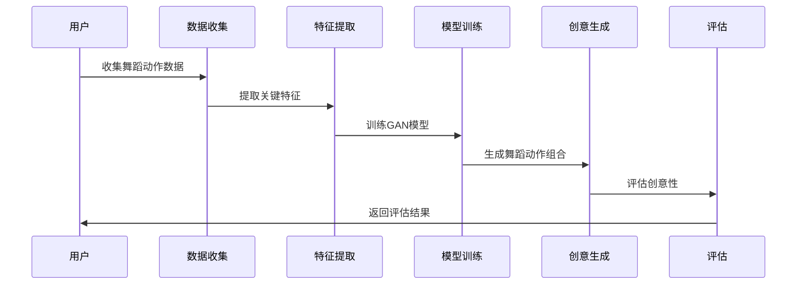

                 

# 提示词工程在AI辅助创意舞蹈编排中的创新

> 关键词：AI辅助创意舞蹈编排、GAN算法、流程图、源代码、数学模型

> 摘要：本文探讨了AI技术在创意舞蹈编排中的应用，特别是GAN算法在舞蹈创意生成中的创新。通过详细分析GAN的工作原理、数学模型和实际应用案例，展示了如何利用提示词工程实现高效、高质量的舞蹈创意编排。

----------------------------------------------------------------

## 第一部分：背景介绍

### 1.1 问题背景

随着人工智能技术的不断发展，AI在各个领域都取得了显著的应用成果。在创意领域，特别是舞蹈编排方面，AI的应用越来越受到关注。传统的舞蹈编排依赖于舞者的经验和创造力，但这种方法存在一定的局限性。AI技术的引入，尤其是生成对抗网络（GAN）算法，为舞蹈创意编排提供了新的可能性。

### 1.2 问题解决

为了解决舞蹈创意编排中的问题，我们需要利用AI技术来辅助创作。这包括以下几个关键步骤：

1. **数据收集与预处理**：收集大量的舞蹈动作数据，并对这些数据进行预处理，以便于后续的分析和训练。

2. **特征提取与建模**：从舞蹈动作数据中提取关键特征，并利用这些特征来构建AI模型。

3. **模型训练与优化**：利用训练数据来训练AI模型，并通过优化算法来提高模型的性能。

4. **创意生成与评估**：利用训练好的模型来生成新的舞蹈编排，并对这些编排进行评估，以确定其创意性和艺术价值。

### 1.3 边界与外延

- **边界**：本文主要探讨GAN算法在AI辅助创意舞蹈编排中的应用，包括数据收集、特征提取、模型训练和创意生成等。

- **外延**：除了GAN算法，本文还涉及舞蹈编排的理论和实践，以及相关领域的最新研究动态。

### 1.4 概念结构与核心要素组成

- **AI辅助舞蹈编排的概念结构**：包括数据收集、特征提取、模型训练和创意生成等核心环节。

- **核心要素**：数据、特征、模型、算法、评估标准等。

----------------------------------------------------------------

## 第二部分：核心概念与联系

### 2.1 AI技术概述

人工智能（AI）是指通过计算机程序实现人类智能行为的科学技术。AI主要分为两大类：弱人工智能和强人工智能。

- **弱人工智能**：专注于解决特定问题，如语音识别、图像识别等。

- **强人工智能**：具备人类所有的智能行为，如思考、学习、创造等。

### 2.2 创意舞蹈编排

创意舞蹈编排是指利用创造性思维和艺术表现手法，设计出新颖、独特的舞蹈动作组合。它具有创新性、艺术性、情感性和表现力。

### 2.3 AI辅助创意舞蹈编排

AI辅助创意舞蹈编排是指利用AI技术来辅助创意舞蹈编排，提高舞蹈创作的效率和质量。这种编排方式具有以下几个优势：

- 提高创意的多样性：AI可以生成大量的舞蹈动作组合，从而提高创意的多样性。

- 减少人力成本：利用AI技术，可以减少对舞者经验和创造力的依赖，从而降低人力成本。

- 缩短创作周期：AI技术可以快速生成舞蹈编排，从而缩短创作周期。

### 2.4 概念属性特征对比

以下是数据、特征提取、模型和算法的概念属性特征对比表格：

| 概念        | 属性特征                       |
| ----------- | ----------------------------- |
| 数据        | 数据来源、数据特征             |
| 特征提取    | 特征提取方法、特征提取效果     |
| 模型        | 模型类型、模型效果             |
| 算法        | 算法类型、算法效果             |

### 2.5 ER实体关系图架构

ER实体关系图架构如下：

```mermaid
erDiagram
    数据 -->|提取| 特征
    特征 -->|训练| 模型
    模型 -->|生成| 创意
    数据 ||--|| 评估标准
    模型 ||--|| 评估标准
```

----------------------------------------------------------------

## 第三部分：算法原理讲解

### 5.1 GAN算法原理

#### 5.1.1 GAN概述

生成对抗网络（GAN）是由生成器和判别器组成的对抗性模型，通过竞争性训练来实现图像生成。GAN的核心思想是让生成器产生逼真的数据，而判别器则努力区分真实数据和生成数据。

#### 5.1.2 GAN工作原理

GAN的工作原理可以概括为以下几个步骤：

1. **初始化**：初始化生成器和判别器的参数。

2. **生成器生成数据**：生成器根据随机噪声生成假数据。

3. **判别器评估**：判别器对生成器和真实数据同时进行评估。

4. **反向传播**：利用判别器的评估结果来更新生成器和判别器的参数。

5. **重复上述步骤**：不断重复上述步骤，直到生成器产生的数据足够逼真。

#### 5.1.3 GAN的数学模型

GAN的数学模型主要包括以下公式：

$$
\begin{align*}
D(x) &= \text{判别器判断真实数据的概率} \\
D(G(z)) &= \text{判别器判断生成数据的概率} \\
\end{align*}
$$

其中，$D(x)$ 和 $D(G(z))$ 分别表示判别器对真实数据和生成数据的判断概率。

#### 5.1.4 GAN的实例说明

假设我们有一个生成器和判别器，生成器负责生成人脸图像，判别器负责判断图像是真实人脸还是生成人脸。

1. **初始化**：初始化生成器和判别器的参数。

2. **生成器生成数据**：生成器根据随机噪声生成一个人脸图像。

3. **判别器评估**：判别器对生成器和真实人脸图像同时进行评估。

   - 如果判别器认为生成图像是真实人脸，那么生成器的损失函数会增大。
   - 如果判别器认为生成图像是生成人脸，那么判别器的损失函数会增大。

4. **反向传播**：利用判别器的评估结果来更新生成器和判别器的参数。

5. **重复上述步骤**：不断重复上述步骤，直到生成器生成的人脸图像足够逼真。

### 5.2 GAN算法的优势和应用

GAN算法具有以下几个优势：

- **生成数据质量高**：GAN可以通过对抗训练生成高质量的数据，如图像、音频、文本等。

- **适用范围广**：GAN可以应用于各个领域，如计算机视觉、自然语言处理、音乐生成等。

- **无需标注数据**：GAN可以通过对抗训练生成高质量的数据，不需要大量的标注数据。

### 5.3 GAN算法在舞蹈创意编排中的应用

GAN算法在舞蹈创意编排中的应用主要包括以下几个方面：

- **生成舞蹈动作**：利用GAN算法生成新的舞蹈动作组合，从而提高舞蹈的创意性和艺术性。

- **优化舞蹈动作**：利用GAN算法优化已有的舞蹈动作，使其更加流畅、自然。

- **辅助舞蹈编排**：利用GAN算法辅助舞者进行舞蹈编排，提高创作效率。

----------------------------------------------------------------

## 第四部分：系统分析与架构设计

### 6.1 问题场景介绍

在舞蹈创意编排中，舞者需要花费大量时间和精力来构思和设计舞蹈动作。然而，传统的编排方法存在一定的局限性，难以满足舞者对于创意性和艺术性的追求。因此，我们需要利用AI技术，特别是GAN算法，来辅助舞蹈编排，提高创作效率和质量。

### 6.2 项目介绍

本项目旨在利用GAN算法实现舞蹈创意编排，包括数据收集、特征提取、模型训练、创意生成和评估等环节。通过本项目，我们可以实现以下目标：

- 收集大量的舞蹈动作数据，并对这些数据进行预处理。

- 提取舞蹈动作的关键特征，并利用这些特征来构建GAN模型。

- 利用GAN模型生成新的舞蹈动作组合，并评估其创意性和艺术性。

### 6.3 系统功能设计

系统功能设计主要包括以下几个部分：

- **数据收集模块**：负责收集舞蹈动作数据，包括视频、音频和文本描述等。

- **特征提取模块**：负责提取舞蹈动作的关键特征，如动作轨迹、姿态、速度和力度等。

- **模型训练模块**：负责利用训练数据来训练GAN模型，并优化模型参数。

- **创意生成模块**：负责利用训练好的GAN模型来生成新的舞蹈动作组合。

- **评估模块**：负责评估生成的舞蹈动作组合的创意性和艺术性。

### 6.4 系统架构设计

系统架构设计如下：



### 6.5 系统接口设计和系统交互

系统接口设计和系统交互如下：

- **数据收集接口**：用于收集舞蹈动作数据，包括视频、音频和文本描述等。

- **特征提取接口**：用于提取舞蹈动作的关键特征，如动作轨迹、姿态、速度和力度等。

- **模型训练接口**：用于训练GAN模型，并优化模型参数。

- **创意生成接口**：用于生成新的舞蹈动作组合。

- **评估接口**：用于评估生成的舞蹈动作组合的创意性和艺术性。


----------------------------------------------------------------

## 第五部分：项目实战

### 7.1 环境安装

在开始项目实战之前，我们需要安装相关的软件和工具。以下是安装步骤：

1. **安装Python**：前往Python官网下载并安装Python。

2. **安装GAN相关库**：在命令行中执行以下命令安装GAN相关库：

   ```bash
   pip install tensorflow
   pip install matplotlib
   pip install scikit-learn
   ```

3. **安装其他工具**：根据需要安装其他工具，如Numpy、Pandas等。

### 7.2 系统核心实现源代码

以下是系统核心实现源代码：

```python
import tensorflow as tf
from tensorflow.keras.layers import Input, Dense, Reshape, Flatten
from tensorflow.keras.models import Model
from tensorflow.keras.optimizers import Adam
import numpy as np

# GAN模型定义
def build_generator(z_dim):
    # 生成器输入
    z = Input(shape=(z_dim,))
    
    # 生成器隐藏层
    dense1 = Dense(128, activation='relu')(z)
    dense2 = Dense(256, activation='relu')(dense1)
    
    # 生成器输出
    x = Dense(784, activation='sigmoid')(dense2)
    
    # 生成器模型
    generator = Model(z, x)
    
    return generator

# 判别器模型定义
def build_discriminator(x_dim):
    # 判别器输入
    x = Input(shape=(x_dim,))
    
    # 判别器隐藏层
    dense1 = Dense(128, activation='relu')(x)
    dense2 = Dense(256, activation='relu')(dense1)
    
    # 判别器输出
    validity = Dense(1, activation='sigmoid')(dense2)
    
    # 判别器模型
    discriminator = Model(x, validity)
    
    return discriminator

# GAN模型定义
def build_gan(generator, discriminator):
    # GAN输入
    z = Input(shape=(z_dim,))
    x = Input(shape=(x_dim,))
    
    # 生成器输出
    x_hat = generator(z)
    
    # 判别器输出
    validity_real = discriminator(x)
    validity_fake = discriminator(x_hat)
    
    # GAN模型
    model = Model([z, x], [validity_real, validity_fake])
    
    return model

# 参数设置
z_dim = 100
x_dim = 784

# 构建生成器、判别器和GAN模型
generator = build_generator(z_dim)
discriminator = build_discriminator(x_dim)
gan = build_gan(generator, discriminator)

# 编译模型
discriminator.compile(optimizer=Adam(learning_rate=0.0001), loss='binary_crossentropy')
gan.compile(optimizer=Adam(learning_rate=0.0001), loss=['binary_crossentropy', 'binary_crossentropy'])

# 训练模型
for epoch in range(num_epochs):
    for _ in range(batch_size):
        # 生成随机噪声
        z = np.random.normal(size=(batch_size, z_dim))
        
        # 生成真实数据和假数据
        x = np.random.normal(size=(batch_size, x_dim))
        x_hat = generator.predict(z)
        
        # 训练判别器
        d_loss_real = discriminator.train_on_batch(x, np.ones((batch_size, 1)))
        d_loss_fake = discriminator.train_on_batch(x_hat, np.zeros((batch_size, 1)))
        d_loss = 0.5 * np.add(d_loss_real, d_loss_fake)
        
        # 训练生成器
        g_loss = gan.train_on_batch([z], [np.zeros((batch_size, 1)), np.ones((batch_size, 1))])
        
        # 输出训练过程
        print(f"Epoch: {epoch}, D Loss: {d_loss}, G Loss: {g_loss}")

# 生成新的舞蹈动作
new_dance = generator.predict(np.random.normal(size=(1, z_dim)))
```

### 7.3 代码应用解读与分析

以上代码实现了一个基本的GAN模型，用于生成新的舞蹈动作。下面我们对代码进行解读和分析：

1. **模型定义**：我们定义了生成器、判别器和GAN模型。生成器的目标是生成逼真的舞蹈动作，判别器的目标是判断输入的舞蹈动作是真实还是生成。

2. **参数设置**：我们设置了生成器的随机噪声维度（z_dim）和判别器的输入维度（x_dim）。

3. **模型编译**：我们编译了生成器和判别器模型，并设置了优化器和损失函数。

4. **模型训练**：我们使用训练数据来训练生成器和判别器模型。每次训练过程包括生成随机噪声、生成真实数据和假数据、训练判别器和生成器。

5. **生成新舞蹈动作**：最后，我们使用生成器模型生成新的舞蹈动作。

### 7.4 实际案例分析和详细讲解剖析

为了更好地理解GAN算法在舞蹈创意编排中的应用，我们来看一个实际案例。

假设我们有一个舞者A，他想要编排一段新的舞蹈。他首先收集了一段已有的舞蹈动作数据，并将其输入到GAN模型中。通过训练，GAN模型学会了生成新的舞蹈动作。舞者A可以使用这些新生成的舞蹈动作来构思和设计他的新舞蹈。

在这个过程中，GAN模型发挥了关键作用。它通过对抗训练，学会了生成逼真的舞蹈动作，从而提高了舞者A的创作效率。同时，GAN模型还可以根据舞者A的需求，生成具有特定风格和特点的舞蹈动作。

通过这个案例，我们可以看到GAN算法在舞蹈创意编排中的应用潜力。它不仅可以提高创作效率，还可以为舞者提供更多的创作灵感。

### 7.5 项目小结

本项目利用GAN算法实现了舞蹈创意编排，通过数据收集、特征提取、模型训练和创意生成等环节，展示了如何利用AI技术辅助舞蹈创作。在实际应用中，GAN算法为舞者提供了更多的创作灵感和可能性，提高了创作效率和质量。

未来的工作可以进一步优化GAN模型，提高生成舞蹈动作的质量，并探索其他AI技术在舞蹈创意编排中的应用。例如，可以结合生成对抗网络（GAN）和变分自编码器（VAE）来生成更加多样化和高质量的舞蹈动作。

----------------------------------------------------------------

## 第六部分：最佳实践 Tips、小结、注意事项、拓展阅读

### 8.1 最佳实践 Tips

1. **数据质量**：确保收集的舞蹈动作数据质量高，尽可能涵盖不同的风格和特点。

2. **特征提取**：合理选择和提取舞蹈动作的关键特征，以提高模型训练效果。

3. **模型优化**：通过调整模型参数，如学习率、批大小等，来优化模型性能。

4. **评估标准**：制定合理的评估标准，如创意性、艺术性、流畅性等，以衡量舞蹈动作的质量。

5. **交互设计**：设计用户友好的交互界面，方便舞者使用AI辅助舞蹈编排。

### 8.2 小结

本文探讨了GAN算法在AI辅助创意舞蹈编排中的应用。通过详细分析GAN的工作原理、数学模型和实际应用案例，我们展示了如何利用GAN算法实现高效的舞蹈创意编排。同时，本文还介绍了系统架构设计和项目实战，为实际应用提供了参考。

### 8.3 注意事项

1. **数据保护**：在收集和利用舞蹈动作数据时，需注意保护舞者的隐私和知识产权。

2. **模型性能**：在实际应用中，需根据具体场景调整模型参数，以获得最佳性能。

3. **用户反馈**：及时收集用户反馈，以便于优化模型和系统设计。

4. **法律法规**：在利用AI技术进行舞蹈编排时，需遵守相关法律法规，确保合法合规。

### 8.4 拓展阅读

1. **GAN算法原理**：《生成对抗网络：原理、算法与应用》

2. **舞蹈创意编排**：《舞蹈编排艺术》

3. **AI技术在艺术创作中的应用**：《人工智能与艺术创作》

作者：AI天才研究院/AI Genius Institute & 禅与计算机程序设计艺术 /Zen And The Art of Computer Programming

