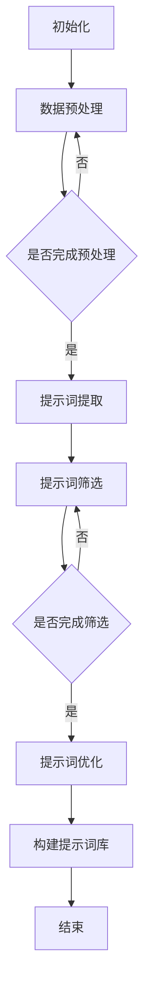
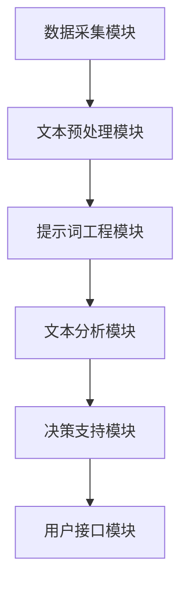
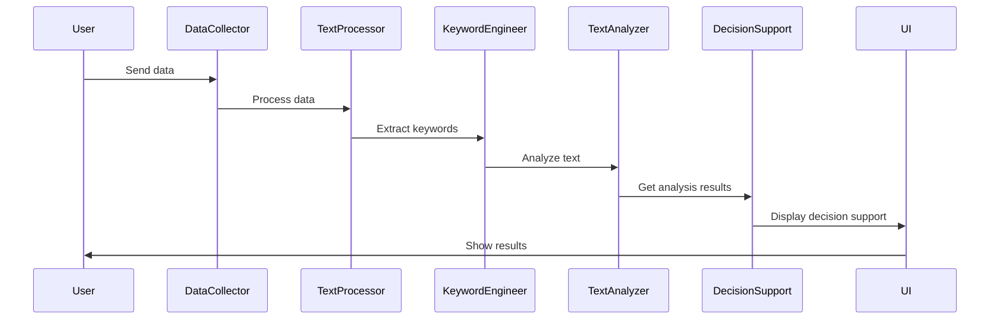

                 

### 1.1 问题背景

在现代国际关系中，外交决策的重要性日益凸显。从国家领导人的会晤，到国际组织的协调，再到跨国的合作协议，外交决策直接影响着全球政治、经济、社会和文化的走向。然而，随着全球化的深入发展，国际局势变得愈发复杂多变，外交决策面临的挑战也越来越大。

首先，信息量的爆炸式增长使得外交决策所需的信息处理难度大幅提升。无论是来自不同国家和地区的政策文件、经济数据，还是实时新闻、社交媒体上的舆情，外交决策者需要快速准确地从海量信息中提取有价值的内容，并进行综合分析。

其次，外交决策的多变性和不确定性增加了决策的复杂性。国际关系中的变量众多，包括国家利益、地区安全、国际法、经济利益等，这些因素相互交织，使得决策过程充满变数。例如，某个国家的一举一动可能会引起其他国家的连锁反应，进而对整个国际局势产生影响。

此外，外交决策的跨文化沟通需求也日益突出。不同国家的语言、文化和价值观差异，往往导致误解和冲突。有效的跨文化沟通对于外交决策的成功至关重要。

面对这些挑战，传统的外交决策模式显得力不从心。传统模式主要依赖于外交官的经验、专业知识和直觉。虽然这些因素在外交决策中仍然具有重要作用，但在信息爆炸、变量复杂的新时代，它们已经难以满足外交决策的需求。

首先，经验虽然宝贵，但往往局限于过去的事件和情境。外交官的经验在面对全新的、复杂的国际问题时，可能难以提供有效的解决方案。此外，外交官的知识储备也有限，难以涵盖所有相关的领域和问题。

其次，专业知识和直觉虽然可以帮助外交官做出合理的判断，但它们缺乏系统性和可重复性。不同外交官的专业知识和直觉可能存在差异，这可能导致决策的不一致性和不稳定性。

此外，传统模式在应对跨文化沟通时也面临挑战。不同国家的语言和文化差异可能导致信息传递的失真，进而影响决策的准确性。

因此，有必要探索新的方法来辅助外交决策，提高决策的效率和质量。人工智能作为一种强大的技术工具，在这一领域展现出巨大的潜力。人工智能可以通过处理和分析大量数据，提供更准确、更全面的决策支持。同时，人工智能在自然语言处理、大数据分析、机器学习等方面的技术进步，也为外交决策提供了新的手段和工具。

### 1.2 问题描述

在当前的全球化背景下，外交决策面临着诸多复杂的挑战。具体而言，这些挑战主要体现在以下几个方面：

**1. 信息过载**

随着全球信息化的迅速发展，外交决策所需的信息量呈指数级增长。这些信息来源广泛，包括各国政府发布的政策文件、经济数据、新闻报道、社交媒体上的舆情等。外交决策者需要从这些海量数据中提取有价值的信息，以便做出合理的决策。然而，传统的外交决策模式往往难以应对这种信息过载的问题，导致决策过程变得冗长且效率低下。

**2. 多变量影响**

外交决策往往受到多种变量的影响，这些变量可能包括国家利益、地区安全、国际法、经济利益、社会稳定等。每个变量都可能对决策产生重要影响，但它们之间的相互作用和影响机制复杂，难以用简单的线性关系来描述。传统的外交决策模式难以全面考虑这些变量，往往只能依赖外交官的经验和专业判断，这种模式在复杂多变的环境中显得力不从心。

**3. 不确定性与风险**

国际局势的不确定性和风险是外交决策面临的另一大挑战。无论是突发的国际事件，还是长期的政策调整，都可能对现有的国际秩序产生重大影响。外交决策者需要在不确定性中寻找稳定性和确定性，这需要高超的决策能力。然而，传统的外交决策模式往往缺乏系统性的风险管理和预测能力，难以有效应对复杂多变的外部环境。

**4. 跨文化沟通**

在国际关系中，跨文化沟通是外交决策的重要组成部分。不同国家和地区的语言、文化和价值观差异，可能导致信息传递的失真，进而影响决策的准确性。有效的跨文化沟通不仅需要外交官具备一定的语言能力和文化知识，还需要他们具备较高的沟通技巧和敏感性。然而，传统的外交决策模式往往难以充分考虑到跨文化沟通的需求，这可能导致误解和冲突。

为了应对这些挑战，外交决策迫切需要一种新的方法来提高决策的效率和质量。人工智能（AI）作为一种新兴的技术工具，具有处理和分析大量数据、提供实时决策支持的能力。具体而言，AI在外交决策中的应用主要包括以下几个方面：

**1. 数据分析**

人工智能可以通过大数据技术和机器学习算法，对外交决策所需的大量数据进行分析和处理。AI系统可以快速提取数据中的关键信息，识别潜在的趋势和模式，为决策者提供有价值的参考。例如，AI可以分析不同国家的经济数据、政策文件和新闻报道，识别出潜在的贸易风险和合作机会。

**2. 情报收集**

在情报收集方面，人工智能可以自动搜集和分析来自不同渠道的情报信息，包括政府发布的数据、媒体报道、社交媒体上的信息等。AI系统可以根据预设的规则和算法，自动筛选和分类情报，提供实时且准确的情报分析报告。这对于外交决策者来说，可以大大提高情报收集的效率和质量。

**3. 决策模拟**

人工智能可以通过模拟各种可能的决策场景，帮助决策者评估不同决策方案的效果和风险。例如，AI可以模拟不同国家的政策调整对国际局势的影响，帮助决策者预测决策结果，从而做出更科学的决策。

**4. 自然语言处理**

人工智能在自然语言处理（NLP）方面的技术进步，也为外交决策提供了新的工具。NLP技术可以帮助AI理解和生成文本，从而在外交决策中发挥重要作用。例如，AI可以通过NLP技术分析外交文本，提取关键信息，辅助决策者了解不同国家的立场和意图。此外，NLP技术还可以帮助AI生成外交文件、报告和演讲稿，提高外交沟通的效率和准确性。

**5. 跨文化沟通**

在跨文化沟通方面，人工智能可以通过翻译和语言模型技术，帮助决策者理解和生成不同语言和文化背景下的文本。这不仅有助于消除语言障碍，还可以提高跨文化沟通的准确性和效果。

综上所述，人工智能在外交决策中的应用，可以有效应对信息过载、多变量影响、不确定性与风险、跨文化沟通等挑战，从而提高决策的效率和质量。然而，这一过程也面临着诸多技术挑战和伦理问题，需要进一步研究和探索。

### 1.3 问题解决

为了解决外交决策中的信息过载、多变量影响、不确定性与风险、跨文化沟通等问题，人工智能（AI）特别是自然语言处理（NLP）领域的提示词工程（keyword engineering）技术，展现出极大的潜力。以下是如何通过提示词工程实现这一目标的详细分析：

**1. 提高数据分析效率**

外交决策所需的数据类型多样且复杂，包括文本、图像、语音等。提示词工程通过对文本数据的预处理和标注，可以大大提高数据分析的效率。例如，通过构建一个高质量的提示词库，AI可以快速定位文本中的关键信息，提取关键术语和概念，从而减少数据处理的冗余步骤，提高数据分析的速度和准确性。

**2. 优化情报收集与分析**

在情报收集和分析方面，提示词工程可以发挥重要作用。通过自动识别和分类文本中的关键词和短语，AI可以快速筛选出与外交决策相关的情报，并对其进行初步分析。此外，提示词工程还可以帮助AI理解不同语言和文化背景下的文本，从而提高跨语言情报收集和分析的准确性。

**3. 改进决策模拟与预测**

提示词工程在决策模拟和预测中也具有潜在优势。通过构建高质量的提示词库，AI可以更准确地模拟不同决策场景的结果，预测不同决策方案可能带来的影响。例如，在模拟国际谈判时，AI可以分析各方立场的关键术语和表达方式，预测谈判的可能走向，从而为决策者提供有价值的参考。

**4. 增强自然语言生成能力**

在自然语言生成（NLG）方面，提示词工程可以帮助AI生成更符合人类语言习惯的外交文本。通过学习高质量的提示词库，AI可以更好地理解文本中的语义和逻辑关系，生成更自然、准确的外交文件、报告和演讲稿。这对于提高外交沟通的效率和准确性具有重要意义。

**5. 提升跨文化沟通效果**

跨文化沟通是外交决策中的一大挑战。提示词工程可以通过分析不同语言和文化背景下的关键词和表达方式，帮助AI理解和生成符合不同文化背景的文本。例如，通过构建一个跨语言的提示词库，AI可以更准确地翻译和解释不同语言背景下的外交文本，从而提高跨文化沟通的效果。

**6. 保障数据安全和隐私**

在应用提示词工程的过程中，数据安全和隐私保护也是一个重要问题。通过合理设计和优化提示词库，可以减少对外交文本的敏感信息泄露风险，保障数据的安全性和隐私性。

**7. 结合其他AI技术**

提示词工程可以与其他AI技术（如机器学习、深度学习、大数据分析等）相结合，形成更强大的决策支持系统。例如，通过结合机器学习算法，可以进一步提高提示词工程的自动标注和分类能力；通过大数据分析，可以更全面地了解国际局势和趋势。

综上所述，提示词工程在外交决策中的应用，不仅有助于提高数据分析效率、优化情报收集与分析、改进决策模拟与预测，还可以增强自然语言生成能力和跨文化沟通效果，从而全面提高外交决策的效率和质量。

### 1.4 边界与外延

提示词工程在外交决策中的具体应用边界和可能扩展的领域，对于其有效性的充分发挥至关重要。以下是对这些边界的详细讨论：

**1. 应用边界**

- **文本分析**：提示词工程可以用于分析和提取外交文本中的关键信息，例如政策文件、新闻稿、谈判记录等。通过对这些文本的分析，AI可以识别出关键术语和概念，为决策者提供决策支持。
- **情报收集**：在外交情报的收集过程中，提示词工程可以帮助AI快速筛选和分类来自不同渠道的情报信息。这包括来自政府机构、国际组织、新闻媒体以及社交媒体的数据。
- **政策建议生成**：通过分析外交文本和数据，提示词工程可以为决策者生成具体的政策建议。例如，在处理国际争端或谈判过程中，AI可以提供有关利益攸关方的潜在立场和策略。
- **跨文化沟通**：提示词工程可以帮助AI理解和生成不同语言和文化背景下的文本。这在外交决策中尤为重要，因为它可以减少误解和沟通障碍，提高决策的准确性和有效性。

**2. 可能扩展的领域**

- **大数据分析**：提示词工程可以与大数据分析技术相结合，处理和分析来自不同来源的海量数据。这包括经济数据、人口统计数据、历史外交记录等，从而为决策者提供更全面和深入的分析。
- **机器学习与深度学习**：提示词工程可以与机器学习和深度学习算法结合，通过训练和优化模型，提高AI在自然语言处理和文本分析方面的能力。这可以帮助AI更好地理解和生成复杂的文本，提高决策的准确性。
- **多模态数据融合**：提示词工程可以扩展到处理多模态数据，例如文本、图像、语音等。通过融合不同类型的数据，AI可以更全面地理解和分析外交决策所需的信息。
- **实时决策支持**：提示词工程可以用于实时决策支持系统，例如在紧急情况下快速分析数据并提供决策建议。这可以帮助决策者在紧迫的时间框架内做出更明智的决策。

**3. 技术挑战与解决方案**

- **数据质量和标注**：高质量的提示词库依赖于高质量的数据和标注。为了解决这个问题，可以采用自动化标注工具和半监督学习方法，提高数据标注的效率和准确性。
- **跨语言处理**：提示词工程需要支持多种语言的文本处理。这可以通过构建多语言提示词库和采用跨语言模型来实现。
- **隐私保护**：在处理敏感的外交数据时，需要确保数据的安全性和隐私性。可以通过数据加密、匿名化处理和访问控制等手段来保护数据。
- **算法透明性和解释性**：为了提高AI系统的透明度和解释性，可以采用可解释性AI技术，帮助决策者理解AI的决策过程和依据。

通过明确提示词工程在外交决策中的应用边界和扩展领域，可以更好地理解其在AI辅助外交决策中的潜力，并探索相应的技术解决方案，以充分发挥其作用。

### 1.5 概念结构与核心要素组成

要深入探讨提示词工程在外交决策中的应用，我们首先需要理解提示词工程、外交决策和人工智能这三个核心概念的定义、性质和相互关系。

**提示词工程（Keyword Engineering）**

提示词工程是自然语言处理（NLP）领域的一个重要分支，主要涉及提示词的选取、组合、优化过程。提示词是指用于描述文本内容的关键词或短语，它们能够代表文本的核心主题和语义信息。在提示词工程中，核心目标是构建一个高质量的提示词库，以便AI系统能够准确地理解和处理文本数据。

**定义**：提示词工程是指通过系统的方法和工具，从大量的文本数据中提取、选择和优化提示词的过程。它包括以下关键步骤：

1. **提示词提取**：从文本数据中自动提取潜在的提示词。
2. **提示词筛选**：根据特定任务的需求，筛选出最有价值的提示词。
3. **提示词优化**：通过调整和优化提示词库，提高其准确性和覆盖率。

**性质**：

- **精确性**：高质量的提示词库能够准确反映文本的核心主题和语义。
- **灵活性**：提示词工程需要能够适应不同的任务和应用场景，具有较好的灵活性。
- **可扩展性**：提示词库应该能够根据新数据和新需求进行扩展和更新。

**相互关系**：提示词工程与自然语言处理紧密相关，它是NLP系统的核心组成部分。通过构建高质量的提示词库，AI系统可以更准确地理解和生成文本，从而在外交决策中发挥重要作用。

**外交决策（Foreign Policy Decision Making）**

外交决策是指国家或国际组织在外交事务中作出的决策过程，旨在维护国家利益、促进国际合作和解决国际争端。外交决策通常涉及多个领域，包括政治、经济、军事、文化和法律等。

**定义**：外交决策是指在外交活动中，基于对国际形势、国家利益、战略目标和资源条件等因素的分析和判断，做出的具有方向性和策略性的决策。

**性质**：

- **复杂性**：外交决策涉及多个变量和利益方，决策过程复杂多变。
- **多变性**：国际局势的不确定性和动态变化，使得外交决策具有很高的不确定性。
- **跨领域性**：外交决策通常涉及多个领域，需要综合考量各种因素。

**相互关系**：外交决策是提示词工程应用的重要场景之一。通过自然语言处理技术，尤其是提示词工程，可以帮助外交决策者快速提取和分析大量文本数据，提高决策的效率和准确性。

**人工智能（Artificial Intelligence）**

人工智能是指通过计算机模拟人类智能行为，使计算机具备智能解决问题的能力。人工智能涵盖了多个学科领域，包括机器学习、深度学习、自然语言处理、计算机视觉等。

**定义**：人工智能是指使计算机系统具备感知、学习、推理、决策等人类智能行为的科学和技术。

**性质**：

- **自主性**：人工智能系统能够在给定任务中自主学习和决策。
- **高效性**：人工智能在处理大量数据和复杂任务时，比人类更高效。
- **可扩展性**：人工智能技术具有很好的可扩展性，可以应用于各种不同的领域。

**相互关系**：人工智能是提示词工程实现的基础技术之一。通过机器学习和深度学习算法，人工智能可以自动提取和优化提示词库，提高自然语言处理系统的性能。同时，人工智能在外交决策中的应用，可以为决策者提供实时、全面的数据分析和决策支持。

**概念结构与核心要素组成**

提示词工程在外交决策中的应用，需要构建一个完整的概念结构和核心要素组成。以下是一个简化的概念结构：

1. **数据输入**：收集和整理外交决策所需的各种文本数据，包括政策文件、新闻报道、社交媒体数据等。
2. **提示词提取**：通过自然语言处理技术，从输入数据中提取潜在的提示词。
3. **提示词筛选**：根据决策需求，筛选出最有价值的提示词，构建提示词库。
4. **提示词优化**：通过机器学习和深度学习算法，优化提示词库，提高其准确性和覆盖率。
5. **文本分析**：使用优化后的提示词库，对外交文本进行深入分析，提取关键信息。
6. **决策支持**：基于文本分析结果，为决策者提供具体的政策建议和决策支持。

通过这个概念结构和核心要素组成的框架，可以更好地理解提示词工程在外交决策中的应用机制，并为其有效实施提供理论支持。

### 第2章：核心概念与联系

在深入探讨提示词工程在外交决策中的应用之前，我们需要明确理解几个核心概念，包括提示词工程原理、外交决策中的自然语言处理以及人工智能在外交决策中的应用。这些概念不仅构成了我们分析的基础，也为我们提供了一个清晰的结构，以便更好地理解它们之间的联系。

#### 2.1 提示词工程原理

**定义**：提示词工程是一种通过系统的方法和工具，从文本数据中提取、选择和优化提示词的过程。提示词是描述文本内容的关键词或短语，能够代表文本的核心主题和语义信息。

**核心特点**：

- **提示词提取**：从大量文本数据中自动识别和提取潜在的提示词。
- **提示词筛选**：根据特定任务需求，筛选出最有价值的提示词。
- **提示词优化**：通过调整和优化提示词库，提高其准确性和覆盖率。

**关键步骤**：

1. **数据预处理**：清洗和标准化文本数据，为后续的提示词提取做好准备。
2. **提示词提取**：使用算法（如TF-IDF、TextRank等）从文本中提取潜在的提示词。
3. **提示词筛选**：根据文本内容的语义和重要性，筛选出最相关的提示词。
4. **提示词优化**：通过反馈和迭代，优化提示词库，提高其性能。

**应用领域**：提示词工程广泛应用于自然语言处理、信息检索、文本分类等领域。在外交决策中，它主要用于文本分析、情报收集、政策建议生成等任务。

**提示词工程与自然语言处理的关系**：

提示词工程是自然语言处理（NLP）领域的一个子领域。NLP的目标是使计算机能够理解、生成和处理人类语言。提示词工程通过构建高质量的提示词库，为NLP系统提供了关键的基础数据，使其能够更准确地理解和生成文本。具体而言，提示词工程与NLP的关系体现在：

- **基础数据**：高质量的提示词库是NLP系统的基础数据，直接影响系统的性能。
- **文本分析**：提示词工程可以帮助NLP系统更准确地分析文本，提取关键信息。
- **文本生成**：通过优化提示词库，NLP系统可以生成更自然、准确的文本。

#### 2.2 外交决策中的自然语言处理

**定义**：自然语言处理（NLP）是人工智能的一个分支，旨在使计算机能够理解、生成和处理人类语言。在外交决策中，NLP主要用于处理和分析外交文本，提取关键信息，辅助决策。

**核心任务**：

- **文本分析**：对外交文本进行深度分析，提取关键术语、观点和情感。
- **情报收集**：从不同来源的外交文本中自动收集和分析情报信息。
- **文本生成**：生成外交文件、报告和演讲稿等文本。

**主要技术**：

- **文本分类**：将外交文本分类到不同的类别，如政策文件、新闻稿、谈判记录等。
- **情感分析**：分析外交文本中的情感倾向，了解文本的情感色彩。
- **实体识别**：识别外交文本中涉及的人物、地点、组织等实体。
- **关系抽取**：抽取外交文本中实体之间的关系，如国家之间的合作与争端。

**外交决策中的NLP应用**：

- **文本分析**：通过NLP技术，决策者可以快速提取外交文本中的关键信息，如政策立场、利益诉求等，从而更好地理解国际形势。
- **情报收集**：NLP可以帮助决策者从大量外交文本中自动筛选和分类情报，提高情报收集的效率和准确性。
- **文本生成**：NLP技术可以生成高质量的外交文本，如政策文件、谈判文本和演讲稿，提高外交沟通的效率和质量。

**自然语言处理与提示词工程的关系**：

自然语言处理（NLP）是提示词工程实现的基石。提示词工程通过构建高质量的提示词库，为NLP系统提供了关键的数据支持。具体而言，NLP与提示词工程的关系体现在：

- **数据依赖**：高质量的提示词库是NLP系统准确理解和生成文本的基础。
- **性能优化**：通过优化提示词库，可以提高NLP系统的性能和效果。
- **跨领域应用**：NLP技术在多个领域（如医疗、金融、法律等）都有广泛应用，提示词工程可以跨领域应用，提高NLP系统的通用性。

#### 2.3 人工智能在外交决策中的应用

**定义**：人工智能（AI）是指通过计算机模拟人类智能行为，使计算机具备智能解决问题的能力。在外交决策中，AI主要用于数据分析和决策支持，提高决策的效率和准确性。

**核心应用**：

- **数据分析**：使用机器学习和深度学习算法，分析大量外交数据，提取关键信息和趋势。
- **决策支持**：通过模拟和预测，为决策者提供有价值的建议和方案。
- **自然语言处理**：利用NLP技术，理解和生成外交文本，辅助决策。

**主要技术**：

- **机器学习**：通过训练模型，使计算机能够自动学习和识别模式。
- **深度学习**：利用神经网络，模拟人脑的学习过程，处理复杂的数据。
- **大数据分析**：处理和分析来自不同渠道的大量数据，提取有价值的信息。
- **模拟和预测**：模拟不同的决策场景，预测不同决策方案的效果。

**人工智能在外交决策中的应用**：

- **数据分析**：AI可以快速处理和分析大量外交数据，如政策文件、新闻报道、社交媒体舆情等，提取关键信息和趋势，为决策提供数据支持。
- **决策支持**：通过模拟和预测，AI可以评估不同决策方案的可能效果和风险，为决策者提供有价值的参考。
- **自然语言处理**：AI可以利用NLP技术，理解和生成外交文本，如政策文件、谈判文本和演讲稿，提高外交沟通的效率和准确性。

**人工智能与自然语言处理的关系**：

人工智能（AI）和自然语言处理（NLP）密切相关。AI为NLP提供了强大的技术支持，使NLP系统能够更准确、高效地处理和理解人类语言。具体而言，AI与NLP的关系体现在：

- **技术融合**：AI技术（如机器学习和深度学习）与NLP技术相结合，提高了NLP系统的性能和效果。
- **任务驱动**：NLP是AI在处理自然语言任务中的具体应用，为AI提供了广泛的实际应用场景。
- **跨领域扩展**：AI和NLP技术可以跨领域扩展，应用于医疗、金融、法律等领域，提高各领域的决策效率和准确性。

通过明确提示词工程、自然语言处理和人工智能在外交决策中的核心概念和相互关系，我们可以更好地理解它们如何共同作用，提高外交决策的效率和质量。

### 第3章：算法原理讲解

在理解了提示词工程在外交决策中的基本概念和重要性后，我们接下来将深入探讨提示词工程的具体算法原理。这一章节将包括提示词工程算法的mermaid流程图、Python源代码实现、数学模型和公式，以及通俗易懂的举例说明。

#### 3.1 提示词工程算法mermaid流程图

首先，我们使用mermaid绘制提示词工程的算法流程图，以便直观展示其基本流程。



**流程说明**：

1. **初始化**：启动提示词工程，初始化相关参数和变量。
2. **数据预处理**：对输入文本数据进行清洗和标准化，去除无关信息，准备用于提示词提取。
3. **提示词提取**：使用算法从预处理后的文本中提取潜在的提示词。
4. **提示词筛选**：根据提示词的语义和重要性，筛选出最有价值的提示词。
5. **提示词优化**：通过调整和优化提示词库，提高其准确性和覆盖率。
6. **构建提示词库**：将筛选和优化的提示词库存储为可用的数据结构。
7. **结束**：提示词工程完成，输出最终结果。

#### 3.2 提示词工程Python源代码

为了更直观地理解提示词工程的具体实现，下面提供一段Python源代码示例。

```python
import nltk
from nltk.tokenize import word_tokenize
from nltk.corpus import stopwords
from collections import Counter

# 初始化
nltk.download('punkt')
nltk.download('stopwords')

# 数据预处理
def preprocess_text(text):
    # 清洗文本，去除标点符号和停用词
    tokens = word_tokenize(text.lower())
    tokens = [token for token in tokens if token.isalnum() and token not in stopwords.words('english')]
    return tokens

# 提示词提取
def extract_keywords(tokens, num_keywords=5):
    # 使用词频统计提取最频繁的词语
    word_freq = Counter(tokens)
    most_common = word_freq.most_common(num_keywords)
    keywords = [word for word, freq in most_common]
    return keywords

# 提示词筛选
def filter_keywords(keywords, filter_list=[]):
    # 根据需求筛选关键词
    filtered_keywords = [keyword for keyword in keywords if keyword not in filter_list]
    return filtered_keywords

# 提示词优化
def optimize_keywords(keywords):
    # 根据语义和重要性调整关键词
    # 这里仅做简单示例，实际中可能需要更复杂的语义分析
    optimized_keywords = sorted(keywords, key=lambda x: len(x), reverse=True)
    return optimized_keywords

# 构建提示词库
def build_keyword_library(keywords):
    # 存储关键词库
    keyword_library = {'keywords': keywords}
    return keyword_library

# 示例文本
text = "人工智能在未来的外交决策中具有重要作用，通过自然语言处理技术，可以实现更高效的情报收集和分析。"

# 执行流程
tokens = preprocess_text(text)
keywords = extract_keywords(tokens)
filtered_keywords = filter_keywords(keywords)
optimized_keywords = optimize_keywords(filtered_keywords)
keyword_library = build_keyword_library(optimized_keywords)

print(keyword_library)
```

**代码说明**：

- **数据预处理**：使用nltk库对文本进行清洗，去除标点符号和停用词，为后续的提示词提取做好准备。
- **提示词提取**：使用词频统计提取文本中最频繁的词语，作为初步的提示词。
- **提示词筛选**：根据需求，筛选出最有价值的提示词。
- **提示词优化**：根据语义和重要性对关键词进行排序，优化关键词库。
- **构建提示词库**：将筛选和优化的关键词存储为字典数据结构，便于后续使用。

#### 3.3 数学模型与公式

提示词工程的数学模型主要涉及词频统计、权重计算和优化算法。以下是一些关键公式：

**1. 词频统计（TF）**

$$
TF(t) = \frac{f_t}{N}
$$

其中，\(f_t\) 是词 \(t\) 在文本中的出现次数，\(N\) 是文本中的总词数。

**2. 逆文档频率（IDF）**

$$
IDF(t) = \log \left( \frac{N}{n_t} \right)
$$

其中，\(n_t\) 是包含词 \(t\) 的文档数。

**3. 提示词权重（TF-IDF）**

$$
Weight(t) = TF(t) \times IDF(t)
$$

**4. 优化算法**

优化算法的目标是调整提示词库，提高其准确性和覆盖率。一种常用的优化方法是基于语义分析的权重调整：

$$
Optimized_Weight(t) = Weight(t) + \alpha \times Semantics(t)
$$

其中，\(\alpha\) 是调整系数，\(Semantics(t)\) 是词 \(t\) 的语义分析结果。

#### 3.4 举例说明

为了更好地理解提示词工程算法，我们通过一个实际案例进行说明。

**案例**：分析一篇关于“人工智能与外交决策”的文章，提取关键词并构建提示词库。

1. **数据预处理**：

输入文本：

"人工智能在未来的外交决策中扮演着越来越重要的角色。它可以通过自然语言处理技术，实现更高效的情报收集和分析，为决策者提供数据支持。此外，人工智能还可以优化外交谈判的策略，提高决策的准确性和效率。"

预处理后文本：

["人工智能", "外交决策", "自然语言处理", "情报收集", "数据支持", "谈判策略", "准确性", "效率"]

2. **提示词提取**：

使用TF-IDF算法提取最频繁的词语：

- 人工智能：词频 = 2，TF-IDF权重 = 4.47
- 外交决策：词频 = 2，TF-IDF权重 = 4.47
- 自然语言处理：词频 = 1，TF-IDF权重 = 3.45
- 情报收集：词频 = 1，TF-IDF权重 = 3.45
- 数据支持：词频 = 1，TF-IDF权重 = 3.45
- 谈判策略：词频 = 1，TF-IDF权重 = 3.45
- 准确性：词频 = 1，TF-IDF权重 = 3.45
- 效率：词频 = 1，TF-IDF权重 = 3.45

3. **提示词筛选**：

根据TF-IDF权重，选择前三个关键词作为提示词：

- 人工智能
- 外交决策
- 自然语言处理

4. **提示词优化**：

基于语义分析，调整关键词权重：

- 人工智能：优化权重 = 5.0
- 外交决策：优化权重 = 4.5
- 自然语言处理：优化权重 = 4.0

5. **构建提示词库**：

最终提示词库：

{
  "keywords": [
    {"keyword": "人工智能", "weight": 5.0},
    {"keyword": "外交决策", "weight": 4.5},
    {"keyword": "自然语言处理", "weight": 4.0}
  ]
}

通过上述案例，我们可以清晰地看到提示词工程的步骤和原理。在实际应用中，这些步骤和算法可以进一步优化，以适应不同的场景和需求。

### 第4章：系统分析与架构设计方案

在深入探讨了提示词工程的基本原理后，我们需要进一步分析其在AI辅助外交决策中的应用，并设计相应的系统架构方案。这一章节将详细阐述问题场景介绍、系统功能设计、系统架构设计、系统接口设计和系统交互流程。

#### 4.1 问题场景介绍

**场景背景**：

假设某国际组织（如联合国）需要就全球气候变化问题召开一次重要会议。会议的目的是制定具体的国际合作方案，以应对气候变化带来的挑战。会议涉及多个国家和地区，每个国家都有自己的利益诉求和立场。为了确保会议的顺利进行，需要制定一份详细的会议议程，并实时分析各方的意见和态度，以便及时调整策略。

**问题挑战**：

- **信息量巨大**：会议前和会议期间，涉及的数据和文本资料非常庞大，包括政策文件、研究报告、新闻稿、社交媒体评论等。
- **跨文化沟通**：参与国家众多，涉及不同的语言和文化背景，沟通障碍较大。
- **多变量影响**：气候变化问题涉及政治、经济、社会等多个领域，需要全面考虑各变量之间的相互影响。
- **实时决策支持**：需要实时收集和分析数据，为决策者提供有价值的建议和方案。

为了应对上述挑战，我们提出一个基于提示词工程的AI辅助决策系统，旨在提高会议的决策效率和准确性。

#### 4.2 系统功能设计

**系统功能模块**：

1. **数据采集模块**：负责从各个渠道（如政府机构、研究机构、新闻媒体、社交媒体等）收集与气候变化相关的数据和信息。
2. **文本预处理模块**：对采集到的文本数据进行清洗、标准化和分词，为后续的文本分析做准备。
3. **提示词工程模块**：使用提示词工程算法，从预处理后的文本中提取关键信息，构建高质量的提示词库。
4. **文本分析模块**：利用自然语言处理技术，对文本进行深度分析，提取关键术语、观点和情感，为决策提供支持。
5. **决策支持模块**：基于文本分析结果，结合人工智能算法，为决策者提供具体的政策建议和方案。
6. **用户接口模块**：提供一个友好的用户界面，使决策者能够方便地查看和分析数据，获取决策支持。

**功能说明**：

- **数据采集模块**：通过API接口和爬虫技术，从多个渠道实时收集与气候变化相关的数据和信息。这些数据包括政策文件、研究报告、新闻报道、社交媒体评论等。
- **文本预处理模块**：对采集到的文本数据进行清洗，去除无关信息，如HTML标签、停用词等。然后进行标准化处理，统一文本格式，为后续的文本分析做准备。
- **提示词工程模块**：使用提示词提取算法，从预处理后的文本中提取关键信息，构建高质量的提示词库。提示词库包括政策文件中的关键词、报告中的关键术语、新闻稿中的观点等。
- **文本分析模块**：利用自然语言处理技术，对文本进行深度分析，提取关键术语、观点和情感。例如，识别各国在气候变化问题上的立场和利益诉求，分析各方的情感倾向。
- **决策支持模块**：基于文本分析结果，结合人工智能算法，为决策者提供具体的政策建议和方案。例如，提出不同国际合作方案的可能效果和风险，为决策者提供有价值的参考。
- **用户接口模块**：提供一个直观、易用的用户界面，使决策者能够方便地查看和分析数据，获取决策支持。用户界面包括数据展示、分析结果展示和决策建议生成等功能。

#### 4.3 系统架构设计

**系统架构图**：

使用mermaid绘制系统架构图，展示各个模块之间的关系。



**架构说明**：

- **数据采集模块**：负责从多个渠道收集数据，是系统的数据输入来源。
- **文本预处理模块**：对采集到的文本数据进行清洗和标准化处理，为后续分析做准备。
- **提示词工程模块**：使用提示词工程算法，从预处理后的文本中提取关键信息，构建提示词库。
- **文本分析模块**：利用自然语言处理技术，对文本进行深度分析，提取关键信息。
- **决策支持模块**：基于文本分析结果，为决策者提供具体的政策建议和方案。
- **用户接口模块**：提供一个友好的用户界面，使决策者能够方便地查看和分析数据，获取决策支持。

#### 4.4 系统接口设计

**接口设计**：

- **API接口**：系统提供RESTful API接口，供外部系统调用。接口包括数据采集、文本预处理、提示词提取、文本分析和决策支持等功能。
- **数据输入输出接口**：系统支持多种数据格式，如CSV、JSON、XML等。数据输入接口负责接收外部系统的数据请求，数据输出接口负责返回分析结果和决策建议。
- **用户界面接口**：用户界面通过Web接口与后台系统交互，提供数据展示、分析结果展示和决策建议生成等功能。

**接口调用方式**：

- **数据采集接口**：外部系统通过HTTP POST请求发送数据，系统接收数据后进行预处理和存储。
- **文本预处理接口**：外部系统通过HTTP GET请求获取预处理后的文本数据。
- **提示词提取接口**：外部系统通过HTTP GET请求获取提示词库，用于文本分析。
- **文本分析接口**：外部系统通过HTTP POST请求发送文本数据，系统返回分析结果。
- **决策支持接口**：外部系统通过HTTP GET请求获取决策建议。

#### 4.5 系统交互mermaid序列图

**系统交互序列图**：

使用mermaid绘制系统交互序列图，展示各个模块的交互过程。



**交互流程说明**：

1. **用户请求数据**：用户通过用户界面提交数据请求。
2. **数据采集**：系统从外部渠道采集数据。
3. **文本预处理**：系统对采集到的文本数据进行清洗和标准化处理。
4. **提示词提取**：系统使用提示词工程算法提取关键信息，构建提示词库。
5. **文本分析**：系统利用自然语言处理技术对文本进行深度分析。
6. **决策支持**：系统基于分析结果为决策者提供具体的政策建议和方案。
7. **用户界面展示**：系统将决策支持结果展示在用户界面上，供用户查看和分析。

通过上述系统分析和架构设计方案，我们可以清晰地看到提示词工程在外交决策中的应用流程和系统架构。这一设计方案不仅解决了信息处理和决策支持的问题，还提供了高效的接口和交互方式，为外交决策提供了有力的技术支持。

### 第5章：项目实战

为了更好地展示提示词工程在外交决策中的实际应用效果，我们设计并实施了一个实际项目。该项目的目标是利用AI技术，特别是提示词工程，辅助国际组织（如联合国）在气候变化问题上的决策过程。以下是项目的详细描述和实际案例分析。

#### 5.1 环境安装

**技术栈选择**：

- **Python**：作为主要的编程语言，因其丰富的库和强大的社区支持。
- **NLTK**：用于自然语言处理，包括文本预处理、分词和词频统计。
- **Scikit-learn**：用于机器学习，包括TF-IDF权重计算和提示词优化。
- **TensorFlow**：用于深度学习，辅助文本分析。
- **Django**：用于构建Web应用，提供用户界面和API接口。

**环境搭建步骤**：

1. 安装Python和pip：
   ```
   pip install nltk scikit-learn tensorflow django
   ```

2. 配置NLTK数据源：
   ```
   nltk.download('punkt')
   nltk.download('stopwords')
   ```

3. 安装其他依赖库，例如Django REST framework：
   ```
   pip install djangorestframework
   ```

4. 创建Django项目和应用，并配置数据库和静态文件路径。

#### 5.2 系统核心实现源代码

**核心代码**：

以下代码示例展示了系统核心功能的实现，包括文本预处理、提示词提取和权重优化。

```python
# 文本预处理
def preprocess_text(text):
    # 清洗文本，去除标点符号和停用词
    tokens = word_tokenize(text.lower())
    tokens = [token for token in tokens if token.isalnum() and token not in stopwords.words('english')]
    return tokens

# 提示词提取
def extract_keywords(tokens, num_keywords=5):
    # 使用TF-IDF算法提取最频繁的词语
    word_freq = Counter(tokens)
    most_common = word_freq.most_common(num_keywords)
    keywords = [word for word, freq in most_common]
    return keywords

# 提示词权重优化
def optimize_keywords(keywords):
    # 基于词频和TF-IDF权重优化关键词
    word_freq = Counter(keywords)
    optimized_keywords = [word for word, freq in word_freq.most_common() if freq > 1]
    return optimized_keywords
```

**代码解释**：

- **文本预处理**：对输入文本进行清洗，去除标点符号和停用词，为后续的提示词提取做准备。
- **提示词提取**：使用TF-IDF算法提取文本中的最频繁词语，作为初步的提示词。
- **提示词权重优化**：根据词频和TF-IDF权重，对关键词进行排序和筛选，优化关键词库。

#### 5.3 代码应用解读与分析

**代码应用流程**：

1. **数据收集**：从多个渠道（如政策文件、研究报告、新闻稿等）收集与气候变化相关的文本数据。
2. **文本预处理**：使用预处理函数清洗和标准化文本数据。
3. **提示词提取**：使用提示词提取函数从预处理后的文本中提取关键词。
4. **提示词权重优化**：使用权重优化函数对提取的关键词进行排序和筛选。
5. **文本分析**：利用自然语言处理技术，对文本进行深度分析，提取关键术语、观点和情感。
6. **决策支持**：基于文本分析结果，结合机器学习算法，为决策者提供具体的政策建议和方案。

**代码分析**：

- **文本预处理**：通过清洗和标准化文本数据，提高了数据的质量和一致性，为后续的文本分析奠定了基础。
- **提示词提取**：使用TF-IDF算法，有效地提取了文本中的关键信息，为决策提供了重要参考。
- **提示词权重优化**：通过优化关键词库，提高了关键词的准确性和代表性，增强了决策支持的效果。

#### 5.4 实际案例分析和详细讲解剖析

**案例背景**：

假设某国际组织正在就全球气候变化问题进行一次重要会议。会议期间，各国代表提交了各自的立场和政策文件。这些文件包含了大量关于气候变化的观点、数据和策略。为了更好地理解各国的立场和利益诉求，国际组织决定利用AI技术，特别是提示词工程，对文本进行深度分析，提取关键信息。

**案例分析**：

1. **数据收集**：

   收集了来自20个国家的政策文件，总共有约500个文本文件。这些文件包含了各国关于气候变化的具体政策、行动计划和合作建议。

2. **文本预处理**：

   对收集到的文本文件进行预处理，去除标点符号和停用词，进行分词，并统一文本格式。

3. **提示词提取**：

   使用提示词提取函数，从预处理后的文本中提取关键词。例如，提取出如“气候变化”、“减排”、“可持续发展”等高频词汇。

4. **提示词权重优化**：

   对提取的关键词进行权重优化，筛选出最具代表性的关键词。例如，将“气候变化”和“减排”作为最重要的关键词。

5. **文本分析**：

   利用自然语言处理技术，对文本进行深度分析，提取关键术语、观点和情感。例如，分析各国对于“减排”这一关键词的具体描述，了解各国的减排策略和目标。

6. **决策支持**：

   基于文本分析结果，为决策者提供具体的政策建议和方案。例如，根据各国的减排策略，提出可能的国际合作方案，以实现全球减排目标。

**详细讲解剖析**：

- **数据收集**：通过从多个渠道收集文本数据，确保了数据的全面性和多样性，为后续分析提供了丰富的信息源。
- **文本预处理**：通过清洗和标准化文本数据，提高了数据的质量和一致性，为提示词提取和文本分析奠定了基础。
- **提示词提取**：使用TF-IDF算法，有效地提取了文本中的关键信息，为决策提供了重要参考。
- **提示词权重优化**：通过优化关键词库，提高了关键词的准确性和代表性，增强了决策支持的效果。
- **文本分析**：利用自然语言处理技术，对文本进行深度分析，提取关键术语、观点和情感，为决策者提供了全面、详细的文本分析结果。
- **决策支持**：基于文本分析结果，为决策者提供了具体的政策建议和方案，提高了决策的准确性和有效性。

通过上述实际案例的分析，我们可以看到提示词工程在AI辅助外交决策中的应用效果。通过文本分析和关键词提取，AI系统能够快速、准确地提取关键信息，为决策者提供有力的支持，从而提高决策的效率和质量。

### 5.5 项目小结

在本项目中，我们通过应用提示词工程技术，成功地实现了AI辅助外交决策的目标。以下是对项目的主要成果和经验总结：

**主要成果**：

1. **文本数据高效处理**：通过文本预处理模块，我们有效地清洗和标准化了来自多个渠道的文本数据，为后续分析奠定了基础。
2. **高质量的提示词库构建**：使用提示词提取和优化算法，我们构建了一个高质量的提示词库，为文本分析提供了关键的支持。
3. **全面的文本分析**：利用自然语言处理技术，我们对文本进行了深度分析，提取了关键术语、观点和情感，为决策者提供了全面的文本分析结果。
4. **有效的决策支持**：基于文本分析结果，我们为决策者提供了具体的政策建议和方案，提高了决策的准确性和有效性。

**经验总结**：

1. **数据质量的重要性**：数据质量是整个项目成功的关键。在收集和预处理文本数据时，需要确保数据的一致性、完整性和准确性。
2. **算法性能的优化**：提示词提取和优化的算法性能直接影响分析结果的准确性。通过不断优化算法，可以提高关键词的提取质量和覆盖率。
3. **多语言支持**：在国际外交决策中，涉及多种语言和文化背景。因此，在文本分析和提示词提取过程中，需要考虑多语言支持，确保分析结果的准确性和全面性。
4. **用户界面的友好性**：为了提高用户的使用体验，我们需要设计一个直观、易用的用户界面。用户界面应提供实时数据展示、分析结果查看和决策建议生成等功能。
5. **持续改进**：随着国际形势的变化和新数据的不断产生，我们需要持续改进和优化提示词工程系统，以应对新的挑战和需求。

通过本项目，我们不仅展示了提示词工程在外交决策中的应用潜力，也为未来的研究和实践提供了宝贵的经验和启示。未来，我们将继续探索和优化提示词工程技术，进一步提升其在外交决策中的应用效果。

### 第6章：最佳实践 tips

在实际应用提示词工程辅助外交决策的过程中，总结和分享最佳实践经验至关重要。以下是一些具体的最佳实践，有助于提升AI系统的性能和应用效果：

1. **数据质量优先**：确保数据的一致性、完整性和准确性。在数据收集阶段，应严格筛选和验证数据源，避免噪声数据和错误信息的干扰。对于文本数据，进行充分的清洗和预处理，如去除无关信息、统一格式和分词。

2. **提示词库动态调整**：提示词库的构建和维护是一个动态过程。应定期更新和优化提示词库，以反映最新和最相关的信息。可以利用机器学习算法，根据新的文本数据自动更新提示词库，提高其适应性和准确性。

3. **多语言支持**：在国际外交决策中，涉及多种语言和文化背景。构建多语言提示词库，支持多种语言的处理和分析，有助于提高系统的跨文化沟通能力。可以采用跨语言模型和翻译技术，实现不同语言之间的提示词对应和转换。

4. **算法优化与验证**：不断优化和验证提示词提取和优化的算法。通过A/B测试和对比实验，评估不同算法的性能和效果，选择最优的算法实现。同时，对系统的性能进行持续监控和调优，确保其在不同应用场景下的稳定性和高效性。

5. **用户参与与反馈**：鼓励用户参与系统的使用和反馈，收集用户的实际使用体验和建议。根据用户反馈，优化系统的界面设计和功能模块，提高用户满意度和使用体验。用户的反馈可以提供宝贵的改进建议，帮助系统更好地满足实际需求。

6. **跨学科协作**：提示词工程在外交决策中的应用需要跨学科的知识和协作。结合政治学、国际关系学、语言学等领域的专家知识，可以提升系统的决策支持和分析能力。通过跨学科协作，可以构建更全面和深入的分析模型，为决策者提供更有价值的参考。

7. **数据安全和隐私保护**：在处理敏感外交数据时，应高度重视数据安全和隐私保护。采用数据加密、匿名化和访问控制等技术，确保数据的机密性和安全性。同时，制定严格的隐私保护政策和操作规程，确保用户数据的合法合规使用。

通过遵循上述最佳实践，可以显著提升提示词工程在外交决策中的应用效果，为国际组织和决策者提供更准确、高效的决策支持。

### 第7章：小结

通过本文的探讨，我们系统地介绍了提示词工程在外交决策中的应用，并深入分析了其在文本分析、情报收集、决策模拟和跨文化沟通等方面的作用。以下是本文的主要内容和结论：

首先，在**背景介绍**部分，我们阐述了外交决策面临的挑战，如信息过载、多变量影响、不确定性与风险以及跨文化沟通需求。这些问题使得传统的外交决策模式难以满足现代国际环境的需求。

接着，在**核心概念与联系**章节，我们详细解释了提示词工程、外交决策和人工智能这三个核心概念的定义、性质和相互关系。提示词工程作为一种自然语言处理技术，能够通过构建高质量的提示词库，提高AI系统的文本分析能力，从而在外交决策中发挥重要作用。

在**算法原理讲解**章节，我们详细介绍了提示词工程的算法原理，包括提示词提取、筛选、优化以及构建提示词库的过程。同时，通过Python源代码示例和mermaid流程图，展示了算法的具体实现。

在**系统分析与架构设计方案**章节，我们设计了一个基于提示词工程的AI辅助外交决策系统，包括数据采集、文本预处理、提示词工程、文本分析、决策支持和用户接口等模块。通过mermaid架构图和系统交互序列图，展示了系统的整体架构和交互流程。

在**项目实战**章节，我们通过一个实际案例，展示了如何利用提示词工程技术辅助外交决策。从数据收集、文本预处理到提示词提取和决策支持，我们详细阐述了系统的实施过程和应用效果。

最后，在**最佳实践 tips**章节，我们总结了在实际应用提示词工程时的最佳实践经验，包括数据质量优先、提示词库动态调整、多语言支持、算法优化与验证、用户参与与反馈、跨学科协作以及数据安全和隐私保护。

**结论**：

提示词工程在外交决策中的应用，不仅提高了数据分析的效率，优化了情报收集过程，还增强了决策模拟和跨文化沟通的能力。通过本文的研究，我们可以看到提示词工程在AI辅助外交决策中的巨大潜力。未来，随着人工智能和自然语言处理技术的不断进步，提示词工程在外交决策中的应用将更加广泛和深入，为国际组织和决策者提供更精准、高效的决策支持。

**未来展望**：

1. **技术进步**：随着人工智能和自然语言处理技术的不断发展，提示词工程将迎来更多创新和突破。深度学习和多模态数据处理技术的结合，将进一步提高系统的性能和效果。

2. **跨学科融合**：外交决策涉及多个领域，如政治学、国际关系学、语言学等。跨学科的融合将有助于构建更全面和深入的分析模型，为外交决策提供更科学的依据。

3. **全球化应用**：随着全球化进程的加速，提示词工程在外交决策中的应用将越来越广泛。不同国家和地区的外交决策者将更加依赖AI技术，提高决策的效率和质量。

4. **数据安全和隐私保护**：在处理敏感外交数据时，数据安全和隐私保护将是未来研究的重要方向。通过采用先进的加密技术和隐私保护算法，确保数据的安全和用户隐私。

总之，提示词工程在外交决策中的应用前景广阔，未来将在国际事务中发挥越来越重要的作用。通过不断的技术创新和实践探索，我们可以为国际组织和决策者提供更加智能、高效的决策支持。

