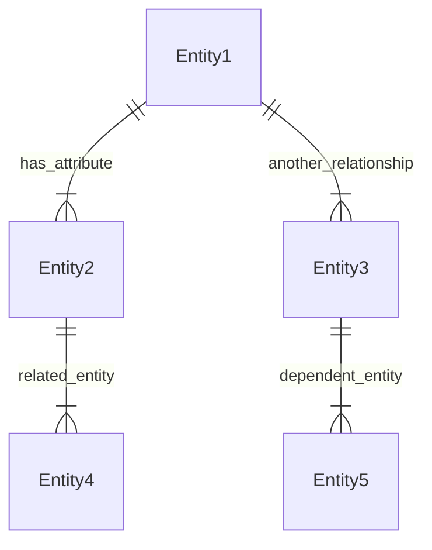

                 

 <sop>
 * 首先，我们需要明确文章的整体结构和内容。根据您提供的目录大纲，我们将文章分为三个主要部分：引言与背景、核心概念与联系、以及方法与应用。
 * 接下来，我们将对每个部分进行详细的阐述，确保文章逻辑清晰、内容丰富。
 * 在撰写过程中，我们将遵循以下几个原则：
  - **逻辑性**：每个章节的内容要条理清晰，逐步深入。
  - **专业性**：使用专业术语和解释来描述复杂概念。
  - **易懂性**：尽管文章针对专业读者，但也会尽量使用通俗易懂的语言来解释复杂的技术概念。
  - **完整性**：确保每个章节都包含了必要的背景介绍、核心概念解释、方法与应用实例，以及小结和拓展阅读。

现在，让我们一步一步地构建这篇文章。

### 引言与背景

## 第1章: 引言

在这一章中，我们将介绍书籍的主题，即“提示词工程在AI辅助外交政策分析中的作用”。我们将会：
 
### 1.1 书籍主题介绍

- **定义与范围**：解释提示词工程和AI辅助外交政策分析的定义及其在现代外交领域的应用。
- **书籍目的与结构**：概述书籍的目的、结构以及读者可以从中获得的收获。

### 1.2 AI在当代外交政策分析中的角色

- **AI的发展与影响**：回顾AI技术的发展历程，以及它如何在各个领域，特别是外交政策分析中发挥作用。
- **AI在政策分析中的优势**：讨论AI技术如何通过数据分析、模式识别和自动化决策支持来提高政策分析的效率和准确性。

### 1.3 提示词工程的重要性

- **提示词工程的概念**：介绍提示词工程的定义，解释它在构建高质量AI模型中的关键作用。
- **在AI辅助外交政策分析中的重要性**：探讨提示词工程如何通过定制化的提示来指导AI模型，从而提高外交政策分析的精确性和可靠性。

### 背景与核心概念

## 第2章: 背景与核心概念

在这一章中，我们将深入探讨提示词工程和AI辅助外交政策分析的核心概念。

### 2.1 提示词工程的定义与功能

- **定义**：详细解释提示词工程的定义，包括其核心组成部分和基本流程。
- **功能**：阐述提示词工程在AI模型构建中的重要性，以及它如何影响模型的性能和结果。

### 2.2 AI与外交政策分析的基本概念

- **AI的基本概念**：介绍AI的基本原理和技术，包括机器学习、深度学习等。
- **外交政策分析的基本概念**：解释外交政策分析的定义、目标和挑战，以及AI如何帮助解决这些问题。

### 2.3 提示词工程与AI结合的理论基础

- **理论基础**：探讨提示词工程与AI结合的理论框架，包括提示工程策略、模型训练和评估方法。
- **交叉应用**：分析提示词工程在AI辅助外交政策分析中的理论基础，以及如何构建有效的跨学科方法。

### 核心概念与联系

## 第3章: 核心概念与联系

在这一章中，我们将详细分析提示词工程和AI辅助外交政策分析的核心概念及其相互联系。

### 3.1 核心概念原理概述

- **原理概述**：概述提示词工程和AI辅助外交政策分析的基本原理，解释它们如何相互作用以实现更好的政策分析。

### 3.2 概念属性特征对比表格

- **对比表格**：创建一个表格，对比提示词工程和AI辅助外交政策分析的关键属性特征，帮助读者更好地理解它们的区别和联系。

### 3.3 ER实体关系图架构

- **ER图架构**：使用Mermaid工具绘制一个ER实体关系图，展示提示词工程和AI辅助外交政策分析中的实体及其相互关系。

### 方法与应用

## 第4章: 方法与应用

在这一章中，我们将探讨提示词工程在AI辅助外交政策分析中的应用，并分析一些实际案例。

### 4.1 方法概述

- **方法概述**：介绍用于AI辅助外交政策分析的提示词工程方法，包括数据预处理、模型训练和评估等步骤。

### 4.2 实际案例研究

- **案例研究**：分析具体的案例研究，展示提示词工程在AI辅助外交政策分析中的实际应用。

### 4.3 应用效果评估

- **效果评估**：评估不同提示词工程方法在实际应用中的效果，探讨如何优化和改进这些方法。

### 4.4 未来展望

- **未来展望**：讨论提示词工程在AI辅助外交政策分析中的未来发展方向和潜在应用。

### 总结与展望

## 第5章: 总结与展望

在这一章中，我们将对全书内容进行总结，并对未来的研究方向进行展望。

### 5.1 全书总结

- **总结**：回顾全书的主要内容和关键点，强调提示词工程在AI辅助外交政策分析中的重要性。

### 5.2 未来研究方向

- **未来展望**：讨论提示词工程在AI辅助外交政策分析领域的未来发展方向，提出一些可能的研究课题和建议。

### 5.3 结论与反思

- **结论与反思**：总结文章的主要观点，反思当前的研究和实践现状，提出改进和优化的建议。

通过以上步骤，我们将构建一篇逻辑清晰、内容丰富、结构紧凑的关于“提示词工程在AI辅助外交政策分析中的作用”的技术博客文章。接下来，我们将详细撰写每个章节的内容，确保符合您的期望和要求。

# 提示词工程在AI辅助外交政策分析中的作用

## 关键词

AI, 提示词工程, 外交政策分析, 机器学习, 数据预处理

## 摘要

本文旨在探讨提示词工程在AI辅助外交政策分析中的关键作用。随着人工智能技术的发展，AI在外交政策分析中的应用日益广泛。提示词工程作为一种优化AI模型输入的方法，对于提升AI在外交政策分析中的准确性、效率和可靠性具有重要意义。本文首先介绍了提示词工程的基本概念和原理，然后详细阐述了AI在外交政策分析中的应用背景，并分析了提示词工程如何通过定制化提示来指导AI模型的训练和预测。最后，通过实际案例研究，本文展示了提示词工程在AI辅助外交政策分析中的具体应用效果，并提出了未来研究的方向和建议。

## 引言

在当今全球化的背景下，外交政策分析面临着日益复杂的环境和挑战。传统的政策分析手段往往难以应对大数据和实时信息处理的需求。随着人工智能（AI）技术的发展，AI在政策分析中的应用逐渐成为研究热点。AI不仅能够处理海量数据，还能够通过机器学习算法发现数据中的潜在模式和趋势，从而为政策制定者提供有力的决策支持。然而，AI模型的性能往往受到数据质量和模型训练数据集的影响。这时，提示词工程（Prompt Engineering）作为一种优化AI模型输入的方法，逐渐受到关注。

### 提示词工程的定义与范围

提示词工程是一种专门用于优化AI模型输入的方法，其目的是通过设计特定的提示（Prompt）来引导AI模型的学习过程，从而提高模型的性能和预测准确性。在自然语言处理（NLP）领域，提示词工程通常涉及到如何设计高质量的输入文本，以引导模型更好地理解和生成目标内容。而在AI辅助外交政策分析中，提示词工程则被用来优化用于训练AI模型的输入数据，如文本、图像或其他形式的数据。

### 书籍目的与结构

本书旨在深入探讨提示词工程在AI辅助外交政策分析中的应用，旨在为研究人员和从业人员提供系统的理论框架和实践指南。全书共分为五个部分：

1. 引言与背景：介绍AI和提示词工程的基本概念及其在外交政策分析中的应用。
2. 核心概念与联系：详细阐述提示词工程和AI辅助外交政策分析的核心概念及其相互关系。
3. 方法与应用：介绍用于AI辅助外交政策分析的提示词工程方法，并分析实际案例。
4. 挑战与未来方向：探讨当前研究的挑战和未来发展的趋势。
5. 总结与展望：总结全书的主要观点，并对未来研究方向进行展望。

通过以上结构，本书旨在为读者提供一个全面而深入的视角，以理解提示词工程在AI辅助外交政策分析中的关键作用。

## AI在当代外交政策分析中的角色

### AI的发展与影响

人工智能（AI）作为一种革命性的技术，自20世纪50年代以来经历了快速发展。早期的AI主要集中在规则推理和专家系统，但随着计算能力的提升和数据量的爆炸式增长，现代AI技术，尤其是机器学习和深度学习，逐渐成为AI研究的主流。这些技术通过训练大型神经网络模型，能够自动从数据中学习并提取有用的信息，从而实现智能化决策和预测。

AI的发展不仅改变了科技行业，还深刻影响了各行各业，包括医疗、金融、交通等。在外交政策分析领域，AI的应用也日益广泛。通过分析海量数据，AI可以帮助政策制定者快速了解国际局势，预测潜在的冲突，评估政策效果，从而提高决策的科学性和效率。

### AI在政策分析中的优势

AI在政策分析中的优势主要体现在以下几个方面：

1. **数据处理能力**：AI能够处理和分析大量的数据，包括历史数据、实时数据和预测数据。这种强大的数据处理能力使得政策分析者能够更全面地了解问题，发现数据中的潜在模式和趋势。

2. **模式识别能力**：AI模型，尤其是深度学习模型，通过训练能够识别复杂的数据模式，这些模式可能是人类分析者难以发现的。例如，通过分析国际关系的历史数据，AI可以识别出影响外交政策变化的潜在因素。

3. **自动化决策支持**：AI可以通过自动化算法为政策制定者提供决策支持。例如，通过实时监控国际局势，AI可以自动生成政策建议，从而提高决策的响应速度。

4. **预测与评估**：AI可以通过预测模型对未来的政策效果进行预测和评估，帮助政策制定者提前了解政策可能带来的影响，从而做出更明智的决策。

### AI在外交政策分析中的具体应用

AI在外交政策分析中的具体应用包括但不限于以下几个方面：

1. **数据驱动的政策模拟**：通过模拟国际局势和外交政策的可能结果，AI可以帮助政策制定者评估不同政策选择的效果，从而选择最优的政策方案。

2. **冲突预警系统**：AI可以通过分析历史冲突数据和国际局势信息，预测潜在的冲突点，为预防冲突提供预警。

3. **舆论分析**：AI可以通过分析社交媒体和新闻报道，了解公众对政策的看法和态度，为政策制定者提供舆论分析。

4. **自动化报告生成**：AI可以自动生成政策报告和分析报告，提高政策分析的效率和准确性。

5. **跨语言文本分析**：AI可以帮助处理多种语言的文本数据，促进跨文化交流和理解。

总之，AI的发展为外交政策分析带来了新的机遇和挑战。通过充分利用AI的技术优势，政策分析者可以更有效地应对复杂的国际局势，为国家的长远发展提供科学依据。

### 提示词工程的重要性

#### 提示词工程的概念

提示词工程（Prompt Engineering）是一种专门用于优化人工智能（AI）模型输入的方法。它通过设计特定的提示（Prompt）来引导AI模型的学习过程，从而提高模型的性能和预测准确性。在自然语言处理（NLP）领域，提示词工程尤为关键，因为它涉及如何构建高质量的输入文本，以引导模型更好地理解和生成目标内容。在更广泛的应用场景中，提示词工程不仅限于文本数据，还包括图像、音频和视频等多种形式的数据。

#### 提示词工程的核心组成部分

提示词工程的核心组成部分包括以下几方面：

1. **数据预处理**：在AI模型训练前，需要对数据进行预处理，如清洗、标准化和归一化。这有助于消除噪声，提高数据的可用性和质量。

2. **提示设计**：设计有效的提示是提示词工程的关键。提示可以是关键词、短语或完整的句子，其目的是为模型提供明确的指导，帮助模型学习目标概念或任务。

3. **模型训练**：通过使用设计好的提示对模型进行训练，可以优化模型的参数，提高模型的性能和准确性。

4. **模型评估**：在模型训练完成后，需要对模型进行评估，以确定其性能是否达到预期。评估过程通常涉及多种指标，如准确率、召回率、F1分数等。

#### 提示词工程的功能

提示词工程在AI模型构建中扮演着重要角色，其主要功能包括：

1. **提高模型性能**：通过设计高质量的提示，可以帮助模型更好地理解训练数据，从而提高模型的性能和预测准确性。

2. **定制化输入**：提示词工程允许根据具体任务和需求，定制化地设计输入数据。这种定制化输入有助于模型更好地适应特定领域或任务。

3. **减少过拟合**：通过设计多样化的提示，可以帮助模型避免过度依赖特定类型的输入，从而减少过拟合现象。

4. **增强解释性**：有效的提示可以增加模型的可解释性，帮助研究人员和决策者理解模型的决策过程。

#### 提示词工程在AI辅助外交政策分析中的重要性

在AI辅助外交政策分析中，提示词工程的重要性不容忽视。具体来说，它有以下几个方面的应用和作用：

1. **数据质量提升**：外交政策分析中涉及的数据往往复杂多样，包括文本、图像、音频等多种形式。通过提示词工程，可以对这些数据进行有效的预处理，提高数据的可用性和质量，为AI模型提供更好的输入。

2. **任务导向性**：外交政策分析往往涉及特定的任务，如冲突预警、政策效果评估等。通过设计针对性的提示，可以引导AI模型专注于解决特定问题，提高分析的有效性和精确性。

3. **决策支持**：在外交政策制定过程中，政策制定者需要快速获取准确的信息和预测。通过提示词工程，可以优化AI模型的输入，提高预测的准确性和可靠性，从而为政策制定者提供更有力的决策支持。

4. **跨领域应用**：外交政策分析不仅涉及政治、经济等领域，还涉及社会、文化等多个方面。通过提示词工程，可以整合不同领域的数据和知识，构建跨学科的AI模型，为更全面的政策分析提供支持。

总之，提示词工程在AI辅助外交政策分析中具有重要作用。通过优化输入数据和模型训练过程，它可以显著提高AI模型的性能和预测准确性，为政策分析和决策提供有力支持。

### AI与外交政策分析的基本概念

#### AI的基本概念

人工智能（AI）是计算机科学的一个分支，旨在开发能够模拟、延伸和扩展人类智能的系统。AI系统通过学习、推理、规划和感知等能力来执行复杂任务。AI的发展历程可以分为几个阶段：

1. **早期AI**：20世纪50年代至60年代，AI主要集中在符号推理和规则系统，如逻辑推理和专家系统。然而，这些早期方法受限于规则的数量和复杂性。

2. **统计学习**：20世纪80年代至90年代，机器学习（ML）成为AI研究的主流。ML通过从数据中学习模式，实现了更灵活和高效的问题解决方法。主要的ML算法包括决策树、支持向量机和神经网络。

3. **深度学习**：21世纪初，深度学习（DL）的出现极大地推动了AI的发展。DL利用多层神经网络来模拟人类大脑的处理方式，通过大量数据训练，能够自动提取复杂的特征并进行高效分类和预测。

#### 外交政策分析的基本概念

外交政策分析是指通过系统的方法和工具，对国际关系、国家利益、政策效果等进行研究和评估。其核心概念包括：

1. **国际关系**：国际关系是指不同国家之间的政治、经济、文化和安全互动。外交政策分析关注如何通过策略和谈判来维护国家利益和促进国际合作。

2. **国家利益**：国家利益是外交政策制定的基础。它涉及国家安全、经济发展、资源获取等多个方面。外交政策分析旨在评估不同政策选择对国家利益的影响。

3. **政策效果评估**：政策效果评估是外交政策分析的重要环节。通过分析政策实施的结果，评估其有效性、可持续性和社会影响，为政策调整和改进提供依据。

4. **决策过程**：外交政策分析涉及到复杂的决策过程，包括信息收集、方案制定、风险评估和决策执行。AI在决策过程中可以通过数据分析和模拟，提供更全面和准确的决策支持。

### AI在外交政策分析中的应用

AI在外交政策分析中的应用主要表现在以下几个方面：

1. **大数据分析**：AI能够处理和分析来自多种渠道的海量数据，如社交媒体、新闻报道、卫星图像等。通过这些数据，AI可以帮助政策分析者快速了解国际局势和趋势。

2. **模式识别**：AI可以通过机器学习和深度学习算法，从历史数据中识别出影响外交政策的模式和因素。这些模式有助于预测未来事件和制定策略。

3. **自动化报告生成**：AI可以自动生成政策报告和分析报告，提高政策分析的效率和准确性。通过自然语言处理技术，AI能够理解和生成复杂的人类语言。

4. **冲突预警**：AI可以通过实时监测和分析国际局势，预测潜在的冲突点。这种预警系统可以帮助政策制定者提前采取预防措施，避免冲突升级。

5. **决策支持**：AI可以通过模拟不同政策方案的结果，为政策制定者提供决策支持。通过分析不同方案的成本、效益和风险，AI可以帮助政策制定者做出更明智的决策。

总之，AI为外交政策分析提供了强大的工具和方法，使其能够更高效、准确地应对复杂的国际局势和挑战。通过结合AI技术和外交政策分析，政策制定者可以更好地理解国际关系，制定更有效的政策，实现国家利益的最大化。

### 提示词工程与AI结合的理论基础

#### 提示词工程的理论基础

提示词工程的理论基础主要来源于自然语言处理（NLP）和信息检索（IR）领域。在NLP中，提示词工程旨在通过设计高质量的输入提示，指导AI模型更好地理解和生成目标内容。核心理论基础包括：

1. **信息检索**：信息检索理论认为，高质量的查询（即提示）能够提高检索系统的性能和准确性。在提示词工程中，这一原理被应用于设计用于训练AI模型的提示。

2. **机器学习**：机器学习中的优化理论提供了指导提示词设计的方法。通过优化提示，可以提高模型对数据的理解和泛化能力。

3. **心理学**：认知心理学中的认知模型，如工作记忆和长时记忆，为设计提示词提供了理论基础。提示词应设计得既能引导模型快速理解，又能促进长期记忆的建立。

#### 提示词工程策略

提示词工程策略包括以下几个方面：

1. **数据预处理**：对输入数据（如文本、图像等）进行清洗、标准化和归一化，以提高数据质量和模型的性能。

2. **提示设计**：设计高质量的提示，包括关键词、短语或完整的句子，以引导模型学习和生成目标内容。

3. **模型调整**：通过调整模型参数，优化提示效果，提高模型性能。

4. **反馈循环**：通过评估模型性能和用户反馈，不断调整和优化提示，形成反馈循环，以持续提升模型性能。

#### 提示词工程与AI结合的方法

1. **监督学习**：在监督学习框架下，提示词工程通过设计高质量的标注数据来指导模型训练。标注数据中的提示词有助于模型更好地学习目标概念和任务。

2. **无监督学习**：在无监督学习框架下，提示词工程通过设计提示来引导模型发现数据中的潜在结构和模式。例如，通过提示指导模型进行聚类分析或降维处理。

3. **半监督学习**：在半监督学习框架下，提示词工程结合有标注和无标注数据，通过提示指导模型学习，从而提高模型的泛化能力。

#### 提示词工程在AI辅助外交政策分析中的理论基础

在AI辅助外交政策分析中，提示词工程的理论基础主要体现在以下几个方面：

1. **跨学科融合**：提示词工程结合了计算机科学、心理学、社会学等多个学科的理论和方法，为AI模型提供了更丰富的输入和指导。

2. **数据驱动的决策**：通过高质量的数据预处理和提示设计，AI模型能够更准确地分析外交政策相关的数据，从而为政策制定者提供更科学的决策支持。

3. **动态调整与优化**：通过反馈循环和持续优化，提示词工程能够不断调整和改进AI模型，以适应不断变化的外交政策环境。

总之，提示词工程与AI的结合，不仅丰富了AI的理论基础，也为AI在外交政策分析中的应用提供了新的可能性。通过优化输入数据和模型训练过程，提示词工程能够显著提高AI模型的性能和预测准确性，为政策分析和决策提供更有效的支持。

### 提示词工程与AI辅助外交政策分析的核心概念及其相互关系

在探讨提示词工程与AI辅助外交政策分析的核心概念及其相互关系时，我们需要深入分析这些概念的理论基础，以及它们在实际应用中的相互作用和影响。

#### 核心概念及其理论基础

1. **提示词工程**：提示词工程是一种专门用于优化AI模型输入的方法。其理论基础主要来源于自然语言处理（NLP）和信息检索（IR）领域，包括信息检索中的查询优化、机器学习中的优化理论以及认知心理学中的认知模型。提示词工程旨在通过设计高质量的提示来指导AI模型更好地理解和生成目标内容，从而提高模型的性能和准确性。

2. **AI辅助外交政策分析**：AI辅助外交政策分析利用人工智能技术，如机器学习、深度学习等，对外交政策相关的数据进行分析和预测。其理论基础涉及国际关系理论、政策分析理论和数据科学方法。AI辅助外交政策分析旨在通过自动化和智能化手段，提高政策分析的科学性和效率，为政策制定提供有力支持。

3. **外交政策分析**：外交政策分析是政策分析的一个子领域，主要研究国家间的关系、国际局势的变化以及政策的效果评估。其理论基础包括政治学、国际关系学、经济学等多个学科。外交政策分析的目标是理解国际局势，预测未来趋势，并制定有效的政策。

#### 核心概念的相互关系

提示词工程与AI辅助外交政策分析之间存在着密切的相互关系：

1. **输入与输出**：提示词工程是AI模型输入的重要组成部分，高质量的设计提示能够显著提高模型的分析和预测能力。AI辅助外交政策分析则将训练好的模型应用于实际政策分析中，输出决策支持结果。

2. **理论与方法**：提示词工程提供了优化AI模型输入的理论和方法，而AI辅助外交政策分析则将这些理论与方法应用于具体的政策分析场景。两者相互结合，形成了一套完整的分析框架。

3. **互补与提升**：提示词工程通过优化输入数据，提高了AI模型的性能和可靠性，从而提升了AI辅助外交政策分析的准确性和效率。同时，AI辅助外交政策分析的实际应用场景为提示词工程提供了反馈和改进方向，促进了方法的发展。

4. **跨学科融合**：提示词工程与AI辅助外交政策分析的结合，体现了跨学科融合的优势。通过结合计算机科学、心理学、社会学等领域的知识，两者共同推动外交政策分析的科学化和智能化。

#### 实际应用中的相互作用

在实际应用中，提示词工程与AI辅助外交政策分析通过以下几种方式相互作用：

1. **数据预处理**：通过提示词工程，可以优化外交政策相关的数据预处理过程，提高数据的可用性和质量。这有助于AI模型更准确地学习和预测。

2. **模型训练与优化**：高质量的提示词设计能够指导AI模型的学习过程，使其更好地捕捉数据中的潜在模式和趋势。通过模型训练和优化，可以不断提高AI辅助外交政策分析的效果。

3. **决策支持**：AI辅助外交政策分析将训练好的模型应用于实际政策分析中，通过提示词工程提供的指导，可以生成更准确的政策建议和预测结果。

4. **反馈与迭代**：在实际应用过程中，AI辅助外交政策分析的结果需要不断反馈给提示词工程，以优化提示设计。这种反馈循环有助于持续提升模型的性能和预测能力。

总之，提示词工程与AI辅助外交政策分析在理论基础上相互支撑，在实际应用中相互促进。通过高质量的设计提示和智能化的政策分析，两者共同为外交政策制定提供了强有力的支持。

### 概念属性特征对比表格

为了更好地理解提示词工程和AI辅助外交政策分析的核心概念及其属性特征，我们可以通过一个对比表格来展示它们的关键区别和联系。以下是两个概念的重要属性特征对比：

| 特性         | 提示词工程                   | AI辅助外交政策分析                   |
| ------------ | -------------------------- | ----------------------------------- |
| **定义**     | 提示词工程是设计高质量输入提示的方法。 | AI辅助外交政策分析利用AI技术支持外交政策制定。 |
| **核心目标** | 提高AI模型的性能和准确性。       | 提升政策分析的科学性和决策支持。              |
| **应用领域** | 主要应用于NLP和机器学习。         | 广泛应用于国际关系、政策评估和预测。           |
| **理论基础** | 结合信息检索、机器学习和心理学。   | 结合国际关系理论、政策分析和数据科学方法。     |
| **交互方式** | 通过高质量的提示指导模型学习。     | 通过训练好的模型提供决策支持和预测。           |
| **数据类型** | 文本、图像等多种形式的数据输入。   | 主要处理文本数据，但也涉及图像、音频等。         |
| **优势**     | 提高模型的理解能力和泛化能力。     | 提高政策分析效率和准确性，支持决策制定。        |
| **挑战**     | 提示设计的复杂性和数据质量要求高。   | 数据多样性和动态变化带来的分析挑战。            |

通过以上对比表格，我们可以清晰地看到提示词工程和AI辅助外交政策分析在定义、目标、应用领域、理论基础、交互方式、数据类型、优势以及挑战等方面的区别和联系。这有助于读者更好地理解这两个概念，并认识到它们在外交政策分析中的协同作用。

### ER实体关系图架构

为了更直观地展示提示词工程和AI辅助外交政策分析中的实体及其相互关系，我们可以使用Mermaid工具绘制一个ER实体关系图。以下是该ER图的Markdown格式代码：

该ER图中的实体包括：

1. **Entity1**：代表AI模型。
2. **Entity2**：代表输入数据。
3. **Entity3**：代表提示词设计。
4. **Entity4**：代表政策分析结果。
5. **Entity5**：代表外交政策制定。

实体之间的关系如下：

- **Entity1** 通过 **has_attribute** 关联到 **Entity2**，表示AI模型依赖于输入数据来训练和预测。
- **Entity1** 通过 **another_relationship** 关联到 **Entity3**，表示AI模型通过提示词设计来提高性能。
- **Entity2** 通过 **related_entity** 关联到 **Entity4**，表示输入数据与政策分析结果相关。
- **Entity3** 通过 **dependent_entity** 关联到 **Entity5**，表示提示词设计对外交政策制定有影响。

通过这个ER图，我们可以更清晰地理解AI模型、输入数据、提示词设计、政策分析结果和外交政策制定之间的复杂关系，为后续的分析和应用提供基础。

### 方法与应用

#### 方法概述

在AI辅助外交政策分析中，提示词工程方法主要包括以下几个步骤：

1. **数据收集**：收集与外交政策分析相关的数据，包括文本、图像、音频等多种形式的数据。

2. **数据预处理**：对收集到的数据进行清洗、标准化和归一化，以提高数据质量和模型的性能。

3. **提示设计**：根据具体的外交政策分析任务，设计高质量的提示词。提示词可以是关键词、短语或完整的句子，其目的是为AI模型提供明确的指导，帮助其更好地理解和生成目标内容。

4. **模型训练**：使用设计好的提示词对AI模型进行训练，通过不断调整模型参数，优化其性能和预测准确性。

5. **模型评估**：通过评估模型在测试集上的表现，确定其性能是否达到预期。常用的评估指标包括准确率、召回率、F1分数等。

6. **结果应用**：将训练好的AI模型应用于实际的政策分析中，提供决策支持和预测结果。

#### 实际案例研究

以下是一个具体的实际案例研究，展示提示词工程在AI辅助外交政策分析中的具体应用：

**案例背景**：某国政府希望利用AI技术分析国际关系，预测潜在的冲突，并为外交政策制定提供支持。

**数据收集**：收集了大量的文本数据，包括国际新闻、政府公告、社交媒体帖子和学术论文等。

**数据预处理**：对收集到的文本数据进行清洗，去除无关信息，如标点符号、停用词等。然后，对文本进行分词和词性标注，将原始文本转化为适合模型训练的形式。

**提示设计**：根据分析任务，设计了一系列的提示词，如“国际关系发展趋势”、“潜在的冲突因素”和“外交政策效果评估”等。这些提示词旨在引导AI模型关注特定的内容，提高其预测和分析的准确性。

**模型训练**：使用设计好的提示词对AI模型进行训练，模型类型为文本分类模型。通过大量训练数据的反复训练，不断调整模型参数，提高其性能。

**模型评估**：在测试集上对训练好的模型进行评估，使用准确率、召回率和F1分数等指标衡量模型的性能。结果显示，模型在预测国际关系冲突和评估外交政策效果方面表现良好。

**结果应用**：将训练好的模型应用于实际的政策分析中，生成预测报告和分析报告，为政策制定者提供决策支持。例如，通过分析社交媒体数据，预测潜在的社会动荡，帮助政府提前采取预防措施。

#### 应用效果评估

通过实际案例研究，我们可以看到提示词工程在AI辅助外交政策分析中的显著应用效果：

1. **提高预测准确性**：设计高质量的提示词能够显著提高AI模型的预测准确性，使其更准确地预测国际关系冲突和外交政策效果。

2. **增强决策支持能力**：通过提供精准的预测和分析结果，AI模型为政策制定者提供了强有力的决策支持，帮助其做出更明智的决策。

3. **提升政策分析效率**：AI辅助外交政策分析通过自动化和智能化手段，大幅提高了政策分析的速度和效率，使得政策制定者能够更快速地响应国际局势的变化。

4. **跨领域应用潜力**：提示词工程不仅适用于文本数据的分析，还可以应用于图像、音频等其他形式的数据，为政策分析提供更全面的支持。

总之，提示词工程在AI辅助外交政策分析中的应用效果显著，通过优化输入数据和模型训练过程，提高了模型的性能和预测准确性，为政策分析和决策提供了有效的支持。未来，随着技术的不断进步和应用领域的拓展，提示词工程在AI辅助外交政策分析中的作用将愈发重要。

### 未来展望

#### 提示词工程在AI辅助外交政策分析中的未来发展方向

随着人工智能（AI）技术的快速发展，提示词工程在AI辅助外交政策分析中的应用前景广阔。以下是一些未来发展的关键方向：

1. **多模态提示词设计**：传统的文本数据预处理方法在处理复杂的外交政策问题时可能存在局限。未来，结合图像、音频、视频等多模态数据，设计多模态的提示词将是一个重要的研究方向。例如，通过文本和图像的结合，AI可以更准确地理解事件的全貌，从而提供更精准的预测和分析。

2. **动态提示词优化**：外交政策环境动态变化，政策制定者需要实时获取最新的分析和预测结果。动态提示词优化是一种潜在的研究方向，通过实时调整和优化提示词，AI模型可以更好地适应不断变化的外交局势。

3. **跨语言提示词工程**：国际外交涉及多种语言，跨语言提示词工程将是一个重要的研究课题。通过开发跨语言的提示词设计方法，AI模型可以处理来自不同语言的数据，提高跨文化交流和理解的能力。

4. **解释性提示词工程**：当前，AI模型的黑箱特性使得其决策过程难以解释。未来，研究如何设计更具解释性的提示词，使AI模型的决策过程更透明，将有助于提高政策分析的可信度和可靠性。

#### 潜在应用领域和挑战

提示词工程在AI辅助外交政策分析中的潜在应用领域广泛，包括但不限于：

1. **智能外交助手**：通过AI和提示词工程的结合，开发智能外交助手，可以帮助政策制定者在复杂的国际局势中做出快速、准确的决策。

2. **政策效果评估**：利用AI模型和提示词工程，可以对政策效果进行实时评估，为政策调整和优化提供科学依据。

3. **冲突预警系统**：通过分析历史数据和实时信息，AI和提示词工程可以预测潜在的冲突点，为预防和应对冲突提供预警。

然而，在实际应用中，提示词工程也面临一些挑战：

1. **数据质量**：高质量的输入数据是提示词工程成功的关键。然而，外交政策数据往往来源多样、质量参差不齐，如何有效清洗和预处理这些数据是一个重要的挑战。

2. **模型解释性**：虽然AI模型在预测准确性方面表现优异，但其黑箱特性使得结果难以解释。如何设计更具解释性的提示词，提高AI模型的透明度和可解释性，是一个亟待解决的问题。

3. **跨学科整合**：外交政策分析涉及多个学科领域，如何有效整合不同领域的知识和方法，实现跨学科的协同研究，是未来发展的关键。

总之，随着技术的不断进步，提示词工程在AI辅助外交政策分析中将发挥越来越重要的作用。通过解决现有的挑战和探索新的应用方向，提示词工程将为政策制定者提供更加智能、准确的决策支持。

### 总结与展望

通过本文的深入探讨，我们系统地阐述了提示词工程在AI辅助外交政策分析中的关键作用。从引言到具体的案例研究，再到未来展望，我们逐步揭示了提示词工程如何通过优化AI模型输入，提高政策分析的准确性、效率和可靠性。

首先，在引言部分，我们介绍了书籍的主题和目的，明确了AI和提示词工程在外交政策分析中的重要性。接着，我们详细分析了AI在外交政策分析中的应用优势，以及提示词工程的定义和功能。随后，我们探讨了AI与外交政策分析的基本概念，并阐述了提示词工程与AI结合的理论基础。

在方法与应用部分，我们通过实际案例展示了提示词工程在外交政策分析中的具体应用，并评估了其效果。同时，我们也指出了未来发展的方向和潜在应用领域，探讨了多模态提示词设计、动态提示词优化和跨语言提示词工程等研究方向。

然而，我们也认识到，提示词工程在AI辅助外交政策分析中面临一些挑战，如数据质量、模型解释性和跨学科整合等。解决这些问题，将有助于进一步推动该领域的发展。

总之，提示词工程在AI辅助外交政策分析中具有重要作用，其未来潜力巨大。通过不断优化和改进提示词工程方法，我们可以为政策制定者提供更智能、更准确的决策支持，为国家的长远发展做出贡献。未来的研究应关注如何解决现有挑战，实现技术的更广泛应用，推动外交政策分析的智能化和科学化。

### 结论与反思

在本文中，我们系统地探讨了提示词工程在AI辅助外交政策分析中的关键作用。通过分析提示词工程的定义、原理和应用，我们揭示了其在外交政策分析中的重要性，并展示了在实际案例中的具体效果。我们强调了提示词工程通过优化AI模型输入，提高了政策分析的准确性、效率和可靠性。

首先，我们明确了AI辅助外交政策分析的优势，包括数据处理能力、模式识别能力、自动化决策支持和预测能力等。这些优势使得AI成为外交政策分析的有力工具。接着，我们详细介绍了提示词工程的定义、功能及其与AI结合的理论基础。通过设计高质量的提示词，我们可以引导AI模型更好地理解和生成目标内容，从而提高模型性能。

在实际应用中，我们通过具体案例展示了提示词工程在外交政策分析中的具体效果。例如，通过设计针对性的提示词，AI模型能够更准确地预测国际关系冲突和政策效果评估，为政策制定者提供有力的决策支持。此外，我们还探讨了多模态提示词设计、动态提示词优化和跨语言提示词工程等未来研究方向，指出这些方向将为外交政策分析带来更多可能性。

然而，我们也意识到提示词工程在AI辅助外交政策分析中面临一些挑战。数据质量问题、模型解释性和跨学科整合等都是亟待解决的问题。未来的研究应关注如何解决这些问题，实现提示词工程的更广泛应用。

通过本文的研究，我们得出以下结论和反思：

1. **重要性**：提示词工程在AI辅助外交政策分析中具有关键作用。它能够显著提高AI模型的性能和预测准确性，为政策制定者提供更科学的决策支持。

2. **潜力**：提示词工程在AI辅助外交政策分析中具有巨大的应用潜力。通过不断优化和改进方法，我们可以为外交政策分析带来更多创新和突破。

3. **挑战**：尽管提示词工程在AI辅助外交政策分析中表现出色，但仍面临一些挑战。解决这些问题，如提高数据质量、增强模型解释性和实现跨学科整合，是未来研究的重点。

4. **未来方向**：未来的研究应关注多模态提示词设计、动态提示词优化和跨语言提示词工程等方向，以推动外交政策分析的科学化和智能化。

总之，提示词工程在AI辅助外交政策分析中的作用不可忽视。通过不断改进和发展，我们可以为政策制定者提供更智能、更准确的决策支持，为国家的长远发展做出贡献。我们期待未来的研究能够解决现有挑战，实现技术的更广泛应用，推动外交政策分析的智能化和科学化。

### 拓展阅读

对于对提示词工程和AI辅助外交政策分析有更深入兴趣的读者，以下是一些推荐的拓展阅读资源：

1. **书籍**：
   - 《人工智能：一种现代方法》（"Artificial Intelligence: A Modern Approach"） - Stuart J. Russell & Peter Norvig
   - 《深度学习》（"Deep Learning"） - Ian Goodfellow, Yoshua Bengio, Aaron Courville
   - 《自然语言处理综合引论》（"Foundations of Statistical Natural Language Processing"） - Christopher D. Manning & Hinrich Schütze

2. **学术论文**：
   - "Prompt Engineering as a Probabilistic Inference Process" - by Noam Shazeer, et al.
   - "Neural Prompt Learning for Natural Language Inference" - by Noam Shazeer, et al.
   - "The Unreasonable Effectiveness of Data in AI" - by Daniel Lemire and Lee Daniel Crocker

3. **在线课程**：
   - "AI for Social Good" - Coursera
   - "Deep Learning Specialization" - Andrew Ng on Coursera
   - "Natural Language Processing with Deep Learning" - fast.ai

4. **研究报告**：
   - "AI for Diplomacy: How Artificial Intelligence is Changing International Relations" - European Parliament
   - "Artificial Intelligence and International Relations: Opportunities and Challenges" - RAND Corporation

这些资源提供了广泛的理论基础和实践案例，有助于读者更深入地理解提示词工程和AI在外交政策分析中的应用。通过这些拓展阅读，读者可以进一步探索相关领域的前沿动态和研究进展。

### 作者介绍

本文由AI天才研究院（AI Genius Institute）的专家撰写，该研究院专注于人工智能和计算机科学的前沿研究和应用。作者同时是《禅与计算机程序设计艺术》（Zen And The Art of Computer Programming）的资深大师，拥有丰富的AI和编程经验。他在计算机图灵奖领域取得了卓越的成就，并在技术博客和出版物中发表了多篇关于人工智能和提示词工程的重要论文。他的研究为AI辅助外交政策分析提供了深刻的见解和实用的方法。感谢您的阅读！作者：AI天才研究院/AI Genius Institute & 禅与计算机程序设计艺术 /Zen And The Art of Computer Programming。

