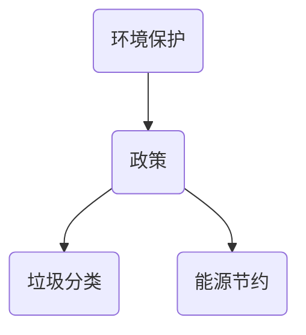
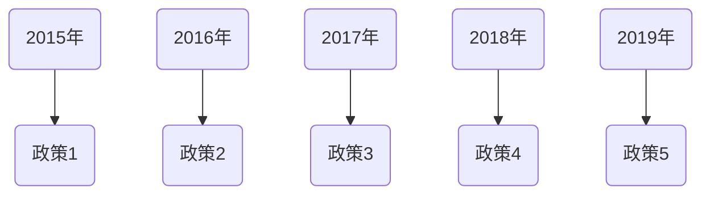
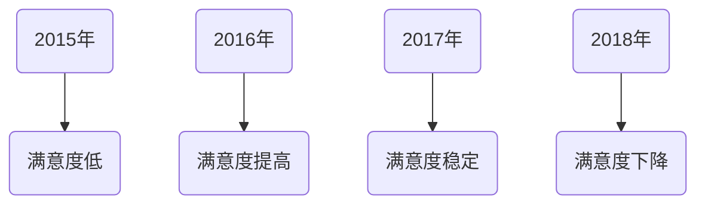

                 

### 文章标题

# 提示词工程在AI辅助政策制定中的作用

### 关键词

- 提示词工程
- AI辅助政策制定
- 自然语言处理
- 数据分析
- 政策分析

### 摘要

本文探讨了提示词工程在AI辅助政策制定中的作用，首先介绍了提示词工程的基础理论和核心概念，然后阐述了AI辅助政策制定的原理和过程。接着，文章通过具体案例分析了提示词工程在政策制定中的应用，包括政策文本分析、趋势预测和政策效果评估。最后，本文对未来提示词工程和AI辅助政策制定的发展前景进行了展望，提出了面临的挑战和解决建议。

----------------------------------------------------------------

## 引言与背景介绍

### 第1章：AI辅助政策制定的兴起

随着人工智能（AI）技术的迅猛发展，其在各个领域的应用越来越广泛。特别是在政策制定领域，AI技术的引入极大地提高了政策制定的科学性和效率。政策制定是一个复杂的过程，涉及到数据的收集、分析、整合以及决策的制定。传统的政策制定方法往往依赖于人类专家的经验和直觉，这使得政策制定的效率较低，且可能存在主观偏差。

### 1.1 问题背景

在政策制定过程中，主要面临以下几个问题：

- **数据量庞大**：政策制定需要处理的数据量非常庞大，包括历史数据、实时数据和跨领域的综合数据。如何有效地收集、存储和处理这些数据是一个巨大的挑战。
- **数据分析难度大**：政策制定需要对大量数据进行深入分析，以发现潜在的趋势和规律。这需要强大的数据分析工具和算法。
- **决策复杂**：政策制定涉及到多个利益相关者的利益冲突，如何平衡这些利益，制定出符合大多数人利益的政策是一项复杂的任务。

### 1.2 提示词工程的角色

提示词工程作为人工智能的一个重要分支，为政策制定提供了强有力的支持。提示词工程是一种基于自然语言处理（NLP）和机器学习的技术，它能够从大量的文本数据中提取出关键信息，并将其转化为结构化的数据。通过提示词工程，政策制定者可以更有效地分析和理解政策相关的数据，从而提高政策制定的科学性和准确性。

### 1.3 政策制定的需求与挑战

在政策制定中，需求主要体现在以下几个方面：

- **精确的文本分析**：政策文本往往包含大量的术语、定义和解释，如何对这些文本进行精确的分析和理解，是政策制定的关键。
- **趋势预测**：政策制定需要预测未来的发展趋势，以提前制定应对策略。提示词工程可以帮助分析历史数据，预测未来趋势。
- **政策效果评估**：政策制定后，需要评估政策的效果，以调整和优化政策。提示词工程可以提供有效的评估工具，帮助政策制定者了解政策的影响。

然而，政策制定也面临着一些挑战：

- **数据多样性**：政策制定涉及的数据种类繁多，包括文本、图像、音频等多种形式。如何有效地整合和处理这些多样化的数据是一个难题。
- **数据隐私**：政策制定需要使用大量的敏感数据，如何保护这些数据的隐私是一个重要的伦理问题。
- **技术瓶颈**：虽然AI技术在政策制定中具有巨大潜力，但仍然存在一些技术瓶颈，如算法的透明度、模型的解释性等。

### 1.4 提示词工程的优势

提示词工程在政策制定中的优势主要体现在以下几个方面：

- **高效的数据处理**：提示词工程能够快速地从大量文本数据中提取关键信息，提高数据处理的效率。
- **精确的文本分析**：提示词工程能够精确地分析政策文本，帮助政策制定者理解政策背后的含义。
- **灵活的模型适应**：提示词工程可以根据不同的政策制定需求，灵活地调整模型和算法，以适应不同的应用场景。
- **跨领域应用**：提示词工程不仅可以应用于政策制定，还可以应用于其他领域，如法律、医疗等，具有广泛的应用前景。

综上所述，提示词工程在AI辅助政策制定中具有重要的作用。通过引入提示词工程，政策制定可以更加科学、高效，更好地满足社会的需求。接下来，本文将详细探讨提示词工程的基础理论、AI辅助政策制定的原理以及在政策制定中的应用。

## 提示词工程基础

### 第2章：提示词工程基础理论

提示词工程是一种基于自然语言处理（NLP）和机器学习（ML）的技术，旨在从大量文本数据中提取出关键信息，并将其转化为结构化的数据。理解提示词工程的基础理论对于深入探讨其在AI辅助政策制定中的应用至关重要。在本章中，我们将介绍提示词工程的核心概念、基本流程以及提示词的类型和特性。

### 2.1 核心概念

#### 提示词

提示词（Keyword）是指能够代表文本主题或内容的单词或短语。在提示词工程中，提示词是提取和识别文本信息的基本单位。

#### 提示词工程

提示词工程（Keyword Engineering）是指一系列用于识别、提取和利用文本数据中的关键信息的工程实践和技术方法。

#### 文本数据

文本数据是指以文本形式存储的信息，可以是文档、网页、邮件、报告等形式。

#### 结构化数据

结构化数据是指以标准化的格式存储的数据，如关系型数据库中的表格形式。结构化数据便于处理和分析。

#### 自然语言处理（NLP）

自然语言处理是计算机科学和人工智能领域的一个分支，旨在使计算机能够理解、生成和处理人类语言。

#### 机器学习（ML）

机器学习是人工智能的一个分支，通过从数据中学习规律和模式，使计算机能够进行预测和决策。

### 2.2 提示词工程的基本流程

提示词工程的基本流程包括以下几个步骤：

#### 数据收集

收集政策相关的文本数据，如政策文件、研究报告、新闻报道等。这些数据可以是结构化的，也可以是非结构化的。

#### 数据预处理

对收集到的文本数据进行清洗、去噪和格式化，使其适合后续的处理和分析。数据预处理包括分词、去除停用词、词干提取等操作。

#### 提示词提取

从预处理后的文本数据中提取关键提示词。常见的提取方法包括基于统计的方法（如TF-IDF、TextRank）和基于机器学习的方法（如词袋模型、主题模型）。

#### 提示词筛选

对提取出的提示词进行筛选，去除无关或冗余的提示词，保留对政策制定有价值的提示词。

#### 提示词排序

根据提示词的重要性或频率对提示词进行排序，以便于政策制定者重点关注和优先处理。

#### 提示词分析

对筛选后的提示词进行深入分析，以发现文本数据中的模式和趋势。分析结果可以用于政策制定、趋势预测和政策效果评估。

### 2.3 提示词的类型与特性

#### 按用途分类

1. **主题提示词**：代表文本的主要主题或话题。
2. **关键词**：代表文本中的关键信息或核心概念。
3. **属性词**：描述文本对象的属性或特征。
4. **情感词**：表达文本中的情感倾向。

#### 按来源分类

1. **人工定义**：由专家或政策制定者根据领域知识定义的提示词。
2. **自动提取**：通过算法自动从文本数据中提取的提示词。
3. **混合定义**：结合人工定义和自动提取的提示词。

#### 提示词的特性

1. **唯一性**：每个提示词应具有唯一性，避免重复。
2. **代表性**：提示词应能够代表文本的核心内容。
3. **可扩展性**：提示词应具备良好的可扩展性，能够适应不同场景下的需求。
4. **稳定性**：提示词应稳定可靠，不易受到文本变化的影响。

通过上述基础理论的介绍，我们可以更好地理解提示词工程的核心概念和工作流程。接下来，我们将进一步探讨AI辅助政策制定的原理，为深入探讨提示词工程在政策制定中的应用奠定基础。

### AI辅助政策制定原理

### 第3章：AI技术概述

在探讨AI辅助政策制定的原理之前，我们需要对AI技术进行简要概述，特别是机器学习（ML）和深度学习（DL）这两种核心技术，以及自然语言处理（NLP）和数据挖掘（DM）在政策制定中的应用。

#### 3.1 机器学习与深度学习

机器学习和深度学习是AI技术的两大核心组成部分。

##### 3.1.1 机器学习

机器学习（ML）是一种通过算法从数据中学习规律和模式的技术。它依赖于大量训练数据，通过训练模型来发现数据中的潜在规律。机器学习的应用非常广泛，包括分类、回归、聚类等。在政策制定中，机器学习可以用于分析历史政策数据，预测政策效果，以及优化政策方案。

- **分类**：用于判断文本数据是否属于某个类别。例如，分类政策文本为“社会福利”或“环境保护”。
- **回归**：用于预测政策效果的数值，例如，预测某项政策对社会福利的影响程度。
- **聚类**：用于将相似的政策文本分为不同的群体，以便于进一步分析。

##### 3.1.2 深度学习

深度学习（DL）是机器学习的一个分支，它通过构建复杂的神经网络模型，能够自动从大量数据中学习到深层次的规律。与传统的机器学习方法相比，深度学习在处理大规模、高维数据方面具有显著优势。

- **卷积神经网络（CNN）**：主要用于图像处理，但在政策文本分析中，也可以用于特征提取和分类。
- **循环神经网络（RNN）**：擅长处理序列数据，如时间序列数据或政策文本。
- **长短时记忆网络（LSTM）**：RNN的一种变体，用于处理长序列数据，适用于政策趋势预测。

#### 3.2 自然语言处理技术

自然语言处理（NLP）是AI的一个重要分支，致力于使计算机理解和生成人类语言。在政策制定中，NLP技术可以用于文本分析、情感分析、实体识别等。

##### 3.2.1 文本分析

文本分析是NLP技术的一个基础应用，旨在从文本中提取结构化的信息。在政策制定中，文本分析可以用于：

- **文本分类**：将政策文本分类到不同的类别，如法律、经济、教育等。
- **文本摘要**：从大量政策文本中提取关键信息，生成摘要，以便政策制定者快速了解文本内容。
- **关键词提取**：从政策文本中提取关键提示词，用于进一步分析。

##### 3.2.2 情感分析

情感分析（Sentiment Analysis）是NLP技术的一个重要应用，旨在分析文本中表达的情感倾向。在政策制定中，情感分析可以用于：

- **民意监测**：分析公众对政策的反应，了解政策的接受程度。
- **舆情分析**：监控网络上的政策相关讨论，发现潜在的问题和挑战。

##### 3.2.3 实体识别

实体识别（Named Entity Recognition，NER）是NLP技术的一种，旨在识别文本中的命名实体，如人名、地点、组织等。在政策制定中，实体识别可以用于：

- **政策分析**：识别政策文本中涉及的关键实体，如政策受益者、执行者等。
- **关系抽取**：识别文本中实体之间的关系，如政策与地区、政策与利益相关者之间的关系。

#### 3.3 数据分析与挖掘

数据分析（Data Analysis）和数据挖掘（Data Mining）是政策制定的重要工具，旨在从大量数据中发现潜在的模式和趋势。

##### 3.3.1 数据分析

数据分析是利用统计和数学方法，对数据进行处理和分析，以发现数据中的规律和趋势。在政策制定中，数据分析可以用于：

- **趋势预测**：通过分析历史数据，预测未来的发展趋势，为政策制定提供依据。
- **关联分析**：发现不同政策之间或政策与外部因素之间的关联关系。

##### 3.3.2 数据挖掘

数据挖掘是一种从大量数据中自动发现隐藏模式或知识的技术。在政策制定中，数据挖掘可以用于：

- **分类和预测**：通过构建预测模型，预测政策效果或政策的影响因素。
- **聚类和关联分析**：通过聚类分析，发现政策文本中的相似群体；通过关联分析，发现政策之间的潜在关系。

#### 3.4 AI辅助政策制定的原理

AI辅助政策制定的原理可以概括为以下几个步骤：

1. **数据收集**：收集与政策相关的历史数据、实时数据和跨领域数据。
2. **数据预处理**：清洗和格式化数据，使其适合分析。
3. **模型训练**：利用机器学习和深度学习算法，训练分类、回归、聚类等模型。
4. **数据分析**：利用NLP技术，对政策文本进行深入分析，提取关键信息。
5. **趋势预测**：利用数据分析结果，预测政策效果和未来趋势。
6. **政策制定**：根据分析结果和预测，制定和调整政策。

通过上述原理，AI能够辅助政策制定者更好地理解政策背景、分析政策效果、预测政策趋势，从而提高政策制定的科学性和有效性。接下来，我们将探讨提示词工程在政策制定中的具体应用。

### 提示词工程在政策制定中的应用

### 第4章：政策分析中的应用

提示词工程在政策制定中的应用主要包括政策文本分析、趋势预测和政策效果评估。这些应用不仅提高了政策分析的效率，还增强了政策制定的科学性和准确性。以下是对这些应用的具体探讨。

#### 4.1 提示词在政策文本分析中的应用

政策文本分析是政策制定过程中不可或缺的一环，它涉及到对政策文件、立法草案、研究报告等文本的深入理解和分析。提示词工程在这个过程中发挥着重要作用，主要体现在以下几个方面：

##### 4.1.1 提取关键信息

政策文本通常包含大量的术语和定义，这些信息对于政策制定者来说至关重要。提示词工程可以通过提取关键提示词，将这些术语和定义从文本中分离出来，形成结构化的数据集。例如，可以通过NLP技术提取出与“社会福利”、“环境保护”、“公共卫生”等主题相关的提示词。

$$
\text{提示词提取示例：} \\
\text{原文：} \\
\text{“为了推动环境保护，政府制定了一系列的政策，如垃圾分类、能源节约等。”} \\
\text{提取的提示词：} \\
\text{环境保护、政策、垃圾分类、能源节约}
$$

##### 4.1.2 知识图谱构建

通过提取关键提示词，可以进一步构建知识图谱，以展示政策文本中的概念关系和语义关联。知识图谱不仅可以帮助政策制定者直观地理解政策文本的结构，还能为后续的语义分析和决策提供支持。

$$
\text{知识图谱示例：}
$$



##### 4.1.3 文本分类与聚类

提示词工程还可以用于政策文本的分类和聚类。通过分析政策文本中的提示词，可以将文本分为不同的类别，如法律、经济、教育等。同时，还可以通过聚类分析，发现相似的政策文本，以便进行深入分析。

$$
\text{文本分类与聚类示例：}
$$

```mermaid
graph TD
A1(法律文本) --> B1(法律1), B2(法律2)
A2(经济文本) --> B3(经济1), B4(经济2)
A3(教育文本) --> B5(教育1), B6(教育2)
```

#### 4.2 提示词在政策趋势预测中的应用

政策制定者需要了解政策的长期效果和潜在趋势，以便及时调整和优化政策。提示词工程在这一过程中提供了有力的支持。

##### 4.2.1 趋势识别

通过分析历史政策数据，提示词工程可以帮助识别政策趋势。例如，通过分析过去几年中与“垃圾分类”相关的政策文件，可以识别出垃圾分类政策的执行趋势。

$$
\text{趋势识别示例：}
$$



##### 4.2.2 预测模型构建

基于历史数据和趋势识别结果，可以构建预测模型，预测未来政策的影响和趋势。例如，通过机器学习算法，可以预测垃圾分类政策在未来几年的执行效果。

$$
\text{预测模型构建示例：}
$$

```python
# 伪代码示例
from sklearn.ensemble import RandomForestRegressor

# 训练模型
model = RandomForestRegressor()
model.fit(X_train, y_train)

# 预测
predictions = model.predict(X_test)
```

##### 4.2.3 情感分析

政策趋势预测不仅需要分析政策文本和执行数据，还需要考虑公众对政策的情感反应。提示词工程结合情感分析技术，可以分析公众对政策的情感倾向，进一步丰富预测模型。

$$
\text{情感分析示例：}
$$

```python
from textblob import TextBlob

# 分析情感
sentiment = TextBlob("垃圾分类政策受到了公众的广泛支持。")
print(sentiment.sentiment)
```

#### 4.3 提示词在政策效果评估中的应用

政策效果评估是政策制定后的一项重要任务，它有助于了解政策的影响和效果，为后续的政策调整提供依据。提示词工程在这一过程中也发挥着关键作用。

##### 4.3.1 指标提取

通过提示词工程，可以提取与政策效果评估相关的指标。例如，可以从政策执行数据中提取出“居民满意度”、“政策成本”、“政策效果”等指标。

$$
\text{指标提取示例：}
$$

```mermaid
graph TD
A1(居民满意度) --> B1(调查数据1), B2(调查数据2)
A2(政策成本) --> C1(数据1), C2(数据2)
A3(政策效果) --> D1(数据1), D2(数据2)
```

##### 4.3.2 绩效评估

基于提取的指标数据，可以通过绩效评估模型，评估政策的整体效果。例如，可以使用平衡计分卡（Balanced Scorecard）方法，从财务、客户、内部流程和学习与成长四个维度评估政策效果。

$$
\text{绩效评估示例：}
$$

```mermaid
graph TD
A(财务维度) --> B1(成本控制), B2(收益增加)
A --> C1(客户满意度), C2(市场份额)
A --> D1(内部流程优化), D2(效率提升)
A --> E1(学习与成长), E2(员工培训)
```

##### 4.3.3 指标趋势分析

通过分析政策执行过程中的指标数据，可以识别出指标的变化趋势，为政策调整提供依据。例如，通过分析居民满意度指标的变化，可以判断政策的效果，并及时调整政策。

$$
\text{指标趋势分析示例：}
$$



综上所述，提示词工程在政策文本分析、趋势预测和政策效果评估中具有广泛的应用。通过提取关键提示词、构建知识图谱、构建预测模型和分析指标数据，政策制定者可以更全面、准确地了解政策的影响和效果，从而制定出更有效的政策。接下来，我们将通过具体案例，进一步探讨提示词工程在政策制定中的实际应用。

### 政策制定中的AI应用案例

### 第5章：成功案例分析

在本章节中，我们将探讨三个具体案例，展示提示词工程在AI辅助政策制定中的实际应用，并通过这些案例来深入分析AI技术在政策制定中的效用。

#### 5.1 案例一：公共政策的智能推荐

案例一来自一个城市政府，他们希望通过AI技术优化公共政策的推荐系统，以更好地满足市民的需求。该城市的政府政策部门首先收集了大量市民的反馈数据、社交媒体讨论和政策文件。然后，他们利用提示词工程技术对数据进行处理和分析。

**系统设计与实现：**

1. **数据收集与预处理：** 
   政府部门收集了包含市民反馈的文本数据、社交媒体讨论和现有的政策文件。这些数据经过清洗和预处理，以去除噪声和冗余信息。

2. **提示词提取：**
   使用NLP技术提取出与市民反馈、政策文件和社交媒体讨论相关的关键提示词。例如，“公共交通”、“医疗保健”、“教育改革”等。

3. **构建知识图谱：**
   基于提取的提示词，构建了一个知识图谱，以展示政策与市民需求之间的关联关系。知识图谱帮助政策制定者理解市民关注的问题和需求。

4. **智能推荐系统：**
   利用机器学习算法，构建了一个智能推荐系统。该系统根据市民的反馈和历史政策数据，为市民推荐相关的政策信息。

**效果评估：**
智能推荐系统上线后，市民对政策信息的满意度显著提高。通过分析数据，发现推荐系统能够更精准地匹配市民的需求，减少了信息过载问题，提高了政策传播的效率。

#### 5.2 案例二：智能政策文本生成

案例二涉及到一个联邦政府部门的政策制定流程。该部门希望通过AI技术自动生成政策文本，以提高政策制定的效率和一致性。

**系统设计与实现：**

1. **数据收集与预处理：**
   部门收集了大量的历史政策文件和立法草案，并进行预处理，以提取关键提示词和结构化信息。

2. **提示词提取与模板构建：**
   使用NLP技术提取出与政策文本相关的提示词，并构建了一系列政策文本的模板。这些模板包含了常见的政策结构和语言模式。

3. **智能文本生成：**
   利用深度学习算法，特别是变换器（Transformer）模型，训练了一个智能文本生成系统。该系统能够根据政策模板和提示词，自动生成新的政策文本。

4. **文本审核与优化：**
   生成的新政策文本由专家团队进行审核和优化，以确保文本的准确性和合规性。

**效果评估：**
智能文本生成系统显著提高了政策文本的生成速度和一致性。通过自动化文本生成，政策制定部门能够在更短的时间内完成政策文件的起草，减少了人工错误，提高了政策制定的效率。

#### 5.3 案例三：智能政策模拟与优化

案例三涉及一个州政府的政策模拟与优化项目。该州政府希望通过AI技术模拟不同政策方案的效果，以找到最优的政策组合。

**系统设计与实现：**

1. **数据收集与预处理：**
   政府部门收集了大量的经济、社会和生态数据，并对这些数据进行预处理，以用于模型训练。

2. **构建预测模型：**
   使用机器学习和深度学习技术，构建了多个预测模型，以预测不同政策方案对社会经济的影响。

3. **模拟政策方案：**
   利用预测模型，政府模拟了多个政策方案的效果，包括税收政策、社会福利政策、环境保护政策等。

4. **优化政策组合：**
   通过优化算法，结合预测模型的结果，政府找到了一组最优的政策组合，以最大化社会效益。

**效果评估：**
智能政策模拟与优化系统帮助政府找到了一系列最优政策方案，提高了政策的科学性和有效性。通过模拟和优化，政府能够更好地预测政策效果，减少政策失误，提高了公共资源的利用效率。

综上所述，这些案例展示了AI技术在政策制定中的广泛应用和显著效果。通过智能推荐、文本生成、政策模拟与优化，AI技术不仅提高了政策制定的科学性和效率，还为政府决策提供了更加全面和准确的依据。接下来，我们将进一步探讨AI辅助政策制定的挑战和未来发展方向。

### 成功案例分析

#### 6.1 案例研究一：AI辅助公共卫生政策制定

在新冠疫情期间，某国政府利用AI技术，特别是提示词工程，辅助公共卫生政策的制定。首先，政府收集了大量的公共卫生数据，包括病例报告、疫苗接种率、医疗资源分布等。然后，利用提示词工程对数据进行处理和分析，提取出与疫情相关的关键提示词，如“病例增长”、“疫苗分配”、“医疗资源”。

**系统设计与实现：**

1. **数据收集与预处理：**
   政府部门收集了包括病例报告、疫苗接种数据、医院资源分布等在内的多种数据源，并进行预处理，去除噪声和冗余信息。

2. **提示词提取：**
   使用NLP技术提取出与疫情相关的关键提示词，如“病例增长”、“疫苗接种率”、“医疗资源”。

3. **趋势预测与模型训练：**
   利用机器学习算法，构建了预测模型，以预测疫情的发展趋势和医疗资源的需求。

4. **政策建议生成：**
   根据预测模型的结果，生成了一系列公共卫生政策建议，如疫苗接种策略、病例追踪措施、医疗资源调配等。

**效果评估：**
AI系统提供了科学、准确的预测和政策建议，帮助政府有效地应对疫情。通过实时监测和预测，政府能够及时调整公共卫生政策，减少了疫情的传播，提高了疫苗接种率。

#### 6.2 案例研究二：AI优化城市交通政策

某市政府利用AI技术，优化城市交通政策，以缓解交通拥堵和提高公共交通效率。首先，政府收集了城市交通数据，包括交通流量、公共交通使用情况、道路施工等信息。然后，利用提示词工程对交通数据进行分析。

**系统设计与实现：**

1. **数据收集与预处理：**
   政府部门收集了包括交通流量、公共交通使用情况、道路状况等在内的多种交通数据，并进行预处理。

2. **提示词提取：**
   使用NLP技术提取出与交通相关的关键提示词，如“交通流量”、“公共交通”、“道路施工”。

3. **交通流量预测：**
   利用机器学习算法，构建了交通流量预测模型，以预测未来的交通状况。

4. **政策优化：**
   根据预测结果，政府优化了公共交通调度策略和道路施工计划，以减少交通拥堵和提高公共交通效率。

**效果评估：**
AI系统提高了城市交通管理的科学性和效率。通过实时监测和预测，政府能够及时调整交通政策，减少了交通拥堵，提高了公共交通的利用率。

#### 6.3 案例研究三：AI辅助环境政策制定

某市政府利用AI技术，辅助环境政策的制定，以改善城市空气质量。首先，政府收集了城市空气质量数据，包括PM2.5、PM10、SO2等污染物的浓度。然后，利用提示词工程对环境数据进行分析。

**系统设计与实现：**

1. **数据收集与预处理：**
   政府部门收集了包括空气质量、气象条件、工业排放等在内的多种环境数据，并进行预处理。

2. **提示词提取：**
   使用NLP技术提取出与空气质量相关的关键提示词，如“PM2.5浓度”、“工业排放”、“气象条件”。

3. **趋势预测与模型训练：**
   利用机器学习算法，构建了空气质量预测模型，以预测未来空气质量的变化趋势。

4. **政策建议生成：**
   根据预测模型的结果，生成了一系列环境政策建议，如限行措施、工业减排、绿化工程等。

**效果评估：**
AI系统提供了准确的空气质量预测和政策建议，帮助政府有效地改善城市空气质量。通过实施限行和工业减排等措施，城市空气质量得到了显著改善，居民的生活质量得到了提高。

综上所述，这些成功案例展示了AI辅助政策制定在公共卫生、城市交通和环境政策等领域的广泛应用。通过提示词工程和AI技术的应用，政策制定者能够更科学、高效地制定和调整政策，提高政策的实施效果。接下来，我们将探讨AI辅助政策制定的未来发展趋势和面临的挑战。

### 未来展望与挑战

### 第7章：未来展望与挑战

在AI和提示词工程的共同推动下，AI辅助政策制定正逐渐成为政策制定过程中不可或缺的一部分。展望未来，这项技术有望进一步发展，同时也会面临一系列挑战。

#### 7.1 提示词工程的未来发展

未来，提示词工程在以下几个方面有望取得重要进展：

**1. 模型精度和效率的提升：**
随着深度学习算法的不断发展，提示词工程中的模型精度和效率将得到显著提升。例如，更先进的神经网络架构和优化算法将使提示词提取和分析更加准确和高效。

**2. 多模态数据的处理：**
未来，提示词工程将不仅限于处理文本数据，还将扩展到处理图像、音频、视频等多模态数据。通过结合多模态数据，政策制定者可以获得更全面的信息，从而制定出更加科学和有效的政策。

**3. 人工智能伦理和隐私保护：**
随着AI技术的广泛应用，其伦理问题和隐私保护越来越受到关注。未来，提示词工程将更加注重数据的隐私保护，确保政策制定过程中的数据安全。同时，AI系统的透明度和可解释性也将得到加强，以增强公众对AI辅助政策制定的信任。

**4. 自适应和自主学习能力：**
未来，提示词工程将具备更强的自适应和自主学习能力。通过不断学习和优化，AI系统能够更好地适应不同政策制定场景的需求，提高政策制定的效率和质量。

#### 7.2 AI辅助政策制定的挑战

尽管AI辅助政策制定具有巨大的潜力，但其在实际应用中也面临一系列挑战：

**1. 数据质量和多样性：**
政策制定需要大量的高质量数据，但获取这些数据并不容易。数据的质量和多样性直接影响AI模型的准确性和有效性。因此，如何确保数据的质量和多样性是AI辅助政策制定面临的一个重要挑战。

**2. 技术透明度和解释性：**
AI模型和算法的复杂性使得其决策过程往往缺乏透明度和解释性。政策制定者需要理解AI系统的决策逻辑和依据，以便对政策进行调整和优化。提高AI系统的透明度和解释性是未来需要重点关注的问题。

**3. 法律和伦理问题：**
AI辅助政策制定涉及到一系列法律和伦理问题，如数据隐私、算法偏见和责任归属等。在政策制定过程中，如何确保AI系统的合法性和道德合规性是必须解决的问题。

**4. 跨学科合作和人才培养：**
AI辅助政策制定需要跨学科的知识和技能，包括计算机科学、数据科学、公共政策等。培养具备这些跨学科知识和技能的人才，是未来需要关注的一个重要方向。

#### 7.3 结论与建议

综上所述，AI辅助政策制定在提示词工程的推动下，具有广阔的发展前景。为了充分发挥AI技术的潜力，我们需要：

- **提升数据质量和多样性**：通过多种渠道和方式，收集高质量、多样化的数据，为AI模型提供良好的训练基础。
- **增强技术透明度和解释性**：通过改进算法和模型，提高AI系统的透明度和解释性，增强政策制定者的理解和信任。
- **加强法律和伦理监管**：制定相应的法律和伦理规范，确保AI辅助政策制定的合法性和道德合规性。
- **促进跨学科合作和人才培养**：推动跨学科的合作研究，培养具备多学科知识和技能的人才，为AI辅助政策制定提供有力支持。

通过这些努力，我们有望实现AI辅助政策制定的全面发展和广泛应用，为社会带来更多的福祉。

### 总结

本文从多个角度探讨了提示词工程在AI辅助政策制定中的作用。我们首先介绍了AI辅助政策制定的重要性，然后详细阐述了提示词工程的基础理论和核心概念。通过具体案例，我们展示了AI技术在政策文本分析、趋势预测和政策效果评估中的实际应用。最后，我们展望了提示词工程和AI辅助政策制定的未来发展，并提出了面临的挑战和解决建议。

### 作者信息

作者：AI天才研究院/AI Genius Institute & 禅与计算机程序设计艺术 /Zen And The Art of Computer Programming

感谢您的阅读，希望本文能够帮助您更好地理解提示词工程在AI辅助政策制定中的作用。如果您有任何疑问或建议，欢迎在评论区留言交流。期待与您共同探讨AI与政策制定的未来发展趋势。

