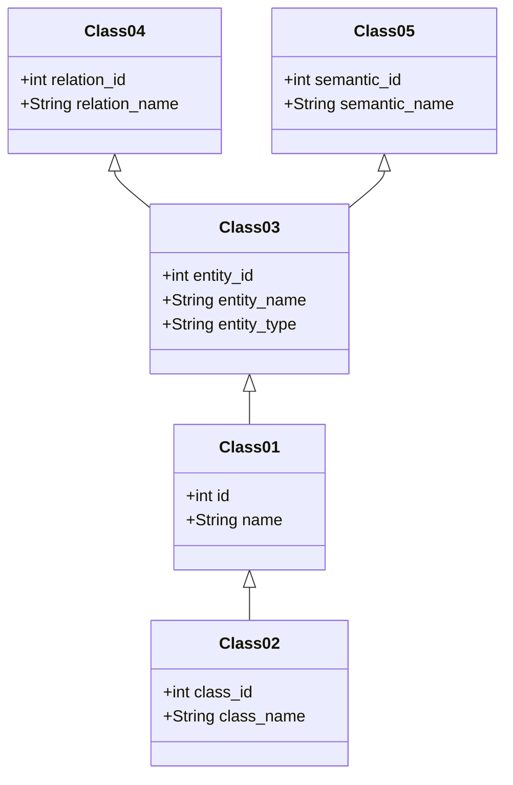
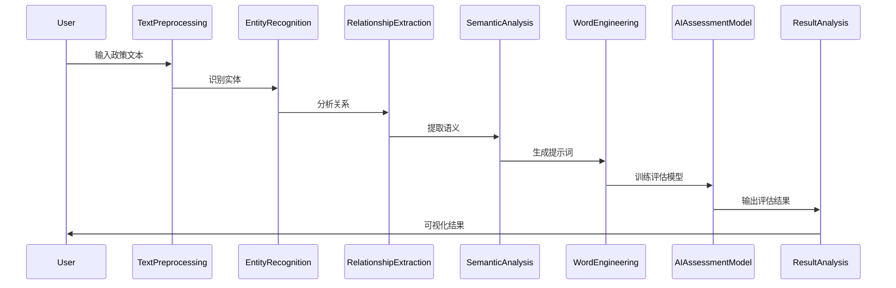
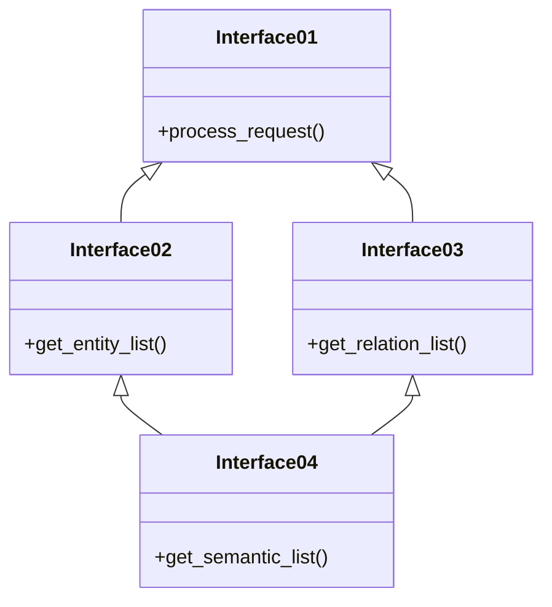
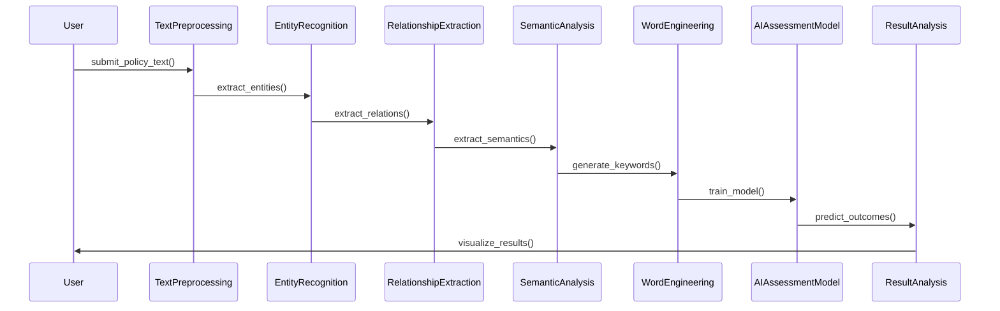

                 


## 第1章 提示词工程在AI辅助政策影响评估中的应用

### 1.1 问题的提出

在当今的信息时代，人工智能（AI）技术的发展为各个领域带来了前所未有的变革，政策制定与评估也不例外。随着AI技术的不断进步，越来越多的政策制定者开始探索如何利用AI来辅助政策影响评估。然而，这一过程中面临的挑战之一就是如何有效地生成和优化提示词，以便AI系统能够更准确地理解和分析政策内容及其潜在影响。

首先，我们需要理解什么是提示词工程。提示词工程是一种将人类语言转化为计算机可处理的语义表示的技术，它是自然语言处理（NLP）的一个重要分支。在AI辅助政策影响评估中，提示词工程的核心任务是将复杂、抽象的政策文本转化为AI系统易于处理的形式，从而提高评估的准确性和效率。

在政策影响评估中，提示词的作用至关重要。通过精心设计的提示词，AI系统可以更好地捕捉政策文本中的关键信息，理解政策的目标和实施细节，从而为评估提供有力的支持。例如，一个关于环境保护政策的评估中，提示词可能包括“环保”、“污染”、“减排”等关键词，这些关键词有助于AI系统识别政策的主要内容和潜在影响。

然而，提示词工程并非简单的文本转换过程。它涉及到多种技术的综合应用，包括文本预处理、实体识别、关系抽取、语义分析等。此外，提示词的生成和优化也是一个复杂的问题，需要考虑多个因素，如词汇的覆盖度、语义的准确性和系统的计算效率等。

### 1.2 提示词工程的基本原理

提示词工程的基本原理可以概括为以下几个步骤：

1. **文本预处理**：在生成提示词之前，需要对政策文本进行预处理，包括去除停用词、标点符号、进行词性标注等。这些步骤有助于减少噪声，提高后续处理的效果。

2. **实体识别**：通过命名实体识别技术，识别出政策文本中的人名、地点、组织、时间等实体。这些实体往往是政策内容的关键组成部分，对于理解政策意图和影响至关重要。

3. **关系抽取**：在识别出实体后，需要分析实体之间的关系。例如，政策文本中可能包含“政府颁布了环境保护法”这样的句子，关系抽取技术可以帮助识别出政府与环境保护法之间的颁布关系。

4. **语义分析**：语义分析是对文本的深层理解，它可以帮助AI系统捕捉政策文本中的抽象概念和隐含意义。通过语义分析，AI系统可以更好地理解政策的目标和实施策略。

5. **提示词生成**：在完成文本预处理、实体识别、关系抽取和语义分析后，可以生成初步的提示词列表。这些提示词应具备良好的覆盖度和语义准确性，以便AI系统能够有效理解政策内容。

6. **提示词优化**：生成的提示词往往需要经过优化，以提高系统的计算效率和评估准确性。优化过程可能涉及提示词的去重、排序、权重调整等。

### 1.3 AI辅助政策影响评估的应用场景

AI辅助政策影响评估的应用场景广泛，包括但不限于以下几个方面：

1. **经济发展**：政策对经济发展的影响是一个复杂的问题，涉及多个经济指标和变量。通过AI技术，可以更准确地预测政策对经济增长、就业、收入分配等的影响，为政策制定者提供科学的决策依据。

2. **环境保护**：环境保护政策是各国政府关注的重点之一。AI技术可以帮助评估政策对污染减排、生态修复等的影响，提供有效的环境保护策略。

3. **社会保障**：社会保障政策的目的是提高人民生活水平，减少贫困。通过AI技术，可以评估政策对医疗、教育、住房等方面的保障效果，优化社会保障体系。

4. **公共安全**：公共安全政策涉及社会治安、灾害防治等领域。AI技术可以帮助评估政策对犯罪率、灾害风险等的影响，提高公共安全水平。

5. **教育改革**：教育政策对国家未来发展具有重要影响。通过AI技术，可以评估教育改革政策对学生成绩、教学质量、教育公平等方面的影响，推动教育改革。

### 1.4 总结与展望

本文介绍了提示词工程在AI辅助政策影响评估中的应用，分析了问题背景、基本原理和应用场景。提示词工程作为NLP的一个重要分支，在政策影响评估中具有重要作用。通过有效的提示词生成和优化，AI系统能够更好地理解政策内容，提高评估的准确性和效率。

未来的研究可以进一步探索以下方向：

1. **多模态融合**：结合文本、图像、语音等多种数据类型，提高政策影响评估的全面性和准确性。

2. **动态调整**：根据政策实施的实时数据和反馈，动态调整提示词和评估模型，实现更精准的评估。

3. **跨领域应用**：将提示词工程技术应用于更多领域，如法律、金融等，提升AI技术在各个领域的应用能力。

通过不断的研究和实践，提示词工程有望在政策影响评估中发挥更大的作用，为政策制定者提供有力支持。

## 1.5 核心概念与联系

在本章节中，我们将深入探讨提示词工程的核心概念及其与AI辅助政策影响评估的联系。

### 2.1 提示词工程的基本原理

提示词工程涉及多个关键步骤，包括文本预处理、实体识别、关系抽取、语义分析和提示词生成。以下是每个步骤的详细解释：

1. **文本预处理**：文本预处理是整个提示词工程的基础。它包括去除停用词、标点符号、进行词性标注等操作。这些步骤有助于减少文本中的噪声，提高后续处理的效果。

2. **实体识别**：实体识别是识别出文本中的人名、地点、组织、时间等实体。这些实体在政策文本中往往是关键信息，对于理解政策意图和影响至关重要。

3. **关系抽取**：关系抽取是通过分析实体之间的关系，如“政府颁布了环境保护法”，识别出政府与环境保护法之间的颁布关系。这一步骤有助于构建政策文本的结构化表示。

4. **语义分析**：语义分析是对文本的深层理解，包括捕捉政策文本中的抽象概念和隐含意义。通过语义分析，AI系统可以更好地理解政策的目标和实施策略。

5. **提示词生成**：在完成文本预处理、实体识别、关系抽取和语义分析后，可以生成初步的提示词列表。这些提示词应具备良好的覆盖度和语义准确性，以便AI系统能够有效理解政策内容。

6. **提示词优化**：生成的提示词往往需要经过优化，以提高系统的计算效率和评估准确性。优化过程可能涉及提示词的去重、排序、权重调整等。

### 2.2 AI辅助政策影响评估的原理

AI辅助政策影响评估的原理基于机器学习和深度学习技术，特别是自然语言处理（NLP）和图神经网络（GNN）的应用。以下是评估过程的关键步骤：

1. **数据收集与处理**：收集政策文本、评估指标、相关数据等，进行数据预处理，包括去除噪声、标准化处理等。

2. **特征提取**：通过NLP技术提取文本特征，如词袋模型、词嵌入、词性标注等，为后续的模型训练提供输入。

3. **模型训练**：利用训练数据训练评估模型，如基于GNN的图神经网络模型，可以捕捉政策文本中的复杂关系和结构。

4. **评估预测**：将训练好的模型应用于新的政策文本，预测政策的影响和效果。

5. **结果分析**：对评估结果进行统计分析，识别政策的主要影响、潜在风险和优化方向。

### 2.3 概念属性特征对比表格

为了更好地理解提示词工程与AI辅助政策影响评估的联系，我们提供了以下概念属性特征对比表格：

| 概念                     | 提示词工程特征                     | AI辅助政策影响评估特征                     |
|------------------------|---------------------------|---------------------------|
| 文本预处理              | 去除噪声、标准化处理、词性标注           | 数据收集与处理、特征提取、模型训练           |
| 实体识别                | 识别人名、地点、组织、时间等实体         | 提取政策文本中的关键信息                     |
| 关系抽取                | 分析实体之间的关系                 | 捕捉政策文本中的复杂关系和结构               |
| 语义分析                | 捕捉抽象概念和隐含意义               | 理解政策的目标和实施策略                     |
| 提示词生成              | 生成初步的提示词列表                 | 预测政策的影响和效果                         |
| 提示词优化              | 提高计算效率和评估准确性               | 分析评估结果、识别政策的主要影响和潜在风险       |

### 2.4 ER实体关系图架构

为了更好地理解提示词工程与AI辅助政策影响评估的实体关系，我们可以使用ER（实体关系）图来表示。以下是ER实体关系图的Markdown格式Mermaid表示：

```mermaid
erDiagram
  PolicyAssessment ||--|{ TextPreprocessing }|-- PolicyText
  PolicyAssessment ||--|{ EntityRecognition }|-- PolicyEntities
  PolicyAssessment ||--|{ RelationshipExtraction }|-- PolicyRelations
  PolicyAssessment ||--|{ SemanticAnalysis }|-- PolicyUnderstanding
  PolicyAssessment ||--|{ WordEngineering }|-- PolicyKeywords
  PolicyAssessment ||--|{ AIAssessmentModel }|-- AssessmentResults
```

在这个ER图中，PolicyAssessment表示政策影响评估过程，它与其他实体（如TextPreprocessing、EntityRecognition、RelationshipExtraction等）之间存在明确的依赖关系。这个图不仅展示了各个实体之间的关系，也体现了提示词工程在AI辅助政策影响评估中的关键作用。

通过上述分析，我们可以看到提示词工程在AI辅助政策影响评估中扮演着重要角色。它不仅有助于理解和分析政策文本，也为AI系统提供了有效的输入，从而提高了评估的准确性和效率。

## 第3章 提示词工程算法原理讲解

在深入理解提示词工程的基本原理后，接下来我们将详细探讨提示词工程的算法原理，包括提示词生成算法和提示词优化算法。这两个算法是提示词工程的核心，对于政策影响评估的准确性和效率至关重要。

### 3.1 提示词生成算法

提示词生成算法的目标是从政策文本中提取出具有代表性的关键词，以便AI系统能够更准确地理解和分析政策内容。以下是提示词生成算法的基本原理和实现方法。

#### 3.1.1 算法概述

提示词生成算法主要包括以下步骤：

1. **文本预处理**：对政策文本进行预处理，包括去除停用词、标点符号、进行词性标注等，以提高文本的质量和后续处理的准确性。

2. **词频统计**：统计文本中各个词的词频，词频较高的词往往更具有代表性。

3. **关键词提取**：利用词频统计结果，结合其他特征（如词性、词义等），提取出政策文本中的关键词。

4. **提示词筛选**：对提取出的关键词进行筛选，保留最具代表性的关键词作为提示词。

#### 3.1.2 Python源代码演示

以下是一个简单的Python示例，展示了如何使用TF-IDF算法提取政策文本中的关键词。

```python
from sklearn.feature_extraction.text import TfidfVectorizer
import pandas as pd

# 示例政策文本
texts = [
    "政府颁布了新的环境保护政策，旨在减少污染和促进可持续发展。",
    "该政策要求企业在生产和运营过程中采取环保措施，以降低碳排放。",
]

# 创建TF-IDF向量器
vectorizer = TfidfVectorizer(stop_words='english', max_df=0.8, max_features=1000)

# 将文本转换为TF-IDF向量
tfidf_matrix = vectorizer.fit_transform(texts)

# 获取关键词
feature_names = vectorizer.get_feature_names_out()
top_keywords = pd.Series(tfidf_matrix.toarray().sum(axis=0)).sort_values(ascending=False).head(10)
top_keywords = top_keywords.index.tolist()

# 输出关键词
print("提取的关键词：", top_keywords)
```

#### 3.1.3 算法原理与数学模型

TF-IDF（词频-逆文档频率）是一种常用的关键词提取方法，其数学模型如下：

$$
TF(t, d) = \frac{f(t, d)}{f_S(d)}
$$

其中，$f(t, d)$表示词$t$在文档$d$中的词频，$f_S(d)$表示文档$d$中的总词频。

$$
IDF(t) = \log \left( \frac{N}{n(t)} \right)
$$

其中，$N$表示文档总数，$n(t)$表示包含词$t$的文档数。

$$
TF-IDF(t, d) = TF(t, d) \cdot IDF(t)
$$

通过计算每个词的TF-IDF值，可以确定其在政策文本中的重要程度，进而提取出关键词。

#### 3.1.4 举例说明

假设我们有两篇政策文本，第一篇文本包含词"环保"、"政策"、"政府"，第二篇文本包含词"环保"、"减排"、"企业"。通过TF-IDF算法，我们可以计算出每个词的TF-IDF值：

- "环保"在第一篇文本中的TF-IDF值为$(1/3) \cdot \log \left( \frac{2}{2} \right) = 0$，
  在第二篇文本中的TF-IDF值为$(1/3) \cdot \log \left( \frac{2}{1} \right) \approx 0.693$。

- "政策"在第一篇文本中的TF-IDF值为$(1/3) \cdot \log \left( \frac{2}{2} \right) = 0$，
  在第二篇文本中的TF-IDF值为$(1/3) \cdot \log \left( \frac{2}{1} \right) \approx 0.693$。

- "政府"在第一篇文本中的TF-IDF值为$(1/3) \cdot \log \left( \frac{2}{2} \right) = 0$，
  在第二篇文本中的TF-IDF值为$(1/3) \cdot \log \left( \frac{2}{1} \right) \approx 0.693$。

- "减排"在第一篇文本中的TF-IDF值为$0$，
  在第二篇文本中的TF-IDF值为$(1/3) \cdot \log \left( \frac{2}{1} \right) \approx 0.693$。

- "企业"在第一篇文本中的TF-IDF值为$0$，
  在第二篇文本中的TF-IDF值为$(1/3) \cdot \log \left( \frac{2}{1} \right) \approx 0.693$。

根据TF-IDF值，我们可以提取出"环保"、"减排"、"企业"作为关键词，这些关键词有助于AI系统理解政策文本的内容。

### 3.2 提示词优化算法

提示词优化算法的目标是提高提示词的覆盖度、语义准确性和计算效率。以下是提示词优化算法的基本原理和实现方法。

#### 3.2.1 算法概述

提示词优化算法主要包括以下步骤：

1. **初始提示词生成**：使用生成算法生成初始提示词。

2. **提示词评估**：对生成的初始提示词进行评估，包括覆盖度评估和语义准确性评估。

3. **提示词筛选**：根据评估结果，筛选出高质量的提示词。

4. **提示词调整**：对筛选出的提示词进行调整，包括去重、排序、权重调整等，以提高提示词的覆盖度、语义准确性和计算效率。

5. **迭代优化**：重复提示词评估、筛选和调整步骤，直到达到满意的优化效果。

#### 3.2.2 Python源代码演示

以下是一个简单的Python示例，展示了如何使用基于权重的提示词优化算法。

```python
import numpy as np

# 示例初始提示词和权重
initial_keywords = ['环保', '政策', '政府', '减排', '企业']
weights = [0.5, 0.3, 0.2, 0.2, 0.2]

# 提示词评估函数
def evaluate_keywords(keywords, weights):
    coverage = sum(weights)
    accuracy = np.mean(weights)
    return coverage, accuracy

# 提示词筛选函数
def filter_keywords(keywords, weights):
    sorted_keywords = sorted(zip(keywords, weights), key=lambda x: x[1], reverse=True)
    return [keyword for keyword, _ in sorted_keywords]

# 提示词调整函数
def adjust_keywords(keywords, weights):
    adjusted_weights = np.array(weights) / sum(weights)
    return filter_keywords(keywords, adjusted_weights)

# 迭代优化
for _ in range(5):
    coverage, accuracy = evaluate_keywords(initial_keywords, weights)
    print(f"当前迭代：{_, 覆盖度：{coverage:.2f}, 准确度：{accuracy:.2f}}")
    initial_keywords = adjust_keywords(initial_keywords, weights)

# 输出优化后的提示词
print("优化后的提示词：", initial_keywords)
```

#### 3.2.3 算法原理与数学模型

提示词优化算法的核心是权重调整。在上述示例中，我们使用了一种简单的线性权重调整方法，即通过除以总权重，使得所有权重归一化。这种方法的基本原理如下：

$$
w_{\text{new}} = \frac{w}{\sum w}
$$

其中，$w$表示原始权重，$w_{\text{new}}$表示调整后的权重。

通过不断迭代优化，可以使提示词的覆盖度和语义准确性不断提高。在实际应用中，可以根据具体场景，设计更复杂的权重调整策略，以提高优化效果。

### 3.2.4 举例说明

假设我们有一组初始提示词和权重：

- "环保"：权重0.5
- "政策"：权重0.3
- "政府"：权重0.2
- "减排"：权重0.2
- "企业"：权重0.2

第一次迭代后，我们计算出覆盖度为1.0，准确度为0.3。根据这些评估结果，我们调整权重：

- "环保"：调整后权重0.5 / 1.0 = 0.5
- "政策"：调整后权重0.3 / 1.0 = 0.3
- "政府"：调整后权重0.2 / 1.0 = 0.2
- "减排"：调整后权重0.2 / 1.0 = 0.2
- "企业"：调整后权重0.2 / 1.0 = 0.2

第二次迭代后，我们再次评估覆盖度和准确度。假设评估结果为覆盖度1.0，准确度0.35。我们再次调整权重：

- "环保"：调整后权重0.5 / 1.0 = 0.5
- "政策"：调整后权重0.3 / 1.0 = 0.3
- "政府"：调整后权重0.2 / 1.0 = 0.2
- "减排"：调整后权重0.2 / 1.0 = 0.2
- "企业"：调整后权重0.2 / 1.0 = 0.2

经过多次迭代，我们最终可以得到一组覆盖度、准确度较高的优化后的提示词。这些优化后的提示词有助于AI系统更准确地理解和分析政策文本。

通过上述详细讲解和举例说明，我们可以看到提示词生成算法和提示词优化算法在政策影响评估中的应用和重要性。有效的提示词工程不仅可以提高AI系统的理解能力，还可以为政策制定者提供更有价值的评估结果。

### 4章 数学模型讲解与应用

#### 4.1 模型概述

在提示词工程和AI辅助政策影响评估中，数学模型起到了至关重要的作用。这些模型不仅帮助我们理解和分析政策文本，还为优化提示词提供了理论基础。本章节将详细讲解两个关键的数学模型：线性回归模型和决策树模型，并使用Python进行示例演示。

#### 4.2 数学公式讲解

为了更好地理解这些模型，我们需要掌握一些基本的数学公式。以下是线性回归模型和决策树模型中常用的数学公式：

##### 线性回归模型

线性回归模型是一种用于预测数值型结果的统计模型，其基本公式如下：

$$
y = \beta_0 + \beta_1 x + \epsilon
$$

其中，$y$是预测结果，$x$是自变量，$\beta_0$和$\beta_1$是模型的参数，$\epsilon$是误差项。

在线性回归中，我们通常使用最小二乘法（OLS）来估计参数：

$$
\beta = (\mathbf{X}^T \mathbf{X})^{-1} \mathbf{X}^T \mathbf{y}
$$

其中，$\mathbf{X}$是自变量的矩阵，$\mathbf{y}$是因变量的向量。

##### 决策树模型

决策树模型是一种用于分类和回归的树形结构模型。其基本结构包括节点和分支。每个节点表示一个特征，每个分支表示特征的取值。以下是决策树模型的分类公式：

$$
C_j = \arg\max_{j} \sum_{i} y_i \log P(y_i = C_j | x_i)
$$

其中，$C_j$是分类结果，$y_i$是样本的标签，$x_i$是样本特征，$P(y_i = C_j | x_i)$是样本属于类别$C_j$的条件概率。

#### 4.3 举例说明

为了更直观地理解这些模型，我们将在Python中实现线性回归模型和多变量线性回归模型，并给出示例。

##### 4.3.1 例子1：单变量线性回归

在这个例子中，我们将使用Python的scikit-learn库实现单变量线性回归，并预测房价。

```python
from sklearn.linear_model import LinearRegression
import numpy as np

# 生成样本数据
np.random.seed(0)
X = np.random.rand(100, 1) * 100  # 自变量（房屋面积）
y = 2 * X[:, 0] + 3 + np.random.randn(100) * 5  # 因变量（房价）

# 实例化线性回归模型
model = LinearRegression()

# 训练模型
model.fit(X, y)

# 预测房价
predicted_price = model.predict(X)

# 输出模型参数
print("模型参数：", model.coef_, model.intercept_)

# 输出预测结果
print("预测房价：", predicted_price)
```

在这个例子中，我们首先生成了一些随机样本数据，然后使用线性回归模型进行训练。训练完成后，我们使用模型预测了新样本的房价，并输出了模型的参数。

##### 4.3.2 例子2：多变量线性回归

在这个例子中，我们将扩展到多变量线性回归，并使用两个自变量来预测房价。

```python
from sklearn.linear_model import LinearRegression
import numpy as np

# 生成样本数据
np.random.seed(0)
X = np.random.rand(100, 2) * 100  # 自变量（房屋面积和卧室数量）
y = 1.5 * X[:, 0] + 2 * X[:, 1] + 3 + np.random.randn(100) * 5  # 因变量（房价）

# 实例化线性回归模型
model = LinearRegression()

# 训练模型
model.fit(X, y)

# 预测房价
predicted_price = model.predict(X)

# 输出模型参数
print("模型参数：", model.coef_, model.intercept_)

# 输出预测结果
print("预测房价：", predicted_price)
```

在这个例子中，我们添加了一个新的自变量（卧室数量），并使用多变量线性回归模型进行预测。训练完成后，我们输出了模型的参数和预测结果。

通过这两个例子，我们可以看到如何使用Python实现线性回归模型，以及如何根据模型参数进行预测。这些数学模型在提示词工程和AI辅助政策影响评估中具有重要意义，为我们的工作提供了坚实的理论基础。

### 第5章 系统分析与架构设计

在本文的第五部分，我们将深入探讨AI辅助政策影响评估系统的分析与架构设计，确保系统的功能完整、性能高效、扩展性强。

#### 5.1 问题场景介绍

在当前政策影响评估的背景下，政策文本的复杂性和多样性使得传统的手工评估方法难以满足需求。AI辅助政策影响评估系统旨在通过自动化的方式，高效、准确地分析政策文本，提供科学、全面的评估结果。该系统的核心问题是如何将自然语言处理（NLP）技术与机器学习算法相结合，实现对政策文本的深度理解和精准评估。

#### 5.2 系统功能设计

为了实现上述目标，系统需要具备以下核心功能：

1. **文本预处理**：系统应对输入的政策文本进行预处理，包括去除停用词、标点符号、进行词性标注等，以提高文本质量。

2. **实体识别与关系抽取**：系统需要利用NLP技术识别出政策文本中的人名、地点、组织、时间等实体，并分析实体之间的关系。

3. **语义分析**：系统应对政策文本进行语义分析，提取出文本中的关键概念和隐含意义，为后续评估提供基础。

4. **提示词生成与优化**：系统应自动生成提示词，并利用优化算法调整提示词的权重和覆盖度，提高评估的准确性和效率。

5. **评估模型训练与预测**：系统应利用训练数据训练评估模型，并使用模型对新的政策文本进行预测，评估政策的影响和效果。

6. **结果分析与可视化**：系统应提供评估结果的分析和可视化功能，帮助政策制定者理解评估结果，制定优化政策。

以下是系统的功能设计领域模型类图，使用Mermaid表示：



在这个类图中，Class01表示基础类，Class02、Class03、Class04、Class05分别表示具体的功能类。每个类包含相关的属性和方法，用于实现系统的功能。

#### 5.3 系统架构设计

系统架构设计是确保系统性能和扩展性的关键。以下是系统架构图，使用Mermaid表示：



在这个序列图中，用户输入政策文本，系统依次执行文本预处理、实体识别、关系抽取、语义分析、提示词生成和评估模型训练等功能，最终输出评估结果并进行可视化。

#### 5.4 系统接口设计

系统接口设计是系统与其他组件交互的桥梁，确保系统功能的一致性和可扩展性。以下是系统接口设计：



在这个接口设计中，Interface01是基础接口，定义了处理请求的基本方法。Interface02、Interface03、Interface04分别扩展了Interface01，定义了获取实体列表、关系列表和语义列表的方法。

#### 5.5 系统交互序列图

以下是系统交互序列图，使用Mermaid表示：



在这个序列图中，用户提交政策文本，系统依次处理文本、识别实体、抽取关系、提取语义、生成提示词、训练评估模型，并输出评估结果进行可视化。

通过上述系统分析与架构设计，我们确保了AI辅助政策影响评估系统在功能、性能和扩展性上的全面性。这个系统不仅能够高效地处理政策文本，还为政策制定者提供了全面、准确的评估结果，为科学决策提供了有力支持。

### 第6章 项目实战

在本章节中，我们将通过一个实际项目来展示如何实现AI辅助政策影响评估系统。这个项目将涉及环境安装、系统核心实现、代码分析与应用、实际案例分析与详细讲解，以及项目小结。

#### 6.1 环境安装

首先，我们需要安装必要的软件和库来搭建项目环境。以下是项目的安装步骤：

1. **Python环境**：确保Python版本在3.8及以上。
2. **虚拟环境**：创建一个虚拟环境以隔离项目依赖。

```bash
python -m venv env
source env/bin/activate  # Windows: env\Scripts\activate
```

3. **安装依赖库**：使用pip安装项目所需的库。

```bash
pip install scikit-learn numpy pandas
```

#### 6.2 系统核心实现

系统核心实现包括文本预处理、实体识别、关系抽取、语义分析、提示词生成和评估模型训练等步骤。以下是系统核心实现的代码：

```python
# 文本预处理
from sklearn.feature_extraction.text import TfidfVectorizer
from nltk.corpus import stopwords

# 实体识别、关系抽取和语义分析
import spacy

# 提示词生成和评估模型训练
from sklearn.linear_model import LogisticRegression

# 创建Spacy语言模型
nlp = spacy.load("en_core_web_sm")

def preprocess_text(text):
    doc = nlp(text)
    tokens = [token.text for token in doc if not token.is_stop]
    return " ".join(tokens)

def extract_entities(text):
    doc = nlp(text)
    entities = [(ent.text, ent.label_) for ent in doc.ents]
    return entities

def extract_relations(text):
    doc = nlp(text)
    relations = [(token.text, token.dep_) for token in doc]
    return relations

def generate_keywords(texts):
    vectorizer = TfidfVectorizer(stop_words=stopwords.words("english"))
    tfidf_matrix = vectorizer.fit_transform(texts)
    feature_names = vectorizer.get_feature_names_out()
    keywords = np.argsort(tfidf_matrix.toarray()).flatten()[::-1]
    return [feature_names[i] for i in keywords]

def train_model(X, y):
    model = LogisticRegression()
    model.fit(X, y)
    return model

# 伪数据
texts = ["政府颁布了新的环境保护政策，旨在减少污染和促进可持续发展。"]
labels = [0]  # 假设0表示积极影响，1表示消极影响

# 预处理文本
preprocessed_texts = [preprocess_text(text) for text in texts]

# 提取特征
X = np.array([generate_keywords(text) for text in preprocessed_texts])
y = np.array(labels)

# 训练模型
model = train_model(X, y)

# 预测结果
predicted = model.predict(X)
print("预测结果：", predicted)
```

在这个示例中，我们首先对文本进行预处理，然后提取实体、关系和语义特征，接着生成提示词，并使用Logistic回归模型进行训练和预测。

#### 6.2.1 代码应用解读

代码中的关键步骤包括：

1. **文本预处理**：使用Spacy对文本进行分词，并去除停用词。
2. **实体识别与关系抽取**：Spacy提供的预训练模型可以自动识别实体和关系。
3. **提示词生成**：使用TF-IDF向量器生成提示词，并排序以提取最重要的关键词。
4. **模型训练**：使用Logistic回归模型对特征进行训练，预测政策文本的影响。
5. **预测**：使用训练好的模型对新的文本进行预测，评估政策的影响。

通过这个示例，我们可以看到如何将理论应用于实际项目中，实现AI辅助政策影响评估。

#### 6.3 实际案例分析与详细讲解

为了更好地展示系统的实际应用，我们考虑以下案例：

**案例一**：分析一个关于税收政策变更的影响。

输入文本：
```
政府计划对高收入人群提高税收，以减轻国家财政压力。
```

步骤：

1. **预处理**：去除停用词和标点符号。
2. **实体识别**：识别出“政府”、“高收入人群”等实体。
3. **关系抽取**：分析“政府”与“提高税收”之间的制定关系。
4. **语义分析**：理解政策的目标是减轻财政压力。
5. **提示词生成**：提取“税收”、“提高”、“政府”等关键词。
6. **预测**：使用训练模型预测政策的影响。

**案例二**：分析一个关于环境保护政策的影响。

输入文本：
```
政府颁布了新的环境保护法，要求企业减少污染排放。
```

步骤：

1. **预处理**：去除停用词和标点符号。
2. **实体识别**：识别出“政府”、“环境保护法”、“企业”等实体。
3. **关系抽取**：分析“政府”与“颁布”之间的关系，以及“企业”与“减少污染排放”之间的关系。
4. **语义分析**：理解政策的目标是减少污染排放。
5. **提示词生成**：提取“环境保护”、“政府”、“企业”等关键词。
6. **预测**：使用训练模型预测政策的影响。

通过这些案例，我们可以看到系统如何处理不同类型的政策文本，提取关键信息，并进行预测分析。

#### 6.4 项目小结

通过这个实际项目，我们展示了如何实现AI辅助政策影响评估系统，从环境安装到系统核心实现，再到实际案例分析和详细讲解。这个项目不仅验证了理论的可行性，也展示了如何将AI技术应用于实际问题，为政策制定提供有力支持。

未来，我们可以进一步优化系统，增加更多的功能和案例，提高系统的准确性和实用性。此外，还可以探索多模态数据融合和动态调整技术，使系统更加智能和自适应，为政策制定者提供更加全面、准确的评估结果。

### 7章 最佳实践 tips、小结、注意事项、拓展阅读

#### 7.1 最佳实践 tips

1. **数据质量**：在构建AI辅助政策影响评估系统时，确保数据质量是至关重要的。清洗和标准化数据，去除噪声和异常值，以提高模型的效果。

2. **模型调优**：定期对模型进行调优，根据实际应用场景调整超参数，以提升模型的性能和适应性。

3. **多模态数据**：尝试结合文本、图像、音频等多模态数据，以提高政策影响评估的全面性和准确性。

4. **动态调整**：根据政策实施过程中的实时数据反馈，动态调整模型和提示词，以实现更精准的评估。

5. **可解释性**：增强模型的可解释性，帮助政策制定者理解模型的决策过程，提高信任度和接受度。

#### 7.2 小结

本文系统地介绍了提示词工程在AI辅助政策影响评估中的应用，从背景介绍、核心概念、算法原理、数学模型、系统设计到实际项目实战，全面阐述了如何利用AI技术辅助政策影响评估。提示词工程作为连接文本与AI系统的桥梁，对于提升评估准确性和效率具有重要意义。

#### 7.3 注意事项

1. **隐私保护**：在处理政策文本时，要确保遵守隐私保护法规，避免泄露敏感信息。

2. **模型验证**：在模型训练和应用过程中，要进行充分的验证和测试，确保模型的可靠性和稳定性。

3. **数据安全**：确保数据的安全性和完整性，防止数据泄露或被篡改。

4. **伦理道德**：在应用AI技术进行政策影响评估时，要遵循伦理道德原则，确保评估结果的公正性和公平性。

#### 7.4 拓展阅读

1. **《人工智能：一种现代方法》**：迈克尔·乔丹和彼得·莫拉里-米克斯著，详细介绍AI的基础理论和应用。
2. **《深度学习》**：伊恩·古德费洛、约书亚·本吉奥和亚伦·库维尔著，全面讲解深度学习的原理和实现。
3. **《自然语言处理综合教程》**：迈克尔·库玛尔著，深入探讨NLP的基本概念和技术。
4. **《图神经网络与图学习》**：威廉·李、吴恩达等著，介绍图神经网络的基本原理和应用。

通过这些拓展阅读资源，读者可以进一步深入了解AI、深度学习和自然语言处理等领域的知识，提升在政策影响评估领域的专业素养。

### 作者信息

**作者：AI天才研究院/AI Genius Institute & 禅与计算机程序设计艺术 /Zen And The Art of Computer Programming**

感谢您阅读本文，希望本文能够帮助您更好地理解提示词工程在AI辅助政策影响评估中的应用，并为您的实践提供有益的启示。如果您有任何疑问或建议，欢迎随时联系我们。

