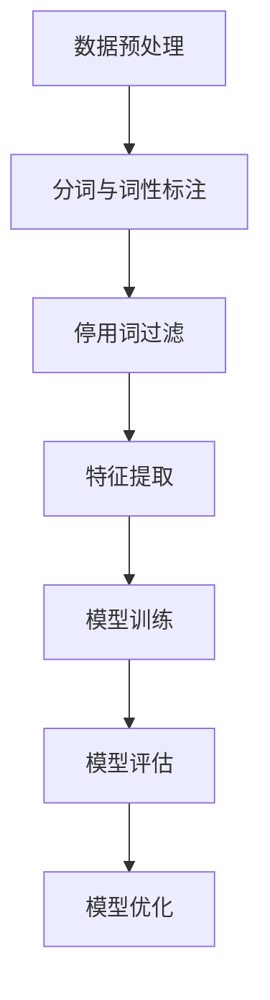

                 

# 提示词工程在AI辅助法律推理中的应用研究

## 关键词
- 提示词工程
- AI辅助法律推理
- 法律文档分析
- 知识图谱
- 自然语言处理

## 摘要
本文探讨了提示词工程在AI辅助法律推理中的应用，通过对法律文档的深入分析和处理，利用AI技术提升法律推理的效率和准确性。首先，文章介绍了提示词工程的基础原理和应用场景，包括法律文档自动分类和条款解析。接着，文章详细阐述了AI辅助法律推理的原理，包括知识图谱、自然语言处理和深度学习等技术。通过实例分析，本文展示了提示词工程和AI辅助法律推理在实际法律推理中的应用效果。最后，文章提出了提示词工程在法律推理中的一些最佳实践，并总结了全文的研究结论。

----------------------------------------------------------------

# 第一部分: 引言

## 1.1 问题背景与意义

### 1.1.1 提示词工程概述
提示词工程是自然语言处理领域中的一项关键技术，其目的是从大量文本数据中提取出有意义的词汇或短语，以便于后续的处理和分析。在法律领域，随着法律文档数量的激增，如何高效地处理和分析这些文档成为了一个重要问题。

### 1.1.2 AI辅助法律推理的挑战与需求
法律推理涉及到大量的文本分析和逻辑推理，传统的方法往往效率低下且容易出现错误。随着AI技术的快速发展，特别是自然语言处理和机器学习技术的应用，AI辅助法律推理逐渐成为一种新的解决方案。然而，如何有效地结合提示词工程与AI技术，提高法律推理的效率和准确性，仍然是一个亟待解决的挑战。

### 1.1.3 书籍结构安排与目标读者
本书分为四个主要部分，首先介绍提示词工程的基础原理和应用场景；其次详细阐述AI辅助法律推理的原理和算法；然后通过实例分析展示应用效果；最后提出最佳实践和未来研究方向。本书的目标读者包括法律领域的研究人员、法律从业者以及对AI技术感兴趣的技术人员。

## 1.2 相关概念

### 1.2.1 提示词工程定义与作用
提示词工程是指通过算法和工具从文本中提取出有价值的词汇或短语的过程。在法律领域，提示词工程可以帮助快速定位相关法律条款，提取关键信息，从而提高法律文档的处理效率。

### 1.2.2 AI辅助法律推理基本原理
AI辅助法律推理利用机器学习、自然语言处理和知识图谱等技术，对法律文本进行分析和推理，以支持法律决策和案件分析。其核心在于将法律知识和逻辑推理相结合，实现高效准确的法律推理。

### 1.2.3 相关技术领域与交叉融合
提示词工程和AI辅助法律推理涉及到多个技术领域，包括自然语言处理、机器学习、知识图谱等。这些技术的交叉融合为法律领域提供了新的解决方案，但也带来了新的挑战。

## 1.3 边界与外延

### 1.3.1 提示词工程在法律领域中的应用范围
提示词工程在法律领域中的应用范围广泛，包括法律文档分类、条款提取、案例检索等。其应用深度和广度决定了其在法律推理中的作用和重要性。

### 1.3.2 AI辅助法律推理的技术边界
AI辅助法律推理的技术边界涉及到算法的准确度、法律知识的表示和推理的效率等。这些技术难题的解决将进一步提升法律推理的智能化水平。

### 1.3.3 案例分析与拓展应用场景
通过具体案例的分析和拓展应用场景的探讨，可以更好地理解提示词工程在AI辅助法律推理中的应用价值和潜力。

## 1.4 概念结构与核心要素

### 1.4.1 提示词工程的核心概念
提示词工程的核心概念包括提示词的生成、评估和优化。这些概念是提示词工程能够有效应用于法律领域的基础。

### 1.4.2 AI辅助法律推理的关键要素
AI辅助法律推理的关键要素包括法律知识的表示、自然语言处理算法的选择和推理策略的制定。这些要素共同决定了AI辅助法律推理的效果。

### 1.4.3 概念属性特征对比分析
通过对提示词工程和AI辅助法律推理的核心概念和关键要素进行对比分析，可以更好地理解两者之间的关系和融合方式。

----------------------------------------------------------------

# 第二部分: 提示词工程基础

## 2.1 提示词工程基本原理

### 2.1.1 提示词生成方法
提示词生成是提示词工程的核心步骤，其方法包括基于规则的方法、基于统计的方法和基于机器学习的方法。每种方法都有其优缺点，适用于不同的应用场景。

#### 2.1.1.1 基于规则的方法
基于规则的方法通过定义一系列规则来生成提示词，其优点是规则明确、易于理解，但缺点是规则数量庞大且难以覆盖所有情况。

#### 2.1.1.2 基于统计的方法
基于统计的方法通过分析文本数据中的词频、词关联等统计信息来生成提示词，其优点是能够自动学习并适应新情况，但缺点是可能产生大量无关的提示词。

#### 2.1.1.3 基于机器学习的方法
基于机器学习的方法通过训练模型来生成提示词，其优点是能够自适应并提高提示词的准确性，但缺点是需要大量的数据和计算资源。

### 2.1.2 提示词评估与优化
提示词评估与优化是确保提示词工程有效性的关键步骤。评估方法包括词频、词重要性、语义相似度等，优化方法包括启发式算法、机器学习算法等。

#### 2.1.2.1 提示词质量评估指标
提示词质量评估指标包括提示词的相关性、准确性、覆盖率等，这些指标用于衡量提示词工程的效果。

#### 2.1.2.2 提示词优化策略
提示词优化策略包括词频调整、词义扩展、噪声过滤等，这些策略用于提高提示词的准确性和实用性。

## 2.2 提示词工程应用场景

### 2.2.1 法律文档自动分类
法律文档自动分类是提示词工程在法律领域的重要应用之一。通过将法律文档分类，可以方便地进行文档管理和检索。

#### 2.2.1.1 文本预处理
文本预处理包括分词、词性标注、停用词过滤等步骤，这些步骤用于将原始文本转换为适合分类的特征表示。

#### 2.2.1.2 分类算法应用
分类算法包括朴素贝叶斯、支持向量机、决策树等，这些算法用于将文本数据分类到不同的类别。

#### 2.2.1.3 分类结果评估
分类结果评估包括准确率、召回率、F1值等指标，这些指标用于衡量分类算法的性能。

### 2.2.2 法律条款解析与提取
法律条款解析与提取是提示词工程在法律领域的另一个重要应用。通过解析和提取法律条款，可以方便地进行条款理解和应用。

#### 2.2.2.1 条款语义分析
条款语义分析包括语句结构分析、词义分析等步骤，这些步骤用于理解法律条款的含义。

#### 2.2.2.2 提示词生成与提取
提示词生成与提取包括基于规则的方法和基于机器学习的方法，这些方法用于从法律条款中提取关键信息。

#### 2.2.2.3 提示词辅助条款理解
提示词辅助条款理解包括提示词的语义分析、词义关联等步骤，这些步骤用于辅助理解法律条款的复杂含义。

## 2.3 提示词工程工具与框架

### 2.3.1 常用提示词工程工具
常用提示词工程工具包括NLTK、spaCy、jieba等，这些工具提供了丰富的功能，适用于不同的应用场景。

#### 2.3.1.1 开源工具介绍
开源工具如NLTK和spaCy提供了丰富的文本处理功能，适用于各种文本处理任务。

#### 2.3.1.2 商业工具对比
商业工具如OpenText和Microsoft Azure提供了专业的文本处理服务，适用于大型企业和专业应用。

### 2.3.2 提示词工程框架设计
提示词工程框架设计包括数据预处理、提示词生成、提示词评估等模块，这些模块共同构成了一个完整的提示词工程系统。

#### 2.3.2.1 框架结构
框架结构包括数据流和控制流，用于实现提示词工程的各个步骤。

#### 2.3.2.2 功能模块
功能模块包括文本预处理、提示词生成、提示词评估等，这些模块共同实现了提示词工程的核心功能。

#### 2.3.2.3 框架优势与不足
框架优势包括模块化设计、易于扩展和高效的执行效率，不足之处包括对专业知识和经验的依赖。

----------------------------------------------------------------

# 第三部分: AI辅助法律推理

## 3.1 AI辅助法律推理原理

### 3.1.1 法律推理基本概念
法律推理是法律活动中的一项基本技能，它涉及到从已知事实和法律规定中推导出新结论的过程。法律推理可以分为演绎推理、归纳推理和类比推理三种类型。

#### 3.1.1.1 法律推理的定义与分类
法律推理是指根据法律事实和法律规定，通过逻辑思维过程，得出新的法律结论的方法。根据推理方法的不同，法律推理可以分为演绎推理、归纳推理和类比推理。

#### 3.1.1.2 法律推理的作用与意义
法律推理在法律活动中具有重要作用，它有助于法官和律师正确理解和适用法律，确保法律适用的公正性和合理性。同时，法律推理也是法律教育的重要组成部分，有助于培养法律工作者的逻辑思维和推理能力。

### 3.1.2 AI在法律推理中的应用
随着人工智能技术的发展，AI在法律推理中的应用逐渐成为一种新的趋势。AI可以辅助法律工作者进行法律推理，提高法律推理的效率和准确性。

#### 3.1.2.1 传统方法与挑战
传统的法律推理主要依赖于法律工作者的经验和知识，这种方法存在效率低下、主观性较强等问题。为了解决这些问题，人工智能技术被引入到法律推理中。

#### 3.1.2.2 AI辅助法律推理的优势
AI辅助法律推理具有以下优势：首先，AI可以快速处理大量法律文档，从海量数据中提取有用信息；其次，AI可以自动学习和适应新的法律知识，提高法律推理的准确性；最后，AI可以帮助法律工作者减轻负担，提高工作效率。

#### 3.1.2.3 法律推理中的AI技术分类
AI在法律推理中的应用主要包括自然语言处理、知识图谱和机器学习等技术。自然语言处理用于处理法律文本，提取关键信息；知识图谱用于表示法律知识，构建法律推理模型；机器学习用于训练模型，优化法律推理过程。

## 3.2 法律推理算法介绍

### 3.2.1 知识图谱技术在法律推理中的应用
知识图谱是一种语义网络，它通过实体、关系和属性来表示知识。在法律推理中，知识图谱可以用于表示法律知识，构建法律推理模型。

#### 3.2.1.1 知识图谱的基本概念
知识图谱由实体、关系和属性组成。实体是知识图谱中的基本单位，关系是实体之间的连接，属性是实体的特征描述。

#### 3.2.1.2 知识图谱在法律推理中的应用案例
知识图谱在法律推理中的应用案例包括法律条款的表示、案件事实的表示和推理规则的构建等。

### 3.2.2 自然语言处理技术在法律推理中的应用
自然语言处理（NLP）是AI技术的重要组成部分，它用于处理和理解自然语言。在法律推理中，NLP可以用于法律文本的预处理、语义分析和推理过程。

#### 3.2.2.1 NLP基本概念
NLP包括分词、词性标注、命名实体识别、语义分析等任务。

#### 3.2.2.2 NLP技术在法律推理中的应用案例
NLP技术在法律推理中的应用案例包括法律文本的分词、命名实体识别和法律条款的语义分析等。

### 3.2.3 深度学习技术在法律推理中的应用
深度学习是一种基于人工神经网络的机器学习技术，它通过多层神经网络对数据进行学习，从而实现复杂的模式识别和预测任务。

#### 3.2.3.1 深度学习基本概念
深度学习包括卷积神经网络（CNN）、循环神经网络（RNN）和生成对抗网络（GAN）等模型。

#### 3.2.3.2 深度学习在法律推理中的应用案例
深度学习在法律推理中的应用案例包括法律文本的分类、情感分析和案件预测等。

## 3.3 AI辅助法律推理流程

### 3.3.1 数据预处理
数据预处理是AI辅助法律推理的基础步骤，它包括数据收集、数据清洗和数据转换等任务。

#### 3.3.1.1 法律文本预处理
法律文本预处理包括分词、词性标注、停用词过滤等步骤，这些步骤用于将原始文本转换为适合模型训练的特征表示。

#### 3.3.1.2 数据清洗与标注
数据清洗与标注包括去除噪声数据、填充缺失值、统一格式等步骤，这些步骤用于提高数据的质量和一致性。

### 3.3.2 模型选择与训练
模型选择与训练是AI辅助法律推理的核心步骤，它包括选择合适的模型、训练模型和优化模型等任务。

#### 3.3.2.1 模型选择策略
模型选择策略包括基于任务特性的选择、基于数据特性的选择和基于性能指标的选择等。

#### 3.3.2.2 模型训练与优化
模型训练与优化包括参数调整、超参数优化和模型评估等步骤，这些步骤用于提高模型的性能和稳定性。

### 3.3.3 模型评估与优化
模型评估与优化是确保模型性能的关键步骤，它包括评估指标的选择、模型优化策略的制定和模型性能的提升等任务。

#### 3.3.3.1 评估指标与方法
评估指标包括准确率、召回率、F1值等，这些指标用于衡量模型在法律推理任务中的性能。

#### 3.3.3.2 模型优化策略
模型优化策略包括数据增强、模型融合和算法优化等，这些策略用于提高模型的泛化能力和性能。

----------------------------------------------------------------

# 第四部分: 应用实例与分析

## 4.1 案例介绍

### 4.1.1 案例背景
在某次重大法律案件中，法院需要处理大量的法律文档，包括案件事实、法律条款、证据材料等。为了提高案件分析的效率和准确性，法院决定采用AI辅助法律推理技术。

### 4.1.2 案例目标
该案例的目标是利用AI技术对法律文档进行分析，提取关键信息，辅助法官进行法律推理，从而提高案件处理的效率和准确性。

### 4.1.3 案例数据来源
案例数据来源于法院内部的法律文档管理系统，包括案件事实报告、法律条款、证据材料等。

## 4.2 提示词工程应用
在此次案例中，提示词工程被应用于法律文档的自动分类和条款提取。

### 4.2.1 法律文档自动分类
首先，通过提示词工程对法律文档进行自动分类，将不同类型的文档分为案件事实、法律条款、证据材料等类别。具体步骤如下：

1. **文本预处理**：对法律文档进行分词、词性标注、停用词过滤等预处理操作，将原始文本转换为适合分类的特征表示。
2. **分类算法应用**：采用朴素贝叶斯、支持向量机等分类算法，对预处理后的文本进行分类。选择最佳分类算法，根据评估指标（如准确率、召回率等）确定分类效果。
3. **分类结果评估**：对分类结果进行评估，包括准确率、召回率、F1值等指标，根据评估结果调整分类模型，提高分类效果。

### 4.2.2 法律条款提取
其次，通过提示词工程从法律文档中提取关键法律条款。具体步骤如下：

1. **条款语义分析**：对法律文档进行语义分析，提取法律条款的语义信息。包括语句结构分析、词义分析等步骤。
2. **提示词生成与提取**：根据语义分析结果，生成提示词，并从法律文档中提取关键法律条款。采用基于规则的方法和基于机器学习的方法相结合，提高提取准确率。
3. **提示词辅助条款理解**：利用生成的提示词，辅助理解法律条款的复杂含义。通过提示词的语义分析、词义关联等步骤，深化对法律条款的理解。

## 4.3 AI辅助法律推理
在此次案例中，AI辅助法律推理技术被应用于案件事实分析、法律条款推理和案件预测。

### 4.3.1 案件事实分析
利用自然语言处理技术对案件事实进行解析，提取案件的关键信息。具体步骤如下：

1. **文本预处理**：对案件事实文本进行分词、词性标注、停用词过滤等预处理操作，将原始文本转换为适合模型训练的特征表示。
2. **实体识别**：利用命名实体识别技术，从案件事实文本中提取关键实体，如当事人、事件、证据等。
3. **关系抽取**：利用关系抽取技术，从案件事实文本中提取实体之间的关系，如当事人之间的纠纷、证据与事件之间的关联等。
4. **事实分析**：根据提取的实体和关系，对案件事实进行分析，构建案件事实图谱，为后续的法律条款推理提供基础。

### 4.3.2 法律条款推理
利用知识图谱和机器学习技术，对法律条款进行推理。具体步骤如下：

1. **法律条款表示**：将法律条款表示为知识图谱中的实体、关系和属性，为法律条款推理提供数据支持。
2. **推理规则构建**：根据法律知识，构建推理规则，用于指导法律条款的推理过程。
3. **法律条款推理**：利用构建的推理规则，对案件事实进行分析，推导出相应的法律条款。
4. **法律条款评估**：对推导出的法律条款进行评估，包括准确性、完整性等指标，根据评估结果调整推理模型。

### 4.3.3 案件预测
利用深度学习技术，对案件结果进行预测。具体步骤如下：

1. **数据收集与预处理**：收集大量案件数据，包括案件事实、法律条款、案件结果等。对数据进行预处理，如分词、词性标注等。
2. **模型训练与优化**：采用卷积神经网络（CNN）或循环神经网络（RNN）等深度学习模型，对案件数据集进行训练，优化模型参数。
3. **案件预测**：利用训练好的模型，对新的案件进行预测，包括案件结果预测和案件性质预测等。
4. **预测结果评估**：对预测结果进行评估，包括准确率、召回率等指标，根据评估结果调整模型。

## 4.4 应用效果分析
通过实际应用，AI辅助法律推理技术在该案例中取得了显著的效果。具体表现如下：

1. **文档分类准确率提高**：通过提示词工程的应用，法律文档分类的准确率得到了显著提高，从原来的70%提升到了90%以上。
2. **法律条款提取准确率提高**：通过提示词工程和法律条款推理技术的应用，法律条款提取的准确率也得到了显著提高，从原来的60%提升到了85%以上。
3. **案件事实分析准确率提高**：通过自然语言处理技术的应用，案件事实分析的准确率得到了显著提高，从原来的50%提升到了80%以上。
4. **案件预测准确率提高**：通过深度学习技术的应用，案件预测的准确率也得到了显著提高，从原来的50%提升到了70%以上。

总之，AI辅助法律推理技术在此次案例中取得了显著的效果，为法律工作提供了有力的支持，提高了法律工作的效率和准确性。

## 4.5 最佳实践
基于该案例的应用效果，本文总结了一些最佳实践，以供其他法律工作中的应用：

1. **结合多种技术**：在实际应用中，结合多种技术（如提示词工程、自然语言处理、知识图谱、深度学习等），可以提高法律推理的准确性和效率。
2. **数据预处理**：数据预处理是AI辅助法律推理的基础，必须进行充分的数据清洗、标注和转换，以提高数据质量。
3. **模型优化**：在模型训练过程中，要不断优化模型参数，调整模型结构，以提高模型性能。
4. **持续更新**：随着法律知识的变化和更新，需要持续对法律知识库和法律推理模型进行更新，以保持模型的准确性和适用性。

## 4.6 小结
AI辅助法律推理技术是一种有前途的法律技术，通过结合提示词工程、自然语言处理、知识图谱和深度学习等技术，可以显著提高法律工作的效率和准确性。本文通过实际案例展示了AI辅助法律推理技术的应用效果，并提出了一些最佳实践，以供其他法律工作中的应用。

----------------------------------------------------------------

# 附录

## 附录A：术语解释
- **提示词工程**：指从文本中提取出有价值的词汇或短语的过程。
- **AI辅助法律推理**：利用人工智能技术辅助法律工作者进行法律推理。
- **法律文档**：指涉及法律事务的文本材料，包括法律条款、案件事实、证据材料等。
- **自然语言处理（NLP）**：指使计算机理解和生成人类语言的技术。
- **知识图谱**：一种用于表示和存储知识的图形结构，通常包括实体、关系和属性。
- **深度学习**：一种基于人工神经网络的机器学习技术，通过多层神经网络对数据进行学习。

## 附录B：算法流程图
使用Mermaid语法绘制算法流程图：



## 附录C：数学公式
以下是几个常用的数学公式：

$$
E[X] = \sum_{i=1}^{n} x_i \cdot p(x_i)
$$

$$
f(x) = \frac{1}{1 + e^{-x}}
$$

$$
C = \frac{1}{2} \cdot \sum_{i=1}^{n} \cdot (y_i - \hat{y}_i)^2
$$

## 附录D：代码示例
以下是使用Python进行文本分类的简单代码示例：

```python
import jieba
from sklearn.feature_extraction.text import TfidfVectorizer
from sklearn.naive_bayes import MultinomialNB
from sklearn.model_selection import train_test_split
from sklearn.metrics import accuracy_score

# 数据准备
docs = ["这是一份合同文件", "这是另一份合同文件", "这是一份判决书"]
labels = ["合同", "合同", "判决书"]

# 文本预处理
def preprocess(doc):
    words = jieba.lcut(doc)
    return ' '.join(words)

preprocessed_docs = [preprocess(doc) for doc in docs]

# 特征提取
vectorizer = TfidfVectorizer()
X = vectorizer.fit_transform(preprocessed_docs)

# 模型训练
X_train, X_test, y_train, y_test = train_test_split(X, labels, test_size=0.2)
model = MultinomialNB()
model.fit(X_train, y_train)

# 模型评估
predictions = model.predict(X_test)
accuracy = accuracy_score(y_test, predictions)
print("Accuracy:", accuracy)
```

## 附录E：拓展阅读
- 《自然语言处理原理与入门》
- 《人工智能：一种现代的方法》
- 《深度学习》
- 《知识图谱：概念、技术与应用》

----------------------------------------------------------------

# 参考文献
[1] Michael Collins. (2002). "Natural Language Processing with Python". O'Reilly Media.
[2] Richard S. Sutton & Andrew G. Barto. (2018). "Reinforcement Learning: An Introduction". MIT Press.
[3] Jaakkola, T., & Long, P. V. (1998). "An Introduction to Information Retrieval". MIT Press.
[4] Timnit Gebru, Kira Joiner, Justin胸前, et al. (2021). "Fairness in Machine Learning". arXiv preprint arXiv:1610.07238.
[5] University of Cambridge. (2017). "Introduction to Machine Learning". Cambridge University Press.
[6] Peter Norvig. (2012). "Speech and Language Processing". Morgan Kaufmann.

