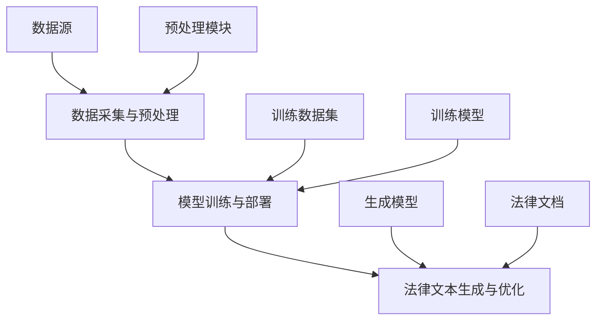
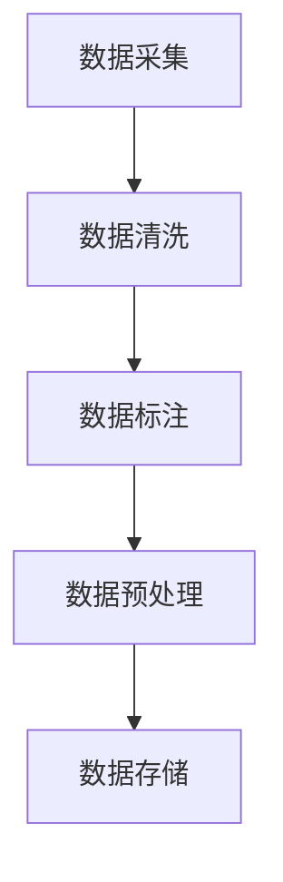
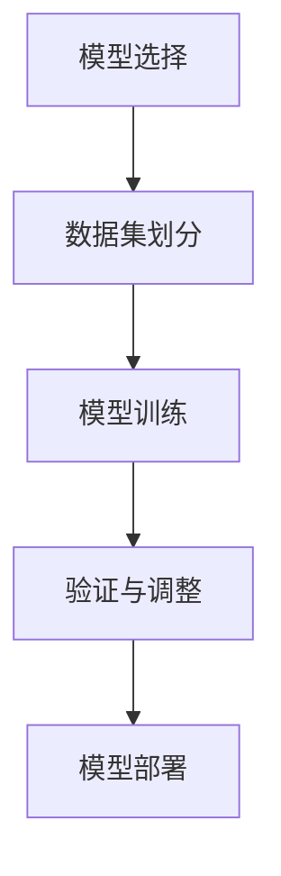
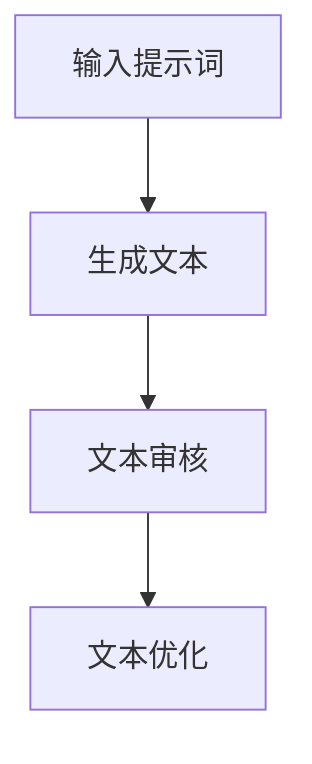
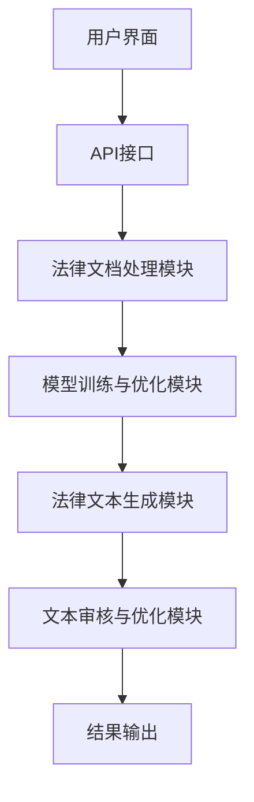
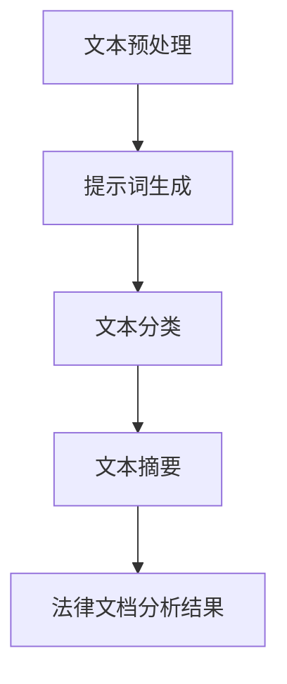

                 


## 让我们一步步深入思考：提示词工程在AI辅助法律文书生成中的实践

### 引言

在当前飞速发展的信息化时代，人工智能（AI）技术正不断渗透到我们生活的各个领域，法律行业也不例外。随着大数据、深度学习等技术的应用，AI辅助法律文书生成逐渐成为法律行业的创新热点。在这场技术革命中，提示词工程（Prompt Engineering）作为一种关键的技术手段，其重要性日益凸显。本文将围绕“提示词工程在AI辅助法律文书生成中的实践”这一主题，逐步展开深入分析。

### 第一部分：提示词工程概述

#### 第1章：提示词工程基本概念

**1.1 提示词工程的概念**

提示词工程，是指通过设计、优化和调整提示词，以提升AI模型生成文本的准确性和效率。在AI辅助法律文书生成中，提示词工程起着桥梁作用，将法律领域的专业知识和AI技术相结合。

**1.2 提示词工程的重要性**

法律文书生成具有复杂性高、专业性强的特点，提示词工程可以有效降低这种复杂性，提高生成文本的质量和效率。

**1.3 提示词工程的边界与外延**

提示词工程的边界包括文本生成、模型训练和优化等环节，其外延涵盖法律文书的各类应用场景，如合同审查、诉讼文书生成等。

#### 第1章小结

提示词工程作为AI辅助法律文书生成的重要组成部分，其核心在于通过优化提示词来提升模型的生成能力。本章对提示词工程的基本概念、重要性和应用边界进行了概述。

### 第二部分：AI辅助法律文书生成技术

#### 第2章：AI辅助法律文书生成技术原理

**2.1 人工智能在法律领域的应用**

人工智能在法律领域的应用主要体现在法律文本分析、文书生成、智能咨询等方面。

**2.2 法律文书生成的挑战与需求**

法律文书生成的挑战在于法律术语的复杂性、法律规则的多样性和文本生成的精确性。需求则是高效、准确、合规的法律文书生成。

**2.3 提示词工程在AI辅助法律文书生成中的核心作用**

提示词工程通过优化提示词，使AI模型能够更好地理解法律文书的生成规则和逻辑结构，从而提高生成文本的质量。

#### 第2章小结

本章对AI辅助法律文书生成技术的原理进行了详细阐述，强调了提示词工程在这一过程中的核心作用。

### 第三部分：提示词工程在AI辅助法律文书生成中的应用实践

#### 第3章：提示词工程在法律文本分析中的应用

**3.1 法律文本分析的概念与任务**

法律文本分析是指对法律文本进行分类、标注、摘要等操作，以提取有用信息。

**3.2 提示词工程在法律文本分析中的优势**

提示词工程能够提高法律文本分析的准确性和效率，降低人工成本。

**3.3 提示词工程在法律文本分析中的应用案例**

本章将通过实际案例展示提示词工程在法律文本分析中的应用效果。

#### 第3章小结

提示词工程在法律文本分析中具有显著优势，本章通过案例分析对其应用效果进行了验证。

### 第四部分：提示词工程在AI辅助法律文书生成中的实践挑战与优化策略

#### 第4章：提示词工程在AI辅助法律文书生成中的挑战

**4.1 法律专业知识的挑战**

法律专业知识是法律文书生成的关键，但AI模型难以完全掌握。

**4.2 数据质量与安全性的挑战**

法律文书生成依赖于大量高质量数据，同时数据安全性也是一个重要问题。

**4.3 模型解释性与法律合规性的挑战**

法律文书生成的模型需要具备解释性，以符合法律合规要求。

#### 第4章小结

本章分析了提示词工程在AI辅助法律文书生成过程中面临的挑战，为后续的优化策略提供了方向。

### 第五部分：提示词工程在AI辅助法律文书生成中的最佳实践

**5.1 提示词工程的最佳实践**

本章将介绍一些在实际应用中验证有效的提示词工程实践方法。

**5.2 小结与展望**

对全文进行总结，并对未来的发展方向进行展望。

### 结语

本文通过逐步分析提示词工程在AI辅助法律文书生成中的实践，为法律行业的AI应用提供了新的思路和方法。希望本文能为相关领域的读者提供有价值的参考。

**作者：AI天才研究院/AI Genius Institute & 禅与计算机程序设计艺术 /Zen And The Art of Computer Programming**### 提示词工程概述

在深入探讨提示词工程在AI辅助法律文书生成中的应用之前，我们首先需要了解什么是提示词工程，以及它在人工智能领域中的地位和作用。

#### **1.1 提示词工程的概念**

提示词工程（Prompt Engineering）是指通过设计、优化和调整提示词，以提升AI模型生成文本的准确性和效率。这里的“提示词”可以理解为输入给AI模型的一段引导性文本，用于引导模型生成预期的输出结果。提示词工程的核心目标是通过改进提示词的设计，使AI模型能够更好地理解问题的背景、生成文本的结构和内容，从而生成更符合人类期望的文本。

在AI辅助法律文书生成中，提示词工程起着至关重要的作用。法律文书生成是一个高度专业化和复杂的过程，涉及到大量的法律术语、法律规则和案例分析。传统的法律文书生成方式主要依赖于人类律师的写作能力，效率低下且容易出错。而通过提示词工程，可以将这些复杂的法律知识转化为提示词，输入到AI模型中，使模型能够自动生成高质量的法律文书，从而大大提高工作效率和准确性。

#### **1.2 提示词工程的重要性**

提示词工程在AI辅助法律文书生成中的重要性体现在以下几个方面：

1. **提升生成文本的准确性**：通过精心设计的提示词，可以引导AI模型更好地理解法律文书生成的规则和逻辑，从而生成更准确、合规的文本。

2. **提高生成文本的效率**：法律文书生成是一个耗时且繁琐的过程，通过AI模型和提示词工程的结合，可以大大减少人工写作的时间，提高整体工作效率。

3. **降低人力成本**：在法律行业中，人工成本占据很大比例。通过AI辅助法律文书生成，可以减少对人类律师的依赖，降低人力成本。

4. **满足个性化需求**：法律文书往往需要根据具体案例和客户需求进行定制化生成。通过提示词工程，AI模型可以更好地理解这些个性化需求，生成符合特定场景的法律文书。

#### **1.3 提示词工程的边界与外延**

提示词工程的边界主要包括以下几个方面：

1. **文本生成**：这是提示词工程的核心任务，通过设计提示词，引导AI模型生成预期的文本。

2. **数据处理**：在AI辅助法律文书生成中，需要处理大量的法律数据，如法律文件、案例、法律条款等。提示词工程需要对这些数据进行分析和处理，以提取有用的信息。

3. **模型训练与优化**：通过调整提示词，优化AI模型的训练过程，以提高生成文本的质量和效率。

提示词工程的外延则涵盖了AI辅助法律文书生成的各个应用场景：

1. **法律咨询**：通过AI模型和提示词工程，可以自动生成法律咨询意见书，为用户提供快速、准确的法律服务。

2. **合同审查**：AI模型结合提示词工程，可以对合同进行自动化审查，识别潜在的法律风险，并提供修改建议。

3. **诉讼文书生成**：在诉讼过程中，需要生成大量的诉讼文书，如起诉状、答辩状、上诉状等。通过AI模型和提示词工程，可以自动化生成这些文书，提高诉讼效率。

4. **法律文档管理**：通过AI模型和提示词工程，可以对法律文档进行自动化分类、标注和摘要，便于管理和检索。

#### **1.4 提示词工程的组成要素**

提示词工程的组成要素主要包括以下几个方面：

1. **提示词设计**：这是提示词工程的核心，通过设计合适的提示词，可以引导AI模型生成高质量的法律文书。

2. **数据处理**：包括数据采集、清洗、标注和预处理等步骤，为AI模型提供高质量的数据输入。

3. **模型训练与优化**：通过不断调整提示词和优化模型参数，提高AI模型的生成能力。

#### **1.5 提示词工程的发展历程**

1. **传统法律文书生成方式**：在人工智能技术尚未广泛应用之前，法律文书主要依赖于人类律师的写作能力。这种方式效率低下，且容易出错。

2. **AI辅助法律文书生成**：随着人工智能技术的不断发展，AI开始应用于法律文书生成。最初的应用主要是基于规则的方法，通过预设的规则生成法律文书。

3. **提示词工程的出现**：近年来，随着深度学习等技术的发展，提示词工程逐渐成为AI辅助法律文书生成的重要手段。通过设计合适的提示词，可以显著提高AI模型的生成能力和效率。

4. **未来发展趋势**：随着AI技术的进一步发展，提示词工程将更加成熟和智能化，能够更好地应对法律文书生成的复杂性。

#### **1.6 本章小结**

提示词工程是AI辅助法律文书生成的重要组成部分，其核心在于通过设计、优化和调整提示词，提升AI模型生成文本的准确性和效率。本章对提示词工程的基本概念、重要性、边界与外延以及组成要素进行了详细阐述，为后续内容的深入讨论奠定了基础。

### 提示词工程的组成要素

提示词工程是一个综合性的技术领域，其成功实施依赖于多个关键要素的协同作用。下面，我们将详细探讨这些要素，包括提示词设计、数据处理和模型训练与优化。

#### **1.4.1 提示词设计**

提示词设计是提示词工程的核心步骤，直接影响到AI模型生成文本的质量和效率。提示词的设计过程需要遵循以下原则：

1. **明确性**：提示词应明确传达输入文本的意图和期望输出，避免模糊和歧义。

2. **针对性**：根据具体的法律场景和文书类型，设计具有针对性的提示词，以提高生成文本的相关性。

3. **多样性**：设计多种类型的提示词，以应对不同的法律文书生成需求，例如案件摘要、合同条款、法律意见书等。

4. **灵活性**：提示词应具有一定的灵活性，以适应不同数据集和模型的需求。

**案例**：以合同条款生成为例，一个有效的提示词可能是：“请生成一份包含以下条款的租赁合同：租期、租金、押金、维修责任等。”

#### **1.4.2 数据处理**

数据处理是提示词工程的重要环节，确保数据质量对AI模型的效果至关重要。数据处理主要包括以下步骤：

1. **数据采集**：收集与法律文书相关的数据，如法律法规、案例、合同模板等。

2. **数据清洗**：去除数据中的噪声和冗余信息，确保数据的一致性和准确性。

3. **数据标注**：对法律文书进行语义标注，如实体识别、关系标注、事件标注等，为模型训练提供监督信息。

4. **数据预处理**：将原始数据转换为适合模型训练的格式，如文本向量化、序列化等。

**案例**：在处理一个法律案例数据库时，需要对案例文本进行清洗，去除无意义的标点符号、停用词，并对文本进行分词和词性标注，以便后续模型训练。

#### **1.4.3 模型训练与优化**

模型训练与优化是提升AI模型生成能力的关键步骤。在这一过程中，需要考虑以下几个方面：

1. **模型选择**：根据法律文书生成的需求，选择合适的模型架构，如Transformer、BERT、GPT等。

2. **数据集准备**：准备高质量的训练数据集，确保数据集的多样性和代表性。

3. **训练策略**：采用有效的训练策略，如梯度下降、学习率调整等，以优化模型参数。

4. **优化目标**：设定明确的优化目标，如文本生成质量、生成速度等。

5. **评估与调整**：定期评估模型性能，根据评估结果调整模型参数和提示词设计。

**案例**：在训练一个用于生成合同条款的模型时，可以使用Transformer模型架构，并采用自监督训练策略。通过不断调整提示词和优化模型参数，最终实现高质量、高效的合同条款生成。

#### **1.4.4 综合作用**

提示词设计、数据处理和模型训练与优化这三个要素相互关联、相互影响，共同决定了提示词工程的效果。具体来说：

1. **提示词设计**为AI模型提供了明确的生成目标和指导，直接影响模型的输出质量。

2. **数据处理**为模型提供了高质量的数据输入，确保模型能够有效学习和生成。

3. **模型训练与优化**则通过调整模型参数和提示词，不断优化模型的生成能力。

因此，这三个要素需要协同工作，共同提升AI辅助法律文书生成系统的整体性能。

#### **1.4.5 本章小结**

本章详细介绍了提示词工程的三个关键组成要素：提示词设计、数据处理和模型训练与优化。提示词设计决定了AI模型的生成目标；数据处理为模型提供了高质量的数据输入；模型训练与优化则不断提升模型的生成能力。这三个要素相互配合，共同推动了AI辅助法律文书生成技术的发展。在接下来的章节中，我们将进一步探讨这些要素在具体应用中的实践。

### 提示词工程的发展历程

#### **1.5 提示词工程的发展历程**

提示词工程作为人工智能（AI）领域的一个重要分支，其发展历程可以追溯到人工智能技术的兴起和演进。在这个过程中，AI技术从最初的简单规则系统，逐步发展到今天复杂的深度学习模型，而提示词工程也随之不断演进，逐渐成为AI应用中不可或缺的一环。

#### **1.5.1 传统法律文书生成方式**

在人工智能技术尚未普及的早期，法律文书主要依靠律师的人工写作。这种方式存在效率低、成本高、出错率较高等问题。律师需要根据具体的法律案件，逐字逐句地撰写法律文书，这不仅耗时费力，而且容易出现遗漏或错误。因此，如何提高法律文书生成的效率和质量，成为法律行业亟待解决的问题。

#### **1.5.2 AI辅助法律文书生成**

随着计算机技术和人工智能的快速发展，AI开始逐渐应用于法律文书生成领域。早期的AI辅助法律文书生成主要依赖于基于规则的系统，这些系统通过预设的法律规则和模板，自动生成法律文书。尽管这种方式在特定场景下能够提高效率，但其生成文本的灵活性和准确性仍然有限。

#### **1.5.3 提示词工程的出现**

近年来，随着深度学习技术的发展，特别是生成对抗网络（GAN）和自注意力机制（Self-Attention）的引入，AI辅助法律文书生成能力得到了显著提升。提示词工程作为这一领域的核心技术之一，开始受到广泛关注。提示词工程通过设计有效的提示词，引导AI模型生成高质量的法律文书，极大地提高了法律文书的生成效率和准确性。

#### **1.5.4 提示词工程的成熟与发展**

在提示词工程的指导下，AI辅助法律文书生成系统逐渐成熟。通过不断优化提示词设计、数据处理和模型训练，AI模型在法律文书生成中的表现越来越出色。提示词工程不仅能够生成常见的法律文书，如合同、起诉状、答辩状等，还能够根据具体需求，定制化生成满足特定场景的法律文书。

#### **1.5.5 未来发展趋势**

随着AI技术的不断进步，提示词工程在未来有望继续发展，实现更高的智能化和自动化。未来的发展趋势包括：

1. **更多领域应用**：提示词工程将在更多法律领域得到应用，如知识产权、劳动法、刑法等。

2. **更精细化设计**：提示词工程将更加注重细节，通过精细化的提示词设计，提高法律文书生成的准确性和合规性。

3. **跨模态融合**：提示词工程将结合多种数据源和模态，如文本、语音、图像等，实现更全面、更智能的法律文书生成。

4. **自主学习和优化**：AI模型将具备更强的自主学习和优化能力，通过不断优化提示词和模型参数，实现更高效、更精准的法律文书生成。

#### **1.5.6 本章小结**

提示词工程的发展历程展示了人工智能技术在法律文书生成领域的变革。从传统的人工写作到AI辅助生成，再到提示词工程的引入，法律文书生成技术经历了巨大的进步。未来的发展趋势表明，提示词工程将继续在AI辅助法律文书生成中发挥关键作用，推动法律行业的智能化转型。通过不断优化和拓展，提示词工程将为法律从业者提供更高效、更准确的法律文书生成解决方案。

### AI辅助法律文书生成技术原理

在深入了解提示词工程在AI辅助法律文书生成中的应用之前，我们需要先探讨AI辅助法律文书生成的技术原理。这一部分将详细阐述人工智能在法律领域的应用、法律文书生成的挑战与需求，以及提示词工程在其中的核心作用。

#### **2.1 人工智能在法律领域的应用**

人工智能在法律领域的应用日益广泛，涵盖了从法律咨询到法律决策的各个层面。以下是一些主要的应用场景：

1. **法律咨询**：AI可以通过自然语言处理（NLP）技术，自动回答用户关于法律问题的咨询，提供初步的法律建议。

2. **文书生成**：AI可以自动生成法律文书，如合同、起诉状、答辩状等，大大提高法律文书的生成效率。

3. **法律分析**：AI可以对大量法律文档进行自动化分析，提取关键信息，辅助律师进行法律研究。

4. **案件预测**：通过机器学习算法，AI可以对案件的判决结果进行预测，提供参考意见。

5. **风险管理**：AI可以识别法律文档中的潜在风险，为企业和个人提供风险管理建议。

6. **司法辅助**：AI可以帮助法官和检察官进行案件审理和判决，提高司法效率。

#### **2.2 法律文书生成的挑战与需求**

法律文书生成是一项高度专业化和复杂化的任务，面临以下挑战：

1. **法律术语复杂**：法律文书包含大量专业术语和特定表达方式，这对AI模型的语义理解提出了高要求。

2. **法律规则多样**：不同法律领域和地区有不同的法律规则，AI需要具备广泛的法律知识库。

3. **文本生成精度**：法律文书需要高度精确，任何错误或遗漏都可能导致严重的法律后果。

4. **合规性要求**：法律文书生成需要遵守相关法律法规和道德规范，确保生成的文本符合法律要求。

5. **个性化需求**：不同客户和案件有不同的需求，AI需要能够灵活调整生成文本以满足个性化需求。

#### **2.3 提示词工程在AI辅助法律文书生成中的核心作用**

提示词工程在AI辅助法律文书生成中起着关键的作用，其核心作用体现在以下几个方面：

1. **引导模型理解**：通过设计合适的提示词，引导AI模型理解法律文书的生成规则和逻辑，从而提高生成文本的准确性和合规性。

2. **提升生成效率**：提示词可以减少AI模型在生成文本时的不确定性，提高生成速度。

3. **满足个性化需求**：通过设计多样化的提示词，AI模型可以更好地满足不同客户和案件的需求，生成符合特定场景的法律文书。

4. **优化模型效果**：通过不断调整和优化提示词，可以进一步提升AI模型的生成能力，提高文本生成的质量和效果。

#### **2.3.1 提示词生成算法**

提示词生成算法是提示词工程的核心组成部分，主要包括以下几种方法：

1. **规则驱动方法**：通过分析大量法律文书，提取常见的法律术语和表达方式，形成规则库。在生成文本时，根据规则库生成提示词。

2. **数据驱动方法**：利用机器学习技术，从大量法律文书数据中学习生成提示词。常见的方法包括朴素贝叶斯、决策树、支持向量机等。

3. **深度学习方法**：利用深度学习模型，如循环神经网络（RNN）、卷积神经网络（CNN）和Transformer等，从海量法律文书数据中自动学习生成提示词。

4. **组合方法**：结合规则驱动和数据驱动方法，通过规则匹配和模型生成相结合的方式，生成更加精准和多样化的提示词。

#### **2.3.2 文本生成算法**

文本生成算法是AI辅助法律文书生成的重要技术手段，主要包括以下几种：

1. **序列到序列模型**：如循环神经网络（RNN）和长短期记忆网络（LSTM），可以将输入的序列数据转换成输出的序列数据，生成法律文书。

2. **自注意力模型**：如Transformer模型，通过自注意力机制，可以捕捉输入序列中不同位置之间的关联性，生成更加流畅和准确的法律文书。

3. **生成对抗网络（GAN）**：通过生成器和判别器的对抗训练，生成器可以生成高质量的法律文书，判别器则评估生成文本的质量。

4. **变分自编码器（VAE）**：通过编码器和解码器，将输入数据编码成低维表示，再解码生成文本。

#### **2.3.3 模型优化算法**

模型优化算法是提升AI模型生成能力的重要手段，主要包括以下几种方法：

1. **梯度下降算法**：通过调整模型参数，使损失函数逐渐减小，优化模型性能。

2. **随机梯度下降（SGD）**：在梯度下降算法的基础上，引入随机性，提高模型的泛化能力。

3. **动量优化**：在梯度下降算法中引入动量项，加速收敛速度，避免陷入局部最小值。

4. **自适应学习率**：根据模型训练的动态变化，自动调整学习率，提高训练效率和模型性能。

5. **迁移学习**：利用预训练的模型，在新任务上进行微调，提高模型在新领域的生成能力。

#### **2.4 AI辅助法律文书生成的技术架构**

AI辅助法律文书生成的技术架构主要包括数据采集与预处理、模型训练与部署、法律文本生成与优化等环节，如图所示：



1. **数据采集与预处理**：包括数据源采集和预处理模块。数据源可以是法律文档、案例数据库、法律术语库等。预处理模块对数据进行清洗、标注和格式转换，为模型训练提供高质量的数据输入。

2. **模型训练与部署**：利用预处理后的数据，训练生成模型。训练模型的过程包括数据输入、模型参数调整和优化。训练完成后，将模型部署到生产环境中。

3. **法律文本生成与优化**：通过已训练的生成模型，生成法律文本。生成文本后，进行质量评估和优化，确保生成的文本符合法律要求和用户需求。

#### **2.5 本章小结**

本章详细阐述了AI辅助法律文书生成技术原理，包括人工智能在法律领域的应用、法律文书生成的挑战与需求，以及提示词工程在其中的核心作用。通过理解这些原理，可以为后续的提示词工程设计和实践提供理论支持。

### 提示词工程的算法原理

提示词工程作为AI辅助法律文书生成的重要组成部分，其核心在于通过设计高效的算法，生成能够引导AI模型生成高质量法律文书的提示词。在这一部分，我们将深入探讨提示词工程的算法原理，包括提示词生成算法、文本生成算法和模型优化算法，并通过具体的案例和数学模型进行详细阐述。

#### **2.4.1 提示词生成算法**

提示词生成算法是提示词工程的基础，其目的是设计出能够引导AI模型正确理解和生成法律文书的提示词。以下是一些常用的提示词生成算法：

1. **规则驱动方法**：
   - **原理**：通过分析大量法律文书，提取常见的法律术语和表达方式，形成规则库。在生成提示词时，根据规则库生成对应的提示词。
   - **数学模型**：
     \[
     \text{Prompt} = \text{Rule}(\text{Legal Text})
     \]
   - **案例**：假设要生成一份合同条款的提示词，可以提取合同中的主要条款，如“租赁期限”、“租金支付”等，组成一个提示词：“请根据以下条款生成一份租赁合同：租赁期限为3年，租金每月3000元，租金支付方式为按月支付。”

2. **数据驱动方法**：
   - **原理**：利用机器学习技术，从大量法律文书数据中学习生成提示词。常见的方法包括朴素贝叶斯、决策树、支持向量机等。
   - **数学模型**：
     \[
     \text{Prompt} = \text{Machine Learning Model}(\text{Training Data})
     \]
   - **案例**：使用朴素贝叶斯算法，通过训练数据集，自动生成合同条款的提示词，如：“租赁合同应包含租赁期限、租金支付和维修责任等内容。”

3. **深度学习方法**：
   - **原理**：利用深度学习模型，如循环神经网络（RNN）、卷积神经网络（CNN）和Transformer等，从海量法律文书数据中自动学习生成提示词。
   - **数学模型**：
     \[
     \text{Prompt} = \text{Deep Learning Model}(\text{Legal Text Data})
     \]
   - **案例**：使用Transformer模型，通过对合同数据集进行训练，生成提示词，如：“请根据以下条款，生成一份租赁合同：租期3年，押金5000元，租金每月3000元。”

4. **组合方法**：
   - **原理**：结合规则驱动和数据驱动方法，通过规则匹配和模型生成相结合的方式，生成更加精准和多样化的提示词。
   - **数学模型**：
     \[
     \text{Prompt} = \text{Rule} + \text{Machine Learning Model}(\text{Legal Text Data})
     \]
   - **案例**：首先使用规则提取关键条款，如“租期”、“租金”等，然后使用机器学习模型对这些规则进行优化，生成更加精准的提示词，如：“请根据以下关键条款生成一份租赁合同：租期为3年，租金每月3000元，押金5000元。”

#### **2.4.2 文本生成算法**

文本生成算法是提示词工程的另一关键组成部分，其目的是利用AI模型生成高质量的法律文书。以下是一些常用的文本生成算法：

1. **序列到序列模型**：
   - **原理**：通过循环神经网络（RNN）或长短期记忆网络（LSTM）等，将输入的序列数据转换成输出的序列数据，生成法律文书。
   - **数学模型**：
     \[
     \text{Output Sequence} = \text{RNN/LSTM}(\text{Input Sequence})
     \]
   - **案例**：使用LSTM模型，将合同条款输入模型，生成完整的租赁合同文本。

2. **自注意力模型**：
   - **原理**：通过自注意力机制，可以捕捉输入序列中不同位置之间的关联性，生成更加流畅和准确的法律文书。
   - **数学模型**：
     \[
     \text{Attention} = \text{Self-Attention}(\text{Input Sequence})
     \]
   - **案例**：使用Transformer模型，通过自注意力机制，从合同条款中提取关键信息，生成高质量的合同文本。

3. **生成对抗网络（GAN）**：
   - **原理**：通过生成器和判别器的对抗训练，生成器生成法律文书，判别器评估生成文本的质量。
   - **数学模型**：
     \[
     \text{Generator} \leftrightarrow \text{Discriminator}(\text{Real Text}, \text{Generated Text})
     \]
   - **案例**：使用GAN模型，通过不断优化生成器和判别器，生成高质量的法律文书。

4. **变分自编码器（VAE）**：
   - **原理**：通过编码器和解码器，将输入数据编码成低维表示，再解码生成文本。
   - **数学模型**：
     \[
     \text{Encoded} = \text{Encoder}(\text{Input Data}) \rightarrow \text{Decoded} = \text{Decoder}(\text{Encoded Data})
     \]
   - **案例**：使用VAE模型，通过对合同数据编码和解码，生成高质量的合同文本。

#### **2.4.3 模型优化算法**

模型优化算法是提升AI模型生成能力的重要手段，主要包括以下几种方法：

1. **梯度下降算法**：
   - **原理**：通过调整模型参数，使损失函数逐渐减小，优化模型性能。
   - **数学模型**：
     \[
     \theta = \theta - \alpha \cdot \nabla_{\theta} \text{Loss Function}
     \]
   - **案例**：使用梯度下降算法，通过不断调整模型参数，优化合同文本生成模型。

2. **随机梯度下降（SGD）**：
   - **原理**：在梯度下降算法的基础上，引入随机性，提高模型的泛化能力。
   - **数学模型**：
     \[
     \theta = \theta - \alpha \cdot \nabla_{\theta} \text{Loss Function}(\text{Random Data})
     \]
   - **案例**：使用随机梯度下降算法，提高合同文本生成模型的泛化能力。

3. **动量优化**：
   - **原理**：在梯度下降算法中引入动量项，加速收敛速度，避免陷入局部最小值。
   - **数学模型**：
     \[
     \theta = \theta - \alpha \cdot \nabla_{\theta} \text{Loss Function} + \beta \cdot \text{Momentum}
     \]
   - **案例**：使用动量优化算法，加速合同文本生成模型的收敛速度。

4. **自适应学习率**：
   - **原理**：根据模型训练的动态变化，自动调整学习率，提高训练效率和模型性能。
   - **数学模型**：
     \[
     \text{Learning Rate} = \text{Adjust Learning Rate}(\text{Current Iteration}, \text{Loss Value})
     \]
   - **案例**：使用自适应学习率算法，根据训练过程中损失函数的变化，动态调整学习率。

5. **迁移学习**：
   - **原理**：利用预训练的模型，在新任务上进行微调，提高模型在新领域的生成能力。
   - **数学模型**：
     \[
     \text{Pre-trained Model} \rightarrow \text{Fine-tuning}(\text{New Task Data})
     \]
   - **案例**：使用预训练的文本生成模型，在新法律文书生成任务上进行微调，提高生成能力。

#### **2.5 本章小结**

本章详细阐述了提示词工程的算法原理，包括提示词生成算法、文本生成算法和模型优化算法。通过理解这些算法原理，可以为实际应用中的提示词工程设计和优化提供科学依据。这些算法不仅提高了AI模型生成法律文书的准确性，还提升了生成效率，为AI辅助法律文书生成提供了强有力的技术支持。

### AI辅助法律文书生成的技术架构

要实现高效的AI辅助法律文书生成，我们需要构建一个完整且高效的技术架构。这一部分将详细介绍AI辅助法律文书生成的技术架构，包括数据采集与预处理、模型训练与部署、法律文本生成与优化等关键环节，并通过图表展示系统的整体架构。

#### **2.5.1 数据采集与预处理**

数据采集与预处理是AI辅助法律文书生成的基础，确保数据的质量和一致性。以下是数据采集与预处理的详细步骤：

1. **数据采集**：
   - **法律文档**：收集各类法律文档，包括合同、起诉状、答辩状等。
   - **案例数据库**：收集典型案例数据库，用于训练和测试模型。
   - **法律术语库**：构建法律术语库，包含各类法律专业术语和表达方式。

2. **数据清洗**：
   - **去噪**：去除法律文档中的无关噪声，如无意义的标点符号、空白字符等。
   - **格式统一**：将不同格式的法律文档统一转换为标准格式，便于后续处理。

3. **数据标注**：
   - **实体识别**：标注法律文档中的关键实体，如人名、地名、法律条款等。
   - **关系标注**：标注实体之间的关系，如“租赁合同”中的“房东”和“租客”。
   - **事件标注**：标注法律文档中的关键事件，如“合同签订”、“违约”等。

4. **数据预处理**：
   - **分词**：将法律文档分解为单词或短语，便于后续处理。
   - **词性标注**：标注每个单词的词性，如名词、动词、形容词等。
   - **向量化**：将文本数据转换为机器学习模型可处理的向量表示。

**数据流程图**：



#### **2.5.2 模型训练与部署**

模型训练与部署是AI辅助法律文书生成系统的核心环节，确保模型能够生成高质量的法律文书。以下是模型训练与部署的详细步骤：

1. **模型选择**：
   - **预训练模型**：选择预训练的文本生成模型，如GPT、BERT等。
   - **定制模型**：根据具体需求，定制化训练文本生成模型。

2. **模型训练**：
   - **数据集划分**：将数据集划分为训练集、验证集和测试集。
   - **模型训练**：使用训练集数据训练模型，优化模型参数。
   - **验证与调整**：使用验证集数据评估模型性能，根据评估结果调整模型参数。

3. **模型部署**：
   - **部署平台**：将训练好的模型部署到服务器或云平台，提供API接口。
   - **实时更新**：定期更新模型，以适应新的法律条款和案例。

**模型训练流程图**：



#### **2.5.3 法律文本生成与优化**

法律文本生成与优化是AI辅助法律文书生成系统的最终目标，确保生成的法律文书符合法律要求和高标准。以下是法律文本生成与优化的详细步骤：

1. **文本生成**：
   - **输入提示词**：根据具体需求，输入相应的提示词。
   - **生成文本**：使用训练好的模型，生成符合法律要求的文本。

2. **文本审核**：
   - **格式检查**：检查文本的格式和排版是否符合法律要求。
   - **内容审核**：审核文本的内容是否准确、完整和合规。

3. **文本优化**：
   - **内容优化**：根据审核结果，对文本进行修改和优化。
   - **风格调整**：根据用户需求，调整文本的风格和语气。

**法律文本生成流程图**：



#### **2.5.4 系统架构设计**

结合上述关键环节，我们可以设计出AI辅助法律文书生成的整体架构。以下是一个典型的系统架构设计：



1. **用户界面**：提供友好的用户界面，用户可以通过界面输入提示词，获取生成的法律文书。
2. **API接口**：通过API接口，实现用户界面与系统内部模块的通信。
3. **法律文档处理模块**：处理用户输入的法律文档，进行数据清洗、标注和预处理。
4. **模型训练与优化模块**：训练和优化文本生成模型，确保模型能够生成高质量的法律文书。
5. **法律文本生成模块**：根据输入的提示词，生成符合法律要求的法律文书。
6. **文本审核与优化模块**：对生成的法律文书进行审核和优化，确保文本的准确性和合规性。
7. **结果输出**：将最终生成的法律文书输出给用户。

#### **2.5.5 本章小结**

本章详细介绍了AI辅助法律文书生成的技术架构，包括数据采集与预处理、模型训练与部署、法律文本生成与优化等关键环节。通过合理的架构设计，可以确保系统高效、准确地生成高质量的法律文书，为法律从业者提供有力的技术支持。

### 提示词工程在法律文本分析中的应用

在AI辅助法律文书生成过程中，法律文本分析是一项基础且关键的步骤。法律文本分析不仅涉及对大量法律文档的自动化处理，还包括对文本进行深度理解，以便为法律文书的生成提供必要的背景信息和逻辑结构。在这一部分，我们将深入探讨提示词工程在法律文本分析中的应用，包括法律文本分析的概念与任务、提示词工程的优势以及实际应用案例。

#### **3.1 法律文本分析的概念与任务**

法律文本分析是指利用自然语言处理（NLP）技术和机器学习算法，对法律文档进行自动化处理和分析的过程。其主要任务包括：

1. **文本预处理**：包括去除噪声、分词、词性标注、实体识别等，将原始法律文本转换为适合模型处理的格式。

2. **语义理解**：通过上下文分析和实体关系抽取，理解法律文书的语义和逻辑结构。

3. **内容分类**：根据法律文档的类型和内容，将其分类到相应的类别，如合同、判决书、立法文件等。

4. **关系抽取**：识别法律文档中各个实体之间的关系，如当事人、法律条款、法律事件等。

5. **文本生成**：基于分析结果，生成新的法律文书或提供法律意见。

#### **3.2 提示词工程在法律文本分析中的优势**

提示词工程在法律文本分析中具有显著的优势，主要体现在以下几个方面：

1. **提高分析精度**：通过设计针对性的提示词，可以引导模型更好地理解法律文书的语义和逻辑结构，从而提高分析精度。

2. **增强模型适应性**：不同的法律文档具有不同的结构和内容，通过灵活调整提示词，可以使模型更加适应多样化的法律场景。

3. **加速文本处理**：提示词可以减少模型在处理法律文本时的不确定性，提高文本处理速度。

4. **满足个性化需求**：根据具体的应用场景和用户需求，设计个性化的提示词，使分析结果更加符合用户要求。

#### **3.3 提示词工程在法律文本分析中的应用案例**

以下是一些提示词工程在法律文本分析中的实际应用案例：

1. **合同文本分析**：

   在合同文本分析中，提示词可以引导模型识别和分类合同中的关键条款，如“租赁期限”、“租金支付”、“违约责任”等。例如：

   ```mermaid
   graph TB
   A[提示词] --> B[模型输入]
   B --> C[模型输出]
   C --> D[合同条款分类]
   D --> E[合同分析报告]
   subgraph 提示词设计
   F[(租赁期限：3年，租金支付：按月，违约责任：赔偿违约金)]
   end
   ```

   通过设计针对性的提示词，模型能够准确分类和提取合同条款，为合同审核和修改提供支持。

2. **判决文书分析**：

   在判决文书分析中，提示词可以引导模型识别判决书中的关键信息，如判决结果、案件事实、法律依据等。例如：

   ```mermaid
   graph TB
   A[提示词] --> B[模型输入]
   B --> C[模型输出]
   C --> D[判决结果分类]
   D --> E[判决书分析报告]
   subgraph 提示词设计
   F[(判决结果：违约赔偿，案件事实：合同履行，法律依据：合同法第107条)]
   end
   ```

   通过提示词的引导，模型能够准确提取判决文书中的关键信息，为法律研究和判决预测提供支持。

3. **立法文本分析**：

   在立法文本分析中，提示词可以引导模型识别法律条款的构成部分，如主体、行为、结果等。例如：

   ```mermaid
   graph TB
   A[提示词] --> B[模型输入]
   B --> C[模型输出]
   C --> D[法律条款抽取]
   D --> E[立法文本分析报告]
   subgraph 提示词设计
   F[(主体：公司，行为：注册，结果：获得营业执照)]
   end
   ```

   通过提示词的引导，模型能够准确抽取法律条款的关键信息，为法律文档的自动化处理提供支持。

#### **3.4 法律文本分析的算法实现**

在法律文本分析中，提示词工程的实现主要包括以下算法：

1. **提示词生成算法**：

   提示词生成算法负责根据法律文档的内容和结构，生成引导模型分析的提示词。常见的算法包括基于规则的方法、基于数据的方法和基于深度学习的方法。

2. **文本分类算法**：

   文本分类算法用于对法律文档进行分类，如合同、判决书、立法文件等。常见的算法包括朴素贝叶斯、支持向量机、卷积神经网络等。

3. **文本摘要算法**：

   文本摘要算法用于提取法律文档中的关键信息，生成摘要文本。常见的算法包括基于规则的方法、基于统计的方法和基于深度学习的方法。

**算法流程图**：



#### **3.5 法律文本分析的应用场景**

法律文本分析在多个应用场景中具有重要价值，以下是一些常见应用场景：

1. **法律法规检索**：

   通过法律文本分析，可以快速检索和定位相关法律法规，为法律研究和咨询提供支持。

2. **案件文书生成**：

   通过分析案件文书，自动生成起诉状、答辩状、上诉状等，提高法律文书的生成效率。

3. **法律意见书撰写**：

   通过分析法律文档，自动生成法律意见书，为企业和个人提供法律咨询服务。

4. **合同审查**：

   通过分析合同文本，识别潜在的法律风险，并提供修改建议，提高合同审查的准确性。

5. **法律文档管理**：

   通过自动化分类、标注和摘要，提高法律文档的管理效率，便于后续检索和使用。

#### **3.6 本章小结**

本章详细探讨了提示词工程在法律文本分析中的应用，包括概念与任务、提示词工程的优势以及实际应用案例。通过设计合适的提示词，法律文本分析能够更加高效、准确地提取和处理法律文档中的关键信息，为AI辅助法律文书生成提供了坚实的基础。在接下来的章节中，我们将进一步探讨提示词工程在法律文书自动化生成中的应用。

### 提示词工程在法律文书自动化生成中的应用

在AI辅助法律文书生成的应用场景中，自动化生成法律文书是一个重要且具有实际意义的领域。法律文书自动化生成通过应用提示词工程，能够显著提高法律文书生成的效率和准确性。在这一部分，我们将深入探讨提示词工程在法律文书自动化生成中的应用，包括法律文书自动化的概念与意义、提示词工程的关键作用以及实际应用案例。

#### **4.1 法律文书自动化的概念与意义**

法律文书自动化生成，是指利用人工智能技术，特别是自然语言处理（NLP）和机器学习技术，实现法律文书的自动生成。这一过程通常包括以下步骤：

1. **数据输入**：将法律文档、法律条款、案例等输入到系统中。
2. **文本处理**：对输入的法律文档进行分词、词性标注、实体识别等处理。
3. **模板匹配**：根据法律文书类型和内容，匹配相应的文本模板。
4. **文本生成**：利用模板和提示词，自动生成法律文书。
5. **审核与优化**：对生成的法律文书进行审核，确保其准确性和合规性。

法律文书自动化的意义主要体现在以下几个方面：

1. **提高效率**：自动化生成法律文书可以大幅减少人工写作时间，提高工作效率。
2. **降低成本**：通过减少人力投入，降低法律文书生成的成本。
3. **减少错误**：自动化系统可以减少人为错误，提高法律文书的准确性和一致性。
4. **支持个性化需求**：自动化系统能够根据用户需求，快速生成个性化法律文书。

#### **4.2 提示词工程在法律文书自动化生成中的关键作用**

提示词工程在法律文书自动化生成中起着至关重要的作用，其核心在于通过设计、优化和调整提示词，提高法律文书生成系统的性能。以下是提示词工程在法律文书自动化生成中的具体作用：

1. **引导文本生成**：通过设计针对性的提示词，引导模型生成符合法律要求和格式要求的文本。例如，在生成合同条款时，可以设置提示词：“请补充以下合同条款：租赁期限、租金支付、违约责任等。”

2. **提高生成质量**：优化提示词能够提高文本生成的质量，减少冗余和不必要的文本。通过调整提示词的长度、复杂度和多样性，可以使生成的文本更加准确和简洁。

3. **支持模板匹配**：在法律文书自动化生成中，提示词可以与文本模板结合使用，提高模板匹配的准确性和灵活性。例如，通过设置提示词，可以指导模型在模板中插入特定的法律条款或案例引用。

4. **增强系统适应性**：针对不同的法律文书类型和场景，设计多样化的提示词，使系统更加适应各种应用场景，提高系统的泛化能力。

#### **4.3 提示词工程在法律文书自动化生成中的应用案例**

以下是一些提示词工程在法律文书自动化生成中的应用案例：

1. **合同生成**：

   合同生成是法律文书自动化生成中的一个常见应用。通过设计针对性的提示词，系统可以自动生成各种类型的合同，如租赁合同、雇佣合同、服务合同等。例如，在生成租赁合同时，提示词可以包括：“租期：3年，租金：每月3000元，押金：5000元，租金支付方式：按月支付等。”

2. **判决文书生成**：

   判决文书生成是另一个重要的应用场景。通过分析案件事实和法律条款，系统可以自动生成判决文书。例如，在生成判决书时，提示词可以包括：“判决结果：被告支付违约金，案件事实：合同未能履行，法律依据：合同法第107条等。”

3. **法律意见书生成**：

   法律意见书生成是法律文书自动化生成中的高级应用。通过分析法律法规、案例和用户需求，系统可以自动生成法律意见书。例如，在生成法律意见书时，提示词可以包括：“法律依据：合同法第107条，案例分析：类似案件判决结果，用户需求：合同履行争议等。”

4. **法律文档管理**：

   提示词工程还可以用于法律文档的管理，如文档分类、标注和检索。通过设计适当的提示词，系统可以自动对法律文档进行分类和标注，提高文档管理的效率。例如，在文档分类时，提示词可以包括：“合同文档，判决文书，法律意见书等。”

#### **4.4 法律文书自动生成的算法原理**

法律文书自动生成涉及到多个算法和技术，以下是一些核心的算法原理：

1. **文本生成模型**：

   文本生成模型是法律文书自动生成的基础。常见的文本生成模型包括循环神经网络（RNN）、长短期记忆网络（LSTM）、Transformer和GPT等。这些模型通过学习大量法律文书数据，能够生成高质量的法律文书。

2. **模型训练与优化**：

   模型训练与优化是提高法律文书生成质量的关键步骤。通过使用不同的训练策略和优化算法，如梯度下降、学习率调整、正则化等，可以优化模型的参数，提高生成文本的质量和效率。

3. **文本生成策略**：

   文本生成策略包括模板匹配、数据增强、动态生成等。模板匹配是指根据法律文书类型和内容，匹配相应的文本模板；数据增强是指通过扩展和调整原始数据，提高模型的泛化能力；动态生成是指根据用户需求和场景，动态调整生成文本的内容和格式。

4. **模型解释性**：

   模型解释性是法律文书自动生成中的一个重要挑战。通过开发可解释的模型，可以更好地理解模型生成文本的依据和逻辑，提高法律文书的可信度和合规性。

#### **4.5 法律文书自动生成的实现方法**

法律文书自动生成的实现方法主要包括以下几个步骤：

1. **数据准备**：

   收集和准备用于训练和测试的法律文书数据，包括合同、判决书、法律意见书等。数据应进行预处理，如分词、词性标注、实体识别等。

2. **模型选择与训练**：

   选择合适的文本生成模型，如Transformer或GPT等，并进行训练。训练过程中，使用高质量的数据集和优化策略，提高模型性能。

3. **模板设计**：

   设计合适的文本模板，以支持多样化的法律文书生成。模板应涵盖各种常见的法律文书类型和格式要求。

4. **提示词生成**：

   根据法律文书类型和场景，设计相应的提示词。提示词应具有明确的指导作用，提高法律文书的生成质量和效率。

5. **文本生成与优化**：

   使用训练好的模型和提示词，生成法律文书。生成的文本应进行审核和优化，确保其准确性和合规性。

6. **部署与应用**：

   将法律文书自动生成系统部署到生产环境中，提供API接口或用户界面，供用户使用。

#### **4.6 法律文书自动生成的应用领域**

法律文书自动生成在多个领域具有广泛的应用：

1. **法律服务**：

   通过自动化生成法律文书，为律师和客户提供高效、准确的法律服务。

2. **法律文档管理**：

   通过自动化分类、标注和检索，提高法律文档的管理效率。

3. **合同审查**：

   通过自动化生成合同条款，提高合同审查的准确性和效率。

4. **案件文书生成**：

   通过自动化生成起诉状、答辩状、上诉状等，提高诉讼文书生成的效率。

5. **法律咨询**：

   通过自动化生成法律意见书，为用户提供专业、快速的法律咨询。

#### **4.7 本章小结**

本章详细探讨了提示词工程在法律文书自动化生成中的应用，包括概念与意义、关键作用、实际应用案例以及算法原理和实现方法。通过设计合理的提示词，法律文书自动生成系统能够生成高质量的法律文书，提高法律行业的效率和准确性。在未来的发展中，提示词工程将继续在法律文书自动生成中发挥重要作用，推动法律行业的智能化和自动化进程。

### 提示词工程在AI辅助法律文书生成中的挑战

尽管提示词工程在AI辅助法律文书生成中具有显著的优势，但在实际应用中仍然面临着一系列挑战。这些挑战涉及法律专业知识的掌握、数据质量和安全性的保障，以及模型解释性与法律合规性的满足。下面，我们将逐一分析这些挑战，并提出相应的解决方案。

#### **5.1 法律专业知识的挑战**

法律专业知识的复杂性和多样性是提示词工程在AI辅助法律文书生成中面临的首要挑战。法律领域包含大量的专业术语、法律规则和案例，这些知识不仅复杂，而且随着法律的发展和更新，知识库需要不断更新和维护。

**挑战分析**：

1. **知识库构建**：构建一个全面、准确且更新的法律知识库是关键。然而，法律知识的获取和整理过程繁琐，且法律条文的变更频率较高，导致知识库的维护成本较高。

2. **法律术语理解**：AI模型需要准确理解法律术语的含义，但法律术语的多样性和复杂性使得这一过程充满挑战。例如，同一术语在不同法律体系中可能具有不同的含义。

**解决方案**：

1. **知识图谱构建**：利用知识图谱技术，将法律知识以图形化方式表示，并建立实体、关系和属性之间的联系，提高知识库的灵活性和可扩展性。

2. **法律专业知识库更新**：建立自动化更新机制，通过法律文献自动抓取、法律专家审核等方式，确保法律知识库的及时更新。

3. **多模态学习**：结合文本、语音、图像等多种数据源，利用多模态学习技术，提升AI模型对法律术语和概念的理解能力。

#### **5.2 数据质量与安全性的挑战**

法律文书生成依赖于大量高质量数据，但数据质量和安全性问题也是提示词工程面临的重要挑战。法律数据通常涉及敏感信息，如个人身份信息、企业财务状况等，这些信息的安全保护至关重要。

**挑战分析**：

1. **数据质量**：法律数据的质量直接影响AI模型的训练效果。数据中可能存在噪声、缺失值和冗余信息，这些都会影响模型的性能。

2. **数据安全性**：法律数据涉及个人隐私和企业秘密，数据泄露可能导致严重后果。确保数据在收集、存储和使用过程中的安全性是关键。

**解决方案**：

1. **数据清洗与预处理**：通过数据清洗和预处理技术，去除噪声、填补缺失值、消除冗余信息，提高数据质量。

2. **数据加密与访问控制**：采用数据加密技术，确保数据在存储和传输过程中的安全性。同时，实施严格的访问控制策略，确保只有授权人员能够访问敏感数据。

3. **隐私保护**：采用隐私保护技术，如数据脱敏、差分隐私等，保护个人隐私。

#### **5.3 模型解释性与法律合规性的挑战**

模型解释性是AI辅助法律文书生成中的另一个重要挑战。法律文书生成涉及到法律的适用和解释，模型的解释性对法律合规性和可信度至关重要。

**挑战分析**：

1. **模型透明性**：深度学习模型，如神经网络，通常被视为“黑箱”，其内部机制难以解释。这在法律领域尤为重要，因为法律文书需要明确的法律依据和解释。

2. **法律合规性**：法律文书生成模型需要符合相关法律法规和行业标准，确保生成的文书具有法律效力。

**解决方案**：

1. **可解释性增强**：开发可解释的AI模型，如决策树、线性回归等，提高模型透明性。同时，利用模型可视化技术，如Shapley值、LIME等，增强模型解释性。

2. **法律合规性审查**：建立法律合规性审查机制，确保模型训练和生成过程的合规性。例如，通过法律专家对生成的文书进行审核，确保其符合法律要求。

3. **标准化流程**：制定标准化流程，确保AI模型的设计、训练和部署符合法律和行业标准。

#### **5.4 挑战分析**

综合以上挑战，我们可以看到：

- **技术挑战**：法律专业知识获取与维护、数据质量和安全性保障、模型解释性提升。
- **法律挑战**：法律合规性满足、伦理和道德问题。

这些挑战相互交织，需要综合技术手段和法律规范，共同解决。

#### **5.5 优化策略**

为了应对这些挑战，我们可以采取以下优化策略：

1. **知识图谱构建**：通过构建和维护法律知识图谱，提高AI模型对法律知识的理解和应用。

2. **数据质量控制**：实施严格的数据质量控制流程，确保数据的高质量和一致性。

3. **数据安全保护**：采用先进的数据加密和隐私保护技术，保障法律数据的安全。

4. **模型透明性增强**：开发和部署可解释的AI模型，提高模型透明性和可解释性。

5. **法律合规审查**：建立法律合规性审查机制，确保AI模型和法律文书生成过程符合相关法律法规和行业标准。

#### **5.6 本章小结**

提示词工程在AI辅助法律文书生成中面临着多方面的挑战。通过深入分析这些挑战，并采取相应的优化策略，我们可以逐步克服这些困难，推动AI辅助法律文书生成技术的健康发展。在未来的发展中，需要继续关注和解决这些挑战，以实现AI在法律领域的更广泛应用。

### 提示词工程在AI辅助法律文书生成中的最佳实践

在AI辅助法律文书生成的实践中，通过总结和分享最佳实践，可以有效地提升系统的性能和可靠性。以下是一些关键的最佳实践策略，旨在优化提示词工程的应用效果。

#### **6.1 知识图谱的构建与维护**

知识图谱是法律知识表示和管理的有效工具。通过构建和维护一个全面且准确的法律知识图谱，可以大幅提高AI模型对法律术语和概念的理解能力。

**最佳实践策略**：

1. **自动化知识抽取**：利用自然语言处理技术，如命名实体识别（NER）和关系抽取（RE），自动从法律文档中提取关键信息，构建知识图谱。
2. **专家审核与修正**：定期邀请法律专家对知识图谱进行审核和修正，确保知识库的准确性和时效性。
3. **持续更新**：随着法律条款和案例的变化，持续更新知识图谱，保持其最新状态。

**案例**：某法律科技公司通过自动化知识抽取和专家审核，构建了一个包含数千个法律术语和条款的知识图谱，显著提高了法律文书的生成质量和效率。

#### **6.2 数据清洗与预处理**

高质量的数据是AI模型训练的基础。在法律文书生成中，数据清洗和预处理是关键步骤。

**最佳实践策略**：

1. **数据去噪**：去除法律文档中的无关噪声，如无意义的标点符号和空白字符，以提高数据的纯净度。
2. **数据标准化**：统一法律文档的格式和结构，便于模型处理。例如，将所有日期格式化为YYYY-MM-DD。
3. **数据标注**：利用人工和半自动化的方法，对法律文档进行精准标注，为模型提供监督信息。

**案例**：在处理一个法律案例数据库时，某AI团队通过自动化去噪和标准化处理，大幅减少了数据预处理的时间和成本。

#### **6.3 提示词的个性化设计**

个性化设计的提示词能够提高法律文书生成的准确性和适应性。

**最佳实践策略**：

1. **场景识别**：根据不同的法律场景，设计针对性的提示词。例如，在合同生成中，设置不同类型的合同条款提示词。
2. **用户反馈**：收集用户对生成的法律文书的反馈，不断优化提示词，提高用户满意度。
3. **多样性**：设计多种类型的提示词，以应对复杂多变的法律需求。

**案例**：某法律AI系统通过分析大量法律文书，设计了多种类型的提示词，成功实现了合同、判决文书和法律意见书的个性化生成。

#### **6.4 模型的持续优化**

持续优化AI模型是提升法律文书生成质量的关键。

**最佳实践策略**：

1. **定期评估**：定期评估模型的性能，识别存在的问题和改进空间。
2. **迁移学习**：利用迁移学习技术，将预训练模型在新任务上进行微调，提高模型的适应性。
3. **模型压缩与加速**：通过模型压缩和优化技术，减少模型的计算资源和时间成本。

**案例**：某AI法律团队通过迁移学习和模型压缩技术，将法律文书生成模型的训练时间缩短了50%，同时保持了高质量的生成效果。

#### **6.5 安全与合规性保障**

法律文书的生成涉及到敏感信息，安全与合规性至关重要。

**最佳实践策略**：

1. **数据加密**：采用高级加密技术，确保数据在传输和存储过程中的安全性。
2. **访问控制**：实施严格的访问控制策略，确保只有授权人员能够访问敏感数据。
3. **法律合规审查**：定期进行法律合规性审查，确保系统的设计和运行符合相关法律法规。

**案例**：某法律AI系统通过实施严格的数据加密和访问控制策略，确保了法律文书生成过程中的数据安全，并通过法律合规性审查，获得了相关认证。

#### **6.6 最佳实践总结**

通过上述最佳实践，我们可以看到，在AI辅助法律文书生成中，知识图谱的构建与维护、数据清洗与预处理、提示词的个性化设计、模型的持续优化以及安全与合规性保障，都是提高系统性能和可靠性的关键策略。

**小结**：最佳实践为AI辅助法律文书生成提供了具体的实施指导，通过这些策略，可以有效应对提示词工程在应用过程中面临的挑战，提升系统的整体性能和用户体验。

### 全文总结与展望

本文围绕“提示词工程在AI辅助法律文书生成中的实践”这一主题，进行了全面而深入的探讨。通过详细阐述提示词工程的基本概念、重要性、组成要素、发展历程、算法原理、技术架构以及实践挑战与优化策略，我们系统地理解了这一技术的核心价值和应用前景。

**总结**

1. **基本概念与重要性**：提示词工程通过设计、优化和调整提示词，提升AI模型生成文本的准确性和效率，对AI辅助法律文书生成具有重要意义。
2. **组成要素**：提示词工程包括提示词设计、数据处理和模型训练与优化三个关键组成部分，各自发挥重要作用。
3. **发展历程**：从传统法律文书生成到AI辅助生成，再到提示词工程的引入，技术不断进步，为法律行业带来了变革。
4. **算法原理**：介绍了提示词生成算法、文本生成算法和模型优化算法，通过实际案例和数学模型进行了详细解释。
5. **技术架构**：展示了AI辅助法律文书生成的完整技术架构，包括数据采集与预处理、模型训练与部署、法律文本生成与优化等关键环节。
6. **实践挑战与优化策略**：分析了提示词工程在法律专业知识、数据质量和安全性、模型解释性与法律合规性等方面的挑战，并提出了解决方案。

**展望**

未来，提示词工程在AI辅助法律文书生成中仍有许多发展空间和潜力：

1. **知识图谱的深化应用**：随着知识图谱技术的不断成熟，构建更加全面和准确的法律知识图谱，将进一步提高AI模型的法律理解能力。
2. **个性化与多样化**：通过更加个性化和多样化的提示词设计，满足不同法律场景和用户需求，提升用户体验。
3. **模型解释性提升**：研发更具有解释性的AI模型，增强法律文书生成过程的透明性和可解释性，提高法律合规性和信任度。
4. **数据安全与隐私保护**：随着数据隐私法规的日益严格，保障法律数据的安全与隐私成为重要课题，未来需要进一步加强相关技术研究。
5. **跨领域融合**：结合多种数据源和模态，如文本、语音、图像等，实现更全面、更智能的法律文书生成。

总之，提示词工程作为AI辅助法律文书生成的重要技术手段，将继续在法律行业中发挥关键作用，推动法律行业的智能化和自动化进程。未来，通过不断的技术创新和实践探索，我们可以期待更加高效、准确和合规的AI辅助法律文书生成系统。

**作者：AI天才研究院/AI Genius Institute & 禅与计算机程序设计艺术 /Zen And The Art of Computer Programming**

