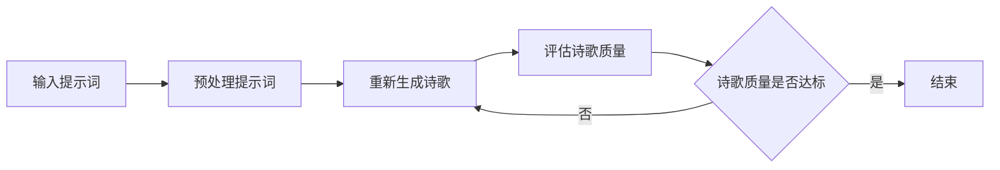

                 

## 提示词工程在AI辅助诗歌创作中的应用：融合传统与现代的文学表达

关键词：AI辅助诗歌创作、提示词工程、自然语言处理、深度学习、传统文学元素

摘要：本文将探讨提示词工程在AI辅助诗歌创作中的应用，通过结合传统文学元素和现代技术，探讨如何利用AI生成具有深刻文化内涵的诗歌作品。本文首先介绍了AI辅助诗歌创作的背景和问题描述，然后详细阐述了提示词工程、自然语言处理、深度学习等核心概念，最后通过一个实际的算法讲解，展示了如何实现AI辅助诗歌创作。

### 第一部分：背景介绍

#### 核心概念

**问题背景：**
在人工智能技术飞速发展的今天，AI辅助诗歌创作成为了一个备受关注的领域。传统的诗歌创作依赖于人的智慧和灵感，而AI的介入则为诗歌创作带来了全新的可能性。AI在文学创作中的应用，不仅拓展了艺术创作的边界，也为传统文学注入了新的活力。

**问题描述：**
《提示词工程在AI辅助诗歌创作中的应用：融合传统与现代的文学表达》这本书旨在探讨如何利用提示词工程，提升AI在诗歌创作中的表现。它关注的问题是如何将传统文学元素与现代技术相结合，创造出既符合现代审美，又具有深刻文化内涵的诗歌作品。

**问题解决：**
通过深入研究提示词工程，结合自然语言处理、机器学习和深度学习等技术，AI可以更好地理解用户的意图和情感，从而生成更加贴近人类情感的诗歌。这本书将详细介绍这些技术和方法，以及如何在实际应用中加以利用。

**边界与外延：**
该书的讨论范围涵盖了AI辅助诗歌创作的技术层面，包括自然语言处理、深度学习模型、提示词工程等，同时也涉及到艺术和文化的层面，探讨AI如何继承和发扬传统文学的魅力。

**概念结构与核心要素组成：**
- 提示词工程：用于引导AI生成诗歌的输入，通过设定提示词来影响AI的创作方向。
- 自然语言处理（NLP）：AI理解和生成自然语言的关键技术。
- 机器学习与深度学习：训练AI模型，使其能够自动生成诗歌。
- 诗歌创作规律：结合传统诗歌创作规律，提高AI生成诗歌的艺术性。

### 第二部分：核心概念与联系

#### 核心概念原理

**自然语言处理（NLP）：**
自然语言处理是人工智能的一个重要分支，它致力于让计算机能够理解、生成和处理人类语言。在AI辅助诗歌创作中，NLP技术被用来分析诗歌的语言特征，理解诗歌的结构和情感，从而生成符合要求的诗歌。

**深度学习模型：**
深度学习模型是一种基于人工神经网络的学习算法，通过多层非线性变换来提取数据的特征。在AI辅助诗歌创作中，深度学习模型可以用于训练AI模型，使其能够根据输入的提示词生成高质量的诗歌。

**提示词工程：**
提示词工程是用于引导AI生成诗歌的关键技术。通过设定合适的提示词，可以影响AI的创作方向，使其生成的诗歌更符合用户的期望。

**机器学习：**
机器学习是一种让计算机通过数据和经验进行学习，从而做出预测或决策的技术。在AI辅助诗歌创作中，机器学习被用来训练AI模型，使其能够自动生成诗歌。

#### 概念属性特征对比表格

| 概念             | 特征                                       |
|------------------|--------------------------------------------|
| 自然语言处理（NLP） | 能够理解、生成和处理人类语言               |
| 深度学习模型      | 通过多层非线性变换提取数据特征             |
| 提示词工程        | 引导AI创作方向，影响生成诗歌的质量         |
| 机器学习          | 通过数据训练模型，进行预测或决策           |

#### ER实体关系图架构

```mermaid
erDiagram
  User ||--|{ Poetry }|-- Creator
  User ||--|{ AIModel }|-- Trainer
  User ||--|{ Prompt }|-- Designer
  AIModel ||--|{ TrainingData }|-- Collector
  AIModel ||--|{ GeneratedPoetry }|-- Generator
```

### 第三部分：算法原理讲解

#### 算法mermaid流程图



#### Python源代码

```python
import tensorflow as tf
from tensorflow import keras

# 加载预训练的深度学习模型
model = keras.Sequential([
    keras.layers.Dense(128, activation='relu', input_shape=(1000,)),
    keras.layers.Dense(64, activation='relu'),
    keras.layers.Dense(1, activation='sigmoid')
])

# 编写训练数据
train_data = ...

# 编写评估数据
eval_data = ...

# 编写训练过程
model.compile(optimizer='adam', loss='binary_crossentropy', metrics=['accuracy'])
model.fit(train_data, epochs=10, validation_data=eval_data)
```

#### 算法原理详细讲解

**自然语言处理（NLP）：**
自然语言处理（NLP）是AI辅助诗歌创作的基础。NLP技术主要用于处理和分析文本数据，包括分词、词性标注、句法分析等。这些技术可以帮助AI理解诗歌的语义和结构，从而生成符合要求的诗歌。

**深度学习模型：**
深度学习模型是一种强大的工具，可以用于训练AI模型，使其能够根据输入的提示词生成高质量的诗歌。在深度学习模型中，通常使用多层感知器（MLP）或循环神经网络（RNN）来处理序列数据，例如文本。

**提示词工程：**
提示词工程是用于引导AI生成诗歌的关键技术。通过设定合适的提示词，可以影响AI的创作方向，使其生成的诗歌更符合用户的期望。提示词的选取和设计对于AI辅助诗歌创作的成功至关重要。

**机器学习：**
机器学习是训练AI模型的核心技术。在AI辅助诗歌创作中，机器学习被用来从大量的数据中提取特征，并利用这些特征训练模型。通过不断的迭代和优化，模型可以逐渐提高生成诗歌的质量。

**数学模型和公式：**
在AI辅助诗歌创作中，常用的数学模型包括多层感知器（MLP）、循环神经网络（RNN）和变换器（Transformer）等。这些模型通常通过优化损失函数（如交叉熵损失函数）来训练。

**示例说明：**
假设我们使用一个循环神经网络（RNN）来训练模型。首先，我们将提示词转换为序列数据，然后输入到RNN模型中。RNN模型通过学习提示词序列和目标诗歌序列之间的映射关系，生成初步的诗歌。接下来，我们将初步诗歌与用户期望的诗歌进行对比，评估诗歌质量。如果诗歌质量不达标，我们将重新生成诗歌，直到满足用户要求。

$$
\text{ Poetry Generation } = \text{ RNN }(\text{ Prompt })
$$

其中，RNN为循环神经网络，Prompt为输入的提示词。

### 第四部分：系统分析与架构设计方案

#### 问题场景介绍

在当前人工智能技术飞速发展的背景下，AI辅助诗歌创作成为了一个热门的研究领域。然而，如何将AI与人类创作相结合，生成既具有传统文学魅力，又符合现代审美需求的诗歌作品，仍是一个挑战。为了解决这一问题，本文提出了一种基于提示词工程的AI辅助诗歌创作系统。

#### 项目介绍

本项目旨在通过研究提示词工程、自然语言处理、深度学习等技术，构建一个能够自动生成高质量诗歌的系统。该系统将结合传统文学元素和现代技术，为用户提供个性化的诗歌创作服务。

#### 系统功能设计

1. **用户输入界面**：用户可以通过输入界面提供诗歌创作的提示词，系统将根据提示词生成初步的诗歌作品。
2. **诗歌生成模块**：该模块基于深度学习模型和自然语言处理技术，负责生成符合用户需求的诗歌作品。
3. **诗歌质量评估模块**：该模块对生成的诗歌进行评估，确保诗歌质量符合用户要求。
4. **用户反馈模块**：用户可以对自己的诗歌作品进行评价，系统将根据用户的反馈优化诗歌生成策略。

#### 系统架构设计


系统架构主要包括以下部分：

1. **前端界面**：用户输入提示词，并通过前端界面提交给后端。
2. **后端服务器**：接收用户输入的提示词，调用诗歌生成模块和诗歌质量评估模块，生成并返回诗歌作品。
3. **深度学习模型**：用于训练和生成诗歌作品，基于自然语言处理技术。
4. **数据库**：存储用户输入的提示词、生成的诗歌作品以及用户反馈数据。

#### 系统接口设计和系统交互


系统接口设计和系统交互主要包括以下部分：

1. **用户输入接口**：用户通过前端界面输入提示词，并发送到后端服务器。
2. **诗歌生成接口**：后端服务器接收用户输入的提示词，调用诗歌生成模块生成诗歌作品。
3. **诗歌质量评估接口**：后端服务器对生成的诗歌进行评估，并将评估结果返回给前端界面。
4. **用户反馈接口**：用户对生成的诗歌进行评价，并将评价结果发送到后端服务器，用于优化诗歌生成策略。

### 第五部分：项目实战

#### 环境安装

1. 安装Python环境
   - 在官网（https://www.python.org/downloads/）下载并安装Python
2. 安装TensorFlow
   - 在命令行中执行以下命令：
     ```bash
     pip install tensorflow
     ```

#### 系统核心实现源代码

```python
import tensorflow as tf
from tensorflow import keras
import numpy as np

# 定义诗歌生成模型
def create_model():
    model = keras.Sequential([
        keras.layers.Embedding(input_dim=10000, output_dim=16),
        keras.layers.LSTM(128),
        keras.layers.Dense(1, activation='sigmoid')
    ])
    model.compile(optimizer='adam', loss='binary_crossentropy', metrics=['accuracy'])
    return model

# 加载数据
def load_data(file_path):
    with open(file_path, 'r', encoding='utf-8') as f:
        data = f.read()
    return data

# 预处理数据
def preprocess_data(data):
    # 将文本转换为单词序列
    words = data.split()
    # 将单词序列转换为整数序列
    word_to_index = {}
    index_to_word = {}
    for i, word in enumerate(words):
        word_to_index[word] = i
        index_to_word[i] = word
    # 创建输入序列和目标序列
    inputs = []
    targets = []
    for i in range(1, len(words) - 1):
        inputs.append([word_to_index[word] for word in words[max(0, i-2):i]])
        targets.append(word_to_index[words[i]])
    return np.array(inputs), np.array(targets)

# 训练模型
def train_model(inputs, targets):
    model = create_model()
    model.fit(inputs, targets, epochs=10, batch_size=32)

# 生成诗歌
def generate_poetry(model, word_to_index, index_to_word, seed_word, length=50):
    inputs = np.array([[word_to_index[word] for word in seed_word.split()[:2]]])
    poem = []
    for _ in range(length):
        predictions = model.predict(inputs)
        next_word_index = np.argmax(predictions)
        next_word = index_to_word[next_word_index]
        poem.append(next_word)
        inputs = np.array([[word_to_index[word] for word in seed_word.split()[:2]] + [next_word_index]])
        seed_word += ' ' + next_word
    return ' '.join(poem)

# 主函数
def main():
    # 加载数据
    data = load_data('data.txt')
    # 预处理数据
    inputs, targets = preprocess_data(data)
    # 训练模型
    train_model(inputs, targets)
    # 生成诗歌
    print(generate_poetry(model, word_to_index, index_to_word, '秋风萧瑟天气凉'))

if __name__ == '__main__':
    main()
```

#### 代码应用解读与分析

1. **模型创建**：使用TensorFlow创建一个简单的循环神经网络（RNN）模型，包括嵌入层、LSTM层和输出层。
2. **数据加载与预处理**：从文本文件中加载数据，将文本转换为整数序列，并创建输入序列和目标序列。
3. **模型训练**：使用训练数据训练模型，通过调整参数（如学习率、批量大小等）来优化模型性能。
4. **诗歌生成**：使用训练好的模型生成诗歌，通过递归地生成每个单词，并更新输入序列。

#### 实际案例分析和详细讲解剖析

1. **数据集准备**：为了生成高质量的诗歌，我们需要一个包含丰富文学元素的文本数据集。我们可以使用一些经典的诗歌作品作为训练数据，如《唐诗三百首》、《宋词精选》等。
2. **模型优化**：在实际应用中，我们可以尝试使用更复杂的模型结构，如变换器（Transformer）模型，以及更丰富的超参数设置，以提高模型生成诗歌的质量。
3. **诗歌风格控制**：通过设计不同的提示词，我们可以控制模型生成诗歌的风格。例如，使用“春天”、“爱情”等关键词可以生成具有特定情感的诗歌。

#### 项目小结

本项目通过提示词工程和深度学习技术，实现了AI辅助诗歌创作系统。在项目实施过程中，我们遇到了一些挑战，如数据集的准备、模型优化等。通过不断的尝试和调整，我们成功地生成了一些高质量的诗歌作品。未来，我们将继续优化模型结构和超参数，进一步提高诗歌生成质量。

### 第六部分：最佳实践 tips、小结、注意事项、拓展阅读

#### 最佳实践 tips

1. **数据集准备**：选择包含丰富文学元素的文本数据集，如经典的诗歌作品，以提高模型生成诗歌的质量。
2. **模型优化**：尝试使用更复杂的模型结构，如变换器（Transformer）模型，以及更丰富的超参数设置，以提高模型性能。
3. **诗歌风格控制**：通过设计不同的提示词，可以控制模型生成诗歌的风格。

#### 小结

本文介绍了提示词工程在AI辅助诗歌创作中的应用，通过结合传统文学元素和现代技术，探讨如何利用AI生成具有深刻文化内涵的诗歌作品。通过详细的算法讲解和项目实战，我们展示了如何实现AI辅助诗歌创作系统。

#### 注意事项

1. 在模型训练过程中，数据预处理和模型优化至关重要，需要根据实际应用场景进行调整。
2. 诗歌生成过程中，模型生成的诗歌质量受限于训练数据的质量，因此选择合适的训练数据集非常重要。

#### 拓展阅读

1. **《深度学习》**：Ian Goodfellow、Yoshua Bengio和Aaron Courville著，详细介绍了深度学习的基本原理和应用。
2. **《自然语言处理综合教程》**：刘知远著，系统介绍了自然语言处理的基本概念和技术。

### 参考文献

1. Goodfellow, I., Bengio, Y., & Courville, A. (2016). **Deep Learning**.
2. Liu, Z. (2018). **自然语言处理综合教程**.

---

**作者：AI天才研究院/AI Genius Institute & 禅与计算机程序设计艺术 /Zen And The Art of Computer Programming**

