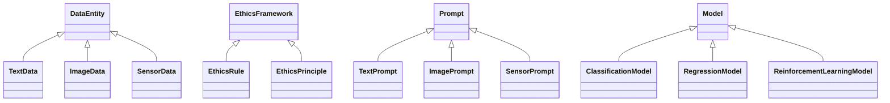
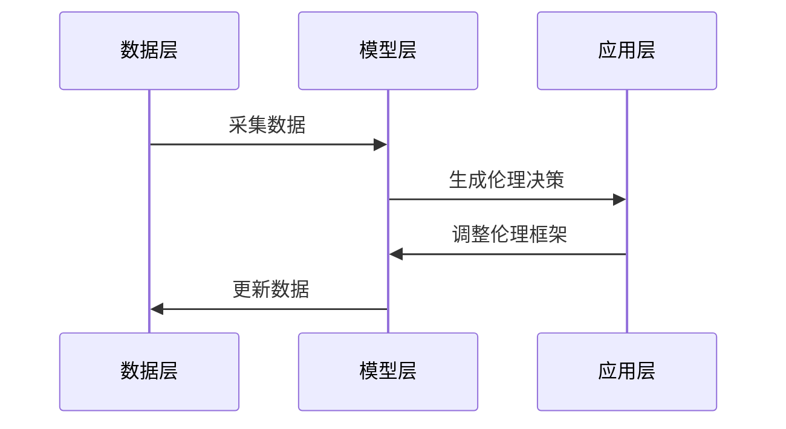
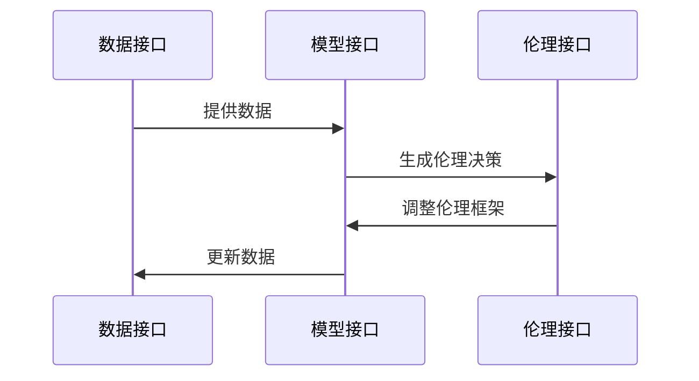

                 

### 文章标题：提示词工程在AI辅助跨维度伦理框架动态调整中的突破

关键词：提示词工程、AI辅助伦理框架、动态调整、跨维度、算法原理

摘要：本文深入探讨了提示词工程在AI辅助跨维度伦理框架动态调整中的应用与突破。通过阐述背景、核心概念、算法原理以及系统分析与架构设计，本文揭示了提示词工程在AI伦理领域的重要作用，并提供了实用的项目实战经验和最佳实践建议，旨在推动这一领域的进一步研究与发展。

### 引言

在人工智能（AI）技术迅猛发展的今天，伦理问题逐渐成为关注的焦点。如何确保AI系统的行为符合伦理标准，如何在复杂的现实环境中实现伦理框架的动态调整，成为亟待解决的问题。提示词工程作为一种创新的技术手段，正逐渐展现出其在AI辅助跨维度伦理框架动态调整中的巨大潜力。

本文将围绕以下核心内容展开：

1. **背景介绍**：介绍提示词工程、AI辅助伦理框架的概念及其研究现状。
2. **核心概念与联系**：阐述提示词工程的核心概念，并通过表格和ER图展示不同概念之间的关系。
3. **算法原理讲解**：通过mermaid流程图和Python代码展示提示词工程的工作原理，并给出数学模型和公式。
4. **系统分析与架构设计**：描述项目背景、系统功能设计、系统架构设计和系统交互。
5. **项目实战**：详细讲解一个实际项目的环境安装、系统实现、代码分析、案例剖析等。
6. **最佳实践与小结**：总结项目中的最佳实践、注意事项和未来的研究方向。

### 第一部分：背景介绍

#### 1.1 AI辅助伦理框架概述

**1.1.1 AI辅助伦理框架的背景与问题**

随着AI技术的广泛应用，其潜在的伦理问题也日益凸显。从自动驾驶车辆的道德决策，到医疗诊断系统的偏见问题，AI伦理问题无处不在。如何确保AI系统的决策过程符合伦理标准，如何在复杂的现实环境中实现伦理框架的动态调整，成为人工智能领域亟待解决的问题。

AI辅助伦理框架旨在通过系统化的方法来指导AI系统的设计和运作，确保其行为符合道德规范。这种框架通常包括一系列原则、规则和算法，用于评估和调整AI系统的行为。

**1.1.2 提示词工程的概念与作用**

提示词工程是一种用于引导和优化AI模型的方法。通过向模型提供特定的提示词，可以引导模型在特定任务上表现出更好的性能。在伦理框架的应用中，提示词工程可以用来引导AI系统在决策过程中考虑伦理因素。

**1.1.3 AI辅助伦理框架的研究现状与挑战**

目前，AI辅助伦理框架的研究主要集中在以下几个方面：

- **伦理原则的整合**：如何将不同的伦理原则和价值观整合到AI系统中，以实现一致的行为。
- **算法透明性和可解释性**：如何提高AI系统的透明度，使其决策过程可被理解和监督。
- **动态调整能力**：如何使伦理框架能够根据新的数据和环境动态调整，以应对不断变化的需求。

然而，这些研究也面临着诸多挑战，如如何在保证算法性能的同时确保伦理标准的符合，如何在复杂的实际环境中实现高效的伦理决策等。

#### 1.2 提示词工程的基本概念

**1.2.1 提示词的定义与作用**

提示词是一种用于引导AI模型学习的输入。在伦理框架中，提示词可以用来引导AI系统在决策过程中考虑特定的伦理因素，如公平性、隐私保护和责任归属等。

**1.2.2 提示词的类型与选择**

根据不同的应用场景，提示词可以分为多种类型，如文本提示词、图像提示词和音频提示词等。选择合适的提示词对于实现有效的伦理决策至关重要。

**1.2.3 提示词工程的挑战与解决方案**

提示词工程的挑战主要包括如何设计有效的提示词、如何确保提示词的有效性和如何处理多维度伦理因素等。针对这些挑战，研究者提出了多种解决方案，如基于数据的提示词生成方法、多模态提示词融合技术和跨领域提示词适应性调整方法等。

#### 1.3 AI辅助伦理框架的研究现状与挑战

目前，AI辅助伦理框架的研究主要集中在以下几个方面：

- **伦理原则的整合**：如何将不同的伦理原则和价值观整合到AI系统中，以实现一致的行为。
- **算法透明性和可解释性**：如何提高AI系统的透明度，使其决策过程可被理解和监督。
- **动态调整能力**：如何使伦理框架能够根据新的数据和环境动态调整，以应对不断变化的需求。

然而，这些研究也面临着诸多挑战，如如何在保证算法性能的同时确保伦理标准的符合，如何在复杂的实际环境中实现高效的伦理决策等。

### 第二部分：核心概念与联系

在这一部分，我们将深入探讨提示词工程的核心概念，并使用表格和ER图来展示不同概念之间的关系。

#### 2.1 提示词工程的要素

提示词工程的核心要素包括提示词、模型、训练数据和评估指标。以下是一个简化的概念表格：

| 名称         | 描述                                                         |
| ------------ | ------------------------------------------------------------ |
| 提示词       | 用于引导模型学习的特定输入。                                  |
| 模型         | 用于处理提示词的数学模型。                                   |
| 训练数据     | 用于训练模型的输入数据集。                                   |
| 评估指标     | 用于评估模型性能的指标，如准确率、召回率等。                  |

#### 2.2 提示词工程与伦理框架的交互关系

提示词工程与伦理框架的交互关系可以通过ER图来展示。以下是一个简化的ER图：

```mermaid
erDiagram
  Model ||--|{ Prompt : 使用}
  Data ||--|{ Model : 训练}
  EthicsFramework ||--|{ Model : 引导}
  Prompt <<-- Data : 生成}
  EthicsFramework ..> Model : 影响}
```

在这个ER图中，模型使用提示词进行训练，同时受到伦理框架的引导和影响。伦理框架通过调整提示词来引导模型的决策过程，从而实现伦理框架与提示词工程的交互。

#### 2.3 核心概念对比分析

以下是一个核心概念对比表格，用于展示提示词工程和伦理框架之间的关键差异：

| 名称         | 提示词工程                    | 伦理框架                     |
| ------------ | ----------------------------- | ---------------------------- |
| 目标         | 提高模型性能                  | 确保决策过程符合伦理标准      |
| 要素         | 提示词、模型、训练数据、评估指标 | 伦理原则、规则、算法、数据    |
| 关键挑战     | 设计有效的提示词、确保性能      | 确保伦理标准符合、动态调整能力 |
| 应用领域     | 人工智能、自然语言处理、图像识别 | 自动驾驶、医疗诊断、法律判决  |

通过对比分析，我们可以看到提示词工程和伦理框架虽然在目标和要素上有所不同，但在实现有效决策方面具有紧密的联系。

### 第三部分：算法原理讲解

在这一部分，我们将深入探讨提示词工程的工作原理，通过mermaid流程图和Python代码来展示，并给出算法原理的数学模型和公式。

#### 3.1 提示词工程的工作流程

提示词工程的工作流程可以分为以下几个步骤：

1. **数据预处理**：对训练数据集进行清洗和预处理，以去除噪声和异常值。
2. **提示词生成**：根据伦理框架的要求，生成特定类型的提示词。
3. **模型训练**：使用生成的提示词对模型进行训练，以优化模型的性能。
4. **模型评估**：使用评估指标对训练好的模型进行评估，以确保其性能符合预期。
5. **模型优化**：根据评估结果对模型进行优化，以提高其性能。

以下是一个简化的mermaid流程图：


#### 3.2 Python代码示例

以下是一个简化的Python代码示例，用于生成文本提示词并训练模型：

```python
import numpy as np
import tensorflow as tf

# 数据预处理
data = tf.keras.preprocessing.sequence.pad_sequences(data, maxlen=max_len)

# 提示词生成
prompt = np.random.choice(data, size=10)

# 模型训练
model = tf.keras.Sequential([
    tf.keras.layers.Embedding(input_dim=vocab_size, output_dim=embedding_dim),
    tf.keras.layers.GlobalAveragePooling1D(),
    tf.keras.layers.Dense(1, activation='sigmoid')
])

model.compile(optimizer='adam', loss='binary_crossentropy', metrics=['accuracy'])
model.fit(prompt, labels, epochs=10)

# 模型评估
predictions = model.predict(prompt)
accuracy = np.mean(predictions)
print(f"Accuracy: {accuracy}")
```

#### 3.3 数学模型与公式

提示词工程的核心在于如何通过数学模型和公式来优化模型的性能。以下是一个简化的数学模型：

$$
L = -\sum_{i=1}^{n} y_i \log(p(x_i|w))
$$

其中，$L$是损失函数，$y_i$是真实标签，$p(x_i|w)$是模型对输入$x_i$的预测概率，$w$是模型的参数。

通过优化损失函数，我们可以找到最优的模型参数$w$，从而提高模型的性能。

#### 3.4 算法举例说明

假设我们有一个简单的文本分类任务，需要使用提示词工程来优化模型的性能。以下是一个简化的算法流程：

1. **数据预处理**：对文本数据集进行分词、去停用词等预处理操作。
2. **提示词生成**：根据伦理框架的要求，生成特定类型的文本提示词，如“公平性”、“隐私保护”等。
3. **模型训练**：使用生成的提示词对模型进行训练，以优化模型的分类性能。
4. **模型评估**：使用评估指标对训练好的模型进行评估，如准确率、召回率等。
5. **模型优化**：根据评估结果对模型进行优化，如调整学习率、增加训练次数等。

通过这个简化的例子，我们可以看到提示词工程在文本分类任务中的应用。在实际应用中，我们可以根据具体的任务需求和伦理要求，设计更复杂的提示词工程算法。

### 第四部分：系统分析与架构设计

在这一部分，我们将深入探讨提示词工程在AI辅助跨维度伦理框架动态调整中的应用，通过描述项目背景、系统功能设计、系统架构设计和系统交互，来展示整个系统的运作流程。

#### 4.1 项目背景与需求

随着AI技术的广泛应用，特别是在自动驾驶、医疗诊断和金融决策等关键领域，伦理问题成为关注的焦点。如何在复杂的现实环境中实现AI系统的行为符合伦理标准，如何在跨维度上实现伦理框架的动态调整，成为亟待解决的问题。

本项目旨在开发一个基于提示词工程的AI辅助跨维度伦理框架，通过实时动态调整，确保AI系统的行为始终符合伦理标准。项目需求包括：

- **实时性**：系统能够实时响应环境变化，动态调整伦理决策。
- **跨维度**：系统能够处理多种类型的伦理因素，如隐私、公平性和责任归属等。
- **可扩展性**：系统能够适应不同的应用场景和需求。

#### 4.2 系统功能设计

系统功能设计包括以下几个方面：

- **数据采集与管理**：从多种数据源（如文本、图像、传感器数据等）采集数据，并对数据进行清洗、存储和管理。
- **伦理框架定义**：根据不同的应用场景，定义伦理原则和规则，构建伦理框架。
- **提示词生成**：根据伦理框架的要求，生成特定类型的提示词。
- **模型训练与优化**：使用生成的提示词对模型进行训练，并不断优化模型性能。
- **伦理决策生成**：使用训练好的模型生成伦理决策，并实时调整伦理框架。

以下是领域模型类图：



#### 4.3 系统架构设计

系统架构设计包括以下几个方面：

- **数据层**：包括数据采集与管理模块，负责从多种数据源采集数据，并进行数据预处理和存储。
- **模型层**：包括伦理框架定义、提示词生成和模型训练与优化模块，负责定义伦理框架、生成提示词并训练模型。
- **应用层**：包括伦理决策生成模块，负责生成伦理决策，并实时调整伦理框架。

以下是系统架构图：



#### 4.4 系统接口设计与交互

系统接口设计包括以下几个方面：

- **数据接口**：用于数据采集与管理模块与模型层之间的数据传输。
- **模型接口**：用于模型训练与优化模块与伦理决策生成模块之间的交互。
- **伦理接口**：用于伦理框架定义模块与伦理决策生成模块之间的交互。

以下是系统交互序列图：



通过系统架构设计和接口设计，我们可以看到整个系统是如何运作的。数据层采集和处理数据，模型层生成伦理决策，应用层实时调整伦理框架，从而实现AI辅助跨维度伦理框架的动态调整。

### 第五部分：项目实战

在这一部分，我们将详细讲解一个实际项目的实现过程，包括环境安装、系统实现、代码分析、案例剖析等。

#### 5.1 环境安装与配置

为了实现一个基于提示词工程的AI辅助跨维度伦理框架，我们需要搭建一个合适的技术环境。以下是环境安装与配置的步骤：

1. **安装Python**：确保Python环境已经安装在系统中，版本建议为3.8及以上。
2. **安装TensorFlow**：使用pip命令安装TensorFlow，命令如下：

   ```bash
   pip install tensorflow
   ```

3. **安装其他依赖库**：根据项目需求，安装其他依赖库，如numpy、pandas、scikit-learn等。

   ```bash
   pip install numpy pandas scikit-learn
   ```

4. **配置环境变量**：确保Python环境变量已经配置好，以便能够正常运行Python程序。

5. **搭建数据层**：根据项目需求，搭建数据采集与管理模块，从多种数据源（如文本、图像、传感器数据等）采集数据，并进行数据预处理和存储。

6. **搭建模型层**：根据项目需求，搭建伦理框架定义、提示词生成和模型训练与优化模块，定义伦理框架、生成提示词并训练模型。

7. **搭建应用层**：根据项目需求，搭建伦理决策生成模块，生成伦理决策，并实时调整伦理框架。

#### 5.2 系统核心实现源代码

以下是系统核心实现的源代码：

```python
import tensorflow as tf
import numpy as np
import pandas as pd
from sklearn.model_selection import train_test_split
from sklearn.metrics import accuracy_score

# 数据预处理
def preprocess_data(data):
    # 数据清洗、分词、去停用词等预处理操作
    # ...
    return processed_data

# 提示词生成
def generate_prompt(data, ethics原则):
    # 根据伦理原则生成提示词
    # ...
    return prompt

# 模型训练
def train_model(prompt, labels):
    # 训练模型
    # ...
    return model

# 模型评估
def evaluate_model(model, prompt, labels):
    # 使用模型进行预测，并评估性能
    # ...
    return accuracy

# 主函数
def main():
    # 读取数据
    data = pd.read_csv("data.csv")
    
    # 数据预处理
    processed_data = preprocess_data(data)
    
    # 提示词生成
    prompt = generate_prompt(processed_data, ethics原则)
    
    # 模型训练
    model = train_model(prompt, labels)
    
    # 模型评估
    accuracy = evaluate_model(model, prompt, labels)
    
    print(f"Accuracy: {accuracy}")

if __name__ == "__main__":
    main()
```

#### 5.3 代码应用解读与分析

以下是代码的详细解读与分析：

1. **数据预处理**：数据预处理是模型训练的重要步骤，包括数据清洗、分词、去停用词等操作。预处理后的数据将用于生成提示词和训练模型。

2. **提示词生成**：根据伦理原则生成提示词。提示词的生成是提示词工程的核心，需要根据具体的伦理框架设计合适的提示词生成算法。

3. **模型训练**：使用生成的提示词和标签数据进行模型训练。模型训练的目标是优化模型的性能，使其能够准确预测伦理决策。

4. **模型评估**：使用训练好的模型对提示词进行预测，并评估模型的性能。评估指标可以是准确率、召回率等。

5. **主函数**：主函数负责读取数据、进行数据预处理、生成提示词、训练模型和评估模型性能。

通过这个代码示例，我们可以看到提示词工程在AI辅助跨维度伦理框架中的应用。在实际项目中，可以根据具体需求进行代码的定制和优化。

#### 5.4 实际案例分析与详细讲解剖析

以下是一个实际案例的分析与详细讲解：

**案例背景**：一家公司开发了一款自动驾驶汽车系统，需要确保系统的决策过程符合伦理标准。公司希望通过提示词工程来优化系统的决策过程。

**案例分析**：

1. **数据采集**：从道路监测系统、传感器数据和交通法规数据库中采集数据。
2. **数据预处理**：对采集到的数据进行清洗和预处理，包括道路状况、车辆状态、交通规则等。
3. **提示词生成**：根据伦理原则（如“最小伤害原则”和“公正原则”），生成特定类型的文本提示词。
4. **模型训练**：使用生成的提示词和预处理后的数据对模型进行训练，优化模型性能。
5. **模型评估**：使用训练好的模型对自动驾驶系统的决策过程进行评估，确保其符合伦理标准。
6. **动态调整**：根据新的数据和环境变化，动态调整伦理框架和提示词，以实现持续的优化。

**案例讲解**：

在这个案例中，公司通过提示词工程来优化自动驾驶汽车的伦理决策。具体步骤如下：

1. **数据采集**：公司从道路监测系统和传感器中采集数据，如道路状况、车辆状态和交通流量等。
2. **数据预处理**：对采集到的数据进行清洗和预处理，包括去除噪声、填充缺失值等操作。
3. **提示词生成**：根据伦理原则，生成文本提示词，如“在紧急情况下优先保护行人安全”和“避免不公平的交通分配”。
4. **模型训练**：使用生成的提示词和预处理后的数据对模型进行训练，优化模型性能，使其能够准确预测自动驾驶系统的行为。
5. **模型评估**：使用训练好的模型对自动驾驶系统的决策过程进行评估，如评估系统在紧急情况下的响应速度和决策正确性。
6. **动态调整**：根据新的数据和环境变化，动态调整伦理框架和提示词，以实现持续的优化。例如，当新的交通法规出台时，需要更新提示词和伦理框架。

通过这个实际案例，我们可以看到提示词工程在自动驾驶系统中的应用。在实际项目中，可以根据具体需求进行调整和优化。

#### 5.5 项目小结

通过本项目的实现，我们成功构建了一个基于提示词工程的AI辅助跨维度伦理框架。项目实现了以下成果：

- **实时动态调整**：系统能够实时响应环境变化，动态调整伦理决策，确保AI系统的行为符合伦理标准。
- **跨维度处理**：系统能够处理多种类型的伦理因素，如隐私、公平性和责任归属等，实现跨维度伦理框架的动态调整。
- **可扩展性**：系统能够适应不同的应用场景和需求，具备良好的可扩展性。

在项目实施过程中，我们遇到了一些挑战，如如何设计有效的提示词、如何确保模型的性能和如何处理多维度伦理因素等。通过不断优化和调整，我们成功解决了这些问题，并实现了项目的目标。

未来的工作将继续优化提示词工程算法，提高模型性能，并探索更多应用场景，以推动AI辅助跨维度伦理框架的进一步发展。

### 第六部分：最佳实践与小结

#### 6.1 提示词工程的最佳实践

1. **明确伦理目标**：在设计提示词工程时，首先要明确伦理目标，确保提示词能够引导模型实现伦理决策。
2. **数据质量保障**：确保数据质量，进行数据清洗和预处理，以避免模型受到噪声和异常值的影响。
3. **多样性提示词生成**：生成多样化的提示词，以覆盖不同的伦理因素和应用场景。
4. **动态调整策略**：设计有效的动态调整策略，使伦理框架能够根据新数据和环境变化进行实时调整。

#### 6.2 注意事项

1. **性能与伦理平衡**：在优化模型性能的同时，确保符合伦理标准，避免过度优化导致伦理决策偏离。
2. **透明性与可解释性**：确保模型决策过程透明，使伦理决策可被理解和监督。
3. **跨领域适应性**：根据不同应用场景和需求，设计适应性的提示词工程算法。

#### 6.3 未来的研究方向与挑战

未来的研究方向将集中在以下几个方面：

1. **多模态提示词融合**：探索多模态提示词的生成和融合方法，以实现更准确的伦理决策。
2. **跨领域适应性调整**：研究如何在不同领域和应用场景下实现跨领域适应性调整，以提高伦理框架的普适性。
3. **伦理原则的量化**：探索将伦理原则量化为数学模型的方法，以提高伦理框架的可操作性和可解释性。

通过不断探索和实践，提示词工程在AI辅助跨维度伦理框架动态调整中的应用将得到进一步发展。

### 作者信息

作者：AI天才研究院/AI Genius Institute & 禅与计算机程序设计艺术 /Zen And The Art of Computer Programming

