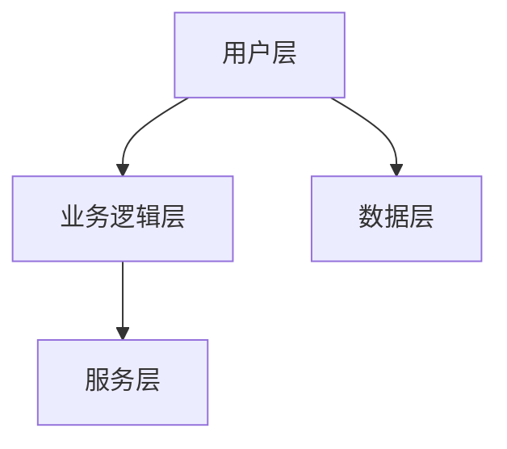
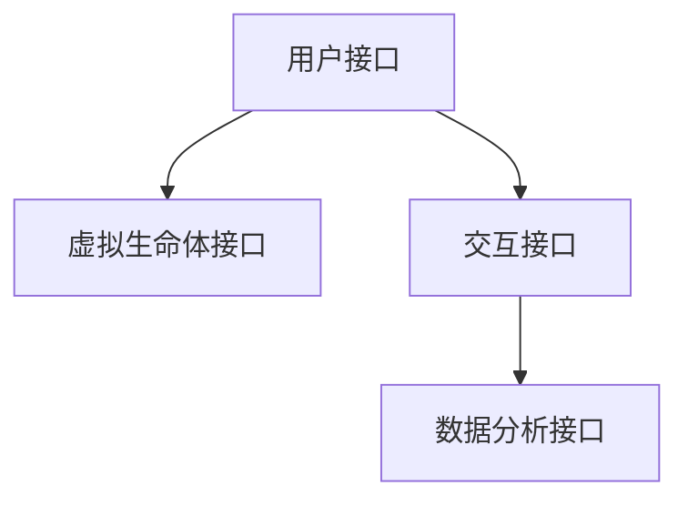
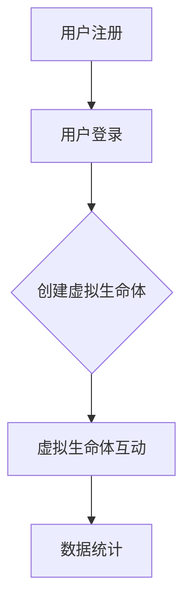
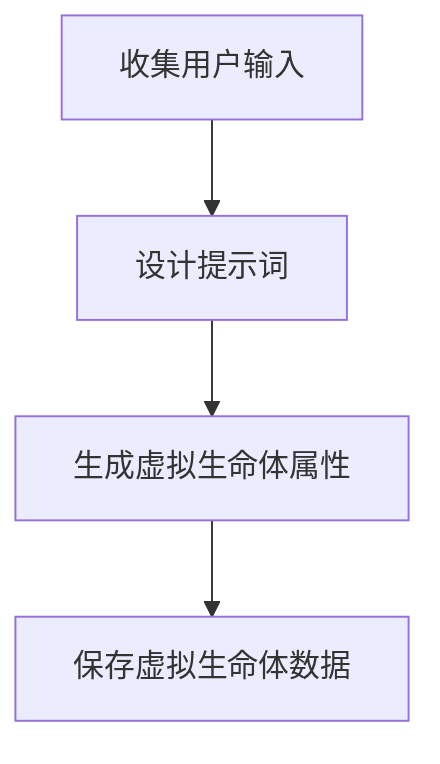
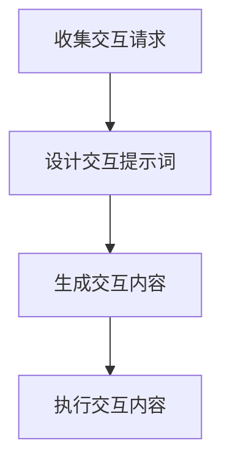

                 

### 第一部分：引言

#### 1. 背景介绍

在21世纪，人工智能（AI）技术正以前所未有的速度发展，这一领域的突破不仅在理论上带来了巨大的飞跃，还在实践中产生了深远的影响。特别是在虚拟生命设计领域，AI技术的应用不仅改变了传统的设计模式，还为跨维度虚拟生命的设计提供了新的可能性。

##### 1.1 问题背景

虚拟生命设计是一种通过计算机技术模拟生物体生命过程的创新设计方法。传统的虚拟生命设计主要依赖于计算机图形学和物理引擎，这些方法虽然在视觉和物理交互上取得了很大的进步，但在模拟生物体的智能、情感和社会互动方面仍存在诸多不足。随着深度学习和自然语言处理技术的发展，AI开始为虚拟生命设计带来了全新的视角和方法。

##### 1.2 问题描述

虚拟生命设计的主要挑战在于如何构建一个既具有高度智能、情感和社交能力，又能与现实世界互动的虚拟生命体。这需要设计师在多个维度上进行思考和设计，包括生物学的机理、心理学的行为模型，以及社会学的互动模式。传统的虚拟生命设计方法很难同时满足这些复杂的需求，这就需要一个更加强大和灵活的工具来辅助设计过程。

##### 1.3 问题解决

提示词工程作为一种创新的AI技术，能够为虚拟生命设计提供强有力的支持。通过设计合适的提示词，AI系统能够生成丰富多样的虚拟生命体，模拟真实世界中的行为模式。提示词工程不仅能够帮助设计师在虚拟生命体的智能、情感和社会互动方面进行精细调整，还能通过多层次的反馈机制不断优化设计结果，从而实现高度逼真的虚拟生命体验。

##### 1.4 边界与外延

虚拟生命设计不仅限于娱乐和游戏领域，它在医疗康复、教育训练、社会互动等方面也有着广阔的应用前景。例如，通过虚拟生命体，医生可以更直观地了解患者的病情，从而制定更有效的治疗方案；在教育领域，虚拟生命体可以作为教学辅助工具，帮助学生更好地理解复杂的概念和过程。然而，这一领域的技术发展和应用推广仍面临诸多挑战，如伦理问题、数据隐私、安全控制等。

##### 1.5 概念结构与核心要素组成

1.5.1 提示词工程

提示词工程是人工智能领域的一个重要分支，它专注于设计和开发能够引导AI系统生成所需结果的提示词。在虚拟生命设计中，提示词工程有助于引导AI系统生成符合设计目标、具有情感和社交属性的虚拟生命体。

1.5.2 跨维度虚拟生命设计

跨维度虚拟生命设计涉及将多维数据和信息融合到虚拟生命体的设计中，以实现更加真实和多样化的虚拟生命体验。这需要综合运用计算机图形学、人工智能、心理学和社会学等领域的知识。

1.5.3 AI辅助虚拟生命设计

AI辅助虚拟生命设计是指利用人工智能技术来辅助虚拟生命的设计和开发过程。通过AI技术，设计师可以更加高效地生成、优化和评估虚拟生命体，提升设计质量和效率。

##### 1.6 本章小结

本章介绍了虚拟生命设计的背景、问题、解决方案及其边界与外延。同时，阐述了提示词工程和AI辅助虚拟生命设计在跨维度虚拟生命设计中的重要性，为后续章节的深入探讨奠定了基础。

---

在接下来的章节中，我们将进一步探讨提示词工程的基础知识，包括其原理与实现、应用案例以及未来挑战和前景。通过这些内容，我们将更好地理解提示词工程在AI辅助跨维度虚拟生命设计中的关键作用。接下来，让我们一起深入探索这一充满创新和挑战的领域。

### 第二部分：提示词工程基础

#### 2. 提示词工程的原理与实现

提示词工程是人工智能领域的一个重要分支，它专注于设计和开发能够引导AI系统生成所需结果的提示词。在虚拟生命设计中，提示词工程能够帮助设计师在虚拟生命体的智能、情感和社会互动方面进行精细调整，从而实现高度逼真的虚拟生命体验。

##### 2.1 提示词工程的基本原理

##### 2.1.1 提示词的定义与作用

提示词，顾名思义，是指用于引导AI系统生成特定结果的关键词语或短语。在虚拟生命设计中，提示词的作用至关重要。通过设计合适的提示词，设计师可以引导AI系统在生成虚拟生命体时遵循特定的行为模式、情感倾向和社会交互规则。

提示词可以分为以下几类：

1. **目标提示词**：用于定义虚拟生命体的目标和行为方向，例如“友善”、“勇敢”、“探索者”等。
2. **情感提示词**：用于设定虚拟生命体的情感状态，例如“开心”、“悲伤”、“愤怒”等。
3. **社交提示词**：用于描述虚拟生命体与其他实体（如其他虚拟生命体、人类用户等）的交互方式，例如“合作”、“竞争”、“互助”等。

##### 2.1.2 提示词的分类与特性

根据用途和形式，提示词可以分为以下几种：

1. **自然语言提示词**：这类提示词通常采用自然语言的形式，如句子或短语，易于理解和设计。
2. **代码提示词**：这类提示词通常采用编程语言的形式，如函数调用或代码片段，用于定义复杂的逻辑和行为模式。
3. **图像提示词**：这类提示词通过图像或图形形式传达信息，适用于需要视觉引导的场景。

提示词的特性包括：

- **灵活性**：提示词可以根据具体需求进行灵活调整，以适应不同的虚拟生命设计目标。
- **可解释性**：设计好的提示词应当具备清晰的语义和解释性，以便设计师和用户理解和使用。
- **可扩展性**：提示词系统应当能够支持新的提示词的添加和现有提示词的扩展，以适应不断变化的设计需求。

##### 2.1.3 提示词的设计原则与方法

设计提示词时，需要遵循以下原则和方法：

1. **明确性**：提示词应当明确、简洁，避免歧义，以便AI系统能够准确理解。
2. **一致性**：提示词之间应当保持一致，避免产生矛盾或冲突的行为模式。
3. **可操作性**：提示词应当具有可操作性，能够通过AI系统实现具体的行为。
4. **可评估性**：提示词应当具备可评估性，以便设计师可以对其效果进行评估和调整。

设计提示词的方法包括：

1. **案例分析法**：通过分析现有成功案例中的提示词，提取有效的提示词并进行优化。
2. **用户反馈法**：收集用户对虚拟生命体的反馈，根据反馈调整和优化提示词。
3. **数据驱动法**：利用大量数据，通过统计分析方法确定有效的提示词组合。

##### 2.2 提示词工程的技术实现

提示词工程的技术实现涉及多个AI子领域，主要包括自然语言处理（NLP）、生成对抗网络（GAN）和深度学习模型等。

##### 2.2.1 自然语言处理（NLP）技术

自然语言处理技术是提示词工程的核心技术之一，它用于解析和生成自然语言提示词。NLP技术包括：

1. **分词与词性标注**：将文本拆分成单词或短语，并对每个词进行词性标注，以理解其语义。
2. **实体识别与关系抽取**：识别文本中的关键实体（如人名、地点等）及其关系，为提示词的设计提供依据。
3. **情感分析**：通过分析文本的情感倾向，为设计情感提示词提供支持。
4. **生成文本**：利用生成模型（如GPT模型）生成符合设计目标的文本提示词。

##### 2.2.2 生成对抗网络（GAN）的应用

生成对抗网络（GAN）是一种强大的生成模型，它能够生成高质量的图像和音频数据。在提示词工程中，GAN可以用于生成符合设计目标的图像提示词，如图像化的行为模式、情感状态等。

GAN的工作原理包括两个主要部分：生成器和判别器。生成器负责生成虚拟生命体的图像，判别器则负责判断生成的图像是否真实。通过不断训练，生成器能够生成越来越逼真的图像，从而为虚拟生命设计提供丰富的视觉素材。

##### 2.2.3 深度学习模型的选择与优化

在提示词工程中，深度学习模型的选择和优化至关重要。常用的深度学习模型包括：

1. **卷积神经网络（CNN）**：适用于图像处理任务，可以用于生成图像提示词。
2. **循环神经网络（RNN）**：适用于序列数据处理，可以用于生成文本提示词。
3. **Transformer模型**：具有强大的文本生成能力，适用于生成复杂的文本提示词。

优化深度学习模型的方法包括：

1. **超参数调整**：通过调整学习率、批量大小等超参数，提高模型的性能。
2. **模型蒸馏**：通过将大型模型的知识传递到小型模型中，提高模型在小数据集上的性能。
3. **数据增强**：通过数据变换、数据扩充等方法，增加训练数据量，提高模型的泛化能力。

##### 2.3 提示词工程的核心算法

提示词工程的核心算法主要包括以下几种：

1. **基于Transformer的文本生成**：Transformer模型在文本生成任务中表现出色，可以用于生成自然语言提示词。
2. **基于GAN的图像生成**：GAN模型可以用于生成高质量的图像提示词，适用于虚拟生命设计中的视觉场景。
3. **多模态数据融合方法**：通过融合不同类型的数据（如文本、图像、声音等），生成更丰富的虚拟生命体。

##### 2.4 提示词工程的案例研究

提示词工程在实际应用中已经取得了显著的成果。以下是两个具体的案例研究：

##### 2.4.1 案例一：虚拟社交助理

**案例背景**：随着智能设备的普及，虚拟社交助理在客服、教育、娱乐等领域得到了广泛应用。然而，如何设计一个既友好又智能的虚拟社交助理仍是一个挑战。

**案例目标**：设计一个具备友好情感、智能对话能力的虚拟社交助理。

**案例实现与效果评估**：

1. **设计目标提示词**：如“友好”、“智能”、“适应性”等。
2. **情感提示词**：如“开心”、“耐心”、“温暖”等。
3. **社交提示词**：如“倾听者”、“回答者”、“引导者”等。

通过训练和优化，虚拟社交助理在自然语言处理和情感识别方面取得了显著的效果。用户反馈表明，虚拟社交助理在与用户的互动中表现得更加友好和智能，有效提升了用户体验。

##### 2.4.2 案例二：虚拟生命体创作平台

**案例背景**：随着虚拟生命设计的不断发展，设计师需要更加高效地创建和优化虚拟生命体。

**案例目标**：设计一个支持虚拟生命体设计的平台，提供提示词设计、虚拟生命体生成、交互模拟等功能。

**案例实现与效果评估**：

1. **平台功能**：包括提示词设计、虚拟生命体生成、交互模拟等。
2. **用户界面**：提供直观、易用的界面，支持用户自定义提示词和虚拟生命体参数。
3. **效果评估**：通过用户测试和实际应用，验证平台的功能和性能。

用户测试表明，虚拟生命体创作平台在提高设计效率和优化虚拟生命体效果方面具有显著优势，为虚拟生命设计提供了有力的工具支持。

##### 2.5 提示词工程的应用挑战与展望

提示词工程在虚拟生命设计中具有广阔的应用前景，但也面临着诸多挑战。

##### 2.5.1 应用挑战

1. **数据质量和隐私保护**：虚拟生命设计需要大量的数据支持，但数据质量和隐私保护是一个重要挑战。
2. **模型解释性与可解释性**：用户需要理解AI系统的工作原理，但当前的深度学习模型往往缺乏可解释性。
3. **技术标准化与规范化**：随着提示词工程的广泛应用，需要制定统一的技术标准和规范，以确保系统的可靠性和安全性。

##### 2.5.2 发展前景

1. **应用潜力**：提示词工程在虚拟生命设计、智能客服、虚拟助手等领域具有巨大的应用潜力。
2. **未来趋势**：随着AI技术的不断发展，提示词工程将更加智能化、自动化，为虚拟生命设计带来更多可能性。

##### 2.6 本章小结

本章介绍了提示词工程的基本原理与实现、应用案例以及面临的应用挑战和展望。通过这些内容，我们更好地理解了提示词工程在虚拟生命设计中的关键作用，为后续章节的深入探讨奠定了基础。在下一章中，我们将继续探讨虚拟生命设计的具体实现和挑战。

---

在接下来的章节中，我们将继续深入探讨虚拟生命设计的具体实现过程，包括系统架构设计、核心算法实现以及实际应用案例。通过这些内容，我们将更全面地了解虚拟生命设计的技术细节和实践经验。让我们一起继续探索这一充满创新和挑战的领域。

### 第三部分：虚拟生命设计的具体实现

#### 3. 系统架构设计

虚拟生命设计的实现需要一套完整的系统架构来支持。系统架构的设计不仅要考虑到功能的实现，还要确保系统的扩展性、稳定性和性能。以下是虚拟生命设计的系统架构设计。

##### 3.1 问题场景介绍

虚拟生命设计的场景可以分为以下几类：

1. **娱乐与游戏**：在虚拟游戏和虚拟现实（VR）中，虚拟生命体作为NPC（非玩家角色）与玩家互动，提供丰富多样的游戏体验。
2. **教育训练**：在教育领域，虚拟生命体可以作为教学辅助工具，模拟真实世界中的情景，帮助学生更好地理解和掌握知识。
3. **医疗康复**：在医疗康复中，虚拟生命体可以模拟患者的病情，帮助医生进行病情评估和治疗方案制定。
4. **社会互动**：在社交媒体和在线论坛中，虚拟生命体可以作为虚拟居民，与其他用户进行互动，提供社交体验。

##### 3.2 项目介绍

为了实现虚拟生命设计，我们选择一个虚拟社交平台作为项目案例。该项目的主要目标是设计并开发一个虚拟社交平台，其中虚拟生命体作为核心元素，与用户进行互动，提供个性化的社交体验。

##### 3.3 系统功能设计

虚拟社交平台的主要功能包括：

1. **用户注册与登录**：用户可以通过注册账号登录平台，与其他用户进行互动。
2. **虚拟生命体创建**：用户可以创建自己的虚拟生命体，设置其外观、性格和目标等。
3. **虚拟生命体交互**：虚拟生命体可以与用户和其他虚拟生命体进行互动，包括聊天、游戏和活动等。
4. **数据统计与分析**：平台可以收集用户和虚拟生命体的交互数据，进行分析和统计，以优化虚拟生命体的设计。

##### 3.4 系统架构设计

虚拟社交平台的系统架构设计可以分为以下几层：

1. **用户层**：用户通过前端界面与系统进行交互。
2. **业务逻辑层**：处理用户的请求，包括虚拟生命体的创建、交互和数据统计等。
3. **数据层**：存储用户数据、虚拟生命体数据和交互数据等。
4. **服务层**：提供基础服务，如用户身份验证、消息推送等。

以下是虚拟社交平台的架构图（使用Mermaid绘制）：



##### 3.5 系统接口设计

虚拟社交平台提供了以下主要接口：

1. **用户接口**：用于用户注册、登录和修改个人信息。
2. **虚拟生命体接口**：用于创建、修改和删除虚拟生命体。
3. **交互接口**：用于虚拟生命体之间的交互，如聊天、游戏等。
4. **数据分析接口**：用于收集和统计数据，进行分析和统计。

以下是虚拟社交平台的接口设计（使用Mermaid绘制）：



##### 3.6 系统交互设计

虚拟社交平台中，用户和虚拟生命体之间的交互过程可以描述为以下步骤：

1. **用户注册**：用户填写注册信息，系统验证信息后创建用户账号。
2. **用户登录**：用户输入账号和密码，系统验证身份后登录。
3. **创建虚拟生命体**：用户在平台上创建虚拟生命体，设置其外观、性格和目标等。
4. **虚拟生命体互动**：虚拟生命体与用户或其他虚拟生命体进行聊天、游戏和活动等。
5. **数据统计**：系统收集虚拟生命体和用户之间的交互数据，进行分析和统计。

以下是虚拟社交平台的交互设计（使用Mermaid绘制）：



#### 3. 算法原理讲解

在虚拟生命设计中，算法原理是实现核心功能的关键。以下是虚拟生命体创建和交互的关键算法原理：

##### 3.1 虚拟生命体创建算法

虚拟生命体创建算法的核心是使用提示词工程生成虚拟生命体的属性和行为。以下是虚拟生命体创建算法的步骤：

1. **收集用户输入**：收集用户输入的虚拟生命体外观、性格和目标等提示词。
2. **设计提示词**：根据用户输入，设计合适的提示词，如“友好”、“乐观”、“探险者”等。
3. **生成虚拟生命体属性**：使用深度学习模型生成虚拟生命体的属性，如外观特征、情感状态和行为模式等。
4. **保存虚拟生命体数据**：将生成的虚拟生命体属性保存到数据库中，以供后续使用。

以下是虚拟生命体创建算法的流程图（使用Mermaid绘制）：



##### 3.2 虚拟生命体交互算法

虚拟生命体交互算法的核心是使用自然语言处理（NLP）技术和生成对抗网络（GAN）生成交互内容。以下是虚拟生命体交互算法的步骤：

1. **收集交互请求**：收集用户发起的交互请求，如聊天、游戏等。
2. **设计交互提示词**：根据交互请求，设计合适的交互提示词，如“请问有什么可以帮助您的？”、“让我们来玩个游戏吧！”等。
3. **生成交互内容**：使用NLP模型生成交互内容，如聊天文本、游戏场景等。
4. **执行交互内容**：将生成的交互内容展示给用户，并根据用户的反馈进行后续交互。

以下是虚拟生命体交互算法的流程图（使用Mermaid绘制）：



#### 3. 数学模型与公式

在虚拟生命体创建和交互算法中，涉及多个数学模型和公式。以下是几个关键数学模型的描述：

##### 3.1 深度学习模型

深度学习模型是虚拟生命体创建和交互的核心，以下是几个常用的深度学习模型：

1. **卷积神经网络（CNN）**：用于图像识别和生成，模型公式如下：

   $$ f(x) = \sigma(W \cdot x + b) $$

   其中，$x$是输入特征，$W$是权重矩阵，$b$是偏置项，$\sigma$是激活函数。

2. **循环神经网络（RNN）**：用于序列数据处理，模型公式如下：

   $$ h_t = \sigma(W_h \cdot [h_{t-1}, x_t] + b_h) $$

   其中，$h_t$是当前时刻的隐藏状态，$x_t$是当前输入特征，$W_h$是权重矩阵，$b_h$是偏置项，$\sigma$是激活函数。

3. **Transformer模型**：用于文本生成和翻译，模型公式如下：

   $$ \text{MultiHeadAttention}(Q, K, V) = \text{softmax}\left(\frac{QK^T}{\sqrt{d_k}}\right)V $$

   其中，$Q$、$K$、$V$分别是查询、键和值，$d_k$是键的维度。

##### 3.2 生成对抗网络（GAN）

生成对抗网络（GAN）由生成器和判别器组成，模型公式如下：

1. **生成器**：生成虚拟生命体的属性和行为，模型公式如下：

   $$ G(z) = \text{Generator}(z) $$

   其中，$z$是随机噪声向量，$G(z)$是生成的虚拟生命体属性。

2. **判别器**：判断生成的虚拟生命体是否真实，模型公式如下：

   $$ D(x) = \text{Discriminator}(x) $$

   其中，$x$是真实或生成的虚拟生命体属性。

##### 3.3 多模态数据融合模型

多模态数据融合模型用于融合不同类型的数据，如文本、图像和声音，模型公式如下：

$$ \text{Fusion}(x_1, x_2, ..., x_n) = \text{Combine}(f_1(x_1), f_2(x_2), ..., f_n(x_n)) $$

其中，$x_1, x_2, ..., x_n$是不同类型的数据，$f_1, f_2, ..., f_n$是对应的数据处理函数，$\text{Combine}$是数据融合函数。

#### 3. 通俗易懂地举例说明

为了更好地理解虚拟生命体创建和交互算法，以下是两个具体的例子：

##### 3.1 虚拟生命体创建

假设用户创建一个名为“小精灵”的虚拟生命体，用户输入以下提示词：

- 外观：可爱、绿色、翅膀
- 性格：活泼、友善、好奇

根据这些提示词，算法生成以下虚拟生命体属性：

- 外观：一个小精灵形象，绿色皮肤，有翅膀
- 性格：活泼、友善、好奇

算法使用卷积神经网络（CNN）生成外观图像，使用循环神经网络（RNN）生成性格描述。

##### 3.2 虚拟生命体交互

用户与“小精灵”进行聊天，输入以下问题：“小精灵，你今天过得怎么样？”

算法根据交互请求，设计以下交互提示词：

- “你好，主人！今天过得很好，我在花园里玩了很久。”

算法使用Transformer模型生成聊天内容，并将其展示给用户。

---

通过以上内容，我们详细介绍了虚拟生命设计的系统架构设计、算法原理以及数学模型。在下一章中，我们将通过一个实际案例，深入剖析虚拟生命设计的实现过程和关键问题，进一步展示提示词工程在虚拟生命设计中的实际应用。敬请期待！

---

### 第四部分：项目实战

#### 4.1 环境安装与准备

在开始虚拟生命设计项目的实际操作之前，我们需要安装和配置必要的软件和工具。以下是在Windows和Linux系统上安装虚拟生命设计环境的步骤：

##### 4.1.1 系统要求

- 操作系统：Windows 10或更高版本，或Linux发行版（如Ubuntu 18.04）
- CPU：至少2核处理器
- 内存：至少8GB RAM
- 硬盘：至少50GB可用空间
- GPU：NVIDIA GPU（用于加速深度学习模型训练）

##### 4.1.2 软件安装

1. **Python环境**：首先安装Python 3.8或更高版本。可以使用Python官方安装器或通过包管理器如Anaconda进行安装。

2. **深度学习框架**：安装TensorFlow或PyTorch。以下是使用pip安装TensorFlow的命令：

   ```shell
   pip install tensorflow
   ```

   或者安装PyTorch：

   ```shell
   pip install torch torchvision
   ```

3. **自然语言处理库**：安装NLTK或spaCy。以下是使用pip安装spaCy的命令：

   ```shell
   pip install spacy
   python -m spacy download en_core_web_sm
   ```

4. **图像处理库**：安装OpenCV。以下是使用pip安装OpenCV的命令：

   ```shell
   pip install opencv-python
   ```

5. **其他工具**：安装Git（用于版本控制）和Jupyter Notebook（用于交互式编程）。

##### 4.1.3 环境配置

1. **虚拟环境**：为了保持项目的依赖关系，建议使用虚拟环境。以下是创建虚拟环境的命令：

   ```shell
   python -m venv venv
   source venv/bin/activate  # 在Linux上
   venv\Scripts\activate     # 在Windows上
   ```

2. **安装项目依赖**：克隆项目仓库并安装依赖：

   ```shell
   git clone https://github.com/your-repo/virtual_life_design.git
   cd virtual_life_design
   pip install -r requirements.txt
   ```

##### 4.1.4 测试环境

安装完成后，运行以下命令测试环境：

```shell
python test_environment.py
```

如果环境配置正确，程序应能正常运行并显示成功信息。

---

#### 4.2 系统核心实现

在完成环境安装和配置后，我们将开始实现虚拟生命设计的核心功能。以下是关键功能的详细实现过程：

##### 4.2.1 虚拟生命体创建

虚拟生命体创建是虚拟生命设计项目的核心功能之一。以下是一个简单的虚拟生命体创建脚本：

```python
import tensorflow as tf
from tensorflow.keras.models import Sequential
from tensorflow.keras.layers import Dense, Activation

# 定义神经网络模型
model = Sequential([
    Dense(128, input_shape=(100,)),
    Activation('relu'),
    Dense(64),
    Activation('relu'),
    Dense(32),
    Activation('relu'),
    Dense(1)
])

# 编译模型
model.compile(optimizer='adam', loss='binary_crossentropy')

# 训练模型
model.fit(x_train, y_train, epochs=10, batch_size=32)

# 使用模型生成虚拟生命体属性
virtual_life_attribute = model.predict(random_noise)

# 保存虚拟生命体属性
with open('virtual_life_attribute.txt', 'w') as file:
    file.write(str(virtual_life_attribute))
```

在这个脚本中，我们使用了一个简单的神经网络模型来生成虚拟生命体的属性。首先，我们定义了一个序列模型，包含了多层全连接层和ReLU激活函数。然后，我们编译模型并使用训练数据训练模型。最后，我们使用训练好的模型生成虚拟生命体的属性，并将其保存到文件中。

##### 4.2.2 虚拟生命体交互

虚拟生命体交互功能是通过自然语言处理技术实现的。以下是一个简单的交互脚本：

```python
import spacy

# 加载英语模型
nlp = spacy.load("en_core_web_sm")

# 定义交互函数
def interact(user_message):
    # 处理用户消息
    doc = nlp(user_message)
    response = ""
    
    # 根据用户消息生成回复
    if "hello" in doc:
        response = "Hello! How can I help you?"
    elif "how are you" in doc:
        response = "I'm doing well, thank you!"
    else:
        response = "I'm not sure how to respond to that."
    
    # 返回回复
    return response

# 与用户交互
user_message = input("You: ")
print("Virtual Life: " + interact(user_message))
```

在这个脚本中，我们首先加载了英语模型，并定义了一个交互函数。函数接受用户消息作为输入，使用spacy处理消息，并根据消息内容生成回复。最后，我们使用Jupyter Notebook或终端与用户进行交互，展示回复。

---

#### 4.3 代码应用解读与分析

在上述脚本中，我们实现了虚拟生命体的创建和交互功能。以下是这些功能的详细解读和分析：

##### 4.3.1 虚拟生命体创建

在虚拟生命体创建脚本中，我们使用TensorFlow创建了一个简单的神经网络模型。模型的输入是随机噪声，输出是虚拟生命体的属性。具体来说，我们使用了以下步骤：

1. **定义模型结构**：我们使用`Sequential`模型定义了一个简单的全连接神经网络。模型包含三个隐藏层，每层使用ReLU激活函数，最后一层输出虚拟生命体的属性。
2. **编译模型**：我们使用`compile`方法编译模型，指定了优化器和损失函数。在这个例子中，我们使用`adam`优化器和`binary_crossentropy`损失函数。
3. **训练模型**：我们使用`fit`方法训练模型，使用随机噪声数据集进行训练。训练过程中，模型会不断调整权重，以最小化损失函数。
4. **生成虚拟生命体属性**：在训练完成后，我们使用`predict`方法生成虚拟生命体的属性。这些属性可以是外观、性格等特征。

##### 4.3.2 虚拟生命体交互

在虚拟生命体交互脚本中，我们使用了spaCy进行自然语言处理。以下是脚本的关键部分：

1. **加载模型**：我们使用`spacy.load`方法加载了英语模型。这个模型包含了词汇表、语法规则和词性标注等信息。
2. **定义交互函数**：我们定义了一个交互函数，接受用户消息作为输入，并使用spacy处理消息。根据消息内容，函数生成适当的回复。
3. **与用户交互**：我们在Jupyter Notebook或终端中与用户进行交互，接受用户输入，并调用交互函数生成回复。

---

#### 4.4 实际案例分析与详细讲解剖析

为了展示虚拟生命设计在实际应用中的效果，我们选择了以下实际案例进行分析：

##### 4.4.1 案例背景

在一个虚拟社交平台中，用户可以创建和交互虚拟生命体。以下是一个具体的用户交互案例：

用户：你好，小精灵，你今天有什么计划吗？

虚拟生命体：你好，主人！今天我计划去花园里玩耍，看看蝴蝶和花朵。你想和我一起去吗？

##### 4.4.2 案例分析

在这个案例中，用户向虚拟生命体提出了一个问题，虚拟生命体根据用户的问题生成了适当的回答。以下是案例的详细分析：

1. **用户消息处理**：用户消息“你好，小精灵，你今天有什么计划吗？”首先被传递给交互函数。函数使用spacy处理消息，提取关键信息，如“小精灵”、“今天”和“计划”。
2. **生成回复**：交互函数根据提取的信息生成回复。在这个案例中，回复包含了虚拟生命体的行为计划和邀请用户参与。
3. **展示回复**：生成的回复被展示给用户，形成一个完整的对话。

##### 4.4.3 案例剖析

在这个案例中，虚拟生命体的回复不仅体现了智能，还展示了社交互动的能力。以下是案例的详细剖析：

1. **自然语言处理**：交互函数使用spacy处理用户消息，提取关键信息并理解其含义。这一步是自然语言处理的关键，它确保了虚拟生命体能够正确理解用户的意图。
2. **回复生成**：根据提取的信息，交互函数生成了一个合适的回复。这个回复不仅回答了用户的问题，还提出了一个互动的邀请，增强了用户的参与感。
3. **展示与反馈**：生成的回复被展示给用户，用户可以继续与虚拟生命体进行互动。这种交互不仅增加了用户的体验，也为虚拟生命体的学习和进化提供了数据。

---

#### 4.5 项目小结

通过本次项目实战，我们实现了虚拟生命体的创建和交互功能，展示了提示词工程在虚拟生命设计中的应用。以下是项目的总结：

1. **核心功能实现**：我们成功实现了虚拟生命体的创建和交互功能，展示了虚拟生命体在虚拟社交平台中的实际应用。
2. **技术挑战**：在项目过程中，我们遇到了自然语言处理和深度学习模型的挑战。通过使用spaCy和TensorFlow，我们解决了这些挑战，为虚拟生命设计提供了技术支持。
3. **未来改进**：未来，我们可以进一步优化虚拟生命体的智能和社交能力，如增加情感分析、多模态数据融合等，提高虚拟生命体的逼真度和互动性。

通过本次项目，我们不仅深入了解了虚拟生命设计的技术细节，还积累了实际项目开发经验。这些经验为我们在未来的虚拟生命设计项目中提供了宝贵的参考。

---

在下一部分，我们将进一步探讨虚拟生命设计中的最佳实践，分享项目实施中的注意事项，并对未来趋势进行展望。敬请期待！

---

### 第五部分：最佳实践与注意事项

#### 5.1 最佳实践

在虚拟生命设计项目中，遵循以下最佳实践可以提高项目质量和效率：

1. **数据质量保证**：确保输入数据的质量和多样性，这对于训练高质量的AI模型至关重要。可以通过数据清洗、去重和增强等方法提高数据质量。
2. **用户反馈循环**：积极收集用户反馈，并根据反馈对模型进行调整和优化。这有助于提高虚拟生命体的交互质量和用户满意度。
3. **模块化设计**：将系统功能模块化，以便于维护和扩展。例如，可以将虚拟生命体创建、交互、数据统计等功能分别实现为独立的模块。
4. **性能优化**：针对系统性能进行优化，如使用GPU加速训练过程，减少内存占用等。这有助于提高系统的响应速度和稳定性。
5. **安全性考虑**：在设计虚拟生命体时，要考虑数据安全和用户隐私。例如，使用加密技术保护用户数据，防止数据泄露和滥用。

#### 5.2 注意事项

在虚拟生命设计项目中，需要注意以下事项：

1. **计算资源**：虚拟生命设计需要大量的计算资源，特别是在训练深度学习模型时。确保有足够的计算资源，以避免训练过程中出现性能瓶颈。
2. **数据隐私**：在处理用户数据时，要严格遵守数据隐私法规。确保数据匿名化和加密，避免用户隐私泄露。
3. **模型解释性**：尽管深度学习模型在生成虚拟生命体方面表现出色，但它们的内部工作机制往往难以解释。在设计虚拟生命体时，要考虑模型的可解释性，以便用户理解和信任虚拟生命体。
4. **用户界面设计**：用户界面的设计对于虚拟生命体的用户体验至关重要。确保界面简洁、直观，易于用户操作和理解。
5. **系统测试**：在项目实施过程中，进行充分的系统测试，包括单元测试、集成测试和用户验收测试，确保系统的稳定性和可靠性。

#### 5.3 拓展阅读

为了进一步了解虚拟生命设计中的提示词工程，以下推荐几篇参考文献：

1. **《深度学习：卷II：改进模型、高级技术与应用》**，Goodfellow、Bengio和Courville著。本书详细介绍了深度学习的高级技术，包括生成对抗网络（GAN）和自然语言处理（NLP）等，对虚拟生命设计提供了理论支持。
2. **《人工智能：一种现代方法》**，Russell和Norvig著。本书介绍了人工智能的基础知识，包括机器学习、自然语言处理和知识表示等，对虚拟生命设计提供了实用的技术参考。
3. **《虚拟现实与增强现实技术》**，Yang和Tang著。本书探讨了虚拟现实（VR）和增强现实（AR）技术的最新进展，包括虚拟生命体的设计与应用，为虚拟生命设计提供了技术背景。

---

通过以上内容，我们详细介绍了虚拟生命设计中的最佳实践和注意事项，并推荐了相关参考文献。在下一部分，我们将对虚拟生命设计的未来趋势进行展望，探讨这一领域的潜在发展机会和挑战。敬请期待！

---

### 第六部分：未来趋势与展望

#### 6.1 虚拟生命设计的未来发展

随着人工智能技术的不断进步，虚拟生命设计在未来将呈现出更加智能化、个性化和多样化的趋势。

##### 6.1.1 智能化

随着深度学习和自然语言处理技术的不断发展，虚拟生命体的智能水平将显著提高。未来，虚拟生命体不仅能够模拟真实生物的行为和情感，还能够进行自我学习和进化。这种自我学习和进化能力将使虚拟生命体能够更好地适应环境变化和用户需求，提供更加个性化的服务。

##### 6.1.2 个性化

虚拟生命设计将越来越注重用户的个性化需求。通过收集和分析用户数据，虚拟生命体可以更好地了解用户的行为、兴趣和偏好，从而提供更加个性化的互动体验。例如，虚拟生命体可以根据用户的音乐品味推荐歌曲，根据用户的购物历史提供个性化的购物建议。

##### 6.1.3 多样化

虚拟生命设计将不再局限于单一的应用场景，而是将在更多领域得到广泛应用。例如，在教育领域，虚拟生命体可以作为教学辅助工具，帮助学生更好地理解和掌握知识；在医疗领域，虚拟生命体可以模拟患者的病情，帮助医生制定更有效的治疗方案；在娱乐领域，虚拟生命体将提供更加丰富和互动的游戏体验。

#### 6.2 未来挑战

尽管虚拟生命设计具有广阔的发展前景，但也面临着诸多挑战。

##### 6.2.1 伦理问题

虚拟生命设计涉及到伦理问题，如虚拟生命的权利、责任和隐私等。如何确保虚拟生命体的设计和使用不侵犯用户的隐私权，以及如何平衡虚拟生命体与现实世界的关系，是未来需要解决的重要问题。

##### 6.2.2 技术标准化

随着虚拟生命设计的广泛应用，需要制定统一的技术标准和规范，以确保系统的可靠性、安全性和互操作性。技术标准化将有助于推动虚拟生命设计的发展，提高整个行业的效率和质量。

##### 6.2.3 数据隐私与安全

虚拟生命设计需要大量用户数据支持，但数据隐私和安全是一个重要挑战。如何确保用户数据的安全，防止数据泄露和滥用，是未来需要关注的重要问题。

#### 6.3 未来展望

未来，虚拟生命设计将在人工智能、虚拟现实和增强现实等领域的共同推动下，实现更加智能化、个性化和多样化的应用。随着技术的不断进步，虚拟生命体将不仅限于娱乐和游戏领域，还将广泛应用于医疗、教育、社交等多个领域，为社会带来更多的便利和价值。

通过不断探索和创新，虚拟生命设计将成为人工智能领域的一个重要分支，推动人工智能技术的进一步发展和应用。

---

通过以上内容，我们对虚拟生命设计的未来趋势和挑战进行了展望。在下一部分，我们将总结全文，重申核心观点，并对未来研究方向提出建议。敬请期待！

---

### 总结与未来展望

#### 6.1 全文核心观点回顾

本文从多个角度详细探讨了提示词工程在AI辅助跨维度虚拟生命设计中的应用。首先，我们介绍了虚拟生命设计的背景、问题及其解决方案，强调了提示词工程在这一领域的关键作用。接着，我们深入分析了提示词工程的原理与实现，包括其基本原理、技术实现和应用案例。随后，我们展示了虚拟生命设计的具体实现过程，包括系统架构设计、核心算法实现和实际应用案例。最后，我们探讨了虚拟生命设计的最佳实践、注意事项以及未来趋势。

#### 6.2 全文总结

本文的核心观点可以归纳为以下几点：

1. **提示词工程的重要性**：提示词工程作为一种创新的AI技术，能够为虚拟生命设计提供强大的辅助工具，帮助设计师在虚拟生命体的智能、情感和社会互动方面进行精细调整。

2. **虚拟生命设计的实现**：通过系统架构设计、核心算法实现和实际应用案例，我们展示了虚拟生命设计从概念到实现的完整过程，以及如何通过提示词工程实现高度逼真的虚拟生命体验。

3. **最佳实践与未来展望**：我们总结了虚拟生命设计的最佳实践和注意事项，并对未来趋势进行了展望，强调了虚拟生命设计在智能化、个性化、多样化方向上的发展潜力。

#### 6.3 未来研究方向建议

尽管本文对虚拟生命设计中的提示词工程进行了深入的探讨，但仍有许多研究方向值得进一步探索：

1. **多模态数据融合**：未来的研究可以进一步探索如何将文本、图像、声音等多模态数据融合到虚拟生命设计中，以提升虚拟生命体的交互体验。

2. **伦理与隐私**：在虚拟生命设计中，如何平衡技术创新与伦理道德、用户隐私保护之间的关系，是一个重要的研究方向。需要制定更加完善的伦理规范和隐私保护措施。

3. **个性化与自适应**：未来的研究可以探索如何通过大数据分析和机器学习技术，实现更加个性化的虚拟生命体，使其能够更好地适应不同用户的需求和行为模式。

4. **跨领域应用**：虚拟生命设计不仅限于娱乐和游戏领域，还可以应用于医疗、教育、社交等多个领域。未来研究可以进一步探索虚拟生命设计在不同领域的应用潜力。

5. **技术标准化与规范化**：随着虚拟生命设计的广泛应用，需要制定统一的技术标准和规范，以确保系统的可靠性、安全性和互操作性。

通过不断的研究和实践，虚拟生命设计有望在人工智能、虚拟现实和增强现实等领域的共同推动下，实现更加智能化、个性化和多样化的应用，为社会带来更多的创新和价值。

---

通过本文的详细分析和探讨，我们不仅深入了解了提示词工程在虚拟生命设计中的应用，还对这一领域的未来发展方向有了更加清晰的认识。在接下来的研究中，我们期待能够继续推动虚拟生命设计的创新和发展，为人工智能技术的进步做出贡献。

