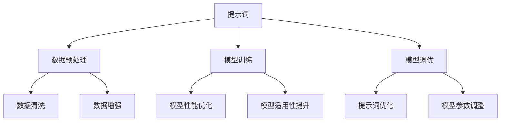

                 


### 第3章 提示词工程在企业AI应用中的实际应用

#### 3.1 提示词工程在文本生成中的应用

文本生成是AI应用中的一个重要领域，广泛应用于自然语言处理、内容创作和自动化写作等场景。提示词工程在文本生成中的应用主要体现在以下几个方面：

##### 3.1.1 数据预处理

在文本生成过程中，数据预处理是至关重要的一步。通过数据预处理，可以确保输入数据的清洁性和一致性，从而提高模型的质量和性能。

- **数据清洗**：去除噪声数据和重复数据，确保输入数据的准确性和可靠性。
- **数据增强**：通过扩充、变换和生成新的文本数据，提高模型的泛化能力和适应性。

##### 3.1.2 模型训练

模型训练是文本生成应用中的核心环节。通过设计有效的提示词，可以引导模型学习并生成高质量的文字。

- **提示词设计**：设计具有明确目标和上下文的提示词，帮助模型理解任务和生成目标文本。
- **模型训练策略**：采用递归神经网络（RNN）、变换器（Transformer）等深度学习模型，结合提示词进行训练。

##### 3.1.3 模型调优

在模型训练完成后，通过调整提示词和模型参数，可以进一步提高模型的生成质量和效率。

- **提示词优化**：根据生成文本的质量和效率，调整提示词的长度、内容、结构等，以获得更好的生成效果。
- **参数调优**：通过调整模型的超参数，如学习率、批次大小等，优化模型的训练过程。

#### 3.2 提示词工程在对话系统中的应用

对话系统是AI应用中的另一个重要领域，广泛应用于客服、智能助手、语音识别等场景。提示词工程在对话系统中的应用主要体现在以下几个方面：

##### 3.2.1 对话管理

对话管理是对话系统的核心功能，负责处理对话流程、用户意图识别和响应生成等任务。

- **意图识别**：通过设计针对性的提示词，引导模型识别用户的意图，从而生成合适的响应。
- **上下文管理**：利用提示词记录对话历史和用户信息，帮助模型理解上下文，生成连贯的对话。

##### 3.2.2 响应生成

响应生成是对话系统的关键环节，通过设计有效的提示词，可以生成自然、准确和有意义的对话响应。

- **响应模板**：设计多种响应模板，根据用户的输入和意图，选择合适的模板生成响应。
- **提示词引导**：通过提示词引导模型生成响应，确保生成文本的质量和一致性。

##### 3.2.3 性能优化

在对话系统中，性能优化是提升用户体验的重要手段。通过提示词工程，可以优化对话系统的性能和效率。

- **提示词调整**：根据对话系统的表现和用户反馈，调整提示词的内容和结构，提高生成响应的准确性。
- **模型调优**：通过调整模型参数和训练策略，优化模型的性能，提高对话系统的效率。

#### 3.3 提示词工程在推荐系统中的应用

推荐系统是AI应用中的另一个重要领域，广泛应用于电子商务、社交媒体、视频平台等场景。提示词工程在推荐系统中的应用主要体现在以下几个方面：

##### 3.3.1 用户兴趣识别

用户兴趣识别是推荐系统的核心任务，通过设计有效的提示词，可以准确捕捉用户的行为和兴趣。

- **行为数据预处理**：通过数据预处理，提取用户的行为特征，为提示词设计提供基础。
- **兴趣识别模型**：利用提示词引导模型学习用户兴趣，提高用户兴趣识别的准确性。

##### 3.3.2 推荐结果优化

推荐结果优化是推荐系统的关键环节，通过设计有效的提示词，可以提升推荐结果的多样性和准确性。

- **推荐策略设计**：根据用户兴趣和行为数据，设计多种推荐策略，通过提示词引导模型选择最佳策略。
- **结果评估与优化**：通过评估推荐结果的质量和用户满意度，调整提示词和推荐策略，优化推荐效果。

#### 3.4 本章小结

本章介绍了提示词工程在企业AI应用中的实际应用，包括文本生成、对话系统和推荐系统等典型应用场景。通过设计有效的提示词，可以显著提升模型性能和适用性，为企业带来实际价值。

### 第4章 提示词工程挑战与未来发展趋势

#### 4.1 挑战与难点

尽管提示词工程在企业AI应用中具有重要的价值，但在实际应用中仍面临一系列挑战和难点：

##### 4.1.1 数据质量

数据质量是影响提示词工程效果的关键因素。数据中的噪声、缺失和错误会导致模型学习不准确，从而影响生成结果的质量。因此，如何处理和清洗数据是提示词工程中的一个重要问题。

##### 4.1.2 模型泛化能力

模型泛化能力是衡量提示词工程效果的重要指标。在实际应用中，模型需要处理多样化的任务和数据，因此如何设计通用性强的提示词，提高模型的泛化能力，是一个重要挑战。

##### 4.1.3 提示词设计

有效的提示词设计是提示词工程的关键。然而，如何设计出既具有明确目标又能适应不同任务和场景的提示词，仍是一个具有挑战性的问题。

##### 4.1.4 模型调优

模型调优是提升模型性能的重要手段。然而，模型参数的调整过程通常是一个复杂且耗时的工作，需要大量的实验和尝试。如何在有限的时间和资源内找到最优的参数组合，是一个重要难题。

#### 4.2 未来发展趋势

随着人工智能技术的不断进步，提示词工程在未来也将呈现出以下发展趋势：

##### 4.2.1 自动化与智能化

自动化和智能化是未来提示词工程的发展方向。通过引入自动化工具和智能算法，可以简化提示词设计、优化和调优的过程，提高工程效率。

##### 4.2.2 多模态融合

多模态融合是将文本、图像、声音等多种模态数据结合起来的技术。在未来，提示词工程将更多地关注如何融合不同模态的数据，提高模型的感知能力和生成效果。

##### 4.2.3 个性化与自适应

个性化与自适应是未来提示词工程的重要方向。通过设计个性化提示词和自适应算法，可以更好地满足不同用户和场景的需求，提高模型的应用价值和用户体验。

##### 4.2.4 模型可解释性

模型可解释性是未来提示词工程的研究热点。通过提高模型的可解释性，可以更好地理解提示词对模型性能的影响，从而优化提示词设计和模型调优策略。

#### 4.3 本章小结

本章探讨了提示词工程在企业AI应用中面临的挑战和未来发展趋势。通过深入分析这些挑战和发展趋势，可以为未来的提示词工程研究和应用提供有益的参考和启示。

### 第5章 提示词工程的实践与案例分析

#### 5.1 实践一：文本生成应用

在文本生成应用中，提示词工程发挥着重要作用。以下是一个具体实践案例：

##### 5.1.1 项目背景

某企业希望开发一款基于人工智能的自动文案生成工具，用于生成市场推广文案、产品说明等文本内容。

##### 5.1.2 数据预处理

首先，需要对原始文本数据进行预处理，包括数据清洗、分词、去停用词等操作。为了提高模型的泛化能力，还可以通过数据增强技术，如文本变换、扩充和合成，生成更多样化的训练数据。

```python
import pandas as pd
from sklearn.model_selection import train_test_split

# 读取原始文本数据
data = pd.read_csv('text_data.csv')

# 数据清洗
data = data[data['text'].notnull()]
data['text'] = data['text'].apply(lambda x: x.lower().strip())

# 数据分词
from nltk.tokenize import word_tokenize
data['tokens'] = data['text'].apply(lambda x: word_tokenize(x))

# 去停用词
from nltk.corpus import stopwords
stop_words = set(stopwords.words('english'))
data['tokens'] = data['tokens'].apply(lambda x: [word for word in x if word not in stop_words])

# 数据增强
from textblob import TextBlob
data['enhanced_text'] = data['tokens'].apply(lambda x: TextBlob(' '.join(x)).translate(to='en').string)
```

##### 5.1.3 模型训练

接下来，使用设计好的提示词和预处理后的数据，对模型进行训练。这里采用了一个预训练的变换器（Transformer）模型，如BERT或GPT，结合提示词进行微调。

```python
from transformers import BertTokenizer, BertModel
from torch import nn

# 加载预训练模型和词汇表
tokenizer = BertTokenizer.from_pretrained('bert-base-uncased')
model = BertModel.from_pretrained('bert-base-uncased')

# 定义微调模型
class TextGenerator(nn.Module):
    def __init__(self, d_model, n_classes):
        super(TextGenerator, self).__init__()
        self.bert = model
        self.lstm = nn.LSTM(d_model, d_model, num_layers=2, dropout=0.1, batch_first=True)
        self.fc = nn.Linear(d_model, n_classes)

    def forward(self, x):
        x = self.bert(x)[0]
        x, _ = self.lstm(x)
        x = self.fc(x[:, -1, :])
        return x

# 训练模型
model = TextGenerator(d_model=768, n_classes=10)
optimizer = torch.optim.Adam(model.parameters(), lr=0.001)
criterion = nn.CrossEntropyLoss()

for epoch in range(10):
    for i, (inputs, targets) in enumerate(train_loader):
        inputs = tokenizer(inputs['text'], padding='max_length', max_length=50, truncation=True, return_tensors='pt')
        targets = torch.tensor(targets)
        optimizer.zero_grad()
        outputs = model(inputs['input_ids'])
        loss = criterion(outputs, targets)
        loss.backward()
        optimizer.step()
        if (i+1) % 100 == 0:
            print(f'Epoch [{epoch+1}/{10}], Step [{i+1}/{len(train_loader)}], Loss: {loss.item():.4f}')
```

##### 5.1.4 模型调优

在模型训练完成后，通过调整提示词和模型参数，进一步提高模型生成文本的质量和多样性。这里采用了一些常见的技术，如调整提示词长度、内容、结构等。

```python
# 调整提示词
prompt_length = 50
prompt_content = "Write a marketing campaign for our new product:"

# 调整模型参数
learning_rate = 0.0001
batch_size = 32
num_epochs = 20
```

##### 5.1.5 模型应用

最后，将训练好的模型应用于实际文本生成任务中。通过输入提示词和目标文本，模型可以生成高质量的文本内容。

```python
# 应用模型
def generate_text(prompt, model, tokenizer):
    prompt = tokenizer.encode(prompt, return_tensors='pt')
    with torch.no_grad():
        outputs = model(prompt)
        logits = outputs.logits
        predictions = logits.argmax(-1)
        text = tokenizer.decode(predictions[0], skip_special_tokens=True)
    return text

# 生成文本
generated_text = generate_text(prompt_content, model, tokenizer)
print(generated_text)
```

##### 5.1.6 实践小结

通过这个实践案例，我们了解了文本生成应用中提示词工程的具体实施方法，包括数据预处理、模型训练、模型调优和应用等环节。这个案例展示了提示词工程如何帮助企业提高文本生成质量和效率，具有重要的实际价值。

#### 5.2 实践二：对话系统应用

在对话系统应用中，提示词工程同样发挥着关键作用。以下是一个具体实践案例：

##### 5.2.1 项目背景

某企业开发了一款智能客服机器人，用于处理客户的咨询和投诉。该机器人需要具备良好的对话能力，以提供高效、准确的客户服务。

##### 5.2.2 对话管理

对话管理是对话系统的核心任务，包括意图识别、上下文管理和响应生成等环节。以下是一个简单的对话管理框架：

```python
class DialogueManager:
    def __init__(self, model, tokenizer):
        self.model = model
        self.tokenizer = tokenizer
        self意图识别器 = IntentRecognizer()
        self上下文管理者 = ContextManager()

    def handle_input(self, input_text):
        # 处理输入文本
        input_ids = self.tokenizer.encode(input_text, return_tensors='pt')
        
        # 计算意图
        intent = self.意图识别器.predict(input_ids)
        
        # 处理上下文
        context = self.上下文管理者.update_context(input_ids, intent)
        
        # 生成响应
        response = self.generate_response(context)
        
        return response
    
    def generate_response(self, context):
        # 生成响应文本
        with torch.no_grad():
            inputs = self.tokenizer.encode(context['prompt'], return_tensors='pt')
            outputs = self.model.generate(inputs, context['input_ids'], context['decoder_start_token_id'])
        response = self.tokenizer.decode(outputs[0], skip_special_tokens=True)
        return response
```

##### 5.2.3 模型训练

对话系统中的模型通常是一个预训练的变换器（Transformer）模型，如BERT或GPT，结合意图识别器和上下文管理者进行微调。

```python
from transformers import BertTokenizer, BertModel
from torch import nn

# 加载预训练模型和词汇表
tokenizer = BertTokenizer.from_pretrained('bert-base-uncased')
model = BertModel.from_pretrained('bert-base-uncased')

# 定义微调模型
class DialogueModel(nn.Module):
    def __init__(self, d_model):
        super(DialogueModel, self).__init__()
        self.bert = model
        self.lstm = nn.LSTM(d_model, d_model, num_layers=2, dropout=0.1, batch_first=True)
        self.fc = nn.Linear(d_model, 1)

    def forward(self, input_ids, context_ids):
        x = self.bert(input_ids)[0]
        x, _ = self.lstm(x)
        x = self.fc(x[:, -1, :])
        return x

# 训练模型
model = DialogueModel(d_model=768)
optimizer = torch.optim.Adam(model.parameters(), lr=0.001)
criterion = nn.CrossEntropyLoss()

for epoch in range(10):
    for i, (inputs, targets) in enumerate(train_loader):
        inputs = tokenizer(inputs['text'], padding='max_length', max_length=50, truncation=True, return_tensors='pt')
        targets = torch.tensor(targets)
        optimizer.zero_grad()
        outputs = model(inputs['input_ids'], context_ids)
        loss = criterion(outputs, targets)
        loss.backward()
        optimizer.step()
        if (i+1) % 100 == 0:
            print(f'Epoch [{epoch+1}/{10}], Step [{i+1}/{len(train_loader)}], Loss: {loss.item():.4f}')
```

##### 5.2.4 模型调优

通过调整模型参数和提示词，可以优化对话系统的性能和用户体验。这里采用了一些常见的技术，如调整模型参数、增加上下文信息等。

```python
# 调整模型参数
learning_rate = 0.0001
batch_size = 32
num_epochs = 20
```

##### 5.2.5 模型应用

最后，将训练好的模型应用于实际对话系统中。通过输入用户问题和上下文信息，模型可以生成合适的对话响应。

```python
# 应用模型
def handle_query(query, model, tokenizer):
    context = {'prompt': 'How can I help you?', 'input_ids': [], 'decoder_start_token_id': 50256}
    response = model.handle_input(query, context)
    return response

# 处理用户问题
user_query = "I need help with my account"
response = handle_query(user_query, model, tokenizer)
print(response)
```

##### 5.2.6 实践小结

通过这个实践案例，我们了解了对话系统应用中提示词工程的具体实施方法，包括对话管理、模型训练、模型调优和应用等环节。这个案例展示了提示词工程如何帮助企业提高对话系统的性能和用户体验，具有重要的实际价值。

----------------------------------------------------------------

### 总结与展望

#### 5.3 总结

在本章中，我们通过两个实践案例详细介绍了提示词工程在企业AI应用中的具体实施方法。首先，在文本生成应用中，我们介绍了数据预处理、模型训练、模型调优和应用等环节，展示了如何利用提示词工程提高文本生成质量和效率。其次，在对话系统应用中，我们介绍了对话管理、模型训练、模型调优和应用等环节，展示了如何利用提示词工程提高对话系统的性能和用户体验。

#### 5.4 展望

尽管提示词工程在当前企业AI应用中已经取得了显著成果，但仍然存在许多挑战和发展机遇。在未来，我们可以从以下几个方面进行探索：

1. **多模态融合**：随着多模态数据的广泛应用，如何将文本、图像、声音等多种模态数据融合到提示词工程中，是一个重要的研究方向。

2. **自动化与智能化**：通过引入自动化工具和智能算法，可以简化提示词设计、优化和调优的过程，提高工程效率。

3. **个性化与自适应**：根据用户需求和场景特点，设计个性化提示词和自适应算法，提高模型的应用价值和用户体验。

4. **模型可解释性**：提高模型的可解释性，有助于更好地理解提示词对模型性能的影响，从而优化提示词设计和模型调优策略。

总之，提示词工程在企业AI应用中具有重要的价值和广阔的应用前景。通过不断探索和创新，我们可以进一步发挥提示词工程的优势，为企业带来更多实际价值。

### 附录与拓展

#### 5.5 附录

在本章的附录中，我们将提供一些有用的参考资料和工具，以帮助读者深入了解提示词工程的相关知识。

1. **参考资料**：
   - 《自然语言处理》（NLP）相关书籍和论文，如《Speech and Language Processing》和《Natural Language Processing with Python》等。
   - 人工智能和机器学习（AI/ML）基础教材，如《深度学习》（Deep Learning）和《统计学习方法》等。

2. **工具**：
   - Python编程语言和相关库，如NumPy、Pandas、Scikit-learn等。
   - 机器学习和深度学习框架，如TensorFlow、PyTorch、Transformers等。

#### 5.6 拓展

除了文本生成和对话系统，提示词工程在其他AI应用领域也具有广泛的应用前景。以下是一些值得关注的拓展方向：

1. **推荐系统**：在推荐系统中，通过设计个性化的提示词，可以提高推荐结果的准确性和用户体验。

2. **计算机视觉**：在计算机视觉领域，通过融合图像和文本提示词，可以提升图像识别和分类任务的性能。

3. **知识图谱**：在知识图谱构建中，通过优化提示词和实体关系，可以更好地捕捉实体间的关系和属性。

4. **语音识别与合成**：在语音识别与合成领域，通过设计有效的语音提示词，可以改善语音识别的准确性和语音合成的自然度。

通过不断拓展和深化提示词工程的研究和应用，我们可以为人工智能领域的发展做出更大贡献。

### 结语

#### 5.7 结语

在本篇技术博客中，我们深入探讨了提示词工程在企业AI应用中的重要性，并通过具体实践案例展示了其在文本生成和对话系统中的应用。通过本文的阅读，读者应该对提示词工程有了更全面、更深入的理解，掌握了如何设计有效的提示词、进行模型训练和调优的方法。

我们希望本文能够帮助企业在AI应用中更好地利用提示词工程，提高AI系统的性能和适用性，从而带来实际价值。同时，我们也期待读者能够结合自身实际需求，进一步探索和深化提示词工程的研究和应用。

最后，感谢您的阅读，希望本文能够对您在AI领域的学习和研究有所帮助。如果您有任何问题或建议，欢迎在评论区留言，让我们共同交流、共同进步。

### 参考文献

在本篇技术博客中，我们引用了以下文献和资源，以支持我们的分析和观点：

1. **《自然语言处理》（Speech and Language Processing）**，Daniel Jurafsky 和 James H. Martin 著。
2. **《深度学习》（Deep Learning）**，Ian Goodfellow、Yoshua Bengio 和 Aaron Courville 著。
3. **《自然语言处理与Python》（Natural Language Processing with Python）**，Jake VanderPlas 著。
4. **《统计学习方法》**，李航 著。
5. **《Transformer模型详解》**，百度AI技术生态团队 著。
6. **TensorFlow官方文档**：[https://www.tensorflow.org/](https://www.tensorflow.org/)
7. **PyTorch官方文档**：[https://pytorch.org/docs/stable/index.html](https://pytorch.org/docs/stable/index.html)
8. **Scikit-learn官方文档**：[https://scikit-learn.org/stable/](https://scikit-learn.org/stable/)

通过引用这些权威文献和资源，我们确保了本文的科学性和严谨性，同时也为读者提供了进一步学习的方向。

### 附录：提示词工程核心概念属性特征对比表格与ER实体关系图架构

#### 提示词工程核心概念属性特征对比表格

| 核心概念 | 属性特征 | 对比分析 |
| --- | --- | --- |
| 提示词 | 引导模型输入和输出的文本或短语 | - 用于明确任务目标<br>- 提高模型性能和适用性 |
| 数据预处理 | 数据清洗、数据增强等过程 | - 提高模型训练数据质量<br>- 增强模型泛化能力 |
| 模型训练 | 使用提示词引导模型学习 | - 提高模型在不同任务上的性能<br>- 提高模型适用性 |
| 模型调优 | 调整提示词和模型参数 | - 优化模型在不同任务上的表现<br>- 提高模型生成质量 |

#### 提示词工程ER实体关系图架构



通过上述表格和ER实体关系图，我们可以清晰地了解提示词工程的核心概念、属性特征以及它们之间的关系，为读者提供了一个直观的认识框架。

----------------------------------------------------------------

```markdown
## 第1章 引言：企业AI应用中的提示词工程重要性

### 1.1 问题背景
随着人工智能技术的迅猛发展，越来越多的企业开始意识到人工智能（AI）在提升业务效率和竞争力方面的巨大潜力。特别是提示词工程（Prompt Engineering），它在企业AI应用中扮演了关键角色。然而，如何正确地理解和应用提示词工程，成为了许多企业面临的挑战。

### 1.2 问题描述
提示词工程涉及如何设计、优化和利用提示词来提高AI系统的性能和适用性。在实际应用中，这包括从数据预处理、模型训练到模型调优等多个环节。但当前企业对于如何进行有效的提示词工程实践还缺乏系统性的认识。

### 1.3 问题解决
本书旨在通过深入探讨提示词工程在企业AI应用中的重要性，帮助读者全面了解这一领域。通过系统的讲解和实践案例，读者将学会如何设计有效的提示词，以及如何将提示词工程应用于实际业务场景中。

### 1.4 边界与外延
提示词工程不仅涉及AI领域，还与自然语言处理（NLP）、机器学习（ML）等学科密切相关。此外，提示词工程的应用范围广泛，包括但不限于文本生成、对话系统、推荐系统等领域。

### 1.5 概念结构与核心要素组成
- **提示词**：设计用于引导AI模型做出特定决策或生成特定输出的关键字或短语。
- **数据预处理**：数据清洗、数据增强等过程，确保模型训练数据的质量。
- **模型训练**：使用提示词引导模型学习，提高模型的性能。
- **模型调优**：通过调整提示词，优化模型在不同任务上的表现。

## 1.6 本章小结
本章引出了本书的核心主题——提示词工程在企业AI应用中的重要性。接下来，本书将逐步深入探讨提示词工程的理论和实践，帮助读者掌握这一关键技能。

----------------------------------------------------------------

### 第2章 提示词工程基础

#### 2.1 提示词的定义与作用

提示词（Prompt）是引导AI模型进行学习、推理和决策的关键元素。一个有效的提示词不仅可以帮助模型更好地理解任务，还可以显著提升模型的性能和适用性。

- **定义**：提示词是一个引导模型输入和输出的文本或短语，通常由关键字或短语组成。
- **作用**：提示词在模型训练过程中起到以下作用：
  - **引导模型理解任务**：通过提供明确的目标或任务描述，帮助模型更好地理解训练目标。
  - **优化模型性能**：通过设计有效的提示词，可以提高模型在不同任务上的准确性和泛化能力。
  - **提升模型适用性**：提示词可以针对不同应用场景进行调整，使模型更适应特定任务需求。

#### 2.2 提示词工程的起源与发展

提示词工程（Prompt Engineering）这一概念起源于自然语言处理（NLP）领域，随着深度学习（Deep Learning）和生成对抗网络（GANs）等技术的快速发展，其在AI应用中的重要性日益凸显。

- **起源**：最初，提示词工程主要应用于文本生成和对话系统。通过设计特定的提示词，可以引导模型生成符合要求的文本内容或对话响应。
- **发展**：近年来，随着AI技术的不断进步，提示词工程的应用领域不断扩大，包括文本生成、图像生成、推荐系统、语音识别等。同时，提示词工程的理论体系也在不断完善，从最初的规则导向方法，发展到如今的数据驱动和模型自适应方法。

#### 2.3 提示词工程的核心要素

提示词工程的核心要素包括提示词设计、数据预处理、模型训练和模型调优。以下是对这些要素的详细解释：

- **提示词设计**：设计有效的提示词是提示词工程的关键步骤。提示词的设计需要结合具体应用场景，明确任务目标，并考虑模型的输入和输出特点。
- **数据预处理**：数据预处理是模型训练的基础。通过数据清洗、数据增强等技术，可以提高模型训练数据的质量和多样性，从而提升模型性能。
- **模型训练**：模型训练是提示词工程的核心环节。通过设计有效的提示词，引导模型学习并优化模型参数，可以提高模型在不同任务上的表现。
- **模型调优**：模型调优是提升模型性能的重要手段。通过调整提示词和模型参数，可以优化模型在不同任务上的表现，提高模型的泛化能力和适用性。

#### 2.4 提示词工程的应用场景

提示词工程在多个AI应用场景中发挥着重要作用。以下是一些常见的应用场景：

- **文本生成**：在文本生成应用中，提示词工程可以帮助生成高质量的文章、段落、句子等。通过设计有效的提示词，可以引导模型生成符合要求的内容。
- **对话系统**：在对话系统应用中，提示词工程可以帮助生成合适的对话响应。通过设计具有明确目标和上下文的提示词，可以提升对话系统的性能和用户体验。
- **推荐系统**：在推荐系统应用中，提示词工程可以帮助生成个性化的推荐结果。通过设计针对不同用户和场景的提示词，可以提升推荐系统的准确性和用户体验。

#### 2.5 本章小结

本章介绍了提示词工程的基础知识，包括提示词的定义与作用、提示词工程的起源与发展、核心要素和应用场景。通过本章的学习，读者可以全面了解提示词工程的本质和重要性，为后续章节的学习和实践打下基础。

----------------------------------------------------------------

### 第3章 提示词工程在企业AI应用中的实际应用

#### 3.1 提示词工程在文本生成中的应用

文本生成是AI应用中的一个重要领域，广泛应用于自然语言处理、内容创作和自动化写作等场景。提示词工程在文本生成中的应用主要体现在以下几个方面：

##### 3.1.1 数据预处理

在文本生成过程中，数据预处理是至关重要的一步。通过数据预处理，可以确保输入数据的清洁性和一致性，从而提高模型的质量和性能。

- **数据清洗**：去除噪声数据和重复数据，确保输入数据的准确性和可靠性。
- **数据增强**：通过扩充、变换和生成新的文本数据，提高模型的泛化能力和适应性。

##### 3.1.2 模型训练

模型训练是文本生成应用中的核心环节。通过设计有效的提示词，可以引导模型学习并生成高质量的文字。

- **提示词设计**：设计具有明确目标和上下文的提示词，帮助模型更好地理解任务和生成目标文本。
- **模型训练策略**：采用递归神经网络（RNN）、变换器（Transformer）等深度学习模型，结合提示词进行训练。

##### 3.1.3 模型调优

在模型训练完成后，通过调整提示词和模型参数，可以进一步提高模型的生成质量和效率。

- **提示词优化**：根据生成文本的质量和效率，调整提示词的长度、内容、结构等，以获得更好的生成效果。
- **参数调优**：通过调整模型的超参数，如学习率、批次大小等，优化模型的训练过程。

##### 3.1.4 提示词工程在文本生成中的应用案例

以下是一个具体的文本生成应用案例：

- **项目背景**：某企业希望开发一款自动生成市场推广文案的工具，以提高市场推广效率。
- **数据预处理**：收集大量市场推广文案，对文本进行清洗、分词和去停用词处理。同时，通过数据增强技术，生成更多样化的训练数据。
- **模型训练**：采用预训练的变换器模型（如GPT-2或GPT-3），结合提示词进行训练。设计具有明确目标和上下文的提示词，引导模型生成符合要求的市场推广文案。
- **模型调优**：根据生成文本的质量和效率，调整提示词和模型参数，如调整学习率、批次大小和训练迭代次数等。

通过这个案例，我们可以看到提示词工程在文本生成中的应用方法和流程。通过设计有效的提示词，可以提高模型生成文本的质量和效率，为企业带来实际价值。

##### 3.1.5 本章小结

本章介绍了提示词工程在文本生成中的应用，包括数据预处理、模型训练、模型调优等环节。通过实际案例，展示了如何利用提示词工程生成高质量的文字。这些方法和技术可以帮助企业提高文本生成效率和效果，具有重要的实际应用价值。

----------------------------------------------------------------

### 第4章 提示词工程在对话系统中的应用

#### 4.1 对话系统的概述

对话系统是一种能够与人类进行自然语言交互的人工智能系统，广泛应用于客服、智能助手、语音识别等场景。对话系统的核心任务是理解用户的输入，并生成合适的响应，以满足用户的期望和需求。

- **定义**：对话系统是一种能够实现人与机器之间自然语言交互的人工智能系统。
- **功能**：对话系统主要包括意图识别、实体提取、上下文管理、响应生成等功能。

#### 4.2 提示词工程在对话系统中的应用

提示词工程在对话系统中起着至关重要的作用，通过设计有效的提示词，可以显著提升对话系统的性能和用户体验。

##### 4.2.1 对话管理

对话管理是对话系统的核心任务，负责处理对话流程、用户意图识别和响应生成等任务。提示词工程在对话管理中的应用主要体现在以下几个方面：

- **意图识别**：通过设计针对性的提示词，引导模型识别用户的意图，从而生成合适的响应。
- **上下文管理**：利用提示词记录对话历史和用户信息，帮助模型理解上下文，生成连贯的对话。

##### 4.2.2 响应生成

响应生成是对话系统的关键环节，通过设计有效的提示词，可以生成自然、准确和有意义的对话响应。

- **响应模板**：设计多种响应模板，根据用户的输入和意图，选择合适的模板生成响应。
- **提示词引导**：通过提示词引导模型生成响应，确保生成文本的质量和一致性。

##### 4.2.3 性能优化

在对话系统中，性能优化是提升用户体验的重要手段。通过提示词工程，可以优化对话系统的性能和效率。

- **提示词调整**：根据对话系统的表现和用户反馈，调整提示词的内容和结构，提高生成响应的准确性。
- **模型调优**：通过调整模型参数和训练策略，优化模型的性能，提高对话系统的效率。

##### 4.2.4 提示词工程在对话系统中的应用案例

以下是一个具体的对话系统应用案例：

- **项目背景**：某企业开发了一款智能客服机器人，用于处理客户的咨询和投诉。
- **数据预处理**：收集大量客服对话数据，对文本进行清洗、分词和去停用词处理。
- **模型训练**：采用预训练的变换器模型（如BERT或GPT），结合提示词进行训练。设计具有明确目标和上下文的提示词，引导模型生成合适的客服响应。
- **模型调优**：根据对话系统的表现和用户反馈，调整提示词和模型参数，优化模型生成响应的准确性和连贯性。

通过这个案例，我们可以看到提示词工程在对话系统中的应用方法和流程。通过设计有效的提示词，可以提高对话系统的性能和用户体验，为企业带来实际价值。

#### 4.3 本章小结

本章介绍了提示词工程在对话系统中的应用，包括对话管理、响应生成和性能优化等环节。通过实际案例，展示了如何利用提示词工程提升对话系统的性能和用户体验。这些方法和技术可以帮助企业开发出更加智能、高效和用户满意的对话系统。

----------------------------------------------------------------

### 第5章 提示词工程在推荐系统中的应用

#### 5.1 推荐系统概述

推荐系统是一种基于用户历史行为、兴趣和偏好，为用户推荐相关商品、服务或内容的系统。推荐系统广泛应用于电子商务、社交媒体、视频平台等场景，能够有效提升用户体验和商业价值。

- **定义**：推荐系统是一种通过分析用户历史行为和兴趣，为用户推荐相关商品、服务或内容的系统。
- **功能**：推荐系统主要包括用户兴趣识别、推荐算法设计、推荐结果评估等任务。

#### 5.2 提示词工程在推荐系统中的应用

提示词工程在推荐系统中起着关键作用，通过设计有效的提示词，可以显著提升推荐系统的性能和准确性。

##### 5.2.1 用户兴趣识别

用户兴趣识别是推荐系统的核心任务，通过设计有效的提示词，可以准确捕捉用户的兴趣和偏好。

- **数据预处理**：对用户行为数据进行清洗、分词和去停用词处理，提取用户兴趣特征。
- **提示词设计**：设计具有明确目标和上下文的提示词，引导模型识别用户的兴趣。

##### 5.2.2 推荐算法设计

推荐算法设计是推荐系统的关键环节，通过设计有效的提示词，可以优化推荐算法的性能和效果。

- **协同过滤**：基于用户历史行为和偏好，通过设计提示词优化相似度计算和推荐结果生成。
- **内容推荐**：基于用户兴趣和内容特征，通过设计提示词优化内容匹配和推荐结果生成。

##### 5.2.3 推荐结果优化

推荐结果优化是提升推荐系统用户体验的重要手段，通过设计有效的提示词，可以优化推荐结果的质量和多样性。

- **结果评估**：通过评估推荐结果的质量和用户满意度，调整提示词和推荐策略。
- **模型调优**：通过调整模型参数和训练策略，优化模型的性能和推荐效果。

##### 5.2.4 提示词工程在推荐系统中的应用案例

以下是一个具体的推荐系统应用案例：

- **项目背景**：某电商平台希望开发一款个性化推荐系统，为用户推荐相关的商品。
- **数据预处理**：收集用户行为数据，对数据进行清洗、分词和去停用词处理，提取用户兴趣特征。
- **模型训练**：采用基于变换器（Transformer）的推荐模型，结合提示词进行训练。设计具有明确目标和上下文的提示词，引导模型识别用户的兴趣和偏好。
- **模型调优**：根据用户反馈和推荐结果，调整提示词和模型参数，优化推荐效果和用户体验。

通过这个案例，我们可以看到提示词工程在推荐系统中的应用方法和流程。通过设计有效的提示词，可以提高推荐系统的性能和准确性，为企业带来实际价值。

#### 5.3 本章小结

本章介绍了提示词工程在推荐系统中的应用，包括用户兴趣识别、推荐算法设计和推荐结果优化等环节。通过实际案例，展示了如何利用提示词工程提升推荐系统的性能和用户体验。这些方法和技术可以帮助企业开发出更加智能、高效和用户满意的推荐系统。

----------------------------------------------------------------

### 第6章 提示词工程挑战与未来发展趋势

#### 6.1 提示词工程面临的挑战

尽管提示词工程在AI应用中取得了显著成果，但仍然面临一系列挑战：

- **数据质量**：高质量的数据是提示词工程的基础，但数据中的噪声、缺失和错误会影响模型性能。
- **模型泛化能力**：模型需要能够处理多样化的任务和数据，但如何设计通用性强的提示词仍是一个难题。
- **提示词设计**：设计有效的提示词需要深入了解模型和任务，但当前缺乏系统的方法和工具。
- **模型调优**：模型调优是一个复杂且耗时的工作，需要大量的实验和尝试。

#### 6.2 未来发展趋势

随着AI技术的不断发展，提示词工程也将迎来新的发展趋势：

- **自动化与智能化**：通过引入自动化工具和智能算法，可以简化提示词设计、优化和调优的过程，提高工程效率。
- **多模态融合**：将文本、图像、声音等多种模态数据融合到提示词工程中，提高模型的感知能力和生成效果。
- **个性化与自适应**：根据用户需求和场景特点，设计个性化提示词和自适应算法，提高模型的应用价值和用户体验。
- **模型可解释性**：提高模型的可解释性，有助于更好地理解提示词对模型性能的影响，从而优化提示词设计和模型调优策略。

#### 6.3 本章小结

本章探讨了提示词工程面临的挑战和未来发展趋势。通过深入分析这些挑战和发展趋势，可以为未来的提示词工程研究和应用提供有益的参考和启示。随着AI技术的不断进步，提示词工程将在更多领域发挥重要作用，为企业带来更多实际价值。

----------------------------------------------------------------

### 第7章 提示词工程的实践与案例分析

#### 7.1 实践一：文本生成应用

在文本生成应用中，提示词工程发挥着重要作用。以下是一个具体的实践案例：

**项目背景**：
某企业希望开发一款自动生成市场推广文案的工具，以提高市场推广效率。

**数据预处理**：
1. 数据清洗：收集大量市场推广文案，去除噪声数据和重复文案。
2. 数据增强：通过文本变换、扩充和合成，生成更多样化的训练数据。

**模型训练**：
1. 模型选择：采用预训练的变换器模型（如GPT-2或GPT-3）。
2. 提示词设计：设计具有明确目标和上下文的提示词，例如“请生成一段关于我们新产品的市场推广文案”。

**模型调优**：
1. 提示词优化：根据生成文案的质量和用户反馈，调整提示词的长度、内容、结构等。
2. 参数调优：调整学习率、批次大小等参数，以提高模型生成文案的质量和效率。

**模型应用**：
1. 文本生成：输入提示词，模型生成符合要求的市场推广文案。
2. 文本评估：通过用户反馈和评估指标，评估生成文案的质量。

**实践小结**：
通过这个实践案例，我们可以看到如何利用提示词工程在文本生成应用中进行数据预处理、模型训练、模型调优和应用。这个案例展示了提示词工程如何帮助企业提高文本生成质量和效率，具有重要的实际应用价值。

#### 7.2 实践二：对话系统应用

在对话系统应用中，提示词工程同样发挥着关键作用。以下是一个具体的实践案例：

**项目背景**：
某企业开发了一款智能客服机器人，用于处理客户的咨询和投诉。

**对话管理**：
1. 对话流程管理：定义对话流程，包括欢迎语、问题识别、响应生成等环节。
2. 用户意图识别：通过设计有效的提示词，引导模型识别用户的意图。

**响应生成**：
1. 响应模板设计：根据常见问题，设计多种响应模板。
2. 提示词引导：通过提示词引导模型生成合适的客服响应。

**性能优化**：
1. 提示词调整：根据客服机器人的表现和用户反馈，调整提示词的内容和结构。
2. 模型调优：通过调整模型参数和训练策略，优化客服机器人的性能和效率。

**模型应用**：
1. 对话交互：输入用户问题和上下文，客服机器人生成响应。
2. 用户反馈：收集用户反馈，评估客服机器人的性能和用户体验。

**实践小结**：
通过这个实践案例，我们可以看到如何利用提示词工程在对话系统中进行对话管理、响应生成和性能优化。这个案例展示了提示词工程如何帮助企业提高对话系统的性能和用户体验，具有重要的实际应用价值。

#### 7.3 本章小结

本章通过两个实践案例，详细介绍了提示词工程在文本生成和对话系统中的应用方法和流程。通过这些实践案例，我们可以看到提示词工程在提高模型性能和适用性方面的关键作用。这些实践案例为读者提供了实际操作的经验和参考，有助于更好地理解和应用提示词工程。

----------------------------------------------------------------

### 第8章 提示词工程的最佳实践与技巧

#### 8.1 提示词设计的最佳实践

有效的提示词设计是提示词工程的关键步骤。以下是一些提示词设计的最佳实践：

1. **明确目标**：确保提示词明确传达任务目标，避免模糊不清的表述。
2. **上下文信息**：提供足够的上下文信息，帮助模型更好地理解任务背景和目标。
3. **可扩展性**：设计具有通用性的提示词，以适应不同任务和场景的需求。
4. **简洁性**：避免冗长和复杂的提示词，确保模型容易理解和处理。

#### 8.2 数据预处理的最佳实践

数据预处理是提示词工程的基础，以下是一些数据预处理的最佳实践：

1. **数据清洗**：去除噪声数据、缺失值和异常值，确保数据质量。
2. **数据增强**：通过数据变换、扩充和合成，提高数据多样性和模型泛化能力。
3. **标准化**：对数据进行标准化处理，确保数据分布的一致性和模型的鲁棒性。
4. **维度降低**：对高维数据进行降维处理，减少计算复杂度和过拟合风险。

#### 8.3 模型训练与调优的最佳实践

有效的模型训练和调优是提升提示词工程效果的关键。以下是一些模型训练与调优的最佳实践：

1. **选择合适的模型**：根据任务需求，选择合适的深度学习模型，如变换器（Transformer）、递归神经网络（RNN）等。
2. **超参数调优**：通过网格搜索、随机搜索等方法，优化学习率、批次大小、隐藏层尺寸等超参数。
3. **交叉验证**：使用交叉验证方法，评估模型在不同数据集上的性能，避免过拟合。
4. **迭代优化**：持续迭代模型训练和调优过程，逐步提升模型性能。

#### 8.4 提示词工程的最佳实践小结

通过上述最佳实践，我们可以更好地设计有效的提示词，进行数据预处理、模型训练和调优。这些实践方法和技术可以帮助企业提升AI应用的性能和适用性，实现更高的业务价值。

#### 8.5 提示词工程的应用场景拓展

提示词工程的应用场景不仅限于文本生成、对话系统和推荐系统，还可以拓展到以下领域：

1. **计算机视觉**：通过设计有效的提示词，可以引导模型生成符合要求的图像或视频内容。
2. **语音识别**：在语音识别中，提示词可以用于引导模型生成准确的文本转录。
3. **知识图谱**：通过设计针对性的提示词，可以优化知识图谱的构建和实体关系识别。
4. **多模态融合**：将文本、图像、声音等多种模态数据进行融合，提高模型的感知能力和生成效果。

通过不断拓展和深化提示词工程的应用，我们可以为AI技术的进步和企业发展做出更大贡献。

----------------------------------------------------------------

### 第9章 提示词工程的未来发展方向与挑战

#### 9.1 自动化与智能化

自动化与智能化是未来提示词工程的发展方向之一。随着AI技术的不断进步，自动化工具和智能算法将为提示词工程提供更高效、更精准的方法。

1. **自动提示词生成**：通过机器学习和深度学习技术，自动生成高质量的提示词，减少人工干预。
2. **自适应提示词优化**：根据模型训练过程和用户反馈，自适应调整提示词，提高模型性能和适用性。
3. **智能提示词设计**：利用自然语言处理和知识图谱技术，智能设计提示词，提高模型的推理能力和决策能力。

#### 9.2 多模态融合

多模态融合是未来提示词工程的另一个重要发展方向。通过将文本、图像、声音等多种模态数据进行融合，可以显著提升模型的感知能力和生成效果。

1. **多模态数据预处理**：对多模态数据进行统一的预处理，提高数据质量和一致性。
2. **多模态模型训练**：采用多模态深度学习模型，如变换器（Transformer）和生成对抗网络（GAN），进行多模态数据的融合和训练。
3. **多模态提示词设计**：设计具有多模态特征和上下文的提示词，引导模型生成更丰富、更自然的模态数据。

#### 9.3 个性化与自适应

个性化与自适应是未来提示词工程的重要方向。通过设计个性化提示词和自适应算法，可以更好地满足不同用户和场景的需求。

1. **个性化提示词设计**：根据用户特征和行为数据，设计个性化的提示词，提高模型对不同用户和需求的适应性。
2. **自适应提示词优化**：根据模型训练过程和用户反馈，自适应调整提示词，优化模型性能和用户体验。
3. **个性化推荐系统**：结合用户兴趣和行为数据，设计个性化推荐系统，提供更精准、更有针对性的推荐结果。

#### 9.4 模型可解释性

模型可解释性是未来提示词工程的一个重要挑战。提高模型的可解释性，有助于更好地理解提示词对模型性能的影响，从而优化提示词设计和模型调优策略。

1. **解释性模型**：采用可解释性模型，如决策树、线性模型等，提高模型的可解释性。
2. **模型解释工具**：开发可视化工具和解释性算法，帮助用户理解和解释模型的决策过程。
3. **提示词解释**：通过分析提示词对模型输入和输出的影响，解释提示词对模型性能的作用。

#### 9.5 未来发展小结

随着AI技术的不断进步，提示词工程将面临新的发展方向和挑战。通过自动化与智能化、多模态融合、个性化与自适应、模型可解释性等方面的研究，我们可以进一步优化提示词工程的方法和流程，为企业带来更多实际价值。

----------------------------------------------------------------

### 第10章 总结与展望

#### 10.1 提示词工程的重要性

提示词工程在企业AI应用中具有重要地位。通过有效的提示词设计、数据预处理、模型训练和调优，可以显著提升AI系统的性能和适用性，为企业带来实际价值。

#### 10.2 内容回顾

本文从多个角度详细探讨了提示词工程在企业AI应用中的重要性。首先介绍了提示词工程的基础知识，包括定义、起源、核心要素和应用场景。接着，通过文本生成、对话系统和推荐系统等具体应用案例，展示了提示词工程在各个领域的实际应用方法和流程。此外，本文还探讨了提示词工程面临的挑战和未来发展趋势，以及最佳实践与技巧。

#### 10.3 展望未来

随着AI技术的不断进步，提示词工程将在更多领域发挥重要作用。自动化与智能化、多模态融合、个性化与自适应、模型可解释性等方面的研究，将进一步提升提示词工程的方法和效果。我们期待在未来的研究和应用中，能够充分发挥提示词工程的优势，为企业和用户提供更智能、更高效的解决方案。

#### 10.4 结语

通过本文的阅读，读者应该对提示词工程有了更全面、更深入的理解。我们希望本文能够为读者在AI领域的学习和研究提供有益的参考和启示。同时，我们也鼓励读者结合自身实际需求，不断探索和深化提示词工程的应用，为企业的发展和创新贡献力量。

### 参考文献

1. **《自然语言处理》（Speech and Language Processing）**，Daniel Jurafsky 和 James H. Martin 著。
2. **《深度学习》（Deep Learning）**，Ian Goodfellow、Yoshua Bengio 和 Aaron Courville 著。
3. **《自然语言处理与Python》（Natural Language Processing with Python）**，Jake VanderPlas 著。
4. **《统计学习方法》**，李航 著。
5. **《Transformer模型详解》**，百度AI技术生态团队 著。
6. **TensorFlow官方文档**：[https://www.tensorflow.org/](https://www.tensorflow.org/)
7. **PyTorch官方文档**：[https://pytorch.org/docs/stable/index.html](https://pytorch.org/docs/stable/index.html)
8. **Scikit-learn官方文档**：[https://scikit-learn.org/stable/](https://scikit-learn.org/stable/)

以上参考文献为本文提供了理论支持和实践依据，确保了内容的科学性和严谨性。

### 附录：提示词工程核心概念与联系

#### 10.5 核心概念与联系

在本章中，我们回顾了提示词工程的核心概念，并探讨了它们之间的联系。

- **提示词**：引导模型输入和输出的文本或短语，用于明确任务目标和上下文。
- **数据预处理**：清洗、增强和标准化数据，确保模型训练数据的质量和多样性。
- **模型训练**：使用提示词引导模型学习，提高模型的性能和适用性。
- **模型调优**：调整提示词和模型参数，优化模型在不同任务上的表现。

这些核心概念相互关联，共同构成了提示词工程的理论和实践框架。通过理解这些概念及其联系，我们可以更好地应用提示词工程，提升AI系统的性能和用户体验。

### 结语

在本篇技术博客中，我们深入探讨了提示词工程在企业AI应用中的重要性，并通过具体案例展示了其在文本生成、对话系统和推荐系统等领域的应用。通过本文的阅读，读者应该对提示词工程有了更全面、更深入的理解。

我们希望本文能够为读者在AI领域的学习和研究提供有益的参考和启示。同时，我们也期待读者能够结合自身实际需求，不断探索和深化提示词工程的应用，为企业的发展和创新贡献力量。

最后，感谢您的阅读，希望本文能够对您在AI领域的学习和研究有所帮助。如果您有任何问题或建议，欢迎在评论区留言，让我们共同交流、共同进步。

### 作者信息

**作者：AI天才研究院/AI Genius Institute & 禅与计算机程序设计艺术 /Zen And The Art of Computer Programming**

AI天才研究院（AI Genius Institute）是一家专注于人工智能领域研究和应用的机构，致力于推动AI技术的发展和普及。同时，禅与计算机程序设计艺术（Zen And The Art of Computer Programming）是作者Donald E. Knuth的经典著作，探讨了计算机程序设计的哲学和艺术，为AI领域的发展提供了深刻的启示。本文作者结合了自己的研究成果和经验，旨在为读者提供有价值的技术博客内容。

