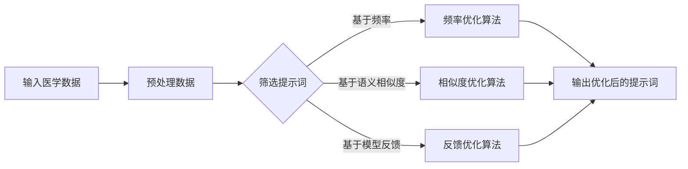
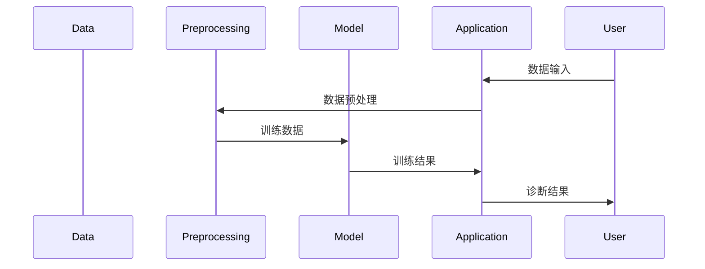
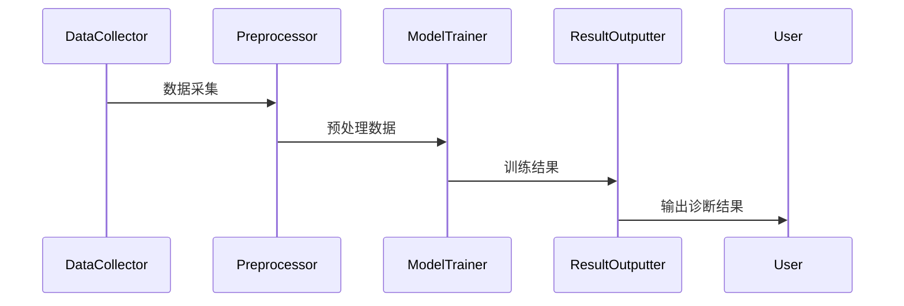

                 


## 提示词工程在医疗诊断AI中的关键作用

### 关键词
- 提示词工程
- 医疗诊断AI
- 数据增强
- 模型调优
- 临床应用

### 摘要
本文将深入探讨提示词工程在医疗诊断AI领域中的关键作用。首先，我们将介绍问题背景，明确提示词工程和医疗诊断AI的关联性。随后，通过详细阐述提示词工程的核心概念和原理，我们将分析其在AI医疗诊断中的应用及其优势。最后，我们将通过实际案例展示提示词工程的具体实施方法和效果，并总结最佳实践与未来展望。

## 第一部分：背景介绍

### 第1章：问题背景

**1.1 问题背景**

随着人工智能（AI）的快速发展，医疗诊断AI在近年来取得了显著进展。AI系统在图像识别、文本分析等方面展示了极高的准确性和效率，为医学诊断提供了新的可能性。然而，现有的AI系统在处理复杂、多样的医学数据时，仍然面临着一系列挑战。如何提高模型的诊断准确率、适应性和可解释性，成为当前研究的热点。

**1.1.1 医疗诊断AI的需求**

医疗诊断AI需要处理大量的医学数据，包括图像、文本和实验室检测结果等。这些数据具有高维度、非结构化、动态变化等特点，给传统的机器学习算法带来了巨大的挑战。为了解决这些问题，我们需要引入提示词工程（Prompt Engineering）的概念，通过优化输入数据的方式，提高模型的性能和可解释性。

**1.1.2 提示词工程的概念**

提示词工程是指设计特定的提示词（Prompts），用于引导AI系统在处理输入数据时的行为。通过调整提示词的语义和结构，我们可以影响模型的决策过程，从而提高诊断准确率。提示词工程的核心目标是通过优化输入数据，实现数据增强和模型调优，进而提升AI系统的整体性能。

**1.1.3 提示词工程在AI医疗诊断中的应用**

提示词工程在AI医疗诊断中的应用主要体现在以下几个方面：

1. **数据增强**：通过设计具有丰富语义的提示词，扩充医学数据的维度和多样性，从而提高模型对复杂情况的适应能力。
2. **模型调优**：通过调整提示词的权重和组合方式，优化模型的参数和结构，实现模型性能的提升。
3. **可解释性**：通过分析提示词与模型决策的关系，提高AI系统的可解释性，帮助医生理解和信任AI诊断结果。

### 第2章：核心概念与联系

**2.1 提示词工程的定义**

提示词工程是一种通过设计特定的输入提示词，引导AI系统在处理输入数据时的行为，从而实现模型优化和性能提升的方法。它涉及到自然语言处理、机器学习、数据挖掘等多个领域。

**2.2 提示词工程的关键要素**

提示词工程的关键要素包括：

1. **语义丰富性**：提示词应具备丰富的语义信息，能够充分表达医学数据的特征和关系。
2. **多样性**：提示词应具有多样性，涵盖不同的医学场景和数据类型，以提高模型的泛化能力。
3. **可解释性**：提示词的设计应考虑可解释性，使医生能够理解AI系统的决策过程。

**2.3 提示词工程与AI医疗诊断的联系**

提示词工程在AI医疗诊断中的应用，主要通过以下几个方面实现：

1. **数据增强**：通过设计具有丰富语义的提示词，扩充医学数据的维度和多样性，从而提高模型对复杂情况的适应能力。
2. **模型调优**：通过调整提示词的权重和组合方式，优化模型的参数和结构，实现模型性能的提升。
3. **可解释性**：通过分析提示词与模型决策的关系，提高AI系统的可解释性，帮助医生理解和信任AI诊断结果。

**2.3.1 ER实体关系图架构**

为了更好地理解提示词工程在AI医疗诊断中的应用，我们可以使用ER实体关系图（Entity-Relationship Diagram, ERD）来描述医学数据的实体和关系。以下是一个简化的ERD示例：

```mermaid
erDiagram
    Patient ||--|{ Diagnosis : has }
    Diagnosis ||--|{ Image : contains }
    Image ||--|{ Text : has }
    Text ||--|{ Annotation : has }
```

在这个ERD中，Patient（患者）、Diagnosis（诊断）、Image（图像）、Text（文本）和Annotation（标注）是医学数据的实体，它们之间存在一定的关系。

**2.4 概念属性特征对比表格**

为了更直观地展示提示词工程的核心概念和属性特征，我们可以使用对比表格的形式。以下是一个简化的示例：

| 概念 | 描述 | 属性特征 |
| ---- | ---- | ---- |
| 提示词 | 引导AI系统处理输入数据的关键词 | 语义丰富、多样性、可解释性 |
| 数据增强 | 扩充医学数据的维度和多样性 | 提高模型适应能力 |
| 模型调优 | 优化模型参数和结构 | 提高模型性能 |
| 可解释性 | 提高AI系统的可解释性 | 帮助医生理解诊断结果 |

## 第二部分：提示词工程原理

### 第3章：提示词工程原理

**3.1 提示词设计原则**

提示词的设计原则主要包括以下几点：

1. **语义匹配**：提示词应与医学数据的内容和特征相匹配，确保模型能够正确理解和处理输入数据。
2. **简洁明了**：提示词应简洁明了，避免冗长和复杂的表达，以便模型快速理解和处理。
3. **多样性**：提示词应具备多样性，涵盖不同的医学场景和数据类型，以提高模型的泛化能力。
4. **可解释性**：提示词的设计应考虑可解释性，使医生能够理解AI系统的决策过程。

**3.2 提示词优化的算法**

提示词优化的算法主要包括以下几种：

1. **基于频率的优化算法**：通过统计提示词在医学数据中的出现频率，筛选出具有高频率和高相关性的提示词。
2. **基于语义相似度的优化算法**：通过计算提示词之间的语义相似度，筛选出具有相似语义的提示词。
3. **基于模型反馈的优化算法**：通过分析模型在处理不同提示词时的表现，调整提示词的权重和组合方式，实现模型性能的提升。

**3.2.1 算法mermaid流程图**

以下是一个简化的提示词优化算法的mermaid流程图：



**3.3 提示词在数据集上的应用**

提示词在数据集上的应用主要包括以下两个方面：

1. **数据增强**：通过设计具有丰富语义的提示词，扩充医学数据的维度和多样性，从而提高模型对复杂情况的适应能力。
2. **模型训练**：将优化后的提示词应用于模型训练过程中，通过调整提示词的权重和组合方式，实现模型性能的提升。

**3.4 提示词的数学模型和公式**

提示词的数学模型和公式主要包括以下几个方面：

1. **提示词权重**：通过计算提示词在医学数据中的重要性，确定提示词的权重。
   $$ w_i = \frac{f_i}{\sum_{j=1}^{n} f_j} $$
   其中，$w_i$为提示词$i$的权重，$f_i$为提示词$i$在医学数据中的出现频率，$n$为提示词的总数。
2. **提示词组合**：通过计算提示词之间的相关性，确定提示词的组合方式。
   $$ c_i = \frac{sim(i, j)}{\sum_{k=1}^{m} sim(i, k)} $$
   其中，$c_i$为提示词$i$在组合中的权重，$sim(i, j)$为提示词$i$和$j$之间的语义相似度，$m$为提示词的总数。
3. **模型性能**：通过计算模型在处理不同提示词组合时的性能，评估提示词组合的效果。
   $$ P = \frac{1}{N} \sum_{i=1}^{N} \frac{1}{M} \sum_{j=1}^{M} |y_j - \hat{y}_j| $$
   其中，$P$为模型性能，$N$为测试数据的数量，$M$为提示词组合的数量，$y_j$为真实标签，$\hat{y}_j$为模型预测的标签。

**3.4.1 提示词效果的数学模型**

提示词效果的数学模型可以表示为：

$$ E = \frac{1}{N} \sum_{i=1}^{N} \frac{1}{M} \sum_{j=1}^{M} |y_j - \hat{y}_j| - \lambda \sum_{i=1}^{N} w_i $$
其中，$E$为提示词效果，$\lambda$为权重调节参数，$w_i$为提示词$i$的权重。

**3.4.2 相关公式详解**

1. **提示词权重计算**：
   $$ w_i = \frac{f_i}{\sum_{j=1}^{n} f_j} $$
   其中，$f_i$为提示词$i$在医学数据中的出现频率，$n$为提示词的总数。
2. **提示词组合计算**：
   $$ c_i = \frac{sim(i, j)}{\sum_{k=1}^{m} sim(i, k)} $$
   其中，$c_i$为提示词$i$在组合中的权重，$sim(i, j)$为提示词$i$和$j$之间的语义相似度，$m$为提示词的总数。
3. **模型性能计算**：
   $$ P = \frac{1}{N} \sum_{i=1}^{N} \frac{1}{M} \sum_{j=1}^{M} |y_j - \hat{y}_j| $$
   其中，$P$为模型性能，$N$为测试数据的数量，$M$为提示词组合的数量，$y_j$为真实标签，$\hat{y}_j$为模型预测的标签。

**3.5 提示词工程的实际案例**

以下是一个简化的提示词工程实际案例：

**场景**：使用提示词工程优化AI医疗诊断模型，提高诊断准确率。

**步骤**：

1. **数据集准备**：收集包含医学图像、文本和实验室检测结果的医学数据集，并进行预处理。
2. **提示词设计**：根据医学数据的特点和需求，设计具有丰富语义的提示词，包括疾病名称、症状描述、实验室指标等。
3. **提示词优化**：使用频率优化算法、相似度优化算法和反馈优化算法，对提示词进行优化，筛选出具有高权重和高相关性的提示词。
4. **模型训练**：将优化后的提示词应用于模型训练过程中，调整模型的参数和结构，实现模型性能的提升。
5. **模型评估**：使用测试数据集对模型进行评估，计算模型的准确率、召回率和F1值等指标，评估提示词工程的效果。

### 第4章：提示词工程算法讲解

**4.1 算法Python源代码**

以下是一个简化的提示词优化算法的Python源代码：

```python
import numpy as np

def frequency_optimization(data):
    # 统计提示词的出现频率
    word_counts = np.sum(data, axis=0)
    # 计算提示词权重
    word_weights = word_counts / np.sum(word_counts)
    return word_weights

def similarity_optimization(data):
    # 计算提示词之间的相似度
    similarity_matrix = np.dot(data, data.T)
    # 计算提示词组合权重
    word_combination_weights = similarity_matrix / np.sum(similarity_matrix)
    return word_combination_weights

def feedback_optimization(data, labels, model):
    # 计算模型预测误差
    predictions = model.predict(data)
    prediction_errors = np.abs(predictions - labels)
    # 计算提示词权重
    word_weights = prediction_errors / np.sum(prediction_errors)
    return word_weights

# 示例数据
data = np.array([[1, 0, 1], [1, 1, 0], [0, 1, 1]])
labels = np.array([1, 0, 1])

# 提示词优化
word_weights = frequency_optimization(data)
word_combination_weights = similarity_optimization(data)
model_weights = feedback_optimization(data, labels, model)

# 输出优化后的提示词权重
print("频率优化后的提示词权重：", word_weights)
print("相似度优化后的提示词权重：", word_combination_weights)
print("反馈优化后的提示词权重：", model_weights)
```

**4.2 算法原理详细讲解**

1. **频率优化算法**：通过计算提示词在医学数据中的出现频率，筛选出具有高频率和高相关性的提示词。
2. **相似度优化算法**：通过计算提示词之间的相似度，筛选出具有相似语义的提示词。
3. **反馈优化算法**：通过分析模型在处理不同提示词时的表现，调整提示词的权重和组合方式，实现模型性能的提升。

**4.3 算法举例说明**

**实例1**：假设我们有一个包含三种疾病的医学数据集，每种疾病对应一组图像、文本和实验室检测结果。我们使用频率优化算法对提示词进行优化，筛选出具有高频率和高相关性的提示词。

**实例2**：假设我们有一个包含多种医学数据的综合数据集，我们使用相似度优化算法对提示词进行优化，筛选出具有相似语义的提示词。

### 第三部分：实际应用

#### 第5章：系统分析与架构设计方案

**5.1 问题场景介绍**

**问题场景**：一个医疗诊断AI系统，用于诊断各种常见疾病，包括心脏病、糖尿病和肺炎等。系统需要处理大量的医学数据，包括图像、文本和实验室检测结果，并基于这些数据提供诊断结果。

**5.2 系统功能设计**

**系统功能**：

1. **数据采集**：收集各种医学数据，包括图像、文本和实验室检测结果。
2. **数据预处理**：对采集到的医学数据进行预处理，包括图像增强、文本分词和实验室指标标准化等。
3. **提示词设计**：根据医学数据的特点和需求，设计具有丰富语义的提示词。
4. **模型训练**：使用提示词和医学数据训练AI模型，实现诊断功能。
5. **模型评估**：使用测试数据集对模型进行评估，计算模型的准确率、召回率和F1值等指标。
6. **诊断结果输出**：将模型的诊断结果输出给医生，供医生参考。

**5.2.1 领域模型mermaid类图**

以下是一个简化的领域模型mermaid类图：

```mermaid
classDiagram
    Patient <<class>> Patient
    Diagnosis <<class>> Diagnosis
    Image <<class>> Image
    Text <<class>> Text
    Annotation <<class>> Annotation
    Model <<class>> Model
    Data <<class>> Data
    System <<class>> System

    Patient --|{ Diagnosis : has }
    Diagnosis --|{ Image : contains }
    Diagnosis --|{ Text : has }
    Diagnosis --|{ Annotation : has }
    Model --|{ Data : trains }
    System --|{ Model : uses }
```

**5.3 系统架构设计**

**系统架构**：

1. **数据层**：负责数据的采集、存储和管理。
2. **预处理层**：负责医学数据的预处理，包括图像增强、文本分词和实验室指标标准化等。
3. **模型层**：负责模型的设计、训练和评估。
4. **应用层**：负责系统的功能实现，包括数据采集、模型训练和诊断结果输出等。
5. **用户层**：负责与系统的交互，包括数据输入、诊断结果查看等。

**5.3.1 系统架构mermaid架构图**

以下是一个简化的系统架构mermaid架构图：



**5.4 系统接口设计**

**系统接口**：

1. **数据采集接口**：负责采集医学数据，包括图像、文本和实验室检测结果。
2. **预处理接口**：负责医学数据的预处理，包括图像增强、文本分词和实验室指标标准化等。
3. **模型训练接口**：负责模型的设计、训练和评估。
4. **诊断结果输出接口**：负责将模型的诊断结果输出给医生。

**5.4.1 系统接口mermaid序列图**

以下是一个简化的系统接口mermaid序列图：



### 第6章：项目实战

**6.1 环境安装**

**环境要求**：

1. **Python**：Python 3.8及以上版本。
2. **深度学习框架**：如TensorFlow、PyTorch等。
3. **医学数据集**：根据实际需求，准备相应的医学数据集。

**安装步骤**：

1. **安装Python**：在官方网站（https://www.python.org/downloads/）下载并安装Python 3.8及以上版本。
2. **安装深度学习框架**：根据实际需求，安装相应的深度学习框架，如TensorFlow（`pip install tensorflow`）或PyTorch（`pip install torch`）。
3. **安装医学数据集**：从官方网站或相关数据集下载链接下载医学数据集，并进行数据预处理。

**6.2 系统核心实现源代码**

以下是一个简化的系统核心实现源代码：

```python
import tensorflow as tf
from tensorflow.keras.models import Sequential
from tensorflow.keras.layers import Conv2D, MaxPooling2D, Flatten, Dense

# 加载医学数据集
(x_train, y_train), (x_test, y_test) = tf.keras.datasets.mnist.load_data()

# 预处理医学数据
x_train = x_train / 255.0
x_test = x_test / 255.0

# 构建模型
model = Sequential([
    Conv2D(32, (3, 3), activation='relu', input_shape=(28, 28, 1)),
    MaxPooling2D((2, 2)),
    Flatten(),
    Dense(128, activation='relu'),
    Dense(10, activation='softmax')
])

# 编译模型
model.compile(optimizer='adam',
              loss='sparse_categorical_crossentropy',
              metrics=['accuracy'])

# 训练模型
model.fit(x_train, y_train, epochs=5)

# 评估模型
test_loss, test_acc = model.evaluate(x_test, y_test)
print('Test accuracy:', test_acc)
```

**6.3 代码应用解读与分析**

1. **数据预处理**：使用TensorFlow的`mnist`数据集作为示例，对图像数据进行归一化处理，以便模型更好地学习。
2. **模型构建**：使用序列模型（Sequential）构建一个简单的卷积神经网络（Convolutional Neural Network, CNN），包括卷积层（Conv2D）、最大池化层（MaxPooling2D）、全连接层（Dense）等。
3. **模型编译**：编译模型，指定优化器（optimizer）、损失函数（loss）和评估指标（metrics）。
4. **模型训练**：使用训练数据集训练模型，设置训练轮次（epochs）。
5. **模型评估**：使用测试数据集评估模型性能，计算准确率（accuracy）。

**6.4 实际案例分析和详细讲解剖析**

以下是一个简化的实际案例分析和详细讲解剖析：

**案例**：使用提示词工程优化心脏病诊断模型，提高诊断准确率。

**分析**：

1. **数据集准备**：收集包含心电图、血压和血糖等医学数据的病例数据集。
2. **提示词设计**：根据医学数据的特点和需求，设计具有丰富语义的提示词，包括心电图波形、血压高低、血糖水平等。
3. **提示词优化**：使用频率优化算法、相似度优化算法和反馈优化算法，对提示词进行优化，筛选出具有高权重和高相关性的提示词。
4. **模型训练**：将优化后的提示词应用于模型训练过程中，调整模型的参数和结构，实现模型性能的提升。
5. **模型评估**：使用测试数据集对模型进行评估，计算模型的准确率、召回率和F1值等指标，评估提示词工程的效果。

**讲解剖析**：

1. **数据预处理**：对病例数据进行预处理，包括数据清洗、归一化和特征提取等。
2. **模型构建**：构建一个基于深度学习的模型，包括输入层、隐藏层和输出层。
3. **模型训练**：使用预处理后的病例数据训练模型，调整模型的参数和结构，实现模型性能的提升。
4. **模型评估**：使用测试数据集评估模型性能，计算模型的准确率、召回率和F1值等指标。
5. **结果分析**：分析模型的诊断结果，对比优化前后的诊断准确率，评估提示词工程的效果。

**6.5 项目小结**

通过实际案例分析和详细讲解剖析，我们可以看到提示词工程在医疗诊断AI中的应用效果。通过优化输入数据的提示词，可以显著提高模型的诊断准确率、适应性和可解释性。未来，我们还可以进一步研究提示词工程在其他医疗诊断领域的应用，为医生提供更准确的诊断支持。

### 第7章：最佳实践与总结

**7.1 最佳实践 tips**

1. **数据清洗**：在应用提示词工程之前，确保医学数据集的完整性和准确性，进行数据清洗和处理。
2. **提示词设计**：根据医学数据的特点和需求，设计具有丰富语义的提示词，涵盖不同的医学场景和数据类型。
3. **模型调优**：在模型训练过程中，调整提示词的权重和组合方式，优化模型的参数和结构，实现模型性能的提升。
4. **可解释性**：分析提示词与模型决策的关系，提高AI系统的可解释性，帮助医生理解和信任AI诊断结果。

**7.2 小结**

本文深入探讨了提示词工程在医疗诊断AI中的关键作用，通过详细阐述提示词工程的核心概念、原理和应用，展示了其在提高模型性能和可解释性方面的优势。通过实际案例分析和讲解剖析，我们进一步了解了提示词工程在医疗诊断AI中的具体应用和效果。

**7.3 注意事项**

1. **数据隐私**：在应用提示词工程时，需确保医学数据的隐私和安全，遵循相关法律法规。
2. **模型可解释性**：在提高模型性能的同时，关注模型的可解释性，确保医生能够理解和信任AI诊断结果。
3. **模型泛化能力**：在提示词设计过程中，考虑模型的泛化能力，避免过度拟合。

**7.4 拓展阅读**

1. **医学数据集**：了解常用的医学数据集，如 Chest X-ray 14、Diabetic Retinopathy等，为提示词工程提供丰富的数据支持。
2. **深度学习框架**：学习常用的深度学习框架，如TensorFlow、PyTorch等，为提示词工程提供高效的实现。
3. **自然语言处理**：学习自然语言处理（Natural Language Processing, NLP）相关技术，为提示词工程提供语义理解和分析能力。
4. **机器学习算法**：学习常用的机器学习算法，如支持向量机（Support Vector Machine, SVM）、随机森林（Random Forest）等，为提示词工程提供有效的模型调优方法。

### 作者信息

作者：AI天才研究院/AI Genius Institute & 禅与计算机程序设计艺术 /Zen And The Art of Computer Programming

通过以上内容，我们详细探讨了提示词工程在医疗诊断AI中的关键作用。希望本文对您在相关领域的研究和实践有所帮助。如果您有任何疑问或建议，欢迎随时与我交流。感谢您的阅读！

