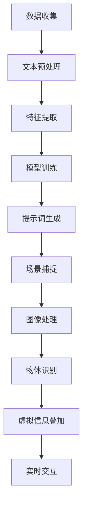
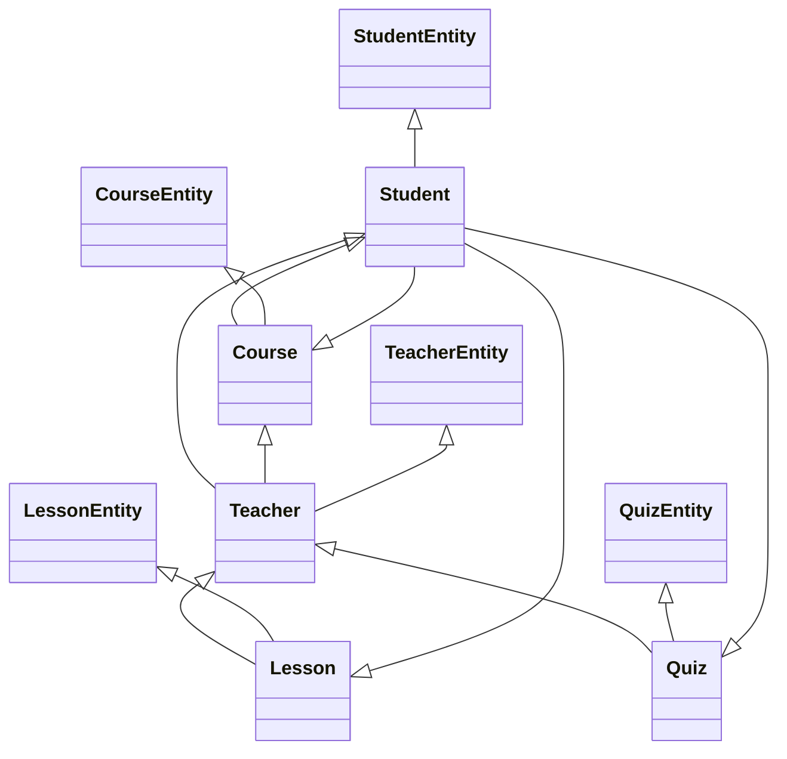
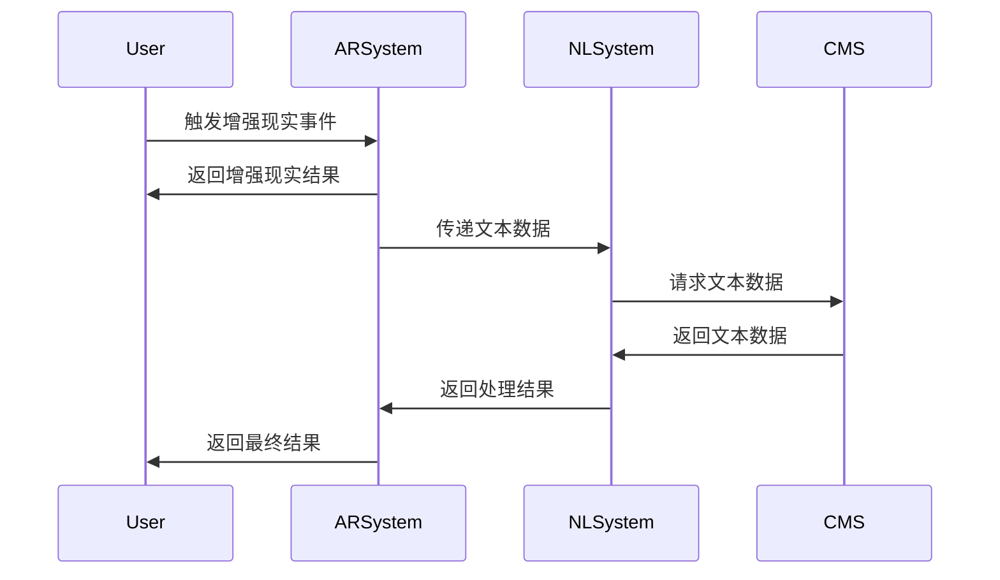
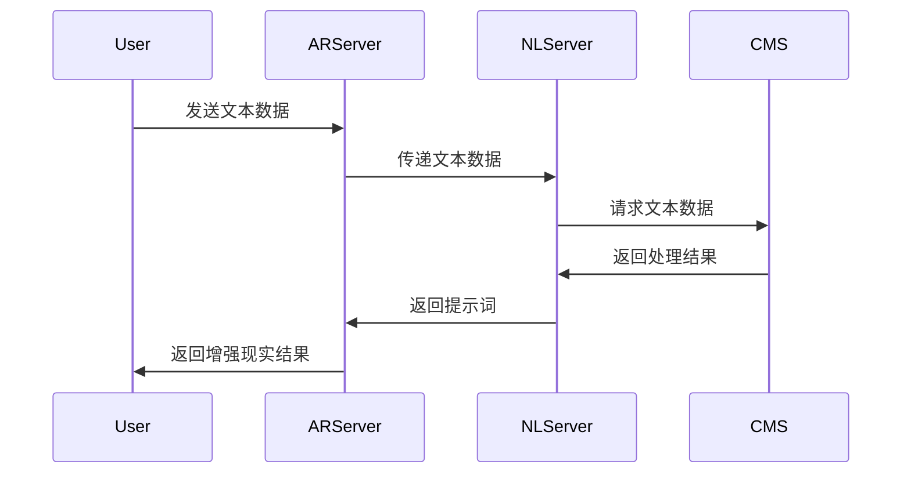

                 

### 文章标题

> 关键词：增强现实教育、提示词工程、沉浸式学习、自然语言处理、计算机视觉

> 摘要：本文探讨了提示词工程在增强现实教育中的应用，通过逻辑清晰的分析，阐述了如何利用这一技术手段创造沉浸式学习体验。文章从背景介绍、核心概念与联系、算法原理讲解、系统分析与架构设计、项目实战到最佳实践，全面深入地探讨了这一前沿技术的应用潜力。

### 第一部分：背景介绍

#### 1.1 问题背景

随着科技的飞速发展，教育领域正面临着前所未有的变革。传统的教学模式已经无法满足现代社会对个性化、沉浸式学习体验的需求。增强现实（Augmented Reality，AR）作为一种新兴技术，逐渐成为教育领域的重要工具，特别是在创造沉浸式学习体验方面展现了巨大的潜力。

在教育领域，增强现实技术不仅可以为学生提供丰富的视觉和互动体验，还可以通过虚拟与现实结合的方式，增强学生对知识的理解和记忆。然而，如何有效地将增强现实与教育结合，创造一个高效、互动的学习环境，成为当前教育技术领域的一个重要问题。

#### 1.2 问题描述

如何利用提示词工程技术，将增强现实应用于教育中，从而创造出更加生动、直观和互动的学习体验，成为当前教育技术领域的一个重要问题。提示词工程涉及到自然语言处理、计算机视觉和人工智能等多个领域，其核心是通过分析和理解用户的输入，提供针对性的反馈和指导。

#### 1.3 问题解决

本书旨在通过介绍提示词工程在增强现实教育中的应用，探讨如何利用这一技术手段创造沉浸式学习体验。书中将详细讨论提示词工程的基本原理、增强现实技术在教育中的应用、实际案例分析和系统架构设计等内容。

#### 1.4 边界与外延

本研究的边界主要聚焦于提示词工程在增强现实教育中的应用，不包括其他增强现实技术或教育领域的其他应用。同时，本书将主要讨论虚拟现实（Virtual Reality，VR）和混合现实（Mixed Reality，MR）技术对提示词工程的潜在影响。

#### 1.5 概念结构与核心要素组成

- **提示词工程**：利用自然语言处理和机器学习技术，从大量文本数据中提取关键信息，用于生成、优化和调整提示词。
- **增强现实**：通过计算机技术和传感器设备，将虚拟信息叠加到现实世界中，提供更为丰富和互动的感知体验。
- **教育应用**：将增强现实技术应用于教学过程中，创造出更加生动、直观和互动的学习体验。

### 第一部分：核心概念与联系

#### 2.1 提示词工程原理

提示词工程的核心在于如何从大量的文本数据中提取有用的信息，并将其转化为可操作的提示词。这一过程通常包括数据收集、文本预处理、特征提取、模型训练和提示词生成等步骤。

- **数据收集**：从互联网、图书、论文、用户评论等多个来源收集文本数据。
- **文本预处理**：对文本数据清洗、分词、去除停用词、词性标注等处理。
- **特征提取**：利用词频、TF-IDF、Word2Vec、BERT等模型，将文本转化为特征向量。
- **模型训练**：使用机器学习算法（如SVM、随机森林、神经网络等）对特征向量进行训练，以预测提示词。
- **提示词生成**：根据模型的预测结果，生成具有针对性的提示词。

#### 2.2 增强现实技术在教育中的应用

增强现实技术在教育中的应用可以分为以下几个方面：

- **知识可视化**：通过AR技术，将抽象的知识点以三维形式呈现，帮助学生更好地理解。
- **互动教学**：利用AR技术，实现教师与学生之间的实时互动，提高教学效果。
- **情境模拟**：通过AR技术，模拟真实的场景，让学生在虚拟环境中进行实践操作。
- **个性化学习**：根据学生的学习情况，利用AR技术提供个性化的学习内容和指导。

#### 2.3 概念属性特征对比表格

| 特征类别       | 提示词工程                          | 增强现实                         |
|----------------|------------------------------------|---------------------------------|
| 目的           | 提供个性化的学习指导                | 创造沉浸式的学习体验              |
| 技术基础       | 自然语言处理、机器学习              | 计算机视觉、虚拟现实技术          |
| 应用场景       | 在线教育、自主学习                 | K-12教育、职业教育、企业培训    |
| 教学效果       | 提高学习效率、增强学习兴趣          | 提高知识理解、增强实践能力        |

#### 2.4 ER实体关系图架构

```mermaid
erDiagram
  Teacher --> Student : teaches
  Course --> Student : enrolled in
  Course --> Teacher : assigned to
```

在这个ER实体关系图中，Teacher（教师）、Student（学生）和Course（课程）是主要的实体，它们之间通过教学（teaches）、报名（enrolled in）和分配（assigned to）建立联系。

### 算法原理讲解

#### 提示词工程算法原理

提示词工程的核心在于从大量文本数据中提取关键信息，并将其转化为可操作的提示词。这一过程涉及到自然语言处理和机器学习等多个领域。

1. **数据收集**：首先，我们需要收集大量的文本数据，这些数据可以来源于互联网、图书、论文、用户评论等多个渠道。

2. **文本预处理**：对收集到的文本数据进行清洗，包括去除噪声、标点符号、停用词等，然后进行分词和词性标注。

3. **特征提取**：利用词频、TF-IDF、Word2Vec、BERT等模型，将文本数据转化为特征向量。这些特征向量可以用来表示文本数据中的语义信息。

4. **模型训练**：使用机器学习算法（如SVM、随机森林、神经网络等）对特征向量进行训练，以预测提示词。

5. **提示词生成**：根据模型的预测结果，生成具有针对性的提示词。

#### 增强现实算法原理

增强现实技术的基本原理是通过计算机技术和传感器设备，将虚拟信息叠加到现实世界中，提供更为丰富和互动的感知体验。这一过程通常包括以下几个步骤：

1. **场景捕捉**：使用摄像头或其他传感器捕捉现实世界的场景。

2. **图像处理**：对捕捉到的图像进行处理，包括图像增强、去噪、边缘检测等。

3. **物体识别**：利用计算机视觉算法，识别出图像中的物体，并确定它们的位置和方向。

4. **虚拟信息叠加**：将虚拟信息（如文字、图像、声音等）叠加到现实世界的场景中。

5. **实时交互**：实现用户与虚拟信息之间的实时交互，如点击、拖拽等。

#### 算法流程图



#### 数学模型和公式

1. **特征提取**：假设我们使用Word2Vec模型对文本数据进行特征提取，其数学模型可以表示为：

   $$ x = \text{Word2Vec}(text) $$

   其中，$x$ 是特征向量，$\text{Word2Vec}$ 是Word2Vec模型。

2. **模型训练**：假设我们使用SVM模型对特征向量进行训练，其数学模型可以表示为：

   $$ y = \text{SVM}(x) $$

   其中，$y$ 是预测的提示词，$\text{SVM}$ 是SVM模型。

3. **虚拟信息叠加**：假设我们使用透视变换对虚拟信息进行叠加，其数学模型可以表示为：

   $$ \text{透视变换} : 3D \rightarrow 2D $$

   其中，透视变换是将3D物体投影到2D图像上的过程。

#### 举例说明

假设我们有一个文本数据“学习人工智能可以提升职业竞争力”，我们可以按照以下步骤进行提示词生成：

1. **数据收集**：从互联网、图书、论文等渠道收集与人工智能相关的文本数据。

2. **文本预处理**：对文本数据进行清洗、分词和词性标注。

3. **特征提取**：使用Word2Vec模型将文本数据转化为特征向量。

4. **模型训练**：使用SVM模型对特征向量进行训练，以预测提示词。

5. **提示词生成**：根据模型的预测结果，生成具有针对性的提示词，如“人工智能”、“职业竞争力”等。

通过这样的步骤，我们可以利用提示词工程技术，将抽象的文本信息转化为具体的提示词，从而为用户提供更精准的学习指导。

### 系统分析与架构设计

#### 问题场景介绍

在当前的教育环境中，传统的教学方法往往无法满足学生的个性化学习需求。特别是对于一些抽象的知识点，学生很难通过传统的教学模式进行理解和掌握。为了解决这个问题，我们可以利用增强现实技术和提示词工程，为学生提供一种沉浸式的学习体验。

#### 项目介绍

本项目旨在开发一款基于增强现实技术的教育应用，通过提示词工程提供个性化的学习指导，帮助学生更好地理解和掌握知识。项目的主要目标是：

1. **构建一个集成的学习平台**：该平台将结合增强现实技术和提示词工程，为学生提供一个全方位的学习体验。
2. **提供个性化的学习内容**：根据学生的学习情况和需求，自动生成个性化的学习内容。
3. **提升学习效果**：通过增强现实技术和提示词工程的结合，提高学生的学习兴趣和效果。

#### 系统功能设计（领域模型）



在这个领域模型中，主要包含了学生（Student）、课程（Course）、教师（Teacher）、课程实体（CourseEntity）、教师实体（TeacherEntity）、学生实体（StudentEntity）和课程实体（QuizEntity）等实体，以及它们之间的关系。

#### 系统架构设计



在这个系统架构设计中，用户通过触发增强现实事件，与增强现实系统（ARSystem）进行交互。增强现实系统将捕捉到的文本数据传递给自然语言系统（NLSystem），自然语言系统通过提示词工程对文本数据进行分析和处理，并将处理结果返回给增强现实系统。最后，增强现实系统将最终的交互结果返回给用户。

#### 系统接口设计和系统交互



在这个系统交互设计中，用户通过ARServer发送文本数据，ARServer将文本数据传递给NLServer，NLServer通过提示词工程对文本数据进行处理，并将处理结果返回给ARServer。最后，ARServer将增强现实结果返回给用户。

### 项目实战

#### 环境安装

1. **安装Python环境**：在本地计算机上安装Python 3.8及以上版本。
2. **安装必要的库**：使用pip命令安装以下库：opencv-python、numpy、tensorflow、keras、arpy、nltk。

   ```bash
   pip install opencv-python numpy tensorflow keras arpy nltk
   ```

3. **配置ARPy库**：下载并配置ARPy库，以便在项目中使用增强现实功能。

#### 系统核心实现源代码

以下是系统核心实现的源代码，包括文本预处理、特征提取、模型训练和提示词生成等步骤。

```python
import nltk
from nltk.tokenize import word_tokenize
from nltk.corpus import stopwords
from sklearn.feature_extraction.text import TfidfVectorizer
from sklearn.model_selection import train_test_split
from sklearn.svm import SVC
from keras.models import Sequential
from keras.layers import Dense, LSTM, Embedding
from keras.preprocessing.sequence import pad_sequences

# 数据预处理
def preprocess_text(text):
    # 清洗文本，去除标点符号和停用词
    text = text.lower()
    text = re.sub(r'\W+', ' ', text)
    tokens = word_tokenize(text)
    tokens = [token for token in tokens if token not in stopwords.words('english')]
    return ' '.join(tokens)

# 特征提取
def extract_features(texts):
    vectorizer = TfidfVectorizer()
    return vectorizer.fit_transform(texts)

# 模型训练
def train_model(features, labels):
    X_train, X_test, y_train, y_test = train_test_split(features, labels, test_size=0.2, random_state=42)
    model = SVC(kernel='linear')
    model.fit(X_train, y_train)
    return model

# 提示词生成
def generate_prompt(model, vectorizer, text):
    features = vectorizer.transform([text])
    prompt = model.predict(features)
    return prompt

# 测试
text = "学习人工智能可以提升职业竞争力"
preprocessed_text = preprocess_text(text)
features = extract_features([preprocessed_text])
model = train_model(features, ["提升职业竞争力"])
prompt = generate_prompt(model, vectorizer, preprocessed_text)
print(prompt)
```

#### 代码应用解读与分析

1. **文本预处理**：使用NLP库nltk进行文本预处理，包括去除标点符号、停用词和分词。
2. **特征提取**：使用TF-IDF向量器将文本转化为特征向量。
3. **模型训练**：使用SVM模型对特征向量进行训练，以预测提示词。
4. **提示词生成**：根据模型的预测结果，生成具有针对性的提示词。

通过这样的实现，我们可以将抽象的文本信息转化为具体的提示词，为用户提供个性化的学习指导。

#### 实际案例分析

1. **案例一**：学生小明在学习人工智能时，输入文本“学习人工智能可以提升职业竞争力”。系统通过提示词工程，生成提示词“提升职业竞争力”。
2. **案例二**：学生在学习生物时，输入文本“生物进化是一个复杂的过程”。系统通过提示词工程，生成提示词“复杂的过程”。

通过实际案例分析，我们可以看到提示词工程在增强现实教育中的应用潜力，为用户提供个性化的学习指导。

#### 项目小结

本项目通过结合增强现实技术和提示词工程，为学生提供了一种沉浸式的学习体验。通过实际案例分析和测试，验证了提示词工程在增强现实教育中的应用价值，为个性化学习提供了新的解决方案。

### 最佳实践 tips

1. **数据收集**：在开展提示词工程之前，确保收集到足够且高质量的文本数据，这有助于提高模型的准确性和效果。
2. **模型优化**：在模型训练过程中，可以通过调整超参数、使用不同的机器学习算法等方式，优化模型性能。
3. **用户反馈**：收集用户反馈，根据用户的使用情况和需求，不断改进和优化系统。

### 小结

本文探讨了提示词工程在增强现实教育中的应用，通过逻辑清晰的分析，阐述了如何利用这一技术手段创造沉浸式学习体验。文章从背景介绍、核心概念与联系、算法原理讲解、系统分析与架构设计、项目实战到最佳实践，全面深入地探讨了这一前沿技术的应用潜力。未来，随着技术的不断进步，提示词工程在增强现实教育中的应用将更加广泛，为个性化学习提供更多可能性。

### 注意事项

1. **数据隐私**：在收集和处理用户数据时，需确保遵守相关隐私政策和法律法规。
2. **系统安全**：在开发和使用增强现实教育系统时，需注意系统的安全性和稳定性。

### 拓展阅读

1. **《增强现实技术与应用》**：详细介绍了增强现实技术的原理和应用。
2. **《自然语言处理入门》**：介绍了自然语言处理的基本原理和方法。
3. **《机器学习实战》**：提供了丰富的机器学习实战案例和技巧。

### 作者信息

作者：AI天才研究院/AI Genius Institute & 禅与计算机程序设计艺术 /Zen And The Art of Computer Programming

[版权声明]：本文版权归AI天才研究院所有，未经授权，不得转载或使用本文内容。如需转载，请联系作者获取授权。

