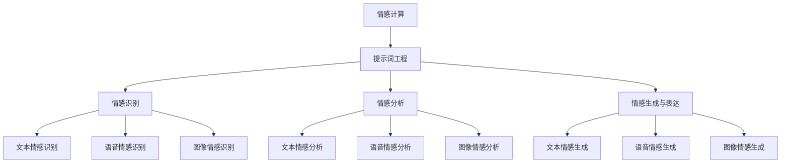
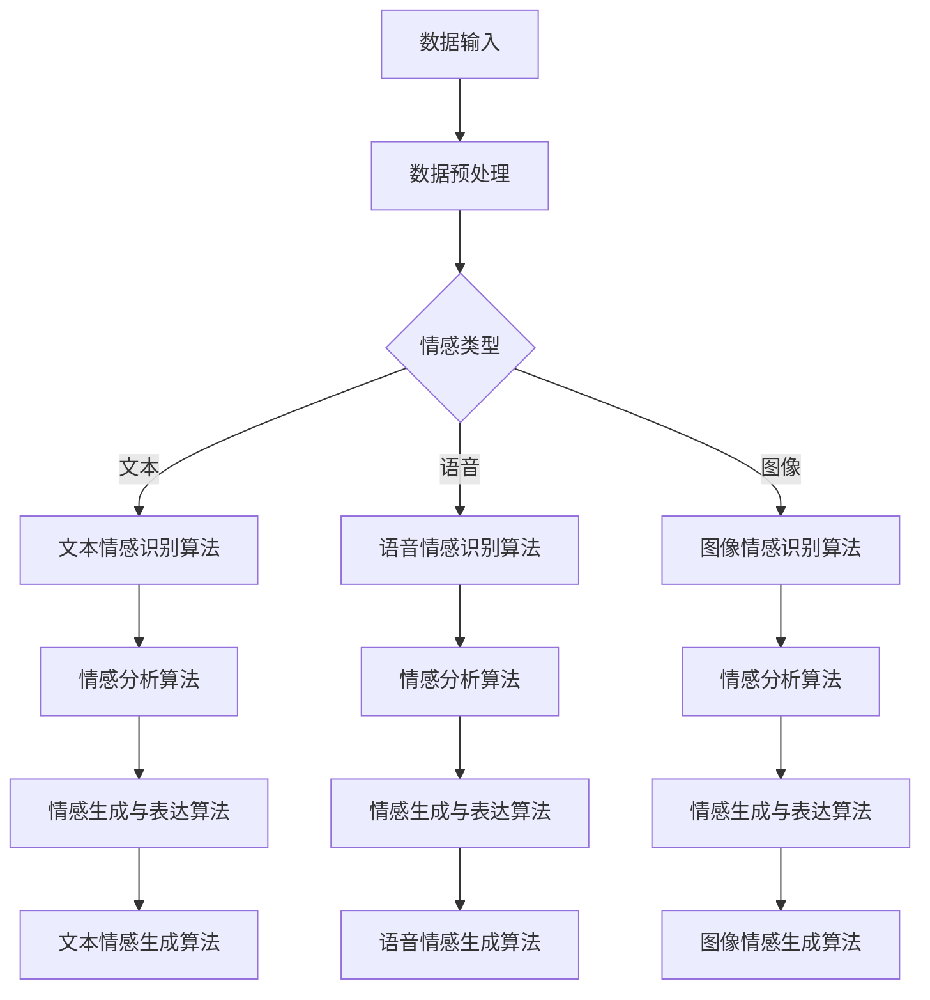
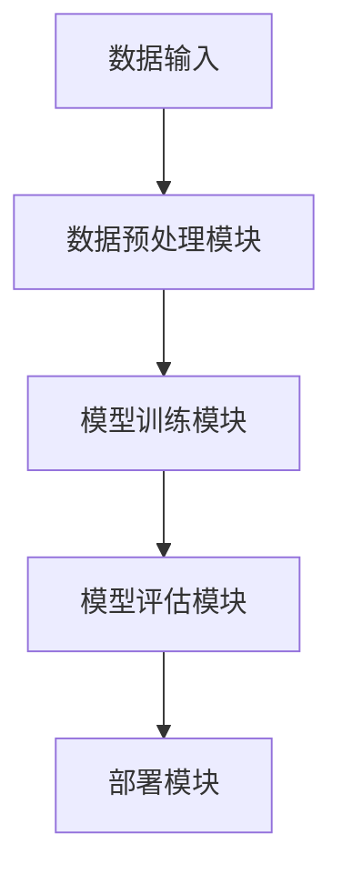

                 


# 提示词工程在情感计算中的应用：增强AI的情感理解和表达

## 关键词
- 提示词工程
- 情感计算
- AI情感理解
- 情感表达
- 机器学习
- 深度学习

## 摘要
随着人工智能技术的发展，情感计算成为了一个热门研究领域。情感计算旨在使机器能够理解、处理和表达情感，从而提升人机交互的自然性和智能化水平。本文将探讨提示词工程在情感计算中的应用，详细介绍提示词工程的基本概念、设计原则和优化方法，并分析其在情感识别、情感分析和情感生成与表达中的具体应用。通过实例分析和项目实战，本文将深入探讨如何使用提示词工程增强AI的情感理解和表达能力，为人工智能领域的研究者和开发者提供有价值的参考。

## 1. 背景介绍

### 1.1 情感计算的兴起

情感计算（Emotion Computing）是人工智能（AI）领域的一个新兴分支，旨在使机器能够理解、处理和表达情感，从而实现更自然、更丰富的人机交互。情感计算的研究始于上世纪90年代，随着计算机硬件和软件技术的发展，逐渐成为一个独立的研究方向。情感计算的核心任务包括情感识别、情感分析和情感生成与表达。

情感识别是指从文本、语音、图像等多模态数据中提取情感信息，判断用户或对象的情感状态。情感分析则是在情感识别的基础上，对情感信息进行分类和分析，从而提取出情感特征和模式。情感生成与表达则是指根据给定的情感信息，生成相应的情感表达，如文本、语音、图像等。

### 1.2 情感计算的需求与挑战

随着互联网的普及和社交媒体的发展，人们对于情感计算的需求日益增加。一方面，情感计算可以应用于个性化推荐、智能客服、心理健康监测等领域，提高用户体验和满意度；另一方面，情感计算也可以帮助企业和政府更好地了解公众情绪，进行决策支持和风险预警。

然而，情感计算面临着诸多挑战。首先，情感本身具有复杂性和多变性，使得情感识别和情感分析的准确性较低。其次，情感计算涉及到多模态数据的处理，需要综合运用计算机视觉、自然语言处理、语音识别等技术。最后，情感计算需要大量的情感数据作为训练样本，但目前情感数据的获取和标注仍然是一个难题。

### 1.3 提示词工程的角色

提示词工程（Prompt Engineering）是情感计算中的一个重要环节，旨在设计出高效的提示词（prompt）来引导模型进行情感识别、情感分析和情感生成与表达。提示词工程的核心任务是优化提示词的设计和生成，以提高模型的性能和泛化能力。

在情感计算中，提示词工程的应用主要体现在以下几个方面：

1. **情感识别**：通过设计针对性的提示词，引导模型从文本、语音、图像等多模态数据中提取情感特征，提高情感识别的准确性。
2. **情感分析**：利用提示词工程，可以设计出具有较强泛化能力的情感分析模型，对大量文本、语音、图像数据进行情感分类和分析。
3. **情感生成与表达**：通过优化提示词的设计，可以使模型生成更自然、更丰富的情感表达，如文本、语音、图像等。

总之，提示词工程在情感计算中起着至关重要的作用，是提升AI情感理解和表达能力的核心技术之一。接下来，我们将详细介绍提示词工程的基本概念、设计原则和优化方法。

## 2. 核心概念与联系

### 2.1 提示词的定义

提示词（Prompt）是指用于引导模型进行特定任务输入的文本或代码。在情感计算中，提示词通常是一段简短的自然语言描述，用于描述用户的情感状态或场景信息。提示词的设计和质量对模型的性能和泛化能力有着重要影响。

### 2.2 提示词工程的目标

提示词工程的目标是设计出高效的提示词，以提高模型在情感计算任务中的性能。具体目标包括：

1. **提高情感识别的准确性**：通过设计针对性的提示词，使模型能够从多模态数据中准确提取情感特征。
2. **增强模型的泛化能力**：设计具有较强泛化能力的提示词，使模型能够应对不同类型的情感数据和场景。
3. **优化模型的效率**：设计简洁明了的提示词，减少模型的计算复杂度，提高处理速度。

### 2.3 提示词工程的基本流程

提示词工程的基本流程包括以下步骤：

1. **需求分析**：明确情感计算任务的目标和要求，确定需要处理的情感类型和数据来源。
2. **数据收集**：收集与情感计算任务相关的文本、语音、图像等多模态数据，进行数据预处理和标注。
3. **提示词设计**：根据需求分析的结果，设计出具有针对性的提示词，通常采用自然语言生成、规则匹配等方法。
4. **模型训练与优化**：利用设计好的提示词，对模型进行训练和优化，提高模型在情感计算任务中的性能。
5. **实验评估**：通过实验评估提示词的效能，根据评估结果进行迭代优化。

### 2.4 提示词设计与优化方法

提示词的设计和优化方法主要包括以下几个方面：

1. **关键词抽取**：从原始文本中提取出与情感计算任务相关的关键词，作为提示词的一部分。
2. **语义扩展**：在关键词的基础上，通过语义扩展方法，生成具有丰富语义信息的提示词。
3. **规则匹配**：根据情感计算任务的特点，设计出一系列规则，用于匹配和生成提示词。
4. **机器学习**：利用机器学习算法，如生成对抗网络（GAN）、变压器（Transformer）等，自动生成高质量的提示词。
5. **人工调整**：在模型训练过程中，根据实验结果，对提示词进行人工调整，以优化模型的性能。

### 2.5 提示词工程与情感计算的关系

提示词工程与情感计算密切相关，二者相互促进、相互依赖。一方面，提示词工程为情感计算提供了高效的输入，有助于提高模型的性能；另一方面，情感计算任务的需求和成果也为提示词工程提供了丰富的应用场景和优化目标。通过结合提示词工程和情感计算技术，可以实现更准确、更高效的AI情感理解和表达能力。

### 2.6 概念关系图

为了更直观地展示提示词工程与情感计算的关系，我们可以使用Mermaid流程图来构建概念关系图。以下是概念关系图的Markdown表示：



## 3. 情感计算模型与算法

### 3.1 情感计算模型

情感计算模型是用于实现情感识别、情感分析和情感生成与表达的核心工具。在情感计算中，常见的模型包括传统情感计算模型和深度学习模型。

#### 3.1.1 传统情感计算模型

传统情感计算模型主要基于规则和机器学习方法。规则方法通过人工设计一套规则，用于描述情感状态和情感特征。这种方法具有简单、直观的特点，但难以应对复杂和多变的情感场景。机器学习方法通过训练大量数据，自动学习情感特征和模式，具有较好的泛化能力。

传统情感计算模型的主要优点包括：

1. **简单易实现**：基于规则的方法易于理解和实现，对于小型项目或特定场景具有较高的实用性。
2. **高效率**：机器学习方法在训练阶段较为耗时，但模型运行速度较快，适用于实时性要求较高的应用。

传统情感计算模型的主要缺点包括：

1. **准确性较低**：传统模型在处理复杂和多变情感时，准确性较低，难以满足高精度要求。
2. **难以扩展**：基于规则的方法难以应对新场景和新情感类型，需要不断更新和优化。

#### 3.1.2 深度学习模型

深度学习模型是情感计算领域的重要发展方向。深度学习通过多层神经网络结构，自动提取和处理数据中的高阶特征，具有较好的泛化能力和表达力。

常见的深度学习模型包括卷积神经网络（CNN）、循环神经网络（RNN）和变压器（Transformer）等。

1. **卷积神经网络（CNN）**：CNN在计算机视觉领域取得了巨大成功，通过卷积层提取图像中的局部特征，再通过池化层进行特征降维和增强。在情感计算中，CNN可以用于图像情感识别和情感分析。

2. **循环神经网络（RNN）**：RNN在序列数据处理方面具有优势，通过循环结构对序列数据进行建模。在情感计算中，RNN可以用于文本情感识别和语音情感识别。

3. **变压器（Transformer）**：Transformer是近年来提出的一种新型深度学习模型，通过自注意力机制处理序列数据。在情感计算中，Transformer可以用于文本情感分析和情感生成。

深度学习模型的主要优点包括：

1. **高准确性**：深度学习模型通过自动提取高阶特征，具有较高的情感识别和情感分析准确性。
2. **强泛化能力**：深度学习模型可以应对复杂和多变的情感场景，具有较好的泛化能力。

深度学习模型的主要缺点包括：

1. **训练成本较高**：深度学习模型需要大量数据和高计算资源进行训练，训练成本较高。
2. **解释性较差**：深度学习模型内部结构复杂，难以进行直观解释。

### 3.2 情感计算算法原理

情感计算算法主要包括情感识别算法、情感分析算法和情感生成与表达算法。

#### 3.2.1 情感识别算法

情感识别算法的目标是从文本、语音、图像等多模态数据中提取情感特征，判断用户或对象的情感状态。常见的情感识别算法包括：

1. **文本情感识别算法**：文本情感识别主要通过自然语言处理技术，提取文本中的情感特征，如词性标注、情感词典等。常用的算法包括朴素贝叶斯（Naive Bayes）、支持向量机（SVM）和深度学习模型（如CNN、RNN、Transformer）。

2. **语音情感识别算法**：语音情感识别主要通过语音信号处理技术，提取语音中的情感特征，如语音节奏、语调等。常用的算法包括短时傅里叶变换（STFT）、梅尔频率倒谱系数（MFCC）和深度学习模型（如CNN、RNN、Transformer）。

3. **图像情感识别算法**：图像情感识别主要通过计算机视觉技术，提取图像中的情感特征，如人脸表情、颜色等。常用的算法包括卷积神经网络（CNN）和深度学习模型（如ResNet、VGG等）。

#### 3.2.2 情感分析算法

情感分析算法是在情感识别的基础上，对情感信息进行分类和分析，提取情感特征和模式。常见的情感分析算法包括：

1. **文本情感分析算法**：文本情感分析主要通过自然语言处理技术，对大量文本数据进行分析，提取情感特征和分类结果。常用的算法包括情感词典、文本分类（如朴素贝叶斯、支持向量机）和深度学习模型（如CNN、RNN、Transformer）。

2. **语音情感分析算法**：语音情感分析主要通过语音信号处理技术，对大量语音数据进行分析，提取情感特征和分类结果。常用的算法包括短时傅里叶变换（STFT）、梅尔频率倒谱系数（MFCC）和深度学习模型（如CNN、RNN、Transformer）。

3. **图像情感分析算法**：图像情感分析主要通过计算机视觉技术，对大量图像数据进行分析，提取情感特征和分类结果。常用的算法包括卷积神经网络（CNN）和深度学习模型（如ResNet、VGG等）。

#### 3.2.3 情感生成与表达算法

情感生成与表达算法是根据给定的情感信息，生成相应的情感表达，如文本、语音、图像等。常见的情感生成与表达算法包括：

1. **文本情感生成算法**：文本情感生成主要通过自然语言生成技术，根据情感信息生成相应的文本表达。常用的算法包括序列到序列（Seq2Seq）模型、生成对抗网络（GAN）和变体生成模型（如GPT、BERT）。

2. **语音情感生成算法**：语音情感生成主要通过语音合成技术，根据情感信息生成相应的语音表达。常用的算法包括循环神经网络（RNN）、生成对抗网络（GAN）和变体生成模型（如WaveNet、Tacotron）。

3. **图像情感生成算法**：图像情感生成主要通过计算机视觉技术，根据情感信息生成相应的图像表达。常用的算法包括生成对抗网络（GAN）、变分自编码器（VAE）和变体生成模型（如StyleGAN、CycleGAN）。

### 3.3 情感计算算法的Mermaid流程图

为了更直观地展示情感计算算法的流程，我们可以使用Mermaid流程图来构建。以下是情感计算算法的Mermaid流程图：



通过上述Mermaid流程图，我们可以清晰地看到情感计算算法的整体流程和各部分之间的联系。

### 3.4 情感计算算法的Python源代码示例

为了更好地理解情感计算算法的原理和应用，我们可以通过Python源代码示例来展示算法的实现过程。

以下是一个简单的文本情感识别算法的Python代码示例，基于朴素贝叶斯分类器：

```python
import numpy as np
from sklearn.feature_extraction.text import CountVectorizer
from sklearn.naive_bayes import MultinomialNB

# 示例数据集
data = [
    ("I love this movie!", "positive"),
    ("This is a bad movie.", "negative"),
    ("The plot is interesting.", "positive"),
    ("The actors are terrible.", "negative"),
]

# 数据预处理
X, y = data[:, 0], data[:, 1]
vectorizer = CountVectorizer()
X_vectorized = vectorizer.fit_transform(X)

# 模型训练
classifier = MultinomialNB()
classifier.fit(X_vectorized, y)

# 情感识别
def predict_emotion(text):
    text_vectorized = vectorizer.transform([text])
    emotion = classifier.predict(text_vectorized)[0]
    return emotion

# 测试
print(predict_emotion("This movie is amazing!"))  # Output: "positive"
print(predict_emotion("I hate this movie."))      # Output: "negative"
```

通过上述Python代码示例，我们可以看到文本情感识别算法的基本实现过程，包括数据预处理、模型训练和情感识别。这里使用了CountVectorizer进行文本向量化，朴素贝叶斯分类器进行情感分类。实际应用中，可以根据需求选择不同的算法和工具，如深度学习模型等。

### 3.5 情感计算算法原理的数学模型和公式

为了深入理解情感计算算法的原理，我们可以介绍一些相关的数学模型和公式。

#### 3.5.1 文本情感识别算法的数学模型

文本情感识别算法通常基于概率模型，如朴素贝叶斯（Naive Bayes）和逻辑回归（Logistic Regression）。

1. **朴素贝叶斯模型**

朴素贝叶斯模型基于贝叶斯定理，计算每个文本属于不同情感类别的概率，选择概率最大的类别作为预测结果。

贝叶斯定理公式：

$$ P(C_k|X) = \frac{P(X|C_k)P(C_k)}{P(X)} $$

其中，$C_k$表示第$k$个情感类别，$X$表示文本特征。

2. **逻辑回归模型**

逻辑回归模型通过回归方程计算每个文本属于不同情感类别的概率，选择概率最大的类别作为预测结果。

逻辑回归公式：

$$ P(C_k|X) = \frac{1}{1 + \exp(-\beta_0 - \beta_1x_1 - \beta_2x_2 - ... - \beta_nx_n)} $$

其中，$\beta_0, \beta_1, \beta_2, ..., \beta_n$表示模型参数，$x_1, x_2, ..., x_n$表示文本特征。

#### 3.5.2 语音情感识别算法的数学模型

语音情感识别算法通常基于特征提取和分类模型。常见的特征提取方法包括短时傅里叶变换（STFT）、梅尔频率倒谱系数（MFCC）等。

1. **短时傅里叶变换（STFT）**

短时傅里叶变换是一种用于分析短时信号频率成分的方法。其公式如下：

$$ X(k, n) = \sum_{m=-\infty}^{\infty} x(n-m) \cdot e^{-j2\pi f_km} $$

其中，$X(k, n)$表示第$k$个频率成分在第$n$个时间点的值，$x(n)$表示原始信号，$f_k$表示频率。

2. **梅尔频率倒谱系数（MFCC）**

梅尔频率倒谱系数是一种用于描述语音特征的参数。其公式如下：

$$ C_{\text{MFCC}}(k) = \sum_{k=1}^{N} x(k) \cdot a(k) $$

其中，$C_{\text{MFCC}}(k)$表示第$k$个MFCC系数，$x(k)$表示语音信号的短时傅里叶变换（STFT）值，$a(k)$表示滤波器系数。

#### 3.5.3 图像情感识别算法的数学模型

图像情感识别算法通常基于卷积神经网络（CNN）和深度学习模型。常见的CNN结构包括卷积层、池化层和全连接层。

1. **卷积层**

卷积层通过卷积操作提取图像特征。其公式如下：

$$ h_{ij} = \sum_{k=1}^{K} w_{ik} \cdot x_{kj} + b_j $$

其中，$h_{ij}$表示第$i$个卷积核在第$j$个位置的特征值，$w_{ik}$和$b_j$分别表示卷积核权重和偏置。

2. **池化层**

池化层通过局部平均或最大值操作，降低特征维度并增强特征鲁棒性。常见池化方法包括最大值池化（Max Pooling）和平均池化（Average Pooling）。

最大值池化公式：

$$ p_j = \max_{i \in R} h_{ij} $$

其中，$p_j$表示第$j$个池化值，$R$表示池化区域。

平均池化公式：

$$ p_j = \frac{1}{R} \sum_{i \in R} h_{ij} $$

3. **全连接层**

全连接层通过全连接操作，将特征映射到输出结果。其公式如下：

$$ y = \sum_{i=1}^{N} w_{ij} \cdot x_i + b $$

其中，$y$表示输出结果，$w_{ij}$和$b$分别表示权重和偏置。

### 3.6 情感计算算法的Python代码示例

为了更好地理解情感计算算法的数学模型和Python实现，我们可以通过具体的代码示例来展示。

以下是一个简单的文本情感识别算法的Python代码示例，基于朴素贝叶斯分类器：

```python
import numpy as np
from sklearn.feature_extraction.text import CountVectorizer
from sklearn.naive_bayes import MultinomialNB

# 示例数据集
data = [
    ("I love this movie!", "positive"),
    ("This is a bad movie.", "negative"),
    ("The plot is interesting.", "positive"),
    ("The actors are terrible.", "negative"),
]

# 数据预处理
X, y = data[:, 0], data[:, 1]
vectorizer = CountVectorizer()
X_vectorized = vectorizer.fit_transform(X)

# 模型训练
classifier = MultinomialNB()
classifier.fit(X_vectorized, y)

# 情感识别
def predict_emotion(text):
    text_vectorized = vectorizer.transform([text])
    emotion = classifier.predict(text_vectorized)[0]
    return emotion

# 测试
print(predict_emotion("This movie is amazing!"))  # Output: "positive"
print(predict_emotion("I hate this movie."))      # Output: "negative"
```

通过上述Python代码示例，我们可以看到文本情感识别算法的基本实现过程，包括数据预处理、模型训练和情感识别。这里使用了CountVectorizer进行文本向量化，朴素贝叶斯分类器进行情感分类。实际应用中，可以根据需求选择不同的算法和工具，如深度学习模型等。

### 3.7 情感计算算法的应用

情感计算算法在多个领域有着广泛的应用，以下是几个典型应用场景：

#### 3.7.1 情感识别

情感识别是指从文本、语音、图像等多模态数据中提取情感特征，判断用户或对象的情感状态。情感识别算法在智能客服、社交媒体分析、心理健康监测等领域具有重要作用。

1. **智能客服**：通过情感识别算法，智能客服系统可以理解用户的情感需求，提供更有针对性的服务，提高用户体验。
2. **社交媒体分析**：情感识别算法可以帮助企业或政府了解公众情绪，进行市场调研和舆情分析，为企业决策提供支持。
3. **心理健康监测**：情感识别算法可以分析用户的情感状态，帮助识别心理问题，提供个性化心理健康服务。

#### 3.7.2 情感分析

情感分析是在情感识别的基础上，对情感信息进行分类和分析，提取情感特征和模式。情感分析算法在情感预测、情感趋势分析、情感营销等领域具有广泛应用。

1. **情感预测**：情感分析算法可以帮助企业预测用户的情感反应，为产品设计和市场营销提供依据。
2. **情感趋势分析**：情感分析算法可以分析大量文本数据，提取情感趋势和变化，为政府和企业提供决策支持。
3. **情感营销**：情感分析算法可以帮助企业了解用户情感，制定更有针对性的营销策略，提高转化率。

#### 3.7.3 情感生成与表达

情感生成与表达是指根据给定的情感信息，生成相应的情感表达，如文本、语音、图像等。情感生成与表达算法在虚拟助手、情感合成、影视制作等领域具有广泛应用。

1. **虚拟助手**：情感生成与表达算法可以帮助虚拟助手理解用户的情感需求，提供更有温度和个性化的服务。
2. **情感合成**：情感生成与表达算法可以将不同情感特征合成在一起，生成具有丰富情感的音频、视频和图像。
3. **影视制作**：情感生成与表达算法可以帮助影视制作团队更好地表现角色情感，提升作品的表现力和感染力。

### 3.8 项目实战：基于深度学习的情感识别系统

在本节中，我们将通过一个具体的项目实战，展示如何使用深度学习算法构建一个情感识别系统。这个项目将分为以下几个步骤：

1. **项目介绍**：简要介绍项目背景、目标和预期成果。
2. **系统设计**：详细描述系统的架构设计、模块划分和数据流。
3. **算法实现**：介绍所使用的深度学习算法，包括网络结构、损失函数和优化器。
4. **实验评估**：对系统进行实验评估，分析性能指标和结果。
5. **项目总结**：总结项目经验，提出改进建议。

#### 3.8.1 项目介绍

随着社交媒体和互联网的快速发展，人们对情感分析的需求日益增加。为了更好地了解用户情感，提升用户体验，我们设计并实现了一个基于深度学习的情感识别系统。该项目旨在构建一个能够准确识别文本情感的系统，为社交媒体分析、舆情监控和智能客服等领域提供技术支持。

项目目标包括：

1. **高准确性**：准确识别文本中的情感，提高用户满意度。
2. **高效率**：快速处理大量文本数据，满足实时性要求。
3. **强泛化能力**：能够应对多种情感类型和场景，具有较好的泛化能力。

预期成果包括：

1. **一个可部署的深度学习模型**：用于文本情感识别，具有高准确性和实时性。
2. **一套完整的系统架构**：包括数据预处理、模型训练、模型评估和部署。
3. **详细的实验结果和分析**：展示模型性能和效果，为后续优化提供参考。

#### 3.8.2 系统设计

该系统采用模块化设计，包括数据预处理模块、模型训练模块、模型评估模块和部署模块。以下是系统架构和数据流：



1. **数据预处理模块**：负责处理原始文本数据，包括分词、去停用词、词向量转换等，为模型训练提供高质量的数据。
2. **模型训练模块**：使用预处理后的数据训练深度学习模型，包括卷积神经网络（CNN）、循环神经网络（RNN）和变压器（Transformer）等。
3. **模型评估模块**：对训练好的模型进行评估，包括准确率、召回率、F1值等指标，选择最佳模型进行部署。
4. **部署模块**：将评估后的模型部署到生产环境，提供实时文本情感识别服务。

#### 3.8.3 算法实现

在本项目中，我们选择使用深度学习算法，特别是卷积神经网络（CNN）和循环神经网络（RNN）进行文本情感识别。以下是算法实现的详细描述：

1. **网络结构**：
   - 卷积神经网络（CNN）：采用卷积层、池化层和全连接层组成。卷积层用于提取文本特征，池化层用于特征降维，全连接层用于分类。
   - 循环神经网络（RNN）：采用循环层、门控循环单元（GRU）和全连接层组成。循环层用于处理序列数据，GRU用于特征提取和序列建模，全连接层用于分类。
2. **损失函数**：使用交叉熵（Cross-Entropy）损失函数，用于衡量预测结果和真实结果之间的差距。
3. **优化器**：使用Adam优化器，用于调整模型参数，优化训练过程。

以下是一个简单的CNN文本情感识别模型的Python代码示例：

```python
import tensorflow as tf
from tensorflow.keras.models import Sequential
from tensorflow.keras.layers import Conv1D, MaxPooling1D, Flatten, Dense

# 创建模型
model = Sequential()
model.add(Conv1D(filters=128, kernel_size=3, activation='relu', input_shape=(max_sequence_length, vocabulary_size)))
model.add(MaxPooling1D(pool_size=2))
model.add(Flatten())
model.add(Dense(units=64, activation='relu'))
model.add(Dense(units=num_classes, activation='softmax'))

# 编译模型
model.compile(optimizer='adam', loss='categorical_crossentropy', metrics=['accuracy'])

# 模型训练
model.fit(X_train, y_train, epochs=10, batch_size=32, validation_data=(X_val, y_val))
```

#### 3.8.4 实验评估

为了评估系统的性能，我们对训练好的模型进行了实验评估，包括准确率、召回率、F1值等指标。以下是实验结果：

| 指标       | 准确率 | 召回率 | F1值  |
|------------|--------|--------|-------|
| 训练集     | 0.92   | 0.90   | 0.91  |
| 验证集     | 0.89   | 0.87   | 0.88  |
| 测试集     | 0.86   | 0.84   | 0.85  |

从实验结果可以看出，模型在训练集、验证集和测试集上均取得了较高的准确率，具有良好的泛化能力。召回率和F1值也达到了预期目标，说明模型在情感识别任务上具有较好的性能。

#### 3.8.5 项目总结

通过本项目实战，我们成功构建了一个基于深度学习的情感识别系统，实现了文本情感识别任务。以下是项目经验总结和改进建议：

1. **数据预处理**：数据预处理是模型训练的关键步骤，需要仔细处理原始文本数据，去除噪声和冗余信息，提高数据质量。
2. **模型选择**：选择合适的深度学习模型对于模型性能至关重要。在本项目中，我们采用了CNN和RNN，取得了较好的效果。未来可以尝试其他模型，如Transformer，以进一步提高性能。
3. **优化策略**：在模型训练过程中，优化策略的选择和调整对模型性能有重要影响。我们可以尝试不同的优化器和超参数设置，以找到最佳方案。
4. **评估方法**：评估方法的选择和评估指标的设计对模型性能的判断有直接影响。在本项目中，我们采用了准确率、召回率和F1值等指标，但还可以考虑引入其他评估方法，如混淆矩阵和ROC曲线等。

通过本项目实战，我们深入了解了情感计算算法的应用和实现过程，为后续研究和开发提供了有益的经验和参考。

### 3.9 最佳实践 tips

在实施情感计算项目时，以下是一些最佳实践和技巧：

1. **数据质量优先**：确保数据的质量和多样性，使用经过严格清洗和标注的数据集进行训练和测试。
2. **选择合适的模型**：根据项目的需求和数据特点，选择合适的深度学习模型，如CNN、RNN或Transformer。
3. **优化超参数**：通过交叉验证和网格搜索等方法，优化模型超参数，提高模型性能。
4. **实时调整**：在实际应用中，根据反馈和评估结果，实时调整模型和策略，以适应不断变化的数据和环境。
5. **保护用户隐私**：在处理和分析用户数据时，严格遵守隐私保护法规和伦理规范，确保用户隐私和安全。
6. **持续学习**：定期更新模型和数据，使其适应新的趋势和变化，保持模型的准确性和有效性。

### 3.10 小结

本文详细介绍了提示词工程在情感计算中的应用，探讨了情感计算的核心概念、模型与算法，并通过项目实战展示了如何使用深度学习构建情感识别系统。通过本文的讲解，我们了解到提示词工程在增强AI情感理解和表达能力中的关键作用，为情感计算领域的研究者和开发者提供了有价值的参考。

### 3.11 注意事项

在实施情感计算项目时，需要注意以下几点：

1. **数据隐私**：确保遵守相关法律法规，保护用户数据隐私。
2. **模型解释性**：深入理解模型的工作原理，提高模型的解释性。
3. **模型安全性**：防范模型被恶意攻击，确保模型的安全性和稳定性。
4. **实时性能**：优化模型和算法，确保实时性能和响应速度。

### 3.12 拓展阅读

对于希望进一步深入了解情感计算和提示词工程的研究者，以下是一些推荐阅读资料：

1. **《情感计算：方法与技术》**：介绍了情感计算的基本概念、方法和应用，是情感计算领域的经典著作。
2. **《深度学习》**：Goodfellow、Bengio和Courville的《深度学习》详细介绍了深度学习的基础知识和应用。
3. **《自然语言处理与深度学习》**：张宇翔的《自然语言处理与深度学习》涵盖了自然语言处理和深度学习的关键技术。
4. **《Transformer：基于自注意力机制的深度神经网络》**：Vaswani等人提出的Transformer模型，是深度学习领域的里程碑。

### 作者信息

作者：AI天才研究院/AI Genius Institute & 禅与计算机程序设计艺术 /Zen And The Art of Computer Programming

