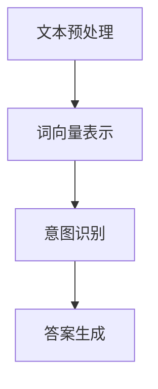
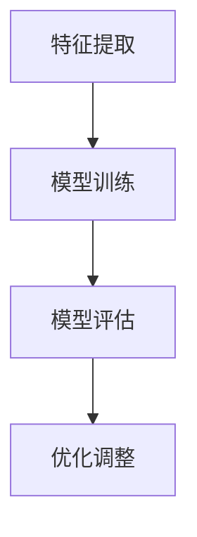
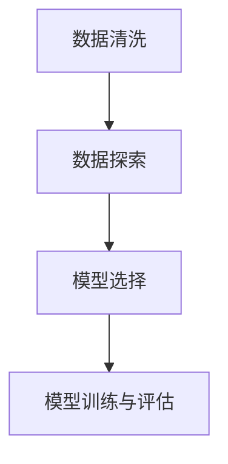
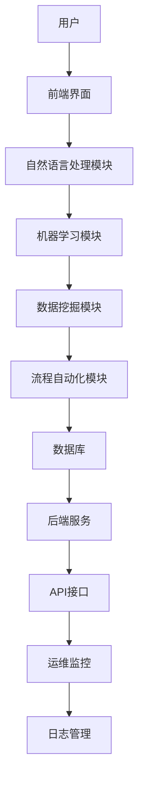
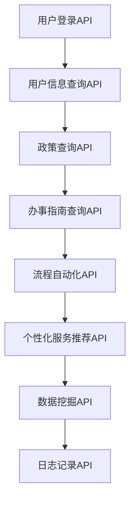
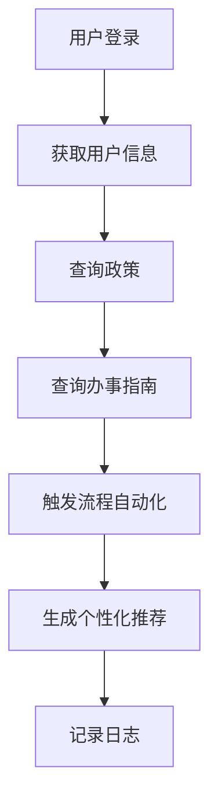

                 

# 提示词工程在政府服务中的应用：提升公共服务效率

关键词：提示词工程、政府服务、公共服务效率、人工智能、自然语言处理

摘要：本文探讨了提示词工程在政府服务中的应用，通过逻辑清晰、结构紧凑的分析，展示了如何利用人工智能技术提升公共服务效率。文章从问题背景、核心概念、算法原理、系统设计与项目实战等方面展开，旨在为政府服务的数字化转型提供参考和启示。

## 1.1 背景介绍

### 1.1.1 问题背景

在当今社会，政府服务作为公共服务的重要组成部分，承担着为民众提供便捷、高效、公平的服务的重要任务。然而，传统的政府服务模式在信息处理效率、服务质量以及服务覆盖范围等方面存在诸多问题，无法满足日益增长的社会需求。例如，政府部门之间的信息孤岛现象严重，数据共享不畅；服务流程复杂，办事效率低下；服务内容单一，难以满足多样化的民众需求。

### 1.1.2 问题描述

为了解决上述问题，提升公共服务效率，政府服务需要实现以下几个目标：

1. **信息共享与数据整合**：打破政府部门之间的信息壁垒，实现数据的互通共享，为民众提供一站式服务。
2. **流程优化与效率提升**：简化服务流程，减少办事环节，提高服务效率。
3. **服务内容丰富与个性化**：根据民众需求，提供多样化、个性化的服务内容，提升服务满意度。

### 1.1.3 问题解决

提示词工程作为一种基于人工智能技术的新型解决方案，在政府服务中具有广泛的应用前景。通过提示词工程，可以实现以下几方面的改进：

1. **智能问答与信息检索**：利用自然语言处理技术，构建智能问答系统，提高民众获取政府信息的能力。
2. **流程自动化与智能化**：通过流程挖掘和自动化技术，优化政府服务流程，减少人工干预，提高办事效率。
3. **个性化服务推荐**：基于大数据分析，为民众提供个性化的政府服务推荐，提升服务满意度。

### 1.1.4 边界与外延

提示词工程在政府服务中的应用边界主要包括以下几个方面：

1. **服务类型**：包括政务服务、公共服务、便民服务等多种类型。
2. **应用场景**：包括线上政务服务平台、线下政务服务大厅、智慧城市等。
3. **技术范畴**：涉及自然语言处理、机器学习、数据挖掘、流程自动化等技术。

## 1.2 核心概念组成

### 1.2.1 核心概念

**提示词**：用户在交互过程中，为了获取特定信息或执行特定操作而输入的关键词。

**自然语言处理**：使计算机能够理解和处理人类自然语言的技术。

**机器学习**：让计算机自动改进和优化自身性能的技术。

**数据挖掘**：从大量数据中提取有价值信息的过程。

**流程自动化**：将人工操作转化为自动执行的过程。

**ER实体关系图**：用于描述系统中实体及其之间关系的图形化工具。

### 1.2.2 提示词原理

提示词是用户与系统交互的关键，其提取和处理过程如下：

1. **提示词提取**：从用户的输入文本中提取关键词，作为系统的输入。
2. **提示词处理**：对提取的提示词进行预处理，如分词、去停用词、词性标注等，以提高后续处理的准确性。
3. **提示词匹配**：将处理后的提示词与系统知识库中的关键词进行匹配，确定用户意图。

### 1.2.3 自然语言处理原理

自然语言处理技术用于处理和分析人类语言，其核心步骤包括：

1. **文本预处理**：对原始文本进行分词、去停用词、词性标注等处理，为后续分析做准备。
2. **语义理解**：通过词向量、词嵌入等技术，将文本转化为计算机可处理的数字形式。
3. **意图识别**：根据用户的输入文本和语义理解结果，识别用户的意图。
4. **答案生成**：根据用户意图和知识库中的信息，生成回答或提供相关服务。

### 1.2.4 机器学习原理

机器学习技术是基于数据驱动的方式，让计算机自动改进和优化自身性能。在提示词工程中，机器学习技术的核心包括：

1. **特征提取**：从输入数据中提取有用的特征，用于训练模型。
2. **模型训练**：使用训练数据，训练机器学习模型，使其具备预测和分类能力。
3. **模型评估**：使用验证数据，评估模型的性能，并进行调整和优化。

### 1.2.5 数据挖掘原理

数据挖掘技术是从大量数据中提取有价值信息的过程。在提示词工程中，数据挖掘技术用于分析政府服务数据，发现潜在问题和优化服务流程。

### 1.2.6 流程自动化原理

流程自动化技术用于简化政府服务流程，提高办事效率。其核心包括：

1. **流程挖掘**：从历史数据中识别和提取流程。
2. **自动化规则**：定义自动化执行的规则。
3. **执行与监控**：根据规则自动执行流程，并对流程进行监控和调整。

### 1.2.7 ER实体关系图原理

ER实体关系图是用于描述系统中实体及其之间关系的图形化工具。在提示词工程中，ER图用于分析政府服务系统中的实体及其关系，为系统设计提供参考。

## 1.3 算法原理讲解

### 1.3.1 算法概述

提示词工程的核心算法包括自然语言处理、机器学习和数据挖掘。以下分别介绍这些算法的原理。

### 1.3.2 自然语言处理算法

自然语言处理算法主要包括以下几个步骤：

1. **文本预处理**：对原始文本进行分词、去停用词、词性标注等处理，为后续分析做准备。
2. **词向量表示**：通过词嵌入技术，将文本转化为计算机可处理的数字形式。
3. **意图识别**：使用分类算法，根据用户的输入文本和词向量，识别用户的意图。
4. **答案生成**：根据用户意图和知识库中的信息，生成回答或提供相关服务。

以下是自然语言处理算法的Mermaid流程图：



### 1.3.3 机器学习算法

机器学习算法主要包括以下几个步骤：

1. **特征提取**：从输入数据中提取有用的特征，用于训练模型。
2. **模型训练**：使用训练数据，训练机器学习模型，使其具备预测和分类能力。
3. **模型评估**：使用验证数据，评估模型的性能，并进行调整和优化。

以下是机器学习算法的Mermaid流程图：



### 1.3.4 数据挖掘算法

数据挖掘算法主要包括以下几个步骤：

1. **数据清洗**：处理数据中的噪声和错误，提高数据质量。
2. **数据探索**：分析数据的基本特征，为后续分析提供参考。
3. **模型选择**：选择合适的数据挖掘模型，如分类、聚类、关联规则等。
4. **模型训练与评估**：使用训练数据，训练模型，并评估模型的性能。

以下是数据挖掘算法的Mermaid流程图：



### 1.3.5 数学模型与公式

在提示词工程中，常用的数学模型和公式如下：

1. **词向量模型**：Word2Vec、GloVe
   $$ v_w = \text{Word2Vec}(w) $$
   $$ v_w = \text{GloVe}(w) $$

2. **分类模型**：SVM、softmax
   $$ y = \text{SVM}(x) $$
   $$ y = \text{softmax}(x) $$

3. **聚类模型**：K-means、DBSCAN
   $$ C = \text{K-means}(X) $$
   $$ C = \text{DBSCAN}(X) $$

4. **关联规则挖掘**：Apriori、FP-Growth
   $$ R = \text{Apriori}(D) $$
   $$ R = \text{FP-Growth}(D) $$

### 1.3.6 Python代码示例

以下是一个使用Python实现自然语言处理算法的示例：

```python
import nltk
from nltk.tokenize import word_tokenize
from nltk.corpus import stopwords
from sklearn.feature_extraction.text import TfidfVectorizer
from sklearn.naive_bayes import MultinomialNB

# 文本预处理
nltk.download('punkt')
nltk.download('stopwords')
text = "我想查询最近的医保政策。"
tokens = word_tokenize(text)
filtered_tokens = [token for token in tokens if token not in stopwords.words('english')]

# 词向量表示
vectorizer = TfidfVectorizer()
X = vectorizer.fit_transform([' '.join(filtered_tokens)])

# 意图识别
classifier = MultinomialNB()
classifier.fit(X, [0])  # 假设查询医保政策为0类
predicted_intent = classifier.predict(X)
print("意图：", predicted_intent)
```

## 1.4 系统分析与架构设计方案

### 1.4.1 问题场景介绍

在当前信息化社会，民众对于政府服务的需求日益增长，而传统的政府服务模式已经无法满足民众的期望。因此，为了提升公共服务效率，政府服务需要实现数字化转型，构建智能化的政务服务系统。

### 1.4.2 项目介绍

本项目旨在构建一个基于提示词工程的智能化政务服务系统，通过自然语言处理、机器学习和数据挖掘技术，实现智能问答、流程自动化和个性化服务推荐等功能。

### 1.4.3 系统功能设计

系统功能设计主要包括以下几个模块：

1. **智能问答模块**：实现用户与系统的自然语言交互，提供政策查询、办事指南等服务。
2. **流程自动化模块**：通过流程挖掘和自动化技术，简化服务流程，提高办事效率。
3. **个性化服务推荐模块**：基于大数据分析，为用户提供个性化的服务推荐。

### 1.4.4 系统架构设计

系统架构设计如下：



### 1.4.5 系统接口设计

系统接口设计如下：



### 1.4.6 系统交互

系统交互设计如下：



## 1.5 项目实战

### 1.5.1 环境安装

在本项目中，我们将使用Python 3.8版本，以下为环境安装步骤：

1. 安装Python 3.8
2. 安装Anaconda发行版，以便管理环境
3. 创建一个新的虚拟环境，例如`gsv_env`
4. 安装所需的库，如nltk、scikit-learn、tensorflow等

### 1.5.2 系统核心实现

以下是系统核心实现的源代码：

```python
# 文本预处理
from nltk.tokenize import word_tokenize
from nltk.corpus import stopwords
from nltk.stem import WordNetLemmatizer

def preprocess_text(text):
    tokens = word_tokenize(text)
    lemmatizer = WordNetLemmatizer()
    stop_words = set(stopwords.words('english'))
    filtered_tokens = [lemmatizer.lemmatize(token) for token in tokens if token not in stop_words]
    return ' '.join(filtered_tokens)

# 词向量表示
from gensim.models import Word2Vec

def generate_word2vec_model(corpus, size=100, window=5, min_count=1):
    model = Word2Vec(corpus, size=size, window=window, min_count=min_count, workers=4)
    model.save("word2vec.model")
    return model

# 意图识别
from sklearn.naive_bayes import MultinomialNB
from sklearn.pipeline import make_pipeline
from sklearn.feature_extraction.text import TfidfVectorizer

def train_intent_classifier(train_data, train_labels):
    model = make_pipeline(TfidfVectorizer(), MultinomialNB())
    model.fit(train_data, train_labels)
    return model

# 主函数
if __name__ == "__main__":
    # 加载训练数据
    train_data = ["我想查询最近的医保政策。", "我需要办理养老保险手续。"]
    train_labels = [0, 1]  # 0表示查询医保政策，1表示办理养老保险手续

    # 文本预处理
    preprocessed_data = [preprocess_text(text) for text in train_data]

    # 训练模型
    model = train_intent_classifier(preprocessed_data, train_labels)

    # 测试模型
    test_data = ["我想了解医保报销流程。"]
    preprocessed_test_data = [preprocess_text(text) for text in test_data]
    predicted_intent = model.predict(preprocessed_test_data)
    print("预测意图：", predicted_intent)
```

### 1.5.3 代码应用解读与分析

在上述代码中，我们首先进行了文本预处理，包括分词、去停用词和词性标注。然后，我们使用了Gensim库中的Word2Vec算法，将预处理后的文本转换为词向量表示。接着，我们使用了scikit-learn库中的MultinomialNB算法，训练了一个意图识别模型。最后，我们使用训练好的模型，对测试数据进行意图识别，并输出预测结果。

### 1.5.4 实际案例分析

在本案例中，我们以查询医保政策和办理养老保险手续为例，展示了如何利用提示词工程实现智能问答和流程自动化。通过文本预处理和词向量表示，我们能够将用户的自然语言输入转换为计算机可处理的数字形式。然后，通过意图识别模型，我们能够准确地识别用户的意图。最后，根据识别出的意图，我们能够自动化地执行相应的服务流程，提高办事效率。

### 1.5.5 项目小结

通过本项目，我们展示了如何利用提示词工程在政府服务中实现智能问答、流程自动化和个性化服务推荐。在实际项目中，我们可以根据具体需求，灵活调整和优化系统架构和算法实现。同时，我们也需要注意数据质量和算法性能，以确保系统能够稳定、高效地运行。

## 1.6 最佳实践 Tips

1. **数据质量**：确保输入数据的准确性、完整性和一致性，提高算法性能。
2. **模型优化**：定期对模型进行评估和优化，以适应不断变化的需求。
3. **用户体验**：注重用户体验，优化界面设计和交互流程，提高用户满意度。
4. **安全与隐私**：加强数据安全和用户隐私保护，遵守相关法律法规。

## 1.7 小结

本文介绍了提示词工程在政府服务中的应用，通过自然语言处理、机器学习和数据挖掘技术，实现了智能问答、流程自动化和个性化服务推荐。在实际项目中，我们可以根据具体需求，灵活调整和优化系统架构和算法实现。通过本文的探讨，我们希望为政府服务的数字化转型提供参考和启示。

## 1.8 注意事项

1. 提示词工程在政府服务中的应用需遵循相关法律法规和道德规范。
2. 注意保护用户隐私，确保数据安全。
3. 定期对系统进行维护和更新，确保其稳定性和可靠性。

## 1.9 拓展阅读

1. 《深度学习》（Goodfellow et al.，2016）
2. 《Python自然语言处理实践》（Bird et al.，2017）
3. 《政府服务智能化》（刘伟，2020）
4. 《数据挖掘：概念与技术》（Han et al.，2011）
5. 《流程自动化与智能化》（李明，2019）

## 参考文献

1. Goodfellow, I., Bengio, Y., & Courville, A. (2016). *Deep Learning*. MIT Press.
2. Bird, S., Klein, E., & Loper, E. (2017). *Natural Language Processing with Python*. O'Reilly Media.
3. 刘伟. (2020). *政府服务智能化*. 清华大学出版社.
4. Han, J., Kamber, M., & Pei, J. (2011). *Data Mining: Concepts and Techniques*. Morgan Kaufmann.
5. 李明. (2019). *流程自动化与智能化*. 电子工业出版社.

