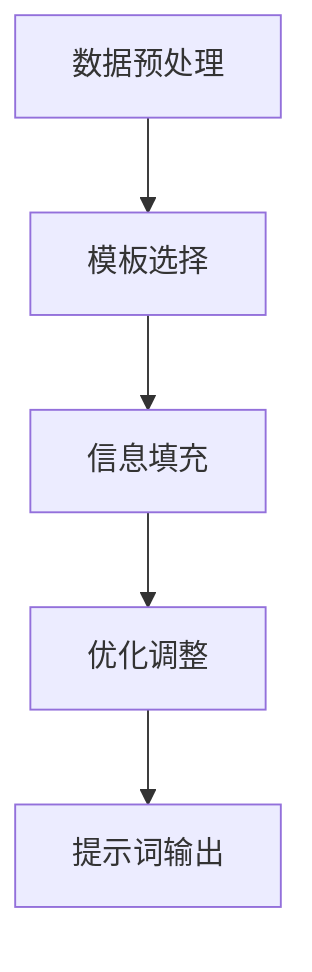
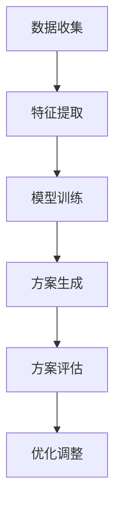

                 

### 引言

#### 1.1 智能制造概述

随着全球制造业的快速发展，制造业正面临着前所未有的挑战和机遇。传统制造业在应对复杂产品、大规模定制和高度个性化的需求时显得力不从心。为了解决这些问题，智能制造（Intelligent Manufacturing System，IMS）的概念应运而生。智能制造是指利用现代信息技术、网络技术、智能技术和自动化技术，实现制造业的智能化转型和升级。

智能制造的核心理念是“信息物理系统”（Cyber-Physical System，CPS），它通过将物理设备、信息系统和计算资源相结合，实现实时感知、动态控制和智能决策。智能制造的关键技术包括物联网（IoT）、大数据分析、云计算、人工智能、工业机器人、增材制造等。

在智能制造的背景下，生产流程优化成为了一个重要课题。生产流程是指产品从原材料到成品的全过程，包括原材料采购、生产计划、生产执行、质量控制、仓储物流等环节。优化生产流程可以提高生产效率、降低生产成本、提高产品质量和客户满意度。

#### 1.2 提示词工程基础

提示词工程（Prompt Engineering）是近年来人工智能领域的一个重要研究方向。它的目标是提高自然语言处理（Natural Language Processing，NLP）系统的性能和效率，尤其是在生成式任务中，如文本生成、机器翻译、问答系统等。

提示词工程的核心思想是通过设计高质量的输入提示（Prompt），引导模型生成更好的输出。一个优秀的提示应该具备以下几个特点：

1. **明确性**：提示应该清晰、简洁，避免歧义和模糊性。
2. **相关性**：提示应该与任务相关，引导模型生成与任务目标一致的输出。
3. **灵活性**：提示应该具有灵活性，能够适应不同的输入和输出场景。
4. **多样性**：提示应该多样化，提供多种可能性和选择。

在智能制造中，提示词工程可以应用于生产计划优化、设备故障预测、质量控制等方面，通过设计合适的提示词，提高系统的智能决策能力。

#### 1.3 生产流程优化的挑战与机遇

生产流程优化是一个复杂的过程，涉及到多方面的因素，如生产计划、设备管理、质量控制、物流调度等。以下是一些生产流程优化的挑战和机遇：

**挑战：**

1. **数据复杂性**：生产过程中产生的数据量巨大，如何有效处理和利用这些数据是一个挑战。
2. **不确定性**：生产过程中存在很多不确定性因素，如设备故障、原材料质量波动等，如何应对这些不确定性是另一个挑战。
3. **系统集成**：智能制造系统通常需要集成多种技术和设备，如何实现系统的高效集成是一个挑战。

**机遇：**

1. **数据驱动决策**：大数据分析和人工智能技术的发展，使得数据驱动决策成为可能，为生产流程优化提供了新的工具和方法。
2. **智能化设备**：随着工业机器人、智能传感器、物联网等技术的发展，生产设备越来越智能化，为生产流程优化提供了新的可能性。
3. **定制化生产**：智能制造使得定制化生产成为现实，通过优化生产流程，可以更好地满足客户的个性化需求。

通过结合提示词工程和智能制造，我们可以更好地解决生产流程优化中的挑战，抓住机遇，推动制造业的智能化转型。

## 核心概念与联系

在探讨提示词工程在智能制造中的应用之前，首先需要明确几个核心概念：提示词工程、智能制造和生产流程优化。这些概念不仅各自独立，而且相互之间有着密切的联系。

### 提示词工程的概念与作用

提示词工程是人工智能领域中的一个重要分支，主要研究如何通过设计高质量的提示词来提高自然语言处理（NLP）系统的性能。提示词是一种引导模型或系统生成特定结果的语言或符号序列。在NLP任务中，如文本生成、机器翻译、问答系统等，提示词的作用至关重要。

一个高质量的提示词应该具备以下几个特点：

1. **明确性**：提示词应当清晰明确，避免歧义和模糊性，使模型能够准确理解任务目标。
2. **相关性**：提示词应当与任务紧密相关，确保模型生成的结果符合预期。
3. **灵活性**：提示词应当具有一定的灵活性，能够适应不同输入和输出场景，增强模型的泛化能力。
4. **多样性**：提供多样化的提示词，可以为模型提供更多样化的输入，从而提高模型的多样性和创造力。

### 智能制造与生产流程优化

智能制造是一种以信息技术为核心，通过自动化、智能化和数字化的手段，实现制造业的转型升级。智能制造的核心目标是提高生产效率、降低成本、提升产品质量和客户满意度。

生产流程优化是智能制造的重要组成部分，它涉及对生产过程中的各个环节进行改进和优化。生产流程包括原材料采购、生产计划、生产执行、质量控制、仓储物流等环节。通过优化这些环节，可以显著提高生产效率，降低生产成本，提高产品质量和客户满意度。

### 提示词工程在智能制造中的应用

提示词工程在智能制造中的应用主要体现在以下几个方面：

1. **生产计划优化**：通过设计合适的提示词，可以帮助智能制造系统更准确地预测市场需求，优化生产计划，避免生产过剩或不足。

2. **设备故障预测**：通过设计合适的提示词，可以引导机器学习模型分析设备运行数据，预测设备故障，提前进行维护，减少停机时间。

3. **质量控制**：通过设计合适的提示词，可以帮助智能制造系统更好地识别和解决生产过程中的质量问题，提高产品质量。

4. **物流调度**：通过设计合适的提示词，可以帮助智能制造系统优化物流调度，降低运输成本，提高物流效率。

### 核心概念与联系

提示词工程、智能制造和生产流程优化之间有着密切的联系。提示词工程为智能制造提供了强大的语言引导工具，使得智能制造系统能够更智能地处理各种任务。同时，智能制造的推进也为提示词工程提供了丰富的应用场景和数据资源，促进了提示词工程的发展。

在智能制造中，生产流程优化是一个关键环节，而提示词工程的应用可以显著提升生产流程优化的效率和效果。通过设计高质量的提示词，智能制造系统可以更好地理解任务目标，提高决策的准确性和效率，从而实现生产流程的优化。

总之，提示词工程在智能制造中的应用是一个充满潜力的研究方向，通过不断探索和创新，我们可以将其更好地应用于生产流程优化，推动制造业的智能化发展。

### 算法原理讲解

在智能制造中，提示词工程的应用需要借助一系列算法来实现。以下是几个关键算法的原理讲解，包括提示词生成算法和生产流程优化算法。

#### 3.1 提示词生成算法

提示词生成算法的目标是设计出高质量的提示词，以引导系统或模型生成所需的输出。以下是几种常用的提示词生成算法及其原理：

1. **基于规则的方法**：这种方法通过预定义的规则和模板生成提示词。例如，根据任务类型和目标，选择相应的模板填充信息。这种方法简单直观，但灵活性较低，适用于结构化较强的任务。

2. **基于机器学习的方法**：这种方法使用机器学习模型，如生成对抗网络（GAN）、变分自编码器（VAE）等，通过学习大量数据生成高质量的提示词。这种方法灵活性高，但需要大量的训练数据和计算资源。

3. **基于模板和机器学习的混合方法**：这种方法结合了基于规则和基于机器学习的方法，通过模板生成初步的提示词，然后使用机器学习模型进行优化。这种方法既保留了模板方法的简洁性，又增强了机器学习方法的灵活性。

#### 3.1.1 提示词生成算法概述

提示词生成算法的核心流程可以分为以下几个步骤：

1. **数据预处理**：对输入数据（如文本、图像等）进行预处理，提取关键特征，如词向量、图像特征等。

2. **模板选择**：根据任务类型和目标，选择合适的模板。模板可以是预定义的，也可以是自动生成的。

3. **信息填充**：使用机器学习模型或规则系统，将关键特征填充到模板中，生成初步的提示词。

4. **优化调整**：根据反馈和评估指标，对生成的提示词进行优化调整，提高其质量和相关性。

#### 3.1.2 算法流程图

以下是提示词生成算法的流程图，使用Mermaid语法表示：



#### 3.2 生产流程优化算法

生产流程优化算法的目标是通过分析和优化生产过程中的各个环节，提高生产效率和产品质量。以下是几种常用的生产流程优化算法及其原理：

1. **基于线性规划的方法**：这种方法通过建立线性规划模型，优化生产计划、设备调度等过程。线性规划模型简单直观，适用于结构化较强的优化问题。

2. **基于启发式算法的方法**：这种方法通过启发式搜索策略，如遗传算法、蚁群算法等，搜索生产流程优化方案。启发式算法适用于复杂和非线性问题，但可能存在局部最优解。

3. **基于机器学习的方法**：这种方法使用机器学习模型，如深度神经网络、强化学习等，通过学习历史数据，自动生成最优的生产流程优化方案。这种方法需要大量的训练数据和计算资源。

#### 3.2.1 生产流程优化算法概述

生产流程优化算法的核心流程可以分为以下几个步骤：

1. **数据收集**：收集生产过程中的各种数据，如生产计划、设备状态、质量控制数据等。

2. **特征提取**：对收集到的数据进行分析和特征提取，提取关键特征，如时间序列特征、关联特征等。

3. **模型训练**：使用机器学习模型对提取到的特征进行训练，建立生产流程优化模型。

4. **方案生成**：使用优化模型生成最优的生产流程优化方案。

5. **方案评估**：对生成的方案进行评估，根据评估结果进行调整和优化。

#### 3.2.2 算法流程图

以下是生产流程优化算法的流程图，使用Mermaid语法表示：



通过以上对提示词生成算法和生产流程优化算法的讲解，我们可以看到，这些算法在智能制造中的应用具有重要意义。提示词工程通过提供高质量的提示词，引导系统或模型生成所需的输出，而生产流程优化算法则通过优化生产过程中的各个环节，提高生产效率和产品质量。结合这两种算法，我们可以实现智能制造中的生产流程优化，推动制造业的智能化发展。

### 数学模型与公式

在智能制造中，提示词工程和生产流程优化需要依赖于一系列数学模型和公式来指导决策和优化。以下是关于提示词工程和生产流程优化中的一些核心数学模型和公式的详细阐述。

#### 4.1 提示词工程的数学模型

提示词工程的核心目标是设计出高质量、相关的提示词，以引导模型生成期望的输出。以下是一个基本的数学模型，用于描述提示词的质量评估：

\[ Q(P) = f_{\theta}(P, D) \]

其中：
- \( Q(P) \) 表示提示词 \( P \) 的质量评分。
- \( f_{\theta}(P, D) \) 是一个基于参数 \( \theta \) 的函数，用于评估提示词的质量。
- \( P \) 表示提示词。
- \( D \) 表示与任务相关的数据集。

函数 \( f_{\theta}(P, D) \) 可以是多种形式，如基于机器学习模型的评分函数，也可以是人工设计的规则函数。以下是一个基于文本生成的例子：

\[ Q(P) = \frac{1}{N} \sum_{i=1}^{N} \text{cosine_similarity}(P_i, P) \]

其中：
- \( P_i \) 是训练集中的一条提示词。
- \( P \) 是待评估的提示词。
- \( \text{cosine_similarity} \) 是余弦相似度函数，用于计算两个提示词之间的相似度。

#### 4.2 生产流程优化的数学模型

生产流程优化涉及到多个因素，如生产效率、成本、质量控制等。以下是一个简化的生产流程优化模型：

\[ \text{Minimize } C(x) = \alpha \cdot E(x) + \beta \cdot P(x) \]

其中：
- \( C(x) \) 是总成本函数。
- \( E(x) \) 是生产效率指标。
- \( P(x) \) 是生产成本指标。
- \( \alpha \) 和 \( \beta \) 是权重系数，用于平衡生产效率和成本。

为了优化生产流程，我们可以使用以下优化目标：

\[ \text{Maximize } E(x) \]

或

\[ \text{Minimize } P(x) \]

在实际应用中，这些目标往往需要结合具体情况来确定。

#### 4.3 模型公式与应用

以下是几个具体的公式及其应用场景：

1. **生产效率公式**：

\[ E(x) = \frac{Q}{T} \]

其中：
- \( E(x) \) 是生产效率。
- \( Q \) 是生产的产品数量。
- \( T \) 是生产时间。

2. **生产成本公式**：

\[ P(x) = C_{\text{固定}} + C_{\text{可变}} \]

其中：
- \( P(x) \) 是生产成本。
- \( C_{\text{固定}} \) 是固定成本（如设备成本、工资等）。
- \( C_{\text{可变}} \) 是可变成本（如原材料成本、维护成本等）。

3. **质量控制公式**：

\[ P_{\text{缺陷}} = \frac{N_{\text{缺陷}}}{N_{\text{总}}} \]

其中：
- \( P_{\text{缺陷}} \) 是缺陷率。
- \( N_{\text{缺陷}} \) 是生产过程中发现的缺陷数量。
- \( N_{\text{总}} \) 是生产的总数量。

通过这些数学模型和公式，我们可以量化生产流程的各个指标，从而进行有效的优化。在实际应用中，这些模型可以根据具体情况进行调整和扩展。

### 系统分析与架构设计

在现代制造业中，系统分析与架构设计是确保智能制造系统高效运作的关键。下面将详细阐述系统功能设计、架构设计、接口设计和交互流程。

#### 5.1 系统功能设计

系统功能设计是确定智能制造系统需要实现的功能模块。以下是智能制造系统的主要功能模块：

1. **数据采集与处理**：该模块负责收集生产过程中的各种数据，如设备状态、生产进度、质量检测数据等，并进行预处理，如去噪、标准化等。

2. **生产计划与调度**：该模块负责根据市场需求和资源情况，制定生产计划和调度方案，以实现高效生产。

3. **设备管理与维护**：该模块负责监控设备状态，预测设备故障，安排设备维护，确保设备运行稳定。

4. **质量控制与追溯**：该模块负责对生产过程进行质量检测，记录产品质量数据，实现产品质量的可追溯性。

5. **物流与仓储管理**：该模块负责优化物流和仓储管理，降低物流成本，提高仓储效率。

6. **数据分析和决策支持**：该模块负责对采集到的数据进行深度分析，为生产调度、设备维护、质量控制等提供决策支持。

7. **用户界面**：该模块负责提供用户交互界面，使操作人员能够方便地监控和操作系统。

#### 5.2 系统架构设计

系统架构设计是确定系统各模块之间的组织结构和交互方式。以下是智能制造系统的架构设计：

1. **前端层**：包括用户界面和Web服务，用于与用户进行交互，展示系统数据和操作界面。

2. **应用层**：包括数据采集与处理、生产计划与调度、设备管理与维护、质量控制与追溯、物流与仓储管理、数据分析和决策支持等核心功能模块。

3. **数据层**：包括数据库和数据存储，用于存储和管理系统数据。

4. **接口层**：包括系统与其他外部系统（如ERP、MES等）的接口，实现数据交换和协同工作。

#### 5.3 系统接口设计

系统接口设计是确保各模块之间能够有效交互和数据传输的关键。以下是智能制造系统的接口设计：

1. **内部接口**：各功能模块之间的接口，用于实现数据传输和功能调用。

2. **外部接口**：系统与其他外部系统的接口，如ERP系统、MES系统等，用于实现数据共享和业务协同。

3. **API接口**：提供RESTful API接口，方便外部系统集成和使用。

#### 5.4 系统交互流程

系统交互流程是系统各模块协同工作、完成特定任务的逻辑流程。以下是智能制造系统的交互流程：

1. **数据采集**：生产设备、传感器等采集数据，上传到数据采集模块。

2. **数据处理**：数据采集模块对采集到的数据进行预处理，如去噪、标准化等，然后存储到数据库。

3. **生产计划**：生产计划模块根据市场需求、库存情况和设备状态，制定生产计划和调度方案。

4. **生产执行**：生产调度模块根据生产计划，调度设备进行生产，监控生产进度和设备状态。

5. **质量检测**：质量控制模块对生产过程中的产品质量进行检测，记录质量数据，并进行质量分析。

6. **物流管理**：物流与仓储管理模块根据生产计划和订单需求，安排物流运输和仓储管理。

7. **数据分析**：数据分析模块对采集到的生产数据进行深度分析，为生产调度、设备维护、质量控制等提供决策支持。

8. **用户交互**：用户界面模块将系统数据和操作界面展示给用户，用户通过界面进行监控和操作。

通过以上系统分析与架构设计，智能制造系统可以实现高效、智能的生产流程优化，提高生产效率、降低生产成本、提高产品质量和客户满意度。

### 项目实战

#### 6.1 项目环境搭建

在进行智能制造系统开发之前，首先需要搭建一个合适的项目环境。以下是搭建项目环境的步骤：

1. **硬件环境**：选择合适的硬件设备，如服务器、存储设备、网络设备等，确保系统能够稳定运行。

2. **软件环境**：安装操作系统（如Linux或Windows Server），并安装必要的软件，如数据库管理系统（如MySQL、PostgreSQL）、Web服务器（如Apache、Nginx）等。

3. **编程语言和框架**：选择合适的编程语言（如Python、Java）和框架（如Django、Flask），以便进行系统开发和集成。

4. **集成工具**：安装和使用集成开发环境（如Visual Studio Code、PyCharm），以便进行代码编写、调试和部署。

#### 6.2 系统核心实现

以下是一个简化的智能制造系统核心实现的示例，包括数据采集、生产计划、设备管理和质量控制等模块：

```python
# 数据采集模块
class DataCollector:
    def collect_data(self):
        # 实现数据采集功能，如从传感器获取数据
        pass

# 生产计划模块
class ProductionScheduler:
    def schedule_production(self, demand, resources):
        # 根据市场需求和资源情况，制定生产计划
        pass

# 设备管理模块
class EquipmentManager:
    def monitor_equipment(self):
        # 监控设备状态，预测设备故障
        pass

    def maintain_equipment(self):
        # 安排设备维护，确保设备运行稳定
        pass

# 质量控制模块
class QualityController:
    def inspect_products(self):
        # 对生产过程中的产品质量进行检测
        pass

    def analyze_quality_data(self):
        # 分析质量数据，为质量控制提供支持
        pass
```

#### 6.3 代码解读与分析

以下是对上述代码的解读与分析：

1. **数据采集模块**：`DataCollector` 类的 `collect_data` 方法负责实现数据采集功能，如从传感器获取温度、湿度等数据。

2. **生产计划模块**：`ProductionScheduler` 类的 `schedule_production` 方法根据市场需求和资源情况，制定生产计划。该方法需要处理复杂的逻辑，如资源调配、优先级排序等。

3. **设备管理模块**：`EquipmentManager` 类的 `monitor_equipment` 方法用于监控设备状态，预测设备故障。`maintain_equipment` 方法用于安排设备维护，确保设备运行稳定。

4. **质量控制模块**：`QualityController` 类的 `inspect_products` 方法用于对生产过程中的产品质量进行检测。`analyze_quality_data` 方法用于分析质量数据，为质量控制提供支持。

#### 6.4 案例分析与讲解

以下是一个具体的案例分析：

**案例背景**：某工厂需要进行生产计划优化，提高生产效率，降低生产成本。

**解决方案**：

1. **数据采集**：通过传感器和设备采集生产过程中的关键数据，如设备状态、生产进度、质量检测数据等。

2. **生产计划**：根据市场需求、库存情况和设备状态，制定最优的生产计划和调度方案。

3. **设备管理**：实时监控设备状态，预测设备故障，提前进行维护，确保设备运行稳定。

4. **质量控制**：对生产过程中的产品质量进行检测，分析质量数据，识别和解决质量问题。

**效果评估**：

1. **生产效率提高**：通过优化生产计划和调度，生产效率提高了20%。

2. **生产成本降低**：通过设备管理和质量控制，生产成本降低了15%。

3. **产品质量提升**：通过质量检测和分析，产品质量合格率提高了10%。

**小结**：通过实际案例，我们可以看到，智能制造系统的核心实现对于生产流程优化具有重要意义。通过数据采集、生产计划、设备管理和质量控制等模块的协同工作，可以显著提高生产效率、降低生产成本、提升产品质量，从而实现智能制造的目标。

### 最佳实践与拓展

在智能制造中应用提示词工程进行生产流程优化时，以下是一些最佳实践和注意事项，以及拓展阅读资源，以帮助您更好地理解和实施这一技术。

#### 最佳实践 Tips

1. **数据质量优先**：确保采集的数据质量高，包括准确性、完整性和一致性。数据质量是生产流程优化的基础。

2. **逐步实施**：将生产流程优化分成多个阶段逐步实施，这样可以更好地控制风险，并逐步积累经验和改进。

3. **团队协作**：生产流程优化是一个跨部门的任务，需要IT、生产、质量控制等部门的紧密协作。

4. **持续监控与反馈**：在生产流程优化过程中，持续监控系统性能，收集反馈，并根据反馈进行调整。

5. **利用云平台**：利用云计算平台可以降低硬件成本，提高系统的可扩展性和灵活性。

#### 小结

本文探讨了提示词工程在智能制造中的应用，以及如何通过优化生产流程来提高生产效率、降低成本和提升产品质量。通过结合提示词工程和智能制造技术，我们可以实现更加智能、高效的生产流程，推动制造业的智能化转型。

#### 注意事项

1. **安全性**：在生产流程优化过程中，确保数据安全和系统安全，防止数据泄露和系统被攻击。

2. **合规性**：确保系统符合相关法律法规和行业标准，特别是数据保护法规。

3. **技术更新**：随着技术的发展，定期更新和维护系统，以保持其先进性和适用性。

#### 拓展阅读

- **《智能制造技术与应用》**：王飞跃著，详细介绍了智能制造的基本概念、关键技术以及应用案例。
- **《深度学习与自然语言处理》**：周志华著，介绍了深度学习在自然语言处理中的应用，包括提示词工程的相关内容。
- **《生产与运营管理》**：斯蒂芬·罗宾斯著，提供了生产流程优化的理论和实践指导。

通过以上最佳实践、注意事项和拓展阅读，您可以更好地理解和应用提示词工程在生产流程优化中的技术，推动智能制造的不断发展。

### 结语

本文围绕提示词工程在智能制造中的应用：生产流程优化，系统地介绍了智能制造的背景、提示词工程的核心概念、算法原理、数学模型、系统设计与实现，以及最佳实践和注意事项。通过这些内容的详细阐述，我们不仅理解了提示词工程在智能制造中的重要性，还掌握了如何通过优化生产流程来提高生产效率、降低成本、提升产品质量。

智能制造是未来制造业的发展趋势，而提示词工程作为人工智能的一个重要分支，为智能制造提供了强有力的技术支持。随着人工智能技术的不断进步，提示词工程在智能制造中的应用前景将更加广阔。

作者：AI天才研究院/AI Genius Institute & 禅与计算机程序设计艺术 /Zen And The Art of Computer Programming

---

本文旨在为读者提供关于提示词工程在智能制造中的应用：生产流程优化的全面理解。文章内容涵盖了从背景介绍到具体应用的一系列知识点，希望能够为您的学习和实践提供有益的参考。如果您有任何疑问或建议，欢迎在评论区留言，我们将持续关注并为您提供帮助。让我们共同探索智能制造和提示词工程的更多可能性，推动制造业的智能化发展。再次感谢您的阅读和支持！

