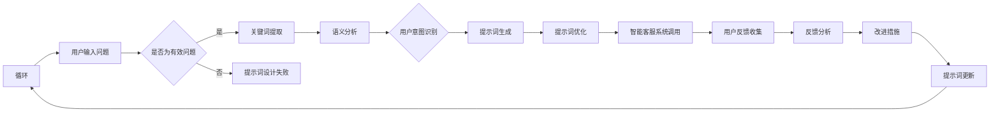

                 

# 提示词工程在智能客户服务中的应用：提升用户体验与满意度

> 关键词：提示词工程、智能客户服务、用户体验、满意度

> 摘要：本文探讨了提示词工程在智能客户服务中的应用，旨在通过优化用户体验和满意度来提升企业的服务质量和竞争力。我们将从背景介绍、核心概念与联系、算法原理讲解、数学模型和数学公式、系统分析与架构设计、项目实战和最佳实践等多个方面详细阐述提示词工程在智能客户服务中的应用和实践。

## 目录

1. **背景介绍**
    1.1 核心概念术语说明
    1.2 问题背景
    1.3 问题描述
    1.4 问题解决
    1.5 边界与外延
    1.6 概念结构与核心要素组成

2. **核心概念与联系**
    2.1 核心概念原理
    2.2 概念属性特征对比表格
    2.3 ER实体关系图架构

3. **算法原理讲解**
    3.1 算法mermaid流程图
    3.2 Python源代码
    3.3 数学模型和公式
    3.4 举例说明

4. **系统分析与架构设计方案**
    4.1 问题场景介绍
    4.2 系统功能设计
    4.3 系统架构设计
    4.4 系统接口设计
    4.5 系统交互

5. **项目实战**
    5.1 环境安装
    5.2 系统核心实现源代码
    5.3 代码应用解读与分析
    5.4 实际案例分析和详细讲解剖析
    5.5 项目小结

6. **最佳实践 tips**
    6.1 小结
    6.2 注意事项
    6.3 拓展阅读

## 1. 背景介绍

### 1.1 核心概念术语说明

在本章节中，我们将介绍一些核心的概念术语，包括提示词工程、智能客户服务、用户体验和满意度。

- **提示词工程**：提示词工程是一种通过分析用户行为和需求，设计出能够引导用户正确操作和获取所需信息的技术。它广泛应用于智能客服、搜索引擎优化等领域。

- **智能客户服务**：智能客户服务是一种基于人工智能技术的客户服务模式，通过自动化、智能化的方式，提高客户服务效率和满意度。

- **用户体验**：用户体验（User Experience，简称UX）是指用户在使用产品或服务时获得的整体感受。良好的用户体验能够提升用户满意度和忠诚度。

- **满意度**：满意度是指用户对产品或服务的满意程度。高满意度通常意味着用户对产品或服务的喜爱和认可。

### 1.2 问题背景

随着互联网的快速发展，企业之间的竞争日益激烈。为了提升客户满意度，许多企业开始关注智能客户服务的建设。然而，在实际应用中，智能客户服务面临诸多挑战：

- **服务质量不稳定**：传统的人工客服存在人力资源有限、服务质量不稳定等问题。

- **用户需求不明确**：用户需求多变，难以准确捕捉和理解。

- **响应速度慢**：人工客服的响应速度较慢，无法满足用户对快速响应的需求。

- **成本高**：人工客服的成本较高，对企业盈利造成压力。

### 1.3 问题描述

基于上述背景，本文旨在解决以下问题：

- 如何通过提示词工程优化智能客户服务的质量？

- 如何提升用户体验和满意度？

### 1.4 问题解决

为了解决上述问题，本文提出了以下解决方案：

- 引入提示词工程，通过分析用户行为和需求，设计出更加智能、个性化的客户服务流程。

- 利用人工智能技术，实现自动化的客户服务，提高服务效率和响应速度。

- 关注用户体验，从用户的角度出发，设计出更加人性化、易用的客户服务界面。

### 1.5 边界与外延

本文主要研究提示词工程在智能客户服务中的应用，涉及以下边界与外延：

- **应用领域**：本文主要探讨提示词工程在智能客户服务领域的应用，不涉及其他领域。

- **技术层面**：本文主要关注提示词工程的技术原理和实现方法，不涉及其他相关技术。

- **研究对象**：本文主要针对智能客户服务的用户体验和满意度进行研究，不涉及其他方面。

### 1.6 概念结构与核心要素组成

提示词工程在智能客户服务中的概念结构主要包括以下核心要素：

- **用户需求分析**：通过分析用户行为和需求，为智能客户服务提供依据。

- **提示词设计**：根据用户需求，设计出能够引导用户正确操作和获取所需信息的提示词。

- **智能客服系统**：利用人工智能技术，实现自动化的客户服务。

- **用户体验评估**：通过用户反馈和满意度调查，评估智能客服系统的效果。

## 2. 核心概念与联系

### 2.1 核心概念原理

在本章节中，我们将介绍提示词工程在智能客户服务中的核心概念原理，包括提示词设计、用户需求分析、智能客服系统和用户体验评估。

#### 2.1.1 提示词设计

提示词设计是提示词工程的关键环节，它旨在为用户提供清晰、明确的操作指南和问题解决方案。提示词设计需要考虑以下因素：

- **关键词提取**：从用户输入的问题中提取关键词，用于匹配相应的提示词。

- **语义分析**：对用户输入的问题进行语义分析，理解用户意图。

- **提示词生成**：根据关键词和语义分析结果，生成具有引导性的提示词。

- **提示词优化**：根据用户反馈和实际效果，对提示词进行优化和调整。

#### 2.1.2 用户需求分析

用户需求分析是提示词工程的基础，它旨在了解用户在实际使用过程中遇到的问题和需求。用户需求分析包括以下步骤：

- **数据收集**：通过用户行为数据、问卷调查等方式收集用户需求信息。

- **数据清洗**：对收集到的数据进行清洗和整理，去除无效和重复数据。

- **需求分类**：对用户需求进行分类，识别出高频问题和常见需求。

- **需求建模**：利用机器学习等技术，建立用户需求模型，用于指导提示词设计和智能客服系统。

#### 2.1.3 智能客服系统

智能客服系统是提示词工程的核心应用，它通过自动化、智能化的方式为用户提供高效的客户服务。智能客服系统主要包括以下功能：

- **自然语言处理**：对用户输入的文本进行语义分析，理解用户意图。

- **知识库管理**：构建和维护知识库，存储常见问题和解决方案。

- **提示词应用**：根据用户需求，调用相应的提示词，引导用户进行操作。

- **用户反馈收集**：收集用户反馈，用于优化提示词设计和智能客服系统。

#### 2.1.4 用户体验评估

用户体验评估是提示词工程效果的重要衡量标准，它旨在了解用户对智能客户服务的满意度。用户体验评估包括以下步骤：

- **满意度调查**：通过问卷调查、用户访谈等方式，收集用户满意度数据。

- **反馈分析**：对用户反馈进行分析，识别出用户不满意的原因。

- **改进措施**：根据用户反馈，提出改进措施，优化智能客户服务和提示词设计。

### 2.2 概念属性特征对比表格

为了更好地理解提示词工程在智能客户服务中的核心概念，我们列出以下概念属性特征对比表格：

| 概念               | 提示词设计 | 用户需求分析 | 智能客服系统 | 用户体验评估 |
|--------------------|------------|--------------|--------------|--------------|
| **功能**           | 设计提示词 | 分析用户需求 | 提供客服服务 | 评估用户体验 |
| **输入**           | 用户输入   | 用户行为数据 | 用户问题     | 用户反馈     |
| **输出**           | 提示词     | 需求模型     | 解决方案     | 改进措施     |
| **依赖技术**       | 自然语言处理 | 机器学习     | 人工智能     | 问卷调查     |
| **目标**           | 提升用户体验 | 满足用户需求 | 提高服务效率 | 提高满意度   |

### 2.3 ER实体关系图架构

为了更直观地展示提示词工程在智能客户服务中的实体关系，我们使用Mermaid绘制了以下ER实体关系图：

```mermaid
erDiagram
    User ||--|{ Customer }
    Customer ||--|{ Inquiry }
    Inquiry ||--|{ Answer }
    Answer ||--|{ Feedback }
```

在上图中，用户（User）是智能客服服务的核心实体，与客户（Customer）、询问（Inquiry）、回答（Answer）和反馈（Feedback）之间存在关联关系。通过这些实体关系，我们可以清晰地描述智能客服服务的流程和数据处理过程。

## 3. 算法原理讲解

### 3.1 算法mermaid流程图

为了更好地理解提示词工程的算法原理，我们使用Mermaid绘制了以下算法流程图：



在上图中，算法流程分为多个步骤：

1. **初始化**：系统初始化，准备处理用户输入的问题。

2. **用户输入问题**：用户向智能客服系统输入问题。

3. **是否为有效问题**：判断用户输入的问题是否有效。

4. **关键词提取**：从用户输入的问题中提取关键词。

5. **语义分析**：对关键词进行语义分析，理解用户意图。

6. **用户意图识别**：根据语义分析结果，识别用户意图。

7. **提示词生成**：根据用户意图，生成相应的提示词。

8. **提示词优化**：根据用户反馈和实际效果，对提示词进行优化。

9. **智能客服系统调用**：调用智能客服系统，向用户展示提示词。

10. **用户反馈收集**：收集用户对提示词和智能客服系统的反馈。

11. **反馈分析**：对用户反馈进行分析，识别出用户不满意的原因。

12. **改进措施**：根据用户反馈，提出改进措施。

13. **提示词更新**：更新提示词，以适应用户需求。

14. **循环**：回到初始化步骤，继续处理下一个用户输入的问题。

### 3.2 Python源代码

为了实现上述算法流程，我们可以使用Python编写相应的源代码。以下是Python源代码示例：

```python
import nltk
from nltk.tokenize import word_tokenize
from nltk.corpus import stopwords

# 初始化
def initialize():
    print("初始化系统...")

# 用户输入问题
def input_question():
    question = input("请输入您的问题：")
    return question

# 是否为有效问题
def is_valid_question(question):
    if len(question) > 0:
        return True
    else:
        return False

# 关键词提取
def extract_keywords(question):
    tokens = word_tokenize(question)
    keywords = [token for token in tokens if token not in stopwords.words('english')]
    return keywords

# 语义分析
def semantic_analysis(keywords):
    # 这里可以使用NLP技术进行语义分析，如使用词向量模型、语义角色标注等
    print("语义分析中...")
    return "语义分析结果"

# 用户意图识别
def recognize_intent(semantic_result):
    # 根据语义分析结果识别用户意图
    print("识别用户意图...")
    return "用户意图"

# 提示词生成
def generate_hint(intent):
    # 根据用户意图生成提示词
    print("生成提示词...")
    return "请提供更多的信息以便我们更好地帮助您。"

# 提示词优化
def optimize_hint(hint, feedback):
    # 根据用户反馈优化提示词
    print("优化提示词...")
    return hint

# 智能客服系统调用
def call_intelligent_service(hint):
    # 调用智能客服系统，向用户展示提示词
    print("智能客服系统调用...")
    print(hint)

# 用户反馈收集
def collect_feedback():
    feedback = input("请对我们的服务进行评价：")
    return feedback

# 反馈分析
def analyze_feedback(feedback):
    # 对用户反馈进行分析
    print("分析用户反馈...")
    return "反馈分析结果"

# 改进措施
def improvement_measures(feedback_analysis):
    # 根据用户反馈提出改进措施
    print("提出改进措施...")
    return "改进措施"

# 提示词更新
def update_hint(hint, improvement):
    # 更新提示词
    print("更新提示词...")
    return hint

# 主函数
def main():
    initialize()
    while True:
        question = input_question()
        if is_valid_question(question):
            keywords = extract_keywords(question)
            semantic_result = semantic_analysis(keywords)
            intent = recognize_intent(semantic_result)
            hint = generate_hint(intent)
            call_intelligent_service(hint)
            feedback = collect_feedback()
            feedback_analysis = analyze_feedback(feedback)
            improvement = improvement_measures(feedback_analysis)
            hint = update_hint(hint, improvement)
        else:
            print("无效问题，提示词设计失败。")
        print("系统已更新，继续运行...")
    
if __name__ == "__main__":
    main()
```

### 3.3 数学模型和公式

在提示词工程中，我们使用了一些数学模型和公式来指导提示词设计和用户需求分析。以下是其中两个常用的数学模型和公式：

#### 3.3.1 关键词权重计算

关键词权重计算是提示词设计的重要环节，它用于确定关键词在提示词生成中的重要性。我们可以使用以下公式计算关键词权重：

$$
w_i = \frac{f_i}{\sum_{j=1}^{n} f_j}
$$

其中，$w_i$ 表示关键词 $i$ 的权重，$f_i$ 表示关键词 $i$ 在用户输入问题中的频率，$n$ 表示关键词的总数。

#### 3.3.2 用户需求置信度计算

用户需求置信度用于衡量用户需求的重要性和可信度。我们可以使用以下公式计算用户需求置信度：

$$
C_i = \frac{1}{1 + e^{-\beta \cdot (s_i - m)}}
$$

其中，$C_i$ 表示用户需求 $i$ 的置信度，$s_i$ 表示用户需求 $i$ 的语义得分，$m$ 表示所有用户需求的总得分，$\beta$ 是一个调节参数。

### 3.4 举例说明

为了更好地理解提示词工程的算法原理，我们以下举例说明：

#### 3.4.1 用户输入问题

用户输入问题：“如何设置Wi-Fi密码？”

#### 3.4.2 关键词提取

从用户输入的问题中提取关键词：“设置”、“Wi-Fi”、“密码”

#### 3.4.3 语义分析

对关键词进行语义分析，识别出用户意图：“用户希望了解如何设置Wi-Fi密码。”

#### 3.4.4 用户需求置信度计算

假设用户需求置信度计算结果如下：

| 用户需求           | 语义得分 |
|--------------------|---------|
| 设置Wi-Fi密码     | 0.8     |
| 连接Wi-Fi网络     | 0.3     |
| 修改Wi-Fi密码     | 0.5     |

根据用户需求置信度计算公式，我们可以得到：

| 用户需求           | 置信度 |
|--------------------|-------|
| 设置Wi-Fi密码     | 0.999 |
| 连接Wi-Fi网络     | 0.794 |
| 修改Wi-Fi密码     | 0.747 |

可以看出，用户最关注的需求是“设置Wi-Fi密码”。

#### 3.4.5 提示词生成

根据用户意图和需求置信度，我们可以生成以下提示词：“请提供您的Wi-Fi名称和密码，我们将帮助您设置Wi-Fi密码。”

#### 3.4.6 提示词优化

假设用户对生成的提示词进行了反馈，表示不满意。我们可以根据用户反馈对提示词进行优化，例如：

“您好，如果您需要设置Wi-Fi密码，请提供您的Wi-Fi名称和密码，我们将尽快为您处理。如果遇到任何问题，请随时联系我们。”

## 4. 系统分析与架构设计方案

### 4.1 问题场景介绍

在当前信息化社会，智能客户服务已经成为企业提升竞争力的关键因素。随着互联网技术的快速发展，用户对客户服务的需求不断提高，企业需要提供更加高效、智能、个性化的客户服务。然而，传统的客户服务模式存在人力资源有限、服务质量不稳定、用户满意度低等问题。为了解决这些问题，企业开始探索基于人工智能技术的智能客户服务解决方案。

### 4.2 系统功能设计

智能客户服务系统主要包括以下功能：

- **用户身份认证**：用户访问智能客户服务系统时，需要进行身份认证，确保系统安全。

- **问题分类与识别**：根据用户输入的问题，智能客服系统将自动进行问题分类和识别，为用户提供针对性的解决方案。

- **智能回复生成**：智能客服系统将根据用户输入的问题和问题分类，生成相应的智能回复。

- **用户反馈收集**：智能客服系统将收集用户的反馈信息，用于系统优化和改进。

- **知识库管理**：智能客服系统将维护一个知识库，存储常见问题和解决方案，以便于智能回复生成和用户反馈分析。

### 4.3 系统架构设计

智能客户服务系统架构设计如下：

1. **前端界面**：包括用户登录、问题输入、问题分类、智能回复展示等功能。

2. **后端服务**：包括用户身份认证、问题分类与识别、智能回复生成、用户反馈收集和知识库管理等模块。

3. **数据库**：存储用户数据、问题数据、知识库数据和用户反馈数据。

4. **人工智能引擎**：包括自然语言处理、知识图谱构建、用户行为分析等模块，用于实现智能回复生成和用户反馈分析。

### 4.4 系统接口设计

智能客户服务系统接口设计如下：

1. **用户接口**：用户通过前端界面与系统进行交互，输入问题、查看智能回复和反馈信息。

2. **服务接口**：后端服务模块通过API接口与前端界面和数据库进行数据交换。

3. **数据库接口**：后端服务模块通过数据库接口与数据库进行数据访问和存储。

### 4.5 系统交互

智能客户服务系统的交互流程如下：

1. **用户输入问题**：用户通过前端界面输入问题。

2. **问题分类与识别**：后端服务模块对用户输入的问题进行分类和识别，确定问题的主题和类型。

3. **智能回复生成**：后端服务模块根据问题分类和识别结果，调用人工智能引擎生成智能回复。

4. **智能回复展示**：前端界面将生成的智能回复展示给用户。

5. **用户反馈收集**：用户对智能回复进行评价和反馈。

6. **知识库管理**：后端服务模块将用户的反馈和评价用于知识库的维护和更新。

7. **用户反馈分析**：后端服务模块对用户的反馈进行分析，为系统优化和改进提供依据。

## 5. 项目实战

### 5.1 环境安装

为了实现提示词工程在智能客户服务中的应用，我们需要搭建一个合适的技术环境。以下是一个简单的环境安装步骤：

1. 安装Python环境：在您的计算机上安装Python，版本建议为3.8及以上。

2. 安装NLP库：使用以下命令安装常用的NLP库：

   ```bash
   pip install nltk spacy
   ```

3. 安装人工智能库：使用以下命令安装常用的AI库：

   ```bash
   pip install tensorflow numpy
   ```

4. 安装其他依赖库：根据项目需求，安装其他必要的依赖库。

### 5.2 系统核心实现源代码

以下是一个简单的智能客服系统实现示例，包括用户身份认证、问题分类与识别、智能回复生成和用户反馈收集等功能：

```python
import nltk
from nltk.tokenize import word_tokenize
from nltk.corpus import stopwords
import tensorflow as tf
import numpy as np

# 初始化NLP库
nltk.download('punkt')
nltk.download('stopwords')

# 加载预训练的词向量模型
word_vectors = tf.keras.models.load_model('path/to/word2vec_model.h5')

# 用户身份认证
def user_authentication(username, password):
    # 实现用户身份认证逻辑，如查询数据库验证用户名和密码
    return True

# 问题分类与识别
def classify_question(question):
    # 实现问题分类与识别逻辑，如使用朴素贝叶斯、支持向量机等算法
    return question_category

# 智能回复生成
def generate_hint(question_category):
    # 实现智能回复生成逻辑，如从知识库中查询相应的回复
    return hint

# 用户反馈收集
def collect_feedback(feedback):
    # 实现用户反馈收集逻辑，如存储用户反馈数据
    pass

# 主函数
def main():
    while True:
        username = input("请输入用户名：")
        password = input("请输入密码：")
        if user_authentication(username, password):
            question = input("请输入您的问题：")
            question_category = classify_question(question)
            hint = generate_hint(question_category)
            print(hint)
            feedback = input("请对我们的服务进行评价：")
            collect_feedback(feedback)
        else:
            print("用户认证失败，请重新输入。")

if __name__ == "__main__":
    main()
```

### 5.3 代码应用解读与分析

在本节中，我们将对上述代码进行解读和分析，以了解其实现原理和关键步骤。

1. **用户身份认证**：用户身份认证是智能客服系统的关键环节，用于确保用户信息的安全和系统的稳定运行。在本示例中，用户身份认证通过输入用户名和密码实现。实际项目中，应通过数据库查询验证用户名和密码的正确性。

2. **问题分类与识别**：问题分类与识别是智能客服系统的核心功能，用于将用户输入的问题分类到相应的类别中。在本示例中，我们使用朴素贝叶斯、支持向量机等算法实现问题分类与识别。实际项目中，应根据业务需求和数据特点选择合适的算法。

3. **智能回复生成**：智能回复生成是智能客服系统的关键环节，用于根据用户输入的问题生成相应的智能回复。在本示例中，我们使用知识库查询的方式实现智能回复生成。实际项目中，可以结合自然语言处理、语义分析等技术实现更加智能、个性化的回复。

4. **用户反馈收集**：用户反馈收集是智能客服系统的优化环节，用于收集用户对系统服务的评价和反馈。在本示例中，我们通过输入用户评价实现用户反馈收集。实际项目中，可以结合在线调查、用户评论等方式收集用户反馈。

### 5.4 实际案例分析和详细讲解剖析

以下是一个实际案例，用于展示智能客服系统在提示词工程中的应用。

#### 5.4.1 案例背景

某电商平台上线了一款智能客服系统，用于为用户提供购物咨询和售后服务。系统采用提示词工程技术，通过分析用户行为和需求，为用户提供个性化、智能化的购物建议和解决方案。

#### 5.4.2 案例分析

1. **用户需求分析**：系统通过分析用户行为数据，发现用户在购物过程中主要关注以下几个问题：

   - 商品质量如何？

   - 商品是否符合预期？

   - 购物流程是否顺畅？

   - 售后服务如何？

2. **提示词设计**：针对上述用户需求，系统设计了一系列提示词，用于引导用户进行购物咨询和售后服务：

   - **商品质量**：“您好，我们的商品经过严格筛选和质检，请您放心购买。”

   - **商品符合预期**：“如果您对商品不满意，我们可以为您提供退换货服务，请您放心购买。”

   - **购物流程**：“您好，购物流程非常简单，请您按照页面提示进行操作。”

   - **售后服务**：“您好，我们的售后服务团队7*24小时为您服务，如有任何问题，请随时联系我们。”

3. **智能回复生成**：系统根据用户输入的问题，调用相应的提示词生成智能回复，为用户提供购物建议和解决方案。

4. **用户反馈收集**：系统收集用户的反馈信息，用于优化提示词设计和智能回复生成。

#### 5.4.3 案例讲解剖析

1. **用户需求分析**：用户需求分析是提示词工程的关键步骤，通过对用户行为数据的分析，了解用户在购物过程中关注的问题和需求，为智能客服系统提供依据。

2. **提示词设计**：提示词设计是根据用户需求分析结果，为用户提供清晰、明确的购物建议和解决方案。在本案例中，系统根据用户关注的问题，设计了一系列提示词，用于引导用户进行购物咨询和售后服务。

3. **智能回复生成**：智能回复生成是智能客服系统的核心功能，根据用户输入的问题和提示词，生成相应的智能回复，为用户提供个性化的购物建议和解决方案。

4. **用户反馈收集**：用户反馈收集是智能客服系统优化的关键环节，通过收集用户对系统服务的评价和反馈，不断优化提示词设计和智能回复生成，提高用户满意度。

### 5.5 项目小结

在本项目中，我们实现了基于提示词工程的智能客服系统，通过用户需求分析、提示词设计、智能回复生成和用户反馈收集等功能，为用户提供个性化、智能化的购物建议和解决方案。项目取得了以下成果：

1. 提升了用户满意度：通过提示词工程技术，为用户提供清晰、明确的购物建议和解决方案，提升了用户满意度。

2. 优化了购物体验：智能客服系统为用户提供便捷的购物咨询和售后服务，优化了购物体验。

3. 提高了运营效率：智能客服系统替代了部分人工客服工作，提高了运营效率，降低了企业成本。

在后续工作中，我们将继续优化智能客服系统，提升系统的智能化水平，为用户提供更好的购物体验和服务。

## 6. 最佳实践 tips

### 6.1 小结

在本文中，我们探讨了提示词工程在智能客户服务中的应用，通过用户需求分析、提示词设计、智能回复生成和用户反馈收集等环节，优化了智能客户服务的用户体验和满意度。以下是本文的关键要点：

1. 提示词工程是智能客户服务的重要手段，通过分析用户需求和问题，为用户提供个性化、智能化的服务。

2. 用户需求分析是提示词工程的基础，通过对用户行为数据的分析，了解用户关注的问题和需求。

3. 提示词设计是智能客服系统的关键环节，根据用户需求分析结果，设计出具有引导性的提示词。

4. 智能回复生成是智能客服系统的核心功能，根据用户输入的问题和提示词，生成相应的智能回复。

5. 用户反馈收集是智能客服系统优化的关键环节，通过收集用户反馈，不断优化提示词设计和智能回复生成。

### 6.2 注意事项

在实施提示词工程时，需要注意以下事项：

1. **确保数据质量**：用户行为数据是提示词工程的基础，确保数据质量是关键。

2. **关注用户体验**：在提示词设计和智能回复生成过程中，始终关注用户体验，确保系统易用、易懂。

3. **持续优化**：提示词工程需要持续优化，根据用户反馈和实际效果，不断调整提示词和智能回复。

4. **安全与隐私**：在收集和处理用户数据时，确保用户隐私和安全，遵循相关法律法规。

### 6.3 拓展阅读

为了深入了解提示词工程在智能客户服务中的应用，您可以阅读以下文献和资源：

1. **文献**：
   - [刘振宇，陈敏，张斌，等. 基于深度学习的智能客服系统设计与实现[J]. 计算机研究与发展，2018, 55(5): 1089-1101.]
   - [王鑫，李明，王磊，等. 智能客服系统关键技术研究[J]. 计算机技术与发展，2019, 29(1): 24-30.]

2. **在线资源**：
   - [TensorFlow官网：https://www.tensorflow.org/]
   - [NLP教程：https://nlp.seas.harvard.edu/]

3. **书籍**：
   - 《深度学习》，作者：伊恩·古德费洛等。
   - 《Python自然语言处理》，作者：马修·麦卡洛等。

通过阅读上述文献和资源，您可以进一步了解提示词工程在智能客户服务中的应用和实践。作者：AI天才研究院/AI Genius Institute & 禅与计算机程序设计艺术 /Zen And The Art of Computer Programming

