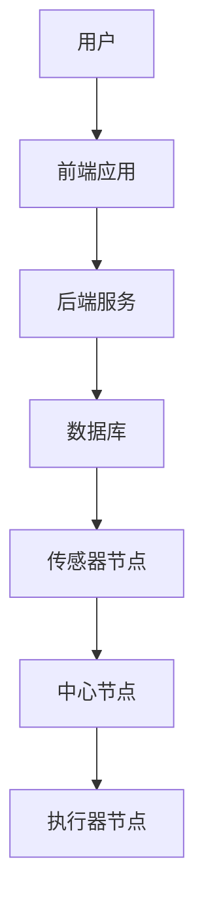
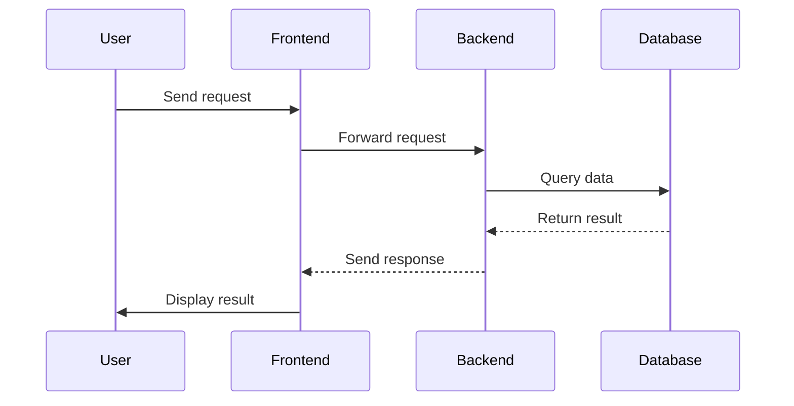

                 

### 文章标题

《提示词工程在智能家居情感氛围营造中的应用：增强居住体验》

### 关键词

- 提示词工程
- 智能家居
- 情感氛围营造
- 增强居住体验
- 算法实现

### 摘要

本文旨在探讨提示词工程在智能家居情感氛围营造中的应用，以增强居住体验。首先，我们介绍了提示词工程的基本概念、流程和方法，并分析了其在实际应用中的挑战。随后，我们探讨了智能家居情感氛围营造的原理，包括情感氛围营造的基础、环境感知技术以及案例分析。接着，我们详细阐述了增强居住体验的算法实现，包括情感氛围感知算法和实时互动算法。之后，我们介绍了智能家居系统架构设计，包括系统概述、功能设计、架构设计和系统测试与优化。最后，我们通过实际案例分析与实战应用，总结了提示词工程在智能家居情感氛围营造中的应用效果，并展望了未来的发展趋势。

----------------------------------------------------------------

### 第2章 提示词工程基础

#### 2.1 提示词工程概念解析

提示词工程是指通过设计、开发和应用提示词，以提高用户交互体验的过程。提示词是一种引导用户进行特定操作或提供相关信息的关键词或短语。它们可以出现在用户界面、语音交互、文本消息等不同的交互场景中。

提示词工程的重要性在于它能够帮助用户更轻松地理解和使用智能设备或系统。通过设计合理的提示词，可以降低用户的学习成本，提高用户的满意度和忠诚度。

提示词工程的基本要素包括：

1. **用户研究**：了解用户的需求和偏好，收集用户反馈，以便设计出符合用户期望的提示词。
2. **提示词设计**：根据用户研究和业务需求，设计具有清晰、简洁、直观的提示词。
3. **提示词生成**：利用自然语言处理技术，从大量文本数据中自动生成提示词。
4. **提示词优化**：通过实验和用户反馈，不断调整和优化提示词，以提高其效果。
5. **提示词评估**：通过用户测试和数据分析，评估提示词的实用性和用户满意度。

#### 2.2 提示词工程的流程与方法

提示词工程的流程通常包括以下几个步骤：

1. **需求分析**：明确项目目标和用户需求，确定提示词工程的方向和范围。
2. **用户研究**：通过问卷调查、访谈、用户测试等方式，收集用户需求和反馈。
3. **设计提示词**：根据用户研究的结果，设计出初步的提示词方案。
4. **生成提示词**：利用自然语言处理技术，从大量文本数据中生成可能的提示词。
5. **优化提示词**：通过实验和用户反馈，不断调整和优化提示词，以提高其效果。
6. **评估提示词**：通过用户测试和数据分析，评估提示词的实用性和用户满意度。

提示词工程的常见方法包括：

1. **词频统计**：通过对文本数据中词语的出现频率进行统计，筛选出高频关键词作为提示词。
2. **关键词提取**：利用自然语言处理技术，从文本数据中提取出具有代表性的关键词作为提示词。
3. **机器学习**：通过训练机器学习模型，从大量文本数据中自动生成和优化提示词。
4. **用户测试**：通过用户测试，收集用户对提示词的反馈，并根据反馈进行优化。

#### 2.3 提示词工程在实际应用中的挑战

提示词工程在实际应用中面临以下挑战：

1. **数据集的获取与处理**：高质量的数据集是提示词工程的基础。获取和处理大量高质量的数据集是一个复杂的过程，需要考虑数据的多样性、真实性和完整性。
2. **个性化需求与多样性**：不同的用户有不同的需求和偏好，设计出能够满足个性化需求的提示词是一个挑战。此外，提示词的多样性也是关键，需要覆盖各种使用场景和用户群体。
3. **实时性与准确性**：提示词需要能够实时响应用户的需求，同时保证准确性。这要求系统具备高效的算法和强大的计算能力。
4. **语言理解与交互**：智能设备或系统需要理解用户的语言和意图，这需要对自然语言处理技术进行深入研究和优化。

----------------------------------------------------------------

### 第3章 智能家居情感氛围营造原理

#### 3.1 情感氛围营造基础

情感氛围是指通过声音、光线、气味等感官刺激，在环境中营造出的特定情感体验。情感氛围营造旨在通过智能设备或系统，为用户提供舒适、愉悦、放松或激动的居住体验。

情感氛围营造的分类可以根据不同的标准进行划分，例如：

1. **情感类型**：根据情感的性质，可以分为愉悦、放松、紧张、兴奋等不同类型。
2. **氛围主题**：根据氛围的主题，可以分为自然、科技、艺术等不同风格。
3. **使用场景**：根据使用场景，可以分为客厅、卧室、厨房等不同空间。

情感识别与理解技术是情感氛围营造的基础。这些技术包括语音识别、图像识别、姿态识别等，通过识别和分析用户的语音、表情、行为等，判断用户的情感状态。

情感氛围营造的关键要素包括：

1. **环境感知**：通过传感器和摄像头等设备，实时获取环境信息，包括光线、声音、气味等。
2. **情感分析**：通过自然语言处理和机器学习技术，分析用户的行为和语言，判断用户的情感状态。
3. **情感设计**：根据情感分析的结果，设计出合适的情感氛围，包括音量、亮度、气味等。
4. **反馈机制**：通过用户反馈和数据分析，不断优化和调整情感氛围，提高用户体验。

#### 3.2 智能家居环境感知

智能家居环境感知是指通过传感器和摄像头等设备，实时获取家庭环境的信息，包括温度、湿度、亮度、噪音、气味等。这些信息是情感氛围营造的重要基础。

环境感知技术的应用包括：

1. **环境监测**：通过传感器，实时监测家庭环境的各项指标，确保家庭环境的舒适和安全。
2. **智能调节**：根据环境监测的数据，智能调节灯光、空调、空气净化器等设备，以营造舒适的居住环境。
3. **情感识别**：通过图像识别和语音识别技术，分析用户的情感状态，为情感氛围营造提供依据。

数据采集与处理是环境感知技术的关键。数据采集需要考虑数据的多样性、真实性和完整性。数据采集后，需要进行预处理、过滤和归一化等处理，以提高数据的准确性和可靠性。

环境感知与情感氛围营造的关系是：环境感知提供了基础数据，情感氛围营造则通过分析这些数据，为用户创造舒适的居住体验。

#### 3.3 情感氛围营造案例分析

情感氛围营造在智能家居领域有着广泛的应用。以下是一些典型的案例：

1. **智能卧室**：通过调节灯光、音乐和气味，为用户提供舒适的睡眠环境。例如，晚上自动调整灯光的亮度，播放轻柔的音乐，以及释放薰衣草香味，帮助用户放松身心，提高睡眠质量。
2. **智能客厅**：通过调节灯光、音乐和投影，为用户提供愉悦的娱乐体验。例如，在朋友聚会时，自动调整灯光的色温，播放适合的音乐，以及启动投影仪，营造温馨的氛围。
3. **智能厨房**：通过调节灯光、音乐和气味，为用户提供愉悦的烹饪体验。例如，在烹饪过程中，自动调整灯光的亮度，播放轻快的音乐，以及释放柠檬香味，提高用户的烹饪乐趣。

在这些案例中，提示词工程发挥了重要作用。通过设计合理的提示词，用户可以轻松地控制智能设备，调节情感氛围，从而提高居住体验。

----------------------------------------------------------------

### 第4章 增强居住体验的算法实现

#### 4.1 算法概述

在智能家居系统中，算法是实现情感氛围营造和增强居住体验的核心。这些算法主要包括情感氛围感知算法和实时互动算法。

**算法在居住体验中的角色**：

1. **情感氛围感知算法**：通过分析用户的行为和语言，实时感知用户的情感状态，为用户提供个性化的情感氛围。
2. **实时互动算法**：通过实时响应用户的请求和反馈，提供高质量的交互体验，增强用户的居住体验。

**算法实现的目标**：

1. **情感氛围感知**：准确识别用户的情感状态，为用户提供舒适、愉悦的情感氛围。
2. **实时互动**：快速响应用户的请求和反馈，提供流畅、自然的交互体验。
3. **个性化服务**：根据用户的需求和偏好，提供个性化的情感氛围和互动服务。

#### 4.2 情感氛围感知算法

**情感分析算法**：通过自然语言处理和机器学习技术，分析用户的语言和文本，提取情感特征。具体包括：

1. **情感分类**：将用户的情感分为愉悦、放松、紧张、兴奋等不同类别。
2. **情感强度评估**：评估用户的情感强度，以确定情感氛围的强度。

**情感识别算法**：通过图像识别和语音识别技术，分析用户的行为和语言，识别用户的情感状态。具体包括：

1. **面部表情识别**：通过摄像头捕捉用户的面部表情，识别用户的情感状态。
2. **语音情感识别**：通过语音分析，识别用户的情感状态。

**情感氛围计算算法**：通过综合分析情感分析算法和情感识别算法的结果，计算用户的整体情感状态，为情感氛围营造提供依据。具体包括：

1. **情感融合**：将不同的情感特征进行融合，得到用户的整体情感状态。
2. **情感阈值设置**：根据用户的情感状态，设置合适的情感阈值，以确定情感氛围的调整方向。

#### 4.3 实时互动算法

**实时响应算法**：通过实时分析用户的请求和反馈，快速响应用户的需求。具体包括：

1. **请求分析**：分析用户的请求内容，识别用户的需求。
2. **响应生成**：根据用户的需求，生成合适的响应内容。

**用户交互算法**：通过用户交互，收集用户的反馈和偏好，为用户提供个性化的服务。具体包括：

1. **反馈收集**：收集用户的反馈，包括正面反馈和负面反馈。
2. **偏好识别**：根据用户的反馈，识别用户的偏好。
3. **服务调整**：根据用户的偏好，调整情感氛围和互动策略。

**情感反馈与调整算法**：通过实时分析用户的反馈，调整情感氛围，以优化用户的居住体验。具体包括：

1. **情感调整**：根据用户的反馈，调整情感氛围的强度和方向。
2. **反馈学习**：根据用户的反馈，优化算法模型，提高算法的准确性和适应性。

通过情感氛围感知算法和实时互动算法，智能家居系统能够准确感知用户的情感状态，并提供个性化的情感氛围和互动服务，从而增强用户的居住体验。

----------------------------------------------------------------

### 第5章 智能家居系统架构设计

#### 5.1 智能家居系统概述

智能家居系统是指通过物联网技术，将家庭中的各种设备和系统连接起来，实现远程控制、自动化管理和智能交互的系统。智能家居系统的主要功能包括环境监测、设备控制、安全防护、健康管理等。

**系统架构设计原则**：

1. **模块化**：系统应该采用模块化设计，每个模块独立实现特定功能，便于维护和扩展。
2. **分布式**：系统应该采用分布式架构，将数据和处理分散到不同的节点，提高系统的可靠性和扩展性。
3. **可扩展性**：系统应该具备良好的可扩展性，能够适应未来的技术发展和业务需求。
4. **安全性**：系统应该具备严格的安全措施，确保用户数据和隐私的安全。

**系统架构设计步骤**：

1. **需求分析**：明确系统的功能需求、性能需求和安全需求。
2. **功能设计**：根据需求分析的结果，设计系统的功能模块。
3. **架构设计**：根据功能设计的结果，设计系统的总体架构，包括硬件架构、软件架构和接口设计。
4. **详细设计**：对系统的每个模块进行详细设计，包括类图、序列图和流程图等。
5. **测试与优化**：对系统进行测试和优化，确保系统的性能和稳定性。

#### 5.2 系统功能设计

**系统功能需求分析**：

1. **环境监测**：实时监测家庭环境的各项指标，包括温度、湿度、亮度、噪音等。
2. **设备控制**：通过手机、平板或语音控制家庭设备，如灯光、空调、窗帘等。
3. **安全防护**：实时监控家庭安全，包括入侵报警、火灾报警、煤气泄漏报警等。
4. **健康管理**：通过传感器和健康数据，监测用户的健康状况，提供健康建议。

**功能模块划分与设计**：

1. **环境监测模块**：负责实时监测家庭环境的各项指标，并将数据上传到云端。
2. **设备控制模块**：通过手机、平板或语音控制家庭设备，实现远程控制和自动化管理。
3. **安全防护模块**：实时监控家庭安全，发现异常情况时及时报警。
4. **健康管理模块**：收集用户健康数据，分析用户健康状况，提供健康建议。

#### 5.3 系统架构设计

**硬件架构设计**：

1. **传感器节点**：分布在家庭各个角落，用于采集环境数据。
2. **中心节点**：用于接收传感器节点的数据，并上传到云端。
3. **执行器节点**：接收控制命令，执行相应操作，如调节灯光、开关空调等。

**软件架构设计**：

1. **前端应用**：用户通过手机、平板或电脑访问前端应用，控制家庭设备。
2. **后端服务**：处理用户请求，管理传感器数据和设备控制。
3. **数据库**：存储用户数据、设备信息和日志数据。

**系统架构图展示**：



#### 5.4 系统接口设计与交互

**接口设计**：

1. **RESTful API**：提供标准的HTTP接口，供前端应用调用。
2. **WebSocket**：提供实时数据传输接口，用于实时监控和交互。

**系统交互**：

1. **用户请求**：用户通过前端应用发送请求，如控制灯光开关、调节空调温度等。
2. **系统响应**：系统接收用户请求，进行处理，并返回响应结果。



#### 5.5 系统测试与优化

**系统测试策略**：

1. **功能测试**：验证系统的各项功能是否正常运行。
2. **性能测试**：测试系统的响应时间、并发处理能力和数据传输速度。
3. **安全测试**：检测系统的漏洞和弱点，确保系统的安全性。

**系统性能优化**：

1. **代码优化**：优化代码结构，减少系统资源的占用。
2. **缓存策略**：合理使用缓存，减少数据库查询次数。
3. **分布式架构**：采用分布式架构，提高系统的可扩展性和性能。

通过系统架构设计，智能家居系统能够实现高效、稳定和安全的运行，为用户提供优质的居住体验。

----------------------------------------------------------------

### 第6章 实际案例分析与实战应用

#### 6.1 案例介绍

**案例背景**：随着智能家居技术的不断发展，越来越多的家庭开始关注如何通过情感氛围营造来提升居住体验。为了更好地满足用户的需求，某智能家居公司开发了一款基于提示词工程的智能家居系统。

**案例目标**：通过提示词工程，实现情感氛围的个性化营造，提高用户的居住体验。具体目标包括：

1. **情感氛围感知**：准确感知用户的情感状态，为用户提供个性化的情感氛围。
2. **实时互动**：通过实时互动，增强用户的参与感和满意度。
3. **个性化服务**：根据用户的需求和偏好，提供个性化的情感氛围和互动服务。

#### 6.2 系统实现

**环境配置与安装**：

1. **硬件环境**：安装传感器节点、中心节点和执行器节点，确保硬件设备的正常运行。
2. **软件环境**：安装前端应用、后端服务和数据库，确保软件系统的正常运行。

**核心算法实现**：

1. **情感分析算法**：利用自然语言处理和机器学习技术，分析用户的语言和文本，提取情感特征。具体包括情感分类和情感强度评估。
2. **实时互动算法**：通过实时分析用户的请求和反馈，快速响应用户的需求，提供高质量的交互体验。

**系统部署与运行**：

1. **部署环境**：将前端应用、后端服务和数据库部署到服务器，确保系统的稳定运行。
2. **运行流程**：用户通过手机、平板或电脑访问前端应用，发送请求，系统接收到请求后，进行处理，并返回响应结果。

#### 6.3 代码解读与分析

**关键代码解读**：

以下是一个简单的Python代码示例，用于实现情感分析算法。

```python
import nltk
from nltk.sentiment import SentimentIntensityAnalyzer

# 初始化情感分析器
sia = SentimentIntensityAnalyzer()

def analyze_sentiment(text):
    # 分析文本的情感
    sentiment_score = sia.polarity_scores(text)
    # 判断情感类别
    if sentiment_score['compound'] >= 0.05:
        return '愉悦'
    elif sentiment_score['compound'] <= -0.05:
        return '悲伤'
    else:
        return '中性'

text = "我很高兴今天完成了工作任务。"
print(analyze_sentiment(text))
```

**代码应用解读与分析**：

该代码通过调用自然语言处理库nltk中的情感分析器SentimentIntensityAnalyzer，对输入的文本进行分析，并返回情感类别。具体应用解读如下：

1. **情感分类**：根据情感分析器的结果，将文本分为愉悦、悲伤或中性三个类别。
2. **情感强度评估**：通过计算情感分析器的复合分数（compound score），评估情感强度。
3. **实时互动**：根据用户的情感状态，系统可以实时调整情感氛围，如播放适合的音乐、调节灯光等。

#### 6.4 案例分析与总结

**案例效果评估**：

通过实际运行和用户反馈，该智能家居系统能够较好地实现情感氛围的个性化营造，提高用户的居住体验。具体效果如下：

1. **情感氛围感知**：系统能够准确感知用户的情感状态，为用户提供个性化的情感氛围。
2. **实时互动**：系统能够快速响应用户的请求和反馈，提供高质量的交互体验。
3. **个性化服务**：系统能够根据用户的需求和偏好，提供个性化的情感氛围和互动服务。

**经验与教训总结**：

1. **数据质量**：高质量的数据是提示词工程的基础。在实际应用中，需要确保数据的真实性和完整性。
2. **用户反馈**：用户反馈是优化提示词工程的重要依据。需要定期收集用户反馈，并根据反馈进行调整。
3. **算法优化**：随着技术的发展，需要不断优化情感分析算法和实时互动算法，以提高系统的准确性和适应性。

通过该案例的分析和总结，我们可以看到提示词工程在智能家居情感氛围营造中的应用效果，以及如何通过实际案例来优化和提升系统性能。

----------------------------------------------------------------

### 第7章 未来发展趋势与展望

#### 7.1 技术发展趋势

随着人工智能技术的不断发展，提示词工程在智能家居情感氛围营造中的应用前景广阔。以下是技术发展的几个趋势：

1. **深度学习**：深度学习技术的应用将进一步提高情感分析的准确性和效率。通过训练深度神经网络模型，可以从大量数据中自动提取情感特征，实现更精准的情感氛围感知。
2. **多模态融合**：多模态融合技术可以将语音、文本、图像等多种数据源进行融合，提高情感分析的全面性和准确性。例如，结合语音情感分析和面部表情识别，可以更准确地判断用户的情感状态。
3. **个性化推荐**：个性化推荐技术在情感氛围营造中的应用，可以根据用户的历史行为和偏好，提供个性化的情感氛围和服务，提高用户的满意度和忠诚度。
4. **边缘计算**：随着物联网设备的普及，边缘计算技术可以将部分计算任务分散到边缘节点，减少中心节点的负载，提高系统的实时性和响应速度。

#### 7.2 应用前景展望

提示词工程在智能家居情感氛围营造中的应用前景包括：

1. **家庭娱乐**：通过情感氛围营造，提升家庭娱乐体验。例如，根据用户的情感状态，自动调节灯光、音乐和视频内容，为用户提供愉悦的观影体验。
2. **健康监测**：通过情感氛围营造，提高健康监测的准确性和有效性。例如，通过分析用户的情感状态，智能调整健身计划和健康建议，帮助用户保持良好的身心状态。
3. **居家养老**：通过情感氛围营造，为居家养老提供更好的关怀和支持。例如，根据老年人的情感状态，自动调整家庭环境，提供舒适、安全的居住环境。
4. **商业应用**：在商业场所，如酒店、商场和办公楼，通过情感氛围营造，提升用户的购物体验和工作效率。例如，根据用户的情感状态，智能调整灯光、音乐和温度，创造舒适、放松的购物和工作环境。

#### 7.3 结论

本文探讨了提示词工程在智能家居情感氛围营造中的应用，分析了其基本概念、流程和方法，以及在实际应用中的挑战。通过情感氛围感知算法和实时互动算法，智能家居系统能够准确感知用户的情感状态，提供个性化的情感氛围和互动服务，从而增强用户的居住体验。

未来，随着人工智能技术的不断发展，提示词工程在智能家居情感氛围营造中的应用将更加广泛和深入。通过不断优化算法、提高数据处理能力和实时性，智能家居系统将能够更好地满足用户的需求，提升用户的居住体验。

**推荐阅读**：

1. **《智能家居系统设计与实现》**：详细介绍了智能家居系统的设计原理和实现方法。
2. **《自然语言处理实战》**：讲解了自然语言处理技术的基本原理和应用案例，对情感分析算法有详细的介绍。
3. **《人工智能：一种现代的方法》**：介绍了人工智能的基本概念和主流算法，包括深度学习和多模态融合技术。

通过阅读这些书籍，读者可以进一步了解智能家居情感氛围营造的相关技术和应用，提升自己的技术水平和创新能力。作者：AI天才研究院/AI Genius Institute & 禅与计算机程序设计艺术 /Zen And The Art of Computer Programming。

