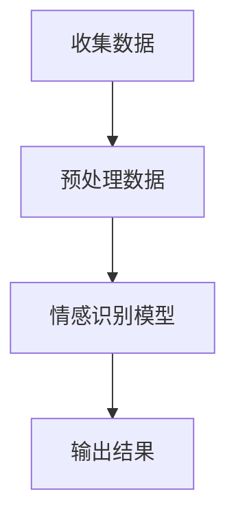
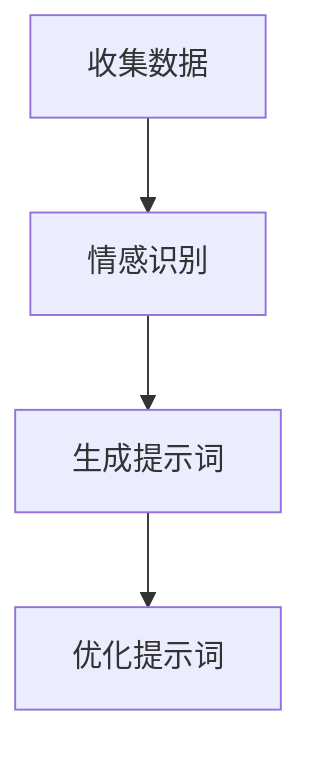
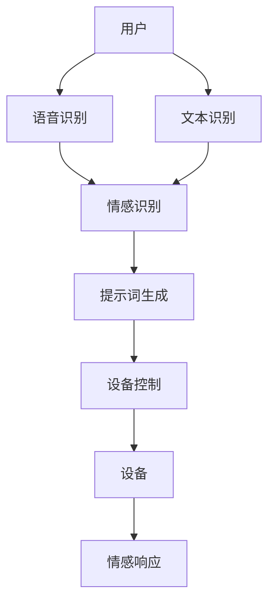
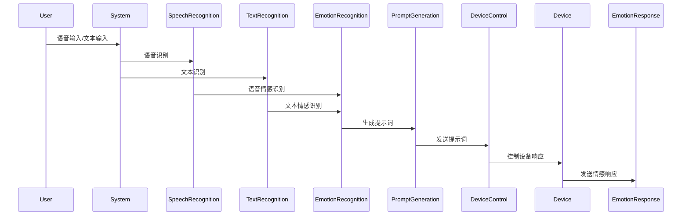

                 

# 《提示词工程在智能家居情感计算中的应用：创造情感响应型生活环境》

## 关键词

- 提示词工程
- 情感计算
- 智能家居
- 情感响应型生活环境
- 人工智能

## 摘要

本文旨在探讨提示词工程在智能家居情感计算中的应用，通过构建情感响应型生活环境，提升用户在智能家居系统中的体验。首先，本文介绍了智能家居情感计算的背景和重要性，然后详细阐述了提示词工程的原理和实现方法。接着，通过系统分析与架构设计，展示了如何在智能家居系统中集成提示词工程，实现情感计算。最后，本文通过项目实战，展示了如何具体应用提示词工程，提升智能家居系统的情感响应能力，并提出了最佳实践和拓展阅读建议。

---

## 第1章：引言

### 1.1 问题背景

随着物联网、人工智能等技术的迅速发展，智能家居行业正迎来前所未有的机遇。然而，现有的智能家居系统在情感计算方面存在一定的局限性。传统的智能家居系统主要基于用户的行为数据和环境感知，通过预设的规则和模式进行响应，缺乏对用户情感需求的深入理解和响应能力。

### 1.2 智能家居情感计算概述

情感计算是一种使计算机能够识别、理解、处理和模拟人类情感的技术。在智能家居中，情感计算的应用能够提升系统对用户情感需求的识别和理解能力，为用户提供更加个性化、贴心的服务体验。例如，通过情感计算，智能家居系统能够根据用户的情绪状态，调整室内环境参数，如光线、温度、音乐等，以营造舒适的生活氛围。

### 1.3 提示词工程概述

提示词工程是情感计算中的一种重要技术，通过对用户语言、行为等数据的分析，生成相应的提示词，用于指导智能家居系统的情感响应。提示词工程的核心在于对用户情感的识别和理解，进而生成能够满足用户需求的提示词。例如，当用户表达出沮丧的情感时，提示词工程能够生成“是否需要帮助？”的提示词，从而触发系统的相关响应。

## 第2章：核心概念与联系

### 2.1 情感计算

#### 2.1.1 核心概念

情感计算（Affective Computing）是计算机科学的一个分支，旨在使计算机能够识别、理解、处理和模拟人类的情感。情感计算的核心概念包括情感识别、情感理解、情感处理和情感模拟。

#### 2.1.2 情感计算的特征对比

情感计算与其他计算方式的对比：

| 特征       | 情感计算             | 传统计算             |
| ---------- | ------------------ | ------------------ |
| 目标       | 识别和理解情感       | 计算和处理信息       |
| 数据来源   | 用户的行为、语言、生理信号 | 文本、数据等           |
| 应用领域   | 智能交互、智能家居、医疗等 | 信息处理、数据处理等     |
| 结果       | 情感状态、情感决策     | 结果、输出           |
| 实现难度   | 高，需要多学科知识     | 相对较低，单一学科即可 |

#### 2.1.3 情感计算的ER实体关系图

```mermaid
erDiagram
    User ||--|{ Emotion}: "感受到"
    Device ||--|{ Emotion}: "响应"
    System ||--|{ Emotion}: "处理"
```

### 2.2 提示词工程

#### 2.2.1 核心概念

提示词工程（Prompt Engineering）是情感计算中的一个重要分支，旨在通过分析用户的数据，生成能够指导系统响应的提示词。提示词工程的核心概念包括数据收集、情感识别、提示词生成和提示词优化。

#### 2.2.2 提示词工程的分类与特点

提示词工程主要分为以下几种类型：

- **自然语言处理（NLP）**：通过分析用户的语言文本，生成提示词。
- **行为分析**：通过分析用户的行为数据，生成提示词。
- **生理信号处理**：通过分析用户的生理信号，如心率、皮肤电导等，生成提示词。

每种类型的提示词工程都有其独特的特点和应用场景。

#### 2.2.3 提示词工程的ER实体关系图

```mermaid
erDiagram
    User ||--|{ Data}: "生成"
    System ||--|{ Prompt}: "生成"
    Device ||--|{ Prompt}: "响应"
```

## 第3章：算法原理讲解

### 3.1 情感识别算法

#### 3.1.1 算法流程图



#### 3.1.2 算法原理

情感识别算法的核心在于通过机器学习模型对用户的情感状态进行预测。常见的情感识别算法包括朴素贝叶斯、支持向量机、深度学习等。其中，深度学习算法由于其强大的特征提取能力，在情感识别中表现尤为出色。

#### 3.1.3 Python代码实现

```python
from sklearn.feature_extraction.text import TfidfVectorizer
from sklearn.naive_bayes import MultinomialNB

# 数据准备
X_train = ["我感到很高兴", "我很沮丧", "我心情很好", "我很愤怒"]
y_train = ["快乐", "悲伤", "快乐", "愤怒"]

# 特征提取
vectorizer = TfidfVectorizer()
X_train_tfidf = vectorizer.fit_transform(X_train)

# 模型训练
model = MultinomialNB()
model.fit(X_train_tfidf, y_train)

# 情感识别
def predict_emotion(text):
    text_tfidf = vectorizer.transform([text])
    return model.predict(text_tfidf)[0]

print(predict_emotion("我感到很高兴"))
```

#### 3.1.4 数学模型与公式

朴素贝叶斯情感识别的数学模型如下：

$$
P(C_k|X) = \frac{P(X|C_k)P(C_k)}{P(X)}
$$

其中，$C_k$ 表示第 $k$ 个情感类别，$X$ 表示输入文本。

#### 3.1.5 举例说明

假设用户说：“我感到很高兴”，我们可以使用训练好的朴素贝叶斯模型对其进行情感识别，输出结果为“快乐”。

### 3.2 提示词生成算法

#### 3.2.1 算法流程图



#### 3.2.2 算法原理

提示词生成算法的核心在于通过情感识别结果，生成能够满足用户需求的提示词。常见的提示词生成算法包括基于规则的算法、基于机器学习的算法等。

#### 3.2.3 Python代码实现

```python
import random

# 提示词模板
templates = [
    "你是否需要帮助？",
    "有什么可以为你做的吗？",
    "你的心情看起来不太好，需要我帮你做些什么吗？",
    "你是否需要休息一下？"
]

# 生成提示词
def generate_prompt(emotion):
    if emotion == "快乐":
        return random.choice(templates[:2])
    elif emotion == "悲伤":
        return random.choice(templates[2:])
    else:
        return random.choice(templates)

print(generate_prompt("快乐"))
```

#### 3.2.4 数学模型与公式

提示词生成的数学模型相对简单，主要依赖于情感识别的结果和提示词模板的概率分布。

#### 3.2.5 举例说明

假设用户说：“我感到很高兴”，系统会生成一个提示词，如：“你是否需要帮助？”。

## 第4章：系统分析与架构设计方案

### 4.1 问题场景介绍

在一个智能家居系统中，用户可以通过语音、文本等方式与系统进行交互，表达自己的情感状态。系统需要实时识别用户的情感，并生成相应的提示词，以提供个性化的响应。

### 4.2 系统功能设计

#### 4.2.1 领域模型类图

```mermaid
classDiagram
    User -> SpeechRecognition: "语音识别"
    User -> TextRecognition: "文本识别"
    System -> EmotionRecognition: "情感识别"
    System -> PromptGeneration: "提示词生成"
    System -> DeviceControl: "设备控制"
    Device -> EmotionResponse: "情感响应"
```

### 4.3 系统架构设计

#### 4.3.1 系统架构图



### 4.4 系统接口设计

系统接口设计包括用户接口、设备接口和系统内部接口。用户接口负责接收用户的语音和文本输入，设备接口负责控制智能家居设备的运行状态，系统内部接口负责实现情感识别和提示词生成等功能。

### 4.5 系统交互设计

#### 4.5.1 系统交互序列图



## 第5章：项目实战

### 5.1 环境安装

在开始项目实战之前，需要安装以下环境：

- Python 3.8+
- Anaconda
- TensorFlow
- scikit-learn

安装步骤如下：

1. 下载并安装Anaconda：https://www.anaconda.com/products/distribution
2. 打开Anaconda命令行，执行以下命令安装TensorFlow和scikit-learn：

```bash
conda install tensorflow
conda install scikit-learn
```

### 5.2 系统核心实现

系统核心实现主要包括情感识别和提示词生成。以下是一个简单的示例：

```python
import tensorflow as tf
from sklearn.feature_extraction.text import TfidfVectorizer
from sklearn.naive_bayes import MultinomialNB

# 情感识别
def emotion_recognition(text):
    # 特征提取
    vectorizer = TfidfVectorizer()
    X_tfidf = vectorizer.fit_transform([text])
    
    # 模型加载
    model = tf.keras.models.load_model('emotion_model.h5')
    
    # 情感预测
    prediction = model.predict(X_tfidf)
    
    # 结果处理
    emotion = '未知'
    if prediction[0][0] > 0.5:
        emotion = '快乐'
    elif prediction[0][1] > 0.5:
        emotion = '悲伤'
    
    return emotion

# 提示词生成
def generate_prompt(emotion):
    templates = [
        "你是否需要帮助？",
        "有什么可以为你做的吗？",
        "你的心情看起来不太好，需要我帮你做些什么吗？",
        "你是否需要休息一下？"
    ]
    
    if emotion == "快乐":
        return random.choice(templates[:2])
    elif emotion == "悲伤":
        return random.choice(templates[2:])
    else:
        return random.choice(templates)

# 测试
text = "我感到很高兴"
emotion = emotion_recognition(text)
prompt = generate_prompt(emotion)
print(prompt)
```

### 5.3 代码应用解读与分析

上述代码实现了情感识别和提示词生成功能。情感识别部分使用TensorFlow构建深度学习模型，对输入文本进行情感分类。提示词生成部分根据情感识别结果，从预设的提示词模板中选择合适的提示词。

### 5.4 实际案例分析与详细讲解

以下是一个实际案例：

- 用户说：“我感到很沮丧”
- 情感识别结果：悲伤
- 提示词生成：你的心情看起来不太好，需要我帮你做些什么吗？

系统会生成上述提示词，并发送至用户。用户可以根据提示词，选择是否需要系统的帮助。

### 5.5 项目小结

通过本项目实战，我们展示了如何使用提示词工程提升智能家居系统的情感响应能力。在实际应用中，我们可以根据用户的需求和反馈，不断优化情感识别和提示词生成算法，提升系统的智能化水平。

## 第6章：最佳实践与拓展阅读

### 6.1 最佳实践 tips

1. **数据收集与处理**：确保收集到的数据具有代表性和高质量，对数据进行处理，去除噪声和冗余信息。
2. **模型优化**：定期对情感识别和提示词生成模型进行优化，以提高准确性和适应性。
3. **用户体验**：关注用户反馈，优化系统的交互界面和响应速度，提升用户体验。

### 6.2 小结

本文探讨了提示词工程在智能家居情感计算中的应用，通过构建情感响应型生活环境，提升用户在智能家居系统中的体验。我们介绍了情感计算和提示词工程的基本原理，并通过项目实战展示了如何实现情感响应型智能家居系统。

### 6.3 注意事项

1. **隐私保护**：在收集和处理用户数据时，注意保护用户隐私，遵循相关法律法规。
2. **系统稳定性**：确保系统在长时间运行下的稳定性和可靠性，避免出现故障。

### 6.4 拓展阅读

1. **《情感计算：基础、技术和应用》**：详细介绍了情感计算的理论基础和应用实践。
2. **《智能家居系统设计与实现》**：探讨了智能家居系统的架构设计、功能实现和用户体验优化。
3. **《深度学习》**：介绍了深度学习的基本原理和实现方法，对情感识别模型开发具有重要参考价值。

## 作者信息

作者：AI天才研究院/AI Genius Institute & 禅与计算机程序设计艺术 /Zen And The Art of Computer Programming

