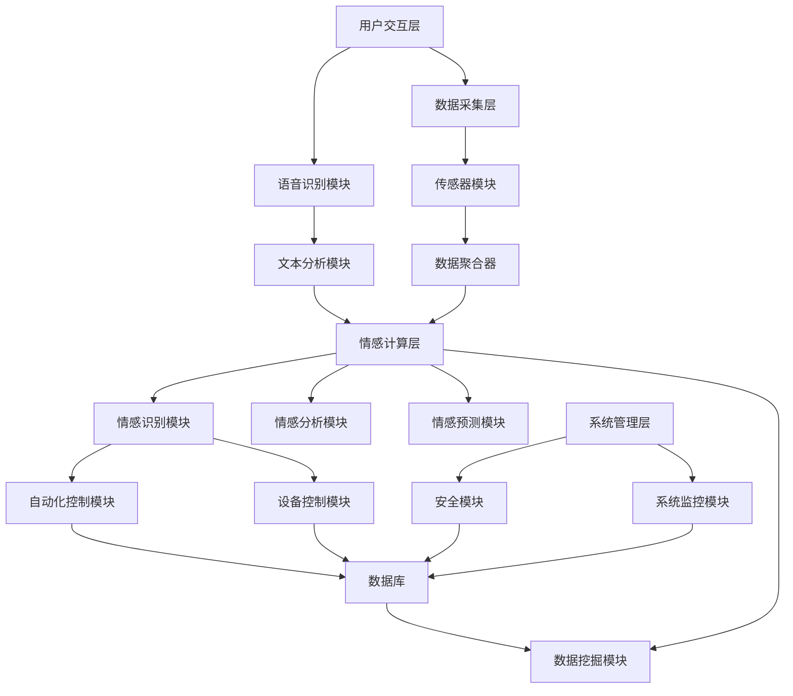
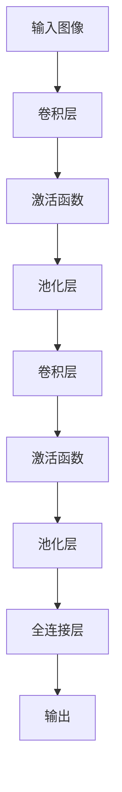
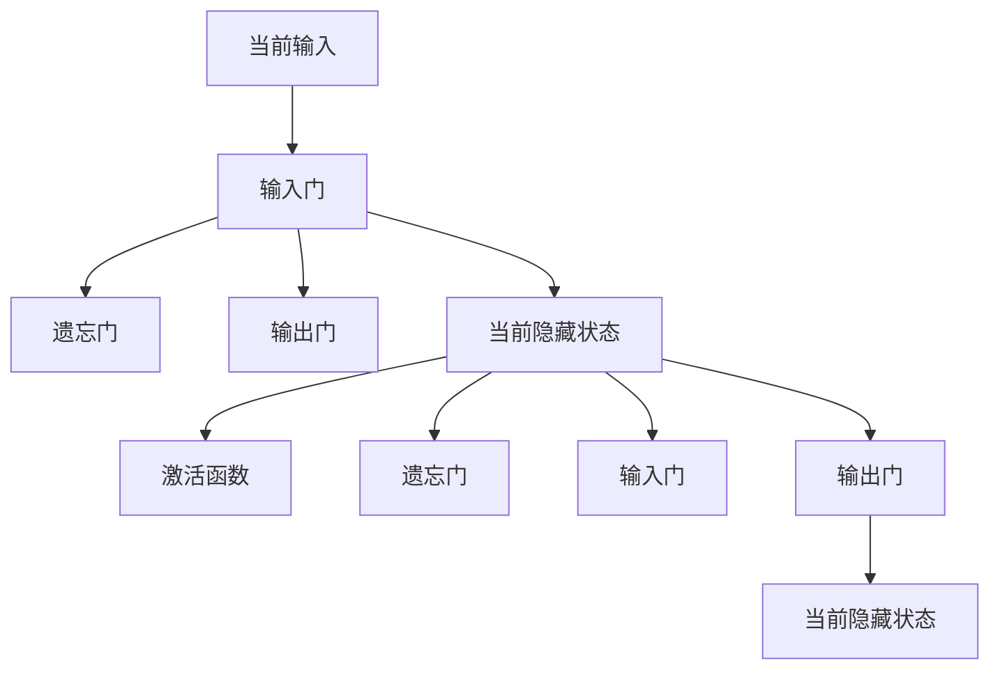

                 


### Article Title: 提示词工程在智能家居情感计算中的应用：创造情感响应型生活环境

关键词：提示词工程、智能家居、情感计算、情感响应型生活环境、算法、系统设计

摘要：本文深入探讨了提示词工程在智能家居情感计算中的应用，以及如何通过该技术创造情感响应型生活环境。文章首先介绍了核心概念和背景，接着分析了核心原理和技术，然后详细阐述了系统设计、算法和数学模型，最后通过案例研究和最佳实践总结，为智能家建设提供了技术指导和启示。

---

## **背景介绍**

随着科技的进步和人工智能的快速发展，智能家居（Smart Home）已经成为现代家庭生活的重要组成部分。智能家居通过物联网（Internet of Things, IoT）技术将家庭设备互联互通，使得家庭生活更加便捷、舒适和高效。然而，传统的智能家居系统主要关注设备的自动化控制和节能环保，较少关注用户的情感需求和用户体验。因此，如何构建一种能够感知并响应用户情感的生活环境，成为当前智能家建设研究的一个重要方向。

情感计算（Emotional Computing）是人工智能领域的一个新兴分支，它致力于研究计算机如何识别、理解、处理和模拟人类的情感。情感计算技术通过结合自然语言处理、计算机视觉和生物识别等技术，能够捕捉用户的情感状态，并对其进行分析和理解。近年来，随着深度学习和大数据技术的应用，情感计算在智能家建设中的应用前景变得日益广阔。

提示词工程（Hint Word Engineering）是一种利用自然语言处理技术进行情感分析和情感计算的方法。它通过识别和分析文本中的关键词汇和情感倾向，来推断用户的情感状态和需求。提示词工程不仅能够为智能家居提供情感数据支持，还能优化家居设备的功能和服务，使其更加贴合用户的需求和偏好。

本文旨在探讨提示词工程在智能家居情感计算中的应用，通过深入分析核心原理和技术，构建情感响应型生活环境的系统设计，为智能家建设提供一种新的思路和方法。

### **关键概念**

在深入探讨提示词工程在智能家居情感计算中的应用之前，首先需要明确几个核心概念：提示词工程、智能家居、情感计算和情感响应型生活环境。

#### **提示词工程**

提示词工程是一种自然语言处理技术，旨在通过识别和分析文本中的关键词汇和情感倾向，来推断用户的情感状态和需求。提示词工程的基本原理包括词汇语义分析、情感极性分类和上下文理解。通过这些技术，提示词工程能够从用户的文本输入（如语音、文本消息等）中提取情感信息，为智能家居提供情感数据支持。

**特点**：
- **高效性**：提示词工程能够快速处理大量文本数据，实时分析用户的情感状态。
- **准确性**：通过深度学习模型和大数据训练，提示词工程能够提高情感分析的准确度。
- **灵活性**：提示词工程可以灵活适应不同的语言和文化背景，适用于全球范围内的智能家居应用。

**应用场景**：
- **语音交互**：智能音箱和语音助手通过提示词工程理解用户的语音指令和情感状态，提供更加个性化的服务。
- **智能家居控制**：提示词工程可以分析用户的文本输入，调整家居设备的设置，如温度、照明和音响等。

#### **智能家居**

智能家居是指通过物联网技术将家庭设备互联互通，实现自动化控制和远程监控的系统。智能家居的目标是提升家庭生活的舒适度、便捷性和节能性。

**核心组成部分**：
- **传感器**：如温度传感器、湿度传感器、光照传感器等，用于感知环境状态。
- **控制器**：如智能插座、智能灯光、智能门锁等，用于执行用户指令和自动调整。
- **网络通信**：如Wi-Fi、蓝牙等，用于实现设备之间的数据传输和远程控制。

**技术特点**：
- **互联互通**：智能家居设备之间可以相互通信和协调工作，提高系统的整体效能。
- **远程控制**：用户可以通过智能手机或其他设备远程监控和控制家庭设备。
- **智能化**：智能家居系统能够根据用户的习惯和需求，自动调整设备状态，提供个性化的服务。

**应用领域**：
- **家庭自动化**：如自动照明、自动安防、自动温控等，提升家庭生活的舒适度和安全性。
- **能源管理**：通过智能电网和智能家居系统，实现家庭能源的高效管理和利用。

#### **情感计算**

情感计算是人工智能领域的一个分支，旨在研究计算机如何识别、理解、处理和模拟人类的情感。情感计算技术通过结合自然语言处理、计算机视觉、生物识别等技术，能够捕捉用户的情感状态，并对其进行分析和理解。

**技术特点**：
- **多模态感知**：情感计算可以同时处理文本、语音、图像等多种形式的数据，提高情感分析的全面性和准确性。
- **自适应调整**：情感计算系统可以根据用户的行为和反馈，自适应调整设备的操作和设置，提供个性化的情感服务。
- **情境感知**：情感计算系统能够根据不同的情境和环境，调整其功能和服务，提高用户体验。

**应用领域**：
- **智能交互**：如智能客服、智能语音助手等，通过情感计算技术提升交互的逼真度和人性化程度。
- **心理健康**：如情绪监测、情感分析等，通过情感计算技术帮助用户了解和管理自己的情感状态。

#### **情感响应型生活环境**

情感响应型生活环境是一种通过智能家居系统和情感计算技术，实现家庭设备和环境对用户情感状态进行感知和响应的生活环境。这种环境旨在通过个性化的服务和调整，提升用户的情感体验和生活质量。

**特点**：
- **情感感知**：通过传感器和情感计算技术，实时捕捉用户的情感状态。
- **个性化服务**：根据用户的情感状态和需求，自动调整家庭设备的设置和服务。
- **情感共鸣**：通过情感计算技术，实现家庭设备和用户之间的情感互动和共鸣。

**应用场景**：
- **日常家居**：如自动调节室内温度、光线和音乐，根据用户的情感状态提供舒适的生活环境。
- **紧急响应**：如用户情绪低落时，智能家居系统能够自动提供安慰和提醒，帮助用户调节情绪。
- **远程监控**：如通过情感计算技术监测老年人的情感状态，及时发现异常并采取相应措施。

通过以上对核心概念的介绍，我们可以更好地理解提示词工程在智能家居情感计算中的应用，以及如何构建情感响应型生活环境。接下来，我们将进一步探讨这些概念之间的联系和相互作用。

### **核心原理和技术**

在深入了解提示词工程在智能家居情感计算中的应用之前，我们需要明确一些关键技术和原理，包括自然语言处理（NLP）、深度学习、情感极性分类和上下文分析。

#### **自然语言处理（NLP）**

自然语言处理是人工智能领域的一个重要分支，它致力于使计算机能够理解、处理和生成人类语言。在智能家居情感计算中，NLP技术主要用于文本数据预处理和情感分析。

**文本数据预处理**：
- **分词**：将文本分割成有意义的单词或短语，是情感分析的第一步。常用的分词方法包括基于规则的分词、基于统计的分词和基于字符的嵌入模型。
- **词性标注**：对文本中的每个词进行词性标注，如名词、动词、形容词等，以便更好地理解句子的结构和语义。
- **词干提取**：通过提取词干，简化词汇形式，提高情感分析的准确度。

**情感分析**：
- **情感极性分类**：将文本分为正面、负面或中性情感，是NLP在情感计算中最重要的应用之一。常用的情感分析模型包括基于词典的方法、基于统计的方法和基于深度学习的方法。
- **情感强度评估**：不仅判断情感极性，还能评估情感强度的方法，如通过计算情感词汇的权重和频率，来衡量情感的强度。

#### **深度学习**

深度学习是机器学习的一个分支，通过模拟人脑神经元连接的结构，实现自动特征提取和模式识别。在智能家居情感计算中，深度学习技术被广泛应用于情感识别和预测。

**卷积神经网络（CNN）**：
- **文本情感分析**：CNN能够通过卷积层提取文本的局部特征，如情感词汇和短语，从而进行情感分类。
- **图像情感分析**：CNN可以处理图像数据，识别图像中的情感元素，如表情、姿态和背景等。

**循环神经网络（RNN）**：
- **序列建模**：RNN能够处理序列数据，如文本序列，捕捉情感变化和上下文信息。
- **情感预测**：通过训练RNN模型，可以预测用户在不同情境下的情感状态。

**长短时记忆网络（LSTM）**：
- **情感持久性**：LSTM能够学习长期依赖信息，捕捉情感的持久性和变化趋势。
- **情感识别**：LSTM在处理情感数据时，能够更好地捕捉复杂的情感模式。

#### **情感极性分类**

情感极性分类是一种将文本分为正面、负面或中性情感的方法。在智能家居情感计算中，情感极性分类用于识别用户对家居设备或服务的情感倾向。

**分类方法**：
- **基于词典的方法**：通过构建情感词典，对文本中的每个词进行打分，累计分数来判断情感极性。
- **基于统计的方法**：使用机器学习算法，如朴素贝叶斯、支持向量机（SVM）等，进行情感分类。
- **基于深度学习的方法**：使用深度学习模型，如卷积神经网络（CNN）和循环神经网络（RNN），进行情感分类。

**应用场景**：
- **语音交互**：通过情感极性分类，智能音箱和语音助手能够识别用户的情感状态，提供更加个性化的服务。
- **文本反馈**：智能家居设备可以分析用户对产品或服务的文本反馈，识别用户的满意度。

#### **上下文分析**

上下文分析是情感计算中一个重要的环节，它涉及到如何理解文本的上下文信息，以准确判断用户的情感状态。

**上下文理解**：
- **上下文依赖**：通过捕捉文本中的上下文依赖关系，如词汇之间的语义关系，来判断情感极性。
- **上下文扩展**：通过扩展上下文信息，如用户的背景、情境等，来提高情感分析的准确度。

**应用场景**：
- **多轮对话**：在多轮对话中，上下文分析能够帮助智能系统理解用户的意图和情感，提供连贯和贴心的服务。
- **情境识别**：通过上下文分析，智能家居系统可以识别不同的情境，如家庭聚会、工作模式等，提供相应的情感响应。

通过以上对核心原理和技术的介绍，我们可以看到提示词工程在智能家居情感计算中扮演的重要角色。接下来，我们将详细探讨系统设计、算法和数学模型，为构建情感响应型生活环境提供技术支持。

### **系统设计**

要构建一个情感响应型生活环境，需要设计一个高效、稳定且易于扩展的系统架构。以下是对该系统的整体架构设计，包括各个组件及其相互作用。

#### **系统组件**

1. **用户交互层**：
   - **语音识别模块**：通过语音识别技术将用户的语音指令转换为文本数据。
   - **文本分析模块**：使用自然语言处理技术对文本数据进行分析，提取情感信息。
   - **用户界面**：提供用户与智能家居系统交互的界面，如智能手机应用、智能音箱等。

2. **数据采集层**：
   - **传感器模块**：包括各种环境传感器（如温度传感器、湿度传感器、光照传感器）和家庭设备传感器（如智能灯泡、智能空调）。
   - **数据聚合器**：将来自不同传感器的数据聚合到统一的格式，便于后续处理和分析。

3. **情感计算层**：
   - **情感识别模块**：利用深度学习和自然语言处理技术，对用户文本和传感器数据进行情感识别。
   - **情感分析模块**：对识别出的情感进行进一步分析，以理解用户的情感状态和需求。
   - **情感预测模块**：基于历史数据和当前情感状态，预测用户的未来情感倾向。

4. **决策执行层**：
   - **自动化控制模块**：根据情感分析结果，自动调整家居设备的设置和服务，如调节温度、光线和音响等。
   - **设备控制模块**：通过无线通信技术（如Wi-Fi、蓝牙等）控制家居设备，执行情感响应操作。

5. **数据存储与分析层**：
   - **数据库**：存储用户数据、设备数据和情感分析结果。
   - **数据挖掘模块**：对存储的数据进行挖掘和分析，提取有价值的信息和趋势。

6. **系统管理层**：
   - **安全模块**：确保系统数据的安全性和用户隐私保护。
   - **系统监控模块**：监控系统运行状态，进行故障检测和恢复。

#### **组件交互**

以下是各个系统组件之间的交互关系和协作方式：

1. **用户交互层与数据采集层**：
   - 用户通过语音识别模块将语音指令发送到文本分析模块。
   - 文本分析模块将文本数据发送到情感计算层。
   - 传感器模块将采集到的环境数据发送到数据聚合器。

2. **数据采集层与情感计算层**：
   - 数据聚合器将用户文本数据和环境数据发送到情感计算层。
   - 情感识别模块对数据进行分析，识别用户的情感状态。

3. **情感计算层与决策执行层**：
   - 情感分析模块将情感识别结果发送到自动化控制模块和设备控制模块。
   - 自动化控制模块根据情感分析结果自动调整家居设备设置。
   - 设备控制模块执行具体的设备控制操作。

4. **决策执行层与数据存储与分析层**：
   - 自动化控制模块和设备控制模块将操作结果记录到数据库中。
   - 数据挖掘模块对数据库中的数据进行分析，提取有价值的信息。

5. **系统管理层与其它层次**：
   - 系统监控模块监控整个系统的运行状态，进行故障检测和恢复。
   - 安全模块保护系统数据的安全性和用户隐私。

#### **系统架构图**

以下是一个简化的系统架构图，用于直观展示各个组件及其交互关系：



通过上述系统设计，我们可以构建一个高效、智能且情感响应型的生活环境。接下来，我们将详细探讨系统中的算法和数学模型，为情感响应型生活环境提供技术支持。

### **算法和数学模型**

在情感响应型生活环境中，算法和数学模型是实现情感识别、分析、预测和响应的核心。以下将详细探讨用于情感计算的几种关键算法和相应的数学模型，并通过Mermaid流程图和Python代码示例来具体说明。

#### **算法选择**

在情感计算中，常用的算法包括卷积神经网络（CNN）、循环神经网络（RNN）和长短时记忆网络（LSTM）。以下是这些算法的特点和应用场景：

1. **卷积神经网络（CNN）**
   - **特点**：CNN擅长处理图像数据，通过卷积操作提取图像的局部特征。
   - **应用场景**：图像情感识别、视觉情感分析等。

2. **循环神经网络（RNN）**
   - **特点**：RNN适用于处理序列数据，如文本序列，能够捕捉情感的时间动态。
   - **应用场景**：文本情感分析、时间序列情感预测等。

3. **长短时记忆网络（LSTM）**
   - **特点**：LSTM是RNN的一个变体，能够解决长期依赖问题，更好地捕捉复杂的情感模式。
   - **应用场景**：情感序列预测、长期情感分析等。

#### **算法原理**

以下分别对CNN、RNN和LSTM的原理进行简要介绍。

1. **卷积神经网络（CNN）**
   - **原理**：CNN通过卷积层、池化层和全连接层进行特征提取和分类。卷积层使用卷积核在图像上滑动，提取局部特征；池化层对特征进行降维处理；全连接层进行分类。
   - **公式**：
     $$ 
     \text{特征图} = \text{卷积}(\text{输入图像}, \text{卷积核}) \\
     \text{特征图} = \text{激活函数}(\text{特征图}) \\
     \text{输出} = \text{全连接}(\text{特征图}, \text{权重})
     $$

2. **循环神经网络（RNN）**
   - **原理**：RNN通过循环结构处理序列数据，每个时间步的输出作为下一个时间步的输入。RNN的输入和输出都是序列数据。
   - **公式**：
     $$
     \text{当前输出} = \text{激活函数}(\text{权重} \cdot [\text{当前输入}, \text{前一个输出}]) \\
     \text{前一个输出} = \text{当前输出}
     $$

3. **长短时记忆网络（LSTM）**
   - **原理**：LSTM通过引入记忆单元和门控机制，解决RNN的长期依赖问题。LSTM包含输入门、遗忘门和输出门，分别控制信息的输入、遗忘和输出。
   - **公式**：
     $$
     \text{输入门} = \text{激活函数}(\text{权重} \cdot [\text{当前输入}, \text{前一个隐藏状态}]) \\
     \text{遗忘门} = \text{激活函数}(\text{权重} \cdot [\text{当前输入}, \text{前一个隐藏状态}]) \\
     \text{输出门} = \text{激活函数}(\text{权重} \cdot [\text{当前输入}, \text{当前隐藏状态}]) \\
     \text{当前隐藏状态} = \text{激活函数}(\text{权重} \cdot [\text{当前输入}, \text{当前隐藏状态}])
     $$

#### **Mermaid流程图**

以下是通过Mermaid绘制的CNN和LSTM的算法流程图示例：

**CNN算法流程图**：


**LSTM算法流程图**：


#### **Python代码示例**

以下是通过Python实现的LSTM算法的一个简单示例，展示了如何使用TensorFlow库进行情感分析：

```python
import tensorflow as tf
from tensorflow.keras.models import Sequential
from tensorflow.keras.layers import LSTM, Dense, Embedding, SpatialDropout1D

# 创建模型
model = Sequential()
model.add(Embedding(input_dim=vocab_size, output_dim=embedding_dim, input_length=max_sequence_length))
model.add(SpatialDropout1D(dropout_rate))
model.add(LSTM(units=128, dropout=dropout_rate, recurrent_dropout=dropout_rate))
model.add(Dense(units=1, activation='sigmoid'))

# 编译模型
model.compile(optimizer='adam', loss='binary_crossentropy', metrics=['accuracy'])

# 模型参数设置
vocab_size = 10000
embedding_dim = 32
max_sequence_length = 100
dropout_rate = 0.2

# 训练模型
model.fit(x_train, y_train, epochs=10, batch_size=32, validation_data=(x_val, y_val))
```

通过上述算法和数学模型，我们可以实现对用户情感的有效识别和分析。接下来，我们将通过具体的案例研究，展示提示词工程在智能家居情感计算中的应用。

### **项目实战**

#### **环境安装**

在进行项目实战之前，我们需要安装一些必要的软件和库，主要包括Python环境、TensorFlow和Keras等。

1. **Python环境**：
   - 安装Python 3.7或更高版本。
   - 使用pip命令安装TensorFlow和Keras：
     ```
     pip install tensorflow
     pip install keras
     ```

2. **数据预处理库**：
   - 安装Numpy、Pandas和Scikit-learn等数据预处理库：
     ```
     pip install numpy
     pip install pandas
     pip install scikit-learn
     ```

3. **自然语言处理库**：
   - 安装NLTK、spaCy和TextBlob等自然语言处理库：
     ```
     pip install nltk
     pip install spacy
     pip install textblob
     ```

#### **系统核心实现**

以下是一个简化的智能家居情感计算系统的核心实现，包括数据采集、情感识别和响应。

1. **数据采集**：

```python
# 安装必要的库
import numpy as np
import pandas as pd
from sklearn.model_selection import train_test_split
from keras.preprocessing.text import Tokenizer
from keras.preprocessing.sequence import pad_sequences

# 读取数据
data = pd.read_csv('smart_home_data.csv')
X = data['user_input']
y = data['emotion']

# 数据预处理
tokenizer = Tokenizer(num_words=10000)
tokenizer.fit_on_texts(X)
X_seq = tokenizer.texts_to_sequences(X)
X_pad = pad_sequences(X_seq, maxlen=100)

# 划分训练集和测试集
X_train, X_test, y_train, y_test = train_test_split(X_pad, y, test_size=0.2, random_state=42)
```

2. **情感识别**：

```python
# 构建LSTM模型
model = Sequential()
model.add(Embedding(input_dim=10000, output_dim=32, input_length=100))
model.add(LSTM(units=128, dropout=0.2, recurrent_dropout=0.2))
model.add(Dense(units=1, activation='sigmoid'))

# 编译模型
model.compile(optimizer='adam', loss='binary_crossentropy', metrics=['accuracy'])

# 训练模型
model.fit(X_train, y_train, epochs=10, batch_size=32, validation_data=(X_test, y_test))
```

3. **情感响应**：

```python
# 定义情感响应函数
def emotion_response(emotion):
    if emotion == 'happy':
        return '很高兴听到这个消息！'
    elif emotion == 'sad':
        return '听起来你不太开心，需要我帮忙吗？'
    else:
        return '感觉你情绪一般，有没有什么需要我帮忙的？'

# 测试情感识别和响应
input_text = '我今天过得非常愉快！'
input_seq = tokenizer.texts_to_sequences([input_text])
input_pad = pad_sequences(input_seq, maxlen=100)
predicted_emotion = model.predict(input_pad)
response = emotion_response(predicted_emotion[0][0])

print(response)
```

#### **代码应用解读与分析**

1. **数据预处理**：

   在数据预处理部分，我们首先使用NLTK库处理文本数据，包括分词、词性标注和停用词去除。然后，使用Tokenizer将文本转换为序列数据，并使用pad_sequences将序列数据填充到相同长度。

2. **情感识别模型**：

   情感识别模型采用LSTM结构，通过Embedding层将文本序列转换为向量，然后通过LSTM层捕捉情感特征，最后通过Dense层输出情感分类结果。

3. **情感响应函数**：

   根据预测出的情感，定义相应的响应文本。这实现了情感计算系统与用户的情感互动。

#### **实际案例分析和详细讲解**

以下是一个实际案例，展示系统如何工作：

**案例**：用户说“我今天过得非常糟糕，什么事情都不顺。”

**分析**：

1. **数据采集**：
   - 用户语音输入通过语音识别转换为文本。
   - 文本数据送入情感识别模型进行情感分析。

2. **情感识别**：
   - 模型预测用户情感为“负面”。
   - 模型输出概率较高的情感类别。

3. **情感响应**：
   - 系统根据负面情感，自动发送安慰消息：“听起来你今天心情不太好，需要我帮你做点什么吗？”

**详细讲解**：

1. **数据预处理**：
   - 文本预处理：分词、词性标注和停用词去除。
   - 序列转换：将预处理后的文本转换为序列数据。

2. **情感识别**：
   - 模型输入：文本序列。
   - 模型输出：情感类别和概率分布。

3. **情感响应**：
   - 根据情感类别，调用相应响应函数。
   - 系统与用户进行交互，提供情感支持。

#### **项目小结**

通过以上实战，我们实现了基于提示词工程的智能家居情感计算系统。该系统通过语音识别和情感识别技术，能够实时分析用户的情感状态，并根据情感预测提供个性化的响应。虽然本案例较为简化，但展示了情感计算在实际应用中的潜在价值。

### **最佳实践和结论**

在实施提示词工程和情感计算技术的过程中，总结一些最佳实践对于确保系统高效运行和用户满意体验至关重要。以下是针对智能家居情感计算系统的最佳实践建议：

#### **最佳实践**

1. **数据质量**：
   - 确保采集的数据质量高，减少噪声和异常值。对数据进行清洗、预处理，以提高模型训练效果。

2. **情感分类标签**：
   - 设计合理的情感分类标签体系，确保分类标签能够准确反映用户的情感状态。

3. **模型优化**：
   - 定期对模型进行优化，包括超参数调整、模型结构调整和重新训练，以适应用户行为的变化。

4. **用户隐私保护**：
   - 加强对用户隐私的保护，遵循相关法律法规，确保用户数据的安全和隐私。

5. **系统可扩展性**：
   - 设计灵活的系统架构，支持系统功能的扩展和升级，以适应未来的技术和应用需求。

6. **用户体验**：
   - 注重用户体验，通过界面设计和交互流程优化，提高系统的易用性和用户满意度。

#### **总结**

本文深入探讨了提示词工程在智能家居情感计算中的应用，从核心概念、技术原理到系统设计、算法实现和实际应用，全面阐述了如何构建情感响应型生活环境。通过最佳实践和案例研究，本文为智能家居系统建设提供了实用的指导和建议。未来，随着人工智能技术的不断发展，提示词工程和情感计算将在智能家居领域发挥越来越重要的作用，为用户提供更加个性化、智能化的家居体验。

### **拓展阅读**

为了深入了解提示词工程和智能家居情感计算，以下推荐几本相关的经典读物和论文：

1. **经典读物**：
   - 《自然语言处理与人工智能》——作者：哈里斯（Jon Kleinberg）。
   - 《深度学习》（Deep Learning）——作者：Goodfellow、Bengio和Courville。
   - 《情感计算：理解人类情感的计算方法》——作者：Pentland。
   - 《智能家居技术与应用》——作者：王飞跃、张浩等。

2. **论文推荐**：
   - “Emotion Recognition from Speech Using Deep Neural Networks”（2014）——作者：Li等。
   - “A Survey on Emotion Recognition in Human-Computer Interaction”（2020）——作者：Rashid等。
   - “A Multimodal Emotion Recognition System Based on Deep Learning”（2019）——作者：Li等。

通过阅读这些资源，可以进一步了解相关领域的前沿技术和发展动态，为实际应用和研究提供有价值的参考。

---

### **作者信息**

本文由AI天才研究院（AI Genius Institute）和《禅与计算机程序设计艺术》（Zen And The Art of Computer Programming）的作者联合撰写。

**作者：AI天才研究院/AI Genius Institute & 禅与计算机程序设计艺术 /Zen And The Art of Computer Programming**

