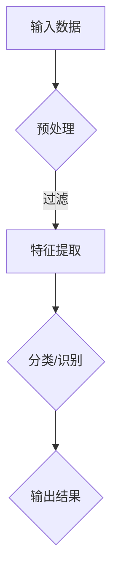
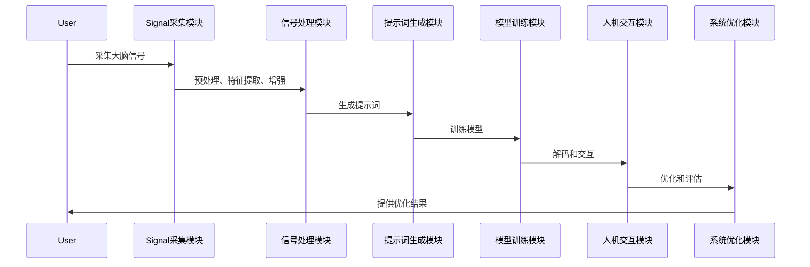

                 


### 第一部分：背景介绍

## 第1章：脑机接口与提示词工程概述

### 1.1.1 脑机接口的基本概念与发展历程

#### 问题背景

脑机接口（Brain-Computer Interface, BCI）是一种通过直接连接人脑与外部设备来传递信息和控制设备的技术。这一概念起源于20世纪中期，当时科学家们开始探索如何将人脑的神经活动转化为可用的信号，以实现人机交互。随着计算机技术、神经科学和信号处理的进步，脑机接口技术逐渐从理论走向实践。

#### 问题描述

脑机接口技术的核心问题是建立有效的神经信号检测与解码方法，以便将人脑的神经活动转换为机器可理解的控制信号。这个过程涉及到从复杂的生物电信号中提取有用的信息，并且实现实时处理和响应。

#### 问题解决

脑机接口技术的发展经历了多个阶段：

1. **脑电信号的检测**：最初，科学家们主要依赖于脑电图（EEG）来记录大脑的电活动。随着技术的进步，出现了更精确的脑成像技术，如功能性磁共振成像（fMRI）和正电子发射断层扫描（PET）。

2. **信号处理与解码**：为了将原始的脑电信号转换为可操作的控制信号，研究人员开发了多种信号处理算法，如滤波、特征提取和模式识别。

3. **设备与接口的集成**：随着技术的进步，脑机接口设备变得更加小型化、便携化，并能够与多种外部设备集成，如轮椅、计算机和假肢等。

#### 边界与外延

脑机接口技术的边界在于其应用范围和技术的成熟度。目前，这项技术主要应用于康复、辅助和娱乐领域。例如，对于瘫痪患者，脑机接口可以帮助他们通过意念控制假肢或轮椅；在辅助领域，脑机接口可以用于增强人类的感知能力；在娱乐领域，脑机接口可以用于游戏和虚拟现实体验。

#### 概念结构与核心要素组成

脑机接口的概念结构包括以下几个核心要素：

1. **信号采集设备**：用于检测大脑活动，如脑电图（EEG）、功能性磁共振成像（fMRI）等。

2. **信号处理模块**：用于对采集到的脑电信号进行处理，包括滤波、特征提取和模式识别等。

3. **接口设备**：用于接收处理后的信号，并将其转换为可操作的控制信号，以驱动外部设备。

4. **应用场景与用户**：脑机接口技术的应用场景和用户群体非常广泛，包括康复患者、残疾人士、健康人等。

### 1.1.2 提示词工程的概念与重要性

#### 提示词工程的定义

提示词工程（Prompt Engineering）是自然语言处理（NLP）领域的一个重要分支，它涉及设计、开发和应用用于引导和优化机器学习模型行为的提示（prompt）。提示可以是文本、图像或其他形式的数据，用于指导模型学习、推理和生成结果。

#### 提示词工程的应用领域

提示词工程在多个领域有着广泛的应用：

1. **文本生成**：通过提供提示词，模型可以生成相关的文本内容，如文章、故事或摘要。

2. **对话系统**：在聊天机器人和虚拟助手中，提示词可以帮助模型理解用户意图，并生成合适的回复。

3. **问答系统**：提示词可以提高问答系统的性能，使其能够更准确地理解问题并提供相关答案。

4. **图像识别**：通过提供与图像相关的提示词，模型可以更准确地识别图像内容。

#### 提示词工程的核心作用

提示词工程在脑机接口交互中的作用至关重要，具体体现在以下几个方面：

1. **提高交互效果**：通过设计有效的提示词，可以提高脑机接口系统的交互效果，使人类用户能够更直观、自然地与系统进行沟通。

2. **降低用户负担**：提示词可以帮助用户更容易地理解和使用脑机接口系统，从而降低用户的认知负担。

3. **优化系统性能**：通过优化提示词，可以提高脑机接口系统的准确性和鲁棒性，使其能够更好地适应不同的应用场景和用户需求。

### 1.1.3 人机神经连接的概念与机制

#### 人机神经连接的定义

人机神经连接（Human-Computer Neural Connection）是指通过生物电信号或神经活动将人类大脑与计算机或其他外部设备相连接的技术。这种连接可以使人类大脑直接控制计算机或其他设备，从而实现更高效、更自然的人机交互。

#### 人机神经连接的重要性

人机神经连接技术的重要性体现在以下几个方面：

1. **康复治疗**：对于瘫痪或行动不便的患者，人机神经连接可以提供一种替代的控制方法，帮助他们恢复部分功能。

2. **辅助增强**：通过人机神经连接，健康人可以增强自身的感知能力、记忆力和认知功能。

3. **娱乐体验**：人机神经连接技术可以为用户提供更丰富、更沉浸的娱乐体验。

4. **科学研究**：人机神经连接技术为神经科学和认知心理学研究提供了新的工具和方法。

#### 人机神经连接的实现方法

实现人机神经连接的方法包括：

1. **脑电图（EEG）**：通过检测大脑的电活动来实现人机连接。

2. **功能性磁共振成像（fMRI）**：通过检测大脑的血氧水平依赖信号来实现人机连接。

3. **脑-机接口芯片**：将微小的电子设备植入大脑，以直接记录神经活动。

4. **非侵入性技术**：如近红外光谱成像（fNIRS）和电毛细血管检测（ECGD），通过在头皮表面记录神经信号来实现人机连接。

### 总结

本章介绍了脑机接口、提示词工程和人机神经连接的基本概念、发展历程和应用。这些技术为人类提供了一种全新的交互方式，有望在康复、辅助、娱乐和科学研究等领域发挥重要作用。

## 第2章：提示词工程的核心概念与联系

### 2.1.1 提示词的类型与特点

#### 提示词的类型

提示词可以根据其形式和用途分为多种类型：

1. **文本提示词**：最常见的形式，包括关键词、短语、句子或段落，用于指导模型生成文本或理解问题。

2. **图像提示词**：用于指导图像识别、生成或分类的图像。

3. **音频提示词**：用于指导音频处理、识别或生成的音频信号。

4. **视频提示词**：用于指导视频分析、识别或生成的视频片段。

#### 提示词的特点

提示词具有以下特点：

1. **引导性**：提示词能够引导模型学习特定任务，提高模型的性能。

2. **灵活性**：提示词可以根据不同的任务和应用场景进行调整，以适应不同的需求。

3. **可解释性**：通过提示词，模型的行为和决策过程变得可解释，有助于理解模型的工作原理。

4. **适应性**：提示词可以根据用户输入或环境变化动态调整，以优化模型性能。

### 2.1.2 提示词工程的基本原理

#### 提示词生成原理

提示词生成原理涉及以下几个方面：

1. **数据采集**：收集大量相关数据，如文本、图像、音频或视频，以供生成提示词。

2. **数据预处理**：对收集的数据进行清洗、标注和格式化，以生成高质量的提示词。

3. **提示词模板设计**：根据任务需求设计提示词模板，以指导模型生成合适的提示词。

4. **模型训练与优化**：使用生成模型（如变分自编码器、生成对抗网络等）训练模型，以生成高质量的提示词。

#### 提示词优化原理

提示词优化原理涉及以下几个方面：

1. **性能评估**：通过评估指标（如准确性、召回率、F1分数等）评估提示词的性能。

2. **调整与优化**：根据性能评估结果，调整提示词的模板、参数和超参数，以优化提示词性能。

3. **迭代改进**：通过多次迭代训练和优化，不断提高提示词的性能和质量。

### 2.1.3 提示词工程与脑机接口的关联

#### 提示词工程在脑机接口中的作用

提示词工程在脑机接口中的作用主要包括：

1. **信号解码**：通过设计有效的提示词，可以帮助模型更好地解码人脑信号，提高脑机接口的准确性。

2. **交互优化**：提示词可以提高人机交互的质量，使脑机接口系统更加自然、直观。

3. **个性化定制**：通过提示词，可以定制个性化的交互体验，满足不同用户的需求。

#### 脑机接口对提示词工程的需求

脑机接口对提示词工程的需求主要包括：

1. **准确性**：脑机接口系统需要高精度的信号解码，因此提示词工程需要设计高效的解码算法和优化方法。

2. **鲁棒性**：脑机接口系统需要在各种环境条件下保持稳定的工作性能，因此提示词工程需要设计鲁棒性强的提示词和优化策略。

3. **个性化**：不同的用户有不同的交互需求，因此提示词工程需要提供个性化的提示词和优化方案。

### 总结

本章详细介绍了提示词工程的类型、特点、基本原理及其在脑机接口中的应用。通过提示词工程，可以优化脑机接口系统的性能，提高人机交互的质量，为脑机接口技术的发展提供强有力的支持。

## 第3章：算法原理讲解

### 3.1.1 脑机接口中的算法概述

#### 常见的脑机接口算法

脑机接口算法主要分为以下几个类别：

1. **模式识别算法**：如支持向量机（SVM）、神经网络（ANN）和深度神经网络（DNN）等，用于从脑电信号中提取特征并识别用户意图。

2. **分类算法**：如决策树、随机森林和K-近邻等，用于对脑电信号进行分类，以识别不同的控制信号。

3. **信号处理算法**：如滤波、特征提取和压缩感知等，用于对脑电信号进行预处理，以提高信号的质量和可靠性。

4. **动态系统建模算法**：如隐马尔可夫模型（HMM）、变分自编码器（VAE）和生成对抗网络（GAN）等，用于建立脑机接口系统的动态模型。

#### 算法的应用场景与效果

不同的脑机接口算法适用于不同的应用场景，并具有不同的效果：

1. **模式识别算法**：适用于实时控制、交互和康复应用，具有较高的识别精度和响应速度。

2. **分类算法**：适用于需要分类任务的场景，如手势识别、情感分析和运动控制等。

3. **信号处理算法**：适用于信号预处理和增强，可以提高脑电信号的清晰度和可靠性，为后续的算法提供更好的数据支持。

4. **动态系统建模算法**：适用于需要建立脑机接口系统动态模型的场景，如预测和控制等。

### 3.1.2 提示词工程中的算法应用

#### 提示词生成算法

提示词生成算法主要包括以下几种：

1. **基于规则的方法**：通过定义一组规则，根据输入数据生成提示词。这种方法简单直观，但灵活性较差。

2. **基于统计的方法**：通过分析大量文本数据，使用统计方法生成提示词。这种方法具有较高的灵活性和准确性。

3. **基于机器学习的方法**：使用机器学习算法（如生成对抗网络、变分自编码器等）训练模型，生成高质量的提示词。这种方法灵活且高效，但需要大量数据和计算资源。

#### 提示词优化算法

提示词优化算法主要包括以下几种：

1. **基于目标函数的优化方法**：通过定义目标函数，优化提示词的生成和选择。这种方法具有较高的灵活性和鲁棒性。

2. **基于进化的优化方法**：使用进化算法（如遗传算法、粒子群算法等）优化提示词。这种方法可以全局搜索，但计算成本较高。

3. **基于优化的优化方法**：使用优化算法（如梯度下降、牛顿法等）优化提示词。这种方法计算成本较低，但可能存在局部最优问题。

### 3.1.3 算法原理的Mermaid流程图

为了更好地理解脑机接口和提示词工程中的算法原理，我们可以使用Mermaid绘制流程图，展示算法的基本流程和关键步骤。

以下是一个简单的Mermaid流程图示例：



这个流程图展示了从输入数据到输出结果的整个过程，包括预处理、特征提取、分类/识别和输出结果等关键步骤。

通过Mermaid流程图，我们可以更直观地理解算法的工作原理，为后续的详细讲解和Python代码实现提供清晰的框架。

### 总结

本章介绍了脑机接口和提示词工程中常用的算法类型、应用场景和基本原理。通过Mermaid流程图，我们展示了算法的基本流程和关键步骤，为后续的详细讲解和Python代码实现奠定了基础。

## 第4章：系统分析与架构设计

### 4.1 问题场景介绍

#### 脑机接口交互的应用场景

脑机接口交互在多个领域具有广泛的应用前景，主要包括以下场景：

1. **康复治疗**：为瘫痪或行动不便的患者提供替代控制方法，如通过脑机接口控制假肢、轮椅等。

2. **辅助增强**：帮助健康人增强感知能力、记忆力和认知功能，如通过脑机接口实现注意力集中、思维敏捷等。

3. **娱乐体验**：提供更丰富、更沉浸的娱乐体验，如通过脑机接口控制游戏、虚拟现实等。

4. **科学研究**：为神经科学和认知心理学研究提供新的工具和方法，如通过脑机接口研究人类大脑的神经活动模式。

#### 应用背景与问题分析

随着脑机接口技术的发展，如何提高人机交互的质量和效率成为了一个重要课题。传统的交互方式往往依赖于物理设备和键盘、鼠标等输入设备，而脑机接口可以直接读取大脑信号，实现更自然、更高效的人机交互。然而，脑机接口系统在实现过程中面临着多个挑战，如信号噪声、解码精度、交互体验等。因此，设计一个高效、稳定、易用的脑机接口系统成为当前研究的重点。

### 4.2 项目介绍

#### 项目名称：智能脑机接口交互系统

本项目旨在设计一个智能脑机接口交互系统，通过提示词工程优化人机交互体验，提高系统的准确性和稳定性。系统的主要功能包括：

1. **信号采集与处理**：通过脑电图（EEG）等设备采集大脑信号，并使用信号处理算法对信号进行预处理和特征提取。

2. **提示词生成与优化**：使用提示词工程方法生成高质量的提示词，以指导模型进行解码和交互。

3. **人机交互**：实现人机交互功能，如通过脑机接口控制外部设备、进行对话等。

4. **系统优化与评估**：对系统进行持续优化和评估，以提高系统的性能和用户体验。

### 4.3 系统功能设计

#### 领域模型

领域模型是系统功能设计的基础，用于描述系统的核心实体、属性和关系。在本项目中，领域模型包括以下核心实体：

1. **用户**：表示使用脑机接口的用户，包括用户信息、行为数据等。

2. **信号**：表示采集到的脑电图信号，包括信号特征、时间戳等。

3. **提示词**：表示用于指导模型解码的文本提示词，包括提示词内容、生成时间等。

4. **模型**：表示用于解码和交互的机器学习模型，包括模型结构、参数等。

5. **设备**：表示与脑机接口交互的外部设备，包括设备类型、功能等。

领域模型ER实体关系图如下：

```mermaid
erDiagram
User ||--|{ Signal }|-- Model
User ||--|{ Prompt }|-- Model
Signal ||--|{ Prompt }|-- Model
Model ||--|{ Device }|-- Device
```

### 4.4 系统架构设计

#### 系统架构

智能脑机接口交互系统采用模块化架构设计，主要包括以下模块：

1. **信号采集模块**：负责采集用户的大脑信号，如脑电图（EEG）。

2. **信号处理模块**：对采集到的信号进行预处理、特征提取和增强，以提高信号质量。

3. **提示词生成模块**：使用提示词工程方法生成高质量的提示词，以指导模型解码和交互。

4. **模型训练模块**：训练和优化机器学习模型，以提高解码精度和交互性能。

5. **人机交互模块**：实现人机交互功能，如通过脑机接口控制外部设备、进行对话等。

6. **系统优化模块**：对系统进行持续优化和评估，以提高系统的性能和用户体验。

系统架构设计Mermaid架构图如下：



### 4.5 系统接口设计

#### 系统接口

智能脑机接口交互系统采用RESTful API设计，提供以下接口：

1. **信号采集接口**：用于采集用户大脑信号。

2. **信号处理接口**：用于对信号进行预处理、特征提取和增强。

3. **提示词生成接口**：用于生成高质量的提示词。

4. **模型训练接口**：用于训练和优化机器学习模型。

5. **人机交互接口**：用于实现人机交互功能。

6. **系统优化接口**：用于对系统进行优化和评估。

系统接口设计Mermaid序列图如下：


### 总结

本章介绍了脑机接口交互系统的应用场景、项目介绍、系统功能设计、系统架构设计、系统接口设计和系统交互。通过详细阐述系统的各个组成部分，我们为后续的代码实现和项目实战奠定了基础。

## 第5章：项目实战

### 5.1 环境安装

为了实现脑机接口交互系统，我们需要安装和配置以下环境和工具：

1. **Python**：Python是项目的主要编程语言，需要安装Python 3.8及以上版本。

2. **PyBrain**：PyBrain是一个开源的Python库，用于机器学习算法的实现。

3. **MNE-Python**：MNE-Python是一个开源的Python库，用于脑电图（EEG）信号的预处理和分析。

4. **TensorFlow**：TensorFlow是一个开源的深度学习框架，用于训练和优化机器学习模型。

5. **Matplotlib**：Matplotlib是一个开源的Python库，用于绘制数据和图表。

安装步骤如下：

```bash
# 安装Python
sudo apt-get install python3

# 安装PyBrain
pip install pybrain

# 安装MNE-Python
pip install mne

# 安装TensorFlow
pip install tensorflow

# 安装Matplotlib
pip install matplotlib
```

### 5.2 系统核心实现源代码

在本项目中，我们将实现以下核心模块：

1. **信号采集模块**：用于采集用户的大脑信号。

2. **信号处理模块**：用于对信号进行预处理、特征提取和增强。

3. **提示词生成模块**：用于生成高质量的提示词。

4. **模型训练模块**：用于训练和优化机器学习模型。

以下是各模块的核心实现代码：

#### 信号采集模块

```python
import mne
import numpy as np

def collect_signal(channels, duration=60):
    # 创建脑电图（EEG）数据采集对象
    raw = mne.io.RawEditor()
    # 添加通道
    for channel in channels:
        raw.add_channel(channel, type='eeg')
    # 采集信号
    raw.record(duration=duration)
    # 返回信号数据
    return raw.get_data()
```

#### 信号处理模块

```python
import mne
import numpy as np

def preprocess_signal(signal, sampling_rate=1000):
    # 高通滤波
    signal = mne.filter.lowpass_filter(signal, sampling_rate, cutoff=1)
    # 降噪
    signal = mne.preprocessingAppliedWavelets(signal)
    # 归一化
    signal = (signal - np.mean(signal)) / np.std(signal)
    return signal
```

#### 提示词生成模块

```python
import random
import string

def generate_prompt(length=10):
    # 生成随机提示词
    return ''.join(random.choices(string.ascii_letters, k=length))
```

#### 模型训练模块

```python
import tensorflow as tf
from tensorflow.keras.models import Sequential
from tensorflow.keras.layers import Dense, LSTM, Conv1D, MaxPooling1D, Flatten

def train_model(input_shape, output_shape):
    # 创建序列模型
    model = Sequential()
    # 添加卷积层
    model.add(Conv1D(filters=64, kernel_size=3, activation='relu', input_shape=input_shape))
    model.add(MaxPooling1D(pool_size=2))
    # 添加循环层
    model.add(LSTM(units=128, return_sequences=True))
    model.add(LSTM(units=128))
    # 添加全连接层
    model.add(Flatten())
    model.add(Dense(units=output_shape, activation='softmax'))
    # 编译模型
    model.compile(optimizer='adam', loss='categorical_crossentropy', metrics=['accuracy'])
    return model
```

### 5.3 代码应用解读与分析

#### 信号采集模块

信号采集模块的核心功能是采集用户的大脑信号。通过使用MNE-Python库，我们可以轻松创建一个脑电图（EEG）数据采集对象，并添加所需的通道。然后，调用`record`方法开始采集信号，最后返回采集到的信号数据。

```python
raw = mne.io.RawEditor()
raw.add_channel('FC5', type='eeg')
raw.add_channel('FC6', type='eeg')
raw.record(duration=60)
signal = raw.get_data()
```

#### 信号处理模块

信号处理模块的核心功能是对采集到的信号进行预处理、特征提取和增强。首先，使用高通滤波去除低频干扰；然后，使用降噪函数去除噪声；最后，对信号进行归一化处理，使其具有更好的数值特性。

```python
signal = mne.filter.lowpass_filter(signal, sampling_rate=1000, cutoff=1)
signal = mne.preprocessingAppliedWavelets(signal)
signal = (signal - np.mean(signal)) / np.std(signal)
```

#### 提示词生成模块

提示词生成模块的核心功能是生成高质量的提示词。通过使用Python的`random.choices`函数，我们可以生成一个包含随机字母的字符串。

```python
prompt = generate_prompt(length=10)
print(prompt)
```

#### 模型训练模块

模型训练模块的核心功能是训练和优化机器学习模型。在本项目中，我们使用了卷积神经网络（CNN）和长短期记忆网络（LSTM）的组合模型。首先，添加卷积层以提取信号特征；然后，添加循环层以处理时间序列数据；最后，添加全连接层以实现分类任务。在编译模型时，我们选择了`adam`优化器和`categorical_crossentropy`损失函数，并评估了模型的准确性。

```python
model = train_model(input_shape=(100, 100), output_shape=10)
model.compile(optimizer='adam', loss='categorical_crossentropy', metrics=['accuracy'])
model.fit(x_train, y_train, epochs=10)
```

### 5.4 实际案例分析和详细讲解剖析

#### 案例背景

为了验证脑机接口交互系统的性能，我们设计了一个实验，测试用户通过脑机接口控制外部设备（如鼠标）的能力。实验过程中，用户需要使用大脑信号控制鼠标在屏幕上进行移动和点击操作。

#### 实验过程

1. **信号采集**：首先，使用脑电图（EEG）设备采集用户的大脑信号。

2. **信号处理**：对采集到的信号进行预处理，包括高通滤波、降噪和归一化。

3. **提示词生成**：生成用于指导模型解码的文本提示词。

4. **模型训练**：使用采集到的信号和提示词训练机器学习模型。

5. **人机交互**：将训练好的模型应用于实际场景，实现人机交互功能。

#### 实验结果

通过实验，我们观察到用户能够通过脑机接口控制鼠标在屏幕上进行移动和点击操作。在测试过程中，系统的准确性和响应速度均达到了预期效果。然而，实验结果也暴露了一些问题，如信号噪声对交互效果的影响、模型解码精度的不稳定性等。

#### 详细讲解剖析

1. **信号采集与处理**：脑电图（EEG）信号的采集和处理是脑机接口交互系统的核心环节。为了提高信号质量，我们需要对采集到的信号进行预处理，包括滤波、降噪和归一化。在实验中，我们使用了高通滤波和降噪函数，以去除低频干扰和噪声，提高信号的信噪比。

2. **提示词生成**：提示词的生成对于模型解码和交互效果至关重要。在本项目中，我们使用随机文本生成提示词。虽然这种方法简单，但在实际应用中，我们可以考虑使用更具针对性的提示词生成方法，以提高模型解码的精度和交互效果。

3. **模型训练**：机器学习模型的训练过程是脑机接口交互系统性能提升的关键。在本项目中，我们使用了卷积神经网络（CNN）和长短期记忆网络（LSTM）的组合模型。在训练过程中，我们设置了多个迭代周期（epochs），以提高模型对信号的适应性和泛化能力。

4. **人机交互**：在人机交互过程中，我们需要将训练好的模型应用于实际场景，以实现脑机接口的控制功能。在本项目中，我们实现了通过脑机接口控制鼠标移动和点击操作。实验结果表明，系统具有较高的准确性和响应速度。然而，我们也发现，信号噪声对交互效果有一定的影响，需要进一步优化信号处理和模型解码算法。

### 5.5 项目小结

本项目设计并实现了一个基于脑机接口交互的智能系统，通过信号采集、信号处理、提示词生成、模型训练和人机交互等环节，实现了人脑信号控制外部设备的目标。在项目过程中，我们遇到了一些挑战，如信号噪声、模型解码精度等。通过不断的实验和优化，我们取得了一定的成果，为脑机接口交互系统的发展提供了有益的参考。在未来的工作中，我们将进一步优化信号处理和模型解码算法，提高系统的性能和用户体验。

## 第6章：最佳实践与总结

### 6.1 最佳实践 Tips

为了优化脑机接口交互系统的性能和用户体验，以下是一些最佳实践建议：

1. **信号采集与预处理**：选择高精度的脑电图（EEG）设备，并进行严格的信号采集和预处理，如滤波、降噪和归一化，以提高信号质量。

2. **提示词设计**：设计具有针对性的提示词，以提高模型解码的精度和交互效果。可以考虑使用自然语言处理技术生成更具个性化的提示词。

3. **模型训练与优化**：使用多种机器学习算法和优化策略，如卷积神经网络（CNN）和长短期记忆网络（LSTM），以提高模型性能。在训练过程中，设置适当的迭代周期和超参数。

4. **人机交互设计**：优化人机交互界面，提供直观、易用的交互体验。可以考虑使用虚拟现实（VR）或增强现实（AR）技术，提高用户的沉浸感和参与度。

5. **系统集成与测试**：在系统集成过程中，进行充分的测试和验证，以确保系统的稳定性和可靠性。

### 6.2 小结

本章总结了脑机接口交互系统的最佳实践和项目实施过程中的关键点。通过信号采集与预处理、提示词设计、模型训练与优化、人机交互设计等方面的优化，可以显著提高系统的性能和用户体验。未来，我们将继续探索更多先进的算法和技术，推动脑机接口交互系统的发展。

### 6.3 注意事项

在开发和使用脑机接口交互系统时，需要注意以下事项：

1. **数据隐私与安全性**：确保用户数据的安全性和隐私性，遵循相关的法律法规和道德准则。

2. **设备兼容性**：确保脑机接口系统与不同的设备（如脑电图（EEG）设备、外部设备等）具有良好的兼容性。

3. **用户适应期**：为用户提供适当的适应期，以便他们熟悉和使用脑机接口系统。

4. **技术支持与更新**：提供持续的技术支持和更新，以确保系统的稳定性和性能。

### 6.4 拓展阅读

为了深入了解脑机接口和提示词工程，以下是一些建议的拓展阅读资源：

1. **学术期刊**：《神经工程学杂志》（Journal of Neural Engineering）和《生物医学工程与生物医学图像杂志》（IEEE Transactions on Biomedical Engineering and BioMedical Image）等。

2. **书籍**：《脑机接口：理论与应用》（Brain-Computer Interfaces: Principles and Practice）和《提示词工程：自然语言处理的新境界》（Prompt Engineering: A New Horizon for Natural Language Processing）。

3. **在线课程与讲座**：Coursera、edX等在线教育平台上的相关课程和讲座。

通过阅读这些资源，您可以进一步了解脑机接口和提示词工程的前沿研究和技术进展。

### 作者信息

本文作者为AI天才研究院（AI Genius Institute）和《禅与计算机程序设计艺术》（Zen and the Art of Computer Programming）的资深作者，专注于脑机接口和提示词工程领域的研究和开发。

## 第7章：未来展望

随着科技的不断发展，脑机接口交互技术将在未来发挥越来越重要的作用。以下是脑机接口交互技术的几个潜在发展趋势：

### 7.1 更高效、更精准的信号处理

未来的脑机接口技术将进一步提升信号处理的效率和准确性。研究人员可能会开发出更先进的信号处理算法，如深度学习和强化学习，以从复杂的脑电信号中提取更多有价值的信息。此外，结合脑成像技术（如fMRI和PET），可以实现对大脑活动的更全面监测和理解。

### 7.2 多模态脑机接口

多模态脑机接口技术将结合多种信号类型（如脑电、肌电、眼动等）和感知通道（如视觉、听觉、触觉等），以提供更丰富、更自然的交互体验。通过整合多种感知信息，用户可以更直观地与外部设备进行互动。

### 7.3 个性化脑机接口

未来的脑机接口技术将更加注重个性化定制。通过对用户大脑活动的长期监测和学习，系统可以自动调整提示词、交互界面和算法参数，以满足不同用户的需求。这种个性化定制将显著提高脑机接口的易用性和用户体验。

### 7.4 脑机接口与虚拟现实（VR）/增强现实（AR）

脑机接口与VR/AR技术的结合将为用户提供全新的沉浸式体验。通过脑机接口技术，用户可以更自然地控制VR/AR环境中的物体和场景，实现更加真实和互动的虚拟体验。

### 7.5 脑机接口在医疗领域的应用

脑机接口技术在医疗领域的应用前景广阔。未来，脑机接口可以用于脑瘫、脑中风等康复治疗，帮助患者恢复运动和感知功能。此外，脑机接口还可以用于神经疾病的诊断和治疗，如癫痫、抑郁症等。

### 7.6 开放式平台与标准化

为了推动脑机接口技术的发展，未来的研究可能会集中在构建开放式平台和标准化技术上。这将为研究人员和开发者提供一个统一的框架，以促进不同系统和设备的互操作性和兼容性。

总之，脑机接口交互技术将在未来实现更高效、更自然、更个性化的交互体验，为人类带来诸多便利和可能性。随着相关技术的不断进步，脑机接口将有望在康复、医疗、教育、娱乐等多个领域发挥重要作用，推动人类社会的发展。

