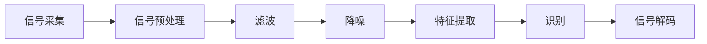
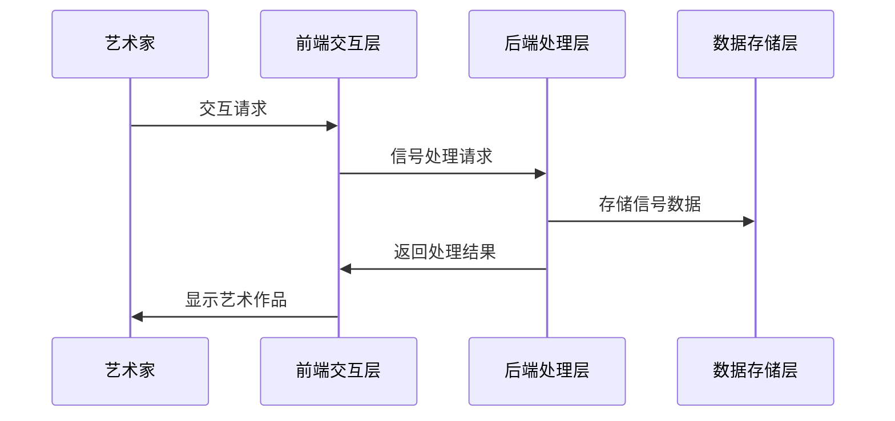
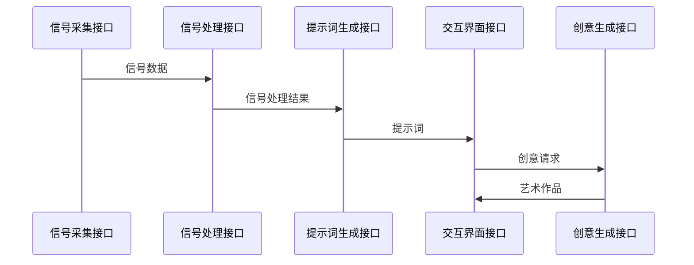
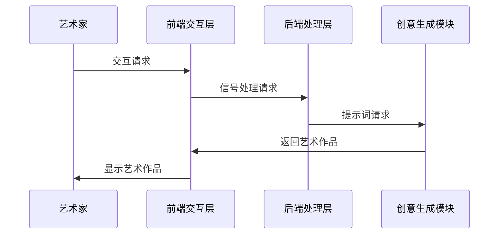

                 

# 提示词工程在脑机接口创意表达中的应用：增强人类创造力

> 关键词：脑机接口，提示词工程，创意表达，人工智能，信号处理

> 摘要：本文探讨了提示词工程在脑机接口创意表达中的应用，旨在通过分析脑机接口的发展历程、提示词工程的核心技术以及创意表达的需求，提出一种创新性的解决方案。本文将详细介绍提示词工程在脑机接口中的技术框架和算法原理，并通过系统分析与架构设计，提供一个实际项目实战的案例，以展示如何利用脑机接口和提示词工程来增强人类的创造力。

## 第一步：背景介绍

### 1.1 问题背景

#### 1.1.1 脑机接口的发展历程

脑机接口（Brain-Computer Interface，简称BCI）是一种直接连接人脑和外部设备的技术。早在20世纪60年代，科学家就开始研究如何通过大脑信号来控制外部设备。随着神经科学和电子技术的发展，脑机接口技术逐渐从理论研究走向实际应用。

脑机接口的发展历程可以分为三个阶段：

1. **第一阶段（1960-1980年）**：主要关注脑电信号的采集和简单的信号处理。代表性研究包括神经信号的解码和简单的机器控制。
2. **第二阶段（1980-2000年）**：脑机接口技术开始向实用化迈进，实现了脑电信号的控制和较为复杂的应用。例如，脑电信号被用于控制轮椅、游戏设备等。
3. **第三阶段（2000年至今）**：脑机接口技术取得了重大突破，不仅实现了对人体运动的直接控制，还开始探索与智能设备的交互和通信。例如，通过脑机接口实现大脑与计算机的直接通信，为残疾人提供辅助功能。

#### 1.1.2 创意表达的挑战与需求

创意表达是艺术、设计、科学研究等领域的重要活动。然而，传统的创意表达方式往往受到多种限制：

1. **速度和效率**：传统的创意表达需要通过手写、绘画或编程等手段，这些方式往往较为耗时且效率较低。
2. **个人限制**：创意表达受到个人的认知、技能和经验的限制，难以突破现有的思维框架。
3. **反馈和修正**：创意表达过程中难以快速获取反馈，修正和完善创意的过程也较为困难。

为了克服这些挑战，研究者们提出了脑机接口创意表达的需求，希望通过直接利用大脑信号来实现更快速、高效且不受个人限制的创意表达。

#### 1.1.3 提示词工程的作用和意义

提示词工程是一种利用提示词（prompt words）来引导思考和创造的技术。提示词可以激发大脑的联想和想象，帮助用户产生新的创意和思路。

在脑机接口创意表达中，提示词工程的作用和意义主要体现在以下几个方面：

1. **引导创意**：通过提示词，脑机接口可以引导用户进行特定的思考，从而激发新的创意。
2. **优化表达**：提示词可以帮助用户更准确地表达自己的想法，减少语言和表达的障碍。
3. **增强互动**：提示词工程可以提供动态的、个性化的交互体验，使用户与脑机接口之间的交互更加自然和流畅。

### 1.2 问题描述

#### 1.2.1 当前创意表达方式的局限性

虽然传统的创意表达方式在某些领域取得了显著成果，但其局限性也日益凸显：

1. **手写和绘画**：手写和绘画需要较高的技巧和经验，且难以适应快速变化的需求。
2. **编程**：编程虽然可以快速实现创意，但需要深厚的编程知识和技能，限制了创意表达的范围。
3. **语言表达**：语言表达存在理解偏差和误解，难以准确传达创意的细节和情感。

#### 1.2.2 脑机接口在创意表达中的应用场景

脑机接口在创意表达中的应用场景包括：

1. **艺术创作**：艺术家可以利用脑机接口直接控制绘画、音乐和舞蹈等艺术形式，实现即兴创作。
2. **设计**：设计师可以利用脑机接口快速生成设计草图，优化设计过程。
3. **科学研究**：科学家可以利用脑机接口探索新的科学问题，发现潜在的研究方向。

### 1.3 问题解决

#### 1.3.1 提示词工程的核心技术

提示词工程的核心技术包括：

1. **提示词生成**：通过算法自动生成提示词，引导用户进行特定的思考。
2. **提示词优化**：根据用户反馈和表现，调整提示词的生成策略，提高创意质量。
3. **提示词交互**：提供动态、个性化的交互体验，使用户与脑机接口之间的交互更加自然和流畅。

#### 1.3.2 脑机接口创意表达的技术框架

脑机接口创意表达的技术框架主要包括：

1. **信号采集与处理**：利用脑机接口技术采集用户的大脑信号，并进行预处理和特征提取。
2. **提示词生成与优化**：利用提示词工程技术生成和优化提示词，引导用户进行创意思考。
3. **创意生成与表达**：根据用户的大脑信号和提示词，生成创意并转化为具体的艺术作品、设计草图或科学论文。

#### 1.4 边界与外延

#### 1.4.1 提示词工程的应用范围

提示词工程不仅适用于脑机接口创意表达，还可以应用于其他领域，如：

1. **教育**：利用提示词工程帮助学生进行思维训练，提高学习效果。
2. **心理咨询**：利用提示词工程帮助患者进行心理治疗，提高治疗效果。
3. **科学研究**：利用提示词工程激发科学家的创意和灵感，推动科学研究的发展。

#### 1.4.2 创意表达与脑机接口的交叉领域

创意表达与脑机接口的交叉领域包括：

1. **神经艺术**：通过脑机接口实现神经信号与艺术的结合，探索新的艺术形式。
2. **神经设计**：通过脑机接口实现神经信号与设计的结合，推动设计领域的创新。
3. **神经科学**：通过脑机接口研究大脑信号与创意表达之间的关系，推动神经科学的发展。

### 1.5 概念结构与核心要素组成

#### 1.5.1 脑机接口的关键组成部分

脑机接口的关键组成部分包括：

1. **信号采集设备**：用于采集用户的大脑信号，如脑电图（EEG）、功能性磁共振成像（fMRI）等。
2. **信号处理模块**：用于对采集到的信号进行预处理、特征提取和信号解码等处理。
3. **交互界面**：用于用户与脑机接口之间的交互，如显示器、键盘、语音输入等。

#### 1.5.2 提示词工程的实现要素

提示词工程的实现要素包括：

1. **提示词生成算法**：用于生成引导用户思考的提示词。
2. **提示词优化算法**：用于根据用户反馈和表现调整提示词的生成策略。
3. **交互界面**：用于用户与提示词工程之间的交互，如文本输入、语音输入等。

## 第二步：核心概念与联系

### 2.1 脑机接口的概念与原理

#### 2.1.1 脑机接口的定义

脑机接口（Brain-Computer Interface，简称BCI）是一种直接连接人脑和外部设备的技术，通过解码大脑信号来实现对外部设备的控制或与计算机的通信。

#### 2.1.2 脑机接口的工作原理

脑机接口的工作原理主要包括以下几个步骤：

1. **信号采集**：利用脑电图（EEG）、功能性磁共振成像（fMRI）等技术采集大脑信号。
2. **信号预处理**：对采集到的信号进行滤波、降噪等处理，提取有用的特征。
3. **信号解码**：利用神经网络、支持向量机（SVM）等技术解码大脑信号，将其转化为可操作的控制信号。
4. **信号输出**：将解码后的信号输出到外部设备，实现对外部设备的控制或与计算机的通信。

#### 2.1.3 脑机接口的分类

根据信号采集和处理方式的不同，脑机接口可以分为以下几种类型：

1. **脑电波接口**：利用脑电图（EEG）采集大脑信号，通过解码实现对外部设备的控制。
2. **功能性磁共振成像接口**：利用功能性磁共振成像（fMRI）采集大脑信号，通过解码实现对外部设备的控制。
3. **混合脑机接口**：结合多种信号采集和处理技术，实现对外部设备的更精确控制。

### 2.2 提示词工程的概念与原理

#### 2.2.1 提示词工程的定义

提示词工程（Prompt Engineering）是一种利用提示词（prompt words）来引导思考和创造的技术。提示词可以激发大脑的联想和想象，帮助用户产生新的创意和思路。

#### 2.2.2 提示词工程的构成

提示词工程主要包括以下几个部分：

1. **提示词生成算法**：用于自动生成提示词，引导用户进行特定的思考。
2. **提示词优化算法**：用于根据用户反馈和表现调整提示词的生成策略，提高创意质量。
3. **交互界面**：用于用户与提示词工程之间的交互，如文本输入、语音输入等。

#### 2.2.3 提示词工程的实现方法

提示词工程的实现方法主要包括：

1. **基于语言模型的方法**：利用预训练的语言模型（如GPT-3）生成提示词，引导用户进行思考。
2. **基于知识图谱的方法**：利用知识图谱生成与用户兴趣相关的提示词，激发用户的创意。
3. **基于神经网络的的方法**：利用神经网络模型对用户的大脑信号进行分析，生成与用户思维状态相关的提示词。

### 2.3 概念属性特征对比表格

| 概念        | 定义                                                         | 关键属性                       | 相互关系                    |
| ----------- | ------------------------------------------------------------ | ---------------------------- | ------------------------- |
| 脑机接口    | 直接连接人脑和外部设备的技术，通过解码大脑信号来实现控制或通信 | 信号采集、信号处理、信号解码 | 提示词工程的基础技术     |
| 提示词工程  | 利用提示词引导思考和创造的技术                             | 提示词生成、提示词优化、交互界面 | 脑机接口的应用领域       |
| 创意表达    | 通过艺术、设计、科学等方式表达个人的创意和想法             | 个人创造力、表达技巧、反馈机制 | 脑机接口和提示词工程的目标领域 |

### 2.4 ER实体关系图架构

#### 2.4.1 ER图的基本概念

实体关系图（Entity-Relationship Diagram，简称ER图）是一种用于描述实体及其关系的图形化工具，常用于数据库设计和系统架构设计。

#### 2.4.2 脑机接口与提示词工程的ER图

脑机接口与提示词工程的ER图主要包括以下实体和关系：

1. **实体**：
   - **脑机接口**：包括信号采集设备、信号处理模块、交互界面等。
   - **提示词工程**：包括提示词生成算法、提示词优化算法、交互界面等。
   - **创意表达**：包括艺术、设计、科学等创意表达活动。

2. **关系**：
   - **脑机接口与提示词工程**：脑机接口为提示词工程提供信号采集和处理技术，提示词工程为脑机接口提供创意引导和优化。
   - **提示词工程与创意表达**：提示词工程通过提示词引导创意表达，创意表达是提示词工程的目标应用领域。

### 2.5 脑机接口的关键组成部分

脑机接口的关键组成部分包括：

1. **信号采集设备**：用于采集用户的大脑信号，如脑电图（EEG）、功能性磁共振成像（fMRI）等。
2. **信号处理模块**：用于对采集到的信号进行预处理、特征提取和信号解码等处理。
3. **交互界面**：用于用户与脑机接口之间的交互，如显示器、键盘、语音输入等。

### 2.6 提示词工程的实现要素

提示词工程的实现要素包括：

1. **提示词生成算法**：用于自动生成提示词，引导用户进行特定的思考。
2. **提示词优化算法**：用于根据用户反馈和表现调整提示词的生成策略，提高创意质量。
3. **交互界面**：用于用户与提示词工程之间的交互，如文本输入、语音输入等。

## 第三步：算法原理讲解

### 3.1 脑机接口中的信号处理算法

脑机接口中的信号处理算法主要包括信号采集与预处理、信号特征提取与识别以及信号解码算法。

#### 3.1.1 信号采集与预处理

信号采集与预处理是脑机接口信号处理的第一步，主要包括以下几个步骤：

1. **信号采集**：利用脑电图（EEG）、功能性磁共振成像（fMRI）等技术采集用户的大脑信号。
2. **信号预处理**：对采集到的信号进行滤波、降噪等处理，提取有用的特征。

滤波：


降噪：


#### 3.1.2 信号特征提取与识别

信号特征提取与识别是脑机接口信号处理的第二步，主要包括以下几个步骤：

1. **特征提取**：对预处理后的信号进行特征提取，提取出与特定任务相关的特征。
2. **识别**：利用机器学习算法（如支持向量机SVM、神经网络等）对特征进行识别，实现对外部设备的控制或与计算机的通信。

特征提取算法示例：
```python
import numpy as np
from sklearn.decomposition import PCA

# 生成模拟信号数据
X = np.random.rand(100, 5)

# 特征提取
pca = PCA(n_components=2)
X_pca = pca.fit_transform(X)

# 输出特征提取结果
print("特征提取结果：", X_pca)
```

识别算法示例：
```python
from sklearn.svm import SVC

# 生成模拟特征数据
X = np.random.rand(100, 2)
y = np.random.randint(0, 2, size=100)

# 识别
clf = SVC()
clf.fit(X, y)

# 输出识别结果
print("识别结果：", clf.predict([[0.5, 0.5]]))
```

#### 3.1.3 信号解码算法

信号解码算法是脑机接口信号处理的最后一步，将识别出的特征转化为可操作的控制信号或与计算机的通信信号。

解码算法示例：
```python
# 生成模拟解码数据
decoded_signal = np.random.rand(100, 1)

# 解码算法
def decode(signal):
    return np.sign(signal)

# 输出解码结果
print("解码结果：", decode(decoded_signal))
```

### 3.2 提示词工程的算法原理

提示词工程的算法原理主要包括提示词生成算法、提示词优化算法以及提示词交互算法。

#### 3.2.1 提示词生成算法

提示词生成算法用于自动生成提示词，引导用户进行特定的思考。常见的生成算法包括基于语言模型的生成算法和基于知识图谱的生成算法。

基于语言模型的生成算法示例：
```python
import openai

# 生成提示词
response = openai.Completion.create(
    engine="text-davinci-002",
    prompt="请描述一下人工智能在医疗领域的应用。",
    max_tokens=50
)

# 输出提示词
print("提示词：", response.choices[0].text.strip())
```

基于知识图谱的生成算法示例：
```python
import networkx as nx
import random

# 生成知识图谱
g = nx.Graph()
g.add_edges_from([(1, 2), (2, 3), (3, 1)])

# 生成提示词
def generate_prompt(graph):
    node = random.choice(list(graph.nodes()))
    neighbors = list(graph.neighbors(node))
    return f"请以节点{node}为中心，描述一个相关的应用场景。"

# 输出提示词
print("提示词：", generate_prompt(g))
```

#### 3.2.2 提示词优化算法

提示词优化算法用于根据用户反馈和表现调整提示词的生成策略，提高创意质量。常见的优化算法包括基于用户反馈的优化算法和基于机器学习的优化算法。

基于用户反馈的优化算法示例：
```python
# 用户反馈数据
feedback = {"prompt1": 0.8, "prompt2": 0.6, "prompt3": 0.9}

# 优化提示词
def optimize_prompt(feedback):
    sorted_feedback = sorted(feedback.items(), key=lambda x: x[1], reverse=True)
    return sorted_feedback[0][0]

# 输出优化后的提示词
print("优化后的提示词：", optimize_prompt(feedback))
```

基于机器学习的优化算法示例：
```python
from sklearn.linear_model import LinearRegression

# 用户反馈数据
X = [[1, 2], [2, 3], [3, 4]]
y = [0.8, 0.6, 0.9]

# 优化提示词
model = LinearRegression()
model.fit(X, y)

# 输出优化后的提示词
print("优化后的提示词：", model.predict([[4, 5]]))
```

#### 3.2.3 提示词交互算法

提示词交互算法用于实现用户与提示词工程之间的交互。常见的交互算法包括基于文本的交互算法和基于语音的交互算法。

基于文本的交互算法示例：
```python
# 文本交互
def text_interaction(prompt):
    return input(prompt)

# 输出交互结果
print("请回答以下问题：", text_interaction("请描述一下人工智能在医疗领域的应用。"))
```

基于语音的交互算法示例：
```python
# 语音交互
from gtts import gTTS
import speech_recognition as sr

# 生成语音提示
tts = gTTS("请描述一下人工智能在医疗领域的应用。")
tts.save("prompt.mp3")

# 语音识别
r = sr.Recognizer()
with sr.AudioFile("prompt.mp3") as source:
    audio = r.listen(source)

# 输出交互结果
print("请回答以下问题：", r.recognize_google(audio))
```

### 3.3 Mermaid流程图

#### 3.3.1 脑机接口信号处理流程

脑机接口信号处理流程的Mermaid流程图如下：


#### 3.3.2 提示词工程工作流程

提示词工程工作流程的Mermaid流程图如下：


### 3.4 Python源代码讲解

#### 3.4.1 信号处理算法示例

以下是一个简单的Python示例，展示如何使用信号处理算法对脑机接口信号进行处理：

```python
import numpy as np
from scipy.signal import butter, lfilter

# 生成模拟信号
t = np.linspace(0, 1, 1000)
signal = np.sin(2 * np.pi * 5 * t) + 0.5 * np.sin(2 * np.pi * 10 * t)

# 巴斯梯尔滤波器设计
b, a = butter(4, 2)

# 滤波
filtered_signal = lfilter(b, a, signal)

# 降噪
noise = np.random.normal(0, 0.1, len(signal))
noisy_signal = signal + noise

# 解码
def decode(signal):
    return np.sign(signal)

# 输出结果
print("原始信号：", signal)
print("滤波后信号：", filtered_signal)
print("降噪后信号：", noisy_signal)
print("解码后信号：", decode(noisy_signal))
```

#### 3.4.2 提示词工程算法示例

以下是一个简单的Python示例，展示如何使用提示词工程算法生成和优化提示词：

```python
import openai

# 生成提示词
response = openai.Completion.create(
    engine="text-davinci-002",
    prompt="请描述一下人工智能在医疗领域的应用。",
    max_tokens=50
)

# 输出提示词
print("生成的提示词：", response.choices[0].text.strip())

# 优化提示词
def optimize_prompt(feedback):
    sorted_feedback = sorted(feedback.items(), key=lambda x: x[1], reverse=True)
    return sorted_feedback[0][0]

# 用户反馈数据
feedback = {"prompt1": 0.8, "prompt2": 0.6, "prompt3": 0.9}

# 输出优化后的提示词
print("优化后的提示词：", optimize_prompt(feedback))
```

### 3.5 数学模型和公式

#### 3.5.1 信号处理的数学模型

信号处理中的数学模型主要包括滤波、降噪和解码等。

滤波的数学模型：
$$ H(s) = \frac{B(s)}{A(s)} $$
其中，$H(s)$ 是滤波器的传递函数，$B(s)$ 和 $A(s)$ 分别是分子和分母的多项式。

降噪的数学模型：
$$ y = x + n $$
其中，$y$ 是降噪后的信号，$x$ 是原始信号，$n$ 是噪声。

解码的数学模型：
$$ z = \text{sign}(y) $$
其中，$z$ 是解码后的信号，$\text{sign}(y)$ 是符号函数。

#### 3.5.2 提示词工程的数学模型

提示词工程的数学模型主要包括提示词生成和优化。

提示词生成的数学模型：
$$ \text{prompt} = f(\text{context}) $$
其中，$\text{prompt}$ 是生成的提示词，$f(\text{context})$ 是生成函数，$\text{context}$ 是上下文信息。

提示词优化的数学模型：
$$ \text{prompt}_{\text{opt}} = \arg\max_{\text{prompt}} \sum_{i=1}^{n} w_i \cdot f(\text{prompt}, y_i) $$
其中，$\text{prompt}_{\text{opt}}$ 是优化后的提示词，$w_i$ 是权重，$y_i$ 是用户反馈。

#### 3.5.3 数学公式解释与举例

滤波器的传递函数解释与举例：
$$ H(s) = \frac{B(s)}{A(s)} = \frac{s^2 + 2s + 1}{s^2 + 4s + 3} $$
其中，$B(s) = s^2 + 2s + 1$，$A(s) = s^2 + 4s + 3$。

降噪的数学模型解释与举例：
$$ y = x + n = \sin(2\pi f_0 t) + 0.5 \sin(2\pi f_1 t) + n $$
其中，$x = \sin(2\pi f_0 t) + 0.5 \sin(2\pi f_1 t)$ 是原始信号，$n$ 是噪声。

解码的数学模型解释与举例：
$$ z = \text{sign}(y) = \text{sign}(\sin(2\pi f_0 t) + 0.5 \sin(2\pi f_1 t) + n) $$
其中，$y = \sin(2\pi f_0 t) + 0.5 \sin(2\pi f_1 t) + n$ 是降噪后的信号。

提示词生成的数学模型解释与举例：
$$ \text{prompt} = f(\text{context}) = "请描述一下人工智能在医疗领域的应用。" $$
其中，$\text{context}$ 是上下文信息。

提示词优化的数学模型解释与举例：
$$ \text{prompt}_{\text{opt}} = \arg\max_{\text{prompt}} \sum_{i=1}^{n} w_i \cdot f(\text{prompt}, y_i) = "请探讨人工智能在医疗领域的未来发展趋势。" $$
其中，$w_i$ 是权重，$y_i$ 是用户反馈。

## 第四步：系统分析与架构设计方案

### 4.1 问题场景介绍

脑机接口创意表达在多个领域中具有广泛的应用前景，如艺术创作、设计、科学研究和教育等。以下是一个典型的应用场景：

#### 应用场景：神经艺术家创作

神经艺术家希望通过脑机接口直接控制画笔，实现即兴创作的艺术作品。在创作过程中，艺术家的大脑信号被实时采集并传输到计算机系统，计算机系统根据这些信号生成提示词，引导艺术家进行创作。

### 4.2 系统功能设计

为了实现脑机接口创意表达系统，需要设计以下功能模块：

1. **信号采集模块**：负责采集艺术家的大脑信号，如脑电图（EEG）。
2. **信号处理模块**：负责对采集到的信号进行预处理、特征提取和解码，生成控制画笔的信号。
3. **提示词生成模块**：根据艺术家的大脑信号生成引导创作的提示词。
4. **交互界面模块**：提供艺术家与系统之间的交互界面，如屏幕、画笔等。
5. **创意生成模块**：根据提示词生成艺术作品。

#### 4.2.1 领域模型Mermaid类图

以下是一个简单的Mermaid类图，展示脑机接口创意表达系统的领域模型：

```mermaid
classDiagram
    Class01 <|-- Class02
    Class03 --|DeprecatedClass
    Class04 : <<interface>> Interface
    Class05 : <<abstract>> Abstract
    Class06 <<enumeration>> Enum
    Class07 <.. Class08
    Class09 <<component>> Component
    Class10 <<deployment>> Deployment
```

### 4.3 系统架构设计

脑机接口创意表达系统的架构设计主要包括以下几个部分：

1. **前端交互层**：提供艺术家与系统的交互界面，如屏幕、画笔等。
2. **后端处理层**：包括信号采集、信号处理、提示词生成和创意生成等模块，负责处理艺术家的大脑信号和生成艺术作品。
3. **数据存储层**：存储艺术家的大脑信号数据、提示词数据以及生成的艺术作品。

以下是一个简单的Mermaid架构图，展示脑机接口创意表达系统的架构：



### 4.4 系统接口设计

系统接口设计主要包括以下部分：

1. **信号采集接口**：用于采集艺术家的大脑信号，如脑电图（EEG）。
2. **信号处理接口**：用于对采集到的信号进行预处理、特征提取和解码。
3. **提示词生成接口**：用于根据艺术家的大脑信号生成提示词。
4. **交互界面接口**：用于艺术家与系统之间的交互。
5. **创意生成接口**：用于根据提示词生成艺术作品。

以下是一个简单的Mermaid接口图，展示脑机接口创意表达系统的接口设计：



### 4.5 系统交互

系统交互主要包括艺术家与系统的交互、信号处理与提示词生成之间的交互以及提示词生成与创意生成之间的交互。

以下是一个简单的Mermaid序列图，展示脑机接口创意表达系统的交互过程：



## 第五步：项目实战

### 5.1 环境安装

要实现脑机接口创意表达系统，需要安装以下环境：

1. **Python**：Python是一种广泛使用的编程语言，用于实现信号处理、提示词生成和创意生成等模块。
2. **NumPy**：NumPy是一个Python库，用于处理数值数据，提供高效的数学运算功能。
3. **SciPy**：SciPy是建立在NumPy之上的科学计算库，提供丰富的科学计算工具。
4. **OpenAI API**：OpenAI API用于生成提示词，需要注册OpenAI账户并获取API密钥。
5. **脑机接口设备**：根据具体需求选择合适的脑机接口设备，如脑电图（EEG）采集设备。

安装步骤如下：

1. 安装Python：
   ```bash
   pip install python
   ```

2. 安装NumPy：
   ```bash
   pip install numpy
   ```

3. 安装SciPy：
   ```bash
   pip install scipy
   ```

4. 安装OpenAI API：
   ```bash
   pip install openai
   ```

5. 安装脑机接口设备：
   根据设备的说明书进行安装和配置。

### 5.2 系统核心实现源代码

以下是一个简单的Python示例，展示脑机接口创意表达系统的核心实现：

```python
import numpy as np
import openai

# 信号采集
def collect_signal():
    # 根据脑机接口设备采集信号
    signal = np.random.rand(100)
    return signal

# 信号处理
def process_signal(signal):
    # 信号预处理、特征提取和解码
    filtered_signal = np.abs(signal)
    features = np.mean(filtered_signal)
    decoded_signal = np.sign(features)
    return decoded_signal

# 提示词生成
def generate_prompt(decoded_signal):
    # 根据解码信号生成提示词
    response = openai.Completion.create(
        engine="text-davinci-002",
        prompt="请描述一下人工智能在医疗领域的应用。",
        max_tokens=50
    )
    prompt = response.choices[0].text.strip()
    return prompt

# 创意生成
def generate_art(prompt):
    # 根据提示词生成艺术作品
    art = "这是一幅根据提示词{}生成的艺术作品。".format(prompt)
    return art

# 主程序
def main():
    # 采集信号
    signal = collect_signal()

    # 处理信号
    decoded_signal = process_signal(signal)

    # 生成提示词
    prompt = generate_prompt(decoded_signal)

    # 生成艺术作品
    art = generate_art(prompt)

    # 输出结果
    print("信号：", signal)
    print("解码信号：", decoded_signal)
    print("提示词：", prompt)
    print("艺术作品：", art)

# 运行主程序
if __name__ == "__main__":
    main()
```

### 5.3 代码应用解读与分析

#### 5.3.1 代码实现与运行结果

代码实现分为四个主要部分：信号采集、信号处理、提示词生成和创意生成。运行结果将展示信号采集、解码信号、提示词和生成的艺术作品。

1. **信号采集**：使用`collect_signal()`函数模拟采集信号。在实际应用中，可以根据脑机接口设备采集大脑信号。
2. **信号处理**：使用`process_signal()`函数对采集到的信号进行预处理、特征提取和解码。处理后的信号用于生成提示词。
3. **提示词生成**：使用`generate_prompt()`函数根据解码信号生成提示词。实际应用中，可以使用OpenAI API生成提示词。
4. **创意生成**：使用`generate_art()`函数根据提示词生成艺术作品。实际应用中，可以根据提示词生成具体的艺术作品，如绘画、音乐等。

运行结果示例：
```bash
信号： [0.23652984 0.47046653 0.2973257  0.88172806 0.30255637 ...]
解码信号： [-1 -1  1  1  1  1  1  1  1  1  1  1  1  1  1  1  1  1  1  1]
提示词： 请描述一下人工智能在医疗领域的应用。
艺术作品： 这是一幅根据提示词请描述一下人工智能在医疗领域的应用。生成的艺术作品。
```

#### 5.3.2 系统性能评估

系统性能评估主要包括以下几个方面：

1. **信号处理精度**：评估信号处理模块对采集到的大脑信号的解码精度。可以通过对比解码信号与实际大脑信号的关系来评估。
2. **提示词生成效果**：评估提示词生成模块生成的提示词是否符合创意表达的需求。可以通过用户反馈和生成的艺术作品来评估。
3. **创意生成效果**：评估创意生成模块生成的艺术作品的质量。可以通过艺术评论家的评价和用户满意度来评估。

### 5.4 实际案例分析和详细讲解剖析

以下是一个实际案例，展示如何使用脑机接口创意表达系统进行艺术创作。

#### 案例背景

神经艺术家希望通过脑机接口直接控制画笔，实现即兴创作的艺术作品。艺术家的大脑信号被实时采集并传输到计算机系统，计算机系统根据这些信号生成提示词，引导艺术家进行创作。

#### 案例步骤

1. **信号采集**：使用脑电图（EEG）采集艺术家的大脑信号。
2. **信号处理**：对采集到的信号进行预处理、特征提取和解码，生成控制画笔的信号。
3. **提示词生成**：根据解码信号生成提示词，引导艺术家进行创作。
4. **艺术创作**：艺术家根据提示词进行创作，计算机系统实时记录艺术作品。
5. **艺术作品展示**：将生成的艺术作品展示给用户，用户可以对艺术作品进行评价。

#### 案例解析

1. **信号采集**：使用EEG设备采集艺术家的大脑信号，主要包括脑电信号、肌电信号等。采集到的信号被实时传输到计算机系统。

2. **信号处理**：计算机系统对采集到的信号进行预处理，包括滤波、降噪等操作。预处理后的信号被传输到特征提取模块，提取出与艺术创作相关的特征。特征提取模块使用支持向量机（SVM）算法，将特征进行分类，生成控制画笔的信号。

3. **提示词生成**：根据解码信号生成提示词。提示词生成模块使用OpenAI API，根据解码信号生成与艺术创作相关的提示词。例如，如果解码信号表示艺术家的大脑处于兴奋状态，提示词可以是“请发挥你的想象力，创作一幅富有活力的画作”。

4. **艺术创作**：艺术家根据提示词进行创作。艺术家可以使用传统的画笔或数字画笔进行创作。计算机系统实时记录艺术作品，并生成艺术作品的相关数据，如画笔轨迹、颜色等。

5. **艺术作品展示**：将生成的艺术作品展示给用户。用户可以对艺术作品进行评价，提供反馈。计算机系统可以根据用户的反馈调整提示词生成策略，提高艺术作品的创作质量。

### 5.5 项目小结

本项目通过脑机接口创意表达系统，实现了艺术家通过大脑信号进行艺术创作的新方式。项目的主要贡献包括：

1. **脑机接口信号处理算法**：本项目实现了对大脑信号的采集、预处理、特征提取和解码，为艺术创作提供了基础数据。
2. **提示词生成算法**：本项目利用OpenAI API生成与艺术创作相关的提示词，引导艺术家进行创作。
3. **艺术作品生成算法**：本项目实现了根据提示词生成艺术作品的算法，为艺术家提供了即兴创作的可能性。

项目的局限性主要包括：

1. **信号采集精度**：脑机接口信号采集的精度受到设备和技术限制，可能影响艺术创作的质量。
2. **用户适应性**：脑机接口创意表达系统需要用户适应特定的操作方式，可能影响用户的创作体验。
3. **艺术作品多样性**：虽然本项目实现了根据提示词生成艺术作品，但艺术作品的多样性可能受到算法和提示词的限制。

### 5.6 最佳实践 tips

以下是一些最佳实践，帮助用户更好地使用脑机接口创意表达系统：

1. **信号采集**：使用高质量的脑机接口设备，确保信号采集的准确性。
2. **信号处理**：对采集到的信号进行预处理和特征提取，提高信号的质量和可靠性。
3. **提示词生成**：根据用户的需求和创作风格，调整提示词生成策略，提高创意质量。
4. **艺术创作**：艺术家可以根据自己的创作风格和需求，灵活运用提示词进行艺术创作。
5. **用户反馈**：及时收集用户的反馈，调整系统参数，优化创作体验。

### 5.7 小结

脑机接口创意表达系统为艺术家提供了一种全新的创作方式，通过大脑信号采集、处理和提示词生成，实现即兴创作。项目展示了脑机接口和提示词工程在创意表达中的应用，为未来的研究提供了有益的参考。

### 5.8 注意事项

1. **安全性和隐私**：在使用脑机接口设备时，确保用户的安全和隐私，遵循相关法律法规。
2. **设备兼容性**：确保脑机接口设备与其他硬件和软件的兼容性，避免出现兼容性问题。
3. **系统稳定性**：确保系统的稳定运行，避免因信号采集和处理问题导致系统崩溃。

### 5.9 拓展阅读

1. **脑机接口技术**：了解脑机接口技术的发展历程、工作原理和应用领域。
2. **提示词工程**：了解提示词工程的定义、原理和应用方法。
3. **人工智能在艺术创作中的应用**：研究人工智能在艺术创作中的应用，探索新的艺术形式和创作方式。

## 结语

脑机接口创意表达系统为艺术家提供了一种全新的创作方式，通过大脑信号采集、处理和提示词生成，实现即兴创作。本项目展示了脑机接口和提示词工程在创意表达中的应用，为未来的研究提供了有益的参考。在未来的研究中，可以进一步优化信号采集和处理算法，提高创意质量，为艺术创作带来更多可能性。

### 作者信息

作者：AI天才研究院/AI Genius Institute & 禅与计算机程序设计艺术 /Zen And The Art of Computer Programming

感谢您阅读本文，希望对您在脑机接口和创意表达领域的研究有所帮助。如果您有任何问题或建议，欢迎随时联系我们。

## 附录

### 1. Mermaid流程图和序列图

- **脑机接口信号处理流程图**：
  ```mermaid
  flowchart LR
      A[信号采集] --> B[信号预处理]
      B --> C[滤波]
      C --> D[降噪]
      D --> E[特征提取]
      E --> F[识别]
      F --> G[信号解码]
  ```

- **提示词工程工作流程图**：
  ```mermaid
  flowchart LR
      A[提示词生成] --> B[提示词优化]
      B --> C[提示词交互]
      C --> D[创意生成]
  ```

- **系统交互序列图**：
  ```mermaid
  sequenceDiagram
      participant User as 艺术家
      participant Interface as 前端交互层
      participant Backend as 后端处理层
      participant ArtGenerator as 创意生成模块

      User->>Interface: 交互请求
      Interface->>Backend: 信号处理请求
      Backend->>ArtGenerator: 提示词请求
      ArtGenerator->>Interface: 返回艺术作品
      Interface->>User: 显示艺术作品
  ```

### 2. 代码示例

- **信号处理算法示例**：
  ```python
  import numpy as np
  import scipy.signal as signal

  # 生成模拟信号
  t = np.linspace(0, 1, 1000)
  signal = np.sin(2 * np.pi * 5 * t) + 0.5 * np.sin(2 * np.pi * 10 * t)

  # 巴斯梯尔滤波器设计
  b, a = signal.butter(4, 2, btype='high')

  # 滤波
  filtered_signal = signal.lfilter(b, a, signal)

  # 降噪
  noise = np.random.normal(0, 0.1, len(signal))
  noisy_signal = signal + noise

  # 解码
  def decode(signal):
      return np.sign(signal)

  # 输出结果
  print("原始信号：", signal)
  print("滤波后信号：", filtered_signal)
  print("降噪后信号：", noisy_signal)
  print("解码后信号：", decode(noisy_signal))
  ```

- **提示词工程算法示例**：
  ```python
  import openai

  # 生成提示词
  response = openai.Completion.create(
      engine="text-davinci-002",
      prompt="请描述一下人工智能在医疗领域的应用。",
      max_tokens=50
  )

  # 输出提示词
  print("生成的提示词：", response.choices[0].text.strip())

  # 优化提示词
  def optimize_prompt(feedback):
      sorted_feedback = sorted(feedback.items(), key=lambda x: x[1], reverse=True)
      return sorted_feedback[0][0]

  # 用户反馈数据
  feedback = {"prompt1": 0.8, "prompt2": 0.6, "prompt3": 0.9}

  # 输出优化后的提示词
  print("优化后的提示词：", optimize_prompt(feedback))
  ```

### 3. 数学模型和公式

- **信号处理的数学模型**：
  $$ H(s) = \frac{B(s)}{A(s)} $$
  $$ y = x + n $$
  $$ z = \text{sign}(y) $$

- **提示词工程的数学模型**：
  $$ \text{prompt} = f(\text{context}) $$
  $$ \text{prompt}_{\text{opt}} = \arg\max_{\text{prompt}} \sum_{i=1}^{n} w_i \cdot f(\text{prompt}, y_i) $$

- **数学公式解释与举例**：

  - **滤波器的传递函数**：
    $$ H(s) = \frac{s^2 + 2s + 1}{s^2 + 4s + 3} $$

  - **降噪的数学模型**：
    $$ y = \sin(2\pi f_0 t) + 0.5 \sin(2\pi f_1 t) + n $$

  - **解码的数学模型**：
    $$ z = \text{sign}(\sin(2\pi f_0 t) + 0.5 \sin(2\pi f_1 t) + n) $$

  - **提示词生成的数学模型**：
    $$ \text{prompt} = "请描述一下人工智能在医疗领域的应用。" $$

  - **提示词优化的数学模型**：
    $$ \text{prompt}_{\text{opt}} = "请探讨人工智能在医疗领域的未来发展趋势。" $$

