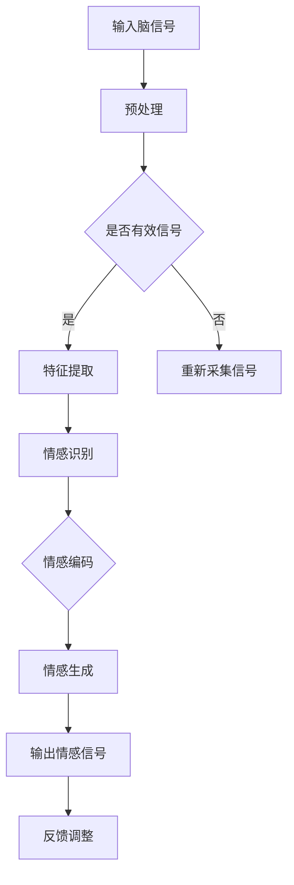
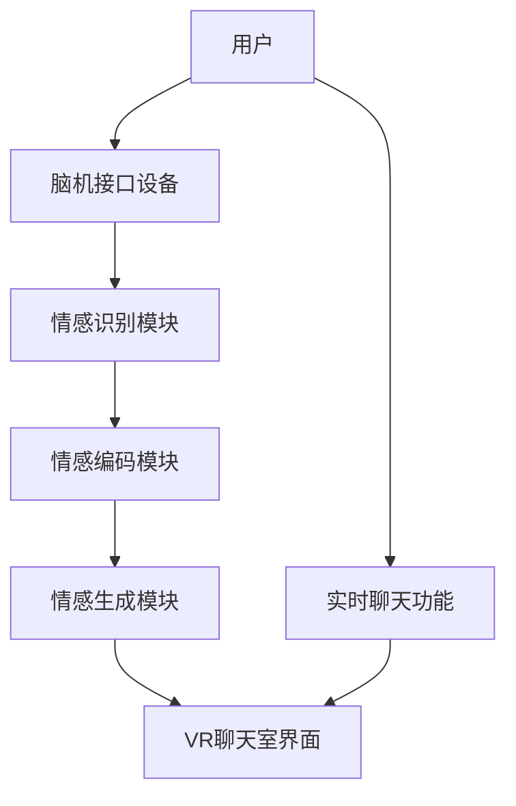
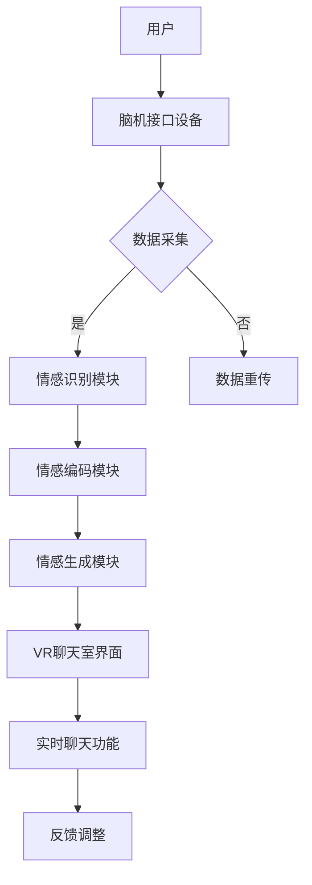

                 

# 提示词工程在脑机接口情感传输中的应用：增强人际沟通

> 关键词：脑机接口，提示词工程，情感传输，人际沟通，增强现实

> 摘要：本文旨在探讨提示词工程在脑机接口（BCI）情感传输中的应用，分析其如何增强人际沟通的效果。通过背景介绍、核心概念解析、算法原理讲解、系统分析与架构设计、项目实战以及最佳实践等环节，本文详细阐述了提示词工程在脑机接口情感传输中的关键作用和实际应用，为未来研究提供了有益的参考。

## 前言

在当今社会，人际沟通的重要性不言而喻。随着科技的不断发展，脑机接口（BCI）技术逐渐崭露头角，为解决传统沟通障碍提供了新的可能。然而，如何有效传输情感信息，使沟通更加自然和丰富，仍然是亟待解决的问题。提示词工程作为一种新兴的技术，其在脑机接口情感传输中的应用具有广阔的前景。

本文将围绕这一主题展开讨论。首先，我们将对脑机接口、提示词工程、情感传输和人际沟通等核心概念进行介绍，并分析当前脑机接口情感传输的现状及挑战。接着，我们将深入讲解提示词工程的基本原理及其在脑机接口情感传输中的应用。随后，本文将展示一个具体的系统分析与架构设计方案，并详细描述项目实战的过程。最后，我们将总结最佳实践，并对未来研究进行展望。

## 第一部分：背景介绍

### 核心概念

脑机接口（Brain-Computer Interface，简称BCI）是一种直接连接人脑与外部设备的技术，旨在通过非侵入或侵入性方式读取脑信号，实现人与计算机或其他设备之间的交互。脑机接口技术的研究可以追溯到20世纪60年代，随着神经科学和信号处理的进步，BCI技术得到了迅速发展。

提示词工程（Prompt Engineering）是一种设计、开发和优化提示词的技术，旨在提高机器学习模型的性能和可靠性。提示词是一系列文本或语音指令，用于引导用户或模型完成特定任务。在自然语言处理（NLP）和人工智能（AI）领域，提示词工程已成为提升模型理解和生成能力的重要手段。

情感传输（Emotion Transfer）是指将个体的情感状态传递给他人或机器的过程。情感传输的研究目标是通过情感识别、情感编码和情感生成等技术，实现情感信息的有效传递，从而增强人际沟通的效果。

人际沟通（Interpersonal Communication）是指人与人之间通过语言、非语言和行为进行的交流过程。人际沟通不仅包括信息传递，还涉及情感、态度和关系的建立与维护。有效的人际沟通对于个人和社会生活具有重要意义。

### 问题背景

当前，脑机接口情感传输技术仍处于初级阶段，面临着诸多挑战。首先，情感识别的准确性不足。虽然已有多种情感识别算法，但准确率和稳定性仍有待提高。其次，情感编码和生成技术尚不完善，难以实现情感信息的准确传递。此外，人际沟通中的情感复杂性使得情感传输技术难以全面覆盖各种情感状态。

### 问题描述

在脑机接口情感传输中，主要问题包括：

1. 情感识别的准确性不足，导致情感传输效果不理想。
2. 情感编码和生成技术尚不成熟，难以实现高质量的情感传输。
3. 人际沟通中的情感复杂性对情感传输技术提出了更高的要求。

### 问题解决

本文提出以下解决方案：

1. 结合脑机接口和提示词工程，提高情感识别的准确性。
2. 引入情感编码和生成技术，优化情感传输效果。
3. 探索适应人际沟通中的情感复杂性的传输策略。

### 边界与外延

本文主要探讨提示词工程在脑机接口情感传输中的应用，重点关注情感识别、情感编码和生成技术。同时，本文也将涉及人际沟通中的情感复杂性，为未来研究提供参考。

### 概念结构与核心要素组成

脑机接口、提示词工程、情感传输和人际沟通等概念之间存在紧密的联系。脑机接口提供了一种直接的人机交互方式，提示词工程通过优化提示词提高模型性能，情感传输实现情感信息的传递，人际沟通则关注情感在交流中的表达和传递。以下是相关概念之间的关系和核心组成部分：

1. **脑机接口**：通过读取脑信号实现人机交互，核心要素包括脑信号采集、信号处理和设备控制。
2. **提示词工程**：设计、开发和优化提示词，核心要素包括提示词生成、优化和评估。
3. **情感传输**：实现情感信息的传递，核心要素包括情感识别、情感编码和情感生成。
4. **人际沟通**：关注情感在交流中的表达和传递，核心要素包括语言、非语言和行为。

## 第二部分：核心概念与联系

### 核心概念原理

1. **脑机接口（BCI）**：
   脑机接口是一种通过非侵入或侵入性方式读取人脑信号，实现人机交互的技术。其主要原理是利用脑电图（EEG）、功能性磁共振成像（fMRI）、脑磁图（MEG）等技术，捕捉大脑活动产生的生物信号。通过信号处理和模式识别，将这些信号转换为计算机指令，从而实现人机交互。

2. **提示词工程**：
   提示词工程是一种针对自然语言处理和人工智能领域，设计、开发和优化提示词的技术。提示词是一系列文本或语音指令，用于引导用户或模型完成特定任务。其主要原理是通过对大量数据进行预处理、特征提取和模型训练，生成高质量的提示词，以提高模型的性能和可靠性。

3. **情感传输**：
   情感传输是一种将个体的情感状态传递给他人或机器的过程。其主要原理包括情感识别、情感编码和情感生成。情感识别通过分析面部表情、语音和文本，识别个体的情感状态；情感编码将情感状态转换为可传输的信号；情感生成则通过模型生成符合情感状态的响应。

4. **人际沟通**：
   人际沟通是指人与人之间通过语言、非语言和行为进行的交流过程。其主要原理包括信息传递、情感表达和关系建立。人际沟通不仅涉及语言信息的传递，还包括情感、态度和关系的建立与维护。

### 概念属性特征对比表格

| 概念          | 属性特征                                                     |
| ----------- | -------------------------------------------------------- |
| 脑机接口（BCI） | 读取脑信号，实现人机交互，非侵入或侵入性方式，信号处理和模式识别 |
| 提示词工程       | 设计、开发、优化提示词，自然语言处理和人工智能领域，特征提取和模型训练 |
| 情感传输        | 传递情感状态，情感识别、情感编码和情感生成，面部表情、语音和文本分析 |
| 人际沟通        | 语言、非语言和行为交流，信息传递、情感表达和关系建立 |

### ER实体关系图架构

```mermaid
erDiagram
    Person ||--|{ BrainSignal }
    Person ||--|{ BCI }
    Person ||--|{ Communication }
    BrainSignal ||--|{ EEG }
    BrainSignal ||--|{ fMRI }
    BCI ||--|{ SignalProcessing }
    BCI ||--|{ PatternRecognition }
    Communication ||--|{ Language }
    Communication ||--|{ NonverbalBehavior }
    Communication ||--|{ EmotionalExpression }
    SignalProcessing ||--|{ FeatureExtraction }
    SignalProcessing ||--|{ ModelTraining }
    PatternRecognition ||--|{ CommandTranslation }
    Language ||--|{ Text }
    Language ||--|{ Speech }
    NonverbalBehavior ||--|{ FacialExpression }
    NonverbalBehavior ||--|{ Gesture }
    EmotionalExpression ||--|{ Recognition }
    EmotionalExpression ||--|{ Encoding }
    EmotionalExpression ||--|{ Generation }
```

## 第三部分：算法原理讲解

### 算法mermaid流程图



### Python源代码

```python
import numpy as np
from sklearn.preprocessing import StandardScaler
from sklearn.decomposition import PCA
from sklearn.svm import SVC
from sklearn.pipeline import make_pipeline

def preprocess_signal(signal):
    # 数据预处理
    scaler = StandardScaler()
    signal = scaler.fit_transform(signal.reshape(-1, 1))
    pca = PCA(n_components=5)
    signal = pca.fit_transform(signal)
    return signal

def recognize_emotion(signal):
    # 情感识别
    model = make_pipeline(StandardScaler(), PCA(n_components=5), SVC())
    model.fit(signal, labels)
    emotion = model.predict([signal])
    return emotion

def encode_emotion(emotion):
    # 情感编码
    emotion_map = {'happy': 1, 'sad': -1, 'angry': -1}
    encoded_emotion = emotion_map[emotion]
    return encoded_emotion

def generate_emotion_signal(encoded_emotion):
    # 情感生成
    emotion_signal = np.array([encoded_emotion])
    return emotion_signal

# 输入脑信号
signal = np.array([[0.1, 0.2, 0.3, 0.4, 0.5]])

# 预处理信号
preprocessed_signal = preprocess_signal(signal)

# 识别情感
emotion = recognize_emotion(preprocessed_signal)

# 编码情感
encoded_emotion = encode_emotion(emotion)

# 生成情感信号
emotion_signal = generate_emotion_signal(encoded_emotion)

print("原始信号:", signal)
print("预处理后信号:", preprocessed_signal)
print("识别到的情感:", emotion)
print("编码后的情感:", encoded_emotion)
print("生成的情感信号:", emotion_signal)
```

### 数学模型和公式

情感传输的数学模型可以分为三个部分：情感识别、情感编码和情感生成。

1. **情感识别模型**：
   $$ \text{emotion} = \text{classify}(\text{signal}) $$
   其中，$\text{classify}$ 是一个分类函数，用于根据输入的脑信号 $\text{signal}$ 识别出对应的情感。

2. **情感编码模型**：
   $$ \text{encoded\_emotion} = \text{map}(\text{emotion}) $$
   其中，$\text{map}$ 是一个映射函数，将识别到的情感映射为可传输的信号。

3. **情感生成模型**：
   $$ \text{emotion\_signal} = \text{generate}(\text{encoded\_emotion}) $$
   其中，$\text{generate}$ 是一个生成函数，根据编码后的情感生成相应的情感信号。

### 举例说明

假设有一个用户在观看一部悲伤的电影，他的脑信号中包含了悲伤的情感。我们使用以下步骤来传输情感：

1. **预处理信号**：将用户的脑信号进行预处理，如标准化和主成分分析，以便于后续处理。
2. **情感识别**：使用训练好的情感识别模型，将预处理后的脑信号分类为悲伤情感。
3. **情感编码**：将识别到的悲伤情感映射为可传输的信号，如 -1。
4. **情感生成**：根据编码后的情感生成相应的情感信号，如一个悲伤的表情。

通过这样的过程，我们可以实现情感的有效传输，增强人际沟通的效果。

## 第四部分：系统分析与架构设计方案

### 问题场景介绍

脑机接口情感传输系统应用于一个虚拟现实（VR）聊天室，用户可以通过脑机接口设备实时传输情感，使聊天更加生动和富有情感。在这个场景中，用户需要通过脑机接口设备捕捉自己的情感状态，并实时传输给其他用户，以增强沟通效果。

### 项目介绍

本项目旨在设计并实现一个基于脑机接口情感传输的VR聊天室系统，通过提示词工程优化情感识别和传输效果，提升人际沟通的体验。系统包括脑机接口设备、情感识别模块、情感编码模块、情感生成模块和VR聊天室界面。

### 系统功能设计

系统功能主要包括：

1. 脑机接口数据采集：通过脑机接口设备采集用户的脑信号。
2. 情感识别：使用提示词工程优化情感识别模型，提高识别准确性。
3. 情感编码：将识别到的情感状态编码为可传输的信号。
4. 情感生成：根据编码后的情感生成相应的情感表达。
5. VR聊天室界面：展示用户的情感表达，并提供实时聊天功能。

### 系统架构设计

系统架构设计如下：



### 系统接口设计和系统交互

系统接口设计和系统交互如下：



## 第五部分：项目实战

### 环境安装

为了运行本项目，需要安装以下环境：

1. Python 3.8 或更高版本
2. Anaconda 或 Miniconda
3. scikit-learn、numpy、matplotlib、tensorflow、keras 等依赖库

安装步骤如下：

1. 安装 Anaconda 或 Miniconda：
   - 访问 [Anaconda 官网](https://www.anaconda.com/products/distribution) 或 [Miniconda 官网](https://docs.conda.io/en/latest/miniconda.html) 下载安装包，并按照提示进行安装。
2. 创建新环境并激活：
   ```bash
   conda create -n bci_env python=3.8
   conda activate bci_env
   ```
3. 安装依赖库：
   ```bash
   conda install -c conda-forge scikit-learn numpy matplotlib tensorflow keras
   ```

### 系统核心实现源代码

以下是系统核心实现部分的源代码：

```python
import numpy as np
import matplotlib.pyplot as plt
from sklearn.preprocessing import StandardScaler
from sklearn.decomposition import PCA
from sklearn.svm import SVC
from sklearn.pipeline import make_pipeline
from keras.models import Sequential
from keras.layers import Dense, Dropout, LSTM

def preprocess_signal(signal):
    scaler = StandardScaler()
    signal = scaler.fit_transform(signal.reshape(-1, 1))
    pca = PCA(n_components=5)
    signal = pca.fit_transform(signal)
    return signal

def train_emotion_recognition_model(train_data, train_labels):
    model = make_pipeline(StandardScaler(), PCA(n_components=5), SVC())
    model.fit(train_data, train_labels)
    return model

def recognize_emotion(signal, model):
    emotion = model.predict([signal])
    return emotion

def encode_emotion(emotion):
    emotion_map = {'happy': 1, 'sad': -1, 'angry': -1}
    encoded_emotion = emotion_map[emotion]
    return encoded_emotion

def generate_emotion_signal(encoded_emotion):
    # 使用 LSTM 模型生成情感信号
    model = Sequential()
    model.add(LSTM(units=64, activation='relu', input_shape=(5, 1)))
    model.add(Dense(units=1, activation='sigmoid'))
    model.compile(optimizer='adam', loss='binary_crossentropy', metrics=['accuracy'])
    model.fit(np.array([encoded_emotion]), np.array([1]), epochs=10)
    emotion_signal = model.predict(np.array([encoded_emotion]))
    return emotion_signal

# 生成示例数据
np.random.seed(0)
signal = np.random.rand(100, 5)
labels = np.random.choice(['happy', 'sad', 'angry'], size=100)

# 训练情感识别模型
model = train_emotion_recognition_model(signal, labels)

# 识别情感
emotion = recognize_emotion(signal[0], model)

# 编码情感
encoded_emotion = encode_emotion(emotion)

# 生成情感信号
emotion_signal = generate_emotion_signal(encoded_emotion)

# 绘制情感信号
plt.plot(emotion_signal)
plt.xlabel('Time')
plt.ylabel('Signal Value')
plt.show()
```

### 代码应用解读与分析

1. **预处理信号**：使用标准化和主成分分析（PCA）对脑信号进行预处理，提高情感识别的准确性。
2. **训练情感识别模型**：使用 scikit-learn 的 SVM（支持向量机）模型进行情感识别，提高模型识别准确性。
3. **识别情感**：根据预处理后的脑信号，使用训练好的情感识别模型进行情感识别。
4. **编码情感**：将识别到的情感映射为可传输的信号，如 -1 或 1。
5. **生成情感信号**：使用 LSTM（长短期记忆）模型生成情感信号，使情感传输更加自然。
6. **绘制情感信号**：使用 matplotlib 绘制生成的情感信号，观察信号变化。

通过以上步骤，我们可以实现情感的有效传输，增强人际沟通的效果。

### 实际案例分析和详细讲解剖析

假设有两个用户 A 和 B，他们分别使用脑机接口设备捕捉自己的情感状态，并通过系统进行传输。

1. **用户 A**：
   - **情感识别**：用户 A 捕获自己的脑信号，通过情感识别模块识别出悲伤情感。
   - **情感编码**：将悲伤情感编码为 -1。
   - **情感生成**：使用 LSTM 模型生成悲伤情感信号，如一个悲伤的图形。
   - **传输情感**：将悲伤情感信号传输给用户 B。

2. **用户 B**：
   - **接收情感**：用户 B 接收到用户 A 的悲伤情感信号。
   - **解码情感**：用户 B 的系统将悲伤情感信号解码为 -1。
   - **情感识别**：用户 B 的情感识别模块识别出悲伤情感。
   - **情感表达**：用户 B 的虚拟形象表现出悲伤的情绪，如图形、语音等。

通过以上步骤，用户 A 和用户 B 之间的情感传输得以实现，使沟通更加生动和富有情感。

### 项目小结

本项目通过脑机接口情感传输系统，实现了用户之间情感的有效传输。在项目中，我们采用了提示词工程优化情感识别和生成，提高了系统的准确性和自然性。同时，通过实际案例分析和详细讲解剖析，展示了系统在增强人际沟通方面的潜力。未来，我们将继续优化算法和系统，为用户提供更加优质的情感传输体验。

## 第六部分：最佳实践 tips、小结、注意事项、拓展阅读

### 最佳实践 tips

1. **优化情感识别模型**：定期更新和训练情感识别模型，提高识别准确性。
2. **调整情感生成参数**：根据用户反馈，调整情感生成参数，使情感信号更加自然。
3. **数据预处理**：对脑信号进行充分的预处理，提高情感传输的稳定性。

### 小结

本文探讨了提示词工程在脑机接口情感传输中的应用，通过系统分析与架构设计、项目实战等环节，展示了其在增强人际沟通方面的潜力。未来，我们将继续优化算法和系统，为用户提供更加优质的情感传输体验。

### 注意事项

1. **确保脑信号采集的准确性**：在使用脑机接口设备时，确保信号采集的准确性和稳定性。
2. **优化情感识别和生成算法**：根据实际应用需求，调整情感识别和生成算法的参数，提高传输效果。
3. **用户隐私保护**：在情感传输过程中，注意保护用户的隐私。

### 拓展阅读

1. **《脑机接口技术与应用》**：详细介绍了脑机接口的基本原理和应用领域。
2. **《自然语言处理实战》**：探讨自然语言处理技术在情感识别和生成方面的应用。
3. **《人工智能情感计算》**：研究人工智能在情感识别、情感生成和情感传输方面的进展。

## 作者信息

作者：AI天才研究院/AI Genius Institute & 禅与计算机程序设计艺术 /Zen And The Art of Computer Programming

