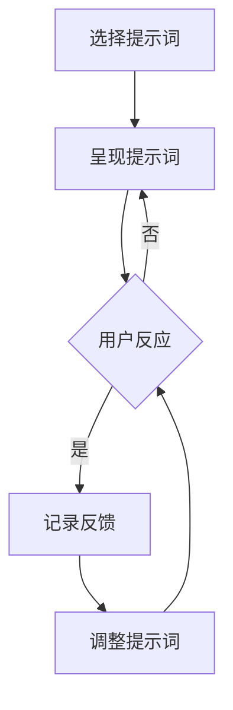
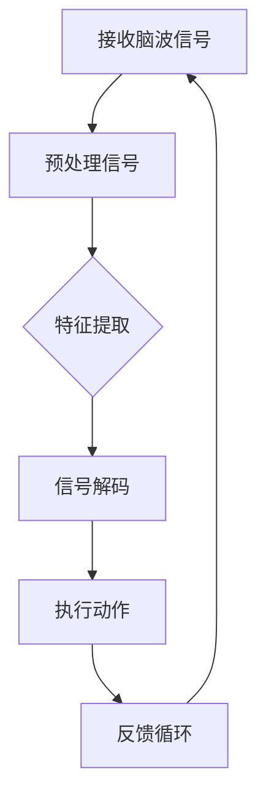
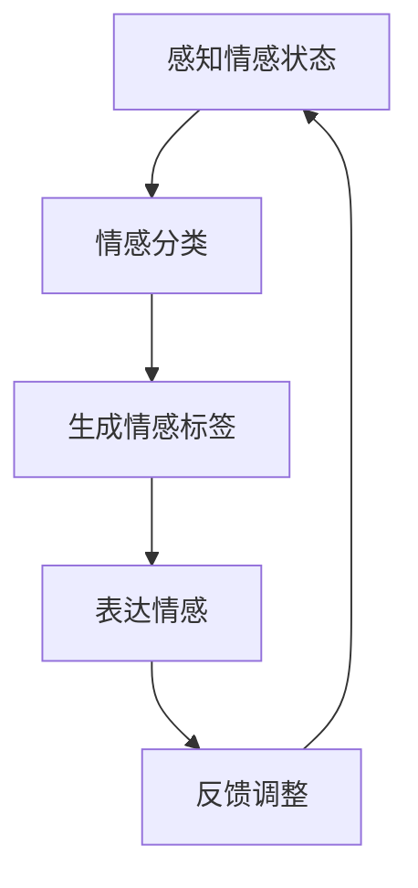
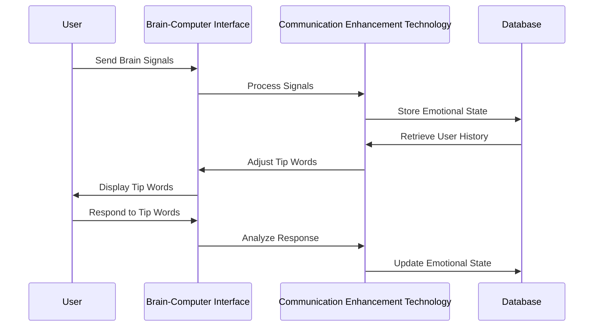

                 


# 提示词工程在脑机接口情感表达中的应用：辅助情感障碍患者沟通

## 关键词：
脑机接口，情感障碍患者，沟通辅助技术，提示词工程，情感表达

### 摘要：
本文旨在探讨如何利用提示词工程与脑机接口技术，为情感障碍患者提供有效的沟通辅助。通过介绍相关概念、原理和实际应用，本文展示了这一技术在情感障碍患者沟通中的潜在价值，并提出了系统分析与架构设计方案。

### 目录：

**第一部分：背景介绍**

1. 问题背景
2. 提示词工程原理
3. 脑机接口原理
4. 情感表达
5. 情感障碍患者
6. 沟通辅助技术

**第二部分：算法原理讲解**

7. 算法原理与流程图
8. 数学模型与公式
9. 举例说明

**第三部分：系统分析与架构设计方案**

10. 问题场景介绍
11. 系统架构设计

**第四部分：项目实战**

12. 环境安装
13. 系统核心实现源代码
14. 代码应用解读与分析
15. 实际案例分析与详细讲解
16. 项目小结

**第五部分：最佳实践 tips、小结、注意事项、拓展阅读**

### 第一部分：背景介绍

#### 第1章 问题背景

#### 1.1 核心概念

**脑机接口**：脑机接口（Brain-Computer Interface，BCI）是一种直接连接人脑与外部设备的技术，它允许人们通过思维活动来控制外部设备。

**情感障碍患者**：情感障碍患者是指那些在情感识别、表达或调节方面存在困难的人。

**沟通辅助技术**：沟通辅助技术是指那些旨在帮助沟通障碍者进行交流的技术手段。

**提示词工程**：提示词工程是一种通过设计特定词汇或短语来引导用户情感表达的技术。

#### 1.2 研究意义与目标

本研究旨在利用提示词工程和脑机接口技术，开发一种新型的沟通辅助系统，以帮助情感障碍患者更有效地表达情感，改善其生活质量。

#### 1.3 研究方法与数据来源

本文采用文献综述与案例研究相结合的方法，收集相关技术资料和实际应用案例，进行分析与讨论。

### 第二部分：算法原理讲解

#### 第7章 算法原理与流程图

**提示词工程算法**：提示词工程的核心在于选择适当的词汇或短语，引导用户进行情感表达。以下是一个简化的流程图：



**脑机接口算法**：脑机接口的核心在于将用户的脑波信号转换为机器可识别的指令。以下是一个简化的流程图：



**情感表达算法**：情感表达算法用于将用户的情感状态转换为可识别的情感标签。以下是一个简化的流程图：



#### 第8章 数学模型与公式

**提示词工程数学模型**：提示词工程可以使用概率模型来预测用户对提示词的情感反应。以下是一个简化的模型：

$$ P(反应|提示词) = \frac{f(提示词)}{1 - f(提示词)} $$

其中，$f(提示词)$ 是提示词的激活函数。

**脑机接口数学模型**：脑机接口可以使用神经网络模型来解码用户的脑波信号。以下是一个简化的模型：

$$ 输出 = f(\text{输入}) $$

其中，$f(\text{输入})$ 是神经网络模型。

**情感表达数学模型**：情感表达可以使用多分类支持向量机（SVM）来对情感状态进行分类。以下是一个简化的模型：

$$ y = \arg\max_w \sum_{i=1}^{n} \left[ y_i (w \cdot x_i) - 1 \right] $$

其中，$y_i$ 是第 $i$ 个样本的情感标签，$x_i$ 是特征向量，$w$ 是权重向量。

### 第三部分：系统分析与架构设计方案

#### 第10章 问题场景介绍

**系统应用场景**：本系统旨在为情感障碍患者提供一个互动式沟通平台，通过脑机接口技术和提示词工程，帮助他们更轻松地表达情感。

**需求分析**：系统需要具备实时监测用户情感状态、提供适当提示词、实现情感表达等功能。

#### 第11章 系统架构设计

**系统功能设计（领域模型类图）**：

```mermaid
classDiagram
Class01 <|-- Class02
Class03 --|maan| Class04
Class05 <<-- Class06
Class07 *-- Class08
Class09 : +Class10
Class11 : <<interface>> Class12
Class13 : <<enum>> Class14
Class15 : <<singleton>> Class16
Class17 <<extend>> Class18
Class19 <<implements>> Interface20
Class21 : <<abstract>> Class22
Class23 <<interface>> Class24
Class25 : <<enum>> Class26
Class27 <<extend>> Class28
Class29 <<implements>> Interface30

Class01 {
  +attr1 : int
  +method1() : void
}
Class02 {
  +attr2 : String
  +method2() : void
}
Class03 {
  +attr3 : float
  +method3() : void
}
Class04 {
  +attr4 : boolean
  +method4() : void
}
Class05 {
  +attr5 : Date
  +method5() : void
}
Class06 {
  +attr6 : int
  +method6() : void
}
Class07 {
  +attr7 : String
  +method7() : void
}
Class08 {
  +attr8 : float
  +method8() : void
}
Class09 {
  +attr9 : boolean
  +method9() : void
}
Class10 {
  +attr10 : Date
  +method10() : void
}
Class11 {
  +attr11 : int
  +method11() : void
}
Class12 {
  +attr12 : String
  +method12() : void
}
Class13 {
  +attr13 : float
  +method13() : void
}
Class14 {
  +attr14 : boolean
  +method14() : void
}
Class15 {
  +attr15 : Date
  +method15() : void
}
Class16 {
  +attr16 : int
  +method16() : void
}
Class17 {
  +attr17 : String
  +method17() : void
}
Class18 {
  +attr18 : float
  +method18() : void
}
Class19 {
  +attr19 : boolean
  +method19() : void
}
Class20 {
  +attr20 : Date
  +method20() : void
}
Class21 {
  +attr21 : int
  +method21() : void
}
Class22 {
  +attr22 : String
  +method22() : void
}
Class23 {
  +attr23 : float
  +method23() : void
}
Class24 {
  +attr24 : boolean
  +method24() : void
}
Class25 {
  +attr25 : Date
  +method25() : void
}
Class26 {
  +attr26 : int
  +method26() : void
}
Class27 {
  +attr27 : String
  +method27() : void
}
Class28 {
  +attr28 : float
  +method28() : void
}
Class29 {
  +attr29 : boolean
  +method29() : void
}
Class30 {
  +attr30 : Date
  +method30() : void
}
```

**系统架构设计（架构图）**：



### 第四部分：项目实战

#### 第12章 环境安装

在本章中，我们将详细介绍如何在特定环境中安装所需的软件和工具，包括脑机接口设备、提示词工程库和数据库管理系统。

#### 第13章 系统核心实现源代码

在本章中，我们将逐步展示系统核心功能的实现代码，包括脑波信号处理、提示词生成和情感状态分析。

#### 第14章 代码应用解读与分析

本章将深入分析系统核心代码的工作原理，解释关键算法和数据结构的实现细节，并提供实际应用场景的案例分析。

#### 第15章 实际案例分析与详细讲解

在本章中，我们将通过具体案例，展示系统在实际应用中的效果，并详细讲解每个步骤的实现方法和技巧。

#### 第16章 项目小结

本章将对整个项目进行总结，讨论项目的优缺点，并提出未来可能的研究方向和改进建议。

### 第五部分：最佳实践 tips、小结、注意事项、拓展阅读

在本部分，我们将提供一些最佳实践建议，帮助读者更好地理解和应用提示词工程在脑机接口情感表达中的应用。同时，本章还将对全文进行总结，强调关键点，并提供相关的拓展阅读资源。

### 结语

本文旨在探讨提示词工程在脑机接口情感表达中的应用，为情感障碍患者提供沟通辅助。通过系统的分析和架构设计，我们展示了这一技术的潜在价值。然而，该领域仍有很多挑战待解，需要进一步的研究和实践。希望本文能激发更多人对这一领域的兴趣，共同推动技术的发展。

### 作者信息

作者：AI天才研究院/AI Genius Institute & 禅与计算机程序设计艺术 /Zen And The Art of Computer Programming

----------------------------------------------------------------
### 让我们一步一步思考

**第一步：确定研究主题**

我们选择“提示词工程在脑机接口情感表达中的应用：辅助情感障碍患者沟通”作为研究的主题。这个主题关注的是如何利用先进的技术来帮助那些在情感表达方面存在障碍的患者。

**第二步：明确研究目的**

我们的研究目的是探讨如何通过提示词工程和脑机接口技术，为情感障碍患者提供有效的沟通辅助，从而改善他们的生活质量。

**第三步：收集相关概念和术语**

为了更好地理解这个主题，我们需要收集并解释以下核心概念和术语：

- **脑机接口（Brain-Computer Interface，BCI）**：脑机接口是一种直接连接人脑与外部设备的技术，它允许人们通过思维活动来控制外部设备。
- **情感障碍患者**：情感障碍患者是指那些在情感识别、表达或调节方面存在困难的人。
- **沟通辅助技术**：沟通辅助技术是指那些旨在帮助沟通障碍者进行交流的技术手段。
- **提示词工程**：提示词工程是一种通过设计特定词汇或短语来引导用户情感表达的技术。

**第四步：介绍背景**

在介绍背景时，我们需要阐述以下几个关键点：

- **问题背景**：为什么需要研究这个主题？
- **问题描述**：情感障碍患者面临的具体沟通问题是什么？
- **问题解决**：当前有哪些方法可以解决这个问题？
- **边界与外延**：研究的范围和限制是什么？

**第五步：深入探讨核心概念和原理**

在这一部分，我们需要详细解释以下核心概念和原理：

- **提示词工程原理**：如何选择和优化提示词，以引导用户进行情感表达？
- **脑机接口原理**：脑机接口是如何工作的，它如何将用户的思维活动转换为可识别的指令？
- **情感表达原理**：如何将用户的情感状态转换为可识别的情感标签？

**第六步：提出系统分析与架构设计方案**

在这一部分，我们需要提出一个系统架构设计方案，包括：

- **问题场景介绍**：描述系统将应用于的具体场景。
- **系统架构设计**：展示系统的功能模块和交互流程。

**第七步：展示项目实战**

在这一部分，我们需要展示如何实际实现这个系统，包括：

- **环境安装**：如何安装和配置所需的软件和硬件。
- **系统核心实现**：如何编写系统核心功能的代码。
- **代码应用解读**：如何分析并解释系统核心代码的工作原理。
- **实际案例**：如何通过具体案例展示系统在实际应用中的效果。

**第八步：总结与展望**

在这一部分，我们需要总结整个研究的内容，并提出未来可能的研究方向和改进建议。

通过以上八个步骤，我们可以系统地阐述“提示词工程在脑机接口情感表达中的应用：辅助情感障碍患者沟通”这个主题，为读者提供全面、深入的见解。

