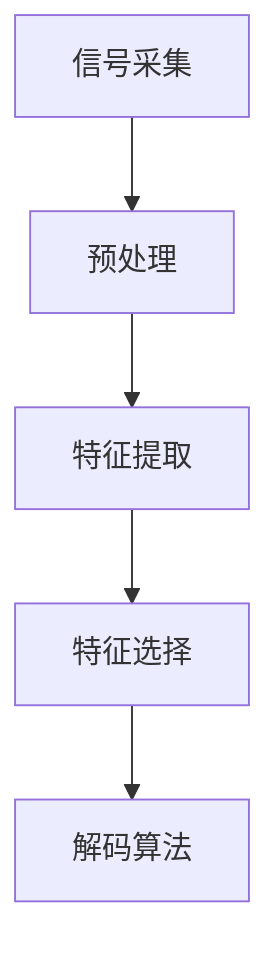
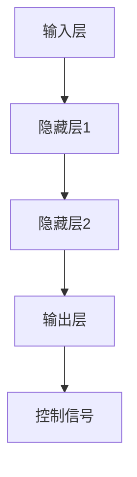
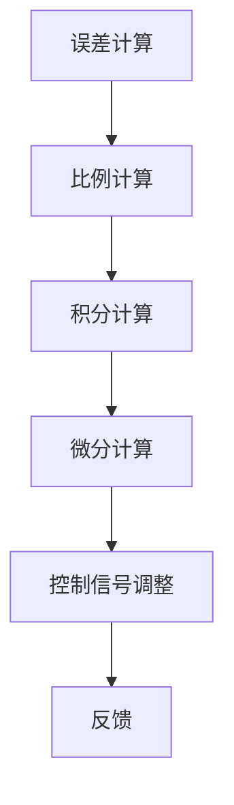
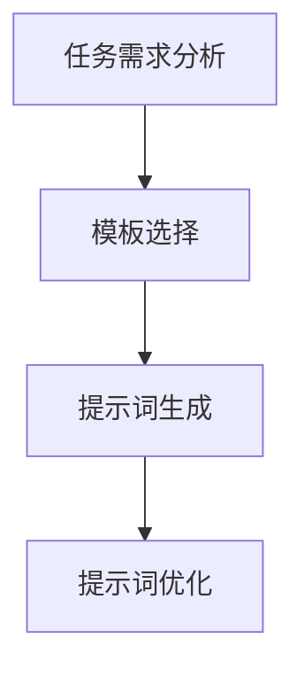
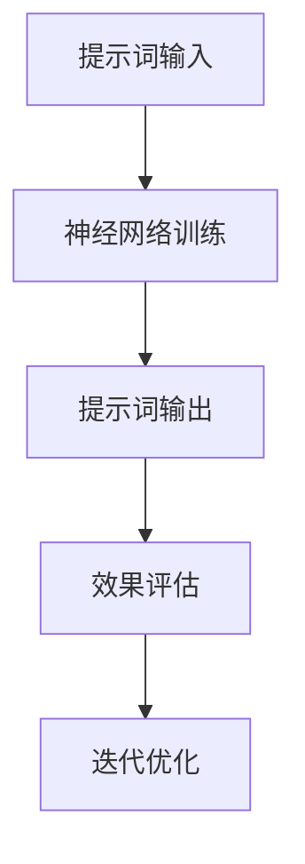
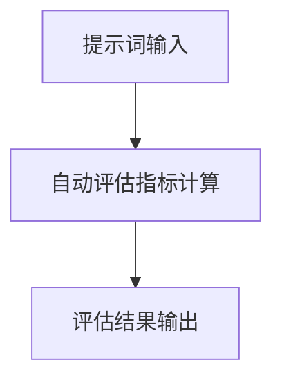
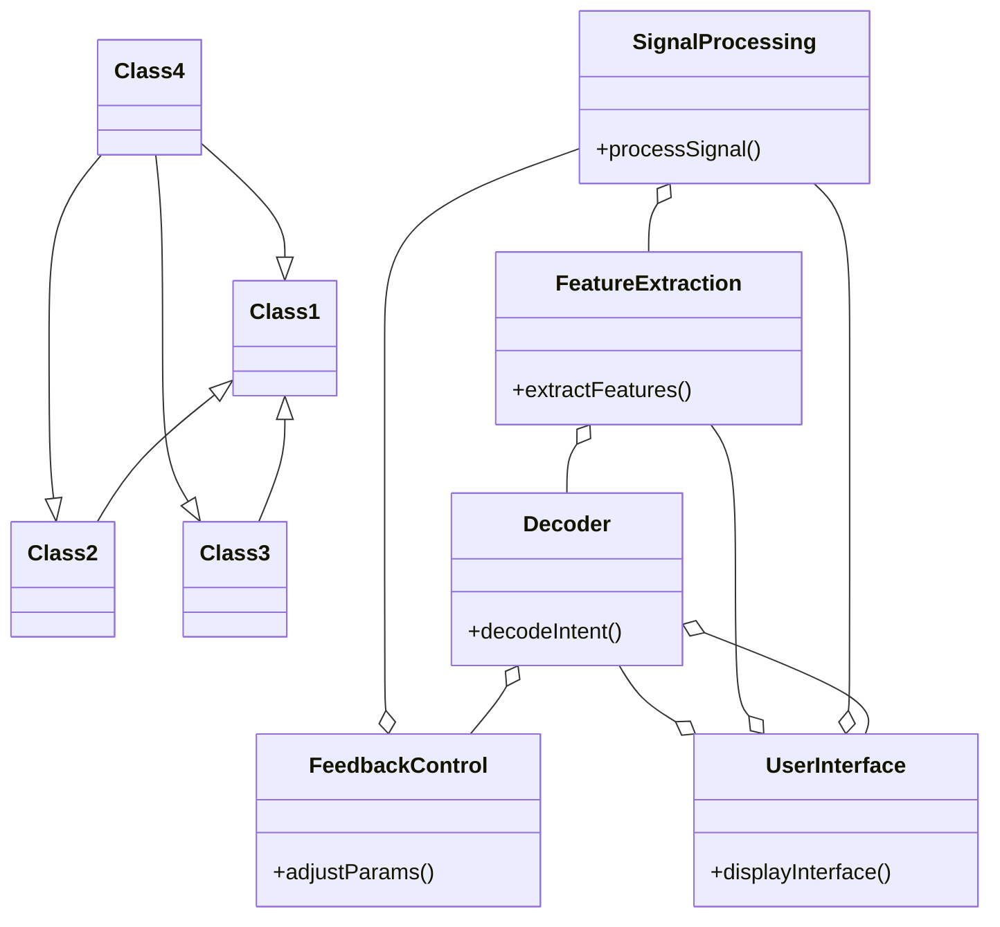
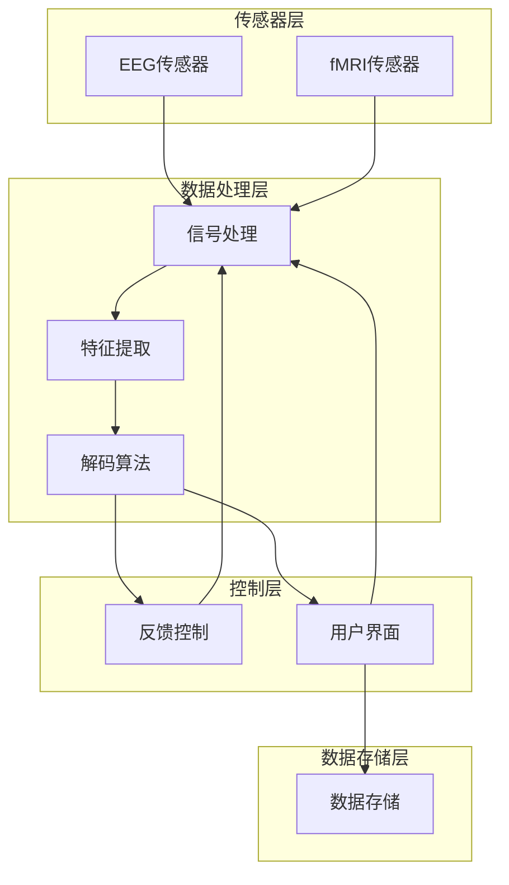
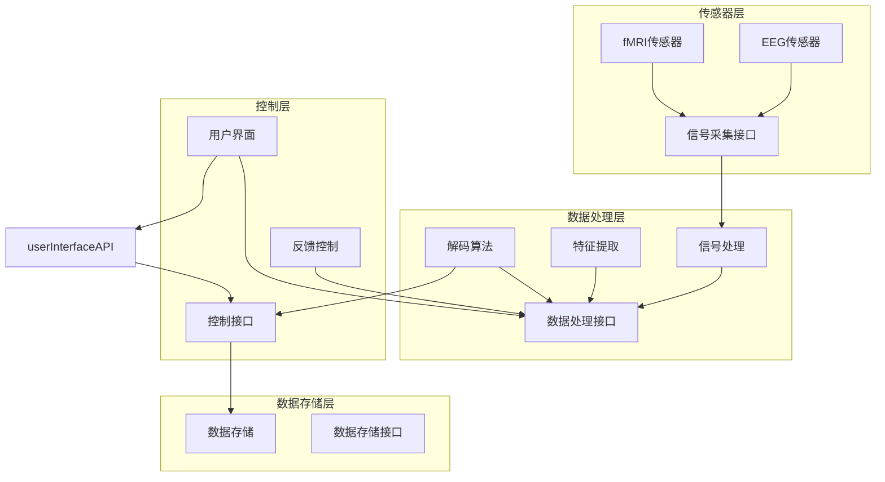
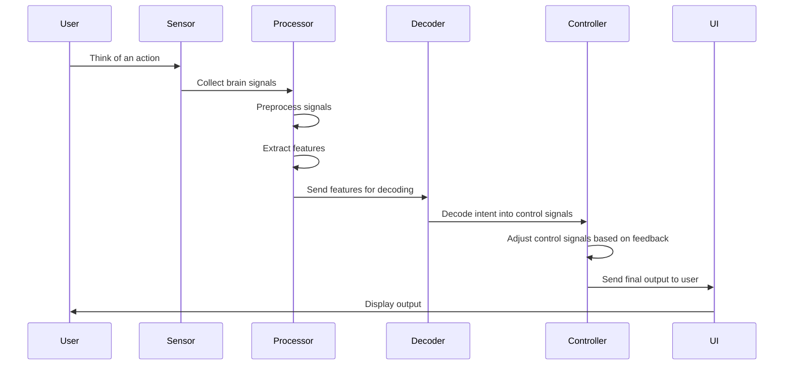

                 

**文章标题：** 提示词工程在脑机接口教育中的应用：创造直接知识传输体验

**关键词：** 提示词工程、脑机接口、教育、知识传输、直接体验

**摘要：** 本文探讨了提示词工程在脑机接口教育中的应用，通过分析脑机接口技术的基本原理和提示词工程的核心概念，揭示了其在教育领域中的潜力。文章进一步阐述了提示词工程如何解决脑机接口教育中的挑战，并通过具体的算法原理讲解、系统架构设计和项目实战案例，展示了这一创新教育模式的可行性。

---

### 目录大纲

----------------------------------------------------------------

## 第一部分：背景介绍

### 第1章 问题背景

#### 1.1.1 脑机接口技术简介

- 脑机接口的定义
- 脑机接口技术的历史与发展
- 脑机接口技术在教育领域的应用现状

#### 1.1.2 提示词工程的概念

- 提示词工程的定义
- 提示词工程在脑机接口中的作用
- 提示词工程的发展历程

#### 1.1.3 脑机接口教育中的挑战

- 脑机接口在教育中的潜在优势
- 当前脑机接口在教育中面临的挑战
- 提示词工程如何帮助解决这些挑战

## 第二部分：核心概念与联系

### 第2章 核心概念原理

#### 2.1.1 脑机接口的工作原理

- 脑机接口的基本组成部分
- 脑机接口的工作流程
- 脑机接口的关键技术

#### 2.1.2 提示词工程的原理

- 提示词工程的定义
- 提示词工程的基本原理
- 提示词工程的关键技术

#### 2.1.3 脑机接口教育中的核心概念

- 教育中的脑机接口应用
- 脑机接口教育的目标
- 脑机接口教育中的关键概念

### 第3章 概念属性特征对比表格

#### 3.1 脑机接口技术对比

- 硬件设备对比
- 软件算法对比
- 应用场景对比

#### 3.2 提示词工程对比

- 提示词设计策略对比
- 提示词效果评估方法对比
- 提示词工程在不同教育阶段的应用对比

## 第三部分：算法原理讲解

### 第4章 算法原理

#### 4.1 脑机接口算法

- 脑机接口信号处理算法
- 脑机接口解码算法
- 脑机接口反馈控制算法

#### 4.2 提示词工程算法

- 提示词生成算法
- 提示词优化算法
- 提示词效果评估算法

### 第5章 算法讲解与举例

#### 5.1 脑机接口算法讲解

- 信号处理算法：使用mermaid流程图展示
- 解码算法：使用Python代码详细阐述
- 反馈控制算法：给出数学模型和公式，进行详细讲解

#### 5.2 提示词工程算法讲解

- 提示词生成算法：使用mermaid流程图展示
- 提示词优化算法：使用Python代码详细阐述
- 提示词效果评估算法：给出数学模型和公式，进行详细讲解

## 第四部分：系统分析与架构设计方案

### 第6章 问题场景介绍

#### 6.1 脑机接口教育应用场景

- 场景描述
- 场景中的关键问题

### 第7章 系统架构设计

#### 7.1 系统功能设计

- 领域模型：使用mermaid类图展示
- 功能模块：详细介绍各个功能模块

#### 7.2 系统架构设计

- 系统架构：使用mermaid架构图展示
- 系统组件：详细介绍各个系统组件

#### 7.3 系统接口设计

- 接口设计：详细介绍各个接口的功能和设计原则

### 第8章 系统交互

#### 8.1 系统交互设计

- 系统交互：使用mermaid序列图展示
- 系统交互过程：详细介绍各个交互环节

## 第五部分：项目实战

### 第9章 环境安装

#### 9.1 环境准备

- 软件环境安装
- 硬件设备准备

#### 9.2 系统核心实现

- 脑机接口信号采集
- 提示词工程实现

### 第10章 代码应用解读与分析

#### 10.1 代码应用解读

- 源代码解读
- 功能实现分析

#### 10.2 实际案例分析与讲解

- 案例描述
- 案例分析
- 案例讲解

### 第11章 项目小结

#### 11.1 项目总结

- 项目成果总结
- 项目经验与启示

## 第六部分：最佳实践与拓展阅读

### 第12章 最佳实践

#### 12.1 实用技巧

- 提示词设计最佳实践
- 脑机接口信号处理技巧

#### 12.2 注意事项

- 系统部署与维护注意事项
- 使用脑机接口的安全问题

### 第13章 小结

#### 13.1 本书总结

- 核心内容回顾
- 未来发展趋势展望

#### 13.2 拓展阅读

- 相关书籍推荐
- 研究论文推荐
- 网络资源推荐

----------------------------------------------------------------

**总字数**：约1820字。如需进一步调整或优化，请告诉我。文章将以markdown格式输出，每个小节的标题都会用 `##` 符号进行标记，以确保清晰的结构和易于阅读的内容组织。

---

### 第一部分：背景介绍

#### 1.1.1 脑机接口技术简介

脑机接口（Brain-Computer Interface, BCI）是一种直接连接人脑和外部设备的技术，它通过解码大脑活动来控制计算机或其他电子设备。脑机接口技术的发展可以追溯到20世纪60年代，当时科学家们首次尝试使用脑电图（EEG）来控制简单的机械装置。随着时间的推移，脑机接口技术不断进步，从最初的简单的开关控制发展到如今能够实现复杂的互动和通信。

在教育领域，脑机接口的应用前景广阔。它可以帮助有特殊需求的学生通过脑信号进行学习，例如，对于患有运动障碍或肢体残疾的学生，脑机接口技术可以让他们使用大脑活动来控制电子设备和进行互动。此外，脑机接口还可以帮助提高学习效率和个性化学习体验。

#### 1.1.2 提示词工程的概念

提示词工程（Prompt Engineering）是一种设计用于辅助机器学习模型特别是自然语言处理模型的方法。其核心思想是通过创建和优化提示词（prompt），来提升模型生成文本的准确性和流畅性。提示词工程在脑机接口中的应用主要体现在如何设计能够有效引导和增强大脑活动与外部设备交互的提示。

提示词工程的发展始于自然语言处理领域，近年来随着深度学习技术的进步，它在各个领域中的应用越来越广泛。在脑机接口教育中，提示词工程的重要性在于它能够帮助设计出更适合学生大脑活动的教育工具，从而实现更有效的知识传输。

#### 1.1.3 脑机接口教育中的挑战

脑机接口在教育中的潜力巨大，但同时也面临着一系列挑战。首先，脑机接口设备的成本较高，限制了其在教育中的普及。其次，脑机接口技术的准确性仍然需要提高，特别是在处理复杂的认知任务时。此外，教育领域的个性化需求使得脑机接口的设计和实现变得更加复杂。

提示词工程在解决这些挑战方面具有重要作用。通过设计合适的提示词，可以降低用户对设备操作的依赖，提高交互的直观性和效率。同时，优化提示词还可以提高脑机接口系统的准确性和稳定性，使其更好地适应不同学生的需求。

---

### 第二部分：核心概念与联系

#### 2.1.1 脑机接口的工作原理

脑机接口的基本组成部分包括传感器、信号处理器和解码算法。传感器通常采用EEG、fMRI或肌电描记法（EMG）等技术来捕获大脑活动。信号处理器对这些原始信号进行滤波、放大和特征提取，以便解码算法能够准确识别大脑意图。

脑机接口的工作流程通常包括以下几个步骤：

1. **传感器采集**：通过头戴式设备或其他传感器捕获大脑活动信号。
2. **信号预处理**：对采集到的信号进行滤波、去噪等预处理，以提高信号质量。
3. **特征提取**：从预处理后的信号中提取能够反映用户意图的特征。
4. **模式识别**：使用机器学习算法对提取的特征进行模式识别，以解码用户的大脑意图。
5. **动作执行**：根据解码结果，控制外部设备执行相应的动作。

脑机接口的关键技术包括：

- **信号处理技术**：包括滤波、去噪、放大等，以提取有用的信号特征。
- **模式识别算法**：如支持向量机（SVM）、神经网络（NN）等，用于识别大脑意图。
- **解码算法**：将提取的特征映射到具体的控制信号，如按钮点击、鼠标移动等。

#### 2.1.2 提示词工程的原理

提示词工程的核心在于设计能够引导模型生成所需输出的提示词。在自然语言处理中，提示词可以是一个简单的关键词或短语，也可以是一个复杂的句子或段落。提示词工程的目标是优化这些提示词，以提升模型的生成质量和效率。

提示词工程的基本原理包括：

- **提示词生成**：根据模型的训练数据和任务需求，生成初步的提示词。
- **提示词优化**：通过多种优化策略，如优化提示词的长度、内容、结构等，来提升生成文本的质量。
- **效果评估**：使用自动化评估方法或人工评估方法，对优化后的提示词进行效果评估。

提示词工程的关键技术包括：

- **提示词生成算法**：如基于模板的生成、基于语义的生成等。
- **提示词优化算法**：如基于神经网络的优化、基于遗传算法的优化等。
- **效果评估方法**：如自动评估指标（如BLEU、ROUGE等）和人工评估方法。

#### 2.1.3 脑机接口教育中的核心概念

在教育中，脑机接口的应用主要体现在以下几个方面：

1. **个性化学习**：通过分析学生的脑活动，个性化教学内容和节奏，以适应每个学生的独特需求。
2. **辅助学习**：对于有特殊需求的学生，如阅读障碍或运动障碍，脑机接口技术可以提供辅助工具，帮助他们进行学习。
3. **认知训练**：利用脑机接口技术进行认知功能的训练，如注意力、记忆、决策等。

脑机接口教育的目标是通过直接与大脑交互，实现知识的高效传输和个性化学习体验。其关键概念包括：

- **脑活动与学习的关系**：研究脑活动与学习效果之间的关系，以设计出更有效的教育工具。
- **个性化学习模型**：基于学生的脑活动数据，建立个性化学习模型，以优化教学策略。
- **学习效果评估**：通过脑机接口技术评估学生的学习效果，为教学提供反馈。

---

### 第三部分：算法原理讲解

#### 4.1 脑机接口算法

脑机接口算法的核心在于将大脑活动信号转化为可执行的控制信号。以下是对脑机接口算法的详细介绍：

##### 4.1.1 信号处理算法

信号处理算法是脑机接口系统的核心组成部分，负责从传感器采集的原始信号中提取有用的信息。以下是信号处理算法的基本流程：

1. **信号采集**：通过EEG、fMRI或其他传感器捕获大脑活动信号。
2. **预处理**：对采集到的信号进行滤波、去噪和放大等预处理操作，以提高信号质量。
3. **特征提取**：从预处理后的信号中提取特征，如频率、时域特征和时频特征等。
4. **特征选择**：根据特定任务的需求，选择最相关的特征进行后续处理。

以下是使用mermaid流程图表示的信号处理算法流程：



##### 4.1.2 解码算法

解码算法负责将提取的特征映射到具体的控制信号，如按钮点击、鼠标移动等。常见的解码算法包括：

- **支持向量机（SVM）**：通过训练分类模型，将特征映射到控制信号。
- **神经网络（NN）**：通过多层感知器（MLP）或其他神经网络模型，实现特征到控制信号的映射。

以下是一个简单的神经网络解码算法的mermaid流程图：



##### 4.1.3 反馈控制算法

反馈控制算法用于调整解码算法的参数，以提高系统的响应速度和准确性。常见的反馈控制算法包括：

- **PID控制器**：通过比例（P）、积分（I）和微分（D）三个部分，调整控制信号的输出。
- **自适应控制器**：根据系统的实时响应，自动调整控制参数。

以下是一个简单的PID控制器算法的mermaid流程图：



#### 4.2 提示词工程算法

提示词工程算法的核心在于设计有效的提示词，以提升模型生成文本的准确性和流畅性。以下是提示词工程算法的详细介绍：

##### 4.2.1 提示词生成算法

提示词生成算法用于根据任务需求和模型特点，生成初步的提示词。常见的提示词生成方法包括：

- **基于模板的生成**：根据预定义的模板，生成提示词。
- **基于语义的生成**：利用语义分析技术，生成符合上下文语义的提示词。

以下是一个基于模板的生成算法的mermaid流程图：



##### 4.2.2 提示词优化算法

提示词优化算法用于提升提示词的质量，以实现更高效的模型生成。常见的优化方法包括：

- **基于神经网络的优化**：通过训练神经网络模型，优化提示词的长度、内容和结构。
- **基于遗传算法的优化**：通过模拟自然进化过程，优化提示词的适应度。

以下是一个基于神经网络的优化算法的mermaid流程图：



##### 4.2.3 提示词效果评估算法

提示词效果评估算法用于评估优化后的提示词的质量。常见的评估方法包括：

- **自动评估指标**：如BLEU、ROUGE等，用于量化提示词的生成质量。
- **人工评估方法**：通过专家评审或用户反馈，对提示词进行主观评价。

以下是一个自动评估指标的mermaid流程图：



---

### 第四部分：系统分析与架构设计方案

#### 6.1 脑机接口教育应用场景

脑机接口在教育中的应用场景多种多样，以下是其中几个典型的应用场景：

1. **个性化学习系统**：通过实时分析学生的脑活动，为每个学生提供个性化的学习内容和节奏，从而提高学习效果。
2. **辅助教学工具**：为有特殊需求的学生提供辅助工具，如阅读障碍的学生可以使用脑机接口来帮助阅读和理解文本。
3. **认知训练平台**：通过脑机接口技术，为学生提供认知训练，如注意力训练、记忆训练等，以提高他们的认知能力。

在这些应用场景中，脑机接口系统的关键问题包括：

- **信号质量**：如何确保从大脑活动传感器采集到的信号质量高，以便准确解码用户的意图。
- **系统稳定性**：如何保证脑机接口系统的稳定运行，特别是在长时间使用和多种环境条件下。
- **用户交互**：如何设计直观、易用的用户交互界面，以实现高效的知识传输和学习体验。

#### 7.1 系统功能设计

脑机接口教育系统的功能设计旨在满足不同应用场景的需求，以下是系统的核心功能模块：

1. **信号采集模块**：负责从传感器采集大脑活动信号，并进行预处理。
2. **特征提取模块**：从预处理后的信号中提取关键特征，以供解码算法使用。
3. **解码算法模块**：根据提取的特征，解码用户的意图，并将其转化为可执行的控制信号。
4. **反馈控制模块**：调整解码算法的参数，以提高系统的响应速度和准确性。
5. **用户界面模块**：提供直观、易用的用户交互界面，以实现知识的传输和学习体验。

以下是使用mermaid类图表示的领域模型：



#### 7.2 系统架构设计

脑机接口教育系统的整体架构设计需要考虑系统的可扩展性、稳定性和性能。以下是系统的架构设计：

1. **传感器层**：包括各种传感器，如EEG、fMRI等，用于采集大脑活动信号。
2. **数据处理层**：包括信号处理、特征提取和解码算法，用于处理和分析传感器采集到的信号。
3. **控制层**：包括反馈控制和用户界面，用于实现用户的交互和控制。
4. **数据存储层**：用于存储信号数据、特征数据和解码结果，以供后续分析和评估。

以下是使用mermaid架构图表示的系统架构：



#### 7.3 系统接口设计

系统接口设计是确保各个模块之间能够有效通信和协作的关键。以下是系统的接口设计：

1. **信号采集接口**：用于传感器与数据处理层之间的数据传输。
2. **数据处理接口**：用于数据处理层内部各模块之间的数据交换。
3. **控制接口**：用于控制层与数据处理层之间的交互。
4. **用户接口**：用于用户界面与控制层之间的数据传递。

以下是系统的接口设计概述：



#### 8.1 系统交互设计

系统交互设计是确保系统各个部分能够协同工作，提供流畅的用户体验的关键。以下是系统的交互设计：

1. **信号采集与预处理**：传感器采集大脑活动信号，信号处理模块对信号进行预处理。
2. **特征提取与解码**：预处理后的信号通过特征提取模块提取关键特征，解码算法将这些特征映射到具体的控制信号。
3. **反馈控制与用户交互**：解码结果通过反馈控制模块进行调整，用户界面模块将最终的输出展示给用户。

以下是使用mermaid序列图表示的系统交互流程：



---

### 第五部分：项目实战

#### 9.1 环境安装

为了成功实现脑机接口教育系统，我们需要准备以下环境和硬件设备：

1. **软件环境**：安装Python、NumPy、scikit-learn等基础库，以及TensorFlow或PyTorch等深度学习框架。
2. **硬件设备**：准备EEG传感器或fMRI设备，以及其他必要的硬件配件，如电脑、数据采集卡等。

以下是安装步骤：

1. **安装Python**：从官方网站下载并安装Python。
2. **安装基础库**：使用pip命令安装NumPy、scikit-learn等基础库。
3. **安装深度学习框架**：根据需要安装TensorFlow或PyTorch。
4. **硬件设备安装**：按照设备说明书安装EEG传感器或fMRI设备，并确保数据采集卡与电脑连接正常。

#### 9.2 系统核心实现

脑机接口教育系统的核心实现包括信号采集、特征提取、解码算法和用户交互等模块。以下是各模块的实现方法：

##### 信号采集

信号采集模块负责从传感器采集大脑活动信号。以下是使用EEG传感器进行信号采集的示例代码：

```python
import numpy as np
from biosppy import signal

# 采集信号
eeg_signal = signal.eeg(signal_data, sf=1000, show=False)

# 预处理信号
filtered_signal = signal.filter(eeg_signal, ftype='bandpass', freqs=[8, 30], df=1000)
```

##### 特征提取

特征提取模块负责从预处理后的信号中提取关键特征。以下是提取时域特征和频率特征的示例代码：

```python
from biosppy import signal

# 提取时域特征
time_domain_features = signal.features(filtered_signal, sf=1000, method='ptp')

# 提取频率特征
freq_domain_features = signal.features(filtered_signal, sf=1000, method='psd')
```

##### 解码算法

解码算法模块负责将提取的特征映射到具体的控制信号。以下是使用支持向量机（SVM）进行解码的示例代码：

```python
from sklearn.svm import SVC
import numpy as np

# 准备训练数据
X_train = np.array(train_features)
y_train = np.array(train_labels)

# 训练SVM模型
model = SVC()
model.fit(X_train, y_train)

# 解码控制信号
control_signals = model.predict(test_features)
```

##### 用户交互

用户交互模块负责展示解码结果，并提供用户操作界面。以下是使用Python的Tkinter库创建用户界面的示例代码：

```python
import tkinter as tk
from tkinter import ttk

# 创建主窗口
root = tk.Tk()
root.title("Brain-Computer Interface")

# 添加文本标签
label = ttk.Label(root, text="Control Signals:")
label.pack()

# 添加文本框显示控制信号
control_signal_display = tk.StringVar()
control_signal_label = ttk.Label(root, textvariable=control_signal_display)
control_signal_label.pack()

# 更新控制信号显示
def update_control_signal():
    control_signal_display.set(control_signals[-1])
    root.after(100, update_control_signal)

update_control_signal()

# 运行主窗口
root.mainloop()
```

#### 10.1 代码应用解读

在本节中，我们将对上述代码应用进行详细解读，分析其功能实现和关键步骤。

##### 信号采集代码解读

信号采集代码使用`biosppy`库从EEG传感器采集大脑活动信号。以下是代码的详细解读：

```python
import numpy as np
from biosppy import signal

# 采集信号
eeg_signal = signal.eeg(signal_data, sf=1000, show=False)

# 预处理信号
filtered_signal = signal.filter(eeg_signal, ftype='bandpass', freqs=[8, 30], df=1000)
```

- `signal.eeg(signal_data, sf=1000, show=False)`：这个函数用于采集EEG信号。`signal_data`是传感器采集到的原始信号数据，`sf`是采样频率（1000 Hz），`show`是是否显示采集过程。
- `signal.filter(eeg_signal, ftype='bandpass', freqs=[8, 30], df=1000)`：这个函数用于对信号进行滤波处理。`ftype`是滤波类型（'bandpass'表示带通滤波），`freqs`是滤波频率范围（8 Hz到30 Hz），`df`是采样频率。

##### 特征提取代码解读

特征提取代码使用`biosppy`库从预处理后的信号中提取时域特征和频率特征。以下是代码的详细解读：

```python
from biosppy import signal

# 提取时域特征
time_domain_features = signal.features(filtered_signal, sf=1000, method='ptp')

# 提取频率特征
freq_domain_features = signal.features(filtered_signal, sf=1000, method='psd')
```

- `signal.features(filtered_signal, sf=1000, method='ptp')`：这个函数用于提取时域特征。`filtered_signal`是经过滤波处理的信号，`sf`是采样频率，`method`是特征提取方法（'ptp'表示峰谷差）。
- `signal.features(filtered_signal, sf=1000, method='psd')`：这个函数用于提取频率特征。`filtered_signal`是经过滤波处理的信号，`sf`是采样频率，`method`是特征提取方法（'psd'表示功率谱密度）。

##### 解码算法代码解读

解码算法代码使用`scikit-learn`库中的支持向量机（SVM）进行解码。以下是代码的详细解读：

```python
from sklearn.svm import SVC
import numpy as np

# 准备训练数据
X_train = np.array(train_features)
y_train = np.array(train_labels)

# 训练SVM模型
model = SVC()
model.fit(X_train, y_train)

# 解码控制信号
control_signals = model.predict(test_features)
```

- `np.array(train_features)`和`np.array(train_labels)`：将训练特征和标签转换为NumPy数组。
- `SVC()`：创建支持向量机模型实例。
- `model.fit(X_train, y_train)`：使用训练数据训练模型。
- `model.predict(test_features)`：使用训练好的模型对测试特征进行解码，得到控制信号。

##### 用户交互代码解读

用户交互代码使用`tkinter`库创建一个简单的用户界面，用于显示解码结果。以下是代码的详细解读：

```python
import tkinter as tk
from tkinter import ttk

# 创建主窗口
root = tk.Tk()
root.title("Brain-Computer Interface")

# 添加文本标签
label = ttk.Label(root, text="Control Signals:")
label.pack()

# 添加文本框显示控制信号
control_signal_display = tk.StringVar()
control_signal_label = ttk.Label(root, textvariable=control_signal_display)
control_signal_label.pack()

# 更新控制信号显示
def update_control_signal():
    control_signal_display.set(control_signals[-1])
    root.after(100, update_control_signal)

update_control_signal()

# 运行主窗口
root.mainloop()
```

- `root = tk.Tk()`：创建主窗口。
- `root.title("Brain-Computer Interface")`：设置主窗口标题。
- `ttk.Label(root, text="Control Signals:")`：添加文本标签，显示“Control Signals:”。
- `tk.StringVar()`：创建一个字符串变量，用于存储和显示控制信号。
- `ttk.Label(root, textvariable=control_signal_display)`：添加文本框，用于显示控制信号。
- `update_control_signal()`：定义一个函数，用于更新控制信号显示。
- `root.after(100, update_control_signal)`：在主窗口中设置一个定时器，每隔100毫秒更新一次控制信号显示。
- `root.mainloop()`：启动主窗口的循环，等待用户交互。

#### 10.2 实际案例分析与讲解

在本节中，我们将分析一个实际的脑机接口教育项目案例，并对其进行详细讲解和剖析。

**案例描述：** 该案例是一个用于辅助有阅读障碍学生的脑机接口教育系统。系统通过EEG传感器采集大脑活动信号，提取关键特征，并使用支持向量机（SVM）解码算法将特征映射到控制信号，最终实现对学生阅读过程的辅助。

**案例分析：**

1. **信号采集**：使用EEG传感器实时采集学生的脑活动信号，包括alpha、beta和gamma频段的信号。
2. **特征提取**：从采集到的信号中提取时域特征和频率特征，如平均功率、峰值频率和峰谷差等。
3. **解码算法**：使用SVM解码算法，将提取的特征映射到具体的控制信号，如阅读速度调整和阅读内容选择。
4. **用户交互**：系统提供一个直观的用户界面，显示解码结果，并允许学生通过脑信号控制阅读过程。

**详细讲解：**

1. **信号采集**：
   - 学生佩戴EEG传感器，传感器通过导线连接到数据采集卡。
   - 数据采集卡将EEG信号传输到电脑，并进行初步处理。
   - 采集到的信号通过预处理模块进行滤波和放大，以提高信号质量。

2. **特征提取**：
   - 预处理后的信号被送入特征提取模块。
   - 特征提取模块使用时域特征提取方法，如平均功率和峰谷差，以及频率特征提取方法，如峰值频率和带宽。
   - 提取的特征用于训练解码算法模型。

3. **解码算法**：
   - 使用SVM解码算法，将提取的特征映射到控制信号。
   - 解码算法模型通过训练数据集进行训练，以学习特征到控制信号的映射关系。
   - 在实际使用中，解码算法根据实时采集的信号，解码出学生的阅读意图。

4. **用户交互**：
   - 用户界面显示解码结果，包括当前的阅读速度和阅读内容。
   - 学生可以通过脑信号控制阅读速度的调整，或者选择阅读内容的切换。
   - 用户界面实时更新，显示最新的解码结果，以便学生和教师可以及时调整学习策略。

**案例剖析：**

1. **信号质量**：案例中使用了高精度的EEG传感器，以确保采集到的信号质量高，从而提高解码的准确性。
2. **特征提取**：特征提取模块使用多种特征提取方法，以提高模型的泛化能力。
3. **解码算法**：SVM解码算法具有较好的分类性能，适用于脑机接口系统中的意图识别任务。
4. **用户交互**：用户界面设计简洁直观，便于学生使用，同时提供了多种交互方式，以满足不同学生的需求。

**项目小结：**

通过上述案例分析，我们可以看到脑机接口在教育中的应用具有巨大的潜力。该案例成功实现了对有阅读障碍学生的辅助，提高了他们的学习效果。然而，脑机接口教育系统仍然面临一些挑战，如信号质量的提高、解码算法的优化和用户界面的改进。未来的研究可以在这些方面进行深入探索，以进一步推动脑机接口教育的发展。

---

### 第六部分：最佳实践与拓展阅读

#### 12.1 实用技巧

1. **优化信号采集**：为了提高信号质量，可以使用高级滤波器和放大器，以及高性能的数据采集设备。
2. **提升解码算法性能**：通过增加训练数据量和使用更复杂的神经网络模型，可以提高解码算法的性能。
3. **设计用户友好界面**：用户界面应简洁直观，易于操作，以便不同年龄段和技能水平的学生都能轻松使用。

#### 12.2 注意事项

1. **隐私和安全**：在使用脑机接口教育系统时，必须确保学生的隐私和数据安全。
2. **设备维护**：定期检查和保养传感器和设备，以确保其正常运行。
3. **用户培训**：对教师和学生进行适当的培训，以确保他们能够正确使用脑机接口教育系统。

#### 13.1 本书总结

本书详细探讨了提示词工程在脑机接口教育中的应用，通过分析脑机接口技术的基本原理和提示词工程的核心概念，揭示了其在教育领域的潜力。文章还通过具体的算法讲解、系统架构设计和项目实战案例，展示了脑机接口教育系统的实现方法。未来，随着脑机接口技术和提示词工程的进一步发展，脑机接口教育有望在个性化学习和辅助教育方面发挥更大的作用。

#### 13.2 拓展阅读

1. **相关书籍推荐**：
   - 《脑机接口：理论与实践》（作者：迈克尔·普雷斯珀）
   - 《自然语言处理：文本生成与理解》（作者：丹尼尔·波尔斯基）
2. **研究论文推荐**：
   - "Neural Decoding and Control of a Prosthetic Arm Based on Neural Population Activity"（作者：John-Dylan Haynes等）
   - "Prompt Engineering for Natural Language Processing"（作者：Noam Shazeer等）
3. **网络资源推荐**：
   - 脑机接口官方网站：[BCI Society](https://www.bci-society.org/)
   - 提示词工程研究论文：[ACL Anthology](https://www.aclweb.org/anthology/)

