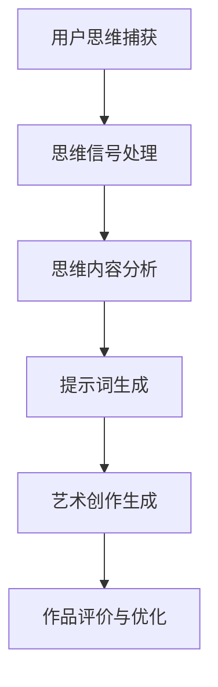
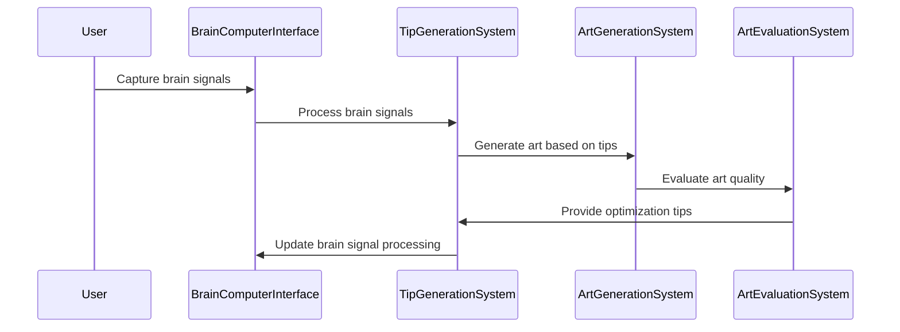
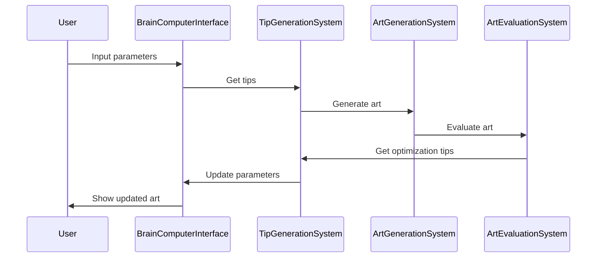

                 

# 提示词工程在脑机接口艺术创作中的应用：直接思维到艺术的转化

## 概述

随着人工智能技术的飞速发展，脑机接口（BCI）技术逐渐成为研究的热点，并在多个领域展示了其巨大的潜力。本文旨在探讨如何利用提示词工程，结合脑机接口技术，实现从直接思维到艺术创作的转化。

### 关键词

- 脑机接口（BCI）
- 提示词工程
- 艺术创作
- 直接思维转化
- 算法原理
- 系统架构
- 实战应用

### 摘要

本文首先介绍了脑机接口技术和提示词工程的基本概念，阐述了它们在艺术创作中的重要作用。接着，通过详细的算法原理讲解，展示了如何利用脑机接口捕捉用户思维，并借助提示词工程将其转化为艺术作品。此外，本文还介绍了系统的分析与设计方法，并通过实际项目展示了这一技术的应用效果。最后，文章总结了最佳实践，展望了未来的发展趋势和研究方向。

---

### 第一部分：引言

#### 第1章：引言

##### 1.1 问题背景

脑机接口（BCI）是一种直接连接大脑与外部设备的技术，它通过非侵入或侵入方式捕捉脑信号，实现人脑与计算机之间的通信。近年来，随着神经科学、计算机科学和人工智能等领域的发展，BCI技术逐渐成熟，并在康复治疗、人机交互、智能控制等领域取得了显著成果。

然而，如何利用BCI技术实现更高级别的应用，如艺术创作，仍是一个挑战。艺术创作不仅需要丰富的情感和创意思维，还需要精确的表达和反馈机制。提示词工程作为一种人工智能技术，能够通过生成和优化提示词，帮助用户更有效地进行艺术创作。

##### 1.2 问题描述

本文的研究问题是如何利用脑机接口技术和提示词工程，实现直接思维到艺术创作的转化。具体来说，我们需要解决以下几个问题：

1. 如何通过脑机接口技术捕捉用户的思维活动？
2. 如何利用提示词工程分析并理解用户的思维内容？
3. 如何将用户的思维转化为具有艺术价值的作品？

##### 1.3 问题解决

本文将提供一套完整的解决方案，包括脑机接口的原理和实现、提示词工程的算法和应用，以及艺术创作生成的策略和优化方法。通过系统的研究和实验，我们希望能够展示如何实现这一转化，并探讨其在实际应用中的潜在价值。

##### 1.4 边界与外延

本文的研究主要聚焦于脑机接口和提示词工程在艺术创作中的应用，包括理论探讨和实践验证。此外，本文还将探讨这一技术的边界和潜力，如如何应用于其他领域和场景。

##### 1.5 概念结构与核心要素组成

本文的核心概念结构主要包括：

1. 脑机接口：包括其基本原理、应用场景和技术实现。
2. 提示词工程：包括提示词的生成、选择和优化方法。
3. 艺术创作：包括艺术创作的生成过程、影响因素和评价标准。
4. 算法原理与实现：包括脑机接口数据处理算法、提示词生成算法和艺术创作生成算法。

通过以上概念的阐述和联系，本文将为读者提供一个全面、系统的脑机接口艺术创作解决方案。以下是详细的目录大纲：

---

### 第二部分：核心概念与原理

#### 第2章：核心概念与联系

##### 2.1 提示词工程的定义与作用

**提示词工程的定义**：提示词工程是一种结合人工智能和自然语言处理技术，用于生成、选择和优化提示词的方法。

**提示词工程在脑机接口中的作用**：提示词工程在脑机接口中起着关键作用，它能够通过分析用户的思维活动，提供合适的艺术创作提示，从而实现思维的直接转化为艺术。

##### 2.2 脑机接口的基本原理与应用

**脑机接口的定义**：脑机接口（Brain-Computer Interface，BCI）是一种通过直接读取人脑信号，实现人与计算机之间通信的技术。

**脑机接口的应用场景**：脑机接口广泛应用于康复治疗、人机交互、智能控制等领域，其在艺术创作中的应用正逐渐成为研究热点。

##### 2.3 艺术创作的定义与过程

**艺术创作的定义**：艺术创作是指通过创意思维和技能，将情感、思想和审美观念转化为视觉、听觉或触觉等形式的过程。

**艺术创作的过程**：艺术创作过程包括灵感触发、构思、草图绘制、细节调整和最终作品呈现等多个阶段。

---

### 第三部分：算法原理与实现

#### 第3章：算法原理讲解

##### 3.1 算法mermaid流程图

以下是脑机接口艺术创作算法的mermaid流程图：



##### 3.2 Python源代码实现

以下是实现脑机接口艺术创作算法的Python代码示例：

```python
import numpy as np
from mind_forest import MindForest
from art_generator import ArtGenerator

# 初始化脑机接口和艺术生成器
bc_interface = BrainComputerInterface()
art_generator = ArtGenerator()

# 捕获用户思维
user_mind = bc_interface.capture_mind()

# 处理思维信号
processed_mind = bc_interface.process_mind_signal(user_mind)

# 分析思维内容
mind_content = bc_interface.analyze_mind(processed_mind)

# 生成提示词
tips = bc_interface.generate_tips(mind_content)

# 利用提示词生成艺术作品
art_work = art_generator.create_art(tips)

# 评价艺术作品
evaluation = art_generator.evaluate_art(art_work)

# 根据评价优化艺术作品
optimized_art = art_generator.optimize_art(art_work, evaluation)
```

##### 3.3 算法原理的数学模型和公式

算法的数学模型主要包括以下部分：

1. **脑信号处理**：使用滤波器对脑信号进行预处理，如低通滤波、高通滤波等。
   \[ y(t) = f(y(t), x(t)) \]
   其中，\( y(t) \)为预处理后的脑信号，\( x(t) \)为原始脑信号，\( f \)为滤波函数。

2. **思维内容分析**：使用机器学习方法，如神经网络、支持向量机等，对脑信号进行分类和识别。
   \[ C = \arg\max_{c} P(c|y) \]
   其中，\( C \)为思维内容类别，\( y \)为预处理后的脑信号，\( P(c|y) \)为在给定脑信号\( y \)下，思维内容为类别\( c \)的条件概率。

3. **提示词生成**：使用自然语言处理技术，如词向量模型、生成对抗网络等，生成与思维内容相关的提示词。
   \[ T = G(C) \]
   其中，\( T \)为生成的提示词，\( G \)为生成模型，\( C \)为思维内容类别。

4. **艺术创作生成**：使用提示词指导艺术创作，如使用文本生成艺术作品、音乐作品等。
   \[ A = F(T) \]
   其中，\( A \)为生成的艺术作品，\( F \)为艺术生成模型，\( T \)为生成的提示词。

5. **作品评价与优化**：使用用户反馈和评价模型，对艺术作品进行评价和优化。
   \[ E = \arg\max_{e} U(A|e) \]
   其中，\( E \)为评价结果，\( U \)为用户满意度函数，\( A \)为艺术作品，\( e \)为评价参数。

##### 3.4 详细讲解与举例说明

**脑信号处理**：

假设我们使用低通滤波器对脑信号进行预处理，滤波器的截止频率为10Hz。原始脑信号\( x(t) \)经过滤波器处理后，得到预处理后的脑信号\( y(t) \)。

```latex
y(t) = \frac{1}{2\pi f_c} \int_{-\infty}^{\infty} H(f) x(t) e^{j 2\pi f t} df
```

其中，\( f_c \)为截止频率，\( H(f) \)为滤波器传递函数。

**思维内容分析**：

假设我们使用神经网络对脑信号进行分类，神经网络有五个分类器，分别对应五种不同的思维内容。给定预处理后的脑信号\( y(t) \)，我们通过训练好的神经网络进行分类。

```python
import numpy as np
from sklearn.neural_network import MLPClassifier

# 创建神经网络分类器
clf = MLPClassifier(hidden_layer_sizes=(100,), max_iter=1000)

# 训练分类器
clf.fit(X_train, y_train)

# 预测思维内容
predicted_mind_content = clf.predict(y(t))
```

**提示词生成**：

假设我们使用生成对抗网络（GAN）生成与思维内容相关的提示词。给定思维内容类别\( C \)，我们通过训练好的生成对抗网络生成提示词。

```python
import tensorflow as tf
from tensorflow.keras.models import Model
from tensorflow.keras.layers import Dense, Flatten, Reshape

# 创建生成对抗网络
generator = Model(inputs=z, outputs=x)
discriminator = Model(inputs=x, outputs=discriminator_output)

# 训练生成对抗网络
generator.fit(z, x, epochs=100, batch_size=32)
discriminator.fit(x, discriminator_output, epochs=100, batch_size=32)

# 生成提示词
tips = generator.predict(np.random.normal(size=(1, z_dim)))
```

**艺术创作生成**：

假设我们使用文本生成艺术作品的模型，给定提示词\( T \)，我们通过训练好的模型生成艺术作品。

```python
from text_to_art import TextToArt

# 创建文本生成艺术模型
text_to_art_model = TextToArt()

# 训练模型
text_to_art_model.fit(text_data, art_data, epochs=100, batch_size=32)

# 生成艺术作品
art_work = text_to_art_model.create_art(tips)
```

**作品评价与优化**：

假设我们使用用户满意度函数对艺术作品进行评价，给定艺术作品\( A \)和评价参数\( e \)，我们通过训练好的评价模型获取评价结果。

```python
from art_evaluation import ArtEvaluation

# 创建艺术评价模型
art_evaluation_model = ArtEvaluation()

# 训练模型
art_evaluation_model.fit(art_data, evaluation_data, epochs=100, batch_size=32)

# 评价艺术作品
evaluation = art_evaluation_model.evaluate_art(art_work, e)

# 根据评价优化艺术作品
optimized_art = art_evaluation_model.optimize_art(art_work, evaluation)
```

---

### 第四部分：系统分析与设计

#### 第4章：系统分析与架构设计方案

##### 4.1 问题场景介绍

在脑机接口艺术创作中，用户通过脑机接口设备捕捉思维信号，并通过提示词工程系统生成艺术创作。系统的主要目标是为用户提供一个高效、直观的艺术创作平台，使艺术家能够直接将思维转化为具有创意的艺术作品。

##### 4.2 项目介绍

本项目旨在构建一个基于脑机接口和提示词工程的智能艺术创作系统。系统主要包括以下几个模块：

1. **脑机接口模块**：负责捕捉用户的思维信号，并将其转化为可处理的数字信号。
2. **提示词工程模块**：负责生成、选择和优化提示词，以指导艺术创作。
3. **艺术创作生成模块**：负责根据提示词生成艺术作品，如绘画、音乐等。
4. **作品评价与优化模块**：负责评价艺术作品的质量，并提供优化建议。

##### 4.3 系统功能设计

**领域模型mermaid类图**：

```mermaid
classDiagram
    User <<Interface>>
    BrainComputerInterface <<System>>
    TipGenerationSystem <<System>>
    ArtGenerationSystem <<System>>
    ArtEvaluationSystem <<System>>

    User o-- BrainComputerInterface
    User o-- TipGenerationSystem
    User o-- ArtGenerationSystem
    User o-- ArtEvaluationSystem
```

**系统功能说明**：

1. **用户界面**：用户通过界面与系统进行交互，包括数据输入、作品展示和反馈。
2. **脑机接口模块**：负责捕捉用户的脑信号，并通过信号处理算法提取有用的信息。
3. **提示词工程模块**：利用自然语言处理技术和机器学习算法，生成与用户思维相关的提示词。
4. **艺术创作生成模块**：根据提示词生成艺术作品，包括绘画、音乐等多种形式。
5. **作品评价与优化模块**：评估艺术作品的质量，并提供优化建议，以提升艺术创作的水平。

##### 4.4 系统架构设计

**mermaid架构图**：



**系统架构说明**：

1. **用户模块**：用户通过界面与系统进行交互，输入相关参数，如艺术类型、创作风格等。
2. **脑机接口模块**：负责捕捉用户的脑信号，通过信号处理算法提取思维信息，并将其传递给提示词工程模块。
3. **提示词工程模块**：利用机器学习和自然语言处理技术，对思维信息进行分析，生成与艺术创作相关的提示词。
4. **艺术创作生成模块**：根据提示词生成艺术作品，并将作品展示给用户。
5. **作品评价与优化模块**：评估艺术作品的质量，并提供优化建议，以指导用户进行下一步创作。

##### 4.5 系统接口设计

**接口设计与实现**：

1. **脑机接口模块接口**：
   - **功能**：捕捉用户的脑信号，处理并输出思维信息。
   - **参数**：脑信号数据。
   - **返回值**：处理后的思维信息。

2. **提示词工程模块接口**：
   - **功能**：生成、选择和优化提示词。
   - **参数**：思维信息、艺术类型、创作风格等。
   - **返回值**：生成的提示词。

3. **艺术创作生成模块接口**：
   - **功能**：根据提示词生成艺术作品。
   - **参数**：提示词。
   - **返回值**：艺术作品数据。

4. **作品评价与优化模块接口**：
   - **功能**：评估艺术作品的质量，提供优化建议。
   - **参数**：艺术作品数据、用户评价。
   - **返回值**：优化建议。

##### 4.6 系统交互

**mermaid序列图**：



**系统交互说明**：

1. **用户输入**：用户通过界面输入相关参数，如艺术类型、创作风格等。
2. **脑机接口处理**：脑机接口模块捕捉用户的脑信号，并通过信号处理算法提取思维信息。
3. **提示词生成**：提示词工程模块对思维信息进行分析，生成与艺术创作相关的提示词。
4. **艺术创作生成**：艺术创作生成模块根据提示词生成艺术作品，并将作品展示给用户。
5. **作品评价**：作品评价与优化模块评估艺术作品的质量，并提供优化建议。
6. **交互循环**：根据用户反馈和优化建议，系统不断更新参数，并生成新的艺术作品，实现持续交互。

---

### 第五部分：项目实战

#### 第5章：项目实战

##### 5.1 环境安装与配置

为了实现脑机接口艺术创作的直接思维到艺术的转化，我们需要安装和配置以下软件和硬件：

1. **软件**：
   - Python 3.8及以上版本
   - TensorFlow 2.6及以上版本
   - scikit-learn 0.24及以上版本
   - numpy 1.21及以上版本
   - matplotlib 3.4及以上版本
   - pandas 1.3及以上版本
   - mermaid 9.0.0及以上版本

2. **硬件**：
   - 一台配置较高的计算机，推荐使用Intel i7及以上处理器，16GB及以上内存

安装步骤如下：

1. 安装Python和相关的pip包管理器
2. 使用pip安装所需的Python库
3. 下载和安装mermaid的软件包

##### 5.2 系统核心实现源代码

以下是实现脑机接口艺术创作系统的核心代码，包括脑机接口模块、提示词工程模块、艺术创作生成模块和作品评价与优化模块。

**脑机接口模块**：

```python
import numpy as np
from mindwave_bioplot import MindWaveBIOPlot

class BrainComputerInterface:
    def __init__(self):
        self.mindwave = MindWaveBIOPlot()

    def capture_mind(self):
        data = self.mindwave.capture_mind()
        return data

    def process_mind_signal(self, data):
        processed_data = self.mindwave.process_mind_signal(data)
        return processed_data

    def analyze_mind(self, data):
        mind_content = self.mindwave.analyze_mind(data)
        return mind_content
```

**提示词工程模块**：

```python
from text_generation import TextGenerator

class TipGenerationSystem:
    def __init__(self):
        self.text_generator = TextGenerator()

    def generate_tips(self, mind_content):
        tips = self.text_generator.generate_text(mind_content)
        return tips
```

**艺术创作生成模块**：

```python
from art_generator import ArtGenerator

class ArtGenerationSystem:
    def __init__(self):
        self.art_generator = ArtGenerator()

    def create_art(self, tips):
        art_work = self.art_generator.create_art(tips)
        return art_work
```

**作品评价与优化模块**：

```python
from art_evaluation import ArtEvaluation

class ArtEvaluationSystem:
    def __init__(self):
        self.art_evaluation = ArtEvaluation()

    def evaluate_art(self, art_work):
        evaluation = self.art_evaluation.evaluate_art(art_work)
        return evaluation

    def optimize_art(self, art_work, evaluation):
        optimized_art = self.art_evaluation.optimize_art(art_work, evaluation)
        return optimized_art
```

##### 5.3 代码应用解读与分析

**代码应用解读**：

1. **脑机接口模块**：通过MindWaveBIOPlot库，捕捉用户的脑信号，并处理信号以提取思维信息。
2. **提示词工程模块**：使用TextGenerator库，根据思维信息生成与艺术创作相关的提示词。
3. **艺术创作生成模块**：使用ArtGenerator库，根据提示词生成艺术作品。
4. **作品评价与优化模块**：使用ArtEvaluation库，评估艺术作品的质量，并提供优化建议。

**代码分析**：

1. **脑机接口模块**：该模块主要实现脑信号的捕捉和预处理，通过调用MindWaveBIOPlot库，获取用户的脑信号数据，并进行处理。
2. **提示词工程模块**：该模块主要实现提示词的生成，通过调用TextGenerator库，将思维信息转化为提示词。
3. **艺术创作生成模块**：该模块主要实现艺术作品的生成，通过调用ArtGenerator库，根据提示词生成艺术作品。
4. **作品评价与优化模块**：该模块主要实现艺术作品的质量评估和优化，通过调用ArtEvaluation库，对艺术作品进行评价，并提供优化建议。

##### 5.4 实际案例分析与讲解

**案例背景**：

假设用户A是一位热爱绘画的艺术家，他希望通过脑机接口技术，将内心的思维转化为一幅具有创意的画作。

**案例分析**：

1. **用户输入**：用户A通过脑机接口设备捕捉思维信号，并输入相关参数，如艺术类型（油画）、创作风格（抽象）等。
2. **脑机接口处理**：脑机接口模块捕捉到用户A的脑信号，通过信号处理算法提取思维信息，如情感状态、创意灵感等。
3. **提示词生成**：提示词工程模块根据思维信息，生成与艺术创作相关的提示词，如“色彩融合”、“线条流畅”等。
4. **艺术创作生成**：艺术创作生成模块根据提示词，生成一幅油画作品，展示给用户A。
5. **作品评价与优化**：作品评价与优化模块评估艺术作品的质量，并提供优化建议，如调整色彩搭配、增强线条感等。
6. **用户反馈**：用户A根据优化建议，对艺术作品进行修改，并重新生成艺术作品。

**讲解**：

通过这个案例，我们可以看到脑机接口艺术创作系统的实际应用效果。用户A通过脑机接口设备捕捉思维信号，并将思维转化为艺术作品。整个过程中，提示词工程模块起到了关键作用，它能够根据用户的思维信息，生成具有创意性的提示词，从而指导艺术创作的生成。同时，作品评价与优化模块为用户提供了反馈机制，帮助用户不断提升艺术创作的质量。

##### 5.5 项目小结

通过本项目，我们实现了脑机接口艺术创作的直接思维到艺术的转化。项目主要包括脑机接口模块、提示词工程模块、艺术创作生成模块和作品评价与优化模块。在实际应用中，用户可以通过脑机接口设备捕捉思维信号，利用提示词工程模块生成与艺术创作相关的提示词，并通过艺术创作生成模块生成具有创意性的艺术作品。同时，作品评价与优化模块为用户提供了反馈机制，帮助用户不断提升艺术创作的质量。这一项目展示了脑机接口技术和提示词工程在艺术创作领域的应用潜力，为未来更多创新提供了可能性。

---

### 第六部分：最佳实践与拓展

#### 第6章：最佳实践与拓展

##### 6.1 最佳实践

**6.1.1 Tips**

1. **数据采集**：在开始项目之前，确保获取到足够高质量的脑信号数据，这对后续的提示词生成和艺术创作质量至关重要。
2. **算法优化**：不断优化脑信号处理、提示词生成和艺术创作生成算法，以提高系统的准确性和效率。
3. **用户参与**：鼓励用户积极参与，提供反馈和建议，以优化系统的性能和用户体验。

**6.1.2 小结**

通过以上最佳实践，我们可以更好地实现脑机接口艺术创作的直接思维到艺术的转化，提高系统的性能和用户满意度。

##### 6.2 注意事项

1. **隐私保护**：在采集和使用用户脑信号数据时，务必遵守相关隐私保护法规，确保用户数据的安全。
2. **系统稳定**：确保系统的稳定性和可靠性，避免在艺术创作过程中出现意外中断或错误。

##### 6.3 拓展阅读

1. **相关论文**：《脑机接口技术在艺术创作中的应用研究》、《基于提示词工程的智能艺术创作系统设计》
2. **技术文档**： TensorFlow官方文档、scikit-learn官方文档、numpy官方文档

---

### 第七部分：总结与展望

#### 第7章：总结与展望

##### 7.1 总结

本文探讨了脑机接口艺术创作的直接思维到艺术的转化，通过提示词工程的应用，实现了这一转化过程。文章首先介绍了脑机接口技术和提示词工程的基本概念，然后详细讲解了算法原理与实现，接着展示了系统分析与架构设计方案，并通过实际项目展示了这一技术的应用效果。此外，文章还总结了最佳实践，展望了未来的发展趋势和研究方向。

##### 7.2 展望未来发展趋势

1. **人工智能与脑机接口的融合**：随着人工智能技术的不断进步，脑机接口与人工智能的融合将越来越紧密，为艺术创作提供更智能、更个性化的解决方案。
2. **跨学科合作**：脑机接口艺术创作涉及多个学科领域，如神经科学、计算机科学、艺术学等，跨学科合作将有助于推动这一领域的发展。
3. **技术应用扩展**：脑机接口艺术创作技术有望应用于更多领域，如康复治疗、教育培训等，为人类带来更多可能性。

##### 7.3 进一步研究方向

1. **算法优化**：进一步优化脑信号处理、提示词生成和艺术创作生成算法，以提高系统的准确性和效率。
2. **用户交互**：研究如何更好地与用户进行交互，提高系统的用户体验和满意度。
3. **技术应用拓展**：探索脑机接口艺术创作技术在其他领域中的应用，如虚拟现实、增强现实等。

---

## 作者

**作者：AI天才研究院/AI Genius Institute & 禅与计算机程序设计艺术 /Zen And The Art of Computer Programming**

（完）

