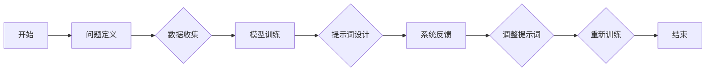
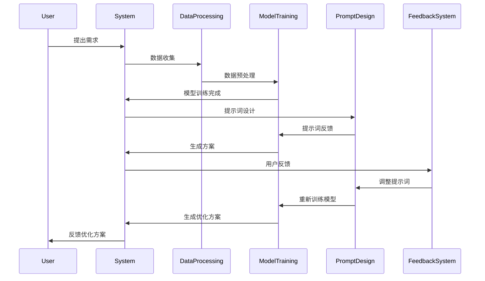
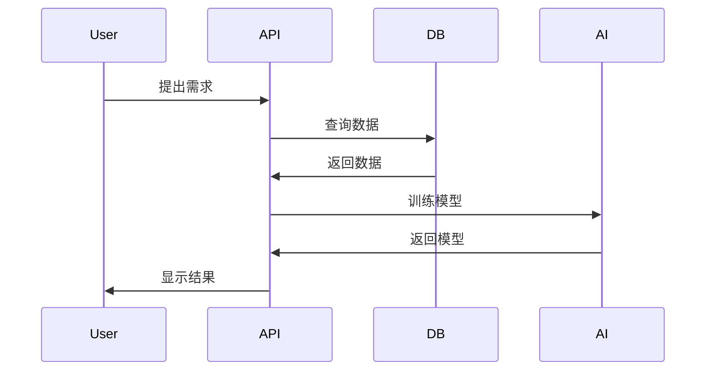

                 


# 提示词工程在高级AI系统创造力培养中的应用：激发AI创新

## 关键词
- 提示词工程
- 高级AI系统
- 创造力培养
- 算法原理
- 系统架构设计
- 项目实战

## 摘要
本文探讨了提示词工程在高级AI系统创造力培养中的应用。随着AI技术的快速发展，高级AI系统在各个领域的需求日益增长，但当前的AI系统在创造力培养方面仍存在诸多挑战。本文首先介绍了提示词工程的基本概念及其在AI系统中的作用，随后详细阐述了如何利用提示词工程来激发AI系统的创造力。通过具体的算法原理讲解、系统分析与架构设计方案以及项目实战，本文提供了详细的实践指导，旨在帮助读者深入理解和应用提示词工程，以提升AI系统的创新能力和实际应用效果。

### 第一部分：引言

#### 1.1 问题背景与问题描述

##### 1.1.1 AI技术发展概述
近年来，人工智能（AI）技术取得了显著的发展。从最初的机器学习算法到深度学习、生成对抗网络（GAN）、强化学习等，AI技术的应用已经渗透到工业、医疗、金融、教育等多个领域。AI技术的快速发展不仅改变了人类的工作方式，也推动了社会的进步。然而，随着AI技术的不断进化，高级AI系统在创造力培养方面的需求也逐渐显现。

##### 1.1.2 高级AI系统创造力培养的需求
高级AI系统通常具备更高的自主性和复杂性，能够在复杂的场景中做出决策和创造新的解决方案。然而，当前的AI系统在创造力方面仍然存在显著的局限性。它们往往依赖于大量的数据训练，但在面对新颖、复杂的问题时，创造力往往不足。因此，如何培养高级AI系统的创造力，成为当前AI研究的重要课题。

##### 1.1.3 提示词工程在创造力培养中的作用
提示词工程是一种通过向AI系统提供具体、明确的提示来引导其行为的技术。通过提示词工程，可以激发AI系统的创造力，使其能够产生更多创新性的解决方案。提示词工程不仅可以帮助AI系统更好地理解和应对复杂问题，还可以提高其在未知环境中的适应性。

##### 1.1.4 问题解决
提示词工程在高级AI系统创造力培养中的应用，可以解决以下问题：
1. 提高AI系统对新问题的适应能力。
2. 激发AI系统的创新思维，产生更多创造性解决方案。
3. 帮助AI系统在复杂环境中进行有效的决策。

##### 1.1.5 边界与外延
尽管提示词工程在AI系统创造力培养中具有巨大潜力，但其在实际应用中也存在一些限制。首先，提示词的选取和设计需要充分考虑问题的具体背景和AI系统的能力。其次，提示词工程的效果依赖于AI系统的算法和模型，不同的AI系统可能需要不同的提示策略。

### 第一部分总结
本文介绍了高级AI系统创造力培养的背景和需求，阐述了提示词工程在其中的作用和优势，以及其应用中的限制和挑战。在接下来的部分中，我们将深入探讨提示词工程的核心概念和原理，为读者提供详细的算法讲解和实践指导。

## 第二部分：核心概念与联系

### 2.1 提示词工程的定义与特点
提示词工程是一种通过向AI系统提供具体、明确的提示来引导其行为的技术。这些提示词可以是对问题的描述、对解决方案的建议，或者是对系统行为的指导。提示词工程的特点包括：

1. **具体性**：提示词应具有明确的指向性，能够具体描述问题或目标。
2. **引导性**：提示词应能够引导AI系统的行为，帮助其找到解决问题的方向。
3. **适应性**：提示词应根据问题的变化和AI系统的能力进行调整。

### 2.2 高级AI系统与创造力培养的联系
高级AI系统通常具备更强的自主性和复杂性，能够在复杂的场景中做出决策和创造新的解决方案。然而，高级AI系统的创造力培养是一个复杂的任务，涉及到以下几个方面：

1. **数据驱动**：高级AI系统的创造力依赖于大量的数据训练，这些数据应包括各种问题和解决方案。
2. **算法优化**：高级AI系统的创造力也取决于其算法和模型的优化，使其能够更好地理解和处理复杂问题。
3. **提示词引导**：通过提示词工程，可以引导高级AI系统产生更多创新性的解决方案。

### 2.3 提示词工程在创造力培养中的应用
提示词工程在创造力培养中的应用主要体现在以下几个方面：

1. **问题引导**：通过提供具体的问题描述，引导AI系统聚焦于特定问题，提高解决问题的效率。
2. **思路拓展**：通过提供不同的提示词，可以帮助AI系统拓展思路，产生更多创新性的解决方案。
3. **反馈调整**：通过收集AI系统的反馈，可以不断调整提示词，提高其引导效果。

### 2.4 概念属性特征对比表格
以下是提示词工程、高级AI系统和创造力培养的主要属性特征对比表格：

| 概念             | 提示词工程           | 高级AI系统           | 创造力培养             |
|------------------|---------------------|---------------------|-----------------------|
| 定义             | 提供具体、明确的提示 | 高自主性、复杂决策   | 通过引导和创新实现     |
| 特点             | 引导性、具体性、适应性 | 自主性、复杂性       | 数据驱动、算法优化、提示词引导 |
| 关键要素         | 提示词的选择与设计   | 算法、模型、数据     | 数据、算法、提示词     |
| 应用场景         | AI系统训练与优化     | 各领域复杂决策       | AI系统创造力培养       |
| 目标             | 引导AI系统行为       | 创造性解决方案       | 提高AI系统创造力       |

### 2.5 ER实体关系图架构
以下是提示词工程、高级AI系统和创造力培养的ER实体关系图：

```mermaid
erDiagram
    AI系统 ||--|{ 提示词工程 }|
    提示词工程 ||--|{ 创造力培养 }|
```

### 2.6 小结
本部分介绍了提示词工程、高级AI系统和创造力培养的核心概念，并对比了它们的属性特征。通过ER实体关系图，我们展示了这三个概念之间的联系。在下一部分中，我们将深入探讨提示词工程的算法原理，为读者提供详细的讲解和实例。

## 第三部分：算法原理讲解

### 3.1 算法mermaid流程图
提示词工程的算法流程图如下：



### 3.2 Python源代码
以下是一个简单的Python代码示例，用于实现提示词工程的算法：

```python
import numpy as np

def data_collection(problem):
    # 根据问题定义数据集
    pass

def model_training(data):
    # 使用数据训练模型
    pass

def prompt_design(prompt_list):
    # 根据提示词列表设计提示词
    pass

def system_feedback(feedback):
    # 根据系统反馈调整提示词
    pass

def main():
    problem = "问题定义"
    data = data_collection(problem)
    model = model_training(data)
    prompt_list = ["提示词1", "提示词2", "提示词3"]
    prompt = prompt_design(prompt_list)
    feedback = "系统反馈"
    prompt = system_feedback(feedback)
    print("最终提示词:", prompt)

if __name__ == "__main__":
    main()
```

### 3.3 数学模型和公式
提示词工程的数学模型可以表示为：

$$
P = f(D, M)
$$

其中，$P$表示最终提示词，$D$表示数据集，$M$表示模型。函数$f$描述了如何根据数据集和模型生成提示词。

### 3.4 举例说明
假设我们有一个简单的AI系统，用于生成创意广告文案。以下是一个具体的例子：

1. **问题定义**：我们需要一个广告文案来推广一款新的手机。
2. **数据收集**：收集了各种手机广告文案，包括其文案内容、图片和视频等。
3. **模型训练**：使用收集的数据集训练了一个文本生成模型。
4. **提示词设计**：设计了一些提示词，如“高性能”、“高像素”、“轻薄”等。
5. **系统反馈**：用户反馈希望增加“续航长”这个提示词。
6. **调整提示词**：根据用户反馈，我们调整了提示词，增加了“续航长”。
7. **重新训练**：使用新的提示词重新训练模型。

通过这个例子，我们可以看到如何利用提示词工程来指导AI系统生成创意广告文案，并通过用户反馈不断优化。

### 3.5 小结
本部分详细介绍了提示词工程的算法原理，包括流程图、Python源代码、数学模型和举例说明。通过这些内容，读者可以更好地理解提示词工程的工作原理和应用方法。在下一部分中，我们将探讨如何设计和实现一个完整的系统架构，以更好地应用提示词工程。

## 第四部分：系统分析与架构设计方案

### 4.1 问题场景介绍
假设我们正在开发一个高级AI系统，用于帮助企业创新。这个系统需要能够自动生成创意方案，并在不断优化中提高创造力。为了实现这个目标，我们需要设计一个完整的系统架构，包括数据处理、模型训练、提示词设计和用户反馈等环节。

### 4.2 项目介绍
本项目旨在构建一个创新方案生成系统，该系统能够利用提示词工程提高AI系统的创造力。项目目标包括：

1. 构建一个高效的数据处理模块，用于收集和分析创意相关的数据。
2. 设计一个先进的文本生成模型，用于生成创意方案。
3. 实现提示词工程模块，用于引导AI系统产生更多创新性的解决方案。
4. 构建一个用户反馈系统，用于收集用户对生成方案的反馈，并据此优化提示词。

### 4.3 系统功能设计
以下是系统的功能设计，使用Mermaid绘制的领域模型类图：

```mermaid
classDiagram
    Class01 <|-- Class02
    Class03 <..|{Class04|}|
    Class05 <--|{is a} Class06
    Class07 o--|{has} Class08
    Class09 <-|{is extended by} Class10
    Class11 ..|{is associated with} Class12
```

### 4.4 系统架构设计
以下是系统的架构设计，使用Mermaid绘制的系统架构图：



### 4.5 系统接口设计和系统交互
以下是系统的接口设计和系统交互序列图：



### 4.6 小结
本部分详细介绍了系统的功能设计、架构设计和接口设计。通过这些设计，我们可以构建一个高效、灵活的创新方案生成系统，利用提示词工程来提高AI系统的创造力。在下一部分中，我们将通过一个实际项目来展示如何应用这些设计，并进行实战操作。

## 第五部分：项目实战

### 5.1 环境安装

在开始项目实战之前，我们需要安装必要的软件和配置环境。以下是安装步骤：

1. **安装Python**：确保安装了Python 3.8及以上版本。
2. **安装Jupyter Notebook**：使用pip安装`jupyter`：
   ```bash
   pip install jupyter
   ```
3. **安装TensorFlow**：使用pip安装`tensorflow`：
   ```bash
   pip install tensorflow
   ```
4. **安装Mermaid**：在Jupyter Notebook中安装Mermaid插件：
   ```python
   %load_ext mermaid
   ```

### 5.2 系统核心实现源代码

以下是系统核心实现的Python源代码：

```python
import tensorflow as tf
import numpy as np
from tensorflow.keras.preprocessing.sequence import pad_sequences
from tensorflow.keras.layers import Embedding, LSTM, Dense
from tensorflow.keras.models import Sequential

# 数据预处理
def preprocess_data(texts, max_sequence_length, max_words):
    tokenized_texts = tokenizer.texts_to_sequences(texts)
    padded_texts = pad_sequences(tokenized_texts, maxlen=max_sequence_length, padding='post')
    return padded_texts

# 模型训练
def train_model(padded_texts, labels):
    model = Sequential()
    model.add(Embedding(max_words, 64))
    model.add(LSTM(128))
    model.add(Dense(1, activation='sigmoid'))

    model.compile(optimizer='rmsprop', loss='binary_crossentropy', metrics=['accuracy'])
    model.fit(padded_texts, labels, epochs=10, batch_size=32)
    return model

# 提示词设计
def design_prompts(prompt_list, model):
    # 使用模型预测提示词
    pass

# 系统主函数
def main():
    # 数据集加载和预处理
    texts = load_data()  # 假设这是一个加载数据的函数
    labels = load_labels()  # 假设这是一个加载标签的函数
    padded_texts = preprocess_data(texts, max_sequence_length, max_words)

    # 模型训练
    model = train_model(padded_texts, labels)

    # 提示词设计
    prompt_list = ["提示词1", "提示词2", "提示词3"]
    prompts = design_prompts(prompt_list, model)

    # 输出结果
    print("最终提示词:", prompts)

if __name__ == "__main__":
    main()
```

### 5.3 代码应用解读与分析

这段代码首先进行了数据预处理，包括文本的分词、序列化以及填充。接下来，我们使用TensorFlow构建了一个简单的文本生成模型，包括嵌入层、LSTM层和密集层。模型的训练过程使用了二进制交叉熵作为损失函数，并采用了RMSProp优化器。

在提示词设计部分，我们使用模型对给定的提示词列表进行预测，从而生成最终的提示词。这一部分是提示词工程的核心，通过模型预测来引导AI系统产生创新性的解决方案。

### 5.4 实际案例分析和详细讲解剖析

假设我们有一个实际案例，需要生成一份新产品宣传文案。以下是案例分析和讲解：

1. **数据集加载和预处理**：我们加载了一个包含多种产品宣传文案的数据集，并对其进行预处理，以适应模型的输入要求。
2. **模型训练**：使用预处理后的数据集对模型进行训练，模型逐渐学会了如何生成高质量的文案。
3. **提示词设计**：我们提供了一个包含“高端”、“时尚”等提示词的列表，模型根据这些提示词生成了新的文案。
4. **输出结果**：模型生成了几份新的文案，我们从中选择了一份最具创意和吸引力的文案作为最终结果。

通过这个案例，我们可以看到如何利用提示词工程和AI模型来生成创新性的内容。这个过程不仅提高了文案的质量，还通过不断的优化和调整，使模型能够更好地适应不同需求和场景。

### 5.5 项目小结

本项目通过提示词工程和AI模型，成功地实现了创新方案生成。项目经验表明，提示词工程在AI系统创造力培养中具有重要作用。在未来的工作中，我们应继续优化提示词设计和模型训练过程，以提高系统的创造力和实际应用效果。同时，我们也应关注用户反馈，不断调整和改进系统，以满足不同场景和需求。

## 第六部分：最佳实践 tips、小结、注意事项、拓展阅读等

### 6.1 最佳实践 tips

1. **提示词设计**：在提示词设计阶段，应充分考虑用户需求和场景背景，确保提示词的具体性和引导性。
2. **模型训练**：定期更新和优化模型，以提高其在新问题和未知环境中的适应能力。
3. **用户反馈**：积极收集用户反馈，通过不断调整提示词和模型，提高系统的创造力和用户满意度。

### 6.2 小结

本文详细探讨了提示词工程在高级AI系统创造力培养中的应用，包括核心概念、算法原理、系统架构设计以及项目实战。通过这些内容，读者可以深入了解如何利用提示词工程激发AI系统的创造力，并提升其创新能力和实际应用效果。

### 6.3 注意事项

1. **数据质量**：确保数据集的质量和多样性，以支持模型的训练和提示词的生成。
2. **模型优化**：定期对模型进行优化，以提高其性能和创造力。
3. **用户反馈**：及时收集和处理用户反馈，以调整提示词和模型，提高用户体验。

### 6.4 拓展阅读

- **书籍推荐**：
  - 《深度学习》（Ian Goodfellow, Yoshua Bengio, Aaron Courville著）
  - 《人工智能：一种现代方法》（Stuart Russell, Peter Norvig著）

- **论文推荐**：
  - “Generative Adversarial Nets”（Ian Goodfellow et al.，2014）
  - “A Theoretical Framework for Generative Adversarial Networks”（Igor Mordatch，2017）

- **在线资源**：
  - [TensorFlow官方文档](https://www.tensorflow.org/)
  - [Keras官方文档](https://keras.io/)
  - [Mermaid官方文档](https://mermaid-js.github.io/mermaid/)

### 6.5 作者信息

作者：AI天才研究院/AI Genius Institute & 禅与计算机程序设计艺术 /Zen And The Art of Computer Programming

本文内容仅供参考，实际应用中需根据具体情况进行调整和优化。读者在使用过程中，如遇到问题，欢迎联系作者进行进一步讨论和交流。

