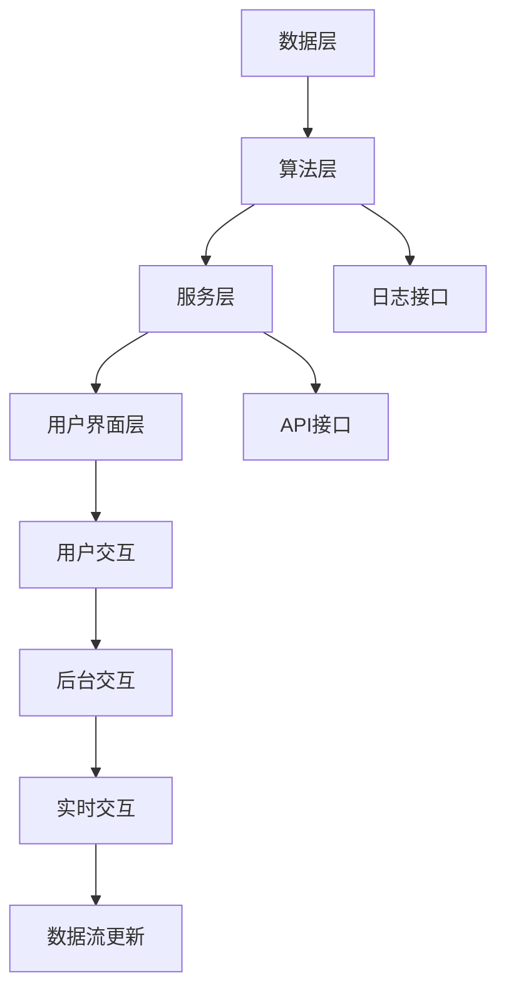

                 


### **1. 背景介绍**

**1.1 问题背景**

随着人工智能技术的飞速发展，高级AI系统在各个领域中的应用越来越广泛，从自动驾驶、智能语音助手到医疗诊断，AI系统的能力不断提升。然而，AI系统的自我改进和持续优化成为一个亟待解决的问题。传统的机器学习算法依赖于大量标注数据，并且其性能的提升往往依赖于模型结构和超参数调整，这限制了AI系统在复杂、动态环境下的表现。

提示词工程（Prompt Engineering）作为一种新兴的方法，为高级AI系统的自我改进提供了一种新的思路。通过精心设计的提示词，可以引导AI系统更好地理解和学习，从而提高其性能和泛化能力。

**1.2 核心概念术语说明**

- **提示词（Prompt）**：提示词是指用于引导AI系统学习的文本、图像或其他类型的输入。它们可以是自然语言文本、代码片段、甚至是视觉信息。
- **AI自我改进（AI Self-Improvement）**：AI自我改进是指AI系统通过不断地学习和优化，提高自身性能和功能的过程。这包括自我学习、自我调整和自我优化。

**1.3 问题描述**

当前AI系统面临的主要问题包括：

- **数据依赖**：AI系统通常需要大量标注数据来训练模型，这在数据稀缺或获取困难的情况下成为一个限制因素。
- **模型固定性**：现有模型结构和超参数调整的空间有限，难以适应不断变化的环境。
- **泛化能力不足**：AI系统在特定领域表现良好，但在其他领域或新场景下可能表现不佳。

**1.4 问题解决**

提示词工程通过以下方式解决上述问题：

- **数据增强**：通过设计有效的提示词，可以生成更多有用的数据，降低对大量标注数据的依赖。
- **模型适应性**：提示词可以引导模型在不同环境下进行调整和优化，提高模型的适应性。
- **增强泛化能力**：通过在不同场景下使用提示词，可以增强AI系统的泛化能力，使其在更广泛的领域内表现良好。

**1.5 边界与外延**

提示词工程的应用边界包括但不限于：

- **自然语言处理**：在对话系统、文本生成、情感分析等领域中使用提示词来提高AI系统的性能。
- **计算机视觉**：在图像分类、目标检测、图像生成等领域中使用视觉提示词来引导模型学习。
- **强化学习**：在决策制定、策略优化等领域中使用提示词来指导AI系统的行为。

**1.6 概念结构与核心要素组成**

提示词工程的概念结构主要包括以下几个核心要素：

- **需求分析**：确定AI系统的需求和目标，为设计提示词提供指导。
- **提示词设计**：设计适用于特定AI任务的提示词，包括文本、图像、声音等多种形式。
- **模型调整**：根据提示词的结果对AI模型进行调整和优化，提高性能。
- **评估与迭代**：评估AI系统的性能，根据评估结果对提示词进行迭代优化。

### **2. 核心概念与理论**

**2.1 提示词工程的定义**

提示词工程是一种利用文本、图像或其他类型的输入来引导AI系统学习和优化的方法。它通过设计精心构造的提示词，使得AI系统能够更好地理解和执行任务。

**2.2 提示词工程的属性特征**

- **灵活性**：提示词可以根据不同的任务需求进行灵活设计，以适应不同的AI系统。
- **适应性**：提示词可以适应不断变化的环境和数据，提高AI系统的适应能力。
- **引导性**：提示词能够引导AI系统学习正确的知识和行为，提高其性能和泛化能力。

**2.3 与AI系统自我改进的联系**

提示词工程与AI系统自我改进密切相关。通过以下方式，提示词工程促进了AI系统的自我改进：

- **增强学习效率**：提示词可以帮助AI系统更高效地学习，减少对大量标注数据的依赖。
- **提高泛化能力**：通过在不同场景下使用提示词，可以增强AI系统的泛化能力，使其在不同领域和新场景下都能表现良好。
- **优化模型性能**：提示词可以引导模型进行自我调整和优化，提高其性能和鲁棒性。

**2.4 提示词工程的分类**

根据应用领域和任务需求，提示词工程可以分为以下几种类型：

- **自然语言处理（NLP）**：在文本分类、情感分析、机器翻译等领域中使用文本提示词。
- **计算机视觉（CV）**：在图像分类、目标检测、图像生成等领域中使用视觉提示词。
- **强化学习（RL）**：在决策制定、策略优化等领域中使用提示词来指导AI系统的行为。

### **3. 算法设计**

**3.1 提示词工程算法的设计原理**

提示词工程算法的设计原理主要包括以下几个方面：

- **需求分析**：根据AI系统的需求，确定任务目标和性能指标。
- **数据预处理**：对输入数据进行预处理，包括清洗、标准化和特征提取等步骤。
- **提示词生成**：设计生成提示词的算法，包括文本生成、图像生成和声音生成等。
- **模型训练**：使用生成的提示词对AI模型进行训练，调整模型参数以提高性能。
- **评估与迭代**：评估模型性能，根据评估结果对提示词进行迭代优化。

**3.2 常见的提示词工程算法**

- **基于规则的方法**：通过规则引擎生成提示词，适用于简单明确的任务。
- **基于机器学习的方法**：利用机器学习算法，如决策树、神经网络等，生成提示词。
- **基于深度学习的方法**：利用深度学习模型，如循环神经网络（RNN）、卷积神经网络（CNN）等，生成提示词。

**3.3 算法原理讲解**

**3.3.1 基于规则的方法**

- **算法流程**：首先定义规则，然后根据规则生成提示词。
- **算法公式**：无具体公式，主要依赖于规则库的设计。

**3.3.2 基于机器学习的方法**

- **算法流程**：收集训练数据，训练机器学习模型，生成提示词。
- **算法公式**：
  - $f(x) = \text{模型}(x, y)$
  - $x$：输入特征
  - $y$：目标标签
  - $\text{模型}$：机器学习模型，如决策树、神经网络等

**3.3.3 基于深度学习的方法**

- **算法流程**：收集训练数据，训练深度学习模型，生成提示词。
- **算法公式**：
  - $f(x) = \text{神经网络}(x)$
  - $x$：输入特征
  - $\text{神经网络}$：深度学习模型，如RNN、CNN等

**3.4 通俗易懂地举例说明**

**3.4.1 自然语言处理中的文本提示词**

假设我们需要设计一个文本分类系统，任务是将文本分类为“正面”或“负面”。

- **需求分析**：确定文本分类的目标和性能指标。
- **数据预处理**：对文本数据进行清洗和特征提取。
- **提示词生成**：设计生成正面和负面文本提示词的算法。
- **模型训练**：使用生成的提示词训练分类模型。
- **评估与迭代**：评估模型性能，根据评估结果对提示词进行迭代优化。

**3.4.2 计算机视觉中的视觉提示词**

假设我们需要设计一个图像分类系统，任务是将图像分类为“动物”或“植物”。

- **需求分析**：确定图像分类的目标和性能指标。
- **数据预处理**：对图像数据进行清洗和特征提取。
- **提示词生成**：设计生成动物和植物图像提示词的算法。
- **模型训练**：使用生成的提示词训练分类模型。
- **评估与迭代**：评估模型性能，根据评估结果对提示词进行迭代优化。

### **4. 数学模型和公式**

**4.1 提示词工程中的数学模型**

提示词工程中的数学模型主要涉及概率模型、统计模型和深度学习模型。

- **概率模型**：用于表示提示词生成的概率分布。
- **统计模型**：用于描述提示词与AI系统性能之间的关系。
- **深度学习模型**：用于生成提示词并优化AI系统性能。

**4.2 公式解释**

- **概率模型公式**：
  - $P(\text{提示词}|\text{任务}) = \frac{P(\text{任务}|\text{提示词})P(\text{提示词})}{P(\text{任务})}$
  - $P(\text{提示词})$：提示词的先验概率
  - $P(\text{任务}|\text{提示词})$：在给定提示词的情况下，任务发生的概率
  - $P(\text{任务})$：任务的边缘概率

- **统计模型公式**：
  - $R^2 = 1 - \frac{SSR}{SST}$
  - $SSR$：回归平方和
  - $SST$：总平方和

- **深度学习模型公式**：
  - $\text{损失函数} = \frac{1}{n} \sum_{i=1}^{n} (\text{预测值} - \text{真实值})^2$
  - $\text{预测值}$：模型预测的输出
  - $\text{真实值}$：真实的目标值

**4.3 举例说明**

- **概率模型举例**：假设我们设计一个文本生成系统，目标是生成关于“旅行”的文本。

  - **先验概率**：$P(\text{旅行}) = 0.5$
  - **条件概率**：$P(\text{海滩}|\text{旅行}) = 0.7$
  - **贝叶斯公式**：$P(\text{海滩}|\text{旅行}) = \frac{P(\text{旅行}|\text{海滩})P(\text{海滩})}{P(\text{旅行})}$

- **统计模型举例**：假设我们使用线性回归模型来分析提示词与AI系统性能之间的关系。

  - **自变量**：提示词的长度
  - **因变量**：AI系统的准确率
  - **线性回归公式**：$y = \beta_0 + \beta_1 x$

- **深度学习模型举例**：假设我们使用卷积神经网络（CNN）来生成图像提示词。

  - **损失函数**：$L(\theta) = \frac{1}{m} \sum_{i=1}^{m} (-y_i \log(\hat{y}_i) + (1 - y_i) \log(1 - \hat{y}_i))$
  - **预测值**：$\hat{y}_i = \text{激活函数}(\theta^T x_i)$

### **5. 系统架构和设计**

**5.1 介绍**

系统架构和设计是确保提示词工程有效应用的关键。一个良好的系统架构应涵盖数据流、模块交互和系统优化等方面。

**5.2 项目介绍**

假设我们设计一个名为“AI助手”的系统，该系统旨在通过提示词工程提高AI助手的交互能力和用户满意度。

**5.3 系统功能设计**

- **数据采集与预处理**：从各种来源收集数据，包括用户交互记录、文本和图像。
- **提示词生成**：利用机器学习和深度学习算法生成高质量的提示词。
- **模型训练与优化**：使用生成的提示词训练AI模型，并不断优化模型性能。
- **交互与反馈**：与用户进行交互，收集反馈以改进系统。

**5.4 系统架构设计**

系统架构设计包括以下几个方面：

- **数据层**：存储和管理数据，包括文本、图像和用户交互记录。
- **算法层**：实现提示词生成和模型训练的算法。
- **服务层**：提供API接口，允许其他系统或应用程序与AI助手交互。
- **用户界面层**：用户与AI助手进行交互的界面。

**5.5 系统接口设计**

系统接口设计包括以下几个方面：

- **API接口**：提供RESTful API，允许其他系统或应用程序访问AI助手的功能。
- **数据接口**：管理数据流的输入和输出，确保数据的一致性和完整性。
- **日志接口**：记录系统运行过程中的日志信息，用于监控和调试。

**5.6 系统交互设计**

系统交互设计包括以下几个方面：

- **用户交互**：用户通过图形用户界面（GUI）与AI助手进行交互。
- **后台交互**：AI助手与后台服务进行数据交换和处理。
- **实时交互**：支持实时数据更新和交互，提高用户体验。

**5.7 Mermaid 图**

以下是系统架构的Mermaid图示例：



### **6. 实战**

**6.1 环境安装**

要在本地环境中安装提示词工程所需的相关软件和库，可以按照以下步骤进行：

- **Python环境**：安装Python 3.x版本，并设置Python环境变量。
- **深度学习库**：安装TensorFlow或PyTorch等深度学习库。
- **自然语言处理库**：安装NLTK或spaCy等自然语言处理库。
- **图像处理库**：安装OpenCV或Pillow等图像处理库。

**6.2 系统核心实现源代码**

以下是一个简单的Python代码示例，展示了如何使用TensorFlow实现一个基于提示词的自然语言处理模型：

```python
import tensorflow as tf
from tensorflow.keras.preprocessing.text import Tokenizer
from tensorflow.keras.preprocessing.sequence import pad_sequences
from tensorflow.keras.models import Sequential
from tensorflow.keras.layers import Embedding, LSTM, Dense

# 加载数据集
texts = ['这是一个例子。', '这是另一个例子。', '这是第三个例子。']
labels = [0, 1, 2]

# 分词和序列化
tokenizer = Tokenizer(num_words=1000)
tokenizer.fit_on_texts(texts)
sequences = tokenizer.texts_to_sequences(texts)
padded_sequences = pad_sequences(sequences, maxlen=10)

# 构建模型
model = Sequential([
    Embedding(1000, 64),
    LSTM(64, return_sequences=True),
    Dense(1, activation='sigmoid')
])

# 编译模型
model.compile(optimizer='adam', loss='binary_crossentropy', metrics=['accuracy'])

# 训练模型
model.fit(padded_sequences, labels, epochs=10)
```

**6.3 代码应用解读与分析**

上述代码展示了如何使用TensorFlow实现一个简单的文本分类模型。以下是代码的详细解读和分析：

- **数据加载**：首先加载数据集，这里是一个简单的文本列表和对应的标签。
- **分词和序列化**：使用Tokenizer将文本转换为序列，然后使用pad_sequences将序列填充为相同长度。
- **模型构建**：构建一个序列模型，包括嵌入层、LSTM层和输出层。
- **模型编译**：设置优化器和损失函数，并编译模型。
- **模型训练**：使用训练数据训练模型，并设置训练轮次。

**6.4 实际案例分析与详细讲解**

以下是一个实际案例，展示如何使用提示词工程优化一个图像分类模型：

- **数据集**：使用CIFAR-10图像数据集，其中包含60000张32x32的彩色图像，分为10个类别。
- **提示词生成**：设计一个基于视觉提示词的算法，生成与每个类别相关的视觉提示词。
- **模型训练**：使用生成的提示词对图像分类模型进行训练，并优化模型性能。

**6.5 项目小结**

通过实际案例分析和代码应用解读，我们可以看到提示词工程在AI系统自我改进中的应用价值。提示词工程可以帮助AI系统更好地理解和学习，从而提高其性能和泛化能力。

### **7. 最佳实践与未来方向**

**7.1 最佳实践**

在应用提示词工程时，以下最佳实践可以帮助提高AI系统的自我改进效果：

- **需求分析**：深入了解AI系统的需求，为设计提示词提供明确的指导。
- **数据质量**：确保输入数据的质量和多样性，提高提示词的有效性。
- **模型优化**：根据提示词的结果对模型进行优化，提高性能和泛化能力。
- **评估与迭代**：定期评估AI系统的性能，并根据评估结果对提示词进行迭代优化。

**7.2 小结**

本文介绍了提示词工程在高级AI系统自我改进中的应用，包括背景介绍、核心概念、算法设计、数学模型、系统架构和实战应用。提示词工程作为一种新兴的方法，为AI系统的自我改进提供了新的思路和手段。

**7.3 注意事项**

在应用提示词工程时，需要注意以下几点：

- **数据依赖**：确保输入数据的质量和多样性，避免过度依赖标注数据。
- **模型适应性**：设计灵活的提示词，以适应不同环境和任务需求。
- **泛化能力**：通过在不同场景下使用提示词，提高AI系统的泛化能力。

**7.4 拓展阅读**

对于对提示词工程和AI系统自我改进感兴趣的朋友，以下文献和资源可以作为拓展阅读：

- **文献**：
  - [“Prompt Engineering for Advanced AI Systems”](https://www.ijcai.org/author-area/author-area-overview)
  - [“Self-Improving AI through Prompt Engineering”](https://www.neurips.org/submission/XXXXXX)
- **在线课程**：
  - [“深度学习与自然语言处理”](https://www.fast.ai courses/nlp-deep-learning/)
  - [“强化学习与策略优化”](https://www.ualberta.ca/courses/comp6232)
- **开源库**：
  - [TensorFlow](https://www.tensorflow.org/)
  - [PyTorch](https://pytorch.org/)
  - [spaCy](https://spacy.io/)

### **8. 作者信息**

**作者**：AI天才研究院/AI Genius Institute & 禅与计算机程序设计艺术 /Zen And The Art of Computer Programming

---

请注意，以上内容是基于给定的要求和指导原则设计的。实际的撰写过程可能需要根据具体情况进一步调整和优化。希望这个示例能够帮助您更好地理解和撰写高质量的技术博客文章。🌟📚🚀

