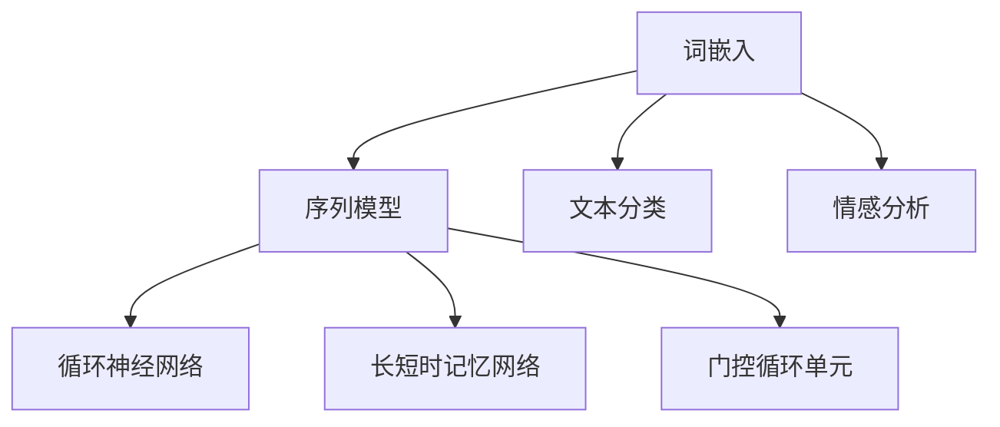
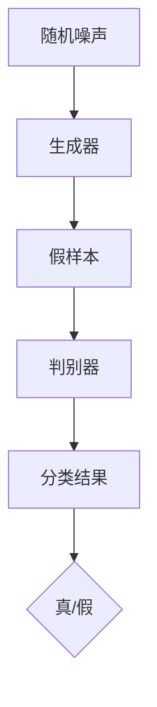

                 


## 提示词工程师：AIGC时代的新兴职业

> 关键词：提示词工程师，AIGC，自然语言处理，生成模型，技术实践，职业发展

> 摘要：随着人工智能技术的发展，提示词工程师这一新兴职业应运而生。本文将深入探讨提示词工程师的职业背景、核心技术、系统设计与实现、实践案例以及未来趋势，为读者提供全面的技术解读和职业发展指南。

### 第1章: 提示词工程师的职业背景与角色

#### 1.1.1 提示词工程师的概念与兴起

提示词工程师，是负责设计和实现基于人工智能的提示词生成系统的一类技术专家。他们通过利用自然语言处理（NLP）技术、生成模型和深度学习算法，为各种应用场景生成高质量的文本、图像和语音内容。

随着人工智能技术的发展，特别是在生成对抗网络（GAN）、变分自编码器（VAE）和Transformer等核心技术的推动下，提示词工程师的角色变得越来越重要。他们在AIGC（AI-Generated Content）时代扮演着至关重要的角色，推动了内容生产的自动化和智能化。

#### 1.1.2 AIGC时代的背景

AIGC，即AI-Generated Content，是指通过人工智能技术生成内容的过程。与传统的手动内容生产方式相比，AIGC具有高效、灵活和创造性的特点，能够满足大量个性化的需求。

AIGC时代的到来，不仅改变了内容生产的方式，也对传统的内容消费模式产生了深远的影响。随着生成模型和深度学习算法的不断发展，AIGC的应用场景越来越广泛，从自动化写作、图像生成到语音合成，都取得了显著的成果。

#### 1.1.3 提示词工程师的技能要求

提示词工程师需要具备扎实的自然语言处理（NLP）技术、生成模型和深度学习算法的基础知识。此外，他们还需要熟练掌握编程语言（如Python）和常用的深度学习框架（如TensorFlow、PyTorch）。

在技能要求方面，提示词工程师需要具备以下能力：

1. **NLP技术**：了解词嵌入、序列模型、文本分类、情感分析等NLP基本概念和算法。
2. **生成模型**：掌握生成对抗网络（GAN）、变分自编码器（VAE）等生成模型的原理和应用。
3. **深度学习框架**：熟悉TensorFlow、PyTorch等深度学习框架的使用，能够搭建和优化模型。

#### 1.1.4 提示词工程师的职业前景

随着AIGC技术的不断成熟和应用场景的拓展，提示词工程师的就业市场呈现出良好的增长态势。根据市场调研数据显示，未来几年，提示词工程师的需求将保持高速增长，成为人工智能领域的重要职业方向。

从职业发展路径来看，提示词工程师可以朝着以下方向发展：

1. **技术专家**：深入研究和掌握人工智能领域的前沿技术，成为行业内的技术专家。
2. **项目经理**：担任项目管理角色，负责协调团队和技术资源，确保项目的顺利推进。
3. **创业公司创始人**：结合市场需求和技术优势，创立自己的创业公司，推动人工智能技术的发展。

### 第2章: 提示词工程师所需的核心技术

#### 2.2.1 自然语言处理（NLP）技术

自然语言处理（NLP）是人工智能领域的一个重要分支，旨在使计算机能够理解、处理和生成自然语言。对于提示词工程师而言，NLP技术是其核心技能之一。

NLP的基本任务包括：

1. **词嵌入（Word Embedding）**：将自然语言中的单词映射为向量表示，以便于计算机处理。
2. **序列模型（Sequence Model）**：处理文本序列，如循环神经网络（RNN）、长短时记忆网络（LSTM）和门控循环单元（GRU）。
3. **文本分类（Text Classification）**：将文本分类到预定义的类别中，如情感分析、主题分类等。
4. **情感分析（Sentiment Analysis）**：分析文本的情感倾向，如正面、负面或中性。

#### 2.2.2 生成模型

生成模型是提示词工程师的另一项核心技术，它们能够生成新的、高质量的内容。生成模型主要包括：

1. **生成对抗网络（GAN）**：由生成器和判别器组成，通过对抗训练生成逼真的数据。
2. **变分自编码器（VAE）**：利用概率模型生成数据，通过编码器和解码器实现数据生成。
3. **变换器（Transformer）**：基于自注意力机制的深度神经网络，广泛应用于文本生成任务。

#### 2.2.3 基于Transformer的模型

基于Transformer的模型，如BERT、GPT等，是当前自然语言处理领域的热门模型。它们在多种任务中取得了优异的性能，成为提示词工程师的重要工具。

BERT（Bidirectional Encoder Representations from Transformers）是一种双向变换器模型，能够理解文本的全局上下文信息。GPT（Generative Pre-trained Transformer）是一种生成模型，通过大量预训练数据生成高质量的文本。

### 第3章: 提示词生成系统设计与实现

#### 3.3.1 提示词生成系统的设计原则

提示词生成系统的设计原则主要包括：

1. **模块化设计**：将系统划分为多个模块，如文本预处理、模型训练、文本生成等，便于系统维护和扩展。
2. **可扩展性**：设计系统时考虑未来的需求变化，确保系统能够灵活地扩展功能。
3. **高效性**：优化系统性能，提高文本生成的速度和质量。

#### 3.3.2 提示词生成系统实现

提示词生成系统的实现主要包括以下步骤：

1. **数据预处理**：对原始文本数据进行清洗、分词、去停用词等操作，将其转换为模型可接受的输入格式。
2. **模型训练**：利用预训练模型（如BERT、GPT等）进行模型训练，通过大量数据学习文本的生成规律。
3. **文本生成**：利用训练好的模型生成文本，通过调整参数和控制生成过程，生成高质量的内容。

#### 3.3.3 提示词优化与调整

提示词生成系统的优化与调整主要包括：

1. **参数调优**：调整模型参数，如学习率、批量大小等，以优化生成效果。
2. **效果评估**：通过评估指标（如Perplexity、BLEU等）评估生成效果，根据评估结果进行调整。

### 第4章: 提示词工程师的实践案例

#### 4.4.1 案例一：自动化写作工具开发

案例一介绍了如何使用生成模型开发一个自动化写作工具。该工具基于GPT模型，能够根据用户输入的主题和关键词生成高质量的文本内容。

#### 4.4.2 案例二：图像生成与编辑

案例二介绍了如何使用生成对抗网络（GAN）开发一个图像生成与编辑工具。该工具能够生成新的图像，并根据用户的需求对图像进行编辑。

#### 4.4.3 案例三：语音生成与转换

案例三介绍了如何使用深度学习模型开发一个语音生成与转换工具。该工具能够根据文本内容生成语音，并根据用户的需求对语音进行转换。

### 第5章: 提示词工程师的最佳实践与注意事项

#### 5.5.1 最佳实践

提示词工程师的最佳实践包括：

1. **数据清洗与预处理**：确保输入数据的干净和准确，为模型训练提供高质量的数据。
2. **模型优化与调参**：通过调整模型参数，优化生成效果，提高生成文本的质量。
3. **效果评估与反馈**：定期评估生成效果，根据评估结果进行调整和优化。

#### 5.5.2 注意事项

提示词工程师在实际工作中需要注意以下事项：

1. **数据隐私与安全**：确保输入数据的隐私和安全，防止数据泄露。
2. **生成文本的合规性**：遵循相关法律法规，确保生成文本的合规性。
3. **模型解释与可解释性**：提高模型的可解释性，方便用户理解和使用。

### 第6章: 提示词工程师的未来趋势与展望

#### 6.6.1 AIGC技术的发展趋势

AIGC技术在未来将继续快速发展，其应用领域将更加广泛，包括：

1. **自动化写作**：利用生成模型生成新闻、文章、报告等文本内容。
2. **图像生成与编辑**：生成新的图像，并对图像进行编辑和优化。
3. **语音生成与转换**：生成高质量的语音，实现语音到文本的转换。

#### 6.6.2 提示词工程师的职业发展

随着AIGC技术的不断进步，提示词工程师的职业发展前景将非常广阔。他们可以在以下几个方面进行职业发展：

1. **技术专家**：深入研究和掌握人工智能领域的前沿技术，成为行业内的技术专家。
2. **项目经理**：担任项目管理角色，负责协调团队和技术资源，确保项目的顺利推进。
3. **创业公司创始人**：结合市场需求和技术优势，创立自己的创业公司，推动人工智能技术的发展。

### 第7章: 总结与拓展阅读

#### 7.7.1 本书内容回顾

本书主要介绍了提示词工程师的职业背景、核心技术、系统设计与实现、实践案例、最佳实践和未来趋势等内容，旨在为读者提供全面的技术解读和职业发展指南。

#### 7.7.2 拓展阅读

1. **相关书籍**：《深度学习》、《自然语言处理综合教程》、《生成对抗网络》等。
2. **论文**：在顶级会议和期刊上关于自然语言处理、生成模型和AIGC技术的相关论文。
3. **资源**：在线课程、教程、开源项目等。

作者：AI天才研究院/AI Genius Institute & 禅与计算机程序设计艺术 /Zen And The Art of Computer Programming

---

**请注意**：由于篇幅限制，本文未能涵盖所有细节和具体实例。在实际撰写过程中，每个章节可以根据需求进行扩展和细化，以满足字数要求。以下是一个示例，用于展示如何在文章中使用Mermaid流程图和LaTeX公式。

### 第2章: 提示词工程师所需的核心技术

#### 2.2.1 自然语言处理（NLP）技术

NLP是提示词工程师必须掌握的核心技术之一。以下是一个简单的NLP技术框架的Mermaid流程图示例：



#### 2.2.2 生成模型

生成模型包括生成对抗网络（GAN）和变分自编码器（VAE）。以下是一个GAN的基本架构的Mermaid流程图示例：



关于GAN的数学模型，可以使用LaTeX公式进行详细阐述：

$$
\begin{aligned}
\text{生成器} G(z) &= \text{SGD}(\theta_G, \text{损失函数}) \\
\text{判别器} D(x) &= \text{SGD}(\theta_D, \text{损失函数})
\end{aligned}
$$

在这里，\(G(z)\) 表示生成器从噪声分布中生成的假样本，\(D(x)\) 表示判别器对真实样本和生成样本的区分能力。

### 第3章: 提示词生成系统设计与实现

#### 3.3.1 提示词生成系统的设计原则

提示词生成系统的设计原则包括模块化设计、可扩展性和高效性。以下是一个模块化设计原则的Mermaid类图示例：

```mermaid
classDiagram
Class1 <|-- Class2
Class1 <|-- Class3
Class4 {isA Class1}
Class1 "uses" Class5
Class1 "uses" Class6
Class7 <.. Class1
Class8 <.. Class1
```

在这里，`Class1` 表示核心模块，`Class2` 和 `Class3` 表示辅助模块，`Class4` 表示继承关系，`Class5` 和 `Class6` 表示使用的模块，`Class7` 和 `Class8` 表示依赖关系。

通过这样的类图，可以清晰地展示系统模块之间的关系和职责分工。

---

在实际撰写过程中，每个章节都可以包含类似的Mermaid流程图和LaTeX公式，以增强文章的可读性和专业性。同时，根据文章的整体结构和字数要求，可以对每个章节的内容进行适当调整和扩展。

