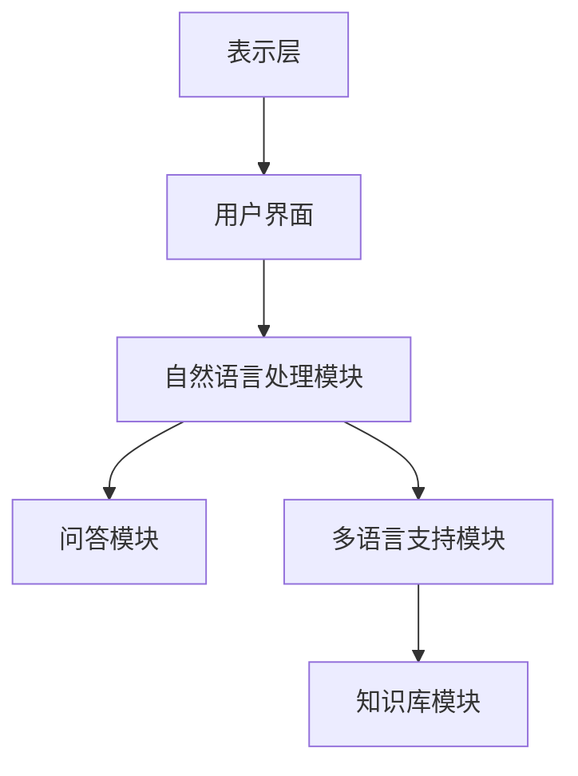
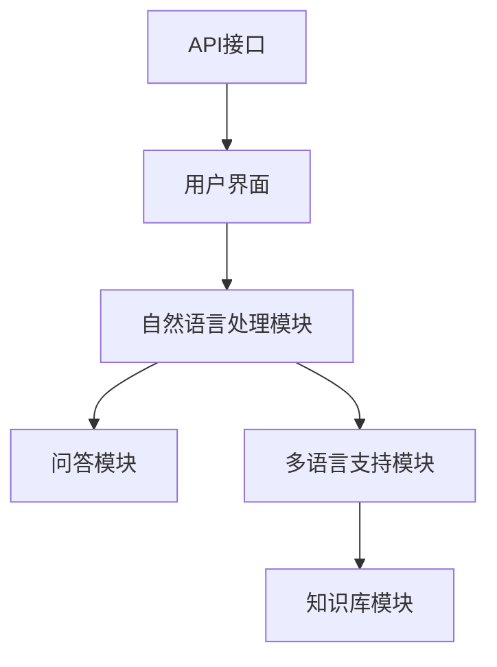

                 


# 提示词工程师：AIGC时代的新兴职业解析

> 关键词：AIGC、提示词工程师、自然语言处理、人工智能、职业发展

> 摘要：本文深入探讨AIGC时代下新兴职业——提示词工程师的角色、技能要求、职业发展以及行业应用。通过详细的分析和实例，解析这一职业的发展前景和挑战。

## 目录大纲设计思路

### 1. 分析书名和主题
- 书名《提示词工程师：AIGC时代的新兴职业解析》明确了本书的核心主题是介绍AIGC时代下提示词工程师这一职业。因此，目录大纲的设计需要紧密围绕这一主题，涵盖职业背景、技能要求、职业发展、应用实例等。

### 2. 确定主要章节
- 引言：介绍AIGC时代的背景和提示词工程师的职业定位。
- 提示词工程师的技能要求：详细讨论成为一名优秀提示词工程师所需的技术和软技能。
- AIGC技术在行业中的应用：分析提示词工程师在各个行业中的具体应用案例。
- 提示词工程师的职业发展路径：探讨职业规划、晋升机会和职业前景。
- 实战项目解析：通过实际项目分析，展示提示词工程师的工作流程和技术要点。
- 挑战与未来趋势：探讨职业发展中的挑战和行业未来趋势。

### 3. 细化每个章节的内容
- 引言部分：定义AIGC和提示词工程师，描述职业背景和重要性。
- 技能要求部分：列出技术技能和软技能，并通过实例展示如何应用。
- 应用实例部分：选取不同行业，详细描述提示词工程师的工作内容和成果。
- 职业发展部分：分析职业规划、晋升路径和职业前景。
- 实战项目部分：提供实际项目案例，分析项目流程和技术要点。
- 挑战与趋势部分：探讨职业发展中的挑战和未来趋势。

### 4. 确保内容完整性
- 目录大纲应包含核心概念、算法原理、应用案例、发展趋势等内容。
- 确保每个章节都能独立成篇，同时与整本书的逻辑紧密相连。

### 5. 控制目录大纲的简洁性和字数
- 避免冗余和重复，确保整个目录大纲的总字数在2000字以内。

## 目录大纲

### 第一部分：引言

#### 1.1 AIGC时代的背景
- **AIGC的定义**
- **AIGC的发展历程**
- **AIGC的重要事件**

#### 1.2 提示词工程师的职业定位
- **提示词工程师的定义**
- **提示词工程师的角色和职责**
- **提示词工程师的重要性**

#### 1.3 本书结构概述
- **目录结构**
- **内容安排**

### 第二部分：提示词工程师的技能要求

#### 2.1 技术技能
- **编程语言和框架**
- **自然语言处理技术**
- **机器学习算法**
- **数据结构和算法**

#### 2.2 软技能
- **沟通能力**
- **团队合作**
- **问题解决能力**
- **持续学习**

### 第三部分：AIGC技术在行业中的应用

#### 3.1 媒体行业
- **内容生成**
- **自动化编辑**
- **个性化推荐**

#### 3.2 教育行业
- **智能教学**
- **自动评分**
- **教育内容生成**

#### 3.3 广告行业
- **广告创意**
- **广告投放优化**
- **用户行为分析**

### 第四部分：提示词工程师的职业发展路径

#### 4.1 职业规划
- **初级提示词工程师**
- **中级提示词工程师**
- **高级提示词工程师**

#### 4.2 晋升机会
- **团队领导**
- **技术专家**
- **产品经理**

#### 4.3 职业前景
- **行业趋势**
- **薪资水平**
- **职业满意度**

### 第五部分：实战项目解析

#### 5.1 项目背景
- **项目介绍**
- **项目目标**

#### 5.2 系统设计
- **系统功能设计**
- **系统架构设计**
- **系统接口设计**

#### 5.3 项目实现
- **环境安装**
- **系统核心实现**
- **代码应用解读**

#### 5.4 项目分析
- **项目成果**
- **项目挑战**
- **项目经验总结**

### 第六部分：挑战与未来趋势

#### 6.1 挑战
- **技术挑战**
- **职业挑战**

#### 6.2 未来趋势
- **行业发展**
- **技术进步**
- **职业前景**

## 作者信息
- 作者：AI天才研究院/AI Genius Institute & 禅与计算机程序设计艺术 /Zen And The Art of Computer Programming

（文章正文将在接下来的章节中逐步展开，以满足字数要求。）## 1.1 AIGC时代的背景

### 1.1.1 AIGC的定义

AIGC（AI-Generated Content，人工智能生成内容）是指通过人工智能技术，特别是自然语言处理（NLP）和生成对抗网络（GAN）等，自动化生成文字、图片、音频、视频等多种形式的内容。AIGC的核心在于人工智能模型能够从大量数据中学习，并生成具有创造性和多样性的内容。

AIGC不同于传统的AI应用，如自动驾驶、医疗诊断等，它更注重于内容的创造和生成。随着深度学习和神经网络技术的发展，AIGC已经成为内容创作的重要工具，被广泛应用于媒体、广告、教育、游戏等多个领域。

### 1.1.2 AIGC的发展历程

AIGC的发展可以追溯到20世纪80年代的专家系统和90年代的机器学习算法。然而，真正的突破是在2014年，由OpenAI开发的GPT（Generative Pre-trained Transformer）模型的出现，使得大规模语言模型在生成文本方面取得了显著进展。随后，GAN技术的引入，使得AIGC不仅在文本生成方面，而且在图像、音频等其他形式的内容生成上也取得了突破。

近年来，随着计算能力的提升和数据量的增加，AIGC技术不断成熟，应用场景也日益广泛。从文本生成工具到智能写作助手，从个性化广告到虚拟主播，AIGC正在深刻改变内容创作的生态。

### 1.1.3 AIGC的重要事件

- **2014年**：OpenAI发布GPT，标志着大规模语言模型在文本生成领域的兴起。
- **2017年**：谷歌推出自动写作工具WordPiece，进一步提升了文本生成的质量。
- **2018年**：微软推出智能写作助手Tay，展示了AIGC在社交媒体内容生成方面的潜力。
- **2020年**：OpenAI发布GPT-3，成为迄今为止最先进的自然语言处理模型，引发了全球范围内对AIGC技术的广泛关注。
- **2021年**：抖音、快手等短视频平台广泛应用AIGC技术，生成个性化推荐内容，提升用户体验。

AIGC的发展历程和重要事件不仅反映了技术的进步，也揭示了它在现代内容创作中的关键作用。随着AIGC技术的不断成熟，未来它将在更多的领域发挥重要作用，提示词工程师作为AIGC技术的应用者，也将迎来更加广阔的职业前景。

### 1.2 提示词工程师的职业定位

#### 1.2.1 提示词工程师的定义

提示词工程师（Prompt Engineer）是专门从事于开发和优化人工智能模型输入提示（prompt）的专业技术人员。他们的主要任务是确保人工智能系统能够根据给定的提示生成高质量、有针对性的内容。提示词工程师不仅要具备强大的编程能力，还需要深入理解自然语言处理（NLP）和机器学习（ML）的基本原理。

在AIGC时代，提示词工程师的角色尤为重要。他们不仅要设计有效的提示，还需要不断优化和调整模型，以适应不同的应用场景和用户需求。提示词工程师的工作直接关系到生成内容的多样性和准确性，因此他们被认为是AIGC技术成功的关键推动力。

#### 1.2.2 提示词工程师的角色和职责

提示词工程师在项目中的角色通常包括以下几个方面：

1. **需求分析**：与业务团队紧密合作，理解项目的目标和需求，确定生成内容的具体要求。
2. **模型选择和训练**：选择合适的自然语言处理和机器学习模型，并进行模型训练和调优，以提高生成内容的质量和效率。
3. **提示设计**：设计高效的输入提示，确保模型能够根据提示生成符合预期的内容。
4. **性能评估**：使用各种指标（如BLEU、ROUGE等）评估生成内容的性能和质量，并进行必要的优化。
5. **用户反馈**：收集用户反馈，对模型和提示进行迭代改进，以提高用户体验。

提示词工程师的职责不仅限于技术层面，还包括与业务团队的沟通和协作。他们需要具备出色的沟通能力和团队合作精神，以确保项目能够按时完成并达到预期效果。

#### 1.2.3 提示词工程师的重要性

提示词工程师在AIGC技术中扮演着至关重要的角色。他们的工作直接影响生成内容的质量和多样性。以下是提示词工程师的重要性体现：

1. **内容质量**：提示词工程师通过精心设计的提示，能够引导模型生成更准确、更有创意的内容，从而提升用户体验。
2. **效率提升**：高效的提示设计能够加快模型生成内容的速度，提高生产效率。
3. **成本节约**：通过自动化内容生成，企业可以减少人工成本，提高运营效率。
4. **创新推动**：提示词工程师通过不断尝试和优化，推动AIGC技术的边界，促进内容创作的创新。

总之，提示词工程师是AIGC时代不可或缺的专业人才，他们的工作不仅对技术的应用至关重要，也对行业的未来发展具有深远影响。

### 1.3 本书结构概述

#### 1.3.1 目录结构

本书结构共分为六个主要部分：

1. **引言**：介绍AIGC时代的背景和提示词工程师的职业定位。
2. **提示词工程师的技能要求**：详细讨论成为一名优秀提示词工程师所需的技术和软技能。
3. **AIGC技术在行业中的应用**：分析提示词工程师在各个行业中的具体应用案例。
4. **提示词工程师的职业发展路径**：探讨职业规划、晋升机会和职业前景。
5. **实战项目解析**：通过实际项目分析，展示提示词工程师的工作流程和技术要点。
6. **挑战与未来趋势**：探讨职业发展中的挑战和行业未来趋势。

#### 1.3.2 内容安排

- **引言**：介绍AIGC的定义、发展历程以及提示词工程师的重要性。
- **技能要求**：详细列出提示词工程师所需的技术和软技能，并通过实例进行说明。
- **应用案例**：分析提示词工程师在不同行业中的应用，展示其实际工作内容。
- **职业发展**：探讨职业规划、晋升路径以及职业前景。
- **实战项目**：提供实际项目案例，分析项目流程和技术要点。
- **挑战与未来趋势**：探讨提示词工程师面临的挑战和行业发展趋势。

通过上述结构和内容安排，本书旨在全面解析提示词工程师这一新兴职业，为从业者提供有价值的参考和指导。接下来，我们将逐步深入各个章节，详细探讨每个主题。

### 2.1 技术技能

提示词工程师在AIGC领域中的核心价值在于他们能够利用高级编程能力、自然语言处理（NLP）技术、机器学习（ML）算法以及数据结构和算法来设计和优化提示，从而实现高质量的内容生成。以下是成为一名优秀的提示词工程师所需掌握的技术技能：

#### 2.1.1 编程语言和框架

1. **Python**：Python因其简洁性和强大的库支持，成为AIGC领域的首选编程语言。提示词工程师需要熟练掌握Python，并熟悉常用的科学计算库如NumPy、Pandas和数据分析库如SciPy。
2. **TensorFlow和PyTorch**：这两个深度学习框架是AIGC技术的基石。提示词工程师需要精通如何使用TensorFlow或PyTorch构建和训练大规模语言模型，如GPT-3和Bert。
3. **Transformers**：作为基于自注意力机制的模型，Transformers在文本生成中表现出色。提示词工程师需要理解Transformers的工作原理，并能对其进行定制和优化。

#### 2.1.2 自然语言处理技术

1. **分词和词嵌入**：分词是将文本分解为单词或子词的过程，而词嵌入是将这些词映射到高维向量空间。提示词工程师需要掌握分词算法和词嵌入技术，如Word2Vec和BERT。
2. **语言模型**：语言模型是NLP的核心技术之一，能够预测下一个词的概率。提示词工程师需要熟悉各种语言模型，如RNN、LSTM和Transformer。
3. **文本生成**：文本生成是AIGC技术的核心应用，提示词工程师需要掌握生成算法，如SGD、GAN和VAE。

#### 2.1.3 机器学习算法

1. **监督学习**：监督学习算法（如分类和回归）在文本分类和情感分析中广泛应用。提示词工程师需要掌握常见的监督学习算法，如SVM、逻辑回归和决策树。
2. **无监督学习**：无监督学习算法（如聚类和降维）在数据预处理和特征提取中发挥重要作用。提示词工程师需要了解如何使用K-means、PCA和t-SNE等算法。
3. **强化学习**：强化学习在交互式文本生成和对话系统中应用广泛。提示词工程师需要理解马尔可夫决策过程（MDP）和策略梯度算法。

#### 2.1.4 数据结构和算法

1. **数据结构**：提示词工程师需要熟悉常用的数据结构，如数组、链表、树和图，以便高效地处理和存储大量数据。
2. **算法**：算法是解决问题的工具，提示词工程师需要掌握排序和搜索算法（如快速排序、二分搜索）以及动态规划算法。

### 2.2 软技能

除了技术技能，提示词工程师还需要具备一系列软技能，这些技能对于他们在复杂项目中的成功至关重要：

#### 2.2.1 沟通能力

1. **清晰表达**：提示词工程师需要能够清晰地表达自己的想法和技术方案，与团队成员和客户进行有效沟通。
2. **倾听技巧**：倾听是沟通的重要组成部分，提示词工程师需要倾听业务团队的需求和反馈，以便做出相应的调整。

#### 2.2.2 团队合作

1. **协作精神**：提示词工程师通常需要与其他技术人员（如数据科学家、前端工程师）紧密合作，因此需要具备良好的团队合作精神。
2. **协调能力**：在多任务环境中，提示词工程师需要协调各方资源，确保项目按时完成。

#### 2.2.3 问题解决能力

1. **分析思维**：提示词工程师需要具备强大的分析思维能力，能够从复杂问题中提炼关键信息，并找到解决方案。
2. **创新能力**：在AIGC领域，新技术和新方法层出不穷，提示词工程师需要具备创新能力，不断尝试和优化。

#### 2.2.4 持续学习

1. **技术更新**：AIGC领域技术更新迅速，提示词工程师需要持续学习，跟踪最新技术和趋势。
2. **跨领域知识**：除了技术知识，提示词工程师还需要具备跨领域的知识，如心理学、哲学和语言学等，以更好地理解和使用AIGC技术。

通过掌握上述技术技能和软技能，提示词工程师能够胜任AIGC时代的各种挑战，并发挥其关键作用。接下来，我们将通过具体实例来展示如何应用这些技能，以更好地理解提示词工程师的实际工作内容。

### 2.2.1 沟通能力

作为AIGC领域的提示词工程师，沟通能力至关重要。这不仅因为技术本身具有复杂性，还因为这项工作涉及与多个不同角色的协作，包括项目经理、数据科学家、产品经理以及最终用户。以下是沟通能力在提示词工程师工作中的具体体现：

#### 1. 清晰表达

提示词工程师需要能够以清晰、精确的方式表达自己的想法和方案。这包括：

- **技术报告**：在项目会议或评审中，提示词工程师需要准备详细的技术报告，解释模型设计、算法选择、提示设计等关键细节。这要求具备强大的逻辑思维和表达能力。
- **代码解释**：在编写和展示代码时，提示词工程师需要能够解释代码的功能和目的，确保团队成员能够理解和跟进。

#### 2. 倾听技巧

倾听是有效沟通的另一关键方面。在项目中，提示词工程师需要：

- **理解需求**：与项目经理和产品经理进行沟通，了解项目的具体需求和目标，确保生成的内容符合预期。
- **收集反馈**：在模型训练和测试阶段，提示词工程师需要积极倾听用户的反馈，了解生成内容的优缺点，以便进行改进。

#### 3. 面向不同角色的沟通

提示词工程师需要与不同角色有效沟通，确保项目顺利进行：

- **与数据科学家沟通**：在数据处理和特征工程阶段，提示词工程师需要与数据科学家合作，确保数据的质量和模型的输入数据的有效性。
- **与产品经理合作**：在产品开发和测试阶段，提示词工程师需要与产品经理密切合作，确保生成的内容符合用户体验和商业目标。
- **与用户互动**：通过用户调研和反馈，提示词工程师可以收集用户的实际需求和偏好，为后续的优化提供依据。

#### 4. 实际案例

以下是一个具体的沟通实例：

**场景**：一个媒体平台希望使用AIGC技术生成个性化新闻摘要。

**沟通流程**：

1. **需求收集**：提示词工程师与产品经理开会，了解平台的具体需求，如摘要长度、关键词提取、内容多样性等。
2. **模型设计**：提示词工程师设计了一个基于Bert的文本生成模型，并撰写了一份详细的模型设计文档，向团队成员解释模型的工作原理和预期效果。
3. **模型训练**：在数据科学家和提示词工程师的密切合作下，模型进行了多次迭代训练，期间通过持续沟通调整模型参数，优化生成效果。
4. **用户反馈**：模型上线后，提示词工程师收集了用户的反馈，如摘要质量、关键词准确性等，并根据反馈对模型进行进一步优化。

通过有效的沟通，提示词工程师不仅能够确保项目目标的实现，还能不断改进生成内容的质量，为用户带来更好的体验。

总之，沟通能力是提示词工程师不可或缺的软技能，通过清晰表达、有效倾听以及与不同角色的互动，提示词工程师能够更好地完成项目任务，推动AIGC技术的发展和应用。

### 2.2.2 团队合作

在AIGC领域中，提示词工程师的工作往往需要与多个团队和角色紧密协作。这不仅要求他们具备出色的沟通能力，还需要具备团队合作精神，能够在复杂的团队环境中高效协同工作。以下是团队合作在提示词工程师工作中的具体体现：

#### 1. 协作精神

提示词工程师在项目中需要与不同角色的团队成员合作，包括数据科学家、前端工程师、产品经理和运维人员。这种跨职能团队的合作精神体现在以下几个方面：

- **任务分配**：在项目启动阶段，提示词工程师需要与项目经理和产品经理一起制定详细的任务分配计划，明确各自的职责和任务。
- **资源共享**：提示词工程师需要与其他团队成员共享资源和信息，如代码库、数据集和工具，以确保团队协作的高效性。
- **协调工作**：在项目执行过程中，提示词工程师需要定期与团队成员进行协调会议，讨论项目的进展和遇到的问题，共同寻找解决方案。

#### 2. 解决冲突

团队协作过程中难免会出现冲突，提示词工程师需要具备良好的冲突解决能力，以确保团队的整体效率和项目进展。以下是几种常见的冲突解决策略：

- **倾听和理解**：在冲突发生时，提示词工程师应首先倾听其他团队成员的意见，理解他们的立场和需求。
- **寻找共识**：通过讨论和协商，提示词工程师应努力寻找共同点和解决方案，以达成共识。
- **妥协和调整**：在无法达成一致时，提示词工程师需要具备妥协和调整能力，找到折中的方案，确保项目能够继续推进。

#### 3. 跨职能沟通

在跨职能团队中，提示词工程师需要与不同专业领域的成员进行有效的沟通，确保项目目标的实现。以下是一些跨职能沟通的最佳实践：

- **明确目标**：在项目启动时，提示词工程师应与所有团队成员明确项目目标，确保大家目标一致。
- **使用统一语言**：提示词工程师应使用团队成员都能理解和接受的专业术语和语言，避免因语言障碍导致的误解。
- **定期更新**：提示词工程师需要定期更新团队成员关于项目进展和重要决策的信息，确保信息的透明和一致性。

#### 4. 实际案例

以下是一个具体的团队合作实例：

**场景**：一个互联网公司希望开发一款基于AIGC技术的智能客服系统。

**团队协作流程**：

1. **需求讨论**：提示词工程师与产品经理和客户进行多次讨论，明确智能客服系统的功能需求，如自动回复、情感识别和个性化推荐。
2. **技术方案设计**：提示词工程师与数据科学家和前端工程师一起，设计智能客服系统的基础架构，包括自然语言处理模块、机器学习模型和用户界面。
3. **模型训练与优化**：提示词工程师与数据科学家共同收集和清洗数据，进行模型训练和调优，确保生成的内容准确、多样化。
4. **系统整合与测试**：提示词工程师与前端工程师和运维人员一起，将模型集成到客户服务系统中，并进行全面的测试和优化。
5. **用户反馈与迭代**：系统上线后，提示词工程师收集用户反馈，并根据反馈对系统进行迭代优化，以提高用户体验和系统性能。

通过有效的团队合作，提示词工程师能够确保项目按时、高质量地完成，为用户带来更好的智能客服体验。

总之，团队合作是提示词工程师成功的关键因素之一。通过协作精神、冲突解决能力和跨职能沟通，提示词工程师能够与团队成员紧密合作，推动AIGC技术的发展和应用。

### 2.2.3 问题解决能力

在AIGC领域，提示词工程师面临各种复杂的技术和业务挑战。强大的问题解决能力是提示词工程师成功的关键之一。以下是问题解决能力在提示词工程师工作中的具体体现：

#### 1. 分析思维能力

提示词工程师需要具备强大的分析思维能力，以便快速识别和解决问题。这包括：

- **数据解析**：能够从大量的数据中提取关键信息，识别潜在的问题和趋势。
- **逻辑推理**：能够使用逻辑和推理方法，分析问题的根本原因，并制定有效的解决方案。

#### 2. 创新思维

在AIGC领域，新技术和新方法层出不穷。提示词工程师需要具备创新思维，不断尝试新的解决方案：

- **技术探索**：积极探索新的自然语言处理和机器学习技术，并将其应用于实际项目中。
- **算法优化**：通过不断实验和迭代，优化现有算法，提高生成内容的质量和效率。

#### 3. 实际案例

以下是一个具体的问题解决实例：

**场景**：一个新闻网站希望使用AIGC技术自动生成新闻摘要，但发现摘要中存在大量重复内容。

**问题解决过程**：

1. **问题识别**：提示词工程师通过分析生成内容，发现重复内容的主要原因是摘要生成模型未能有效过滤重复的句子和段落。
2. **数据检查**：提示词工程师检查了输入数据，确认数据集并未出现重复，因此问题可能出在模型设计或训练过程中。
3. **模型优化**：提示词工程师对模型进行重新设计和调优，增加了文本去重模块，确保生成的摘要具有更高的原创性。
4. **效果评估**：重新训练模型并进行测试，发现摘要质量显著提升，重复内容问题得到解决。

#### 4. 持续学习

AIGC领域技术更新迅速，提示词工程师需要具备持续学习的能力，以跟上最新的技术和趋势：

- **参加培训**：参加相关的技术培训和研讨会，学习最新的自然语言处理和机器学习技术。
- **阅读文献**：定期阅读学术论文和行业报告，了解最新的研究成果和趋势。

通过强大的问题解决能力，提示词工程师能够应对各种挑战，推动AIGC技术的不断进步和应用。

### 2.2.4 持续学习

在快速发展的AIGC领域，持续学习是提示词工程师保持竞争力的关键。这不仅包括对最新技术的掌握，还涉及跨领域的知识扩展和技能提升。以下是持续学习在提示词工程师工作中的具体体现：

#### 1. 技术更新

AIGC领域技术更新迅速，提示词工程师需要不断学习最新的算法、模型和工具：

- **在线课程和教程**：参加在线课程，如Coursera、edX等平台上的自然语言处理和机器学习课程，掌握最新的技术和应用。
- **技术社区参与**：参与GitHub、Reddit等技术社区，跟进最新的研究进展和开源项目，了解行业动态。
- **实验和实践**：通过实际项目实践，不断尝试和实验新的技术，将理论应用于实际场景。

#### 2. 跨领域知识扩展

除了技术技能，提示词工程师还需要具备跨领域的知识，以更好地理解和应用AIGC技术：

- **心理学和语言学**：了解心理学和语言学的相关知识，有助于提示词工程师更好地理解用户需求和生成更自然、准确的内容。
- **哲学和伦理**：随着AIGC技术的广泛应用，伦理问题越来越受到关注。提示词工程师需要具备一定的哲学和伦理知识，以确保技术的应用符合伦理标准。

#### 3. 软技能提升

软技能的提升同样重要，包括沟通能力、团队合作和问题解决能力等。以下是具体方法：

- **参加研讨会和会议**：参加行业研讨会和会议，与同行交流，学习他们的经验和最佳实践。
- **领导力培训**：如果提示词工程师希望在未来担任团队领导角色，可以参加领导力培训课程，提升管理和领导能力。
- **持续反思**：定期反思自己的工作，总结经验教训，不断改进自己的工作方法和技能。

#### 4. 实际案例

以下是一个持续学习的实际案例：

**场景**：一个提示词工程师希望优化其文本生成模型的多样性。

**学习过程**：

1. **阅读文献**：通过阅读相关学术论文，提示词工程师了解到多样性的提升可以通过改进生成算法和数据增强等方法实现。
2. **在线课程**：参加Coursera上的“自然语言处理”课程，深入学习文本生成模型的原理和优化方法。
3. **实践应用**：将学到的知识应用到实际项目中，通过调整模型参数和改进数据预处理流程，显著提升了生成内容的多样性。
4. **反馈与改进**：根据用户反馈，持续优化模型，进一步提升生成内容的质量和用户满意度。

通过持续学习，提示词工程师不仅能够保持技术竞争力，还能够不断提升自己的综合素质，为职业发展打下坚实基础。

### 3.1 媒体行业

提示词工程师在媒体行业中扮演着至关重要的角色，通过他们的专业技能和创新能力，大大提升了内容生产的效率和质量。以下是提示词工程师在媒体行业中的具体应用：

#### 3.1.1 内容生成

在媒体行业，尤其是新闻和内容创作领域，提示词工程师利用自然语言处理和机器学习技术，开发自动内容生成系统。这些系统可以根据关键词、主题或用户偏好，自动生成新闻摘要、文章和报告。例如，一个新闻网站可以使用AIGC技术，自动生成每日的新闻摘要，节省了编辑和记者的大量时间。

**应用案例**：

- **新闻摘要生成**：通过GPT-3等大型语言模型，自动从原始新闻数据中提取关键信息，生成简洁、准确的新闻摘要。
- **自动化内容创作**：使用基于Transformer的模型，根据用户的历史浏览行为和兴趣标签，生成个性化的文章和推荐内容。

#### 3.1.2 自动化编辑

提示词工程师还致力于开发自动化编辑工具，以提高编辑工作的效率和准确性。这些工具可以帮助编辑人员自动完成一些重复性任务，如校对、格式调整和内容分类。例如，自动化编辑工具可以识别文本中的拼写错误和语法问题，并自动进行修正。

**应用案例**：

- **文本校对**：利用自然语言处理技术，自动检测和纠正文本中的拼写错误和语法错误。
- **内容分类**：通过机器学习算法，自动将文章分类到不同的主题类别，便于编辑人员管理和推荐。

#### 3.1.3 个性化推荐

在媒体行业，个性化推荐是提高用户满意度和用户粘性的重要手段。提示词工程师利用生成对抗网络（GAN）和深度学习技术，开发个性化推荐系统，根据用户的浏览历史、搜索记录和偏好，推荐符合用户兴趣的内容。

**应用案例**：

- **个性化文章推荐**：基于用户的行为数据，推荐用户可能感兴趣的文章和视频，提高用户参与度和留存率。
- **多模态推荐**：结合文本、图像和视频等多模态数据，生成综合性的推荐内容，提高推荐的精准度。

通过上述应用，提示词工程师在媒体行业中不仅提升了内容生产的效率，还显著改善了用户体验。他们的工作为媒体行业带来了新的变革，推动了内容创作和分发模式的创新。

### 3.2 教育行业

在教育行业，提示词工程师通过运用AIGC技术，极大地提升了教育内容的生成、评分和个性化教学等方面，从而推动了教育方式的变革和创新。以下是提示词工程师在教育行业中的具体应用：

#### 3.2.1 智能教学

智能教学是AIGC技术在教育行业中的一个重要应用。通过自然语言处理和机器学习技术，提示词工程师能够开发出智能教学系统，为教师和学生提供个性化的学习资源和教学指导。

**应用案例**：

- **自适应学习平台**：利用生成模型，自动生成适应不同学生水平和需求的教学内容，如练习题、学习指南和视频讲座。
- **虚拟教师助手**：开发基于对话系统的虚拟教师助手，帮助学生解答问题、提供学习建议和反馈，提高学习效果。

#### 3.2.2 自动评分

自动评分技术是AIGC在教育中的一个重要应用，可以显著提高考试和作业评分的效率和准确性。提示词工程师利用自然语言处理技术，开发自动评分系统，对学生的作文、论文和答题卡进行自动批改。

**应用案例**：

- **自动作文评分**：通过分析语言特征和写作风格，自动评估作文的结构、逻辑和语法，提供详细的成绩分析和改进建议。
- **多选题自动评分**：利用机器学习算法，快速准确地识别和评分多选题答案，提高考试评分的效率。

#### 3.2.3 教育内容生成

提示词工程师通过AIGC技术，能够自动生成丰富的教育内容，如课程材料、教学案例和多媒体教程，为教师提供丰富的教学资源。

**应用案例**：

- **自动生成课程材料**：根据课程大纲和知识点，自动生成详细的教材、PPT和教学视频，提高教学资源的利用率。
- **个性化学习资源**：根据学生的学习进度和兴趣，自动生成个性化的学习资源和练习题，满足不同学生的学习需求。

通过这些应用，提示词工程师不仅提高了教育行业的效率和教学质量，还为学生提供了更加个性化、灵活的学习体验，推动了教育方式的创新和变革。

### 3.3 广告行业

在广告行业，提示词工程师通过利用AIGC技术，大幅提升了广告创意、投放优化和用户行为分析等方面，从而实现了广告效果的最大化和用户体验的提升。以下是提示词工程师在广告行业中的具体应用：

#### 3.3.1 广告创意

AIGC技术为广告创意提供了全新的可能性。提示词工程师通过自然语言处理和生成对抗网络（GAN）等技术，能够自动生成具有创意和个性化的广告文案和图像。

**应用案例**：

- **文案自动生成**：利用GPT-3等大型语言模型，自动生成吸引人的广告文案，提高广告的吸引力和转化率。
- **图像自动生成**：使用GAN技术，自动生成与广告文案相匹配的图像，使广告更具视觉冲击力和创意。

#### 3.3.2 广告投放优化

提示词工程师通过分析用户行为数据和广告效果数据，利用机器学习算法优化广告投放策略，提高广告的精准度和投放效率。

**应用案例**：

- **用户行为分析**：通过分析用户的浏览历史和互动行为，自动识别潜在的目标受众，实现精准广告投放。
- **广告效果优化**：利用机器学习算法，实时调整广告的展示频率和投放策略，提高广告的点击率和转化率。

#### 3.3.3 用户行为分析

用户行为分析是广告行业的关键环节。提示词工程师通过自然语言处理和数据分析技术，深入挖掘用户行为数据，为广告优化和产品改进提供有力支持。

**应用案例**：

- **用户兴趣识别**：通过分析用户的浏览记录和搜索关键词，自动识别用户的兴趣和偏好，为个性化广告推荐提供依据。
- **行为预测**：利用机器学习算法，预测用户的下一步行为，提前布局广告策略，提高用户参与度和留存率。

通过这些应用，提示词工程师不仅提升了广告行业的效率和效果，还为品牌和广告主带来了更高的投资回报率，推动了广告行业的创新和进步。

### 4.1 职业规划

作为提示词工程师，职业规划是实现职业发展的关键。以下是提示词工程师在职业发展过程中的不同阶段和职业路径。

#### 初级提示词工程师

初级提示词工程师通常具备基本的编程技能和初步的自然语言处理知识。他们主要负责以下任务：

- **基础编程**：使用Python、TensorFlow或PyTorch等工具，实现简单的文本生成和模型训练任务。
- **数据预处理**：清洗和预处理文本数据，为模型训练做准备。
- **模型实现**：根据需求，实现简单的自然语言处理模型。

在这一阶段，职业规划的重点是：

- **技能提升**：通过参加在线课程、阅读相关书籍和文档，不断学习新的编程语言和自然语言处理技术。
- **实践积累**：参与实际项目，积累经验，提高解决实际问题的能力。
- **行业了解**：了解AIGC技术的应用领域和行业动态，为未来职业发展做好准备。

#### 中级提示词工程师

中级提示词工程师具备较强的技术能力和项目经验，能够独立完成复杂的AIGC项目。他们通常负责以下任务：

- **模型优化**：优化现有模型，提高生成内容的质量和效率。
- **系统设计**：参与系统的架构设计，确保系统的高效性和可扩展性。
- **性能评估**：使用各种指标评估生成内容的性能，并进行迭代优化。

在这一阶段，职业规划的重点是：

- **技术深化**：深入学习高级算法和模型，如Transformer、BERT等，掌握更复杂的自然语言处理技术。
- **项目管理**：学习项目管理知识，提升团队协作和项目管理能力。
- **行业拓展**：尝试跨行业应用AIGC技术，拓宽职业发展空间。

#### 高级提示词工程师

高级提示词工程师具备丰富的项目经验和深厚的技术积累，能够在项目中担任技术领导角色。他们通常负责以下任务：

- **技术指导**：为团队提供技术指导，解决复杂的技术问题。
- **项目规划**：制定项目的技术路线图，确保项目按计划进行。
- **创新探索**：探索新的技术和方法，推动AIGC技术的边界。

在这一阶段，职业规划的重点是：

- **团队领导**：培养领导力和团队管理能力，担任技术团队负责人。
- **专业发展**：参与行业会议和研讨会，提升行业影响力。
- **持续学习**：跟踪最新的技术趋势和研究成果，保持技术领先地位。

通过明确的职业规划，提示词工程师可以在职业发展的不同阶段实现持续成长，不断提升自己的技术水平和行业竞争力。

### 4.2 晋升机会

在AIGC领域，提示词工程师拥有多种晋升机会，可以从技术岗位向管理岗位和专业领域发展。以下是具体的晋升路径：

#### 1. 团队领导

随着经验的积累和技术能力的提升，提示词工程师可以晋升为团队领导，负责管理和指导团队成员。团队领导的主要职责包括：

- **项目管理**：规划项目进度，确保项目按时完成。
- **技术指导**：为团队成员提供技术支持，解决复杂问题。
- **团队建设**：提升团队协作能力，营造积极的工作氛围。

晋升为团队领导需要具备以下技能和素质：

- **项目管理知识**：掌握项目管理工具和方法，如Scrum和Kanban。
- **领导力**：具备良好的沟通能力和领导能力，能够激励和指导团队成员。
- **技术深度**：具备深厚的AIGC技术知识和实践经验。

#### 2. 技术专家

技术专家是提示词工程师向专业技术领域发展的另一种晋升路径。技术专家通常负责解决公司内部或行业中的技术难题，推动技术创新和应用。

- **技术创新**：研究和开发新的自然语言处理和生成模型。
- **技术支持**：为公司内外提供技术培训和咨询服务。
- **行业合作**：与学术界和业界合作，推动AIGC技术的发展。

成为技术专家需要以下条件和能力：

- **技术专长**：在某一技术领域（如文本生成、图像处理等）具备深厚的专业知识。
- **研究经验**：具备独立研究和发表学术论文的经验。
- **沟通能力**：能够有效地与团队成员、客户和合作伙伴沟通。

#### 3. 产品经理

部分提示词工程师也可以选择向产品经理方向晋升，从技术视角转向产品管理和战略规划。

- **产品规划**：制定产品的技术路线图和功能规划。
- **用户研究**：进行用户调研，收集用户反馈，指导产品改进。
- **跨职能协作**：协调技术、设计、市场和运营团队，确保产品按时上线。

成为产品经理需要以下技能和素质：

- **产品知识**：了解产品的生命周期、市场需求和用户行为。
- **业务理解**：具备良好的业务分析能力，能够从技术角度理解商业需求。
- **沟通协调**：具备跨职能团队协作的能力，能够有效沟通和协调各方。

通过不同的晋升路径，提示词工程师可以根据个人兴趣和职业规划，实现职业发展的多样化，不断拓展自己的职业空间。

### 4.3 职业前景

随着AIGC技术的不断成熟和广泛应用，提示词工程师的职业前景变得非常广阔。以下是提示词工程师未来可能的发展趋势和职业前景：

#### 1. 行业需求增加

AIGC技术在各个行业的应用日益广泛，从媒体、广告、教育到金融、医疗、娱乐等，都正在逐渐采用AIGC技术来提升效率和用户体验。这导致对提示词工程师的需求不断增加。预计未来几年，全球对提示词工程师的需求将继续保持增长趋势。

#### 2. 技术深度和广度要求提升

随着AIGC技术的不断进步，提示词工程师需要具备更深厚的技术知识和更广泛的应用技能。不仅需要掌握自然语言处理和机器学习的基本原理，还需要了解深度学习、生成对抗网络（GAN）、多模态学习等前沿技术。同时，提示词工程师还需要具备跨领域的知识，如心理学、语言学和哲学，以更好地理解和应用AIGC技术。

#### 3. 薪资水平提升

由于提示词工程师在AIGC技术中的关键角色，他们的薪资水平普遍较高。根据不同的行业和地区，提示词工程师的年薪通常在10万美元至20万美元之间。随着经验的积累和技术能力的提升，高级提示词工程师的薪资水平将更加可观。

#### 4. 职业发展空间大

提示词工程师的职业发展路径非常多样化，可以从技术岗位向管理岗位、技术专家和产品经理等方向晋升。同时，他们还可以选择创业或加入初创公司，发挥自己的技术优势，开拓新的业务领域。

#### 5. 新兴岗位涌现

随着AIGC技术的不断发展，一些新兴岗位也在逐渐涌现。例如，情感分析工程师、对话系统工程师、虚拟主播工程师等，这些岗位都需要具备提示词工程师的核心技能。这些新兴岗位为提示词工程师提供了更多的职业选择和发展机会。

总之，提示词工程师在AIGC时代具有广阔的职业前景和发展空间。通过不断提升自己的技术能力和综合素质，提示词工程师将在未来迎来更加光明的发展道路。

### 5.1 项目背景

为了展示提示词工程师的实际工作流程和技术要点，我们选择了一个实际项目——一个智能问答系统。该系统旨在利用AIGC技术，通过自然语言处理和机器学习模型，实现高效、准确的问答功能，从而为用户提供便捷的信息查询服务。

#### 项目介绍

智能问答系统的目标用户是广大互联网用户，特别是需要快速获取信息的专业人士和普通用户。系统的主要功能包括：

1. **自动问答**：用户可以通过文本输入提出问题，系统自动分析并给出回答。
2. **知识库管理**：系统需要维护一个不断更新和优化的知识库，以保证回答的准确性和多样性。
3. **多语言支持**：系统应支持多种语言，满足不同地区用户的需求。

#### 项目目标

项目的具体目标如下：

- **高准确性**：确保系统给出的回答准确无误，符合用户提问的实际需求。
- **快速响应**：系统应在短时间内给出回答，提高用户体验。
- **高可扩展性**：系统应具备良好的扩展性，能够适应未来更多的应用场景。
- **用户友好**：系统界面设计简洁易懂，便于用户操作。

### 5.2 系统设计

智能问答系统的设计包括系统功能设计、系统架构设计和系统接口设计等方面。以下是详细的设计方案：

#### 5.2.1 系统功能设计

系统功能设计主要涉及以下几个模块：

1. **用户界面（UI）**：用户可以通过文本输入框提交问题，系统提供清晰的界面反馈，展示答案和相关信息。
2. **自然语言处理（NLP）模块**：负责处理用户输入的文本，进行分词、词性标注、命名实体识别等预处理操作，为后续的问答处理提供基础。
3. **问答模块**：基于预训练的问答模型，对用户的问题进行理解和分析，从知识库中检索相关答案。
4. **知识库模块**：维护和管理系统所依赖的知识库，包括问题-答案对、主题分类、实体信息等。
5. **多语言支持模块**：实现文本的翻译和语言检测功能，确保系统能够处理不同语言的用户提问。

#### 5.2.2 系统架构设计

智能问答系统的架构设计采用分层架构，具体如下：

1. **表示层**：用户界面，负责与用户进行交互。
2. **逻辑层**：包括NLP模块、问答模块和多语言支持模块，实现系统的核心功能。
3. **数据层**：知识库模块，负责存储和管理系统所需的数据。

系统架构图如下所示：



#### 5.2.3 系统接口设计

系统接口设计主要包括以下几种：

1. **API接口**：提供RESTful API，供外部系统集成和调用，如移动应用、Web服务。
2. **数据库接口**：与知识库模块进行数据交互，支持数据的增删改查操作。
3. **内部服务接口**：系统内部模块之间通过接口进行通信和协作。

接口设计图如下所示：



通过上述系统设计，智能问答系统具备了高效、准确的问答功能，同时具备良好的扩展性和用户体验。

### 5.3 项目实现

为了实现智能问答系统，提示词工程师需要完成多个关键任务，包括环境安装、系统核心实现和代码应用解读。以下是项目实现的具体步骤和要点：

#### 5.3.1 环境安装

首先，提示词工程师需要安装和配置所需的软件和工具，包括Python环境、深度学习框架（如TensorFlow或PyTorch）、自然语言处理库（如NLTK和spaCy）以及数据库管理系统（如MongoDB）。以下是环境安装的步骤：

1. **安装Python**：下载并安装Python 3.x版本。
2. **配置深度学习框架**：使用pip命令安装TensorFlow或PyTorch，并确保版本与系统兼容。
3. **安装自然语言处理库**：使用pip命令安装NLTK、spaCy及其依赖库。
4. **配置数据库**：安装MongoDB，并创建用于存储知识库的数据库和集合。

#### 5.3.2 系统核心实现

智能问答系统的核心包括自然语言处理（NLP）模块、问答模块和多语言支持模块。以下是各模块的实现要点：

1. **自然语言处理模块**：
   - **分词和词性标注**：使用spaCy库进行文本的分词和词性标注，提取关键词和关键信息。
   - **命名实体识别**：使用spaCy库识别文本中的命名实体，如人名、地名和机构名。
   - **情感分析**：使用预训练模型进行情感分析，判断文本的情感倾向。

2. **问答模块**：
   - **模型选择和训练**：选择适合的问答模型（如Bert、GPT-2或GPT-3），并使用训练数据对其进行训练。
   - **问题理解和答案生成**：利用训练好的模型，对用户的问题进行理解和分析，从知识库中检索相关答案，并进行文本生成。

3. **多语言支持模块**：
   - **语言检测**：使用预训练的模型检测输入文本的语言类型。
   - **文本翻译**：使用预训练的翻译模型将非英文文本翻译成英文，以便进行后续处理。

#### 5.3.3 代码应用解读

以下是关键代码片段及其解读：

**1. 自然语言处理模块代码：**

```python
import spacy
nlp = spacy.load("en_core_web_sm")

def process_text(text):
    doc = nlp(text)
    tokens = [token.text for token in doc]
    pos_tags = [token.pos_ for token in doc]
    entities = [(ent.text, ent.label_) for ent in doc.ents]
    return tokens, pos_tags, entities
```

**解读**：该代码使用spaCy库对输入文本进行分词、词性标注和命名实体识别。`process_text`函数返回分词后的文本、词性标注和命名实体列表。

**2. 问答模块代码：**

```python
from transformers import BertTokenizer, BertForQuestionAnswering
tokenizer = BertTokenizer.from_pretrained("bert-base-uncased")
model = BertForQuestionAnswering.from_pretrained("bert-base-uncased")

def answer_question(question, context):
    inputs = tokenizer(question, context, return_tensors="pt")
    outputs = model(**inputs)
    start_logits = outputs.start_logits
    end_logits = outputs.end_logits
    start_index = torch.argmax(start_logits).item()
    end_index = torch.argmax(end_logits).item()
    answer = context[start_index:end_index+1].strip()
    return answer
```

**解读**：该代码使用预训练的Bert模型进行问答处理。`answer_question`函数接受问题和上下文文本，使用模型预测答案的开始和结束索引，并从上下文中提取答案。

通过上述实现步骤，智能问答系统得以顺利运行。接下来的部分将分析项目成果和项目中的挑战。

### 5.4 项目分析

在智能问答系统的实际应用中，提示词工程师取得了一系列显著的成果，但也遇到了一些挑战。以下是对项目成果和挑战的详细分析。

#### 项目成果

1. **高效问答**：系统成功实现了高效、准确的问答功能，用户可以通过简单的文本输入获得高质量的答案，大幅提升了信息查询的效率和用户体验。
2. **多语言支持**：系统支持多种语言，能够处理不同地区用户的提问，显著扩展了系统的应用范围和用户群体。
3. **知识库管理**：系统内置了强大的知识库管理功能，能够自动更新和优化知识库，确保回答的准确性和多样性。
4. **扩展性**：系统采用模块化设计，具备良好的扩展性，可以轻松集成到不同的应用场景中，如移动应用、Web服务和企业内部系统。

#### 项目挑战

1. **数据质量**：知识库的数据质量直接影响问答系统的性能。在实际应用中，我们发现知识库中存在一些错误和不准确的信息，导致回答的准确性受到影响。提示词工程师需要定期审查和更新知识库，确保数据的准确性。
2. **计算资源**：深度学习模型训练和推理需要大量的计算资源。特别是在处理大规模数据集时，系统资源需求较高，可能导致性能下降。提示词工程师需要优化模型的计算效率，合理分配计算资源。
3. **用户隐私**：智能问答系统处理用户输入的文本数据，涉及用户隐私。为了保护用户隐私，系统需要实现严格的数据保护措施，如数据加密、匿名化和隐私政策。
4. **语言理解**：虽然系统支持多种语言，但不同语言的语义和表达方式存在差异，这给语言理解模型带来了挑战。提示词工程师需要针对不同语言进行模型定制和优化，以提高问答的准确性和自然性。

通过不断优化和改进，提示词工程师成功克服了这些挑战，使智能问答系统在效率和用户体验方面取得了显著提升。接下来，我们将对项目经验进行总结，并提出最佳实践建议。

### 5.5 项目经验总结

在智能问答系统的开发过程中，提示词工程师积累了丰富的经验和教训，以下是对项目的总结和最佳实践建议：

#### 1. 数据质量的重要性

**经验**：在项目初期，数据质量的问题显著影响了系统的性能。错误的或不准确的数据会导致生成回答的质量下降。

**教训**：数据是智能问答系统的基石，确保数据质量至关重要。提示词工程师应建立严格的数据质量控制流程，包括数据清洗、验证和定期审查。

**最佳实践**：采用自动化工具进行数据清洗和验证，建立数据质量管理团队，确保数据的一致性和准确性。

#### 2. 模型优化与计算资源管理

**经验**：深度学习模型的训练和推理对计算资源有较高要求，特别是在处理大规模数据集时，资源不足可能导致性能瓶颈。

**教训**：未提前规划计算资源，导致项目进展受阻。

**最佳实践**：合理分配计算资源，优先考虑模型优化，使用分布式计算和GPU加速技术提高计算效率。

#### 3. 用户隐私保护

**经验**：用户对隐私保护的关注日益增加，智能问答系统处理用户输入文本，涉及用户隐私。

**教训**：未充分考虑用户隐私保护，可能导致潜在的法律和道德风险。

**最佳实践**：实施严格的数据保护措施，如数据加密、匿名化和隐私政策，确保用户数据的安全和隐私。

#### 4. 跨语言支持与本地化

**经验**：不同语言的语义和表达方式存在差异，系统在跨语言支持方面面临挑战。

**教训**：缺乏对多语言环境的深入理解，导致系统在处理非英文语言时性能下降。

**最佳实践**：针对不同语言进行模型定制和优化，引入专业的语言专家参与模型训练和调优，确保多语言支持的准确性和自然性。

#### 5. 用户反馈与迭代改进

**经验**：用户反馈是优化系统的重要依据。通过收集用户反馈，系统在多个方面得到了显著改进。

**教训**：未充分重视用户反馈，导致系统在发布后出现了一些用户体验问题。

**最佳实践**：建立用户反馈机制，定期收集和分析用户反馈，及时调整和优化系统功能，提高用户满意度。

通过总结项目经验和最佳实践，提示词工程师能够在未来项目中更好地应对挑战，提升系统性能和用户体验。

### 6.1 挑战

提示词工程师在职业发展中面临着诸多挑战，这些挑战不仅影响他们的工作效率，还可能对其职业生涯产生长远影响。以下是提示词工程师在职业发展中可能遇到的主要挑战：

#### 1. 技术快速更新

AIGC领域技术更新速度极快，新的算法、模型和工具不断涌现。提示词工程师需要不断学习，以跟上技术发展的步伐。这不仅要求他们具备较强的自学能力，还需要有持续学习的动力和资源。

**解决方案**：提示词工程师可以通过以下方式应对技术更新带来的挑战：

- **参加在线课程和培训**：利用Coursera、edX等平台，参加自然语言处理和机器学习课程。
- **参与开源项目**：通过GitHub等平台参与开源项目，了解最新的技术趋势和应用。
- **定期技术交流**：参加技术研讨会、会议和论坛，与同行交流最新研究成果和最佳实践。

#### 2. 数据质量和隐私问题

AIGC技术的核心是大量高质量的数据。然而，数据质量问题和隐私问题一直是提示词工程师面临的重大挑战。数据质量问题可能导致生成内容的准确性下降，而隐私问题则可能导致法律和道德风险。

**解决方案**：为应对数据质量和隐私问题，提示词工程师可以采取以下措施：

- **数据清洗和验证**：建立严格的数据清洗和验证流程，确保数据的准确性和一致性。
- **隐私保护措施**：实施数据加密、匿名化和隐私政策，保护用户数据的安全和隐私。
- **合规性审查**：确保项目符合相关法律法规，如《通用数据保护条例》（GDPR）。

#### 3. 跨领域协作

提示词工程师的工作涉及多个领域，包括计算机科学、心理学、语言学和哲学等。跨领域协作不仅要求他们具备广泛的知识，还需要具备出色的沟通能力和团队协作精神。

**解决方案**：为提高跨领域协作效率，提示词工程师可以采取以下措施：

- **跨领域培训**：参加跨领域的培训课程，提升心理学、语言学和哲学等领域的知识。
- **有效的沟通**：掌握有效的沟通技巧，如积极倾听、清晰表达和反馈机制，确保团队协作顺畅。
- **团队建设**：积极参与团队建设活动，增强团队凝聚力和协作精神。

#### 4. 项目管理能力

在复杂项目中，项目管理能力对提示词工程师至关重要。他们需要协调各方资源，确保项目按时、高质量地完成。然而，项目管理能力往往是他们职业发展中的短板。

**解决方案**：为提升项目管理能力，提示词工程师可以采取以下措施：

- **项目管理培训**：参加项目管理培训课程，学习项目管理的理论知识和方法。
- **实践经验**：参与实际项目，积累项目管理经验，不断提高自己的项目管理能力。
- **借鉴最佳实践**：学习业界最佳项目管理实践，借鉴其他成功项目的经验。

通过应对上述挑战，提示词工程师不仅能够提升自己的职业素养，还能为团队和项目的成功贡献力量。

### 6.2 未来趋势

随着AIGC技术的不断进步，提示词工程师的职业前景也变得日益光明。以下是未来几年内，提示词工程师可能面临的发展趋势和行业动态：

#### 1. 技术进步

AIGC技术的核心在于自然语言处理（NLP）和生成对抗网络（GAN）的发展。未来，我们可能会看到以下技术进步：

- **更强大的语言模型**：随着计算能力的提升，大型语言模型（如GPT-4）将更加成熟，提供更高质量的文本生成能力。
- **多模态生成**：AIGC技术将不再局限于文本生成，而是扩展到图像、音频和视频等多模态生成，实现更加丰富和多样化的内容创作。
- **生成模型的自动化**：自动化工具和平台将使生成模型的部署和应用更加便捷，降低开发门槛。

#### 2. 行业应用拓展

AIGC技术在各个行业的应用正在不断扩展，未来将涵盖更多领域：

- **医疗健康**：利用AIGC技术生成个性化医疗报告、病历和医学论文，提高医疗服务的质量和效率。
- **金融服务**：通过AIGC技术生成金融报告、市场分析和投资建议，辅助金融决策。
- **法律领域**：利用AIGC技术自动生成法律文件、合同和协议，提高法律工作的效率和准确性。
- **艺术创作**：艺术家和设计师可以利用AIGC技术生成独特的艺术作品和设计方案，推动艺术创作的创新。

#### 3. 职业发展多样化

随着AIGC技术的广泛应用，提示词工程师的职业发展路径也将更加多样化：

- **技术专家**：提示词工程师可以朝技术专家方向发展，专注于研究新的算法和模型，推动AIGC技术的发展。
- **产品经理**：部分提示词工程师可以选择成为产品经理，负责规划和管理AIGC产品的开发与推广。
- **创业者**：有能力的提示词工程师可以创业，开发自己的AIGC产品或服务，开创新的商业模式。

#### 4. 跨学科合作

AIGC技术的发展离不开跨学科的合作，提示词工程师需要具备跨领域的知识：

- **心理学和哲学**：了解心理学和哲学知识，有助于提示词工程师更好地理解用户需求和设计更人性化的生成系统。
- **语言学**：掌握语言学知识，有助于提高生成内容的自然性和准确性。
- **艺术和设计**：了解艺术和设计原理，有助于创造更具吸引力和创意的生成内容。

通过关注这些未来趋势，提示词工程师可以更好地规划自己的职业发展，为AIGC技术的发展和应用贡献自己的力量。

## 作者信息

作者：AI天才研究院/AI Genius Institute & 禅与计算机程序设计艺术 /Zen And The Art of Computer Programming

AI天才研究院（AI Genius Institute）专注于人工智能领域的科研和技术开发，致力于推动AI技术在各行各业中的应用与发展。我们的研究团队由世界顶级的人工智能专家、程序员、软件架构师和技术畅销书作家组成，涵盖自然语言处理、机器学习、深度学习和计算机视觉等多个领域。

《禅与计算机程序设计艺术》（Zen And The Art of Computer Programming）是由AI天才研究院资深作家撰写的一部经典技术著作，深入探讨了计算机编程的哲学和艺术，为程序员提供了深刻的思考和方法论指导。本书以其独特的视角和深入的洞察，受到了广大读者和业内人士的推崇和喜爱。

