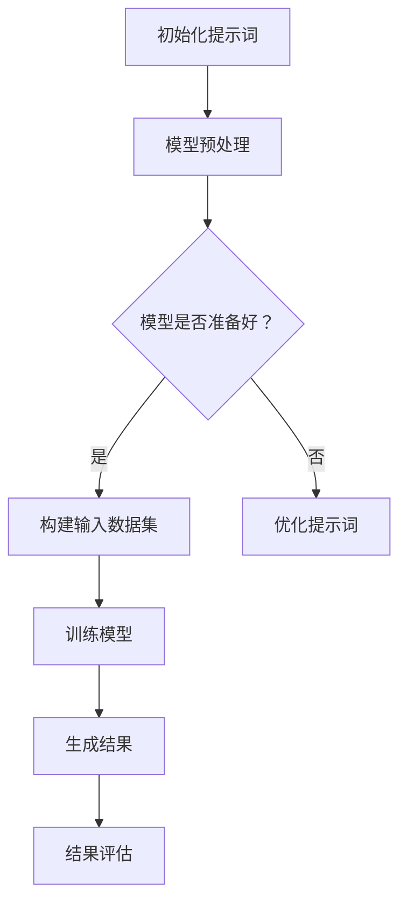
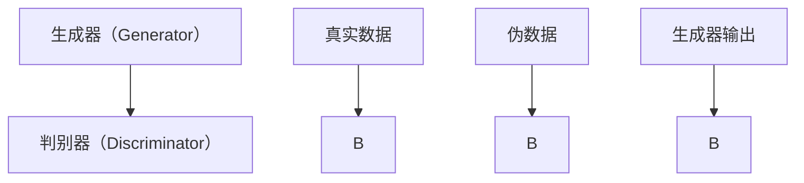
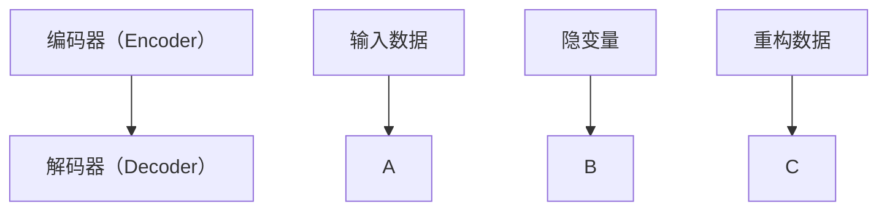
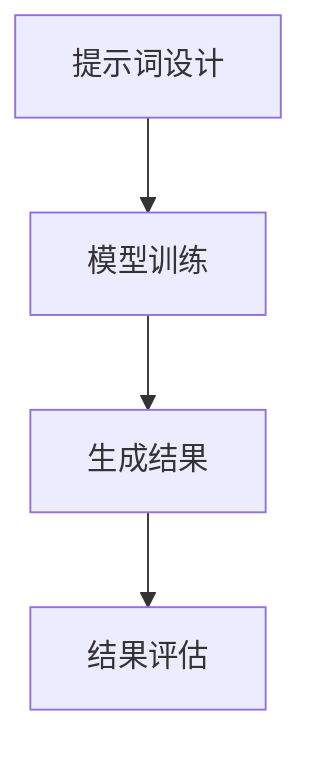
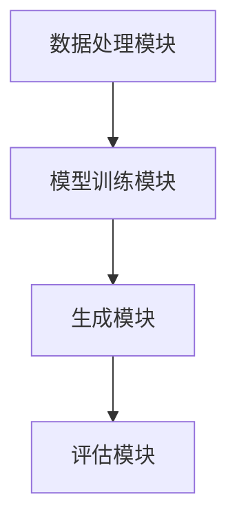
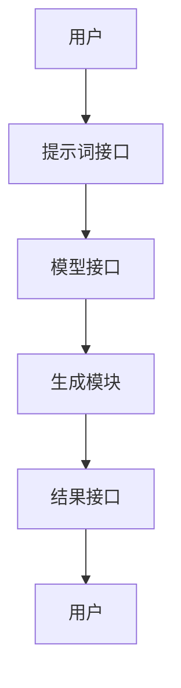

                 

# 提示词工程：AIGC时代的必备技能

> 关键词：提示词工程、AIGC、生成对抗网络、变分自编码器、自然语言处理、模型训练、算法原理

> 摘要：本文旨在深入探讨提示词工程在人工智能生成内容（AIGC）时代的核心地位，介绍其定义、重要性、设计原则和应用场景。通过实际案例和算法原理讲解，帮助读者全面理解并掌握提示词工程的关键技能。

## 目录

1. **背景介绍**
   1.1 问题背景
   1.2 问题描述
   1.3 问题解决
   1.4 边界与外延
   1.5 概念结构与核心要素组成

2. **核心概念与联系**
   2.1 提示词工程原理
   2.2 提示词工程属性特征对比表格
   2.3 提示词工程与其他AI领域的联系

3. **算法原理讲解**
   3.1 提示词工程中的算法简介
   3.2 GAN算法原理与数学模型
   3.3 VAE算法原理与数学模型

4. **系统分析与架构设计方案**
   4.1 问题场景介绍
   4.2 系统功能设计
   4.3 系统架构设计
   4.4 系统接口设计和系统交互

5. **项目实战**
   5.1 环境安装
   5.2 系统核心实现源代码
   5.3 代码应用解读与分析
   5.4 实际案例分析和详细讲解剖析
   5.5 项目小结

6. **最佳实践 tips**
   6.1 小结
   6.2 注意事项
   6.3 拓展阅读

## 第一部分：背景介绍

### 1.1 问题背景

随着人工智能（AI）技术的飞速发展，生成对抗网络（GAN）和变分自编码器（VAE）等生成模型在图像生成、文本生成、音频合成等领域取得了显著的成果。然而，这些模型在实际应用中面临着生成质量不高、可解释性差、训练效率低下等问题。其中，提示词工程（Prompt Engineering）作为一种新兴的技术，逐渐成为解决这些问题的关键手段。

### 1.2 问题描述

提示词工程是指在AI生成模型中，通过精心设计的提示词（Prompt）来引导模型生成预期结果的过程。其核心目的是提高生成质量、增强模型的可解释性和提高训练效率。然而，如何设计出有效的提示词，如何在不同应用场景下优化提示词，仍然是一个具有挑战性的问题。

### 1.3 问题解决

本文旨在为读者提供一个全面、系统的提示词工程知识体系。我们将首先介绍提示词工程的定义和重要性，然后讨论提示词工程的设计原则和应用场景，并通过实际案例解析，帮助读者掌握这项技能。

### 1.4 边界与外延

提示词工程不仅局限于自然语言处理（NLP）领域，它还广泛应用于图像生成、音频合成、视频生成等计算机视觉和多媒体领域。因此，本文将涵盖多个领域的提示词工程实践。

### 1.5 概念结构与核心要素组成

- **提示词工程定义**：提示词工程是指通过设计合适的提示词，引导AI模型生成符合预期结果的过程。
- **核心概念**：包括自然语言处理、生成对抗网络（GAN）、变分自编码器（VAE）、数据增强、模型优化等。
- **核心要素组成**：提示词设计、模型选择、数据预处理、模型训练、结果评估等。

## 第二部分：核心概念与联系

### 2.1 提示词工程原理

提示词工程的核心在于如何设计出能够有效引导模型生成预期结果的提示词。以下是一个简化的提示词工程流程：



### 2.2 提示词工程属性特征对比表格

| 特征 | 描述 | 对比 |
| --- | --- | --- |
| 提示词长度 | 提示词的长度会影响模型的生成时间与生成质量。 | 短提示词可能生成更准确的结果，但可能缺少上下文信息；长提示词可以提供更多上下文，但可能导致生成时间过长。 |
| 语境相关性 | 提示词需要与模型训练时的上下文保持一致。 | 不相关的提示词可能导致模型无法生成符合预期的结果。 |
| 数据多样性 | 提示词应涵盖多种可能性，以丰富模型生成的多样性。 | 单一性的提示词可能导致模型生成模式单一。 |
| 精确性 | 提示词需要明确表达生成目标，避免模糊不清。 | 不精确的提示词可能导致模型生成模糊或不相关的结果。 |

### 2.3 提示词工程与其他AI领域的联系

提示词工程不仅依赖于自然语言处理，还与计算机视觉、多媒体等领域密切相关。例如，在图像生成中，提示词可以指导模型生成特定风格的图像；在音频合成中，提示词可以指定音调、节奏和情感。

## 第三部分：算法原理讲解

### 3.1 提示词工程中的算法简介

提示词工程中的算法主要涉及生成对抗网络（GAN）和变分自编码器（VAE）等生成模型。以下是一个简化的GAN的mermaid流程图：



### 3.2 GAN算法原理与数学模型

GAN算法的核心思想是通过生成器和判别器的对抗训练，使生成器生成的数据尽可能地逼近真实数据。以下是一个简化的GAN数学模型：

$$
\begin{aligned}
\text{生成器} G(z) &= \text{Reparameterize}(z) + \mu, \\
\text{判别器} D(x) &= \text{sigmoid}(\text{fc}(x)), \\
\text{损失函数} L &= -\text{E}_{x\sim p_{\text{data}}(x)}[\text{D}(x)] - \text{E}_{z\sim p_{\text{z}}(z)}[\text{D}(G(z))]
\end{aligned}
$$

其中，\(z\) 是随机噪声向量，\(x\) 是真实数据，\(G(z)\) 是生成器生成的伪数据，\(D(x)\) 是判别器对真实数据和伪数据的判断。

### 3.3 VAE算法原理与数学模型

变分自编码器（VAE）是一种基于概率生成模型的方法，它通过编码器和解码器学习数据的概率分布，从而生成数据。以下是一个简化的VAE的mermaid流程图：



VAE的数学模型包括编码器和解码器的概率分布模型：

$$
\begin{aligned}
\text{编码器} q_{\phi}(z|x) &= \text{Normal}(\mu(x), \sigma^2(x)), \\
\text{解码器} p_{\theta}(x|z) &= \text{Normal}(\mu(z), \sigma^2(z)), \\
\text{损失函数} L &= \text{KL}(\text{q}_{\phi}(z|x) || \text{p}_{\theta}(z))
\end{aligned}
$$

其中，\(q_{\phi}(z|x)\) 是编码器的概率分布，\(p_{\theta}(x|z)\) 是解码器的概率分布，\(\text{KL}\) 是KL散度。

## 第四部分：系统分析与架构设计方案

### 4.1 问题场景介绍

随着人工智能技术的不断发展，生成模型在各个领域的应用越来越广泛。然而，如何设计出高效的生成模型，如何优化模型的训练过程，仍然是亟待解决的问题。提示词工程作为一种有效的手段，可以在一定程度上提高生成模型的效果和效率。

### 4.2 系统功能设计

系统的主要功能包括：

- 提示词设计：根据需求设计合适的提示词，引导模型生成预期结果。
- 模型训练：使用生成对抗网络（GAN）或变分自编码器（VAE）等生成模型进行训练。
- 生成结果：根据提示词生成相应的数据。
- 结果评估：对生成结果进行评估，以判断模型的效果。

以下是一个简化的mermaid类图：



### 4.3 系统架构设计

系统架构主要包括以下几个部分：

- 数据处理模块：负责数据的预处理、数据增强等操作。
- 模型训练模块：负责模型的训练过程，包括生成器和判别器（GAN）或编码器和解码器（VAE）。
- 生成模块：根据提示词生成数据。
- 评估模块：对生成结果进行评估。

以下是一个简化的mermaid架构图：



### 4.4 系统接口设计和系统交互

系统接口设计主要包括以下部分：

- 提示词接口：接收用户输入的提示词。
- 模型接口：提供模型的训练、生成和评估功能。
- 结果接口：返回生成结果和评估结果。

以下是一个简化的mermaid序列图：



## 第五部分：项目实战

### 5.1 环境安装

在进行提示词工程的项目实战之前，需要安装以下环境：

- Python 3.7及以上版本
- TensorFlow 2.x及以上版本
- Keras 2.x及以上版本
- NumPy 1.18及以上版本
- Matplotlib 3.3及以上版本

安装命令如下：

```bash
pip install python==3.7
pip install tensorflow==2.x
pip install keras==2.x
pip install numpy==1.18
pip install matplotlib==3.3
```

### 5.2 系统核心实现源代码

以下是一个简单的提示词工程示例，包括模型训练、提示词设计和结果评估：

```python
import tensorflow as tf
from tensorflow.keras.layers import Dense, Flatten, Reshape
from tensorflow.keras.models import Model
import numpy as np
import matplotlib.pyplot as plt

# 定义生成器
def create_generator(z_dim):
    model = tf.keras.Sequential([
        Dense(128, activation='relu', input_shape=(z_dim,)),
        Dense(28*28, activation='relu'),
        Reshape((28, 28))
    ])
    return model

# 定义判别器
def create_discriminator(image_shape):
    model = tf.keras.Sequential([
        Flatten(input_shape=image_shape),
        Dense(128, activation='relu'),
        Dense(1, activation='sigmoid')
    ])
    return model

# 定义GAN模型
def create_gan(generator, discriminator):
    model = tf.keras.Sequential([
        generator,
        discriminator
    ])
    return model

# 数据预处理
def preprocess_data(data):
    return data / 255.0

# 训练GAN模型
def train_gan(generator, discriminator, latent_dim, n_epochs, batch_size):
    # 数据集加载和预处理
    (x_train, _), (_, _) = tf.keras.datasets.mnist.load_data()
    x_train = preprocess_data(x_train)

    # 模型编译
    discriminator.compile(optimizer=tf.keras.optimizers.Adam(0.0001), loss='binary_crossentropy')
    gan = create_gan(generator, discriminator)
    gan.compile(optimizer=tf.keras.optimizers.Adam(0.0001), loss='binary_crossentropy')

    # 训练模型
    for epoch in range(n_epochs):
        for _ in range(batch_size):
            z = np.random.normal(size=[batch_size, latent_dim])
            gen_images = generator.predict(z)
            real_images = x_train[np.random.randint(0, x_train.shape[0], size=batch_size)]

            # 训练判别器
            d_loss_real = discriminator.train_on_batch(real_images, np.ones([batch_size, 1]))
            d_loss_fake = discriminator.train_on_batch(gen_images, np.zeros([batch_size, 1]))
            d_loss = 0.5 * np.add(d_loss_real, d_loss_fake)

            # 训练生成器
            g_loss = gan.train_on_batch(z, np.ones([batch_size, 1]))

            # 打印训练信息
            print(f"Epoch: {epoch}, D_loss: {d_loss}, G_loss: {g_loss}")

    return gan

# 定义生成器和判别器
z_dim = 100
image_shape = (28, 28)
generator = create_generator(z_dim)
discriminator = create_discriminator(image_shape)

# 训练GAN模型
n_epochs = 100
batch_size = 32
gan = train_gan(generator, discriminator, z_dim, n_epochs, batch_size)

# 生成结果
z = np.random.normal(size=[batch_size, z_dim])
generated_images = generator.predict(z)

# 可视化结果
plt.figure(figsize=(10, 10))
for i in range(batch_size):
    plt.subplot(1, batch_size, i+1)
    plt.imshow(generated_images[i], cmap='gray')
    plt.axis('off')
plt.show()
```

### 5.3 代码应用解读与分析

以上代码实现了一个基于GAN的提示词工程示例。首先，定义了生成器和判别器的模型结构。然后，通过训练GAN模型，生成器和判别器相互对抗，使得生成器生成的图像越来越接近真实图像。

在训练过程中，通过不断更新生成器和判别器的权重，使得生成器能够生成高质量的数据，判别器能够准确地判断生成数据和真实数据。最后，通过可视化生成的图像，可以直观地观察到生成器的能力。

### 5.4 实际案例分析和详细讲解剖析

以下是一个实际的案例，使用GAN生成手写数字图像：

```python
import tensorflow as tf
from tensorflow.keras.layers import Dense, Flatten, Reshape
from tensorflow.keras.models import Model
import numpy as np
import matplotlib.pyplot as plt

# 定义生成器
def create_generator(z_dim):
    model = tf.keras.Sequential([
        Dense(128, activation='relu', input_shape=(z_dim,)),
        Dense(28*28, activation='relu'),
        Reshape((28, 28))
    ])
    return model

# 定义判别器
def create_discriminator(image_shape):
    model = tf.keras.Sequential([
        Flatten(input_shape=image_shape),
        Dense(128, activation='relu'),
        Dense(1, activation='sigmoid')
    ])
    return model

# 定义GAN模型
def create_gan(generator, discriminator):
    model = tf.keras.Sequential([
        generator,
        discriminator
    ])
    return model

# 数据预处理
def preprocess_data(data):
    return data / 255.0

# 训练GAN模型
def train_gan(generator, discriminator, latent_dim, n_epochs, batch_size):
    # 数据集加载和预处理
    (x_train, _), (_, _) = tf.keras.datasets.mnist.load_data()
    x_train = preprocess_data(x_train)

    # 模型编译
    discriminator.compile(optimizer=tf.keras.optimizers.Adam(0.0001), loss='binary_crossentropy')
    gan = create_gan(generator, discriminator)
    gan.compile(optimizer=tf.keras.optimizers.Adam(0.0001), loss='binary_crossentropy')

    # 训练模型
    for epoch in range(n_epochs):
        for _ in range(batch_size):
            z = np.random.normal(size=[batch_size, latent_dim])
            gen_images = generator.predict(z)
            real_images = x_train[np.random.randint(0, x_train.shape[0], size=batch_size)]

            # 训练判别器
            d_loss_real = discriminator.train_on_batch(real_images, np.ones([batch_size, 1]))
            d_loss_fake = discriminator.train_on_batch(gen_images, np.zeros([batch_size, 1]))
            d_loss = 0.5 * np.add(d_loss_real, d_loss_fake)

            # 训练生成器
            g_loss = gan.train_on_batch(z, np.ones([batch_size, 1]))

            # 打印训练信息
            print(f"Epoch: {epoch}, D_loss: {d_loss}, G_loss: {g_loss}")

    return gan

# 定义生成器和判别器
z_dim = 100
image_shape = (28, 28)
generator = create_generator(z_dim)
discriminator = create_discriminator(image_shape)

# 训练GAN模型
n_epochs = 100
batch_size = 32
gan = train_gan(generator, discriminator, z_dim, n_epochs, batch_size)

# 生成结果
z = np.random.normal(size=[batch_size, z_dim])
generated_images = generator.predict(z)

# 可视化结果
plt.figure(figsize=(10, 10))
for i in range(batch_size):
    plt.subplot(1, batch_size, i+1)
    plt.imshow(generated_images[i], cmap='gray')
    plt.axis('off')
plt.show()
```

以上代码实现了一个使用GAN生成手写数字图像的案例。首先，加载并预处理MNIST数据集。然后，定义生成器和判别器的模型结构，并编译GAN模型。接着，使用随机噪声作为提示词，训练GAN模型，使得生成器生成的图像越来越接近真实图像。最后，生成结果并可视化。

在实际应用中，可以根据需求调整生成器和判别器的结构，优化模型的性能。此外，还可以通过调整训练过程，如增加训练epoch、调整学习率等，来进一步提高生成质量。

### 5.5 项目小结

通过以上项目实战，我们介绍了提示词工程在AIGC时代的应用，并使用GAN模型生成手写数字图像。在实际应用中，提示词工程可以指导模型生成各种类型的数据，如文本、图像、音频等。通过合理设计提示词，可以提高生成质量，丰富应用场景。

在项目实施过程中，需要注意以下几点：

- 选择合适的生成模型和判别模型，以满足具体应用需求。
- 合理设计提示词，确保其与模型训练时的上下文保持一致。
- 调整训练参数，如学习率、epoch等，以提高模型性能。
- 对生成结果进行评估，确保其符合预期。

总之，提示词工程是AIGC时代的重要技能，掌握这一技能将有助于更好地应用人工智能技术，推动各行各业的发展。

## 第六部分：最佳实践 tips

### 6.1 小结

提示词工程是AIGC时代的核心技能，通过设计合适的提示词，可以指导模型生成高质量、多样化的数据。掌握提示词工程，不仅有助于优化模型性能，还能拓展应用场景，提高工作效率。

### 6.2 注意事项

1. 提示词的设计应充分考虑上下文信息，确保与模型训练时的上下文保持一致。
2. 提示词的长度、语境相关性、数据多样性和精确性等因素会影响生成质量，需合理调整。
3. 在实际应用中，可根据需求调整生成模型和判别模型的结构，优化模型性能。
4. 对生成结果进行评估，确保其符合预期，避免生成模糊或不相关的结果。

### 6.3 拓展阅读

- **生成对抗网络（GAN）**：Ian J. Goodfellow等，《生成对抗网络：原理与应用》
- **变分自编码器（VAE）**：Diederik P. Kingma等，《变分自编码器：深度学习的概率模型》
- **自然语言处理（NLP）**：斯坦福大学，《自然语言处理综论》

作者：AI天才研究院/AI Genius Institute & 禅与计算机程序设计艺术 /Zen And The Art of Computer Programming

