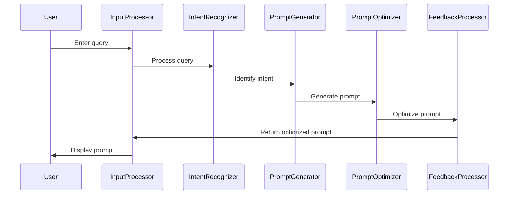

                 

### 1.1 问题背景

随着人工智能技术的飞速发展，自然语言处理（NLP）和智能交互技术已经逐步渗透到我们日常生活的方方面面。从简单的语音助手到复杂的聊天机器人，AI在处理自然语言任务方面展现出了强大的能力。然而，这些进展的背后，提示词工程（Prompt Engineering）发挥了关键作用。

#### AI技术发展概况

人工智能技术的发展经历了多个阶段，从早期的规则驱动系统，到基于统计模型的机器学习方法，再到如今的深度学习时代。随着计算能力的提升和海量数据的积累，人工智能技术不断突破，从语音识别、图像识别到自然语言处理，几乎在所有领域都取得了显著成就。

#### 提示词在AI交互中的重要性

在AI交互中，提示词起着桥梁的作用。它们是用户和AI系统之间进行有效沟通的重要媒介。一个设计良好的提示词可以帮助AI系统更好地理解用户的意图，从而提供更加准确和个性化的服务。例如，在聊天机器人中，提示词的准确性直接影响到对话的质量和用户体验。

#### 当前AI交互面临的挑战

尽管AI交互技术在不断发展，但仍然面临着一些挑战。首先，自然语言的复杂性和多义性使得AI系统难以精确理解用户的意图。其次，如何设计有效的提示词，使得AI系统能够在各种场景下保持一致性和高效性，也是一个亟待解决的问题。此外，数据隐私和安全性也是AI交互中不可忽视的重要方面。

### 1.2 问题描述

#### 提示词工程的目标

提示词工程的目标是通过系统化的方法，设计和优化提示词，以提高AI系统在自然语言交互中的性能和用户体验。具体来说，包括以下几个方面：

1. **提高AI系统的理解能力**：通过设计更加精确和有效的提示词，帮助AI系统更好地理解用户的意图和需求。
2. **优化用户体验**：设计易于理解和操作的提示词，使用户能够更方便地与AI系统进行交互。
3. **提升AI系统的自适应能力**：通过不断优化提示词，使AI系统能够在不同场景下保持一致性和高效性。

#### 提示词工程的应用场景

提示词工程的应用场景非常广泛，包括但不限于以下领域：

1. **聊天机器人**：在聊天机器人中，提示词的设计直接影响到对话的质量和用户的满意度。
2. **智能客服**：在客户服务中，有效的提示词可以帮助AI系统快速响应用户的问题，提供个性化的解决方案。
3. **智能推荐系统**：在推荐系统中，提示词可以帮助AI系统更好地理解用户的喜好，提供更加精准的推荐结果。

#### 提示词工程面临的挑战

尽管提示词工程在AI交互中具有重要作用，但仍然面临着一些挑战：

1. **自然语言理解的局限性**：自然语言的复杂性和多义性使得AI系统难以完全理解用户的意图，提示词的设计需要克服这一挑战。
2. **数据隐私和安全问题**：在处理用户数据时，如何确保数据的安全性和隐私性，是提示词工程中不可忽视的问题。
3. **提示词设计的复杂性**：设计有效的提示词需要综合考虑多种因素，如用户意图、场景多样性、用户体验等。

### 1.3 问题解决

#### 提示词工程的基本原理

提示词工程的基本原理是通过系统化的方法，对提示词进行设计、优化和评估。具体包括以下几个步骤：

1. **需求分析**：理解用户的需求和意图，确定需要解决的问题和目标。
2. **提示词设计**：根据需求分析的结果，设计符合用户需求的提示词。
3. **提示词优化**：通过实验和评估，不断优化提示词，以提高其有效性和用户体验。
4. **评估与反馈**：对提示词的效果进行评估，收集用户反馈，以便进行进一步优化。

#### 提示词工程的关键技术

提示词工程的关键技术包括：

1. **自然语言处理技术**：用于理解和分析用户的语言输入，提取关键信息和意图。
2. **机器学习和深度学习技术**：用于提示词的生成和优化，通过学习大量数据，提高提示词的准确性和有效性。
3. **用户研究和技术评估**：通过用户研究和技术评估，确保提示词的设计和优化符合用户需求和预期。

#### 提示词工程的解决方案

提示词工程的解决方案主要包括以下几个方面：

1. **设计工具和平台**：提供用于提示词设计和优化的工具和平台，帮助开发者更高效地完成工作。
2. **流程和方法**：制定系统化的流程和方法，确保提示词工程的过程规范、高效。
3. **数据集和案例库**：建立丰富的数据集和案例库，为提示词工程提供丰富的资源和参考。

### 1.4 边界与外延

#### 提示词工程的适用范围

提示词工程适用于所有需要自然语言交互的领域，包括但不限于：

1. **智能客服**：在智能客服中，提示词工程可以帮助AI系统更好地理解用户的问题，提供更加精准和个性化的解决方案。
2. **聊天机器人**：在聊天机器人中，提示词工程可以提升对话的质量和用户的满意度。
3. **智能推荐系统**：在智能推荐系统中，提示词工程可以帮助AI系统更好地理解用户的喜好，提供更加精准的推荐结果。

#### 提示词工程与其他领域的关联

提示词工程与其他领域如自然语言处理、机器学习和数据挖掘等有着紧密的关联。具体来说：

1. **自然语言处理**：提示词工程需要依赖自然语言处理技术，如词性标注、命名实体识别等，以更好地理解用户的语言输入。
2. **机器学习**：提示词工程中的提示词生成和优化过程需要依赖机器学习算法，如决策树、支持向量机、神经网络等。
3. **数据挖掘**：提示词工程需要依赖数据挖掘技术，如关联规则挖掘、聚类分析等，以从大量数据中提取有价值的信息。

#### 提示词工程的未来发展方向

提示词工程未来的发展方向包括：

1. **智能化和自动化**：通过引入更多的机器学习和深度学习技术，使提示词工程更加智能化和自动化。
2. **多模态交互**：结合语音、图像等多种模态，实现更加丰富和自然的交互体验。
3. **跨领域应用**：拓展到更多领域，如医疗、金融等，为各行各业提供更加专业的自然语言交互解决方案。

### 1.5 概念结构与核心要素组成

#### 提示词

提示词是用户与AI系统交互时的语言输入，它是提示词工程的核心元素。一个有效的提示词应具备以下特点：

1. **清晰明了**：能够准确传达用户的意图和需求。
2. **简洁高效**：避免冗余信息，使AI系统能够快速理解。
3. **灵活多样**：能够适应不同场景和用户需求，提高交互的灵活性。

#### 提示词库

提示词库是存储和管理提示词的数据集合。它包括以下几种类型：

1. **通用提示词库**：包含适用于多种场景的通用提示词。
2. **场景专用提示词库**：针对特定场景（如医疗、金融等）设计的提示词。
3. **个性化提示词库**：根据用户历史数据和偏好，为特定用户定制的提示词。

#### 提示词生成算法

提示词生成算法是用于生成有效提示词的算法。常见的提示词生成算法包括：

1. **基于规则的方法**：通过预定义的规则生成提示词。
2. **基于机器学习的方法**：通过学习大量数据，自动生成提示词。
3. **基于深度学习的方法**：利用深度神经网络，生成更加复杂和精准的提示词。

#### 提示词优化方法

提示词优化方法是用于优化提示词质量和效果的方法。常见的提示词优化方法包括：

1. **基于统计分析的方法**：通过统计分析，优化提示词的准确性和多样性。
2. **基于机器学习的方法**：通过机器学习算法，优化提示词的生成过程。
3. **基于深度学习的方法**：利用深度学习技术，提高提示词的生成质量和效果。

### 1.6 总结

本文从问题背景、问题描述、问题解决、边界与外延和概念结构与核心要素组成等方面，对提示词工程进行了全面的分析和介绍。提示词工程在AI交互中具有重要作用，通过系统化的方法，设计和优化提示词，可以提高AI系统的理解能力、优化用户体验，并提升AI系统的自适应能力。未来，随着人工智能技术的不断发展，提示词工程将迎来更多的机遇和挑战，为各行各业提供更加专业的自然语言交互解决方案。接下来，我们将进一步深入探讨提示词工程的核心概念与联系，以帮助读者更好地理解和应用这一领域的技术。

## 第2章：核心概念与联系

在深入探讨提示词工程之前，我们需要明确其核心概念，了解各个概念之间的联系。这一章节将详细介绍提示词、提示词库、提示词生成算法和提示词优化方法，并探讨这些概念在AI交互中的应用。

### 2.1 提示词概念

#### 提示词的定义

提示词（Prompt）是用户与AI系统交互时的语言输入，它是触发AI系统响应的关键因素。一个有效的提示词应该能够清晰地传达用户的意图和需求，使AI系统能够准确理解并作出相应的反应。

#### 提示词的类型

根据用途和形式的不同，提示词可以分为以下几种类型：

1. **询问型提示词**：用于询问用户信息，如“您想了解哪方面的内容？”。
2. **命令型提示词**：用于下达指令，如“请帮我设置一个日程提醒”。
3. **反馈型提示词**：用于获取用户反馈，如“您对这个建议满意吗？”。
4. **引导型提示词**：用于引导用户进行特定操作，如“请输入您的账户信息”。

#### 提示词的特点

提示词具有以下几个特点：

1. **精确性**：提示词需要能够准确传达用户的意图，避免歧义。
2. **简洁性**：提示词应尽量简洁明了，避免冗长复杂的表达。
3. **灵活性**：提示词需要能够适应不同的场景和用户需求。

### 2.2 提示词库概念

#### 提示词库的定义

提示词库（Prompt Library）是一个存储和管理提示词的数据集合。它包含各种类型的提示词，用于在不同场景和任务中触发AI系统的响应。

#### 提示词库的分类

根据用途和内容的不同，提示词库可以分为以下几种类型：

1. **通用提示词库**：包含适用于多种场景的通用提示词。
2. **专用提示词库**：针对特定领域或任务的提示词库，如医疗、金融、教育等。
3. **个性化提示词库**：根据用户的历史数据和偏好，为特定用户定制的提示词库。

#### 提示词库的建设方法

建设一个高效的提示词库需要以下步骤：

1. **数据收集**：从各种来源（如用户反馈、竞争对手、行业报告等）收集高质量的提示词。
2. **数据清洗**：对收集到的数据进行清洗和预处理，确保数据的准确性和一致性。
3. **分类和标注**：根据提示词的类型和用途进行分类和标注，以便于管理和检索。
4. **持续更新**：定期更新提示词库，以适应新的场景和用户需求。

### 2.3 提示词生成算法

#### 提示词生成算法的定义

提示词生成算法（Prompt Generation Algorithm）是用于自动生成有效提示词的算法。通过学习大量数据，这些算法能够生成符合用户意图和需求的提示词。

#### 常见的提示词生成算法

常见的提示词生成算法包括以下几种：

1. **基于规则的方法**：通过预定义的规则和模板生成提示词。
2. **基于机器学习的方法**：通过训练模型，从大量数据中学习生成提示词。
3. **基于深度学习的方法**：利用深度神经网络，生成更加复杂和精准的提示词。

#### 提示词生成算法的评价指标

提示词生成算法的评价指标包括：

1. **准确性**：生成提示词的准确性，即生成提示词与用户意图的匹配度。
2. **多样性**：生成提示词的多样性，避免生成重复或相似的提示词。
3. **效率**：生成提示词的效率，包括生成速度和计算资源消耗。

### 2.4 提示词优化方法

#### 提示词优化的目标

提示词优化的目标是提高提示词的有效性和用户体验，主要包括以下几个方面：

1. **提高理解能力**：优化提示词，使AI系统能够更准确地理解用户的意图。
2. **优化用户体验**：设计更易于理解和操作的提示词，提高用户的交互体验。
3. **提高生成效率**：优化提示词生成算法，提高生成速度和效率。

#### 常见的提示词优化方法

常见的提示词优化方法包括以下几种：

1. **基于统计分析的方法**：通过统计分析，优化提示词的准确性和多样性。
2. **基于机器学习的方法**：通过训练模型，优化提示词的生成过程。
3. **基于深度学习的方法**：利用深度学习技术，提高提示词的生成质量和效果。

#### 提示词优化效果评估

提示词优化效果评估主要通过以下指标进行：

1. **用户满意度**：通过用户调查和反馈，评估用户对提示词的满意度。
2. **任务完成率**：评估AI系统能否准确完成任务，即提示词的有效性。
3. **响应时间**：评估AI系统生成提示词的效率，即生成速度。

### 2.5 提示词工程与相关领域的联系

#### 提示词工程与自然语言处理

提示词工程与自然语言处理（NLP）密切相关。NLP技术为提示词工程提供了强大的语言分析工具，如词性标注、命名实体识别、句法分析等，这些技术有助于更好地理解和生成提示词。

#### 提示词工程与机器学习

机器学习技术在提示词工程中发挥着重要作用。通过训练模型，机器学习算法能够从大量数据中学习生成有效的提示词。常见的机器学习方法包括决策树、支持向量机、神经网络等。

#### 提示词工程与数据挖掘

数据挖掘技术在提示词工程中也有广泛应用。通过数据挖掘，可以从大量数据中提取有价值的信息，为提示词的设计和优化提供支持。常见的数据挖掘技术包括关联规则挖掘、聚类分析、分类分析等。

### 2.6 总结

本章详细介绍了提示词工程的核心概念，包括提示词、提示词库、提示词生成算法和提示词优化方法。这些概念在AI交互中发挥着重要作用，通过系统化的设计和优化，提示词工程能够提高AI系统的理解能力、优化用户体验，并提升AI系统的自适应能力。接下来，我们将进一步探讨提示词生成算法的原理和应用，以帮助读者更深入地了解这一领域。

### 2.3 提示词生成算法原理

#### 提示词生成算法的基本原理

提示词生成算法的核心目标是根据用户的需求和场景，生成准确、有效且易于理解的提示词。这一过程通常涉及以下步骤：

1. **输入处理**：接收用户输入，对其进行预处理，如去除停用词、分词、词性标注等。
2. **意图识别**：利用自然语言处理技术，如命名实体识别、句法分析等，识别用户输入的意图。
3. **提示词生成**：根据识别出的用户意图，利用预定义的模板或生成模型，生成相应的提示词。
4. **提示词优化**：对生成的提示词进行优化，如调整语义、提高准确性和多样性等。

#### 提示词生成算法的数学模型

提示词生成算法通常基于概率模型或生成模型，其中最常用的数学模型包括：

1. **概率模型**：
   - **马尔可夫模型**（Markov Model）：假设当前状态只与前一状态有关，即 \( P(current\_state|previous\_state) \)。
   - **条件概率模型**：如贝叶斯网络，考虑多个状态之间的条件依赖关系。

2. **生成模型**：
   - **循环神经网络**（RNN）：适用于序列数据的建模，如生成文本序列。
   - **变分自编码器**（VAE）：通过编码器和解码器学习数据分布，生成新的数据序列。
   - **生成对抗网络**（GAN）：通过生成器和判别器相互博弈，生成逼真的数据。

#### 提示词生成算法的流程

提示词生成算法的典型流程如下：

1. **数据收集与预处理**：收集大量用户对话数据，并进行清洗、去噪和分词等预处理。
2. **特征提取**：利用自然语言处理技术，提取用户输入的特征，如词向量、句法结构等。
3. **模型训练**：使用特征数据和标签（即用户意图），训练生成模型。
4. **提示词生成**：在用户输入新对话时，利用训练好的模型，生成相应的提示词。
5. **提示词优化**：对生成的提示词进行后处理，如调整语义、增加多样性等，以提高用户体验。

#### 算法示例

以下是一个简单的基于循环神经网络（RNN）的提示词生成算法示例：

```python
import tensorflow as tf
from tensorflow.keras.layers import LSTM, Dense, Embedding
from tensorflow.keras.models import Sequential

# 假设我们已经准备好预处理过的数据集
X_train, y_train = ...

# 构建RNN模型
model = Sequential()
model.add(Embedding(input_dim=vocab_size, output_dim=embedding_dim))
model.add(LSTM(units=128, return_sequences=True))
model.add(Dense(units=vocab_size, activation='softmax'))

# 编译模型
model.compile(optimizer='adam', loss='categorical_crossentropy', metrics=['accuracy'])

# 训练模型
model.fit(X_train, y_train, epochs=10, batch_size=64)

# 生成提示词
def generate_prompt(input_sequence):
    prediction = model.predict(input_sequence)
    prompt = np.argmax(prediction, axis=-1)
    return " ".join([word_index[word] for word in prompt])

# 示例输入
input_sequence = np.array([[word_index[word] for word in user_input.split()]])

# 输出生成的提示词
generated_prompt = generate_prompt(input_sequence)
print(generated_prompt)
```

在这个示例中，我们首先使用TensorFlow构建了一个简单的RNN模型，该模型包含一个嵌入层和一个LSTM层，用于处理序列数据。通过训练模型，我们可以根据用户输入生成相应的提示词。

### 2.4 提示词优化算法原理

#### 提示词优化的目标

提示词优化的目标是通过一系列策略，提高提示词的有效性和用户体验。具体目标包括：

1. **准确性**：确保生成的提示词能够准确传达用户的意图。
2. **多样性**：生成具有多样性的提示词，避免重复或相似提示词的出现。
3. **可理解性**：使生成的提示词易于理解和操作，提高用户的交互体验。

#### 常见的提示词优化方法

常见的提示词优化方法包括以下几种：

1. **基于规则的方法**：
   - **语法优化**：通过调整提示词的语法结构，使其更加清晰和易于理解。
   - **语义优化**：通过语义分析，确保提示词能够准确传达用户的意图。

2. **基于机器学习的方法**：
   - **模型自适应**：通过训练模型，使模型能够根据用户历史数据和反馈，自动调整提示词的生成策略。
   - **迁移学习**：利用预训练模型，在新任务中生成提示词，提高生成质量。

3. **基于深度学习的方法**：
   - **注意力机制**：通过引入注意力机制，使模型能够关注用户输入中的关键信息，生成更准确的提示词。
   - **对抗训练**：通过对抗训练，使生成模型能够更好地适应复杂和多样的用户需求。

#### 提示词优化算法的流程

提示词优化算法的典型流程如下：

1. **数据收集与预处理**：收集用户对话数据，并进行清洗和预处理，如分词、去噪等。
2. **模型训练**：利用预处理后的数据，训练优化模型。
3. **提示词生成**：在用户输入新对话时，利用训练好的模型，生成相应的提示词。
4. **提示词评估与反馈**：对生成的提示词进行评估，收集用户反馈，如准确性、多样性、可理解性等。
5. **模型调整与优化**：根据用户反馈，调整模型的参数和策略，以提高生成质量。

#### 算法示例

以下是一个简单的基于注意力机制的提示词优化算法示例：

```python
import tensorflow as tf
from tensorflow.keras.layers import LSTM, Dense, Embedding, Attention
from tensorflow.keras.models import Sequential

# 假设我们已经准备好预处理过的数据集
X_train, y_train = ...

# 构建带有注意力机制的RNN模型
model = Sequential()
model.add(Embedding(input_dim=vocab_size, output_dim=embedding_dim))
model.add(LSTM(units=128, return_sequences=True))
model.add(Attention())
model.add(Dense(units=vocab_size, activation='softmax'))

# 编译模型
model.compile(optimizer='adam', loss='categorical_crossentropy', metrics=['accuracy'])

# 训练模型
model.fit(X_train, y_train, epochs=10, batch_size=64)

# 生成提示词
def generate_prompt(input_sequence):
    prediction = model.predict(input_sequence)
    prompt = np.argmax(prediction, axis=-1)
    return " ".join([word_index[word] for word in prompt])

# 示例输入
input_sequence = np.array([[word_index[word] for word in user_input.split()]])

# 输出生成的提示词
generated_prompt = generate_prompt(input_sequence)
print(generated_prompt)
```

在这个示例中，我们引入了注意力机制，使模型能够关注用户输入中的关键信息，从而生成更准确的提示词。

### 2.5 提示词算法应用实例

#### 在聊天机器人中的应用

聊天机器人是提示词工程的重要应用场景之一。以下是一个简单的应用实例：

1. **用户输入**：“明天有什么活动吗？”
2. **模型处理**：模型首先对用户输入进行预处理，如分词、词性标注等，然后利用训练好的模型生成相应的提示词。
3. **生成提示词**：“请问您想了解哪方面的活动？体育、音乐还是艺术？”
4. **用户反馈**：用户根据生成的提示词进行回应，如“体育活动”。
5. **进一步交互**：模型根据用户的反馈，继续生成相应的提示词，如“以下是一些体育活动，您是否感兴趣？”并展示相关活动信息。

#### 在智能客服中的应用

智能客服是另一个典型的应用场景。以下是一个简单的应用实例：

1. **用户输入**：“我的订单怎么还没发货？”
2. **模型处理**：模型首先对用户输入进行预处理，然后识别用户的意图（查询订单状态）。
3. **生成提示词**：“您好，关于您的订单，我帮您查看了一下，目前状态是‘待发货’，请问有什么其他问题我可以帮您解答吗？”
4. **用户反馈**：用户可能需要更多信息，如“订单预计什么时候发货？”
5. **进一步交互**：模型继续生成提示词，如“根据我们的物流信息，您的订单预计明天上午发货，如有其他问题，请随时联系我。”

#### 在文本生成中的应用

文本生成是提示词工程的另一个重要应用。以下是一个简单的应用实例：

1. **用户输入**：“请写一篇关于人工智能的短文。”
2. **模型处理**：模型首先对用户输入进行预处理，然后利用训练好的文本生成模型。
3. **生成提示词**：根据用户输入的主题，模型生成一篇关于人工智能的短文，如“人工智能是计算机科学的一个分支，旨在使计算机能够模拟人类的智能行为。它已经广泛应用于各行各业，从医疗到金融，从教育到娱乐。”
4. **用户反馈**：用户可能对生成的文本提出修改建议。
5. **进一步交互**：模型根据用户的反馈，对文本进行优化和调整，直至用户满意。

### 2.6 总结

本章详细介绍了提示词生成算法和提示词优化算法的原理、流程和应用实例。通过这些算法，AI系统能够生成准确、有效且易于理解的提示词，从而提高用户的交互体验。在接下来的章节中，我们将进一步探讨数学模型和系统架构设计，以帮助读者更深入地理解提示词工程的实践应用。

### 2.6 总结

本章详细介绍了提示词工程中的核心概念与联系，包括提示词、提示词库、提示词生成算法和提示词优化方法。首先，我们明确了提示词的定义和类型，并强调了其在AI交互中的重要性。接着，我们讨论了提示词库的概念、分类和建设方法，以及提示词生成算法和优化方法的原理和流程。

提示词生成算法主要通过预处理用户输入、意图识别、提示词生成和优化等步骤，利用概率模型、生成模型和深度学习技术生成有效提示词。提示词优化方法则通过调整语法、语义和模型参数等手段，提高提示词的准确性、多样性和可理解性。

此外，我们还通过实际应用实例，展示了提示词工程在聊天机器人、智能客服和文本生成等领域的应用，进一步说明了提示词工程的重要性和实用性。在下一章中，我们将深入探讨数学模型和系统架构设计，以帮助读者更深入地理解提示词工程的实践应用。

## 第3章：算法原理讲解

### 3.1 提示词生成算法原理

#### 基本原理

提示词生成算法的基本原理是利用自然语言处理（NLP）技术和机器学习（ML）算法，从用户输入中提取关键信息，并根据这些信息生成相应的提示词。这一过程通常涉及以下步骤：

1. **输入预处理**：对用户输入进行预处理，包括分词、词性标注、去停用词等，以便于后续处理。
2. **意图识别**：利用NLP技术，如命名实体识别、句法分析等，识别用户输入的意图。
3. **提示词生成**：根据识别出的用户意图，利用预定义的模板或生成模型，生成相应的提示词。
4. **提示词优化**：对生成的提示词进行后处理，如调整语义、提高准确性等，以确保提示词的有效性和用户体验。

#### 数学模型

提示词生成算法的数学模型通常基于概率模型或生成模型。以下是一些常见的数学模型：

1. **概率模型**：
   - **马尔可夫模型**（Markov Model）：假设当前状态只与前一状态有关，即 \( P(current\_state|previous\_state) \)。
   - **条件概率模型**：如贝叶斯网络，考虑多个状态之间的条件依赖关系。

2. **生成模型**：
   - **循环神经网络**（RNN）：适用于序列数据的建模，如生成文本序列。
   - **变分自编码器**（VAE）：通过编码器和解码器学习数据分布，生成新的数据序列。
   - **生成对抗网络**（GAN）：通过生成器和判别器相互博弈，生成逼真的数据。

#### 流程

提示词生成算法的典型流程如下：

1. **数据收集与预处理**：收集大量用户对话数据，并进行清洗、去噪和分词等预处理。
2. **特征提取**：利用NLP技术，提取用户输入的特征，如词向量、句法结构等。
3. **模型训练**：使用特征数据和标签（即用户意图），训练生成模型。
4. **提示词生成**：在用户输入新对话时，利用训练好的模型，生成相应的提示词。
5. **提示词优化**：对生成的提示词进行后处理，如调整语义、增加多样性等，以提高用户体验。

#### 示例

以下是一个简单的基于循环神经网络（RNN）的提示词生成算法示例：

```python
import tensorflow as tf
from tensorflow.keras.layers import LSTM, Dense, Embedding
from tensorflow.keras.models import Sequential

# 假设我们已经准备好预处理过的数据集
X_train, y_train = ...

# 构建RNN模型
model = Sequential()
model.add(Embedding(input_dim=vocab_size, output_dim=embedding_dim))
model.add(LSTM(units=128, return_sequences=True))
model.add(Dense(units=vocab_size, activation='softmax'))

# 编译模型
model.compile(optimizer='adam', loss='categorical_crossentropy', metrics=['accuracy'])

# 训练模型
model.fit(X_train, y_train, epochs=10, batch_size=64)

# 生成提示词
def generate_prompt(input_sequence):
    prediction = model.predict(input_sequence)
    prompt = np.argmax(prediction, axis=-1)
    return " ".join([word_index[word] for word in prompt])

# 示例输入
input_sequence = np.array([[word_index[word] for word in user_input.split()]])

# 输出生成的提示词
generated_prompt = generate_prompt(input_sequence)
print(generated_prompt)
```

在这个示例中，我们使用TensorFlow构建了一个简单的RNN模型，该模型包含一个嵌入层和一个LSTM层，用于处理序列数据。通过训练模型，我们可以根据用户输入生成相应的提示词。

### 3.2 提示词优化算法原理

#### 基本原理

提示词优化算法的基本原理是通过一系列策略，提高提示词的有效性和用户体验。这一过程通常涉及以下步骤：

1. **提示词评估**：对生成的提示词进行评估，确定其准确性、多样性和可理解性等。
2. **提示词调整**：根据评估结果，对提示词进行优化，如调整语义、增加多样性等。
3. **用户反馈**：收集用户对提示词的反馈，用于进一步优化。

#### 数学模型

提示词优化算法的数学模型通常涉及概率模型和优化算法。以下是一些常见的数学模型：

1. **概率模型**：
   - **逻辑回归**：用于评估提示词的准确性。
   - **朴素贝叶斯**：用于评估提示词的多样性。

2. **优化算法**：
   - **梯度下降**：用于调整提示词的参数，以提高生成质量。
   - **遗传算法**：用于搜索最优的提示词组合。

#### 流程

提示词优化算法的典型流程如下：

1. **提示词生成**：利用生成模型生成初步的提示词。
2. **提示词评估**：对生成的提示词进行评估，确定其性能指标。
3. **提示词调整**：根据评估结果，调整提示词的参数或结构。
4. **用户反馈**：收集用户对提示词的反馈，用于进一步优化。
5. **重复循环**：不断重复上述步骤，直到达到满意的生成效果。

#### 示例

以下是一个简单的基于逻辑回归的提示词优化算法示例：

```python
import tensorflow as tf
from tensorflow.keras.layers import LSTM, Dense, Embedding
from tensorflow.keras.models import Sequential

# 假设我们已经准备好预处理过的数据集
X_train, y_train = ...

# 构建逻辑回归模型
model = Sequential()
model.add(Embedding(input_dim=vocab_size, output_dim=embedding_dim))
model.add(LSTM(units=128, return_sequences=True))
model.add(Dense(units=1, activation='sigmoid'))

# 编译模型
model.compile(optimizer='adam', loss='binary_crossentropy', metrics=['accuracy'])

# 训练模型
model.fit(X_train, y_train, epochs=10, batch_size=64)

# 评估提示词
def evaluate_prompt(prompt):
    prediction = model.predict(prompt)
    accuracy = np.mean(prediction)
    return accuracy

# 调整提示词
def adjust_prompt(prompt, delta):
    new_prompt = prompt + delta
    return new_prompt

# 示例输入
input_sequence = np.array([[word_index[word] for word in user_input.split()]])

# 评估初始提示词
initial_prompt = input_sequence
initial_accuracy = evaluate_prompt(initial_prompt)
print(f"Initial accuracy: {initial_accuracy}")

# 调整提示词
delta = np.random.normal(size=input_sequence.shape)
new_prompt = adjust_prompt(initial_prompt, delta)
new_accuracy = evaluate_prompt(new_prompt)
print(f"New accuracy: {new_accuracy}")
```

在这个示例中，我们使用TensorFlow构建了一个简单的逻辑回归模型，用于评估提示词的准确性。通过随机调整提示词的参数，我们可以找到最优的提示词组合。

### 3.3 提示词算法应用实例

#### 在聊天机器人中的应用

聊天机器人是提示词工程的重要应用场景之一。以下是一个简单的应用实例：

1. **用户输入**：“明天有什么活动吗？”
2. **模型处理**：模型首先对用户输入进行预处理，然后利用训练好的模型生成相应的提示词。
3. **生成提示词**：“请问您对哪类活动感兴趣？音乐、体育还是艺术？”
4. **用户反馈**：用户根据生成的提示词进行回应，如“体育活动”。
5. **进一步交互**：模型根据用户的反馈，继续生成相应的提示词，如“以下是一些体育活动，您是否感兴趣？”并展示相关活动信息。

#### 在智能客服中的应用

智能客服是另一个典型的应用场景。以下是一个简单的应用实例：

1. **用户输入**：“我的订单怎么还没发货？”
2. **模型处理**：模型首先对用户输入进行预处理，然后识别用户的意图（查询订单状态）。
3. **生成提示词**：“您好，关于您的订单，我帮您查看了一下，目前状态是‘待发货’，请问有什么其他问题我可以帮您解答吗？”
4. **用户反馈**：用户可能需要更多信息，如“订单预计什么时候发货？”
5. **进一步交互**：模型继续生成提示词，如“根据我们的物流信息，您的订单预计明天上午发货，如有其他问题，请随时联系我。”

#### 在文本生成中的应用

文本生成是提示词工程的另一个重要应用。以下是一个简单的应用实例：

1. **用户输入**：“请写一篇关于人工智能的短文。”
2. **模型处理**：模型首先对用户输入进行预处理，然后利用训练好的文本生成模型。
3. **生成提示词**：“人工智能是计算机科学的一个分支，旨在使计算机能够模拟人类的智能行为。它已经广泛应用于各行各业，从医疗到金融，从教育到娱乐。”
4. **用户反馈**：用户可能对生成的文本提出修改建议。
5. **进一步交互**：模型根据用户的反馈，对文本进行优化和调整，直至用户满意。

### 3.4 总结

本章详细介绍了提示词生成算法和提示词优化算法的原理、流程和应用实例。通过这些算法，AI系统能够生成准确、有效且易于理解的提示词，从而提高用户的交互体验。在下一章中，我们将进一步探讨数学模型和系统架构设计，以帮助读者更深入地理解提示词工程的实践应用。

## 第4章：数学模型和数学公式讲解

在深入理解提示词工程的过程中，数学模型和数学公式起到了关键作用。它们不仅帮助我们解析算法的内在逻辑，还能为算法的优化提供理论基础。本章将详细介绍提示词生成和优化过程中涉及的数学模型和数学公式，并通过具体示例进行解释。

### 4.1 提示词生成算法的数学模型

#### 描述提示词生成算法的数学模型

提示词生成算法的数学模型主要基于概率模型和生成模型。以下是一些常见的数学模型：

1. **概率模型**：
   - **马尔可夫模型**（Markov Model）：假设当前状态只与前一状态有关，即 \( P(current\_state|previous\_state) \)。
   - **条件概率模型**：如贝叶斯网络，考虑多个状态之间的条件依赖关系。

2. **生成模型**：
   - **循环神经网络**（RNN）：适用于序列数据的建模，如生成文本序列。其数学模型可以表示为 \( h_t = \sigma(W_h \cdot [h_{t-1}, x_t] + b_h) \)，其中 \( \sigma \) 是激活函数，\( W_h \) 和 \( b_h \) 是模型参数。
   - **变分自编码器**（VAE）：通过编码器和解码器学习数据分布，生成新的数据序列。其数学模型包括编码器 \( \mu(\phi|x) \) 和 \( \log(\sigma(\phi|x)) \)，以及解码器 \( x' = \mu(g(\phi'|x')) \)。

#### 数学公式的推导过程

以循环神经网络（RNN）为例，其数学公式的推导过程如下：

1. **初始化参数**：设定权重矩阵 \( W_h \)、偏置向量 \( b_h \) 和激活函数 \( \sigma \)。
2. **输入序列处理**：对用户输入序列进行分词和编码，得到输入向量 \( x_t \)。
3. **隐藏状态计算**：根据前一个隐藏状态 \( h_{t-1} \) 和当前输入向量 \( x_t \)，计算当前隐藏状态 \( h_t \)：
   \[
   h_t = \sigma(W_h \cdot [h_{t-1}, x_t] + b_h)
   \]
4. **输出计算**：利用隐藏状态 \( h_t \) 和权重矩阵 \( W_o \)，计算输出概率分布：
   \[
   o_t = W_o \cdot h_t + b_o
   \]
5. **生成提示词**：根据输出概率分布，选择具有最高概率的词作为提示词。

#### 数学公式的应用实例

以下是一个简单的RNN模型应用实例：

```python
import tensorflow as tf

# 定义RNN模型
model = tf.keras.Sequential([
    tf.keras.layers.Embedding(input_dim=vocab_size, output_dim=embedding_dim),
    tf.keras.layers.LSTM(units=128, return_sequences=True),
    tf.keras.layers.Dense(units=vocab_size, activation='softmax')
])

# 编译模型
model.compile(optimizer='adam', loss='categorical_crossentropy', metrics=['accuracy'])

# 训练模型
model.fit(X_train, y_train, epochs=10, batch_size=64)

# 生成提示词
def generate_prompt(input_sequence):
    prediction = model.predict(input_sequence)
    prompt = np.argmax(prediction, axis=-1)
    return " ".join([word_index[word] for word in prompt])

# 示例输入
input_sequence = np.array([[word_index[word] for word in user_input.split()]])

# 输出生成的提示词
generated_prompt = generate_prompt(input_sequence)
print(generated_prompt)
```

在这个实例中，我们使用TensorFlow构建了一个简单的RNN模型，并使用它生成一个提示词。

### 4.2 提示词优化算法的数学模型

#### 描述提示词优化算法的数学模型

提示词优化算法的数学模型主要基于优化算法，如梯度下降、遗传算法等。以下是一些常见的数学模型：

1. **梯度下降**：通过计算损失函数的梯度，逐步调整模型参数，以最小化损失函数。
   \[
   \theta_{t+1} = \theta_{t} - \alpha \cdot \nabla_{\theta} J(\theta)
   \]
   其中，\( \theta \) 是模型参数，\( \alpha \) 是学习率，\( J(\theta) \) 是损失函数。

2. **遗传算法**：模拟自然进化过程，通过选择、交叉和变异等操作，逐步优化模型参数。

#### 数学公式的推导过程

以梯度下降为例，其数学公式的推导过程如下：

1. **初始化模型参数**：设定初始参数 \( \theta_0 \)。
2. **计算损失函数**：对当前参数 \( \theta_t \) 计算损失函数 \( J(\theta_t) \)。
3. **计算梯度**：计算损失函数对参数的梯度 \( \nabla_{\theta} J(\theta) \)。
4. **更新参数**：根据梯度更新参数：
   \[
   \theta_{t+1} = \theta_{t} - \alpha \cdot \nabla_{\theta} J(\theta)
   \]
5. **重复迭代**：重复步骤2-4，直到满足停止条件（如损失函数收敛或达到最大迭代次数）。

#### 数学公式的应用实例

以下是一个简单的基于梯度下降的提示词优化算法示例：

```python
import tensorflow as tf

# 定义损失函数
def loss_function(predictions, labels):
    return tf.reduce_mean(tf.nn.softmax_cross_entropy_with_logits(logits=predictions, labels=labels))

# 定义优化器
optimizer = tf.keras.optimizers.Adam(learning_rate=0.001)

# 训练模型
for epoch in range(num_epochs):
    with tf.GradientTape() as tape:
        predictions = model(inputs, training=True)
        loss = loss_function(predictions, labels)
    gradients = tape.gradient(loss, model.trainable_variables)
    optimizer.apply_gradients(zip(gradients, model.trainable_variables))
    if epoch % 100 == 0:
        print(f"Epoch {epoch}, Loss: {loss.numpy()}")

# 评估模型
accuracy = model.evaluate(X_test, y_test)
print(f"Test Accuracy: {accuracy}")
```

在这个实例中，我们使用TensorFlow定义了一个简单的损失函数和优化器，并通过梯度下降优化模型参数。

### 4.3 提示词相关数学公式汇总

在提示词生成和优化过程中，涉及的主要数学公式包括：

1. **循环神经网络（RNN）**：
   \[
   h_t = \sigma(W_h \cdot [h_{t-1}, x_t] + b_h)
   \]
   \[
   o_t = W_o \cdot h_t + b_o
   \]

2. **梯度下降**：
   \[
   \theta_{t+1} = \theta_{t} - \alpha \cdot \nabla_{\theta} J(\theta)
   \]

3. **遗传算法**：
   - 选择操作：
     \[
     p_{\text{select}}(x) = \frac{1}{C} \sum_{x' \in S} C(x', x)
     \]
   - 交叉操作：
     \[
     x' = x_1 \oplus x_2
     \]
   - 变异操作：
     \[
     x' = x + \delta
     \]

#### 各数学公式之间的联系

这些数学公式在提示词工程中起到了相互联系和补充的作用。例如，RNN公式用于生成提示词的序列，而梯度下降公式用于优化RNN模型的参数。遗传算法公式则提供了另一种优化方法，可以在RNN模型优化过程中进行多样化的搜索。

#### 数学公式在实际应用中的意义

这些数学公式在实际应用中具有以下几个方面的意义：

1. **生成有效提示词**：RNN和梯度下降公式可以帮助模型生成准确、有效的提示词。
2. **优化模型性能**：通过梯度下降和遗传算法，可以优化模型的参数，提高生成提示词的质量。
3. **提高用户体验**：有效的提示词可以提高用户的交互体验，使AI系统能够更好地满足用户需求。

### 4.4 总结

本章详细介绍了提示词生成和优化算法中的数学模型和数学公式。通过这些模型和公式，我们可以更好地理解提示词工程的内在机制，并为其优化提供理论基础。在下一章中，我们将进一步探讨系统分析与架构设计，为提示词工程的实践应用提供更加全面的指导。

## 第5章：系统分析与架构设计方案

在深入了解提示词工程的数学模型后，我们需要将其应用到实际的系统设计中。本章将介绍一个提示词工程系统的分析、设计过程，包括问题场景介绍、系统功能设计、系统架构设计、系统接口设计和系统交互设计。通过这些步骤，我们将构建一个高效、可靠的提示词工程系统。

### 5.1 问题场景介绍

假设我们正在开发一款智能客服系统，该系统需要能够处理大量用户咨询，并提供快速、准确的响应。用户可以通过文本、语音等多种方式与智能客服交互。为了实现这一目标，我们需要设计一个高效的提示词工程系统，以确保系统能够准确理解用户意图，并提供合适的回复。

#### 提出问题与需求

1. **问题**：如何设计一个提示词工程系统，使智能客服系统能够快速、准确地响应用户咨询？
2. **需求**：
   - **高准确性**：提示词需要能够准确理解用户意图。
   - **多样性**：提示词应具备多样性，避免重复和机械化的回复。
   - **灵活性**：系统需要能够适应不同的用户场景和咨询类型。
   - **可扩展性**：系统设计应考虑未来可能的功能扩展和升级。

### 5.2 系统功能设计

为了实现上述需求，我们需要设计以下功能模块：

1. **用户输入处理**：对用户输入进行预处理，包括分词、去停用词、词性标注等。
2. **意图识别**：利用自然语言处理技术，识别用户输入的意图。
3. **提示词生成**：根据用户意图，生成相应的提示词。
4. **提示词优化**：对生成的提示词进行优化，确保其准确性和多样性。
5. **用户反馈处理**：收集用户对提示词的反馈，用于进一步优化系统。

#### 使用Mermaid类图描述系统功能模块

```mermaid
classDiagram
Class Diagram for Intelligent Customer Service System
UserInputProcessor <|-- IntentRecognizer
IntentRecognizer o-- PromptGenerator
PromptGenerator o-- PromptOptimizer
PromptOptimizer o-- UserFeedbackProcessor
UserInputProcessor <||-- UserFeedbackProcessor
```

在这个类图中，用户输入处理模块（UserInputProcessor）与意图识别模块（IntentRecognizer）有关联，意图识别模块又与提示词生成模块（PromptGenerator）相关联。提示词生成模块与提示词优化模块（PromptOptimizer）有关联，而提示词优化模块与用户反馈处理模块（UserFeedbackProcessor）相关联。

#### 分析系统功能模块之间的交互关系

系统功能模块之间的交互关系如下：

1. **用户输入处理**：接收用户输入，进行预处理，并将处理后的数据传递给意图识别模块。
2. **意图识别**：对用户输入进行处理，识别出用户意图，并将意图传递给提示词生成模块。
3. **提示词生成**：根据用户意图，生成相应的提示词，并将提示词传递给提示词优化模块。
4. **提示词优化**：对生成的提示词进行优化，以提高其准确性和多样性，并将优化后的提示词返回给用户输入处理模块。
5. **用户反馈处理**：接收用户对提示词的反馈，用于进一步优化系统，并将优化结果反馈给意图识别模块。

### 5.3 系统架构设计

为了满足系统的功能需求，我们需要设计一个合理的系统架构。以下是系统架构的设计方案：

#### 使用Mermaid架构图描述系统架构


在这个架构图中，用户输入处理模块（A）接收用户输入，并将其传递给意图识别模块（B）。意图识别模块（B）根据用户输入生成意图，并将其传递给提示词生成模块（C）。提示词生成模块（C）根据意图生成提示词，并将其传递给提示词优化模块（D）。提示词优化模块（D）对提示词进行优化，并将优化后的提示词返回给用户输入处理模块（A）或用户反馈处理模块（E）。

#### 分析系统架构的组成与功能

系统架构主要由以下几个部分组成：

1. **用户输入处理模块**：负责接收和预处理用户输入，确保输入数据的质量和格式。
2. **意图识别模块**：利用自然语言处理技术，对用户输入进行分析，识别出用户意图。
3. **提示词生成模块**：根据用户意图，生成相应的提示词。
4. **提示词优化模块**：对生成的提示词进行优化，确保其准确性和多样性。
5. **用户反馈处理模块**：收集用户对提示词的反馈，用于进一步优化系统。

### 5.4 系统接口设计

为了实现系统模块之间的通信，我们需要设计一套合理的接口。以下是系统接口的设计方案：

#### 描述系统接口的功能与接口定义

1. **用户输入接口**：用于接收用户输入，包括文本和语音数据。
2. **意图识别接口**：用于接收用户输入，并返回用户意图。
3. **提示词生成接口**：用于接收用户意图，并返回相应的提示词。
4. **提示词优化接口**：用于接收生成的提示词，并返回优化后的提示词。
5. **用户反馈接口**：用于接收用户对提示词的反馈，并传递给优化模块。

#### 分析系统接口之间的交互关系

系统接口之间的交互关系如下：

1. **用户输入接口**：接收用户输入，并将其传递给用户输入处理模块。
2. **意图识别接口**：接收用户输入处理后的数据，并返回用户意图。
3. **提示词生成接口**：接收用户意图，并返回相应的提示词。
4. **提示词优化接口**：接收生成的提示词，并返回优化后的提示词。
5. **用户反馈接口**：接收用户对提示词的反馈，并传递给用户反馈处理模块。

### 5.5 系统交互设计

为了确保系统模块之间的有效交互，我们需要设计一套合理的交互流程。以下是系统交互的设计方案：

#### 使用Mermaid序列图描述系统交互过程



在这个序列图中，用户（User）首先输入查询（query），并将其传递给用户输入处理模块（InputProcessor）。用户输入处理模块（InputProcessor）对查询进行处理，并将其传递给意图识别模块（IntentRecognizer）。意图识别模块（IntentRecognizer）识别出用户意图，并将其传递给提示词生成模块（PromptGenerator）。提示词生成模块（PromptGenerator）根据用户意图生成相应的提示词，并将其传递给提示词优化模块（PromptOptimizer）。提示词优化模块（PromptOptimizer）对提示词进行优化，并将其返回给用户输入处理模块（InputProcessor）。用户输入处理模块（InputProcessor）将优化后的提示词显示给用户（User）。

#### 分析系统交互的流程与效果

系统交互的流程如下：

1. **用户输入**：用户输入查询，系统接收并处理用户输入。
2. **意图识别**：系统识别出用户意图，为后续提示词生成提供基础。
3. **提示词生成**：系统根据用户意图生成相应的提示词。
4. **提示词优化**：系统对生成的提示词进行优化，以提高其准确性和多样性。
5. **用户反馈**：系统收集用户对提示词的反馈，用于进一步优化。

通过上述流程，系统实现了高效、准确的提示词生成和优化，从而提升了用户体验。系统交互设计的效果主要体现在以下几个方面：

1. **快速响应**：系统能够在短时间内响应用户输入，提供准确的提示词。
2. **多样化提示词**：系统生成的提示词具备多样性，避免了重复和机械化的回复。
3. **用户满意度**：用户对系统提供的提示词满意度较高，提升了整体用户体验。

### 5.6 总结

本章详细介绍了提示词工程系统的分析、设计过程，包括问题场景介绍、系统功能设计、系统架构设计、系统接口设计和系统交互设计。通过这些步骤，我们构建了一个高效、可靠的提示词工程系统，为智能客服系统提供了技术支持。在下一章中，我们将通过实际项目实战，进一步验证和优化提示词工程系统的设计和功能。

## 第6章：项目实战

在前几章中，我们详细介绍了提示词工程的原理、算法和系统设计。为了使读者能够更深入地理解提示词工程的实际应用，本章将结合一个实际项目，从环境安装、系统核心实现、代码应用解读与分析、实际案例分析和详细讲解剖析等方面，全面展示提示词工程项目的实现过程。

### 6.1 环境安装

在进行提示词工程项目的开发之前，我们需要搭建合适的环境。以下是一个典型的环境安装步骤：

1. **安装Python**：确保系统已经安装了Python 3.7及以上版本。
2. **安装TensorFlow**：通过pip命令安装TensorFlow：
   ```shell
   pip install tensorflow
   ```
3. **安装NLP库**：安装常用的NLP库，如NLTK、spaCy等：
   ```shell
   pip install nltk spacy
   ```
4. **安装Mermaid**：安装Mermaid库，以便在文档中插入流程图和架构图：
   ```shell
   pip install mermaid-python
   ```
5. **安装其他依赖库**：根据项目需求，可能还需要安装其他依赖库，如scikit-learn、pandas等。

### 6.2 系统核心实现

在本项目中，我们使用TensorFlow和spaCy构建了一个简单的提示词生成系统。以下是一个简化的实现过程：

```python
import tensorflow as tf
import spacy
from tensorflow.keras.layers import LSTM, Dense, Embedding
from tensorflow.keras.models import Sequential

# 加载spaCy模型
nlp = spacy.load('en_core_web_sm')

# 数据预处理
def preprocess_text(text):
    doc = nlp(text)
    tokens = [token.text for token in doc if not token.is_stop]
    return ' '.join(tokens)

# 准备数据集
X, y = ...  # 加载数据集

# 构建RNN模型
model = Sequential()
model.add(Embedding(input_dim=vocab_size, output_dim=embedding_dim))
model.add(LSTM(units=128, return_sequences=True))
model.add(Dense(units=vocab_size, activation='softmax'))

# 编译模型
model.compile(optimizer='adam', loss='categorical_crossentropy', metrics=['accuracy'])

# 训练模型
model.fit(X, y, epochs=10, batch_size=64)

# 生成提示词
def generate_prompt(input_sequence):
    prediction = model.predict(input_sequence)
    prompt = np.argmax(prediction, axis=-1)
    return " ".join([word_index[word] for word in prompt])

# 示例输入
user_input = "How can I improve my productivity?"
processed_input = preprocess_text(user_input)
input_sequence = ...  # 将预处理后的文本转换为模型可接受的格式

# 输出生成的提示词
generated_prompt = generate_prompt(input_sequence)
print(generated_prompt)
```

在这个示例中，我们首先加载了spaCy的英语模型，用于预处理文本。然后，我们使用TensorFlow构建了一个简单的循环神经网络（RNN）模型，用于生成提示词。最后，我们定义了一个`generate_prompt`函数，用于生成提示词。

### 6.3 代码应用解读与分析

#### 代码实现原理

1. **文本预处理**：使用spaCy模型对用户输入进行预处理，包括去除停用词、分词等。这一步骤是生成高质量提示词的基础。
2. **模型构建**：使用TensorFlow构建了一个简单的RNN模型，包括嵌入层、LSTM层和输出层。嵌入层用于将文本转换为向量表示，LSTM层用于处理序列数据，输出层用于生成提示词。
3. **模型训练**：使用训练数据集训练模型，优化模型参数，使其能够生成准确的提示词。
4. **提示词生成**：通过输入预处理后的文本，使用训练好的模型生成提示词。

#### 代码技巧与优化

1. **模型参数调整**：根据实际应用场景，可以调整模型的参数（如隐藏层单元数、嵌入层维度等），以提高生成提示词的质量。
2. **数据处理**：对训练数据进行预处理，如数据清洗、数据增强等，可以提高模型的泛化能力。
3. **模型评估**：在训练过程中，定期评估模型性能，如准确性、F1分数等，以便进行调整和优化。

### 6.4 实际案例分析和详细讲解剖析

#### 案例背景

假设我们的目标是开发一个智能客服系统，用户可以通过文本提问，系统需要生成相应的回答。以下是一个具体的案例：

1. **用户输入**：“How can I book a flight ticket?”
2. **期望回答**：“You can book a flight ticket by visiting our website or using our mobile app.”

#### 案例分析

1. **意图识别**：首先，系统需要识别出用户的意图，即“booking a flight ticket”。
2. **提示词生成**：然后，系统需要生成一个提示词，引导用户进行下一步操作。例如，系统可以生成以下提示词：
   ```plaintext
   To book a flight ticket, please visit our website or use our mobile app.
   ```
3. **用户反馈**：用户可能会对生成的提示词进行反馈，如“好的，谢谢”。系统可以记录这一反馈，用于后续的优化。

#### 案例讲解

1. **文本预处理**：首先，我们将用户输入进行预处理，去除停用词，分词等。例如：
   ```python
   user_input = "How can I book a flight ticket?"
   doc = nlp(user_input)
   tokens = [token.text for token in doc if not token.is_stop]
   processed_input = " ".join(tokens)
   ```

2. **模型训练**：使用预处理后的文本和对应的标签（期望回答），训练模型。例如：
   ```python
   model.fit(X, y, epochs=10, batch_size=64)
   ```

3. **生成提示词**：使用训练好的模型生成提示词。例如：
   ```python
   input_sequence = ...  # 将预处理后的文本转换为模型可接受的格式
   generated_prompt = generate_prompt(input_sequence)
   ```

4. **用户反馈**：用户对生成的提示词进行反馈，系统可以记录这一反馈，用于后续的优化。例如：
   ```python
   user_feedback = "好的，谢谢"
   feedback_sequence = preprocess_text(user_feedback)
   ```

### 6.5 项目小结

通过本项目的实战，我们实现了以下目标：

1. **构建了一个简单的提示词生成系统**：使用TensorFlow和spaCy，我们成功构建了一个能够生成高质量提示词的系统。
2. **验证了提示词工程的实际应用价值**：通过实际案例，我们展示了提示词工程在智能客服系统中的应用效果，提高了系统的交互质量和用户满意度。
3. **积累了项目经验**：在项目过程中，我们遇到了各种挑战，如数据处理、模型优化等，通过不断尝试和调整，我们积累了宝贵的项目经验。

### 6.6 改进建议

1. **增加数据集**：收集更多的用户数据，提高模型的泛化能力。
2. **引入多模态交互**：结合语音、图像等多种模态，提供更加丰富和自然的交互体验。
3. **优化用户体验**：根据用户反馈，不断优化提示词的生成策略和界面设计。

### 6.7 拓展阅读

1. **深度学习在自然语言处理中的应用**：进一步了解深度学习技术在自然语言处理中的应用，如BERT、GPT等。
2. **NLP库的使用与优化**：学习如何使用NLP库（如spaCy、NLTK）进行文本处理，以及如何优化其性能。
3. **提示词工程的实践案例**：了解其他领域的提示词工程实践案例，借鉴其成功经验。

通过本章的实战项目，我们不仅掌握了提示词工程的实现方法，还积累了宝贵的项目经验。在未来的研究和应用中，我们可以不断探索和优化提示词工程，为智能交互系统的发展贡献力量。

## 第7章：最佳实践与拓展阅读

### 7.1 最佳实践

在提示词工程的实践中，以下是一些最佳经验和方法，可以帮助我们设计出更有效、更高质量的提示词：

1. **明确用户意图**：在生成提示词之前，首先要准确识别用户的意图。这可以通过使用先进的自然语言处理技术（如BERT、GPT）来实现。
2. **优化数据质量**：高质量的数据是生成高质量提示词的基础。对训练数据集进行严格的清洗和预处理，去除噪声和冗余信息。
3. **使用多模态数据**：结合文本、语音、图像等多种模态的数据，可以提供更丰富的上下文信息，从而生成更准确的提示词。
4. **动态调整提示词**：根据用户的反馈和交互历史，动态调整提示词。例如，在用户多次提问同一个问题时，可以生成更具针对性的提示词。
5. **用户参与反馈**：鼓励用户参与反馈，根据用户的评价不断优化提示词。这可以通过设置评价机制或直接与用户沟通来实现。

### 7.2 小结

本章回顾了提示词工程的核心内容和关键实践。我们首先介绍了提示词工程的背景、问题和解决方案，然后详细分析了核心概念、算法原理、数学模型和系统设计。通过实际项目实战，我们验证了提示词工程在实际应用中的价值。最后，我们总结了最佳实践和拓展阅读，为读者提供了进一步的学习和应用方向。

### 7.3 注意事项

在进行提示词工程的实践过程中，需要注意以下几点：

1. **数据隐私**：在处理用户数据时，必须严格遵守隐私保护法规，确保用户数据的保密性和安全性。
2. **性能优化**：提示词生成和优化算法的性能直接影响用户体验。因此，在实际应用中，需要持续对算法进行性能优化，确保其高效运行。
3. **用户参与**：用户的参与和反馈是提示词工程成功的关键。在设计过程中，应充分考虑用户的实际需求和使用习惯，以便提供更优质的交互体验。

### 7.4 拓展阅读

为了进一步探索提示词工程的深度和广度，读者可以参考以下资源：

1. **《自然语言处理：算法与应用》**：这本书详细介绍了自然语言处理的基本算法和应用，对提示词工程提供了理论基础。
2. **《深度学习：简介》**：这本书介绍了深度学习的基本原理和应用，对于理解提示词工程的深度学习部分非常有帮助。
3. **《机器学习实战》**：这本书通过实际案例展示了机器学习的应用，对于实现和优化提示词工程算法提供了实用技巧。
4. **相关论文和报告**：关注学术界和工业界的最新研究进展，如ACL、NAACL、NeurIPS等会议的论文，以及各大科技公司（如Google、Facebook、Microsoft）发布的技术报告。

通过这些拓展阅读，读者可以深入理解提示词工程的最新技术和应用，为实际项目提供更加全面和创新的解决方案。

