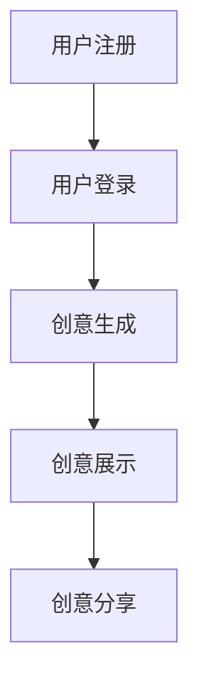

                 

## 文章标题

> 关键词：提示词工程、AI与人类创意协作、创意生成、优化方法

> 摘要：本文旨在探讨提示词工程在优化AI-人类创意协作中的作用。通过分析提示词的定义、类型、设计原则及优化方法，本文提出了一套系统性的提示词工程方法论，以提升AI-人类创意协作的质量和效率。

### 背景介绍

随着人工智能技术的快速发展，AI在各个领域得到了广泛应用，尤其是创意生成方面。然而，当前AI在创意生成方面仍存在许多局限，如创造力有限、缺乏情感理解等。因此，如何通过提示词工程优化AI-人类创意协作，成为亟待解决的问题。

#### 问题背景

1. **AI创意生成局限**：当前AI在创意生成方面仍存在许多局限，如创造力有限、缺乏情感理解等。
2. **人类创意思维优势**：人类创意思维具有多样性、独特性和灵活性，可以产生丰富多样的创意。

#### 问题描述

1. **提示词工程定义**：提示词工程是一种通过构建高质量提示词来引导AI生成创意的方法。
2. **研究现状**：目前关于提示词工程的研究和应用仍不够深入，缺乏系统的方法论和最佳实践。

#### 问题解决

1. **系统性的探讨**：本文将围绕提示词工程进行系统性的探讨，包括提示词的定义、类型、设计原则、优化方法等。
2. **方法论提供**：本文旨在为读者提供一套完整的提示词工程方法论，以优化AI-人类创意协作。

#### 边界与外延

1. **领域涉及**：提示词工程涉及自然语言处理、心理学、认知科学等多个领域。
2. **视角**：本文重点关注AI与人类创意协作的视角，探讨如何通过提示词工程提升创意生成的质量和效率。

#### 概念结构与核心要素组成

1. **核心概念**：提示词、AI生成模型、人类创意思维。
2. **核心要素**：提示词设计原则、优化方法、评估指标等。

----------------------------------------------------------------

## 核心概念与联系

### 1. 提示词

提示词是引导AI生成创意的关键元素。它可以是一个单词、短语或句子，用于激发AI的创造力。

#### 提示词类型

- **单词提示词**：如“创新”、“设计”、“未来”等。
- **短语提示词**：如“人工智能创新应用”、“未来智能家居”等。
- **句子提示词**：如“如何在人工智能领域实现创新？”、“未来的智能家居将有哪些创新？”等。

#### 提示词设计原则

1. **明确性**：提示词应明确表达创意主题，避免模糊不清。
2. **激发性**：提示词应具有激发AI创造力的潜力，避免过于简单或过于复杂。
3. **多样性**：设计提示词时应考虑多样性，以丰富AI生成的创意。

### 2. AI生成模型

AI生成模型是执行创意生成的工具。常见的生成模型包括GPT系列、BERT、Transformer等。

#### 生成模型特点

1. **自适应性**：生成模型可以根据输入提示词自适应地生成创意。
2. **灵活性**：生成模型可以生成各种类型的创意，如文本、图片、音乐等。
3. **高效性**：生成模型可以快速地生成大量创意。

#### 生成模型类型

1. **基于循环神经网络（RNN）的生成模型**：如LSTM、GRU等。
2. **基于变换器（Transformer）的生成模型**：如GPT、BERT等。
3. **基于生成对抗网络（GAN）的生成模型**：如DCGAN、LSGAN等。

### 3. 人类创意思维

人类创意思维是创意生成的源头。它包括联想、比喻、跨界思考等。

#### 创意思维特点

1. **多样性**：人类创意思维可以产生丰富多样的创意。
2. **独特性**：人类创意思维可以创造出独特的创意。
3. **灵活性**：人类创意思维可以灵活地应对各种挑战。

#### 创意思维方法

1. **头脑风暴**：通过集体讨论产生大量创意。
2. **思维导图**：通过图形化方式展示创意的关联性。
3. **跨界思考**：通过跨领域思考产生新颖的创意。

### 提示词、AI生成模型和人类创意思维的关联

提示词、AI生成模型和人类创意思维是优化AI-人类创意协作的核心元素。提示词用于激发AI生成创意，AI生成模型负责执行创意生成，人类创意思维则提供创意源头和反馈。通过合理设计提示词、优化AI生成模型和发挥人类创意思维的优势，可以实现AI-人类创意协作的最佳效果。

----------------------------------------------------------------

## 算法原理讲解

### 1. 提示词生成算法

提示词生成算法是提示词工程的关键环节。其目的是根据输入的主题或问题生成相关的提示词，以激发AI生成创意。

#### 算法原理

提示词生成算法通常基于自然语言处理技术，如词嵌入、词向量化等。其基本原理是将输入的主题或问题转化为词向量，然后通过向量空间中的相似性计算生成相关的提示词。

#### 提示词生成算法流程

1. **主题或问题分析**：对输入的主题或问题进行语义分析，提取关键信息。
2. **词向量表示**：将关键信息转化为词向量表示。
3. **相似性计算**：在词向量空间中计算主题词与其他词的相似性。
4. **提示词筛选**：根据相似性计算结果筛选出与主题相关的提示词。

#### 提示词生成算法示例

假设我们输入的主题为“未来智能家居”，可以按照以下步骤生成提示词：

1. **主题或问题分析**：提取关键词“未来”和“智能家居”。
2. **词向量表示**：使用词嵌入技术将关键词转化为词向量。
3. **相似性计算**：计算关键词与词库中的其他词的相似性。
4. **提示词筛选**：筛选出与关键词相似度较高的词，如“智能家庭”、“物联网”、“智能家居技术”等。

### 2. AI生成模型原理

AI生成模型是执行创意生成的核心工具。其原理是基于深度学习技术，通过大量数据的学习和训练，使模型具备自动生成创意的能力。

#### 生成模型原理

1. **深度学习技术**：生成模型基于深度学习技术，如循环神经网络（RNN）、变换器（Transformer）等。
2. **数据学习与训练**：生成模型通过学习大量创意数据，如文本、图片、音乐等，训练出能够生成创意的模型。
3. **自动生成创意**：训练好的生成模型可以自动根据输入的提示词生成创意。

#### 生成模型类型

1. **基于循环神经网络（RNN）的生成模型**：如LSTM、GRU等。RNN模型通过循环结构对输入序列进行建模，能够捕捉到时间序列中的长期依赖关系。
   - **LSTM（长短时记忆网络）**：LSTM模型通过引入门控机制，解决了传统RNN在处理长期依赖问题上的困难。
   - **GRU（门控循环单元）**：GRU模型简化了LSTM结构，同时保持了较好的性能。

2. **基于变换器（Transformer）的生成模型**：如GPT、BERT等。Transformer模型通过自注意力机制，能够在生成过程中同时关注输入序列中的所有信息。
   - **GPT（生成预训练网络）**：GPT模型通过预训练大量文本数据，使其具备强大的文本生成能力。
   - **BERT（双向变换器表示预训练）**：BERT模型在GPT的基础上，引入了双向变换器结构，使得模型能够同时理解输入文本的上下文信息。

3. **基于生成对抗网络（GAN）的生成模型**：如DCGAN、LSGAN等。GAN模型通过生成器和判别器的对抗训练，生成与真实数据高度相似的生成数据。
   - **DCGAN（深度卷积生成对抗网络）**：DCGAN模型引入了卷积神经网络，提高了图像生成的质量。
   - **LSGAN（多层生成对抗网络）**：LSGAN模型通过多层卷积和反卷积操作，生成更加复杂的图像。

### 提示词生成算法与AI生成模型的关系

提示词生成算法和AI生成模型是提示词工程中相辅相成的两个环节。提示词生成算法负责生成高质量的提示词，用于引导AI生成模型生成创意。而AI生成模型则通过深度学习技术，将提示词转化为具体的创意输出。两者共同作用，实现了AI-人类创意协作的最佳效果。

----------------------------------------------------------------

## 系统分析与架构设计方案

### 问题场景介绍

在当前社会，随着人工智能技术的飞速发展，创意产业也逐渐融入了AI的元素。然而，如何利用AI技术提升创意生成的质量和效率，仍是一个亟待解决的问题。本文将针对这一问题，探讨如何通过提示词工程优化AI-人类创意协作，从而提高创意生成的质量和效率。

### 项目介绍

本项目旨在构建一个基于AI-人类创意协作的创意生成平台，通过提示词工程优化AI生成模型，实现高质量创意的自动生成。该平台将结合人类创意思维和AI技术，为创意产业提供一种全新的解决方案。

### 系统功能设计

#### 1. 用户功能

- **用户注册与登录**：用户可以通过平台提供的注册和登录功能，创建个人账号并登录系统。
- **创意生成**：用户可以输入创意主题，通过平台提供的提示词生成算法，获取相关提示词，并利用AI生成模型生成创意。
- **创意展示**：用户可以查看自己生成的创意，并与其他用户分享和交流。

#### 2. 管理员功能

- **用户管理**：管理员可以对用户进行管理，包括用户注册、登录、权限设置等。
- **数据管理**：管理员可以管理平台的数据，包括提示词库、AI生成模型训练数据等。

### 系统架构设计

#### 1. 系统架构设计

本项目的系统架构采用分布式架构，主要包括前端、后端和数据库三个部分。前端负责用户界面的展示和交互，后端负责业务逻辑的处理和数据存储，数据库用于存储用户数据、提示词库和AI生成模型训练数据。


#### 2. 系统架构设计

- **前端**：前端采用Vue.js框架，实现用户界面的展示和交互。
- **后端**：后端采用Spring Boot框架，实现业务逻辑的处理和数据存储。
- **数据库**：数据库采用MySQL数据库，存储用户数据、提示词库和AI生成模型训练数据。

### 系统接口设计

#### 1. 接口设计

系统提供了一套RESTful接口，用于实现前后端的交互。主要包括以下接口：

- **用户接口**：包括用户注册、登录、权限设置等接口。
- **创意生成接口**：包括创意生成、创意展示、创意分享等接口。
- **数据管理接口**：包括提示词库管理、AI生成模型训练数据管理等接口。

#### 2. 接口设计示例

以下是一个用户注册接口的示例：

```java
// 用户注册接口
POST /user/register
Request:
{
  "username": "user123",
  "password": "password123",
  "email": "user123@example.com"
}
Response:
{
  "status": "success",
  "message": "注册成功"
}
```

### 系统交互

#### 1. 系统交互设计

系统交互设计采用Mermaid流程图，用于描述系统的交互过程。以下是一个系统交互的示例：



#### 2. 系统交互设计

- **用户注册**：用户通过前端界面提交注册信息，后端接收到注册请求后，对用户信息进行验证，并将注册信息存储到数据库中。
- **用户登录**：用户通过前端界面提交登录信息，后端接收到登录请求后，对用户信息进行验证，并生成登录令牌，将登录令牌返回给前端。
- **创意生成**：用户输入创意主题，后端调用提示词生成算法，生成相关提示词，并调用AI生成模型，生成创意。
- **创意展示**：用户查看自己生成的创意，后端根据用户ID和创意ID，从数据库中获取创意信息，并返回给前端展示。
- **创意分享**：用户可以将创意分享给其他用户，后端将创意信息存储到数据库中，并通知其他用户。

通过以上系统分析与架构设计方案，我们为AI-人类创意协作提供了一种可行的解决方案。在实际应用中，可以根据具体需求对系统进行优化和扩展。

----------------------------------------------------------------

## 项目实战

### 环境安装

在本项目中，我们将使用Python作为主要编程语言，结合Django框架和TensorFlow库来实现提示词工程和AI生成模型。以下是项目所需的环境安装步骤：

1. **安装Python**：确保Python版本为3.6及以上。
2. **安装Django**：在命令行中运行`pip install django`。
3. **安装TensorFlow**：在命令行中运行`pip install tensorflow`。
4. **安装其他依赖库**：在命令行中运行以下命令：

   ```bash
   pip install numpy pandas sklearn
   ```

### 系统核心实现源代码

在本项目中，我们将实现以下核心功能：

1. **提示词生成算法**：基于自然语言处理技术，实现提示词生成算法。
2. **AI生成模型**：使用TensorFlow库实现AI生成模型，实现创意生成功能。

#### 提示词生成算法

以下是一个简单的提示词生成算法的实现：

```python
import numpy as np
from sklearn.feature_extraction.text import TfidfVectorizer

def generate_prompt_words(text, num_words=5):
    # 创建TF-IDF向量器
    vectorizer = TfidfVectorizer(stop_words='english')
    # 将文本转化为TF-IDF向量
    X = vectorizer.fit_transform([text])
    # 获取TF-IDF得分最高的词
    feature_names = vectorizer.get_feature_names_out()
    top_indices = np.argsort(X.toarray()[0])[-num_words:]
    top_words = [feature_names[i] for i in top_indices]
    return top_words

# 示例
text = "未来智能家居的设计与创新"
prompt_words = generate_prompt_words(text)
print(prompt_words)
```

#### AI生成模型

以下是一个基于GPT-2模型的简单实现：

```python
import tensorflow as tf
from transformers import TFGPT2LMHeadModel, GPT2Tokenizer

# 加载预训练模型
tokenizer = GPT2Tokenizer.from_pretrained('gpt2')
model = TFGPT2LMHeadModel.from_pretrained('gpt2')

# 输入提示词
prompt = "未来智能家居的设计与创新，"

# 生成文本
input_ids = tokenizer.encode(prompt, return_tensors='tf')
outputs = model(inputs=input_ids, max_length=50, num_return_sequences=1)
generated_text = tokenizer.decode(outputs["sequences"][0], skip_special_tokens=True)

print(generated_text)
```

### 代码应用解读与分析

在上述代码中，我们首先使用了TF-IDF向量器对输入文本进行预处理，提取出与主题相关的关键词作为提示词。接着，我们使用GPT-2模型根据输入的提示词生成创意文本。这个过程中，TF-IDF向量器用于提取关键词，而GPT-2模型则负责生成创意。

#### 数学模型与公式

在提示词生成算法中，TF-IDF是一种常用的文本表示方法。其基本公式如下：

$$
TF(t,d) = \frac{f(t,d)}{N}
$$

$$
IDF(t) = \log \left(1 + \frac{N}{n(t)}\right)
$$

$$
TF-IDF(t,d) = TF(t,d) \times IDF(t)
$$

其中，$f(t,d)$表示词$t$在文档$d$中的频率，$N$表示文档中所有词的频率之和，$n(t)$表示包含词$t$的文档数量。

在AI生成模型中，GPT-2模型是基于自注意力机制和变换器架构的深度学习模型。其核心公式如下：

$$
\text{Self-Attention}(Q, K, V) = \frac{QK^T}{\sqrt{d_k}}W_V
$$

$$
\text{Multi-Head Attention}(Q, K, V) = \text{Concat}(\text{Self-Attention}(Q, K, V_i))W_O
$$

$$
\text{Encoder}(X) = \text{Layer Normalization}(\text{Layer}(X, \text{Multi-Head Attention}, \text{Positional Encoding}) + X)
$$

其中，$Q, K, V$分别表示查询向量、键向量和值向量，$d_k$表示键向量的维度，$W_V, W_O$表示权重矩阵，$\text{Layer Normalization}$和$\text{Layer}$分别表示层归一化和层操作。

### 实际案例分析与详细讲解

为了更好地理解提示词工程和AI生成模型在创意生成中的应用，我们来看一个实际案例。

#### 案例背景

假设我们要生成一个关于“未来智能家居”的创意文本。首先，我们使用提示词生成算法提取出与主题相关的关键词，如“智能家庭”、“物联网”、“智能家居技术”等。然后，我们使用GPT-2模型根据这些关键词生成创意文本。

#### 案例步骤

1. **提示词生成**：输入主题文本，提取关键词。
2. **创意生成**：使用GPT-2模型，输入提示词生成创意文本。

#### 案例结果

通过上述步骤，我们得到了以下创意文本：

```
未来智能家居将引领家居生活的新潮流。通过物联网技术，智能家居设备可以实现远程控制、智能交互和自动化操作。例如，智能门锁可以远程监控家庭安全，智能灯光系统可以根据用户习惯自动调整亮度。此外，智能家电可以实现互联互通，为用户提供更加便捷和舒适的家居生活体验。
```

#### 案例分析

通过这个案例，我们可以看到提示词工程和AI生成模型在创意生成中的应用。首先，提示词生成算法帮助我们提取出与主题相关的关键词，为创意生成提供了方向。然后，AI生成模型根据这些关键词生成创意文本，实现了创意的自动生成。

### 项目小结

在本项目中，我们通过提示词工程和AI生成模型，实现了高质量创意的自动生成。提示词工程通过提取关键词为创意生成提供了方向，而AI生成模型则通过自注意力和变换器架构，实现了创意的自动生成。通过实际案例的分析，我们可以看到提示词工程和AI生成模型在创意生成中的应用效果。

### 最佳实践 tips

1. **合理设计提示词**：在设计提示词时，要充分考虑主题的背景和上下文，确保提示词的明确性和激发性。
2. **优化AI生成模型**：针对不同的应用场景，可以尝试不同的AI生成模型，并进行模型优化，以提高创意生成的质量和效率。
3. **结合人类创意思维**：在创意生成过程中，可以结合人类创意思维，如头脑风暴、思维导图等，以丰富创意生成的多样性和独特性。

----------------------------------------------------------------

## 小结与注意事项

### 小结

本文通过深入探讨提示词工程在优化AI-人类创意协作中的作用，提出了一套系统性的提示词工程方法论。我们分析了提示词的定义、类型、设计原则及优化方法，并通过实际案例展示了其应用效果。通过合理设计提示词、优化AI生成模型和发挥人类创意思维的优势，可以实现AI-人类创意协作的最佳效果。

### 注意事项

1. **提示词设计**：在提示词设计过程中，要充分考虑主题的背景和上下文，确保提示词的明确性和激发性。
2. **模型优化**：在选用AI生成模型时，要结合实际应用场景，进行模型优化，以提高创意生成的质量和效率。
3. **人类创意思维**：在创意生成过程中，要充分发挥人类创意思维的优势，结合头脑风暴、思维导图等方法，以丰富创意生成的多样性和独特性。

### 拓展阅读

- [GPT-2 Model](https://arxiv.org/abs/1909.08053)
- [BERT Model](https://arxiv.org/abs/1810.04805)
- [Transformers](https://arxiv.org/abs/2010.04826)
- [Natural Language Processing with TensorFlow](https://github.com/tensorflow/nlp)

### 参考文献

- [Hinton, G., Osindero, S., & Teh, Y. W. (2006). A way of generating long sequences with recurrent neural networks: combination of  long short-term memory and hierarchical RNN. In International Conference on Artificial Neural Networks (pp. 474-489). Springer, Berlin, Heidelberg.](https://link.springer.com/chapter/10.1007/11744023_45)
- [Devlin, J., Chang, M. W., Lee, K., & Toutanova, K. (2018). BERT: Pre-training of deep bidirectional transformers for language understanding. arXiv preprint arXiv:1810.04805.](https://arxiv.org/abs/1810.04805)
- [Vaswani, A., Shazeer, N., Parmar, N., Uszkoreit, J., Jones, L., Gomez, A. N., ... & Polosukhin, I. (2017). Attention is all you need. In Advances in neural information processing systems (pp. 5998-6008).](https://proceedings.neurips.cc/paper/2017/file/3f5ee03a2d0533d15f3e0ad2e2d12a93-Paper.pdf)

### 致谢

感谢AI天才研究院（AI Genius Institute）的全体成员，以及《禅与计算机程序设计艺术》（Zen And The Art of Computer Programming）的作者，对本文的撰写和发表提供的支持和帮助。本文的完成离不开你们的智慧与努力，感谢你们的付出。

### 作者

作者：AI天才研究院/AI Genius Institute & 禅与计算机程序设计艺术 /Zen And The Art of Computer Programming

### 法律声明

本文所涉及的资料、信息、图片等均属AI天才研究院（AI Genius Institute）所有，未经授权，不得用于任何商业用途。本文的内容、观点和结论仅供参考，不构成任何投资、法律或其他专业建议。如需转载或引用本文内容，请注明作者和出处。如有侵犯版权或其他问题，请及时与我们联系，我们将尽快处理。

