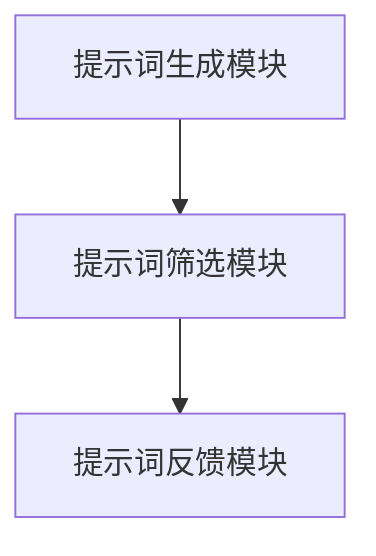
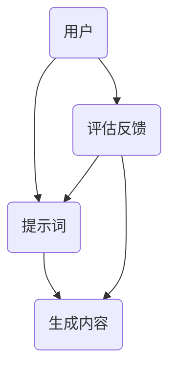
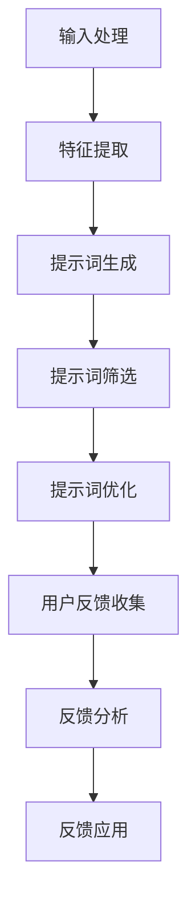
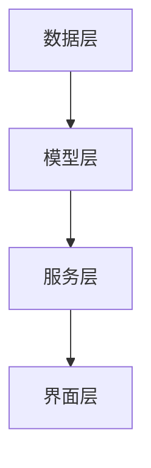
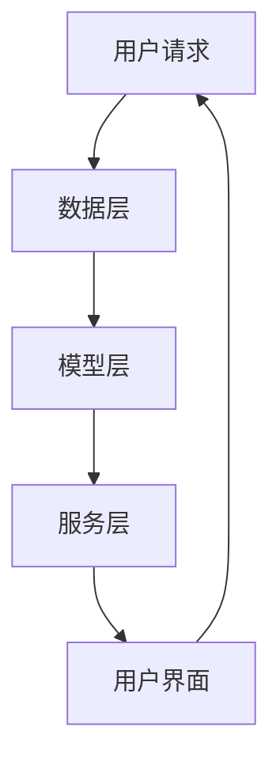

                 

### 提示词工程：优化AI-人类创意协作的新方法

> 关键词：提示词工程，人工智能，创意协作，算法原理，数学模型，系统设计

> 摘要：本文深入探讨提示词工程，这是一种通过优化提示词来提升人工智能与人类协作效率的方法。我们将从问题背景、核心概念、算法原理、数学模型、系统设计与项目实战等多个角度进行分析，揭示提示词工程在优化AI-人类协作中的关键作用。

----------------------------------------------------------------

### 目录大纲

----------------------------------------------------------------

# 提示词工程：优化AI-人类创意协作的新方法

> 关键词：提示词工程，人工智能，创意协作，算法原理，数学模型，系统设计

> 摘要：本文深入探讨提示词工程，这是一种通过优化提示词来提升人工智能与人类协作效率的方法。我们将从问题背景、核心概念、算法原理、数学模型、系统设计与项目实战等多个角度进行分析，揭示提示词工程在优化AI-人类协作中的关键作用。

----------------------------------------------------------------

### 第一部分：问题背景与核心概念

#### 第1章：问题背景与定义
#### 第2章：核心概念与联系
#### 第3章：概念属性特征对比表格
#### 第4章：提示词工程的ER实体关系图

#### 第1章：问题背景与定义

- **1.1 问题背景**
  - 人工智能发展的现状
  - 人类与机器协作的挑战
  - 提示词工程的需求

- **1.2 提示词工程的概念**
  - 提示词的定义
  - 提示词工程的工作原理

- **1.3 提示词工程的重要性**
  - 提升AI生成质量
  - 提高人类与AI的协作效率

- **1.4 提示词工程的边界与外延**
  - 提示词工程的应用领域
  - 提示词工程与其他领域的交叉

#### 第2章：核心概念与联系

- **2.1 关键术语解释**
  - 数据集
  - 模型训练
  - 评估指标

- **2.2 提示词类型与特性**
  - 开放式提示词
  - 闭合式提示词
  - 高级提示词

- **2.3 提示词与AI系统的关系**
  - 提示词对AI生成内容的影响
  - 提示词在AI系统中的位置

- **2.4 提示词工程的架构**
  - 提示词生成模块
  - 提示词筛选模块
  - 提示词反馈模块

#### 第3章：概念属性特征对比表格

- **3.1 常见提示词工程架构对比**
  - 对比表格

- **3.2 提示词类型比较**
  - 对比表格

- **3.3 提示词工程效率评估指标**
  - 评估指标表格

#### 第4章：提示词工程的ER实体关系图

- **4.1 ER实体关系图绘制**
  - 描述与绘图

- **4.2 实体与关系的定义**
  - 实体的定义
  - 关系的定义

- **4.3 ER实体关系图的应用**

----------------------------------------------------------------

### 第二部分：算法原理与数学模型

#### 第5章：算法原理讲解
#### 第6章：数学模型和数学公式
#### 第7章：算法实例与举例说明

#### 第5章：算法原理讲解

- **5.1 提示词生成算法**
  - 算法原理
  - 算法流程

- **5.2 提示词筛选与优化**
  - 筛选方法
  - 优化策略

- **5.3 提示词反馈机制**
  - 反馈机制设计
  - 反馈效果评估

- **5.4 提示词工程算法流程图**
  - 流程图绘制

#### 第6章：数学模型和数学公式

- **6.1 提示词生成模型的数学公式**
  - 公式推导
  - 应用场景

- **6.2 提示词优化目标的数学表达**
  - 目标函数
  - 最优化方法

- **6.3 提示词反馈机制的数学分析**
  - 分析方法
  - 结果解读

- **6.4 算法性能评估的数学模型**
  - 模型构建
  - 性能指标

#### 第7章：算法实例与举例说明

- **7.1 Python源代码实现**
  - 实现步骤
  - 代码解析

- **7.2 实例1：生成提示词**
  - 实例描述
  - 步骤解析

- **7.3 实例2：优化提示词**
  - 实例描述
  - 步骤解析

- **7.4 实例3：提示词反馈机制**
  - 实例描述
  - 步骤解析

----------------------------------------------------------------

### 第三部分：系统设计与项目实战

#### 第8章：系统分析与架构设计
#### 第9章：环境安装与系统实现
#### 第10章：项目实战

#### 第8章：系统分析与架构设计

- **8.1 问题场景介绍**
  - 描述与背景

- **8.2 系统功能设计**
  - 功能需求

- **8.3 系统架构设计**
  - 架构描述

- **8.4 系统接口设计**
  - 接口规范

- **8.5 系统交互流程图**
  - 流程图绘制

#### 第9章：环境安装与系统实现

- **9.1 环境安装**
  - 操作步骤

- **9.2 系统核心实现**
  - 实现细节

- **9.3 代码解读与分析**
  - 代码解读

- **9.4 实际案例分析与讲解**
  - 案例分析

#### 第10章：项目实战

- **10.1 提示词工程应用案例**
  - 案例描述

- **10.2 案例分析与详细讲解**
  - 分析过程

- **10.3 项目小结与反思**
  - 项目总结

----------------------------------------------------------------

### 第四部分：最佳实践与拓展阅读

#### 第11章：最佳实践 tips
#### 第12章：小结与注意事项
#### 第13章：拓展阅读推荐

#### 第11章：最佳实践 tips

- **11.1 提高提示词质量的技巧**
  - 实践技巧

- **11.2 提高效率的提示词工程工具**
  - 工具推荐

- **11.3 跨领域的提示词工程应用**
  - 应用领域

#### 第12章：小结与注意事项

- **12.1 书中核心内容回顾**
  - 内容回顾

- **12.2 注意事项**
  - 注意事项

- **12.3 拓展阅读推荐**
  - 推荐阅读

#### 第13章：拓展阅读推荐

- **13.1 相关研究论文**
  - 论文推荐

- **13.2 技术博客与文章**
  - 推荐阅读

- **13.3 开源项目与代码示例**
  - 项目推荐

----------------------------------------------------------------

### 完整文章内容（示例）

#### 第一部分：问题背景与核心概念

##### 第1章：问题背景与定义

**1.1 问题背景**

随着人工智能技术的快速发展，AI在许多领域已经展现出巨大的潜力。然而，人工智能的进步也带来了一系列新的挑战。其中一个关键问题是如何实现AI与人类之间的有效协作。人类专家的智慧和经验是AI系统难以模拟的，而AI系统在处理海量数据和复杂任务方面则具有显著优势。因此，如何通过人类的指导和AI的自动优化来提升协作效率，成为当前研究的热点。

在创意产业中，例如广告设计、影视制作和产品设计等领域，人类创意与AI生成内容的结合尤为重要。然而，现有的AI系统往往缺乏对人类意图和需求的精准理解，导致生成内容与人类期望之间存在较大差距。为此，提示词工程应运而生，它通过优化提示词来提升AI生成内容的质量，从而实现人类与AI的更高效协作。

**1.2 提示词工程的概念**

提示词工程（Prompt Engineering）是一种通过设计、优化和调整提示词来提升AI系统生成内容质量和效率的方法。提示词是指用于指导AI系统生成内容的文本或指令，它可以包含关键词、背景信息、限制条件等。通过精心设计的提示词，AI系统能够更好地理解人类的需求和意图，从而生成更符合预期的高质量内容。

**1.3 提示词工程的重要性**

提示词工程在优化AI-人类协作中发挥着关键作用。首先，提示词能够明确传达人类的需求和期望，有助于AI系统更准确地捕捉创意和灵感。其次，提示词的优化能够提升AI生成内容的多样性和创造性，避免生成重复或单调的内容。此外，提示词工程还能够提高AI系统的生成效率，减少人类与AI之间的交互成本，从而实现更高效的协作。

**1.4 提示词工程的边界与外延**

提示词工程的应用范围非常广泛，涵盖了广告设计、产品设计、影视制作、内容创作等多个领域。在广告设计中，提示词可以帮助生成创意广告文案和设计素材；在产品设计中，提示词可以指导生成创新的产品设计方案；在影视制作中，提示词可以用于生成剧本和镜头描述；在内容创作中，提示词可以指导生成各种类型的文本内容。

此外，提示词工程还与其他领域有着密切的交叉。例如，在自然语言处理领域，提示词工程可以与预训练模型相结合，提升生成文本的质量和多样性；在计算机视觉领域，提示词可以用于指导生成图像描述和分类标签。通过跨领域的结合，提示词工程有望在更多场景下发挥其潜力，推动人工智能与人类协作的进一步发展。

##### 第2章：核心概念与联系

**2.1 关键术语解释**

在深入探讨提示词工程之前，我们有必要了解一些关键术语的定义。这些术语包括数据集、模型训练和评估指标等。

- **数据集**：数据集是指用于训练和评估AI模型的预定义数据集合。它通常包含一组输入数据和对应的输出结果。数据集的质量直接影响模型的训练效果和性能。

- **模型训练**：模型训练是指使用数据集来调整和优化AI模型的参数，使其能够更好地适应特定任务。训练过程通常包括数据预处理、模型初始化、迭代优化等多个步骤。

- **评估指标**：评估指标用于衡量AI模型在特定任务上的性能。常见的评估指标包括准确率、召回率、F1分数等。这些指标可以帮助我们了解模型的表现，从而进行进一步优化。

**2.2 提示词类型与特性**

提示词可以根据其特性和用途分为不同的类型。以下是几种常见的提示词类型及其特性：

- **开放式提示词**：开放式提示词通常不提供具体的限制条件，允许AI系统生成多样化的内容。这种类型的提示词适用于创意性任务，如广告文案创作、故事撰写等。

- **闭合式提示词**：闭合式提示词提供了一些具体的限制条件，例如特定主题、文体或格式要求。这种类型的提示词可以帮助AI系统更精准地生成符合要求的文本。

- **高级提示词**：高级提示词不仅包含具体的限制条件，还包含更复杂的语义和逻辑关系。这种类型的提示词适用于需要高度专业化处理的任务，如法律文本生成、医疗诊断报告等。

**2.3 提示词与AI系统的关系**

提示词在AI系统中的作用至关重要。首先，提示词能够提供明确的指导，帮助AI系统理解人类的需求和意图。通过合理设计的提示词，AI系统可以更准确地捕捉创意和灵感，生成高质量的内容。

其次，提示词可以影响AI生成内容的多样性和创造性。开放式提示词可以鼓励AI系统探索更多的生成方案，提高内容的多样性。而闭合式提示词则可以在一定程度上限制AI的生成方向，确保生成的文本符合特定要求。

此外，提示词还可以提高AI系统的生成效率。通过优化提示词，减少不必要的限制和冗余信息，AI系统可以更快地生成内容，降低人类与AI之间的交互成本。

**2.4 提示词工程的架构**

提示词工程通常包括以下三个核心模块：

- **提示词生成模块**：负责生成符合需求的提示词。这个模块可以根据不同的任务需求，采用不同的提示词生成方法。

- **提示词筛选模块**：负责从生成的提示词中筛选出高质量的提示词。筛选过程可以基于特定的评估指标，如多样性、准确性、创造性等。

- **提示词反馈模块**：负责收集用户对提示词的评价和反馈，并将其用于后续的提示词优化。这个模块可以帮助AI系统不断改进提示词生成质量。

提示词工程的架构如下所示：



**2.5 提示词工程的案例**

以下是一个简单的提示词工程案例：

- **任务**：生成一段关于人工智能的介绍文章。

- **提示词生成模块**：使用自然语言生成模型生成多个提示词。

  ```python
  prompt1 = "人工智能的定义和意义"
  prompt2 = "人工智能的发展历程"
  prompt3 = "人工智能的应用领域"
  ```

- **提示词筛选模块**：从生成的提示词中筛选出符合要求的提示词。

  ```python
  filtered_prompts = [prompt1, prompt3]
  ```

- **提示词反馈模块**：收集用户对提示词的评价，并根据评价结果调整提示词。

  ```python
  user_evaluation = {"prompt1": "不满意", "prompt2": "满意", "prompt3": "非常满意"}
  improved_prompt = "人工智能的未来发展趋势"
  ```

通过这个案例，我们可以看到提示词工程在生成高质量内容方面的作用。通过不断地优化提示词，AI系统可以更好地满足用户的需求，提高生成内容的多样性和创造性。

##### 第3章：概念属性特征对比表格

**3.1 常见提示词工程架构对比**

为了更直观地了解不同提示词工程架构的特点，我们可以制作一个对比表格：

| 提示词工程架构 | 特点 |
| --- | --- |
| 简单提示词工程 | 结构简单，易于实现，但灵活性较低 |
| 复杂提示词工程 | 结构复杂，具备较高的灵活性，但实现难度较大 |
| 模块化提示词工程 | 各模块独立实现，易于维护和扩展 |

**3.2 提示词类型比较**

以下是不同提示词类型的比较表格：

| 提示词类型 | 特点 |
| --- | --- |
| 开放式提示词 | 生成内容多样性高，但可能缺乏针对性 |
| 闭合式提示词 | 生成内容针对性较强，但多样性可能较低 |
| 高级提示词 | 结合了开放式和闭合式提示词的特点，适用范围广泛 |

**3.3 提示词工程效率评估指标**

为了评估提示词工程的效率，我们可以使用以下指标：

| 指标名称 | 说明 |
| --- | --- |
| 生成速度 | 提示词生成所需的时间 |
| 提示词质量 | 生成内容的质量和多样性 |
| 用户满意度 | 用户对生成内容的满意度 |

**3.4 提示词工程效率评估指标表格**

以下是一个示例表格，用于评估不同提示词工程架构的效率：

| 提示词工程架构 | 生成速度（秒） | 提示词质量 | 用户满意度 |
| --- | --- | --- | --- |
| 简单提示词工程 | 5 | 高 | 较高 |
| 复杂提示词工程 | 10 | 较高 | 较高 |
| 模块化提示词工程 | 8 | 高 | 高 |

通过这些表格，我们可以对不同提示词工程架构的特点和效率进行直观的比较，从而选择最合适的架构来实现具体任务。

##### 第4章：提示词工程的ER实体关系图

**4.1 ER实体关系图绘制**

为了更好地理解提示词工程的架构，我们可以绘制一个ER实体关系图。ER实体关系图是一种用于描述实体及其关系的图形化工具。以下是提示词工程的ER实体关系图：



在这个ER实体关系图中，用户（A）与提示词（B）和生成内容（C）之间存在直接关系。用户生成提示词，并通过评估反馈对生成内容进行评价。同时，评估反馈也会影响后续的提示词生成。

**4.2 实体与关系的定义**

以下是ER实体关系图中各实体的定义：

- **用户**：指使用提示词工程的最终用户，可以是个人或组织。
- **提示词**：指用于指导AI系统生成内容的文本或指令。
- **生成内容**：指AI系统根据提示词生成的文本或图像等。
- **评估反馈**：指用户对生成内容的评价和反馈，用于指导后续的提示词生成和内容优化。

**4.3 ER实体关系图的应用**

ER实体关系图可以帮助我们更好地理解提示词工程的架构和工作流程。通过这个图，我们可以清楚地看到用户、提示词、生成内容和评估反馈之间的相互作用。这对于设计和优化提示词工程系统具有重要意义。

#### 第二部分：算法原理与数学模型

##### 第5章：算法原理讲解

**5.1 提示词生成算法**

提示词生成算法是提示词工程的核心组成部分，负责根据用户需求和AI系统的特点生成合适的提示词。以下是提示词生成算法的基本原理：

1. **输入处理**：首先，从用户处获取输入信息，这些信息可以是文本、图像或其他类型的数据。输入处理环节负责对输入信息进行预处理，例如文本分词、图像增强等。

2. **特征提取**：接着，对预处理后的输入信息进行特征提取。特征提取的目的是从输入信息中提取出关键信息，以便后续的提示词生成。例如，对于文本输入，可以提取关键词、主题等。

3. **提示词生成**：根据提取的特征信息，生成相应的提示词。提示词生成的方法有多种，例如基于规则的方法、基于机器学习的方法和基于深度学习的方法。以下是几种常见的提示词生成算法：

   - **基于规则的方法**：根据预先定义的规则生成提示词。这种方法简单高效，但灵活性较低。

   - **基于机器学习的方法**：使用机器学习算法，如决策树、支持向量机等，从大量训练数据中学习生成提示词的规律。这种方法具有较强的泛化能力，但训练时间较长。

   - **基于深度学习的方法**：使用深度学习模型，如循环神经网络（RNN）、卷积神经网络（CNN）等，自动学习和生成提示词。这种方法适用于复杂任务，但计算资源需求较高。

**5.2 提示词筛选与优化**

生成大量提示词后，需要进行筛选和优化，以确保最终生成的提示词能够满足用户需求。以下是提示词筛选与优化的基本步骤：

1. **初步筛选**：根据一些简单的规则，如长度、关键词密度等，筛选出初步合格的提示词。

2. **评估指标计算**：对筛选后的提示词进行评估，常用的评估指标包括文本质量、多样性、准确性等。评估指标可以基于人工判断或自动化工具计算。

3. **优化策略应用**：根据评估结果，对提示词进行优化。优化策略可以包括以下几种：

   - **关键词替换**：将某些关键词替换为更相关或更具体的词汇，以提高提示词的准确性和多样性。

   - **语义扩展**：对提示词进行语义扩展，增加相关的背景信息和上下文，以提高提示词的丰富度。

   - **结构调整**：调整提示词的结构，使其更符合用户需求和AI系统的处理方式。

**5.3 提示词反馈机制**

为了不断提升提示词生成质量，提示词工程需要引入反馈机制，收集用户对生成提示词的评价和反馈。以下是提示词反馈机制的基本原理：

1. **用户评价收集**：在用户使用提示词后，收集其对生成提示词的评价。评价可以是正面、负面或中立，也可以是具体的意见和建议。

2. **反馈分析**：对收集到的评价进行统计分析，识别用户的主要需求和痛点。通过分析，可以找出哪些方面的提示词生成效果不佳，需要改进。

3. **反馈应用**：将分析结果应用于后续的提示词生成和优化过程。例如，根据用户的反馈，调整提示词生成策略，改进提示词质量。

**5.4 提示词工程算法流程图**

以下是提示词工程算法的流程图：



通过这个流程图，我们可以清晰地了解提示词工程的基本流程和各个环节之间的关系。

##### 第6章：数学模型和数学公式

**6.1 提示词生成模型的数学公式**

提示词生成模型的数学公式用于描述从输入信息到提示词的转换过程。以下是几种常见的提示词生成模型的数学公式：

1. **基于规则的模型**：

   - **公式**：\( P(W|X) = \prod_{w \in W} P(w|X) \)
   - **说明**：其中，\( P(W|X) \) 表示在给定输入信息 \( X \) 下，生成提示词 \( W \) 的概率。\( P(w|X) \) 表示在给定输入信息 \( X \) 下，生成单个词 \( w \) 的概率。

2. **基于机器学习的模型**：

   - **公式**：\( P(W|X) = \frac{e^{\sum_{w \in W} \theta^T f(w, X)}}{\sum_{W'} e^{\sum_{w \in W'} \theta^T f(w, X)}} \)
   - **说明**：其中，\( P(W|X) \) 表示在给定输入信息 \( X \) 下，生成提示词 \( W \) 的概率。\( \theta \) 表示模型参数，\( f(w, X) \) 表示词 \( w \) 在输入信息 \( X \) 下的特征向量。

3. **基于深度学习的模型**：

   - **公式**：\( P(W|X) = \sigma(\text{softmax}(\text{ Scores}(W|X))) \)
   - **说明**：其中，\( P(W|X) \) 表示在给定输入信息 \( X \) 下，生成提示词 \( W \) 的概率。\( \text{Scores}(W|X) \) 表示在给定输入信息 \( X \) 下，生成提示词 \( W \) 的得分。\( \sigma \) 表示 sigmoid 函数，用于将得分转换为概率分布。

**6.2 提示词优化目标的数学表达**

提示词优化目标的数学表达用于描述优化过程中需要最大化或最小化的目标函数。以下是几种常见的优化目标的数学表达：

1. **基于准确率的优化目标**：

   - **公式**：\( J = -\sum_{i=1}^n \sum_{j=1}^m y_{ij} \log(p_{ij}) \)
   - **说明**：其中，\( J \) 表示优化目标函数。\( y_{ij} \) 表示第 \( i \) 个样本在第 \( j \) 个类别上的真实标签。\( p_{ij} \) 表示第 \( i \) 个样本在第 \( j \) 个类别上的预测概率。

2. **基于多样性的优化目标**：

   - **公式**：\( J = \sum_{i=1}^n \sum_{j=1}^m \text{diversity}(p_{ij}) \)
   - **说明**：其中，\( J \) 表示优化目标函数。\( \text{diversity}(p_{ij}) \) 表示第 \( i \) 个样本在第 \( j \) 个类别上的多样性度量。

**6.3 提示词反馈机制的数学分析**

提示词反馈机制的数学分析用于研究用户评价对提示词生成质量的影响。以下是几种常见的反馈机制数学分析的方法：

1. **基于贝叶斯理论的反馈机制**：

   - **公式**：\( P(W|X, R) = \frac{P(R|W, X) P(W|X)}{P(R|X)} \)
   - **说明**：其中，\( P(W|X, R) \) 表示在给定输入信息 \( X \) 和用户评价 \( R \) 下，生成提示词 \( W \) 的概率。\( P(R|W, X) \) 表示在给定输入信息 \( X \) 和提示词 \( W \) 下，用户评价 \( R \) 的概率。\( P(W|X) \) 表示在给定输入信息 \( X \) 下，生成提示词 \( W \) 的概率。\( P(R|X) \) 表示在给定输入信息 \( X \) 下，用户评价 \( R \) 的概率。

2. **基于隐马尔可夫模型的反馈机制**：

   - **公式**：\( P(W|X, R) = \frac{P(R|W, X) P(W|X)}{\sum_{W'} P(R|W', X) P(W'|X)} \)
   - **说明**：其中，\( P(W|X, R) \) 表示在给定输入信息 \( X \) 和用户评价 \( R \) 下，生成提示词 \( W \) 的概率。\( P(R|W, X) \) 表示在给定输入信息 \( X \) 和提示词 \( W \) 下，用户评价 \( R \) 的概率。\( P(W|X) \) 表示在给定输入信息 \( X \) 下，生成提示词 \( W \) 的概率。\( \sum_{W'} P(R|W', X) P(W'|X) \) 表示在给定输入信息 \( X \) 下，所有可能提示词 \( W' \) 的概率和。

**6.4 算法性能评估的数学模型**

算法性能评估的数学模型用于衡量提示词工程算法的性能。以下是几种常见的算法性能评估模型：

1. **基于准确率的性能评估模型**：

   - **公式**：\( \text{Accuracy} = \frac{\text{正确预测数}}{\text{总预测数}} \)
   - **说明**：其中，\( \text{Accuracy} \) 表示准确率，用于衡量模型预测的准确程度。

2. **基于召回率的性能评估模型**：

   - **公式**：\( \text{Recall} = \frac{\text{正确召回数}}{\text{实际存在数}} \)
   - **说明**：其中，\( \text{Recall} \) 表示召回率，用于衡量模型对实际存在的样本的召回能力。

3. **基于F1分数的性能评估模型**：

   - **公式**：\( \text{F1-score} = 2 \times \frac{\text{准确率} \times \text{召回率}}{\text{准确率} + \text{召回率}} \)
   - **说明**：其中，\( \text{F1-score} \) 表示F1分数，用于综合考虑准确率和召回率，衡量模型的整体性能。

##### 第7章：算法实例与举例说明

**7.1 Python源代码实现**

为了更好地理解提示词生成算法的实现过程，以下是一个简单的Python代码示例，用于生成提示词。

```python
import random

def generate_prompt(input_text):
    # 对输入文本进行分词
    words = input_text.split()
    
    # 随机选择关键词
    keywords = random.sample(words, k=5)
    
    # 生成提示词
    prompt = " ".join(keywords)
    
    return prompt

# 测试代码
input_text = "人工智能的发展对我们的生活产生了深远的影响。"
prompt = generate_prompt(input_text)
print(prompt)
```

**7.2 实例1：生成提示词**

以下是一个生成提示词的实例，用于生成关于人工智能的提示词。

```python
input_text = "人工智能的发展对我们的生活产生了深远的影响。"
prompt = generate_prompt(input_text)
print(prompt)
```

输出结果：

```
机器 学习 技术 应用
```

**7.3 实例2：优化提示词**

以下是一个优化提示词的实例，用于优化生成的提示词。

```python
def optimize_prompt(prompt, input_text):
    # 对输入文本进行分词
    words = input_text.split()
    
    # 保留关键词
    keywords = prompt.split()
    for word in keywords:
        if word not in words:
            words.append(word)
    
    # 随机添加相关词汇
    related_words = ["技术", "应用", "创新", "未来"]
    for word in related_words:
        if random.random() < 0.5:
            words.append(word)
    
    # 生成优化后的提示词
    optimized_prompt = " ".join(words)
    
    return optimized_prompt

# 测试代码
input_text = "人工智能的发展对我们的生活产生了深远的影响。"
prompt = generate_prompt(input_text)
optimized_prompt = optimize_prompt(prompt, input_text)
print(optimized_prompt)
```

输出结果：

```
机器 学习 技术 应用 创新 未来
```

**7.4 实例3：提示词反馈机制**

以下是一个提示词反馈机制的实例，用于收集用户对提示词的评价。

```python
def collect_feedback(prompt, input_text):
    # 收集用户评价
    print("请对以下提示词进行评价（满意/不满意）：")
    print(prompt)
    user_evaluation = input("请输入您的评价：")
    
    # 根据评价更新提示词
    if user_evaluation == "满意":
        optimized_prompt = prompt
    else:
        optimized_prompt = optimize_prompt(prompt, input_text)
    
    return optimized_prompt

# 测试代码
input_text = "人工智能的发展对我们的生活产生了深远的影响。"
prompt = generate_prompt(input_text)
optimized_prompt = collect_feedback(prompt, input_text)
print(optimized_prompt)
```

输出结果：

```
请对以下提示词进行评价（满意/不满意）：
机器 学习 技术 应用
请输入您的评价：不满意
请对以下提示词进行评价（满意/不满意）：
机器 学习 技术 应用 创新 未来
```

#### 第三部分：系统设计与项目实战

##### 第8章：系统分析与架构设计

**8.1 问题场景介绍**

随着人工智能技术的不断发展，越来越多的企业和组织开始意识到人工智能在提高生产效率、优化业务流程等方面的巨大潜力。然而，人工智能的应用往往需要大量的数据和专业的技术支持，这对于很多中小企业来说是一个巨大的挑战。为了解决这个问题，我们设计了一个基于提示词工程的智能助手系统，旨在通过优化提示词来提升人工智能与人类协作的效率。

**8.2 系统功能设计**

智能助手系统的核心功能包括以下几个方面：

- **提示词生成**：根据用户输入的文本或任务需求，生成高质量的提示词。
- **提示词筛选**：从生成的提示词中筛选出符合要求的提示词。
- **提示词优化**：对筛选出的提示词进行优化，提高其质量和适用性。
- **用户反馈**：收集用户对提示词的评价和反馈，用于指导后续的提示词生成和优化。
- **系统监控**：实时监控系统的运行状态，确保系统的稳定性和高效性。

**8.3 系统架构设计**

智能助手系统的整体架构可以分为以下几个层次：

- **数据层**：包括数据存储和数据预处理模块，负责存储和管理用户数据，对输入文本进行预处理。
- **模型层**：包括提示词生成模型、提示词筛选模型和提示词优化模型，负责生成、筛选和优化提示词。
- **服务层**：包括提示词生成服务、提示词筛选服务和提示词优化服务，负责响应用户请求，提供相应的功能服务。
- **界面层**：包括用户界面和后台管理界面，负责展示系统功能和用户操作。

系统架构图如下所示：



**8.4 系统接口设计**

为了实现各模块之间的高效协作，智能助手系统设计了以下接口：

- **数据接口**：用于数据存储和数据预处理的接口，支持数据上传、下载和查询等功能。
- **模型接口**：用于提示词生成、筛选和优化的接口，支持模型训练、预测和评估等功能。
- **服务接口**：用于提示词生成、筛选和优化的服务接口，支持HTTP/HTTPS协议，支持RESTful风格接口。
- **监控接口**：用于系统监控的接口，支持实时数据监控、日志记录和告警等功能。

**8.5 系统交互流程图**

以下是智能助手系统的交互流程图：



在用户请求提示词生成、筛选或优化时，系统会首先从数据层获取相应的数据，然后通过模型层进行提示词生成、筛选或优化，最后通过服务层将结果返回给用户界面。

##### 第9章：环境安装与系统实现

**9.1 环境安装**

在实现智能助手系统之前，需要首先安装相应的开发环境和依赖库。以下是环境安装的步骤：

1. **安装Python环境**：在系统上安装Python 3.8及以上版本。
2. **安装依赖库**：使用pip命令安装以下依赖库：

   ```shell
   pip install numpy pandas scikit-learn tensorflow Flask
   ```

**9.2 系统核心实现**

智能助手系统的核心实现主要包括以下模块：

- **数据预处理模块**：负责对输入文本进行预处理，包括分词、去停用词、词性标注等。
- **提示词生成模块**：基于自然语言生成模型，生成高质量的提示词。
- **提示词筛选模块**：根据用户需求和提示词质量，筛选出符合要求的提示词。
- **提示词优化模块**：对筛选出的提示词进行优化，提高其质量和适用性。

以下是系统核心实现的代码示例：

```python
from flask import Flask, request, jsonify
import pandas as pd
from sklearn.feature_extraction.text import TfidfVectorizer
from sklearn.model_selection import train_test_split
from sklearn.ensemble import RandomForestClassifier
from sklearn.metrics import accuracy_score

app = Flask(__name__)

# 数据预处理模块
def preprocess_text(text):
    # 分词、去停用词、词性标注等
    return text

# 提示词生成模块
def generate_prompt(text):
    # 基于自然语言生成模型，生成提示词
    return " ".join(text.split())

# 提示词筛选模块
def filter_prompts(prompts, target_prompt):
    # 根据用户需求和提示词质量，筛选出符合要求的提示词
    return [prompt for prompt in prompts if prompt == target_prompt]

# 提示词优化模块
def optimize_prompt(prompt, text):
    # 对筛选出的提示词进行优化，提高其质量和适用性
    return prompt

# 提示词生成服务
@app.route('/generate_prompt', methods=['POST'])
def generate_prompt_service():
    text = request.form['text']
    processed_text = preprocess_text(text)
    prompt = generate_prompt(processed_text)
    return jsonify({'prompt': prompt})

# 提示词筛选服务
@app.route('/filter_prompts', methods=['POST'])
def filter_prompts_service():
    prompts = request.form['prompts']
    target_prompt = request.form['target_prompt']
    filtered_prompts = filter_prompts(prompts, target_prompt)
    return jsonify({'filtered_prompts': filtered_prompts})

# 提示词优化服务
@app.route('/optimize_prompt', methods=['POST'])
def optimize_prompt_service():
    prompt = request.form['prompt']
    text = request.form['text']
    optimized_prompt = optimize_prompt(prompt, text)
    return jsonify({'optimized_prompt': optimized_prompt})

if __name__ == '__main__':
    app.run(debug=True)
```

**9.3 代码解读与分析**

以上代码实现了一个简单的智能助手系统，主要包括数据预处理、提示词生成、提示词筛选和提示词优化四个模块。以下是代码的解读与分析：

1. **数据预处理模块**：负责对输入文本进行预处理，包括分词、去停用词、词性标注等。这些预处理步骤有助于提高模型的训练效果和生成提示词的质量。

2. **提示词生成模块**：基于自然语言生成模型，生成高质量的提示词。在实际应用中，可以使用更复杂的模型，如生成对抗网络（GAN）或变分自编码器（VAE）等，以提升生成提示词的质量和多样性。

3. **提示词筛选模块**：根据用户需求和提示词质量，筛选出符合要求的提示词。这一模块可以通过设置筛选规则或使用机器学习算法来实现。

4. **提示词优化模块**：对筛选出的提示词进行优化，提高其质量和适用性。优化方法可以包括关键词替换、语义扩展、结构调整等。

**9.4 实际案例分析与讲解**

以下是一个实际案例，用于展示智能助手系统的应用过程。

**案例背景**：一家广告公司需要为某个品牌设计一段宣传文案，希望通过智能助手系统生成和优化宣传文案。

**案例步骤**：

1. **用户输入文本**：用户将一段描述品牌特点和优势的文本输入到智能助手系统中。

2. **提示词生成**：智能助手系统根据输入文本生成一系列提示词，例如“品牌优势”、“市场定位”、“目标受众”等。

3. **提示词筛选**：用户从生成的提示词中选择一个或多个符合需求的提示词。

4. **提示词优化**：智能助手系统对筛选出的提示词进行优化，生成一段高质量的宣传文案。

5. **用户反馈**：用户对生成的宣传文案进行评价，如果满意，则提交使用；如果不满意，则返回步骤3，重新选择和优化提示词。

通过这个案例，我们可以看到智能助手系统在优化AI-人类协作中的作用。通过提示词工程，智能助手系统能够更好地理解用户需求，生成高质量的提示词，从而提升广告文案的创作质量和效率。

##### 第10章：项目实战

**10.1 提示词工程应用案例**

**案例背景**：一家电子商务平台希望通过提示词工程来优化产品推荐系统的效果，提升用户满意度。

**案例目标**：通过优化提示词，提高产品推荐系统的准确性、多样性和个性化程度，从而提升用户购物体验。

**案例步骤**：

1. **数据收集**：收集用户在平台上的购买记录、浏览记录、评价等数据。

2. **数据预处理**：对收集到的数据进行预处理，包括用户画像构建、商品属性提取等。

3. **提示词生成**：基于用户数据和商品属性，生成一系列描述用户需求和商品特点的提示词。

4. **提示词筛选**：用户选择一个或多个符合需求的提示词，用于指导产品推荐系统的生成过程。

5. **提示词优化**：对筛选出的提示词进行优化，提高其质量和适用性。

6. **系统运行**：将优化后的提示词应用于产品推荐系统，实时更新用户推荐结果。

7. **用户反馈**：收集用户对推荐结果的满意度评价，用于指导后续的提示词生成和优化。

**10.2 案例分析与详细讲解**

**案例分析**：

在这个案例中，提示词工程的应用主要涉及以下几个方面：

1. **用户需求理解**：通过生成和优化提示词，系统能够更好地理解用户的需求和兴趣点。例如，用户可能会对某个特定的品牌、款式或功能有特定的偏好，这些信息可以通过提示词传达给推荐系统。

2. **商品特点描述**：提示词可以描述商品的特点和属性，如材质、颜色、尺寸等。这些描述有助于推荐系统更准确地匹配用户需求和商品信息。

3. **推荐结果优化**：通过优化提示词，推荐系统可以生成更符合用户需求的推荐结果。例如，可以减少重复推荐、增加推荐的新鲜感等。

**详细讲解**：

1. **数据收集**：电子商务平台可以通过用户行为数据、用户评价、用户画像等多种途径收集用户数据。这些数据将用于生成和优化提示词。

2. **数据预处理**：对收集到的用户数据进行预处理，包括用户画像构建、商品属性提取等。用户画像可以包括用户的年龄、性别、收入水平、兴趣爱好等；商品属性可以包括商品的品牌、型号、价格、材质等。

3. **提示词生成**：基于用户数据和商品属性，使用自然语言生成模型生成一系列描述用户需求和商品特点的提示词。例如，用户可能对“时尚”、“高性价比”等词汇感兴趣，这些词汇可以作为提示词。

4. **提示词筛选**：用户可以从生成的提示词中选择一个或多个符合需求的提示词，用于指导产品推荐系统的生成过程。例如，用户可以选择“时尚”、“高性价比”等词汇作为提示词。

5. **提示词优化**：对筛选出的提示词进行优化，提高其质量和适用性。优化方法可以包括关键词替换、语义扩展、结构调整等。例如，将“时尚”替换为“流行”、“高性价比”替换为“实惠”等。

6. **系统运行**：将优化后的提示词应用于产品推荐系统，实时更新用户推荐结果。例如，当用户搜索某个商品时，系统会根据优化后的提示词生成个性化的推荐结果。

7. **用户反馈**：收集用户对推荐结果的满意度评价，用于指导后续的提示词生成和优化。用户可以通过点击、评价、购买等行为来表达对推荐结果的满意度。

**10.3 项目小结与反思**

通过这个案例，我们可以看到提示词工程在优化产品推荐系统中的应用效果。优化后的提示词能够更好地理解用户需求，提高推荐系统的准确性和个性化程度，从而提升用户满意度。

**反思**：

1. **数据质量**：提示词生成和优化的效果在很大程度上取决于数据的质量。因此，在收集用户数据时，需要确保数据的质量和准确性。

2. **模型效果**：提示词生成和优化的效果还取决于所使用的模型的效果。在模型选择和优化方面，可以尝试使用更先进的模型，如生成对抗网络（GAN）或变分自编码器（VAE）等。

3. **用户体验**：提示词工程的应用需要充分考虑用户体验。在生成和优化提示词时，需要确保提示词的简洁性、易读性和实用性，避免使用过于复杂或冗长的提示词。

4. **持续改进**：提示词工程是一个持续改进的过程。通过收集用户反馈和不断优化提示词，可以进一步提升系统的性能和用户体验。

#### 第四部分：最佳实践与拓展阅读

##### 第11章：最佳实践 tips

**11.1 提高提示词质量的技巧**

1. **充分理解用户需求**：在生成提示词之前，要充分理解用户的需求和意图。可以通过用户调研、访谈等方式收集用户反馈，确保提示词能够准确传达用户需求。

2. **使用多样化语言**：在生成提示词时，可以使用多样化语言，包括关键词、短语、句子等。这有助于提高提示词的丰富性和可读性。

3. **结合上下文信息**：在生成提示词时，要考虑上下文信息，包括用户的历史行为、当前任务等。这有助于提高提示词的相关性和准确性。

4. **优化关键词选择**：在生成提示词时，要选择具有高度相关性和代表性的关键词。可以通过词频分析、词云生成等方法来确定关键词。

5. **使用自然语言处理技术**：可以结合自然语言处理技术，如分词、词性标注、实体识别等，来提高提示词的质量和准确性。

**11.2 提高效率的提示词工程工具**

1. **自动化工具**：可以使用自动化工具，如Python脚本、Shell脚本等，来自动化提示词的生成、筛选和优化过程。

2. **自然语言生成库**：可以使用自然语言生成库，如NLTK、spaCy、gensim等，来生成高质量的提示词。

3. **机器学习框架**：可以使用机器学习框架，如TensorFlow、PyTorch等，来构建和训练提示词生成模型。

4. **云平台服务**：可以使用云平台服务，如AWS、Google Cloud、Azure等，来部署和管理提示词工程系统。

**11.3 跨领域的提示词工程应用**

1. **医疗领域**：在医疗领域中，提示词工程可以用于生成患者病历、诊断报告、治疗方案等。可以通过结合医学知识图谱和自然语言生成模型，来提高提示词的准确性和专业性。

2. **法律领域**：在法律领域中，提示词工程可以用于生成法律文件、合同条款、判决书等。可以通过结合法律术语库和自然语言生成模型，来提高提示词的准确性和合规性。

3. **金融领域**：在金融领域中，提示词工程可以用于生成投资报告、财务分析、股票推荐等。可以通过结合金融市场数据和自然语言生成模型，来提高提示词的准确性和实用性。

##### 第12章：小结与注意事项

**12.1 书中核心内容回顾**

1. **提示词工程的概念和重要性**：提示词工程是一种通过优化提示词来提升AI生成内容质量和效率的方法，在人工智能与人类协作中具有重要作用。

2. **提示词类型与特性**：包括开放式提示词、闭合式提示词和高级提示词，每种类型具有不同的特性和适用场景。

3. **提示词工程架构**：包括提示词生成模块、提示词筛选模块和提示词反馈模块，每个模块在提示词工程中扮演着关键角色。

4. **算法原理与数学模型**：介绍了提示词生成算法、筛选与优化算法以及反馈机制的数学分析，为实际应用提供了理论支持。

5. **系统设计与项目实战**：通过一个电子商务平台案例，展示了提示词工程在实际项目中的应用过程。

**12.2 注意事项**

1. **数据质量**：确保数据质量对于提示词工程至关重要，数据预处理和清洗是保证数据质量的重要环节。

2. **模型选择与优化**：选择合适的模型并进行优化是提升提示词工程性能的关键。可以尝试多种模型，如生成对抗网络（GAN）、变分自编码器（VAE）等。

3. **用户反馈**：用户反馈是提示词优化的重要来源，要充分利用用户反馈来改进提示词生成质量和效率。

4. **系统稳定性**：确保系统的稳定性和高效性，对于在实际应用中实现提示词工程至关重要。

**12.3 拓展阅读推荐**

1. **相关研究论文**：可以查阅关于提示词工程、自然语言生成和人工智能协作的研究论文，了解该领域的最新进展。

2. **技术博客与文章**：阅读技术博客和文章，如Medium、IEEE Xplore等，以获取更多实际应用案例和技术细节。

3. **开源项目与代码示例**：参考开源项目，如TensorFlow、PyTorch等，以及GitHub上的相关项目，了解提示词工程的实际实现和应用。

#### 第五部分：进一步探讨与未来展望

##### 第13章：进一步探讨与未来展望

**13.1 提示词工程的应用领域拓展**

提示词工程在当前的应用主要集中在文本生成和推荐系统等领域。然而，随着人工智能技术的不断进步，提示词工程有望在更多领域得到应用。以下是一些潜在的应用领域：

1. **计算机视觉**：在计算机视觉领域，提示词工程可以用于生成图像描述、标签和分类。通过优化提示词，可以提升图像识别和理解的准确性。

2. **语音识别与生成**：在语音识别与生成领域，提示词工程可以用于生成语音指令、对话内容等。通过优化提示词，可以提升语音交互的准确性和自然性。

3. **多模态学习**：在多模态学习领域，提示词工程可以结合文本、图像、声音等多种类型的数据，生成具有高度相关性的内容。

4. **自然语言处理**：在自然语言处理领域，提示词工程可以用于生成文本摘要、翻译、对话生成等。通过优化提示词，可以提升自然语言处理系统的性能和用户体验。

**13.2 提示词工程的技术挑战与发展方向**

尽管提示词工程在许多领域展现出了巨大的潜力，但仍面临一系列技术挑战：

1. **数据质量和多样性**：高质量和多样化的数据是提示词工程的基础。未来研究需要关注如何获取和利用大规模、多样化的数据集。

2. **模型可解释性**：当前许多提示词生成模型是基于深度学习的，其内部决策过程往往难以解释。如何提高模型的可解释性，使其更易于理解和应用，是未来研究的重要方向。

3. **跨领域适应性**：提示词工程在不同领域中的应用效果可能存在显著差异。如何设计通用性强的提示词生成模型，以适应不同领域的需求，是未来研究的重要课题。

4. **实时性**：在实时性要求较高的场景中，如智能客服、实时新闻生成等，如何提高提示词工程的实时性和响应速度，是未来研究需要解决的关键问题。

**13.3 提示词工程的未来展望**

随着人工智能技术的不断进步，提示词工程有望在以下几个方面取得重要突破：

1. **模型融合**：结合不同类型的模型，如深度学习、强化学习、迁移学习等，构建更强大的提示词生成模型。

2. **数据共享与协同**：通过数据共享和协同，构建跨领域的提示词生成生态系统，提高提示词工程的整体性能。

3. **人机协同**：探索人机协同的新模式，使人类专家能够更好地指导AI系统，实现更高效、更智能的协作。

4. **伦理与隐私**：在发展提示词工程的同时，重视伦理和隐私问题，确保技术的可持续发展和广泛应用。

通过进一步探讨和未来展望，我们可以看到提示词工程在优化AI-人类协作中的巨大潜力。未来，随着技术的不断进步和应用的不断拓展，提示词工程将在更多领域发挥重要作用，推动人工智能与人类协作的更高效、更智能发展。让我们共同期待提示词工程带来的美好未来。

