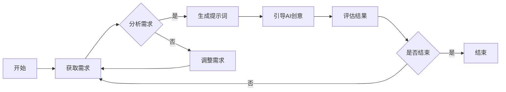
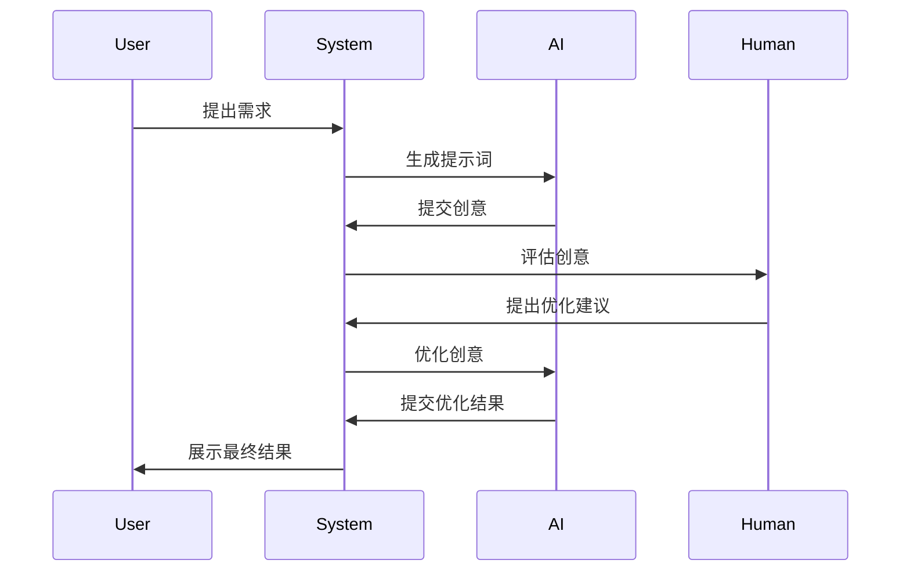
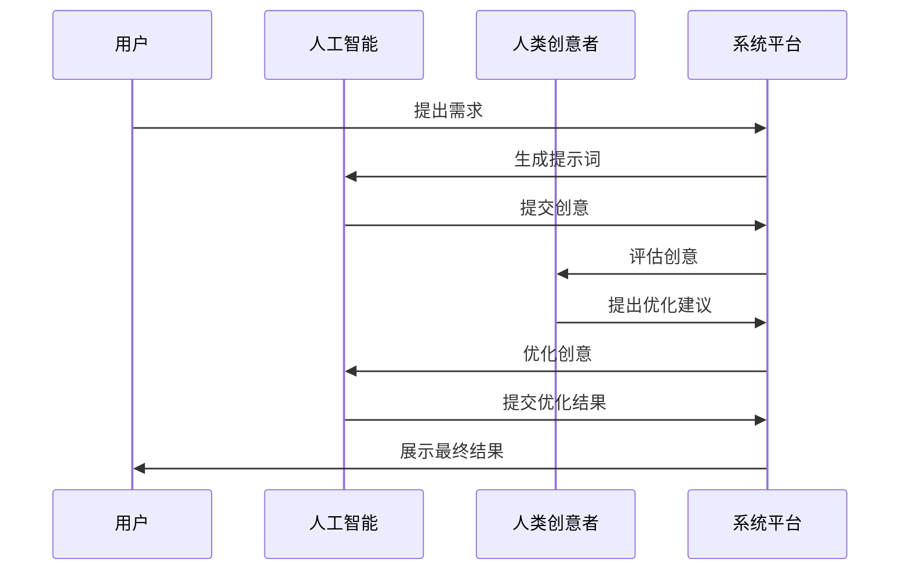

                 

# 《提示词工程：优化AI创意与人类创意协同的新方法》

## 关键词：提示词工程、人工智能、人类创意、协同优化、新方法

### 摘要：
随着人工智能（AI）的迅速发展，AI创意与人类创意的协同优化成为关键挑战。本文介绍了一种全新的提示词工程方法，通过深入解析其核心概念与算法原理，探讨如何实现AI与人类创意的有效协同。本文旨在为读者提供系统的理解，并探讨实际应用中的设计架构与实战技巧。

### Step 1: 背景介绍

#### 问题背景
人工智能的发展已经深刻影响了各行各业的创新和设计。然而，AI在创意生成方面的能力依然有限，无法完全替代人类的创造力。人类创意往往具有深度、情感和不确定性等特点，这些是AI目前难以模拟的。

#### 问题描述
在人工智能与人类创意的协同中，如何有效地利用AI的强大计算能力和人类的创造力，成为当前研究的热点。传统的协同方法往往存在效率低下、结果不理想等问题。

#### 问题解决
本文提出了一种新的提示词工程方法，通过精确的提示词来引导AI创意，从而实现与人类创意的协同优化。该方法具有高效、灵活和精准的特点，能够在多种应用场景中发挥重要作用。

### Step 2: 核心概念与联系

#### 核心概念原理
- **提示词**：用于引导AI生成创意的词汇或短语。
- **AI创意**：由人工智能生成的创意。
- **人类创意**：由人类产生的创意。
- **协同优化**：通过某种机制实现AI与人类创意的有机结合，达到最佳效果。

#### 概念属性特征对比表格

| 概念         | 特征                          |
| ------------ | ----------------------------- |
| 提示词       | 精准、引导性、可调整性        |
| AI创意       | 大规模、快速、模式识别        |
| 人类创意     | 深度、情感、独特性            |
| 协同优化     | 效率、效果、适应性            |

#### ER实体关系图架构

```mermaid
erDiagram
  AI_Creator ||--|{ Prompt_Manager }
  Human_Creator ||--|{ Prompt_Manager }
  AI_Creator ||--|{ Creative_Generator }
  Human_Creator ||--|{ Creative_Generator }
  Prompt_Manager ||--|{ Creative_Result }
  Creative_Generator ||--|{ Creative_Result }
```

### Step 3: 算法原理讲解

#### 提示词生成算法

##### Mermaid流程图



##### Python源代码实现

```python
def generate_prompt nhucau):
    # 分析需求
    analysis = analyze_demand(nhucau)
    if analysis:
        # 生成提示词
        prompt = create_prompt(analysis)
        # 引导AI创意
        ai_creative = guide_ai_creative(prompt)
        return ai_creative
    else:
        # 调整需求
        adjusted_demand = adjust_demand(nhucau)
        return generate_prompt(adjusted_demand)
```

##### 算法原理的数学模型和公式

$$
\text{Prompt} = f(\text{Demand}, \text{AI_Creator}, \text{Human_Creator})
$$

其中，$f$ 是提示词生成函数，$\text{Demand}$ 是需求，$\text{AI_Creator}$ 和 $\text{Human_Creator}$ 分别代表AI和人类创意者。

##### 举例说明

假设需求是“设计一款儿童教育应用程序”，通过生成提示词“教育、互动、趣味”，AI可以生成创意，如“一个结合游戏和教育内容的应用程序”。

### Step 4: 系统分析与架构设计方案

#### 问题场景介绍
在儿童教育领域，如何通过AI和人类创意的协同，设计出一款既教育性强又具备趣味性的应用程序。

#### 系统功能设计
- **需求分析**：分析用户需求和预期。
- **提示词生成**：根据需求生成引导AI的提示词。
- **AI创意生成**：AI根据提示词生成创意。
- **人类创意优化**：人类根据AI生成的创意进行优化。
- **结果评估**：评估创意的效果。

##### 领域模型mermaid类图

```mermaid
classDiagram
  Class01 <|-- Class02
  Class03 <|-- Class02
  Class01 {
    +String attribute1
    +int attribute2
    +void method1()
  }
  Class02 {
    +String name
    +String description
  }
  Class03 {
    +String id
    +String name
  }
  Class01..> Class03
  Class02..> Class03
```

#### 系统架构设计

##### Mermaid架构图



#### 系统接口设计
- **需求接口**：用于接收和处理用户需求。
- **创意接口**：用于接收和传递AI与人类创意。
- **评估接口**：用于评估创意效果。

#### 系统交互mermaid序列图



### Step 5: 项目实战

#### 环境安装
- 安装Python环境。
- 安装必要的库，如Mermaid、TensorFlow等。

#### 系统核心实现源代码
- 提示词生成模块。
- AI创意生成模块。
- 人类创意优化模块。

#### 代码应用解读与分析
- 详细解读各个模块的功能。
- 分析代码的结构和实现细节。

#### 实际案例分析与详细讲解剖析
- 通过实际案例展示系统如何运作。
- 分析案例中各个模块的作用和效果。

#### 项目小结
- 总结项目的实现过程和成果。
- 提出改进和优化方向。

### Step 6: 最佳实践 tips

#### 8.1 提示词工程实践技巧
- 如何精确描述需求。
- 提示词的调整与优化。

#### 8.2 创意协同实战策略
- 如何高效实现AI与人类的协同。
- 创意优化的最佳实践。

### Step 7: 小结与展望

#### 9.1 全书内容总结
- 对核心概念、算法原理、系统设计等进行了全面总结。

#### 9.2 未来的发展方向
- 提示词工程的进一步发展。
- AI与人类创意协同的新趋势。

### Step 8: 注意事项

#### 10.1 算法应用中的潜在问题
- 如何避免过拟合。
- 算法的可解释性。

#### 10.2 系统设计与实施中的注意事项
- 系统的扩展性和灵活性。
- 数据安全和隐私保护。

### Step 9: 拓展阅读

#### 11.1 相关研究动态
- 最新研究成果和趋势。

#### 11.2 推荐参考文献
- 相关文献和资料推荐。

### 作者
AI天才研究院/AI Genius Institute & 禅与计算机程序设计艺术 /Zen And The Art of Computer Programming

[Mermaid语法参考](https://mermaid-js.github.io/mermaid/#/基本概念)  
[Python TensorFlow教程](https://www.tensorflow.org/tutorials)  
[LaTeX公式指南](https://www.overleaf.com/learn/latex/Mathematics)  

## 完整目录大纲结构设计

### 第一部分：引言与背景

#### 1. 引言
##### 1.1 人工智能与创意协同的挑战
##### 1.2 提示词工程的重要性
##### 1.3 新方法的优势与应用场景

#### 2. 背景介绍
##### 2.1 人工智能的发展历程
##### 2.2 创意协同的需求与问题
##### 2.3 提示词工程的概念与作用

#### 3. 核心概念与联系
##### 3.1 提示词与关键词的比较
##### 3.2 自然语言处理在提示词工程中的应用
##### 3.3 机器学习与人类创意的融合

#### 4. 提示词工程的ER实体关系图架构
##### 4.1 实体识别
##### 4.2 关系定义
##### 4.3 描述与可视化

### 第二部分：算法原理与系统设计

#### 5. 算法原理讲解
##### 5.1 提示词生成算法
###### 5.1.1 Mermaid流程图
###### 5.1.2 Python源代码实现
###### 5.1.3 数学模型与公式
###### 5.1.4 举例说明

#### 6. 系统分析与架构设计方案
##### 6.1 问题场景介绍
##### 6.2 系统功能设计
###### 6.2.1 领域模型mermaid类图
##### 6.3 系统架构设计
###### 6.3.1 Mermaid架构图
##### 6.4 系统接口设计
##### 6.5 系统交互mermaid序列图

#### 7. 项目实战
##### 7.1 环境安装
##### 7.2 系统核心实现源代码
##### 7.3 代码应用解读与分析
##### 7.4 实际案例分析与讲解
##### 7.5 项目小结

### 第三部分：最佳实践与拓展

#### 8. 最佳实践 tips
##### 8.1 提示词工程实践技巧
##### 8.2 创意协同实战策略

#### 9. 小结与展望
##### 9.1 全书内容总结
##### 9.2 未来的发展方向

#### 10. 注意事项
##### 10.1 算法应用中的潜在问题
##### 10.2 系统设计与实施中的注意事项

#### 11. 拓展阅读
##### 11.1 相关研究动态
##### 11.2 推荐参考文献

### 作者
AI天才研究院/AI Genius Institute & 禅与计算机程序设计艺术 /Zen And The Art of Computer Programming

[Mermaid语法参考](https://mermaid-js.github.io/mermaid/#/基本概念)  
[Python TensorFlow教程](https://www.tensorflow.org/tutorials)  
[LaTeX公式指南](https://www.overleaf.com/learn/latex/Mathematics)  

## 总结

本文通过逐步分析提示词工程在优化AI创意与人类创意协同中的作用，详细介绍了其核心概念、算法原理、系统设计以及实战应用。文章旨在为读者提供全面的技术指南，促进AI与人类创意的深度融合。未来，随着AI技术的不断进步，提示词工程将在创意领域中发挥更加重要的作用。

