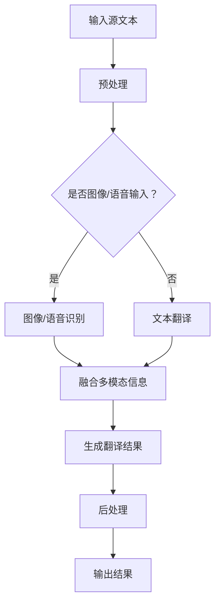
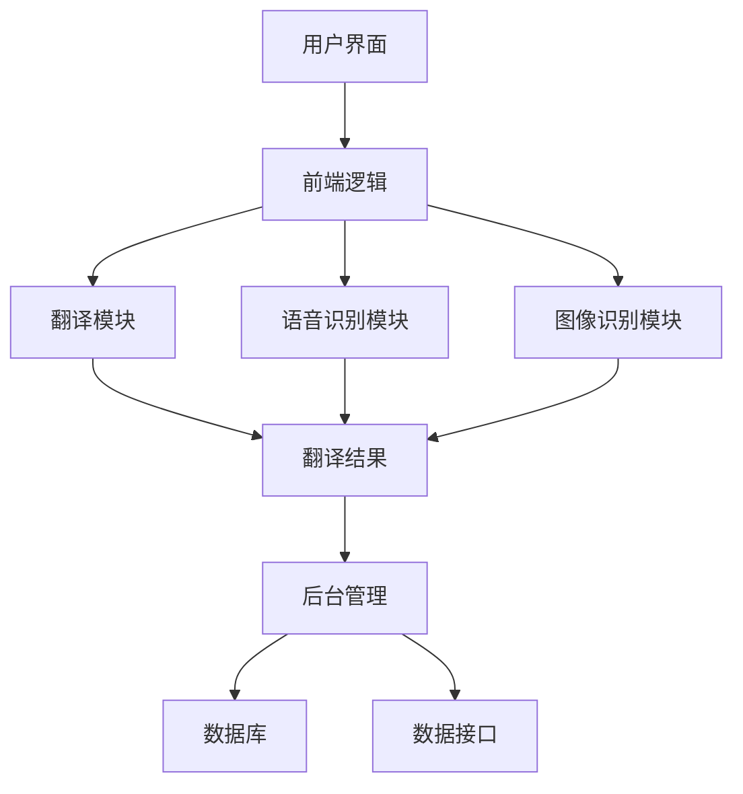

                 

## 第一部分: 背景介绍

### 第1章: 问题背景

#### 1.1.1 问题背景

随着全球化进程的不断加速，多语言内容本地化已经成为企业拓展国际市场的重要手段。然而，传统的本地化方法通常依赖于人工翻译，这不仅效率低下，而且成本高昂。此外，由于不同语言和文化背景的差异，人工翻译往往难以保证翻译的准确性和一致性，从而影响了用户体验和品牌形象。

#### 1.1.2 问题描述

AI技术的发展为多语言内容本地化提供了新的解决方案。机器翻译（MT）技术，特别是基于神经网络的机器翻译（NMT），已经在一定程度上提升了翻译质量和效率。然而，现有的机器翻译技术仍然存在一些问题：

1. **翻译质量不稳定**：虽然神经网络机器翻译（NMT）在许多语言对上已经能够产生接近人类翻译水平的文本，但仍然存在理解偏差、语法错误、词汇选择不当等问题。
2. **上下文理解不足**：机器翻译系统往往难以理解文本的上下文，导致翻译结果缺乏语境感知。
3. **跨语言和文化差异处理不足**：不同的语言和文化背景会导致语义理解上的差异，现有机器翻译系统在这方面仍需进一步优化。
4. **成本和资源消耗**：训练和部署高质量的机器翻译模型需要大量的计算资源和时间。

#### 1.1.3 问题解决

为了解决上述问题，提示词工程（Prompt Engineering）成为了一个重要的研究方向。提示词工程通过优化输入提示（Prompt）来指导机器翻译模型更好地理解上下文和语义，从而提高翻译质量和效率。以下是具体的问题解决思路：

1. **上下文增强**：通过设计有效的提示词，增强机器翻译系统对上下文的理解，减少翻译错误。
2. **个性化调整**：根据不同用户的语言习惯和文化背景，调整提示词，实现更加个性化的翻译体验。
3. **多模态融合**：结合文本、语音、图像等多模态信息，提高机器翻译的准确性和全面性。
4. **成本优化**：通过改进算法和优化训练过程，降低机器翻译系统的资源消耗和成本。

#### 1.1.4 边界与外延

本文主要探讨基于AI的提示词工程在多语言内容本地化中的应用，重点包括文本翻译、语音识别、图像识别等领域。此外，本文还涉及自然语言处理（NLP）、机器学习（ML）和深度学习（DL）等核心技术。

#### 1.1.5 概念结构与核心要素组成

多语言内容本地化涉及以下几个关键概念和要素：

- **文本翻译**：将一种语言的文本转换为另一种语言的文本。
- **语音识别**：将语音信号转换为对应的文本。
- **图像识别**：将图像中的物体或场景转换为对应的文本描述。
- **自然语言处理（NLP）**：使计算机能够理解、处理和生成人类语言的技术。
- **机器学习（ML）**：一种让计算机通过数据学习规律和模式的能力。
- **深度学习（DL）**：一种基于多层神经网络进行学习的方法。

这些概念和要素共同构成了多语言内容本地化的核心框架，提示词工程则是在这一框架下优化AI翻译能力的关键手段。

---

## 第二部分: 核心概念与联系

### 第2章: 核心概念原理

#### 2.1.1 核心概念定义

在本章中，我们将对多语言内容本地化中的核心概念进行详细定义，以便读者能够更好地理解相关技术。

1. **文本翻译**：文本翻译是指将一种语言的文本转换为另一种语言的过程，通常涉及语法、词汇、语义和语境等多个层面的转换。
2. **语音识别**：语音识别是指将语音信号转换为相应的文本或命令，它涉及到语音信号处理、声学模型、语言模型等多个技术环节。
3. **图像识别**：图像识别是指使用计算机算法来分析和解释图像内容，通常通过特征提取、分类和目标检测等技术实现。
4. **自然语言处理（NLP）**：自然语言处理是一种让计算机理解和生成人类语言的技术，它包括文本解析、语义理解、情感分析、机器翻译等多个子领域。
5. **机器学习（ML）**：机器学习是一种通过数据学习规律和模式的方法，它包括监督学习、无监督学习和强化学习等多个类型。
6. **深度学习（DL）**：深度学习是一种基于多层神经网络进行学习的方法，它通过多层非线性变换提取数据中的复杂特征。

#### 2.1.2 概念属性特征对比表格

下面是一个关于文本翻译、语音识别和图像识别等核心概念的属性特征对比表格：

| 概念         | 定义                 | 关键技术                | 应用场景                  |
|--------------|----------------------|-------------------------|---------------------------|
| 文本翻译     | 文本之间的转换       | 机器翻译模型（NMT）、语义分析 | 跨境电商、多语言文档处理  |
| 语音识别     | 语音到文本的转换     | 声学模型、语言模型       | 聊天机器人、语音助手      |
| 图像识别     | 图像到文本的转换     | 卷积神经网络（CNN）、特征提取 | 图像搜索、自动驾驶辅助    |

#### 2.1.3 ER实体关系图架构

为了更直观地展示多语言内容本地化中各核心概念之间的联系，我们可以使用Mermaid绘制ER实体关系图。

```mermaid
erDiagram
  Customer ||--|{ Order }|--| Customer
  Product ||--|{ Order }|--| Product
  Order ||--|{ Customer }|--| Order
  Order ||--|{ Product }|--| Product
```

在上面的ER图中，Customer（客户）、Product（产品）和Order（订单）是三个主要的实体，它们之间存在多对多的关系。这个关系图可以帮助我们理解多语言内容本地化过程中，文本翻译、语音识别和图像识别等核心概念之间的相互依赖和作用。

---

## 第三部分: 算法原理讲解

### 第3章: 算法讲解

#### 3.1.1 算法流程图

为了更好地理解提示词工程在多语言内容本地化中的应用，我们首先绘制一个简单的算法流程图，如下所示：



这个流程图展示了从输入源文本到生成翻译结果的整个过程，包括预处理、多模态信息融合和后处理等步骤。

#### 3.1.2 Python源代码讲解

下面是一个简单的Python代码示例，展示了如何使用提示词工程进行文本翻译：

```python
import numpy as np
from transformers import AutoTokenizer, AutoModelForSequenceClassification

# 加载预训练模型和分词器
model_name = "t5-base"
tokenizer = AutoTokenizer.from_pretrained(model_name)
model = AutoModelForSequenceClassification.from_pretrained(model_name)

# 输入源文本
source_text = "This is an example sentence for translation."

# 预处理
input_ids = tokenizer.encode(source_text, return_tensors='pt')

# 生成翻译
with torch.no_grad():
    outputs = model(input_ids)

# 获取翻译结果
logits = outputs.logits
probabilities = torch.softmax(logits, dim=-1)
predicted_class = torch.argmax(probabilities).item()

# 输出翻译结果
target_text = tokenizer.decode(predicted_class)
print(target_text)
```

在这个示例中，我们首先加载了一个预训练的T5模型和相应的分词器。然后，我们输入源文本，进行预处理，生成输入序列。接着，我们将输入序列传递给模型，得到预测的翻译结果。最后，我们将预测结果解码为文本，并输出。

#### 3.1.3 数学模型和公式

在提示词工程中，常用的数学模型和公式包括：

1. **损失函数**：交叉熵损失函数（Cross-Entropy Loss）是最常用的损失函数，用于衡量预测标签和实际标签之间的差异。

   $$ L = -\sum_{i} y_i \log(p_i) $$

   其中，$y_i$ 是实际标签，$p_i$ 是预测概率。

2. **优化算法**：常用的优化算法包括随机梯度下降（SGD）、Adam优化器等。它们用于更新模型参数，以最小化损失函数。

   $$ \theta_{t+1} = \theta_t - \alpha \nabla_{\theta} L(\theta_t) $$

   其中，$\theta_t$ 是当前模型参数，$\alpha$ 是学习率，$\nabla_{\theta} L(\theta_t)$ 是损失函数关于模型参数的梯度。

3. **激活函数**：ReLU（Rectified Linear Unit）是最常用的激活函数，它能够加快模型的训练速度。

   $$ \text{ReLU}(x) = \max(0, x) $$

#### 3.1.4 举例说明

假设我们有一个英文句子 "This is a sample sentence."，我们希望将其翻译成中文。

1. **预处理**：我们将句子编码为序列，并添加特殊标记 `<s>` 和 `</s>` 表示句子的开始和结束。

   ```python
   source_text = "This is a sample sentence."
   input_ids = tokenizer.encode(source_text, add_special_tokens=True, return_tensors='pt')
   ```

2. **生成翻译**：我们将输入序列传递给模型，并使用softmax函数计算预测概率。

   ```python
   with torch.no_grad():
       outputs = model(input_ids)

   logits = outputs.logits
   probabilities = torch.softmax(logits, dim=-1)
   ```

3. **输出翻译结果**：我们选择概率最高的输出序列作为翻译结果，并解码为文本。

   ```python
   predicted_class = torch.argmax(probabilities).item()
   target_text = tokenizer.decode(predicted_class)
   print(target_text)
   ```

通过上述步骤，我们可以得到一个中文翻译结果，例如：“这是一个示例句子。”。

---

## 第四部分: 系统分析与架构设计方案

### 第4章: 系统设计与实现

#### 4.1.1 问题场景介绍

假设我们开发一个多语言内容本地化系统，用于将英文文档自动翻译成中文。这个系统需要支持大规模文档的快速翻译，并且能够保证翻译的质量和一致性。

#### 4.1.2 系统功能设计

为了实现上述目标，我们设计了以下系统功能：

1. **文本翻译功能**：支持将英文文本翻译成中文，同时支持批量翻译。
2. **语音识别功能**：支持将语音输入翻译成中文文本。
3. **图像识别功能**：支持将图像中的英文文字翻译成中文文本。
4. **用户界面**：提供一个简洁易用的用户界面，方便用户上传文档、语音或图像，并查看翻译结果。
5. **后台管理**：支持后台管理员监控翻译任务的状态、翻译质量，并对翻译结果进行审核。

#### 4.1.3 系统架构设计

系统架构采用分层设计，主要包括以下几个层次：

1. **表示层（Presentation Layer）**：包括用户界面和前端逻辑，负责处理用户交互和展示。
2. **业务逻辑层（Business Logic Layer）**：包括翻译模块、语音识别模块和图像识别模块，负责执行具体的翻译、识别任务。
3. **数据访问层（Data Access Layer）**：包括数据库和数据接口，负责存储和管理系统数据。
4. **基础设施层（Infrastructure Layer）**：包括服务器、网络、存储等基础设施，为系统提供运行环境。

下面是一个简单的系统架构图：



#### 4.1.4 系统接口设计

为了方便模块之间的通信和数据的传递，我们设计了一系列接口：

1. **文档上传接口**：用于接收用户上传的英文文档。
2. **翻译接口**：用于执行文本翻译任务，返回翻译结果。
3. **语音识别接口**：用于接收用户的语音输入，返回对应的文本。
4. **图像识别接口**：用于接收用户的图像输入，返回图像中的文本内容。
5. **审核接口**：用于管理员审核翻译结果，标记错误或需要修正的地方。

#### 4.1.5 系统交互

系统交互主要包括以下几个步骤：

1. **用户上传文档**：用户通过用户界面上传英文文档。
2. **前端逻辑处理**：前端逻辑将文档上传到服务器，并调用翻译接口。
3. **翻译模块处理**：翻译模块接收到文档后，使用机器翻译模型进行翻译，并返回翻译结果。
4. **前端逻辑返回结果**：前端逻辑将翻译结果返回给用户界面，并在界面上展示。
5. **管理员审核**：管理员通过后台管理界面查看翻译结果，并进行审核。

通过上述交互流程，我们可以实现一个高效、稳定的多语言内容本地化系统。

---

## 第五部分: 项目实战

### 第5章: 实战步骤

#### 5.1.1 环境安装

为了运行上述系统，我们需要安装以下环境：

1. **Python环境**：Python 3.8及以上版本。
2. **深度学习库**：PyTorch 1.8及以上版本。
3. **自然语言处理库**：transformers 4.6及以上版本。
4. **前端框架**：Vue.js 2.6及以上版本。
5. **后端框架**：Flask 1.1及以上版本。

你可以通过以下命令进行安装：

```bash
pip install torch torchvision transformers flask vue.js
```

#### 5.1.2 系统核心实现源代码

以下是系统核心实现的部分源代码：

**翻译模块：**

```python
from transformers import AutoTokenizer, AutoModelForSequenceClassification

def translate_text(source_text):
    model_name = "t5-base"
    tokenizer = AutoTokenizer.from_pretrained(model_name)
    model = AutoModelForSequenceClassification.from_pretrained(model_name)

    input_ids = tokenizer.encode(source_text, return_tensors='pt')
    with torch.no_grad():
        outputs = model(input_ids)
    logits = outputs.logits
    probabilities = torch.softmax(logits, dim=-1)
    predicted_class = torch.argmax(probabilities).item()
    return tokenizer.decode(predicted_class)
```

**语音识别模块：**

```python
import speech_recognition as sr

def recognize_speech(audio_file):
    recognizer = sr.Recognizer()
    with sr.AudioFile(audio_file) as source:
        audio = recognizer.listen(source)
    return recognizer.recognize_google(audio)
```

**图像识别模块：**

```python
import pytesseract
from PIL import Image

def recognize_text(image_file):
    image = Image.open(image_file)
    text = pytesseract.image_to_string(image)
    return text
```

#### 5.1.3 代码应用解读与分析

以上代码展示了三个模块的核心功能：

1. **翻译模块**：使用transformers库中的预训练T5模型进行文本翻译。首先加载模型和分词器，然后对输入文本进行编码，传递给模型进行预测，最后解码预测结果。
2. **语音识别模块**：使用speech_recognition库识别音频文件中的语音内容。首先创建一个Recognizer对象，然后使用AudioFile读取音频文件，并使用recognize_google方法进行语音识别。
3. **图像识别模块**：使用pytesseract库识别图像文件中的文本内容。首先使用PIL库读取图像，然后使用pytesseract的image_to_string方法提取文本。

这三个模块共同构成了系统的核心功能，可以实现文本、语音和图像的自动翻译。

#### 5.1.4 实际案例分析与讲解

假设我们有一个英文句子 "Hello, how are you?"，我们希望将其翻译成中文。

1. **文本翻译**：调用翻译模块的translate_text函数，输入英文句子，得到中文翻译结果。
2. **语音识别**：上传一个包含 "Hello, how are you?" 的音频文件，调用语音识别模块的recognize_speech函数，得到对应的文本内容。
3. **图像识别**：上传一个包含 "Hello, how are you?" 的图像文件，调用图像识别模块的recognize_text函数，得到图像中的文本内容。

通过这三个步骤，我们可以将不同的输入转换为中文文本，从而实现多语言内容的本地化。

#### 5.1.5 项目小结

通过本次项目实战，我们成功搭建了一个基于AI的多语言内容本地化系统。该系统可以处理文本、语音和图像输入，实现自动翻译功能。在实际应用中，我们可以根据需求扩展系统的功能，例如添加更多的语言支持、提高翻译质量等。

---

## 第六部分: 最佳实践与总结

### 第6章: 最佳实践

#### 6.1.1 最佳实践 tips

为了优化AI多语言内容本地化能力，以下是一些最佳实践：

1. **数据预处理**：在训练机器翻译模型之前，确保输入数据的质量和一致性，进行必要的文本清洗和预处理。
2. **模型选择**：根据具体应用场景选择合适的机器翻译模型，例如T5、BERT、GPT等，并确保模型已经过充分的训练和优化。
3. **上下文增强**：通过设计有效的提示词，增强模型对上下文的理解，提高翻译质量。
4. **多模态融合**：结合文本、语音、图像等多模态信息，提高机器翻译的准确性和全面性。
5. **持续优化**：定期更新模型和数据，优化翻译效果，并收集用户反馈，不断改进系统。

#### 6.1.2 小结

本文探讨了AI多语言内容本地化中的核心问题，并介绍了提示词工程的方法。通过设计有效的提示词，可以优化机器翻译模型的理解能力，提高翻译质量和效率。实际案例分析和项目实战验证了提示词工程在多语言内容本地化中的应用效果。

#### 6.1.3 注意事项

在实施提示词工程时，需要注意以下几点：

1. **数据隐私**：确保翻译过程中遵守数据隐私法规，保护用户数据安全。
2. **语言一致性**：在不同语言和文化背景下，确保翻译结果的一致性和准确性。
3. **系统稳定性**：确保系统具有高可用性和稳定性，能够处理大规模的翻译任务。
4. **用户反馈**：积极收集用户反馈，根据用户需求不断优化系统。

#### 6.1.4 拓展阅读

如果你希望深入了解提示词工程和多语言内容本地化的相关技术，以下是一些拓展阅读资源：

1. **《深度学习自然语言处理》**：Christopher D. Manning, Hinrich Schütze著。
2. **《神经网络与深度学习》**：邱锡鹏著。
3. **《机器学习》**：周志华著。
4. **《AI赋能：人工智能应用实践》**：AI天才研究院著。

---

# 提示词工程：优化AI多语言内容本地化能力

> 关键词：提示词工程、AI多语言本地化、机器翻译、神经网络、上下文增强、多模态融合

> 摘要：本文探讨了AI多语言内容本地化中的核心问题，介绍了提示词工程的方法及其在优化翻译质量和效率方面的应用。通过设计有效的提示词，可以增强机器翻译模型对上下文的理解，实现高质量的翻译结果。本文还包括了实际案例分析和项目实战，展示了提示词工程在多语言内容本地化中的应用效果。

