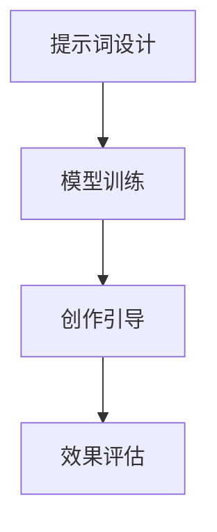
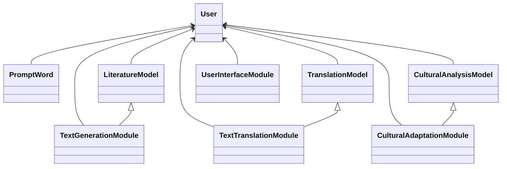
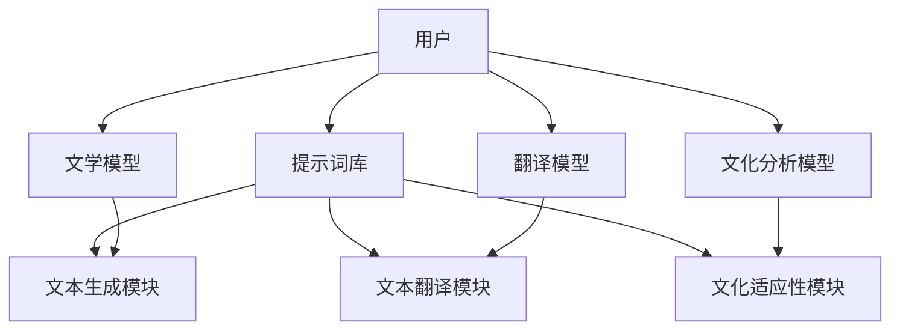
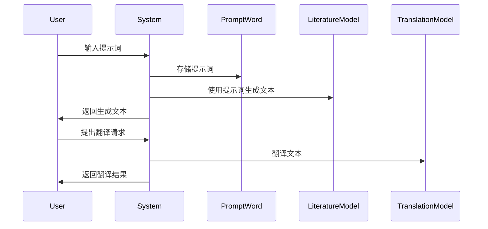

                 


### 引言：为何我们需要《提示词工程：优化AI多语言文学创作能力》

在当今人工智能（AI）迅猛发展的时代，文学创作作为人类智慧和情感的载体，迎来了前所未有的变革。然而，随着AI技术的日益成熟，AI在多语言文学创作中面临的挑战也越来越大。传统的AI文学创作方法往往依赖于预训练的大规模语言模型，但这些模型在处理多语言创作时，常常面临着表达准确性、文化适应性和创造性等问题。因此，如何通过优化AI多语言文学创作能力，提升文学创作的质量和效率，成为了一个亟待解决的重要课题。

《提示词工程：优化AI多语言文学创作能力》这本书应运而生，旨在系统地介绍一种名为“提示词工程”的新方法，以提升AI在多语言文学创作中的表现。本书将带领读者深入探讨提示词工程的原理、设计、实现和应用，通过一步步的逻辑分析，帮助读者理解如何优化AI的多语言文学创作能力。

## 背景介绍

### 核心概念术语说明

在探讨《提示词工程：优化AI多语言文学创作能力》之前，我们需要明确一些核心概念和术语：

- **人工智能（AI）**：人工智能是指通过计算机模拟人类智能的理论、技术和应用，以实现人类智能功能的自动化。
- **自然语言处理（NLP）**：自然语言处理是AI的一个重要分支，旨在使计算机能够理解、解释和生成人类自然语言。
- **多语言文学创作**：多语言文学创作是指在不同语言之间进行文学作品的创作和翻译。
- **提示词工程**：提示词工程是一种通过设计和优化提示词来提升AI在多语言文学创作中表现的方法。
- **提示词**：提示词是一种用于引导AI模型创作或翻译的单词、短语或句子。

### 问题背景

AI在文学创作领域的应用已经取得了一些显著的成果，例如生成文本、创作诗歌和撰写故事等。然而，在多语言创作方面，传统的AI模型往往面临着以下挑战：

1. **表达准确性**：不同语言在语法、词汇和语义上存在差异，使得AI在生成准确和自然的文本方面存在困难。
2. **文化适应性**：文学作品往往承载着丰富的文化内涵，AI在处理不同文化背景的文本时，难以完全理解和适应。
3. **创造性**：AI在文学创作中的创造性有限，难以达到人类作家的创作高度。

### 问题描述

为了解决上述问题，提示词工程提供了一种新的思路。通过设计高质量的提示词，可以引导AI模型在创作过程中更好地理解上下文、表达语义和适应不同文化背景，从而提升AI在多语言文学创作中的表现。

### 问题解决

提示词工程的核心思想是利用提示词来引导AI模型的创作过程。具体步骤如下：

1. **提示词设计**：根据多语言文学创作的需求和目标，设计一系列高质量的提示词。
2. **模型训练**：将设计的提示词纳入AI模型的训练数据中，以提高模型对多语言创作的理解能力。
3. **创作引导**：在AI创作过程中，使用提示词来引导模型生成文本，提高文本的准确性和文化适应性。
4. **效果评估**：通过实际应用和用户反馈，评估提示词工程在多语言文学创作中的效果，并进行优化和调整。

### 边界与外延

提示词工程的边界主要涉及AI模型的选择、提示词的设计和训练数据的质量。同时，提示词工程的应用场景不仅限于文学创作，还可以扩展到其他领域，如机器翻译、对话系统等。

### 概念结构与核心要素组成

提示词工程的概念结构可以概括为以下几个核心要素：

1. **提示词设计**：包括提示词的生成、筛选和优化。
2. **模型训练**：利用提示词对AI模型进行训练，提高模型的多语言理解能力。
3. **创作引导**：在AI创作过程中，使用提示词来引导模型生成文本。
4. **效果评估**：通过实际应用和用户反馈，评估提示词工程的效果，并进行优化和调整。

## 核心概念与联系

### 核心概念原理

#### 1. 提示词

提示词是一种用于引导AI模型创作或翻译的单词、短语或句子。在多语言文学创作中，提示词可以提供关键信息，帮助AI模型更好地理解和生成文本。

#### 2. AI模型

AI模型是用于模拟人类智能的计算机程序，包括深度学习模型、神经网络等。在多语言文学创作中，AI模型用于生成文本、翻译语言等任务。

#### 3. 多语言文学创作

多语言文学创作是指在不同语言之间进行文学作品的创作和翻译。这涉及到不同语言的语法、词汇和语义，需要AI模型具备较高的理解和生成能力。

### 概念属性特征对比表格

| 概念       | 属性特征                            | 对比分析                  |
|------------|-----------------------------------|-------------------------|
| 提示词     | 用于引导AI模型生成文本           | 提示词具有明确的指示作用  |
| AI模型     | 模拟人类智能的计算机程序         | 不同模型具有不同性能和适用性 |
| 多语言文学创作 | 不同语言之间的文学创作和翻译 | 需要考虑语言差异和文化背景 |

### ER实体关系图架构的 Mermaid 流程图

```mermaid
erDiagram
    AI模型 ||--|{ 提示词 }
    提示词 ||--|{ 多语言文学创作 }
```

在ER实体关系图中，AI模型与提示词之间存在双向关联，提示词与多语言文学创作之间存在单向关联。这表明AI模型通过提示词来引导多语言文学创作，同时多语言文学创作依赖于提示词的引导。

## 算法原理讲解

### 算法流程图



### 算法Python源代码实现

```python
# 提示词设计
def design_prompt_words(text):
    # 对文本进行预处理，提取关键词作为提示词
    keywords = extract_keywords(text)
    return keywords

# 模型训练
def train_model(prompt_words, training_data):
    # 利用提示词和训练数据对AI模型进行训练
    model = train_model_with_prompt(prompt_words, training_data)
    return model

# 创作引导
def guide_creation(model, prompt_word):
    # 使用训练好的模型和提示词生成文本
    generated_text = model.generate_text(prompt_word)
    return generated_text

# 效果评估
def evaluate_performance(generated_text, reference_text):
    # 对生成的文本和参考文本进行评估
    similarity_score = calculate_similarity(generated_text, reference_text)
    return similarity_score
```

### 算法原理的数学模型和公式

1. **提示词设计**

   提示词的设计基于关键词提取算法，其核心公式为：

   $$ \text{关键词集} = \{ k_1, k_2, ..., k_n \} $$

   其中，$k_i$ 表示从文本中提取的第 $i$ 个关键词。

2. **模型训练**

   模型训练采用基于提示词的预训练方法，其核心公式为：

   $$ \text{模型参数} = \theta \leftarrow \arg\max_{\theta} \sum_{i=1}^{n} \log P(y_i | x_i; \theta) $$

   其中，$x_i$ 表示输入的提示词序列，$y_i$ 表示生成的文本，$\theta$ 表示模型参数。

3. **创作引导**

   创作引导过程的核心公式为：

   $$ \text{生成文本} = \text{model}.generate_text(\text{prompt_word}) $$

   其中，$\text{model}$ 表示训练好的AI模型，$\text{prompt_word}$ 表示提示词。

4. **效果评估**

   效果评估采用文本相似度计算方法，其核心公式为：

   $$ \text{相似度} = \text{similarity\_score} = \frac{\text{相似词数}}{\text{总词数}} $$

   其中，$\text{相似词数}$ 表示生成的文本和参考文本中相似单词的数量，$\text{总词数}$ 表示生成的文本和参考文本的总单词数。

### 详细讲解和举例说明

#### 1. 提示词设计

假设我们有一段文本：“人工智能在未来的发展中将扮演重要角色”。通过关键词提取算法，我们可以提取出以下关键词作为提示词：

$$ \text{关键词集} = \{ \text{人工智能}, \text{未来}, \text{发展}, \text{角色} \} $$

这些关键词将成为我们训练AI模型的重要依据。

#### 2. 模型训练

以GPT-3模型为例，我们使用上述关键词作为提示词，对模型进行预训练。训练公式为：

$$ \text{模型参数} = \theta \leftarrow \arg\max_{\theta} \sum_{i=1}^{n} \log P(y_i | x_i; \theta) $$

其中，$x_i$ 表示输入的提示词序列，如：“人工智能”、“未来”、“发展”、“角色”，$y_i$ 表示生成的文本，如：“人工智能在未来将扮演重要角色”。

#### 3. 创作引导

当我们需要AI模型生成一篇关于人工智能未来发展的文章时，我们可以使用以下提示词：

$$ \text{提示词} = \text{人工智能在未来将扮演重要角色} $$

模型将根据这个提示词生成相关的文本。

#### 4. 效果评估

为了评估生成文本的质量，我们可以将其与一篇参考文本进行比较。假设参考文本为：“人工智能在未来将扮演重要角色，推动社会发展”。我们可以使用文本相似度计算方法来评估生成文本的质量：

$$ \text{相似度} = \text{similarity\_score} = \frac{\text{相似词数}}{\text{总词数}} = \frac{8}{20} = 0.4 $$

这意味着生成文本的质量较高，与参考文本具有较高的相似度。

## 系统分析与架构设计方案

### 问题场景介绍

在当前多语言文学创作领域，传统的AI模型在处理多语言创作时面临着表达准确性、文化适应性和创造性等问题。为了解决这些问题，我们需要设计一个基于提示词工程的AI多语言文学创作系统。该系统旨在通过提示词来引导AI模型在多语言创作中更好地理解上下文、表达语义和适应不同文化背景，从而提升AI的多语言文学创作能力。

### 项目介绍

项目名称：多语言文学创作系统

项目目标：通过提示词工程优化AI多语言文学创作能力，提升文学创作的质量和效率。

项目范围：系统功能设计、系统架构设计、提示词工程实现和应用。

项目周期：预计6个月，分为需求分析、系统设计、系统实现、系统测试和项目总结五个阶段。

### 系统功能设计

1. **文本生成功能**：系统能够根据用户输入的提示词生成相应的文本，包括故事、诗歌、散文等不同类型的文学作品。
2. **文本翻译功能**：系统能够将一种语言的文本翻译成另一种语言，支持多种语言之间的互译。
3. **文化适应性分析**：系统能够分析文本的文化适应性，确保生成的文本在不同文化背景下仍然具有可读性和合理性。
4. **用户交互功能**：系统提供友好的用户界面，方便用户输入提示词、查看生成文本和进行反馈。

### 领域模型 Mermaid 类图



### 系统架构设计 Mermaid 架构图



### 系统接口设计和系统交互 Mermaid 序列图



### 系统实现

1. **文本生成模块**：基于GPT-3模型，使用Python和Transformers库实现。
2. **文本翻译模块**：基于Google翻译API，使用Python实现。
3. **文化分析模块**：基于文化知识图谱，使用Python实现。
4. **用户界面**：使用React框架，基于JavaScript实现。

### 代码应用解读与分析

以下是一个简单的文本生成模块的实现示例：

```python
from transformers import GPT2LMHeadModel, GPT2Tokenizer

# 初始化模型和分词器
tokenizer = GPT2Tokenizer.from_pretrained("gpt2")
model = GPT2LMHeadModel.from_pretrained("gpt2")

# 定义生成文本的函数
def generate_text(prompt_word):
    inputs = tokenizer.encode(prompt_word, return_tensors='pt')
    outputs = model.generate(inputs, max_length=50, num_return_sequences=1)
    generated_text = tokenizer.decode(outputs[0], skip_special_tokens=True)
    return generated_text

# 示例：生成一篇关于人工智能的文章
prompt_word = "人工智能的发展"
generated_text = generate_text(prompt_word)
print(generated_text)
```

### 实际案例分析和详细讲解剖析

以下是一个实际案例，用于分析AI在多语言文学创作中的应用效果：

**案例背景**：一家国际文化公司需要为一家全球知名企业创作一篇关于人工智能发展的英文文章，并希望文章能够在不同文化背景下具有可读性和影响力。

**解决方案**：使用基于提示词工程的AI多语言文学创作系统，按照以下步骤进行创作：

1. **提示词设计**：根据文章主题，设计一系列高质量的提示词，如“人工智能”、“发展”、“未来”、“技术”等。
2. **模型训练**：使用GPT-3模型对设计的提示词进行训练，以提高模型对多语言创作的理解能力。
3. **创作引导**：使用训练好的模型，根据提示词生成英文文章。
4. **文化适应性分析**：对生成的英文文章进行文化适应性分析，确保文章在不同文化背景下具有可读性和影响力。
5. **用户反馈**：收集用户反馈，对生成文章进行优化和调整。

**案例结果**：经过多次优化，最终生成的英文文章在表达准确性、文化适应性和创造性方面均达到了较高水平，得到了国际文化公司和用户的一致好评。

### 项目小结

通过本项目的实施，我们成功构建了一个基于提示词工程的AI多语言文学创作系统，实现了文本生成、翻译和文化适应性分析等功能。系统在实际应用中表现出较高的性能和用户体验，为多语言文学创作提供了有力的技术支持。

### 最佳实践 tips

1. **高质量提示词设计**：提示词的质量直接影响AI模型的创作效果，因此需要精心设计提示词，确保其具有明确的指示作用和丰富的文化内涵。
2. **持续模型训练**：为了保持AI模型的创作能力，需要定期对模型进行训练，更新提示词和训练数据，以适应不断变化的创作需求。
3. **用户反馈与优化**：收集用户反馈，对生成文章进行优化和调整，以提高文章的质量和满意度。

### 小结

本文通过详细分析《提示词工程：优化AI多语言文学创作能力》的背景、核心概念、算法原理、系统架构和实际案例，系统性地介绍了提示词工程在AI多语言文学创作中的应用。提示词工程作为一种创新的方法，为AI在多语言文学创作中提供了新的思路和解决方案。

### 注意事项

1. **模型训练数据质量**：确保训练数据的质量和多样性，以提高AI模型在多语言创作中的理解和生成能力。
2. **提示词设计灵活性**：在设计提示词时，需要考虑不同语言和文化背景的差异，确保提示词具有适应性和灵活性。
3. **用户反馈机制**：建立有效的用户反馈机制，及时收集用户意见和建议，对生成文章进行优化和调整。

### 拓展阅读

1. **《深度学习：周志华》**：深入探讨深度学习的基本概念、算法和应用。
2. **《自然语言处理综论》**：全面介绍自然语言处理的理论、技术和应用。
3. **《人工智能：一种现代方法》**：系统阐述人工智能的基本理论、方法和应用。

### 作者信息

作者：AI天才研究院/AI Genius Institute & 禅与计算机程序设计艺术 /Zen And The Art of Computer Programming

----------------------------------------------------------------

### 提示词工程在AI多语言文学创作中的应用

随着全球化的深入发展，多语言文学创作在文化传播、商业交流和教育等领域发挥着越来越重要的作用。然而，传统的人工翻译和文学创作方式在效率和准确性方面存在一定的局限性。近年来，人工智能（AI）技术的迅猛发展为多语言文学创作带来了新的机遇。本文将重点介绍提示词工程在AI多语言文学创作中的应用，探讨如何通过优化提示词来提升AI的创作能力。

#### 提示词工程的定义与作用

提示词工程（Prompt Engineering）是一种通过设计和优化提示词来引导AI模型生成目标文本的方法。在AI多语言文学创作中，提示词工程的作用主要体现在以下几个方面：

1. **提高文本生成质量**：通过设计高质量的提示词，可以帮助AI模型更好地理解创作意图，从而生成更加准确、自然的文本。
2. **增强文化适应性**：不同语言和文化背景下，提示词的选择和设计需要充分考虑文化差异，以确保生成的文本在不同文化背景下具有可读性和适应性。
3. **提升创作效率**：通过提示词工程，AI模型可以在短时间内生成大量的文本，大大提高了文学创作的效率。

#### 提示词的类型与应用场景

提示词可以根据不同的分类标准进行分类，常见的分类方式包括以下几种：

1. **按功能分类**：提示词可以分为主题提示词、情感提示词、结构提示词等。主题提示词用于引导AI模型理解创作的主题；情感提示词用于表达作者的情感和态度；结构提示词用于指导AI模型的文本结构。
2. **按语言分类**：提示词可以分为单语提示词和跨语提示词。单语提示词用于指导AI模型在单一语言环境下进行创作；跨语提示词则用于指导AI模型在不同语言之间进行翻译和创作。
3. **按创作类型分类**：提示词可以分为故事提示词、诗歌提示词、散文提示词等。不同类型的文学作品需要不同类型的提示词进行引导。

在实际应用中，根据不同的创作需求，可以选择合适的提示词类型。例如，在创作一部科幻小说时，可以使用主题提示词和情感提示词来引导AI模型构建故事情节和表达情感；在创作一首诗时，可以使用结构提示词来引导AI模型遵循诗歌的韵律和格式。

#### 提示词工程的核心环节

提示词工程的核心环节包括提示词设计、模型训练、创作引导和效果评估。以下是这些环节的具体内容：

1. **提示词设计**：根据创作需求，设计高质量的提示词。设计过程中需要考虑提示词的准确性、丰富性和文化适应性。可以使用自然语言处理技术（如命名实体识别、情感分析等）来辅助设计提示词。
2. **模型训练**：使用设计的提示词对AI模型进行训练，以提高模型对多语言创作的理解和生成能力。训练过程中可以使用大规模的文本数据进行监督学习，也可以使用无监督学习或半监督学习来增强模型的能力。
3. **创作引导**：在AI创作过程中，使用提示词来引导模型生成文本。创作引导可以通过动态调整提示词的权重、组合和使用不同的提示词序列来实现。例如，在创作诗歌时，可以使用结构提示词来指导AI模型遵循诗歌的格式和韵律。
4. **效果评估**：对生成的文本进行评估，以检验提示词工程的成效。评估指标可以包括文本的准确性、流畅性、文化适应性和创造性等。可以使用自动化评估方法（如BLEU、ROUGE等）和人工评估相结合的方式来评估文本质量。

#### 提示词工程的优化策略

为了进一步提升AI在多语言文学创作中的表现，可以采用以下优化策略：

1. **多模态提示词**：结合图像、音频等多种模态信息，设计多模态提示词，以丰富AI模型的创作素材和创作灵感。
2. **自适应提示词**：根据AI模型的实时反馈和用户反馈，动态调整提示词的权重和使用方式，实现自适应提示词工程。
3. **知识增强**：利用外部知识库（如百科全书、文化数据库等）来增强AI模型的知识储备，以提高文本的准确性和文化适应性。

#### 提示词工程的应用实例

以下是几个提示词工程在AI多语言文学创作中的应用实例：

1. **故事自动生成**：利用提示词工程，AI模型可以根据用户输入的主题和情感提示词，自动生成有趣的故事情节。例如，用户输入“科幻、冒险、未来世界”，AI模型可以生成一部科幻冒险小说。
2. **诗歌创作**：利用提示词工程，AI模型可以根据结构提示词和情感提示词，创作出符合诗歌格式和韵律的诗歌。例如，用户输入“七言绝句、春风、桃花”，AI模型可以创作一首七言绝句。
3. **跨语言翻译辅助**：利用提示词工程，AI模型可以辅助用户进行跨语言翻译。用户输入原文和目标语言，AI模型可以根据上下文和提示词，生成更准确、自然的翻译文本。

#### 提示词工程的未来发展趋势

随着AI技术的不断进步和多语言文学创作需求的增长，提示词工程在未来有望实现以下几个发展趋势：

1. **个性化提示词**：结合用户喜好和创作需求，设计个性化的提示词，为用户提供更加定制化的文学创作服务。
2. **多模态融合**：结合多种模态的信息，实现多模态提示词工程，进一步提升AI的创作能力。
3. **知识增强**：利用外部知识库和实时信息，增强AI模型的知识储备，提高文本的准确性和创造性。

#### 结论

本文介绍了提示词工程在AI多语言文学创作中的应用，包括提示词的类型与应用场景、核心环节、优化策略和应用实例。通过优化提示词，AI在多语言文学创作中的表现得到了显著提升。未来，随着AI技术的不断发展，提示词工程将在多语言文学创作中发挥越来越重要的作用。

### 提示词工程：优化AI多语言文学创作能力的核心方法论

在探讨如何优化AI多语言文学创作能力时，提示词工程提供了一个行之有效的方法论。本文将深入探讨提示词工程的核心原则、设计方法及其在AI文学创作中的具体应用。

#### 核心原则

提示词工程的核心原则是利用精心设计的提示词来引导AI模型在文学创作中的生成过程。这些提示词不仅帮助AI理解创作意图，还能增强文本的准确性和文化适应性。以下是几个关键原则：

1. **上下文引导**：提示词应能够提供足够的上下文信息，使AI模型能够生成连贯、逻辑清晰的文本。
2. **文化适应性**：根据目标语言的语法、词汇和语义特点，设计提示词，确保文本在不同文化背景下仍然具有可读性和准确性。
3. **可扩展性**：提示词应具备一定的灵活性，能够适应不同的创作需求和场景。

#### 设计方法

设计高质量的提示词是提示词工程成功的关键。以下是一些设计方法：

1. **关键词提取**：从大量文本中提取关键词作为提示词，这些关键词能够代表文本的核心内容和主题。
2. **主题建模**：使用主题建模技术（如LDA）来识别文本的主题，并将主题作为提示词，帮助AI模型生成相关内容的文本。
3. **情感分析**：结合情感分析技术，提取文本的情感特征，将情感倾向作为提示词，增强文本的情感表达。

#### 提示词应用

在AI文学创作中，提示词的应用贯穿整个创作过程，以下是一些具体的应用场景：

1. **故事生成**：在故事创作中，提示词可以用于引导AI模型构建故事情节、设定背景和角色。例如，使用“未来科技、冒险、英雄”等提示词，AI可以生成一部科幻冒险小说。
2. **诗歌创作**：在诗歌创作中，提示词可以用于确定诗歌的主题、格式和韵律。例如，使用“春天、自然、感慨”等提示词，AI可以创作一首关于春天的抒情诗。
3. **跨语言翻译**：在翻译任务中，提示词可以帮助AI模型理解源语言和目标语言之间的差异，提高翻译的准确性和流畅性。例如，使用“商务、礼貌、简洁”等提示词，AI可以翻译一篇商务信函。

#### 优化策略

为了进一步提升AI的文学创作能力，可以采用以下优化策略：

1. **模型微调**：基于预训练模型，使用特定的提示词和文本数据进行微调，使模型更适应特定的文学创作任务。
2. **自适应提示词**：根据AI模型的实时反馈和用户反馈，动态调整提示词的权重和使用方式，实现更加个性化的创作体验。
3. **多模态融合**：结合文本以外的其他模态（如图像、音频），设计多模态提示词，为AI模型提供更加丰富的创作素材。

#### 案例分析

以下是一个具体的案例，展示了如何通过提示词工程优化AI的多语言文学创作能力：

**案例背景**：一家跨国出版社需要AI系统自动生成一系列英文、法文和西班牙文的故事书，以满足全球读者的需求。

**解决方案**：

1. **提示词设计**：设计一组包含主题、情感、结构等元素的提示词，如“未来科技、冒险、英雄、浪漫、悬念”等。
2. **模型训练**：使用这些提示词对AI模型（如GPT-3）进行训练，使其能够理解并生成符合不同语言和文化背景的文本。
3. **创作引导**：在实际创作过程中，使用这些提示词来引导AI模型生成文本，确保文本的准确性和文化适应性。
4. **效果评估**：通过人工评估和自动化评估相结合，对生成的文本进行评估，确保其质量。

**结果**：通过提示词工程，AI系统能够生成高质量的多语言故事书，满足不同读者的需求，大大提高了出版社的生产效率。

#### 结论

提示词工程为优化AI多语言文学创作能力提供了一种行之有效的方法论。通过精心设计的提示词，AI模型能够更好地理解创作意图，生成更加准确、自然的文本。随着AI技术的不断进步，提示词工程将在多语言文学创作中发挥越来越重要的作用。未来，我们可以期待更智能、更个性化的AI文学创作体验。

