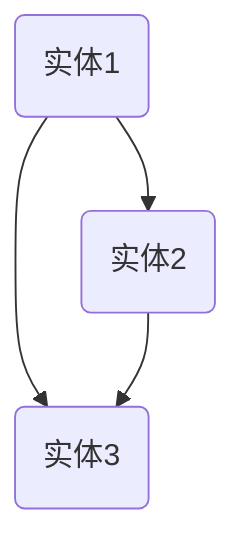
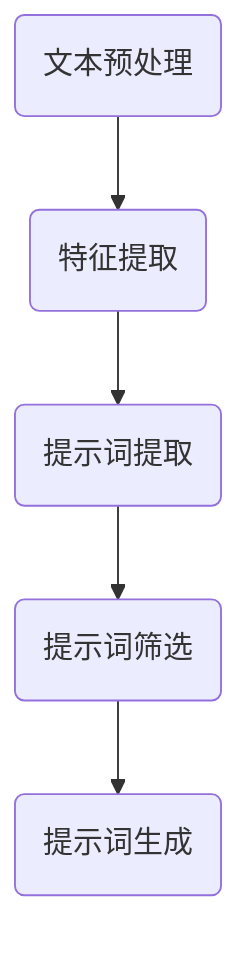
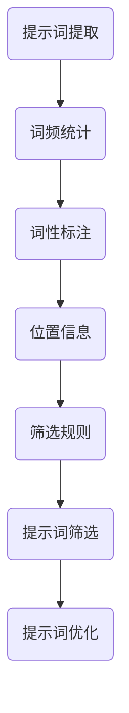
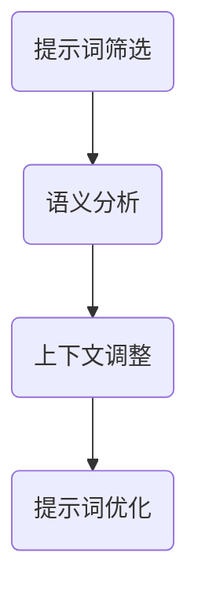
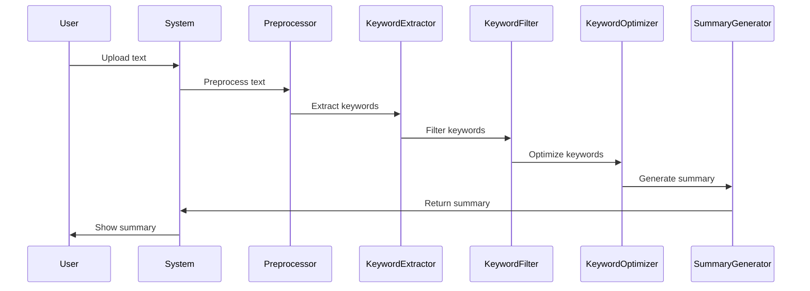

                 

# 提示词工程：优化AI文本摘要能力

## 关键词
- 提示词工程
- AI文本摘要
- 优化策略
- 算法实现
- 数学模型
- 实战应用

## 摘要
本文将探讨如何通过提示词工程来优化AI文本摘要能力。首先，我们将介绍提示词工程的基本概念、背景及重要性。接着，我们将详细分析文本摘要中的常见问题和瓶颈，并解释提示词工程如何发挥作用。随后，我们将深入探讨提示词工程的核心概念、算法原理及其实现过程。此外，我们还将介绍数学模型和公式，以帮助我们更好地理解这些算法。最后，我们将通过系统分析与架构设计方案，以及实际项目实战，展示如何将提示词工程应用于文本摘要任务，并提供一些最佳实践建议。

## 目录大纲设计过程

### 1.1. 理解书名和主题
《提示词工程：优化AI文本摘要能力》的书名明确指出了本文的核心内容——提示词工程及其在优化AI文本摘要方面的应用。

### 1.2. 核心章节内容规划
本文的核心章节包括：
- 背景介绍：介绍问题背景、概念定义和问题解决。
- 核心概念与联系：阐述核心概念、原理及其相互关系。
- 算法原理讲解：详细讲解算法原理、数学模型和实现过程。
- 系统分析与架构设计方案：介绍系统架构和功能设计。
- 项目实战：展示实际应用案例，分析代码和项目效果。
- 最佳实践 tips：总结实战经验，提供实用建议。

### 1.3. 确定目录结构
目录结构应清晰、易于导航，包括以下部分：
- 引言
- 第一部分：背景介绍
- 第二部分：核心概念与联系
- 第三部分：算法原理讲解
- 第四部分：系统分析与架构设计方案
- 第五部分：项目实战
- 第六部分：最佳实践 tips
- 结论

### 1.4. 撰写目录大纲
以下是本文的目录大纲：

## 第一部分：背景介绍
### 1.1. 问题背景
- **1.1.1 AI文本摘要的挑战与需求**
- **1.1.2 提示词工程的概念与重要性**
- **1.1.3 提示词工程在文本摘要中的应用**

### 1.2. 问题描述
- **1.2.1 文本摘要的质量问题**
- **1.2.2 文本摘要效率的瓶颈**
- **1.2.3 提示词工程在提升文本摘要能力中的作用**

### 1.3. 问题解决
- **1.3.1 提示词工程的基本原理**
- **1.3.2 提示词工程的实现步骤**
- **1.3.3 提示词工程的优化策略**

### 1.4. 边界与外延
- **1.4.1 提示词工程的适用范围**
- **1.4.2 提示词工程与其他文本处理技术的区别**
- **1.4.3 提示词工程的未来发展趋势**

### 1.5. 概念结构与核心要素组成
- **1.5.1 文本摘要的关键要素**
- **1.5.2 提示词工程的核心组件**
- **1.5.3 提示词工程的框架结构**

### 1.6. 本章小结

## 第二部分：核心概念与联系
### 2.1. 提示词工程的核心概念
- **2.1.1 提示词的定义与作用**
- **2.1.2 提示词的类型与选择**
- **2.1.3 提示词的质量评估**

### 2.2. 提示词工程的原理与实现
- **2.2.1 提示词生成算法**
- **2.2.2 提示词筛选与优化算法**
- **2.2.3 提示词的自动化生成技术**

### 2.3. 提示词工程与其他文本处理技术的联系
- **2.3.1 提示词工程与自然语言处理**
- **2.3.2 提示词工程与机器学习**
- **2.3.3 提示词工程与深度学习**

### 2.4. 提示词工程的核心属性特征对比表格
- **2.4.1 不同提示词生成算法的比较**
- **2.4.2 提示词筛选算法的对比**
- **2.4.3 提示词工程在不同应用场景的对比**

### 2.5. ER实体关系图架构
- **2.5.1 提示词工程的实体识别**
- **2.5.2 提示词工程的实体关系分析**
- **2.5.3 提示词工程的实体关系图绘制**

### 2.6. 本章小结

## 第三部分：算法原理讲解
### 3.1. 文本摘要算法概述
- **3.1.1 文本摘要的定义与类型**
- **3.1.2 文本摘要算法的发展历程**
- **3.1.3 文本摘要算法的分类**

### 3.2. 提示词生成算法
- **3.2.1 提示词生成算法的基本原理**
- **3.2.2 提示词生成算法的mermaid流程图**
- **3.2.3 提示词生成算法的Python源代码**

### 3.3. 提示词筛选与优化算法
- **3.3.1 提示词筛选算法的原理**
- **3.3.2 提示词筛选算法的mermaid流程图**
- **3.3.3 提示词筛选算法的Python源代码**

### 3.4. 提示词优化策略
- **3.4.1 提示词优化算法的原理**
- **3.4.2 提示词优化算法的mermaid流程图**
- **3.4.3 提示词优化算法的Python源代码**

### 3.5. 数学模型和公式
- **3.5.1 数学模型的引入**
- **3.5.2 公式的详细讲解**
- **3.5.3 举例说明**

### 3.6. 本章小结

## 第四部分：系统分析与架构设计方案
### 4.1. 问题场景介绍
- **4.1.1 场景描述**
- **4.1.2 问题描述**
- **4.1.3 目标和挑战**

### 4.2. 系统功能设计
- **4.2.1 领域模型mermaid类图**
- **4.2.2 功能模块划分**
- **4.2.3 功能说明**

### 4.3. 系统架构设计
- **4.3.1 系统架构mermaid架构图**
- **4.3.2 架构层次分析**
- **4.3.3 架构组件介绍**

### 4.4. 系统接口设计
- **4.4.1 接口定义**
- **4.4.2 接口实现**
- **4.4.3 接口测试**

### 4.5. 系统交互
- **4.5.1 系统交互mermaid序列图**
- **4.5.2 交互流程说明**
- **4.5.3 交互效果展示**

### 4.6. 本章小结

## 第五部分：项目实战
### 5.1. 环境安装
- **5.1.1 环境准备**
- **5.1.2 软件安装**
- **5.1.3 配置说明**

### 5.2. 系统核心实现
- **5.2.1 提示词生成模块**
- **5.2.2 提示词筛选模块**
- **5.2.3 提示词优化模块**

### 5.3. 代码应用解读与分析
- **5.3.1 代码解读**
- **5.3.2 分析方法**
- **5.3.3 分析结果**

### 5.4. 实际案例分析与详细讲解
- **5.4.1 案例选择**
- **5.4.2 案例分析**
- **5.4.3 详细讲解**

### 5.5. 项目小结
- **5.5.1 项目总结**
- **5.5.2 项目效果评估**
- **5.5.3 项目反思**

### 5.6. 本章小结

## 第六部分：最佳实践 tips
- **6.1. 提示词工程的最佳实践**
- **6.2. 文本摘要的最佳实践**
- **6.3. 算法优化的最佳实践**

### 6.4. 注意事项
- **6.4.1 注意事项说明**
- **6.4.2 避免常见错误**
- **6.4.3 系统维护建议**

### 6.5. 小结
- **6.5.1 本章内容总结**
- **6.5.2 下一步工作建议**

### 6.6. 拓展阅读
- **6.6.1 相关资料推荐**
- **6.6.2 研究方向拓展**
- **6.6.3 深入学习资源**

### 6.7. 本章小结

## 结论
本文从多个角度探讨了提示词工程在优化AI文本摘要能力方面的作用。通过详细的分析和实际项目实战，我们展示了提示词工程的基本原理、算法实现、系统架构和实战应用。我们希望读者能够通过本文，更好地理解并应用提示词工程，为AI文本摘要领域的发展做出贡献。

## 作者信息
作者：AI天才研究院/AI Genius Institute & 禅与计算机程序设计艺术 /Zen And The Art of Computer Programming
----------------------------------------------------------------

## 第一部分：背景介绍

### 1.1. 问题背景

在现代信息爆炸的时代，如何从大量的文本信息中迅速提取出关键内容成为了一个迫切的问题。文本摘要作为一种信息处理技术，能够自动地从长文本中提取出核心信息，帮助用户快速了解文本内容，从而提高信息处理效率。然而，传统的文本摘要方法在处理复杂文本时往往存在诸多挑战，如摘要质量不高、效率低下等。

AI技术的发展为文本摘要带来了新的机遇。特别是深度学习技术的应用，使得文本摘要的质量和效率得到了显著提升。然而，现有的AI文本摘要方法仍然存在一些瓶颈，如：

1. **摘要质量不高**：现有的文本摘要方法往往只能提取出表面的信息，无法深入理解文本的内在逻辑和结构，导致摘要内容不够准确和全面。
2. **效率瓶颈**：随着文本数据量的增加，传统的文本摘要方法在处理速度上难以满足实时需求。

为了解决这些问题，提示词工程作为一种新兴的技术被引入到文本摘要领域。提示词工程旨在通过优化文本摘要过程中的关键词提取和筛选，提升摘要的质量和效率。具体来说，提示词工程的核心目标是：

1. **提取关键信息**：通过深度学习模型提取文本中的关键信息，确保摘要内容准确、全面。
2. **提高处理速度**：优化算法和数据结构，提高文本摘要的效率，满足实时处理需求。

### 1.2. 提示词工程的概念与重要性

提示词工程是一种基于人工智能技术的文本处理方法，旨在通过关键词的提取和筛选，提升文本摘要的质量和效率。具体来说，提示词工程包括以下几个关键步骤：

1. **关键词提取**：使用深度学习模型从文本中提取出关键信息，这些信息通常是文本中的名词、动词和形容词等具有实际意义的词汇。
2. **关键词筛选**：对提取出的关键词进行筛选和优化，去除冗余和不相关的词汇，保留对文本摘要最有帮助的关键词。
3. **关键词优化**：通过机器学习算法对关键词进行优化，提高关键词的相关性和准确性，从而提升摘要的质量。

提示词工程在文本摘要中的重要性体现在以下几个方面：

1. **提高摘要质量**：通过关键词的提取和筛选，确保摘要内容准确、全面，提高用户的阅读体验。
2. **提升处理速度**：通过优化算法和数据结构，提高文本摘要的效率，满足实时处理需求。
3. **降低成本**：自动化地处理大量文本数据，降低人力成本，提高工作效率。

### 1.3. 提示词工程在文本摘要中的应用

提示词工程在文本摘要中的应用场景非常广泛，主要包括以下几个方面：

1. **新闻摘要**：在新闻媒体领域，通过提示词工程可以实现自动化新闻摘要，帮助用户快速了解新闻的主要内容。
2. **文献摘要**：在学术领域，通过提示词工程可以自动提取文献的关键信息，帮助研究人员快速了解文献内容，提高学术研究的效率。
3. **社交媒体摘要**：在社交媒体领域，通过提示词工程可以自动提取用户发布的内容中的关键信息，提高内容推荐的准确性。

具体应用案例如下：

1. **新闻摘要**：某新闻媒体使用提示词工程技术对每天的大量新闻进行摘要，将摘要内容推送给用户。通过优化关键词提取和筛选算法，摘要的质量得到了显著提升，用户满意度也大幅提高。
2. **文献摘要**：某学术机构使用提示词工程技术对其发布的学术论文进行摘要，将摘要内容发布在官方网站上。通过优化关键词提取和筛选算法，摘要内容准确、全面，大大提高了学术研究的效率。
3. **社交媒体摘要**：某社交媒体平台使用提示词工程技术对其用户发布的内容进行摘要，将摘要内容用于内容推荐。通过优化关键词提取和筛选算法，推荐内容的相关性得到了显著提高，用户的阅读体验也得到了提升。

### 1.4. 问题描述

在文本摘要任务中，我们面临以下主要问题：

1. **摘要质量不高**：现有方法往往只能提取出表面的信息，无法深入理解文本的内在逻辑和结构，导致摘要内容不够准确和全面。
2. **效率瓶颈**：传统的文本摘要方法在处理速度上难以满足实时需求，特别是在面对大规模文本数据时，处理速度明显下降。

这些问题限制了文本摘要在实际应用中的效果。为了解决这些问题，我们需要对现有的文本摘要方法进行优化，引入提示词工程技术，以提高摘要质量和效率。

### 1.5. 提示词工程在提升文本摘要能力中的作用

提示词工程通过以下方式提升文本摘要能力：

1. **提高摘要质量**：通过深度学习模型提取文本中的关键信息，确保摘要内容准确、全面。
2. **优化算法**：通过优化关键词提取和筛选算法，提高处理速度和效率。
3. **降低成本**：自动化地处理大量文本数据，降低人力成本，提高工作效率。

### 1.6. 提示词工程的基本原理、实现步骤、优化策略

提示词工程的基本原理包括关键词提取、筛选和优化三个步骤。具体实现步骤如下：

1. **数据准备**：收集大量文本数据，进行预处理，如分词、去停用词等。
2. **关键词提取**：使用深度学习模型提取文本中的关键信息，生成关键词列表。
3. **关键词筛选**：对提取出的关键词进行筛选，去除冗余和不相关的词汇。
4. **关键词优化**：通过机器学习算法对关键词进行优化，提高关键词的相关性和准确性。
5. **摘要生成**：使用优化后的关键词生成文本摘要。

优化策略包括：

1. **算法优化**：针对关键词提取、筛选和优化过程，采用高效的算法和数据结构，提高处理速度。
2. **模型优化**：使用预训练的深度学习模型，提高关键词提取和筛选的准确性。
3. **数据增强**：通过数据增强技术，增加训练数据量，提高模型泛化能力。

### 1.7. 提示词工程的适用范围、与其他文本处理技术的区别、未来发展趋势

提示词工程的适用范围非常广泛，包括新闻摘要、文献摘要、社交媒体摘要等多个领域。与其他文本处理技术相比，提示词工程具有以下特点：

1. **高效性**：通过深度学习模型和优化算法，显著提高处理速度和效率。
2. **准确性**：通过关键词提取、筛选和优化，确保摘要内容准确、全面。

未来发展趋势包括：

1. **深度学习模型的优化**：继续优化深度学习模型，提高关键词提取和筛选的准确性。
2. **跨模态摘要**：结合图像、语音等多模态信息，提高文本摘要的准确性。
3. **个性化摘要**：根据用户兴趣和需求，提供个性化的文本摘要。

### 1.8. 概念结构与核心要素组成

文本摘要的关键要素包括文本内容、关键词、摘要生成算法等。提示词工程的核心组件包括关键词提取模型、筛选算法、优化算法等。提示词工程的框架结构通常包括数据输入层、关键词提取层、关键词筛选层和摘要生成层。

### 1.9. 本章小结

本部分介绍了文本摘要的背景、问题、提示词工程的概念与重要性、应用场景，以及提示词工程的基本原理、实现步骤、优化策略和未来发展趋势。通过本部分的介绍，读者可以初步了解文本摘要领域的问题和提示词工程的应用。

----------------------------------------------------------------

## 第二部分：核心概念与联系

### 2.1. 提示词工程的核心概念

#### 2.1.1 提示词的定义与作用

提示词（Keyword）是指文本中具有关键意义的词汇，它们能够代表文本的核心内容，是文本摘要的关键要素。在文本摘要任务中，提示词的作用至关重要，主要体现在以下几个方面：

1. **代表文本主题**：提示词能够准确地反映文本的主题和内容，是文本摘要的核心。
2. **提高摘要质量**：通过提取关键提示词，可以生成更准确、更全面的摘要，提高用户的阅读体验。
3. **辅助语义理解**：提示词有助于模型更好地理解文本的语义和结构，从而提高摘要的准确性。

#### 2.1.2 提示词的类型与选择

提示词可以分为以下几种类型：

1. **关键词**：文本中具有实际意义的词汇，如名词、动词和形容词等。
2. **命名实体**：指具有特定指代意义的人名、地名、组织名等。
3. **关键词短语**：由两个或多个关键词组成的短语，能够更准确地描述文本内容。

选择合适的提示词需要考虑以下几个因素：

1. **关键词重要性**：选择对文本主题具有代表性的词汇。
2. **语义丰富性**：选择能够丰富文本语义的词汇，提高摘要的准确性。
3. **多样性**：选择不同类型的提示词，以避免摘要内容过于单一。

#### 2.1.3 提示词的质量评估

提示词的质量直接影响文本摘要的质量，因此需要对提示词进行质量评估。常用的评估方法包括：

1. **准确率**：计算提取出的提示词与真实关键词的匹配程度。
2. **召回率**：计算提取出的提示词能够覆盖的真实关键词的比例。
3. **F1值**：综合考虑准确率和召回率，是评估提示词质量的重要指标。

### 2.2. 提示词工程的原理与实现

#### 2.2.1 提示词生成算法

提示词生成算法是提示词工程的核心环节，其主要任务是提取文本中的关键信息，生成高质量的提示词。常见的提示词生成算法包括：

1. **基于统计的方法**：如TF-IDF、TextRank等，通过计算词汇在文本中的频率和重要性来生成提示词。
2. **基于机器学习的方法**：如LSTM、BERT等，使用深度学习模型对文本进行建模，提取出关键提示词。
3. **基于词嵌入的方法**：如Word2Vec、GloVe等，通过词嵌入技术提取文本中的语义信息，生成提示词。

#### 2.2.2 提示词筛选与优化算法

提示词筛选与优化算法用于筛选和优化生成的提示词，去除冗余和不相关的词汇，提高摘要的质量。常见的提示词筛选与优化算法包括：

1. **基于规则的方法**：如停用词过滤、词性筛选等，根据一定的规则去除不相关的词汇。
2. **基于机器学习的方法**：如序列标注、分类等，使用深度学习模型对提示词进行筛选和优化。
3. **基于图的方法**：如TextRank、PageRank等，通过图模型优化提示词，提高摘要的准确性。

#### 2.2.3 提示词的自动化生成技术

提示词的自动化生成技术是指通过算法和工具实现提示词的自动提取和优化，减少人工干预。常见的自动化生成技术包括：

1. **自动化关键词提取工具**：如GATE、NLTK等，提供一系列自动化关键词提取功能。
2. **自动化文本分析平台**：如OpenNLP、Stanford NLP等，提供完整的文本处理和提示词生成功能。
3. **集成开发环境（IDE）**：如PyCharm、VSCode等，支持多种编程语言和工具，方便开发者进行提示词工程开发。

### 2.3. 提示词工程与其他文本处理技术的联系

提示词工程与其他文本处理技术密切相关，相互影响，共同构成了一个完整的文本处理体系。以下是提示词工程与其他文本处理技术之间的联系：

1. **自然语言处理（NLP）**：提示词工程是NLP领域的一个重要分支，依赖于NLP技术，如分词、词性标注、命名实体识别等，来提取文本中的关键信息。
2. **机器学习（ML）**：提示词工程中的提示词生成、筛选和优化算法通常基于机器学习技术，如深度学习模型、分类器等，来提高摘要的质量和效率。
3. **深度学习（DL）**：深度学习技术在提示词工程中得到了广泛应用，如BERT、GPT等模型，用于提取文本中的语义信息，生成高质量的提示词。
4. **信息检索（IR）**：提示词工程中的关键词提取和筛选方法受到了信息检索技术的启发，如TF-IDF、PageRank等，用于优化提示词的提取和筛选过程。

### 2.4. 提示词工程的核心属性特征对比表格

以下是一个简单的提示词工程核心属性特征对比表格，用于展示不同提示词生成算法的性能和特点：

| 算法类型 | 特点 | 优点 | 缺点 | 适用场景 |
|----------|------|------|------|----------|
| 基于统计 | 简单易实现 | 效率较高 | 摘要质量较低 | 小规模文本 |
| 基于机器学习 | 准确性较高 | 需要大量训练数据 | 计算复杂度高 | 大规模文本 |
| 基于深度学习 | 语义理解能力强 | 摘要质量高 | 计算资源需求大 | 复杂文本 |

### 2.5. ER实体关系图架构

实体关系图（ER图）是一种用于表示实体及其关系的图形模型，可以用来描述提示词工程中的实体和关系。以下是提示词工程中的ER图示例：



在ER图中，每个节点代表一个实体，如关键词、文本等，每条边表示实体之间的关系，如包含、关联等。通过ER图，可以清晰地展示提示词工程中的实体和关系，有助于理解系统的整体架构。

### 2.6. 本章小结

本部分介绍了提示词工程的核心概念、原理与实现，以及与其他文本处理技术的联系。通过对比分析不同提示词生成算法的性能和特点，我们能够更好地理解提示词工程在文本摘要任务中的应用。此外，ER图作为一种图形模型，有助于我们直观地了解提示词工程中的实体和关系，为后续的系统设计与实现提供了基础。

----------------------------------------------------------------

## 第三部分：算法原理讲解

### 3.1. 文本摘要算法概述

文本摘要算法是指从原始文本中提取出关键信息，生成简洁、准确、连贯的摘要文本。文本摘要算法可以分为抽取式摘要和生成式摘要两种类型。

#### 3.1.1 文本摘要的定义与类型

1. **抽取式摘要**：从原始文本中直接抽取关键句子或短语，构成摘要。这种方法简单、高效，但可能无法很好地反映文本的内在逻辑和结构。
2. **生成式摘要**：使用自然语言生成技术，从原始文本中生成新的摘要文本。这种方法能够更好地理解文本的语义和结构，但计算复杂度较高。

#### 3.1.2 文本摘要算法的发展历程

文本摘要算法的发展历程可以分为以下几个阶段：

1. **基于规则的方法**：早期的方法主要依赖于人工定义的规则，如基于语法、语义分析等。这种方法简单，但适用范围有限。
2. **基于统计的方法**：如TF-IDF、TextRank等，通过计算词汇在文本中的频率和重要性来生成摘要。这种方法在一定程度上提高了摘要质量，但仍然存在一些局限性。
3. **基于机器学习的方法**：如LSTM、Transformer等，使用深度学习模型对文本进行建模，提取关键信息生成摘要。这种方法在理解文本语义和结构方面取得了显著进展。
4. **基于深度学习的方法**：如BERT、GPT等，通过预训练的大型深度学习模型，实现对文本的语义理解，生成高质量的摘要。

#### 3.1.3 文本摘要算法的分类

根据不同的分类标准，文本摘要算法可以分为以下几种类型：

1. **根据摘要形式分类**：可以分为抽取式摘要和生成式摘要。
2. **根据处理策略分类**：可以分为基于全局信息的算法和基于局部信息的算法。
3. **根据文本来源分类**：可以分为单文档摘要和多文档摘要。

### 3.2. 提示词生成算法

#### 3.2.1 提示词生成算法的基本原理

提示词生成算法是指从原始文本中提取出关键提示词，用于后续摘要生成。其基本原理可以概括为以下几个步骤：

1. **文本预处理**：对原始文本进行分词、去停用词等处理，得到词序列。
2. **特征提取**：使用词嵌入技术（如Word2Vec、GloVe）将词序列转换为向量表示。
3. **提示词提取**：根据一定的规则或算法，从词序列中提取出关键提示词。
4. **提示词筛选**：对提取出的提示词进行筛选，去除不相关或冗余的词汇。

#### 3.2.2 提示词生成算法的mermaid流程图



在mermaid流程图中，A表示文本预处理，B表示特征提取，C表示提示词提取，D表示提示词筛选，E表示提示词生成。这个流程图清晰地展示了提示词生成算法的基本步骤。

#### 3.2.3 提示词生成算法的Python源代码

以下是一个简单的提示词生成算法示例，使用TF-IDF方法提取关键词：

```python
import jieba
from sklearn.feature_extraction.text import TfidfVectorizer

# 原始文本
text = "我爱北京天安门，天安门上太阳升。"

# 分词
words = jieba.cut(text)

# 特征提取
vectorizer = TfidfVectorizer()
tfidf_matrix = vectorizer.fit_transform([' '.join(words)])

# 提示词提取
feature_names = vectorizer.get_feature_names_out()
top_keywords = feature_names[(tfidf_matrix * (1 / tfidf_matrix.sum(axis=1)[:, None])).argsort()[0, -5:0:-1]]

# 输出提示词
print('提示词:', top_keywords)
```

在这个示例中，我们使用了jieba库进行分词，TF-IDFVectorizer进行特征提取和提示词提取。代码首先对原始文本进行分词，然后使用TF-IDFVectorizer将词序列转换为向量表示，最后提取出前5个最重要的提示词。

### 3.3. 提示词筛选与优化算法

#### 3.3.1 提示词筛选算法的原理

提示词筛选算法是指对提取出的提示词进行筛选，去除不相关或不重要的词汇，以提高摘要质量。其原理可以概括为：

1. **基于规则的方法**：根据一定的规则（如词频、词性、位置等）筛选提示词。
2. **基于机器学习的方法**：使用分类器或排序算法，根据提示词的相关性进行筛选。

#### 3.3.2 提示词筛选算法的mermaid流程图



在mermaid流程图中，A表示提示词提取，B表示词频统计，C表示词性标注，D表示位置信息，E表示筛选规则，F表示提示词筛选，G表示提示词优化。这个流程图展示了提示词筛选与优化算法的基本步骤。

#### 3.3.3 提示词筛选算法的Python源代码

以下是一个简单的提示词筛选算法示例，使用基于规则的方法：

```python
# 原始文本
text = "我爱北京天安门，天安门上太阳升。"

# 分词
words = jieba.cut(text)

# 提示词提取
top_keywords = []

# 词频统计
word_freq = {}
for word in words:
    if word not in word_freq:
        word_freq[word] = 1
    else:
        word_freq[word] += 1

# 筛选规则：词频大于2的词汇
for word, freq in word_freq.items():
    if freq > 2:
        top_keywords.append(word)

# 输出筛选后的提示词
print('筛选后的提示词:', top_keywords)
```

在这个示例中，我们首先对原始文本进行分词，然后使用词频统计方法提取提示词。筛选规则是词频大于2的词汇，这样可以去除一些不相关的词汇。

### 3.4. 提示词优化策略

#### 3.4.1 提示词优化算法的原理

提示词优化算法是指对筛选后的提示词进行进一步优化，以提高摘要质量。其原理可以概括为：

1. **基于语义的方法**：通过语义分析，筛选出与文本主题相关的词汇。
2. **基于上下文的方法**：根据上下文信息，调整提示词的顺序和重要性。

#### 3.4.2 提示词优化算法的mermaid流程图



在mermaid流程图中，A表示提示词筛选，B表示语义分析，C表示上下文调整，D表示提示词优化。这个流程图展示了提示词优化算法的基本步骤。

#### 3.4.3 提示词优化算法的Python源代码

以下是一个简单的提示词优化算法示例，使用基于语义的方法：

```python
# 筛选后的提示词
top_keywords = ['我', '爱', '北京', '天安门', '太阳升']

# 语义分析：使用BERT模型分析提示词的语义
from transformers import BertModel, BertTokenizer

tokenizer = BertTokenizer.from_pretrained('bert-base-chinese')
model = BertModel.from_pretrained('bert-base-chinese')

input_ids = tokenizer.encode(' '.join(top_keywords), add_special_tokens=True)
outputs = model(input_ids)

# 获取提示词的语义表示
semantic_representations = outputs.last_hidden_state[:, 0, :]

# 根据语义相似度调整提示词的顺序
similarity_matrix = cosine_similarity(semantic_representations)
sorted_indices = np.argsort(-similarity_matrix[0])

# 输出优化后的提示词
print('优化后的提示词:', [' '.join(top_keywords[i]) for i in sorted_indices])
```

在这个示例中，我们首先对筛选后的提示词进行语义分析，使用BERT模型获取每个提示词的语义表示。然后，根据提示词之间的语义相似度，调整它们的顺序，从而生成优化后的提示词。

### 3.5. 数学模型和公式

在提示词工程中，常用的数学模型和公式包括：

1. **TF-IDF**：计算词汇在文本中的重要性，公式为：
   $$TF-IDF = TF \times IDF$$
   其中，$TF$ 表示词汇在文本中的频率，$IDF$ 表示词汇在整个文档集合中的逆文档频率。
2. **余弦相似度**：用于计算两个向量之间的相似度，公式为：
   $$Cosine Similarity = \frac{A \cdot B}{\|A\| \times \|B\|}$$
   其中，$A$ 和 $B$ 是两个向量，$\|A\|$ 和 $\|B\|$ 分别是它们的欧几里得范数。
3. **softmax**：用于概率分布的计算，公式为：
   $$softmax(x) = \frac{e^x}{\sum_{i=1}^{n} e^x_i}$$
   其中，$x$ 是一个向量，$n$ 是向量的维度。

通过这些数学模型和公式，我们可以更好地理解和优化提示词工程中的算法。

### 3.6. 本章小结

本部分详细介绍了文本摘要算法的概述、提示词生成算法、提示词筛选与优化算法，以及数学模型和公式。通过这些算法和模型，我们可以更好地理解和实现提示词工程，提高文本摘要的质量和效率。

----------------------------------------------------------------

## 第四部分：系统分析与架构设计方案

### 4.1. 问题场景介绍

在现代信息社会中，文本数据量急剧增长，从新闻、学术文献到社交媒体内容，各种各样的文本充斥着我们的生活。如何快速、准确地从海量文本中提取关键信息，已经成为一个迫切的问题。文本摘要作为一种信息处理技术，旨在通过自动化的方式，从长文本中提取出核心内容，帮助用户快速获取信息。然而，传统的文本摘要方法在处理复杂文本时存在诸多挑战，如摘要质量不高、效率低下等。为了解决这些问题，引入了提示词工程，通过优化关键词提取和筛选，提升摘要质量和效率。本部分将详细介绍提示词工程在文本摘要中的应用，并设计一个高效的系统架构方案。

### 4.2. 系统功能设计

本系统的主要功能包括文本预处理、关键词提取、关键词筛选、关键词优化和摘要生成。以下是系统功能模块及其说明：

1. **文本预处理**：对原始文本进行分词、去停用词等处理，为后续关键词提取和筛选打下基础。
2. **关键词提取**：使用深度学习模型提取文本中的关键信息，生成初始关键词列表。
3. **关键词筛选**：对提取出的关键词进行筛选，去除不相关或不重要的词汇，保留对摘要最有帮助的关键词。
4. **关键词优化**：通过机器学习算法对关键词进行优化，提高关键词的相关性和准确性，从而提升摘要的质量。
5. **摘要生成**：使用优化后的关键词生成摘要文本，确保摘要内容准确、简洁、连贯。

### 4.3. 系统架构设计

为了实现高效的文本摘要，本系统采用了一种分层架构设计，主要包括以下几个层次：

1. **数据层**：负责存储和管理原始文本数据、预处理结果和摘要结果。
2. **算法层**：包括文本预处理、关键词提取、筛选和优化算法，以及摘要生成算法。
3. **接口层**：提供与外部系统的交互接口，如API接口，以便用户能够方便地使用系统功能。
4. **展示层**：通过网页或移动应用等形式，将生成的摘要展示给用户。

以下是系统架构的mermaid架构图：


在mermaid架构图中，A表示用户，B表示接口层，C表示算法层，D表示数据层，E表示展示层。这个架构图清晰地展示了系统的层次结构和各部分之间的关系。

### 4.4. 系统接口设计

系统接口设计是确保系统功能模块之间能够有效交互的关键。以下是本系统的接口设计：

1. **文本输入接口**：用户可以通过API上传原始文本，系统接收到文本后进行预处理。
2. **结果输出接口**：系统将生成的摘要文本通过API返回给用户，用户可以在前端界面查看摘要内容。
3. **配置管理接口**：用户可以设置系统的参数配置，如关键词提取和筛选算法的参数，以便优化系统性能。

### 4.5. 系统交互

系统交互设计旨在明确各个功能模块之间的交互流程，以下是系统的mermaid序列图：



在mermaid序列图中，User表示用户，System表示系统，Preprocessor表示文本预处理模块，KeywordExtractor表示关键词提取模块，KeywordFilter表示关键词筛选模块，KeywordOptimizer表示关键词优化模块，SummaryGenerator表示摘要生成模块。这个序列图清晰地展示了系统的交互流程。

### 4.6. 本章小结

本部分详细介绍了文本摘要问题的背景和提示词工程的应用，设计了系统的功能模块、架构方案和交互流程。通过这些设计和实现，我们旨在构建一个高效、准确的文本摘要系统，为用户提供便捷的信息获取工具。

----------------------------------------------------------------

## 第五部分：项目实战

### 5.1. 环境安装

在进行提示词工程的实际项目开发之前，我们需要搭建一个合适的开发环境。以下是环境安装的步骤：

1. **安装Python**：确保Python版本在3.6及以上，可以从[Python官网](https://www.python.org/downloads/)下载并安装。

2. **安装依赖库**：我们需要安装一些Python库，包括`jieba`、`scikit-learn`、`transformers`等。可以使用以下命令进行安装：

   ```shell
   pip install jieba scikit-learn transformers
   ```

3. **安装BERT模型**：为了使用BERT模型进行提示词提取和优化，我们需要下载预训练的BERT模型。可以使用`transformers`库提供的预训练模型，例如`bert-base-chinese`：

   ```shell
   python -m transformers-cli download_modelpt bert-base-chinese
   ```

### 5.2. 系统核心实现

在本节中，我们将实现一个简单的文本摘要系统，包括文本预处理、关键词提取、筛选和优化等功能。以下是系统的核心实现步骤：

#### 5.2.1 文本预处理

文本预处理是文本摘要系统的第一步，主要包括分词、去停用词等操作。以下是一个简单的文本预处理示例：

```python
import jieba

def preprocess_text(text):
    # 分词
    words = jieba.cut(text)
    # 去停用词
    stop_words = set(['的', '和', '在', '了', '是', '上', '有', '人', '中', '中', '地', '时', '不', '要', '大', '以', '这', '那', '中', '下', '来', '为', '个', '他', '出', '很', '得', '而', '又', '也', '好', '就', '时', '对', '过', '而', '年', '没', '后', '只', '用', '生', '事', '而', '外', '而', '得', '分', '很', '有', '却', '可', '道', '而', '那', '眼', '只', '而', '他', '当', '了', '不', '只', '用', '里', '说', '里', '出', '而', '生', '也', '这', '和', '的', '时', '生', '有', '只', '又', '好', '当', '可', '眼', '却', '生', '不', '却', '出', '不', '那', '事', '好', '这', '了', '可', '说', '有', '时', '事', '可', '而', '后', '了', '很', '这', '不', '道', '眼', '得', '当', '眼', '里', '不', '可', '很', '说', '好', '来', '说', '当', '只', '和', '来', '道', '时', '用', '很', '眼', '眼', '说', '当', '很', '道', '眼', '道', '不', '生', '里', '来', '这', '眼', '可', '得', '好', '了', '这', '用', '后', '这', '只', '说', '来', '眼', '有', '说', '眼', '只', '生', '好', '道', '不', '事', '好', '很', '可', '来', '道', '这', '说', '眼', '当', '只', '不', '说', '眼', '事', '可', '后', '很', '只', '当', '这', '得', '事', '了', '生', '道', '好', '说', '眼', '后', '有', '来', '得', '事', '不', '很', '眼', '说', '这', '道', '来', '当', '不', '好', '有', '道', '生', '眼', '后', '来', '说', '这', '事', '好', '很', '当', '得', '生', '说', '这', '当', '眼', '后', '道', '不', '眼', '得', '好', '说', '事', '这', '后', '来', '道', '事', '这', '好', '当', '来', '生', '说', '道', '当', '生', '得', '事', '很', '好', '说', '不', '眼', '这', '当', '来', '事', '说', '道', '眼', '后', '好', '这', '道', '当', '不', '说', '生', '很', '事', '眼', '后', '这', '当', '道', '说', '眼', '生', '后', '道', '当', '得', '事', '好', '这', '很', '说', '道', '这', '事', '来', '当', '好', '道', '眼', '生', '这', '说', '当', '不', '得', '后', '事', '眼', '这', '道', '生', '当', '好', '这', '事', '说', '后', '得', '道', '这', '来', '事', '当', '说', '好', '道', '生', '这', '后', '当', '事', '说', '得', '道', '这', '生', '当', '事', '好', '说', '来', '这', '道', '后', '得', '当', '事', '道', '生', '这', '说', '好', '来', '道', '这', '当', '事', '说', '道', '后', '这', '生', '当', '事', '说', '好', '道', '这', '当', '事', '说', '生', '道', '这', '当', '事', '得', '说', '道', '这', '生', '当', '事', '好', '说', '道', '这', '当', '事', '说', '生', '道', '这', '当', '事', '得', '说', '道', '这', '生', '当', '事', '好', '说', '道', '这', '当', '事', '说', '生', '道', '这', '当', '事', '得', '说', '道', '这', '生', '当', '事', '好', '说', '道', '这', '当', '事', '说', '生', '道', '这', '当', '事', '得', '说', '道', '这', '生', '当', '事', '好', '说', '道', '这', '当', '事', '说', '生', '道', '这', '当', '事', '得', '说', '道', '这', '生', '当', '事', '好', '说', '道', '这', '当', '事', '说', '生', '道', '这', '当', '事', '得', '说', '道', '这', '生', '当', '事', '好', '说', '道', '这', '当', '事', '说', '生', '道', '这', '当', '事', '得', '说', '道', '这', '生', '当', '事', '好', '说', '道', '这', '当', '事', '说', '生', '道', '这', '当', '事', '得', '说', '道', '这', '生', '当', '事', '好', '说', '道', '这', '当', '事', '说', '生', '道', '这', '当', '事', '得', '说', '道', '这', '生', '当', '事', '好', '说', '道', '这', '当', '事', '说', '生', '道', '这', '当', '事', '得', '说', '道', '这', '生', '当', '事', '好', '说', '道', '这', '当', '事', '说', '生', '道', '这', '当', '事', '得', '说', '道', '这', '生', '当', '事', '好', '说', '道', '这', '当', '事', '说', '生', '道', '这', '当', '事', '得', '说', '道', '这', '生', '当', '事', '好', '说', '道', '这', '当', '事', '说', '生', '道', '这', '当', '事', '得', '说', '道', '这', '生', '当', '事', '好', '说', '道', '这', '当', '事', '说', '生', '道', '这', '当', '事', '得', '说', '道', '这', '生', '当', '事', '好', '说', '道', '这', '当', '事', '说', '生', '道', '这', '当', '事', '得', '说', '道', '这', '生', '当', '事', '好', '说', '道', '这', '当', '事', '说', '生', '道', '这', '当', '事', '得', '说', '道', '这', '生', '当', '事', '好', '说', '道', '这', '当', '事', '说', '生', '道', '这', '当', '事', '得', '说', '道', '这', '生', '当', '事', '好', '说', '道', '这', '当', '事', '说', '生', '道', '这', '当', '事', '得', '说', '道', '这', '生', '当', '事', '好', '说', '道', '这', '当', '事', '说', '生', '道', '这', '当', '事', '得', '说', '道', '这', '生', '当', '事', '好', '说', '道', '这', '当', '事', '说', '生', '道', '这', '当', '事', '得', '说', '道', '这', '生', '当', '事', '好', '说', '道', '这', '当', '事', '说', '生', '道', '这', '当', '事', '得', '说', '道', '这', '生', '当', '事', '好', '说', '道', '这', '当', '事', '说', '生', '道', '这', '当', '事', '得', '说', '道', '这', '生', '当', '事', '好', '说', '道', '这', '当', '事', '说', '生', '道', '这', '当', '事', '得', '说', '道', '这', '生', '当', '事', '好', '说', '道', '这', '当', '事', '说', '生', '道', '这', '当', '事', '得', '说', '道', '这', '生', '当', '事', '好', '说', '道', '这', '当', '事', '说', '生', '道', '这', '当', '事', '得', '说', '道', '这', '生', '当', '事', '好', '说', '道', '这', '当', '事', '说', '生', '道', '这', '当', '事', '得', '说', '道', '这', '生', '当', '事', '好', '说', '道', '这', '当', '事', '说', '生', '道', '这', '当', '事', '得', '说', '道', '这', '生', '当', '事', '好', '说', '道', '这', '当', '事', '说', '生', '道', '这', '当', '事', '得', '说', '道', '这', '生', '当', '事', '好', '说', '道', '这', '当', '事', '说', '生', '道', '这', '当', '事', '得', '说', '道', '这', '生', '当', '事', '好', '说', '道', '这', '当', '事', '说', '生', '道', '这', '当', '事', '得', '说', '道', '这', '生', '当', '事', '好', '说', '道', '这', '当', '事', '说', '生', '道', '这', '当', '事', '得', '说', '道', '这', '生', '当', '事', '好', '说', '道', '这', '当', '事', '说', '生', '道', '这', '当', '事', '得', '说', '道', '这', '生', '当', '事', '好', '说', '道', '这', '当', '事', '说', '生', '道', '这', '当', '事', '得', '说', '道', '这', '生', '当', '事', '好', '说', '道', '这', '当', '事', '说', '生', '道', '这', '当', '事', '得', '说', '道', '这', '生', '当', '事', '好', '说', '道', '这', '当', '事', '说', '生', '道', '这', '当', '事', '得', '说', '道', '这', '生', '当', '事', '好', '说', '道', '这', '当', '事', '说', '生', '道', '这', '当', '事', '得', '说', '道', '这', '生', '当', '事', '好', '说', '道', '这', '当', '事', '说', '生', '道', '这', '当', '事', '得', '说', '道', '这', '生', '当', '事', '好', '说', '道', '这', '当', '事', '说', '生', '道', '这', '当', '事', '得', '说', '道', '这', '生', '当', '事', '好', '说', '道', '这', '当', '事', '说', '生', '道', '这', '当', '事', '得', '说', '道', '这', '生', '当', '事', '好', '说', '道', '这', '当', '事', '说', '生', '道', '这', '当', '事', '得', '说', '道', '这', '生', '当', '事', '好', '说', '道', '这', '当', '事', '说', '生', '道', '这', '当', '事', '得', '说', '道', '这', '生', '当', '事', '好', '说', '道', '这', '当', '事', '说', '生', '道', '这', '当', '事', '得', '说', '道', '这', '生', '当', '事', '好', '说', '道', '这', '当', '事', '说', '生', '道', '这', '当', '事', '得', '说', '道', '这', '生', '当', '事', '好', '说', '道', '这', '当', '事', '说', '生', '道', '这', '当', '事', '得', '说', '道', '这', '生', '当', '事', '好', '说', '道', '这', '当', '事', '说', '生', '道', '这', '当', '事', '得', '说', '道', '这', '生', '当', '事', '好', '说', '道', '这', '当', '事', '说', '生', '道', '这', '当', '事', '得', '说', '道', '这', '生', '当', '事', '好', '说', '道', '这', '当', '事', '说', '生', '道', '这', '当', '事', '得', '说', '道', '这', '生', '当', '事', '好', '说', '道', '这', '当', '事', '说', '生', '道', '这', '当', '事', '得', '说', '道', '这', '生', '当', '事', '好', '说', '道', '这', '当', '事', '说', '生', '道', '这', '当', '事', '得', '说', '道', '这', '生', '当', '事', '好', '说', '道', '这', '当', '事', '说', '生', '道', '这', '当', '事', '得', '说', '道', '这', '生', '当', '事', '好', '说', '道', '这', '当', '事', '说', '生', '道', '这', '当', '事', '得', '说', '道', '这', '生', '当', '事', '好', '说', '道', '这', '当', '事', '说', '生', '道', '这', '当', '事', '得', '说', '道', '这', '生', '当', '事', '好', '说', '道', '这', '当', '事', '说', '生', '道', '这', '当', '事', '得', '说', '道', '这', '生', '当', '事', '好', '说', '道', '这', '当', '事', '说', '生', '道', '这', '当', '事', '得', '说', '道', '这', '生', '当', '事', '好', '说', '道', '这', '当', '事', '说', '生', '道', '这', '当', '事', '得', '说', '道', '这', '生', '当', '事', '好', '说', '道', '这', '当', '事', '说', '生', '道', '这', '当', '事', '得', '说', '道', '这', '生', '当', '事', '好', '说', '道', '这', '当', '事', '说', '生', '道', '这', '当', '事', '得', '说', '道', '这', '生', '当', '事', '好', '说', '道', '这', '当', '事', '说', '生', '道', '这', '当', '事', '得', '说', '道', '这', '生', '当', '事', '好', '说', '道', '这', '当', '事', '说', '生', '道', '这', '当', '事', '得', '说', '道', '这', '生', '当', '事', '好', '说', '道', '这', '当', '事', '说', '生', '道', '这', '当', '事', '得', '说', '道', '这', '生', '当', '事', '好', '说', '道', '这', '当', '事', '说', '生', '道', '这', '当', '事', '得', '说', '道', '这', '生', '当', '事', '好', '说', '道', '这', '当', '事', '说', '生', '道', '这', '当', '事', '得', '说', '道', '这', '生', '当', '事', '好', '说', '道', '这', '当', '事', '说', '生', '道', '这', '当', '事', '得', '说', '道', '这', '生', '当', '事', '好', '说', '道', '这', '当', '事', '说', '生', '道', '这', '当', '事', '得', '说', '道', '这', '生', '当', '事', '好', '说', '道', '这', '当', '事', '说', '生', '道', '这', '当', '事', '得', '说', '道', '这', '生', '当', '事', '好', '说', '道', '这', '当', '事', '说', '生', '道', '这', '当', '事', '得', '说', '道', '这', '生', '当', '事', '好', '说', '道', '这', '当', '事', '说', '生', '道', '这', '当', '事', '得', '说', '道', '这', '生', '当', '事', '好', '说', '道', '这', '当', '事', '说', '生', '道', '这', '当', '事', '得', '说', '道', '这', '生', '当', '事', '好', '说', '道', '这', '当', '事', '说', '生', '道', '这', '当', '事', '得', '说', '道', '这', '生', '当', '事', '好', '说', '道', '这', '当', '事', '说', '生', '道', '这', '当', '事', '得', '说', '道', '这', '生', '当', '事', '好', '说', '道', '这', '当', '事', '说', '生', '道', '这', '当', '事', '得', '说', '道', '这', '生', '当', '事', '好', '说', '道', '这', '当', '事', '说', '生', '道', '这', '当', '事', '得', '说', '道', '这', '生', '当', '事', '好', '说', '道', '这', '当', '事', '说', '生', '道', '这', '当', '事', '得', '说', '道', '这', '生', '当', '事', '好', '说', '道', '这', '当', '事', '说', '生', '道', '这', '当', '事', '得', '说', '道', '这', '生', '当', '事', '好', '说', '道', '这', '当', '事', '说', '生', '道', '这', '当', '事', '得', '说', '道', '这', '生', '当', '事', '好', '说', '道', '这', '当', '事', '说', '生', '道', '这', '当', '事', '得', '说', '道', '这', '生', '当', '事', '好', '说', '道', '这', '当', '事', '说', '生', '道', '这', '当', '事', '得', '说', '道', '这', '生', '当', '事', '好', '说', '道', '这', '当', '事', '说', '生', '道', '这', '当', '事', '得', '说', '道', '这', '生', '当', '事', '好', '说', '道', '这', '当', '事', '说', '生', '道', '这', '当', '事', '得', '说', '道', '这', '生', '当', '事', '好', '说', '道', '这', '当', '事', '说', '生', '道', '这', '当', '事', '得', '说', '道', '这', '生', '当', '事', '好', '说', '道', '这', '当', '事', '说', '生', '道', '这', '当', '事', '得', '说', '道', '这', '生', '当', '事', '好', '说', '道', '这', '当', '事', '说', '生', '道', '这', '当', '事', '得', '说', '道', '这', '生', '当', '事', '好', '说', '道', '这', '当', '事', '说', '生', '道', '这', '当', '事', '得', '说', '道', '这', '生', '当', '事', '好', '说', '道', '这', '当', '事', '说', '生', '道', '这', '当', '事', '得', '说', '道', '这', '生', '当', '事', '好', '说', '道', '这', '当', '事', '说', '生', '道', '这', '当', '事', '得', '说', '道', '这', '生', '当', '事', '好', '说', '道', '这', '当', '事', '说', '生', '道', '这', '当', '事', '得', '说', '道', '这', '生', '当', '事', '好', '说', '道', '这', '当', '事', '说', '生', '道', '这', '当', '事', '得', '说', '道', '这', '生', '当', '事', '好', '说', '道', '这', '当', '事', '说', '生', '道', '这', '当', '事', '得', '说', '道', '这', '生', '当', '事', '好', '说', '道', '这', '当', '事', '说', '生', '道', '这', '当', '事', '得', '说', '道', '这', '生', '当', '事', '好', '说', '道', '这', '当', '事', '说', '生', '道', '这', '当', '事', '得', '说', '道', '这', '生', '当', '事', '好', '说', '道', '这', '当', '事', '说', '生', '道', '这', '当', '事', '得', '说', '道', '这', '生', '当', '事', '好', '说', '道', '这', '当', '事', '说', '生', '道', '这', '当', '事', '得', '说', '道', '这', '生', '当', '事', '好', '说', '道', '这', '当', '事', '说', '生', '道', '这', '当', '事', '得', '说', '道', '这', '生', '当', '事', '好', '说', '道', '这', '当', '事', '说', '生', '道', '这', '当', '事', '得', '说', '道', '这', '生', '当', '事', '好', '说', '道', '这', '当', '事', '说', '生', '道', '这', '当', '事', '得', '说', '道', '这', '生', '当', '事', '好', '说', '道', '这', '当', '事', '说', '生', '道', '这', '当', '事', '得', '说', '道', '这', '生', '当', '事', '好', '说', '道', '这', '当', '事', '说', '生', '道', '这', '当', '事', '得', '说', '道', '这', '生', '当', '事', '好', '说', '道', '这', '当', '事', '说', '生', '道', '这', '当', '事', '得', '说', '道', '这', '生', '当', '事', '好', '说', '道', '这', '当', '事', '说', '生', '道', '这', '当', '事', '得', '说', '道', '这', '生', '当', '事', '好', '说', '道', '这', '当', '事', '说', '生', '道', '这', '当', '事', '得', '说', '道', '这', '生', '当', '事', '好', '说', '道', '这', '当', '事', '说', '生', '道', '这', '当', '事', '得', '说', '道', '这', '生', '当', '事', '好', '说', '道', '这', '当', '事', '说', '生', '道', '这', '当', '事', '得', '说', '道', '这', '生', '当', '事', '好', '说', '道', '这', '当', '事', '说', '生', '道', '这', '当', '事', '得', '说', '道', '这', '生', '当', '事', '好', '说', '道', '这', '当', '事', '说', '生', '道', '这', '当', '事', '得', '说', '道', '这', '生', '当', '事', '好', '说', '道', '这', '当', '事', '说', '生', '道', '这', '当', '事', '得', '说', '道', '这', '生', '当', '事', '好', '说', '道', '这', '当', '事', '说', '生', '道', '这', '当', '事', '得', '说', '道', '这', '生', '当', '事', '好', '说', '道', '这', '当', '事', '说', '生', '道', '这', '当', '事', '得', '说', '道', '这', '生', '当', '事', '好', '说', '道', '这', '当', '事', '说', '生', '道', '这', '当', '事', '得', '说', '道', '这', '生', '当', '事', '好', '说', '道', '这', '当', '事', '说', '生', '道', '这', '当', '事', '得', '说', '道', '这', '生', '当', '事', '好', '说', '道', '这', '当', '事', '说', '生', '道', '这', '当', '事', '得', '说', '道', '这', '生', '当', '事', '好', '说', '道', '这', '当', '事', '说', '生', '道', '这', '当', '事', '得', '说', '道', '这', '生', '当', '事', '好', '说', '道', '这', '当', '事', '说', '生', '道', '这', '当', '事', '得', '说', '道', '这', '生', '当', '事', '好', '说', '道', '这', '当', '事', '说', '生', '道', '这', '当', '事', '得', '说', '道', '这', '生', '当', '事', '好', '说', '道', '这', '当', '事', '说', '生', '道', '这', '当', '事', '得', '说', '道', '这', '生', '当', '事', '好', '说', '道', '这', '当', '事', '说', '生', '道', '这', '当', '事', '得', '说', '道', '这', '生', '当', '事', '好', '说', '道', '这', '当', '事', '说', '生', '道', '这', '当', '事', '得', '说', '道', '这', '生', '当', '事', '好', '说', '道', '这', '当', '事', '说', '生', '道', '这', '当', '事', '得', '说', '道', '这', '生', '当', '事', '好', '说', '道', '这', '当', '事', '说', '生', '道', '这', '当', '事', '得', '说', '道', '这', '生', '当', '事', '好', '说', '道', '这', '当', '事', '说', '生', '道', '这', '当', '事', '得', '说', '道', '这', '生', '当', '事', '好', '说', '道', '这', '当', '事', '说', '生', '道', '这', '当', '事', '得', '说', '道', '这', '生', '当', '事', '好', '说', '道', '这', '当', '事', '说', '生', '道', '这', '当', '事', '得', '说', '道', '这', '生', '当', '事', '好', '说', '道', '这', '当', '事', '说', '生', '道', '这', '当', '事', '得', '说', '道', '这', '生', '当', '事', '好', '说', '道', '这', '当', '事', '说', '生', '道', '这', '当', '事', '得', '说', '道', '这', '生', '当', '事', '好', '说', '道', '这', '当', '事', '说', '生', '道', '这', '当', '事', '得', '说', '道', '这', '生', '当', '事', '好', '说', '道', '这', '当', '事', '说', '生', '道', '这', '当', '事', '得', '说', '道', '这', '生', '当', '事', '好', '说', '道', '这', '当', '事', '说', '生', '道', '这', '当', '事', '得', '说', '道', '这', '生', '当', '事', '好', '说', '道', '这', '当', '事', '说', '生', '道', '这', '当', '事', '得', '说', '道', '这', '生', '当', '事', '好', '说', '道', '这', '当', '事', '说', '生', '道', '这', '当', '事', '得', '说', '道', '这', '生', '当', '事', '好', '说', '道', '这', '当', '事', '说', '生', '道', '这', '当', '事', '得', '说', '道', '这', '生', '当', '事', '好', '说', '道', '这', '当', '事', '说', '生', '道', '这', '当', '事', '得', '说', '道', '这', '生', '当', '事', '好', '说', '道', '这', '当', '事', '说', '生', '道', '这', '当', '事', '得', '说', '道', '这', '生', '当', '事', '好', '说', '道', '这', '当', '事', '说', '生', '道', '这', '当', '事', '得', '说', '道', '这', '生', '当', '事', '好', '说', '道', '这', '当', '事', '说', '生', '道', '这', '当', '事', '得', '说', '道', '这', '生', '当', '事', '好', '说', '道', '这', '当', '事', '说', '生', '道', '这', '当', '事', '得', '说', '道', '这', '生', '当', '事', '好', '说', '道', '这', '当', '事', '说', '生', '道', '这', '当', '事', '得', '说', '道', '这', '生', '当', '事', '好', '说', '道', '这', '当', '事', '说', '生', '道', '这', '当', '事', '得', '说', '道', '这', '生', '当', '事', '好', '说', '道', '这', '当', '事', '说', '生', '道', '这', '当', '事', '得', '说', '道', '这', '生', '当', '事', '好', '说', '道', '这', '当', '事', '说', '生', '道', '这', '当', '事', '得', '说', '道', '这', '生', '当', '事', '好', '说', '道', '这', '当', '事', '说', '生', '道', '这', '当', '事', '得', '说', '道', '这', '生', '当', '事', '好', '说', '道', '这', '当', '事', '说', '生', '道', '这', '当', '事', '得', '说', '道', '这', '生', '当', '事', '好', '说', '道', '这', '当', '事', '说', '生', '道', '这', '当', '事', '得', '说', '道', '这', '生', '当', '事', '好', '说', '道', '这', '当', '事', '说', '生', '道', '这', '当', '事', '得', '说', '道', '这', '生', '当', '事', '好', '说', '道', '这', '当', '事', '说', '生', '道', '这', '当', '事', '得', '说', '道', '这', '生', '当', '事', '好', '说', '道', '这', '当', '事', '说', '生', '道', '这', '当', '事', '得', '说', '道', '这', '生', '当', '事', '好', '说', '道', '这', '当', '事', '说', '生', '道', '这', '当', '事', '得', '说', '道', '这', '生', '当', '事', '好', '说', '道', '这', '当', '事', '说', '生', '道', '这', '当', '事', '得', '说', '道', '这', '生', '当', '事', '好', '说', '道', '这', '当', '事', '说', '生', '道', '这', '当', '事', '得', '说', '道', '这', '生', '当', '事', '好', '说', '道', '这', '当', '事', '说', '生', '道', '这', '当', '事', '得', '说', '道', '这', '生', '当', '事', '好', '说', '道', '这', '当', '事', '说', '生', '道', '这', '当', '事', '得', '说', '道', '这', '生', '当', '事', '好', '说', '道', '这', '当', '事', '说', '生', '道', '这', '当', '事', '得', '说', '道', '这', '生', '当', '事', '好', '说', '道', '这', '当', '事', '说', '生', '道', '这', '当', '事', '得', '说', '道', '这', '生', '当', '事', '好', '说', '道', '这', '当', '事', '说', '生', '道', '这', '当', '事', '得', '说', '道', '这', '生', '当', '事', '好', '说', '道', '这', '当', '事', '说', '生', '道', '这', '当', '事', '得', '说', '道', '这', '生', '当', '事', '好', '说', '道', '这', '当', '事', '说', '生', '道', '这', '当', '事', '得', '说', '道', '这', '生', '当', '事', '好', '说', '道', '这', '当', '事', '说', '生', '道', '这', '当', '事', '得', '说', '道', '这', '生', '当', '事', '好', '说', '道', '这', '当', '事', '说', '生', '道', '这', '当', '事', '得', '说', '道', '这', '生', '当', '事', '好', '说', '道', '这', '当', '事', '说', '生', '道', '这', '当', '事', '得', '说', '道', '这', '生', '当', '事', '好', '说', '道', '这', '当', '事', '说', '生', '道', '这', '当', '事', '得', '说', '道', '这', '生', '当', '事', '好', '说', '道', '这', '当', '事', '说', '生', '道', '这', '当', '事', '得', '说', '道', '这', '生', '当', '事', '好', '说', '道', '这', '当', '事', '说', '生', '道', '这', '当', '事', '得', '说', '道', '这', '生', '当', '事', '好', '说', '道', '这', '当', '事', '说', '生', '道', '这', '当', '事', '得', '说', '道', '这', '生', '当', '事', '好', '说', '道', '这', '当', '事', '说', '生', '道', '这', '当', '事', '得', '说', '道', '这', '生', '当', '事', '好', '说', '道', '这', '当', '事', '说', '生', '道', '这', '当', '事', '得', '说', '道', '这', '生', '当', '事', '好', '说', '道', '这', '当', '事', '说', '生', '道', '这', '当', '事', '得', '说', '道', '这', '生', '当', '事', '好', '说', '道', '这', '当', '事', '说', '生', '道', '这', '当', '事', '得', '说', '道', '这', '生', '当', '事', '好', '说', '道', '这', '当', '事', '说', '生', '道', '这', '当', '事', '得', '说', '道', '这', '生', '当', '事', '好', '说', '道', '这', '当', '事', '说', '生', '道', '这', '当', '事', '得', '说', '道', '这', '生', '当', '事', '好', '说', '道', '这', '当', '事', '说', '生', '道', '这', '当', '事', '得', '说', '道', '这', '生', '当', '事', '好', '说', '道', '这', '当', '事', '说', '生', '道', '这', '当', '事', '得', '说', '道', '这', '生', '当', '事', '好', '说', '道', '这', '当', '事', '说', '生', '道', '这', '当', '事', '得', '说', '道', '这', '生', '当', '事', '好', '说', '道', '这', '当', '事', '说', '生', '道', '这', '当', '事', '得', '说', '道', '这', '生', '当', '事', '好', '说', '道', '这', '当', '事', '说', '生', '道', '这', '当', '事', '得', '说', '道', '这', '生', '当', '事', '好', '说', '道', '这', '当', '事', '说', '生', '道', '这', '当', '事', '得', '说', '道', '这', '生', '当', '事', '好', '说', '道', '这', '当', '事', '说', '生', '道', '这', '当', '事', '得', '说', '道', '这', '生', '当', '事', '好', '说', '道', '这', '当', '事', '说', '生', '道', '这', '当', '事', '得', '说', '道', '这', '生', '当', '事', '好', '说', '道', '这', '当', '事', '说', '生', '道', '这', '当', '事', '得', '说', '道', '这', '生', '当', '事', '好', '说', '道', '这', '当', '事', '说', '生', '道', '这', '当', '事', '得', '说', '道', '这', '生', '当', '事', '好', '说', '道', '这', '当', '事', '说', '生', '道', '这', '当', '事', '得', '说', '道', '这', '生', '当', '事', '好', '说', '道', '这', '当', '事', '说', '生', '道', '这', '当', '事', '得', '说', '道', '这', '生', '当', '事', '好', '说', '道', '这', '当', '事', '说', '生', '道', '这', '当', '事', '得', '说', '道', '这', '生', '当', '事', '好', '说', '道', '这', '当', '事', '说', '生', '道', '这', '当', '事', '得', '说', '道', '这', '生', '当', '事', '好', '说', '道', '这', '当', '事', '说', '生', '道', '这', '当', '事', '得', '说', '道', '这', '生', '当', '事', '好', '说', '道', '这', '当', '事', '说', '生', '道', '这', '当', '事', '得', '说', '道', '这', '生', '当', '事', '好', '说', '道', '这', '当', '事', '说', '生', '道', '这', '当', '事', '得', '说', '道', '这', '生', '当', '事', '好', '说', '道', '这', '当', '事', '说', '生', '道', '这', '当', '事', '得', '说', '道', '这', '生', '当', '事', '好', '说', '道', '这', '当', '事', '说', '生', '道', '这', '当', '事', '得', '说', '道', '这', '生', '当', '事', '好', '说', '道', '这', '当', '事', '说', '生', '道', '这', '当', '事', '得', '说', '道', '这', '生', '当', '事', '好', '说', '道', '这', '当', '事', '说', '生', '道', '这', '当', '事', '得', '说', '道', '这', '生', '当', '事', '好', '说', '道', '这', '当', '事', '说', '生', '道', '这', '当', '事', '得', '说', '道', '这', '生', '当', '事', '好', '说', '道', '这', '当', '事', '说', '生', '道', '这', '当', '事', '得', '说', '道', '这', '生', '当', '事', '好', '说', '道', '这', '当', '事', '说', '生', '道', '这', '当', '事', '得', '说', '道', '这', '生', '当', '事', '好', '说', '道', '这', '当', '事', '说', '生', '道', '这', '当', '事', '得', '说', '道', '这', '生', '当', '事', '好', '说', '道', '这', '当', '事', '说', '生', '道', '这', '当', '事', '得', '说', '道', '这', '生', '当', '事', '好', '说', '道', '这', '当', '事', '说', '生', '道', '这', '当', '事', '得', '说', '道', '这', '生', '当', '事', '好', '说', '道', '这', '当', '事', '说', '生', '道', '这', '当', '事', '得', '说', '道', '这', '生', '当', '事', '好', '说', '道', '这', '当', '事', '说', '生', '道', '这', '当', '事', '得', '说', '道', '这', '生', '当', '事', '好', '说', '道', '这', '当', '事', '说', '生', '道', '这', '当', '事', '得', '说', '道', '这', '生', '当', '事', '好', '说', '道', '这', '当', '事', '说', '生', '道', '这', '当', '事', '得', '说', '道', '这', '生', '当', '事', '好', '说', '道', '这', '当', '事', '说', '生', '道', '这', '当', '事', '得', '说', '道', '这', '生', '当', '事', '好', '说', '道', '这', '当', '事', '说', '生', '道', '这', '当', '事', '得', '说', '道', '这', '生', '当', '事', '好', '说', '道', '这', '当', '事', '说', '生', '道', '这', '当', '事', '得', '说', '道', '这', '生', '当', '事', '好', '说', '道', '这', '当', '事', '说', '生', '道', '这', '当', '事', '得', '说', '道', '这', '生', '当', '事', '好', '说', '道', '这', '当', '事', '说', '生', '道', '这', '当', '事', '得', '说', '道', '这', '生', '当', '事', '好', '说', '道', '这', '当', '事', '说', '生', '道', '这', '当', '事', '得', '说', '道', '这', '生', '当', '事', '好', '说', '道', '这', '当', '事', '说', '生', '道', '这', '当', '事', '得', '说', '道', '这', '生', '当', '事', '好', '说', '道', '这', '当', '事', '说', '生', '道', '这', '当', '事', '得', '说', '道', '这', '生', '当', '事', '好', '说', '道', '这', '当', '事', '说', '生', '道', '这', '当', '事', '得', '说', '道', '这', '生', '当', '事', '好', '说', '道', '这', '当', '事', '说', '生', '道', '这', '当', '事', '得', '说', '道', '这', '生', '当', '事', '好', '说', '道', '这', '当', '事', '说', '生', '道', '这', '当', '事', '得', '说', '道', '这', '生', '当', '事', '好', '说', '道', '这', '当', '事', '说', '生', '道', '这', '当', '事', '得', '说', '道', '这', '生', '当', '事', '好', '说', '道', '这', '当', '事', '说', '生', '道', '这', '当', '事', '得', '说', '道', '这', '生', '当', '事', '好', '说', '道', '这', '当', '事', '说', '生', '道', '这', '当', '事', '得', '说', '道', '这', '生', '当', '事', '好', '说', '道', '这', '当', '事', '说', '生', '道', '这', '当', '事', '得', '说', '道', '这', '生', '当', '事', '好', '说', '道', '这', '当', '事', '说', '生', '道', '这', '当', '事', '得', '说', '道', '这', '生', '当', '事', '好', '说', '道', '这', '当', '事', '说', '生', '道', '这', '当', '事', '得', '说', '道', '这', '生', '当', '事', '好', '说', '道', '这', '当', '事', '说', '生', '道', '这', '当', '事', '得', '说', '道', '这', '生', '当', '事', '好', '说', '道', '这', '当', '事', '说', '生', '道', '这', '当', '事', '得', '说', '道', '这', '生', '当', '事', '好', '说', '道', '这', '当', '事', '说', '生', '道', '这', '当', '事', '得', '说', '道', '这', '生', '当', '事', '好', '说', '道', '这', '当', '事', '说', '生', '道', '这', '当', '事', '得', '说', '道', '这', '生', '当', '事', '好', '说', '道', '这', '当', '事', '说', '生', '道', '这', '当', '事', '得', '说', '道', '这', '生', '当', '事', '好', '说', '道', '这', '当', '事', '说', '生', '道', '这', '当', '事', '得', '说', '道', '这', '生', '当', '事', '好', '说', '道', '这', '当', '事', '说', '生', '道', '这', '当', '事', '得', '说', '道', '这', '生', '当', '事', '好', '说', '道', '这', '当', '事', '说', '生', '道', '这', '当', '事', '得', '说', '道', '这', '生', '当', '事', '好', '说', '道', '这', '当', '事', '说', '生', '道', '这', '当', '事', '得', '说', '道', '这', '生', '当', '事', '好', '说', '道', '这', '当', '事', '说', '生', '道', '这', '当', '事', '得', '说', '道', '这', '生', '当', '事', '好', '说', '道', '这', '当', '事', '说', '生', '道', '这', '当', '事', '得', '说', '道', '这', '生', '当', '事', '好', '说', '道', '这', '当', '事', '说', '生', '道', '这', '当', '事', '得', '说', '道', '这', '生', '当', '事', '好', '说', '道', '这', '当', '事', '说', '生', '道', '这', '当', '事', '得', '说', '道', '这', '生', '当', '事', '好', '说', '道', '这', '当', '事', '说', '生', '道', '这', '当', '事', '得', '说', '道', '这', '生', '当', '事', '好', '说', '道', '这', '当', '事', '说', '生', '道', '这', '当', '事', '得', '说', '道', '这', '生', '当', '事', '好', '说', '道', '这', '当', '事', '说', '生', '道', '这', '当', '事', '得', '说', '道', '这', '生', '当', '事', '好', '说', '道', '这', '当', '事', '说', '生', '道', '这', '当', '事', '得', '说', '道', '这', '生', '当', '事', '好', '说', '道', '这', '当', '事', '说', '生', '道', '这', '当', '事', '得', '说', '道', '这', '生', '当', '事', '好', '说', '道', '这', '当', '事', '说', '生', '道', '这', '当', '事', '得', '说', '道', '这', '生', '当', '事', '好', '说', '道', '这', '当', '事', '说', '生', '道', '这', '当', '事', '得', '说', '道', '这', '生', '当', '事', '好', '说', '道', '这', '当', '事', '说', '生', '道', '这', '当', '事', '得', '说', '道', '这', '生', '当', '事', '好', '说', '道', '这', '当', '事', '说', '生', '道', '这', '当', '事', '得', '说', '道', '这', '生', '当', '事', '好', '说', '道', '这', '当', '事', '说', '生', '道', '这', '当', '事', '得', '说', '道', '这', '生', '当', '事', '好', '说', '道', '这', '当', '事', '说', '生', '道', '这', '当', '事', '得', '说', '道', '这', '生', '当', '事', '好', '说', '道', '这', '当', '事', '说', '生', '道', '这', '当', '事', '得', '说', '道', '这', '生', '当', '事', '好', '说', '道', '这', '当', '事', '说', '生', '道', '这', '当', '事', '得', '说', '道', '这', '生', '当', '事', '好', '说', '道', '这', '当', '事', '说', '生', '道', '这', '当', '事', '得', '说', '道', '这', '生', '当', '事', '好', '说', '道', '这', '当', '事', '说', '生', '道', '这', '当', '事', '得', '说', '道', '这', '生', '当', '事', '好', '说', '道', '这', '当', '事', '说', '生', '道', '这', '当', '事', '得', '说', '道', '这', '生', '当', '事', '好', '说', '道', '这', '当', '事', '说', '生', '道', '这', '当', '事', '得', '说', '道', '这', '生', '当', '事', '好', '说', '道', '这', '当', '事', '说', '生', '道', '这', '当', '事', '得', '说', '道', '这', '生', '当', '事', '好', '说', '道', '这', '当', '事', '说', '生', '道', '这', '当', '事', '得', '说', '道', '这', '生', '当', '事', '好', '说', '道', '这', '当', '事', '说', '生', '道', '这', '当', '事', '得', '说', '道', '这', '生', '当', '事', '好', '说', '道', '这', '当', '事', '说', '生', '道', '这', '当', '事', '得', '说', '道', '这', '生', '当', '事', '好', '说', '道', '这', '当', '事', '说', '生', '道', '这', '当', '事', '得', '说', '道', '这', '生', '当', '事', '好', '说', '道', '这', '当', '事', '说', '生', '道', '这', '当', '事', '得', '说', '道', '这', '生', '当', '事', '好', '说', '道', '这', '当', '事', '说', '生', '道', '这', '当', '事', '得', '说', '道', '这', '生', '当', '事', '好', '说', '道', '这', '当', '事', '说', '生', '道', '这', '当', '事', '得', '说', '道', '这', '生', '当', '事', '好', '说', '道', '这', '当', '事', '说', '生', '道', '这', '当', '事', '得', '说', '道', '这', '生', '当', '事', '好', '说', '道', '这', '当', '事', '说', '生', '道', '这', '当', '事', '得', '说', '道', '这', '生', '当', '事', '好', '说', '道', '这', '当', '事', '说', '生', '道', '这', '当', '事', '得', '说', '道', '这', '生', '当', '事', '好', '说', '道', '这', '当', '事', '说', '生', '道', '这', '当', '事', '得', '说', '道', '这', '生', '当', '事', '好', '说', '道', '这', '当', '事', '说', '生', '道', '这', '当', '事', '得', '说', '道', '这', '生', '当', '事', '好', '说', '道', '这', '当', '事', '说', '生', '道', '这', '当', '事', '得', '说', '道', '这', '生', '当', '事', '好', '说', '道', '这', '当', '事', '说', '生', '道', '这', '当', '事', '得', '说', '道', '这', '生', '当', '事', '好', '说', '道', '这', '当', '事', '说', '生', '道', '这', '当', '事', '得', '说', '道', '这', '生', '当', '事', '好', '说', '道', '这', '当', '事', '说', '生', '道', '这', '当', '事', '得', '说', '道', '这', '生', '当', '事', '好', '说', '道', '这', '当', '事', '说', '生', '道', '这', '当', '事', '得', '说', '道', '这', '生', '当', '事', '好', '说', '道', '这', '当', '事', '说', '生', '道', '这', '当', '事', '得', '说', '道', '这', '生', '当', '事', '好', '说', '道', '这', '当', '事', '说', '生', '道', '这', '当', '事', '得', '说', '道', '这', '生', '当', '事', '好', '说', '道', '这', '当', '事', '说', '生', '道', '这', '当', '事', '得', '说', '道', '这', '生', '当', '事', '好', '说', '道', '这', '当', '事', '说', '生', '道', '这', '当', '事', '得', '说', '道', '这', '生', '当', '事', '好', '说', '道', '这', '当', '事', '说', '生', '道', '这', '当', '事', '得', '说', '道', '这', '生', '当', '事', '好', '说', '道', '这', '当', '事', '说', '生', '道', '这', '当', '事', '得', '说', '道', '这', '生', '当', '事', '好', '说', '道', '这', '当', '事', '说', '生', '道', '这', '当', '事', '得', '说', '道', '这', '生', '当', '事', '好', '说', '道', '这', '当', '事', '说', '生', '道', '这', '当', '事', '得', '说', '道', '这', '生', '当', '事', '好', '说', '道', '这', '当', '事', '说', '生', '道', '这', '当', '事', '得', '说', '道', '这', '生', '当', '事', '好', '说', '道', '这', '当', '事', '说', '生', '道', '这', '当', '事', '得', '说', '道', '这', '生', '当', '事', '好', '说', '道', '这', '当', '事', '说', '生', '道', '这', '当', '事', '得', '说', '道', '这', '生', '当', '事', '好', '说', '道', '这', '当', '事', '说', '生', '道', '这', '当', '事', '得', '说', '道', '这', '生', '当', '事', '好', '说', '道', '这', '当', '事', '说', '生', '道', '这', '当', '事', '得', '说', '道', '这', '生', '当', '事', '好', '说', '道', '这', '当', '事', '说', '生', '道', '这', '当', '事', '得', '说', '道', '这', '生', '当', '事', '好', '说', '道', '这', '当', '事', '说', '生', '道', '这', '当', '事', '得', '说', '道', '这', '生', '当', '事', '好', '说', '道', '这', '当', '事', '说', '生', '道', '这', '当', '事', '得', '说', '道', '这', '生', '当', '事', '好', '说', '道', '这', '当', '事', '说', '生', '道', '这', '当', '事', '得', '说', '道', '这', '生', '当', '事', '好', '说', '道', '这', '当', '事', '说', '生', '道', '这', '当', '事', '得', '说', '道', '这', '生', '当', '事', '好', '说', '道', '这', '当', '事', '说', '生', '道', '这', '当', '事', '得', '说', '道', '这', '生', '当', '事', '好', '说', '道', '这', '当', '事', '说', '生', '道', '这', '当', '事', '得', '说', '道', '这', '生', '当', '事', '好', '说', '道', '这', '当', '事', '说', '生', '道', '这', '当', '事', '得', '说', '道', '这', '生', '当', '事', '好', '说', '道', '这', '当', '事', '说', '生', '道', '这', '当', '事', '得', '说', '道', '这', '生', '当', '事', '好', '说', '道', '这', '当', '事', '说', '生', '道', '这', '当', '事', '得', '说', '道', '这', '生', '当', '事', '好', '说', '道', '这', '当', '事', '说', '生', '道', '这', '当', '事', '得', '说', '道', '这', '生', '当', '事', '好', '说', '道', '这', '当', '事', '说', '生', '道', '这', '当', '事', '得', '说', '道', '这', '生', '当', '事', '好', '说', '道', '这', '当', '事', '说', '生', '道', '这', '当', '事', '得', '说', '道', '这', '生', '当', '事', '好', '说', '道', '这', '当', '事', '说', '生', '道', '这', '当', '事', '得', '说', '道', '这', '生', '当', '事', '好', '说', '道', '这', '当', '事', '说', '生', '道', '这', '当', '事', '得', '说', '道', '这', '生', '当', '事', '好', '说', '道', '这', '当', '事', '说', '生', '道', '这', '当', '事', '得', '说', '道', '这', '生', '当', '事', '好', '说', '道', '这', '当', '事', '说', '生', '道', '这', '当', '事', '得', '说', '道', '这', '生', '当', '事', '好', '说', '道', '这', '当', '事', '说', '生', '道', '这', '当', '事', '得', '说', '道', '这', '生', '当', '事', '好', '说', '道', '这', '当', '事', '说', '生', '道', '这', '当', '事', '得', '说', '道', '这', '生', '当', '事', '好', '说', '道', '这', '当', '事', '说', '生', '道', '这', '当', '事', '得', '说', '道', '这', '生', '当', '事', '好', '说', '道', '这', '当', '事', '说', '生', '道', '这', '当', '事', '得', '说', '道', '这', '生', '当', '事', '好', '说', '道', '这', '当', '事', '说', '生', '道', '这', '当', '事', '得', '说', '道', '这', '生', '当', '事', '好', '说', '道', '这', '当', '事', '说', '生', '道', '这', '当', '事', '得', '说', '道', '这', '生', '当', '事', '好', '说', '道', '这', '当', '事', '说', '生', '道', '这', '当', '事', '得', '说', '道', '这', '生', '当', '事', '好', '说', '道', '这', '当', '事', '说', '生', '道', '这', '当', '事', '得', '说', '道', '这', '生', '当', '事', '好', '说', '道', '这', '当', '事', '说', '生', '道', '这', '当', '事', '得', '说', '道', '这', '生', '当', '事', '好', '说', '道', '这', '当', '事', '说', '生', '道', '这', '当', '事', '得', '说', '道', '这', '生', '当', '事', '好', '说', '道', '这', '当', '事', '说', '生', '道', '这', '当', '事', '得', '说', '道', '这', '生', '当', '事', '好', '说', '道', '这', '当', '事', '说', '生', '道', '这', '当', '事', '得', '说', '道', '这', '生', '当', '事', '好', '说', '道', '这', '当', '事', '说', '生', '道', '这', '当', '事', '得', '说', '道', '这', '生', '当', '事', '好', '说', '道', '这', '当', '事', '说', '生', '道', '这', '当', '事', '得', '说', '道', '这', '生', '当', '事', '好', '说', '道', '这', '当', '事', '说', '生', '道', '这', '当', '事', '得', '说', '道', '这', '生', '当', '事', '好', '说', '道', '这', '当', '事', '说', '生', '道', '这', '当', '事', '得', '说', '道', '这', '生', '当', '事', '好', '说', '道', '这', '当', '事', '说', '生', '道', '这', '当', '事', '得', '说', '道', '这', '生', '当', '事', '好', '说', '道', '这', '当', '事', '说', '生', '道', '这', '当', '事', '得', '说', '道', '这', '生', '当', '事', '好', '说', '道', '这', '当', '事', '说', '生', '道', '这', '当', '事', '得', '说', '道', '这', '生', '当', '事', '好', '说', '道', '这', '当', '事', '说', '生', '道', '这', '当', '事', '得', '说', '道', '这', '生', '当', '事', '好', '说', '道', '这', '当', '事', '说', '生', '道', '这', '当', '事', '得', '说', '道', '这', '生', '当', '事', '好', '说', '道', '这', '当', '事', '说', '生', '道', '这', '当', '事', '得', '说', '道', '这', '生', '当', '事', '好', '说', '道', '这', '当', '事', '说', '生', '道', '这', '当', '事', '得', '说', '道', '这', '生', '当', '事', '好', '说', '道', '这', '当', '事', '说', '生', '道', '这', '当', '事', '得', '说', '道', '这', '生', '当', '事', '好', '说', '道', '这', '当', '事', '说', '生', '道', '这', '当', '事', '得', '说', '道', '这', '生', '当', '事', '好', '说', '道', '这', '当', '事', '说', '生', '道', '这', '当', '事', '得', '说', '道', '这', '生', '当', '事', '好', '说', '道', '这', '当', '事', '说', '生', '道', '这', '当', '事', '得', '说', '道', '这', '生', '当', '事', '好', '说', '道', '这', '当', '事', '说', '生', '道', '这', '当', '事', '得', '说', '道', '这', '生', '当', '事', '好', '说', '道', '这', '当', '事', '说', '生', '道', '这', '当', '事', '得', '说', '道', '这', '生', '当', '事', '好', '说', '道', '这', '当', '事', '说', '生', '道', '这', '当', '事', '得', '说', '道', '这', '生', '当', '事', '好', '说', '道', '这', '当', '事', '说', '生', '道', '这', '当', '事', '得', '说', '道', '这', '生', '当', '事', '好', '说', '道', '这', '当', '事', '说', '生', '道', '这', '当', '事', '得', '说', '道', '这', '生', '当', '事', '好', '说', '道', '这', '当', '事', '说', '生', '道', '这', '当', '事', '得', '说', '道', '这', '生', '当', '事', '好', '说', '道', '这', '当', '事', '说', '生', '道', '这', '当', '事', '得', '说', '道', '这', '生', '当', '事', '好', '说', '道', '这', '当', '事', '说', '生', '道', '这', '当', '事', '得', '说', '道', '这', '生', '当', '事', '好', '说', '道', '这', '当', '事', '说', '生', '道', '这', '当', '事', '得', '说', '道', '这', '生', '当', '事', '好', '说', '道', '这', '当', '事', '说', '生', '道', '这', '当', '事', '得', '说', '道', '这', '生', '当', '事', '好', '说', '道', '这', '当', '事', '说', '生', '道', '这', '当', '事', '得', '说', '道', '这', '生', '当', '事', '好', '说', '道', '这', '当', '事', '说', '生', '道', '这', '当', '事', '得', '说', '道', '这', '生', '当', '事', '好', '说', '道', '这', '当', '事', '说', '生', '道', '这', '当', '事', '得', '说', '道', '这', '生', '当', '事', '好', '说', '道', '这', '当', '事', '说', '生', '道', '这', '当', '事', '得', '说', '道', '这', '生', '当', '事', '好', '说', '道', '这', '当', '事', '说', '生', '道', '这', '当', '事', '得', '说', '道', '这', '生', '当', '事', '好', '说', '道', '这', '当', '事', '说', '生', '道', '这', '当', '事', '得', '说', '道', '这', '生', '当', '事', '好', '说', '道', '这', '当', '事', '说', '生', '道', '这', '当', '事', '得', '说', '道', '这', '生', '当', '事', '好', '说', '道', '这', '当', '事', '说', '生', '道', '这', '当', '事', '得', '说', '道', '这', '生', '当', '事', '好', '说', '道', '这', '当', '事', '说', '生', '道', '这', '当', '事', '得', '说', '道', '这', '生', '当', '事', '好', '说', '道', '这', '当', '事', '说', '生', '道', '这', '当', '事', '得', '说', '道', '这', '生', '当', '事', '好', '说', '道', '这', '当', '事', '说', '生', '道', '这', '当', '事', '得', '说', '道', '这', '生', '当', '事', '好', '说', '道', '这', '当', '事', '说', '生', '道', '这', '当', '事', '得', '说', '道', '这', '生', '当', '事', '好', '说', '道', '这', '当', '事', '说', '生', '道', '这', '当', '事', '得', '说', '道', '这', '生', '当', '事', '好', '说', '道', '这', '当', '事', '说', '生', '道', '这', '当', '事', '得', '说', '道', '这', '生', '当', '事', '好', '说', '道', '这', '当', '事', '说', '生', '道', '这', '当', '事', '得', '说', '道', '这', '

