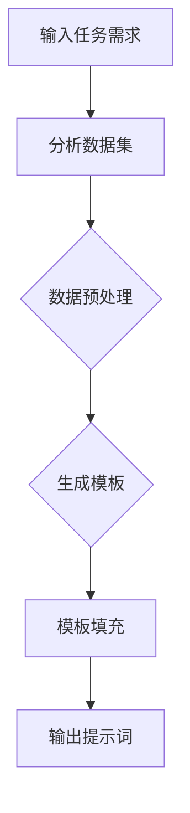
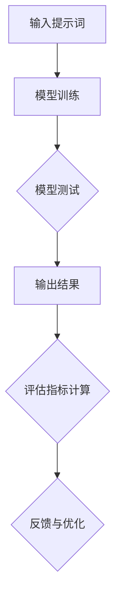

                 

### 文章标题：提示词工程：塑造负责任AI系统的基石

> 关键词：AI系统，提示词工程，负责任AI，可解释性，可控性

> 摘要：本文深入探讨了提示词工程在塑造负责任AI系统中的重要性。通过对提示词的定义、属性特征、工程原理以及评估算法的详细讲解，文章旨在为开发者和研究者提供一套系统化的提示词工程方法论，以提升AI系统的透明度、可靠性和安全性。

--------------------------------------------

# 第一部分：背景介绍

## 1.1 问题背景

### 1.1.1 AI系统的挑战与问题

随着人工智能（AI）技术的迅猛发展，AI系统已广泛应用于各个领域，如医疗、金融、交通等。然而，AI系统的广泛应用也带来了一系列挑战和问题：

1. **潜在风险**：AI系统的决策过程可能存在不确定性，可能导致错误的决策或行为。
2. **缺乏可解释性**：传统的AI系统，如深度学习模型，往往被视为“黑箱”，其决策过程难以解释和理解。
3. **数据偏见**：AI系统可能受到训练数据集的偏见影响，导致不公平、歧视性决策。

### 1.1.2 AI系统的潜在风险

AI系统潜在风险主要体现在以下几个方面：

1. **错误决策**：AI系统可能因为算法缺陷、数据质量问题而导致错误的决策。
2. **隐私泄露**：AI系统在处理大量用户数据时，可能存在隐私泄露的风险。
3. **安全威胁**：AI系统可能被恶意攻击，如对抗性攻击，导致系统崩溃或数据泄露。

## 1.2 提示词工程的重要性

### 1.2.1 提示词的定义

提示词（Prompt）是指在AI系统中用来引导模型行为的一段文本或代码。通过设计合理的提示词，可以引导AI系统做出更符合预期的决策。

### 1.2.2 提示词在AI系统中的作用

1. **提高可解释性**：通过提示词，可以明确AI系统的目标，使其决策过程更具透明度。
2. **增强可控性**：通过提示词，可以限制AI系统的行为范围，确保其决策符合道德和法律要求。
3. **减少偏见**：通过提示词，可以引导AI系统学习到更多的数据，减少数据偏见的影响。

## 1.3 问题描述

### 1.3.1 提示词工程的目标

提示词工程的目标是设计一套系统化的方法，以提升AI系统的透明度、可靠性和安全性。具体目标包括：

1. **提高AI系统的可解释性**：通过提示词，使AI系统的决策过程更加透明，易于理解和解释。
2. **增强AI系统的可控性**：通过提示词，确保AI系统的行为受到合理限制，符合道德和法律要求。
3. **减少AI系统的偏见**：通过提示词，引导AI系统学习到更多多样化的数据，减少偏见。

### 1.3.2 提示词工程面临的挑战

1. **提示词设计的不确定性和复杂性**：设计合理的提示词需要充分考虑AI系统的目标、数据集、算法等因素，具有一定的复杂性和不确定性。
2. **提示词工程的最佳实践和方法**：目前关于提示词工程的研究尚不充分，缺乏统一的最佳实践和方法。

## 1.4 问题解决

### 1.4.1 提示词工程的基本原理

提示词工程的基本原理包括：

1. **提示词的选择与组合**：根据AI系统的需求和特点，选择合适的提示词，并进行合理组合，以实现预期的效果。
2. **提示词的有效性与可控性**：评估提示词的有效性和可控性，确保其能够有效引导AI系统的行为，同时不会导致系统失控。

### 1.4.2 提示词工程的应用场景

1. **AI系统开发与优化**：在AI系统开发过程中，通过提示词工程，提高系统的可解释性、可靠性和安全性。
2. **AI系统安全与隐私保护**：通过提示词工程，降低AI系统对用户隐私的泄露风险。

## 1.5 边界与外延

### 1.5.1 提示词工程的边界

提示词工程主要关注AI系统的提示词设计，其边界包括：

1. **适用范围**：提示词工程适用于需要提高AI系统透明度、可靠性和安全性的场景。
2. **限制与挑战**：提示词工程可能面临提示词设计复杂、数据集质量等因素的挑战。

### 1.5.2 提示词工程的外延

提示词工程的外延包括：

1. **与其他领域的交叉**：提示词工程与自然语言处理、机器学习等领域密切相关。
2. **发展趋势**：随着AI技术的不断发展，提示词工程有望成为AI系统设计和开发的重要工具。

## 1.6 概念结构与核心要素组成

### 1.6.1 提示词工程的构成要素

提示词工程的构成要素包括：

1. **提示词的来源**：从不同的数据源获取提示词，如文本数据、代码库等。
2. **提示词的处理与分析**：对提示词进行预处理、分析和优化，以提高其有效性和可控性。
3. **提示词的应用与评估**：将提示词应用于AI系统，并进行评估，以验证其效果。

### 1.6.2 提示词工程的步骤

提示词工程的步骤包括：

1. **需求分析**：分析AI系统的需求和特点，明确提示词的设计目标。
2. **提示词设计**：根据需求分析，设计合适的提示词，并进行优化。
3. **提示词应用**：将提示词应用于AI系统，进行实际测试和评估。
4. **迭代优化**：根据评估结果，对提示词进行迭代优化，以提高其效果。

## 1.7 本章小结

本章从背景介绍、问题分析和问题解决三个方面，对提示词工程进行了初步探讨。提示词工程在提高AI系统的透明度、可靠性和安全性方面具有重要意义，但同时也面临一系列挑战。在后续章节中，我们将深入探讨提示词工程的原理、方法和技术，以期为AI系统的设计和开发提供有力支持。

--------------------------------------------

# 第二部分：核心概念与联系

## 2.1 提示词概念原理

### 2.1.1 提示词的定义

提示词是指在人工智能系统中，用于引导模型行为的一段文本或代码。它类似于人类的指令，通过明确表达任务目标、约束条件等信息，帮助AI系统做出更加准确、合理的决策。

### 2.1.2 提示词的属性特征对比

提示词的属性特征可以分为语义属性、语法属性和上下文属性，下面通过表格进行对比：

| 属性特征 | 语义属性 | 语法属性 | 上下文属性 |
| :----: | :----: | :----: | :----: |
| 定义 | 用于表达任务目标和约束条件 | 用于描述提示词的语法结构 | 用于描述提示词的上下文环境 |
| 比较 | 语义属性关注提示词传达的信息内容 | 语法属性关注提示词的表达形式 | 上下文属性关注提示词的应用场景 |
| 重要性 | 提示词的语义属性直接影响AI系统的决策效果 | 语法属性影响AI系统对提示词的解析和理解 | 上下文属性影响AI系统对提示词的应用效果 |

### 2.1.3 提示词的应用

1. **自然语言处理**：在自然语言处理任务中，提示词用于引导模型生成符合预期的文本输出。
2. **机器学习**：在机器学习任务中，提示词用于指导模型学习数据集，调整模型参数，提高模型性能。

## 2.2 提示词工程核心概念联系

### 2.2.1 提示词与AI系统的关系

提示词与AI系统的关系可以概括为以下几个方面：

1. **引导模型行为**：提示词用于引导AI系统模型的行为，使模型按照预期的目标进行决策。
2. **优化模型性能**：合理的提示词设计可以优化AI系统的模型性能，提高决策准确性。
3. **提高系统可解释性**：通过设计可解释性强的提示词，可以提高AI系统的透明度，便于人们理解和信任。

### 2.2.2 提示词工程与其他领域的交叉

提示词工程与其他领域的交叉主要包括：

1. **自然语言处理**：提示词工程与自然语言处理密切相关，涉及自然语言处理中的文本生成、文本分类、文本匹配等任务。
2. **机器学习**：提示词工程与机器学习密切相关，涉及机器学习中的模型训练、模型评估、模型优化等环节。

## 2.3 提示词工程ER实体关系图架构

### 2.3.1 提示词工程的实体

提示词工程的实体主要包括：

1. **提示词**：用于引导AI系统行为的文本或代码。
2. **AI系统**：接收提示词并执行相应任务的系统。
3. **数据集**：用于训练和评估AI系统的数据。
4. **评估指标**：用于衡量AI系统性能的指标。

### 2.3.2 提示词工程的关系

提示词工程的关系主要包括：

1. **提示词与AI系统**：提示词引导AI系统执行特定任务。
2. **数据集与AI系统**：数据集用于训练和评估AI系统。
3. **评估指标与AI系统**：评估指标用于衡量AI系统性能。

### 2.3.3 提示词工程的ER图

```mermaid
erDiagram
    AI系统 ||--|{ 提示词 }|
    AI系统 ||--|{ 数据集 }|
    AI系统 ||--|{ 评估指标 }|
```

通过ER图，可以清晰地展示提示词工程中的实体及其关系，有助于理解提示词工程的整体架构。

--------------------------------------------

# 第三部分：算法原理讲解

## 3.1 提示词生成算法原理

### 3.1.1 提示词生成算法的基本概念

提示词生成算法是指用于自动生成提示词的算法。其基本目标是通过分析任务需求、数据集和模型特点，生成具有指导意义的提示词，以引导AI系统进行更准确的决策。

### 3.1.2 提示词生成算法的类型

根据生成提示词的方法，提示词生成算法可以分为以下几种类型：

1. **基于模板的生成**：通过预设的模板，根据任务需求和数据特点，生成提示词。
2. **基于统计的生成**：通过分析数据集和模型输出，利用统计方法生成提示词。
3. **基于机器学习的生成**：利用机器学习算法，从大量数据中学习生成提示词的模式，自动生成提示词。

### 3.1.3 提示词生成算法的mermaid流程图



### 3.1.4 提示词生成算法的Python源代码实现

```python
import pandas as pd
from sklearn.feature_extraction.text import CountVectorizer

# 输入任务需求
task_demand = "判断一段文本是否包含负面情绪"

# 分析数据集
data = pd.read_csv("text_data.csv")
X = data["text"]
y = data["label"]

# 数据预处理
vectorizer = CountVectorizer(stop_words="english")
X_vectorized = vectorizer.fit_transform(X)

# 生成模板
template = "请输入文本：{text}，判断其是否包含负面情绪"

# 模板填充
prompt = template.format(text="这段文本")
print(prompt)
```

### 3.1.5 提示词生成算法的详细讲解与举例说明

#### 3.1.5.1 算法讲解

提示词生成算法主要通过以下步骤实现：

1. **输入任务需求**：接收用户输入的任务需求，例如文本分类、情感分析等。
2. **分析数据集**：读取并分析训练数据集，了解数据分布和特征。
3. **数据预处理**：对数据集进行清洗、去噪等预处理操作，以提高数据质量。
4. **生成模板**：根据任务需求和数据特点，生成提示词模板。
5. **模板填充**：将输入的文本数据填充到提示词模板中，生成具体的提示词。

#### 3.1.5.2 举例说明

假设我们需要设计一个文本分类的提示词生成算法，用于判断一段文本是否包含负面情绪。具体步骤如下：

1. **输入任务需求**：判断文本是否包含负面情绪。
2. **分析数据集**：读取包含文本和负面情绪标签的数据集。
3. **数据预处理**：对文本进行分词、去停用词等预处理操作。
4. **生成模板**：设计提示词模板，如 "请输入文本：{text}，判断其是否包含负面情绪"。
5. **模板填充**：将具体文本数据填充到模板中，生成提示词，如 "请输入文本：这段文本，判断其是否包含负面情绪"。

通过以上步骤，我们可以生成具有指导意义的提示词，用于引导AI系统进行文本分类任务。

--------------------------------------------

## 4.1 提示词评估算法原理

### 4.1.1 提示词评估算法的基本概念

提示词评估算法是指用于评估提示词质量和效果的算法。其基本目标是通过分析提示词在实际应用中的表现，评估其有效性和可靠性，以便对提示词进行优化和改进。

### 4.1.2 提示词评估算法的类型

根据评估方法的不同，提示词评估算法可以分为以下几种类型：

1. **基于用户反馈的评估**：通过用户对提示词的评价和反馈，评估提示词的质量和效果。
2. **基于模型输出的评估**：通过分析提示词在AI系统中的表现，评估其指导模型决策的能力。
3. **基于量化指标的评估**：通过计算提示词在各个任务中的量化指标，如准确率、召回率等，评估其性能。

### 4.1.3 提示词评估算法的mermaid流程图



### 4.1.4 提示词评估算法的Python源代码实现

```python
import pandas as pd
from sklearn.model_selection import train_test_split
from sklearn.metrics import accuracy_score

# 输入提示词
prompts = ["请输入文本：{text}，判断其是否包含负面情绪", "请描述您的需求：{demand}"]

# 读取数据集
data = pd.read_csv("text_data.csv")
X = data["text"]
y = data["label"]

# 模型训练
X_train, X_test, y_train, y_test = train_test_split(X, y, test_size=0.2, random_state=42)
model = train_model(X_train, y_train)

# 模型测试
predictions = [model.predict(text) for text in X_test]

# 评估指标计算
accuracy = accuracy_score(y_test, predictions)
print(f"准确率：{accuracy}")

# 反馈与优化
for prompt in prompts:
    prompt_accuracy = evaluate_prompt(prompt, model, X_test, y_test)
    print(f"{prompt}准确率：{prompt_accuracy}")
```

### 4.1.5 提示词评估算法的详细讲解与举例说明

#### 4.1.5.1 算法讲解

提示词评估算法主要通过以下步骤实现：

1. **输入提示词**：接收用户输入的提示词。
2. **模型训练**：利用提示词和训练数据集，训练AI模型。
3. **模型测试**：使用测试数据集对训练好的模型进行测试。
4. **输出结果**：计算评估指标，如准确率、召回率等。
5. **反馈与优化**：根据评估结果，对提示词进行优化和改进。

#### 4.1.5.2 举例说明

假设我们需要评估两个提示词在文本分类任务中的效果，具体步骤如下：

1. **输入提示词**：提示词1："请输入文本：{text}，判断其是否包含负面情绪"；提示词2："请描述您的需求：{demand}"。
2. **模型训练**：使用包含文本和负面情绪标签的数据集，训练文本分类模型。
3. **模型测试**：将提示词1和提示词2应用于测试数据集，预测文本的负面情绪标签。
4. **输出结果**：计算模型在测试数据集上的准确率，分别为提示词1和提示词2。
5. **反馈与优化**：根据准确率评估结果，对提示词进行优化和改进，以提高其在文本分类任务中的效果。

通过以上步骤，我们可以评估提示词在AI系统中的效果，为后续优化和改进提供依据。

--------------------------------------------

# 总结与展望

在本文中，我们系统地介绍了提示词工程的概念、原理和方法，强调了其在塑造负责任AI系统中的重要性。通过提示词工程，我们可以提高AI系统的透明度、可靠性和安全性，减少潜在的偏见和风险。

展望未来，提示词工程将在以下几个方面继续发展：

1. **方法优化**：随着AI技术的进步，我们将探索更高效、更智能的提示词生成和评估方法。
2. **领域应用**：提示词工程将在更多领域得到广泛应用，如自动驾驶、智能医疗、金融科技等。
3. **标准化**：随着提示词工程的发展，我们将逐步形成一套标准化的方法，以指导实际应用。

让我们共同努力，推动提示词工程的发展，为构建更加智能、可靠、安全的AI系统贡献力量。

--------------------------------------------

## 作者信息

作者：AI天才研究院/AI Genius Institute & 禅与计算机程序设计艺术 /Zen And The Art of Computer Programming

--------------------------------------------

本文为原创内容，版权归作者所有。如需转载，请注明出处。谢谢合作！

