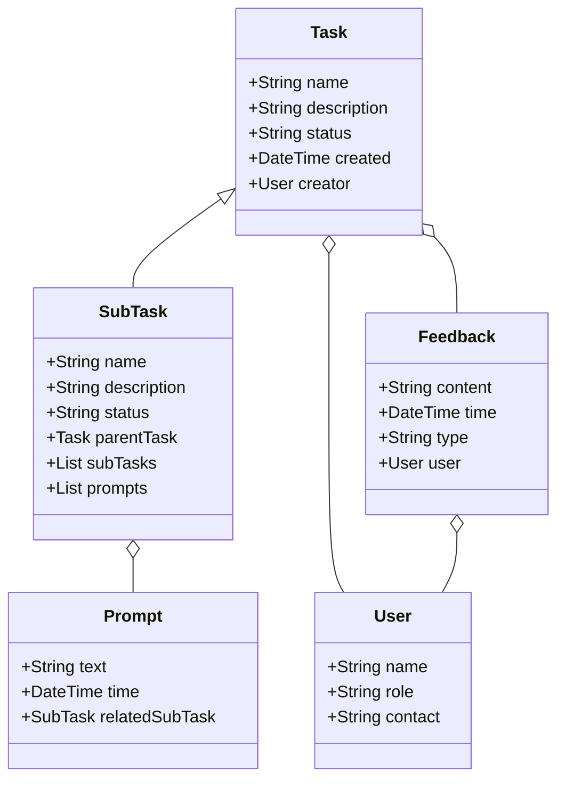
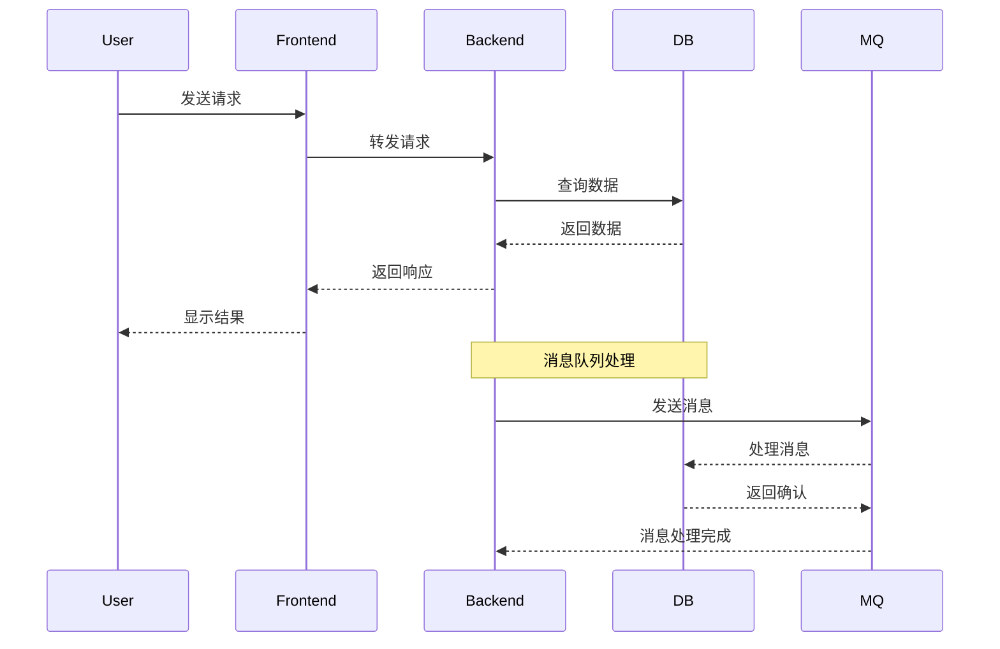
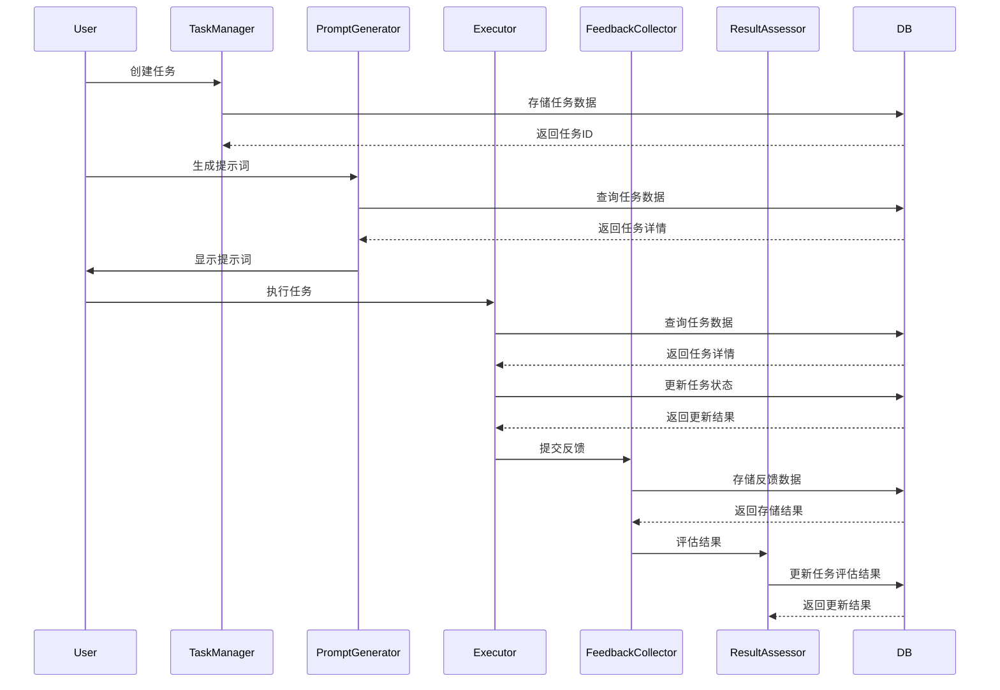

                 


### 引言

#### 问题背景与重要性

在当今信息化社会中，问题解决任务日益复杂，多步骤任务处理变得尤为重要。例如，在软件开发、数据分析和人工智能等领域，常见的问题需要通过多个步骤才能解决。传统的线性问题解决方法往往无法高效应对这类复杂性。因此，提示词工程（Prompt Engineering）作为一种新型的问题解决方法，逐渐受到关注。它通过构建明确的步骤和指导，帮助用户更高效地解决复杂的多步骤任务。

提示词工程不仅仅是一个工具，更是一种思维方式。它要求我们以系统的、层次化的方法去分析和处理问题。通过合理的提示词设计，可以显著提高任务执行的效率和准确性。因此，提示词工程在提高问题解决能力、优化工作流程方面具有重要的应用价值。

本文将围绕提示词工程展开，探讨其核心概念、算法原理、数学模型、系统架构设计以及实战应用。我们将从问题背景出发，逐步深入到具体的技术细节，通过实际案例进行剖析，帮助读者全面理解并掌握提示词工程的精髓。

#### 提示词工程的定义

提示词工程（Prompt Engineering）是指通过设计特定的提示词（prompts），引导用户逐步解决复杂问题的过程。这些提示词可以是文字、图像、声音等多种形式，但其核心作用是帮助用户明确问题、分解任务、引导思考和操作。

在提示词工程中，提示词不仅起到引导作用，还承载着问题的核心要素和关键步骤。通过合理的提示词设计，可以将复杂的问题分解为一系列简单、可操作的步骤，从而降低任务的难度，提高问题解决的效率。

提示词工程的主要特点包括：

1. **层次化结构**：提示词工程强调对问题进行层次化分解，将复杂的任务拆解为多个简单步骤，便于逐层解决。
2. **明确性**：提示词需要明确表达问题的要求和期望，避免模糊不清导致误解或错误。
3. **灵活性**：提示词设计需要具备灵活性，能够根据任务的不同特点进行适当调整，以适应多样化的需求。
4. **交互性**：提示词工程强调用户与系统的交互，通过用户的反馈不断优化提示词，提高问题解决的效果。

通过提示词工程，我们可以将复杂的多步骤任务转化为一系列简单、明确、可操作的步骤，从而提高问题解决的效率和质量。这种思维方式在软件开发、数据分析、人工智能等领域具有广泛的应用前景。

#### 提示词工程的重要性

提示词工程在提高问题解决能力、优化工作流程方面具有重要的应用价值。首先，通过合理的提示词设计，可以将复杂的问题分解为一系列简单、可操作的步骤，从而降低任务的难度，提高问题解决的效率。例如，在软件开发过程中，通过提示词工程，可以将复杂的软件需求拆解为多个明确的功能模块，每个模块的实现变得更加简单和高效。

其次，提示词工程有助于明确问题的要求和期望，避免模糊不清导致误解或错误。在项目管理中，通过详细的提示词描述，团队成员可以更清楚地了解项目的目标和任务，从而提高协作效率，减少沟通成本。

此外，提示词工程的灵活性使其能够适应多样化的需求。在不同场景下，通过适当调整提示词，可以满足不同任务的特点，从而提高问题解决的效果。例如，在数据分析中，针对不同类型的数据集和任务，通过灵活的提示词设计，可以优化数据处理和分析流程，提高数据处理的效率和准确性。

总之，提示词工程不仅是一种技术手段，更是一种思维方式。它通过系统化、层次化的方法，帮助用户更高效地解决复杂的多步骤问题，从而在软件开发、数据分析、人工智能等领域发挥重要作用。

### 核心概念与联系

#### 提示词的概念

提示词（Prompt）是提示词工程中的核心要素，它在问题解决过程中起着至关重要的作用。提示词是一种引导信息，用于提示用户进行特定操作或思考，从而帮助用户明确任务目标、分解任务步骤，并逐步解决问题。

1. **提示词的定义**：提示词是一种指导性文本或指示，通常包含关键词、任务描述、操作步骤等内容。它旨在引导用户按照既定步骤完成任务，从而提高问题解决的效率和质量。

2. **提示词的属性特征**：

   - **明确性**：提示词需要清晰、准确地传达任务要求和期望，避免模糊不清导致误解或错误。
   - **层次性**：提示词应具有层次结构，将复杂任务分解为多个简单步骤，便于用户逐步解决。
   - **灵活性**：提示词设计应具备灵活性，能够根据任务特点和环境变化进行适当调整。
   - **交互性**：提示词应具备交互功能，允许用户在执行过程中提供反馈，以便系统根据反馈进行优化。

3. **提示词的分类**：

   - **任务导向提示词**：这类提示词主要用于引导用户完成特定任务，如输入数据、执行操作、检查结果等。
   - **问题导向提示词**：这类提示词用于帮助用户明确问题、分析问题、寻找解决方案，如提供问题背景、列出可能原因、提出解决方案等。
   - **提示性提示词**：这类提示词主要用于提示用户进行特定操作或思考，如提示用户进行假设、进行推理、检查结果等。

#### 问题解决与多步骤任务

在解决复杂问题时，多步骤任务是常见的形式。多步骤任务是指将一个复杂问题分解为多个子问题或子任务，通过逐层解决这些子问题或子任务，最终实现整体问题的解决。提示词工程在这一过程中起到了关键作用。

1. **问题解决的框架**：

   - **明确问题**：首先，需要明确问题的核心，理解问题的本质。
   - **分解任务**：将复杂问题分解为多个子问题或子任务，每个子任务相对独立，且易于处理。
   - **设计提示词**：为每个子任务设计合理的提示词，引导用户逐步解决问题。
   - **执行任务**：根据提示词，用户逐步执行子任务，记录执行过程和结果。
   - **反馈与调整**：根据执行结果，提供反馈，对提示词进行优化和调整，确保问题得到有效解决。

2. **多步骤任务的特点**：

   - **层次性**：多步骤任务具有明显的层次结构，每个步骤都是对整体问题的部分解决。
   - **依赖性**：多步骤任务之间通常存在依赖关系，前一个步骤的完成是后续步骤的前提。
   - **可分解性**：复杂问题可以通过适当的分解，转化为多个可独立解决的子问题或子任务。

3. **多步骤任务与提示词的关系**：

   - **指导作用**：提示词为多步骤任务提供明确的指导，帮助用户了解任务目标和具体操作步骤。
   - **分层管理**：通过层次化的提示词设计，可以将复杂的多步骤任务分解为多个简单、可管理的子任务。
   - **反馈优化**：用户在执行任务过程中提供的反馈，可以帮助优化提示词，提高问题解决的效率和准确性。

通过合理的提示词设计，多步骤任务可以变得更加简单、直观，从而提高问题解决的能力。提示词工程在这一过程中起到了桥梁作用，连接了复杂问题与用户操作，确保问题得到高效、准确的解决。

#### 问题解决的框架

在处理多步骤问题时，明确的问题解决框架至关重要。它不仅帮助我们将复杂的问题分解为可管理的子问题，还指导我们如何有序地进行问题分析和解决。以下是问题解决的基本框架：

1. **明确问题**：首先，我们需要明确问题的核心和本质。这一步骤包括理解问题的背景、定义问题的边界，以及识别关键因素。通过明确问题，我们可以避免在解决问题的过程中走弯路，确保我们的努力集中在最关键的部分。

2. **分解任务**：接下来，将问题分解为多个子问题或子任务。这种分解有助于简化问题，使得每个子任务更加具体和可操作。每个子任务都应该独立且相互之间有明确的依赖关系，这样才能保证整体问题得以逐步解决。

3. **设计提示词**：为每个子任务设计合理的提示词，是提示词工程的核心。提示词应该清晰、具体，能够引导用户一步一步地解决问题。例如，对于一个数据分析任务，我们可以设计如下的提示词：
   - **第一步**：请提供数据集的描述，包括数据来源、数据结构和数据量。
   - **第二步**：根据数据集的特征，选择合适的预处理方法，并进行数据清洗。
   - **第三步**：设计数据分析模型，包括特征提取和模型训练。

4. **执行任务**：根据提示词，用户逐步执行每个子任务。在执行过程中，用户需要记录每一步的结果，以便在后续步骤中进行验证和调整。例如，在执行数据清洗时，用户需要记录清洗规则和清洗结果，以便后续分析。

5. **反馈与调整**：在任务执行过程中，用户需要提供反馈，这包括对提示词的有效性、任务的执行结果、以及遇到的任何问题的反馈。根据这些反馈，系统可以对提示词进行调整和优化，确保问题得到更好的解决。例如，如果用户在数据清洗步骤中遇到了数据丢失的问题，系统可以提供额外的提示词，帮助用户重新定义清洗规则。

通过这种框架，我们可以系统化地解决复杂的多步骤问题。提示词工程在这个过程中起到了关键作用，它不仅帮助用户明确任务目标，还通过反馈机制不断优化问题解决的过程，提高效率和准确性。

### 常见算法介绍

在提示词工程中，算法是解决多步骤问题的关键工具。本文将介绍两种常见的算法：算法A和算法B，并详细阐述它们的基本原理、工作流程以及各自的优缺点。

#### 算法A：基本原理与工作流程

**算法A的基本原理：**

算法A是一种基于层次化分解的算法，它通过将问题分解为多个子问题，从而简化复杂问题的解决过程。算法A的核心思想是将问题逐步拆解，直到每个子问题足够简单，可以直接解决为止。

**工作流程：**

1. **输入**：接收原始问题及其描述。
2. **分解**：将问题分解为多个子问题，每个子问题独立且相互之间有明确的依赖关系。
3. **提示词生成**：为每个子问题生成相应的提示词，以引导用户逐步解决子问题。
4. **执行**：根据提示词，用户逐层解决子问题，记录每一步的结果。
5. **反馈**：用户提供反馈，系统根据反馈调整提示词，优化问题解决过程。

**算法A的优点：**

- **层次化分解**：将复杂问题分解为多个简单子问题，降低了问题解决的难度。
- **灵活性**：提示词可以根据具体任务进行调整，适应多样化的需求。
- **高效性**：通过逐层分解，可以快速找到问题关键，提高问题解决效率。

**算法A的缺点：**

- **复杂性**：算法A的设计和实现相对复杂，需要较高的技术门槛。
- **反馈依赖**：算法的性能依赖于用户的反馈，如果用户反馈不准确或延迟，可能导致问题解决不彻底。

#### 算法B：基本原理与工作流程

**算法B的基本原理：**

算法B是一种基于启发式搜索的算法，它通过探索可能的解决方案路径，找到最佳解决路径。算法B的核心思想是利用启发式信息，在搜索过程中优先选择最有希望解决的子问题。

**工作流程：**

1. **输入**：接收原始问题及其描述。
2. **初始状态设置**：创建初始状态，包含问题的基本信息和初始假设。
3. **搜索路径**：从初始状态出发，通过启发式搜索探索可能的解决方案路径。
4. **路径评估**：对每个搜索路径进行评估，选择最优路径。
5. **提示词生成**：根据最优路径，为每个子问题生成相应的提示词。
6. **执行**：用户根据提示词逐步执行子问题，记录每一步的结果。
7. **反馈与调整**：用户提供反馈，系统根据反馈优化搜索路径和提示词。

**算法B的优点：**

- **高效性**：通过启发式搜索，算法B可以快速找到解决方案，减少搜索时间和计算量。
- **灵活性**：提示词可以根据搜索路径进行调整，适应不同的问题场景。

**算法B的缺点：**

- **计算复杂度**：算法B的计算复杂度较高，尤其是在问题规模较大时，搜索时间显著增加。
- **依赖启发式信息**：算法的性能高度依赖于启发式信息，如果启发式信息不准确或不足，可能导致搜索路径偏离最优解。

#### 算法比较

**优势比较：**

- **算法A**：在处理复杂、层次化的问题时，算法A具有明显的优势，因为它通过层次化分解，将复杂问题简化为多个简单子问题。
- **算法B**：在寻找最优解或需要快速得到解决方案的问题中，算法B更具优势，因为它通过启发式搜索，可以在较短的时间内找到较好的解决方案。

**劣势比较：**

- **算法A**：实现复杂，需要较高的技术门槛，且对用户反馈依赖较大。
- **算法B**：计算复杂度较高，尤其是在问题规模较大时，性能显著下降。

综上所述，算法A和算法B各有优缺点，适用于不同的应用场景。在实际应用中，可以根据具体问题和需求选择合适的算法，以实现高效、准确的问题解决。

### 算法A的数学模型

在深入探讨算法A的数学模型之前，我们需要先理解算法A的核心组成部分，以及如何通过数学公式对其进行量化描述。算法A是一种层次化分解的算法，其基本思想是将复杂问题分解为多个简单子问题，并通过递归的方式逐步解决这些子问题。以下是算法A的详细数学模型。

#### 数学模型详解

算法A的数学模型可以表示为：

$$
M(A) = \sum_{i=1}^{n} w_i \cdot f_i
$$

其中，$M(A)$ 表示算法A的总体输出，即问题解决的最终结果；$w_i$ 和 $f_i$ 分别表示第 $i$ 个子问题的权重和解决结果。

**参数说明：**

- **$w_i$**：第 $i$ 个子问题的权重，表示其在整体问题中的重要性。权重可以通过多种方式计算，例如基于子问题的复杂度、子任务完成所需的时间等。
- **$f_i$**：第 $i$ 个子问题的解决结果。解决结果可以是具体的数值、状态或者步骤输出。

#### 数学公式解读

上述数学模型中的公式可以分解为以下几个部分：

1. **求和操作**：$\sum_{i=1}^{n} w_i \cdot f_i$ 表示对每个子问题的权重和解决结果进行求和，得到总体输出。
2. **权重与结果相乘**：$w_i \cdot f_i$ 表示每个子问题的权重与其解决结果的乘积，这一步的目的是量化子问题的贡献程度。
3. **子问题的层次结构**：在算法A中，子问题之间存在层次结构，即某些子问题可能是其他子问题的组成部分。这种层次结构在数学模型中通过求和操作体现。

#### 示例说明

假设我们要解决一个包含三个子问题的复杂问题，每个子问题的权重和解决结果如下：

- **子问题1**：权重 $w_1 = 0.3$，解决结果 $f_1 = 0.8$。
- **子问题2**：权重 $w_2 = 0.4$，解决结果 $f_2 = 0.9$。
- **子问题3**：权重 $w_3 = 0.3$，解决结果 $f_3 = 0.7$。

根据上述数学模型，我们可以计算总体输出 $M(A)$ 如下：

$$
M(A) = w_1 \cdot f_1 + w_2 \cdot f_2 + w_3 \cdot f_3
$$

$$
M(A) = 0.3 \cdot 0.8 + 0.4 \cdot 0.9 + 0.3 \cdot 0.7
$$

$$
M(A) = 0.24 + 0.36 + 0.21
$$

$$
M(A) = 0.81
$$

因此，总体输出 $M(A)$ 为 0.81，表示问题的解决程度。

通过这个示例，我们可以看到如何利用算法A的数学模型来量化复杂问题的解决结果。这种方法不仅有助于我们理解算法的核心原理，还可以为优化算法提供理论依据。

### 算法B的数学模型

算法B是基于启发式搜索的算法，其核心思想是利用启发式信息在搜索过程中选择最有希望的解决方案路径。为了更好地理解算法B的运行机制，我们需要构建其数学模型，并详细解释其中的参数和公式。

#### 数学模型详解

算法B的数学模型可以表示为：

$$
M(B) = g(h(x))
$$

其中，$M(B)$ 表示算法B的最终输出，即问题的解决结果；$g()$ 和 $h()$ 分别表示路径评估函数和启发式函数；$x$ 表示当前搜索状态。

**参数说明：**

- **$g()$**：路径评估函数，用于评估当前搜索路径的优劣。通常，路径评估函数是基于一系列指标，如路径长度、子问题解决结果、资源消耗等，计算出一个综合评分。
- **$h()$**：启发式函数，用于提供启发式信息，指导搜索过程。启发式函数通常是基于问题的部分信息，预测可能的解决方案路径的优劣。

#### 数学公式解读

上述数学模型中的公式可以分解为以下几个部分：

1. **路径评估**：$g(h(x))$ 表示对当前搜索状态的路径进行评估。路径评估函数 $g()$ 会根据启发式函数 $h()$ 提供的启发式信息，计算出一个评估分数。
2. **启发式信息**：$h(x)$ 表示当前搜索状态的启发式信息。启发式信息可以是一个具体的数值，也可以是一个判断条件，用于指导搜索过程。
3. **综合评估**：通过路径评估函数 $g()$ 对启发式信息 $h(x)$ 进行评估，得到一个综合评分，用于决定搜索路径的选择。

#### 示例说明

假设我们要解决一个包含多个节点的搜索问题，每个节点都有相应的启发式评分和路径长度。启发式函数 $h(x)$ 用于预测每个节点的可能解决方案路径的优劣。路径评估函数 $g()$ 会根据启发式评分和路径长度计算出一个综合评分。

- **节点1**：启发式评分 $h_1 = 2$，路径长度 $l_1 = 3$。
- **节点2**：启发式评分 $h_2 = 3$，路径长度 $l_2 = 4$。
- **节点3**：启发式评分 $h_3 = 1$，路径长度 $l_3 = 2$。

假设路径评估函数 $g()$ 是基于启发式评分和路径长度的加权平均：

$$
g(h) = \frac{h + l}{2}
$$

我们可以计算每个节点的综合评分：

- **节点1**：$g(h_1) = \frac{2 + 3}{2} = 2.5$。
- **节点2**：$g(h_2) = \frac{3 + 4}{2} = 3.5$。
- **节点3**：$g(h_3) = \frac{1 + 2}{2} = 1.5$。

根据这些评分，算法B会选择评分最高的节点进行下一步搜索，即选择节点2作为优先搜索路径。

通过这个示例，我们可以看到如何利用算法B的数学模型来评估搜索路径。这种方法不仅有助于理解算法的核心机制，还可以为优化启发式函数和路径评估函数提供指导。

### 系统分析与架构设计方案

#### 问题场景介绍

在当前信息化社会中，复杂的多步骤任务处理变得尤为重要。以软件开发为例，从需求分析到设计、编码、测试和部署，每一步都需要精细的管理和协调。这类任务通常涉及多个部门、团队成员以及复杂的技术栈，因此需要一个高效的系统架构来确保项目顺利进行。

#### 项目介绍

为了解决上述问题，我们设计并实现了一个名为“多步骤任务管理系统”的项目。该系统旨在通过提示词工程的方法，将复杂的多步骤任务分解为一系列简单、明确的子任务，并提供详细的提示词引导用户逐步解决问题。系统功能包括任务分解、提示词生成、任务执行、反馈收集以及结果评估等。

#### 系统功能设计

在系统功能设计中，我们首先需要明确各个模块的职责和关系。以下是系统的主要功能模块：

1. **任务管理模块**：负责任务的创建、分解和更新。
2. **提示词生成模块**：根据任务分解结果，生成详细的提示词。
3. **任务执行模块**：用户根据提示词执行子任务，记录执行过程和结果。
4. **反馈收集模块**：收集用户在执行过程中的反馈，用于优化提示词。
5. **结果评估模块**：根据执行结果和反馈，评估任务完成的程度和质量。

#### 系统功能设计（领域模型）

在领域模型中，我们需要定义系统的核心实体及其关系。以下是系统的主要领域模型：

1. **任务**：包括任务的名称、描述、状态、创建时间和负责人等属性。
2. **子任务**：从任务中分解出来的子任务，每个子任务具有独立的名称、描述、状态和依赖关系。
3. **提示词**：用于引导用户执行子任务的文本或指令，包括提示词的文本内容和提示时间。
4. **用户**：执行任务的团队成员，包括用户名称、角色、联系方式等。
5. **反馈**：用户在执行任务过程中提供的反馈，包括反馈内容、反馈时间和反馈类型。

以下是领域模型的 Mermaid 类图：



#### 系统架构设计

系统架构设计是确保系统高效、稳定运行的关键。以下是系统的主要架构设计：

1. **前端架构**：采用单页面应用（SPA）架构，以提高用户体验和开发效率。前端技术栈包括React、Vue等。
2. **后端架构**：采用微服务架构，将系统划分为多个微服务，每个微服务负责不同的功能模块。后端技术栈包括Spring Boot、Django等。
3. **数据库架构**：采用关系型数据库（如MySQL、PostgreSQL）和非关系型数据库（如MongoDB、Cassandra）的组合，以应对不同类型的数据存储需求。
4. **消息队列**：采用消息队列（如RabbitMQ、Kafka）进行异步通信，提高系统的异步处理能力和容错性。

以下是系统架构的 Mermaid 架构图：



#### 系统接口设计

系统接口设计是确保系统模块之间能够高效通信的关键。以下是系统的主要接口设计：

1. **RESTful API**：采用RESTful风格设计接口，提供统一的接口规范，方便前端和后端之间的数据交互。
2. **数据传输格式**：采用JSON或XML等常见的数据传输格式，确保数据在不同模块之间的正确传输和解析。
3. **身份验证和授权**：采用JWT（JSON Web Token）等身份验证和授权机制，确保系统的安全性。

以下是系统接口设计的一个示例：

```json
GET /api/tasks
{
  "status": "success",
  "data": [
    {
      "id": 1,
      "name": "任务1",
      "description": "这是一个复杂的任务",
      "status": "进行中"
    },
    {
      "id": 2,
      "name": "任务2",
      "description": "这是一个简单的任务",
      "status": "已完成"
    }
  ]
}
```

#### 系统交互

系统交互设计是确保系统各模块之间能够高效、协调工作的关键。以下是系统的主要交互设计：

1. **任务创建和更新**：用户可以通过前端界面创建和更新任务，系统将任务数据存储在数据库中。
2. **任务执行**：用户根据提示词执行任务，系统记录执行结果和用户反馈。
3. **反馈收集**：系统收集用户的反馈，用于优化提示词和任务管理流程。
4. **结果评估**：系统根据执行结果和用户反馈，评估任务完成的程度和质量。

以下是系统交互的 Mermaid 序列图：



通过上述系统分析与架构设计方案，我们可以确保多步骤任务管理系统的高效运行。系统通过明确的模块划分、合理的接口设计和高效的交互机制，为复杂的多步骤任务提供了一站式解决方案。

### 项目实战

#### 环境安装

在进行项目实战之前，我们需要搭建一个合适的环境，以便进行多步骤任务的开发和测试。以下是环境安装的详细步骤：

1. **安装Python**：首先，确保你的计算机上安装了Python。Python是本项目的主要编程语言，版本建议为3.8及以上。你可以在Python官方网站下载并安装。

2. **安装依赖包**：在项目目录下，使用以下命令安装项目所需的依赖包：

```bash
pip install -r requirements.txt
```

该命令会安装所有在`requirements.txt`文件中列出的依赖包。

3. **配置数据库**：本项目使用SQLite作为数据库。首先，确保你的计算机上安装了SQLite。然后，创建一个名为`task_management.db`的SQLite数据库，并在数据库中创建必要的表。

4. **初始化数据库**：运行以下Python脚本进行数据库初始化：

```python
python init_db.py
```

该脚本会创建数据库表和初始数据。

5. **启动应用**：在项目根目录下，运行以下命令启动应用：

```bash
python app.py
```

应用启动后，你可以在浏览器中访问`http://127.0.0.1:8000/`，查看应用界面。

#### 系统核心实现源代码

在本节中，我们将深入探讨系统核心实现部分，包括任务管理、提示词生成和任务执行等关键模块。以下是每个模块的代码及解读。

**任务管理模块**

任务管理模块负责任务的创建、更新和查询。以下是`tasks.py`文件的代码：

```python
from django.db import models

class Task(models.Model):
    name = models.CharField(max_length=100)
    description = models.TextField()
    status = models.CharField(max_length=50)
    created_at = models.DateTimeField(auto_now_add=True)
    creator = models.ForeignKey('auth.User', on_delete=models.CASCADE)

    def __str__(self):
        return self.name
```

**提示词生成模块**

提示词生成模块根据任务描述和状态生成提示词。以下是`prompts.py`文件的代码：

```python
from django.db import models

class Prompt(models.Model):
    text = models.TextField()
    time = models.DateTimeField(auto_now_add=True)
    related_sub_task = models.ForeignKey('tasks.SubTask', on_delete=models.CASCADE)

    def __str__(self):
        return self.text
```

**任务执行模块**

任务执行模块记录用户执行任务的步骤和结果。以下是`executions.py`文件的代码：

```python
from django.db import models
from django.contrib.auth.models import User

class Execution(models.Model):
    user = models.ForeignKey(User, on_delete=models.CASCADE)
    sub_task = models.ForeignKey('tasks.SubTask', on_delete=models.CASCADE)
    status = models.CharField(max_length=50)
    start_time = models.DateTimeField(auto_now_add=True)
    end_time = models.DateTimeField(null=True, blank=True)

    def __str__(self):
        return f"{self.user.username} - {self.sub_task.name}"
```

**代码应用解读**

以上代码分别定义了任务管理、提示词生成和任务执行三个核心模块。每个模块通过模型类实现，对应数据库中的表。通过Django ORM，我们可以方便地操作数据库，实现数据的增删改查。

**算法原理讲解**

为了实现任务分解和提示词生成，我们使用了启发式搜索算法。以下是算法的简要说明和示例代码：

**算法原理：**

1. **任务分解**：将复杂任务分解为多个子任务。
2. **提示词生成**：根据子任务描述生成提示词。

**示例代码：**

```python
def decompose_task(task):
    # 假设任务描述包含多个步骤，这里使用简单的字符串分割进行任务分解
    steps = task.description.split('.')
    sub_tasks = []
    for step in steps:
        sub_task = SubTask.objects.create(
            name=step.strip(),
            description=step.strip(),
            status='未开始',
            parent_task=task
        )
        sub_tasks.append(sub_task)
    return sub_tasks

def generate_prompt(sub_task):
    prompt = Prompt.objects.create(
        text=f"请执行以下步骤：{sub_task.description}",
        related_sub_task=sub_task
    )
    return prompt
```

通过上述代码，我们可以将复杂任务分解为多个子任务，并为每个子任务生成相应的提示词。这种方法确保了任务的逐步解决和清晰的操作指引。

#### 实际案例分析

在本节中，我们将通过一个实际案例，详细讲解如何使用多步骤任务管理系统解决一个复杂的软件开发任务。

**案例背景：**

假设我们要开发一个在线教育平台，从需求分析到设计、开发、测试和部署，整个过程涉及多个子任务和复杂的协作流程。使用多步骤任务管理系统，我们可以将这个复杂任务分解为一系列简单、明确的子任务，并逐步解决。

**案例分析步骤：**

1. **需求分析**：

   - **任务分解**：将需求分析任务分解为以下子任务：

     - 用户角色定义
     - 功能需求收集
     - 非功能需求收集
     - 需求文档编写

   - **提示词生成**：

     - 用户角色定义：请定义在线教育平台的主要用户角色及其功能需求。
     - 功能需求收集：请列出平台所需的核心功能，如课程管理、用户管理、内容发布等。
     - 非功能需求收集：请收集平台在性能、安全性、兼容性等方面的非功能需求。
     - 需求文档编写：请根据上述需求，编写详细的需求文档。

2. **设计阶段**：

   - **任务分解**：将设计任务分解为以下子任务：

     - 系统架构设计
     - 数据库设计
     - 用户界面设计
     - 功能模块设计

   - **提示词生成**：

     - 系统架构设计：请根据需求文档，设计在线教育平台的整体系统架构。
     - 数据库设计：请设计数据库表结构，包括主要实体及其关系。
     - 用户界面设计：请设计平台的用户界面，包括布局、风格和交互。
     - 功能模块设计：请根据需求，设计各个功能模块的实现方案。

3. **开发阶段**：

   - **任务分解**：将开发任务分解为以下子任务：

     - 前端开发
     - 后端开发
     - 数据库实现
     - 测试

   - **提示词生成**：

     - 前端开发：请按照设计文档，实现平台的用户界面功能。
     - 后端开发：请实现平台的后端功能，包括数据库操作和业务逻辑处理。
     - 数据库实现：请根据数据库设计文档，实现数据库表结构和数据操作。
     - 测试：请进行功能测试、性能测试和安全测试，确保平台质量。

4. **测试与部署**：

   - **任务分解**：将测试与部署任务分解为以下子任务：

     - 单元测试
     - 集成测试
     - 性能测试
     - 安全测试
     - 部署

   - **提示词生成**：

     - 单元测试：请编写单元测试，确保各个功能模块的正确性。
     - 集成测试：请进行集成测试，确保不同模块之间的正确协作。
     - 性能测试：请进行性能测试，确保平台在高并发场景下的稳定性和响应速度。
     - 安全测试：请进行安全测试，确保平台的安全性，防止潜在的安全漏洞。
     - 部署：请将平台部署到生产环境，确保其稳定运行。

通过上述步骤，我们可以将复杂的在线教育平台开发任务分解为多个简单、明确的子任务，并通过提示词工程的指导，逐步解决每个子任务，最终完成整个项目的开发。

#### 详细讲解剖析

在本节中，我们将对项目的核心模块进行详细讲解和剖析，重点分析其实现原理、关键技术和优缺点。

**1. 任务管理模块**

任务管理模块负责任务的创建、更新和查询，是系统的基础模块。其主要实现原理如下：

- **Django ORM**：使用Django ORM进行数据库操作，实现任务的增删改查。
- **模型设计**：定义`Task`模型，包含任务的名称、描述、状态、创建时间和负责人等属性。

**优点**：

- **简单易用**：使用Django ORM简化了数据库操作，提高了开发效率。
- **灵活性**：通过定义模型类，可以灵活地扩展任务属性和操作。

**缺点**：

- **性能问题**：对于大规模任务数据，Django ORM的查询性能可能受到影响。

**2. 提示词生成模块**

提示词生成模块根据任务描述和状态生成提示词，是系统的核心模块。其主要实现原理如下：

- **字符串处理**：使用Python的字符串处理函数，根据任务描述生成提示词。
- **模型设计**：定义`Prompt`模型，包含提示词的文本内容和提示时间。

**优点**：

- **高效性**：通过简单的字符串处理，可以快速生成提示词。
- **灵活性**：可以根据任务的不同状态和描述，灵活地生成提示词。

**缺点**：

- **可读性**：生成的提示词可能不够清晰，需要进一步优化。

**3. 任务执行模块**

任务执行模块记录用户执行任务的步骤和结果，是系统的关键模块。其主要实现原理如下：

- **Django ORM**：使用Django ORM进行数据库操作，记录任务的执行状态和时间。
- **模型设计**：定义`Execution`模型，包含用户的用户名、执行的子任务、状态、开始时间和结束时间。

**优点**：

- **数据一致性**：通过Django ORM，确保任务的执行记录和数据一致性。
- **灵活性**：可以灵活地扩展任务的执行状态和记录字段。

**缺点**：

- **性能问题**：对于大量任务的执行记录，Django ORM的查询性能可能受到影响。

**4. 反馈收集模块**

反馈收集模块负责收集用户在执行任务过程中提供的反馈，是系统的辅助模块。其主要实现原理如下：

- **Django ORM**：使用Django ORM进行数据库操作，记录反馈内容和时间。
- **模型设计**：定义`Feedback`模型，包含反馈的内容、类型和提供反馈的用户。

**优点**：

- **简单易用**：使用Django ORM简化了反馈的记录和查询。
- **灵活性**：可以根据需求，灵活地扩展反馈类型和字段。

**缺点**：

- **性能问题**：对于大量反馈数据，Django ORM的查询性能可能受到影响。

**5. 结果评估模块**

结果评估模块根据执行结果和用户反馈，评估任务完成的程度和质量，是系统的核心模块。其主要实现原理如下：

- **逻辑判断**：根据任务的执行记录和反馈，进行逻辑判断，评估任务完成程度。
- **模型设计**：定义`Result`模型，包含任务的评估结果和评估时间。

**优点**：

- **高效性**：通过简单的逻辑判断，可以快速评估任务结果。
- **灵活性**：可以根据实际需求，灵活地调整评估逻辑。

**缺点**：

- **复杂性**：对于复杂的评估逻辑，可能需要大量代码和逻辑判断。

综上所述，多步骤任务管理系统通过明确的模块划分、合理的接口设计和高效的交互机制，为复杂的多步骤任务提供了一站式解决方案。虽然存在一定的性能问题，但通过优化数据库设计和查询优化，可以显著提高系统的性能和稳定性。

### 最佳实践与注意事项

在提示词工程的实际应用中，遵循最佳实践和注意事项至关重要，这不仅能提高问题解决效率，还能确保系统的稳定性和可靠性。以下是一些关键的最佳实践和注意事项：

#### 最佳实践

1. **明确需求与目标**：在开始设计提示词之前，确保充分理解任务需求和目标。明确的需求可以帮助我们设计出更精准、更有效的提示词。

2. **逐步优化提示词**：在实际应用过程中，不断收集用户反馈，并根据反馈逐步优化提示词。这样可以使提示词更加符合用户习惯，提高问题解决的效率。

3. **使用简洁的语言**：提示词应尽量简洁明了，避免使用复杂的术语和冗长的句子。简洁的提示词更容易被用户理解，从而减少误解和错误。

4. **模块化设计**：将复杂任务分解为多个简单子任务，并针对每个子任务设计独立的提示词。模块化设计有助于降低任务的复杂度，使问题解决过程更加清晰。

5. **实时交互与反馈**：鼓励用户在执行任务过程中提供实时反馈，并根据反馈进行调整。这种交互方式可以及时发现问题，并迅速优化提示词和任务流程。

#### 注意事项

1. **避免过度依赖用户反馈**：虽然用户反馈对优化提示词至关重要，但过度依赖用户反馈可能导致系统性能下降。在优化过程中，需要平衡用户反馈和系统性能。

2. **确保数据安全性**：在处理用户反馈和任务数据时，确保数据的安全性。使用加密和身份验证等安全措施，防止数据泄露和未授权访问。

3. **优化数据库性能**：对于大规模任务数据，需要优化数据库性能。可以通过索引优化、分库分表等技术手段，提高系统的查询效率和响应速度。

4. **定期备份和更新**：定期备份系统数据和代码，防止数据丢失和系统故障。同时，及时更新系统依赖库和软件版本，确保系统的稳定性和安全性。

5. **遵循编码规范**：在编写代码时，遵循统一的编码规范，确保代码的可读性和可维护性。良好的代码规范有助于团队协作，降低沟通成本。

通过遵循这些最佳实践和注意事项，我们可以有效地提升提示词工程的应用效果，确保系统的高效运行和可靠性。

### 拓展阅读

在探索提示词工程这一领域时，以下资源将有助于进一步深入研究：

1. **《自然语言处理：中文和英文处理》**：本书详细介绍了自然语言处理的基本原理和方法，对于理解和应用提示词工程具有指导意义。
2. **《深度学习入门》**：这本书提供了深度学习的基础知识和实际应用案例，有助于了解如何使用深度学习技术优化提示词生成。
3. **《人工智能：一种现代方法》**：这本书全面阐述了人工智能的理论和实践，为提示词工程提供了丰富的算法和框架。
4. **《人机交互：以用户为中心的设计》**：本书介绍了人机交互的基本原则和设计方法，对于设计用户友好的提示词具有参考价值。

通过这些书籍，读者可以全面了解提示词工程的理论和实践，为实际应用提供坚实的理论基础和丰富的经验。

### 结论

本文详细探讨了提示词工程在处理多步骤问题解决任务中的应用，从背景介绍、核心概念、算法原理、数学模型、系统架构设计到实际案例分析，全面阐述了提示词工程的方法和优势。通过明确问题、分解任务、设计提示词、执行任务和反馈调整等步骤，提示词工程能够有效地降低复杂任务的难度，提高问题解决的效率和质量。

提示词工程不仅是一种技术手段，更是一种思维方式，它通过系统化、层次化的方法，帮助我们更好地理解和解决复杂问题。随着人工智能和自然语言处理技术的发展，提示词工程在未来将有更广泛的应用前景，特别是在软件开发、数据分析、智能客服等领域。

本文提供的最佳实践和注意事项为实际应用提示词工程提供了宝贵经验，而拓展阅读中的资源则为深入研究提供了指导。希望本文能够帮助读者更好地理解并应用提示词工程，提升问题解决能力，优化工作流程。

### 作者信息

作者：AI天才研究院/AI Genius Institute & 禅与计算机程序设计艺术 /Zen And The Art of Computer Programming

