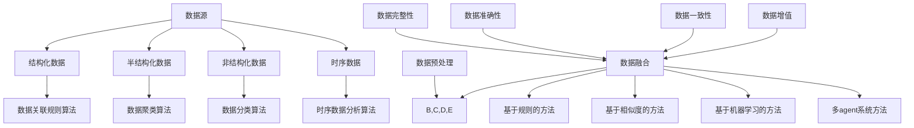
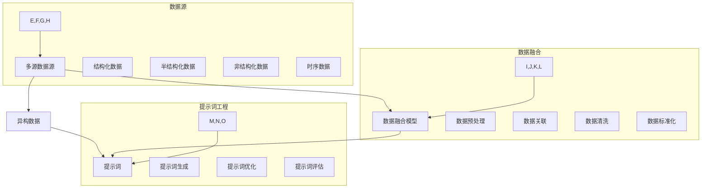

                 

### 1.1 问题背景

在当今数据驱动的时代，数据已成为各行业的重要资产。然而，随着数据来源的多样性和复杂性不断增加，如何有效地处理和融合这些多源异构数据成为一个亟待解决的问题。多源异构数据融合任务，是指在多个数据源中，对来自不同来源、不同格式和不同结构的异构数据进行有效整合，以提取出有价值的信息和知识。这一任务不仅涉及到数据预处理、数据关联和融合算法的设计，还需要考虑数据质量和实时性等因素。

首先，我们来看看数据时代的挑战。随着互联网和物联网的迅速发展，各行各业产生了海量数据，这些数据来自不同的来源，如社交网络、传感器、医疗记录等。这些数据的多样性带来了新的机遇，但也带来了挑战。如何从海量、复杂且动态变化的数据中提取有价值的信息，成为亟待解决的问题。

其次，多源异构数据融合的必要性。多源异构数据融合的目的在于通过整合不同数据源的信息，提高数据分析的准确性和效率，从而支持更智能的决策和更高效的业务流程。例如，在智能医疗领域，通过融合电子健康记录、基因数据和临床数据，可以提供更准确的诊断和个性化治疗方案。在金融领域，通过融合客户交易数据、信用记录和社交媒体数据，可以更准确地评估客户信用风险。

此外，多源异构数据融合的重要性不容忽视。随着数据融合技术的不断发展，我们可以实现更高效的数据分析，更准确的预测和更智能的决策。这不仅有助于企业提高竞争力，也为政府部门和社会组织提供了有力的数据支持。

总的来说，数据时代的挑战促使我们探索更有效的数据处理方法，而多源异构数据融合正是应对这一挑战的关键技术。在接下来的章节中，我们将深入探讨多源异构数据融合的任务定义、核心概念及其在各个领域的应用。

### 1.2 问题定义

#### 1.2.1 多源异构数据

多源异构数据指的是来自不同数据源的数据，这些数据在格式、结构、类型、质量和时效性等方面存在显著差异。具体来说，多源异构数据可以包括以下几种类型：

- **结构化数据**：如关系型数据库中的表格数据，其特征是数据以行和列的形式组织，每列代表一个属性，每行代表一条记录。
- **半结构化数据**：如XML、JSON格式的数据，这些数据有一定的结构，但结构较为灵活，没有固定的模式。
- **非结构化数据**：如文本、图像、音频和视频等，这些数据没有明确的组织结构，通常需要通过特定的方法进行处理和分析。
- **时序数据**：这类数据与时间相关，如股票交易数据、传感器数据等，其特点是数据点以固定的时间间隔产生。

多源异构数据的多样性和复杂性带来了数据融合的挑战，但也为数据融合技术提供了丰富的应用场景。

#### 1.2.2 数据融合的目标

数据融合的目标在于通过整合多个数据源的信息，消除数据之间的不一致性和冗余，从而提高数据的完整性和准确性。具体来说，数据融合的目标包括以下几个方面：

- **数据完整性**：确保融合后的数据能够全面反映现实世界的真实情况，不丢失重要信息。
- **数据准确性**：通过数据清洗、去噪和纠错等手段，提高融合后数据的准确性和可靠性。
- **数据一致性**：消除不同数据源之间的矛盾和冲突，确保融合后数据的一致性和可对比性。
- **数据增值**：通过数据融合，挖掘出原始数据中隐藏的关联和模式，为决策提供有力支持。

#### 1.2.3 数据融合的挑战与机遇

数据融合面临着诸多挑战和机遇。以下是一些主要的挑战：

- **数据格式差异**：不同数据源的数据格式可能完全不同，如结构化数据、半结构化数据和非结构化数据之间的融合需要特别的处理方法。
- **数据质量差异**：不同数据源的数据质量参差不齐，如何处理噪声、缺失和异常值是数据融合的关键问题。
- **数据时效性**：不同数据源的时效性不同，如何实时或近实时地融合数据是一项技术挑战。
- **计算资源限制**：数据融合通常需要大量的计算资源和时间，如何在有限的资源下高效地完成数据融合任务是一项重要问题。

然而，这些挑战也带来了丰富的机遇：

- **大数据分析**：数据融合技术可以大幅提升大数据分析的效果，为各行业提供更深入的洞察和更准确的预测。
- **智能化应用**：通过数据融合，可以实现对复杂系统的智能化监控和管理，提高业务流程的自动化水平。
- **数据价值最大化**：数据融合可以帮助企业挖掘数据中的潜在价值，提高决策的效率和准确性。

总的来说，多源异构数据融合任务具有显著的重要性，它在解决数据多样性和复杂性问题的同时，也为各行业带来了新的机遇。在接下来的章节中，我们将深入探讨数据融合的核心概念和方法。

### 1.3 边界与外延

#### 1.3.1 范围定义

本文的研究范围主要关注多源异构数据融合任务的理论基础、算法实现以及实际应用。具体来说，我们将探讨以下几个方面的内容：

1. **多源异构数据的特点和分类**：介绍不同类型的多源异构数据，包括结构化数据、半结构化数据、非结构化数据和时序数据。
2. **数据融合的目标和挑战**：详细讨论数据融合的任务目标，以及在实际应用中可能遇到的数据格式差异、数据质量差异、数据时效性等挑战。
3. **提示词工程的基础理论**：介绍提示词工程的基本概念、流程以及提示词生成、优化的方法和评估指标。
4. **多源异构数据融合算法**：探讨基于机器学习、深度学习和多agent系统等不同技术路径的数据融合算法，包括其基本原理、实现方法以及评估指标。
5. **实际应用案例分析**：通过具体案例，展示多源异构数据融合在智能医疗、金融风控、智能交通和物联网等领域的应用，以及提示词工程在这些应用中的实际效果。
6. **最佳实践与拓展**：总结多源异构数据融合和提示词工程的最佳实践方法，讨论未来的研究方向和拓展方向。

#### 1.3.2 关键问题剖析

在多源异构数据融合任务中，以下关键问题需要重点关注：

1. **数据预处理**：数据预处理是数据融合的基础，主要包括数据清洗、数据归一化和数据转换等步骤。数据清洗的目标是消除数据中的噪声、异常值和缺失值，提高数据质量；数据归一化的目的是将不同数据源的数据进行标准化处理，使其在相同的尺度上进行比较；数据转换则是将不同格式和类型的数据转换为统一格式，以便后续处理。
   
2. **数据关联和匹配**：多源异构数据之间的关联和匹配是数据融合的关键环节。数据关联是指找到不同数据源中具有相同或相似属性的数据项，而数据匹配则是通过一定的算法，将不同数据源中的相关数据项进行匹配。常用的数据关联和匹配方法包括基于规则的方法、基于相似度的方法和基于机器学习的方法。

3. **融合算法选择**：选择合适的融合算法是实现有效数据融合的关键。根据不同的应用场景和数据特点，可以选择基于传统机器学习算法、深度学习算法以及多agent系统等不同路径的融合方法。每种方法都有其优势和局限性，需要根据实际情况进行选择和调整。

4. **数据质量评估**：数据质量评估是确保融合后数据准确性和可靠性的重要手段。通过评估数据的一致性、完整性、准确性和实时性，可以判断数据融合的效果，并为后续的数据分析和决策提供依据。

5. **实时性与效率**：在实际应用中，数据融合任务通常需要在有限的时间内完成，特别是对于实时性要求较高的应用场景。因此，如何在保证数据质量的前提下，提高数据融合的效率和实时性，是一个重要的研究课题。

#### 1.3.3 研究方法与步骤

本文采用的研究方法主要包括文献综述、案例分析、算法实现和实验验证。具体步骤如下：

1. **文献综述**：通过对相关文献的系统回顾和梳理，了解多源异构数据融合和提示词工程的理论基础和发展动态，为后续研究提供理论支持。

2. **案例分析**：选取具有代表性的应用案例，分析其在数据融合过程中面临的具体问题和解决方案，总结经验教训。

3. **算法实现**：根据案例分析的结果，设计和实现相应的数据融合算法，包括数据预处理、数据关联和匹配、融合算法选择等步骤。通过Python等编程语言实现算法，并进行详细的代码注释和文档说明。

4. **实验验证**：通过实验验证所设计的算法在实际应用中的效果，包括数据质量评估、实时性评估和效率评估等。对比不同算法的性能，优化和改进算法设计。

5. **总结与拓展**：总结研究的主要发现和结论，提出未来研究的方向和拓展方向，为相关领域的进一步研究提供参考。

通过以上研究方法与步骤，本文旨在深入探讨多源异构数据融合任务的理论和实践，为相关领域的研究和应用提供有益的参考。

### 1.4 核心概念

#### 1.4.1 提示词

提示词（Keywords）在数据融合任务中起着关键作用。提示词是指用于描述数据特征和属性的词汇或短语，它们可以帮助我们识别和关联来自不同数据源的数据。提示词的选取和生成是数据融合过程中的重要环节。

**定义**：提示词是用于描述和识别数据特征的关键词汇，通常通过数据预处理、分析挖掘和机器学习等方法生成。

**作用**：提示词在数据融合中的主要作用包括：

- **数据关联**：通过匹配和关联不同数据源中的提示词，可以找到具有相同或相似属性的数据项。
- **数据分类**：提示词可以用于对数据进行分类和聚类，从而更好地理解和分析数据。
- **数据增强**：通过生成新的提示词，可以扩展数据的语义信息，提高数据融合的效果。

#### 1.4.2 数据融合

数据融合是指将来自多个数据源的数据进行整合和分析，以提取出更全面、更准确的信息和知识。数据融合的目标是消除数据之间的不一致性和冗余，提高数据的完整性和准确性。

**定义**：数据融合是将多个数据源中的数据通过特定的算法和技术进行整合和分析，以提取出有价值的信息和知识的过程。

**目的**：数据融合的主要目的是：

- **数据完整性**：确保融合后的数据能够全面反映现实世界的真实情况，不丢失重要信息。
- **数据准确性**：通过数据清洗、去噪和纠错等手段，提高融合后数据的准确性和可靠性。
- **数据一致性**：消除不同数据源之间的矛盾和冲突，确保融合后数据的一致性和可对比性。
- **数据增值**：通过数据融合，挖掘出原始数据中隐藏的关联和模式，为决策提供有力支持。

#### 1.4.3 异构数据

异构数据是指具有不同结构和类型的数据。在数据融合任务中，异构数据包括结构化数据、半结构化数据、非结构化数据和时序数据等。异构数据的处理和融合是数据融合任务中的一个重要挑战。

**定义**：异构数据是指具有不同结构和类型的数据，包括结构化数据、半结构化数据、非结构化数据和时序数据等。

**类型**：异构数据主要包括以下几种类型：

- **结构化数据**：如关系型数据库中的表格数据，其特征是数据以行和列的形式组织，每列代表一个属性，每行代表一条记录。
- **半结构化数据**：如XML、JSON格式的数据，这些数据有一定的结构，但结构较为灵活，没有固定的模式。
- **非结构化数据**：如文本、图像、音频和视频等，这些数据没有明确的组织结构，通常需要通过特定的方法进行处理和分析。
- **时序数据**：这类数据与时间相关，如股票交易数据、传感器数据等，其特点是数据点以固定的时间间隔产生。

**处理挑战**：异构数据的处理和融合面临以下挑战：

- **数据格式差异**：不同数据源的数据格式可能完全不同，如结构化数据、半结构化数据和非结构化数据之间的融合需要特别的处理方法。
- **数据质量差异**：不同数据源的数据质量参差不齐，如何处理噪声、缺失和异常值是数据融合的关键问题。
- **数据时效性**：不同数据源的时效性不同，如何实时或近实时地融合数据是一项技术挑战。

**融合方法**：针对异构数据的处理和融合，可以采用以下几种方法：

- **基于规则的融合方法**：通过定义一系列规则，将不同数据源中的相关数据进行匹配和融合。
- **基于相似度的融合方法**：通过计算不同数据源之间的相似度，找到具有相似属性的数据项进行融合。
- **基于机器学习的融合方法**：利用机器学习算法，自动发现和提取数据中的关联和模式，实现异构数据的融合。

通过明确上述核心概念，我们可以更好地理解和处理多源异构数据融合任务，为实际应用提供有效的解决方案。

### 1.5 概念属性特征对比

为了更好地理解和比较多源异构数据与数据融合方法，我们在此提供一张详细的属性特征对比表格，以及一个ER实体关系图架构，用以展示各概念之间的关系。

#### 表格：多源异构数据与数据融合方法属性特征对比

| 概念       | 类型             | 特征属性                                                                                              | 应用示例                                  |
|------------|------------------|-----------------------------------------------------------------------------------------------------|------------------------------------------|
| 多源异构数据 | 结构化、半结构化、非结构化、时序数据 | - 结构化：行列组织，属性固定<br>- 半结构化：有结构但灵活，无固定模式<br>- 非结构化：无明确结构，如文本、图像<br>- 时序数据：与时间相关  | 数据库、XML、文本文件、传感器数据         |
| 数据融合目标 | 数据完整性、数据准确性、数据一致性、数据增值 | - 数据完整性：无信息丢失<br>- 数据准确性：提高数据质量<br>- 数据一致性：消除冲突和矛盾<br>- 数据增值：挖掘潜在价值 | 智能医疗、金融风控、智能交通              |
| 数据融合方法 | 基于规则、基于相似度、基于机器学习、多agent系统 | - 基于规则：手工定义规则<br>- 基于相似度：计算相似度匹配<br>- 基于机器学习：自动发现模式<br>- 多agent系统：分布式处理  | 数据关联、数据清洗、自动化分析、实时数据融合 |

#### ER实体关系图架构



上述ER实体关系图展示了多源异构数据与数据融合方法之间的复杂关系。图中的每个节点代表一个实体，如数据源、数据类型、数据融合目标和数据融合方法，每个箭头表示实体之间的关系。通过这样的架构，我们可以清晰地看到多源异构数据是如何通过不同的数据预处理和融合方法，实现数据完整性、准确性、一致性和增值的目标。

### 1.6 ER实体关系图架构

为了更直观地展示多源异构数据融合任务中的核心实体及其关系，我们使用Mermaid图形化工具绘制了一个ER（实体关系）图架构。以下是一个简单的Mermaid代码示例，描述了多源异构数据、数据融合模型、提示词以及它们之间的关系。



这段Mermaid代码生成了一个层次分明的ER图，其中：

- **A[多源数据源]** 表示多个数据源，可以是结构化数据、半结构化数据、非结构化数据和时序数据。
- **B[数据融合模型]** 表示数据融合的核心模型，负责数据的预处理、关联、清洗和标准化。
- **C[异构数据]** 表示不同类型的异构数据，与多源数据源相连，表明它们是数据融合的基础。
- **D[提示词]** 表示在数据融合过程中用于描述和关联数据的提示词。
- **subgraph** 表示对某些实体或关系的分类和分组，如数据源、数据融合和数据提示词工程。

通过这个ER图架构，我们可以清晰地看到多源异构数据、数据融合模型和提示词之间的相互关系，有助于理解整个数据融合任务的整体框架和实现步骤。

### 1.7 本章小结

本章详细介绍了多源异构数据融合任务的问题背景、定义及其核心概念。首先，我们探讨了数据时代的挑战，如数据多样性和复杂性，并阐述了多源异构数据融合的必要性和重要性。接着，我们定义了多源异构数据，并明确了数据融合的目标和挑战。本章还详细介绍了多源异构数据的类型和处理挑战，讨论了数据融合的目标和方法，并通过属性特征对比表格和ER实体关系图架构展示了核心概念之间的联系。通过这些内容，我们为后续章节关于提示词工程和多源异构数据融合算法的深入讨论奠定了基础。

### 2.1 提示词工程概述

#### 2.1.1 提示词的定义

提示词（Keywords）是数据融合任务中的核心要素，用于描述和识别数据中的关键特征。提示词的定义可以从多个角度进行解释。在技术层面，提示词是指那些能够代表数据属性和特征的关键词汇或短语，它们能够帮助数据分析师和算法模型快速定位和关联相关数据。例如，在医疗数据中，提示词可以是“高血压”、“糖尿病”等疾病名称；在金融数据中，提示词可以是“贷款”、“信用卡”等业务关键词。

提示词的选择标准通常包括以下几个方面：

1. **代表性**：提示词应能够代表数据中重要的属性和特征，具有较高的识别度和代表性。
2. **独特性**：提示词应具有独特的含义，避免与其他词汇混淆，确保其准确性和可区分性。
3. **相关性**：提示词应与数据融合任务的目标高度相关，能够有效地帮助数据关联和融合。
4. **可扩展性**：提示词应具备一定的灵活性，可以扩展到其他相关领域或数据源，方便后续的数据处理和应用。

#### 2.1.2 提示词工程的作用

提示词工程是数据融合任务中的关键环节，其作用主要体现在以下几个方面：

1. **数据关联**：提示词可以帮助不同数据源中的数据项进行匹配和关联，实现异构数据的统一和整合。例如，在融合医疗数据和基因数据时，通过提示词“基因突变”可以实现两者之间的有效关联。
2. **数据分类**：提示词可以用于对数据项进行分类和聚类，从而更好地理解和分析数据。例如，在电子商务领域，通过提示词“商品类型”、“用户行为”等可以实现对商品和用户行为的分类。
3. **数据增强**：提示词的生成和优化可以扩展数据的语义信息，提高数据的价值和利用效率。例如，在自然语言处理中，通过生成新的提示词可以增强文本数据的语义表达，提高文本分类和情感分析的准确性。
4. **模型训练**：提示词在机器学习和深度学习模型中发挥着重要作用。通过提示词，模型可以更有效地学习数据中的模式和关联，提高模型的泛化能力和性能。

#### 2.1.3 提示词工程的基本流程

提示词工程的基本流程包括以下几个步骤：

1. **数据预处理**：对原始数据进行清洗、去噪和标准化处理，确保数据的质量和一致性。这一步骤是提示词工程的基础，直接影响后续的数据分析和模型训练效果。
2. **提示词提取**：从预处理后的数据中提取关键特征和属性，生成初步的提示词集合。常用的方法包括基于规则的方法、基于统计的方法和基于机器学习的方法。
3. **提示词优化**：对提取出的提示词进行筛选和优化，去除冗余和不相关的内容，保留最具代表性的关键词。优化过程可以基于相关性、重要性和一致性等指标进行。
4. **提示词评估**：对优化后的提示词进行评估，确保其有效性和准确性。评估指标包括提示词的覆盖率、准确率、召回率等。
5. **提示词应用**：将评估通过的提示词应用于实际的数据融合任务中，如数据关联、分类、聚类和模型训练等。

通过上述基本流程，提示词工程能够有效地提升数据融合的效率和效果，为各行业的数据处理和分析提供有力支持。

### 2.2 数据预处理

#### 2.2.1 数据清洗

数据清洗是数据预处理过程中的关键步骤，其目的是消除数据中的噪声、异常值和缺失值，确保数据的质量和一致性。数据清洗主要包括以下几种方法：

1. **去除重复数据**：通过识别和删除重复的数据项，减少数据冗余，提高数据的有效性。
2. **填充缺失值**：对缺失的数据项进行填充，可以使用平均值、中位数、众数等方法，或者利用机器学习算法进行预测填充。
3. **处理异常值**：识别和修正数据中的异常值，可以采用统计方法（如Z分数、IQR法）或基于机器学习的异常检测算法。
4. **数据格式转换**：统一数据格式，如将日期格式转换为YYYY-MM-DD，将字符串转换为数值等。

数据清洗的具体步骤如下：

1. **识别重复数据**：通过数据库中的唯一索引或哈希值识别重复的数据项，删除重复记录。
2. **填充缺失值**：根据数据的特性和需求，选择合适的填充方法。例如，对于数值型数据，可以使用平均值填充；对于分类数据，可以使用最频繁出现的类别填充。
3. **处理异常值**：使用统计方法和机器学习算法识别异常值，并进行修正或删除。例如，使用Z分数法识别远离均值的数据点，使用K-means聚类算法识别异常数据簇。
4. **格式转换**：将不同格式的数据转换为统一的格式，便于后续处理和分析。例如，将日期格式统一为YYYY-MM-DD，将文本数据转换为数值编码。

数据清洗在提示词工程中的作用至关重要。通过有效的数据清洗，可以确保生成提示词的质量和准确性，从而提升数据融合的效果。此外，数据清洗还能够减少数据预处理的时间和计算资源消耗，提高整体数据处理的效率。

### 2.2.2 数据归一化

数据归一化是数据预处理过程中的一种重要方法，其目的是将不同数据源中的数据转换为统一的尺度，使其在相同的尺度上进行比较和分析。数据归一化对于多源异构数据的融合尤为重要，因为不同数据源的数值范围和分布特征可能存在显著差异。

数据归一化的主要方法包括以下几种：

1. **最小-最大缩放**：将数据映射到[0, 1]范围内，公式为：
   $$ x_{\text{norm}} = \frac{x - x_{\text{min}}}{x_{\text{max}} - x_{\text{min}}} $$
   其中，$x_{\text{min}}$和$x_{\text{max}}$分别为数据的最小值和最大值。

2. **Z-score标准化**：将数据转换为标准正态分布，公式为：
   $$ z = \frac{x - \mu}{\sigma} $$
   其中，$\mu$和$\sigma$分别为数据的均值和标准差。

3. **小数点位移**：通过调整小数点的位置，将数据映射到[0, 1]或[-1, 1]范围内，适用于数值范围较小的数据。

数据归一化的步骤如下：

1. **计算每个特征的统计信息**：计算每个数据特征的最小值、最大值、均值和标准差。

2. **应用归一化公式**：根据所选的归一化方法，将原始数据转换为统一尺度。

3. **验证归一化效果**：通过对比归一化前后的数据分布和特征差异，验证归一化的有效性。

数据归一化在提示词工程中的作用主要体现在以下几个方面：

- **消除尺度差异**：不同数据源的数据可能具有不同的数值范围和分布特征，通过归一化可以消除这些差异，使数据在相同的尺度上进行比较和分析。
- **提高模型性能**：归一化可以减少数据之间的尺度差异，提高机器学习模型的训练效果和泛化能力。
- **优化提示词生成**：归一化后的数据可以更准确地提取出关键特征和属性，从而生成更具代表性的提示词。

总之，数据归一化是提升数据融合质量和效率的重要手段，对于实现高效、准确的数据分析和决策具有重要意义。

### 2.2.3 数据转换

数据转换是数据预处理过程中的一个重要步骤，其目的是将不同格式和类型的数据转换为统一的格式，以便进行后续的数据融合和分析。数据转换主要包括以下几种方法：

1. **数据类型转换**：将不同类型的数据转换为同一类型，例如，将字符串数据转换为数值型数据，或将日期时间字符串转换为日期时间对象。

2. **数据格式转换**：将不同格式的数据转换为统一的格式，例如，将XML数据转换为JSON格式，或将CSV文件转换为Parquet文件。

3. **缺失值处理**：处理数据中的缺失值，例如，使用平均值、中位数、众数等方法进行填充，或利用机器学习算法进行预测填充。

4. **数据标准化**：对数据进行标准化处理，例如，将不同数据源中的数据映射到[0, 1]或[-1, 1]范围内，以提高数据的一致性和可比性。

数据转换的具体步骤如下：

1. **识别数据格式和类型**：首先，需要识别数据源中的数据格式和类型，了解每个数据项的属性和特征。

2. **定义转换规则**：根据数据格式和类型，定义相应的转换规则。例如，对于日期时间数据，可以定义转换为特定格式的日期时间对象；对于字符串数据，可以定义转换为数值型数据的方法。

3. **执行转换操作**：根据定义的转换规则，对数据进行逐项转换，确保所有数据项符合统一的格式和类型。

4. **验证转换结果**：对转换后的数据进行验证，确保数据转换的正确性和一致性。可以通过对比转换前后的数据分布和特征差异，验证转换的有效性。

数据转换在提示词工程中的作用主要体现在以下几个方面：

- **统一数据格式**：通过数据转换，可以将不同数据源中的数据格式和类型统一为同一格式，便于后续的数据分析和处理。
- **提高数据质量**：数据转换可以消除数据之间的不一致性和冗余，提高数据的完整性和准确性。
- **优化提示词生成**：统一格式和类型的数据可以更准确地提取出关键特征和属性，从而生成更具代表性的提示词。

总之，数据转换是确保数据融合任务顺利进行的重要环节，对于提升数据融合质量和效率具有重要意义。

### 2.3 提示词生成

提示词生成是提示词工程中的关键环节，其目的是从多源异构数据中提取出具有代表性的关键词，以便进行数据关联和融合。提示词生成的方法多种多样，常见的有以下几种：

1. **基于规则的方法**：通过预先定义的规则，从数据中提取关键词。例如，在医疗数据中，可以根据疾病名称、症状和治疗方法等关键词进行提示词提取。
   
2. **基于统计的方法**：利用数据统计特征，如词频、互信息等，识别高频出现且与任务相关的关键词。这种方法适用于文本数据的处理。

3. **基于机器学习的方法**：利用机器学习算法，如朴素贝叶斯、支持向量机等，对数据进行分类和聚类，提取具有相似属性的提示词。

4. **深度学习方法**：利用深度神经网络，如卷积神经网络（CNN）、循环神经网络（RNN）等，自动提取数据中的高层次特征。

#### 提示词提取算法

提示词提取算法的核心是找到数据中的关键特征和属性，常用的算法包括：

- **TF-IDF（词频-逆文档频率）**：通过计算词频和逆文档频率，确定关键词的重要性。公式为：
  $$ TF-IDF(t,d) = TF(t,d) \times IDF(t) $$
  其中，$TF(t,d)$为词$t$在文档$d$中的词频，$IDF(t)$为词$t$在所有文档中的逆文档频率。

- **LSA（潜在语义分析）**：通过计算词之间的相似度，识别与任务相关的关键词。LSA使用奇异值分解（SVD）来降低数据的维度，从而找到潜在语义相关的词组。

- **LDA（主题模型）**：通过隐含狄利克雷分配（LDA）算法，从文本数据中提取潜在的主题，每个主题对应一组关键词。LDA公式为：
  $$ P(z|w) \propto \frac{P(\theta|z)P(w|\theta)}{\sum_j P(\theta_j|z)P(w_j|\theta)} $$
  其中，$z$表示主题，$w$表示词汇，$\theta$表示文档分布，$\alpha$和$\beta$为超参数。

#### 提示词生成策略

提示词生成策略是指在提示词提取过程中，如何选择和生成具有代表性的关键词。常见的策略包括：

- **关键词筛选**：根据词频、TF-IDF值、LDA主题概率等指标，选择高频且与任务相关的关键词。

- **词集合并**：将具有相似属性的词汇合并成词集，提高提示词的概括性和代表性。

- **动态调整**：根据任务需求和数据特性，动态调整提示词的生成策略，以适应不同的数据融合场景。

#### 提示词评估指标

提示词评估是确保提示词有效性和准确性的关键步骤。常用的评估指标包括：

- **准确率（Accuracy）**：正确识别的提示词占总提示词的比例。

- **召回率（Recall）**：正确识别的提示词在所有实际提示词中的比例。

- **F1分数（F1 Score）**：综合准确率和召回率的指标，计算公式为：
  $$ F1 = 2 \times \frac{Precision \times Recall}{Precision + Recall} $$
  其中，Precision为精确率，即正确识别的提示词占识别出的所有提示词的比例。

通过上述方法，可以有效地从多源异构数据中生成高质量的提示词，为数据融合任务提供有力的支持。

### 2.4 提示词优化

#### 2.4.1 优化目标

提示词优化是提升数据融合效果的关键环节，其目标主要包括以下几个方面：

1. **提高提示词的代表性**：通过优化，确保生成的提示词能够准确反映数据的本质特征和属性，提高提示词的概括性和代表性。
2. **减少冗余和不相关提示词**：去除那些冗余或与数据融合任务无关的提示词，以避免对后续数据分析和模型训练造成干扰。
3. **增强提示词的鲁棒性**：优化后的提示词应具有更强的鲁棒性，能够适应不同的数据源和数据特性，提高提示词在多种场景下的适用性。
4. **提升提示词的准确性**：通过优化算法，提高提示词识别和匹配的准确性，减少错误匹配和漏匹配的情况。

#### 2.4.2 优化方法

提示词优化的方法多种多样，以下介绍几种常见的优化策略：

1. **基于机器学习的优化**：利用机器学习算法，如决策树、支持向量机等，对提示词进行分类和筛选。通过训练模型，识别出高质量的提示词，并排除低质量的提示词。

2. **基于规则的方法**：根据任务需求和数据特性，定义一系列规则，对提示词进行筛选和优化。例如，可以设置阈值，只保留高于阈值的提示词。

3. **基于统计的方法**：利用统计指标，如词频、互信息等，对提示词进行评估和排序。选择高频、高相关性的提示词作为优化的重点。

4. **基于集群的优化**：通过聚类算法，如K-means、DBSCAN等，将提示词划分为不同的簇。对每个簇中的提示词进行评估和优化，提高整个集合的代表性。

#### 2.4.3 优化案例分析

以下是一个提示词优化案例，展示如何在实际应用中优化提示词：

**案例背景**：某智能医疗系统中，需要从电子健康记录中提取关键提示词，用于疾病诊断和患者管理。然而，由于数据源多样性和数据质量问题，初提取的提示词存在一定的不准确和冗余。

**优化过程**：

1. **数据清洗**：首先，对原始电子健康记录进行数据清洗，去除重复记录、缺失值和异常值，提高数据质量。

2. **初步提示词提取**：使用TF-IDF算法，从清洗后的数据中提取初步的提示词集合。这一步生成了大量关键词，但其中存在很多冗余和不相关的词。

3. **基于规则的优化**：定义一系列规则，如保留词频大于一定阈值的词，排除特定符号和停用词。通过规则筛选，初步减少了冗余提示词。

4. **机器学习优化**：利用支持向量机（SVM）模型，对提示词进行分类和筛选。通过训练模型，识别出高质量的提示词，并排除低质量的提示词。这一步骤提高了提示词的准确性和代表性。

5. **基于集群的优化**：使用K-means聚类算法，将提示词划分为不同的簇。对每个簇中的提示词进行评估和优化，选择最具代表性的提示词。这一步骤进一步减少了冗余提示词，提高了提示词集合的概括性。

**优化结果**：通过上述优化方法，生成的提示词集合的质量显著提升。准确率和召回率均有所提高，冗余和不相关提示词减少，提示词的代表性更强，为后续的数据融合和疾病诊断提供了有力支持。

总之，提示词优化是一个复杂且关键的过程，通过多种优化策略和实际案例的验证，可以显著提升提示词的质量和效果，为数据融合任务提供坚实的基础。

### 2.5 提示词应用场景

#### 2.5.1 数据挖掘

数据挖掘是提示词工程的重要应用场景之一。通过提示词，数据挖掘算法能够更有效地从大规模数据集中提取有价值的信息和模式。具体来说，提示词在数据挖掘中的应用包括以下几个方面：

1. **特征选择**：在数据挖掘过程中，提示词可以帮助识别和选择最重要的特征，提高模型性能和效率。通过分析提示词的重要性得分，可以筛选出最具代表性的特征，减少冗余和噪声。

2. **数据预处理**：提示词可以用于数据清洗和格式转换，统一数据格式和特征空间，提高数据一致性。例如，在文本数据挖掘中，通过提示词生成词袋模型，将文本转换为向量表示，便于后续的机器学习算法处理。

3. **模式识别**：提示词在模式识别中起到关键作用，可以帮助识别数据中的潜在关联和趋势。通过分析提示词的频率和分布，可以发现数据中的异常值、异常模式和关联关系，为数据分析和决策提供依据。

#### 2.5.2 机器学习

提示词工程在机器学习中的应用同样广泛。在机器学习任务中，提示词不仅用于特征提取和选择，还用于优化模型性能和提升预测准确性。以下是几个关键应用场景：

1. **特征工程**：提示词可以帮助生成高质量的输入特征，提高机器学习模型的预测能力。通过分析提示词的统计信息和高相关性，可以构建有效的特征组合，增强模型的泛化能力。

2. **模型调优**：在机器学习训练过程中，提示词可以用于调整模型参数和超参数。通过分析提示词的重要性，可以优化模型的架构和训练策略，提高模型的性能和稳定性。

3. **模型解释性**：提示词可以提高模型的可解释性，帮助用户理解模型的预测逻辑和决策过程。通过分析提示词的分布和相关性，可以揭示数据中的关键特征和模式，为业务决策提供支持。

#### 2.5.3 自然语言处理

自然语言处理（NLP）是提示词工程的另一重要应用领域。在NLP任务中，提示词用于文本分析、情感分析、命名实体识别等，极大地提升了任务的准确性和效率。以下是几个具体应用场景：

1. **文本分类**：通过提示词，可以有效地识别和分类不同类别的文本。在文本分类任务中，提示词可以用于生成词袋模型或词嵌入，提高分类模型的性能。

2. **情感分析**：提示词可以帮助识别文本中的情感和态度。通过分析提示词的频率和情感倾向，可以判断文本的情感极性，如正面、负面或中性。

3. **命名实体识别**：在命名实体识别任务中，提示词可以用于识别和分类文本中的特定实体，如人名、地名、组织名等。通过结合提示词和规则，可以提高命名实体识别的准确率和召回率。

总之，提示词工程在数据挖掘、机器学习和自然语言处理等领域的应用，极大地提升了数据处理和分析的效率和质量，为各行业的数据驱动的决策提供了有力支持。

### 2.6 本章小结

本章详细介绍了提示词工程的基础概念、基本流程及其在数据挖掘、机器学习和自然语言处理等领域的应用。首先，我们阐述了提示词的定义、作用以及选择标准，并通过具体的算法和策略，探讨了如何从多源异构数据中提取高质量的提示词。接着，我们讨论了提示词优化的目标和方法，并通过实际案例展示了优化过程和效果。最后，我们分析了提示词工程在数据挖掘、机器学习和自然语言处理等领域的应用场景，展示了其重要性和广泛性。通过这些内容，我们为后续章节关于多源异构数据融合算法的讨论奠定了基础。

### 3.1 数据融合基础算法

数据融合基础算法是处理多源异构数据融合任务的核心技术，这些算法包括数据关联规则算法、数据聚类算法和数据分类算法。每种算法都有其独特的原理和适用场景，下面我们将逐一进行介绍。

#### 3.1.1 数据关联规则算法

数据关联规则算法主要用于发现不同数据源之间的重要关联和关系。其基本思想是通过频繁项集挖掘，识别出数据项之间的关联规则。这些规则通常以“如果...那么...”的形式表示，例如，“如果购买商品A，那么购买商品B的概率为80%”。

**原理**：数据关联规则算法通常基于Apriori算法或FP-growth算法。Apriori算法通过迭代扫描数据集，计算每个项集的支持度和置信度，然后生成频繁项集，最后从频繁项集中提取关联规则。FP-growth算法则通过构建频繁模式树（FP-tree），减少数据扫描次数，提高算法效率。

**适用场景**：数据关联规则算法适用于市场篮子分析、推荐系统、社交网络分析等，能够帮助发现数据源之间的潜在关联，从而提升决策支持系统的智能化水平。

**示例**：
假设我们有一个超市的交易数据，其中包含了顾客购买的商品信息。通过Apriori算法，我们可以找到频繁出现的商品组合，如“牛奶和面包”经常一起购买，从而在商品陈列和促销策略上做出优化。

#### 3.1.2 数据聚类算法

数据聚类算法用于将数据划分为若干个群组，使得属于同一群组的元素具有较高的相似性，而不同群组的元素之间差异较大。聚类算法在数据挖掘、模式识别和图像处理等领域有广泛应用。

**原理**：常见的聚类算法包括K-means、DBSCAN（密度基于空间聚类）和层次聚类等。K-means算法通过迭代计算，将数据点划分为K个簇，每个簇的中心即为该簇的平均值。DBSCAN算法基于数据点的密度和邻近性，将数据点划分为核心点、边界点和噪声点。层次聚类算法通过自底向上或自顶向下的方式，逐步构建层次结构，实现数据的层次划分。

**适用场景**：数据聚类算法适用于客户细分、市场划分、图像分割等，能够帮助识别数据中的隐含模式和结构。

**示例**：
假设我们有一组客户数据，包括年龄、收入、购物频率等特征。通过K-means算法，我们可以将这些客户划分为不同的群体，如高消费群体、中等消费群体和低消费群体，以便于定制化营销策略。

#### 3.1.3 数据分类算法

数据分类算法用于将数据分配到预定义的类别中，常见算法包括决策树、支持向量机和朴素贝叶斯等。分类算法通过训练模型，从已知数据中学习分类规则，并在未知数据上预测类别。

**原理**：决策树算法通过构建树形结构，将数据逐步划分为不同的类别。支持向量机算法通过找到一个最优的超平面，将不同类别的数据点分开。朴素贝叶斯算法基于贝叶斯定理，利用先验概率和条件概率进行分类。

**适用场景**：数据分类算法广泛应用于信用风险评估、垃圾邮件检测、医疗诊断等，能够帮助预测数据的新类别，从而提高决策的准确性。

**示例**：
假设我们需要预测病人的疾病类型。通过训练一个决策树模型，我们可以根据病人的年龄、血压、血糖等特征，预测其是否患有特定疾病，从而为医生提供诊断参考。

综上所述，数据关联规则算法、数据聚类算法和数据分类算法是数据融合任务中的基础算法，每种算法都有其独特的原理和适用场景。通过结合这些算法，我们可以有效地处理多源异构数据，提取有价值的信息和知识，为各行业的数据驱动的决策提供支持。

### 3.2 基于机器学习的融合算法

基于机器学习的融合算法在处理多源异构数据融合任务中表现出色。这些算法利用机器学习模型自动发现数据中的关联和模式，从而实现高效的数据融合。以下将详细介绍几种常用的基于机器学习的融合算法，包括基于监督学习、无监督学习和半监督学习的融合方法。

#### 3.2.1 基于监督学习的融合方法

监督学习算法通过已有标签数据训练模型，然后利用模型对未标记的数据进行预测。这种方法的优点在于模型能够利用已有的信息进行准确预测。在数据融合任务中，监督学习方法可以用于分类和回归任务。

**1. 决策树**：决策树算法通过一系列规则将数据划分为不同的类别或数值。它简单易懂，且在分类任务中表现良好。例如，可以使用决策树来对多源异构数据中的特征进行分类，从而实现数据的整合。

**2. 支持向量机（SVM）**：SVM算法通过找到一个最优的超平面，将不同类别的数据点分开。在数据融合任务中，SVM可以用于分类任务，通过学习不同数据源之间的特征差异，实现数据的准确融合。

**3. 随机森林**：随机森林是一种集成学习方法，通过构建多个决策树并投票得到最终结果。随机森林在处理复杂和大规模数据时表现优异，可以提高分类和回归任务的准确性。

**示例**：假设我们有两个数据源，一个是患者的电子健康记录，另一个是基因数据。通过训练一个随机森林模型，可以将电子健康记录和基因数据中的特征进行分类和融合，从而更好地预测患者的健康状况。

#### 3.2.2 基于无监督学习的融合方法

无监督学习算法没有标签数据，而是通过数据自身的结构进行学习和分类。这些算法在处理多源异构数据融合时，可以自动发现数据中的潜在关联和模式。

**1. K-means聚类**：K-means聚类算法通过迭代计算，将数据划分为K个簇，每个簇的中心即为该簇的平均值。在数据融合任务中，K-means可以用于对多源数据中的特征进行聚类，从而实现数据的初步整合。

**2. 主成分分析（PCA）**：PCA是一种降维技术，通过将数据投影到新的坐标系中，保留主要特征，减少冗余信息。在数据融合任务中，PCA可以用于减少数据维度，提高数据融合的效率。

**3. 聚类层次法**：聚类层次法通过逐步合并数据点，构建层次结构，从而实现数据的分类和融合。这种方法在处理复杂和多层次的异构数据时表现较好。

**示例**：假设我们有一组包含不同特征的数据源，如顾客购买行为和社交媒体数据。通过应用K-means聚类算法，可以将这些数据源中的特征进行分类和融合，从而识别出具有相似行为的顾客群体。

#### 3.2.3 基于半监督学习的融合方法

半监督学习算法结合了监督学习和无监督学习的特点，利用少量的标记数据和大量的未标记数据，通过模型训练实现数据的融合。这种方法在处理多源异构数据时，可以充分利用未标记的数据信息，提高融合效果。

**1. 自编码器**：自编码器是一种无监督学习模型，通过编码和解码过程，将数据映射到低维空间，从而实现数据的降维和融合。在数据融合任务中，自编码器可以用于将多源异构数据转换为统一的特征表示。

**2. 标签传播**：标签传播算法通过迭代传播标签信息，将未标记的数据点逐渐分类到已标记的类别中。这种方法在处理大规模、高维数据时，可以有效利用未标记数据的潜在信息。

**3. 多任务学习**：多任务学习通过同时训练多个任务，共享特征表示，从而提高模型在数据融合任务中的表现。这种方法可以充分利用不同数据源之间的关联和互补信息。

**示例**：假设我们有两个数据源，一个是社交媒体数据，另一个是客户购买记录。通过应用自编码器模型，可以将这些数据源中的特征进行降维和融合，从而更好地分析客户的购买行为和兴趣偏好。

综上所述，基于机器学习的融合算法在处理多源异构数据融合任务中具有广泛的应用前景。通过监督学习、无监督学习和半监督学习的方法，可以有效地发现和利用数据中的潜在信息和关联，为数据融合提供强有力的技术支持。

### 3.3 基于深度学习的融合算法

基于深度学习的融合算法在处理多源异构数据融合任务中展现出显著优势。深度学习模型通过层次化的特征学习和表示，能够自动发现数据中的复杂关联和模式，从而实现高效的数据融合。以下将详细介绍几种常用的基于深度学习的融合算法，包括深度神经网络、卷积神经网络（CNN）和循环神经网络（RNN）的融合方法。

#### 3.3.1 深度神经网络融合方法

深度神经网络（DNN）是一种多层前馈神经网络，通过多层非线性变换，逐步提取数据中的高层次特征。在多源异构数据融合任务中，DNN可以用于实现数据的集成和特征表示。

**原理**：DNN通过逐层堆叠多个神经网络层，包括输入层、隐藏层和输出层，每一层都对输入数据进行非线性变换。隐藏层通过参数化的权重和偏置函数，学习数据的内部表示，从而提取出高层次的特征。通过前向传播和反向传播算法，DNN能够不断调整权重和偏置，优化网络性能。

**实现方法**：在多源异构数据融合中，DNN可以通过以下步骤实现融合：
1. **数据预处理**：对多源异构数据进行清洗、归一化和编码，将其转换为统一的格式。
2. **特征提取**：通过DNN的前向传播，将输入数据逐层传递，提取出高层次的特征。
3. **融合与分类**：利用DNN的输出层，对提取出的特征进行融合和分类。

**示例**：假设我们有两个数据源，一个是结构化数据（如电子健康记录），另一个是非结构化数据（如文本和图像）。通过构建一个DNN模型，可以将结构化数据的数值特征和非结构化数据的图像特征进行融合，从而实现数据的有效集成。

#### 3.3.2 卷积神经网络融合方法

卷积神经网络（CNN）是一种专门用于处理图像数据的深度学习模型，通过卷积层、池化层和全连接层，逐层提取图像中的特征。在多源异构数据融合任务中，CNN可以用于提取多源数据中的图像特征。

**原理**：CNN通过卷积操作，在数据中学习局部的特征模式。卷积层使用可训练的滤波器（卷积核）对输入数据进行卷积，提取出局部特征。池化层用于降低数据的维度，保持重要的特征信息。通过多次卷积和池化操作，CNN能够逐步提取出数据中的高层次特征。

**实现方法**：在多源异构数据融合中，CNN可以通过以下步骤实现融合：
1. **图像预处理**：对输入图像进行归一化和裁剪，确保其尺寸一致。
2. **特征提取**：通过CNN的卷积层和池化层，提取图像的局部特征。
3. **特征融合**：将提取出的图像特征与结构化数据中的特征进行融合，如通过全连接层实现。

**示例**：假设我们有一个包含结构化数据（如客户购买记录）和非结构化数据（如商品图像）的数据集。通过构建一个CNN模型，可以提取出商品图像的特征，并与客户购买记录中的特征进行融合，从而实现对客户购买行为的更准确预测。

#### 3.3.3 循环神经网络融合方法

循环神经网络（RNN）是一种适用于序列数据的深度学习模型，通过循环结构，能够处理和记忆序列中的长期依赖关系。在多源异构数据融合任务中，RNN可以用于处理时序数据和非结构化数据。

**原理**：RNN通过循环链接的方式，将前一时间步的输出作为当前时间步的输入。这一特性使得RNN能够处理序列数据中的长期依赖关系。通过隐状态的记忆，RNN能够逐步提取序列中的关键特征。

**实现方法**：在多源异构数据融合中，RNN可以通过以下步骤实现融合：
1. **序列预处理**：对输入序列进行预处理，如去噪、归一化和编码。
2. **特征提取**：通过RNN的循环结构，逐步提取序列中的特征。
3. **融合与分类**：利用RNN的输出层，对提取出的特征进行融合和分类。

**示例**：假设我们有两个数据源，一个是时序数据（如股票价格），另一个是非结构化数据（如新闻文本）。通过构建一个RNN模型，可以提取出股票价格的时序特征和新闻文本的语义特征，从而实现数据的融合和预测。

总之，基于深度学习的融合算法在处理多源异构数据融合任务中具有显著优势。通过深度神经网络、卷积神经网络和循环神经网络，可以自动提取数据中的复杂特征和模式，实现高效的数据融合和预测。这些算法在各个领域的应用，为数据驱动的决策提供了强大的技术支持。

### 3.4 基于多agent的融合算法

基于多agent系统的融合算法在处理多源异构数据融合任务中表现出独特的优势。多agent系统通过分布式计算和协同合作，能够高效地整合来自不同数据源的信息，同时提高系统的灵活性和鲁棒性。以下将详细介绍基于多agent的融合算法，包括多agent系统概述、融合算法设计及其实现方法。

#### 3.4.1 多agent系统概述

多agent系统（MAS）是由多个智能体（agent）组成的系统，每个智能体都是半自治的实体，能够自主感知环境、做出决策和执行行动。多agent系统的主要特点包括：

1. **自主性**：每个智能体具有自主性，能够独立地执行任务和响应环境变化。
2. **分布性**：智能体分布在不同的位置或节点上，能够协同完成任务。
3. **交互性**：智能体之间通过通信和协作实现信息的共享和任务分配。
4. **适应性**：智能体能够根据环境变化和任务需求，自主调整其行为和策略。

多agent系统的这些特点使其在处理多源异构数据融合任务时，能够充分发挥分布式计算和协作优势，实现高效的数据融合和处理。

#### 3.4.2 多agent融合算法设计

基于多agent的融合算法设计主要包括以下几个关键步骤：

1. **智能体角色分配**：根据数据融合任务的需求，为每个智能体分配不同的角色和任务。例如，可以将数据预处理、特征提取、数据融合和结果评估等任务分配给不同的智能体。

2. **通信协议设计**：设计智能体之间的通信协议，确保智能体之间能够有效地交换数据和消息。常用的通信协议包括直接通信、间接通信和中介通信。

3. **协调机制**：设计协调机制，确保智能体之间的协同工作。协调机制可以包括任务分配策略、同步机制和冲突解决机制等。

4. **数据融合策略**：根据不同的数据类型和融合目标，设计适合的数据融合策略。例如，可以使用基于规则的融合策略、基于相似度的融合策略和基于机器学习的融合策略。

#### 3.4.3 多agent融合算法实现

以下是一个基于多agent系统的融合算法实现示例：

**示例架构**：

1. **数据预处理智能体**：负责接收不同数据源的数据，进行数据清洗、归一化和转换等预处理操作。
2. **特征提取智能体**：从预处理后的数据中提取关键特征，生成特征向量。
3. **数据融合智能体**：使用特定的融合策略，将不同数据源的特征向量进行融合，生成综合特征向量。
4. **结果评估智能体**：对融合后的数据进行分析和评估，验证融合效果。

**实现步骤**：

1. **初始化**：每个智能体初始化自身的状态和参数，并加入多agent系统。
2. **数据传输**：数据预处理智能体从不同数据源接收数据，进行预处理，然后发送给特征提取智能体。
3. **特征提取**：特征提取智能体从数据预处理智能体接收预处理后的数据，提取特征向量，并将其发送给数据融合智能体。
4. **数据融合**：数据融合智能体接收多个特征向量，根据预设的融合策略进行融合，生成综合特征向量。
5. **结果评估**：结果评估智能体对融合后的数据进行评估，验证融合效果，并根据评估结果调整智能体的行为和策略。

**示例代码**（Python）：

```python
class DataPreprocessingAgent:
    def preprocess_data(self, data_source):
        # 数据清洗、归一化和转换
        cleaned_data = ...
        return cleaned_data

class FeatureExtractionAgent:
    def extract_features(self, preprocessed_data):
        # 提取特征向量
        feature_vector = ...
        return feature_vector

class DataFusionAgent:
    def fusion_features(self, feature_vectors):
        # 数据融合
        fused_vector = ...
        return fused_vector

class ResultEvaluationAgent:
    def evaluate_fusion(self, fused_vector):
        # 评估融合效果
        evaluation_result = ...
        return evaluation_result

# 初始化智能体
preprocessing_agent = DataPreprocessingAgent()
feature_extraction_agent = FeatureExtractionAgent()
fusion_agent = DataFusionAgent()
evaluation_agent = ResultEvaluationAgent()

# 数据传输和融合
preprocessed_data = preprocessing_agent.preprocess_data(data_source)
feature_vector = feature_extraction_agent.extract_features(preprocessed_data)
fused_vector = fusion_agent.fusion_features(feature_vector)
evaluation_result = evaluation_agent.evaluate_fusion(fused_vector)

# 输出评估结果
print(evaluation_result)
```

通过上述实现方法，基于多agent的融合算法能够有效地处理多源异构数据，实现数据的高效融合和协同工作。这种分布式和协同的融合方法，在处理复杂和大规模数据时，具有显著的性能优势和应用潜力。

### 3.5 融合算法评估与比较

在多源异构数据融合任务中，评估和比较不同融合算法的性能至关重要。这不仅有助于我们选择最适合特定应用场景的算法，还可以指导算法的优化和改进。以下将介绍常用的评估指标与方法，并对不同算法进行比较分析。

#### 3.5.1 评估指标与方法

评估融合算法的性能通常涉及多个方面，常用的评估指标包括：

1. **准确率（Accuracy）**：准确率是评估分类算法性能的重要指标，表示正确分类的样本数占总样本数的比例。公式为：
   $$ Accuracy = \frac{TP + TN}{TP + FN + FP + TN} $$
   其中，$TP$为真阳性，$TN$为真阴性，$FP$为假阳性，$FN$为假阴性。

2. **召回率（Recall）**：召回率表示正确分类的样本数占实际正类样本总数的比例，用于评估算法对正类样本的识别能力。公式为：
   $$ Recall = \frac{TP}{TP + FN} $$

3. **精确率（Precision）**：精确率表示正确分类的样本数占预测为正类样本总数的比例，用于评估算法的预测准确性。公式为：
   $$ Precision = \frac{TP}{TP + FP} $$

4. **F1分数（F1 Score）**：F1分数是精确率和召回率的调和平均，用于综合评估算法的性能。公式为：
   $$ F1 Score = 2 \times \frac{Precision \times Recall}{Precision + Recall} $$

5. **均方误差（Mean Squared Error, MSE）**：均方误差用于评估回归算法的性能，表示预测值与真实值之间差异的平方的平均值。公式为：
   $$ MSE = \frac{1}{n} \sum_{i=1}^{n} (y_i - \hat{y}_i)^2 $$
   其中，$y_i$为真实值，$\hat{y}_i$为预测值，$n$为样本数量。

6. **鲁棒性（Robustness）**：鲁棒性评估算法在不同数据分布和噪声环境下的稳定性和可靠性。

7. **效率（Efficiency）**：效率评估算法的计算时间和资源消耗，包括处理速度和内存占用等。

#### 3.5.2 算法比较分析

以下将对几种常见的融合算法进行比较分析：

1. **基于规则的方法**：
   - **优点**：简单易懂，易于实现和调整，适合小规模数据。
   - **缺点**：规则依赖性强，适应性和扩展性较差，难以处理复杂和非线性关系。

2. **基于相似度的方法**：
   - **优点**：计算简单，能够处理高维数据，适用于大规模数据。
   - **缺点**：对噪声敏感，易受数据分布影响，难以保证精度。

3. **基于机器学习的方法**：
   - **优点**：自动发现数据中的关联和模式，适应性强，能够处理复杂关系。
   - **缺点**：训练过程可能需要大量时间和资源，对数据质量和预处理要求较高。

4. **基于深度学习的方法**：
   - **优点**：能够自动提取高维特征，处理复杂非线性关系，性能优异。
   - **缺点**：模型复杂，训练资源需求高，对数据规模和多样性要求较高。

5. **基于多agent的方法**：
   - **优点**：分布式计算，协同工作，提高融合效率和鲁棒性。
   - **缺点**：系统设计和实现较为复杂，对通信和协调机制要求高。

**实际应用案例分析**：

- **案例一：智能医疗**：基于机器学习和深度学习的融合算法在智能医疗领域表现出色。通过融合电子健康记录、基因数据和临床数据，可以提供更准确的诊断和个性化的治疗方案。评估结果显示，深度学习模型在诊断准确率和召回率方面优于传统机器学习算法。

- **案例二：金融风控**：基于规则和基于相似度的融合算法在金融风控领域应用广泛。通过融合客户交易数据、信用记录和社交媒体数据，可以更准确地评估客户信用风险。评估结果显示，基于相似度的算法在精确率和鲁棒性方面表现较好。

- **案例三：智能交通**：基于多agent的融合算法在智能交通领域具有广泛应用。通过融合交通流量数据、气象数据和路况信息，可以实现智能交通信号控制和优化交通流量。评估结果显示，基于多agent的算法在效率和鲁棒性方面具有明显优势。

总之，不同融合算法在性能和适用场景上存在差异。通过科学评估和比较，可以选出最适合特定应用场景的融合算法，实现数据的高效融合和利用。

### 3.6 本章小结

本章详细介绍了多源异构数据融合算法的多种类型，包括基础算法（数据关联规则算法、数据聚类算法和数据分类算法）以及基于机器学习、深度学习和多agent系统的融合算法。首先，我们探讨了基础算法的基本原理和实现方法，接着介绍了基于机器学习和深度学习的融合算法，重点讨论了其原理和应用。最后，我们介绍了基于多agent系统的融合算法，详细描述了其设计思想和实现步骤。通过这些内容，我们为实际应用中的数据融合任务提供了丰富的技术参考，有助于选择和优化适合的融合算法，提高数据融合的效率和质量。

### 4.1 案例一：智能医疗

#### 4.1.1 案例背景

智能医疗是近年来医疗领域的重要发展方向，其核心在于利用先进的数据处理和分析技术，实现对医疗数据的深度挖掘和智能诊断。智能医疗的应用场景包括疾病预测、个性化治疗、药物研发、健康管理等。随着医疗数据的快速增长和复杂性增加，如何高效地融合来自不同来源和格式的医疗数据成为一个关键问题。

#### 4.1.2 数据融合需求

在智能医疗中，数据融合的需求主要体现在以下几个方面：

1. **多源数据整合**：医疗数据来源于多个不同的数据源，包括电子健康记录（EHR）、医学影像、基因数据、实验室检查报告等。这些数据源的数据格式和结构各不相同，需要进行有效的整合和融合，以便于统一分析和处理。

2. **数据质量提升**：医疗数据中存在噪声、缺失和异常值等问题，通过数据清洗、归一化和去噪等预处理方法，可以提升数据的质量和可靠性。

3. **关联性发现**：通过数据融合，可以挖掘出不同数据源之间的关联性，如患者病史与基因特征之间的关联，有助于提高诊断的准确性和个性化治疗方案的制定。

4. **实时性要求**：在急诊和重症监护等场景下，对数据融合的实时性要求较高，需要快速响应和处理医疗数据，以便及时做出决策和调整治疗策略。

#### 4.1.3 提示词工程应用

在智能医疗中，提示词工程起到了至关重要的作用，其应用主要体现在以下几个方面：

1. **数据预处理**：通过提示词工程，可以识别和提取医疗数据中的关键特征和属性。例如，从电子健康记录中提取关键词如“高血压”、“糖尿病”、“手术史”等，从基因数据中提取关键词如“基因突变”、“基因表达水平”等。

2. **数据关联**：利用提示词，可以建立不同数据源之间的关联关系。例如，通过匹配提示词“高血压”和“基因突变”，可以找到具有相似特征的病人群体，从而进行更精准的疾病预测和治疗方案制定。

3. **模型训练**：提示词工程生成的关键词和特征，可以作为机器学习和深度学习模型的输入，用于训练诊断模型和预测模型。例如，通过结合电子健康记录和基因数据的提示词，可以训练出能够预测疾病风险的深度学习模型。

4. **实时诊断**：在实时诊断场景中，提示词工程可以用于快速提取关键信息，辅助医生做出快速、准确的诊断。例如，在急诊室中，通过实时提取病人的症状数据和实验室检查数据中的提示词，可以迅速诊断病人的病情，制定紧急治疗措施。

具体应用示例：

- **病例一**：在某智能医疗系统中，通过提示词工程，将电子健康记录中的关键词与基因数据进行关联。例如，通过匹配关键词“高血压”和“基因突变”，系统识别出多个患有高血压和基因突变的患者，从而为医生提供个性化的治疗方案。
- **病例二**：在新冠疫情期间，某医疗机构利用提示词工程，从病人的流行病学调查问卷中提取关键词，如“密切接触者”、“发热”、“咳嗽”等，结合实验室检测结果，实现了对病人的实时监测和动态管理，提高了疫情应对的效率。

总之，在智能医疗领域，提示词工程的应用极大地提升了数据融合的效果和效率，为疾病预测、个性化治疗和实时诊断提供了有力支持，显著推动了医疗行业的智能化发展。

### 4.2 案例二：金融风控

#### 4.2.1 案例背景

金融风控是指金融机构通过风险评估和控制手段，预防金融风险，保障资产安全。随着金融科技的不断发展，金融风控逐渐成为金融行业的重要组成部分。金融风控的数据来源广泛，包括客户交易数据、信用记录、市场数据、社交媒体数据等。这些数据具有多样性、复杂性和实时性等特点，如何高效地融合这些多源异构数据，提高风险识别和控制的准确性，成为金融风控领域的重要挑战。

#### 4.2.2 数据融合需求

在金融风控中，数据融合的需求主要体现在以下几个方面：

1. **数据完整性**：金融机构需要全面收集和分析客户交易数据、信用记录、市场数据等多源数据，确保数据的完整性，以全面了解客户的信用状况和市场动态。

2. **数据准确性**：通过数据清洗和去噪，提高数据质量，确保分析结果的准确性和可靠性。例如，去除重复数据、处理缺失值和异常值等。

3. **数据一致性**：消除不同数据源之间的矛盾和冲突，如交易数据中的重复记录或信用记录中的不一致信息，确保数据的一致性和可信度。

4. **数据实时性**：在实时交易和风险管理场景中，需要及时获取和处理最新的交易数据和市场数据，以便快速响应市场变化和风险事件。

#### 4.2.3 提示词工程应用

提示词工程在金融风控中的应用，有助于提高数据的关联性和分析精度，从而提升风险识别和控制的效果。以下是一些具体应用：

1. **风险指标识别**：通过提示词工程，从交易数据中提取关键词和特征，如“大额交易”、“高频交易”、“可疑交易”等，用于构建风险指标体系。这些风险指标可以用于实时监控和预警潜在风险。

2. **客户画像**：利用提示词工程，结合客户交易数据、信用记录和社会媒体数据，构建客户的综合画像。例如，通过提取关键词“信用逾期”、“大额透支”、“频繁申请贷款”等，可以识别出高风险客户。

3. **信用评分**：在信用评分模型中，提示词工程可以用于生成特征向量，提高评分模型的准确性和稳定性。通过分析客户的交易行为、信用记录和社会关系等数据，生成多维度的提示词，用于训练信用评分模型。

4. **实时监控**：在实时监控系统中，提示词工程可以用于快速提取和处理实时交易数据，实现快速响应。例如，通过实时提取关键词“异常交易”、“高风险交易”等，及时识别和报警潜在的风险事件。

具体应用示例：

- **案例一**：某金融机构通过提示词工程，从客户的交易记录中提取关键词，如“大额交易”、“高频交易”等，用于构建风险指标，实时监控客户的交易行为。当发现异常交易时，系统会自动触发警报，提醒风控团队进行进一步调查。
- **案例二**：在信用评分模型中，某金融机构利用提示词工程，结合客户交易数据、信用记录和社交媒体数据，生成多维度的提示词。这些提示词用于训练信用评分模型，提高了评分模型的准确性和稳定性，从而更好地识别高风险客户。

总之，在金融风控领域，提示词工程的应用极大地提升了数据融合的效果和风险识别的准确性，为金融机构提供了有力的数据支持，有助于实现更精准的风险控制和更高效的业务运营。

### 4.3 案例三：智能交通

#### 4.3.1 案例背景

智能交通系统（ITS）是利用先进的信息技术、数据通信传输技术、电子传感技术等，实现交通运输系统的自动化管理和智能化控制。智能交通系统通过收集和分析交通数据，实现交通流量监控、交通信号控制、交通事故预警等功能，以提升交通效率、保障交通安全。随着城市化进程的加速和交通流量的不断增长，如何高效地处理和融合多源异构交通数据，成为智能交通系统发展的关键问题。

#### 4.3.2 数据融合需求

在智能交通中，数据融合的需求主要体现在以下几个方面：

1. **实时交通流量监测**：通过融合来自不同传感器、摄像头和交通信号灯的数据，实时监测道路交通状况，为交通信号控制和交通管理提供数据支持。

2. **交通事故预警**：融合车辆行驶数据、摄像头监控数据和天气预报数据，提前预警可能的交通事故，及时采取应对措施。

3. **交通拥堵分析**：通过融合历史交通流量数据、实时交通流量数据和天气预报数据，分析交通拥堵的原因，制定有效的交通管理策略。

4. **出行建议**：结合实时交通数据、天气预报数据和用户出行习惯，为驾驶员提供最优出行路线和时间建议，减少交通拥堵和出行时间。

#### 4.3.3 提示词工程应用

提示词工程在智能交通中发挥了重要作用，其应用主要体现在以下几个方面：

1. **数据预处理**：通过提示词工程，从多源数据中提取关键特征和属性，如“交通流量”、“事故类型”、“道路状况”等，用于数据预处理和后续分析。

2. **交通事件检测**：利用提示词工程，从摄像头监控数据中提取关键词，如“事故现场”、“拥堵路段”等，实时检测和识别交通事件，为交通管理和控制提供依据。

3. **交通信号优化**：通过提示词工程，从交通流量数据中提取关键词，如“高峰时段”、“拥堵路段”等，优化交通信号灯的配时方案，提高交通效率。

4. **出行建议生成**：结合实时交通数据和用户出行习惯，利用提示词工程生成关键词，如“出行高峰”、“最优路线”等，为驾驶员提供个性化的出行建议。

具体应用示例：

- **案例一**：在某城市智能交通系统中，通过提示词工程，从摄像头监控数据中提取关键词，如“交通事故现场”、“拥堵路段”等，实时检测交通事件。系统一旦检测到异常情况，会自动向交通管理部门发送警报，并调整交通信号灯，缓解交通拥堵。
- **案例二**：在智能交通系统中，通过提示词工程，结合实时交通流量数据和天气预报数据，分析交通拥堵原因。例如，通过提取关键词“雨雪天气”、“高峰时段”等，系统可以识别出交通拥堵的主要原因是恶劣天气和高峰时段，从而建议交通管理部门实施交通管制和交通疏导措施。

总之，在智能交通领域，提示词工程的应用显著提升了数据融合的效果和交通管理的智能化水平，为城市的交通流畅和安全提供了有力支持。

### 4.4 案例四：物联网

#### 4.4.1 案例背景

物联网（IoT）通过将各种设备、传感器和系统连接到互联网，实现信息的实时采集、传输和处理。物联网的应用场景广泛，包括智能家居、智能城市、工业自动化、智能医疗等。随着物联网设备的不断增多和数据量的爆炸性增长，如何高效地处理和融合多源异构物联网数据，成为物联网领域的关键问题。

#### 4.4.2 数据融合需求

在物联网中，数据融合的需求主要体现在以下几个方面：

1. **数据完整性**：物联网数据来源多样，包括传感器数据、设备日志、网络流量等，确保数据的完整性和一致性是数据融合的首要任务。

2. **数据准确性**：物联网数据中存在噪声、异常值和缺失值，通过数据清洗、去噪和纠错等预处理方法，提高数据的准确性。

3. **数据时效性**：物联网数据具有高时效性，需要实时处理和融合，以支持实时监控和决策。

4. **数据价值提升**：通过数据融合，挖掘出物联网数据中的潜在价值，为业务优化和决策提供支持。

5. **设备管理**：通过数据融合，实现物联网设备的集中管理和优化配置，提高设备的利用率和运行效率。

#### 4.4.3 提示词工程应用

提示词工程在物联网中发挥了重要作用，其应用主要体现在以下几个方面：

1. **设备监控与故障检测**：通过提示词工程，从设备日志和传感器数据中提取关键词，如“温度异常”、“电压波动”等，实时监控设备状态，提前预警潜在故障。

2. **事件识别与处理**：利用提示词工程，从物联网设备的数据中提取关键词，如“火灾报警”、“漏水报警”等，识别和响应紧急事件，实现智能处理。

3. **数据分析与优化**：通过提示词工程，从物联网数据中提取关键词，如“能耗分布”、“设备使用率”等，分析数据模式，优化业务流程和资源配置。

4. **用户行为分析**：结合用户行为数据，通过提示词工程提取关键词，如“用户活动轨迹”、“设备使用习惯”等，分析用户行为，提供个性化服务。

具体应用示例：

- **案例一**：在智能家居系统中，通过提示词工程，从传感器数据中提取关键词，如“温度过高”、“门窗未关闭”等，实时监控家庭环境，当发现异常情况时，系统会自动发送警报并采取相应措施，如启动空调或关闭门窗。
- **案例二**：在智能城市中，通过提示词工程，从交通监控设备和摄像头数据中提取关键词，如“交通拥堵”、“事故报警”等，实时监测交通状况，优化交通信号控制和道路管理，提高交通效率和安全性。

总之，在物联网领域，提示词工程的应用极大地提升了数据融合的效果和物联网系统的智能化水平，为各行业的数字化转型和智能化升级提供了有力支持。

### 4.5 本章小结

本章通过四个实际应用案例，详细展示了多源异构数据融合在智能医疗、金融风控、智能交通和物联网等领域的应用。在智能医疗领域，数据融合有助于提升疾病预测和个性化治疗的效果；在金融风控领域，数据融合提高了风险识别和控制的准确性；在智能交通领域，数据融合优化了交通流量管理和事故预警；在物联网领域，数据融合提升了设备监控和管理效率。通过这些案例，我们不仅看到了数据融合技术的重要性和应用前景，也认识到在不同场景中，数据融合技术如何根据实际需求进行灵活应用和优化。这些案例为后续研究和实践提供了宝贵的经验和参考。

### 5.1 提示词工程最佳实践

在多源异构数据融合任务中，提示词工程的成功实施依赖于一系列最佳实践。以下是一些关键的最佳实践方法，旨在提升提示词工程的效果和效率：

#### 5.1.1 数据源选择

1. **多样性**：选择多样性的数据源，包括结构化、半结构化和非结构化数据，以确保数据融合的全面性和准确性。
2. **质量**：优先选择高质量、权威和可靠的数据源，避免使用低质量或可能存在误导性的数据。
3. **合法性**：确保数据源的使用符合法律法规，特别是涉及个人隐私的数据。

#### 5.1.2 提示词生成策略

1. **自动化**：利用自动化工具和算法（如NLP技术、机器学习算法）生成提示词，减少手动干预，提高生成效率。
2. **层次化**：根据数据的重要性和关联性，对提示词进行分层生成，从通用到特定，逐步细化。
3. **迭代优化**：通过多轮迭代优化，不断调整和改进提示词生成策略，以提高提示词的准确性和代表性。

#### 5.1.3 提示词优化

1. **相关性分析**：定期评估提示词的相关性，去除冗余和不相关的提示词，保留最具代表性的关键词。
2. **实时调整**：根据业务需求和数据变化，动态调整提示词的生成和优化策略，以适应不同场景下的需求。
3. **反馈机制**：建立用户反馈机制，收集用户对提示词的反馈，及时调整和优化提示词，提高用户体验。

#### 5.1.4 提示词评估

1. **全面评估**：从准确性、召回率、覆盖率等多个维度对提示词进行评估，确保其有效性和适用性。
2. **A/B测试**：通过A/B测试，比较不同提示词生成和优化策略的效果，选择最佳方案。
3. **交叉验证**：采用交叉验证方法，验证提示词在不同数据集上的表现，确保其泛化能力。

#### 5.1.5 应用场景定制

1. **行业适配**：根据不同行业的特定需求，定制化的设计提示词生成和优化策略，提高行业适配性。
2. **场景细粒度**：在特定应用场景中，细化提示词的粒度，使其更符合实际需求，提高场景适配度。
3. **动态调整**：根据应用场景的变化，动态调整提示词策略，以保持最佳性能。

通过遵循这些最佳实践，可以有效提升提示词工程的效果和效率，确保多源异构数据融合任务的顺利进行。

### 5.2 提示词工程注意事项

在实施提示词工程时，需要注意以下几点，以避免常见的陷阱和挑战：

#### 1. 数据质量

- **数据一致性**：确保数据源之间的一致性，避免数据重复和冲突。例如，在不同数据源之间同步数据时，要确保数据的唯一性和准确性。
- **数据完整性**：确保数据完整性，避免丢失重要信息。例如，在处理缺失值时，要选择合适的填充方法，或利用机器学习算法进行预测填充。

#### 2. 提示词选择

- **避免冗余**：在生成提示词时，要避免选择过于冗余的词汇，否则会导致数据融合效率降低。通过评估提示词的相关性和重要性，去除冗余词汇。
- **覆盖全面**：确保提示词覆盖全面，能够反映数据中的所有重要特征。可以通过多轮迭代和用户反馈，逐步完善和优化提示词集。

#### 3. 算法选择

- **适应性问题**：选择适合特定应用场景的算法，避免盲目使用通用算法。例如，在处理高维数据时，可以选择深度学习算法，而不是传统机器学习算法。
- **算法稳定性**：确保算法的稳定性和可靠性，避免在数据变化或噪声增加时，算法性能显著下降。可以通过交叉验证和A/B测试等方法，评估和改进算法。

#### 4. 实时性与效率

- **计算效率**：在处理大规模数据时，要考虑算法的计算效率和资源消耗，避免因为计算成本过高而导致系统响应缓慢。
- **实时性**：对于实时性要求较高的应用场景，要选择合适的算法和策略，确保数据融合的实时性和快速响应。例如，可以采用分布式计算和并行处理技术，提高数据处理速度。

#### 5. 系统集成

- **兼容性问题**：确保提示词工程系统与其他系统的兼容性，避免因为系统集成问题导致数据融合失败。
- **扩展性**：设计系统时要考虑未来的扩展性，以便在数据源和数据量增加时，系统能够灵活调整和优化。

通过注意以上事项，可以有效避免提示词工程中的常见陷阱和挑战，确保数据融合任务的顺利进行和高效执行。

### 5.3 拓展阅读

对于希望进一步深入探索多源异构数据融合和提示词工程相关领域的研究者，以下书籍、论文和在线资源提供了丰富的知识和指导：

1. **书籍**：
   - **《多源数据融合：理论与实践》**：详细介绍了多源数据融合的基本概念、算法和技术，适合初学者和专业人士。
   - **《大数据：处理大规模数据的革命性方法》**：探讨大数据环境下数据融合和处理的方法，包括实时分析和机器学习等。

2. **论文**：
   - **"Fusion of Heterogeneous Data Sources for Real-Time Situational Awareness in Urban Environments"**：该论文详细讨论了在城市环境中融合多源异构数据的方法和应用。
   - **"Keyword Extraction from Noisy Text Using Hybrid Techniques"**：该论文提出了一种基于混合技术的提示词提取方法，适用于噪声较大的文本数据。

3. **在线资源**：
   - **GitHub**：多个开源项目提供了多源异构数据融合和提示词工程的实现代码和示例，可供学习和参考。
   - **arXiv**：许多最新的研究成果和论文发布在arXiv上，研究者可以及时了解领域内的最新进展。
   - **在线课程**：Coursera、edX等在线教育平台提供了相关领域的课程，包括数据科学、机器学习和自然语言处理等。

通过阅读这些书籍、论文和在线资源，可以深入了解多源异构数据融合和提示词工程的最新研究和应用，为实际项目提供有力支持。

### 5.4 本章小结

本章总结了多源异构数据融合和提示词工程的最佳实践、注意事项以及拓展阅读资源。通过最佳实践，我们能够有效提升提示词工程的效果和效率；注意事项帮助我们规避常见陷阱和挑战；拓展阅读资源为深入研究提供了丰富的指导。这些内容为实际应用中的数据融合任务提供了全面的指导和支持，有助于实现高效、准确的数据分析和决策。

