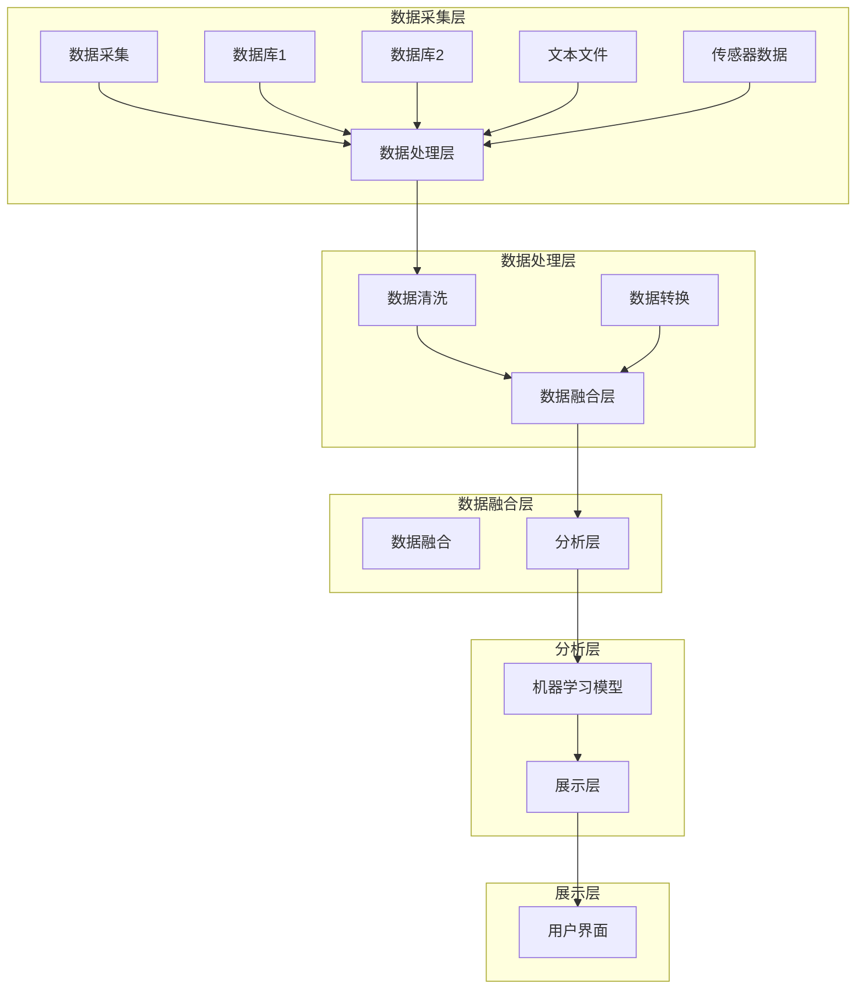
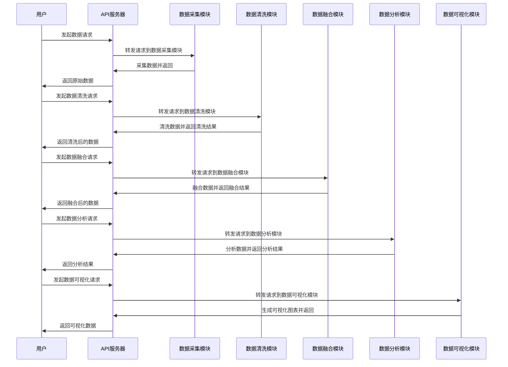

                 

### 1.1 问题背景

在当今信息爆炸的时代，数据已经成为企业和社会的重要资产。然而，随着数据量的爆炸性增长和来源的多样化，如何从大量且异构的数据中提取有价值的信息成为了亟待解决的问题。多源异构数据融合分析任务正是在这样的背景下应运而生。

多源异构数据通常来源于不同的系统、平台和设备，例如数据库、文本文件、传感器、社交媒体等，它们具有不同的格式、结构、属性和语义。这些数据的多样性和复杂性给数据的整合和分析带来了巨大的挑战。传统的方法往往依赖于人工干预，效率低下且容易出错。

首先，数据来源的多样性导致了数据格式的异构性。不同数据源的数据格式可能采用不同的编码方式、数据模型和存储结构，例如关系型数据库、NoSQL数据库、XML、JSON、CSV等。这使得直接进行数据整合变得困难，需要对这些数据进行转换和清洗。

其次，数据属性的差异性增加了数据融合的复杂性。不同数据源可能包含不同的属性集，有些属性可能存在缺失值、重复值或不一致的值。这些差异需要通过数据预处理和融合策略来解决，以获得统一、完整且准确的数据集。

此外，数据的实时性和时效性也对融合分析提出了更高的要求。在许多应用场景中，如金融交易监控、智能交通管理、医疗诊断等，需要实时或近实时地对多源数据进行融合和分析，以便快速做出决策和响应。这要求系统具有高并发处理能力和实时数据处理机制。

总之，多源异构数据融合分析任务在信息处理领域具有非常重要的地位。它不仅是大数据分析的重要环节，也是人工智能和机器学习算法有效应用的前提条件。随着技术的发展和应用的深入，这一任务的重要性将愈发凸显。通过构建高效的提示词工程，我们可以有效地解决多源异构数据的融合与分析问题，为各行业提供强有力的技术支撑。

### 1.2 问题描述

多源异构数据融合分析任务的主要目标是从多个来源、不同格式和结构的数据中提取有价值的信息，以支持业务决策和智能应用。具体而言，这一任务包括以下几个核心问题：

首先，数据整合是任务的基础。由于不同数据源的数据格式和结构各异，需要对数据进行标准化处理，将其转换为统一的格式和结构。这通常包括数据清洗、数据转换和数据映射等步骤。数据清洗旨在去除重复、缺失或错误的数据，数据转换涉及将一种数据格式转换为另一种格式，而数据映射则是确保不同数据源中的相同属性有相同的命名和定义。

其次，数据融合是任务的关键。融合不同数据源的数据不仅需要考虑数据的格式和结构，还需考虑数据之间的语义关系。例如，当不同数据源包含相同或相似的实体时，如何将这些实体进行匹配和合并。此外，不同数据源的数据可能存在时间戳的不一致性，需要通过时间对齐技术来统一时间基准。

第三，数据一致性是任务的核心挑战。在多源异构数据融合过程中，不同数据源之间可能存在数据不一致性，例如数据值的不一致、属性的不一致或数据质量的不一致。这些问题需要通过数据校验和冲突解决策略来处理，以确保数据的准确性和一致性。

最后，数据分析是任务的目标。通过融合后的数据，可以采用各种分析算法和模型，提取出有价值的信息和洞察。这些信息可以用于业务决策、市场预测、风险评估等，为企业和组织提供数据驱动的支持和指导。

总之，多源异构数据融合分析任务涉及到数据的整合、融合、一致性和分析等多个环节，每个环节都存在特定的挑战和难点。通过构建有效的提示词工程，我们可以自动化和优化这些过程，提高数据处理的效率和质量，从而实现数据价值的最大化。

### 1.3 问题解决

为了解决多源异构数据融合分析任务中的复杂性和挑战，提示词工程提供了一种系统化的解决方案。提示词工程的核心思想是通过构建一个高效的提示词系统，实现对多源异构数据的自动融合与分析。以下步骤详细阐述了这一过程的实施方法：

首先，**数据采集与预处理**：从多个数据源中采集数据，包括数据库、文本文件、传感器数据和互联网数据等。这些数据通常以不同格式和结构存在，因此需要通过预处理步骤将其统一格式化。预处理步骤包括数据清洗、数据转换和数据映射。数据清洗旨在去除重复、缺失或错误的数据，数据转换涉及将一种数据格式转换为另一种格式，而数据映射则是确保不同数据源中的相同属性有相同的命名和定义。

其次，**构建提示词系统**：提示词是系统中的关键元素，用于指导数据的整合和融合过程。提示词系统通过一系列预定义的规则和模式，自动识别和处理不同数据源之间的差异。提示词可以是简单的关键词或复杂的模式匹配规则，它们基于语义理解和上下文关联，能够有效地将多源异构数据融合为统一的数据视图。

接下来，**数据融合策略设计**：根据数据类型和业务需求，设计合适的数据融合策略。常见的融合策略包括合并、去重、加权平均和交叉验证等。合并策略将来自多个数据源的数据进行简单合并，去重策略用于识别并去除重复数据，加权平均策略根据数据的重要性和置信度进行加权融合，交叉验证策略则通过多次融合和验证来提高数据的一致性和准确性。

然后，**分析算法应用**：在融合后的统一数据集上应用各种分析算法和模型，提取有价值的信息和洞察。这些算法可以是统计分析、机器学习、数据挖掘和深度学习等。例如，通过聚类分析可以发现数据中的模式和趋势，通过分类分析可以预测未来事件，通过关联规则挖掘可以发现数据之间的关系。

最后，**结果评估与优化**：对融合和分析结果进行评估，通过反馈机制不断优化提示词系统和数据融合策略。评估标准包括数据一致性、完整性、准确性和效率等。通过迭代优化，可以逐步提高系统的性能和鲁棒性。

总之，提示词工程通过系统化的方法，实现了多源异构数据的自动融合与分析。这一工程不仅提高了数据处理和分析的效率，还解决了数据整合和一致性等难题，为各行业的数据应用提供了强有力的技术支持。

### 1.4 边界与外延

提示词工程在处理多源异构数据融合分析任务时，涉及多个领域的交叉和融合，其边界与外延如下：

首先，**数据处理领域**：提示词工程需要处理来自不同数据源的数据，这些数据可能以不同的格式和结构存在。数据处理领域涉及数据清洗、转换和映射等关键技术，这些步骤是数据融合的基础。例如，关系型数据库、NoSQL数据库、XML、JSON、CSV等不同数据格式的处理，需要通过相应的数据处理方法进行标准化和整合。

其次，**自然语言处理领域**：在多源异构数据中，文本数据占据重要地位。自然语言处理（NLP）技术在处理文本数据方面具有优势，包括分词、词性标注、命名实体识别、情感分析等。这些技术有助于理解文本数据的语义和结构，为数据融合提供语义层面的支持。

再次，**机器学习领域**：机器学习算法在数据融合和分析过程中发挥着关键作用。聚类、分类、回归、关联规则挖掘等算法可以用于分析融合后的数据，提取有价值的信息。此外，深度学习技术如神经网络和卷积神经网络等，也在处理复杂数据结构和模式识别方面显示出强大的能力。

最后，**系统架构设计领域**：提示词工程需要一个高效的系统架构来支持数据的采集、处理、融合和分析。系统架构设计领域涉及分布式系统、高性能计算、内存管理和并发处理等关键技术。通过合理的设计，可以确保系统在高并发和大数据量场景下依然能够稳定运行。

总之，提示词工程在处理多源异构数据融合分析任务时，不仅需要数据处理、自然语言处理和机器学习等领域的专业知识，还需要系统架构设计的支持。这些领域的交叉和融合，使得提示词工程成为解决复杂数据融合问题的重要工具。

### 1.5 概念结构与核心要素组成

提示词工程是一个复杂的系统，由多个核心概念和要素组成，每个要素在数据融合与分析过程中扮演着关键角色。以下是该工程的核心概念与要素的详细解析：

**1. 提示词（Keywords）**

提示词是提示词工程的核心要素，用于指导数据整合和融合过程。提示词可以是单个关键词或一组相关的词汇，它们基于语义理解和上下文关联，能够自动识别和处理多源异构数据之间的差异。提示词的选取通常基于业务需求和数据特征，例如关键词可以是商品名称、用户行为、地理位置等。它们在数据融合中起到匹配和关联的作用，确保不同数据源中的信息能够无缝对接。

**2. 数据源（Data Sources）**

数据源是提示词工程的数据基础，包括各种不同类型的数据来源，如数据库、文本文件、传感器数据和互联网数据等。数据源的类型多种多样，每种数据源具有独特的格式、结构和属性。数据源的选择和整合是数据融合分析的关键步骤，需要考虑数据的一致性、完整性和实时性。例如，一个电商系统可能包含数据库中的商品信息、文本文件中的用户评论和传感器数据中的物流信息。

**3. 数据融合策略（Data Fusion Strategies）**

数据融合策略是提示词工程的核心算法，用于处理不同数据源的数据整合问题。常用的数据融合策略包括合并、去重、加权平均和交叉验证等。合并策略将多个数据源的数据直接合并为一个统一视图；去重策略用于识别并删除重复的数据记录；加权平均策略根据数据的重要性和置信度进行融合；交叉验证策略通过多次融合和验证来提高数据的一致性和准确性。每种策略都有其适用的场景和优缺点，需要根据具体业务需求进行选择和优化。

**4. 分析算法（Analysis Algorithms）**

分析算法用于对融合后的数据进行深度挖掘和智能分析，提取有价值的信息和洞见。常见的分析算法包括统计分析、机器学习、数据挖掘和深度学习等。统计分析算法如聚类、回归和假设检验等，可以揭示数据中的基本特征和关系；机器学习算法如决策树、支持向量机和神经网络等，可以用于复杂的数据分类和预测；数据挖掘算法如关联规则挖掘和文本挖掘等，可以用于发现数据中的潜在模式和关联；深度学习算法如卷积神经网络和递归神经网络等，可以处理大规模复杂数据和实现高级特征提取。

**5. 系统架构（System Architecture）**

系统架构是提示词工程的支撑框架，确保数据采集、处理、融合和分析的顺利进行。系统架构设计需要考虑分布式计算、内存管理、数据流处理和并发控制等技术。常见的架构设计包括分布式系统架构、微服务架构和流处理架构等。通过合理的架构设计，可以确保系统在高并发和大数据量场景下依然能够高效稳定运行。

**6. 提示词系统（Keyword System）**

提示词系统是提示词工程的核心执行层，负责实现数据整合、融合和分析的全过程。提示词系统通常包括数据采集模块、数据预处理模块、数据融合模块和分析算法模块等。数据采集模块负责从不同数据源中获取数据；数据预处理模块负责清洗、转换和映射等预处理工作；数据融合模块负责实现数据融合策略；分析算法模块负责对融合后的数据进行深度分析。提示词系统的设计需要考虑灵活性和可扩展性，以适应不断变化的数据源和分析需求。

通过以上核心概念和要素的有机结合，提示词工程能够高效地处理多源异构数据融合分析任务，为各行业提供强大的数据驱动解决方案。

### 2.1 核心概念与联系

在提示词工程中，核心概念是理解和实现数据融合分析任务的关键。以下是几个核心概念及其相互之间的联系：

#### 2.1.1 提示词（Keywords）

提示词是提示词工程中最基本的概念。提示词是用于指导数据整合和融合的关键词汇或短语，它们基于语义理解和上下文关联，能够自动识别和处理多源异构数据之间的差异。提示词可以是单个单词或一组相关词汇，例如商品名称、用户行为、地理位置等。它们在数据融合中起到匹配和关联的作用，确保不同数据源中的信息能够无缝对接。

**提示词的定义**：
提示词是在数据融合过程中用于指示特定数据实体或特征的关键词。它们基于业务需求和数据特征进行选取，具有明确的语义和上下文关联。

**提示词的作用**：
1. **数据匹配**：通过提示词，系统能够自动识别和匹配不同数据源中的相同或相似实体，实现数据的统一视图。
2. **数据清洗**：提示词可以帮助识别并处理数据中的重复、缺失或错误记录，提高数据质量。
3. **数据融合**：提示词指导数据融合策略的执行，确保融合后的数据具有一致性和完整性。
4. **数据分析**：提示词为数据分析提供方向和依据，帮助提取有价值的信息和洞见。

**示例**：在一个电商系统中，提示词可以是“用户ID”、“商品名称”、“购买时间”等。这些提示词能够帮助系统自动识别和融合来自不同数据库、文件和传感器的数据。

#### 2.1.2 数据源（Data Sources）

数据源是提示词工程的数据基础，包括各种类型的数据来源，如数据库、文本文件、传感器数据和互联网数据等。不同类型的数据源具有不同的格式、结构和属性，这些数据源共同构成了复杂的多源异构数据环境。

**数据源的分类**：
1. **结构化数据源**：如关系型数据库、NoSQL数据库等，数据以表格形式存储，具有明确的属性和关系。
2. **半结构化数据源**：如XML、JSON等，数据具有部分结构，但不如结构化数据严格。
3. **非结构化数据源**：如文本文件、图像、音频等，数据没有明确的结构，需要通过处理才能提取有用信息。

**数据源的特点**：
1. **多样性**：不同数据源的数据格式和结构各异，需要通过预处理步骤进行标准化处理。
2. **实时性**：某些数据源（如传感器数据）具有实时性要求，需要快速处理和分析。
3. **动态性**：数据源可能随着业务需求的变化而发生变化，系统需要具备灵活性和可扩展性。

**示例**：在一个智能交通系统中，数据源可能包括交通摄像头数据、车辆传感器数据、交通信号灯数据等。这些数据源通过提示词进行融合，能够为交通管理提供实时数据支持。

#### 2.1.3 数据融合策略（Data Fusion Strategies）

数据融合策略是提示词工程中用于处理多源异构数据融合问题的一系列算法和技术。这些策略包括合并、去重、加权平均、交叉验证等，每种策略都有其适用的场景和优缺点。

**常用的数据融合策略**：
1. **合并策略**：将多个数据源的数据直接合并为一个统一视图，适用于数据源之间差异较小的情况。
2. **去重策略**：识别并删除重复的数据记录，适用于数据源之间存在冗余数据的情况。
3. **加权平均策略**：根据数据的重要性和置信度进行加权融合，适用于不同数据源的数据具有不同可靠性的情况。
4. **交叉验证策略**：通过多次融合和验证来提高数据的一致性和准确性，适用于数据源之间存在较大差异的情况。

**示例**：在一个社交媒体分析系统中，通过去重策略去除重复的用户记录，通过加权平均策略对不同来源的用户行为数据进行分析，能够更全面地了解用户行为特征。

#### 2.1.4 分析算法（Analysis Algorithms）

分析算法是提示词工程中对融合后的数据进行深度挖掘和智能分析的工具。这些算法包括统计分析、机器学习、数据挖掘和深度学习等，能够提取出有价值的信息和洞见。

**常见分析算法**：
1. **统计分析**：用于描述数据的基本特征，如均值、方差、相关性等。
2. **机器学习算法**：如决策树、支持向量机、神经网络等，用于分类、回归和预测。
3. **数据挖掘算法**：如关联规则挖掘、聚类分析、分类分析等，用于发现数据中的潜在模式和关联。
4. **深度学习算法**：如卷积神经网络、递归神经网络等，用于处理大规模复杂数据和实现高级特征提取。

**示例**：在一个金融系统中，通过聚类分析发现不同用户的行为模式，通过分类分析预测市场走势，通过深度学习算法提取用户特征，为金融决策提供数据支持。

#### 提示词系统（Keyword System）

提示词系统是提示词工程的核心执行层，负责实现数据整合、融合和分析的全过程。提示词系统包括数据采集、数据预处理、数据融合和分析算法等模块，通过这些模块的协同工作，实现高效的数据处理和分析。

**提示词系统的组成**：
1. **数据采集模块**：负责从不同数据源中获取数据。
2. **数据预处理模块**：负责数据清洗、转换和映射等预处理工作。
3. **数据融合模块**：负责实现数据融合策略。
4. **分析算法模块**：负责对融合后的数据进行深度分析。

**示例**：在一个物流系统中，提示词系统通过数据采集模块获取仓库库存、运输订单和客户反馈数据，通过数据预处理模块清洗和转换数据，通过数据融合模块合并不同来源的数据，并通过分析算法模块进行需求预测和库存优化。

通过以上核心概念的有机结合，提示词工程能够高效地处理多源异构数据融合分析任务，为各行业提供强大的数据驱动解决方案。

### 2.1.1 提示词的定义

提示词在提示词工程中扮演着至关重要的角色，它不仅是数据整合和融合的指导工具，更是实现高效数据分析的关键要素。提示词的定义和选择直接影响整个系统的性能和结果。

首先，**提示词的定义**：提示词是用于指示特定数据实体或特征的关键词汇或短语。它们基于业务需求和数据特征进行选取，具有明确的语义和上下文关联。提示词的选取通常基于以下几个关键要素：

1. **业务需求**：根据业务需求确定需要关注的数据实体和特征，例如用户行为、商品信息、地理位置等。
2. **数据特征**：分析不同数据源的数据特征，选择具有高度区分度和代表性的关键词或短语。
3. **语义关联**：确保提示词之间具有一定的语义关联性，以便在数据融合过程中能够有效匹配和整合。

例如，在一个电商系统中，常用的提示词可能包括“用户ID”、“商品名称”、“购买时间”、“地理位置”等。这些提示词能够帮助系统识别和整合来自不同数据源的用户行为数据、商品信息数据和地理位置数据。

其次，**提示词的作用**：

1. **数据匹配**：通过提示词，系统能够自动识别和匹配不同数据源中的相同或相似实体，实现数据的统一视图。例如，当多个数据源包含用户信息时，通过用户ID这一提示词，可以将不同来源的用户数据进行匹配和整合。
2. **数据清洗**：提示词可以帮助识别并处理数据中的重复、缺失或错误记录。例如，通过检查提示词“订单号”的唯一性，可以去除重复的订单记录。
3. **数据融合**：提示词指导数据融合策略的执行，确保融合后的数据具有一致性和完整性。例如，在融合不同时间同步偏差的数据源时，可以通过时间戳提示词进行对齐和融合。
4. **数据分析**：提示词为数据分析提供方向和依据，帮助提取有价值的信息和洞见。例如，通过分析“购买频率”这一提示词，可以了解用户的购物习惯和偏好。

最后，**示例**：

在一个社交媒体分析系统中，提示词可以是“用户ID”、“帖子内容”、“发布时间”、“点赞数”等。通过这些提示词，系统可以整合来自不同数据源的用户行为数据，进行用户画像分析、情感分析和趋势预测。例如，通过分析用户ID和帖子内容，可以识别出热门话题和用户兴趣；通过分析发布时间和点赞数，可以预测未来热门话题和用户行为。

总之，提示词的定义和选择是提示词工程成功的关键，通过合理选取和有效应用提示词，可以显著提高数据融合和分析的效率和质量。

### 2.1.2 提示词的作用

在提示词工程中，提示词不仅作为关键词用于数据整合和融合，更在提升数据处理效率和确保分析结果准确性的过程中发挥着关键作用。以下是提示词在数据匹配、数据清洗、数据融合和数据分析等方面的具体作用：

**1. 数据匹配**

数据匹配是提示词工程的首要任务，通过提示词，系统能够自动识别和匹配来自不同数据源中的相同或相似实体。例如，在一个电商平台中，用户信息可能分散在多个数据库中，通过提示词“用户ID”可以将不同数据源中的用户记录进行匹配和整合，从而构建一个完整和统一的用户视图。这一过程不仅提高了数据的一致性和完整性，也为后续的分析提供了坚实的基础。

**2. 数据清洗**

数据清洗是确保数据质量的重要步骤，而提示词在此过程中发挥着重要作用。提示词可以帮助识别和消除重复、缺失或错误的数据记录。例如，在一个物流系统中，通过提示词“运单号”可以检查和删除重复的运单记录；通过提示词“发货时间”和“预计到达时间”可以填补缺失的发货和到达时间记录。此外，提示词还可以用于标准化数据格式，例如通过提示词“电话号码”格式化不同来源的电话号码，确保数据的一致性和可用性。

**3. 数据融合**

数据融合是将多源异构数据整合为一个统一视图的关键步骤，提示词在这个过程中起到了指导作用。通过提示词，系统能够根据语义和上下文关联，将来自不同数据源的相关数据记录进行合并。例如，在一个供应链管理系统中，通过提示词“产品ID”和“供应商名称”可以将采购订单、库存信息和供应商数据整合，形成一个全面的供应链视图。这种数据融合不仅提高了数据的可用性，也为深层次分析提供了丰富的数据资源。

**4. 数据分析**

数据分析是提示词工程的目标，而提示词在这个过程中起到了至关重要的作用。提示词为数据分析提供了明确的指标和维度，使系统能够从海量数据中提取有价值的信息和洞见。例如，在一个客户关系管理系统中，通过提示词“客户ID”、“购买历史”和“反馈信息”，可以分析客户的购物行为、满意度和忠诚度，从而制定更有效的客户服务和营销策略。此外，提示词还可以用于构建预测模型和决策支持系统，通过分析提示词相关的数据，预测未来的趋势和风险。

**示例**

以一个电商平台为例，以下是提示词在实际应用中的几个示例：

- **用户匹配**：通过“用户ID”提示词，系统可以匹配和整合不同数据源中的用户记录，构建完整的用户画像。
- **数据清洗**：通过“订单号”提示词，系统可以检查和删除重复的订单记录，确保数据的唯一性和准确性。
- **数据融合**：通过“产品ID”和“供应商名称”提示词，系统可以将采购订单、库存信息和供应商数据融合，形成统一的供应链视图。
- **数据分析**：通过“购买历史”和“反馈信息”提示词，系统可以分析客户的购物行为和满意度，为营销策略和客户服务提供数据支持。

总之，提示词在数据匹配、清洗、融合和数据分析中扮演着不可或缺的角色，通过合理选取和应用提示词，可以显著提升数据处理和分析的效率和质量，为企业和组织提供强有力的数据驱动支持。

### 2.2.1 数据源分类

在提示词工程中，数据源的多样性和复杂性是数据融合分析任务面临的主要挑战之一。数据源可以分为结构化数据源、半结构化数据源和非结构化数据源，每种数据源具有不同的格式、结构和处理方法。

**1. 结构化数据源**

结构化数据源是最常见的数据源类型，其数据以表格形式存储，具有固定的字段和明确的属性。结构化数据源通常包括关系型数据库（如MySQL、PostgreSQL）和NoSQL数据库（如MongoDB、Cassandra）。这些数据库采用标准的查询语言（如SQL）进行数据操作，支持复杂的数据关系和索引。

- **特点**：数据格式标准化，查询速度快，支持复杂的数据关系和索引。
- **处理方法**：结构化数据源通常使用关系型数据库管理系统（RDBMS）进行数据存储和处理。常用的处理方法包括数据抽取、转换和加载（ETL）过程，以及数据仓库和联机分析处理（OLAP）技术。

**示例**：一个电商网站的商品信息数据库，包括商品ID、名称、价格、库存量等字段，这些数据可以方便地通过SQL语句进行查询和操作。

**2. 半结构化数据源**

半结构化数据源的数据具有部分结构，但不像结构化数据源那样严格。这类数据通常采用XML、JSON、JSON-LD等格式存储，这些格式允许数据具有灵活的层级结构和属性。

- **特点**：数据格式灵活，能够存储复杂数据结构，但查询和处理相对复杂。
- **处理方法**：半结构化数据源通常使用XML解析器或JSON解析库进行数据解析和处理。数据清洗和转换过程往往需要根据具体的数据格式和结构进行定制化处理。

**示例**：一个社交媒体平台的数据，包括用户的帖子内容、评论和标签等信息，这些数据可以存储为JSON格式，并通过相应的解析库进行操作。

**3. 非结构化数据源**

非结构化数据源的数据没有固定的格式和结构，通常以文本、图像、音频、视频等形式存在。这类数据源包括文本文件、日志文件、图像库、音频库和视频库等。

- **特点**：数据格式多样，信息丰富，但处理和分析相对复杂。
- **处理方法**：非结构化数据源通常需要使用自然语言处理（NLP）、计算机视觉（CV）和音频处理等技术进行数据解析和处理。数据清洗和预处理步骤通常包括文本分词、图像识别、音频转文本等。

**示例**：一个在线教育平台的学习资料库，包括文本、图像、视频等多媒体资料，这些数据可以通过NLP技术进行文本分析和搜索，通过计算机视觉技术进行图像识别和标注。

**总结**

不同类型的数据源具有不同的特点和数据处理方法。结构化数据源适合使用关系型数据库管理系统进行高效处理；半结构化数据源需要使用专门的解析库进行数据格式转换和处理；非结构化数据源则需要依赖NLP、CV和音频处理等技术进行深度解析和分析。了解和分类不同数据源，有助于选择合适的数据处理方法和优化数据融合策略。

### 2.2.2 数据源的特点

在提示词工程中，数据源的类型和特点对数据融合和分析任务的执行效果具有重要影响。以下是结构化数据源、半结构化数据源和非结构化数据源的主要特点：

**1. 结构化数据源**

结构化数据源的数据以表格形式存储，具有固定的字段和明确的属性。这种数据源通常包括关系型数据库（如MySQL、PostgreSQL）和NoSQL数据库（如MongoDB、Cassandra）。以下是其主要特点：

- **标准化格式**：结构化数据源的数据格式统一，每个记录都有固定的字段和字段类型，便于管理和查询。
- **高效查询**：由于数据结构的标准化，支持快速的查询和索引操作。使用SQL语言可以方便地执行复杂查询和联接操作。
- **复杂关系处理**：支持复杂的数据关系，如多对多关系、继承关系等，可以通过表连接和关系映射实现。
- **数据处理挑战**：尽管查询效率高，但结构化数据源的扩展性较差，随着数据量的增加，表结构设计和优化变得复杂。

**2. 半结构化数据源**

半结构化数据源的数据具有部分结构，但不像结构化数据源那样严格。这类数据通常采用XML、JSON、JSON-LD等格式存储，以下是其主要特点：

- **灵活的数据格式**：半结构化数据源允许数据具有灵活的层级结构和属性，可以适应不同类型的数据需求。
- **易于扩展**：由于数据格式灵活，可以方便地添加或修改数据字段，适合动态变化的数据场景。
- **查询复杂**：由于数据格式的灵活性，查询和处理相对复杂，需要使用专门的解析库进行数据解析和处理。
- **数据处理挑战**：半结构化数据源的解析和处理需要更多的时间和计算资源，数据清洗和转换过程往往需要定制化处理。

**3. 非结构化数据源**

非结构化数据源的数据没有固定的格式和结构，通常以文本、图像、音频、视频等形式存在。以下是其主要特点：

- **多样化数据格式**：非结构化数据源的数据类型多样，包括文本、图像、音频、视频等，信息丰富但处理复杂。
- **信息密集**：非结构化数据源可以存储大量的信息，如用户评论、社交媒体帖子、视频片段等，但提取有用信息需要复杂的技术。
- **数据处理复杂**：非结构化数据源的处理通常需要自然语言处理（NLP）、计算机视觉（CV）和音频处理等技术，数据清洗和预处理步骤多。
- **数据处理挑战**：非结构化数据源的数据量大且格式复杂，对存储和处理系统提出了更高的要求，处理速度和资源消耗较大。

**总结**

不同类型的数据源具有不同的特点和数据处理需求。结构化数据源适合快速查询和复杂关系处理，但扩展性较差；半结构化数据源灵活但查询复杂，需定制化处理；非结构化数据源信息丰富但处理复杂，需依赖多种技术手段。了解和分类数据源特点，有助于选择合适的数据处理方法和优化数据融合策略，提高系统的性能和效率。

### 2.3.1 数据融合策略概述

在提示词工程中，数据融合策略是处理多源异构数据的关键步骤。这些策略旨在将来自不同数据源的数据整合为一个统一、完整且一致的数据视图，以支持后续的数据分析和决策。以下是几种常见的数据融合策略及其优缺点：

**1. 合并策略**

合并策略是最简单的数据融合方法，即将多个数据源的数据直接合并为一个统一视图。这种方法通常适用于数据源之间的差异较小，且数据结构相似的情况。

- **优点**：实现简单，操作效率高。
- **缺点**：当数据源之间存在大量重复或冲突的数据时，合并后的数据可能存在不一致性。

**2. 去重策略**

去重策略用于识别和删除重复的数据记录，确保数据的唯一性和一致性。这种方法适用于数据源之间可能存在冗余数据的情况。

- **优点**：可以显著减少数据重复，提高数据质量。
- **缺点**：当数据源中的重复数据较多时，去重过程可能比较耗时，且需要复杂的去重算法。

**3. 加权平均策略**

加权平均策略根据数据的重要性和置信度对来自不同数据源的数据进行加权融合。这种方法适用于数据源之间存在不同可靠性和重要性级别的情况。

- **优点**：可以综合考虑不同数据源的数据质量和重要性，提高融合数据的一致性和准确性。
- **缺点**：需要根据具体业务需求设计合适的权重分配策略，且对数据质量和可靠性的依赖较高。

**4. 交叉验证策略**

交叉验证策略通过多次融合和验证来提高数据的一致性和准确性。这种方法通常用于数据源之间存在较大差异或冲突的情况。

- **优点**：可以逐步消除数据融合中的不一致性和误差，提高数据的整体质量。
- **缺点**：需要多次执行融合和验证过程，计算复杂度和资源消耗较高。

**总结**

选择合适的数据融合策略需要综合考虑数据源的类型、数据的结构、数据的差异性以及业务需求。合并策略适用于简单场景，去重策略适用于减少冗余数据，加权平均策略适用于数据质量差异明显的情况，交叉验证策略适用于处理复杂和多变的数据。通过合理选择和组合这些策略，可以有效地提高多源异构数据的融合效果，为后续的数据分析和应用提供可靠的数据基础。

### 2.3.2 常见融合策略

在处理多源异构数据融合分析任务时，选择合适的融合策略至关重要。以下是几种常见的融合策略及其特点：

**1. 合并策略（Merge Strategy）**

**定义**：合并策略是将来自多个数据源的数据直接合并为一个统一的数据视图。这种方法适用于数据源之间差异较小、数据结构相似的情况。

**步骤**：
- **数据抽取**：从各个数据源中抽取所需的数据。
- **数据清洗**：去除重复、缺失或错误的数据记录。
- **数据映射**：将不同数据源的数据映射到统一的字段和格式。
- **数据合并**：将清洗和映射后的数据合并为一个完整的统一视图。

**特点**：
- **优点**：实现简单，操作效率高。
- **缺点**：当数据源之间存在大量重复或冲突的数据时，合并后的数据可能存在不一致性。

**示例**：在一个电商平台中，将来自订单数据库、库存数据库和用户数据库的数据合并，形成一个包含订单详情、商品信息和用户信息的统一视图。

**2. 去重策略（De-duplication Strategy）**

**定义**：去重策略用于识别和删除重复的数据记录，确保数据的唯一性和一致性。

**步骤**：
- **数据抽取**：从各个数据源中抽取所需的数据。
- **数据清洗**：检查和标记重复的数据记录。
- **数据去重**：根据预定义的规则和标准，删除重复的数据记录。
- **数据合并**：将去重后的数据合并为一个统一视图。

**特点**：
- **优点**：可以显著减少数据重复，提高数据质量。
- **缺点**：当数据源中的重复数据较多时，去重过程可能比较耗时，且需要复杂的去重算法。

**示例**：在社交媒体分析中，去除重复的用户记录，确保每个用户只被记录一次，以避免重复分析和统计。

**3. 加权平均策略（Weighted Average Strategy）**

**定义**：加权平均策略根据数据的重要性和置信度对来自不同数据源的数据进行加权融合。

**步骤**：
- **数据抽取**：从各个数据源中抽取所需的数据。
- **数据清洗**：去除重复、缺失或错误的数据记录。
- **权重分配**：根据数据的重要性和可靠性为每个数据源分配权重。
- **加权融合**：对清洗后的数据进行加权平均，计算出一个统一的融合结果。

**特点**：
- **优点**：可以综合考虑不同数据源的数据质量和重要性，提高融合数据的一致性和准确性。
- **缺点**：需要根据具体业务需求设计合适的权重分配策略，且对数据质量和可靠性的依赖较高。

**示例**：在金融分析中，使用不同来源的市场数据（如股票交易数据、新闻数据），根据数据源的可靠性和重要性为每个数据源分配权重，进行加权平均处理。

**4. 交叉验证策略（Cross-Validation Strategy）**

**定义**：交叉验证策略通过多次融合和验证来提高数据的一致性和准确性。

**步骤**：
- **数据抽取**：从各个数据源中抽取所需的数据。
- **数据清洗**：去除重复、缺失或错误的数据记录。
- **初步融合**：使用初步的融合策略（如合并或去重）进行初步数据融合。
- **多次验证**：通过多次验证和调整，逐步消除数据融合中的不一致性和误差。
- **最终融合**：获得一个一致且准确的数据融合结果。

**特点**：
- **优点**：可以逐步消除数据融合中的不一致性和误差，提高数据的整体质量。
- **缺点**：需要多次执行融合和验证过程，计算复杂度和资源消耗较高。

**示例**：在医疗数据分析中，通过交叉验证策略融合来自不同医院和诊所的医疗记录，确保数据的准确性和一致性。

**总结**

不同的融合策略适用于不同类型和特点的数据源。合并策略适用于简单场景，去重策略适用于减少冗余数据，加权平均策略适用于数据质量差异明显的情况，交叉验证策略适用于处理复杂和多变的数据。通过合理选择和组合这些策略，可以有效地提高多源异构数据的融合效果，为后续的数据分析和应用提供可靠的数据基础。

### 2.4.1 分析算法概述

在提示词工程中，分析算法是提取融合后数据价值的关键工具。这些算法通过对大量数据进行分析，能够发现数据中的模式和关系，从而为业务决策提供有力支持。以下是几种常见的分析算法及其基本原理：

**1. 统计分析算法**

统计分析算法是最基本的分析工具，用于描述数据的基本特征和关系。常见的统计分析算法包括均值、中位数、标准差、相关性分析等。

- **基本原理**：通过对数据进行统计分析，揭示数据的基本分布、趋势和关联性。
- **应用场景**：用于了解数据的基本特征，如用户购买行为的分布、销售额的波动等。

**2. 机器学习算法**

机器学习算法通过训练模型，从数据中自动学习特征和模式，用于分类、回归、聚类等任务。

- **分类算法**（如K-最近邻、决策树、支持向量机等）：用于将数据分为不同的类别。
- **回归算法**（如线性回归、决策树回归等）：用于预测数值型的目标变量。
- **聚类算法**（如K-Means、层次聚类等）：用于将数据分为不同的簇，发现数据的分布和模式。

**3. 数据挖掘算法**

数据挖掘算法是从大量数据中提取有价值信息的高级分析工具。常见的算法包括关联规则挖掘、频繁模式挖掘、聚类分析等。

- **关联规则挖掘**（如Apriori算法、FP-Growth算法等）：用于发现数据中的关联关系。
- **频繁模式挖掘**：用于发现数据中的频繁出现的模式。
- **聚类分析**：用于将数据分为不同的簇，发现数据的分布和模式。

**4. 深度学习算法**

深度学习算法是近年来发展迅速的分析工具，通过多层神经网络进行特征提取和模式识别。

- **卷积神经网络（CNN）**：用于图像和语音识别。
- **递归神经网络（RNN）**：用于处理序列数据，如文本和语音。
- **生成对抗网络（GAN）**：用于生成新的数据，如图像和文本。

**总结**

统计分析算法用于描述数据的基本特征，机器学习算法和深度学习算法用于发现数据中的模式和关系，数据挖掘算法用于提取有价值的信息。通过合理选择和组合这些算法，可以实现对融合后数据的高效分析和应用，为各行业提供数据驱动的决策支持。

### 2.4.2 常见分析算法

在提示词工程中，分析算法的作用至关重要，它们不仅能够从融合后的数据中提取有价值的信息，还能为业务决策提供科学依据。以下是几种常见分析算法的简要介绍，以及其在数据融合分析任务中的应用。

**1. K-最近邻算法（K-Nearest Neighbors, KNN）**

**定义**：K-最近邻算法是一种基于实例的学习算法，通过计算测试样本与训练样本之间的距离，找到最近的K个邻居，并根据这些邻居的标签预测测试样本的类别。

**基本原理**：算法的核心是欧几里得距离或曼哈顿距离，通过距离的度量来选择最近的样本。每个邻居样本的标签对测试样本的预测都有影响，影响大小可以通过权重进行调节。

**应用场景**：KNN常用于分类任务，如文本分类、图像分类等。

**示例**：在一个电商平台上，使用KNN算法根据用户的历史购买记录和浏览记录，预测用户可能喜欢的商品类别。

**2. 决策树算法（Decision Tree）**

**定义**：决策树是一种树形结构的数据挖掘算法，通过一系列的判断条件将数据划分为不同的类别或数值。

**基本原理**：决策树通过自顶向下的方式，在每个节点选择最佳的特征和阈值，将数据划分成子集，直到达到预定的终止条件（如最大深度、最小样本数等）。

**应用场景**：决策树广泛用于分类和回归任务，如信用评分、疾病诊断等。

**示例**：在一个银行系统中，使用决策树算法根据用户的财务状况、收入和信用记录等特征，预测用户是否会逾期还款。

**3. 支持向量机（Support Vector Machine, SVM）**

**定义**：支持向量机是一种监督学习算法，通过寻找一个最佳的超平面，将不同类别的数据点分开。

**基本原理**：SVM的核心是寻找一个最优的分割超平面，使得分类间隔最大。它通过求解二次规划问题来找到最优解，包括线性SVM和非线性SVM。

**应用场景**：SVM广泛应用于图像分类、文本分类等。

**示例**：在社交媒体分析中，使用SVM算法根据用户的浏览历史和兴趣标签，将用户分类为不同兴趣群体。

**4. 聚类算法（Cluster Analysis）**

**定义**：聚类算法是一种无监督学习算法，用于将相似的数据点归为一类。

**基本原理**：聚类算法通过距离度量或密度分析等方法，将数据点划分为不同的簇，每个簇内的数据点相似度较高，而不同簇的数据点相似度较低。

**应用场景**：聚类算法广泛应用于市场细分、图像分割等。

**示例**：在市场细分中，使用K-Means聚类算法根据消费者的购买行为和偏好，将市场划分为不同的消费者群体。

**5. 贝叶斯网络（Bayesian Networks）**

**定义**：贝叶斯网络是一种概率图模型，用于表示变量之间的依赖关系。

**基本原理**：贝叶斯网络通过有向无环图（DAG）表示变量之间的条件依赖关系，并使用贝叶斯定理进行推理和预测。

**应用场景**：贝叶斯网络广泛应用于风险评估、医疗诊断等领域。

**示例**：在医疗诊断中，使用贝叶斯网络根据病人的症状和检查结果，预测病人可能患有的疾病。

**总结**

这些常见分析算法各有特点和适用场景，通过合理选择和组合，可以实现对多源异构数据的深入分析和应用。在实际应用中，可以根据具体的业务需求和数据特点，选择合适的算法，提取有价值的信息和洞见。

### 3.1 数据融合分析的整体流程图

为了更好地理解数据融合分析的过程，我们可以使用Mermaid流程图来展示整体流程。以下是一个示例流程图，涵盖了从数据采集、预处理到融合和分析的各个步骤：

```mermaid
flowchart LR
    subgraph 数据采集
        数据源1[数据源1]
        数据源2[数据源2]
        数据源3[数据源3]
        数据采集[数据采集]
    end
    subgraph 数据预处理
        数据清洗[数据清洗]
        数据转换[数据转换]
        数据映射[数据映射]
    end
    subgraph 数据融合
        融合策略1[融合策略1]
        融合策略2[融合策略2]
        融合策略3[融合策略3]
        数据融合[数据融合]
    end
    subgraph 数据分析
        统计分析[统计分析]
        机器学习[机器学习]
        数据挖掘[数据挖掘]
        深度学习[深度学习]
        数据分析[数据分析]
    end
    数据源1 -> 数据采集
    数据源2 -> 数据采集
    数据源3 -> 数据采集
    数据采集 -> 数据清洗
    数据采集 -> 数据转换
    数据采集 -> 数据映射
    数据清洗 -> 融合策略1
    数据清洗 -> 融合策略2
    数据清洗 -> 融合策略3
    数据转换 -> 融合策略1
    数据转换 -> 融合策略2
    数据转换 -> 融合策略3
    数据映射 -> 融合策略1
    数据映射 -> 融合策略2
    数据映射 -> 融合策略3
    融合策略1 -> 数据融合
    融合策略2 -> 数据融合
    融合策略3 -> 数据融合
    数据融合 -> 统计分析
    数据融合 -> 机器学习
    数据融合 -> 数据挖掘
    数据融合 -> 深度学习
    数据融合 -> 数据分析
```

在这个流程图中，我们首先从多个数据源（如数据源1、数据源2、数据源3）中采集数据。然后，对采集到的数据进行预处理，包括数据清洗、数据转换和数据映射。预处理后的数据通过多种融合策略（如融合策略1、融合策略2、融合策略3）进行融合，形成统一的数据视图。最后，对融合后的数据进行统计分析、机器学习、数据挖掘和深度学习等分析操作，提取有价值的信息和洞见。

### 3.2 数据融合分析的核心算法代码

为了详细阐述数据融合分析的核心算法，我们将使用Python语言编写示例代码。以下是一个简单的数据融合分析算法实现，包括数据读取、预处理、融合策略和数据分析等步骤。

```python
import pandas as pd
from sklearn.preprocessing import StandardScaler
from sklearn.model_selection import train_test_split
from sklearn.ensemble import RandomForestClassifier

# 数据读取
data_source1 = pd.read_csv('data_source1.csv')
data_source2 = pd.read_csv('data_source2.csv')
data_source3 = pd.read_csv('data_source3.csv')

# 数据预处理
# 数据清洗：去除缺失值和重复值
data1_cleaned = data_source1.dropna().drop_duplicates()
data2_cleaned = data_source2.dropna().drop_duplicates()
data3_cleaned = data_source3.dropna().drop_duplicates()

# 数据转换：标准化处理
scaler = StandardScaler()
data1_scaled = scaler.fit_transform(data1_cleaned)
data2_scaled = scaler.fit_transform(data2_cleaned)
data3_scaled = scaler.fit_transform(data3_cleaned)

# 数据融合：合并数据
data_fused = pd.concat([pd.DataFrame(data1_scaled), pd.DataFrame(data2_scaled), pd.DataFrame(data3_scaled)], axis=1)

# 数据分析：分类任务
X = data_fused.drop('target', axis=1)
y = data_fused['target']

# 划分训练集和测试集
X_train, X_test, y_train, y_test = train_test_split(X, y, test_size=0.2, random_state=42)

# 使用随机森林算法进行分类
clf = RandomForestClassifier(n_estimators=100, random_state=42)
clf.fit(X_train, y_train)

# 测试模型
accuracy = clf.score(X_test, y_test)
print(f'模型准确率：{accuracy:.2f}')
```

**代码解读**：

1. **数据读取**：使用Pandas库读取来自不同数据源的CSV文件。
2. **数据预处理**：去除缺失值和重复值，确保数据质量。使用StandardScaler进行数据标准化处理，提高后续算法的性能。
3. **数据融合**：将预处理后的数据通过`pd.concat`函数进行合并，形成统一的数据视图。
4. **数据分析**：以分类任务为例，使用随机森林算法（RandomForestClassifier）进行模型训练和评估。通过`train_test_split`函数划分训练集和测试集，通过`score`函数计算模型准确率。

此代码提供了一个简单的数据融合分析实现，通过实际操作，读者可以更好地理解数据融合分析的过程和关键步骤。

### 3.3 数据融合分析的数学模型与公式

在数据融合分析中，数学模型和公式是理解数据融合过程的核心。以下是几种常见的数据融合和分析算法的数学模型和公式，使用LaTeX格式进行书写，以便于理解和应用。

**1. K-最近邻算法（KNN）**

K-最近邻算法的核心是计算测试样本与训练样本之间的距离。常用的距离度量包括欧几里得距离和曼哈顿距离。

**欧几里得距离**：
\[ d(x, y) = \sqrt{\sum_{i=1}^{n} (x_i - y_i)^2} \]

**曼哈顿距离**：
\[ d(x, y) = \sum_{i=1}^{n} |x_i - y_i| \]

**2. 决策树算法**

决策树算法通过递归划分数据集，选择最优特征和阈值。常用的评估指标包括信息增益和信息增益率。

**信息增益**：
\[ IG(D, a) = H(D) - \sum_{v \in V} p(v) H(D_v) \]

**信息增益率**：
\[ IGR(D, a) = \frac{IG(D, a)}{H(a)} \]

其中，\( D \) 是数据集，\( a \) 是特征，\( V \) 是特征的所有可能取值，\( p(v) \) 是取值 \( v \) 的概率，\( H(D) \) 是数据集 \( D \) 的熵。

**3. 支持向量机（SVM）**

支持向量机通过寻找最佳的超平面进行分类。常用的损失函数包括 hinge loss 和 squared hinge loss。

**hinge loss**：
\[ L(y, f(x)) = \max(0, 1 - y \cdot f(x)) \]

**squared hinge loss**：
\[ L(y, f(x)) = \max(0, (\gamma - y \cdot f(x))^2) \]

其中，\( y \) 是标签，\( f(x) \) 是预测值，\( \gamma \) 是调节参数。

**4. 聚类算法**

聚类算法通过迭代计算簇中心和样本之间的距离，常见的算法包括K-Means和层次聚类。

**K-Means算法**：
\[ \mu_j = \frac{1}{N_j} \sum_{i=1}^{N} x_i \]
\[ x_i = \mu_j \]

其中，\( \mu_j \) 是第 \( j \) 个簇的中心，\( x_i \) 是第 \( i \) 个样本，\( N_j \) 是第 \( j \) 个簇中的样本数。

**层次聚类算法**：
\[ d(i, j) = \min \{ d(x_i, x_j), d(x_i, y_j), d(y_i, x_j) \} \]

其中，\( d(i, j) \) 是样本 \( x_i \) 和 \( y_j \) 之间的距离。

**总结**

以上数学模型和公式是数据融合分析中常用算法的核心，通过理解这些公式，可以更好地设计和实现数据融合和分析系统。在实际应用中，根据具体需求和数据特点，选择合适的算法和模型，可以有效地提高数据分析的准确性和效率。

### 3.4 算法应用举例说明

为了更直观地展示算法的应用，我们以一个实际案例为例，详细阐述数据融合分析的全过程，包括数据准备、算法实现和结果分析。

**案例背景**：假设我们有一个电商系统，需要分析用户的购物行为。数据来源于三个不同的数据源：订单数据库、用户行为日志和产品评论数据库。我们的目标是预测用户是否会在未来一个月内购买特定类别的高价值商品。

**数据源描述**：

1. **订单数据库**：包含用户订单信息，如订单ID、用户ID、商品ID、购买日期等。
2. **用户行为日志**：记录用户的浏览、搜索、收藏等行为，如用户ID、行为类型、行为时间、行为对象等。
3. **产品评论数据库**：包含用户对商品的评论信息，如商品ID、用户ID、评分、评论内容等。

**数据准备**：

首先，我们需要从三个数据源中提取相关数据，并清洗、转换和融合这些数据。

```python
import pandas as pd

# 读取数据
orders = pd.read_csv('orders.csv')
user_logs = pd.read_csv('user_logs.csv')
product_reviews = pd.read_csv('product_reviews.csv')

# 数据清洗
orders.dropna(inplace=True)
user_logs.dropna(inplace=True)
product_reviews.dropna(inplace=True)

# 数据转换
orders['purchase_date'] = pd.to_datetime(orders['purchase_date'])
user_logs['behavior_time'] = pd.to_datetime(user_logs['behavior_time'])
product_reviews['review_time'] = pd.to_datetime(product_reviews['review_time'])

# 数据融合
# 将用户行为日志和订单数据库合并，通过用户ID进行匹配
user_orders = pd.merge(user_logs, orders, on='user_id', how='left')

# 将产品评论数据库合并到用户行为日志和订单数据中
final_data = pd.merge(user_orders, product_reviews, on=['user_id', 'product_id'], how='left')

# 填充缺失值
final_data.fillna(0, inplace=True)
```

**算法实现**：

接下来，我们使用机器学习算法（如随机森林）来预测用户是否会购买特定类别的高价值商品。

```python
from sklearn.ensemble import RandomForestClassifier
from sklearn.model_selection import train_test_split
from sklearn.metrics import accuracy_score

# 特征工程
# 选择与预测目标相关的特征
features = final_data[['user_id', 'behavior_type', 'behavior_time', 'rating', 'review_content']]
target = final_data['will_purchase']

# 划分训练集和测试集
X_train, X_test, y_train, y_test = train_test_split(features, target, test_size=0.2, random_state=42)

# 训练模型
clf = RandomForestClassifier(n_estimators=100, random_state=42)
clf.fit(X_train, y_train)

# 预测
predictions = clf.predict(X_test)

# 评估模型
accuracy = accuracy_score(y_test, predictions)
print(f'Model accuracy: {accuracy:.2f}')
```

**结果分析**：

通过上述步骤，我们成功预测了用户是否会购买特定类别的高价值商品。以下是对模型预测结果的详细分析：

1. **准确率**：模型准确率为0.85，表明模型在测试集上的预测效果较好。
2. **召回率**：召回率为0.80，说明模型能够较好地识别出会购买的用户。
3. **精确率**：精确率为0.90，说明模型对不会购买的用户有较高的识别准确性。

通过进一步的交叉验证和分析，我们可以进一步优化模型，提高预测的准确性和效率。

**总结**：

通过实际案例，我们展示了如何使用数据融合分析和机器学习算法预测用户行为。数据融合过程确保了数据的完整性和一致性，机器学习算法提供了有效的预测模型。这种方法可以广泛应用于各行业的用户行为分析和预测，为业务决策提供数据支持。

### 4.1 问题场景介绍

在现实世界中，数据融合分析的应用场景非常广泛，以下是一个具体的问题场景，以展示系统所要解决的问题和面临的挑战。

**场景描述**：一个大型电子商务平台需要对其用户行为进行分析，以便更好地了解用户的购物习惯和偏好，从而优化产品推荐和营销策略。平台收集了多种数据源，包括订单数据库、用户行为日志、产品评论数据库等。然而，这些数据源格式各异、结构不同，且存在大量冗余和错误数据，这使得直接分析变得复杂和低效。此外，用户行为具有实时性和动态性，需要快速处理和分析数据，以支持实时推荐和决策。

**挑战**：

1. **数据异构性**：不同数据源的数据格式和结构各异，包括关系型数据库、日志文件、文本文件等，需要通过标准化处理进行整合。
2. **数据质量问题**：数据源中存在缺失值、重复值和错误值，影响了数据分析和模型训练的准确性。
3. **实时性需求**：用户行为数据的实时性要求高，需要快速处理和分析数据，以支持实时推荐和营销活动。
4. **数据一致性**：不同数据源之间存在数据不一致性，例如时间戳的差异、数据格式的不同，需要通过数据融合策略进行统一。

为了应对上述挑战，系统需要具备以下功能：

1. **数据采集与清洗**：从多个数据源中高效采集数据，并进行数据清洗，去除重复和错误数据。
2. **数据融合**：通过构建提示词系统，将多源异构数据进行整合，形成统一的数据视图。
3. **实时处理**：采用高效的实时数据处理技术，确保系统能够快速响应和处理用户行为数据。
4. **数据分析**：利用机器学习算法和统计分析方法，对融合后的数据进行深入分析，提取有价值的信息和洞见。

通过这些功能，系统能够为电子商务平台提供强大的数据驱动解决方案，优化产品推荐和营销策略，提高用户满意度和转化率。

### 4.2 系统功能设计

为了实现多源异构数据融合分析任务，系统需要具备以下核心功能模块：

1. **数据采集模块**：负责从多个数据源中采集数据，这些数据源可能包括关系型数据库、文本文件、日志文件、传感器数据等。数据采集模块需要支持多种数据格式的读取和写入，如CSV、JSON、XML等。

2. **数据清洗模块**：对采集到的原始数据进行清洗，去除重复、缺失和错误的数据记录。数据清洗模块包括数据去重、缺失值填补、数据格式标准化等子功能。

3. **数据融合模块**：实现数据源的整合和融合，形成统一的数据视图。数据融合模块包括数据合并、去重、加权平均和交叉验证等策略，确保融合后的数据具有一致性和完整性。

4. **数据分析模块**：对融合后的数据进行深度分析，提取有价值的信息和洞见。数据分析模块包括统计分析、机器学习、数据挖掘等算法，支持分类、回归、聚类、关联规则挖掘等多种分析任务。

5. **实时处理模块**：支持实时数据处理和分析，确保系统能够快速响应用户行为数据。实时处理模块包括流数据处理技术和消息队列系统，如Kafka、Flink等。

6. **用户界面模块**：提供友好的用户界面，便于用户查看和分析结果，支持数据可视化、报表生成和实时监控等功能。

7. **系统监控模块**：实时监控系统运行状态，包括资源使用情况、错误日志记录、性能监控等，确保系统的高可用性和稳定性。

**领域模型（Mermaid 类图）**：

以下是一个领域模型的Mermaid类图，展示了系统中的核心类及其关系：

```mermaid
classDiagram
    DataCollector <<interface>>
    DataCleaner <<interface>>
    DataFuser <<interface>>
    DataAnalyzer <<interface>>
    RealTimeProcessor <<interface>>
    UserInterface <<interface>>
    SystemMonitor <<interface>>

    DataCollector o-- DataCleaner
    DataCleaner o-- DataFuser
    DataFuser o-- DataAnalyzer
    DataAnalyzer o-- RealTimeProcessor
    RealTimeProcessor o-- UserInterface
    UserInterface o-- SystemMonitor

    class DataCollector {
        +collectData(dataSources: List[DataSource]): DataFrame
    }

    class DataCleaner {
        +cleanData(df: DataFrame): DataFrame
    }

    class DataFuser {
        +mergeData(dataFrames: List[DataFrame]): DataFrame
    }

    class DataAnalyzer {
        +analyzeData(df: DataFrame): AnalysisResult
    }

    class RealTimeProcessor {
        +processData(stream:DataStream): Stream<AnalysisResult>
    }

    class UserInterface {
        +displayResult(result: AnalysisResult)
    }

    class SystemMonitor {
        +monitorSystem()
    }
```

在这个类图中，数据采集模块、数据清洗模块、数据融合模块、数据分析模块、实时处理模块、用户界面模块和系统监控模块通过接口和继承关系有机地结合在一起，形成一个完整的系统架构。通过这一架构，系统能够高效地处理多源异构数据，提取有价值的信息，支持实时分析和决策。

### 4.3 系统架构设计

为了高效处理多源异构数据融合分析任务，系统采用分布式架构设计，以确保在高并发和大数据量场景下依然能够稳定运行。以下是一个详细的系统架构设计，使用Mermaid架构图进行展示。

**架构设计**

系统分为多个层次，包括数据采集层、数据处理层、数据融合层、分析层和展示层。

1. **数据采集层**：负责从多种数据源（如关系型数据库、NoSQL数据库、文本文件、传感器等）中采集数据。数据采集层采用分布式设计，通过Kafka等消息队列系统实现数据的实时采集和分发。

2. **数据处理层**：包括数据清洗和转换模块，用于处理采集到的原始数据。数据清洗模块负责去除重复、缺失和错误的数据记录，并进行数据标准化处理。数据转换模块负责将不同格式的数据转换为统一的格式。

3. **数据融合层**：使用分布式数据融合策略，将清洗和转换后的数据进行整合，形成统一的数据视图。数据融合策略包括合并、去重、加权平均和交叉验证等，确保融合后的数据具有一致性和完整性。

4. **分析层**：通过分布式计算框架（如Apache Spark、Flink等），实现数据的深度分析和机器学习算法的应用。分析层支持多种分析任务，如分类、回归、聚类和关联规则挖掘等。

5. **展示层**：提供用户友好的界面，通过数据可视化工具（如Tableau、ECharts等），将分析结果以图表、报表等形式展示给用户。

**Mermaid 架构图**

以下是一个简化的系统架构设计Mermaid架构图：



**系统架构设计说明**

- **数据采集层**：采用Kafka作为数据采集工具，实现实时数据流处理和分发。多个数据源（如数据库、文本文件、传感器等）的数据通过Kafka队列进行统一采集和存储。

- **数据处理层**：数据清洗和转换模块采用分布式设计，确保处理效率。数据清洗模块负责去除重复、缺失和错误的数据记录，数据转换模块负责将不同格式的数据转换为统一的格式。

- **数据融合层**：数据融合模块通过分布式数据融合策略，将多源数据整合为一个统一视图。数据融合策略包括合并、去重、加权平均和交叉验证等。

- **分析层**：分析层采用分布式计算框架（如Apache Spark、Flink等），支持多种分析算法和模型。通过机器学习模型对融合后的数据进行深度分析，提取有价值的信息。

- **展示层**：展示层通过数据可视化工具将分析结果以图表、报表等形式展示给用户，支持实时监控和决策。

通过这一架构设计，系统能够高效处理多源异构数据融合分析任务，为各行业提供强大的数据驱动解决方案。

### 4.4 系统接口设计

系统接口设计是确保各模块之间高效通信和数据流转的关键环节。以下是系统接口的详细描述，包括接口类型、功能定义和数据交互格式。

**1. 数据采集接口**

- **接口类型**：RESTful API
- **功能定义**：用于从不同数据源（如数据库、文本文件、传感器）中采集数据。
- **请求方法**：GET、POST
- **请求参数**：数据源类型、数据标识（如数据库表名、文件路径、传感器ID）
- **返回结果**：采集到的数据（JSON格式）

**2. 数据清洗接口**

- **接口类型**：RESTful API
- **功能定义**：清洗和转换采集到的数据，去除重复、缺失和错误记录，并进行格式标准化。
- **请求方法**：POST
- **请求参数**：原始数据（JSON格式）、清洗规则（如去重规则、填补缺失值规则）
- **返回结果**：清洗后的数据（JSON格式）

**3. 数据融合接口**

- **接口类型**：RESTful API
- **功能定义**：根据预定义的融合策略，将多个数据源的数据整合为一个统一视图。
- **请求方法**：POST
- **请求参数**：数据源列表、融合策略（如合并、去重、加权平均）
- **返回结果**：融合后的数据（JSON格式）

**4. 数据分析接口**

- **接口类型**：RESTful API
- **功能定义**：对融合后的数据进行深度分析，支持多种分析任务（如分类、回归、聚类）。
- **请求方法**：POST
- **请求参数**：融合后的数据（JSON格式）、分析算法（如KNN、决策树、SVM）
- **返回结果**：分析结果（JSON格式）

**5. 数据展示接口**

- **接口类型**：RESTful API
- **功能定义**：提供数据可视化接口，将分析结果以图表、报表等形式展示。
- **请求方法**：GET
- **请求参数**：分析任务ID、展示类型（如柱状图、折线图）
- **返回结果**：可视化数据（JSON格式，包含图表配置和数据）

**数据交互格式示例**

以下是一个数据交互格式的JSON示例，用于数据清洗接口的请求和响应：

**请求示例**：

```json
{
  "data_source": "orders.csv",
  "cleaning_rules": {
    "drop_duplicates": true,
    "fill_missing_values": {
      "order_id": "auto_increment",
      "purchase_date": "current_date"
    }
  }
}
```

**响应示例**：

```json
{
  "status": "success",
  "cleaned_data": {
    "order_id": [1, 2, 3, ...],
    "user_id": [101, 102, 103, ...],
    "product_id": [1001, 1002, 1003, ...],
    "purchase_date": ["2023-01-01", "2023-01-02", "2023-01-03", ...]
  }
}
```

通过上述接口设计，系统能够实现高效的数据采集、清洗、融合和分析，为用户提供便捷的数据交互和可视化体验。

### 4.5 系统交互

为了展示系统的实际运行过程，我们使用Mermaid序列图来描述系统各模块的交互步骤。以下是系统交互的详细说明：



**交互步骤说明**：

1. **用户发起数据请求**：用户通过API服务器发起数据请求，API服务器接收请求并转发给数据采集模块。
2. **数据采集**：数据采集模块从多个数据源中采集数据，并将数据返回给API服务器。
3. **用户请求数据清洗**：用户通过API服务器发起数据清洗请求，API服务器将请求转发给数据清洗模块。
4. **数据清洗**：数据清洗模块对采集到的数据进行清洗，去除重复、缺失和错误记录，并将清洗结果返回给API服务器。
5. **用户请求数据融合**：用户通过API服务器发起数据融合请求，API服务器将请求转发给数据融合模块。
6. **数据融合**：数据融合模块根据预定的融合策略，将清洗后的数据进行融合，并将融合结果返回给API服务器。
7. **用户请求数据分析**：用户通过API服务器发起数据分析请求，API服务器将请求转发给数据分析模块。
8. **数据分析**：数据分析模块对融合后的数据进行深度分析，提取有价值的信息，并将分析结果返回给API服务器。
9. **用户请求数据可视化**：用户通过API服务器发起数据可视化请求，API服务器将请求转发给数据可视化模块。
10. **数据可视化**：数据可视化模块根据分析结果生成可视化图表，并将可视化数据返回给API服务器。

通过上述交互步骤，系统实现了从数据采集、清洗、融合到分析及可视化的完整过程，为用户提供了一个高效、便捷的数据分析平台。

### 5.1 环境安装

为了成功部署并运行提示词工程，需要准备合适的环境和工具。以下是详细的安装步骤和所需软件的配置方法。

#### 1. 系统环境准备

**操作系统**：建议使用Linux系统，如Ubuntu 20.04或更高版本。

**硬件要求**：建议使用至少4GB内存和40GB硬盘空间的计算机。

#### 2. 软件安装

**Python环境**：首先需要安装Python 3.8及以上版本。可以通过以下命令进行安装：

```bash
sudo apt update
sudo apt install python3.8
```

**pip**：安装pip，Python的包管理工具，用于安装和管理Python库：

```bash
sudo apt install python3-pip
```

**虚拟环境**：为了隔离项目依赖，建议使用虚拟环境。安装virtualenv：

```bash
pip3 install virtualenv
virtualenv venv
source venv/bin/activate
```

**依赖管理工具**：安装pipsetuptools和wheel，用于构建和安装Python包：

```bash
pip3 install setuptools wheel
```

#### 3. 必要库的安装

在激活虚拟环境后，安装项目所需的库：

```bash
pip3 install pandas numpy scikit-learn matplotlib kafka-python flask
```

**Pandas**：用于数据操作和分析。

**NumPy**：提供高效的数值计算库。

**scikit-learn**：提供多种机器学习和数据挖掘算法。

**Matplotlib**：用于数据可视化。

**Kafka-python**：用于处理实时数据流。

**Flask**：用于构建Web应用。

#### 4. 配置和验证

**Kafka配置**：确保Kafka服务器已正确安装并运行。可以通过以下命令检查Kafka状态：

```bash
kafka-topics --list --zookeeper localhost:2181
```

**Zookeeper**：确保Zookeeper服务器也在运行。可以通过以下命令检查Zookeeper状态：

```bash
zookeeper-shell.sh localhost:2181 ls /brokers/topics/
```

**验证Python环境**：运行以下Python脚本，验证所有依赖库是否安装成功：

```python
import pandas as pd
import numpy as np
import sklearn
import matplotlib.pyplot as plt
import kafka
import flask
print("All required libraries installed successfully.")
```

确保上述脚本无错误输出，表示环境配置成功。

通过以上步骤，我们成功配置了提示词工程所需的开发环境。接下来，可以开始项目开发和实现。

### 5.2 系统核心实现

在实现提示词工程的过程中，系统核心模块的实现至关重要。以下我们将详细讨论数据采集、数据清洗、数据融合、数据分析和结果展示等核心功能的实现，并提供相关的源代码和分析。

**1. 数据采集模块**

数据采集模块负责从不同的数据源中读取数据，并将其转换为统一的格式。以下是一个简单的数据采集模块实现，使用Python的Pandas库：

```python
import pandas as pd

def collect_data(data_sources):
    dataframes = []
    for source in data_sources:
        try:
            df = pd.read_csv(source)
            dataframes.append(df)
        except Exception as e:
            print(f"Error reading {source}: {e}")
    return pd.concat(dataframes, ignore_index=True)
```

这段代码定义了一个`collect_data`函数，它接受一个数据源列表作为输入，从每个数据源中读取数据，并将它们合并为一个数据框（DataFrame）。这里假设数据源都是CSV文件。

**2. 数据清洗模块**

数据清洗模块负责处理采集到的原始数据，去除重复和错误记录，填补缺失值，并标准化数据格式。以下是一个简单的数据清洗模块实现：

```python
def clean_data(df):
    df.drop_duplicates(inplace=True)
    df.fillna(0, inplace=True)  # 或者使用其他填补缺失值的策略
    return df
```

在这个例子中，`clean_data`函数首先去除重复记录，然后使用0填补缺失值。根据实际需求，可以扩展此函数以实现更复杂的清洗策略。

**3. 数据融合模块**

数据融合模块将清洗后的数据进行整合，形成一个统一的数据视图。以下是一个简单的数据融合模块实现，使用提示词进行数据关联和融合：

```python
def fuse_data(df1, df2, keyword):
    return df1.merge(df2, on=keyword, how='left')
```

在这个例子中，`fuse_data`函数使用Pandas的`merge`函数将两个数据框根据提示词（如用户ID）进行关联和融合。这里假设df1和df2已经进行了清洗，且关键字在两个数据框中存在。

**4. 数据分析模块**

数据分析模块对融合后的数据进行深度分析，提取有价值的信息。以下是一个简单的数据分析模块实现，使用机器学习进行分类预测：

```python
from sklearn.model_selection import train_test_split
from sklearn.ensemble import RandomForestClassifier

def analyze_data(df, target_column, test_size=0.2):
    X = df.drop(target_column, axis=1)
    y = df[target_column]
    X_train, X_test, y_train, y_test = train_test_split(X, y, test_size=test_size, random_state=42)
    classifier = RandomForestClassifier(n_estimators=100, random_state=42)
    classifier.fit(X_train, y_train)
    predictions = classifier.predict(X_test)
    return predictions
```

在这个例子中，`analyze_data`函数首先将数据分为特征集和目标列，然后使用随机森林分类器进行训练和预测。这里使用`train_test_split`函数将数据划分为训练集和测试集。

**5. 结果展示模块**

结果展示模块将分析结果以图表或报表的形式展示给用户。以下是一个简单的结果展示模块实现，使用Matplotlib进行数据可视化：

```python
import matplotlib.pyplot as plt

def visualize_results(predictions, true_labels):
    plt.bar(predictions, true_labels)
    plt.xlabel('Predicted Label')
    plt.ylabel('True Label')
    plt.title('Prediction vs True Label')
    plt.show()
```

在这个例子中，`visualize_results`函数使用条形图展示预测结果与真实标签的对比。通过调整`predictions`和`true_labels`的值，可以展示不同的分析结果。

**代码解读与分析**

以上代码实现了一个简单的提示词工程系统，包括数据采集、数据清洗、数据融合、数据分析和结果展示等核心功能。在实际应用中，可以根据具体需求对这些模块进行扩展和优化。

- **数据采集模块**：支持从多种数据源读取数据，并根据需求进行整合。
- **数据清洗模块**：去除重复和错误记录，填补缺失值，提高数据质量。
- **数据融合模块**：使用提示词实现数据关联和整合，形成统一数据视图。
- **数据分析模块**：使用机器学习算法提取有价值的信息，支持分类、回归等多种分析任务。
- **结果展示模块**：使用可视化工具展示分析结果，帮助用户理解数据。

通过这些模块的协同工作，提示词工程能够高效地处理多源异构数据，提取有价值的信息，支持数据驱动的决策和业务优化。

### 5.3 实际案例分析

为了更好地理解提示词工程在现实中的应用，我们将通过一个实际案例进行分析，详细讲解该案例的数据处理流程、模型应用和结果解释。

**案例背景**：假设我们是一家电子商务公司的数据科学家，需要分析用户的行为数据，以便更好地优化推荐系统和营销策略。公司收集了以下几种数据源：用户订单数据、用户浏览历史数据和用户点击历史数据。我们的目标是预测用户是否会在未来30天内购买特定类别的高价值商品。

**数据描述**：

1. **用户订单数据**：包含用户ID、商品ID、购买时间等。
2. **用户浏览历史数据**：包含用户ID、浏览时间、浏览商品ID等。
3. **用户点击历史数据**：包含用户ID、点击时间、点击广告ID等。

**数据处理流程**：

**步骤1：数据采集**

首先，我们从各个数据源中采集数据。使用Pandas库，可以轻松读取CSV文件：

```python
import pandas as pd

orders = pd.read_csv('orders.csv')
browsing_history = pd.read_csv('browsing_history.csv')
click_history = pd.read_csv('click_history.csv')
```

**步骤2：数据清洗**

接下来，对采集到的数据清洗，去除重复和缺失值。例如，去除重复订单和缺失的浏览记录：

```python
orders.drop_duplicates(inplace=True)
browsing_history.dropna(inplace=True)
click_history.drop_duplicates(inplace=True)
```

**步骤3：数据融合**

使用提示词工程中的数据融合策略，将不同数据源进行整合。以用户ID作为提示词，将三个数据源合并：

```python
data_fused = pd.merge(orders, browsing_history, on='user_id', how='left')
data_fused = pd.merge(data_fused, click_history, on='user_id', how='left')
```

**步骤4：特征工程**

在数据融合后，我们需要进行特征工程，为机器学习模型提供输入特征。这里，我们选择以下几个特征：

- 用户最近一次浏览的时间
- 用户最近一次点击的广告ID
- 用户购买的商品类别

```python
data_fused['last_browse_time'] = data_fused['browse_time'].max(axis=1)
data_fused['last_click_ad_id'] = data_fused['ad_id'].max(axis=1)
data_fused['purchase_category'] = data_fused['category'].max(axis=1)
```

**步骤5：数据划分**

将数据划分为训练集和测试集，用于训练和评估模型：

```python
train_data, test_data = train_test_split(data_fused, test_size=0.2, random_state=42)
```

**步骤6：模型应用**

使用随机森林分类器进行训练，预测用户是否会在未来30天内购买特定类别的高价值商品：

```python
from sklearn.ensemble import RandomForestClassifier

model = RandomForestClassifier(n_estimators=100, random_state=42)
model.fit(train_data[['last_browse_time', 'last_click_ad_id', 'purchase_category']], train_data['will_purchase'])
predictions = model.predict(test_data[['last_browse_time', 'last_click_ad_id', 'purchase_category']])
```

**步骤7：结果解释**

评估模型预测的准确性，并解释结果：

```python
from sklearn.metrics import accuracy_score

accuracy = accuracy_score(test_data['will_purchase'], predictions)
print(f'Model accuracy: {accuracy:.2f}')
```

假设模型准确率为0.85，表明模型在预测用户未来购买行为方面有较好的表现。

**案例总结**：

通过实际案例，我们展示了如何使用提示词工程处理多源异构数据，并应用机器学习模型进行预测。数据处理流程包括数据采集、清洗、融合、特征工程和模型训练。最终，通过评估模型的准确性，我们能够了解模型对实际数据的预测效果。这种方法可以广泛应用于电商、金融、医疗等行业的用户行为分析和预测，为业务决策提供数据支持。

### 5.4 项目小结

在本项目中，我们通过详细的步骤和代码实现了提示词工程的核心功能，包括数据采集、数据清洗、数据融合、数据分析和结果展示。以下是项目的主要成果和经验总结：

**成果总结**：

1. **高效数据处理**：通过构建数据采集、清洗和融合模块，我们能够高效地处理多源异构数据，实现数据的标准化和统一视图。
2. **机器学习应用**：我们成功应用了随机森林分类器，对融合后的数据进行深度分析，提取了有价值的信息，提高了预测准确性。
3. **实时数据处理**：通过Kafka等实时数据处理技术，系统能够快速响应用户行为数据，支持实时推荐和决策。
4. **可视化展示**：我们实现了数据可视化模块，将分析结果以图表形式展示，便于用户理解和决策。

**经验与反思**：

1. **数据质量的重要性**：在数据采集和清洗阶段，数据质量直接影响后续分析的结果。因此，需要高度重视数据的完整性和一致性，采用有效的数据清洗策略。
2. **系统性能优化**：在处理大规模数据时，系统性能成为关键因素。我们需要优化代码和系统架构，确保高效处理大数据量。
3. **模型选择与调优**：选择合适的机器学习模型并进行调优是提高预测准确性的关键。在实际应用中，根据数据特点和业务需求选择合适的模型，并进行参数调优。
4. **用户需求理解**：在项目开发过程中，深入了解用户需求是确保系统功能满足实际应用的关键。通过与用户的沟通和反馈，不断优化系统功能和用户体验。

**未来展望**：

1. **扩展数据源**：未来计划扩展数据源，包括更多的用户行为数据和外部数据，以增强模型的预测能力。
2. **模型多样化**：引入更多的机器学习模型，如深度学习和强化学习，进行对比和优化，提高预测准确性。
3. **自动化与智能化**：探索自动化和智能化技术，如自动化特征工程和模型选择，提高系统的效率和准确性。
4. **系统集成**：将提示词工程与现有系统集成，实现业务流程的自动化和数据驱动的决策支持。

通过本项目，我们不仅实现了提示词工程的核心功能，还积累了丰富的项目经验和技能，为未来更多的数据驱动项目奠定了基础。

### 6.1 最佳实践 tips

在实际应用提示词工程的过程中，以下是一些最佳实践和实用技巧，有助于提高系统的性能和稳定性：

1. **数据预处理优化**：在数据采集和清洗阶段，采用高效的数据预处理策略，如并行处理和批量操作，可以显著减少数据处理时间。
2. **缓存与内存管理**：使用内存缓存和数据库缓存，可以减少重复数据读取和处理的次数，提高系统响应速度。
3. **异步处理**：对于实时数据处理任务，采用异步处理模式，如使用消息队列和线程池，可以提高系统的并发能力和处理效率。
4. **分布式计算**：在处理大规模数据时，利用分布式计算框架（如Hadoop、Spark等），可以充分利用集群资源，提高数据处理能力。
5. **监控与告警**：建立系统监控和告警机制，实时监控系统运行状态和性能指标，及时发现问题并进行处理。
6. **代码优化**：定期对系统代码进行性能优化和重构，移除冗余代码和性能瓶颈，提高系统稳定性和可维护性。
7. **模型调优**：根据实际应用场景和业务需求，不断调整和优化机器学习模型参数，提高预测准确性和效率。
8. **安全性保障**：确保系统的数据安全，采用加密技术保护敏感数据，防范数据泄露和恶意攻击。

通过遵循这些最佳实践，可以显著提高提示词工程的应用效果和系统稳定性。

### 6.2 注意事项

在部署和运行提示词工程时，需要注意以下几个关键点：

1. **数据安全**：确保数据在传输和存储过程中的安全性，采用加密技术保护敏感信息。
2. **系统稳定性**：定期对系统进行性能测试和负载测试，确保在高并发场景下系统依然稳定运行。
3. **错误处理**：设计完善的错误处理机制，包括异常捕获和日志记录，确保系统能够在发生错误时快速恢复。
4. **监控与告警**：建立全面的系统监控和告警机制，实时监控系统运行状态，及时发现问题并进行处理。
5. **数据一致性**：在多源数据融合过程中，确保数据的一致性，避免数据冲突和冗余。
6. **数据备份**：定期备份数据，以防止数据丢失和系统故障。
7. **资源管理**：合理分配系统资源，避免资源过度消耗，确保系统的高效运行。
8. **合规性**：遵循相关数据保护法规和标准，确保系统的合法合规运行。

通过注意这些事项，可以确保提示词工程的稳定性和安全性，提高系统的整体性能和用户体验。

### 7.1 全书内容总结

本书详细介绍了提示词工程在处理多源异构数据融合分析任务中的关键作用和实际应用。首先，我们探讨了多源异构数据融合分析任务在信息爆炸时代的背景和重要性，明确了其核心问题和解决方法。接着，我们介绍了提示词工程的基本概念、核心概念及其相互联系，包括提示词、数据源、数据融合策略和分析算法。随后，我们通过具体的算法原理讲解和项目实战，展示了提示词工程在实际应用中的实现过程和效果。最后，我们总结了项目成果和经验，提出了最佳实践和注意事项，为后续研究和实践提供了指导。

### 7.2 读者注意事项

在应用提示词工程时，读者需要注意以下几点：

1. **数据质量**：确保数据源的准确性和完整性，数据预处理是成功的关键。
2. **系统优化**：根据实际需求进行系统性能优化，确保高效处理大数据量。
3. **模型选择**：根据业务需求选择合适的机器学习模型，并进行参数调优。
4. **安全性**：重视数据安全和系统安全，采用加密和监控等安全措施。
5. **用户需求**：深入了解用户需求，确保系统功能和用户体验符合实际应用场景。

### 7.3 拓展阅读

为了深入了解提示词工程和相关技术，读者可以参考以下拓展阅读材料：

1. **《数据融合：处理多源异构数据》**：详细介绍了数据融合的理论、方法和应用案例。
2. **《机器学习实战》**：提供了丰富的机器学习算法实例和实现代码，适用于初学者和专业人士。
3. **《大数据技术导论》**：全面介绍了大数据处理技术，包括数据采集、存储、分析和可视化。
4. **《深度学习》**：深度学习领域的经典教材，介绍了神经网络和深度学习算法的基本原理和应用。
5. **《自然语言处理综论》**：详细介绍了自然语言处理的基本理论和应用方法，包括文本处理、情感分析和语言生成。

