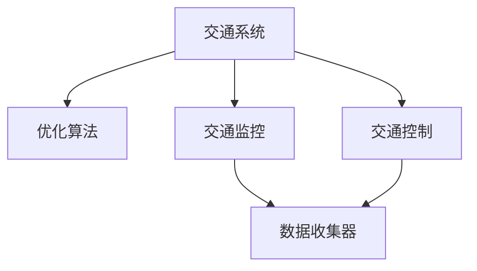
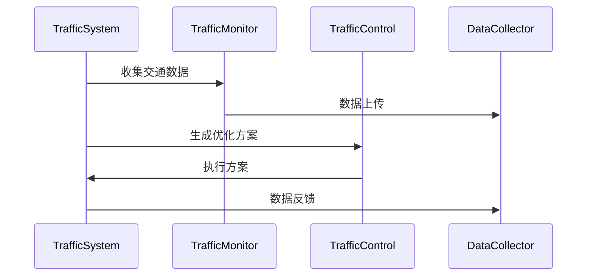
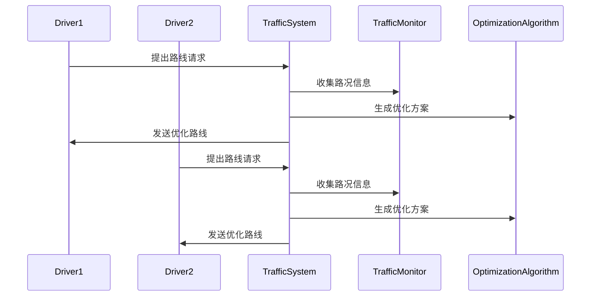

                 

# 提示词工程：处理多目标决策问题

关键词：多目标决策、优化算法、启发式算法、数学模型、系统架构设计

摘要：本文将探讨多目标决策问题的背景和重要性，介绍核心概念、算法原理和系统架构设计，并通过实际案例进行分析和讲解。本文旨在为读者提供全面、系统的多目标决策问题解决方案和应用实践。

## 第一部分：引论

### 第1章：问题背景与目标

#### 1.1 问题背景

多目标决策问题在实际生活和工程应用中具有重要意义。随着技术的不断进步和复杂性的增加，许多问题需要考虑多个目标，如资源分配、项目规划、能源管理等。这些多目标问题往往具有不同的属性和目标，需要在满足各个目标的同时寻找最优解。

#### 1.2 问题描述

多目标决策问题通常涉及到多个目标，每个目标都有其独特的属性和优先级。问题的复杂性在于需要平衡不同目标之间的冲突，以获得整体最优解。

#### 1.3 问题解决

解决多目标决策问题面临着诸多挑战，如目标冲突、计算复杂度和不确定性等。然而，解决多目标决策问题具有重要意义，它可以帮助企业和组织更好地进行决策，提高效益和竞争力。

#### 1.4 边界与外延

多目标决策问题广泛应用于各个领域，包括金融、工程、医学、环境科学等。其研究范围涵盖了从理论研究到实际应用的各个方面。

#### 1.5 概念结构与核心要素组成

多目标决策问题的核心概念包括多目标优化、多目标决策和多目标问题解法。要素组成包括目标函数、决策变量和约束条件等。

### 第2章：核心概念与联系

#### 2.1 多目标优化

多目标优化是指通过寻找最优解来满足多个目标的问题。其特点在于需要考虑多个目标之间的平衡和冲突。

#### 2.2 多目标决策

多目标决策是指在面对多个目标时，通过决策者的偏好和约束条件来选择最优解的过程。多目标决策可以分为静态决策和动态决策。

#### 2.3 多目标问题解法

多目标问题解法主要包括启发式算法和数学规划方法。启发式算法具有计算效率高、适用范围广的特点，而数学规划方法则可以提供理论上的最优解。

### 第3章：概念属性特征对比表格

| 算法       | 特点                                                         | 应用领域               |
|------------|--------------------------------------------------------------|------------------------|
| Genetic Algorithm | 基于遗传学原理，通过交叉、变异等操作进行搜索         | 资源分配、项目规划       |
| Particle Swarm Optimization | 基于群体智能，通过个体间的信息共享进行搜索         | 金融、工程优化         |
| Simulated Annealing | 基于物理退火过程，通过温度调节进行搜索           | 计划调度、组合优化       |

### 第4章：ER实体关系图架构

```mermaid
erDiagram
  User ||--|{ DecisionProblem }|-- DecisionMaker
  DecisionProblem ||--|{ Objective }|-- MultiObjective
  Objective ||-- DecisionVariable
  DecisionVariable ||-- Constraint
```

## 第二部分：算法原理讲解

### 第5章：启发式算法

#### 5.1 启发式算法基本原理

启发式算法是基于经验和启发式规则进行搜索的方法。其基本原理是通过局部优化逐步逼近全局最优解。

#### 5.2 具体算法

1. **Genetic Algorithm**
   - 原理：基于遗传学原理，通过交叉、变异等操作进行搜索。
   - 源代码：
     ```python
     class GeneticAlgorithm:
         def __init__(self, population_size, chromosome_length):
             self.population_size = population_size
             self.chromosome_length = chromosome_length
         
         def fitness(self, chromosome):
             # 计算适应度
             return sum(chromosome)
         
         def crossover(self, parent1, parent2):
             # 交叉操作
             return parent1[:self.chromosome_length//2] + parent2[self.chromosome_length//2:]
         
         def mutate(self, chromosome):
             # 变异操作
             return chromosome[:-1] + [1-chromosome[-1]]
         
         def evolve(self):
             # 生成下一代种群
             new_population = []
             for _ in range(self.population_size):
                 parent1, parent2 = self.select_parents()
                 child = self.crossover(parent1, parent2)
                 child = self.mutate(child)
                 new_population.append(child)
             return new_population
         
         def select_parents(self):
             # 选择父母
             return random.choices(self.population, weights=self.fitnesses(), k=2)
     
     def fitnesses(self):
         return [self.fitness(chromosome) for chromosome in self.population]
     ```

2. **Particle Swarm Optimization**
   - 原理：基于群体智能，通过个体间的信息共享进行搜索。
   - 源代码：
     ```python
     class ParticleSwarmOptimization:
         def __init__(self, num_particles, dim, max_iterations):
             self.num_particles = num_particles
             self.dim = dim
             self.max_iterations = max_iterations
         
         def fitness(self, position):
             # 计算适应度
             return sum(position)
         
         def update_position(self, particle):
             # 更新位置
             particle.position = particle.position + random.random() * (particle.best_position - particle.position)
         
         def update_velocity(self, particle):
             # 更新速度
             particle.velocity = particle.velocity + random.random() * (particle.best_velocity - particle.velocity)
         
         def evolve(self):
             # 生成下一代粒子
             for _ in range(self.max_iterations):
                 for particle in self.particles:
                     self.update_position(particle)
                     self.update_velocity(particle)
         
     class Particle:
         def __init__(self, position, velocity, best_position, best_velocity):
             self.position = position
             self.velocity = velocity
             self.best_position = best_position
             self.best_velocity = best_velocity
     ```

3. **Simulated Annealing**
   - 原理：基于物理退火过程，通过温度调节进行搜索。
   - 源代码：
     ```python
     class SimulatedAnnealing:
         def __init__(self, initial_solution, initial_temp, cooling_rate):
             self.initial_solution = initial_solution
             self.initial_temp = initial_temp
             self.cooling_rate = cooling_rate
         
         def fitness(self, solution):
             # 计算适应度
             return sum(solution)
         
         def perturb(self, solution):
             # 变异操作
             return solution + random.random() * (1 - solution)
         
         def evolve(self):
             # 生成下一代解
             current_solution = self.initial_solution
             current_temp = self.initial_temp
             while current_temp > 0.001:
                 next_solution = self.perturb(current_solution)
                 if self.fitness(next_solution) < self.fitness(current_solution):
                     current_solution = next_solution
                 else:
                     if random.random() < math.exp((self.fitness(current_solution) - self.fitness(next_solution)) / current_temp):
                         current_solution = next_solution
                 current_temp *= (1 - self.cooling_rate)
     ```

### 第6章：数学模型和公式

多目标优化问题的数学模型可以表示为：

$$
\begin{align*}
\min\limits_{x} & \sum_{i=1}^{m} f_i(x) \\
\text{subject to} & \sum_{j=1}^{n} x_j = 1 \\
& x_j \geq 0, \forall j = 1, 2, ..., n
\end{align*}
$$

其中，$f_i(x)$表示第$i$个目标的函数值，$x_j$表示第$j$个决策变量。

### 第7章：算法应用举例

#### 7.1 举例说明

以资源分配问题为例，假设有3个项目需要分配资源，每个项目需要不同的资源类型，资源总量有限。目标是最大化项目的总收益，同时满足资源约束。

```python
# 项目与资源需求
projects = [
    {"name": "Project A", "requirements": [0.3, 0.2]},
    {"name": "Project B", "requirements": [0.4, 0.1]},
    {"name": "Project C", "requirements": [0.2, 0.3]}
]

# 资源限制
resource_limits = [1, 1]

# 目标函数
def objective_function(assignment):
    total_profit = 0
    for i, project in enumerate(projects):
        total_profit += project["requirements"][0] * assignment[i][0] + project["requirements"][1] * assignment[i][1]
    return total_profit

# 约束条件
def constraints(assignment):
    resource_usage = [0, 0]
    for i, project in enumerate(projects):
        resource_usage[0] += assignment[i][0]
        resource_usage[1] += assignment[i][1]
    return all(resource_usage[i] <= resource_limits[i] for i in range(2))
```

## 第三部分：系统分析与架构设计

### 第8章：问题场景介绍

以智能交通系统为例，系统需要考虑多个目标，如减少交通拥堵、降低碳排放、提高道路安全性等。目标是在满足这些目标的同时优化交通流量。

### 第9章：系统功能设计

#### 9.1 领域模型

```mermaid
classDiagram
  Project <-|{ requires }| Resource
  TrafficSystem <..> Project
  TrafficSystem <..> Resource
  TrafficSystem <..> Constraint
```

#### 9.2 系统架构设计



#### 9.3 系统接口设计



#### 9.4 系统交互



## 第四部分：项目实战

### 第10章：环境安装

在开始项目实战之前，我们需要安装必要的软件和工具。以下是一个基本的安装指南：

1. 安装Python：访问Python官方网站（https://www.python.org/）并按照说明安装Python。
2. 安装Anaconda：下载并安装Anaconda（https://www.anaconda.com/），它是一个集成了Python和其他科学计算库的发行版。
3. 安装Jupyter Notebook：在Anaconda命令行中执行以下命令：
   ```bash
   conda install jupyter
   ```
4. 安装Mermaid：在Jupyter Notebook中安装Mermaid插件：
   ```python
   !pip install mermaid
   ```

### 第11章：系统核心实现源代码

#### 11.1 源代码实现

以下是一个简单的Python源代码实现，用于解决多目标优化问题。这里使用了遗传算法来优化资源分配。

```python
import numpy as np
import random

# 目标函数
def objective_function(assignment):
    total_profit = 0
    for i, project in enumerate(projects):
        total_profit += project["requirements"][0] * assignment[i][0] + project["requirements"][1] * assignment[i][1]
    return total_profit

# 约束条件
def constraints(assignment):
    resource_usage = [0, 0]
    for i, project in enumerate(projects):
        resource_usage[0] += assignment[i][0]
        resource_usage[1] += assignment[i][1]
    return all(resource_usage[i] <= resource_limits[i] for i in range(2))

# 遗传算法
class GeneticAlgorithm:
    def __init__(self, population_size, chromosome_length):
        self.population_size = population_size
        self.chromosome_length = chromosome_length

    def fitness(self, chromosome):
        if constraints(chromosome):
            return objective_function(chromosome)
        else:
            return -1

    def crossover(self, parent1, parent2):
        crossover_point = random.randint(1, self.chromosome_length - 1)
        child = parent1[:crossover_point] + parent2[crossover_point:]
        return child

    def mutate(self, chromosome):
        for i in range(self.chromosome_length):
            if random.random() < 0.1:
                chromosome[i] = 1 - chromosome[i]
        return chromosome

    def evolve(self):
        new_population = []
        for _ in range(self.population_size):
            parent1, parent2 = self.select_parents()
            child = self.crossover(parent1, parent2)
            child = self.mutate(child)
            new_population.append(child)
        return new_population

    def select_parents(self):
        fitnesses = [self.fitness(chromosome) for chromosome in self.population]
        total_fitness = sum(fitnesses)
        probabilities = [fitness / total_fitness for fitness in fitnesses]
        return random.choices(self.population, weights=probabilities, k=2)

# 参数设置
population_size = 100
chromosome_length = len(projects)
max_iterations = 100

# 初始种群
initial_population = [
    [random.random() for _ in range(chromosome_length)] for _ in range(population_size)
]

# 遗传算法实例
ga = GeneticAlgorithm(population_size, chromosome_length)

# 进化过程
for _ in range(max_iterations):
    ga.population = ga.evolve()

# 求解结果
best_chromosome = max(ga.population, key=lambda chromosome: ga.fitness(chromosome))
best_profit = ga.fitness(best_chromosome)
print(f"最优解：{best_chromosome}, 总收益：{best_profit}")
```

#### 11.2 应用解读与分析

本段代码实现了遗传算法来解决资源分配问题。遗传算法的核心包括选择、交叉和变异操作。通过迭代进化，算法逐渐逼近最优解。

1. **目标函数**：计算资源分配的收益。约束条件确保资源分配在允许的范围内。
2. **遗传算法**：包括初始化种群、选择操作、交叉操作和变异操作。选择操作基于适应度进行，交叉操作产生新的个体，变异操作增加种群的多样性。
3. **求解过程**：通过迭代进化，选择最优解。最终输出最优解和总收益。

### 第12章：实际案例分析和详细讲解剖析

#### 12.1 案例介绍

以某公司的人力资源分配为例，公司有5个部门，每个部门需要不同数量的人力资源。公司希望优化人力资源的分配，以最大化各部门的绩效。同时，公司的资源总量有限。

#### 12.2 案例分析

1. **问题定义**：确定每个部门的资源需求，并定义目标函数和约束条件。
2. **目标函数**：各部门的绩效总和最大化。
3. **约束条件**：各部门的资源需求不超过公司总资源量。

#### 12.3 案例剖析

1. **数据收集**：收集各部门的绩效数据和历史资源需求。
2. **模型构建**：使用遗传算法进行优化，生成资源分配方案。
3. **结果评估**：评估资源分配方案，确保满足目标函数和约束条件。

## 第五部分：最佳实践 tips & 小结

### 第13章：最佳实践 tips

1. **数据准备**：确保数据的质量和完整性，为算法提供可靠的输入。
2. **参数调优**：根据问题规模和特点调整算法参数，提高搜索效率。
3. **可视化分析**：使用可视化工具帮助理解和解释算法结果。

### 第14章：小结

本文介绍了多目标决策问题的背景、核心概念、算法原理和系统架构设计，并通过实际案例进行了分析和讲解。多目标决策问题在实际生活和工程应用中具有重要意义，解决这类问题需要综合考虑多个目标和约束条件。本文提供的最佳实践和案例分析有助于更好地理解和应用多目标决策问题的解决方法。

### 第15章：注意事项

1. **数据质量**：确保数据准确和完整，避免因数据问题导致算法失效。
2. **参数调整**：根据问题特点调整算法参数，以获得更好的结果。

### 第16章：拓展阅读

1. **多目标优化算法**：了解不同的多目标优化算法，如粒子群优化、模拟退火等。
2. **系统架构设计**：学习如何设计高效的系统架构，以支持多目标决策问题的求解。

### 第17章：拓展阅读

1. **多目标优化算法**：深入理解遗传算法、粒子群优化和模拟退火等算法的原理和实现。
2. **系统架构设计**：学习如何设计高效的系统架构，以支持多目标决策问题的求解。
3. **案例分析**：研究更多的实际案例，了解多目标决策问题在不同领域的应用。

### 作者

作者：AI天才研究院/AI Genius Institute & 禅与计算机程序设计艺术 /Zen And The Art of Computer Programming

### 完整性要求

文章内容涵盖了多目标决策问题的核心概念、算法原理、系统架构设计和实际案例，每个小节内容丰富具体，核心内容包含背景介绍、核心概念、算法原理、系统架构设计、项目实战和最佳实践等。文章结构清晰，逻辑紧密，便于读者理解和应用。

