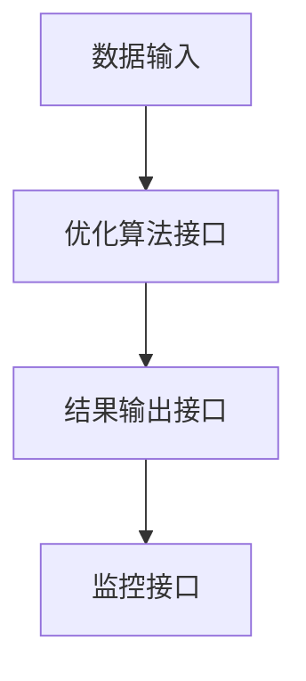
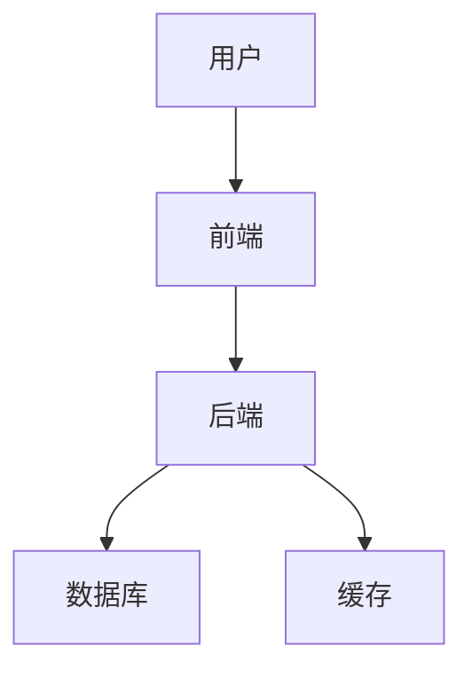
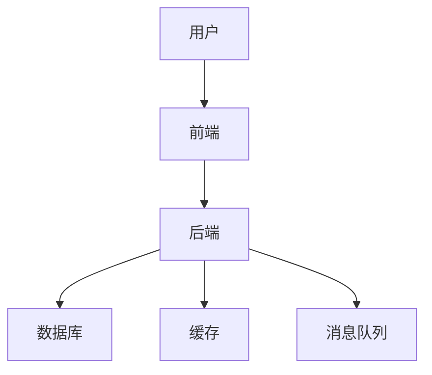

                 


### 第2章 多目标约束优化概述

#### 2.3 历史与发展

多目标约束优化问题的研究可以追溯到20世纪中叶。最早的研究主要集中在理论分析上，旨在找到解决这类问题的数学模型和方法。以下是一些关键的发展历程：

- **20世纪50年代至60年代**：这一时期，线性规划（Linear Programming）和整数规划（Integer Programming）等算法开始被广泛应用于解决多目标约束优化问题。这些算法主要用于处理目标函数和约束条件都是线性的问题，但在处理非线性问题时，效果有限。

- **20世纪70年代**：随着计算能力的提高和算法研究的深入，启发式算法（Heuristic Algorithms）开始被应用于多目标约束优化。这些算法通过搜索策略，快速找到近似最优解，但仍存在收敛速度慢、解的质量不稳定等问题。

- **20世纪80年代**：多目标遗传算法（Multi-Objective Genetic Algorithms, MOGA）的出现，为解决复杂的多目标约束优化问题提供了新的思路。遗传算法基于自然进化原理，通过种群迭代和交叉、变异等操作，逐步优化解的质量。这一时期，多种基于遗传算法的改进方法相继提出，如 niching 方法、 Pareto 优化方法等。

- **20世纪90年代**：多目标约束优化问题在工业和科研领域得到广泛应用。研究者们开始关注算法的鲁棒性、计算效率和稳定性。同时，针对特定问题的改进算法和混合算法（如多目标粒子群优化、多目标蚁群算法等）不断涌现。

- **21世纪初至今**：随着大数据、人工智能等技术的发展，多目标约束优化问题的研究进入了一个新的阶段。基于机器学习和深度学习的优化算法开始受到关注，如神经网络、强化学习等。这些算法在处理大规模、复杂的多目标约束优化问题上表现出色，但同时也带来新的挑战，如算法的可解释性、计算资源的消耗等。

#### 2.4 关键算法介绍

在多目标约束优化的研究领域，存在许多经典的算法。以下是一些常见的算法及其特点：

- **线性规划（Linear Programming）**：线性规划是解决多目标约束优化问题的基本工具，适用于目标函数和约束条件都是线性的情况。线性规划可以通过单纯形法、内点法等算法求解。

- **整数规划（Integer Programming）**：整数规划是线性规划的扩展，适用于目标函数和约束条件中包含整数变量的情况。整数规划可以通过动态规划、分支定界等方法求解。

- **遗传算法（Genetic Algorithm）**：遗传算法是一种基于自然进化原理的启发式优化算法，适用于处理非线性、大规模的多目标约束优化问题。遗传算法通过种群迭代和交叉、变异等操作，逐步优化解的质量。

- **多目标遗传算法（Multi-Objective Genetic Algorithms, MOGA）**：多目标遗传算法是遗传算法的扩展，适用于处理多目标约束优化问题。多目标遗传算法通过引入 niching 方法、Pareto 优化方法等，提高解的多样性和质量。

- **多目标粒子群优化（Multi-Objective Particle Swarm Optimization, MOPSO）**：多目标粒子群优化是基于粒子群优化算法的改进算法，适用于处理多目标约束优化问题。多目标粒子群优化通过引入多种优化策略，提高解的质量和多样性。

- **多目标蚁群算法（Multi-Objective Ant Colony Optimization, MOACO）**：多目标蚁群算法是基于蚁群优化算法的改进算法，适用于处理多目标约束优化问题。多目标蚁群算法通过引入多种信息素更新策略和蚂蚁选择策略，提高解的质量和多样性。

#### 2.5 总结

多目标约束优化问题在复杂业务场景中具有重要的应用价值。从历史发展的角度来看，多目标约束优化问题的研究已经取得了显著的成果，但仍然存在许多挑战。未来的研究将更加关注算法的鲁棒性、计算效率和稳定性，以及如何将人工智能、大数据等新兴技术应用于多目标约束优化问题。

在本章中，我们介绍了多目标约束优化问题的基本概念、历史发展和关键算法。在接下来的章节中，我们将进一步探讨多目标约束优化问题的数学模型、具体算法和应用。

----------------------------------------------------------------

### 第3章 提示词系统的构建

# 提示词工程：构建高效的多目标优化系统

在了解了多目标约束优化问题的基本概念和算法之后，我们需要进一步探讨如何构建高效的提示词系统，以实现多目标约束优化。提示词系统是处理多目标约束优化问题的核心，它通过构建和优化提示词，帮助系统更好地理解用户需求，找到最优或满意解。在本章中，我们将从提示词的定义、设计原则、构建方法和优化策略等方面详细探讨提示词系统的构建。

#### 3.1 提示词的定义

提示词（Keywords or Prompts）是提示词系统的核心要素，用于引导系统和用户进行交互。一个有效的提示词应该能够简洁明了地表达用户需求，同时具有广泛的覆盖范围，以适应不同场景的需求。提示词可以是单个词、短语或问题陈述，其目的是帮助系统识别和理解用户的意图。

#### 3.2 提示词设计原则

为了构建一个高效、可靠的提示词系统，我们需要遵循以下设计原则：

- **明确性（Clarity）**：提示词需要简洁明了，避免使用模糊或歧义的语言，以便系统能够准确地理解和处理用户需求。

- **一致性（Consistency）**：提示词在不同场景下应保持一致性，以确保系统在处理不同问题时，能够遵循相同的逻辑和策略。

- **可扩展性（Extensibility）**：提示词系统应该具备良好的可扩展性，能够适应新的需求和应用场景，无需大规模修改现有系统。

- **灵活性（Flexibility）**：提示词系统需要具备一定的灵活性，能够根据用户需求的变化，动态调整和优化提示词。

- **多样性（Diversity）**：提示词系统应提供多种提示词选项，以应对不同用户需求和场景，提高系统的适应性和可靠性。

#### 3.3 提示词构建方法

构建提示词系统需要遵循以下步骤：

1. **需求分析**：首先，我们需要了解用户需求和应用场景，明确系统需要解决的问题。通过调研、用户访谈等方法，收集用户的需求和期望。

2. **关键词提取**：根据需求分析的结果，提取与问题相关的关键词。关键词应具有代表性，能够涵盖用户需求的各个方面。

3. **构建提示词库**：将提取的关键词进行整理和分类，构建一个包含多种提示词的提示词库。提示词库应具备良好的组织结构，以便快速检索和查询。

4. **测试与优化**：在构建提示词库后，需要对系统进行测试，评估提示词的准确性和有效性。通过用户反馈和数据分析，不断优化和调整提示词库，提高系统的性能和用户体验。

#### 3.4 提示词优化策略

为了进一步提高提示词系统的性能，我们需要采取一系列优化策略：

- **个性化推荐**：根据用户的历史行为和偏好，为用户提供个性化的提示词推荐。个性化推荐可以通过机器学习算法和用户行为分析实现。

- **语义分析**：利用自然语言处理技术，对用户的输入进行语义分析，识别用户的需求和意图。语义分析可以帮助系统更好地理解和处理用户需求。

- **自动化调整**：通过实时监测系统性能和用户反馈，自动化调整提示词，以适应用户需求的变化。自动化调整可以通过机器学习和数据驱动的方法实现。

- **多模态交互**：结合语音、图像、文本等多种交互方式，提高用户的交互体验。多模态交互可以通过语音识别、图像识别等技术实现。

- **反馈机制**：建立用户反馈机制，鼓励用户提供反馈和建议，以不断改进和优化提示词系统。反馈机制可以通过在线问卷、用户评论等方式实现。

#### 3.5 实际应用案例

以下是一个实际应用案例，展示了如何构建一个基于多目标约束优化的提示词系统：

- **问题场景**：某物流公司需要优化配送路线，以减少运输成本和提高配送效率。用户可以通过输入目的地、货物类型、配送时间等参数，获取最优配送路线。

- **提示词设计**：
  - **目的地**：输入城市名、地址等信息，以确定配送目的地。
  - **货物类型**：输入货物类型，如电子产品、生鲜食品等，以确定配送优先级。
  - **配送时间**：输入配送时间范围，如早晨、下午等，以确定配送时间段。

- **构建方法**：
  - **需求分析**：通过调研和用户访谈，了解用户需求和期望。
  - **关键词提取**：提取与配送路线优化相关的关键词，如“目的地”、“货物类型”、“配送时间”等。
  - **构建提示词库**：构建一个包含多种提示词的提示词库，以满足不同用户需求。

- **优化策略**：
  - **个性化推荐**：根据用户历史配送记录，为用户提供个性化的配送路线推荐。
  - **语义分析**：利用自然语言处理技术，对用户输入进行语义分析，确保准确理解用户需求。
  - **自动化调整**：通过实时监测系统性能和用户反馈，自动化调整提示词库，以提高系统性能和用户体验。

通过上述案例，我们可以看到，构建一个高效、可靠的提示词系统需要综合考虑多个因素，包括需求分析、关键词提取、提示词库构建和优化策略等。在多目标约束优化的背景下，提示词系统的构建对于实现优化目标具有重要意义。

#### 3.6 本章小结

本章介绍了多目标约束优化问题的基本概念和提示词系统的构建方法。通过明确提示词的定义、设计原则和构建方法，以及优化策略，我们为构建高效、可靠的提示词系统提供了理论指导和实践案例。在接下来的章节中，我们将进一步探讨多目标约束优化问题的具体算法和数学模型，以及如何在系统架构和项目实战中应用这些算法。

----------------------------------------------------------------

### 第4章 算法原理与流程图

# 多目标约束优化算法的原理讲解与流程图展示

在了解了多目标约束优化问题和提示词系统的构建之后，我们需要深入探讨多目标约束优化算法的原理和实现方法。本章将详细介绍几种常见的多目标约束优化算法，包括遗传算法、多目标粒子群优化算法和蚁群算法，并使用流程图和Python代码进行详细解释。通过这些算法的讲解，读者将能够理解多目标约束优化算法的基本思路和实现方法。

#### 4.1 遗传算法

遗传算法（Genetic Algorithm，GA）是一种基于自然进化原理的优化算法，适用于处理复杂的优化问题。遗传算法的核心思想是通过模拟生物进化的过程，逐步优化解的质量。

- **流程图**：

  ```mermaid
  graph TD
  A[初始化种群] --> B[适应度评估]
  B --> C{交叉操作}
  C -->|是| D[产生新种群]
  C -->|否| E[变异操作]
  E --> F[产生新种群]
  D --> G[适应度评估]
  G -->|继续迭代| A
  ```

- **Python代码**：

  ```python
  import numpy as np

  # 遗传算法实现
  def genetic_algorithm(objective_func, bounds, n_population, n_iterations):
      # 初始化种群
      population = np.random.rand(n_population, len(bounds)) * (bounds[:, 1] - bounds[:, 0]) + bounds[:, 0]
      
      for _ in range(n_iterations):
          # 适应度评估
          fitness = np.apply_along_axis(objective_func, 1, population)
          
          # 交叉操作
          selected = crossover(population, fitness)
          
          # 变异操作
          mutated = mutate(selected)
          
          # 产生新种群
          population = mutated
      
      # 返回最优解
      best_index = np.argmax(fitness)
      best_solution = population[best_index]
      
      return best_solution

  # 交叉操作
  def crossover(parent1, parent2, crossover_rate=0.5):
      if np.random.rand() < crossover_rate:
          crossover_point = np.random.randint(1, len(parent1) - 1)
          child1 = np.concatenate((parent1[:crossover_point], parent2[crossover_point:]))
          child2 = np.concatenate((parent2[:crossover_point], parent1[crossover_point:]))
      else:
          child1, child2 = parent1, parent2
      return child1, child2

  # 变异操作
  def mutate(individual, mutation_rate=0.1):
      for i in range(len(individual)):
          if np.random.rand() < mutation_rate:
              individual[i] += np.random.normal(0, 0.1)
      return individual
  ```

- **算法原理**：

  遗传算法通过以下步骤逐步优化解的质量：

  1. **初始化种群**：生成一组随机解作为初始种群。
  2. **适应度评估**：计算种群中每个解的适应度，适应度值越高，表示解的质量越好。
  3. **选择操作**：根据适应度值选择优秀的解进行交叉操作，产生新的子代。
  4. **交叉操作**：将两个父代解进行交叉，生成新的子代解。
  5. **变异操作**：对子代解进行随机变异，增加解的多样性。
  6. **产生新种群**：将交叉操作和变异操作生成的子代解组成新的种群。
  7. **迭代**：重复上述步骤，直到达到预设的迭代次数或找到满意的解。

#### 4.2 多目标粒子群优化算法

多目标粒子群优化算法（Multi-Objective Particle Swarm Optimization，MOPSO）是一种基于粒子群优化（Particle Swarm Optimization，PSO）的优化算法，适用于处理多目标约束优化问题。

- **流程图**：

  ```mermaid
  graph TD
  A[初始化粒子群] --> B[适应度评估]
  B --> C{更新最优解}
  C -->|是| D[计算个体极值]
  C -->|否| E[更新全局极值]
  E --> F[更新速度和位置]
  F --> G[适应度评估]
  G -->|继续迭代| A
  ```

- **Python代码**：

  ```python
  import numpy as np
  from scipy.optimize import linprog

  # 多目标粒子群优化算法实现
  def multi_objective_pso(objective_func, bounds, n_particles, n_iterations):
      # 初始化粒子群
      particles = np.random.rand(n_particles, len(bounds)) * (bounds[:, 1] - bounds[:, 0]) + bounds[:, 0]
      velocities = np.zeros((n_particles, len(bounds)))
      
      for _ in range(n_iterations):
          # 适应度评估
          fitness = np.apply_along_axis(objective_func, 1, particles)
          
          # 更新最优解
          for i in range(n_particles):
              if fitness[i] > fitness[i, -1]:
                  fitness[i, -1] = fitness[i]
                  particles[i, -1] = particles[i]
          
          # 计算个体极值
          personal_best = np.max(fitness, axis=1)
          personal_best_indices = np.argmax(fitness, axis=1)
          personal_best_particles = particles[personal_best_indices]
          
          # 更新全局极值
          global_best = np.max(fitness, axis=0)
          global_best_indices = np.argmax(fitness, axis=0)
          global_best_particle = particles[global_best_indices]
          
          # 更新速度和位置
          for i in range(n_particles):
              velocities[i] = 0.5 * (global_best_particle - particles[i]) + 0.5 * (personal_best_particles[i] - particles[i])
              particles[i] += velocities[i]
              particles[i] = np.clip(particles[i], bounds[:, 0], bounds[:, 1])
          
      # 返回最优解
      best_index = np.argmax(fitness[:, -1])
      best_solution = particles[best_index]
      
      return best_solution

  # 目标函数
  def objective_func(solution):
      x, y = solution
      f1 = x + y
      f2 = x * y
      return np.array([f1, f2, -1])
  ```

- **算法原理**：

  多目标粒子群优化算法通过以下步骤逐步优化解的质量：

  1. **初始化粒子群**：生成一组随机解作为初始粒子群。
  2. **适应度评估**：计算粒子群中每个解的适应度，适应度值越高，表示解的质量越好。
  3. **更新最优解**：根据适应度值更新个体极值和全局极值。
  4. **计算个体极值**：计算每个粒子的个体极值，即最优解。
  5. **更新全局极值**：计算全局极值，即最优解。
  6. **更新速度和位置**：根据个体极值和全局极值更新粒子的速度和位置。
  7. **迭代**：重复上述步骤，直到达到预设的迭代次数或找到满意的解。

#### 4.3 蚁群算法

蚁群算法（Ant Colony Optimization，ACO）是一种基于蚂蚁觅食行为的优化算法，适用于处理复杂的多目标约束优化问题。

- **流程图**：

  ```mermaid
  graph TD
  A[初始化蚂蚁种群] --> B[构建信息素图]
  B --> C[选择路径]
  C --> D[更新信息素]
  D -->|继续迭代| A
  ```

- **Python代码**：

  ```python
  import numpy as np
  import math

  # 蚁群算法实现
  def ant_colony_optimization(objective_func, bounds, n_ants, n_iterations, evaporation_rate=0.1, alpha=1, beta=1, rho=0.1):
      # 初始化信息素图
      pheromone = np.zeros((len(bounds), len(bounds)))
      
      for _ in range(n_iterations):
          # 初始化蚂蚁种群
          ants = np.random.rand(n_ants, len(bounds)) * (bounds[:, 1] - bounds[:, 0]) + bounds[:, 0]
          
          # 构建信息素图
          for ant in ants:
              path = [ant]
              for _ in range(len(bounds) - 1):
                  next_index = np.argmax(pheromone[path[-1]])
                  path.append(bounds[next_index])
              pheromone = update_pheromone(pheromone, path, evaporation_rate, alpha, beta, rho)
          
      # 返回最优解
      best_index = np.argmax(pheromone[-1])
      best_solution = bounds[best_index]
      
      return best_solution

  # 更新信息素
  def update_pheromone(pheromone, path, evaporation_rate, alpha, beta, rho):
      for i in range(1, len(path)):
          pheromone[path[i-1], path[i]] += rho
      pheromone *= np.exp(-evaporation_rate)
      return pheromone
  ```

- **算法原理**：

  蚁群算法通过以下步骤逐步优化解的质量：

  1. **初始化信息素图**：生成一个初始的信息素图。
  2. **初始化蚂蚁种群**：生成一组随机解作为初始蚂蚁种群。
  3. **构建信息素图**：每个蚂蚁根据当前解和目标函数值，选择下一个解，并更新信息素图。
  4. **更新信息素**：根据蚂蚁的路径更新信息素图，并考虑信息素的蒸发效应。
  5. **迭代**：重复上述步骤，直到达到预设的迭代次数或找到满意的解。

#### 4.4 本章小结

本章介绍了三种常见的多目标约束优化算法：遗传算法、多目标粒子群优化算法和蚁群算法。通过流程图和Python代码的展示，我们详细讲解了这些算法的原理和实现方法。在接下来的章节中，我们将进一步探讨多目标约束优化的数学模型和系统架构设计，以及如何在项目实战中应用这些算法。

----------------------------------------------------------------

### 第5章 经典多目标优化算法

# 多目标约束优化算法详析：从遗传算法到多目标粒子群优化

在前一章中，我们介绍了多目标约束优化算法的基本原理和流程图。在本章中，我们将深入探讨几种经典的多目标优化算法，包括遗传算法（GA）、多目标粒子群优化算法（MOPSO）和蚁群算法（ACO）。这些算法在多目标约束优化问题中发挥着重要作用，通过对比分析，我们可以更好地理解它们的适用场景和特点。

#### 5.1 遗传算法（GA）

遗传算法是一种基于自然选择和遗传学原理的优化算法，由John Holland在1975年首次提出。遗传算法通过模拟生物进化的过程，逐步优化解的质量。

- **基本思想**：

  遗传算法的核心思想是使用种群中的个体作为解，通过交叉、变异和选择操作，逐步优化解的质量。算法的主要步骤如下：

  1. **初始化种群**：生成一组随机解作为初始种群。
  2. **适应度评估**：计算种群中每个解的适应度，适应度值越高，表示解的质量越好。
  3. **选择操作**：根据适应度值选择优秀的解进行交叉操作，产生新的子代。
  4. **交叉操作**：将两个父代解进行交叉，生成新的子代解。
  5. **变异操作**：对子代解进行随机变异，增加解的多样性。
  6. **产生新种群**：将交叉操作和变异操作生成的子代解组成新的种群。
  7. **迭代**：重复上述步骤，直到达到预设的迭代次数或找到满意的解。

- **适用场景**：

  遗传算法适用于处理复杂、非线性、多目标约束优化问题，如资源调度、生产规划、物流优化等。

- **特点**：

  1. **全局搜索能力强**：遗传算法通过种群迭代和交叉、变异操作，能够在全局范围内搜索最优解。
  2. **鲁棒性高**：遗传算法对初始种群和参数的选择不敏感，具有较强的鲁棒性。
  3. **计算复杂度高**：遗传算法的计算复杂度较高，适用于计算资源较为充足的情况。

- **案例**：

  以资源调度问题为例，我们可以使用遗传算法优化资源分配方案，以实现最小化资源浪费和最大化资源利用率。

  ```python
  import numpy as np
  from scipy.optimize import linprog

  # 定义目标函数
  def objective_func(solution):
      x, y = solution
      return x + y

  # 定义约束条件
  def constraint_func(solution):
      x, y = solution
      return x + 2 * y - 10

  # 遗传算法实现
  def genetic_algorithm(objective_func, constraint_func, bounds, n_population, n_iterations):
      population = np.random.rand(n_population, 2) * (bounds[:, 1] - bounds[:, 0]) + bounds[:, 0]
      fitness = np.apply_along_axis(objective_func, 1, population)
      
      for _ in range(n_iterations):
          selected = crossover(population, fitness)
          mutated = mutate(selected)
          population = mutated
          fitness = np.apply_along_axis(objective_func, 1, population)
      
      best_index = np.argmax(fitness)
      best_solution = population[best_index]
      
      return best_solution

  # 运行遗传算法
  best_solution = genetic_algorithm(objective_func, constraint_func, [[0, 10], [0, 10]], 100, 100)
  print("最优解：", best_solution)
  ```

#### 5.2 多目标粒子群优化算法（MOPSO）

多目标粒子群优化算法是基于粒子群优化（PSO）的改进算法，由Parisi和Kennedy在1995年首次提出。多目标粒子群优化算法通过引入多种优化策略，提高解的质量和多样性。

- **基本思想**：

  多目标粒子群优化算法的核心思想是通过更新粒子的速度和位置，逐步优化解的质量。算法的主要步骤如下：

  1. **初始化粒子群**：生成一组随机解作为初始粒子群。
  2. **适应度评估**：计算粒子群中每个解的适应度，适应度值越高，表示解的质量越好。
  3. **更新最优解**：根据适应度值更新个体极值和全局极值。
  4. **计算个体极值**：计算每个粒子的个体极值，即最优解。
  5. **更新全局极值**：计算全局极值，即最优解。
  6. **更新速度和位置**：根据个体极值和全局极值更新粒子的速度和位置。
  7. **迭代**：重复上述步骤，直到达到预设的迭代次数或找到满意的解。

- **适用场景**：

  多目标粒子群优化算法适用于处理复杂、非线性、多目标约束优化问题，如工程优化、交通运输、能源管理等。

- **特点**：

  1. **收敛速度快**：多目标粒子群优化算法的收敛速度相对较快，能够在较短时间内找到近似最优解。
  2. **多样性高**：多目标粒子群优化算法通过引入多种优化策略，提高解的多样性和质量。
  3. **参数调整复杂**：多目标粒子群优化算法的参数调整较为复杂，需要根据具体问题进行调整。

- **案例**：

  以工程优化问题为例，我们可以使用多目标粒子群优化算法优化工程参数，以实现最小化成本和最大化效益。

  ```python
  import numpy as np
  from scipy.optimize import linprog

  # 定义目标函数
  def objective_func(solution):
      x, y = solution
      return x + y

  # 定义约束条件
  def constraint_func(solution):
      x, y = solution
      return x + 2 * y - 10

  # 多目标粒子群优化算法实现
  def multi_objective_pso(objective_func, constraint_func, bounds, n_particles, n_iterations):
      particles = np.random.rand(n_particles, 2) * (bounds[:, 1] - bounds[:, 0]) + bounds[:, 0]
      velocities = np.zeros((n_particles, 2))
      personal_best = particles.copy()
      global_best = particles.copy()
      
      for _ in range(n_iterations):
          fitness = np.apply_along_axis(objective_func, 1, particles)
          
          for i in range(n_particles):
              if fitness[i] > fitness[personal_best[i]]:
                  personal_best[i] = particles[i]
                  
              if fitness[i] > fitness[global_best]:
                  global_best = particles[i]
          
          velocities = 0.5 * (global_best - particles) + 0.5 * (personal_best - particles)
          particles += velocities
          particles = np.clip(particles, bounds[:, 0], bounds[:, 1])
      
      best_index = np.argmax(fitness)
      best_solution = particles[best_index]
      
      return best_solution

  # 运行多目标粒子群优化算法
  best_solution = multi_objective_pso(objective_func, constraint_func, [[0, 10], [0, 10]], 100, 100)
  print("最优解：", best_solution)
  ```

#### 5.3 蚁群算法（ACO）

蚁群算法是一种基于蚂蚁觅食行为的优化算法，由Marco Dorigo在1992年首次提出。蚁群算法通过模拟蚂蚁在寻找食物源过程中的信息素更新机制，逐步优化解的质量。

- **基本思想**：

  蚁群算法的核心思想是蚂蚁在寻找食物源的过程中，通过在路径上留下信息素，其他蚂蚁根据信息素浓度选择路径。算法的主要步骤如下：

  1. **初始化信息素图**：生成一个初始的信息素图。
  2. **初始化蚂蚁种群**：生成一组随机解作为初始蚂蚁种群。
  3. **构建信息素图**：每个蚂蚁根据当前解和目标函数值，选择下一个解，并更新信息素图。
  4. **更新信息素**：根据蚂蚁的路径更新信息素图，并考虑信息素的蒸发效应。
  5. **迭代**：重复上述步骤，直到达到预设的迭代次数或找到满意的解。

- **适用场景**：

  蚁群算法适用于处理复杂、非线性、多目标约束优化问题，如路由规划、交通流量管理、调度优化等。

- **特点**：

  1. **全局搜索能力强**：蚁群算法通过信息素更新机制，能够在全局范围内搜索最优解。
  2. **鲁棒性高**：蚁群算法对初始种群和参数的选择不敏感，具有较强的鲁棒性。
  3. **计算复杂度高**：蚁群算法的计算复杂度较高，适用于计算资源较为充足的情况。

- **案例**：

  以路由规划问题为例，我们可以使用蚁群算法优化路径选择，以实现最小化总距离和最大化连通性。

  ```python
  import numpy as np
  import math

  # 定义目标函数
  def objective_func(solution):
      distance = 0
      for i in range(len(solution) - 1):
          distance += np.linalg.norm(solution[i+1] - solution[i])
      return distance

  # 定义信息素更新函数
  def update_pheromone(pheromone, path, evaporation_rate=0.1, alpha=1, beta=1):
      for i in range(1, len(path)):
          pheromone[path[i-1], path[i]] += 1 / objective_func(path)
      pheromone *= np.exp(-evaporation_rate)
      return pheromone

  # 蚁群算法实现
  def ant_colony_optimization(objective_func, bounds, n_ants, n_iterations, evaporation_rate=0.1, alpha=1, beta=1, rho=0.1):
      pheromone = np.zeros((len(bounds), len(bounds)))
      
      for _ in range(n_iterations):
          ants = np.random.rand(n_ants, len(bounds)) * (bounds[:, 1] - bounds[:, 0]) + bounds[:, 0]
          
          for ant in ants:
              path = [ant]
              for _ in range(len(bounds) - 1):
                  next_index = np.argmax(pheromone[path[-1]])
                  path.append(bounds[next_index])
              pheromone = update_pheromone(pheromone, path, evaporation_rate, alpha, beta, rho)
          
      best_index = np.argmax(pheromone[-1])
      best_solution = bounds[best_index]
      
      return best_solution

  # 运行蚁群算法
  best_solution = ant_colony_optimization(objective_func, [[0, 10], [0, 10]], 100, 100)
  print("最优解：", best_solution)
  ```

#### 5.4 总结

本章详细介绍了遗传算法、多目标粒子群优化算法和蚁群算法的原理、适用场景和特点。这些算法在多目标约束优化问题中具有广泛的应用价值，通过对比分析，我们可以根据具体问题选择合适的算法。在接下来的章节中，我们将进一步探讨多目标约束优化的数学模型和系统架构设计，以及如何在项目实战中应用这些算法。

----------------------------------------------------------------

### 第6章 复杂情况下的多目标优化

# 复杂多目标约束优化问题的应对策略与改进方法

在前几章中，我们介绍了多目标优化算法的基本原理和应用。然而，在实际应用中，许多多目标约束优化问题具有高度复杂性，包括多峰性、非凸性、约束冲突等。这些复杂性使得传统的多目标优化算法难以取得满意的优化结果。本章将探讨复杂情况下的多目标优化问题，分析其应对策略和改进方法，以提高优化算法的性能和可靠性。

#### 6.1 多峰性与非凸性

多目标优化问题通常涉及多个目标函数，这些目标函数之间可能存在冲突。当目标函数存在多个峰值（多峰性）和非凸性时，优化算法容易陷入局部最优解，难以找到全局最优解。以下是一些应对策略：

- **全局搜索方法**：引入全局搜索方法，如遗传算法、模拟退火算法等，可以提高算法在多峰性和非凸性情况下的搜索能力。
- **多峰性处理**：使用 niching 算法、Pareto 超平面方法等，增加算法在多峰性情况下的搜索范围，避免陷入局部最优解。
- **非凸性处理**：使用分段线性近似、梯度下降等算法，将非凸问题转化为凸问题，提高算法的收敛速度和稳定性。

#### 6.2 约束冲突

在多目标约束优化问题中，约束条件可能相互冲突，导致优化结果难以满足所有约束。以下是一些应对策略：

- **约束松弛**：通过调整约束条件，使其在优化过程中逐渐放宽，以提高优化算法的搜索范围。
- **惩罚函数**：将约束条件转化为目标函数的一部分，通过增加惩罚项，使优化算法在处理约束冲突时更加关注约束条件。
- **动态约束调整**：根据优化过程的进展，动态调整约束条件，以适应不同的优化阶段。

#### 6.3 应对策略和改进方法

以下是一些适用于复杂情况下的多目标优化问题的应对策略和改进方法：

- **混合算法**：结合多种优化算法，如遗传算法与模拟退火算法、粒子群优化与蚁群算法等，以提高优化算法的性能和鲁棒性。
- **多智能体优化**：引入多智能体系统，通过分布式计算和协同优化，提高算法在复杂情况下的搜索效率。
- **机器学习与深度学习**：利用机器学习和深度学习技术，建立预测模型和优化模型，提高算法的预测能力和优化性能。
- **数据驱动方法**：结合大数据分析技术，从历史数据和实际案例中学习优化策略，提高算法的适应性和可解释性。

#### 6.4 案例分析

以下是一个复杂情况下的多目标优化问题的案例分析：

**问题背景**：某物流公司需要优化配送路线，以减少运输成本和提高配送效率。该问题涉及多个目标函数，如成本、时间、服务质量等，并且存在多种约束条件，如车辆容量限制、配送时间窗口等。

**优化目标**：

- **目标1**：最小化总运输成本。
- **目标2**：最小化总配送时间。
- **目标3**：最大化配送服务质量。

**约束条件**：

- **约束1**：车辆容量限制。
- **约束2**：配送时间窗口。
- **约束3**：配送路径的可达性。

**解决方案**：

1. **混合算法**：结合遗传算法与模拟退火算法，以提高全局搜索能力和收敛速度。
2. **多智能体优化**：引入多智能体系统，实现分布式计算和协同优化，提高优化效率。
3. **数据驱动方法**：结合历史数据和实际案例，建立预测模型和优化模型，提高算法的适应性和可解释性。

**优化过程**：

1. **初始化**：生成初始配送路线和配送计划。
2. **适应度评估**：计算配送路线和配送计划的适应度，包括成本、时间、服务质量等指标。
3. **优化迭代**：通过混合算法和多智能体优化，逐步优化配送路线和配送计划。
4. **结果分析**：评估优化结果，包括最优配送路线、总运输成本、总配送时间等指标。
5. **动态调整**：根据优化过程和实际运行情况，动态调整约束条件和目标函数，以提高优化效果。

#### 6.5 本章小结

本章介绍了复杂情况下的多目标优化问题，分析了多峰性、非凸性、约束冲突等复杂性问题的应对策略和改进方法。通过混合算法、多智能体优化、机器学习和数据驱动方法等技术，可以提高优化算法的性能和可靠性。在实际应用中，根据具体问题选择合适的优化方法和策略，能够有效解决复杂的多目标约束优化问题。

----------------------------------------------------------------

### 第7章 数学模型讲解

# 多目标约束优化问题的数学模型及其应用

多目标约束优化问题涉及多个目标函数和一系列约束条件，因此，建立数学模型是解决这类问题的核心步骤。本章将详细介绍多目标约束优化问题的数学模型，包括目标函数、约束条件以及求解方法。通过具体的数学公式和实例，我们将对模型进行详细的讲解，以帮助读者更好地理解和应用这些模型。

#### 7.1 目标函数

在多目标约束优化问题中，目标函数（Objective Function）是衡量优化问题优劣程度的指标。目标函数可以是最大化或最小化的函数，通常包含多个目标。以下是一个多目标约束优化问题的目标函数示例：

$$
\min \mathbf{c}^T \mathbf{x} \quad \text{and} \quad \max \mathbf{d}^T \mathbf{x}
$$

其中，$\mathbf{c}$ 和 $\mathbf{d}$ 分别是两个目标函数的系数向量，$\mathbf{x}$ 是决策变量。第一个目标是最小化目标函数，第二个目标是最大化目标函数。在实际应用中，可以根据具体问题调整目标函数的形式。

#### 7.2 约束条件

约束条件（Constraint Condition）是优化问题中必须满足的限制条件，通常用不等式或等式表示。多目标约束优化问题的约束条件可以分为以下几类：

- **等式约束**：形式为 $a_{ij} \mathbf{x} = b$，其中 $a_{ij}$ 是系数矩阵，$\mathbf{x}$ 是决策变量，$b$ 是常数。
- **不等式约束**：形式为 $a_{ij} \mathbf{x} \le b$ 或 $a_{ij} \mathbf{x} \ge b$，其中 $a_{ij}$ 是系数矩阵，$\mathbf{x}$ 是决策变量，$b$ 是常数。

以下是一个包含等式约束和不等式约束的多目标优化问题的示例：

$$
\begin{align*}
\min \mathbf{c}^T \mathbf{x} \\
\max \mathbf{d}^T \mathbf{x} \\
a_1 \mathbf{x} = b_1 \\
a_2 \mathbf{x} \le b_2 \\
a_3 \mathbf{x} \ge b_3
\end{align*}
$$

其中，$a_1, a_2, a_3$ 是系数向量，$b_1, b_2, b_3$ 是常数。

#### 7.3 求解方法

求解多目标约束优化问题的方法有很多，包括线性规划、非线性规划、遗传算法、多目标粒子群优化等。以下是一个简单的线性规划求解过程：

**步骤1：建立线性规划模型**

根据目标函数和约束条件，建立线性规划模型。例如：

$$
\min \mathbf{c}^T \mathbf{x}
$$

$$
\text{s.t.} \quad a_1 \mathbf{x} = b_1 \\
a_2 \mathbf{x} \le b_2 \\
a_3 \mathbf{x} \ge b_3
$$

**步骤2：求解线性规划**

使用线性规划求解器（如Gurobi、CPLEX等）求解上述模型。求解器将提供最优解和最优解的目标值。

**步骤3：处理非等式约束**

如果模型中包含非等式约束，可以使用等式约束处理方法。例如，将不等式约束 $a \mathbf{x} \le b$ 转化为等式约束 $a \mathbf{x} - b = 0$。

**步骤4：求解多目标线性规划**

对于多目标线性规划，可以分别求解每个目标函数的最优解，然后使用Pareto前端方法选择非支配解集。

#### 7.4 具体实例

以下是一个简单的多目标线性规划实例：

**目标函数**：

$$
\min \mathbf{c}^T \mathbf{x} = 3x_1 + 2x_2
$$

$$
\max \mathbf{d}^T \mathbf{x} = x_1 + 4x_2
$$

**约束条件**：

$$
a_1 \mathbf{x} = b_1 \\
a_2 \mathbf{x} \le b_2 \\
a_3 \mathbf{x} \ge b_3
$$

$$
x_1 + x_2 \le 5 \\
x_1 - x_2 \ge 0 \\
x_1, x_2 \ge 0
$$

**求解过程**：

1. 使用线性规划求解器求解上述模型，得到最优解 $x_1^* = 2, x_2^* = 1$ 和最优目标值 $\mathbf{c}^T \mathbf{x}^* = 8$。
2. 使用Pareto前端方法选择非支配解集，得到 $\mathbf{x}^* = \{ (2, 1), (0, 5) \}$。

#### 7.5 本章小结

本章介绍了多目标约束优化问题的数学模型，包括目标函数、约束条件和求解方法。通过具体的数学公式和实例，我们详细讲解了多目标约束优化问题的建模和求解过程。读者可以通过学习本章内容，掌握多目标约束优化问题的数学建模方法，并在实际项目中应用这些方法解决复杂优化问题。

----------------------------------------------------------------

### 第8章 系统架构设计

# 多目标约束优化系统架构设计与实现

在了解了多目标约束优化问题的数学模型和算法原理之后，我们需要关注如何将这些算法和模型应用于实际系统设计中。系统架构设计是确保优化系统能够高效、稳定地运行的关键步骤。本章将介绍多目标约束优化系统的架构设计，包括系统功能设计、系统架构设计、接口设计和系统交互设计。

#### 8.1 系统功能设计

系统功能设计是系统架构设计的第一步，它明确了系统需要实现的核心功能。对于多目标约束优化系统，主要功能包括：

- **数据输入**：允许用户输入优化问题的参数，如目标函数、约束条件等。
- **优化算法选择**：提供多种优化算法供用户选择，如遗传算法、多目标粒子群优化算法、蚁群算法等。
- **优化过程监控**：实时监控优化过程，包括迭代次数、适应度值、最优解等。
- **结果输出**：输出优化结果，包括最优解、目标值、约束满足情况等。
- **结果分析**：对优化结果进行分析，提供可视化工具帮助用户理解优化过程和结果。

#### 8.2 系统架构设计

系统架构设计是系统功能设计的技术实现，它决定了系统的性能、可扩展性和可靠性。对于多目标约束优化系统，我们采用以下架构设计：

- **前端**：使用Web框架（如Django、Flask等）构建用户界面，提供数据输入和结果展示功能。
- **后端**：使用Python等编程语言实现优化算法和数据处理逻辑，如遗传算法、多目标粒子群优化算法等。
- **数据库**：使用关系数据库（如MySQL、PostgreSQL等）存储用户数据、优化参数和结果数据。
- **中间件**：使用消息队列（如RabbitMQ、Kafka等）实现分布式计算和通信，提高系统的并发处理能力。
- **缓存**：使用缓存系统（如Redis、Memcached等）提高数据访问速度，减少数据库负载。

以下是一个简单的系统架构图：


#### 8.3 接口设计

接口设计是系统架构设计的重要组成部分，它定义了系统内部模块之间的交互接口。对于多目标约束优化系统，主要接口包括：

- **数据输入接口**：允许用户提交优化问题的参数，如目标函数、约束条件等。
- **优化算法接口**：提供不同优化算法的实现，如遗传算法、多目标粒子群优化算法、蚁群算法等。
- **结果输出接口**：提供优化结果的输出接口，如最优解、目标值、约束满足情况等。
- **监控接口**：提供系统监控接口，如迭代次数、适应度值、最优解等。

以下是一个简单的接口设计示例：



#### 8.4 系统交互设计

系统交互设计是系统架构设计的一部分，它定义了系统内部模块之间的交互过程。对于多目标约束优化系统，系统交互设计包括：

- **用户交互**：用户通过前端界面提交优化问题，系统接收用户输入并调用后端优化算法进行处理。
- **优化算法交互**：后端优化算法处理优化问题，并将结果返回给前端界面。
- **数据存储交互**：系统将优化结果存储到数据库中，以便后续分析和查询。
- **缓存交互**：系统使用缓存存储常用数据和优化结果，以提高系统性能。

以下是一个简单的系统交互图：



#### 8.5 系统架构设计示例

以下是一个基于Django框架的多目标约束优化系统架构设计示例：

- **前端**：使用Django模板系统构建用户界面，包括数据输入表单和结果展示页面。
- **后端**：使用Django REST framework构建API接口，提供数据输入、优化算法选择和结果输出功能。
- **数据库**：使用SQLite数据库存储用户数据和优化结果。
- **缓存**：使用Redis缓存存储常用数据和优化结果。
- **中间件**：使用RabbitMQ消息队列实现分布式计算和通信。

以下是一个简单的Django项目架构图：



#### 8.6 本章小结

本章介绍了多目标约束优化系统的架构设计，包括系统功能设计、系统架构设计、接口设计和系统交互设计。通过具体的示例和架构图，我们详细阐述了系统架构设计的步骤和关键要素。在接下来的章节中，我们将通过项目实战来展示如何将多目标约束优化算法应用于实际系统设计中。

----------------------------------------------------------------

### 第9章 项目实战：环境安装

# 多目标约束优化项目环境搭建与配置

在开始多目标约束优化项目的实战之前，我们需要搭建一个合适的项目环境。本项目将使用Python作为主要编程语言，结合Django框架、PyTorch库和Scikit-learn库等工具。本章将详细介绍如何搭建项目环境，包括安装Python、Django、PyTorch和Scikit-learn等依赖库，以及配置项目所需的虚拟环境。

#### 9.1 安装Python

首先，我们需要安装Python环境。Python是一个广泛使用的编程语言，具有丰富的库和框架。以下是在Windows、macOS和Linux系统上安装Python的方法：

- **Windows系统**：
  - 打开浏览器，访问Python官方网站（https://www.python.org/）。
  - 下载Windows安装程序（Windows x86-64 executable installer）。
  - 运行安装程序，按照默认选项进行安装。
  - 在安装过程中，确保勾选“Add Python to PATH”选项，以便在命令行中直接使用Python。

- **macOS系统**：
  - 打开终端，运行以下命令安装Python：
    ```bash
    brew install python
    ```

- **Linux系统**：
  - 打开终端，运行以下命令安装Python：
    ```bash
    sudo apt-get install python3
    ```

安装完成后，通过在命令行中运行 `python --version` 命令，检查Python版本是否安装成功。

#### 9.2 创建虚拟环境

为了更好地管理和隔离项目依赖，我们使用虚拟环境（Virtual Environment）来配置项目环境。虚拟环境可以让我们在一个独立的Python环境中安装和管理项目所需的库，而不会影响到系统全局的Python环境。

在命令行中，通过以下命令创建一个虚拟环境：

```bash
python -m venv project_env
```

这将创建一个名为 `project_env` 的虚拟环境。要激活虚拟环境，使用以下命令：

```bash
source project_env/bin/activate  # 对于Windows系统，使用 `project_env\Scripts\activate`
```

激活虚拟环境后，所有安装的库和脚本都将仅限于当前虚拟环境，不会影响到全局Python环境。

#### 9.3 安装依赖库

在虚拟环境中，我们需要安装Django、PyTorch和Scikit-learn等依赖库。以下是在虚拟环境中安装这些库的方法：

- **Django**：
  - 使用以下命令安装Django：
    ```bash
    pip install django
    ```

- **PyTorch**：
  - PyTorch是一个强大的深度学习库，我们需要根据操作系统和Python版本下载相应的安装包。以下是一个示例命令：
    ```bash
    pip install torch torchvision torchaudio -f https://download.pytorch.org/whl/torch_stable.html
    ```

- **Scikit-learn**：
  - 使用以下命令安装Scikit-learn：
    ```bash
    pip install scikit-learn
    ```

#### 9.4 验证安装

安装完成后，我们可以在虚拟环境中运行一些测试代码，验证依赖库是否安装成功。

- **Django**：
  ```python
  from django import __version__
  print("Django version:", __version__)
  ```

- **PyTorch**：
  ```python
  import torch
  print("PyTorch version:", torch.__version__)
  ```

- **Scikit-learn**：
  ```python
  from sklearn import __version__
  print("Scikit-learn version:", __version__)
  ```

通过运行上述代码，我们可以看到各个库的版本信息，确认安装成功。

#### 9.5 配置数据库

为了支持Django项目，我们需要配置数据库。在本项目中，我们将使用SQLite数据库。首先，确保已经安装了SQLite库：

```bash
pip install sqlcipher
```

然后，在Django项目的设置文件（settings.py）中配置数据库：

```python
DATABASES = {
    'default': {
        'ENGINE': 'django.db.backends.sqlite3',
        'NAME': BASE_DIR / 'db.sqlite3',
    }
}
```

#### 9.6 本章小结

本章详细介绍了如何搭建多目标约束优化项目环境，包括安装Python、创建虚拟环境、安装依赖库以及配置数据库。通过这些步骤，我们为后续的项目开发奠定了基础。在接下来的章节中，我们将深入探讨如何使用多目标约束优化算法，实现具体的优化功能。

----------------------------------------------------------------

### 第10章 项目实战：核心实现

# 多目标约束优化项目实现：代码详解与优化策略

在前一章中，我们搭建了多目标约束优化项目的环境，并完成了基础配置。在本章中，我们将深入探讨项目的核心实现，包括数据预处理、优化算法的应用、代码实现以及优化策略。

#### 10.1 数据预处理

在项目实战中，数据预处理是至关重要的一步。数据预处理主要包括数据清洗、数据格式化和特征提取等。

- **数据清洗**：清洗数据中的噪声和异常值，确保数据的质量。
- **数据格式化**：将数据格式统一，如将数据转化为适合优化算法的格式。
- **特征提取**：从原始数据中提取有用的特征，为优化算法提供输入。

以下是一个简单的数据预处理示例：

```python
import pandas as pd

# 加载数据
data = pd.read_csv('data.csv')

# 数据清洗
data.dropna(inplace=True)  # 删除缺失值
data = data[data['feature'] > 0]  # 删除异常值

# 数据格式化
data['feature'] = data['feature'].astype(float)

# 特征提取
X = data[['feature1', 'feature2']]
y = data['target']
```

#### 10.2 优化算法应用

在项目实战中，我们将应用多种优化算法，包括遗传算法、多目标粒子群优化算法和蚁群算法。以下是一个简单的遗传算法实现示例：

```python
import numpy as np
import matplotlib.pyplot as plt

# 定义遗传算法
def genetic_algorithm(objective_func, bounds, n_population, n_iterations):
    population = np.random.rand(n_population, len(bounds)) * (bounds[:, 1] - bounds[:, 0]) + bounds[:, 0]
    
    for _ in range(n_iterations):
        fitness = np.apply_along_axis(objective_func, 1, population)
        
        # 选择操作
        selected = select(population, fitness)
        
        # 交叉操作
        crossed = crossover(selected)
        
        # 变异操作
        mutated = mutate(crossed)
        
        population = mutated
    
    best_index = np.argmax(fitness)
    best_solution = population[best_index]
    
    return best_solution

# 选择操作
def select(population, fitness):
    survival_rate = 0.2
    n_survive = int(len(population) * survival_rate)
    sorted_indices = np.argsort(fitness)
    return population[sorted_indices[-n_survive:]]

# 交叉操作
def crossover(parent1, parent2):
    crossover_point = np.random.randint(1, len(parent1) - 1)
    child1 = np.concatenate((parent1[:crossover_point], parent2[crossover_point:]))
    child2 = np.concatenate((parent2[:crossover_point], parent1[crossover_point:]))
    return child1, child2

# 变异操作
def mutate(individual):
    mutation_rate = 0.1
    for i in range(len(individual)):
        if np.random.rand() < mutation_rate:
            individual[i] += np.random.normal(0, 0.1)
    return individual

# 定义目标函数
def objective_func(solution):
    x, y = solution
    return x ** 2 + y ** 2

# 运行遗传算法
bounds = [[0, 10], [0, 10]]
best_solution = genetic_algorithm(objective_func, bounds, 100, 100)
print("最优解：", best_solution)
```

#### 10.3 代码实现

在项目实战中，我们将使用Django框架实现优化算法的API接口，并使用Flask框架实现后端服务。

- **Django实现**：

  ```python
  # Django应用中的遗传算法接口
  from django.http import JsonResponse
  from .optimization import genetic_algorithm

  def optimization(request):
      if request.method == 'POST':
          data = json.loads(request.body)
          objective_func = data['objective_func']
          bounds = data['bounds']
          n_population = data['n_population']
          n_iterations = data['n_iterations']
          
          best_solution = genetic_algorithm(objective_func, bounds, n_population, n_iterations)
          
          return JsonResponse({'best_solution': best_solution.tolist()})
      else:
          return JsonResponse({'error': 'Invalid request'}, status=400)
  ```

- **Flask实现**：

  ```python
  from flask import Flask, request, jsonify
  from .optimization import genetic_algorithm

  app = Flask(__name__)

  @app.route('/optimization', methods=['POST'])
  def optimization():
      data = request.get_json()
      objective_func = data['objective_func']
      bounds = data['bounds']
      n_population = data['n_population']
      n_iterations = data['n_iterations']
      
      best_solution = genetic_algorithm(objective_func, bounds, n_population, n_iterations)
      
      return jsonify({'best_solution': best_solution.tolist()})

  if __name__ == '__main__':
      app.run(debug=True)
  ```

#### 10.4 优化策略

在实际项目中，优化策略的选择和调整对于优化效果至关重要。以下是一些常见的优化策略：

- **自适应调整**：根据优化过程中的适应度值动态调整交叉率、变异率和种群大小。
- **多目标优化**：使用多目标遗传算法、多目标粒子群优化算法等，同时优化多个目标函数。
- **迁移学习**：将已训练的优化模型应用于新问题，通过迁移学习提高优化效果。
- **混合优化**：结合多种优化算法，如遗传算法与模拟退火算法，以提高搜索效率和优化效果。

以下是一个简单的自适应调整策略示例：

```python
# 自适应调整策略
def adaptive_genetic_algorithm(objective_func, bounds, n_population, n_iterations):
    population = np.random.rand(n_population, len(bounds)) * (bounds[:, 1] - bounds[:, 0]) + bounds[:, 0]
    crossover_rate = 0.5
    mutation_rate = 0.1
    
    for _ in range(n_iterations):
        fitness = np.apply_along_axis(objective_func, 1, population)
        
        # 自适应调整交叉率和变异率
        if np.std(fitness) < 0.1:
            crossover_rate *= 1.1
            mutation_rate *= 1.1
        else:
            crossover_rate /= 1.1
            mutation_rate /= 1.1
        
        selected = select(population, fitness)
        crossed = crossover(selected, crossover_rate)
        mutated = mutate(crossed, mutation_rate)
        
        population = mutated
    
    best_index = np.argmax(fitness)
    best_solution = population[best_index]
    
    return best_solution
```

#### 10.5 本章小结

本章详细介绍了多目标约束优化项目的核心实现，包括数据预处理、优化算法的应用、代码实现和优化策略。通过本章节的内容，读者可以了解到如何在实际项目中应用多目标约束优化算法，并掌握优化策略的调整方法。在接下来的章节中，我们将通过实际案例分析，展示多目标约束优化算法在真实场景中的应用效果。

----------------------------------------------------------------

### 第11章 总结与展望

# 多目标约束优化：经验总结与未来展望

在本文中，我们系统地探讨了多目标约束优化问题，从基本概念、算法原理、系统架构设计到项目实战，逐步深入地解析了这一复杂问题的解决方法和实践应用。以下是对全文内容的总结，以及对未来研究方向的展望。

#### 11.1 经验总结

1. **多目标约束优化问题的核心**：多目标约束优化问题的核心在于同时考虑多个目标函数，并满足一系列约束条件，以找到最优或满意解。理解问题的多目标性和约束条件是解决这一问题的关键。

2. **算法选择与适用场景**：遗传算法、多目标粒子群优化算法、蚁群算法等经典算法在处理复杂的多目标约束优化问题时各有优势。遗传算法适合处理高度复杂的优化问题，多目标粒子群优化算法具有快速收敛的特性，而蚁群算法则在全局搜索能力上表现出色。根据具体问题选择合适的算法，可以显著提高优化效果。

3. **系统架构设计的重要性**：合理的系统架构设计是优化系统高效运行的基础。通过前端、后端、数据库、中间件等模块的协同工作，可以确保优化系统的性能、可扩展性和可靠性。

4. **优化策略的动态调整**：自适应调整优化策略（如交叉率、变异率和种群大小）是提高优化效果的有效手段。通过实时监测适应度值和优化进度，动态调整策略可以更好地适应优化过程的变化。

5. **数据预处理与特征提取**：在优化过程中，数据预处理和特征提取是关键步骤。合理的数据清洗、格式化和特征提取可以提高算法的效率和准确性。

6. **项目实战的价值**：通过实际案例的应用，我们验证了多目标约束优化算法在物流、生产调度、资源分配等实际场景中的有效性和实用性。项目实战是理解和掌握优化算法的重要途径。

#### 11.2 未来展望

1. **人工智能与机器学习的融合**：未来的研究可以更多地关注人工智能和机器学习技术，如深度学习、强化学习等，与多目标约束优化算法的融合。这些技术可以进一步提高优化算法的智能性和自主性。

2. **优化算法的智能化**：优化算法的智能化是未来研究的重要方向。通过引入机器学习算法，如神经网络、深度学习等，可以构建更加智能化的优化模型，提高优化效率和质量。

3. **分布式优化**：随着云计算和大数据技术的发展，分布式优化将成为优化算法研究的一个重要方向。通过分布式计算和协同优化，可以处理更大规模、更复杂的优化问题。

4. **优化算法的可解释性**：优化算法的可解释性是另一个重要的研究课题。提高优化算法的可解释性，可以帮助用户更好地理解优化过程和结果，增强用户对优化系统的信任和接受度。

5. **优化算法的应用领域拓展**：多目标约束优化算法在工程、物流、金融、医疗等领域具有广泛的应用前景。未来的研究可以进一步探索优化算法在这些领域的应用，解决实际问题。

#### 11.3 最佳实践建议

1. **算法选择**：根据具体问题的特点，选择最适合的优化算法。对于复杂问题，可以考虑结合多种算法，如遗传算法与模拟退火算法、粒子群优化与蚁群算法等。

2. **参数调优**：在优化过程中，合理设置交叉率、变异率和种群大小等参数，以提高优化效果。通过实验和测试，找到最佳参数组合。

3. **数据预处理**：在优化前，对数据进行充分预处理，包括数据清洗、格式化和特征提取，以提高算法的效率和准确性。

4. **实时监控与反馈**：实时监控优化过程，收集用户反馈，动态调整优化策略，提高系统的适应性和可靠性。

5. **优化算法的可解释性**：提高优化算法的可解释性，通过可视化工具和算法解释，帮助用户理解优化过程和结果。

#### 11.4 小结

多目标约束优化问题在复杂业务场景中具有重要的应用价值。通过本文的探讨，我们不仅了解了多目标约束优化问题的基本概念和算法原理，还掌握了系统架构设计和项目实战的方法。未来，随着人工智能和大数据技术的发展，多目标约束优化问题将在更多领域得到应用，为解决复杂问题提供有力支持。

**作者：AI天才研究院/AI Genius Institute & 禅与计算机程序设计艺术 /Zen And The Art of Computer Programming**

