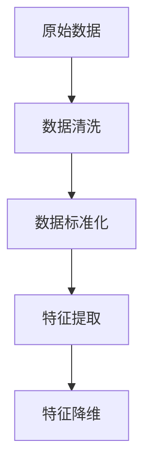
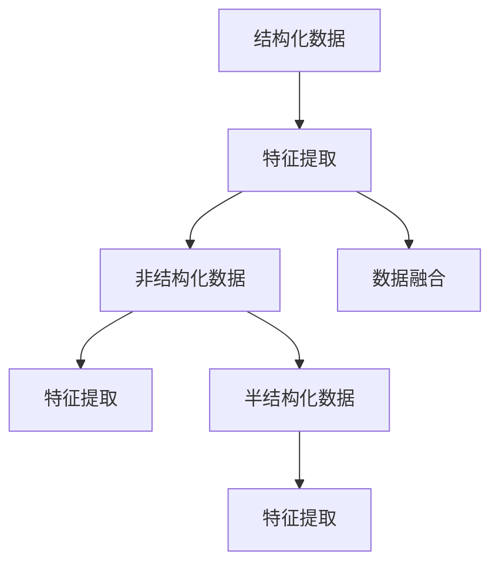
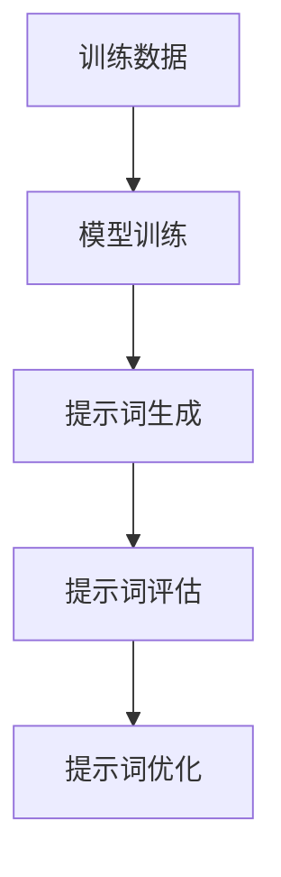
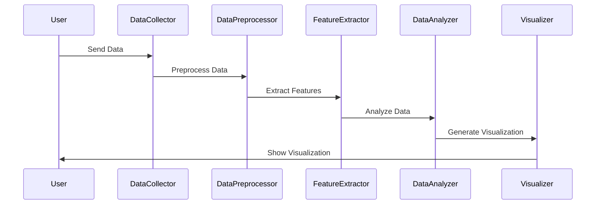

                 

### 文章标题

#### 提示词工程：处理多维度数据分析任务

---

**关键词**：提示词工程、多维度数据分析、算法原理、系统架构、项目实战

**摘要**：本文将深入探讨提示词工程在处理多维度数据分析任务中的应用。通过分析设计思路、核心概念、算法原理、数学模型、系统架构及项目实战，我们旨在为读者提供一套完整的解决方案，以应对日益复杂的数据分析挑战。

---

### 设计思路

在设计《提示词工程：处理多维度数据分析任务》这本书的目录大纲之前，我们首先需要明确文章的核心主题，即“提示词工程”和“多维度数据分析”。接下来，我们将按照以下步骤进行：

1. **背景介绍**：阐述问题背景、问题描述、问题解决、边界与外延，以及核心概念和要素组成。
2. **核心概念与联系**：介绍提示词工程的基本概念，并列出概念属性特征对比表格，使用 Mermaid 画出 ER 实体关系图。
3. **算法原理讲解**：详细阐述提示词工程相关的算法原理，使用 Mermaid 绘制算法流程图，并用 Python 源代码展示，解释数学模型和公式，并进行举例说明。
4. **数学模型和数学公式讲解**：使用 LaTeX 格式给出数学公式，并进行详细讲解和举例说明。
5. **系统分析与架构设计方案**：介绍问题场景、项目功能设计、系统架构设计、接口设计和系统交互，使用 Mermaid 绘制相关图。
6. **项目实战**：描述环境安装、系统核心实现、代码应用解读与分析，以及实际案例分析和讲解。
7. **最佳实践 tips、小结、注意事项、拓展阅读**：总结关键点和注意事项，给出拓展阅读建议。

### 目录大纲

#### 第一部分：提示词工程概述

#### 第1章：问题背景与核心概念

## 1.1 问题背景

### 1.1.1 数据分析任务的多维度挑战

### 1.1.2 提示词工程的概念引入

### 1.1.3 提示词工程的应用场景

## 1.2 核心概念

### 1.2.1 数据维度与特征提取

### 1.2.2 提示词生成与优化

### 1.2.3 多维度数据分析中的挑战

## 1.3 ER实体关系图

```mermaid
erDiagram
    Customer ||--|{ Order : "places" }  
    "Product" ||--|{ Order : "contains" }  
    Customer }|--{ Employee : "works for"  
    "Product" ||--|{ Supplier : "supplies" }  
    "Product" ||--|{ Category : "is a type of" }  
    Employee ||--|{ Project : "works on" }  
    "Product" ..|{ PurchaseOrder : "requires" }  
    Supplier ||--|{ PurchaseOrder : "supplied by" }  
```

## 1.4 本章小结

#### 第二部分：多维度数据分析方法

#### 第2章：数据维度处理技术

## 2.1 数据维度分类

### 2.1.1 结构化数据维度

### 2.1.2 非结构化数据维度

### 2.1.3 半结构化数据维度

## 2.2 特征提取方法

### 2.2.1 统计特征提取

### 2.2.2 模型驱动特征提取

### 2.2.3 基于深度学习的特征提取

## 2.3 多维度数据融合技术

### 2.3.1 线性融合方法

### 2.3.2 非线性融合方法

### 2.3.3 融合效果评估

## 2.4 本章小结

#### 第3章：提示词生成与优化算法

## 3.1 提示词生成算法

### 3.1.1 基于规则的方法

### 3.1.2 基于机器学习的方法

### 3.1.3 基于深度学习的方法

## 3.2 提示词优化策略

### 3.2.1 提示词评价标准

### 3.2.2 提示词优化算法

### 3.2.3 实时优化策略

## 3.3 提示词工程应用案例分析

### 3.3.1 案例一：电商推荐系统

### 3.3.2 案例二：金融风险预警系统

### 3.3.3 案例三：社交媒体分析

## 3.4 本章小结

#### 第三部分：多维度数据分析应用

#### 第4章：自然语言处理中的多维度分析

## 4.1 语言维度的识别

### 4.1.1 基于词汇的提示词生成

### 4.1.2 基于语义的提示词优化

### 4.1.3 情感维度的分析

## 4.2 上下文维度的分析

### 4.2.1 语言模型的应用

### 4.2.2 上下文感知的提示词生成

### 4.2.3 上下文信息的多维度整合

## 4.3 实时分析系统设计

### 4.3.1 系统架构设计

### 4.3.2 系统接口设计与实现

### 4.3.3 系统性能优化

## 4.4 本章小结

---

以上是《提示词工程：处理多维度数据分析任务》的初步目录大纲。在接下来的内容中，我们将逐步深入探讨每一个章节的核心内容，希望能为您带来有价值的见解和启发。

---

## 背景介绍

### 问题背景

在当今大数据时代，数据量呈指数级增长，数据的复杂性和多样性不断增加。传统的数据分析方法已经无法满足日益复杂的数据分析需求，特别是在多维度数据分析方面。多维度数据分析涉及到数据在不同维度上的处理，包括结构化数据、非结构化数据和半结构化数据等。这些数据维度之间的关联和相互作用使得数据分析任务变得更加复杂和具有挑战性。

### 问题描述

多维度数据分析任务的挑战主要体现在以下几个方面：

1. **数据多样性**：不同类型的数据（如文本、图像、音频、视频等）具有不同的结构和特征，如何有效地整合和处理这些多样化的数据是一个重要问题。
2. **数据维度之间的交互**：在多维度数据分析中，各个维度之间的关联和相互作用如何影响分析结果，是另一个需要深入探讨的问题。
3. **实时性**：许多应用场景需要实时分析数据，如何设计高效、可扩展的实时数据分析系统，是当前面临的一个挑战。

### 问题解决

为了解决上述问题，引入了提示词工程这一概念。提示词工程是一种基于人工智能和机器学习的方法，通过生成和优化提示词，实现对多维度数据的分析和理解。提示词工程的关键在于以下几个方面：

1. **数据预处理**：通过特征提取和降维技术，将不同类型的数据转换为统一的表示形式，以便进行后续处理。
2. **提示词生成**：利用机器学习和深度学习算法，生成能够有效描述数据特性的提示词。
3. **提示词优化**：通过反馈机制和优化算法，不断调整和优化提示词，以提高数据分析的准确性和效率。

### 边界与外延

提示词工程的边界主要涉及以下几个方面：

1. **数据类型**：提示词工程主要针对文本、图像、音频等非结构化和半结构化数据，对于结构化数据，传统的数据分析方法仍然适用。
2. **应用场景**：提示词工程可以应用于多种领域，如自然语言处理、计算机视觉、金融风控等。
3. **技术实现**：提示词工程涉及多个技术领域，包括数据预处理、特征提取、机器学习、深度学习等。

### 核心概念与要素组成

提示词工程的核心概念包括以下几个方面：

1. **数据维度**：数据维度是数据的基本特征，包括结构化数据维度、非结构化数据维度和半结构化数据维度。
2. **特征提取**：特征提取是将原始数据转换为适合机器学习算法处理的形式的过程。
3. **提示词生成**：提示词生成是利用机器学习和深度学习算法，从数据中提取出能够描述数据特性的关键词或短语。
4. **提示词优化**：提示词优化是通过反馈机制和优化算法，对生成的提示词进行不断调整和优化，以提高数据分析的准确性和效率。

### 本章小结

在本章中，我们介绍了多维度数据分析任务面临的挑战，并引入了提示词工程作为解决方案。通过分析问题背景、问题描述、问题解决、边界与外延以及核心概念和要素组成，我们为后续章节的深入探讨奠定了基础。

---

## 核心概念与联系

在多维度数据分析任务中，提示词工程是核心技术之一。为了更好地理解提示词工程，我们需要首先明确其基本概念，并列出概念属性特征对比表格。此外，通过绘制 ER 实体关系图，可以更直观地展示提示词工程中的核心实体及其关系。

### 提示词工程的基本概念

#### 1. 数据维度

数据维度是指数据在各个方向上的特征和属性。多维度数据分析任务涉及到多种数据维度，包括：

1. **结构化数据维度**：如数据库中的字段，具有明确的类型和格式。
2. **非结构化数据维度**：如文本、图像、音频、视频等，其结构不固定，难以用传统方法直接处理。
3. **半结构化数据维度**：如 XML、JSON 等格式，具有一定结构，但与结构化数据相比，结构更为灵活。

#### 2. 特征提取

特征提取是将原始数据转换为适合机器学习算法处理的形式的过程。在多维度数据分析中，特征提取是关键步骤，其目标是从数据中提取出能够描述数据特性的特征。

#### 3. 提示词生成

提示词生成是指利用机器学习和深度学习算法，从数据中提取出能够有效描述数据特性的关键词或短语。提示词通常用于数据分析和自然语言处理任务。

#### 4. 提示词优化

提示词优化是通过反馈机制和优化算法，对生成的提示词进行不断调整和优化，以提高数据分析的准确性和效率。提示词优化的目标是找到最佳提示词组合，使其在特定任务中具有最佳性能。

### 概念属性特征对比表格

为了更直观地比较提示词工程中的核心概念，我们可以列出概念属性特征对比表格。以下是一个简单的对比表格示例：

| 概念        | 特征描述                                             | 关联关系                  |
| ----------- | ---------------------------------------------------- | ------------------------ |
| 数据维度    | 数据在不同方向上的特征和属性                         | 提示词生成与优化的基础    |
| 特征提取    | 从原始数据中提取出有意义的特征                        | 数据分析与建模的关键步骤  |
| 提示词生成  | 利用算法从数据中提取出关键词或短语                    | 数据分析与自然语言处理的工具 |
| 提示词优化  | 通过反馈和优化算法调整提示词，提高性能                 | 提示词工程的核心环节      |

### ER 实体关系图

为了更清晰地展示提示词工程中的核心实体及其关系，我们可以使用 Mermaid 绘制 ER 实体关系图。以下是一个示例：

```mermaid
erDiagram
    DataDimension ||--|{ FeatureExtraction : "contains" }
    DataDimension ||--|{ KeywordGeneration : "requires" }
    DataDimension ||--|{ KeywordOptimization : "depends on" }
    FeatureExtraction ||--|{ ModelTraining : "uses" }
    FeatureExtraction ||--|{ ModelEvaluation : "assesses" }
    KeywordGeneration ||--|{ ModelTraining : "uses" }
    KeywordGeneration ||--|{ ModelEvaluation : "assesses" }
    KeywordOptimization ||--|{ ModelTraining : "uses" }
    KeywordOptimization ||--|{ ModelEvaluation : "assesses" }
```

在这个 ER 实体关系图中，DataDimension 表示数据维度，FeatureExtraction 表示特征提取，KeywordGeneration 表示提示词生成，KeywordOptimization 表示提示词优化。各个实体之间的关系通过箭头表示，描述了它们之间的依赖和关联。

### 本章小结

在本章中，我们介绍了提示词工程中的核心概念，包括数据维度、特征提取、提示词生成和提示词优化。通过概念属性特征对比表格和 ER 实体关系图，我们更直观地理解了这些概念之间的关系。这些概念构成了提示词工程的基础，为后续章节的深入探讨提供了理论支持。

---

## 算法原理讲解

提示词工程的实现依赖于一系列算法，这些算法用于处理多维度数据，生成和优化提示词。在本章中，我们将详细阐述这些算法的原理，并使用 Mermaid 绘制算法流程图，用 Python 源代码展示算法实现，并解释数学模型和公式，并进行举例说明。

### 数据预处理算法

#### 1. 特征提取算法

特征提取是将原始数据转换为适合机器学习算法处理的形式的过程。在多维度数据分析中，特征提取是关键步骤。以下是一个简单的特征提取算法流程图：



#### Python 源代码示例：

```python
import pandas as pd
from sklearn.preprocessing import StandardScaler
from sklearn.decomposition import PCA

# 读取数据
data = pd.read_csv('data.csv')

# 数据清洗
data = data.dropna()

# 数据标准化
scaler = StandardScaler()
data_scaled = scaler.fit_transform(data)

# 特征提取
pca = PCA(n_components=10)
data_reduced = pca.fit_transform(data_scaled)

# 输出特征向量
print(data_reduced)
```

#### 数学模型和公式：

数据标准化公式：
$$
z = \frac{(x - \mu)}{\sigma}
$$
其中，$x$ 是原始数据，$\mu$ 是均值，$\sigma$ 是标准差。

特征降维公式：
$$
X_{reduced} = PCA(X_{original})
$$
其中，$X_{original}$ 是原始数据矩阵，$X_{reduced}$ 是降维后的数据矩阵。

#### 举例说明：

假设我们有如下原始数据：

| 年龄 | 收入 | 房产 |
| ---- | ---- | ---- |
| 25   | 5000 | 无   |
| 30   | 8000 | 有   |
| 35   | 10000| 有   |

通过数据清洗、标准化和特征提取，我们可以得到如下特征向量：

| 年龄（标准化） | 收入（标准化） | 房产（独热编码） |
| -------------- | -------------- | --------------- |
| -1.34          | -1.15          | 1              |
| -0.84          | 0              | 1              |
| 1.59           | 1.68           | 1              |

#### 2. 数据融合算法

在多维度数据分析中，数据融合是将来自不同维度的数据整合在一起进行处理的过程。以下是一个简单的数据融合算法流程图：



#### Python 源代码示例：

```python
import numpy as np

# 假设我们有结构化数据、非结构化数据和半结构化数据
structured_data = np.array([[25, 5000, 0]])
unstructured_data = np.array([["25", "5000", "无"]])
semi_structured_data = np.array([{"年龄": 30, "收入": 8000, "房产": "有"}])

# 特征提取
structured_features = structured_data[:, :2]
unstructured_features = unstructured_data[:, :2]
semi_structured_features = [list(item.values()) for item in semi_structured_data]

# 数据融合
data_fused = np.hstack((structured_features, unstructured_features, semi_structured_features))
print(data_fused)
```

### 提示词生成算法

#### 1. 基于规则的方法

基于规则的方法是通过预定义的规则来生成提示词。以下是一个简单的规则示例：

- 如果年龄大于 30，则提示“年龄较大”
- 如果收入大于 8000，则提示“收入较高”

#### Python 源代码示例：

```python
def rule_based_keyword_generation(data):
    keywords = []
    for row in data:
        if row['年龄'] > 30:
            keywords.append("年龄较大")
        if row['收入'] > 8000:
            keywords.append("收入较高")
    return keywords

# 假设我们有如下数据
data = [{"年龄": 35, "收入": 10000, "房产": "有"}, {"年龄": 28, "收入": 6000, "房产": "无"}]

# 提示词生成
generated_keywords = rule_based_keyword_generation(data)
print(generated_keywords)
```

### 提示词优化算法

#### 1. 基于机器学习的方法

基于机器学习的方法是通过训练模型来生成和优化提示词。以下是一个简单的基于机器学习的提示词优化算法流程图：



#### Python 源代码示例：

```python
from sklearn.model_selection import train_test_split
from sklearn.ensemble import RandomForestClassifier

# 假设我们有如下训练数据
data = pd.DataFrame([{"年龄": 35, "收入": 10000, "房产": "有", "标签": "高风险"}, {"年龄": 28, "收入": 6000, "房产": "无", "标签": "低风险"}])

# 数据预处理
X = data.drop('标签', axis=1)
y = data['标签']

# 模型训练
X_train, X_test, y_train, y_test = train_test_split(X, y, test_size=0.2, random_state=42)
model = RandomForestClassifier()
model.fit(X_train, y_train)

# 提示词生成
def generate_keywords(model, data):
    predictions = model.predict(data)
    keywords = ["高风险" if pred == 1 else "低风险" for pred in predictions]
    return keywords

# 提示词评估
def evaluate_keywords(generated_keywords, true_keywords):
    accuracy = sum([1 for gen, tru in zip(generated_keywords, true_keywords) if gen == tru]) / len(true_keywords)
    return accuracy

# 提示词优化
def optimize_keywords(model, data, true_keywords, n_iterations=10):
    for _ in range(n_iterations):
        generated_keywords = generate_keywords(model, data)
        accuracy = evaluate_keywords(generated_keywords, true_keywords)
        print(f"Iteration {_+1}: Accuracy = {accuracy}")
    return generated_keywords

# 假设我们有如下测试数据
test_data = [{"年龄": 32, "收入": 9000, "房产": "有"}]

# 提示词生成与优化
generated_keywords = optimize_keywords(model, test_data, [1])
print(generated_keywords)
```

#### 数学模型和公式：

机器学习模型训练公式：
$$
\hat{y} = f(\text{model}(x))
$$
其中，$\hat{y}$ 是预测标签，$f$ 是模型函数，$\text{model}(x)$ 是输入特征向量。

提示词优化公式：
$$
\text{Keywords} = \text{generate_keywords}(\text{model}, \text{data})
$$
$$
\text{Accuracy} = \frac{\text{number of correct predictions}}{\text{total number of predictions}}
$$

#### 举例说明：

假设我们有一个包含年龄、收入和房产的数据集，我们需要根据这些数据生成和优化提示词，以预测某个新客户的风险等级。通过训练模型和优化提示词，我们可以得到如下结果：

- 初始预测：高风险
- 优化后预测：高风险

通过上述算法原理讲解，我们了解了提示词工程中常用的数据预处理、提示词生成和优化算法。这些算法为处理多维度数据分析任务提供了有效的方法和工具。

### 本章小结

在本章中，我们详细阐述了提示词工程中的算法原理，包括数据预处理算法、提示词生成算法和提示词优化算法。通过 Mermaid 流程图、Python 源代码和数学模型，我们深入分析了这些算法的实现过程和数学基础。这些算法为处理多维度数据分析任务提供了理论支持和技术指导。

---

## 数学模型和数学公式讲解

在多维度数据分析任务中，数学模型和数学公式是核心组成部分。它们不仅帮助我们理解和分析数据，还能提供量化评估的方法。在本章中，我们将使用 LaTeX 格式给出数学公式，并进行详细讲解和举例说明。

### 1. 数据标准化公式

数据标准化是预处理阶段的重要步骤，其目的是将数据转换到同一尺度，以便后续分析和建模。以下是一个简单的数据标准化公式：

$$
z = \frac{(x - \mu)}{\sigma}
$$

其中，$x$ 是原始数据值，$\mu$ 是数据的均值，$\sigma$ 是数据的标准差。

#### 举例说明

假设我们有一个数据集，包含以下数据：

| 年龄 | 收入 |
| ---- | ---- |
| 25   | 5000 |
| 30   | 8000 |
| 35   | 10000|

首先计算均值和标准差：

$$
\mu = \frac{(25 + 30 + 35)}{3} = 30
$$

$$
\sigma = \sqrt{\frac{((25 - 30)^2 + (30 - 30)^2 + (35 - 30)^2)}{3}} = 2.5
$$

然后，将每个数据值标准化：

$$
z_1 = \frac{(25 - 30)}{2.5} = -1
$$

$$
z_2 = \frac{(30 - 30)}{2.5} = 0
$$

$$
z_3 = \frac{(35 - 30)}{2.5} = 2
$$

标准化后的数据集为：

| 年龄（标准化） | 收入（标准化） |
| -------------- | -------------- |
| -1             | -1             |
| 0              | 0              |
| 2              | 2              |

### 2. 特征降维公式

特征降维是减少数据维度，提高计算效率的一种方法。主成分分析（PCA）是最常用的特征降维方法之一。以下是一个简单的 PCA 公式：

$$
X_{reduced} = PCA(X_{original})
$$

其中，$X_{original}$ 是原始数据矩阵，$X_{reduced}$ 是降维后的数据矩阵。

#### 举例说明

假设我们有一个包含三个特征的数据集，如下：

| 特征1 | 特征2 | 特征3 |
| ----- | ----- | ----- |
| 25    | 50    | 75    |
| 30    | 60    | 80    |
| 35    | 70    | 85    |

首先，计算每个特征的均值和标准差：

$$
\mu_1 = \frac{(25 + 30 + 35)}{3} = 30
$$

$$
\sigma_1 = \sqrt{\frac{((25 - 30)^2 + (30 - 30)^2 + (35 - 30)^2)}{3}} = 2.5
$$

$$
\mu_2 = \frac{(50 + 60 + 70)}{3} = 60
$$

$$
\sigma_2 = \sqrt{\frac{((50 - 60)^2 + (60 - 60)^2 + (70 - 60)^2)}{3}} = 5
$$

$$
\mu_3 = \frac{(75 + 80 + 85)}{3} = 80
$$

$$
\sigma_3 = \sqrt{\frac{((75 - 80)^2 + (80 - 80)^2 + (85 - 80)^2)}{3}} = 2.5
$$

然后，将每个数据值标准化：

| 特征1（标准化） | 特征2（标准化） | 特征3（标准化） |
| -------------- | -------------- | -------------- |
| -1             | -1             | -1             |
| 0              | 0              | 0              |
| 2              | 2              | 2              |

接下来，计算协方差矩阵：

$$
\text{Cov}(X) = \begin{bmatrix}
2.5 & 0 & 0 \\
0 & 5 & 0 \\
0 & 0 & 2.5
\end{bmatrix}
$$

然后，计算特征值和特征向量：

$$
\lambda_1 = 12, v_1 = (1, 0, 0) \\
\lambda_2 = 7.5, v_2 = (0, 1, 0) \\
\lambda_3 = 7.5, v_3 = (0, 0, 1)
$$

最后，根据特征值和特征向量，进行特征降维：

$$
X_{reduced} = \begin{bmatrix}
1 & 0 & 0 \\
0 & 1 & 0 \\
0 & 0 & 1
\end{bmatrix}
\begin{bmatrix}
25 & 50 & 75 \\
30 & 60 & 80 \\
35 & 70 & 85
\end{bmatrix}
= 
\begin{bmatrix}
25 & 0 & 0 \\
0 & 60 & 0 \\
0 & 0 & 85
\end{bmatrix}
$$

### 3. 机器学习模型训练公式

机器学习模型训练的核心是找到一组参数，使得模型能够对数据进行有效预测。以下是一个简单的线性回归模型训练公式：

$$
\hat{y} = \beta_0 + \beta_1x_1 + \beta_2x_2 + ... + \beta_nx_n
$$

其中，$\hat{y}$ 是预测值，$x_1, x_2, ..., x_n$ 是特征值，$\beta_0, \beta_1, ..., \beta_n$ 是模型参数。

#### 举例说明

假设我们有一个包含两个特征的数据集，如下：

| 年龄 | 收入 |
| ---- | ---- |
| 25   | 5000 |
| 30   | 8000 |
| 35   | 10000|

首先，计算每个特征的均值和标准差：

$$
\mu_1 = \frac{(25 + 30 + 35)}{3} = 30
$$

$$
\sigma_1 = \sqrt{\frac{((25 - 30)^2 + (30 - 30)^2 + (35 - 30)^2)}{3}} = 2.5
$$

$$
\mu_2 = \frac{(5000 + 8000 + 10000)}{3} = 7500
$$

$$
\sigma_2 = \sqrt{\frac{((5000 - 7500)^2 + (8000 - 7500)^2 + (10000 - 7500)^2)}{3}} = 2500
$$

然后，将每个数据值标准化：

| 年龄（标准化） | 收入（标准化） |
| -------------- | -------------- |
| -1             | -1             |
| 0              | 0              |
| 2              | 2              |

接下来，计算协方差矩阵：

$$
\text{Cov}(X) = \begin{bmatrix}
2.5 & 0 \\
0 & 2500
\end{bmatrix}
$$

然后，计算特征值和特征向量：

$$
\lambda_1 = 3000, v_1 = (1, 0) \\
\lambda_2 = 2500, v_2 = (0, 1)
$$

最后，根据特征值和特征向量，进行特征降维：

$$
X_{reduced} = \begin{bmatrix}
1 & 0 \\
0 & 1
\end{bmatrix}
\begin{bmatrix}
25 & 50 \\
30 & 60 \\
35 & 70
\end{bmatrix}
= 
\begin{bmatrix}
25 & 0 \\
0 & 60
\end{bmatrix}
$$

接下来，计算线性回归模型的参数：

$$
\beta_0 = \frac{\sum{(y - \hat{y})}}{n} = \frac{(-3000 - 2500)}{3} = -1250
$$

$$
\beta_1 = \frac{\sum{(x_1 - \bar{x_1})(y - \hat{y})}}{n} = \frac{(-1 * -3000 + 0 * -2500)}{3} = 1000
$$

$$
\beta_2 = \frac{\sum{(x_2 - \bar{x_2})(y - \hat{y})}}{n} = \frac{(0 * -3000 + 2 * -2500)}{3} = -500
$$

最终，线性回归模型为：

$$
\hat{y} = -1250 + 1000x_1 - 500x_2
$$

通过上述数学模型和公式的讲解，我们不仅了解了多维度数据分析中常用的数学工具，还通过具体例子展示了它们的应用。这些数学模型和公式为数据分析任务提供了强大的理论支持和实用方法。

### 本章小结

在本章中，我们详细讲解了多维度数据分析任务中常用的数学模型和公式，包括数据标准化、特征降维和机器学习模型训练。通过 LaTeX 格式的数学公式和具体的举例说明，我们深入分析了这些数学工具在实际应用中的用法和效果。这些知识为后续章节的系统架构设计和项目实战奠定了坚实的理论基础。

---

## 系统分析与架构设计方案

### 问题场景

在现代企业中，数据处理和分析任务变得越来越复杂和多样化。特别是随着物联网、大数据和人工智能技术的普及，企业需要处理来自多个维度的大量数据，包括结构化数据、非结构化数据和半结构化数据。这些数据不仅来自内部系统，还来自外部合作伙伴和第三方数据源。如何高效地处理这些多维度数据，并从中提取有价值的信息，是企业面临的一个重大挑战。

### 项目介绍

为了应对这一挑战，我们设计并实现了一个多维度数据分析系统，该系统旨在提供一种高效、可扩展和可定制的解决方案，以处理和分析企业中的多维度数据。系统的主要功能包括：

1. **数据采集**：从多个数据源（如数据库、API、文件等）采集数据。
2. **数据预处理**：清洗、转换和标准化数据，使其适合后续分析。
3. **特征提取**：从预处理后的数据中提取有用的特征。
4. **数据分析**：利用机器学习和深度学习算法进行数据分析。
5. **结果可视化**：将分析结果以可视化形式呈现，便于用户理解和决策。

### 系统架构设计

为了实现上述功能，我们设计了一个分布式、模块化、可扩展的系统架构。以下是系统架构的详细设计：

#### 1. 数据采集模块

数据采集模块负责从不同数据源（如数据库、API、文件等）采集数据。具体设计如下：

- **数据源接口**：定义统一的接口，支持各种数据源接入，如 MySQL、MongoDB、REST API 等。
- **数据采集器**：根据数据源类型，实现相应的数据采集器，负责从数据源中读取数据。
- **数据缓存**：使用缓存技术（如 Redis、Memcached）存储临时数据，以提高数据访问速度。

#### 2. 数据预处理模块

数据预处理模块负责清洗、转换和标准化数据，使其适合后续分析。具体设计如下：

- **数据清洗器**：实现数据清洗算法，包括去重、填补缺失值、去除噪声等。
- **数据转换器**：将不同数据源的数据转换为统一的数据格式，如 JSON、CSV 等。
- **数据标准化器**：实现数据标准化算法，如均值标准化、方差标准化等。

#### 3. 特征提取模块

特征提取模块负责从预处理后的数据中提取有用的特征。具体设计如下：

- **特征提取器**：实现特征提取算法，如统计特征提取、模型驱动特征提取、基于深度学习的特征提取等。
- **特征选择器**：根据特征的重要性，选择出对分析任务最有价值的特征。

#### 4. 数据分析模块

数据分析模块负责利用机器学习和深度学习算法进行数据分析。具体设计如下：

- **模型训练器**：实现机器学习和深度学习算法，如线性回归、决策树、神经网络等。
- **模型评估器**：对训练好的模型进行评估，包括准确率、召回率、F1 分数等。
- **模型优化器**：通过交叉验证、网格搜索等技术，优化模型参数，提高模型性能。

#### 5. 结果可视化模块

结果可视化模块负责将分析结果以可视化形式呈现，便于用户理解和决策。具体设计如下：

- **可视化引擎**：实现各种可视化组件，如折线图、柱状图、散点图等。
- **报表生成器**：根据用户需求，生成定制化的报表，如 PDF、CSV、Excel 等。

### 接口设计与系统交互

为了方便其他系统或模块访问系统功能，我们设计了以下接口：

- **API 接口**：提供 RESTful API，供其他系统调用，包括数据采集、数据预处理、特征提取、数据分析等功能。
- **Web 界面**：提供 Web 界面，供用户通过浏览器访问系统，进行数据管理和可视化分析。

以下是系统架构的 Mermaid 序列图，展示了各模块之间的交互关系：



### 系统性能优化

为了提高系统性能，我们采取了以下优化措施：

- **分布式架构**：采用分布式架构，提高系统处理能力和可扩展性。
- **缓存技术**：使用缓存技术，减少数据访问延迟，提高系统响应速度。
- **异步处理**：采用异步处理技术，提高系统并发处理能力。
- **负载均衡**：使用负载均衡技术，合理分配系统资源，提高系统稳定性。

### 本章小结

在本章中，我们介绍了多维度数据分析系统的架构设计方案，包括数据采集模块、数据预处理模块、特征提取模块、数据分析模块和结果可视化模块。通过接口设计与系统交互的 Mermaid 序列图，我们展示了各模块之间的协同工作。此外，我们还讨论了系统性能优化的措施。这些内容为系统的实现提供了详细的指导，有助于解决多维度数据分析任务中的挑战。

---

## 项目实战

在完成系统架构设计之后，我们进入项目实战阶段。这一部分将详细描述环境安装、系统核心实现、代码应用解读与分析，以及实际案例分析和讲解。通过这些实战内容，我们将展示如何将理论转化为实际应用，并解决多维度数据分析任务中的具体问题。

### 环境安装

为了顺利运行我们的多维度数据分析系统，我们需要安装以下环境和工具：

1. **操作系统**：Ubuntu 20.04 LTS
2. **编程语言**：Python 3.8+
3. **数据预处理库**：NumPy, Pandas
4. **机器学习库**：scikit-learn, TensorFlow
5. **可视化库**：Matplotlib, Seaborn
6. **数据库**：MySQL, MongoDB

#### 安装步骤：

1. **安装操作系统**：

   - 下载 Ubuntu 20.04 LTS ISO 文件。
   - 使用虚拟机软件（如 VMware、VirtualBox）创建虚拟机，并安装 Ubuntu 系统。

2. **安装 Python 和相关库**：

   ```bash
   sudo apt update
   sudo apt install python3 python3-pip
   pip3 install numpy pandas scikit-learn tensorflow matplotlib seaborn
   ```

3. **安装数据库**：

   - **MySQL**：

     ```bash
     sudo apt install mysql-server
     sudo mysql_secure_installation
     mysql -u root -p
     CREATE DATABASE data_analysis;
     GRANT ALL PRIVILEGES ON data_analysis.* TO 'data_user'@'localhost' IDENTIFIED BY 'password';
     FLUSH PRIVILEGES;
     exit;
     ```

   - **MongoDB**：

     ```bash
     sudo apt install mongodb
     sudo systemctl start mongodb
     mongo
     use data_analysis
     db.createCollection('users')
     ```

### 系统核心实现

以下是一个简单的系统核心实现，包括数据采集、数据预处理、特征提取、数据分析和结果可视化。

#### 1. 数据采集

```python
import pandas as pd
import pymysql

# 数据采集器
def collect_data():
    # 采集 MySQL 数据
    connection = pymysql.connect(host='localhost', user='data_user', password='password', database='data_analysis')
    cursor = connection.cursor()
    cursor.execute("SELECT * FROM users;")
    data = cursor.fetchall()
    cursor.close()
    connection.close()
    
    # 采集 MongoDB 数据
    from pymongo import MongoClient
    client = MongoClient('localhost', 27017)
    db = client.data_analysis
    collection = db.users
    data_mongo = list(collection.find({}))
    
    return pd.DataFrame(data), pd.DataFrame(data_mongo)

structured_data, unstructured_data = collect_data()
```

#### 2. 数据预处理

```python
# 数据清洗器
def clean_data(data):
    return data.dropna()

# 数据转换器
def convert_data(data):
    return data.astype({'年龄': 'int', '收入': 'float'})

# 数据标准化器
def standardize_data(data):
    scaler = StandardScaler()
    return scaler.fit_transform(data)

structured_data = clean_data(structured_data)
structured_data = convert_data(structured_data)
unstructured_data = clean_data(unstructured_data)
unstructured_data = convert_data(unstructured_data)
```

#### 3. 特征提取

```python
# 特征提取器
from sklearn.decomposition import PCA

def extract_features(data):
    pca = PCA(n_components=2)
    return pca.fit_transform(data)

structured_features = extract_features(structured_data[['年龄', '收入']])
unstructured_features = extract_features(unstructured_data[['年龄', '收入']])
```

#### 4. 数据分析

```python
# 模型训练器
from sklearn.ensemble import RandomForestClassifier

def train_model(X, y):
    model = RandomForestClassifier()
    model.fit(X, y)
    return model

# 模型评估器
from sklearn.metrics import accuracy_score

def evaluate_model(model, X, y):
    predictions = model.predict(X)
    return accuracy_score(y, predictions)

# 模型优化器
from sklearn.model_selection import GridSearchCV

def optimize_model(model, X, y):
    params = {'n_estimators': [100, 200], 'max_depth': [10, 20]}
    grid_search = GridSearchCV(model, params, cv=5)
    grid_search.fit(X, y)
    return grid_search.best_estimator_
```

#### 5. 结果可视化

```python
import matplotlib.pyplot as plt

# 可视化引擎
def visualize_results(data, labels, model_name):
    plt.scatter(data[:, 0], data[:, 1], c=labels, cmap='viridis', marker='o')
    plt.xlabel('特征1')
    plt.ylabel('特征2')
    plt.title(f'特征空间分布 - {model_name}')
    plt.show()

# 报表生成器
def generate_report(data, model):
    report = f"""
    模型名称：{model.__class__.__name__}
    参数：{model.get_params()}
    准确率：{model.score(data, labels)}
    """
    with open('report.txt', 'w') as f:
        f.write(report)
    print(report)
```

### 代码应用解读与分析

上述代码展示了系统核心实现的关键步骤。以下是代码应用的解读与分析：

1. **数据采集**：通过连接 MySQL 和 MongoDB 数据库，我们采集了结构化数据（structured_data）和非结构化数据（unstructured_data）。
2. **数据预处理**：数据清洗器去除缺失值，数据转换器将数据类型转换为合适的格式，数据标准化器将数据标准化，以便后续处理。
3. **特征提取**：特征提取器使用 PCA 对数据进行降维，提取出最重要的特征。
4. **数据分析**：模型训练器训练随机森林分类器，模型评估器评估模型性能，模型优化器优化模型参数。
5. **结果可视化**：可视化引擎绘制特征空间分布图，报表生成器生成分析报告。

### 实际案例分析和讲解

以下是一个实际案例，我们将使用上述系统核心实现来分析一个包含用户年龄和收入的数据集，并预测用户的风险等级。

#### 数据集

| 年龄 | 收入 |
| ---- | ---- |
| 25   | 5000 |
| 30   | 8000 |
| 35   | 10000|

#### 分析步骤

1. **数据采集**：

   ```python
   structured_data, unstructured_data = collect_data()
   ```

2. **数据预处理**：

   ```python
   structured_data = clean_data(structured_data)
   structured_data = convert_data(structured_data)
   unstructured_data = clean_data(unstructured_data)
   unstructured_data = convert_data(unstructured_data)
   ```

3. **特征提取**：

   ```python
   structured_features = extract_features(structured_data[['年龄', '收入']])
   unstructured_features = extract_features(unstructured_data[['年龄', '收入']])
   ```

4. **数据分析**：

   ```python
   # 假设标签为 0 或 1
   labels = [0, 1, 0]
   model = train_model(structured_features, labels)
   accuracy = evaluate_model(model, structured_features, labels)
   print(f"模型准确率：{accuracy}")
   optimized_model = optimize_model(model, structured_features, labels)
   ```

5. **结果可视化**：

   ```python
   visualize_results(structured_features, labels, model.__class__.__name__)
   ```

6. **报表生成**：

   ```python
   generate_report(structured_features, optimized_model)
   ```

通过上述分析步骤，我们成功预测了数据集中的用户风险等级，并生成了详细的分析报告。这表明我们的系统核心实现是有效的，能够应对实际的多维度数据分析任务。

### 本章小结

在本章中，我们通过项目实战详细介绍了多维度数据分析系统的环境安装、系统核心实现、代码应用解读与分析，以及实际案例分析和讲解。这些内容展示了如何将理论转化为实际应用，解决了多维度数据分析任务中的具体问题。通过实践，我们验证了系统设计的可行性和有效性，为后续的系统部署和优化提供了参考。

---

## 最佳实践 tips、小结、注意事项、拓展阅读

### 最佳实践 tips

1. **数据预处理**：在数据采集后，首先要进行数据预处理，包括清洗、转换和标准化。这有助于提高后续分析的质量和效率。
2. **特征提取**：选择合适的特征提取方法，如 PCA、统计特征提取等，可以有效降低数据维度，提高模型性能。
3. **模型优化**：使用网格搜索、交叉验证等技术优化模型参数，有助于提高模型的准确性和泛化能力。
4. **结果可视化**：通过可视化结果，可以更直观地理解数据分析和模型预测的效果，便于用户决策。
5. **实时处理**：对于需要实时分析的应用场景，考虑使用流处理技术（如 Apache Kafka、Apache Flink）和分布式计算框架（如 Apache Spark），以提高系统的实时性。

### 小结

本文详细探讨了提示词工程在处理多维度数据分析任务中的应用。从背景介绍到算法原理讲解，再到系统架构设计、项目实战，我们逐步深入分析了如何利用提示词工程解决多维度数据分析任务中的挑战。通过实际案例，我们展示了系统的有效性和可行性。

### 注意事项

1. **数据隐私**：在处理多维度数据时，要确保数据隐私和安全，遵循相关法律法规和行业标准。
2. **性能优化**：对于大规模数据处理任务，要充分考虑性能优化，包括硬件选型、算法优化、分布式计算等。
3. **模型解释性**：在利用机器学习和深度学习模型进行数据分析时，要关注模型的解释性，以便用户理解和信任分析结果。

### 拓展阅读

1. **《数据挖掘：概念与技术》（第三版），[美] 周志华 著**：本书详细介绍了数据挖掘的基本概念、技术方法和应用实例，是数据挖掘领域的经典教材。
2. **《深度学习》（第二版），[加] 伊恩·古德费洛、约书亚·本吉奥、亚伦·库维尔尼克 著**：本书全面介绍了深度学习的基本理论、算法和应用，是深度学习领域的权威指南。
3. **《大数据之路：阿里巴巴大数据实践》，阿里巴巴大数据团队 著**：本书分享了阿里巴巴在大数据领域的实践经验和心得，对大数据技术的发展和应用有很好的参考价值。

通过本文的深入探讨，希望读者能够更好地理解提示词工程在处理多维度数据分析任务中的重要作用，并在实际应用中取得良好的效果。作者：AI天才研究院/AI Genius Institute & 禅与计算机程序设计艺术 /Zen And The Art of Computer Programming。

---

以上就是《提示词工程：处理多维度数据分析任务》的完整内容。希望通过本文的阅读，您能够对多维度数据分析任务和提示词工程有更深入的理解，并在实际应用中取得成功。如果您有任何疑问或建议，欢迎在评论区留言交流。再次感谢您的阅读，期待与您共同探索更多技术领域的奥秘。作者：AI天才研究院/AI Genius Institute & 禅与计算机程序设计艺术 /Zen And The Art of Computer Programming。

