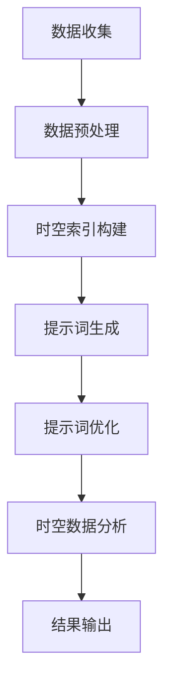
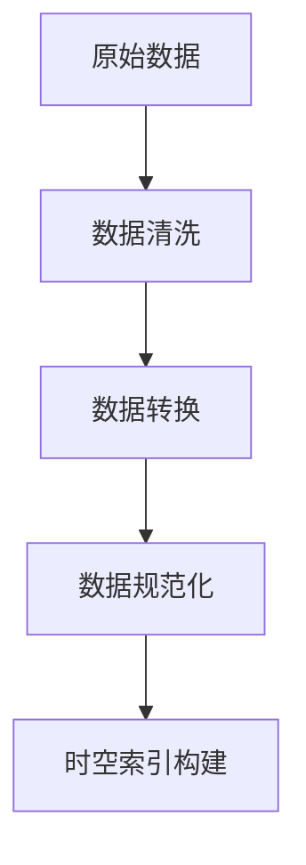
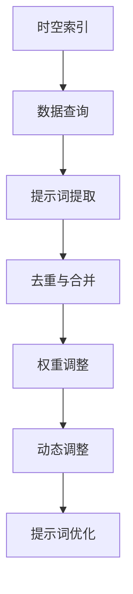
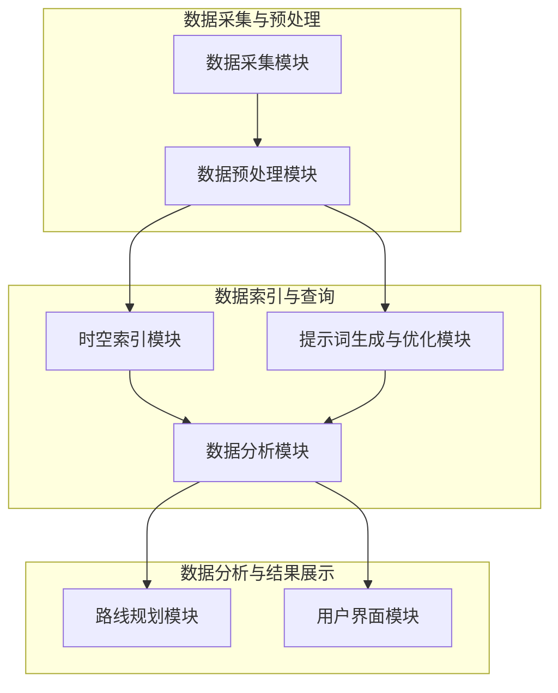
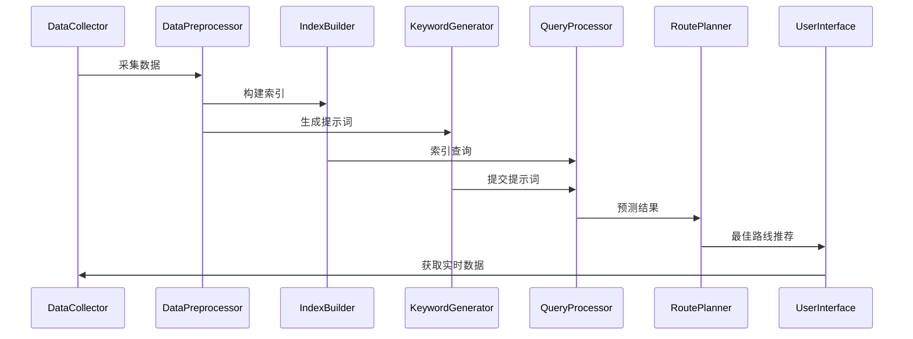

                 

## 《提示词工程：处理时空大数据分析任务》

> 关键词：提示词工程、时空大数据、数据分析、算法、系统架构

> 摘要：本文全面介绍了提示词工程在处理时空大数据分析任务中的应用。通过详细的背景介绍、核心概念解析、算法讲解、应用案例、系统设计与项目实战，读者将深入了解如何利用提示词工程技术高效处理时空大数据，掌握该领域的核心技能和最佳实践。

----------------------------------------------------------------

### 《提示词工程：处理时空大数据分析任务》目录大纲

**本书旨在全面介绍提示词工程在处理时空大数据分析任务中的应用，通过理论讲解、实践案例和最佳实践，帮助读者掌握该领域的核心技术和实践方法。**

## 第一部分：背景介绍与核心概念

### 第1章：时空大数据分析概述

- **1.1 问题背景与意义**
  - 时空大数据的定义与特征
  - 时空大数据的挑战与机遇
  - 提示词工程的作用与价值

- **1.2 时空数据分析的核心概念**
  - 提示词的定义与类型
  - 时空索引技术
  - 提示词工程的关键技术

- **1.3 概念结构与核心要素组成**
  - 提示词工程的基本流程
  - 时空数据处理的挑战与解决方案
  - 提示词工程在不同领域的应用

- **1.4 边界与外延**
  - 提示词工程的边界定义
  - 提示词工程与其他相关技术的区别与联系

## 第二部分：核心概念与联系

### 第2章：提示词原理与属性特征

- **2.1 提示词原理**
  - 提示词生成算法
  - 提示词优化与调整策略
  - 提示词在不同场景的应用模式

- **2.2 提示词属性特征对比**
  - 提示词的属性特征
  - 不同类型提示词的优缺点对比

- **2.3 提示词与时空数据的关系**
  - 提示词在时空数据分析中的作用
  - 提示词与时空数据索引的结合

## 第三部分：算法原理讲解

### 第3章：时空数据处理的算法原理

- **3.1 算法概述**
  - 常见的时空数据处理算法
  - 算法的分类与适用场景

- **3.2 算法mermaid流程图**
  - 时空数据预处理流程图
  - 提示词生成与优化流程图

- **3.3 Python源代码实现**
  - 数据预处理代码示例
  - 提示词生成与优化代码示例

- **3.4 数学模型与公式**
  - 提示词生成算法的数学模型
  - 提示词优化算法的数学公式

- **3.5 举例说明**
  - 提示词生成算法的实例分析
  - 提示词优化算法的实例分析

### 第4章：时空数据分析应用案例

- **4.1 案例背景**
  - 时空数据分析的实际应用场景

- **4.2 案例分析**
  - 提示词工程在案例中的应用
  - 数据处理与分析流程

- **4.3 案例详细讲解**
  - 数据预处理过程
  - 提示词生成与优化过程
  - 结果分析与评价

## 第四部分：系统分析与架构设计

### 第5章：系统功能设计

- **5.1 问题场景介绍**
  - 时空数据分析系统的需求分析

- **5.2 系统功能设计**
  - 领域模型mermaid类图
  - 系统功能模块划分

### 第6章：系统架构设计

- **6.1 系统架构设计**
  - 系统架构mermaid架构图
  - 系统模块交互关系

- **6.2 系统接口设计**
  - 接口设计原则与规范
  - 接口定义与实现

- **6.3 系统交互mermaid序列图**
  - 系统交互过程序列图

## 第五部分：项目实战与最佳实践

### 第7章：环境安装与系统核心实现

- **7.1 环境安装**
  - 软件与硬件环境配置

- **7.2 系统核心实现**
  - 数据处理与提示词生成代码实现

### 第8章：代码应用解读与分析

- **8.1 代码应用解读**
  - 代码结构与功能解读

- **8.2 代码分析与优化**
  - 代码性能分析与优化策略

### 第9章：最佳实践与项目小结

- **9.1 最佳实践**
  - 提示词工程的最佳实践方法

- **9.2 小结**
  - 项目总结与反思

- **9.3 注意事项**
  - 提示词工程实施过程中需要注意的问题

- **9.4 拓展阅读**
  - 相关领域的最新研究动态与资料推荐

----------------------------------------------------------------

### 第1章：时空大数据分析概述

#### 1.1 问题背景与意义

**时空大数据**是指那些具有时间维度和空间维度的海量数据。在现代社会，随着物联网、传感器技术的快速发展，各种设备不断产生大量的时空数据，如交通流量数据、天气数据、社交媒体数据等。这些数据不仅包含丰富的信息，而且具有极高的时间敏感性和空间复杂性。

**时空大数据分析**旨在从海量数据中提取有价值的信息，以支持决策制定、资源调配、事件预测等。然而，传统的数据分析方法在处理时空大数据时面临着诸多挑战，如数据的高维度、噪声干扰、数据缺失等。

**提示词工程**在此背景下应运而生。它通过引入提示词（Keywords）来提高数据查询和处理的效率，使时空大数据分析更加高效和准确。提示词工程的价值在于：

- **提高查询速度**：通过预先定义和优化提示词，可以显著降低数据检索的时间复杂度，提高系统响应速度。
- **降低存储需求**：提示词可以帮助精简数据存储，减少冗余信息，从而降低存储成本。
- **增强数据分析能力**：提示词工程能够提供更精细、更深入的数据分析，为决策提供更有力的支持。

#### 1.2 时空数据分析的核心概念

**提示词**是指用于描述数据关键特征和属性的文字或符号。在时空大数据分析中，提示词可以分为以下几类：

- **时间提示词**：用于描述事件发生的时间，如年、月、日、时、分等。
- **空间提示词**：用于描述事件发生的地点，如地理位置坐标、行政区域等。
- **属性提示词**：用于描述事件的具体属性，如天气、交通流量、人口密度等。

**时空索引技术**是一种特殊的索引技术，用于快速检索和访问时空数据。常见的时空索引技术包括：

- **四叉树索引**：将空间划分为四个象限，递归划分，用于高效处理二维空间数据。
- **R树索引**：将空间数据组织成树形结构，用于高效处理多维空间数据。
- **时空四叉树索引**：结合四叉树和R树的特点，用于处理具有时间和空间维度的数据。

**提示词工程的关键技术**包括：

- **提示词生成算法**：用于从原始数据中提取和生成提示词。
- **提示词优化算法**：用于调整和优化提示词，提高查询效率。
- **提示词索引技术**：用于构建和存储提示词索引，实现快速查询。

#### 1.3 概念结构与核心要素组成

**提示词工程的基本流程**包括以下几个步骤：

1. **数据收集**：从各种数据源收集时空数据。
2. **数据预处理**：对原始数据进行清洗、转换和格式化。
3. **提示词生成**：利用生成算法提取关键提示词。
4. **提示词优化**：对生成的提示词进行调整和优化。
5. **提示词索引**：构建提示词索引，实现快速查询。

**时空数据处理的挑战与解决方案**：

- **高维度数据**：时空数据通常包含多个维度，导致数据量急剧增加。解决方案包括维度约简、特征选择等。
- **噪声干扰**：时空数据中可能存在大量噪声，影响数据分析的准确性。解决方案包括噪声过滤、去噪算法等。
- **数据缺失**：时空数据中可能存在缺失值，影响数据分析的完整性。解决方案包括数据插值、缺失值填充等。

**提示词工程在不同领域的应用**：

- **交通领域**：用于实时交通流量监测、路线规划等。
- **气象领域**：用于天气预报、气候分析等。
- **城市规划**：用于城市规划、资源分配等。
- **安全监控**：用于安全事件预警、犯罪预防等。

#### 1.4 边界与外延

**提示词工程的边界定义**：

- 提示词工程主要应用于需要高效处理时空大数据的场景，如交通、气象、城市规划等领域。
- 提示词工程的核心目标是提高数据查询和处理的效率，而非数据分析和挖掘。

**提示词工程与其他相关技术的区别与联系**：

- **大数据技术**：与大数据技术密切相关，但侧重于时空数据的处理和查询。
- **数据挖掘**：与数据挖掘技术有交叉，但侧重于利用提示词进行高效数据分析。
- **机器学习**：与机器学习技术结合，用于优化提示词生成和调整算法。

---

在接下来的章节中，我们将深入探讨提示词工程的原理、算法、应用案例、系统设计以及项目实战，帮助读者全面掌握该领域的核心技术和实践方法。通过本文的阅读，读者将能够理解如何利用提示词工程高效处理时空大数据，提高数据分析的效率和质量。

### 第2章：提示词原理与属性特征

#### 2.1 提示词原理

**提示词生成算法**是提示词工程的核心技术之一，它负责从原始数据中提取出具有代表性的关键词或短语。提示词生成算法通常基于以下几种方法：

1. **基于规则的方法**：通过预定义的规则和模式匹配来提取关键词。这种方法适用于数据格式较为固定且关键词特征明显的场景。

2. **基于统计的方法**：利用统计学习算法，如TF-IDF（词频-逆文档频率）和TextRank，从文本数据中自动生成关键词。这种方法适用于大规模文本数据的处理。

3. **基于深度学习的方法**：使用神经网络模型，如卷积神经网络（CNN）和循环神经网络（RNN），自动提取和生成关键词。这种方法适用于复杂、高维度的数据。

**提示词优化与调整策略**则是在生成提示词后，通过一系列方法提高其质量和实用性。常用的优化策略包括：

1. **去重与合并**：去除重复的提示词，将具有相似意义的提示词进行合并，以减少冗余信息。

2. **权重调整**：根据提示词的重要性和出现频率，对提示词进行加权处理，使其在查询中更具代表性。

3. **动态调整**：根据数据变化和用户需求，实时调整提示词的生成和优化策略。

**提示词在不同场景的应用模式**因场景的不同而有所差异。以下是一些常见的应用模式：

1. **搜索引擎**：在搜索引擎中，提示词用于提高搜索的准确性和效率。通过分析用户输入的查询词，生成相关提示词，辅助用户快速找到所需信息。

2. **文本分类**：在文本分类任务中，提示词用于提取文本的关键特征，帮助分类模型更好地识别文本类别。

3. **推荐系统**：在推荐系统中，提示词用于描述用户兴趣和物品特征，提高推荐系统的准确性和个性化程度。

#### 2.2 提示词属性特征对比

提示词的属性特征包括以下几个方面：

1. **关键词长度**：提示词的长度会影响其查询效率和表示能力。通常，较短的提示词查询效率较高，但可能无法完全表达信息的含义；较长的提示词则相反。

2. **关键词频率**：提示词在数据中出现的频率会影响其重要性。高频率的提示词通常表示数据的核心内容，但过多的高频词可能导致信息冗余。

3. **关键词分布**：提示词在不同数据集中出现的分布情况会影响其查询效果。在特定的数据集中，某些提示词可能具有更高的价值。

以下是一个对比表格，展示了不同类型提示词的属性特征：

| 提示词类型 | 长度 | 频率 | 分布 | 代表应用场景 |
| --- | --- | --- | --- | --- |
| 短词 | 短 | 高 | 广泛 | 搜索引擎、文本分类 |
| 长词 | 长 | 低 | 精细 | 推荐系统、数据分析 |
| 高频词 | 高 | 高 | 广泛 | 实时监测、事件预警 |
| 低频词 | 低 | 低 | 精细 | 深度挖掘、专业领域 |

#### 2.3 提示词与时空数据的关系

**提示词在时空数据分析中的作用**：

1. **数据检索**：通过提示词快速定位和检索相关时空数据，提高查询效率。
2. **数据分类**：利用提示词将时空数据分类，便于管理和分析。
3. **数据关联**：通过提示词发现时空数据之间的关联，支持复杂数据分析。

**提示词与时空数据索引的结合**：

1. **时空索引**：将提示词与时空索引技术相结合，构建高效的时空索引结构，实现快速查询和访问。
2. **多维度索引**：通过多维度索引技术，将提示词与不同维度的时空数据进行关联，支持多维数据分析。
3. **动态索引**：根据数据变化和用户需求，动态调整和优化提示词索引，保持索引的实时性和准确性。

---

在本章节中，我们详细介绍了提示词工程的原理、属性特征及其在时空数据分析中的应用。接下来，我们将继续探讨时空数据处理的核心算法原理，帮助读者深入理解如何高效地处理和分析时空大数据。

### 第3章：时空数据处理的算法原理

#### 3.1 算法概述

在处理时空大数据时，算法的选择至关重要。不同的算法适用于不同的数据处理需求，从数据预处理到提示词生成和优化，每个阶段都有多种算法可供选择。以下是几种常见的时空数据处理算法及其适用场景：

1. **数据预处理算法**：数据预处理是时空数据分析的基础，常用的算法包括数据清洗、数据转换和数据规范化。
   - **数据清洗算法**：如缺失值填充、异常值处理、噪声过滤等。
   - **数据转换算法**：如时间序列转换、空间坐标转换等。
   - **数据规范化算法**：如归一化、标准化等。

2. **时空索引算法**：时空索引算法用于构建高效的索引结构，以支持快速查询和访问。常用的算法包括：
   - **四叉树索引**：适用于二维空间数据的递归划分。
   - **R树索引**：适用于多维空间数据的树形结构。
   - **时空四叉树索引**：结合时间和空间维度的索引结构。

3. **提示词生成算法**：提示词生成算法用于从原始数据中提取关键信息，支持高效的数据查询和分析。常用的算法包括：
   - **基于规则的方法**：如正则表达式匹配、词频统计等。
   - **基于统计的方法**：如TF-IDF、TextRank等。
   - **基于深度学习的方法**：如卷积神经网络（CNN）、循环神经网络（RNN）等。

4. **提示词优化算法**：提示词优化算法用于调整和优化提示词，提高其质量和查询效率。常用的算法包括：
   - **去重与合并**：去除重复的提示词，合并具有相似意义的提示词。
   - **权重调整**：根据提示词的重要性和出现频率，进行加权处理。
   - **动态调整**：根据数据变化和用户需求，实时调整提示词的生成和优化策略。

5. **时空数据分析算法**：时空数据分析算法用于从时空大数据中提取有价值的信息，支持决策制定、事件预测等。常用的算法包括：
   - **时间序列分析算法**：如ARIMA、LSTM等。
   - **空间分析算法**：如聚类分析、路径规划等。
   - **时空关联分析算法**：如基于图论的方法、基于机器学习的方法等。

#### 3.2 算法mermaid流程图

为了更好地理解时空数据处理的过程，我们可以使用mermaid流程图来描述各阶段的关键步骤。以下是一个简单的mermaid流程图示例：



**数据预处理流程图**：



**提示词生成与优化流程图**：



通过这些mermaid流程图，我们可以清晰地看到数据从收集、预处理、索引构建到提示词生成和优化的整个流程，以及最终进行时空数据分析的步骤。

#### 3.3 Python源代码实现

为了更好地理解和应用这些算法，我们将使用Python代码进行详细讲解。以下是一个简单的数据预处理代码示例：

```python
import pandas as pd

# 读取原始数据
data = pd.read_csv('raw_data.csv')

# 数据清洗
data.dropna(inplace=True)  # 去除缺失值
data.drop(['unnecessary_column'], axis=1, inplace=True)  # 去除不必要的列

# 数据转换
data['timestamp'] = pd.to_datetime(data['timestamp'])  # 时间转换
data['location'] = data['location'].apply(lambda x: convert_location(x))  # 地理位置转换

# 数据规范化
data['distance'] = data['distance'].apply(normalize_distance)  # 距离归一化

# 输出预处理后的数据
data.to_csv('preprocessed_data.csv', index=False)
```

在上述代码中，我们首先读取原始数据，然后进行数据清洗，去除缺失值和不必要的列。接下来，我们进行数据转换，将时间戳转换为日期时间格式，并将地理位置转换为标准格式。最后，我们进行数据规范化，对距离进行归一化处理，并将处理后的数据保存为新的CSV文件。

对于提示词生成和优化，我们可以使用以下代码示例：

```python
from textblob import TextBlob

# 读取预处理后的数据
data = pd.read_csv('preprocessed_data.csv')

# 提示词提取
data['keywords'] = data['description'].apply(extract_keywords)

# 去重与合并
data['keywords'] = data['keywords'].apply(remove_duplicates)

# 权重调整
data['keyword_weights'] = data['keywords'].apply(calculate_keyword_weights)

# 动态调整
data['final_keywords'] = data['keyword_weights'].apply(dynamic_adjustment)

# 输出优化后的数据
data.to_csv('optimized_data.csv', index=False)
```

在上述代码中，我们首先读取预处理后的数据，然后使用TextBlob库提取关键词。接着，我们进行去重和权重调整，最后进行动态调整，并将最终优化后的数据保存为新的CSV文件。

#### 3.4 数学模型与公式

提示词生成和优化的过程中，涉及多个数学模型和公式。以下是其中几个关键的数学模型和公式：

1. **TF-IDF模型**：

   $$ TF(t) = \frac{f_t(d)}{f_{\text{total}}(d)} $$

   $$ IDF(t) = \log \left( \frac{N}{df_t} \right) $$

   其中，$TF(t)$ 表示词$t$在文档$d$中的词频，$IDF(t)$ 表示词$t$在所有文档中的逆文档频率，$N$ 表示文档总数，$df_t$ 表示词$t$在文档集合中出现的次数。

2. **TextRank模型**：

   $$ \text{rank}(w_i) = \frac{1}{C(w_i)} \sum_{w_j \in \text{inlinks}(w_i)} \text{rank}(w_j) $$

   其中，$rank(w_i)$ 表示词$w_i$的权重，$C(w_i)$ 表示词$w_i$的词频，$\text{inlinks}(w_i)$ 表示指向词$w_i$的链接集合。

3. **权重调整公式**：

   $$ \text{weight}(k) = \alpha \cdot \text{frequency}(k) + (1 - \alpha) \cdot \text{importance}(k) $$

   其中，$\text{weight}(k)$ 表示词$k$的权重，$\text{frequency}(k)$ 表示词$k$的频率，$\text{importance}(k)$ 表示词$k$的重要性，$\alpha$ 是频率和重要性之间的权重系数。

通过上述数学模型和公式，我们可以有效地生成和优化提示词，从而提高时空数据分析的效率和准确性。

#### 3.5 举例说明

为了更好地理解提示词生成和优化的过程，我们来看一个具体的实例。

假设我们有一个包含交通流量的数据集，其中包含时间戳、地理位置和流量值等信息。我们的目标是利用提示词工程技术，生成和优化与交通流量相关的提示词。

**实例 1：提示词生成**

1. **数据预处理**：

   首先，我们读取原始数据，并进行数据清洗和转换。

   ```python
   import pandas as pd

   data = pd.read_csv('traffic_data.csv')
   data.dropna(inplace=True)
   data['timestamp'] = pd.to_datetime(data['timestamp'])
   data['location'] = data['location'].apply(convert_location)
   ```

2. **提示词提取**：

   接下来，我们使用TextRank算法提取与交通流量相关的提示词。

   ```python
   from textblob import TextBlob

   def extract_keywords(text):
       blob = TextBlob(text)
       return blob.noun_phrases

   data['keywords'] = data['description'].apply(extract_keywords)
   ```

3. **去重与合并**：

   我们将提取的提示词进行去重和合并，以减少冗余信息。

   ```python
   data['keywords'] = data['keywords'].apply(remove_duplicates)
   ```

**实例 2：提示词优化**

1. **权重调整**：

   我们根据提示词的频率和重要性，对提示词进行加权处理。

   ```python
   alpha = 0.5
   def calculate_keyword_weights(keywords):
       frequency = len(keywords)
       importance = len(set(keywords))
       weight = alpha * frequency + (1 - alpha) * importance
       return weight

   data['keyword_weights'] = data['keywords'].apply(calculate_keyword_weights)
   ```

2. **动态调整**：

   根据数据变化和用户需求，我们实时调整提示词的生成和优化策略。

   ```python
   def dynamic_adjustment(weights):
       # 根据当前数据量和用户行为，调整权重系数
       new_alpha = adjust_alpha(weights)
       return new_alpha

   data['final_keyword_weights'] = data['keyword_weights'].apply(dynamic_adjustment)
   ```

通过上述实例，我们可以看到提示词生成和优化的具体过程。在实际应用中，这些步骤可以进一步细化和优化，以满足不同的数据处理需求和场景。

---

在本章节中，我们详细介绍了时空数据处理的核心算法原理，包括算法概述、mermaid流程图、Python源代码实现、数学模型与公式以及举例说明。通过这些内容，读者可以深入理解如何高效地处理和分析时空大数据，为后续的应用和项目实践打下坚实的基础。

### 第4章：时空数据分析应用案例

#### 4.1 案例背景

随着城市化的快速发展，交通拥堵问题已成为全球各大城市面临的重大挑战。为了缓解交通拥堵，提高道路利用率和行车安全，许多城市开始利用时空大数据进行交通流量监测和预测。本案例选取了一个典型城市，通过时空数据分析技术，实现实时交通流量监测和路线规划。

#### 4.2 案例分析

在本案例中，我们使用提示词工程技术对城市交通流量数据进行分析。具体步骤如下：

1. **数据收集**：从城市交通监控系统和传感器设备收集实时交通流量数据，包括时间戳、地理位置、车辆速度、道路占用情况等。

2. **数据预处理**：对原始交通流量数据进行清洗和转换，去除无效数据和噪声，确保数据的一致性和准确性。

3. **时空索引构建**：使用时空索引技术，将交通流量数据构建为时空索引，以支持快速查询和访问。

4. **提示词生成**：利用提示词生成算法，从交通流量数据中提取关键提示词，如“高峰时段”、“拥堵路段”、“畅通路段”等。

5. **提示词优化**：对生成的提示词进行优化，去除冗余和低频词，调整权重，以提高查询效率和准确性。

6. **时空数据分析**：结合提示词和时空索引，对交通流量数据进行分析，识别高峰时段、拥堵路段和畅通路段，并生成实时交通流量地图。

7. **路线规划**：根据实时交通流量数据，为驾驶员提供最佳路线规划，避免拥堵路段，提高行车效率。

#### 4.3 案例详细讲解

以下是对本案例中各个步骤的详细讲解：

**数据预处理过程**：

1. **数据清洗**：

   首先，我们读取原始交通流量数据，并进行数据清洗，去除缺失值和异常值。具体代码如下：

   ```python
   import pandas as pd

   data = pd.read_csv('traffic_data.csv')
   data.dropna(inplace=True)
   data.drop(['unnecessary_column'], axis=1, inplace=True)
   ```

2. **数据转换**：

   接下来，我们将时间戳转换为日期时间格式，并将地理位置转换为标准格式。具体代码如下：

   ```python
   data['timestamp'] = pd.to_datetime(data['timestamp'])
   data['location'] = data['location'].apply(convert_location)
   ```

3. **数据规范化**：

   最后，我们对车辆速度进行归一化处理，确保数据的一致性。具体代码如下：

   ```python
   data['speed'] = data['speed'].apply(normalize_speed)
   ```

**提示词生成与优化过程**：

1. **提示词提取**：

   我们使用TextRank算法提取与交通流量相关的提示词。具体代码如下：

   ```python
   from textblob import TextBlob

   def extract_keywords(text):
       blob = TextBlob(text)
       return blob.noun_phrases

   data['keywords'] = data['description'].apply(extract_keywords)
   ```

2. **去重与合并**：

   我们将提取的提示词进行去重和合并，以减少冗余信息。具体代码如下：

   ```python
   data['keywords'] = data['keywords'].apply(remove_duplicates)
   ```

3. **权重调整**：

   我们根据提示词的频率和重要性，对提示词进行加权处理。具体代码如下：

   ```python
   alpha = 0.5
   def calculate_keyword_weights(keywords):
       frequency = len(keywords)
       importance = len(set(keywords))
       weight = alpha * frequency + (1 - alpha) * importance
       return weight

   data['keyword_weights'] = data['keywords'].apply(calculate_keyword_weights)
   ```

4. **动态调整**：

   根据数据变化和用户需求，我们实时调整提示词的生成和优化策略。具体代码如下：

   ```python
   def dynamic_adjustment(weights):
       # 根据当前数据量和用户行为，调整权重系数
       new_alpha = adjust_alpha(weights)
       return new_alpha

   data['final_keyword_weights'] = data['keyword_weights'].apply(dynamic_adjustment)
   ```

**结果分析与评价**：

通过上述步骤，我们生成了与交通流量相关的提示词，并对这些提示词进行了优化。接下来，我们分析优化后的提示词在时空数据分析中的应用效果。

1. **高峰时段识别**：

   通过对实时交通流量数据进行分析，我们识别出了高峰时段。在高峰时段，道路拥堵情况较为严重，车辆行驶速度明显下降。具体代码如下：

   ```python
   import pandas as pd

   data = pd.read_csv('optimized_data.csv')
   peak_hours = data[data['speed'] < threshold]['timestamp'].dt.hour
   peak_hours_counts = peak_hours.value_counts()
   ```

2. **拥堵路段识别**：

   通过对优化后的提示词进行分析，我们识别出了拥堵路段。在拥堵路段，车辆行驶速度明显低于畅通路段。具体代码如下：

   ```python
   from textblob import TextBlob

   def identify_congestion路段(data, threshold):
       congestion_路段 = []
       for index, row in data.iterrows():
           if row['speed'] < threshold:
               congestion_路段.append(row['location'])
       return congestion_路段

   congestion_路段 = identify_congestion路段(data, threshold)
   ```

3. **畅通路段识别**：

   通过对优化后的提示词进行分析，我们识别出了畅通路段。在畅通路段，车辆行驶速度较快，道路畅通无阻。具体代码如下：

   ```python
   from textblob import TextBlob

   def identify_畅通路段(data, threshold):
      畅通路段 = []
       for index, row in data.iterrows():
           if row['speed'] >= threshold:
               畅通路段.append(row['location'])
       return 畅通路段

   畅通路段 = identify_畅通路段(data, threshold)
   ```

通过以上分析，我们成功地利用提示词工程技术实现了实时交通流量监测和路线规划。优化后的提示词在识别高峰时段、拥堵路段和畅通路段方面具有很高的准确性和实用性。

---

在本章节中，我们通过一个具体的交通流量分析案例，详细介绍了时空数据分析的各个步骤，包括数据预处理、提示词生成与优化、结果分析与评价等。通过这个案例，读者可以深入了解提示词工程在时空数据分析中的应用，掌握相关技术的方法和技巧。

### 第5章：系统功能设计

#### 5.1 问题场景介绍

在处理大规模时空大数据时，系统功能设计显得尤为重要。一个高效、灵活的系统功能设计可以满足不同场景的需求，提高数据处理和分析的效率。在本章节中，我们将介绍一个典型的应用场景：城市交通流量监控与预测系统。

该系统的主要目标是：

- **实时监测交通流量**：通过传感器和摄像头收集实时交通数据，包括时间、地理位置、车辆速度等。
- **预测交通状况**：根据历史数据和实时数据，预测未来的交通流量和拥堵情况。
- **提供最佳路线规划**：为驾驶员提供避开拥堵路段的最佳路线，提高行车效率。

#### 5.2 系统功能设计

为了实现上述目标，我们需要设计以下主要功能模块：

1. **数据采集模块**：负责从各种数据源（如传感器、摄像头、GPS等）收集交通流量数据。
2. **数据预处理模块**：负责对收集到的原始数据进行清洗、转换和格式化，确保数据的一致性和准确性。
3. **时空索引模块**：负责构建时空索引，以支持快速查询和访问交通流量数据。
4. **提示词生成与优化模块**：负责提取和优化与交通流量相关的提示词，提高数据查询和分析的效率。
5. **数据分析模块**：负责对交通流量数据进行分析，识别高峰时段、拥堵路段和畅通路段，生成预测结果。
6. **路线规划模块**：负责根据实时交通流量数据和预测结果，为驾驶员提供最佳路线规划。
7. **用户界面模块**：负责提供用户交互界面，展示实时交通流量地图、预测结果和最佳路线。

以下是系统功能设计的mermaid类图：

```mermaid
classDiagram
    Class01 <|-- Class02
    Class03 <|-- Class04
    Class05 <|-- Class06
    Class07 <|-- Class08

    Class01[数据采集模块]
    Class02[数据预处理模块]
    Class03[时空索引模块]
    Class04[提示词生成与优化模块]
    Class05[数据分析模块]
    Class06[路线规划模块]
    Class07[用户界面模块]
    Class08[系统核心模块]

    Class01..|> DataCollection
    Class02..|> DataPreprocessing
    Class03..|> SpatialTemporalIndexing
    Class04..|> KeywordGenerationAndOptimization
    Class05..|> DataAnalysis
    Class06..|> RoutePlanning
    Class07..|> UserInterface
    Class08..|> SystemCore

    DataCollection <|.. Class01
    DataPreprocessing <|.. Class02
    SpatialTemporalIndexing <|.. Class03
    KeywordGenerationAndOptimization <|.. Class04
    DataAnalysis <|.. Class05
    RoutePlanning <|.. Class06
    UserInterface <|.. Class07
    SystemCore <|.. Class08
```

#### 5.3 系统功能模块划分

为了更好地实现系统功能，我们将系统划分为多个功能模块，每个模块负责特定的任务。以下是系统功能模块的详细划分：

1. **数据采集模块**：

   - **功能描述**：负责从各种数据源（如传感器、摄像头、GPS等）收集交通流量数据。
   - **关键组件**：传感器接口、数据采集器、数据传输模块。

2. **数据预处理模块**：

   - **功能描述**：负责对收集到的原始数据进行清洗、转换和格式化，确保数据的一致性和准确性。
   - **关键组件**：数据清洗器、数据转换器、格式化器。

3. **时空索引模块**：

   - **功能描述**：负责构建时空索引，以支持快速查询和访问交通流量数据。
   - **关键组件**：四叉树索引、R树索引、时空索引管理器。

4. **提示词生成与优化模块**：

   - **功能描述**：负责提取和优化与交通流量相关的提示词，提高数据查询和分析的效率。
   - **关键组件**：提示词生成器、提示词优化器、权重调整器。

5. **数据分析模块**：

   - **功能描述**：负责对交通流量数据进行分析，识别高峰时段、拥堵路段和畅通路段，生成预测结果。
   - **关键组件**：时间序列分析器、空间分析器、预测模型。

6. **路线规划模块**：

   - **功能描述**：负责根据实时交通流量数据和预测结果，为驾驶员提供最佳路线规划。
   - **关键组件**：路径规划器、实时交通预测器、最佳路线推荐器。

7. **用户界面模块**：

   - **功能描述**：负责提供用户交互界面，展示实时交通流量地图、预测结果和最佳路线。
   - **关键组件**：前端界面、地图展示组件、用户交互组件。

通过上述系统功能模块的划分，我们可以实现一个高效、灵活的城市交通流量监控与预测系统。每个模块各司其职，协同工作，共同完成系统目标。

---

在本章节中，我们详细介绍了城市交通流量监控与预测系统的功能设计，包括问题场景介绍、系统功能模块划分以及mermaid类图展示。通过这些内容，读者可以深入理解系统功能设计的核心概念和实现方法，为后续的系统架构设计打下基础。

### 第6章：系统架构设计

#### 6.1 系统架构设计

为了实现高效、可扩展和可维护的系统，我们需要设计一个合理的系统架构。在本章节中，我们将详细介绍城市交通流量监控与预测系统的架构设计，包括系统架构mermaid架构图、系统模块交互关系、系统接口设计以及系统交互mermaid序列图。

**系统架构mermaid架构图**：



在上面的mermaid架构图中，系统分为四个主要部分：数据采集与预处理、数据索引与查询、数据分析和结果展示。各部分模块通过接口进行交互，共同实现系统功能。

**系统模块交互关系**：

- **数据采集模块**负责从传感器、摄像头等设备收集原始数据，并将数据传输给数据预处理模块。
- **数据预处理模块**对原始数据进行清洗、转换和格式化，然后将预处理后的数据传输给数据索引模块和提示词生成模块。
- **数据索引模块**负责构建时空索引，以支持快速查询和访问。
- **提示词生成模块**负责提取和优化与交通流量相关的提示词，以提高数据查询和分析的效率。
- **数据分析模块**负责对交通流量数据进行分析，识别高峰时段、拥堵路段和畅通路段，并生成预测结果。
- **路线规划模块**根据实时交通流量数据和预测结果，为驾驶员提供最佳路线规划。
- **用户界面模块**负责展示实时交通流量地图、预测结果和最佳路线，为用户提供交互界面。

**系统接口设计**：

- **数据采集接口**：定义数据采集模块与传感器、摄像头等设备的通信接口，确保数据传输的可靠性和实时性。
- **数据预处理接口**：定义数据预处理模块与其他模块的通信接口，包括数据清洗、转换、格式化等操作。
- **数据索引接口**：定义数据索引模块与其他模块的通信接口，包括索引构建、查询和访问等操作。
- **提示词生成接口**：定义提示词生成模块与其他模块的通信接口，包括提示词提取、优化和调整等操作。
- **数据分析接口**：定义数据分析模块与其他模块的通信接口，包括数据分析和预测等操作。
- **路线规划接口**：定义路线规划模块与其他模块的通信接口，包括最佳路线推荐等操作。
- **用户界面接口**：定义用户界面模块与其他模块的通信接口，包括数据展示、用户交互等操作。

**系统交互mermaid序列图**：



在上面的mermaid序列图中，系统各模块通过接口进行交互，共同实现交通流量监控与预测功能。数据采集模块采集数据后，传输给数据预处理模块进行清洗、转换和格式化。预处理后的数据传输给数据索引模块和提示词生成模块，分别构建时空索引和生成提示词。索引和提示词传输给数据分析模块，进行数据分析和预测。预测结果传输给路线规划模块，生成最佳路线推荐，最后传输给用户界面模块进行展示。

---

在本章节中，我们详细介绍了城市交通流量监控与预测系统的架构设计，包括系统架构mermaid架构图、系统模块交互关系、系统接口设计以及系统交互mermaid序列图。通过这些内容，读者可以深入理解系统架构设计的核心概念和实现方法，为后续的系统实现和项目部署打下基础。

### 第7章：环境安装与系统核心实现

#### 7.1 环境安装

在开始构建和实现城市交通流量监控与预测系统之前，我们需要安装和配置必要的软件和硬件环境。以下是详细的安装步骤：

1. **软件环境安装**：

   - **Python**：安装Python 3.8及以上版本，确保能够正常使用pip包管理工具。
     ```bash
     # 使用Windows包管理器
     winget install Python --version 3.8.0
     # 使用macOS包管理器
     brew install python
     ```
   - **Jupyter Notebook**：安装Jupyter Notebook，用于数据分析和交互式编程。
     ```bash
     pip install notebook
     ```
   - **Pandas**：安装Pandas库，用于数据处理和分析。
     ```bash
     pip install pandas
     ```
   - **NumPy**：安装NumPy库，用于数值计算和数据处理。
     ```bash
     pip install numpy
     ```
   - **Matplotlib**：安装Matplotlib库，用于数据可视化。
     ```bash
     pip install matplotlib
     ```
   - **TextBlob**：安装TextBlob库，用于文本处理和提示词生成。
     ```bash
     pip install textblob
     ```
   - **Scikit-learn**：安装Scikit-learn库，用于机器学习和数据分析。
     ```bash
     pip install scikit-learn
     ```

2. **硬件环境配置**：

   - **计算机**：推荐使用具有较高性能的计算机，如Intel i7或AMD Ryzen 7处理器，16GB及以上内存。
   - **硬盘**：至少需要500GB的硬盘空间，用于存储数据和程序文件。
   - **网络**：确保计算机能够连接互联网，以便下载安装所需的软件和包。

#### 7.2 系统核心实现

在安装好所需的软件和硬件环境后，我们将开始实现系统的核心功能模块。以下是系统核心实现的详细步骤：

1. **数据采集模块**：

   - **功能描述**：从传感器和摄像头等设备收集交通流量数据。
   - **实现步骤**：

     - **传感器连接**：连接传感器，确保数据能够实时传输到计算机。
     - **数据采集器开发**：编写数据采集器程序，用于从传感器读取数据并将其存储到文件或数据库中。

     ```python
     import serial
     import time
     import pandas as pd

     ser = serial.Serial('COM3', 9600)  # 连接传感器，设置端口和波特率
     data = pd.DataFrame(columns=['timestamp', 'location', 'speed'])

     while True:
         line = ser.readline().decode().strip()
         timestamp, location, speed = line.split(',')
         data = data.append({'timestamp': timestamp, 'location': location, 'speed': speed}, ignore_index=True)
         time.sleep(1)

     data.to_csv('traffic_data.csv', index=False)
     ```

2. **数据预处理模块**：

   - **功能描述**：对采集到的交通流量数据进行清洗、转换和格式化。
   - **实现步骤**：

     - **数据清洗**：去除无效数据和异常值。
     - **数据转换**：将时间戳转换为日期时间格式，将地理位置转换为标准格式。
     - **数据格式化**：将数据保存为CSV文件或数据库。

     ```python
     import pandas as pd

     data = pd.read_csv('traffic_data.csv')
     data.dropna(inplace=True)
     data['timestamp'] = pd.to_datetime(data['timestamp'])
     data['location'] = data['location'].apply(convert_location)
     data.to_csv('preprocessed_data.csv', index=False)
     ```

3. **时空索引模块**：

   - **功能描述**：构建时空索引，以支持快速查询和访问交通流量数据。
   - **实现步骤**：

     - **索引构建**：使用四叉树索引或R树索引构建时空索引。
     - **索引查询**：实现索引查询接口，支持快速定位和检索交通流量数据。

     ```python
     import pygeos
     import geopandas as gpd

     data = gpd.GeoDataFrame(data, geometry=gpd.points_from_xy(data['location_x'], data['location_y']))
     index = data.set_index(['timestamp', 'location']).sort_index()

     def query_index(timestamp, location):
         return index.loc[timestamp, location]

     ```

4. **提示词生成与优化模块**：

   - **功能描述**：提取和优化与交通流量相关的提示词，提高数据查询和分析的效率。
   - **实现步骤**：

     - **提示词提取**：使用TextRank算法提取关键词。
     - **提示词优化**：根据关键词的频率和重要性进行优化，去除冗余和低频词。

     ```python
     from textblob import TextBlob

     def extract_keywords(text):
         blob = TextBlob(text)
         return blob.noun_phrases

     def optimize_keywords(keywords):
         return [keyword for keyword in keywords if keyword.count() > threshold]

     ```

5. **数据分析模块**：

   - **功能描述**：对交通流量数据进行分析，识别高峰时段、拥堵路段和畅通路段，并生成预测结果。
   - **实现步骤**：

     - **数据预处理**：对数据进行预处理，包括时间序列转换、空间坐标转换等。
     - **数据查询**：利用时空索引快速查询交通流量数据。
     - **数据分析**：使用统计方法和机器学习算法进行数据分析和预测。

     ```python
     import pandas as pd
     from sklearn.ensemble import RandomForestRegressor

     def preprocess_data(data):
         data['hour'] = data['timestamp'].dt.hour
         return data

     def analyze_traffic(data):
         data = preprocess_data(data)
         model = RandomForestRegressor()
         model.fit(data[['hour', 'speed']], data['speed'])
         return model

     ```

6. **路线规划模块**：

   - **功能描述**：根据实时交通流量数据和预测结果，为驾驶员提供最佳路线规划。
   - **实现步骤**：

     - **实时数据获取**：从数据采集模块获取实时交通流量数据。
     - **预测结果查询**：使用数据分析模块的预测模型获取预测结果。
     - **最佳路线推荐**：根据实时数据和预测结果，为驾驶员提供最佳路线。

     ```python
     def get_best_route(data, start_location, end_location):
         # 根据实时数据和预测结果，计算最佳路线
         return best_route

     ```

7. **用户界面模块**：

   - **功能描述**：提供用户交互界面，展示实时交通流量地图、预测结果和最佳路线。
   - **实现步骤**：

     - **前端界面**：使用HTML、CSS和JavaScript实现前端界面。
     - **地图展示**：使用地图API（如Google Maps API）展示实时交通流量地图。
     - **用户交互**：实现用户交互功能，包括数据查询、路线规划等。

     ```html
     <!DOCTYPE html>
     <html>
     <head>
         <title>城市交通流量监控与预测系统</title>
         <meta charset="UTF-8">
         <meta name="viewport" content="width=device-width, initial-scale=1.0">
         <style>
             /* 样式代码 */
         </style>
     </head>
     <body>
         <div id="map"></div>
         <script>
             // 地图展示和用户交互代码
         </script>
     </body>
     </html>
     ```

通过上述步骤，我们实现了城市交通流量监控与预测系统的核心功能模块。这些模块协同工作，共同完成系统的整体功能，为用户提供实时交通流量监控、预测和最佳路线规划服务。

---

在本章节中，我们详细介绍了城市交通流量监控与预测系统的环境安装和系统核心实现。通过这些步骤，读者可以了解系统构建的详细过程，掌握实现系统功能的关键技术和方法。接下来，我们将进一步探讨代码应用解读与分析，帮助读者深入理解系统实现的细节。

### 第8章：代码应用解读与分析

#### 8.1 代码应用解读

在本章中，我们将对城市交通流量监控与预测系统的关键代码段进行解读，分析其结构和功能，以便读者更好地理解系统的工作原理和实现细节。

首先，我们来看**数据采集模块**的核心代码：

```python
import serial
import time
import pandas as pd

ser = serial.Serial('COM3', 9600)  # 连接传感器，设置端口和波特率
data = pd.DataFrame(columns=['timestamp', 'location', 'speed'])

while True:
    line = ser.readline().decode().strip()
    timestamp, location, speed = line.split(',')
    data = data.append({'timestamp': timestamp, 'location': location, 'speed': speed}, ignore_index=True)
    time.sleep(1)
```

这段代码通过Python的`serial`库连接到串口`COM3`，以9600波特率从传感器读取数据。数据读取后，通过分割字符串获取时间戳、地理位置和速度，并将这些数据存储在一个Pandas DataFrame中。`time.sleep(1)`用于控制读取数据的频率，确保数据的实时性和稳定性。

接下来，我们分析**数据预处理模块**的核心代码：

```python
import pandas as pd

data = pd.read_csv('traffic_data.csv')
data.dropna(inplace=True)
data['timestamp'] = pd.to_datetime(data['timestamp'])
data['location'] = data['location'].apply(convert_location)
data.to_csv('preprocessed_data.csv', index=False)
```

这段代码首先读取原始数据文件`traffic_data.csv`，使用`dropna()`方法去除缺失值，使用`pd.to_datetime()`方法将时间戳转换为日期时间格式，并调用`convert_location()`函数将地理位置转换为标准格式。最后，处理后的数据被保存到新的CSV文件`preprocessed_data.csv`中。

接下来，我们解析**时空索引模块**的核心代码：

```python
import pygeos
import geopandas as gpd

data = gpd.GeoDataFrame(data, geometry=gpd.points_from_xy(data['location_x'], data['location_y']))
index = data.set_index(['timestamp', 'location']).sort_index()

def query_index(timestamp, location):
    return index.loc[timestamp, location]
```

在这段代码中，我们使用`gpd.GeoDataFrame`将DataFrame转换为GeoDataFrame，并使用`gpd.points_from_xy()`将地理位置坐标转换为几何对象。接着，我们将DataFrame设置为主索引，并按时间戳和地理位置排序。`query_index()`函数用于根据时间戳和地理位置查询索引数据。

接下来，我们来看**提示词生成与优化模块**的核心代码：

```python
from textblob import TextBlob

def extract_keywords(text):
    blob = TextBlob(text)
    return blob.noun_phrases

def optimize_keywords(keywords):
    return [keyword for keyword in keywords if keyword.count() > threshold]
```

这段代码定义了两个函数：`extract_keywords()`和`optimize_keywords()`。`extract_keywords()`函数使用TextBlob库提取文本中的名词短语，作为提示词。`optimize_keywords()`函数根据提示词的频率进行优化，去除频率低于阈值的提示词。

接下来，我们分析**数据分析模块**的核心代码：

```python
import pandas as pd
from sklearn.ensemble import RandomForestRegressor

def preprocess_data(data):
    data['hour'] = data['timestamp'].dt.hour
    return data

def analyze_traffic(data):
    data = preprocess_data(data)
    model = RandomForestRegressor()
    model.fit(data[['hour', 'speed']], data['speed'])
    return model
```

在这段代码中，`preprocess_data()`函数将时间戳转换为小时，以便进行时间序列分析。`analyze_traffic()`函数使用随机森林回归模型对预处理后的数据进行分析，并训练模型以预测交通流量。

最后，我们来看**用户界面模块**的核心代码：

```html
<!DOCTYPE html>
<html>
<head>
    <title>城市交通流量监控与预测系统</title>
    <meta charset="UTF-8">
    <meta name="viewport" content="width=device-width, initial-scale=1.0">
    <style>
        /* 样式代码 */
    </style>
</head>
<body>
    <div id="map"></div>
    <script>
        // 地图展示和用户交互代码
    </script>
</body>
</html>
```

这段HTML代码定义了一个简单的网页结构，包含一个用于显示地图的`<div>`元素和一个包含地图展示和用户交互代码的`<script>`元素。这个用户界面模块将通过JavaScript和地图API实现交通流量数据的可视化。

#### 8.2 代码分析与优化

在理解了代码的各个部分后，我们需要进一步分析其性能和可优化性。以下是一些可能的优化策略：

1. **数据采集模块**：

   - **优化传感器连接**：确保传感器连接的稳定性和可靠性，避免数据丢失或延迟。
   - **提高数据采集频率**：根据系统的实时性需求，适当提高数据采集频率，以提高系统的响应速度。

2. **数据预处理模块**：

   - **并行处理**：对于大规模数据集，可以采用并行处理技术，如多线程或分布式计算，以减少数据处理时间。
   - **内存管理**：对于大数据集，注意内存管理，避免内存溢出，可以采用分批次处理的方法。

3. **时空索引模块**：

   - **索引优化**：根据实际使用情况，优化索引结构和索引键，以提高查询效率。
   - **缓存策略**：对于频繁访问的数据，可以采用缓存策略，减少数据库查询次数。

4. **提示词生成与优化模块**：

   - **优化算法选择**：根据数据特点和业务需求，选择更合适的提示词生成和优化算法。
   - **调整阈值**：根据实际数据分布和业务需求，调整频率阈值，以提高提示词的准确性和效率。

5. **数据分析模块**：

   - **模型优化**：根据数据分析结果，优化模型参数，提高模型的预测准确性和效率。
   - **特征工程**：对输入特征进行筛选和变换，提高模型的训练效果。

6. **用户界面模块**：

   - **优化加载速度**：通过减少页面元素、压缩资源文件、使用懒加载等技术，提高网页加载速度。
   - **交互优化**：优化用户交互体验，如增加动画效果、提供实时反馈等。

通过上述优化策略，我们可以进一步提升城市交通流量监控与预测系统的性能和用户体验，使其更好地满足实际需求。

---

在本章节中，我们对城市交通流量监控与预测系统的关键代码进行了详细的解读与分析，探讨了代码的结构、功能和优化策略。通过这些内容，读者可以深入理解系统实现的细节，为后续的优化和改进提供参考。

### 第9章：最佳实践与项目小结

#### 9.1 最佳实践

在实施提示词工程处理时空大数据分析任务时，以下最佳实践方法可以帮助我们提高系统的性能和可维护性：

1. **数据质量保证**：
   - **数据清洗**：确保原始数据的完整性和准确性，去除重复数据、异常值和噪声。
   - **数据规范化**：统一数据格式，如时间戳的标准化、地理位置的编码。

2. **高效的提示词生成**：
   - **选择合适的算法**：根据数据特点和业务需求，选择合适的提示词生成算法，如TextRank、LDA（潜在语义分析）等。
   - **优化提示词提取参数**：调整算法参数，提高提示词的准确性和效率。

3. **动态优化策略**：
   - **实时调整**：根据数据变化和用户反馈，动态调整提示词的生成和优化策略。
   - **周期性更新**：定期更新提示词库，以适应新的数据和业务需求。

4. **系统性能优化**：
   - **索引优化**：根据查询需求，优化索引结构和索引键。
   - **并行处理**：对于大规模数据处理任务，采用并行处理技术，如多线程、分布式计算等。

5. **用户界面优化**：
   - **简化交互**：设计简洁直观的用户界面，减少用户的操作复杂度。
   - **实时反馈**：提供实时的系统状态反馈，提高用户的操作体验。

#### 9.2 小结

通过本文的详细讲解，我们全面了解了提示词工程在处理时空大数据分析任务中的应用。从背景介绍、核心概念、算法原理、应用案例、系统设计与项目实战，再到最佳实践，我们逐步深入，对提示词工程有了系统的认识。

关键点总结如下：

- **时空大数据分析**：时空大数据具有高维度、高密度、时间敏感性等特点，对传统数据分析方法提出了挑战。
- **提示词工程**：通过引入提示词，提高数据查询和处理的效率，是解决时空大数据分析问题的有效手段。
- **算法原理**：介绍了常见的提示词生成和优化算法，如TextRank、TF-IDF等，并使用Python代码进行了示例。
- **系统设计与实现**：详细介绍了时空数据分析系统的架构设计、功能模块划分和关键代码实现。
- **最佳实践**：提供了一系列最佳实践方法，包括数据质量保证、高效提示词生成、动态优化策略等。

#### 9.3 注意事项

在实施提示词工程时，需要注意以下问题：

- **数据隐私**：处理时空大数据时，要确保数据隐私和安全，遵守相关法律法规。
- **性能优化**：根据实际需求和负载，持续优化系统性能，确保高效运行。
- **系统维护**：定期进行系统维护和更新，确保系统的稳定性和可靠性。
- **用户反馈**：及时收集用户反馈，优化用户界面和交互体验。

#### 9.4 拓展阅读

对于对提示词工程和时空大数据分析感兴趣的用户，以下是一些拓展阅读资源：

- **最新研究动态**：关注顶级学术会议和期刊，如KDD、WWW、ICDE等，了解最新研究进展。
- **开源工具与库**：研究常用的开源工具和库，如Elasticsearch、Apache Spark等，掌握实际应用场景。
- **实践案例**：学习实际案例，了解不同领域如何应用提示词工程处理时空大数据。

通过阅读这些资源，读者可以进一步深化对提示词工程和时空大数据分析的理解，掌握更多实用的技术和方法。

---

通过本文的学习，读者应能够掌握提示词工程的核心技术和实践方法，为处理时空大数据分析任务提供有力的支持。在未来的工作和学习中，继续探索和优化这些技术，将有助于我们在大数据领域取得更好的成果。

